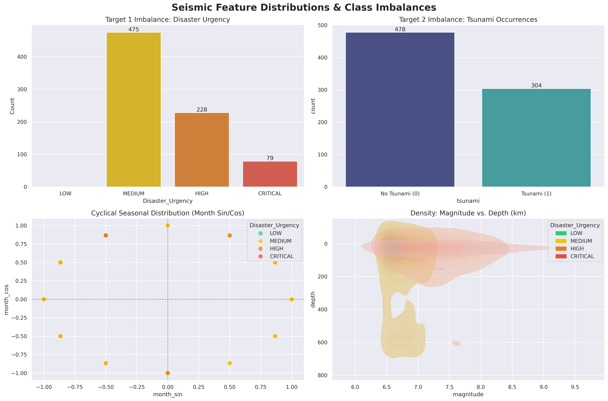
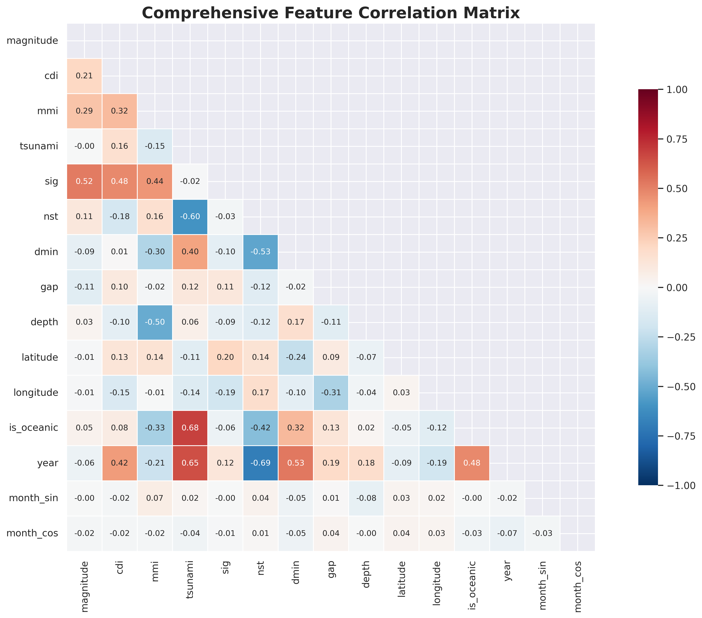

# Exploratory Data Analysis (EDA) & Feature Engineering
**Project:** AI Earthquake Emergency Response System

**Objective:**
This notebook conducts a rigorous Exploratory Data Analysis (EDA) on our historical seismic dataset. The goal is to clean missing values, engineer our primary target variable (`Disaster_Urgency`), and generate analytical visualizations to justify our Machine Learning strategy.


```python
import pandas as pd
import numpy as np
import matplotlib.pyplot as plt
import seaborn as sns
from sklearn.model_selection import train_test_split
from sklearn.preprocessing import StandardScaler
from imblearn.over_sampling import SMOTE
import warnings

warnings.filterwarnings('ignore')
sns.set_theme(style="darkgrid", palette="deep")
plt.rcParams.update({'figure.dpi': 300})

# 1. Load the Dataset
df = pd.read_csv('../data/earthquake_data.csv')
print(f"Initial Dataset Shape: {df.shape}")

# 2. Handle Missing Values Based on Project Strategy
# We impute 'alert' with 'none' as missing usually implies baseline risk[cite: 207].
if 'alert' in df.columns:
    df['alert'] = df['alert'].fillna('none')

# Missing continent/country often indicates oceanic earthquakes[cite: 208]. 
# We impute with 'Oceanic/Unknown' to preserve valuable seismic data[cite: 209].
if 'continent' in df.columns:
    df['continent'] = df['continent'].fillna('Oceanic/Unknown')
if 'country' in df.columns:
    df['country'] = df['country'].fillna('Oceanic/Unknown')

# Create 'is_oceanic' binary feature [cite: 211]
df['is_oceanic'] = np.where((df['country'] == 'Oceanic/Unknown') | (df['tsunami'] == 1), 1, 0)

# Drop any remaining trace NaNs in critical coordinate columns [cite: 210]
df.dropna(subset=['latitude', 'longitude', 'magnitude', 'depth'], inplace=True)
```

    Initial Dataset Shape: (782, 19)


```python
# 3. Extract Temporal Features (Cyclical Encoding)
# Converting standard datetime strings into cyclical mathematical features
if 'date_time' in df.columns: # Adjust column name to match your dataset (e.g., 'time' or 'date')
    df['parsed_date'] = pd.to_datetime(df['date_time'], errors='coerce')
    df.dropna(subset=['parsed_date'], inplace=True)
    
    df['year'] = df['parsed_date'].dt.year
    df['month'] = df['parsed_date'].dt.month
    
    # Cyclical encoding for months
    df['month_sin'] = np.sin(2 * np.pi * df['month'] / 12)
    df['month_cos'] = np.cos(2 * np.pi * df['month'] / 12)
    
    # Drop the original string date column
    df.drop(columns=['parsed_date', 'date_time', 'month'], inplace=True)

# 4. Engineer the Multiclass Target: Disaster_Urgency [cite: 199]
def categorize_urgency(sig):
    if sig < 400: return 'LOW'
    elif sig < 800: return 'MEDIUM'
    elif sig < 1200: return 'HIGH'
    else: return 'CRITICAL'

df['Disaster_Urgency'] = df['sig'].apply(categorize_urgency)
urgency_order = ['LOW', 'MEDIUM', 'HIGH', 'CRITICAL']
df['Disaster_Urgency'] = pd.Categorical(df['Disaster_Urgency'], categories=urgency_order, ordered=True)

# 5. Discard Sparse Categorical Properties
# Dropping high-cardinality text columns that bloat the model
cols_to_drop = ['title', 'location', 'net', 'magType'] 
df.drop(columns=[c for c in cols_to_drop if c in df.columns], inplace=True)

print(f"Cleaned Dataset Shape: {df.shape}")
df.head()
```

    Cleaned Dataset Shape: (782, 19)


<div>
<style scoped>
    .dataframe tbody tr th:only-of-type {
        vertical-align: middle;
    }

    .dataframe tbody tr th {
        vertical-align: top;
    }

    .dataframe thead th {
        text-align: right;
    }
</style>
<table border="1" class="dataframe">
  <thead>
    <tr style="text-align: right;">
      <th></th>
      <th>magnitude</th>
      <th>cdi</th>
      <th>mmi</th>
      <th>alert</th>
      <th>tsunami</th>
      <th>sig</th>
      <th>nst</th>
      <th>dmin</th>
      <th>gap</th>
      <th>depth</th>
      <th>latitude</th>
      <th>longitude</th>
      <th>continent</th>
      <th>country</th>
      <th>is_oceanic</th>
      <th>year</th>
      <th>month_sin</th>
      <th>month_cos</th>
      <th>Disaster_Urgency</th>
    </tr>
  </thead>
  <tbody>
    <tr>
      <th>0</th>
      <td>7.0</td>
      <td>8</td>
      <td>7</td>
      <td>green</td>
      <td>1</td>
      <td>768</td>
      <td>117</td>
      <td>0.509</td>
      <td>17.0</td>
      <td>14.000</td>
      <td>-9.7963</td>
      <td>159.596</td>
      <td>Oceania</td>
      <td>Solomon Islands</td>
      <td>1</td>
      <td>2022</td>
      <td>-0.5</td>
      <td>0.866025</td>
      <td>MEDIUM</td>
    </tr>
    <tr>
      <th>1</th>
      <td>6.9</td>
      <td>4</td>
      <td>4</td>
      <td>green</td>
      <td>0</td>
      <td>735</td>
      <td>99</td>
      <td>2.229</td>
      <td>34.0</td>
      <td>25.000</td>
      <td>-4.9559</td>
      <td>100.738</td>
      <td>Oceanic/Unknown</td>
      <td>Oceanic/Unknown</td>
      <td>1</td>
      <td>2022</td>
      <td>-0.5</td>
      <td>0.866025</td>
      <td>MEDIUM</td>
    </tr>
    <tr>
      <th>2</th>
      <td>7.0</td>
      <td>3</td>
      <td>3</td>
      <td>green</td>
      <td>1</td>
      <td>755</td>
      <td>147</td>
      <td>3.125</td>
      <td>18.0</td>
      <td>579.000</td>
      <td>-20.0508</td>
      <td>-178.346</td>
      <td>Oceania</td>
      <td>Fiji</td>
      <td>1</td>
      <td>2022</td>
      <td>-0.5</td>
      <td>0.866025</td>
      <td>MEDIUM</td>
    </tr>
    <tr>
      <th>3</th>
      <td>7.3</td>
      <td>5</td>
      <td>5</td>
      <td>green</td>
      <td>1</td>
      <td>833</td>
      <td>149</td>
      <td>1.865</td>
      <td>21.0</td>
      <td>37.000</td>
      <td>-19.2918</td>
      <td>-172.129</td>
      <td>Oceanic/Unknown</td>
      <td>Oceanic/Unknown</td>
      <td>1</td>
      <td>2022</td>
      <td>-0.5</td>
      <td>0.866025</td>
      <td>HIGH</td>
    </tr>
    <tr>
      <th>4</th>
      <td>6.6</td>
      <td>0</td>
      <td>2</td>
      <td>green</td>
      <td>1</td>
      <td>670</td>
      <td>131</td>
      <td>4.998</td>
      <td>27.0</td>
      <td>624.464</td>
      <td>-25.5948</td>
      <td>178.278</td>
      <td>Oceanic/Unknown</td>
      <td>Oceanic/Unknown</td>
      <td>1</td>
      <td>2022</td>
      <td>-0.5</td>
      <td>0.866025</td>
      <td>MEDIUM</td>
    </tr>
  </tbody>
</table>
</div>


```python
# --- DEEP EXPLORATORY DATA ANALYSIS ---
fig, axes = plt.subplots(2, 2, figsize=(18, 12))
fig.suptitle("Seismic Feature Distributions & Class Imbalances", fontsize=20, fontweight='bold', y=0.98)

# Chart 1: The Extreme Class Imbalance (Threat Level)
sns.countplot(ax=axes[0, 0], data=df, x='Disaster_Urgency', palette=['#2ecc71', '#f1c40f', '#e67e22', '#e74c3c'])
axes[0, 0].set_title("Target 1 Imbalance: Disaster Urgency", fontsize=14)
axes[0, 0].set_ylabel("Count")
for p in axes[0, 0].patches:
    axes[0, 0].annotate(f'{int(p.get_height())}', (p.get_x() + p.get_width() / 2., p.get_height()), ha='center', va='bottom')

# Chart 2: The Extreme Class Imbalance (Tsunami)
sns.countplot(ax=axes[0, 1], data=df, x='tsunami', palette='mako')
axes[0, 1].set_title("Target 2 Imbalance: Tsunami Occurrences", fontsize=14)
axes[0, 1].set_xticks([0, 1])
axes[0, 1].set_xticklabels(['No Tsunami (0)', 'Tsunami (1)'])
for p in axes[0, 1].patches:
    axes[0, 1].annotate(f'{int(p.get_height())}', (p.get_x() + p.get_width() / 2., p.get_height()), ha='center', va='bottom')

# Chart 3: Cyclical Temporal Distribution (Earthquakes over Months)
sns.scatterplot(ax=axes[1, 0], data=df, x='month_sin', y='month_cos', hue='Disaster_Urgency', 
                palette=['#2ecc71', '#f1c40f', '#e67e22', '#e74c3c'], s=100, alpha=0.7)
axes[1, 0].set_title("Cyclical Seasonal Distribution (Month Sin/Cos)", fontsize=14)
axes[1, 0].axhline(0, color='grey', linestyle='--', linewidth=1)
axes[1, 0].axvline(0, color='grey', linestyle='--', linewidth=1)

# Chart 4: Magnitude vs Depth KDE Plot (Where do severe quakes happen?)
sns.kdeplot(ax=axes[1, 1], data=df, x='magnitude', y='depth', hue='Disaster_Urgency', 
            palette=['#2ecc71', '#f1c40f', '#e67e22', '#e74c3c'], fill=True, alpha=0.5)
axes[1, 1].set_title("Density: Magnitude vs. Depth (km)", fontsize=14)
axes[1, 1].invert_yaxis() # Depth goes down

plt.tight_layout()
plt.show()
```


    

    


```python
# --- ADVANCED CORRELATION ANALYSIS ---
# Filter for numeric columns to prevent errors
numeric_df = df.select_dtypes(include=[np.number])

plt.figure(figsize=(14, 10))
corr = numeric_df.corr()
mask = np.triu(np.ones_like(corr, dtype=bool))

sns.heatmap(corr, mask=mask, annot=True, fmt=".2f", cmap='RdBu_r', 
            vmax=1, vmin=-1, center=0, square=True, linewidths=.5, 
            cbar_kws={"shrink": .75}, annot_kws={"size": 9})

plt.title('Comprehensive Feature Correlation Matrix', fontsize=18, fontweight='bold')
plt.tight_layout()
plt.show()
```


    

    


```python
# --- PREVENTING DATA LEAKAGE: SPLIT BEFORE SCALING ---
# We isolate metric/geographical features for scaling
metric_features = ['latitude', 'longitude', 'magnitude', 'depth', 'cdi', 'mmi', 'sig', 'gap', 'dmin', 'year', 'month_sin', 'month_cos']

# Ensure all selected features exist in the dataframe
metric_features = [f for f in metric_features if f in df.columns]

# Define Features (X) and Targets (y)
X = df[metric_features + ['is_oceanic']] # Include our engineered binary
y_threat = df['Disaster_Urgency']
y_tsunami = df['tsunami']

# 1. Train/Test Split (Stratify ensures representation of minority classes) [cite: 238]
X_train, X_test, y_train_th, y_test_th = train_test_split(X, y_threat, test_size=0.2, random_state=42, stratify=y_threat)
_, _, y_train_ts, y_test_ts = train_test_split(X, y_tsunami, test_size=0.2, random_state=42, stratify=y_tsunami)

# 2. Standard Scaling 
# Fitting the scaler ONLY on the training data prevents information leakage[cite: 236].
scaler = StandardScaler()

# Scale only the continuous metric features
X_train_scaled = X_train.copy()
X_test_scaled = X_test.copy()

X_train_scaled[metric_features] = scaler.fit_transform(X_train[metric_features])
X_test_scaled[metric_features] = scaler.transform(X_test[metric_features])

print("Data Split & Scaled Successfully.")
print(f"Training Set: {X_train_scaled.shape[0]} records")
print(f"Testing Set: {X_test_scaled.shape[0]} records")
```

    Data Split & Scaled Successfully.
    Training Set: 625 records
    Testing Set: 157 records


```python
# --- HANDLING EXTREME CLASS IMBALANCES WITH SMOTE ---
# Applied strictly to the training sets to prevent bleeding synthetic data into validation[cite: 236].

smote = SMOTE(random_state=42)

# 1. SMOTE for Multiclass Threat Target
print("--- DISASTER URGENCY (THREAT) IMBALANCE ---")
print("Before SMOTE:")
print(y_train_th.value_counts())

X_train_th_sm, y_train_th_sm = smote.fit_resample(X_train_scaled, y_train_th)

print("\nAfter SMOTE:")
print(y_train_th_sm.value_counts())

# 2. SMOTE for Binary Tsunami Target
print("\n--- TSUNAMI IMBALANCE ---")
print("Before SMOTE:")
print(y_train_ts.value_counts())

X_train_ts_sm, y_train_ts_sm = smote.fit_resample(X_train_scaled, y_train_ts)

print("\nAfter SMOTE:")
print(y_train_ts_sm.value_counts())

# The data is now perfectly formatted, scaled, and balanced for model training.
```

    --- DISASTER URGENCY (THREAT) IMBALANCE ---
    Before SMOTE:
    Disaster_Urgency
    MEDIUM      380
    HIGH        182
    CRITICAL     63
    LOW           0
    Name: count, dtype: int64
    
    After SMOTE:
    Disaster_Urgency
    MEDIUM      380
    HIGH        380
    CRITICAL    380
    LOW           0
    Name: count, dtype: int64
    
    --- TSUNAMI IMBALANCE ---
    Before SMOTE:
    tsunami
    0    382
    1    243
    Name: count, dtype: int64
    
    After SMOTE:
    tsunami
    0    382
    1    382
    Name: count, dtype: int64


```python
# CHART 4: Geospatial Heatmap
# This proves the existence of "Seismic Hotspots" (The Ring of Fire) to justify your K-Means clustering.

print("Generating Interactive Global Seismic Heatmap...")
map_center = [df['latitude'].mean(), df['longitude'].mean()]
world_map = folium.Map(location=map_center, zoom_start=2, tiles='CartoDB dark_matter')

# Filter for medium to severe earthquakes for a cleaner map
severe_quakes = df[df['magnitude'] >= 5.5]

heat_data = severe_quakes[['latitude', 'longitude', 'magnitude']].values.tolist()

plugins.HeatMap(
    heat_data, 
    min_opacity=0.4,
    radius=15, 
    blur=10, 
    max_zoom=1
).add_to(world_map)

# Display the map in the notebook
world_map
```

    Generating Interactive Global Seismic Heatmap...


<div style="width:100%;"><div style="position:relative;width:100%;height:0;padding-bottom:60%;"><span style="color:#565656">Make this Notebook Trusted to load map: File -> Trust Notebook</span><iframe srcdoc="&lt;!DOCTYPE html&gt;
&lt;html&gt;
&lt;head&gt;

    &lt;meta http-equiv=&quot;content-type&quot; content=&quot;text/html; charset=UTF-8&quot; /&gt;
    &lt;script src=&quot;https://cdn.jsdelivr.net/npm/leaflet@1.9.3/dist/leaflet.js&quot;&gt;&lt;/script&gt;
    &lt;script src=&quot;https://code.jquery.com/jquery-3.7.1.min.js&quot;&gt;&lt;/script&gt;
    &lt;script src=&quot;https://cdn.jsdelivr.net/npm/bootstrap@5.2.2/dist/js/bootstrap.bundle.min.js&quot;&gt;&lt;/script&gt;
    &lt;script src=&quot;https://cdnjs.cloudflare.com/ajax/libs/Leaflet.awesome-markers/2.0.2/leaflet.awesome-markers.js&quot;&gt;&lt;/script&gt;
    &lt;link rel=&quot;stylesheet&quot; href=&quot;https://cdn.jsdelivr.net/npm/leaflet@1.9.3/dist/leaflet.css&quot;/&gt;
    &lt;link rel=&quot;stylesheet&quot; href=&quot;https://cdn.jsdelivr.net/npm/bootstrap@5.2.2/dist/css/bootstrap.min.css&quot;/&gt;
    &lt;link rel=&quot;stylesheet&quot; href=&quot;https://netdna.bootstrapcdn.com/bootstrap/3.0.0/css/bootstrap-glyphicons.css&quot;/&gt;
    &lt;link rel=&quot;stylesheet&quot; href=&quot;https://cdn.jsdelivr.net/npm/@fortawesome/fontawesome-free@6.2.0/css/all.min.css&quot;/&gt;
    &lt;link rel=&quot;stylesheet&quot; href=&quot;https://cdnjs.cloudflare.com/ajax/libs/Leaflet.awesome-markers/2.0.2/leaflet.awesome-markers.css&quot;/&gt;
    &lt;link rel=&quot;stylesheet&quot; href=&quot;https://cdn.jsdelivr.net/gh/python-visualization/folium/folium/templates/leaflet.awesome.rotate.min.css&quot;/&gt;

            &lt;meta name=&quot;viewport&quot; content=&quot;width=device-width,
                initial-scale=1.0, maximum-scale=1.0, user-scalable=no&quot; /&gt;
            &lt;style&gt;
                #map_17c9f7eba5240d7f00c2ec74bf0f9ceb {
                    position: relative;
                    width: 100.0%;
                    height: 100.0%;
                    left: 0.0%;
                    top: 0.0%;
                }
                .leaflet-container { font-size: 1rem; }
            &lt;/style&gt;

            &lt;style&gt;html, body {
                width: 100%;
                height: 100%;
                margin: 0;
                padding: 0;
            }
            &lt;/style&gt;

            &lt;style&gt;#map {
                position:absolute;
                top:0;
                bottom:0;
                right:0;
                left:0;
                }
            &lt;/style&gt;

            &lt;script&gt;
                L_NO_TOUCH = false;
                L_DISABLE_3D = false;
            &lt;/script&gt;


    &lt;script src=&quot;https://cdn.jsdelivr.net/gh/python-visualization/folium@main/folium/templates/leaflet_heat.min.js&quot;&gt;&lt;/script&gt;
&lt;/head&gt;
&lt;body&gt;


            &lt;div class=&quot;folium-map&quot; id=&quot;map_17c9f7eba5240d7f00c2ec74bf0f9ceb&quot; &gt;&lt;/div&gt;

&lt;/body&gt;
&lt;script&gt;


            var map_17c9f7eba5240d7f00c2ec74bf0f9ceb = L.map(
                &quot;map_17c9f7eba5240d7f00c2ec74bf0f9ceb&quot;,
                {
                    center: [3.5380998721227614, 52.609199360613815],
                    crs: L.CRS.EPSG3857,
                    ...{
  &quot;zoom&quot;: 2,
  &quot;zoomControl&quot;: true,
  &quot;preferCanvas&quot;: false,
}

                }
            );


            var tile_layer_6232ed3369b7c81be8cc3c62e6991c88 = L.tileLayer(
                &quot;https://{s}.basemaps.cartocdn.com/dark_all/{z}/{x}/{y}{r}.png&quot;,
                {
  &quot;minZoom&quot;: 0,
  &quot;maxZoom&quot;: 20,
  &quot;maxNativeZoom&quot;: 20,
  &quot;noWrap&quot;: false,
  &quot;attribution&quot;: &quot;\u0026copy; \u003ca href=\&quot;https://www.openstreetmap.org/copyright\&quot;\u003eOpenStreetMap\u003c/a\u003e contributors \u0026copy; \u003ca href=\&quot;https://carto.com/attributions\&quot;\u003eCARTO\u003c/a\u003e&quot;,
  &quot;subdomains&quot;: &quot;abcd&quot;,
  &quot;detectRetina&quot;: false,
  &quot;tms&quot;: false,
  &quot;opacity&quot;: 1,
}

            );


            tile_layer_6232ed3369b7c81be8cc3c62e6991c88.addTo(map_17c9f7eba5240d7f00c2ec74bf0f9ceb);


            var heat_map_32e83de85d9015f34fc595586081262a = L.heatLayer(
                [[-9.7963, 159.596, 7.0], [-4.9559, 100.738, 6.9], [-20.0508, -178.346, 7.0], [-19.2918, -172.129, 7.3], [-25.5948, 178.278, 6.6], [-26.0442, 178.381, 7.0], [-25.9678, 178.363, 6.8], [7.6712, -82.3396, 6.7], [18.33, -102.913, 6.8], [18.3667, -103.252, 7.6], [23.1444, 121.307, 6.9], [23.029, 121.348, 6.5], [-21.2077, 170.239, 7.0], [-6.2237, 146.471, 7.6], [29.7263, 102.279, 6.6], [-32.6922, -178.959, 6.6], [17.5978, 120.809, 7.0], [-9.0618, -71.1647, 6.5], [-14.8628, -70.3081, 7.2], [-54.1325, 159.027, 6.9], [-23.6141, -66.7236, 6.8], [11.5538, -86.9919, 6.6], [-22.5732, 170.349, 7.0], [-22.72, 170.277, 6.9], [23.3421, 121.636, 6.7], [37.7015, 141.587, 7.3], [-0.6831, 98.6034, 6.7], [-30.0528, -177.74, 6.6], [-23.7852, -179.968, 6.8], [-4.455, -76.9395, 6.5], [-29.535, -176.729, 6.5], [-6.9291, 105.251, 6.6], [52.502, -168.08, 6.5], [52.502, -168.08, 6.5], [52.6252, -168.15, 6.6], [52.48, -167.736, 6.7], [52.48, -167.736, 6.7], [52.6563, -167.917, 6.8], [35.1456, 31.9095, 6.6], [37.8167, 101.299, 6.6], [-7.5924, 127.581, 7.3], [-7.6033, 122.2, 7.3], [-4.4898, -76.8461, 7.5], [23.5414, 126.48, 6.6], [56.2581, -156.492, 6.9], [-21.1704, 174.54, 6.9], [-21.1036, 174.895, 7.3], [12.1598, -87.8542, 6.5], [16.9502, -99.7877, 7.0], [-60.3026, -24.9992, 7.1], [-60.1023, -24.4608, 6.6], [-14.892, 167.085, 6.9], [-58.3814, -23.3318, 6.9], [18.3521, -73.4804, 7.2], [55.2364, -157.707, 6.9], [55.2657, -157.68, 6.9], [-58.4157, -25.3206, 8.1], [-57.5959, -25.1874, 7.5], [6.4547, 126.742, 7.1], [55.4742, -157.917, 8.2], [55.3154, -157.829, 8.2], [13.6989, 120.713, 6.7], [7.5904, -82.8813, 6.7], [-30.2144, -177.773, 6.5], [-16.4796, -177.356, 6.5], [34.5861, 98.2551, 7.3], [0.1684, 96.6475, 6.7], [-17.2495, 66.3745, 6.7], [38.2296, 141.665, 6.9], [-21.6857, -177.064, 6.5], [-18.9204, -176.235, 6.5], [38.4752, 141.607, 7.0], [54.7018, 163.208, 6.6], [-28.4792, -176.619, 6.5], [-29.7466, -177.224, 8.1], [-29.6131, -177.842, 7.4], [-37.596, 179.544, 7.3], [37.6856, 141.992, 7.1], [-23.2787, 171.489, 7.7], [-61.8484, -55.559, 6.9], [5.0074, 127.517, 7.0], [51.2407, 100.443, 6.7], [-39.3264, -74.9067, 6.7], [37.8973, 26.7953, 7.0], [54.662, -159.675, 7.6], [0.9604, -26.8332, 6.9], [-27.9285, -71.3937, 6.5], [-28.013, -71.1958, 6.8], [0.8696, -29.7046, 6.5], [-6.6704, 123.493, 6.9], [-4.2791, 101.215, 6.9], [-4.3724, 101.095, 6.8], [12.0065, 124.13, 6.6], [55.1079, -158.477, 7.8], [-7.847, 147.755, 7.0], [-5.6368, 110.678, 6.6], [15.9163, -95.9533, 7.4], [-33.2938, -177.838, 7.4], [28.9386, 128.262, 6.6], [-23.2966, -68.4204, 6.8], [38.1689, -117.85, 6.5], [-12.0662, 166.648, 6.6], [-6.7762, 129.785, 6.8], [34.1818, 25.7101, 6.5], [44.4646, -115.118, 6.5], [48.9638, 157.695, 7.5], [45.6161, 148.959, 7.0], [19.4193, -78.756, 7.7], [38.4312, 39.0609, 6.7], [6.6969, 125.174, 6.8], [1.6213, 126.416, 7.1], [-21.9449, -179.511, 6.5], [-18.5747, -175.272, 6.6], [6.9098, 125.178, 6.5], [6.7567, 125.008, 6.6], [-35.4758, -73.163, 6.7], [-3.4528, 128.37, 6.5], [-20.3641, -178.57, 6.6], [-60.2152, -26.5801, 6.6], [-7.2822, 104.791, 6.9], [-34.2364, -72.3102, 6.8], [-16.1985, 167.998, 6.6], [-0.5858, 128.034, 7.2], [-18.2242, 120.358, 6.6], [0.5126, 126.189, 6.9], [35.7695, -117.599, 7.1], [-6.4078, 129.169, 7.3], [-30.6441, -178.1, 7.3], [13.1994, -89.3056, 6.6], [-5.8119, -75.2697, 8.0], [-4.051, 152.597, 7.6], [-6.9746, 146.449, 7.1], [-1.8146, 122.58, 6.8], [-58.6262, -25.304, 6.5], [-14.7131, -70.1546, 7.0], [-2.1862, -77.0505, 7.5], [14.6802, -92.4527, 6.7], [-43.1219, 42.3568, 6.7], [-30.0404, -71.3815, 6.7], [-13.336, 166.875, 6.6], [2.258, 126.758, 6.6], [-8.144, -71.587, 6.8], [5.8983, 126.921, 7.0], [55.0999, 164.699, 7.3], [-58.5446, -26.3856, 7.1], [-22.0629, 169.733, 6.6], [-21.9496, 169.427, 7.5], [61.3464, -149.955, 7.1], [-17.8735, -178.927, 6.8], [71.6312, -11.2431, 6.7], [37.5203, 20.5565, 6.8], [49.297, -129.724, 6.5], [49.3346, -129.289, 6.8], [49.2586, -129.412, 6.5], [-21.7427, 169.522, 6.5], [52.8549, 153.243, 6.7], [49.2902, 156.297, 6.5], [-5.7012, 151.205, 7.0], [-18.3604, -178.063, 6.7], [-0.2559, 119.846, 7.5], [-25.415, 178.199, 6.5], [-31.7447, -179.373, 6.9], [-10.0207, 161.503, 6.5], [-18.4743, 179.35, 7.9], [42.6861, 141.929, 6.6], [-22.0295, 170.126, 7.1], [-11.0355, -70.8284, 7.1], [-16.0315, 168.143, 6.5], [10.7731, -62.9019, 7.3], [-8.319, 116.627, 6.9], [-18.1125, -178.153, 8.2], [-7.3718, 119.802, 6.5], [51.4234, -178.026, 6.5], [-8.2581, 116.438, 6.9], [19.3182, -155.0, 6.9], [-20.6588, -63.0058, 6.8], [-5.5321, 151.5, 6.9], [-5.5024, 151.402, 6.7], [-4.3762, 153.2, 6.8], [-6.3043, 142.612, 6.7], [-6.0699, 142.754, 7.5], [16.3855, -97.9787, 7.2], [56.0039, -149.166, 7.9], [-15.7675, -74.7092, 7.1], [17.4825, -83.52, 7.5], [-7.4921, 108.174, 6.5], [-54.2189, 2.1628, 6.5], [-21.3246, 168.671, 7.0], [-21.5027, 168.598, 6.6], [9.5147, -84.4865, 6.5], [34.9109, 45.9592, 7.3], [-4.2433, 143.485, 6.5], [-15.3197, -173.168, 6.8], [-21.6484, 168.859, 6.6], [-21.6971, 169.148, 6.7], [-7.2168, 123.074, 6.7], [52.3909, 176.769, 6.5], [18.5499, -98.4887, 7.1], [15.0222, -93.8993, 8.2], [33.1926, 103.855, 6.5], [36.9293, 27.4139, 6.6], [54.4434, 168.857, 7.7], [-49.4837, 164.016, 6.6], [11.1269, 124.629, 6.5], [13.7174, -90.9718, 6.8], [14.9091, -92.0092, 6.9], [54.0312, 170.92, 6.8], [-1.2923, 120.431, 6.6], [-56.414, -25.7432, 6.5], [-14.5884, 167.377, 6.8], [5.5043, 125.066, 6.9], [-33.0375, -72.0617, 6.9], [-22.6784, 25.1558, 6.5], [56.9401, 162.786, 6.6], [-23.2593, -178.804, 6.9], [-19.2814, -63.9047, 6.5], [9.9071, 125.452, 6.5], [-6.2464, 155.172, 7.9], [-10.3506, 161.335, 6.5], [4.4782, 122.617, 7.3], [-19.3733, 176.052, 6.9], [-43.4064, -73.9413, 7.6], [-7.5082, 127.921, 6.7], [-4.5049, 153.522, 7.9], [-10.749, 161.132, 6.9], [-10.8416, 161.314, 6.5], [-10.6812, 161.327, 7.8], [40.4535, -126.194, 6.6], [5.2834, 96.1678, 6.5], [39.2732, 73.9776, 6.6], [11.9097, -88.8968, 6.9], [37.3931, 141.387, 6.9], [-42.6058, 173.254, 6.5], [-42.3205, 173.669, 6.5], [-42.7373, 173.054, 7.8], [42.8621, 13.0961, 6.6], [-4.8626, 108.163, 6.6], [-6.0033, 148.887, 6.8], [-19.7819, -178.244, 6.9], [-37.3586, 179.146, 7.0], [-3.6849, 152.792, 6.8], [20.9228, 94.569, 6.8], [-22.4765, 173.117, 7.2], [18.5429, 145.507, 7.7], [-2.0967, 100.665, 6.6], [-56.2409, -26.9353, 7.2], [-21.9724, -178.204, 6.9], [0.4947, -79.616, 6.9], [0.4261, -79.7899, 6.7], [-16.0429, 167.379, 7.0], [0.3819, -79.9218, 7.8], [32.7906, 130.754, 7.0], [23.0944, 94.8654, 6.9], [36.4725, 71.1311, 6.6], [-13.9805, 166.594, 6.7], [-14.0683, 166.624, 6.7], [-14.3235, 166.855, 6.9], [-4.9521, 94.3299, 7.8], [53.9776, 158.546, 7.2], [59.6204, -153.339, 7.1], [18.8239, -106.934, 6.6], [41.9723, 142.781, 6.7], [3.8965, 126.862, 6.5], [24.8036, 93.6505, 6.7], [15.8015, -93.633, 6.6], [-4.1064, 129.508, 6.9], [38.2107, 72.7797, 7.2], [-9.1825, -71.2574, 6.7], [-10.0598, -71.0184, 7.6], [-10.5372, -70.9437, 7.6], [-8.8994, 158.422, 6.8], [38.67, 20.6, 6.5], [31.0009, 128.873, 6.7], [-29.5097, -72.0585, 6.9], [-29.5067, -72.0068, 6.9], [6.8431, 94.648, 6.6], [-30.8796, -71.4519, 6.8], [-8.3381, 124.875, 6.5], [36.5244, 70.3676, 7.5], [-14.8595, 167.303, 7.1], [-0.6212, 131.262, 6.6], [-31.7275, -71.3792, 6.6], [-31.5173, -71.804, 6.7], [-31.4244, -71.6876, 6.5], [-31.5622, -71.4262, 7.0], [-31.5729, -71.6744, 8.3], [24.913, -109.623, 6.7], [-9.3293, 157.877, 6.5], [-9.3438, 158.053, 6.6], [-2.6286, 138.528, 7.0], [52.376, -169.446, 6.9], [-10.4012, 165.141, 7.0], [13.8672, -58.5479, 6.5], [-9.307, 158.403, 6.7], [27.7375, 139.725, 6.5], [27.8386, 140.493, 7.8], [56.594, -156.43, 6.8], [-11.1093, 163.215, 6.8], [-11.0559, 163.696, 6.9], [-10.8759, 164.169, 6.8], [38.9056, 142.032, 6.8], [27.8087, 86.0655, 7.3], [-7.2175, 154.557, 7.1], [-5.4624, 151.875, 7.5], [-5.2005, 151.777, 6.8], [-5.375, 151.771, 6.7], [27.7711, 86.0173, 6.7], [28.2244, 84.8216, 6.6], [28.2305, 84.7314, 7.8], [-15.8815, -178.6, 6.5], [-15.4994, -173.029, 6.5], [-4.7294, 152.562, 7.5], [-7.2968, 122.535, 7.0], [39.8558, 142.881, 6.7], [-23.1125, -66.688, 6.7], [-17.0309, 168.52, 6.8], [5.9045, -82.6576, 6.5], [7.9401, -82.6865, 6.6], [-6.5108, 154.46, 6.6], [6.1572, 123.126, 6.6], [1.9604, 126.575, 6.8], [2.2999, 127.056, 6.5], [-37.6478, 179.662, 6.7], [1.8929, 126.522, 7.1], [-5.9873, 148.232, 6.6], [-19.6903, -177.759, 7.1], [12.5262, -88.1225, 7.3], [13.7641, 144.429, 6.7], [-14.598, -73.5714, 6.8], [0.8295, 146.169, 6.9], [-19.8015, -178.4, 6.9], [37.0052, 142.452, 6.5], [14.724, -92.4614, 6.9], [-6.2304, 152.807, 6.5], [-14.9831, -175.51, 6.7], [-55.4703, -28.3669, 6.9], [51.8486, 178.735, 7.9], [-29.9414, -177.607, 6.7], [-29.9379, -177.516, 6.5], [-29.9772, -177.725, 6.9], [40.2893, 25.3889, 6.9], [7.2096, -82.3045, 6.5], [-21.4542, 170.355, 6.6], [49.6388, -127.732, 6.5], [-6.7547, 155.024, 7.5], [-6.6558, 155.087, 6.6], [17.397, -100.972, 7.2], [-11.1284, 162.052, 6.6], [-11.4633, 162.051, 7.4], [-11.2701, 162.148, 7.6], [11.642, -85.8779, 6.6], [-6.7878, 154.95, 6.5], [-6.5858, 155.048, 7.1], [-20.5709, -70.4931, 7.7], [-20.3113, -70.5756, 6.5], [-19.8927, -70.9455, 6.9], [-19.6097, -70.7691, 8.2], [-19.9807, -70.7022, 6.7], [40.8287, -125.134, 6.8], [27.4312, 127.367, 6.5], [14.6682, -58.9272, 6.5], [35.9053, 82.5864, 6.9], [-15.0691, 167.372, 6.5], [-32.9076, -177.881, 6.5], [-13.8633, 167.249, 6.5], [-17.1171, -176.545, 6.5], [-60.2738, -46.4011, 7.7], [-60.2627, -47.0621, 6.9], [-30.2921, -71.5215, 6.6], [37.1557, 144.661, 7.1], [26.0913, -110.321, 6.6], [-6.4456, 154.931, 6.8], [9.8796, 124.117, 7.1], [35.5142, 23.2523, 6.6], [53.1995, 152.786, 6.7], [-30.9255, -178.323, 6.5], [27.1825, 65.5052, 6.8], [-15.8385, -74.5112, 7.1], [26.951, 65.5009, 7.7], [51.5573, -174.767, 6.5], [29.9377, 138.833, 6.5], [-7.44, 128.221, 6.5], [51.537, -175.23, 7.0], [-41.734, 174.152, 6.5], [5.7732, -78.1999, 6.7], [-41.704, 174.337, 6.5], [-60.857, -25.07, 7.3], [-6.029, 149.706, 6.6], [-3.917, 153.927, 7.3], [10.701, -42.594, 6.6], [11.763, -86.926, 6.5], [-10.004, 107.236, 6.7], [52.235, 151.444, 6.7], [54.892, 153.221, 8.3], [-23.009, -177.232, 7.4], [18.728, 145.288, 6.8], [-3.898, 152.127, 6.5], [30.308, 102.888, 6.6], [46.221, 150.788, 7.2], [-3.214, 142.542, 6.6], [28.033, 61.996, 7.7], [-6.475, 154.607, 6.6], [-3.517, 138.476, 7.0], [-6.598, 148.174, 6.5], [50.958, 157.408, 6.5], [50.954, 157.283, 6.9], [67.631, 142.508, 6.6], [-10.994, 165.741, 6.6], [1.135, -77.393, 6.9], [-10.928, 166.018, 7.1], [-10.838, 165.969, 6.8], [-10.997, 165.655, 6.7], [-10.499, 165.588, 7.0], [-11.183, 164.882, 7.1], [-10.799, 165.114, 8.0], [42.77, 143.092, 6.9], [-28.094, -70.653, 6.8], [55.228, -134.859, 7.5], [-14.344, 167.286, 6.7], [-6.533, 129.825, 7.1], [37.89, 143.949, 7.3], [14.129, -92.164, 6.5], [23.005, 95.885, 6.8], [13.988, -91.895, 7.4], [52.788, -132.101, 7.8], [10.086, -85.298, 6.5], [-4.892, 134.03, 6.6], [1.929, -76.362, 7.3], [10.085, -85.315, 7.6], [10.811, 126.638, 7.6], [12.139, -88.59, 7.3], [2.19, 126.837, 6.6], [49.8, 145.064, 7.7], [-4.651, 153.173, 6.5], [-18.685, -174.705, 6.6], [-1.617, 134.276, 6.7], [-5.462, 147.117, 6.8], [-32.625, -71.365, 6.7], [28.696, -113.104, 7.0], [18.229, -102.689, 6.5], [0.802, 92.463, 8.2], [2.327, 93.063, 8.6], [-35.2, -72.217, 7.1], [-6.242, 145.955, 6.6], [16.493, -98.231, 7.4], [51.708, 95.991, 6.7], [9.999, 123.206, 6.7], [-17.827, 167.133, 7.1], [2.433, 93.21, 7.2], [51.842, 95.911, 6.6], [-7.551, 146.809, 7.1], [17.986, -99.789, 6.5], [-14.438, -75.966, 6.9], [38.721, 43.508, 7.1], [-6.57, 147.881, 6.5], [27.73, 88.155, 6.9], [40.273, 142.779, 6.7], [2.965, 97.893, 6.7], [-20.671, 169.716, 7.0], [-7.641, -74.525, 7.0], [-18.311, 168.218, 7.1], [-18.308, 168.156, 6.5], [-18.365, 168.143, 7.2], [-3.518, 144.828, 6.6], [-29.539, -176.34, 7.6], [39.955, 142.205, 6.7], [-20.244, 168.226, 6.8], [-10.375, 161.2, 6.8], [37.001, 140.401, 6.6], [38.276, 141.588, 7.1], [17.208, -94.338, 6.6], [20.687, 99.822, 6.9], [39.241, 142.463, 6.6], [36.166, 141.562, 6.5], [38.058, 144.59, 7.7], [36.281, 141.111, 7.9], [38.297, 142.373, 9.1], [38.435, 142.842, 7.3], [-35.38, -72.834, 6.7], [-36.422, -72.96, 6.9], [28.777, 63.951, 7.2], [-20.628, 168.471, 7.0], [-38.355, -73.326, 7.2], [-19.702, 167.947, 7.3], [28.412, 59.18, 6.7], [-6.001, 149.977, 6.6], [-3.487, 100.082, 7.8], [24.696, -109.156, 6.7], [-4.963, 133.76, 7.0], [-43.522, 171.83, 7.0], [-1.266, -77.306, 7.1], [-17.541, 168.069, 7.3], [-5.746, 150.765, 7.0], [-5.486, 146.822, 6.5], [6.497, 123.48, 7.6], [-5.931, 150.59, 7.3], [-5.966, 150.428, 6.9], [-38.067, -73.31, 6.6], [-10.627, 161.447, 6.7], [-2.329, 136.484, 6.6], [-2.174, 136.543, 7.0], [7.881, 91.936, 7.5], [-13.698, 166.643, 7.2], [3.748, 96.018, 7.2], [33.165, 96.548, 6.9], [-10.878, 161.116, 6.9], [2.383, 97.048, 7.8], [32.2862, -115.295, 7.2], [13.667, 92.831, 6.6], [-36.217, -73.257, 6.7], [37.745, 141.59, 6.5], [-34.326, -71.799, 7.0], [-34.29, -71.891, 6.9], [-3.762, 100.991, 6.8], [-36.665, -73.374, 6.6], [-13.571, 167.227, 6.5], [-37.773, -75.048, 7.4], [-36.122, -72.898, 8.8], [25.93, 128.425, 7.0], [18.443, -72.571, 7.0], [40.652, -124.692, 6.5], [-9.019, 157.551, 6.8], [-8.783, 157.354, 7.1], [-8.726, 157.487, 6.6], [-19.394, -70.321, 6.5], [-17.239, 178.331, 7.3], [-8.207, 118.631, 6.6], [29.218, 129.782, 6.8], [-6.133, 130.385, 6.9], [-13.298, 165.91, 6.8], [-13.093, 166.497, 7.4], [-12.517, 166.382, 7.8], [-13.006, 166.51, 7.7], [-2.482, 101.524, 6.6], [-0.72, 99.867, 7.6], [-15.489, -172.095, 8.1], [-7.782, 107.297, 7.0], [-1.479, 99.49, 6.7], [32.821, 140.395, 6.6], [14.099, 92.902, 7.5], [33.167, 137.944, 7.1], [29.039, -112.903, 6.9], [-45.762, 166.562, 7.8], [-5.157, 153.782, 6.7], [16.731, -86.217, 7.3], [-23.043, -174.66, 7.6], [3.886, 126.387, 7.2], [-0.691, 133.305, 7.4], [36.419, 70.743, 6.6], [-0.414, 132.885, 7.7], [1.271, 122.091, 7.4], [14.423, -92.364, 6.7], [39.533, 73.824, 6.7], [41.892, 143.754, 6.8], [1.885, 127.363, 6.6], [-13.501, 166.967, 6.9], [30.901, 83.52, 6.7], [39.802, 141.464, 6.8], [37.552, 142.214, 7.0], [37.55, 142.714, 6.9], [11.005, 91.824, 6.6], [39.03, 140.881, 6.9], [31.002, 103.322, 7.9], [36.164, 141.526, 6.9], [-20.071, 168.892, 7.3], [35.49, 81.467, 7.2], [13.351, 125.63, 6.9], [-2.245, 99.808, 6.7], [-2.332, 99.891, 6.6], [-2.486, 99.972, 7.2], [-2.405, 99.931, 6.5], [2.768, 95.964, 7.4], [36.345, 21.863, 6.5], [36.501, 21.67, 6.9], [16.357, -94.304, 6.5], [-39.011, 178.291, 6.6], [-22.954, -70.182, 6.7], [14.944, -61.274, 7.4], [-10.95, 162.149, 6.6], [-8.224, 118.467, 6.5], [-8.292, 118.37, 6.5], [-5.757, 147.098, 6.8], [-2.312, -77.838, 6.8], [-22.925, -70.237, 6.8], [-22.247, -69.89, 7.7], [-3.899, 101.02, 6.8], [-44.796, 167.553, 6.8], [-4.99, 153.5, 6.8], [-1.999, 100.141, 6.7], [-2.13, 99.627, 7.0], [-1.689, 99.668, 6.5], [-2.625, 100.841, 7.9], [-2.52, 100.139, 7.8], [-4.438, 101.367, 8.4], [2.966, -77.963, 6.8], [-11.61, 165.762, 7.2], [-9.834, 159.465, 6.5], [-13.386, -76.603, 8.0], [-5.859, 107.419, 7.5], [-15.595, 167.68, 7.2], [2.872, 127.464, 6.9], [36.808, 134.85, 6.8], [37.535, 138.446, 6.6], [13.554, -90.618, 6.7], [-7.306, 155.741, 6.9], [-7.169, 155.777, 6.6], [-8.466, 157.043, 8.1], [37.336, 136.588, 6.7], [-20.617, 169.357, 7.1], [-1.034, 126.976, 6.7], [1.065, 126.282, 7.5], [46.243, 154.524, 8.1], [21.974, 120.493, 6.9], [21.799, 120.547, 7.1], [46.592, 153.266, 8.3], [-6.482, 151.195, 6.6], [-13.457, -76.677, 6.7], [-5.881, 150.982, 6.7], [19.877, -155.935, 6.7], [-16.592, -172.033, 6.9], [-6.759, 155.512, 6.8], [51.148, 157.522, 6.5], [-15.798, 167.789, 6.8], [-9.284, 107.419, 7.7], [-5.724, 151.133, 6.5], [60.772, 165.743, 6.6], [0.093, 97.05, 6.8], [-20.187, -174.123, 8.0], [-19.99, -173.907, 8.0], [-27.211, -71.056, 6.5], [-27.017, -71.022, 6.7], [60.491, 167.516, 6.6], [60.949, 167.089, 7.6], [-16.527, 176.989, 6.5], [-3.595, 127.214, 6.7], [-21.324, 33.583, 7.0], [36.311, 23.212, 6.7], [28.164, -112.117, 6.6], [36.357, 71.093, 6.5], [-6.224, 29.83, 6.8], [38.089, 142.122, 6.5], [2.164, 96.786, 6.5], [-22.361, -67.895, 6.8], [34.539, 73.588, 7.6], [-5.437, 151.84, 6.6], [-5.678, -76.398, 7.5], [-4.539, 153.474, 7.6], [38.276, 142.039, 7.2], [7.92, 92.19, 7.2], [1.819, 97.082, 6.7], [11.245, -86.172, 6.6], [41.292, -125.953, 7.2], [-19.987, -69.197, 7.8], [1.989, 97.041, 6.9], [0.587, 98.459, 6.7], [-1.714, 99.779, 6.5], [-1.644, 99.607, 6.7], [2.085, 97.108, 8.6], [33.807, 130.131, 6.6], [-6.527, 129.933, 7.1], [2.908, 95.592, 6.8], [-5.562, 122.129, 6.5], [4.756, 126.421, 6.5], [-14.252, 167.259, 6.7], [5.293, 123.337, 7.1], [34.064, 141.491, 6.6], [8.879, 92.375, 6.6], [6.91, 92.958, 7.2], [3.295, 95.982, 9.1], [-49.312, 161.345, 8.1], [18.958, -81.409, 6.8], [42.9, 145.228, 6.8], [43.006, 145.119, 7.0], [-3.609, 135.404, 7.1], [-46.676, 164.721, 7.1], [4.695, -77.508, 7.2], [-8.152, 124.868, 7.5], [-11.128, 162.208, 6.7], [49.277, -128.772, 6.7], [37.226, 138.779, 6.6], [24.53, 122.694, 6.7], [11.422, -86.665, 7.0], [13.925, 120.534, 6.5], [-10.951, 162.161, 6.8], [33.205, 137.227, 6.6], [33.184, 137.071, 7.4], [33.07, 136.618, 7.2], [-35.173, -70.525, 6.5], [-0.443, 133.091, 6.5], [55.682, 160.003, 6.9], [-37.695, -73.406, 6.6], [-9.362, 122.839, 6.7], [-13.174, 167.198, 6.5], [36.512, 71.029, 6.6], [-3.665, 135.339, 6.7], [-4.003, 135.023, 7.3], [-3.615, 135.538, 7.0], [-3.12, 127.4, 6.7], [-22.015, 169.766, 7.3], [28.995, 58.311, 6.6], [8.416, -82.824, 6.5], [35.7005, -121.101, 6.5], [23.039, 121.362, 6.8], [-5.581, 150.88, 6.6], [12.025, 125.416, 6.5], [-19.262, 168.892, 6.6], [37.812, 142.619, 7.0], [42.648, 144.57, 6.7], [50.211, 87.721, 6.7], [42.45, 144.38, 6.5], [50.038, 87.813, 7.3], [41.774, 143.593, 7.4], [41.815, 143.91, 8.16], [19.917, 95.672, 6.6], [-45.104, 167.144, 7.2], [-60.532, -43.411, 7.6], [-3.828, 152.174, 6.5], [-30.608, -71.637, 6.8], [55.492, 159.999, 6.9], [-5.095, 152.502, 6.6], [2.354, 128.855, 7.0], [38.849, 141.568, 7.0], [36.964, 3.634, 6.8], [-8.294, 120.743, 6.5], [-4.694, 153.238, 6.8], [18.77, -104.104, 7.6], [13.626, -90.774, 6.5], [-10.491, 160.77, 7.3], [-5.311, 153.701, 6.7], [-4.786, 153.275, 6.7], [63.5141, -147.453, 7.9], [2.824, 96.085, 7.4], [63.5144, -147.912, 6.6], [-1.511, 133.973, 6.7], [-1.757, 134.297, 7.6], [13.036, 93.068, 6.5], [-3.302, 142.945, 7.6], [14.101, 146.199, 6.5], [7.929, -82.793, 6.5], [35.626, 49.047, 6.5], [-30.805, -71.124, 6.6], [-12.592, 166.383, 6.7], [13.088, 144.619, 7.1], [-27.535, -70.586, 6.7], [16.985, -100.865, 6.8], [24.279, 122.179, 7.1], [-21.663, -68.329, 6.5], [6.033, 124.249, 7.5], [36.502, 70.482, 7.4], [-5.345, 151.248, 6.6], [38.573, 31.271, 6.5], [-3.212, 142.427, 6.7], [-17.664, 168.004, 6.6], [-17.6, 167.856, 7.2], [-9.613, 159.53, 6.8], [23.954, 122.734, 6.8], [39.402, 141.089, 6.5], [35.946, 90.541, 7.8], [-5.912, 150.196, 7.0], [-4.102, 123.907, 7.5], [12.686, 144.98, 7.0], [-0.578, 133.13, 6.5], [58.775, -154.701, 6.6], [39.059, 24.244, 6.5], [-17.543, -72.077, 7.6], [-16.086, -73.987, 6.6], [-17.745, -71.649, 6.7], [-16.265, -73.641, 8.4], [-7.41, 155.865, 6.7], [34.083, 132.526, 6.8], [-4.029, 128.02, 6.5], [47.149, -122.727, 6.8], [1.271, 126.249, 7.1], [-4.68, 102.562, 7.4], [13.671, -88.938, 6.6], [23.419, 70.232, 7.7], [-4.022, 101.776, 6.9], [13.049, -88.66, 7.7], [56.7744, -153.281, 6.9], [-14.928, 167.17, 7.1], [6.631, 126.899, 6.8], [6.898, 126.579, 7.5]],
                {
  &quot;minOpacity&quot;: 0.4,
  &quot;maxZoom&quot;: 1,
  &quot;radius&quot;: 15,
  &quot;blur&quot;: 10,
}
            );


            heat_map_32e83de85d9015f34fc595586081262a.addTo(map_17c9f7eba5240d7f00c2ec74bf0f9ceb);

&lt;/script&gt;
&lt;/html&gt;" style="position:absolute;width:100%;height:100%;left:0;top:0;border:none !important;" allowfullscreen webkitallowfullscreen mozallowfullscreen></iframe></div></div>


