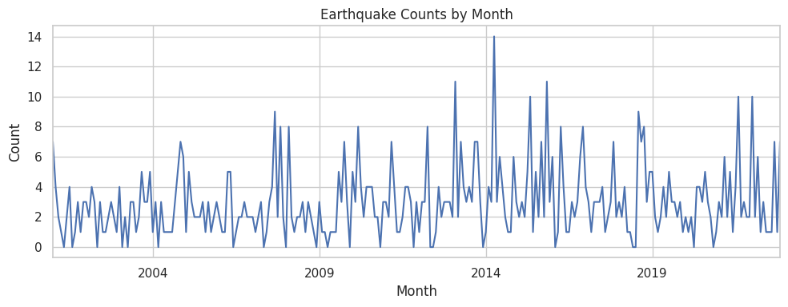
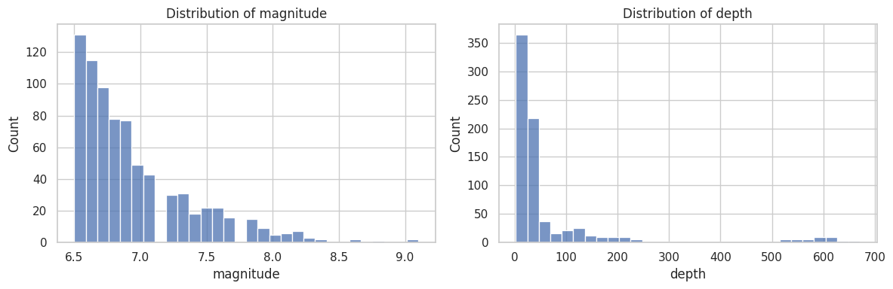
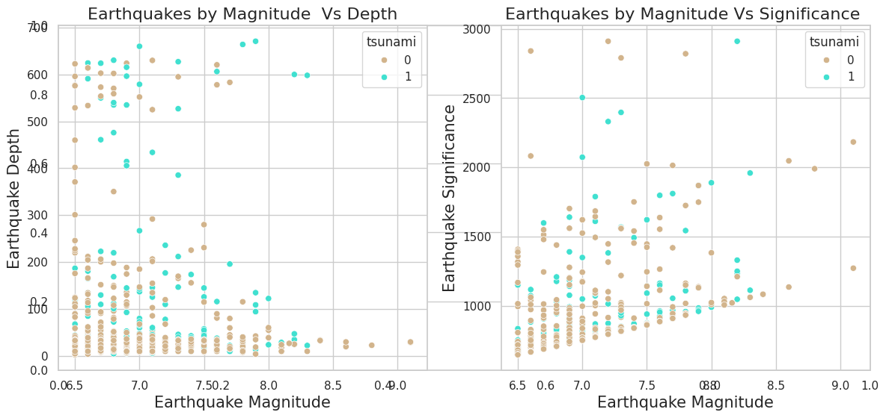
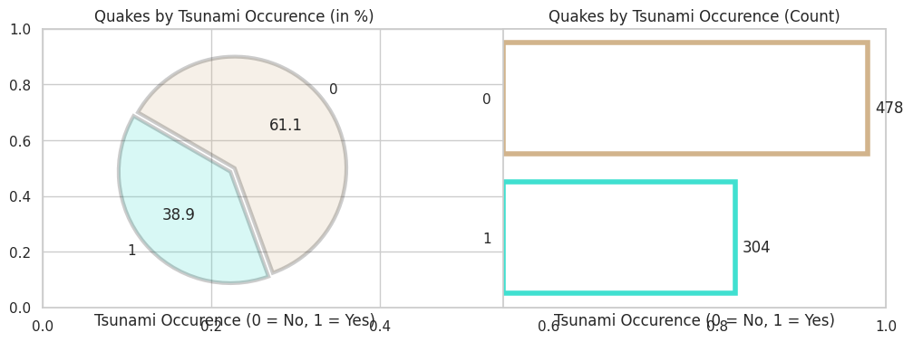
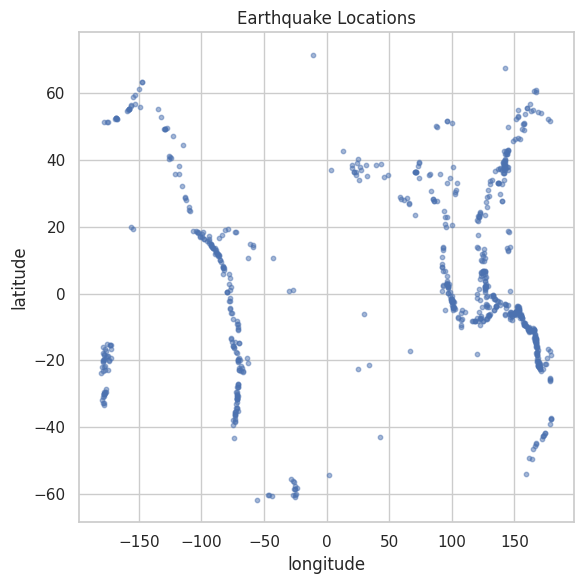
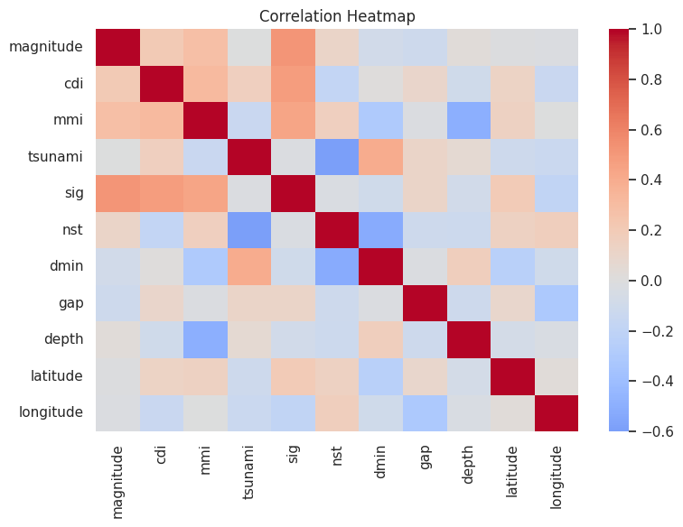

# Data Exploration - Notebook


```python
import numpy as np                ## linear algebra
import pandas as pd               ## data processing, dataset file I/O (e.g. pd.read_csv)
import matplotlib.pyplot as plt   ## data visualization & graphical plotting
import seaborn as sns             ## to visualize random distributions
import plotly.express as px       ## data visualization & graphical plotting
import squarify                   ## Treemap plots

%matplotlib inline
from plotly.subplots import make_subplots
from plotly.offline import init_notebook_mode

pd.options.display.float_format = '{:.2f}'.format  ## limiting the decimals in the output to 2 

import warnings                    ## Filter warnings
warnings.filterwarnings('ignore')
```


```python
import pandas as pd

df = pd.read_csv('../data/earthquake_data.csv')

df.head()
```


<div>
<style scoped>
    .dataframe tbody tr th:only-of-type {
        vertical-align: middle;
    }

    .dataframe tbody tr th {
        vertical-align: top;
    }

    .dataframe thead th {
        text-align: right;
    }
</style>
<table border="1" class="dataframe">
  <thead>
    <tr style="text-align: right;">
      <th></th>
      <th>title</th>
      <th>magnitude</th>
      <th>date_time</th>
      <th>cdi</th>
      <th>mmi</th>
      <th>alert</th>
      <th>tsunami</th>
      <th>sig</th>
      <th>net</th>
      <th>nst</th>
      <th>dmin</th>
      <th>gap</th>
      <th>magType</th>
      <th>depth</th>
      <th>latitude</th>
      <th>longitude</th>
      <th>location</th>
      <th>continent</th>
      <th>country</th>
    </tr>
  </thead>
  <tbody>
    <tr>
      <th>0</th>
      <td>M 7.0 - 18 km SW of Malango, Solomon Islands</td>
      <td>7.0</td>
      <td>22-11-2022 02:03</td>
      <td>8</td>
      <td>7</td>
      <td>green</td>
      <td>1</td>
      <td>768</td>
      <td>us</td>
      <td>117</td>
      <td>0.509</td>
      <td>17.0</td>
      <td>mww</td>
      <td>14.000</td>
      <td>-9.7963</td>
      <td>159.596</td>
      <td>Malango, Solomon Islands</td>
      <td>Oceania</td>
      <td>Solomon Islands</td>
    </tr>
    <tr>
      <th>1</th>
      <td>M 6.9 - 204 km SW of Bengkulu, Indonesia</td>
      <td>6.9</td>
      <td>18-11-2022 13:37</td>
      <td>4</td>
      <td>4</td>
      <td>green</td>
      <td>0</td>
      <td>735</td>
      <td>us</td>
      <td>99</td>
      <td>2.229</td>
      <td>34.0</td>
      <td>mww</td>
      <td>25.000</td>
      <td>-4.9559</td>
      <td>100.738</td>
      <td>Bengkulu, Indonesia</td>
      <td>NaN</td>
      <td>NaN</td>
    </tr>
    <tr>
      <th>2</th>
      <td>M 7.0 -</td>
      <td>7.0</td>
      <td>12-11-2022 07:09</td>
      <td>3</td>
      <td>3</td>
      <td>green</td>
      <td>1</td>
      <td>755</td>
      <td>us</td>
      <td>147</td>
      <td>3.125</td>
      <td>18.0</td>
      <td>mww</td>
      <td>579.000</td>
      <td>-20.0508</td>
      <td>-178.346</td>
      <td>NaN</td>
      <td>Oceania</td>
      <td>Fiji</td>
    </tr>
    <tr>
      <th>3</th>
      <td>M 7.3 - 205 km ESE of Neiafu, Tonga</td>
      <td>7.3</td>
      <td>11-11-2022 10:48</td>
      <td>5</td>
      <td>5</td>
      <td>green</td>
      <td>1</td>
      <td>833</td>
      <td>us</td>
      <td>149</td>
      <td>1.865</td>
      <td>21.0</td>
      <td>mww</td>
      <td>37.000</td>
      <td>-19.2918</td>
      <td>-172.129</td>
      <td>Neiafu, Tonga</td>
      <td>NaN</td>
      <td>NaN</td>
    </tr>
    <tr>
      <th>4</th>
      <td>M 6.6 -</td>
      <td>6.6</td>
      <td>09-11-2022 10:14</td>
      <td>0</td>
      <td>2</td>
      <td>green</td>
      <td>1</td>
      <td>670</td>
      <td>us</td>
      <td>131</td>
      <td>4.998</td>
      <td>27.0</td>
      <td>mww</td>
      <td>624.464</td>
      <td>-25.5948</td>
      <td>178.278</td>
      <td>NaN</td>
      <td>NaN</td>
      <td>NaN</td>
    </tr>
  </tbody>
</table>
</div>


Dataset Columns


```python
print(f'Number of records (rows) in the dataset are: {df.shape[0]}')
print(f'Number of features (columns) in the dataset are: {df.shape[1]}')
print(f'Number of duplicate entries in the dataset are: {df.duplicated().sum()}')
print(f'Number missing values in the dataset are: {sum(df.isna().sum())}')
```

    Number of records (rows) in the dataset are: 782
    Number of features (columns) in the dataset are: 19
    Number of duplicate entries in the dataset are: 0
    Number missing values in the dataset are: 1246


## Basic Overview


```python
df.shape
df.dtypes
df.info()

df.head(10)
```

    <class 'pandas.DataFrame'>
    RangeIndex: 782 entries, 0 to 781
    Data columns (total 19 columns):
     #   Column     Non-Null Count  Dtype  
    ---  ------     --------------  -----  
     0   title      782 non-null    str    
     1   magnitude  782 non-null    float64
     2   date_time  782 non-null    str    
     3   cdi        782 non-null    int64  
     4   mmi        782 non-null    int64  
     5   alert      415 non-null    str    
     6   tsunami    782 non-null    int64  
     7   sig        782 non-null    int64  
     8   net        782 non-null    str    
     9   nst        782 non-null    int64  
     10  dmin       782 non-null    float64
     11  gap        782 non-null    float64
     12  magType    782 non-null    str    
     13  depth      782 non-null    float64
     14  latitude   782 non-null    float64
     15  longitude  782 non-null    float64
     16  location   777 non-null    str    
     17  continent  206 non-null    str    
     18  country    484 non-null    str    
    dtypes: float64(6), int64(5), str(8)
    memory usage: 185.1 KB


<div>
<style scoped>
    .dataframe tbody tr th:only-of-type {
        vertical-align: middle;
    }

    .dataframe tbody tr th {
        vertical-align: top;
    }

    .dataframe thead th {
        text-align: right;
    }
</style>
<table border="1" class="dataframe">
  <thead>
    <tr style="text-align: right;">
      <th></th>
      <th>title</th>
      <th>magnitude</th>
      <th>date_time</th>
      <th>cdi</th>
      <th>mmi</th>
      <th>alert</th>
      <th>tsunami</th>
      <th>sig</th>
      <th>net</th>
      <th>nst</th>
      <th>dmin</th>
      <th>gap</th>
      <th>magType</th>
      <th>depth</th>
      <th>latitude</th>
      <th>longitude</th>
      <th>location</th>
      <th>continent</th>
      <th>country</th>
    </tr>
  </thead>
  <tbody>
    <tr>
      <th>0</th>
      <td>M 7.0 - 18 km SW of Malango, Solomon Islands</td>
      <td>7.0</td>
      <td>22-11-2022 02:03</td>
      <td>8</td>
      <td>7</td>
      <td>green</td>
      <td>1</td>
      <td>768</td>
      <td>us</td>
      <td>117</td>
      <td>0.509</td>
      <td>17.0</td>
      <td>mww</td>
      <td>14.000</td>
      <td>-9.7963</td>
      <td>159.5960</td>
      <td>Malango, Solomon Islands</td>
      <td>Oceania</td>
      <td>Solomon Islands</td>
    </tr>
    <tr>
      <th>1</th>
      <td>M 6.9 - 204 km SW of Bengkulu, Indonesia</td>
      <td>6.9</td>
      <td>18-11-2022 13:37</td>
      <td>4</td>
      <td>4</td>
      <td>green</td>
      <td>0</td>
      <td>735</td>
      <td>us</td>
      <td>99</td>
      <td>2.229</td>
      <td>34.0</td>
      <td>mww</td>
      <td>25.000</td>
      <td>-4.9559</td>
      <td>100.7380</td>
      <td>Bengkulu, Indonesia</td>
      <td>NaN</td>
      <td>NaN</td>
    </tr>
    <tr>
      <th>2</th>
      <td>M 7.0 -</td>
      <td>7.0</td>
      <td>12-11-2022 07:09</td>
      <td>3</td>
      <td>3</td>
      <td>green</td>
      <td>1</td>
      <td>755</td>
      <td>us</td>
      <td>147</td>
      <td>3.125</td>
      <td>18.0</td>
      <td>mww</td>
      <td>579.000</td>
      <td>-20.0508</td>
      <td>-178.3460</td>
      <td>NaN</td>
      <td>Oceania</td>
      <td>Fiji</td>
    </tr>
    <tr>
      <th>3</th>
      <td>M 7.3 - 205 km ESE of Neiafu, Tonga</td>
      <td>7.3</td>
      <td>11-11-2022 10:48</td>
      <td>5</td>
      <td>5</td>
      <td>green</td>
      <td>1</td>
      <td>833</td>
      <td>us</td>
      <td>149</td>
      <td>1.865</td>
      <td>21.0</td>
      <td>mww</td>
      <td>37.000</td>
      <td>-19.2918</td>
      <td>-172.1290</td>
      <td>Neiafu, Tonga</td>
      <td>NaN</td>
      <td>NaN</td>
    </tr>
    <tr>
      <th>4</th>
      <td>M 6.6 -</td>
      <td>6.6</td>
      <td>09-11-2022 10:14</td>
      <td>0</td>
      <td>2</td>
      <td>green</td>
      <td>1</td>
      <td>670</td>
      <td>us</td>
      <td>131</td>
      <td>4.998</td>
      <td>27.0</td>
      <td>mww</td>
      <td>624.464</td>
      <td>-25.5948</td>
      <td>178.2780</td>
      <td>NaN</td>
      <td>NaN</td>
      <td>NaN</td>
    </tr>
    <tr>
      <th>5</th>
      <td>M 7.0 - south of the Fiji Islands</td>
      <td>7.0</td>
      <td>09-11-2022 09:51</td>
      <td>4</td>
      <td>3</td>
      <td>green</td>
      <td>1</td>
      <td>755</td>
      <td>us</td>
      <td>142</td>
      <td>4.578</td>
      <td>26.0</td>
      <td>mwb</td>
      <td>660.000</td>
      <td>-26.0442</td>
      <td>178.3810</td>
      <td>the Fiji Islands</td>
      <td>NaN</td>
      <td>NaN</td>
    </tr>
    <tr>
      <th>6</th>
      <td>M 6.8 - south of the Fiji Islands</td>
      <td>6.8</td>
      <td>09-11-2022 09:38</td>
      <td>1</td>
      <td>3</td>
      <td>green</td>
      <td>1</td>
      <td>711</td>
      <td>us</td>
      <td>136</td>
      <td>4.678</td>
      <td>22.0</td>
      <td>mww</td>
      <td>630.379</td>
      <td>-25.9678</td>
      <td>178.3630</td>
      <td>the Fiji Islands</td>
      <td>NaN</td>
      <td>NaN</td>
    </tr>
    <tr>
      <th>7</th>
      <td>M 6.7 - 60 km SSW of Boca Chica, Panama</td>
      <td>6.7</td>
      <td>20-10-2022 11:57</td>
      <td>7</td>
      <td>6</td>
      <td>green</td>
      <td>1</td>
      <td>797</td>
      <td>us</td>
      <td>145</td>
      <td>1.151</td>
      <td>37.0</td>
      <td>mww</td>
      <td>20.000</td>
      <td>7.6712</td>
      <td>-82.3396</td>
      <td>Boca Chica, Panama</td>
      <td>NaN</td>
      <td>Panama</td>
    </tr>
    <tr>
      <th>8</th>
      <td>M 6.8 - 55 km SSW of Aguililla, Mexico</td>
      <td>6.8</td>
      <td>22-09-2022 06:16</td>
      <td>8</td>
      <td>7</td>
      <td>yellow</td>
      <td>1</td>
      <td>1179</td>
      <td>us</td>
      <td>175</td>
      <td>2.137</td>
      <td>92.0</td>
      <td>mww</td>
      <td>20.000</td>
      <td>18.3300</td>
      <td>-102.9130</td>
      <td>Aguililla, Mexico</td>
      <td>North America</td>
      <td>Mexico</td>
    </tr>
    <tr>
      <th>9</th>
      <td>M 7.6 - 35 km SSW of Aguililla, Mexico</td>
      <td>7.6</td>
      <td>19-09-2022 18:05</td>
      <td>9</td>
      <td>8</td>
      <td>yellow</td>
      <td>1</td>
      <td>1799</td>
      <td>us</td>
      <td>271</td>
      <td>1.153</td>
      <td>69.0</td>
      <td>mww</td>
      <td>26.943</td>
      <td>18.3667</td>
      <td>-103.2520</td>
      <td>Aguililla, Mexico</td>
      <td>North America</td>
      <td>Mexico</td>
    </tr>
  </tbody>
</table>
</div>


## Data Quality Checks


```python
df.isnull().sum()[df.isnull().sum() > 0]
```


    alert        367
    location       5
    continent    576
    country      298
    dtype: int64


Location has 5 missing values, whereas, alert, continent and country have hundreds of missing values each.

## Summary Statistics


```python
df.describe(include="all").T
```


<div>
<style scoped>
    .dataframe tbody tr th:only-of-type {
        vertical-align: middle;
    }

    .dataframe tbody tr th {
        vertical-align: top;
    }

    .dataframe thead th {
        text-align: right;
    }
</style>
<table border="1" class="dataframe">
  <thead>
    <tr style="text-align: right;">
      <th></th>
      <th>count</th>
      <th>unique</th>
      <th>top</th>
      <th>freq</th>
      <th>mean</th>
      <th>std</th>
      <th>min</th>
      <th>25%</th>
      <th>50%</th>
      <th>75%</th>
      <th>max</th>
    </tr>
  </thead>
  <tbody>
    <tr>
      <th>title</th>
      <td>782</td>
      <td>768</td>
      <td>M 6.9 -</td>
      <td>3</td>
      <td>NaN</td>
      <td>NaN</td>
      <td>NaN</td>
      <td>NaN</td>
      <td>NaN</td>
      <td>NaN</td>
      <td>NaN</td>
    </tr>
    <tr>
      <th>magnitude</th>
      <td>782.0</td>
      <td>NaN</td>
      <td>NaN</td>
      <td>NaN</td>
      <td>6.941125</td>
      <td>0.445514</td>
      <td>6.5</td>
      <td>6.6</td>
      <td>6.8</td>
      <td>7.1</td>
      <td>9.1</td>
    </tr>
    <tr>
      <th>date_time</th>
      <td>782</td>
      <td>773</td>
      <td>11-01-2022 12:39</td>
      <td>3</td>
      <td>NaN</td>
      <td>NaN</td>
      <td>NaN</td>
      <td>NaN</td>
      <td>NaN</td>
      <td>NaN</td>
      <td>NaN</td>
    </tr>
    <tr>
      <th>cdi</th>
      <td>782.0</td>
      <td>NaN</td>
      <td>NaN</td>
      <td>NaN</td>
      <td>4.33376</td>
      <td>3.169939</td>
      <td>0.0</td>
      <td>0.0</td>
      <td>5.0</td>
      <td>7.0</td>
      <td>9.0</td>
    </tr>
    <tr>
      <th>mmi</th>
      <td>782.0</td>
      <td>NaN</td>
      <td>NaN</td>
      <td>NaN</td>
      <td>5.964194</td>
      <td>1.462724</td>
      <td>1.0</td>
      <td>5.0</td>
      <td>6.0</td>
      <td>7.0</td>
      <td>9.0</td>
    </tr>
    <tr>
      <th>alert</th>
      <td>415</td>
      <td>4</td>
      <td>green</td>
      <td>325</td>
      <td>NaN</td>
      <td>NaN</td>
      <td>NaN</td>
      <td>NaN</td>
      <td>NaN</td>
      <td>NaN</td>
      <td>NaN</td>
    </tr>
    <tr>
      <th>tsunami</th>
      <td>782.0</td>
      <td>NaN</td>
      <td>NaN</td>
      <td>NaN</td>
      <td>0.388747</td>
      <td>0.487778</td>
      <td>0.0</td>
      <td>0.0</td>
      <td>0.0</td>
      <td>1.0</td>
      <td>1.0</td>
    </tr>
    <tr>
      <th>sig</th>
      <td>782.0</td>
      <td>NaN</td>
      <td>NaN</td>
      <td>NaN</td>
      <td>870.108696</td>
      <td>322.465367</td>
      <td>650.0</td>
      <td>691.0</td>
      <td>754.0</td>
      <td>909.75</td>
      <td>2910.0</td>
    </tr>
    <tr>
      <th>net</th>
      <td>782</td>
      <td>11</td>
      <td>us</td>
      <td>747</td>
      <td>NaN</td>
      <td>NaN</td>
      <td>NaN</td>
      <td>NaN</td>
      <td>NaN</td>
      <td>NaN</td>
      <td>NaN</td>
    </tr>
    <tr>
      <th>nst</th>
      <td>782.0</td>
      <td>NaN</td>
      <td>NaN</td>
      <td>NaN</td>
      <td>230.250639</td>
      <td>250.188177</td>
      <td>0.0</td>
      <td>0.0</td>
      <td>140.0</td>
      <td>445.0</td>
      <td>934.0</td>
    </tr>
    <tr>
      <th>dmin</th>
      <td>782.0</td>
      <td>NaN</td>
      <td>NaN</td>
      <td>NaN</td>
      <td>1.325757</td>
      <td>2.218805</td>
      <td>0.0</td>
      <td>0.0</td>
      <td>0.0</td>
      <td>1.863</td>
      <td>17.654</td>
    </tr>
    <tr>
      <th>gap</th>
      <td>782.0</td>
      <td>NaN</td>
      <td>NaN</td>
      <td>NaN</td>
      <td>25.03899</td>
      <td>24.225067</td>
      <td>0.0</td>
      <td>14.625</td>
      <td>20.0</td>
      <td>30.0</td>
      <td>239.0</td>
    </tr>
    <tr>
      <th>magType</th>
      <td>782</td>
      <td>9</td>
      <td>mww</td>
      <td>468</td>
      <td>NaN</td>
      <td>NaN</td>
      <td>NaN</td>
      <td>NaN</td>
      <td>NaN</td>
      <td>NaN</td>
      <td>NaN</td>
    </tr>
    <tr>
      <th>depth</th>
      <td>782.0</td>
      <td>NaN</td>
      <td>NaN</td>
      <td>NaN</td>
      <td>75.883199</td>
      <td>137.277078</td>
      <td>2.7</td>
      <td>14.0</td>
      <td>26.295</td>
      <td>49.75</td>
      <td>670.81</td>
    </tr>
    <tr>
      <th>latitude</th>
      <td>782.0</td>
      <td>NaN</td>
      <td>NaN</td>
      <td>NaN</td>
      <td>3.5381</td>
      <td>27.303429</td>
      <td>-61.8484</td>
      <td>-14.5956</td>
      <td>-2.5725</td>
      <td>24.6545</td>
      <td>71.6312</td>
    </tr>
    <tr>
      <th>longitude</th>
      <td>782.0</td>
      <td>NaN</td>
      <td>NaN</td>
      <td>NaN</td>
      <td>52.609199</td>
      <td>117.898886</td>
      <td>-179.968</td>
      <td>-71.66805</td>
      <td>109.426</td>
      <td>148.941</td>
      <td>179.662</td>
    </tr>
    <tr>
      <th>location</th>
      <td>777</td>
      <td>413</td>
      <td>Kirakira, Solomon Islands</td>
      <td>17</td>
      <td>NaN</td>
      <td>NaN</td>
      <td>NaN</td>
      <td>NaN</td>
      <td>NaN</td>
      <td>NaN</td>
      <td>NaN</td>
    </tr>
    <tr>
      <th>continent</th>
      <td>206</td>
      <td>6</td>
      <td>Asia</td>
      <td>100</td>
      <td>NaN</td>
      <td>NaN</td>
      <td>NaN</td>
      <td>NaN</td>
      <td>NaN</td>
      <td>NaN</td>
      <td>NaN</td>
    </tr>
    <tr>
      <th>country</th>
      <td>484</td>
      <td>49</td>
      <td>Indonesia</td>
      <td>110</td>
      <td>NaN</td>
      <td>NaN</td>
      <td>NaN</td>
      <td>NaN</td>
      <td>NaN</td>
      <td>NaN</td>
      <td>NaN</td>
    </tr>
  </tbody>
</table>
</div>


## Column Detection Helpers


```python
import seaborn as sns
import matplotlib.pyplot as plt

sns.set_theme(style="whitegrid")
```


```python
date_col = "date_time"
mag_col = "magnitude"
depth_col = "depth"
lat_col = "latitude"
lon_col = "longitude"

date_col, mag_col, depth_col, lat_col, lon_col
```


    ('date_time', 'magnitude', 'depth', 'latitude', 'longitude')


## Time-Based Analysis


```python
if date_col:
    df[date_col] = pd.to_datetime(
        df[date_col],
        errors="coerce",
        format="%d-%m-%Y %H:%M",
        dayfirst=True,
    )
    date_range = (df[date_col].min(), df[date_col].max())
    print(date_range)
else:
    "No date-like column detected."
```

    (Timestamp('2001-01-01 06:57:00'), Timestamp('2022-11-22 02:03:00'))


```python
if date_col:
    (
        df.set_index(date_col)
        .resample("ME")
        .size()
        .plot(figsize=(10, 4), title="Earthquake Counts by Month")
    )
    plt.xlabel("Month")
    plt.ylabel("Count")
    plt.tight_layout()
else:
    "No date-like column detected."
```


    

    


## Magnitude and Depth Distributions


```python
fig, axes = plt.subplots(1, 2, figsize=(12, 4))
if mag_col:
    sns.histplot(data=df, x=mag_col, bins=30, ax=axes[0])
    axes[0].set_title(f"Distribution of {mag_col}")
else:
    axes[0].text(0.5, 0.5, "No magnitude column detected", ha="center")
    axes[0].set_axis_off()

if depth_col:
    sns.histplot(data=df, x=depth_col, bins=30, ax=axes[1])
    axes[1].set_title(f"Distribution of {depth_col}")
else:
    axes[1].text(0.5, 0.5, "No depth column detected", ha="center")
    axes[1].set_axis_off()

plt.tight_layout()
```


    

    


## Relation b/w magnitude and depth & magnitude and significance


```python
plt.subplots(figsize=(14,6))
my_pal = ('#D2B48C','#40E0D0')
          
plt.subplot(1,2,1)
plt.title('Earthquakes by Magnitude  Vs Depth',fontsize=16)
sns.scatterplot(data=df, x='magnitude', y='depth', hue='tsunami', palette=my_pal)
plt.ylabel('Earthquake Depth', fontsize=15)
plt.xlabel('Earthquake Magnitude', fontsize=15)

plt.subplot(1,2,2)
plt.title('Earthquakes by Magnitude Vs Significance ',fontsize=16)
sns.scatterplot(data=df, x='magnitude', y='sig', hue='tsunami', palette=my_pal)
plt.ylabel('Earthquake Significance', fontsize=15)
plt.xlabel('Earthquake Magnitude', fontsize=15)

plt.show()
```


    

    


```python
plt.subplots(figsize=(12,4))

my_col = ["#D2B48C", "#40E0D0"]

plt.subplot(1,2,1)
plt.title('Quakes by Tsunami Occurence (in %)',fontsize=12)
my_xpl = [0.0, 0.05]
df['tsunami'].value_counts().plot(kind='pie', colors=my_col, explode=my_xpl, legend=None, ylabel='', counterclock=False, startangle=150, wedgeprops={'alpha':0.2, 'edgecolor' : 'black','linewidth': 3, 'antialiased': True}, autopct='%1.1f')
plt.xlabel('Tsunami Occurence (0 = No, 1 = Yes)',fontsize=12)

plt.subplot(1,2,2)
plt.title('Quakes by Tsunami Occurence (Count)',fontsize=12)
ax = sns.countplot(y='tsunami', data=df, facecolor=(1,1,1,1), linewidth=4, edgecolor=sns.color_palette(my_col, 2), order=df['tsunami'].value_counts().index)

for p in ax.patches:
    ax.annotate('{:.0f}'.format(p.get_width()),  (p.get_x() + p.get_width() + 10, p.get_y()+0.5))

plt.xlabel('Tsunami Occurence (0 = No, 1 = Yes)',fontsize=12)
plt.xticks([]), plt.ylabel(None)
    
plt.show()
```


    

    


## Spatial Scatter


```python
if lat_col and lon_col:
    plt.figure(figsize=(6, 6))
    plt.scatter(df[lon_col], df[lat_col], s=10, alpha=0.5)
    plt.xlabel(lon_col)
    plt.ylabel(lat_col)
    plt.title("Earthquake Locations")
    plt.tight_layout()
else:
    "No latitude/longitude columns detected."
```


    

    


## Correlation Heatmap (Numeric Columns)


```python
numeric_df = df.select_dtypes(include="number")
if numeric_df.shape[1] >= 2:
    corr = numeric_df.corr()
    plt.figure(figsize=(8, 6))
    sns.heatmap(corr, cmap="coolwarm", center=0)
    plt.title("Correlation Heatmap")
    plt.tight_layout()
else:
    "Not enough numeric columns for correlation."
```


    

    


```python
import folium
from folium import plugins
```


```python
print("Earthquakes Across the World  -  Heat Map")
world = folium.Map(location=[df["latitude"].mean(), df["longitude"].mean()], zoom_start=2)
heat_map = df[["latitude", "longitude"]].values
world.add_child(plugins.HeatMap(heat_map, min_opacity=0.3, radius=13))
world
```

    Earthquakes Across the World  -  Heat Map


<div style="width:100%;"><div style="position:relative;width:100%;height:0;padding-bottom:60%;"><span style="color:#565656">Make this Notebook Trusted to load map: File -> Trust Notebook</span><iframe srcdoc="&lt;!DOCTYPE html&gt;
&lt;html&gt;
&lt;head&gt;

    &lt;meta http-equiv=&quot;content-type&quot; content=&quot;text/html; charset=UTF-8&quot; /&gt;
    &lt;script src=&quot;https://cdn.jsdelivr.net/npm/leaflet@1.9.3/dist/leaflet.js&quot;&gt;&lt;/script&gt;
    &lt;script src=&quot;https://code.jquery.com/jquery-3.7.1.min.js&quot;&gt;&lt;/script&gt;
    &lt;script src=&quot;https://cdn.jsdelivr.net/npm/bootstrap@5.2.2/dist/js/bootstrap.bundle.min.js&quot;&gt;&lt;/script&gt;
    &lt;script src=&quot;https://cdnjs.cloudflare.com/ajax/libs/Leaflet.awesome-markers/2.0.2/leaflet.awesome-markers.js&quot;&gt;&lt;/script&gt;
    &lt;link rel=&quot;stylesheet&quot; href=&quot;https://cdn.jsdelivr.net/npm/leaflet@1.9.3/dist/leaflet.css&quot;/&gt;
    &lt;link rel=&quot;stylesheet&quot; href=&quot;https://cdn.jsdelivr.net/npm/bootstrap@5.2.2/dist/css/bootstrap.min.css&quot;/&gt;
    &lt;link rel=&quot;stylesheet&quot; href=&quot;https://netdna.bootstrapcdn.com/bootstrap/3.0.0/css/bootstrap-glyphicons.css&quot;/&gt;
    &lt;link rel=&quot;stylesheet&quot; href=&quot;https://cdn.jsdelivr.net/npm/@fortawesome/fontawesome-free@6.2.0/css/all.min.css&quot;/&gt;
    &lt;link rel=&quot;stylesheet&quot; href=&quot;https://cdnjs.cloudflare.com/ajax/libs/Leaflet.awesome-markers/2.0.2/leaflet.awesome-markers.css&quot;/&gt;
    &lt;link rel=&quot;stylesheet&quot; href=&quot;https://cdn.jsdelivr.net/gh/python-visualization/folium/folium/templates/leaflet.awesome.rotate.min.css&quot;/&gt;

            &lt;meta name=&quot;viewport&quot; content=&quot;width=device-width,
                initial-scale=1.0, maximum-scale=1.0, user-scalable=no&quot; /&gt;
            &lt;style&gt;
                #map_39e28b97f13d536e940c701e4b586ea3 {
                    position: relative;
                    width: 100.0%;
                    height: 100.0%;
                    left: 0.0%;
                    top: 0.0%;
                }
                .leaflet-container { font-size: 1rem; }
            &lt;/style&gt;

            &lt;style&gt;html, body {
                width: 100%;
                height: 100%;
                margin: 0;
                padding: 0;
            }
            &lt;/style&gt;

            &lt;style&gt;#map {
                position:absolute;
                top:0;
                bottom:0;
                right:0;
                left:0;
                }
            &lt;/style&gt;

            &lt;script&gt;
                L_NO_TOUCH = false;
                L_DISABLE_3D = false;
            &lt;/script&gt;


    &lt;script src=&quot;https://cdn.jsdelivr.net/gh/python-visualization/folium@main/folium/templates/leaflet_heat.min.js&quot;&gt;&lt;/script&gt;
&lt;/head&gt;
&lt;body&gt;


            &lt;div class=&quot;folium-map&quot; id=&quot;map_39e28b97f13d536e940c701e4b586ea3&quot; &gt;&lt;/div&gt;

&lt;/body&gt;
&lt;script&gt;


            var map_39e28b97f13d536e940c701e4b586ea3 = L.map(
                &quot;map_39e28b97f13d536e940c701e4b586ea3&quot;,
                {
                    center: [3.5380998721227614, 52.609199360613815],
                    crs: L.CRS.EPSG3857,
                    ...{
  &quot;zoom&quot;: 2,
  &quot;zoomControl&quot;: true,
  &quot;preferCanvas&quot;: false,
}

                }
            );


            var tile_layer_f175b51e6c28ba39ac6d87f993017b45 = L.tileLayer(
                &quot;https://tile.openstreetmap.org/{z}/{x}/{y}.png&quot;,
                {
  &quot;minZoom&quot;: 0,
  &quot;maxZoom&quot;: 19,
  &quot;maxNativeZoom&quot;: 19,
  &quot;noWrap&quot;: false,
  &quot;attribution&quot;: &quot;\u0026copy; \u003ca href=\&quot;https://www.openstreetmap.org/copyright\&quot;\u003eOpenStreetMap\u003c/a\u003e contributors&quot;,
  &quot;subdomains&quot;: &quot;abc&quot;,
  &quot;detectRetina&quot;: false,
  &quot;tms&quot;: false,
  &quot;opacity&quot;: 1,
}

            );


            tile_layer_f175b51e6c28ba39ac6d87f993017b45.addTo(map_39e28b97f13d536e940c701e4b586ea3);


            var heat_map_236b22a2b960c06e9b58b585068c16ea = L.heatLayer(
                [[-9.7963, 159.596], [-4.9559, 100.738], [-20.0508, -178.346], [-19.2918, -172.129], [-25.5948, 178.278], [-26.0442, 178.381], [-25.9678, 178.363], [7.6712, -82.3396], [18.33, -102.913], [18.3667, -103.252], [23.1444, 121.307], [23.029, 121.348], [-21.2077, 170.239], [-6.2237, 146.471], [29.7263, 102.279], [-32.6922, -178.959], [17.5978, 120.809], [-9.0618, -71.1647], [-14.8628, -70.3081], [-54.1325, 159.027], [-23.6141, -66.7236], [11.5538, -86.9919], [-22.5732, 170.349], [-22.72, 170.277], [23.3421, 121.636], [37.7015, 141.587], [-0.6831, 98.6034], [-30.0528, -177.74], [-23.7852, -179.968], [-4.455, -76.9395], [-29.535, -176.729], [-6.9291, 105.251], [52.502, -168.08], [52.502, -168.08], [52.6252, -168.15], [52.48, -167.736], [52.48, -167.736], [52.6563, -167.917], [35.1456, 31.9095], [37.8167, 101.299], [-7.5924, 127.581], [-7.6033, 122.2], [-4.4898, -76.8461], [23.5414, 126.48], [56.2581, -156.492], [-21.1704, 174.54], [-21.1036, 174.895], [12.1598, -87.8542], [16.9502, -99.7877], [-60.3026, -24.9992], [-60.1023, -24.4608], [-14.892, 167.085], [-58.3814, -23.3318], [18.3521, -73.4804], [55.2364, -157.707], [55.2657, -157.68], [-58.4157, -25.3206], [-57.5959, -25.1874], [6.4547, 126.742], [55.4742, -157.917], [55.3154, -157.829], [13.6989, 120.713], [7.5904, -82.8813], [-30.2144, -177.773], [-16.4796, -177.356], [34.5861, 98.2551], [0.1684, 96.6475], [-17.2495, 66.3745], [38.2296, 141.665], [-21.6857, -177.064], [-18.9204, -176.235], [38.4752, 141.607], [54.7018, 163.208], [-28.4792, -176.619], [-29.7466, -177.224], [-29.6131, -177.842], [-37.596, 179.544], [37.6856, 141.992], [-23.2787, 171.489], [-61.8484, -55.559], [5.0074, 127.517], [51.2407, 100.443], [-39.3264, -74.9067], [37.8973, 26.7953], [54.662, -159.675], [0.9604, -26.8332], [-27.9285, -71.3937], [-28.013, -71.1958], [0.8696, -29.7046], [-6.6704, 123.493], [-4.2791, 101.215], [-4.3724, 101.095], [12.0065, 124.13], [55.1079, -158.477], [-7.847, 147.755], [-5.6368, 110.678], [15.9163, -95.9533], [-33.2938, -177.838], [28.9386, 128.262], [-23.2966, -68.4204], [38.1689, -117.85], [-12.0662, 166.648], [-6.7762, 129.785], [34.1818, 25.7101], [44.4646, -115.118], [48.9638, 157.695], [45.6161, 148.959], [19.4193, -78.756], [38.4312, 39.0609], [6.6969, 125.174], [1.6213, 126.416], [-21.9449, -179.511], [-18.5747, -175.272], [6.9098, 125.178], [6.7567, 125.008], [-35.4758, -73.163], [-3.4528, 128.37], [-20.3641, -178.57], [-60.2152, -26.5801], [-7.2822, 104.791], [-34.2364, -72.3102], [-16.1985, 167.998], [-0.5858, 128.034], [-18.2242, 120.358], [0.5126, 126.189], [35.7695, -117.599], [-6.4078, 129.169], [-30.6441, -178.1], [13.1994, -89.3056], [-5.8119, -75.2697], [-4.051, 152.597], [-6.9746, 146.449], [-1.8146, 122.58], [-58.6262, -25.304], [-14.7131, -70.1546], [-2.1862, -77.0505], [14.6802, -92.4527], [-43.1219, 42.3568], [-30.0404, -71.3815], [-13.336, 166.875], [2.258, 126.758], [-8.144, -71.587], [5.8983, 126.921], [55.0999, 164.699], [-58.5446, -26.3856], [-22.0629, 169.733], [-21.9496, 169.427], [61.3464, -149.955], [-17.8735, -178.927], [71.6312, -11.2431], [37.5203, 20.5565], [49.297, -129.724], [49.3346, -129.289], [49.2586, -129.412], [-21.7427, 169.522], [52.8549, 153.243], [49.2902, 156.297], [-5.7012, 151.205], [-18.3604, -178.063], [-0.2559, 119.846], [-25.415, 178.199], [-31.7447, -179.373], [-10.0207, 161.503], [-18.4743, 179.35], [42.6861, 141.929], [-22.0295, 170.126], [-11.0355, -70.8284], [-16.0315, 168.143], [10.7731, -62.9019], [-8.319, 116.627], [-18.1125, -178.153], [-7.3718, 119.802], [51.4234, -178.026], [-8.2581, 116.438], [19.3182, -155.0], [-20.6588, -63.0058], [-5.5321, 151.5], [-5.5024, 151.402], [-4.3762, 153.2], [-6.3043, 142.612], [-6.0699, 142.754], [16.3855, -97.9787], [56.0039, -149.166], [-15.7675, -74.7092], [17.4825, -83.52], [-7.4921, 108.174], [-54.2189, 2.1628], [-21.3246, 168.671], [-21.5027, 168.598], [9.5147, -84.4865], [34.9109, 45.9592], [-4.2433, 143.485], [-15.3197, -173.168], [-21.6484, 168.859], [-21.6971, 169.148], [-7.2168, 123.074], [52.3909, 176.769], [18.5499, -98.4887], [15.0222, -93.8993], [33.1926, 103.855], [36.9293, 27.4139], [54.4434, 168.857], [-49.4837, 164.016], [11.1269, 124.629], [13.7174, -90.9718], [14.9091, -92.0092], [54.0312, 170.92], [-1.2923, 120.431], [-56.414, -25.7432], [-14.5884, 167.377], [5.5043, 125.066], [-33.0375, -72.0617], [-22.6784, 25.1558], [56.9401, 162.786], [-23.2593, -178.804], [-19.2814, -63.9047], [9.9071, 125.452], [-6.2464, 155.172], [-10.3506, 161.335], [4.4782, 122.617], [-19.3733, 176.052], [-43.4064, -73.9413], [-7.5082, 127.921], [-4.5049, 153.522], [-10.749, 161.132], [-10.8416, 161.314], [-10.6812, 161.327], [40.4535, -126.194], [5.2834, 96.1678], [39.2732, 73.9776], [11.9097, -88.8968], [37.3931, 141.387], [-42.6058, 173.254], [-42.3205, 173.669], [-42.7373, 173.054], [42.8621, 13.0961], [-4.8626, 108.163], [-6.0033, 148.887], [-19.7819, -178.244], [-37.3586, 179.146], [-3.6849, 152.792], [20.9228, 94.569], [-22.4765, 173.117], [18.5429, 145.507], [-2.0967, 100.665], [-56.2409, -26.9353], [-21.9724, -178.204], [0.4947, -79.616], [0.4261, -79.7899], [-16.0429, 167.379], [0.3819, -79.9218], [32.7906, 130.754], [23.0944, 94.8654], [36.4725, 71.1311], [-13.9805, 166.594], [-14.0683, 166.624], [-14.3235, 166.855], [-4.9521, 94.3299], [53.9776, 158.546], [59.6204, -153.339], [18.8239, -106.934], [41.9723, 142.781], [3.8965, 126.862], [24.8036, 93.6505], [15.8015, -93.633], [-4.1064, 129.508], [38.2107, 72.7797], [-9.1825, -71.2574], [-10.0598, -71.0184], [-10.5372, -70.9437], [-8.8994, 158.422], [38.67, 20.6], [31.0009, 128.873], [-29.5097, -72.0585], [-29.5067, -72.0068], [6.8431, 94.648], [-30.8796, -71.4519], [-8.3381, 124.875], [36.5244, 70.3676], [-14.8595, 167.303], [-0.6212, 131.262], [-31.7275, -71.3792], [-31.5173, -71.804], [-31.4244, -71.6876], [-31.5622, -71.4262], [-31.5729, -71.6744], [24.913, -109.623], [-9.3293, 157.877], [-9.3438, 158.053], [-2.6286, 138.528], [52.376, -169.446], [-10.4012, 165.141], [13.8672, -58.5479], [-9.307, 158.403], [27.7375, 139.725], [27.8386, 140.493], [56.594, -156.43], [-11.1093, 163.215], [-11.0559, 163.696], [-10.8759, 164.169], [38.9056, 142.032], [27.8087, 86.0655], [-7.2175, 154.557], [-5.4624, 151.875], [-5.2005, 151.777], [-5.375, 151.771], [27.7711, 86.0173], [28.2244, 84.8216], [28.2305, 84.7314], [-15.8815, -178.6], [-15.4994, -173.029], [-4.7294, 152.562], [-7.2968, 122.535], [39.8558, 142.881], [-23.1125, -66.688], [-17.0309, 168.52], [5.9045, -82.6576], [7.9401, -82.6865], [-6.5108, 154.46], [6.1572, 123.126], [1.9604, 126.575], [2.2999, 127.056], [-37.6478, 179.662], [1.8929, 126.522], [-5.9873, 148.232], [-19.6903, -177.759], [12.5262, -88.1225], [13.7641, 144.429], [-14.598, -73.5714], [0.8295, 146.169], [-19.8015, -178.4], [37.0052, 142.452], [14.724, -92.4614], [-6.2304, 152.807], [-14.9831, -175.51], [-55.4703, -28.3669], [51.8486, 178.735], [-29.9414, -177.607], [-29.9379, -177.516], [-29.9772, -177.725], [40.2893, 25.3889], [7.2096, -82.3045], [-21.4542, 170.355], [49.6388, -127.732], [-6.7547, 155.024], [-6.6558, 155.087], [17.397, -100.972], [-11.1284, 162.052], [-11.4633, 162.051], [-11.2701, 162.148], [11.642, -85.8779], [-6.7878, 154.95], [-6.5858, 155.048], [-20.5709, -70.4931], [-20.3113, -70.5756], [-19.8927, -70.9455], [-19.6097, -70.7691], [-19.9807, -70.7022], [40.8287, -125.134], [27.4312, 127.367], [14.6682, -58.9272], [35.9053, 82.5864], [-15.0691, 167.372], [-32.9076, -177.881], [-13.8633, 167.249], [-17.1171, -176.545], [-60.2738, -46.4011], [-60.2627, -47.0621], [-30.2921, -71.5215], [37.1557, 144.661], [26.0913, -110.321], [-6.4456, 154.931], [9.8796, 124.117], [35.5142, 23.2523], [53.1995, 152.786], [-30.9255, -178.323], [27.1825, 65.5052], [-15.8385, -74.5112], [26.951, 65.5009], [51.5573, -174.767], [29.9377, 138.833], [-7.44, 128.221], [51.537, -175.23], [-41.734, 174.152], [5.7732, -78.1999], [-41.704, 174.337], [-60.857, -25.07], [-6.029, 149.706], [-3.917, 153.927], [10.701, -42.594], [11.763, -86.926], [-10.004, 107.236], [52.235, 151.444], [54.892, 153.221], [-23.009, -177.232], [18.728, 145.288], [-3.898, 152.127], [30.308, 102.888], [46.221, 150.788], [-3.214, 142.542], [28.033, 61.996], [-6.475, 154.607], [-3.517, 138.476], [-6.598, 148.174], [50.958, 157.408], [50.954, 157.283], [67.631, 142.508], [-10.994, 165.741], [1.135, -77.393], [-10.928, 166.018], [-10.838, 165.969], [-10.997, 165.655], [-10.499, 165.588], [-11.183, 164.882], [-10.799, 165.114], [42.77, 143.092], [-28.094, -70.653], [55.228, -134.859], [-14.344, 167.286], [-6.533, 129.825], [37.89, 143.949], [14.129, -92.164], [23.005, 95.885], [13.988, -91.895], [52.788, -132.101], [10.086, -85.298], [-4.892, 134.03], [1.929, -76.362], [10.085, -85.315], [10.811, 126.638], [12.139, -88.59], [2.19, 126.837], [49.8, 145.064], [-4.651, 153.173], [-18.685, -174.705], [-1.617, 134.276], [-5.462, 147.117], [-32.625, -71.365], [28.696, -113.104], [18.229, -102.689], [0.802, 92.463], [2.327, 93.063], [-35.2, -72.217], [-6.242, 145.955], [16.493, -98.231], [51.708, 95.991], [9.999, 123.206], [-17.827, 167.133], [2.433, 93.21], [51.842, 95.911], [-7.551, 146.809], [17.986, -99.789], [-14.438, -75.966], [38.721, 43.508], [-6.57, 147.881], [27.73, 88.155], [40.273, 142.779], [2.965, 97.893], [-20.671, 169.716], [-7.641, -74.525], [-18.311, 168.218], [-18.308, 168.156], [-18.365, 168.143], [-3.518, 144.828], [-29.539, -176.34], [39.955, 142.205], [-20.244, 168.226], [-10.375, 161.2], [37.001, 140.401], [38.276, 141.588], [17.208, -94.338], [20.687, 99.822], [39.241, 142.463], [36.166, 141.562], [38.058, 144.59], [36.281, 141.111], [38.297, 142.373], [38.435, 142.842], [-35.38, -72.834], [-36.422, -72.96], [28.777, 63.951], [-20.628, 168.471], [-38.355, -73.326], [-19.702, 167.947], [28.412, 59.18], [-6.001, 149.977], [-3.487, 100.082], [24.696, -109.156], [-4.963, 133.76], [-43.522, 171.83], [-1.266, -77.306], [-17.541, 168.069], [-5.746, 150.765], [-5.486, 146.822], [6.497, 123.48], [-5.931, 150.59], [-5.966, 150.428], [-38.067, -73.31], [-10.627, 161.447], [-2.329, 136.484], [-2.174, 136.543], [7.881, 91.936], [-13.698, 166.643], [3.748, 96.018], [33.165, 96.548], [-10.878, 161.116], [2.383, 97.048], [32.2862, -115.295], [13.667, 92.831], [-36.217, -73.257], [37.745, 141.59], [-34.326, -71.799], [-34.29, -71.891], [-3.762, 100.991], [-36.665, -73.374], [-13.571, 167.227], [-37.773, -75.048], [-36.122, -72.898], [25.93, 128.425], [18.443, -72.571], [40.652, -124.692], [-9.019, 157.551], [-8.783, 157.354], [-8.726, 157.487], [-19.394, -70.321], [-17.239, 178.331], [-8.207, 118.631], [29.218, 129.782], [-6.133, 130.385], [-13.298, 165.91], [-13.093, 166.497], [-12.517, 166.382], [-13.006, 166.51], [-2.482, 101.524], [-0.72, 99.867], [-15.489, -172.095], [-7.782, 107.297], [-1.479, 99.49], [32.821, 140.395], [14.099, 92.902], [33.167, 137.944], [29.039, -112.903], [-45.762, 166.562], [-5.157, 153.782], [16.731, -86.217], [-23.043, -174.66], [3.886, 126.387], [-0.691, 133.305], [36.419, 70.743], [-0.414, 132.885], [1.271, 122.091], [14.423, -92.364], [39.533, 73.824], [41.892, 143.754], [1.885, 127.363], [-13.501, 166.967], [30.901, 83.52], [39.802, 141.464], [37.552, 142.214], [37.55, 142.714], [11.005, 91.824], [39.03, 140.881], [31.002, 103.322], [36.164, 141.526], [-20.071, 168.892], [35.49, 81.467], [13.351, 125.63], [-2.245, 99.808], [-2.332, 99.891], [-2.486, 99.972], [-2.405, 99.931], [2.768, 95.964], [36.345, 21.863], [36.501, 21.67], [16.357, -94.304], [-39.011, 178.291], [-22.954, -70.182], [14.944, -61.274], [-10.95, 162.149], [-8.224, 118.467], [-8.292, 118.37], [-5.757, 147.098], [-2.312, -77.838], [-22.925, -70.237], [-22.247, -69.89], [-3.899, 101.02], [-44.796, 167.553], [-4.99, 153.5], [-1.999, 100.141], [-2.13, 99.627], [-1.689, 99.668], [-2.625, 100.841], [-2.52, 100.139], [-4.438, 101.367], [2.966, -77.963], [-11.61, 165.762], [-9.834, 159.465], [-13.386, -76.603], [-5.859, 107.419], [-15.595, 167.68], [2.872, 127.464], [36.808, 134.85], [37.535, 138.446], [13.554, -90.618], [-7.306, 155.741], [-7.169, 155.777], [-8.466, 157.043], [37.336, 136.588], [-20.617, 169.357], [-1.034, 126.976], [1.065, 126.282], [46.243, 154.524], [21.974, 120.493], [21.799, 120.547], [46.592, 153.266], [-6.482, 151.195], [-13.457, -76.677], [-5.881, 150.982], [19.877, -155.935], [-16.592, -172.033], [-6.759, 155.512], [51.148, 157.522], [-15.798, 167.789], [-9.284, 107.419], [-5.724, 151.133], [60.772, 165.743], [0.093, 97.05], [-20.187, -174.123], [-19.99, -173.907], [-27.211, -71.056], [-27.017, -71.022], [60.491, 167.516], [60.949, 167.089], [-16.527, 176.989], [-3.595, 127.214], [-21.324, 33.583], [36.311, 23.212], [28.164, -112.117], [36.357, 71.093], [-6.224, 29.83], [38.089, 142.122], [2.164, 96.786], [-22.361, -67.895], [34.539, 73.588], [-5.437, 151.84], [-5.678, -76.398], [-4.539, 153.474], [38.276, 142.039], [7.92, 92.19], [1.819, 97.082], [11.245, -86.172], [41.292, -125.953], [-19.987, -69.197], [1.989, 97.041], [0.587, 98.459], [-1.714, 99.779], [-1.644, 99.607], [2.085, 97.108], [33.807, 130.131], [-6.527, 129.933], [2.908, 95.592], [-5.562, 122.129], [4.756, 126.421], [-14.252, 167.259], [5.293, 123.337], [34.064, 141.491], [8.879, 92.375], [6.91, 92.958], [3.295, 95.982], [-49.312, 161.345], [18.958, -81.409], [42.9, 145.228], [43.006, 145.119], [-3.609, 135.404], [-46.676, 164.721], [4.695, -77.508], [-8.152, 124.868], [-11.128, 162.208], [49.277, -128.772], [37.226, 138.779], [24.53, 122.694], [11.422, -86.665], [13.925, 120.534], [-10.951, 162.161], [33.205, 137.227], [33.184, 137.071], [33.07, 136.618], [-35.173, -70.525], [-0.443, 133.091], [55.682, 160.003], [-37.695, -73.406], [-9.362, 122.839], [-13.174, 167.198], [36.512, 71.029], [-3.665, 135.339], [-4.003, 135.023], [-3.615, 135.538], [-3.12, 127.4], [-22.015, 169.766], [28.995, 58.311], [8.416, -82.824], [35.7005, -121.101], [23.039, 121.362], [-5.581, 150.88], [12.025, 125.416], [-19.262, 168.892], [37.812, 142.619], [42.648, 144.57], [50.211, 87.721], [42.45, 144.38], [50.038, 87.813], [41.774, 143.593], [41.815, 143.91], [19.917, 95.672], [-45.104, 167.144], [-60.532, -43.411], [-3.828, 152.174], [-30.608, -71.637], [55.492, 159.999], [-5.095, 152.502], [2.354, 128.855], [38.849, 141.568], [36.964, 3.634], [-8.294, 120.743], [-4.694, 153.238], [18.77, -104.104], [13.626, -90.774], [-10.491, 160.77], [-5.311, 153.701], [-4.786, 153.275], [63.5141, -147.453], [2.824, 96.085], [63.5144, -147.912], [-1.511, 133.973], [-1.757, 134.297], [13.036, 93.068], [-3.302, 142.945], [14.101, 146.199], [7.929, -82.793], [35.626, 49.047], [-30.805, -71.124], [-12.592, 166.383], [13.088, 144.619], [-27.535, -70.586], [16.985, -100.865], [24.279, 122.179], [-21.663, -68.329], [6.033, 124.249], [36.502, 70.482], [-5.345, 151.248], [38.573, 31.271], [-3.212, 142.427], [-17.664, 168.004], [-17.6, 167.856], [-9.613, 159.53], [23.954, 122.734], [39.402, 141.089], [35.946, 90.541], [-5.912, 150.196], [-4.102, 123.907], [12.686, 144.98], [-0.578, 133.13], [58.775, -154.701], [39.059, 24.244], [-17.543, -72.077], [-16.086, -73.987], [-17.745, -71.649], [-16.265, -73.641], [-7.41, 155.865], [34.083, 132.526], [-4.029, 128.02], [47.149, -122.727], [1.271, 126.249], [-4.68, 102.562], [13.671, -88.938], [23.419, 70.232], [-4.022, 101.776], [13.049, -88.66], [56.7744, -153.281], [-14.928, 167.17], [6.631, 126.899], [6.898, 126.579]],
                {
  &quot;minOpacity&quot;: 0.3,
  &quot;maxZoom&quot;: 18,
  &quot;radius&quot;: 13,
  &quot;blur&quot;: 15,
}
            );


            heat_map_236b22a2b960c06e9b58b585068c16ea.addTo(map_39e28b97f13d536e940c701e4b586ea3);

&lt;/script&gt;
&lt;/html&gt;" style="position:absolute;width:100%;height:100%;left:0;top:0;border:none !important;" allowfullscreen webkitallowfullscreen mozallowfullscreen></iframe></div></div>


