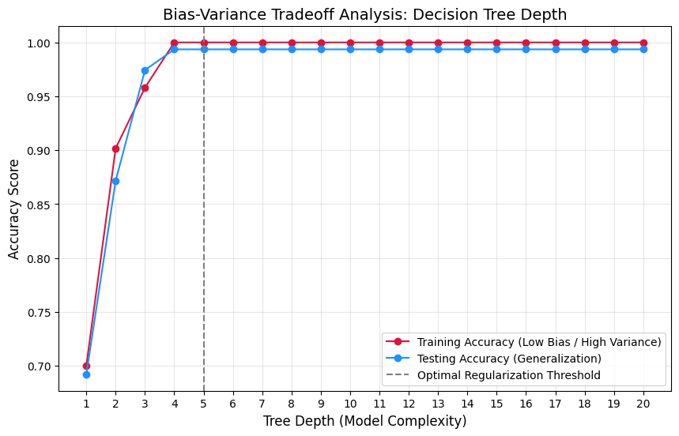
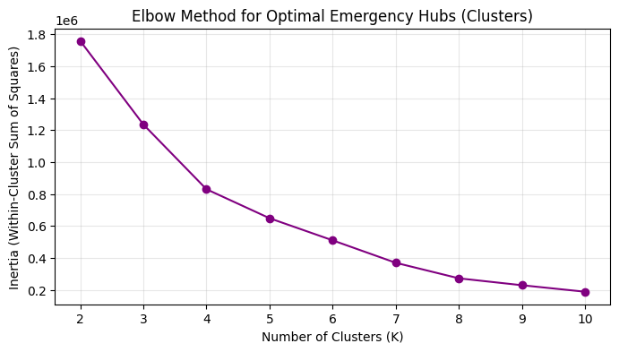

## Preprocessing


```python
import numpy as np
import pandas as pd
from sklearn.model_selection import train_test_split
from sklearn.preprocessing import StandardScaler, MinMaxScaler
```


```python
import pandas as pd

df = pd.read_csv('../data/earthquake_data.csv')

df.head()
```


<div>
<style scoped>
    .dataframe tbody tr th:only-of-type {
        vertical-align: middle;
    }

    .dataframe tbody tr th {
        vertical-align: top;
    }

    .dataframe thead th {
        text-align: right;
    }
</style>
<table border="1" class="dataframe">
  <thead>
    <tr style="text-align: right;">
      <th></th>
      <th>title</th>
      <th>magnitude</th>
      <th>date_time</th>
      <th>cdi</th>
      <th>mmi</th>
      <th>alert</th>
      <th>tsunami</th>
      <th>sig</th>
      <th>net</th>
      <th>nst</th>
      <th>dmin</th>
      <th>gap</th>
      <th>magType</th>
      <th>depth</th>
      <th>latitude</th>
      <th>longitude</th>
      <th>location</th>
      <th>continent</th>
      <th>country</th>
    </tr>
  </thead>
  <tbody>
    <tr>
      <th>0</th>
      <td>M 7.0 - 18 km SW of Malango, Solomon Islands</td>
      <td>7.0</td>
      <td>22-11-2022 02:03</td>
      <td>8</td>
      <td>7</td>
      <td>green</td>
      <td>1</td>
      <td>768</td>
      <td>us</td>
      <td>117</td>
      <td>0.509</td>
      <td>17.0</td>
      <td>mww</td>
      <td>14.000</td>
      <td>-9.7963</td>
      <td>159.596</td>
      <td>Malango, Solomon Islands</td>
      <td>Oceania</td>
      <td>Solomon Islands</td>
    </tr>
    <tr>
      <th>1</th>
      <td>M 6.9 - 204 km SW of Bengkulu, Indonesia</td>
      <td>6.9</td>
      <td>18-11-2022 13:37</td>
      <td>4</td>
      <td>4</td>
      <td>green</td>
      <td>0</td>
      <td>735</td>
      <td>us</td>
      <td>99</td>
      <td>2.229</td>
      <td>34.0</td>
      <td>mww</td>
      <td>25.000</td>
      <td>-4.9559</td>
      <td>100.738</td>
      <td>Bengkulu, Indonesia</td>
      <td>NaN</td>
      <td>NaN</td>
    </tr>
    <tr>
      <th>2</th>
      <td>M 7.0 -</td>
      <td>7.0</td>
      <td>12-11-2022 07:09</td>
      <td>3</td>
      <td>3</td>
      <td>green</td>
      <td>1</td>
      <td>755</td>
      <td>us</td>
      <td>147</td>
      <td>3.125</td>
      <td>18.0</td>
      <td>mww</td>
      <td>579.000</td>
      <td>-20.0508</td>
      <td>-178.346</td>
      <td>NaN</td>
      <td>Oceania</td>
      <td>Fiji</td>
    </tr>
    <tr>
      <th>3</th>
      <td>M 7.3 - 205 km ESE of Neiafu, Tonga</td>
      <td>7.3</td>
      <td>11-11-2022 10:48</td>
      <td>5</td>
      <td>5</td>
      <td>green</td>
      <td>1</td>
      <td>833</td>
      <td>us</td>
      <td>149</td>
      <td>1.865</td>
      <td>21.0</td>
      <td>mww</td>
      <td>37.000</td>
      <td>-19.2918</td>
      <td>-172.129</td>
      <td>Neiafu, Tonga</td>
      <td>NaN</td>
      <td>NaN</td>
    </tr>
    <tr>
      <th>4</th>
      <td>M 6.6 -</td>
      <td>6.6</td>
      <td>09-11-2022 10:14</td>
      <td>0</td>
      <td>2</td>
      <td>green</td>
      <td>1</td>
      <td>670</td>
      <td>us</td>
      <td>131</td>
      <td>4.998</td>
      <td>27.0</td>
      <td>mww</td>
      <td>624.464</td>
      <td>-25.5948</td>
      <td>178.278</td>
      <td>NaN</td>
      <td>NaN</td>
      <td>NaN</td>
    </tr>
  </tbody>
</table>
</div>


```python
print(f"Processing Initial Shapes")
print(f"Original shape: {df.shape}")
```

    Processing Initial Shapes
    Original shape: (782, 19)


```python
print(f'Number of records (rows) in the dataset are: {df.shape[0]}')
print(f'Number of features (columns) in the dataset are: {df.shape[1]}')
print(f'Number of duplicate entries in the dataset are: {df.duplicated().sum()}')
print(f'Number missing values in the dataset are: {sum(df.isna().sum())}')
```

    Number of records (rows) in the dataset are: 782
    Number of features (columns) in the dataset are: 19
    Number of duplicate entries in the dataset are: 0
    Number missing values in the dataset are: 1246


```python
df.isnull().sum()[df.isnull().sum() > 0]
```


    alert        367
    location       5
    continent    576
    country      298
    dtype: int64


```python
df['alert'] = df['alert'].fillna('none')
df['continent'] = df['continent'].fillna('Oceanic')
df['country'] = df['country'].fillna('Oceanic')
```


```python
df = df.dropna(subset=['location'])
```


```python
print(f"Missing values remaining: {df.isna().sum().sum()}")
```

    Missing values remaining: 0


## Feature Engineering


```python
# Conversion of Logarithmic Magnitude to Comparative Kinetic Energy Proxy
# Formula: E ~ 10**(1.5 * M)
df['energy_proxy'] = 10 ** (1.5 * df['magnitude'])
# Explicitly flagging oceanic events based on structural geolocation absence
df['is_oceanic'] = df['country'].apply(lambda x: 1 if x == 'Oceanic' else 0)
# Parsing time features to capture temporal variations
df['date_time'] = pd.to_datetime(df['date_time'], errors='coerce', format="%d-%m-%Y %H:%M", dayfirst=True)
df['hour'] = df['date_time'].dt.hour
df['month'] = df['date_time'].dt.month
# Impute temporal rows if any parsing errors occurred from 'coerce'
df['hour'] = df['hour'].fillna(df['hour'].mode()[0])
df['month'] = df['month'].fillna(df['month'].mode()[0])
```

## Disaster Decision Target Level


```python
# Creating a risk-weighted score matrix combining magnitude, human impact proxy (mmi), 
# and tsunami triggers to define Low (0), Medium (1), and High (2) Urgency classes.
def calculate_urgency(row):
    # Base weight calculation
    score = (row['magnitude'] * 0.4) + (row['mmi'] * 0.4) + (row['tsunami'] * 2.0)
    if score < 5.5:
        return 0  # Low Urgency
    elif score < 7.5:
        return 1  # Medium Urgency
    else:
        return 2  # High Urgency / Critical Emergency
```


```python
df['Disaster_Urgency'] = df.apply(calculate_urgency, axis=1)
print("\nTarget Variable 'Disaster_Urgency' Distribution:")
print(df['Disaster_Urgency'].value_counts(normalize=True).round(3))
```

    
    Target Variable 'Disaster_Urgency' Distribution:
    Disaster_Urgency
    1    0.495
    0    0.409
    2    0.095
    Name: proportion, dtype: float64


## CATEGORICAL ENCODING & DROPPING UNUSABLE METADATA


```python
# Drop features that are pure strings, ID-like markers, or leak target details directly
drop_cols = ['title', 'date_time', 'location', 'net', 'magType']
df_clean = df.drop(columns=drop_cols)

# One-Hot Encode categorical features safely
categorical_cols = ['alert', 'continent', 'country']
df_encoded = pd.get_dummies(df_clean, columns=categorical_cols, drop_first=True)
```

## DATA STRATIFICATION & SPLITTING


```python
X = df_encoded.drop(columns=['Disaster_Urgency'])
y = df_encoded['Disaster_Urgency']

# Using stratify=y to safeguard class distributions across sets
X_train, X_test, y_train, y_test = train_test_split(
    X, y, test_size=0.20, random_state=42, stratify=y
)
```

## FEATURE SCALING & NORMALIZATION


```python
# Standardize highly skewed numeric vectors (depth, gap, dmin, energy_proxy)
scaler = StandardScaler()

# Scaler is fitted ONLY on the training features to strictly prevent data leakage
numerical_cols = ['magnitude', 'cdi', 'mmi', 'sig', 'nst', 'dmin', 'gap', 'depth', 'latitude', 'longitude', 'energy_proxy']
X_train[numerical_cols] = scaler.fit_transform(X_train[numerical_cols])
X_test[numerical_cols] = scaler.transform(X_test[numerical_cols])

print("\n--- Pipeline Completed Successfully ---")
print(f"Train Set Shape: {X_train.shape} | Test Set Shape: {X_test.shape}")
```

    
    --- Pipeline Completed Successfully ---
    Train Set Shape: (621, 74) | Test Set Shape: (156, 74)


```python
import matplotlib.pyplot as plt
from sklearn.tree import DecisionTreeClassifier
from sklearn.metrics import accuracy_score

# Arrays to store tracking metrics
depths = range(1, 21)
train_acc = []
test_acc = []

# Loop through hyperparameter complexity to observe Bias-Variance behavior
for depth in depths:
    # Regularizing by varying max_depth
    clf = DecisionTreeClassifier(max_depth=depth, random_state=42)
    clf.fit(X_train, y_train)
    
    # Track performance
    train_acc.append(accuracy_score(y_train, clf.predict(X_train)))
    test_acc.append(accuracy_score(y_test, clf.predict(X_test)))

# Plotting the Analytical Tradeoff Curve
plt.figure(figsize=(10, 6))
plt.plot(depths, train_acc, label='Training Accuracy (Low Bias / High Variance)', marker='o', color='crimson')
plt.plot(depths, test_acc, label='Testing Accuracy (Generalization)', marker='o', color='dodgerblue')
plt.title('Bias-Variance Tradeoff Analysis: Decision Tree Depth', fontsize=14)
plt.xlabel('Tree Depth (Model Complexity)', fontsize=12)
plt.ylabel('Accuracy Score', fontsize=12)
plt.xticks(depths)
plt.axvline(x=5, color='gray', linestyle='--', label='Optimal Regularization Threshold')
plt.legend()
plt.grid(True, alpha=0.3)
plt.show()
```


    

    


```python
import pandas as pd
import numpy as np
from sklearn.tree import DecisionTreeClassifier
from sklearn.ensemble import RandomForestClassifier
from xgboost import XGBClassifier
from sklearn.metrics import classification_report, accuracy_score, precision_recall_fscore_support

# -------------------------------------------------------------------------
# 1. INITIALIZING REGULARIZED MODELS
# -------------------------------------------------------------------------

# Baseline Model: Decision Tree constrained to our optimal depth
baseline_model = DecisionTreeClassifier(
    max_depth=5, 
    min_samples_split=10,
    random_state=42
)

# Intermediate Model: Random Forest utilizing subspace sampling
intermediate_model = RandomForestClassifier(
    n_estimators=100,
    max_depth=6,
    max_features='sqrt',  # Prevents dominant features from hijacking trees
    random_state=42,
    n_jobs=-1
)

# Advanced Model: XGBoost with mathematical penalty terms
# Note: XGBoost expects target classes starting at 0 (0, 1, 2), which matches our target!
advanced_model = XGBClassifier(
    n_estimators=100,
    learning_rate=0.05,    # Shrinkage to learn patterns gradually
    max_depth=4,
    reg_alpha=0.1,         # L1 Regularization (Lasso penalty)
    reg_lambda=1.0,        # L2 Regularization (Ridge penalty)
    random_state=42,
    eval_metric='mlogloss'
)

# -------------------------------------------------------------------------
# 2. TRAINING PIPELINE
# -------------------------------------------------------------------------
models = {
    "Baseline (Decision Tree)": baseline_model,
    "Intermediate (Random Forest)": intermediate_model,
    "Advanced (XGBoost)": advanced_model
}

metrics_summary = {}

print("--- Training Models ---")
for name, model in models.items():
    # Fit model on scaled training data
    model.fit(X_train, y_train)
    
    # Make predictions
    predictions = model.predict(X_test)
    
    # Extract performance metrics
    acc = accuracy_score(y_test, predictions)
    prec, rec, f1, _ = precision_recall_fscore_support(y_test, predictions, average='macro')
    
    metrics_summary[name] = {
        "Accuracy": acc,
        "Precision (Macro)": prec,
        "Recall (Macro)": rec,
        "F1-Score (Macro)": f1
    }
    
    print(f"Successfully trained and evaluated: {name}")

# -------------------------------------------------------------------------
# 3. STRUCTURED PERFORMANCE COMPARISON
# -------------------------------------------------------------------------
print("\n=== FINAL MODEL PERFORMANCE METRICS ===")
df_comparison = pd.DataFrame(metrics_summary).T
print(df_comparison.round(4))

# Print detailed report for the optimal model to see per-class performance
print("\n=== DETAILED ADVANCED MODEL PERFORMANCE ===")
print(classification_report(y_test, advanced_model.predict(X_test), target_names=['Low Urgency', 'Medium Urgency', 'High Urgency']))
```

    --- Training Models ---
    Successfully trained and evaluated: Baseline (Decision Tree)
    Successfully trained and evaluated: Intermediate (Random Forest)
    Successfully trained and evaluated: Advanced (XGBoost)
    
    === FINAL MODEL PERFORMANCE METRICS ===
                                  Accuracy  Precision (Macro)  Recall (Macro)  \
    Baseline (Decision Tree)        0.9936             0.9957          0.9778   
    Intermediate (Random Forest)    0.9038             0.9376          0.7884   
    Advanced (XGBoost)              0.9936             0.9957          0.9778   
    
                                  F1-Score (Macro)  
    Baseline (Decision Tree)                0.9864  
    Intermediate (Random Forest)            0.8297  
    Advanced (XGBoost)                      0.9864  
    
    === DETAILED ADVANCED MODEL PERFORMANCE ===
                    precision    recall  f1-score   support
    
       Low Urgency       1.00      1.00      1.00        64
    Medium Urgency       0.99      1.00      0.99        77
      High Urgency       1.00      0.93      0.97        15
    
          accuracy                           0.99       156
         macro avg       1.00      0.98      0.99       156
      weighted avg       0.99      0.99      0.99       156
    


```python
import matplotlib.pyplot as plt
from sklearn.cluster import KMeans

# 1. Extract geographic spatial features
# We cluster using unscaled coordinates so the cluster centers represent real-world Lat/Lon points
X_spatial = df_encoded[['latitude', 'longitude']]

# 2. Elbow Method to determine optimal number of regional bases
inertia = []
K_range = range(2, 11)

for k in K_range:
    kmeans = KMeans(n_clusters=k, random_state=42, n_init=10)
    kmeans.fit(X_spatial)
    inertia.append(kmeans.inertia_)

# Plotting the Elbow Curve for your report documentation
plt.figure(figsize=(8, 4))
plt.plot(K_range, inertia, marker='o', color='purple', linestyle='-')
plt.title('Elbow Method for Optimal Emergency Hubs (Clusters)', fontsize=12)
plt.xlabel('Number of Clusters (K)', fontsize=10)
plt.ylabel('Inertia (Within-Cluster Sum of Squares)', fontsize=10)
plt.grid(True, alpha=0.3)
plt.show()

# 3. Finalizing K-Means with Optimal K (Let's select K=5 representing 5 global response zones)
optimal_k = 5
kmeans_final = KMeans(n_clusters=optimal_k, random_state=42, n_init=10)
df_encoded['Seismic_Zone'] = kmeans_final.fit_transform(X_spatial).argmin(axis=1)

# Extract coordinates of our 5 main emergency response supply centers
emergency_hubs = kmeans_final.cluster_centers_

print(f"\nSuccessfully established {optimal_k} Global Emergency Supply Hubs.")
for idx, hub in enumerate(emergency_hubs):
    print(f" Hub {idx} Location: Latitude {hub[0]:.4f}, Longitude {hub[1]:.4f}")
```


    

    


    
    Successfully established 5 Global Emergency Supply Hubs.
     Hub 0 Location: Latitude -9.6409, Longitude 150.3922
     Hub 1 Location: Latitude -11.6539, Longitude -72.5382
     Hub 2 Location: Latitude 15.7607, Longitude 81.0264
     Hub 3 Location: Latitude 14.3550, Longitude -158.3714
     Hub 4 Location: Latitude 37.9853, Longitude 142.2920


```python
import folium
from folium.plugins import MarkerCluster

# 1. Initialize the world map centered near the average global earthquake coordinate
map_safe_zones = folium.Map(
    location=[df_encoded["latitude"].mean(), df_encoded["longitude"].mean()], 
    zoom_start=2,
    tiles="CartoDB positron"  # Clean, modern map style to emphasize data points
)

# 2. Add an interactive Marker Cluster for individual historical earthquakes
# This organizes your 782 records elegantly based on the K-Means Zone assignment
marker_cluster = MarkerCluster(name="Historical Earthquakes by Zone").add_to(map_safe_zones)

# Map our integer cluster IDs to accessible colors for visual tracking
zone_colors = {0: 'blue', 1: 'green', 2: 'orange', 3: 'purple', 4: 'cadetblue'}

for idx, row in df_encoded.iterrows():
    zone_id = int(row['Seismic_Zone'])
    folium.CircleMarker(
        location=[row['latitude'], row['longitude']],
        radius=4,
        color=zone_colors.get(zone_id, 'gray'),
        fill=True,
        fill_color=zone_colors.get(zone_id, 'gray'),
        fill_opacity=0.6,
        popup=f"Zone {zone_id} Event | Mag: {row['magnitude']}"
    ).add_to(marker_cluster)

# 3. Superimpose the 5 AI-Identified Safe Hubs as Prominent Command Outposts
for hub_idx, hub_coord in enumerate(emergency_hubs):
    # Construct a descriptive popup box with HTML styling
    popup_text = f"""
    <div style='font-family: Arial, sans-serif; min-width: 160px;'>
        <h4 style='margin: 0 0 5px 0; color: #d9534f;'>🚨 EMERGENCY HUB {hub_idx}</h4>
        <hr style='margin: 5px 0;'>
        <b>Latitude:</b> {hub_coord[0]:.4f}<br>
        <b>Longitude:</b> {hub_coord[1]:.4f}<br>
        <span style='color: green;'><b>Status:</b> Operational Supply Base</span>
    </div>
    """
    
    # Place a distinct, sharp pin at the computed centroid
    folium.Marker(
        location=[hub_coord[0], hub_coord[1]],
        popup=folium.Popup(popup_text, max_width=250),
        icon=folium.Icon(color='red', icon='cloud', icon_color='white')
    ).add_to(map_safe_zones)
    
    # Add a glowing visual radar ring around each hub to represent regional coverage radius
    folium.Circle(
        location=[hub_coord[0], hub_coord[1]],
        radius=800000,  # 800 km radial coverage limit for search agents
        color='crimson',
        fill=True,
        fill_color='crimson',
        fill_opacity=0.08,
        popup=f"Hub {hub_idx} Coverage Boundary"
    ).add_to(map_safe_zones)

# Display the final interactive structural map
folium.LayerControl().add_to(map_safe_zones)
map_safe_zones
```


<div style="width:100%;"><div style="position:relative;width:100%;height:0;padding-bottom:60%;"><span style="color:#565656">Make this Notebook Trusted to load map: File -> Trust Notebook</span><iframe srcdoc="&lt;!DOCTYPE html&gt;
&lt;html&gt;
&lt;head&gt;

    &lt;meta http-equiv=&quot;content-type&quot; content=&quot;text/html; charset=UTF-8&quot; /&gt;
    &lt;script src=&quot;https://cdn.jsdelivr.net/npm/leaflet@1.9.3/dist/leaflet.js&quot;&gt;&lt;/script&gt;
    &lt;script src=&quot;https://code.jquery.com/jquery-3.7.1.min.js&quot;&gt;&lt;/script&gt;
    &lt;script src=&quot;https://cdn.jsdelivr.net/npm/bootstrap@5.2.2/dist/js/bootstrap.bundle.min.js&quot;&gt;&lt;/script&gt;
    &lt;script src=&quot;https://cdnjs.cloudflare.com/ajax/libs/Leaflet.awesome-markers/2.0.2/leaflet.awesome-markers.js&quot;&gt;&lt;/script&gt;
    &lt;link rel=&quot;stylesheet&quot; href=&quot;https://cdn.jsdelivr.net/npm/leaflet@1.9.3/dist/leaflet.css&quot;/&gt;
    &lt;link rel=&quot;stylesheet&quot; href=&quot;https://cdn.jsdelivr.net/npm/bootstrap@5.2.2/dist/css/bootstrap.min.css&quot;/&gt;
    &lt;link rel=&quot;stylesheet&quot; href=&quot;https://netdna.bootstrapcdn.com/bootstrap/3.0.0/css/bootstrap-glyphicons.css&quot;/&gt;
    &lt;link rel=&quot;stylesheet&quot; href=&quot;https://cdn.jsdelivr.net/npm/@fortawesome/fontawesome-free@6.2.0/css/all.min.css&quot;/&gt;
    &lt;link rel=&quot;stylesheet&quot; href=&quot;https://cdnjs.cloudflare.com/ajax/libs/Leaflet.awesome-markers/2.0.2/leaflet.awesome-markers.css&quot;/&gt;
    &lt;link rel=&quot;stylesheet&quot; href=&quot;https://cdn.jsdelivr.net/gh/python-visualization/folium/folium/templates/leaflet.awesome.rotate.min.css&quot;/&gt;

            &lt;meta name=&quot;viewport&quot; content=&quot;width=device-width,
                initial-scale=1.0, maximum-scale=1.0, user-scalable=no&quot; /&gt;
            &lt;style&gt;
                #map_c5ceeb772be69163cfc889c02ce3fc5e {
                    position: relative;
                    width: 100.0%;
                    height: 100.0%;
                    left: 0.0%;
                    top: 0.0%;
                }
                .leaflet-container { font-size: 1rem; }
            &lt;/style&gt;

            &lt;style&gt;html, body {
                width: 100%;
                height: 100%;
                margin: 0;
                padding: 0;
            }
            &lt;/style&gt;

            &lt;style&gt;#map {
                position:absolute;
                top:0;
                bottom:0;
                right:0;
                left:0;
                }
            &lt;/style&gt;

            &lt;script&gt;
                L_NO_TOUCH = false;
                L_DISABLE_3D = false;
            &lt;/script&gt;


    &lt;script src=&quot;https://cdnjs.cloudflare.com/ajax/libs/leaflet.markercluster/1.1.0/leaflet.markercluster.js&quot;&gt;&lt;/script&gt;
    &lt;link rel=&quot;stylesheet&quot; href=&quot;https://cdnjs.cloudflare.com/ajax/libs/leaflet.markercluster/1.1.0/MarkerCluster.css&quot;/&gt;
    &lt;link rel=&quot;stylesheet&quot; href=&quot;https://cdnjs.cloudflare.com/ajax/libs/leaflet.markercluster/1.1.0/MarkerCluster.Default.css&quot;/&gt;
&lt;/head&gt;
&lt;body&gt;


            &lt;div class=&quot;folium-map&quot; id=&quot;map_c5ceeb772be69163cfc889c02ce3fc5e&quot; &gt;&lt;/div&gt;

&lt;/body&gt;
&lt;script&gt;


            var map_c5ceeb772be69163cfc889c02ce3fc5e = L.map(
                &quot;map_c5ceeb772be69163cfc889c02ce3fc5e&quot;,
                {
                    center: [3.6683590733590727, 52.790185199485194],
                    crs: L.CRS.EPSG3857,
                    ...{
  &quot;zoom&quot;: 2,
  &quot;zoomControl&quot;: true,
  &quot;preferCanvas&quot;: false,
}

                }
            );


            var tile_layer_b3441ecd951a94f830b12d3a36e27373 = L.tileLayer(
                &quot;https://{s}.basemaps.cartocdn.com/light_all/{z}/{x}/{y}{r}.png&quot;,
                {
  &quot;minZoom&quot;: 0,
  &quot;maxZoom&quot;: 20,
  &quot;maxNativeZoom&quot;: 20,
  &quot;noWrap&quot;: false,
  &quot;attribution&quot;: &quot;\u0026copy; \u003ca href=\&quot;https://www.openstreetmap.org/copyright\&quot;\u003eOpenStreetMap\u003c/a\u003e contributors \u0026copy; \u003ca href=\&quot;https://carto.com/attributions\&quot;\u003eCARTO\u003c/a\u003e&quot;,
  &quot;subdomains&quot;: &quot;abcd&quot;,
  &quot;detectRetina&quot;: false,
  &quot;tms&quot;: false,
  &quot;opacity&quot;: 1,
}

            );


            tile_layer_b3441ecd951a94f830b12d3a36e27373.addTo(map_c5ceeb772be69163cfc889c02ce3fc5e);


            var marker_cluster_750bfaf6918221806e6897ac905b28d2 = L.markerClusterGroup(
                {
}
            );


            var circle_marker_790c2a2414d2e1377c1d7756f129847e = L.circleMarker(
                [-9.7963, 159.596],
                {&quot;bubblingMouseEvents&quot;: true, &quot;color&quot;: &quot;blue&quot;, &quot;dashArray&quot;: null, &quot;dashOffset&quot;: null, &quot;fill&quot;: true, &quot;fillColor&quot;: &quot;blue&quot;, &quot;fillOpacity&quot;: 0.6, &quot;fillRule&quot;: &quot;evenodd&quot;, &quot;lineCap&quot;: &quot;round&quot;, &quot;lineJoin&quot;: &quot;round&quot;, &quot;opacity&quot;: 1.0, &quot;radius&quot;: 4, &quot;stroke&quot;: true, &quot;weight&quot;: 3}
            ).addTo(marker_cluster_750bfaf6918221806e6897ac905b28d2);


        var popup_7cce0813958ca02b2e2edbf03fda007f = L.popup({
  &quot;maxWidth&quot;: &quot;100%&quot;,
});


                var html_0905a5dab7b1f876aa56635ca0c26792 = $(`&lt;div id=&quot;html_0905a5dab7b1f876aa56635ca0c26792&quot; style=&quot;width: 100.0%; height: 100.0%;&quot;&gt;Zone 0 Event | Mag: 7.0&lt;/div&gt;`)[0];
                popup_7cce0813958ca02b2e2edbf03fda007f.setContent(html_0905a5dab7b1f876aa56635ca0c26792);


        circle_marker_790c2a2414d2e1377c1d7756f129847e.bindPopup(popup_7cce0813958ca02b2e2edbf03fda007f)
        ;


            var circle_marker_96b412ce51e521807dc1ceac65b043b3 = L.circleMarker(
                [-4.9559, 100.738],
                {&quot;bubblingMouseEvents&quot;: true, &quot;color&quot;: &quot;orange&quot;, &quot;dashArray&quot;: null, &quot;dashOffset&quot;: null, &quot;fill&quot;: true, &quot;fillColor&quot;: &quot;orange&quot;, &quot;fillOpacity&quot;: 0.6, &quot;fillRule&quot;: &quot;evenodd&quot;, &quot;lineCap&quot;: &quot;round&quot;, &quot;lineJoin&quot;: &quot;round&quot;, &quot;opacity&quot;: 1.0, &quot;radius&quot;: 4, &quot;stroke&quot;: true, &quot;weight&quot;: 3}
            ).addTo(marker_cluster_750bfaf6918221806e6897ac905b28d2);


        var popup_5d9a748e420897af90be5733c33d72d5 = L.popup({
  &quot;maxWidth&quot;: &quot;100%&quot;,
});


                var html_df007e1e1c11ffdd6f89831c6288dd0e = $(`&lt;div id=&quot;html_df007e1e1c11ffdd6f89831c6288dd0e&quot; style=&quot;width: 100.0%; height: 100.0%;&quot;&gt;Zone 2 Event | Mag: 6.9&lt;/div&gt;`)[0];
                popup_5d9a748e420897af90be5733c33d72d5.setContent(html_df007e1e1c11ffdd6f89831c6288dd0e);


        circle_marker_96b412ce51e521807dc1ceac65b043b3.bindPopup(popup_5d9a748e420897af90be5733c33d72d5)
        ;


            var circle_marker_82c5dfdabe8008e4fb783bf0aa900822 = L.circleMarker(
                [-19.2918, -172.129],
                {&quot;bubblingMouseEvents&quot;: true, &quot;color&quot;: &quot;purple&quot;, &quot;dashArray&quot;: null, &quot;dashOffset&quot;: null, &quot;fill&quot;: true, &quot;fillColor&quot;: &quot;purple&quot;, &quot;fillOpacity&quot;: 0.6, &quot;fillRule&quot;: &quot;evenodd&quot;, &quot;lineCap&quot;: &quot;round&quot;, &quot;lineJoin&quot;: &quot;round&quot;, &quot;opacity&quot;: 1.0, &quot;radius&quot;: 4, &quot;stroke&quot;: true, &quot;weight&quot;: 3}
            ).addTo(marker_cluster_750bfaf6918221806e6897ac905b28d2);


        var popup_6cfd3b8b43daa831952dde5faf0f5c3a = L.popup({
  &quot;maxWidth&quot;: &quot;100%&quot;,
});


                var html_b608dbf7fb386bde676f4150345bb768 = $(`&lt;div id=&quot;html_b608dbf7fb386bde676f4150345bb768&quot; style=&quot;width: 100.0%; height: 100.0%;&quot;&gt;Zone 3 Event | Mag: 7.3&lt;/div&gt;`)[0];
                popup_6cfd3b8b43daa831952dde5faf0f5c3a.setContent(html_b608dbf7fb386bde676f4150345bb768);


        circle_marker_82c5dfdabe8008e4fb783bf0aa900822.bindPopup(popup_6cfd3b8b43daa831952dde5faf0f5c3a)
        ;


            var circle_marker_625ed137c0351b3ce1875cafcd6f9927 = L.circleMarker(
                [-26.0442, 178.381],
                {&quot;bubblingMouseEvents&quot;: true, &quot;color&quot;: &quot;blue&quot;, &quot;dashArray&quot;: null, &quot;dashOffset&quot;: null, &quot;fill&quot;: true, &quot;fillColor&quot;: &quot;blue&quot;, &quot;fillOpacity&quot;: 0.6, &quot;fillRule&quot;: &quot;evenodd&quot;, &quot;lineCap&quot;: &quot;round&quot;, &quot;lineJoin&quot;: &quot;round&quot;, &quot;opacity&quot;: 1.0, &quot;radius&quot;: 4, &quot;stroke&quot;: true, &quot;weight&quot;: 3}
            ).addTo(marker_cluster_750bfaf6918221806e6897ac905b28d2);


        var popup_7e3a095c14b8eb00a57826fd0c1f7c8b = L.popup({
  &quot;maxWidth&quot;: &quot;100%&quot;,
});


                var html_a80661b0450bc53c570bf902ff008cef = $(`&lt;div id=&quot;html_a80661b0450bc53c570bf902ff008cef&quot; style=&quot;width: 100.0%; height: 100.0%;&quot;&gt;Zone 0 Event | Mag: 7.0&lt;/div&gt;`)[0];
                popup_7e3a095c14b8eb00a57826fd0c1f7c8b.setContent(html_a80661b0450bc53c570bf902ff008cef);


        circle_marker_625ed137c0351b3ce1875cafcd6f9927.bindPopup(popup_7e3a095c14b8eb00a57826fd0c1f7c8b)
        ;


            var circle_marker_61ada0f1ef44092e85daca72415bc7f4 = L.circleMarker(
                [-25.9678, 178.363],
                {&quot;bubblingMouseEvents&quot;: true, &quot;color&quot;: &quot;blue&quot;, &quot;dashArray&quot;: null, &quot;dashOffset&quot;: null, &quot;fill&quot;: true, &quot;fillColor&quot;: &quot;blue&quot;, &quot;fillOpacity&quot;: 0.6, &quot;fillRule&quot;: &quot;evenodd&quot;, &quot;lineCap&quot;: &quot;round&quot;, &quot;lineJoin&quot;: &quot;round&quot;, &quot;opacity&quot;: 1.0, &quot;radius&quot;: 4, &quot;stroke&quot;: true, &quot;weight&quot;: 3}
            ).addTo(marker_cluster_750bfaf6918221806e6897ac905b28d2);


        var popup_5cb2eaf53519582938a149522ee11217 = L.popup({
  &quot;maxWidth&quot;: &quot;100%&quot;,
});


                var html_743d91a03f964a66262df30a759190ad = $(`&lt;div id=&quot;html_743d91a03f964a66262df30a759190ad&quot; style=&quot;width: 100.0%; height: 100.0%;&quot;&gt;Zone 0 Event | Mag: 6.8&lt;/div&gt;`)[0];
                popup_5cb2eaf53519582938a149522ee11217.setContent(html_743d91a03f964a66262df30a759190ad);


        circle_marker_61ada0f1ef44092e85daca72415bc7f4.bindPopup(popup_5cb2eaf53519582938a149522ee11217)
        ;


            var circle_marker_de635578da5a96583218a023fca55106 = L.circleMarker(
                [7.6712, -82.3396],
                {&quot;bubblingMouseEvents&quot;: true, &quot;color&quot;: &quot;green&quot;, &quot;dashArray&quot;: null, &quot;dashOffset&quot;: null, &quot;fill&quot;: true, &quot;fillColor&quot;: &quot;green&quot;, &quot;fillOpacity&quot;: 0.6, &quot;fillRule&quot;: &quot;evenodd&quot;, &quot;lineCap&quot;: &quot;round&quot;, &quot;lineJoin&quot;: &quot;round&quot;, &quot;opacity&quot;: 1.0, &quot;radius&quot;: 4, &quot;stroke&quot;: true, &quot;weight&quot;: 3}
            ).addTo(marker_cluster_750bfaf6918221806e6897ac905b28d2);


        var popup_a0f46b44c6cee04b339a44e542abfe25 = L.popup({
  &quot;maxWidth&quot;: &quot;100%&quot;,
});


                var html_fbfb7922f0e8d155b738837bafd7cb22 = $(`&lt;div id=&quot;html_fbfb7922f0e8d155b738837bafd7cb22&quot; style=&quot;width: 100.0%; height: 100.0%;&quot;&gt;Zone 1 Event | Mag: 6.7&lt;/div&gt;`)[0];
                popup_a0f46b44c6cee04b339a44e542abfe25.setContent(html_fbfb7922f0e8d155b738837bafd7cb22);


        circle_marker_de635578da5a96583218a023fca55106.bindPopup(popup_a0f46b44c6cee04b339a44e542abfe25)
        ;


            var circle_marker_f5cb18ec8c235e7b50c774be1003f77a = L.circleMarker(
                [18.33, -102.913],
                {&quot;bubblingMouseEvents&quot;: true, &quot;color&quot;: &quot;green&quot;, &quot;dashArray&quot;: null, &quot;dashOffset&quot;: null, &quot;fill&quot;: true, &quot;fillColor&quot;: &quot;green&quot;, &quot;fillOpacity&quot;: 0.6, &quot;fillRule&quot;: &quot;evenodd&quot;, &quot;lineCap&quot;: &quot;round&quot;, &quot;lineJoin&quot;: &quot;round&quot;, &quot;opacity&quot;: 1.0, &quot;radius&quot;: 4, &quot;stroke&quot;: true, &quot;weight&quot;: 3}
            ).addTo(marker_cluster_750bfaf6918221806e6897ac905b28d2);


        var popup_176686a130680f00db830177755c673e = L.popup({
  &quot;maxWidth&quot;: &quot;100%&quot;,
});


                var html_ec1b36277571bcb7a0e26bd325ba2366 = $(`&lt;div id=&quot;html_ec1b36277571bcb7a0e26bd325ba2366&quot; style=&quot;width: 100.0%; height: 100.0%;&quot;&gt;Zone 1 Event | Mag: 6.8&lt;/div&gt;`)[0];
                popup_176686a130680f00db830177755c673e.setContent(html_ec1b36277571bcb7a0e26bd325ba2366);


        circle_marker_f5cb18ec8c235e7b50c774be1003f77a.bindPopup(popup_176686a130680f00db830177755c673e)
        ;


            var circle_marker_f9b8420d27bbd31d729bd0e3d37f97dc = L.circleMarker(
                [18.3667, -103.252],
                {&quot;bubblingMouseEvents&quot;: true, &quot;color&quot;: &quot;green&quot;, &quot;dashArray&quot;: null, &quot;dashOffset&quot;: null, &quot;fill&quot;: true, &quot;fillColor&quot;: &quot;green&quot;, &quot;fillOpacity&quot;: 0.6, &quot;fillRule&quot;: &quot;evenodd&quot;, &quot;lineCap&quot;: &quot;round&quot;, &quot;lineJoin&quot;: &quot;round&quot;, &quot;opacity&quot;: 1.0, &quot;radius&quot;: 4, &quot;stroke&quot;: true, &quot;weight&quot;: 3}
            ).addTo(marker_cluster_750bfaf6918221806e6897ac905b28d2);


        var popup_e8ee86a609e8bcf640e50ca7e2d43e74 = L.popup({
  &quot;maxWidth&quot;: &quot;100%&quot;,
});


                var html_ee32a7c7a1d029b5286ba3077c30b652 = $(`&lt;div id=&quot;html_ee32a7c7a1d029b5286ba3077c30b652&quot; style=&quot;width: 100.0%; height: 100.0%;&quot;&gt;Zone 1 Event | Mag: 7.6&lt;/div&gt;`)[0];
                popup_e8ee86a609e8bcf640e50ca7e2d43e74.setContent(html_ee32a7c7a1d029b5286ba3077c30b652);


        circle_marker_f9b8420d27bbd31d729bd0e3d37f97dc.bindPopup(popup_e8ee86a609e8bcf640e50ca7e2d43e74)
        ;


            var circle_marker_987e5624bccb0b57bbc97436739d11c5 = L.circleMarker(
                [23.1444, 121.307],
                {&quot;bubblingMouseEvents&quot;: true, &quot;color&quot;: &quot;cadetblue&quot;, &quot;dashArray&quot;: null, &quot;dashOffset&quot;: null, &quot;fill&quot;: true, &quot;fillColor&quot;: &quot;cadetblue&quot;, &quot;fillOpacity&quot;: 0.6, &quot;fillRule&quot;: &quot;evenodd&quot;, &quot;lineCap&quot;: &quot;round&quot;, &quot;lineJoin&quot;: &quot;round&quot;, &quot;opacity&quot;: 1.0, &quot;radius&quot;: 4, &quot;stroke&quot;: true, &quot;weight&quot;: 3}
            ).addTo(marker_cluster_750bfaf6918221806e6897ac905b28d2);


        var popup_8c60b0335cc3672661bb33ba8c35f201 = L.popup({
  &quot;maxWidth&quot;: &quot;100%&quot;,
});


                var html_79d077606650e5fe69341985e7c924b9 = $(`&lt;div id=&quot;html_79d077606650e5fe69341985e7c924b9&quot; style=&quot;width: 100.0%; height: 100.0%;&quot;&gt;Zone 4 Event | Mag: 6.9&lt;/div&gt;`)[0];
                popup_8c60b0335cc3672661bb33ba8c35f201.setContent(html_79d077606650e5fe69341985e7c924b9);


        circle_marker_987e5624bccb0b57bbc97436739d11c5.bindPopup(popup_8c60b0335cc3672661bb33ba8c35f201)
        ;


            var circle_marker_5bef7dd3a81166edee151c12f3a27c3e = L.circleMarker(
                [23.029, 121.348],
                {&quot;bubblingMouseEvents&quot;: true, &quot;color&quot;: &quot;cadetblue&quot;, &quot;dashArray&quot;: null, &quot;dashOffset&quot;: null, &quot;fill&quot;: true, &quot;fillColor&quot;: &quot;cadetblue&quot;, &quot;fillOpacity&quot;: 0.6, &quot;fillRule&quot;: &quot;evenodd&quot;, &quot;lineCap&quot;: &quot;round&quot;, &quot;lineJoin&quot;: &quot;round&quot;, &quot;opacity&quot;: 1.0, &quot;radius&quot;: 4, &quot;stroke&quot;: true, &quot;weight&quot;: 3}
            ).addTo(marker_cluster_750bfaf6918221806e6897ac905b28d2);


        var popup_0d759efbe1ff25dc416f911e5533fc41 = L.popup({
  &quot;maxWidth&quot;: &quot;100%&quot;,
});


                var html_6d4cf19d7e5ca9bd7f8235a1b2726e94 = $(`&lt;div id=&quot;html_6d4cf19d7e5ca9bd7f8235a1b2726e94&quot; style=&quot;width: 100.0%; height: 100.0%;&quot;&gt;Zone 4 Event | Mag: 6.5&lt;/div&gt;`)[0];
                popup_0d759efbe1ff25dc416f911e5533fc41.setContent(html_6d4cf19d7e5ca9bd7f8235a1b2726e94);


        circle_marker_5bef7dd3a81166edee151c12f3a27c3e.bindPopup(popup_0d759efbe1ff25dc416f911e5533fc41)
        ;


            var circle_marker_f983fb0a49fd76c1d952987afb06affa = L.circleMarker(
                [-21.2077, 170.239],
                {&quot;bubblingMouseEvents&quot;: true, &quot;color&quot;: &quot;blue&quot;, &quot;dashArray&quot;: null, &quot;dashOffset&quot;: null, &quot;fill&quot;: true, &quot;fillColor&quot;: &quot;blue&quot;, &quot;fillOpacity&quot;: 0.6, &quot;fillRule&quot;: &quot;evenodd&quot;, &quot;lineCap&quot;: &quot;round&quot;, &quot;lineJoin&quot;: &quot;round&quot;, &quot;opacity&quot;: 1.0, &quot;radius&quot;: 4, &quot;stroke&quot;: true, &quot;weight&quot;: 3}
            ).addTo(marker_cluster_750bfaf6918221806e6897ac905b28d2);


        var popup_c8f277029534fa2d2ba19888d483005f = L.popup({
  &quot;maxWidth&quot;: &quot;100%&quot;,
});


                var html_92e80c8d84349c608625a5ec35fc30ba = $(`&lt;div id=&quot;html_92e80c8d84349c608625a5ec35fc30ba&quot; style=&quot;width: 100.0%; height: 100.0%;&quot;&gt;Zone 0 Event | Mag: 7.0&lt;/div&gt;`)[0];
                popup_c8f277029534fa2d2ba19888d483005f.setContent(html_92e80c8d84349c608625a5ec35fc30ba);


        circle_marker_f983fb0a49fd76c1d952987afb06affa.bindPopup(popup_c8f277029534fa2d2ba19888d483005f)
        ;


            var circle_marker_04bc8ca81e51ad20786956edcb5c672d = L.circleMarker(
                [-6.2237, 146.471],
                {&quot;bubblingMouseEvents&quot;: true, &quot;color&quot;: &quot;blue&quot;, &quot;dashArray&quot;: null, &quot;dashOffset&quot;: null, &quot;fill&quot;: true, &quot;fillColor&quot;: &quot;blue&quot;, &quot;fillOpacity&quot;: 0.6, &quot;fillRule&quot;: &quot;evenodd&quot;, &quot;lineCap&quot;: &quot;round&quot;, &quot;lineJoin&quot;: &quot;round&quot;, &quot;opacity&quot;: 1.0, &quot;radius&quot;: 4, &quot;stroke&quot;: true, &quot;weight&quot;: 3}
            ).addTo(marker_cluster_750bfaf6918221806e6897ac905b28d2);


        var popup_99d232c4a19c3becab0108f664f486a3 = L.popup({
  &quot;maxWidth&quot;: &quot;100%&quot;,
});


                var html_221e3935961f8558290631e4fc6de298 = $(`&lt;div id=&quot;html_221e3935961f8558290631e4fc6de298&quot; style=&quot;width: 100.0%; height: 100.0%;&quot;&gt;Zone 0 Event | Mag: 7.6&lt;/div&gt;`)[0];
                popup_99d232c4a19c3becab0108f664f486a3.setContent(html_221e3935961f8558290631e4fc6de298);


        circle_marker_04bc8ca81e51ad20786956edcb5c672d.bindPopup(popup_99d232c4a19c3becab0108f664f486a3)
        ;


            var circle_marker_b9e3d398e89ed9f05a46ad8a9514d69b = L.circleMarker(
                [29.7263, 102.279],
                {&quot;bubblingMouseEvents&quot;: true, &quot;color&quot;: &quot;orange&quot;, &quot;dashArray&quot;: null, &quot;dashOffset&quot;: null, &quot;fill&quot;: true, &quot;fillColor&quot;: &quot;orange&quot;, &quot;fillOpacity&quot;: 0.6, &quot;fillRule&quot;: &quot;evenodd&quot;, &quot;lineCap&quot;: &quot;round&quot;, &quot;lineJoin&quot;: &quot;round&quot;, &quot;opacity&quot;: 1.0, &quot;radius&quot;: 4, &quot;stroke&quot;: true, &quot;weight&quot;: 3}
            ).addTo(marker_cluster_750bfaf6918221806e6897ac905b28d2);


        var popup_e707f932f1692fa463ab9c665987c37e = L.popup({
  &quot;maxWidth&quot;: &quot;100%&quot;,
});


                var html_d25c78cda3e9eaa765a33682f1c875ea = $(`&lt;div id=&quot;html_d25c78cda3e9eaa765a33682f1c875ea&quot; style=&quot;width: 100.0%; height: 100.0%;&quot;&gt;Zone 2 Event | Mag: 6.6&lt;/div&gt;`)[0];
                popup_e707f932f1692fa463ab9c665987c37e.setContent(html_d25c78cda3e9eaa765a33682f1c875ea);


        circle_marker_b9e3d398e89ed9f05a46ad8a9514d69b.bindPopup(popup_e707f932f1692fa463ab9c665987c37e)
        ;


            var circle_marker_99446c0d71a7689ab0729e1509c1f33c = L.circleMarker(
                [-32.6922, -178.959],
                {&quot;bubblingMouseEvents&quot;: true, &quot;color&quot;: &quot;purple&quot;, &quot;dashArray&quot;: null, &quot;dashOffset&quot;: null, &quot;fill&quot;: true, &quot;fillColor&quot;: &quot;purple&quot;, &quot;fillOpacity&quot;: 0.6, &quot;fillRule&quot;: &quot;evenodd&quot;, &quot;lineCap&quot;: &quot;round&quot;, &quot;lineJoin&quot;: &quot;round&quot;, &quot;opacity&quot;: 1.0, &quot;radius&quot;: 4, &quot;stroke&quot;: true, &quot;weight&quot;: 3}
            ).addTo(marker_cluster_750bfaf6918221806e6897ac905b28d2);


        var popup_f23597038aef5c57719b20cc3e90e659 = L.popup({
  &quot;maxWidth&quot;: &quot;100%&quot;,
});


                var html_d89c40b88ded35d8f1cea602fea2245e = $(`&lt;div id=&quot;html_d89c40b88ded35d8f1cea602fea2245e&quot; style=&quot;width: 100.0%; height: 100.0%;&quot;&gt;Zone 3 Event | Mag: 6.6&lt;/div&gt;`)[0];
                popup_f23597038aef5c57719b20cc3e90e659.setContent(html_d89c40b88ded35d8f1cea602fea2245e);


        circle_marker_99446c0d71a7689ab0729e1509c1f33c.bindPopup(popup_f23597038aef5c57719b20cc3e90e659)
        ;


            var circle_marker_29171bfdc55fceef76094a991fe47272 = L.circleMarker(
                [17.5978, 120.809],
                {&quot;bubblingMouseEvents&quot;: true, &quot;color&quot;: &quot;cadetblue&quot;, &quot;dashArray&quot;: null, &quot;dashOffset&quot;: null, &quot;fill&quot;: true, &quot;fillColor&quot;: &quot;cadetblue&quot;, &quot;fillOpacity&quot;: 0.6, &quot;fillRule&quot;: &quot;evenodd&quot;, &quot;lineCap&quot;: &quot;round&quot;, &quot;lineJoin&quot;: &quot;round&quot;, &quot;opacity&quot;: 1.0, &quot;radius&quot;: 4, &quot;stroke&quot;: true, &quot;weight&quot;: 3}
            ).addTo(marker_cluster_750bfaf6918221806e6897ac905b28d2);


        var popup_e01648ea771bd291b2129ea4aac94be4 = L.popup({
  &quot;maxWidth&quot;: &quot;100%&quot;,
});


                var html_a91eed597ce11c7a74217c7283079158 = $(`&lt;div id=&quot;html_a91eed597ce11c7a74217c7283079158&quot; style=&quot;width: 100.0%; height: 100.0%;&quot;&gt;Zone 4 Event | Mag: 7.0&lt;/div&gt;`)[0];
                popup_e01648ea771bd291b2129ea4aac94be4.setContent(html_a91eed597ce11c7a74217c7283079158);


        circle_marker_29171bfdc55fceef76094a991fe47272.bindPopup(popup_e01648ea771bd291b2129ea4aac94be4)
        ;


            var circle_marker_24d288ec2514eb428c4f2a3deefe1c84 = L.circleMarker(
                [-9.0618, -71.1647],
                {&quot;bubblingMouseEvents&quot;: true, &quot;color&quot;: &quot;green&quot;, &quot;dashArray&quot;: null, &quot;dashOffset&quot;: null, &quot;fill&quot;: true, &quot;fillColor&quot;: &quot;green&quot;, &quot;fillOpacity&quot;: 0.6, &quot;fillRule&quot;: &quot;evenodd&quot;, &quot;lineCap&quot;: &quot;round&quot;, &quot;lineJoin&quot;: &quot;round&quot;, &quot;opacity&quot;: 1.0, &quot;radius&quot;: 4, &quot;stroke&quot;: true, &quot;weight&quot;: 3}
            ).addTo(marker_cluster_750bfaf6918221806e6897ac905b28d2);


        var popup_e5de9f52d63f1ddfea292ed8250f759c = L.popup({
  &quot;maxWidth&quot;: &quot;100%&quot;,
});


                var html_c0c2d07820d45e63351fa453b43fb2d2 = $(`&lt;div id=&quot;html_c0c2d07820d45e63351fa453b43fb2d2&quot; style=&quot;width: 100.0%; height: 100.0%;&quot;&gt;Zone 1 Event | Mag: 6.5&lt;/div&gt;`)[0];
                popup_e5de9f52d63f1ddfea292ed8250f759c.setContent(html_c0c2d07820d45e63351fa453b43fb2d2);


        circle_marker_24d288ec2514eb428c4f2a3deefe1c84.bindPopup(popup_e5de9f52d63f1ddfea292ed8250f759c)
        ;


            var circle_marker_c2aee80f7f137277ec435b03f6482066 = L.circleMarker(
                [-14.8628, -70.3081],
                {&quot;bubblingMouseEvents&quot;: true, &quot;color&quot;: &quot;green&quot;, &quot;dashArray&quot;: null, &quot;dashOffset&quot;: null, &quot;fill&quot;: true, &quot;fillColor&quot;: &quot;green&quot;, &quot;fillOpacity&quot;: 0.6, &quot;fillRule&quot;: &quot;evenodd&quot;, &quot;lineCap&quot;: &quot;round&quot;, &quot;lineJoin&quot;: &quot;round&quot;, &quot;opacity&quot;: 1.0, &quot;radius&quot;: 4, &quot;stroke&quot;: true, &quot;weight&quot;: 3}
            ).addTo(marker_cluster_750bfaf6918221806e6897ac905b28d2);


        var popup_65309e8d198fb011749b4f2c0eb013de = L.popup({
  &quot;maxWidth&quot;: &quot;100%&quot;,
});


                var html_2d598bc4948ec53a5770671dbe4717b7 = $(`&lt;div id=&quot;html_2d598bc4948ec53a5770671dbe4717b7&quot; style=&quot;width: 100.0%; height: 100.0%;&quot;&gt;Zone 1 Event | Mag: 7.2&lt;/div&gt;`)[0];
                popup_65309e8d198fb011749b4f2c0eb013de.setContent(html_2d598bc4948ec53a5770671dbe4717b7);


        circle_marker_c2aee80f7f137277ec435b03f6482066.bindPopup(popup_65309e8d198fb011749b4f2c0eb013de)
        ;


            var circle_marker_ee5017b1fa3ea0a60c4ad76dcefe9b2c = L.circleMarker(
                [-23.6141, -66.7236],
                {&quot;bubblingMouseEvents&quot;: true, &quot;color&quot;: &quot;green&quot;, &quot;dashArray&quot;: null, &quot;dashOffset&quot;: null, &quot;fill&quot;: true, &quot;fillColor&quot;: &quot;green&quot;, &quot;fillOpacity&quot;: 0.6, &quot;fillRule&quot;: &quot;evenodd&quot;, &quot;lineCap&quot;: &quot;round&quot;, &quot;lineJoin&quot;: &quot;round&quot;, &quot;opacity&quot;: 1.0, &quot;radius&quot;: 4, &quot;stroke&quot;: true, &quot;weight&quot;: 3}
            ).addTo(marker_cluster_750bfaf6918221806e6897ac905b28d2);


        var popup_2b19f93c42d1d024c437bc9b56961aef = L.popup({
  &quot;maxWidth&quot;: &quot;100%&quot;,
});


                var html_22ef433cacf8615fdfd74e5d47e46585 = $(`&lt;div id=&quot;html_22ef433cacf8615fdfd74e5d47e46585&quot; style=&quot;width: 100.0%; height: 100.0%;&quot;&gt;Zone 1 Event | Mag: 6.8&lt;/div&gt;`)[0];
                popup_2b19f93c42d1d024c437bc9b56961aef.setContent(html_22ef433cacf8615fdfd74e5d47e46585);


        circle_marker_ee5017b1fa3ea0a60c4ad76dcefe9b2c.bindPopup(popup_2b19f93c42d1d024c437bc9b56961aef)
        ;


            var circle_marker_7178ef526e107748521d80e0658ee703 = L.circleMarker(
                [11.5538, -86.9919],
                {&quot;bubblingMouseEvents&quot;: true, &quot;color&quot;: &quot;green&quot;, &quot;dashArray&quot;: null, &quot;dashOffset&quot;: null, &quot;fill&quot;: true, &quot;fillColor&quot;: &quot;green&quot;, &quot;fillOpacity&quot;: 0.6, &quot;fillRule&quot;: &quot;evenodd&quot;, &quot;lineCap&quot;: &quot;round&quot;, &quot;lineJoin&quot;: &quot;round&quot;, &quot;opacity&quot;: 1.0, &quot;radius&quot;: 4, &quot;stroke&quot;: true, &quot;weight&quot;: 3}
            ).addTo(marker_cluster_750bfaf6918221806e6897ac905b28d2);


        var popup_71aa816c62f7e41f3118fabcb72bace8 = L.popup({
  &quot;maxWidth&quot;: &quot;100%&quot;,
});


                var html_e04365cb74754c5e008cdf5811048968 = $(`&lt;div id=&quot;html_e04365cb74754c5e008cdf5811048968&quot; style=&quot;width: 100.0%; height: 100.0%;&quot;&gt;Zone 1 Event | Mag: 6.6&lt;/div&gt;`)[0];
                popup_71aa816c62f7e41f3118fabcb72bace8.setContent(html_e04365cb74754c5e008cdf5811048968);


        circle_marker_7178ef526e107748521d80e0658ee703.bindPopup(popup_71aa816c62f7e41f3118fabcb72bace8)
        ;


            var circle_marker_cdefc43983bf35d0304dcf09ded6faae = L.circleMarker(
                [-22.5732, 170.349],
                {&quot;bubblingMouseEvents&quot;: true, &quot;color&quot;: &quot;blue&quot;, &quot;dashArray&quot;: null, &quot;dashOffset&quot;: null, &quot;fill&quot;: true, &quot;fillColor&quot;: &quot;blue&quot;, &quot;fillOpacity&quot;: 0.6, &quot;fillRule&quot;: &quot;evenodd&quot;, &quot;lineCap&quot;: &quot;round&quot;, &quot;lineJoin&quot;: &quot;round&quot;, &quot;opacity&quot;: 1.0, &quot;radius&quot;: 4, &quot;stroke&quot;: true, &quot;weight&quot;: 3}
            ).addTo(marker_cluster_750bfaf6918221806e6897ac905b28d2);


        var popup_43c67bc33b4a500a459480c0cac8ba3b = L.popup({
  &quot;maxWidth&quot;: &quot;100%&quot;,
});


                var html_70af187c3b3f6cc8450f9a76b660fdd8 = $(`&lt;div id=&quot;html_70af187c3b3f6cc8450f9a76b660fdd8&quot; style=&quot;width: 100.0%; height: 100.0%;&quot;&gt;Zone 0 Event | Mag: 7.0&lt;/div&gt;`)[0];
                popup_43c67bc33b4a500a459480c0cac8ba3b.setContent(html_70af187c3b3f6cc8450f9a76b660fdd8);


        circle_marker_cdefc43983bf35d0304dcf09ded6faae.bindPopup(popup_43c67bc33b4a500a459480c0cac8ba3b)
        ;


            var circle_marker_2649f8987ef1e3bbc1e68fb2960eac70 = L.circleMarker(
                [-22.72, 170.277],
                {&quot;bubblingMouseEvents&quot;: true, &quot;color&quot;: &quot;blue&quot;, &quot;dashArray&quot;: null, &quot;dashOffset&quot;: null, &quot;fill&quot;: true, &quot;fillColor&quot;: &quot;blue&quot;, &quot;fillOpacity&quot;: 0.6, &quot;fillRule&quot;: &quot;evenodd&quot;, &quot;lineCap&quot;: &quot;round&quot;, &quot;lineJoin&quot;: &quot;round&quot;, &quot;opacity&quot;: 1.0, &quot;radius&quot;: 4, &quot;stroke&quot;: true, &quot;weight&quot;: 3}
            ).addTo(marker_cluster_750bfaf6918221806e6897ac905b28d2);


        var popup_3fc63714f088895243fbddbea9824351 = L.popup({
  &quot;maxWidth&quot;: &quot;100%&quot;,
});


                var html_53f120b63d4d92d9051acc51f1123d6b = $(`&lt;div id=&quot;html_53f120b63d4d92d9051acc51f1123d6b&quot; style=&quot;width: 100.0%; height: 100.0%;&quot;&gt;Zone 0 Event | Mag: 6.9&lt;/div&gt;`)[0];
                popup_3fc63714f088895243fbddbea9824351.setContent(html_53f120b63d4d92d9051acc51f1123d6b);


        circle_marker_2649f8987ef1e3bbc1e68fb2960eac70.bindPopup(popup_3fc63714f088895243fbddbea9824351)
        ;


            var circle_marker_16c7cce39a75622f2a828aa9e61c7972 = L.circleMarker(
                [23.3421, 121.636],
                {&quot;bubblingMouseEvents&quot;: true, &quot;color&quot;: &quot;cadetblue&quot;, &quot;dashArray&quot;: null, &quot;dashOffset&quot;: null, &quot;fill&quot;: true, &quot;fillColor&quot;: &quot;cadetblue&quot;, &quot;fillOpacity&quot;: 0.6, &quot;fillRule&quot;: &quot;evenodd&quot;, &quot;lineCap&quot;: &quot;round&quot;, &quot;lineJoin&quot;: &quot;round&quot;, &quot;opacity&quot;: 1.0, &quot;radius&quot;: 4, &quot;stroke&quot;: true, &quot;weight&quot;: 3}
            ).addTo(marker_cluster_750bfaf6918221806e6897ac905b28d2);


        var popup_7ff1b843202d7c9301e910216d00f1cd = L.popup({
  &quot;maxWidth&quot;: &quot;100%&quot;,
});


                var html_98d9278b09f2ef2149cc633b1c7fbe9f = $(`&lt;div id=&quot;html_98d9278b09f2ef2149cc633b1c7fbe9f&quot; style=&quot;width: 100.0%; height: 100.0%;&quot;&gt;Zone 4 Event | Mag: 6.7&lt;/div&gt;`)[0];
                popup_7ff1b843202d7c9301e910216d00f1cd.setContent(html_98d9278b09f2ef2149cc633b1c7fbe9f);


        circle_marker_16c7cce39a75622f2a828aa9e61c7972.bindPopup(popup_7ff1b843202d7c9301e910216d00f1cd)
        ;


            var circle_marker_78f9cc1b4e549e884e4e91ed5aa98b19 = L.circleMarker(
                [37.7015, 141.587],
                {&quot;bubblingMouseEvents&quot;: true, &quot;color&quot;: &quot;cadetblue&quot;, &quot;dashArray&quot;: null, &quot;dashOffset&quot;: null, &quot;fill&quot;: true, &quot;fillColor&quot;: &quot;cadetblue&quot;, &quot;fillOpacity&quot;: 0.6, &quot;fillRule&quot;: &quot;evenodd&quot;, &quot;lineCap&quot;: &quot;round&quot;, &quot;lineJoin&quot;: &quot;round&quot;, &quot;opacity&quot;: 1.0, &quot;radius&quot;: 4, &quot;stroke&quot;: true, &quot;weight&quot;: 3}
            ).addTo(marker_cluster_750bfaf6918221806e6897ac905b28d2);


        var popup_40bb5a8842f11442b065a8989527a04d = L.popup({
  &quot;maxWidth&quot;: &quot;100%&quot;,
});


                var html_0418c8c93f6829563427d595aa3a52d8 = $(`&lt;div id=&quot;html_0418c8c93f6829563427d595aa3a52d8&quot; style=&quot;width: 100.0%; height: 100.0%;&quot;&gt;Zone 4 Event | Mag: 7.3&lt;/div&gt;`)[0];
                popup_40bb5a8842f11442b065a8989527a04d.setContent(html_0418c8c93f6829563427d595aa3a52d8);


        circle_marker_78f9cc1b4e549e884e4e91ed5aa98b19.bindPopup(popup_40bb5a8842f11442b065a8989527a04d)
        ;


            var circle_marker_0ff5cdfedbfa60d5aa855650ed218dc5 = L.circleMarker(
                [-0.6831, 98.6034],
                {&quot;bubblingMouseEvents&quot;: true, &quot;color&quot;: &quot;orange&quot;, &quot;dashArray&quot;: null, &quot;dashOffset&quot;: null, &quot;fill&quot;: true, &quot;fillColor&quot;: &quot;orange&quot;, &quot;fillOpacity&quot;: 0.6, &quot;fillRule&quot;: &quot;evenodd&quot;, &quot;lineCap&quot;: &quot;round&quot;, &quot;lineJoin&quot;: &quot;round&quot;, &quot;opacity&quot;: 1.0, &quot;radius&quot;: 4, &quot;stroke&quot;: true, &quot;weight&quot;: 3}
            ).addTo(marker_cluster_750bfaf6918221806e6897ac905b28d2);


        var popup_f632bdc39c99a0b806bbced91e2918fc = L.popup({
  &quot;maxWidth&quot;: &quot;100%&quot;,
});


                var html_4db518dc5dd0923808517367dea625d1 = $(`&lt;div id=&quot;html_4db518dc5dd0923808517367dea625d1&quot; style=&quot;width: 100.0%; height: 100.0%;&quot;&gt;Zone 2 Event | Mag: 6.7&lt;/div&gt;`)[0];
                popup_f632bdc39c99a0b806bbced91e2918fc.setContent(html_4db518dc5dd0923808517367dea625d1);


        circle_marker_0ff5cdfedbfa60d5aa855650ed218dc5.bindPopup(popup_f632bdc39c99a0b806bbced91e2918fc)
        ;


            var circle_marker_0909f59e43992b5810580d849ea2ff08 = L.circleMarker(
                [-30.0528, -177.74],
                {&quot;bubblingMouseEvents&quot;: true, &quot;color&quot;: &quot;purple&quot;, &quot;dashArray&quot;: null, &quot;dashOffset&quot;: null, &quot;fill&quot;: true, &quot;fillColor&quot;: &quot;purple&quot;, &quot;fillOpacity&quot;: 0.6, &quot;fillRule&quot;: &quot;evenodd&quot;, &quot;lineCap&quot;: &quot;round&quot;, &quot;lineJoin&quot;: &quot;round&quot;, &quot;opacity&quot;: 1.0, &quot;radius&quot;: 4, &quot;stroke&quot;: true, &quot;weight&quot;: 3}
            ).addTo(marker_cluster_750bfaf6918221806e6897ac905b28d2);


        var popup_0308bc7b022bc838d1d69139457ae59b = L.popup({
  &quot;maxWidth&quot;: &quot;100%&quot;,
});


                var html_065ab7079570cb95838345fd3e532ee1 = $(`&lt;div id=&quot;html_065ab7079570cb95838345fd3e532ee1&quot; style=&quot;width: 100.0%; height: 100.0%;&quot;&gt;Zone 3 Event | Mag: 6.6&lt;/div&gt;`)[0];
                popup_0308bc7b022bc838d1d69139457ae59b.setContent(html_065ab7079570cb95838345fd3e532ee1);


        circle_marker_0909f59e43992b5810580d849ea2ff08.bindPopup(popup_0308bc7b022bc838d1d69139457ae59b)
        ;


            var circle_marker_9e5bf65013b41d608a1c1e73d62c7c57 = L.circleMarker(
                [-23.7852, -179.968],
                {&quot;bubblingMouseEvents&quot;: true, &quot;color&quot;: &quot;purple&quot;, &quot;dashArray&quot;: null, &quot;dashOffset&quot;: null, &quot;fill&quot;: true, &quot;fillColor&quot;: &quot;purple&quot;, &quot;fillOpacity&quot;: 0.6, &quot;fillRule&quot;: &quot;evenodd&quot;, &quot;lineCap&quot;: &quot;round&quot;, &quot;lineJoin&quot;: &quot;round&quot;, &quot;opacity&quot;: 1.0, &quot;radius&quot;: 4, &quot;stroke&quot;: true, &quot;weight&quot;: 3}
            ).addTo(marker_cluster_750bfaf6918221806e6897ac905b28d2);


        var popup_5972cc2f1cce6eb7ad28e2d16b411d71 = L.popup({
  &quot;maxWidth&quot;: &quot;100%&quot;,
});


                var html_f821cb078f2874707d911aca21473ed5 = $(`&lt;div id=&quot;html_f821cb078f2874707d911aca21473ed5&quot; style=&quot;width: 100.0%; height: 100.0%;&quot;&gt;Zone 3 Event | Mag: 6.8&lt;/div&gt;`)[0];
                popup_5972cc2f1cce6eb7ad28e2d16b411d71.setContent(html_f821cb078f2874707d911aca21473ed5);


        circle_marker_9e5bf65013b41d608a1c1e73d62c7c57.bindPopup(popup_5972cc2f1cce6eb7ad28e2d16b411d71)
        ;


            var circle_marker_a26e01a24ee2ea1321dcdf0fc4450519 = L.circleMarker(
                [-4.455, -76.9395],
                {&quot;bubblingMouseEvents&quot;: true, &quot;color&quot;: &quot;green&quot;, &quot;dashArray&quot;: null, &quot;dashOffset&quot;: null, &quot;fill&quot;: true, &quot;fillColor&quot;: &quot;green&quot;, &quot;fillOpacity&quot;: 0.6, &quot;fillRule&quot;: &quot;evenodd&quot;, &quot;lineCap&quot;: &quot;round&quot;, &quot;lineJoin&quot;: &quot;round&quot;, &quot;opacity&quot;: 1.0, &quot;radius&quot;: 4, &quot;stroke&quot;: true, &quot;weight&quot;: 3}
            ).addTo(marker_cluster_750bfaf6918221806e6897ac905b28d2);


        var popup_dfe45a5b0bd7c45301b34de8e9f9fe55 = L.popup({
  &quot;maxWidth&quot;: &quot;100%&quot;,
});


                var html_d012237911356f3a864bf85d89b97429 = $(`&lt;div id=&quot;html_d012237911356f3a864bf85d89b97429&quot; style=&quot;width: 100.0%; height: 100.0%;&quot;&gt;Zone 1 Event | Mag: 6.5&lt;/div&gt;`)[0];
                popup_dfe45a5b0bd7c45301b34de8e9f9fe55.setContent(html_d012237911356f3a864bf85d89b97429);


        circle_marker_a26e01a24ee2ea1321dcdf0fc4450519.bindPopup(popup_dfe45a5b0bd7c45301b34de8e9f9fe55)
        ;


            var circle_marker_36042680e2084309091a6d3e62ffe000 = L.circleMarker(
                [-29.535, -176.729],
                {&quot;bubblingMouseEvents&quot;: true, &quot;color&quot;: &quot;purple&quot;, &quot;dashArray&quot;: null, &quot;dashOffset&quot;: null, &quot;fill&quot;: true, &quot;fillColor&quot;: &quot;purple&quot;, &quot;fillOpacity&quot;: 0.6, &quot;fillRule&quot;: &quot;evenodd&quot;, &quot;lineCap&quot;: &quot;round&quot;, &quot;lineJoin&quot;: &quot;round&quot;, &quot;opacity&quot;: 1.0, &quot;radius&quot;: 4, &quot;stroke&quot;: true, &quot;weight&quot;: 3}
            ).addTo(marker_cluster_750bfaf6918221806e6897ac905b28d2);


        var popup_26b4f394692be37d70ea79c3b4f1f23a = L.popup({
  &quot;maxWidth&quot;: &quot;100%&quot;,
});


                var html_b32cd2e35f1bf3e9e059d4e588a5b44b = $(`&lt;div id=&quot;html_b32cd2e35f1bf3e9e059d4e588a5b44b&quot; style=&quot;width: 100.0%; height: 100.0%;&quot;&gt;Zone 3 Event | Mag: 6.5&lt;/div&gt;`)[0];
                popup_26b4f394692be37d70ea79c3b4f1f23a.setContent(html_b32cd2e35f1bf3e9e059d4e588a5b44b);


        circle_marker_36042680e2084309091a6d3e62ffe000.bindPopup(popup_26b4f394692be37d70ea79c3b4f1f23a)
        ;


            var circle_marker_1f52447db43d6f61ccacad446c748865 = L.circleMarker(
                [-6.9291, 105.251],
                {&quot;bubblingMouseEvents&quot;: true, &quot;color&quot;: &quot;orange&quot;, &quot;dashArray&quot;: null, &quot;dashOffset&quot;: null, &quot;fill&quot;: true, &quot;fillColor&quot;: &quot;orange&quot;, &quot;fillOpacity&quot;: 0.6, &quot;fillRule&quot;: &quot;evenodd&quot;, &quot;lineCap&quot;: &quot;round&quot;, &quot;lineJoin&quot;: &quot;round&quot;, &quot;opacity&quot;: 1.0, &quot;radius&quot;: 4, &quot;stroke&quot;: true, &quot;weight&quot;: 3}
            ).addTo(marker_cluster_750bfaf6918221806e6897ac905b28d2);


        var popup_a038e0c9d8c6205550f5bf0410f7e2e8 = L.popup({
  &quot;maxWidth&quot;: &quot;100%&quot;,
});


                var html_c3dd7c9c619154d3fe83397fca3c9e98 = $(`&lt;div id=&quot;html_c3dd7c9c619154d3fe83397fca3c9e98&quot; style=&quot;width: 100.0%; height: 100.0%;&quot;&gt;Zone 2 Event | Mag: 6.6&lt;/div&gt;`)[0];
                popup_a038e0c9d8c6205550f5bf0410f7e2e8.setContent(html_c3dd7c9c619154d3fe83397fca3c9e98);


        circle_marker_1f52447db43d6f61ccacad446c748865.bindPopup(popup_a038e0c9d8c6205550f5bf0410f7e2e8)
        ;


            var circle_marker_c4ac42fa6da16cc7e5f5dbe0f0681cde = L.circleMarker(
                [52.502, -168.08],
                {&quot;bubblingMouseEvents&quot;: true, &quot;color&quot;: &quot;purple&quot;, &quot;dashArray&quot;: null, &quot;dashOffset&quot;: null, &quot;fill&quot;: true, &quot;fillColor&quot;: &quot;purple&quot;, &quot;fillOpacity&quot;: 0.6, &quot;fillRule&quot;: &quot;evenodd&quot;, &quot;lineCap&quot;: &quot;round&quot;, &quot;lineJoin&quot;: &quot;round&quot;, &quot;opacity&quot;: 1.0, &quot;radius&quot;: 4, &quot;stroke&quot;: true, &quot;weight&quot;: 3}
            ).addTo(marker_cluster_750bfaf6918221806e6897ac905b28d2);


        var popup_ec80ebab80b93c90eebe7fd62ad0e7a1 = L.popup({
  &quot;maxWidth&quot;: &quot;100%&quot;,
});


                var html_4d7b4ac21425cc7baef7dad46fa997c3 = $(`&lt;div id=&quot;html_4d7b4ac21425cc7baef7dad46fa997c3&quot; style=&quot;width: 100.0%; height: 100.0%;&quot;&gt;Zone 3 Event | Mag: 6.5&lt;/div&gt;`)[0];
                popup_ec80ebab80b93c90eebe7fd62ad0e7a1.setContent(html_4d7b4ac21425cc7baef7dad46fa997c3);


        circle_marker_c4ac42fa6da16cc7e5f5dbe0f0681cde.bindPopup(popup_ec80ebab80b93c90eebe7fd62ad0e7a1)
        ;


            var circle_marker_1763f8110ae708d6d47181aba8c5c6bc = L.circleMarker(
                [52.502, -168.08],
                {&quot;bubblingMouseEvents&quot;: true, &quot;color&quot;: &quot;purple&quot;, &quot;dashArray&quot;: null, &quot;dashOffset&quot;: null, &quot;fill&quot;: true, &quot;fillColor&quot;: &quot;purple&quot;, &quot;fillOpacity&quot;: 0.6, &quot;fillRule&quot;: &quot;evenodd&quot;, &quot;lineCap&quot;: &quot;round&quot;, &quot;lineJoin&quot;: &quot;round&quot;, &quot;opacity&quot;: 1.0, &quot;radius&quot;: 4, &quot;stroke&quot;: true, &quot;weight&quot;: 3}
            ).addTo(marker_cluster_750bfaf6918221806e6897ac905b28d2);


        var popup_89201766f5e1604a13b63883e72dc735 = L.popup({
  &quot;maxWidth&quot;: &quot;100%&quot;,
});


                var html_01733a2138c34c4b4d61c9bab06af45c = $(`&lt;div id=&quot;html_01733a2138c34c4b4d61c9bab06af45c&quot; style=&quot;width: 100.0%; height: 100.0%;&quot;&gt;Zone 3 Event | Mag: 6.5&lt;/div&gt;`)[0];
                popup_89201766f5e1604a13b63883e72dc735.setContent(html_01733a2138c34c4b4d61c9bab06af45c);


        circle_marker_1763f8110ae708d6d47181aba8c5c6bc.bindPopup(popup_89201766f5e1604a13b63883e72dc735)
        ;


            var circle_marker_72b0e54bc4017d1b4058d548448c1f08 = L.circleMarker(
                [52.6252, -168.15],
                {&quot;bubblingMouseEvents&quot;: true, &quot;color&quot;: &quot;purple&quot;, &quot;dashArray&quot;: null, &quot;dashOffset&quot;: null, &quot;fill&quot;: true, &quot;fillColor&quot;: &quot;purple&quot;, &quot;fillOpacity&quot;: 0.6, &quot;fillRule&quot;: &quot;evenodd&quot;, &quot;lineCap&quot;: &quot;round&quot;, &quot;lineJoin&quot;: &quot;round&quot;, &quot;opacity&quot;: 1.0, &quot;radius&quot;: 4, &quot;stroke&quot;: true, &quot;weight&quot;: 3}
            ).addTo(marker_cluster_750bfaf6918221806e6897ac905b28d2);


        var popup_8fb95c7d9dacaaa52d97211b779fdc11 = L.popup({
  &quot;maxWidth&quot;: &quot;100%&quot;,
});


                var html_2e093c8a1cb52f73f6261e973f0362b3 = $(`&lt;div id=&quot;html_2e093c8a1cb52f73f6261e973f0362b3&quot; style=&quot;width: 100.0%; height: 100.0%;&quot;&gt;Zone 3 Event | Mag: 6.6&lt;/div&gt;`)[0];
                popup_8fb95c7d9dacaaa52d97211b779fdc11.setContent(html_2e093c8a1cb52f73f6261e973f0362b3);


        circle_marker_72b0e54bc4017d1b4058d548448c1f08.bindPopup(popup_8fb95c7d9dacaaa52d97211b779fdc11)
        ;


            var circle_marker_2de0047748c002ca0c1ad9261855914e = L.circleMarker(
                [52.48, -167.736],
                {&quot;bubblingMouseEvents&quot;: true, &quot;color&quot;: &quot;purple&quot;, &quot;dashArray&quot;: null, &quot;dashOffset&quot;: null, &quot;fill&quot;: true, &quot;fillColor&quot;: &quot;purple&quot;, &quot;fillOpacity&quot;: 0.6, &quot;fillRule&quot;: &quot;evenodd&quot;, &quot;lineCap&quot;: &quot;round&quot;, &quot;lineJoin&quot;: &quot;round&quot;, &quot;opacity&quot;: 1.0, &quot;radius&quot;: 4, &quot;stroke&quot;: true, &quot;weight&quot;: 3}
            ).addTo(marker_cluster_750bfaf6918221806e6897ac905b28d2);


        var popup_8077e7024df50551d0fe3481fe15d2a5 = L.popup({
  &quot;maxWidth&quot;: &quot;100%&quot;,
});


                var html_74bafe24eb9c354ed6ca08d538ec7093 = $(`&lt;div id=&quot;html_74bafe24eb9c354ed6ca08d538ec7093&quot; style=&quot;width: 100.0%; height: 100.0%;&quot;&gt;Zone 3 Event | Mag: 6.7&lt;/div&gt;`)[0];
                popup_8077e7024df50551d0fe3481fe15d2a5.setContent(html_74bafe24eb9c354ed6ca08d538ec7093);


        circle_marker_2de0047748c002ca0c1ad9261855914e.bindPopup(popup_8077e7024df50551d0fe3481fe15d2a5)
        ;


            var circle_marker_e4f6eff245a65983126144347e3f7521 = L.circleMarker(
                [52.48, -167.736],
                {&quot;bubblingMouseEvents&quot;: true, &quot;color&quot;: &quot;purple&quot;, &quot;dashArray&quot;: null, &quot;dashOffset&quot;: null, &quot;fill&quot;: true, &quot;fillColor&quot;: &quot;purple&quot;, &quot;fillOpacity&quot;: 0.6, &quot;fillRule&quot;: &quot;evenodd&quot;, &quot;lineCap&quot;: &quot;round&quot;, &quot;lineJoin&quot;: &quot;round&quot;, &quot;opacity&quot;: 1.0, &quot;radius&quot;: 4, &quot;stroke&quot;: true, &quot;weight&quot;: 3}
            ).addTo(marker_cluster_750bfaf6918221806e6897ac905b28d2);


        var popup_d36c19255fb1b2ef695ab661378962f3 = L.popup({
  &quot;maxWidth&quot;: &quot;100%&quot;,
});


                var html_2efb6dbd8b97d9c678fb4f687a837b9d = $(`&lt;div id=&quot;html_2efb6dbd8b97d9c678fb4f687a837b9d&quot; style=&quot;width: 100.0%; height: 100.0%;&quot;&gt;Zone 3 Event | Mag: 6.7&lt;/div&gt;`)[0];
                popup_d36c19255fb1b2ef695ab661378962f3.setContent(html_2efb6dbd8b97d9c678fb4f687a837b9d);


        circle_marker_e4f6eff245a65983126144347e3f7521.bindPopup(popup_d36c19255fb1b2ef695ab661378962f3)
        ;


            var circle_marker_2c6e9b2958a4567f34ef844a6b2040e0 = L.circleMarker(
                [52.6563, -167.917],
                {&quot;bubblingMouseEvents&quot;: true, &quot;color&quot;: &quot;purple&quot;, &quot;dashArray&quot;: null, &quot;dashOffset&quot;: null, &quot;fill&quot;: true, &quot;fillColor&quot;: &quot;purple&quot;, &quot;fillOpacity&quot;: 0.6, &quot;fillRule&quot;: &quot;evenodd&quot;, &quot;lineCap&quot;: &quot;round&quot;, &quot;lineJoin&quot;: &quot;round&quot;, &quot;opacity&quot;: 1.0, &quot;radius&quot;: 4, &quot;stroke&quot;: true, &quot;weight&quot;: 3}
            ).addTo(marker_cluster_750bfaf6918221806e6897ac905b28d2);


        var popup_086f2b18eb49c79bd7bdfe6aec09a521 = L.popup({
  &quot;maxWidth&quot;: &quot;100%&quot;,
});


                var html_303f200dfd4fe0610d680cb25ade5570 = $(`&lt;div id=&quot;html_303f200dfd4fe0610d680cb25ade5570&quot; style=&quot;width: 100.0%; height: 100.0%;&quot;&gt;Zone 3 Event | Mag: 6.8&lt;/div&gt;`)[0];
                popup_086f2b18eb49c79bd7bdfe6aec09a521.setContent(html_303f200dfd4fe0610d680cb25ade5570);


        circle_marker_2c6e9b2958a4567f34ef844a6b2040e0.bindPopup(popup_086f2b18eb49c79bd7bdfe6aec09a521)
        ;


            var circle_marker_629121e27f1803d35ae668e538353da4 = L.circleMarker(
                [35.1456, 31.9095],
                {&quot;bubblingMouseEvents&quot;: true, &quot;color&quot;: &quot;orange&quot;, &quot;dashArray&quot;: null, &quot;dashOffset&quot;: null, &quot;fill&quot;: true, &quot;fillColor&quot;: &quot;orange&quot;, &quot;fillOpacity&quot;: 0.6, &quot;fillRule&quot;: &quot;evenodd&quot;, &quot;lineCap&quot;: &quot;round&quot;, &quot;lineJoin&quot;: &quot;round&quot;, &quot;opacity&quot;: 1.0, &quot;radius&quot;: 4, &quot;stroke&quot;: true, &quot;weight&quot;: 3}
            ).addTo(marker_cluster_750bfaf6918221806e6897ac905b28d2);


        var popup_b854ce6484ca4438c78a6265373bbdee = L.popup({
  &quot;maxWidth&quot;: &quot;100%&quot;,
});


                var html_4b98d7e2361a08064e02868de4f45009 = $(`&lt;div id=&quot;html_4b98d7e2361a08064e02868de4f45009&quot; style=&quot;width: 100.0%; height: 100.0%;&quot;&gt;Zone 2 Event | Mag: 6.6&lt;/div&gt;`)[0];
                popup_b854ce6484ca4438c78a6265373bbdee.setContent(html_4b98d7e2361a08064e02868de4f45009);


        circle_marker_629121e27f1803d35ae668e538353da4.bindPopup(popup_b854ce6484ca4438c78a6265373bbdee)
        ;


            var circle_marker_88e141569afcd8ecabc80ee19bf18ac1 = L.circleMarker(
                [37.8167, 101.299],
                {&quot;bubblingMouseEvents&quot;: true, &quot;color&quot;: &quot;orange&quot;, &quot;dashArray&quot;: null, &quot;dashOffset&quot;: null, &quot;fill&quot;: true, &quot;fillColor&quot;: &quot;orange&quot;, &quot;fillOpacity&quot;: 0.6, &quot;fillRule&quot;: &quot;evenodd&quot;, &quot;lineCap&quot;: &quot;round&quot;, &quot;lineJoin&quot;: &quot;round&quot;, &quot;opacity&quot;: 1.0, &quot;radius&quot;: 4, &quot;stroke&quot;: true, &quot;weight&quot;: 3}
            ).addTo(marker_cluster_750bfaf6918221806e6897ac905b28d2);


        var popup_670c522fcbfb9722cefceb0fbab4c466 = L.popup({
  &quot;maxWidth&quot;: &quot;100%&quot;,
});


                var html_9c6d5197cdbba0e55738775cee6d66ec = $(`&lt;div id=&quot;html_9c6d5197cdbba0e55738775cee6d66ec&quot; style=&quot;width: 100.0%; height: 100.0%;&quot;&gt;Zone 2 Event | Mag: 6.6&lt;/div&gt;`)[0];
                popup_670c522fcbfb9722cefceb0fbab4c466.setContent(html_9c6d5197cdbba0e55738775cee6d66ec);


        circle_marker_88e141569afcd8ecabc80ee19bf18ac1.bindPopup(popup_670c522fcbfb9722cefceb0fbab4c466)
        ;


            var circle_marker_11ccdd2601bb7760eec9fb6f86caa38b = L.circleMarker(
                [-7.5924, 127.581],
                {&quot;bubblingMouseEvents&quot;: true, &quot;color&quot;: &quot;blue&quot;, &quot;dashArray&quot;: null, &quot;dashOffset&quot;: null, &quot;fill&quot;: true, &quot;fillColor&quot;: &quot;blue&quot;, &quot;fillOpacity&quot;: 0.6, &quot;fillRule&quot;: &quot;evenodd&quot;, &quot;lineCap&quot;: &quot;round&quot;, &quot;lineJoin&quot;: &quot;round&quot;, &quot;opacity&quot;: 1.0, &quot;radius&quot;: 4, &quot;stroke&quot;: true, &quot;weight&quot;: 3}
            ).addTo(marker_cluster_750bfaf6918221806e6897ac905b28d2);


        var popup_274060a0d155a2fb9613e717afd10abd = L.popup({
  &quot;maxWidth&quot;: &quot;100%&quot;,
});


                var html_aa048ef1ba408a9d328b8fcc1998c42a = $(`&lt;div id=&quot;html_aa048ef1ba408a9d328b8fcc1998c42a&quot; style=&quot;width: 100.0%; height: 100.0%;&quot;&gt;Zone 0 Event | Mag: 7.3&lt;/div&gt;`)[0];
                popup_274060a0d155a2fb9613e717afd10abd.setContent(html_aa048ef1ba408a9d328b8fcc1998c42a);


        circle_marker_11ccdd2601bb7760eec9fb6f86caa38b.bindPopup(popup_274060a0d155a2fb9613e717afd10abd)
        ;


            var circle_marker_210f303f480c5ca7c0774ea07b899831 = L.circleMarker(
                [-7.6033, 122.2],
                {&quot;bubblingMouseEvents&quot;: true, &quot;color&quot;: &quot;blue&quot;, &quot;dashArray&quot;: null, &quot;dashOffset&quot;: null, &quot;fill&quot;: true, &quot;fillColor&quot;: &quot;blue&quot;, &quot;fillOpacity&quot;: 0.6, &quot;fillRule&quot;: &quot;evenodd&quot;, &quot;lineCap&quot;: &quot;round&quot;, &quot;lineJoin&quot;: &quot;round&quot;, &quot;opacity&quot;: 1.0, &quot;radius&quot;: 4, &quot;stroke&quot;: true, &quot;weight&quot;: 3}
            ).addTo(marker_cluster_750bfaf6918221806e6897ac905b28d2);


        var popup_04fc6e9e76436dc7b46976e63e3c0952 = L.popup({
  &quot;maxWidth&quot;: &quot;100%&quot;,
});


                var html_bc66ccef691c53c40ce16c48d4673783 = $(`&lt;div id=&quot;html_bc66ccef691c53c40ce16c48d4673783&quot; style=&quot;width: 100.0%; height: 100.0%;&quot;&gt;Zone 0 Event | Mag: 7.3&lt;/div&gt;`)[0];
                popup_04fc6e9e76436dc7b46976e63e3c0952.setContent(html_bc66ccef691c53c40ce16c48d4673783);


        circle_marker_210f303f480c5ca7c0774ea07b899831.bindPopup(popup_04fc6e9e76436dc7b46976e63e3c0952)
        ;


            var circle_marker_21c86e9ba49f43907176190716288b78 = L.circleMarker(
                [-4.4898, -76.8461],
                {&quot;bubblingMouseEvents&quot;: true, &quot;color&quot;: &quot;green&quot;, &quot;dashArray&quot;: null, &quot;dashOffset&quot;: null, &quot;fill&quot;: true, &quot;fillColor&quot;: &quot;green&quot;, &quot;fillOpacity&quot;: 0.6, &quot;fillRule&quot;: &quot;evenodd&quot;, &quot;lineCap&quot;: &quot;round&quot;, &quot;lineJoin&quot;: &quot;round&quot;, &quot;opacity&quot;: 1.0, &quot;radius&quot;: 4, &quot;stroke&quot;: true, &quot;weight&quot;: 3}
            ).addTo(marker_cluster_750bfaf6918221806e6897ac905b28d2);


        var popup_e1f96cfe0cd2f92a676acc16c9cc5f11 = L.popup({
  &quot;maxWidth&quot;: &quot;100%&quot;,
});


                var html_83f43a576a7b88b81c0a49e9fca32deb = $(`&lt;div id=&quot;html_83f43a576a7b88b81c0a49e9fca32deb&quot; style=&quot;width: 100.0%; height: 100.0%;&quot;&gt;Zone 1 Event | Mag: 7.5&lt;/div&gt;`)[0];
                popup_e1f96cfe0cd2f92a676acc16c9cc5f11.setContent(html_83f43a576a7b88b81c0a49e9fca32deb);


        circle_marker_21c86e9ba49f43907176190716288b78.bindPopup(popup_e1f96cfe0cd2f92a676acc16c9cc5f11)
        ;


            var circle_marker_0ff7eb39f5ea8e09450911a348b3a393 = L.circleMarker(
                [23.5414, 126.48],
                {&quot;bubblingMouseEvents&quot;: true, &quot;color&quot;: &quot;cadetblue&quot;, &quot;dashArray&quot;: null, &quot;dashOffset&quot;: null, &quot;fill&quot;: true, &quot;fillColor&quot;: &quot;cadetblue&quot;, &quot;fillOpacity&quot;: 0.6, &quot;fillRule&quot;: &quot;evenodd&quot;, &quot;lineCap&quot;: &quot;round&quot;, &quot;lineJoin&quot;: &quot;round&quot;, &quot;opacity&quot;: 1.0, &quot;radius&quot;: 4, &quot;stroke&quot;: true, &quot;weight&quot;: 3}
            ).addTo(marker_cluster_750bfaf6918221806e6897ac905b28d2);


        var popup_d1f6ccb8fbdac2a81833d77732ce8e2b = L.popup({
  &quot;maxWidth&quot;: &quot;100%&quot;,
});


                var html_839865fe6938acfc95a33c1ad79fbb7f = $(`&lt;div id=&quot;html_839865fe6938acfc95a33c1ad79fbb7f&quot; style=&quot;width: 100.0%; height: 100.0%;&quot;&gt;Zone 4 Event | Mag: 6.6&lt;/div&gt;`)[0];
                popup_d1f6ccb8fbdac2a81833d77732ce8e2b.setContent(html_839865fe6938acfc95a33c1ad79fbb7f);


        circle_marker_0ff7eb39f5ea8e09450911a348b3a393.bindPopup(popup_d1f6ccb8fbdac2a81833d77732ce8e2b)
        ;


            var circle_marker_51e0c60c8cd7b27bf8330e3697ef584f = L.circleMarker(
                [56.2581, -156.492],
                {&quot;bubblingMouseEvents&quot;: true, &quot;color&quot;: &quot;purple&quot;, &quot;dashArray&quot;: null, &quot;dashOffset&quot;: null, &quot;fill&quot;: true, &quot;fillColor&quot;: &quot;purple&quot;, &quot;fillOpacity&quot;: 0.6, &quot;fillRule&quot;: &quot;evenodd&quot;, &quot;lineCap&quot;: &quot;round&quot;, &quot;lineJoin&quot;: &quot;round&quot;, &quot;opacity&quot;: 1.0, &quot;radius&quot;: 4, &quot;stroke&quot;: true, &quot;weight&quot;: 3}
            ).addTo(marker_cluster_750bfaf6918221806e6897ac905b28d2);


        var popup_96dde05d420181936fcfc56f2a892c24 = L.popup({
  &quot;maxWidth&quot;: &quot;100%&quot;,
});


                var html_47ca2502dc5a6d396abf2fb24f0339da = $(`&lt;div id=&quot;html_47ca2502dc5a6d396abf2fb24f0339da&quot; style=&quot;width: 100.0%; height: 100.0%;&quot;&gt;Zone 3 Event | Mag: 6.9&lt;/div&gt;`)[0];
                popup_96dde05d420181936fcfc56f2a892c24.setContent(html_47ca2502dc5a6d396abf2fb24f0339da);


        circle_marker_51e0c60c8cd7b27bf8330e3697ef584f.bindPopup(popup_96dde05d420181936fcfc56f2a892c24)
        ;


            var circle_marker_fec41859cd95581f6af6bbe1a56f797c = L.circleMarker(
                [-21.1704, 174.54],
                {&quot;bubblingMouseEvents&quot;: true, &quot;color&quot;: &quot;blue&quot;, &quot;dashArray&quot;: null, &quot;dashOffset&quot;: null, &quot;fill&quot;: true, &quot;fillColor&quot;: &quot;blue&quot;, &quot;fillOpacity&quot;: 0.6, &quot;fillRule&quot;: &quot;evenodd&quot;, &quot;lineCap&quot;: &quot;round&quot;, &quot;lineJoin&quot;: &quot;round&quot;, &quot;opacity&quot;: 1.0, &quot;radius&quot;: 4, &quot;stroke&quot;: true, &quot;weight&quot;: 3}
            ).addTo(marker_cluster_750bfaf6918221806e6897ac905b28d2);


        var popup_6d679189f0012391f1cf09ef7b1578f0 = L.popup({
  &quot;maxWidth&quot;: &quot;100%&quot;,
});


                var html_70f80b48e197fb50a46d48a9903af14d = $(`&lt;div id=&quot;html_70f80b48e197fb50a46d48a9903af14d&quot; style=&quot;width: 100.0%; height: 100.0%;&quot;&gt;Zone 0 Event | Mag: 6.9&lt;/div&gt;`)[0];
                popup_6d679189f0012391f1cf09ef7b1578f0.setContent(html_70f80b48e197fb50a46d48a9903af14d);


        circle_marker_fec41859cd95581f6af6bbe1a56f797c.bindPopup(popup_6d679189f0012391f1cf09ef7b1578f0)
        ;


            var circle_marker_c935a4af840835171b7d024cc03c0912 = L.circleMarker(
                [-21.1036, 174.895],
                {&quot;bubblingMouseEvents&quot;: true, &quot;color&quot;: &quot;blue&quot;, &quot;dashArray&quot;: null, &quot;dashOffset&quot;: null, &quot;fill&quot;: true, &quot;fillColor&quot;: &quot;blue&quot;, &quot;fillOpacity&quot;: 0.6, &quot;fillRule&quot;: &quot;evenodd&quot;, &quot;lineCap&quot;: &quot;round&quot;, &quot;lineJoin&quot;: &quot;round&quot;, &quot;opacity&quot;: 1.0, &quot;radius&quot;: 4, &quot;stroke&quot;: true, &quot;weight&quot;: 3}
            ).addTo(marker_cluster_750bfaf6918221806e6897ac905b28d2);


        var popup_7206f7498f56710f936fd3699dcaad62 = L.popup({
  &quot;maxWidth&quot;: &quot;100%&quot;,
});


                var html_969ef10ea91294a244c4bc183aa5aad6 = $(`&lt;div id=&quot;html_969ef10ea91294a244c4bc183aa5aad6&quot; style=&quot;width: 100.0%; height: 100.0%;&quot;&gt;Zone 0 Event | Mag: 7.3&lt;/div&gt;`)[0];
                popup_7206f7498f56710f936fd3699dcaad62.setContent(html_969ef10ea91294a244c4bc183aa5aad6);


        circle_marker_c935a4af840835171b7d024cc03c0912.bindPopup(popup_7206f7498f56710f936fd3699dcaad62)
        ;


            var circle_marker_11dce3d756b7c14bd3d70d205ba344ed = L.circleMarker(
                [12.1598, -87.8542],
                {&quot;bubblingMouseEvents&quot;: true, &quot;color&quot;: &quot;green&quot;, &quot;dashArray&quot;: null, &quot;dashOffset&quot;: null, &quot;fill&quot;: true, &quot;fillColor&quot;: &quot;green&quot;, &quot;fillOpacity&quot;: 0.6, &quot;fillRule&quot;: &quot;evenodd&quot;, &quot;lineCap&quot;: &quot;round&quot;, &quot;lineJoin&quot;: &quot;round&quot;, &quot;opacity&quot;: 1.0, &quot;radius&quot;: 4, &quot;stroke&quot;: true, &quot;weight&quot;: 3}
            ).addTo(marker_cluster_750bfaf6918221806e6897ac905b28d2);


        var popup_289af4d8fa988ea13bc9f9aca3c0789c = L.popup({
  &quot;maxWidth&quot;: &quot;100%&quot;,
});


                var html_7ec2c8d6572116e358a01da9b7e98c9e = $(`&lt;div id=&quot;html_7ec2c8d6572116e358a01da9b7e98c9e&quot; style=&quot;width: 100.0%; height: 100.0%;&quot;&gt;Zone 1 Event | Mag: 6.5&lt;/div&gt;`)[0];
                popup_289af4d8fa988ea13bc9f9aca3c0789c.setContent(html_7ec2c8d6572116e358a01da9b7e98c9e);


        circle_marker_11dce3d756b7c14bd3d70d205ba344ed.bindPopup(popup_289af4d8fa988ea13bc9f9aca3c0789c)
        ;


            var circle_marker_86c08d533abe16612b0d9efb31c3752d = L.circleMarker(
                [16.9502, -99.7877],
                {&quot;bubblingMouseEvents&quot;: true, &quot;color&quot;: &quot;green&quot;, &quot;dashArray&quot;: null, &quot;dashOffset&quot;: null, &quot;fill&quot;: true, &quot;fillColor&quot;: &quot;green&quot;, &quot;fillOpacity&quot;: 0.6, &quot;fillRule&quot;: &quot;evenodd&quot;, &quot;lineCap&quot;: &quot;round&quot;, &quot;lineJoin&quot;: &quot;round&quot;, &quot;opacity&quot;: 1.0, &quot;radius&quot;: 4, &quot;stroke&quot;: true, &quot;weight&quot;: 3}
            ).addTo(marker_cluster_750bfaf6918221806e6897ac905b28d2);


        var popup_68d57fbaf2c0387cdeade30e5a78f755 = L.popup({
  &quot;maxWidth&quot;: &quot;100%&quot;,
});


                var html_68631204babb3027bdbe4810b0d79425 = $(`&lt;div id=&quot;html_68631204babb3027bdbe4810b0d79425&quot; style=&quot;width: 100.0%; height: 100.0%;&quot;&gt;Zone 1 Event | Mag: 7.0&lt;/div&gt;`)[0];
                popup_68d57fbaf2c0387cdeade30e5a78f755.setContent(html_68631204babb3027bdbe4810b0d79425);


        circle_marker_86c08d533abe16612b0d9efb31c3752d.bindPopup(popup_68d57fbaf2c0387cdeade30e5a78f755)
        ;


            var circle_marker_b9227fb77e51948c4fe7a960d9984ff9 = L.circleMarker(
                [-60.3026, -24.9992],
                {&quot;bubblingMouseEvents&quot;: true, &quot;color&quot;: &quot;green&quot;, &quot;dashArray&quot;: null, &quot;dashOffset&quot;: null, &quot;fill&quot;: true, &quot;fillColor&quot;: &quot;green&quot;, &quot;fillOpacity&quot;: 0.6, &quot;fillRule&quot;: &quot;evenodd&quot;, &quot;lineCap&quot;: &quot;round&quot;, &quot;lineJoin&quot;: &quot;round&quot;, &quot;opacity&quot;: 1.0, &quot;radius&quot;: 4, &quot;stroke&quot;: true, &quot;weight&quot;: 3}
            ).addTo(marker_cluster_750bfaf6918221806e6897ac905b28d2);


        var popup_6874777d8a7f40709ea2bfef8968ae90 = L.popup({
  &quot;maxWidth&quot;: &quot;100%&quot;,
});


                var html_4eb0c2e2262a935c875245c09ce56971 = $(`&lt;div id=&quot;html_4eb0c2e2262a935c875245c09ce56971&quot; style=&quot;width: 100.0%; height: 100.0%;&quot;&gt;Zone 1 Event | Mag: 7.1&lt;/div&gt;`)[0];
                popup_6874777d8a7f40709ea2bfef8968ae90.setContent(html_4eb0c2e2262a935c875245c09ce56971);


        circle_marker_b9227fb77e51948c4fe7a960d9984ff9.bindPopup(popup_6874777d8a7f40709ea2bfef8968ae90)
        ;


            var circle_marker_787b252b42b91e81ec20532fb71022b3 = L.circleMarker(
                [-60.1023, -24.4608],
                {&quot;bubblingMouseEvents&quot;: true, &quot;color&quot;: &quot;green&quot;, &quot;dashArray&quot;: null, &quot;dashOffset&quot;: null, &quot;fill&quot;: true, &quot;fillColor&quot;: &quot;green&quot;, &quot;fillOpacity&quot;: 0.6, &quot;fillRule&quot;: &quot;evenodd&quot;, &quot;lineCap&quot;: &quot;round&quot;, &quot;lineJoin&quot;: &quot;round&quot;, &quot;opacity&quot;: 1.0, &quot;radius&quot;: 4, &quot;stroke&quot;: true, &quot;weight&quot;: 3}
            ).addTo(marker_cluster_750bfaf6918221806e6897ac905b28d2);


        var popup_cb8773a521de79234e109d042baf8196 = L.popup({
  &quot;maxWidth&quot;: &quot;100%&quot;,
});


                var html_048f619ae9465d53a432af0ebcc3c380 = $(`&lt;div id=&quot;html_048f619ae9465d53a432af0ebcc3c380&quot; style=&quot;width: 100.0%; height: 100.0%;&quot;&gt;Zone 1 Event | Mag: 6.6&lt;/div&gt;`)[0];
                popup_cb8773a521de79234e109d042baf8196.setContent(html_048f619ae9465d53a432af0ebcc3c380);


        circle_marker_787b252b42b91e81ec20532fb71022b3.bindPopup(popup_cb8773a521de79234e109d042baf8196)
        ;


            var circle_marker_ed935b82df60bda9a08c9d35615890cf = L.circleMarker(
                [-14.892, 167.085],
                {&quot;bubblingMouseEvents&quot;: true, &quot;color&quot;: &quot;blue&quot;, &quot;dashArray&quot;: null, &quot;dashOffset&quot;: null, &quot;fill&quot;: true, &quot;fillColor&quot;: &quot;blue&quot;, &quot;fillOpacity&quot;: 0.6, &quot;fillRule&quot;: &quot;evenodd&quot;, &quot;lineCap&quot;: &quot;round&quot;, &quot;lineJoin&quot;: &quot;round&quot;, &quot;opacity&quot;: 1.0, &quot;radius&quot;: 4, &quot;stroke&quot;: true, &quot;weight&quot;: 3}
            ).addTo(marker_cluster_750bfaf6918221806e6897ac905b28d2);


        var popup_534caee3a0db6d8557fd433124704308 = L.popup({
  &quot;maxWidth&quot;: &quot;100%&quot;,
});


                var html_7fdd6ea840dbf521a268e640e5273f64 = $(`&lt;div id=&quot;html_7fdd6ea840dbf521a268e640e5273f64&quot; style=&quot;width: 100.0%; height: 100.0%;&quot;&gt;Zone 0 Event | Mag: 6.9&lt;/div&gt;`)[0];
                popup_534caee3a0db6d8557fd433124704308.setContent(html_7fdd6ea840dbf521a268e640e5273f64);


        circle_marker_ed935b82df60bda9a08c9d35615890cf.bindPopup(popup_534caee3a0db6d8557fd433124704308)
        ;


            var circle_marker_17df5dab2bd584a8cdb852316047d5f7 = L.circleMarker(
                [-58.3814, -23.3318],
                {&quot;bubblingMouseEvents&quot;: true, &quot;color&quot;: &quot;green&quot;, &quot;dashArray&quot;: null, &quot;dashOffset&quot;: null, &quot;fill&quot;: true, &quot;fillColor&quot;: &quot;green&quot;, &quot;fillOpacity&quot;: 0.6, &quot;fillRule&quot;: &quot;evenodd&quot;, &quot;lineCap&quot;: &quot;round&quot;, &quot;lineJoin&quot;: &quot;round&quot;, &quot;opacity&quot;: 1.0, &quot;radius&quot;: 4, &quot;stroke&quot;: true, &quot;weight&quot;: 3}
            ).addTo(marker_cluster_750bfaf6918221806e6897ac905b28d2);


        var popup_3d969ed58fbe9a776900d46cd67b11af = L.popup({
  &quot;maxWidth&quot;: &quot;100%&quot;,
});


                var html_ba7ba9541b91fb1f6e02797e88261b78 = $(`&lt;div id=&quot;html_ba7ba9541b91fb1f6e02797e88261b78&quot; style=&quot;width: 100.0%; height: 100.0%;&quot;&gt;Zone 1 Event | Mag: 6.9&lt;/div&gt;`)[0];
                popup_3d969ed58fbe9a776900d46cd67b11af.setContent(html_ba7ba9541b91fb1f6e02797e88261b78);


        circle_marker_17df5dab2bd584a8cdb852316047d5f7.bindPopup(popup_3d969ed58fbe9a776900d46cd67b11af)
        ;


            var circle_marker_953af797ad249ac8e83f799dd814e7f8 = L.circleMarker(
                [18.3521, -73.4804],
                {&quot;bubblingMouseEvents&quot;: true, &quot;color&quot;: &quot;green&quot;, &quot;dashArray&quot;: null, &quot;dashOffset&quot;: null, &quot;fill&quot;: true, &quot;fillColor&quot;: &quot;green&quot;, &quot;fillOpacity&quot;: 0.6, &quot;fillRule&quot;: &quot;evenodd&quot;, &quot;lineCap&quot;: &quot;round&quot;, &quot;lineJoin&quot;: &quot;round&quot;, &quot;opacity&quot;: 1.0, &quot;radius&quot;: 4, &quot;stroke&quot;: true, &quot;weight&quot;: 3}
            ).addTo(marker_cluster_750bfaf6918221806e6897ac905b28d2);


        var popup_a008374b353920e288d4feabdecc4a7d = L.popup({
  &quot;maxWidth&quot;: &quot;100%&quot;,
});


                var html_97f31b9c73fb2f9403f6fa3517332560 = $(`&lt;div id=&quot;html_97f31b9c73fb2f9403f6fa3517332560&quot; style=&quot;width: 100.0%; height: 100.0%;&quot;&gt;Zone 1 Event | Mag: 7.2&lt;/div&gt;`)[0];
                popup_a008374b353920e288d4feabdecc4a7d.setContent(html_97f31b9c73fb2f9403f6fa3517332560);


        circle_marker_953af797ad249ac8e83f799dd814e7f8.bindPopup(popup_a008374b353920e288d4feabdecc4a7d)
        ;


            var circle_marker_3fbea9a03c44b8656c4ce813e3f17f36 = L.circleMarker(
                [55.2364, -157.707],
                {&quot;bubblingMouseEvents&quot;: true, &quot;color&quot;: &quot;purple&quot;, &quot;dashArray&quot;: null, &quot;dashOffset&quot;: null, &quot;fill&quot;: true, &quot;fillColor&quot;: &quot;purple&quot;, &quot;fillOpacity&quot;: 0.6, &quot;fillRule&quot;: &quot;evenodd&quot;, &quot;lineCap&quot;: &quot;round&quot;, &quot;lineJoin&quot;: &quot;round&quot;, &quot;opacity&quot;: 1.0, &quot;radius&quot;: 4, &quot;stroke&quot;: true, &quot;weight&quot;: 3}
            ).addTo(marker_cluster_750bfaf6918221806e6897ac905b28d2);


        var popup_478106285a2a2f049d981691b003c41a = L.popup({
  &quot;maxWidth&quot;: &quot;100%&quot;,
});


                var html_28c5e47f585ed05c245d6720ca4e0111 = $(`&lt;div id=&quot;html_28c5e47f585ed05c245d6720ca4e0111&quot; style=&quot;width: 100.0%; height: 100.0%;&quot;&gt;Zone 3 Event | Mag: 6.9&lt;/div&gt;`)[0];
                popup_478106285a2a2f049d981691b003c41a.setContent(html_28c5e47f585ed05c245d6720ca4e0111);


        circle_marker_3fbea9a03c44b8656c4ce813e3f17f36.bindPopup(popup_478106285a2a2f049d981691b003c41a)
        ;


            var circle_marker_b9d31eb41caed4b77aa13fae5d7baac3 = L.circleMarker(
                [55.2657, -157.68],
                {&quot;bubblingMouseEvents&quot;: true, &quot;color&quot;: &quot;purple&quot;, &quot;dashArray&quot;: null, &quot;dashOffset&quot;: null, &quot;fill&quot;: true, &quot;fillColor&quot;: &quot;purple&quot;, &quot;fillOpacity&quot;: 0.6, &quot;fillRule&quot;: &quot;evenodd&quot;, &quot;lineCap&quot;: &quot;round&quot;, &quot;lineJoin&quot;: &quot;round&quot;, &quot;opacity&quot;: 1.0, &quot;radius&quot;: 4, &quot;stroke&quot;: true, &quot;weight&quot;: 3}
            ).addTo(marker_cluster_750bfaf6918221806e6897ac905b28d2);


        var popup_b507b0cda92d6cb4c216fb11ef27c018 = L.popup({
  &quot;maxWidth&quot;: &quot;100%&quot;,
});


                var html_3b7b21e733c05fcba09ded8e9d34e1a4 = $(`&lt;div id=&quot;html_3b7b21e733c05fcba09ded8e9d34e1a4&quot; style=&quot;width: 100.0%; height: 100.0%;&quot;&gt;Zone 3 Event | Mag: 6.9&lt;/div&gt;`)[0];
                popup_b507b0cda92d6cb4c216fb11ef27c018.setContent(html_3b7b21e733c05fcba09ded8e9d34e1a4);


        circle_marker_b9d31eb41caed4b77aa13fae5d7baac3.bindPopup(popup_b507b0cda92d6cb4c216fb11ef27c018)
        ;


            var circle_marker_8b7b62e38f9e8dbd948ae1d17181dd40 = L.circleMarker(
                [-58.4157, -25.3206],
                {&quot;bubblingMouseEvents&quot;: true, &quot;color&quot;: &quot;green&quot;, &quot;dashArray&quot;: null, &quot;dashOffset&quot;: null, &quot;fill&quot;: true, &quot;fillColor&quot;: &quot;green&quot;, &quot;fillOpacity&quot;: 0.6, &quot;fillRule&quot;: &quot;evenodd&quot;, &quot;lineCap&quot;: &quot;round&quot;, &quot;lineJoin&quot;: &quot;round&quot;, &quot;opacity&quot;: 1.0, &quot;radius&quot;: 4, &quot;stroke&quot;: true, &quot;weight&quot;: 3}
            ).addTo(marker_cluster_750bfaf6918221806e6897ac905b28d2);


        var popup_f3d9ddc5a0549e01e98fea2a19ec3548 = L.popup({
  &quot;maxWidth&quot;: &quot;100%&quot;,
});


                var html_ba2de1ad5b6607c1d260f82d0774fd88 = $(`&lt;div id=&quot;html_ba2de1ad5b6607c1d260f82d0774fd88&quot; style=&quot;width: 100.0%; height: 100.0%;&quot;&gt;Zone 1 Event | Mag: 8.1&lt;/div&gt;`)[0];
                popup_f3d9ddc5a0549e01e98fea2a19ec3548.setContent(html_ba2de1ad5b6607c1d260f82d0774fd88);


        circle_marker_8b7b62e38f9e8dbd948ae1d17181dd40.bindPopup(popup_f3d9ddc5a0549e01e98fea2a19ec3548)
        ;


            var circle_marker_c0c66d21b41a611e9910bbf1643a0cec = L.circleMarker(
                [-57.5959, -25.1874],
                {&quot;bubblingMouseEvents&quot;: true, &quot;color&quot;: &quot;green&quot;, &quot;dashArray&quot;: null, &quot;dashOffset&quot;: null, &quot;fill&quot;: true, &quot;fillColor&quot;: &quot;green&quot;, &quot;fillOpacity&quot;: 0.6, &quot;fillRule&quot;: &quot;evenodd&quot;, &quot;lineCap&quot;: &quot;round&quot;, &quot;lineJoin&quot;: &quot;round&quot;, &quot;opacity&quot;: 1.0, &quot;radius&quot;: 4, &quot;stroke&quot;: true, &quot;weight&quot;: 3}
            ).addTo(marker_cluster_750bfaf6918221806e6897ac905b28d2);


        var popup_551af8ff9aefeb23beee61dbced90ade = L.popup({
  &quot;maxWidth&quot;: &quot;100%&quot;,
});


                var html_7c96985ea7f8dc75bbd2b12e4df1083e = $(`&lt;div id=&quot;html_7c96985ea7f8dc75bbd2b12e4df1083e&quot; style=&quot;width: 100.0%; height: 100.0%;&quot;&gt;Zone 1 Event | Mag: 7.5&lt;/div&gt;`)[0];
                popup_551af8ff9aefeb23beee61dbced90ade.setContent(html_7c96985ea7f8dc75bbd2b12e4df1083e);


        circle_marker_c0c66d21b41a611e9910bbf1643a0cec.bindPopup(popup_551af8ff9aefeb23beee61dbced90ade)
        ;


            var circle_marker_6a9aa0f1ae03999e8fb5dc0044137ef2 = L.circleMarker(
                [6.4547, 126.742],
                {&quot;bubblingMouseEvents&quot;: true, &quot;color&quot;: &quot;blue&quot;, &quot;dashArray&quot;: null, &quot;dashOffset&quot;: null, &quot;fill&quot;: true, &quot;fillColor&quot;: &quot;blue&quot;, &quot;fillOpacity&quot;: 0.6, &quot;fillRule&quot;: &quot;evenodd&quot;, &quot;lineCap&quot;: &quot;round&quot;, &quot;lineJoin&quot;: &quot;round&quot;, &quot;opacity&quot;: 1.0, &quot;radius&quot;: 4, &quot;stroke&quot;: true, &quot;weight&quot;: 3}
            ).addTo(marker_cluster_750bfaf6918221806e6897ac905b28d2);


        var popup_8346250c23738cacaa2dceb6fbfc1ef0 = L.popup({
  &quot;maxWidth&quot;: &quot;100%&quot;,
});


                var html_9e30ddd453cda632796b59b77ca8aab7 = $(`&lt;div id=&quot;html_9e30ddd453cda632796b59b77ca8aab7&quot; style=&quot;width: 100.0%; height: 100.0%;&quot;&gt;Zone 0 Event | Mag: 7.1&lt;/div&gt;`)[0];
                popup_8346250c23738cacaa2dceb6fbfc1ef0.setContent(html_9e30ddd453cda632796b59b77ca8aab7);


        circle_marker_6a9aa0f1ae03999e8fb5dc0044137ef2.bindPopup(popup_8346250c23738cacaa2dceb6fbfc1ef0)
        ;


            var circle_marker_1f47eb5f41d2865eb7de95b8570a012a = L.circleMarker(
                [55.4742, -157.917],
                {&quot;bubblingMouseEvents&quot;: true, &quot;color&quot;: &quot;purple&quot;, &quot;dashArray&quot;: null, &quot;dashOffset&quot;: null, &quot;fill&quot;: true, &quot;fillColor&quot;: &quot;purple&quot;, &quot;fillOpacity&quot;: 0.6, &quot;fillRule&quot;: &quot;evenodd&quot;, &quot;lineCap&quot;: &quot;round&quot;, &quot;lineJoin&quot;: &quot;round&quot;, &quot;opacity&quot;: 1.0, &quot;radius&quot;: 4, &quot;stroke&quot;: true, &quot;weight&quot;: 3}
            ).addTo(marker_cluster_750bfaf6918221806e6897ac905b28d2);


        var popup_d1bd62245ab7d263b081628db6634595 = L.popup({
  &quot;maxWidth&quot;: &quot;100%&quot;,
});


                var html_ceb62c9ec90fe850055753b448658b9d = $(`&lt;div id=&quot;html_ceb62c9ec90fe850055753b448658b9d&quot; style=&quot;width: 100.0%; height: 100.0%;&quot;&gt;Zone 3 Event | Mag: 8.2&lt;/div&gt;`)[0];
                popup_d1bd62245ab7d263b081628db6634595.setContent(html_ceb62c9ec90fe850055753b448658b9d);


        circle_marker_1f47eb5f41d2865eb7de95b8570a012a.bindPopup(popup_d1bd62245ab7d263b081628db6634595)
        ;


            var circle_marker_c67c89e1e8306f75dc83d8124a59dc98 = L.circleMarker(
                [55.3154, -157.829],
                {&quot;bubblingMouseEvents&quot;: true, &quot;color&quot;: &quot;purple&quot;, &quot;dashArray&quot;: null, &quot;dashOffset&quot;: null, &quot;fill&quot;: true, &quot;fillColor&quot;: &quot;purple&quot;, &quot;fillOpacity&quot;: 0.6, &quot;fillRule&quot;: &quot;evenodd&quot;, &quot;lineCap&quot;: &quot;round&quot;, &quot;lineJoin&quot;: &quot;round&quot;, &quot;opacity&quot;: 1.0, &quot;radius&quot;: 4, &quot;stroke&quot;: true, &quot;weight&quot;: 3}
            ).addTo(marker_cluster_750bfaf6918221806e6897ac905b28d2);


        var popup_9e859bce93ba36a6ba3ccd2eba91a215 = L.popup({
  &quot;maxWidth&quot;: &quot;100%&quot;,
});


                var html_928d0c284dbe7827906633297b7e7b5c = $(`&lt;div id=&quot;html_928d0c284dbe7827906633297b7e7b5c&quot; style=&quot;width: 100.0%; height: 100.0%;&quot;&gt;Zone 3 Event | Mag: 8.2&lt;/div&gt;`)[0];
                popup_9e859bce93ba36a6ba3ccd2eba91a215.setContent(html_928d0c284dbe7827906633297b7e7b5c);


        circle_marker_c67c89e1e8306f75dc83d8124a59dc98.bindPopup(popup_9e859bce93ba36a6ba3ccd2eba91a215)
        ;


            var circle_marker_66c122a108a4c3cb153a9c7f506966ca = L.circleMarker(
                [13.6989, 120.713],
                {&quot;bubblingMouseEvents&quot;: true, &quot;color&quot;: &quot;cadetblue&quot;, &quot;dashArray&quot;: null, &quot;dashOffset&quot;: null, &quot;fill&quot;: true, &quot;fillColor&quot;: &quot;cadetblue&quot;, &quot;fillOpacity&quot;: 0.6, &quot;fillRule&quot;: &quot;evenodd&quot;, &quot;lineCap&quot;: &quot;round&quot;, &quot;lineJoin&quot;: &quot;round&quot;, &quot;opacity&quot;: 1.0, &quot;radius&quot;: 4, &quot;stroke&quot;: true, &quot;weight&quot;: 3}
            ).addTo(marker_cluster_750bfaf6918221806e6897ac905b28d2);


        var popup_3d2a3a1cfd070424b46f4c402d34e0df = L.popup({
  &quot;maxWidth&quot;: &quot;100%&quot;,
});


                var html_86e7f2f560ea9073457dcd38a7c09c38 = $(`&lt;div id=&quot;html_86e7f2f560ea9073457dcd38a7c09c38&quot; style=&quot;width: 100.0%; height: 100.0%;&quot;&gt;Zone 4 Event | Mag: 6.7&lt;/div&gt;`)[0];
                popup_3d2a3a1cfd070424b46f4c402d34e0df.setContent(html_86e7f2f560ea9073457dcd38a7c09c38);


        circle_marker_66c122a108a4c3cb153a9c7f506966ca.bindPopup(popup_3d2a3a1cfd070424b46f4c402d34e0df)
        ;


            var circle_marker_5ae9bf97740e4a6be49fa714d733ad5a = L.circleMarker(
                [7.5904, -82.8813],
                {&quot;bubblingMouseEvents&quot;: true, &quot;color&quot;: &quot;green&quot;, &quot;dashArray&quot;: null, &quot;dashOffset&quot;: null, &quot;fill&quot;: true, &quot;fillColor&quot;: &quot;green&quot;, &quot;fillOpacity&quot;: 0.6, &quot;fillRule&quot;: &quot;evenodd&quot;, &quot;lineCap&quot;: &quot;round&quot;, &quot;lineJoin&quot;: &quot;round&quot;, &quot;opacity&quot;: 1.0, &quot;radius&quot;: 4, &quot;stroke&quot;: true, &quot;weight&quot;: 3}
            ).addTo(marker_cluster_750bfaf6918221806e6897ac905b28d2);


        var popup_d5a298cb631e6673337d9e968ea15fc7 = L.popup({
  &quot;maxWidth&quot;: &quot;100%&quot;,
});


                var html_7d56de22db63b740584250760573a7a0 = $(`&lt;div id=&quot;html_7d56de22db63b740584250760573a7a0&quot; style=&quot;width: 100.0%; height: 100.0%;&quot;&gt;Zone 1 Event | Mag: 6.7&lt;/div&gt;`)[0];
                popup_d5a298cb631e6673337d9e968ea15fc7.setContent(html_7d56de22db63b740584250760573a7a0);


        circle_marker_5ae9bf97740e4a6be49fa714d733ad5a.bindPopup(popup_d5a298cb631e6673337d9e968ea15fc7)
        ;


            var circle_marker_b4df5ba76bdbcae44def6a99c1397aa6 = L.circleMarker(
                [-30.2144, -177.773],
                {&quot;bubblingMouseEvents&quot;: true, &quot;color&quot;: &quot;purple&quot;, &quot;dashArray&quot;: null, &quot;dashOffset&quot;: null, &quot;fill&quot;: true, &quot;fillColor&quot;: &quot;purple&quot;, &quot;fillOpacity&quot;: 0.6, &quot;fillRule&quot;: &quot;evenodd&quot;, &quot;lineCap&quot;: &quot;round&quot;, &quot;lineJoin&quot;: &quot;round&quot;, &quot;opacity&quot;: 1.0, &quot;radius&quot;: 4, &quot;stroke&quot;: true, &quot;weight&quot;: 3}
            ).addTo(marker_cluster_750bfaf6918221806e6897ac905b28d2);


        var popup_96dc80a4266c389b16513f61d4200a4e = L.popup({
  &quot;maxWidth&quot;: &quot;100%&quot;,
});


                var html_5a6e3127d9e66bbeb7bbadde823ff67e = $(`&lt;div id=&quot;html_5a6e3127d9e66bbeb7bbadde823ff67e&quot; style=&quot;width: 100.0%; height: 100.0%;&quot;&gt;Zone 3 Event | Mag: 6.5&lt;/div&gt;`)[0];
                popup_96dc80a4266c389b16513f61d4200a4e.setContent(html_5a6e3127d9e66bbeb7bbadde823ff67e);


        circle_marker_b4df5ba76bdbcae44def6a99c1397aa6.bindPopup(popup_96dc80a4266c389b16513f61d4200a4e)
        ;


            var circle_marker_0a53b9e892e67524d3c9a4df7d4ec074 = L.circleMarker(
                [-16.4796, -177.356],
                {&quot;bubblingMouseEvents&quot;: true, &quot;color&quot;: &quot;purple&quot;, &quot;dashArray&quot;: null, &quot;dashOffset&quot;: null, &quot;fill&quot;: true, &quot;fillColor&quot;: &quot;purple&quot;, &quot;fillOpacity&quot;: 0.6, &quot;fillRule&quot;: &quot;evenodd&quot;, &quot;lineCap&quot;: &quot;round&quot;, &quot;lineJoin&quot;: &quot;round&quot;, &quot;opacity&quot;: 1.0, &quot;radius&quot;: 4, &quot;stroke&quot;: true, &quot;weight&quot;: 3}
            ).addTo(marker_cluster_750bfaf6918221806e6897ac905b28d2);


        var popup_4485c3a2e26913458480f521d0dd879c = L.popup({
  &quot;maxWidth&quot;: &quot;100%&quot;,
});


                var html_bd5eecf9463e8d4a464e3bf51f931c1a = $(`&lt;div id=&quot;html_bd5eecf9463e8d4a464e3bf51f931c1a&quot; style=&quot;width: 100.0%; height: 100.0%;&quot;&gt;Zone 3 Event | Mag: 6.5&lt;/div&gt;`)[0];
                popup_4485c3a2e26913458480f521d0dd879c.setContent(html_bd5eecf9463e8d4a464e3bf51f931c1a);


        circle_marker_0a53b9e892e67524d3c9a4df7d4ec074.bindPopup(popup_4485c3a2e26913458480f521d0dd879c)
        ;


            var circle_marker_9ec7df1fb7dd8237edc05b88ef80ab42 = L.circleMarker(
                [34.5861, 98.2551],
                {&quot;bubblingMouseEvents&quot;: true, &quot;color&quot;: &quot;orange&quot;, &quot;dashArray&quot;: null, &quot;dashOffset&quot;: null, &quot;fill&quot;: true, &quot;fillColor&quot;: &quot;orange&quot;, &quot;fillOpacity&quot;: 0.6, &quot;fillRule&quot;: &quot;evenodd&quot;, &quot;lineCap&quot;: &quot;round&quot;, &quot;lineJoin&quot;: &quot;round&quot;, &quot;opacity&quot;: 1.0, &quot;radius&quot;: 4, &quot;stroke&quot;: true, &quot;weight&quot;: 3}
            ).addTo(marker_cluster_750bfaf6918221806e6897ac905b28d2);


        var popup_407f7f897481e0f3337db4cb210109ed = L.popup({
  &quot;maxWidth&quot;: &quot;100%&quot;,
});


                var html_f37dd3a28f34ae69d14384c112b8508f = $(`&lt;div id=&quot;html_f37dd3a28f34ae69d14384c112b8508f&quot; style=&quot;width: 100.0%; height: 100.0%;&quot;&gt;Zone 2 Event | Mag: 7.3&lt;/div&gt;`)[0];
                popup_407f7f897481e0f3337db4cb210109ed.setContent(html_f37dd3a28f34ae69d14384c112b8508f);


        circle_marker_9ec7df1fb7dd8237edc05b88ef80ab42.bindPopup(popup_407f7f897481e0f3337db4cb210109ed)
        ;


            var circle_marker_ec9e082fa01c52e213090df906efb674 = L.circleMarker(
                [0.1684, 96.6475],
                {&quot;bubblingMouseEvents&quot;: true, &quot;color&quot;: &quot;orange&quot;, &quot;dashArray&quot;: null, &quot;dashOffset&quot;: null, &quot;fill&quot;: true, &quot;fillColor&quot;: &quot;orange&quot;, &quot;fillOpacity&quot;: 0.6, &quot;fillRule&quot;: &quot;evenodd&quot;, &quot;lineCap&quot;: &quot;round&quot;, &quot;lineJoin&quot;: &quot;round&quot;, &quot;opacity&quot;: 1.0, &quot;radius&quot;: 4, &quot;stroke&quot;: true, &quot;weight&quot;: 3}
            ).addTo(marker_cluster_750bfaf6918221806e6897ac905b28d2);


        var popup_bf5f13e541432be4e051f826b7af479c = L.popup({
  &quot;maxWidth&quot;: &quot;100%&quot;,
});


                var html_f96e74d76a619beef20c77f4bb2e1a85 = $(`&lt;div id=&quot;html_f96e74d76a619beef20c77f4bb2e1a85&quot; style=&quot;width: 100.0%; height: 100.0%;&quot;&gt;Zone 2 Event | Mag: 6.7&lt;/div&gt;`)[0];
                popup_bf5f13e541432be4e051f826b7af479c.setContent(html_f96e74d76a619beef20c77f4bb2e1a85);


        circle_marker_ec9e082fa01c52e213090df906efb674.bindPopup(popup_bf5f13e541432be4e051f826b7af479c)
        ;


            var circle_marker_b4f8acbfe3d9c106b31d79728331a5b5 = L.circleMarker(
                [-17.2495, 66.3745],
                {&quot;bubblingMouseEvents&quot;: true, &quot;color&quot;: &quot;orange&quot;, &quot;dashArray&quot;: null, &quot;dashOffset&quot;: null, &quot;fill&quot;: true, &quot;fillColor&quot;: &quot;orange&quot;, &quot;fillOpacity&quot;: 0.6, &quot;fillRule&quot;: &quot;evenodd&quot;, &quot;lineCap&quot;: &quot;round&quot;, &quot;lineJoin&quot;: &quot;round&quot;, &quot;opacity&quot;: 1.0, &quot;radius&quot;: 4, &quot;stroke&quot;: true, &quot;weight&quot;: 3}
            ).addTo(marker_cluster_750bfaf6918221806e6897ac905b28d2);


        var popup_3ace68cb5564efba423ae9c4c9d52ef1 = L.popup({
  &quot;maxWidth&quot;: &quot;100%&quot;,
});


                var html_805fea3cccceb61970854eef9eb8b301 = $(`&lt;div id=&quot;html_805fea3cccceb61970854eef9eb8b301&quot; style=&quot;width: 100.0%; height: 100.0%;&quot;&gt;Zone 2 Event | Mag: 6.7&lt;/div&gt;`)[0];
                popup_3ace68cb5564efba423ae9c4c9d52ef1.setContent(html_805fea3cccceb61970854eef9eb8b301);


        circle_marker_b4f8acbfe3d9c106b31d79728331a5b5.bindPopup(popup_3ace68cb5564efba423ae9c4c9d52ef1)
        ;


            var circle_marker_037e1ebc3dc3db6bfa90b6f5c61a3810 = L.circleMarker(
                [-21.6857, -177.064],
                {&quot;bubblingMouseEvents&quot;: true, &quot;color&quot;: &quot;purple&quot;, &quot;dashArray&quot;: null, &quot;dashOffset&quot;: null, &quot;fill&quot;: true, &quot;fillColor&quot;: &quot;purple&quot;, &quot;fillOpacity&quot;: 0.6, &quot;fillRule&quot;: &quot;evenodd&quot;, &quot;lineCap&quot;: &quot;round&quot;, &quot;lineJoin&quot;: &quot;round&quot;, &quot;opacity&quot;: 1.0, &quot;radius&quot;: 4, &quot;stroke&quot;: true, &quot;weight&quot;: 3}
            ).addTo(marker_cluster_750bfaf6918221806e6897ac905b28d2);


        var popup_921694dad1dacf50650940b8f7bf0f5b = L.popup({
  &quot;maxWidth&quot;: &quot;100%&quot;,
});


                var html_64446e1f660566c0d2b379aeba843277 = $(`&lt;div id=&quot;html_64446e1f660566c0d2b379aeba843277&quot; style=&quot;width: 100.0%; height: 100.0%;&quot;&gt;Zone 3 Event | Mag: 6.5&lt;/div&gt;`)[0];
                popup_921694dad1dacf50650940b8f7bf0f5b.setContent(html_64446e1f660566c0d2b379aeba843277);


        circle_marker_037e1ebc3dc3db6bfa90b6f5c61a3810.bindPopup(popup_921694dad1dacf50650940b8f7bf0f5b)
        ;


            var circle_marker_8d1167a7595b0a9584df5f709b673281 = L.circleMarker(
                [-18.9204, -176.235],
                {&quot;bubblingMouseEvents&quot;: true, &quot;color&quot;: &quot;purple&quot;, &quot;dashArray&quot;: null, &quot;dashOffset&quot;: null, &quot;fill&quot;: true, &quot;fillColor&quot;: &quot;purple&quot;, &quot;fillOpacity&quot;: 0.6, &quot;fillRule&quot;: &quot;evenodd&quot;, &quot;lineCap&quot;: &quot;round&quot;, &quot;lineJoin&quot;: &quot;round&quot;, &quot;opacity&quot;: 1.0, &quot;radius&quot;: 4, &quot;stroke&quot;: true, &quot;weight&quot;: 3}
            ).addTo(marker_cluster_750bfaf6918221806e6897ac905b28d2);


        var popup_48f57301690b0b302522e5f15050c93a = L.popup({
  &quot;maxWidth&quot;: &quot;100%&quot;,
});


                var html_782d711a6af4847299b5ac570d29000d = $(`&lt;div id=&quot;html_782d711a6af4847299b5ac570d29000d&quot; style=&quot;width: 100.0%; height: 100.0%;&quot;&gt;Zone 3 Event | Mag: 6.5&lt;/div&gt;`)[0];
                popup_48f57301690b0b302522e5f15050c93a.setContent(html_782d711a6af4847299b5ac570d29000d);


        circle_marker_8d1167a7595b0a9584df5f709b673281.bindPopup(popup_48f57301690b0b302522e5f15050c93a)
        ;


            var circle_marker_7a6f8530e53cbd30dea6222e1f5856a3 = L.circleMarker(
                [38.4752, 141.607],
                {&quot;bubblingMouseEvents&quot;: true, &quot;color&quot;: &quot;cadetblue&quot;, &quot;dashArray&quot;: null, &quot;dashOffset&quot;: null, &quot;fill&quot;: true, &quot;fillColor&quot;: &quot;cadetblue&quot;, &quot;fillOpacity&quot;: 0.6, &quot;fillRule&quot;: &quot;evenodd&quot;, &quot;lineCap&quot;: &quot;round&quot;, &quot;lineJoin&quot;: &quot;round&quot;, &quot;opacity&quot;: 1.0, &quot;radius&quot;: 4, &quot;stroke&quot;: true, &quot;weight&quot;: 3}
            ).addTo(marker_cluster_750bfaf6918221806e6897ac905b28d2);


        var popup_ad74297c5c8383fb5a24a6b2a6184be0 = L.popup({
  &quot;maxWidth&quot;: &quot;100%&quot;,
});


                var html_b7cda5dc3a8be99ad80f7da6ee43b1e7 = $(`&lt;div id=&quot;html_b7cda5dc3a8be99ad80f7da6ee43b1e7&quot; style=&quot;width: 100.0%; height: 100.0%;&quot;&gt;Zone 4 Event | Mag: 7.0&lt;/div&gt;`)[0];
                popup_ad74297c5c8383fb5a24a6b2a6184be0.setContent(html_b7cda5dc3a8be99ad80f7da6ee43b1e7);


        circle_marker_7a6f8530e53cbd30dea6222e1f5856a3.bindPopup(popup_ad74297c5c8383fb5a24a6b2a6184be0)
        ;


            var circle_marker_ba23eb79b0278ca9b693d858ec65f903 = L.circleMarker(
                [54.7018, 163.208],
                {&quot;bubblingMouseEvents&quot;: true, &quot;color&quot;: &quot;cadetblue&quot;, &quot;dashArray&quot;: null, &quot;dashOffset&quot;: null, &quot;fill&quot;: true, &quot;fillColor&quot;: &quot;cadetblue&quot;, &quot;fillOpacity&quot;: 0.6, &quot;fillRule&quot;: &quot;evenodd&quot;, &quot;lineCap&quot;: &quot;round&quot;, &quot;lineJoin&quot;: &quot;round&quot;, &quot;opacity&quot;: 1.0, &quot;radius&quot;: 4, &quot;stroke&quot;: true, &quot;weight&quot;: 3}
            ).addTo(marker_cluster_750bfaf6918221806e6897ac905b28d2);


        var popup_bada9d6a4fafcf6d3b461e7434a7eac9 = L.popup({
  &quot;maxWidth&quot;: &quot;100%&quot;,
});


                var html_a12ec45661f8ce22b795c2922f6de58e = $(`&lt;div id=&quot;html_a12ec45661f8ce22b795c2922f6de58e&quot; style=&quot;width: 100.0%; height: 100.0%;&quot;&gt;Zone 4 Event | Mag: 6.6&lt;/div&gt;`)[0];
                popup_bada9d6a4fafcf6d3b461e7434a7eac9.setContent(html_a12ec45661f8ce22b795c2922f6de58e);


        circle_marker_ba23eb79b0278ca9b693d858ec65f903.bindPopup(popup_bada9d6a4fafcf6d3b461e7434a7eac9)
        ;


            var circle_marker_d872b99425c5c24b952a53e8d9737174 = L.circleMarker(
                [-28.4792, -176.619],
                {&quot;bubblingMouseEvents&quot;: true, &quot;color&quot;: &quot;purple&quot;, &quot;dashArray&quot;: null, &quot;dashOffset&quot;: null, &quot;fill&quot;: true, &quot;fillColor&quot;: &quot;purple&quot;, &quot;fillOpacity&quot;: 0.6, &quot;fillRule&quot;: &quot;evenodd&quot;, &quot;lineCap&quot;: &quot;round&quot;, &quot;lineJoin&quot;: &quot;round&quot;, &quot;opacity&quot;: 1.0, &quot;radius&quot;: 4, &quot;stroke&quot;: true, &quot;weight&quot;: 3}
            ).addTo(marker_cluster_750bfaf6918221806e6897ac905b28d2);


        var popup_cc6ffad1d61fad10afe55f40ae5aa9e2 = L.popup({
  &quot;maxWidth&quot;: &quot;100%&quot;,
});


                var html_c3458ac609a23ef10811f8c04cc06134 = $(`&lt;div id=&quot;html_c3458ac609a23ef10811f8c04cc06134&quot; style=&quot;width: 100.0%; height: 100.0%;&quot;&gt;Zone 3 Event | Mag: 6.5&lt;/div&gt;`)[0];
                popup_cc6ffad1d61fad10afe55f40ae5aa9e2.setContent(html_c3458ac609a23ef10811f8c04cc06134);


        circle_marker_d872b99425c5c24b952a53e8d9737174.bindPopup(popup_cc6ffad1d61fad10afe55f40ae5aa9e2)
        ;


            var circle_marker_c8012231a9e4f853624e11bc2572c0bc = L.circleMarker(
                [-29.7466, -177.224],
                {&quot;bubblingMouseEvents&quot;: true, &quot;color&quot;: &quot;purple&quot;, &quot;dashArray&quot;: null, &quot;dashOffset&quot;: null, &quot;fill&quot;: true, &quot;fillColor&quot;: &quot;purple&quot;, &quot;fillOpacity&quot;: 0.6, &quot;fillRule&quot;: &quot;evenodd&quot;, &quot;lineCap&quot;: &quot;round&quot;, &quot;lineJoin&quot;: &quot;round&quot;, &quot;opacity&quot;: 1.0, &quot;radius&quot;: 4, &quot;stroke&quot;: true, &quot;weight&quot;: 3}
            ).addTo(marker_cluster_750bfaf6918221806e6897ac905b28d2);


        var popup_2798151cd27641e473255fca19a31733 = L.popup({
  &quot;maxWidth&quot;: &quot;100%&quot;,
});


                var html_f70b8504a0075395bd15c845a39bde7d = $(`&lt;div id=&quot;html_f70b8504a0075395bd15c845a39bde7d&quot; style=&quot;width: 100.0%; height: 100.0%;&quot;&gt;Zone 3 Event | Mag: 8.1&lt;/div&gt;`)[0];
                popup_2798151cd27641e473255fca19a31733.setContent(html_f70b8504a0075395bd15c845a39bde7d);


        circle_marker_c8012231a9e4f853624e11bc2572c0bc.bindPopup(popup_2798151cd27641e473255fca19a31733)
        ;


            var circle_marker_fd51772e7b3cabf7639b1f84fcce980c = L.circleMarker(
                [-29.6131, -177.842],
                {&quot;bubblingMouseEvents&quot;: true, &quot;color&quot;: &quot;purple&quot;, &quot;dashArray&quot;: null, &quot;dashOffset&quot;: null, &quot;fill&quot;: true, &quot;fillColor&quot;: &quot;purple&quot;, &quot;fillOpacity&quot;: 0.6, &quot;fillRule&quot;: &quot;evenodd&quot;, &quot;lineCap&quot;: &quot;round&quot;, &quot;lineJoin&quot;: &quot;round&quot;, &quot;opacity&quot;: 1.0, &quot;radius&quot;: 4, &quot;stroke&quot;: true, &quot;weight&quot;: 3}
            ).addTo(marker_cluster_750bfaf6918221806e6897ac905b28d2);


        var popup_d7405882f62bcbb67eccef7e8439bc3a = L.popup({
  &quot;maxWidth&quot;: &quot;100%&quot;,
});


                var html_2cba195bd540be08576c7f176303eb9b = $(`&lt;div id=&quot;html_2cba195bd540be08576c7f176303eb9b&quot; style=&quot;width: 100.0%; height: 100.0%;&quot;&gt;Zone 3 Event | Mag: 7.4&lt;/div&gt;`)[0];
                popup_d7405882f62bcbb67eccef7e8439bc3a.setContent(html_2cba195bd540be08576c7f176303eb9b);


        circle_marker_fd51772e7b3cabf7639b1f84fcce980c.bindPopup(popup_d7405882f62bcbb67eccef7e8439bc3a)
        ;


            var circle_marker_a9fc7e31c00c5fa5595f43065b6070b3 = L.circleMarker(
                [-37.596, 179.544],
                {&quot;bubblingMouseEvents&quot;: true, &quot;color&quot;: &quot;blue&quot;, &quot;dashArray&quot;: null, &quot;dashOffset&quot;: null, &quot;fill&quot;: true, &quot;fillColor&quot;: &quot;blue&quot;, &quot;fillOpacity&quot;: 0.6, &quot;fillRule&quot;: &quot;evenodd&quot;, &quot;lineCap&quot;: &quot;round&quot;, &quot;lineJoin&quot;: &quot;round&quot;, &quot;opacity&quot;: 1.0, &quot;radius&quot;: 4, &quot;stroke&quot;: true, &quot;weight&quot;: 3}
            ).addTo(marker_cluster_750bfaf6918221806e6897ac905b28d2);


        var popup_61c63aab6ad3fe5e07fc7b61d3946310 = L.popup({
  &quot;maxWidth&quot;: &quot;100%&quot;,
});


                var html_6adb61cf5f706d9bdc25fd898d0f987c = $(`&lt;div id=&quot;html_6adb61cf5f706d9bdc25fd898d0f987c&quot; style=&quot;width: 100.0%; height: 100.0%;&quot;&gt;Zone 0 Event | Mag: 7.3&lt;/div&gt;`)[0];
                popup_61c63aab6ad3fe5e07fc7b61d3946310.setContent(html_6adb61cf5f706d9bdc25fd898d0f987c);


        circle_marker_a9fc7e31c00c5fa5595f43065b6070b3.bindPopup(popup_61c63aab6ad3fe5e07fc7b61d3946310)
        ;


            var circle_marker_43d2d19d43fc2465b348a94f88d863cf = L.circleMarker(
                [37.6856, 141.992],
                {&quot;bubblingMouseEvents&quot;: true, &quot;color&quot;: &quot;cadetblue&quot;, &quot;dashArray&quot;: null, &quot;dashOffset&quot;: null, &quot;fill&quot;: true, &quot;fillColor&quot;: &quot;cadetblue&quot;, &quot;fillOpacity&quot;: 0.6, &quot;fillRule&quot;: &quot;evenodd&quot;, &quot;lineCap&quot;: &quot;round&quot;, &quot;lineJoin&quot;: &quot;round&quot;, &quot;opacity&quot;: 1.0, &quot;radius&quot;: 4, &quot;stroke&quot;: true, &quot;weight&quot;: 3}
            ).addTo(marker_cluster_750bfaf6918221806e6897ac905b28d2);


        var popup_405a1fb455e62a4aaabdb035a1f8dd73 = L.popup({
  &quot;maxWidth&quot;: &quot;100%&quot;,
});


                var html_741982b32caaf13755254efe1935365d = $(`&lt;div id=&quot;html_741982b32caaf13755254efe1935365d&quot; style=&quot;width: 100.0%; height: 100.0%;&quot;&gt;Zone 4 Event | Mag: 7.1&lt;/div&gt;`)[0];
                popup_405a1fb455e62a4aaabdb035a1f8dd73.setContent(html_741982b32caaf13755254efe1935365d);


        circle_marker_43d2d19d43fc2465b348a94f88d863cf.bindPopup(popup_405a1fb455e62a4aaabdb035a1f8dd73)
        ;


            var circle_marker_e6ed66b8c511552a254b55b741c44d6e = L.circleMarker(
                [-23.2787, 171.489],
                {&quot;bubblingMouseEvents&quot;: true, &quot;color&quot;: &quot;blue&quot;, &quot;dashArray&quot;: null, &quot;dashOffset&quot;: null, &quot;fill&quot;: true, &quot;fillColor&quot;: &quot;blue&quot;, &quot;fillOpacity&quot;: 0.6, &quot;fillRule&quot;: &quot;evenodd&quot;, &quot;lineCap&quot;: &quot;round&quot;, &quot;lineJoin&quot;: &quot;round&quot;, &quot;opacity&quot;: 1.0, &quot;radius&quot;: 4, &quot;stroke&quot;: true, &quot;weight&quot;: 3}
            ).addTo(marker_cluster_750bfaf6918221806e6897ac905b28d2);


        var popup_848649c65808db0b6bcb422b08ca5c7b = L.popup({
  &quot;maxWidth&quot;: &quot;100%&quot;,
});


                var html_ea36d1bcd7ffaeac5daef7ff55876da2 = $(`&lt;div id=&quot;html_ea36d1bcd7ffaeac5daef7ff55876da2&quot; style=&quot;width: 100.0%; height: 100.0%;&quot;&gt;Zone 0 Event | Mag: 7.7&lt;/div&gt;`)[0];
                popup_848649c65808db0b6bcb422b08ca5c7b.setContent(html_ea36d1bcd7ffaeac5daef7ff55876da2);


        circle_marker_e6ed66b8c511552a254b55b741c44d6e.bindPopup(popup_848649c65808db0b6bcb422b08ca5c7b)
        ;


            var circle_marker_94fd37d1a5f520dc5ca1ed5bfd3a408e = L.circleMarker(
                [-61.8484, -55.559],
                {&quot;bubblingMouseEvents&quot;: true, &quot;color&quot;: &quot;green&quot;, &quot;dashArray&quot;: null, &quot;dashOffset&quot;: null, &quot;fill&quot;: true, &quot;fillColor&quot;: &quot;green&quot;, &quot;fillOpacity&quot;: 0.6, &quot;fillRule&quot;: &quot;evenodd&quot;, &quot;lineCap&quot;: &quot;round&quot;, &quot;lineJoin&quot;: &quot;round&quot;, &quot;opacity&quot;: 1.0, &quot;radius&quot;: 4, &quot;stroke&quot;: true, &quot;weight&quot;: 3}
            ).addTo(marker_cluster_750bfaf6918221806e6897ac905b28d2);


        var popup_629da8ce6ea31227d95e9b12905ce39b = L.popup({
  &quot;maxWidth&quot;: &quot;100%&quot;,
});


                var html_d9b46b10f91e7d142b7426fa496fe345 = $(`&lt;div id=&quot;html_d9b46b10f91e7d142b7426fa496fe345&quot; style=&quot;width: 100.0%; height: 100.0%;&quot;&gt;Zone 1 Event | Mag: 6.9&lt;/div&gt;`)[0];
                popup_629da8ce6ea31227d95e9b12905ce39b.setContent(html_d9b46b10f91e7d142b7426fa496fe345);


        circle_marker_94fd37d1a5f520dc5ca1ed5bfd3a408e.bindPopup(popup_629da8ce6ea31227d95e9b12905ce39b)
        ;


            var circle_marker_95a7c97586ab16c49d1524453e70c476 = L.circleMarker(
                [5.0074, 127.517],
                {&quot;bubblingMouseEvents&quot;: true, &quot;color&quot;: &quot;blue&quot;, &quot;dashArray&quot;: null, &quot;dashOffset&quot;: null, &quot;fill&quot;: true, &quot;fillColor&quot;: &quot;blue&quot;, &quot;fillOpacity&quot;: 0.6, &quot;fillRule&quot;: &quot;evenodd&quot;, &quot;lineCap&quot;: &quot;round&quot;, &quot;lineJoin&quot;: &quot;round&quot;, &quot;opacity&quot;: 1.0, &quot;radius&quot;: 4, &quot;stroke&quot;: true, &quot;weight&quot;: 3}
            ).addTo(marker_cluster_750bfaf6918221806e6897ac905b28d2);


        var popup_d685dc2998681fed6f5b7b52e9403087 = L.popup({
  &quot;maxWidth&quot;: &quot;100%&quot;,
});


                var html_93fe6de38f458f98833676d1f9cd90f7 = $(`&lt;div id=&quot;html_93fe6de38f458f98833676d1f9cd90f7&quot; style=&quot;width: 100.0%; height: 100.0%;&quot;&gt;Zone 0 Event | Mag: 7.0&lt;/div&gt;`)[0];
                popup_d685dc2998681fed6f5b7b52e9403087.setContent(html_93fe6de38f458f98833676d1f9cd90f7);


        circle_marker_95a7c97586ab16c49d1524453e70c476.bindPopup(popup_d685dc2998681fed6f5b7b52e9403087)
        ;


            var circle_marker_d50b2feada5233ad576fff1f30931024 = L.circleMarker(
                [51.2407, 100.443],
                {&quot;bubblingMouseEvents&quot;: true, &quot;color&quot;: &quot;orange&quot;, &quot;dashArray&quot;: null, &quot;dashOffset&quot;: null, &quot;fill&quot;: true, &quot;fillColor&quot;: &quot;orange&quot;, &quot;fillOpacity&quot;: 0.6, &quot;fillRule&quot;: &quot;evenodd&quot;, &quot;lineCap&quot;: &quot;round&quot;, &quot;lineJoin&quot;: &quot;round&quot;, &quot;opacity&quot;: 1.0, &quot;radius&quot;: 4, &quot;stroke&quot;: true, &quot;weight&quot;: 3}
            ).addTo(marker_cluster_750bfaf6918221806e6897ac905b28d2);


        var popup_842b8ace0110b5a8ecebb4e0e9a62f2e = L.popup({
  &quot;maxWidth&quot;: &quot;100%&quot;,
});


                var html_b25224f8162d63e6220566e84e90ab22 = $(`&lt;div id=&quot;html_b25224f8162d63e6220566e84e90ab22&quot; style=&quot;width: 100.0%; height: 100.0%;&quot;&gt;Zone 2 Event | Mag: 6.7&lt;/div&gt;`)[0];
                popup_842b8ace0110b5a8ecebb4e0e9a62f2e.setContent(html_b25224f8162d63e6220566e84e90ab22);


        circle_marker_d50b2feada5233ad576fff1f30931024.bindPopup(popup_842b8ace0110b5a8ecebb4e0e9a62f2e)
        ;


            var circle_marker_15a4d8cd6df431fdf286a5dbf08c8d37 = L.circleMarker(
                [-39.3264, -74.9067],
                {&quot;bubblingMouseEvents&quot;: true, &quot;color&quot;: &quot;green&quot;, &quot;dashArray&quot;: null, &quot;dashOffset&quot;: null, &quot;fill&quot;: true, &quot;fillColor&quot;: &quot;green&quot;, &quot;fillOpacity&quot;: 0.6, &quot;fillRule&quot;: &quot;evenodd&quot;, &quot;lineCap&quot;: &quot;round&quot;, &quot;lineJoin&quot;: &quot;round&quot;, &quot;opacity&quot;: 1.0, &quot;radius&quot;: 4, &quot;stroke&quot;: true, &quot;weight&quot;: 3}
            ).addTo(marker_cluster_750bfaf6918221806e6897ac905b28d2);


        var popup_1abb86ba0a78c5c755a33f436b94a969 = L.popup({
  &quot;maxWidth&quot;: &quot;100%&quot;,
});


                var html_149aabf938238d102464fd6ee091c78a = $(`&lt;div id=&quot;html_149aabf938238d102464fd6ee091c78a&quot; style=&quot;width: 100.0%; height: 100.0%;&quot;&gt;Zone 1 Event | Mag: 6.7&lt;/div&gt;`)[0];
                popup_1abb86ba0a78c5c755a33f436b94a969.setContent(html_149aabf938238d102464fd6ee091c78a);


        circle_marker_15a4d8cd6df431fdf286a5dbf08c8d37.bindPopup(popup_1abb86ba0a78c5c755a33f436b94a969)
        ;


            var circle_marker_b6d028b38fa63be6cc70f3ad9aebf772 = L.circleMarker(
                [37.8973, 26.7953],
                {&quot;bubblingMouseEvents&quot;: true, &quot;color&quot;: &quot;orange&quot;, &quot;dashArray&quot;: null, &quot;dashOffset&quot;: null, &quot;fill&quot;: true, &quot;fillColor&quot;: &quot;orange&quot;, &quot;fillOpacity&quot;: 0.6, &quot;fillRule&quot;: &quot;evenodd&quot;, &quot;lineCap&quot;: &quot;round&quot;, &quot;lineJoin&quot;: &quot;round&quot;, &quot;opacity&quot;: 1.0, &quot;radius&quot;: 4, &quot;stroke&quot;: true, &quot;weight&quot;: 3}
            ).addTo(marker_cluster_750bfaf6918221806e6897ac905b28d2);


        var popup_314d1e97e9d587d7f805862c1b84d3e4 = L.popup({
  &quot;maxWidth&quot;: &quot;100%&quot;,
});


                var html_f6ec3bd40b4f12178003eab984c22225 = $(`&lt;div id=&quot;html_f6ec3bd40b4f12178003eab984c22225&quot; style=&quot;width: 100.0%; height: 100.0%;&quot;&gt;Zone 2 Event | Mag: 7.0&lt;/div&gt;`)[0];
                popup_314d1e97e9d587d7f805862c1b84d3e4.setContent(html_f6ec3bd40b4f12178003eab984c22225);


        circle_marker_b6d028b38fa63be6cc70f3ad9aebf772.bindPopup(popup_314d1e97e9d587d7f805862c1b84d3e4)
        ;


            var circle_marker_00fa494697912c65bd1c44477c19627e = L.circleMarker(
                [54.662, -159.675],
                {&quot;bubblingMouseEvents&quot;: true, &quot;color&quot;: &quot;purple&quot;, &quot;dashArray&quot;: null, &quot;dashOffset&quot;: null, &quot;fill&quot;: true, &quot;fillColor&quot;: &quot;purple&quot;, &quot;fillOpacity&quot;: 0.6, &quot;fillRule&quot;: &quot;evenodd&quot;, &quot;lineCap&quot;: &quot;round&quot;, &quot;lineJoin&quot;: &quot;round&quot;, &quot;opacity&quot;: 1.0, &quot;radius&quot;: 4, &quot;stroke&quot;: true, &quot;weight&quot;: 3}
            ).addTo(marker_cluster_750bfaf6918221806e6897ac905b28d2);


        var popup_0950f881bd91541116e13e53db1beb6f = L.popup({
  &quot;maxWidth&quot;: &quot;100%&quot;,
});


                var html_191171ecf0cc24bf8e38ecbb6f7042ea = $(`&lt;div id=&quot;html_191171ecf0cc24bf8e38ecbb6f7042ea&quot; style=&quot;width: 100.0%; height: 100.0%;&quot;&gt;Zone 3 Event | Mag: 7.6&lt;/div&gt;`)[0];
                popup_0950f881bd91541116e13e53db1beb6f.setContent(html_191171ecf0cc24bf8e38ecbb6f7042ea);


        circle_marker_00fa494697912c65bd1c44477c19627e.bindPopup(popup_0950f881bd91541116e13e53db1beb6f)
        ;


            var circle_marker_bf492856f1a9ed4e70dba07c72289968 = L.circleMarker(
                [0.9604, -26.8332],
                {&quot;bubblingMouseEvents&quot;: true, &quot;color&quot;: &quot;green&quot;, &quot;dashArray&quot;: null, &quot;dashOffset&quot;: null, &quot;fill&quot;: true, &quot;fillColor&quot;: &quot;green&quot;, &quot;fillOpacity&quot;: 0.6, &quot;fillRule&quot;: &quot;evenodd&quot;, &quot;lineCap&quot;: &quot;round&quot;, &quot;lineJoin&quot;: &quot;round&quot;, &quot;opacity&quot;: 1.0, &quot;radius&quot;: 4, &quot;stroke&quot;: true, &quot;weight&quot;: 3}
            ).addTo(marker_cluster_750bfaf6918221806e6897ac905b28d2);


        var popup_d2ac9c36cf3b83b1d6f40b069a765a0e = L.popup({
  &quot;maxWidth&quot;: &quot;100%&quot;,
});


                var html_333f3b201dc0c6268946fbd1fbe62073 = $(`&lt;div id=&quot;html_333f3b201dc0c6268946fbd1fbe62073&quot; style=&quot;width: 100.0%; height: 100.0%;&quot;&gt;Zone 1 Event | Mag: 6.9&lt;/div&gt;`)[0];
                popup_d2ac9c36cf3b83b1d6f40b069a765a0e.setContent(html_333f3b201dc0c6268946fbd1fbe62073);


        circle_marker_bf492856f1a9ed4e70dba07c72289968.bindPopup(popup_d2ac9c36cf3b83b1d6f40b069a765a0e)
        ;


            var circle_marker_2e7c7c7f6df0d200f972a143d23cb1ee = L.circleMarker(
                [-27.9285, -71.3937],
                {&quot;bubblingMouseEvents&quot;: true, &quot;color&quot;: &quot;green&quot;, &quot;dashArray&quot;: null, &quot;dashOffset&quot;: null, &quot;fill&quot;: true, &quot;fillColor&quot;: &quot;green&quot;, &quot;fillOpacity&quot;: 0.6, &quot;fillRule&quot;: &quot;evenodd&quot;, &quot;lineCap&quot;: &quot;round&quot;, &quot;lineJoin&quot;: &quot;round&quot;, &quot;opacity&quot;: 1.0, &quot;radius&quot;: 4, &quot;stroke&quot;: true, &quot;weight&quot;: 3}
            ).addTo(marker_cluster_750bfaf6918221806e6897ac905b28d2);


        var popup_60bc82b4bde83109a86eb71dd4b64ecd = L.popup({
  &quot;maxWidth&quot;: &quot;100%&quot;,
});


                var html_02e18775c096b73d652ad114fa63e0eb = $(`&lt;div id=&quot;html_02e18775c096b73d652ad114fa63e0eb&quot; style=&quot;width: 100.0%; height: 100.0%;&quot;&gt;Zone 1 Event | Mag: 6.5&lt;/div&gt;`)[0];
                popup_60bc82b4bde83109a86eb71dd4b64ecd.setContent(html_02e18775c096b73d652ad114fa63e0eb);


        circle_marker_2e7c7c7f6df0d200f972a143d23cb1ee.bindPopup(popup_60bc82b4bde83109a86eb71dd4b64ecd)
        ;


            var circle_marker_5082c91e01e5c54fc9426d283c4bb7d3 = L.circleMarker(
                [-28.013, -71.1958],
                {&quot;bubblingMouseEvents&quot;: true, &quot;color&quot;: &quot;green&quot;, &quot;dashArray&quot;: null, &quot;dashOffset&quot;: null, &quot;fill&quot;: true, &quot;fillColor&quot;: &quot;green&quot;, &quot;fillOpacity&quot;: 0.6, &quot;fillRule&quot;: &quot;evenodd&quot;, &quot;lineCap&quot;: &quot;round&quot;, &quot;lineJoin&quot;: &quot;round&quot;, &quot;opacity&quot;: 1.0, &quot;radius&quot;: 4, &quot;stroke&quot;: true, &quot;weight&quot;: 3}
            ).addTo(marker_cluster_750bfaf6918221806e6897ac905b28d2);


        var popup_f19b92d9cd75b30f3ff7f9ec1db66d66 = L.popup({
  &quot;maxWidth&quot;: &quot;100%&quot;,
});


                var html_82948c287410b7a8fe3d7e7c0c079e11 = $(`&lt;div id=&quot;html_82948c287410b7a8fe3d7e7c0c079e11&quot; style=&quot;width: 100.0%; height: 100.0%;&quot;&gt;Zone 1 Event | Mag: 6.8&lt;/div&gt;`)[0];
                popup_f19b92d9cd75b30f3ff7f9ec1db66d66.setContent(html_82948c287410b7a8fe3d7e7c0c079e11);


        circle_marker_5082c91e01e5c54fc9426d283c4bb7d3.bindPopup(popup_f19b92d9cd75b30f3ff7f9ec1db66d66)
        ;


            var circle_marker_e3c575af435302a8f039db8e1cf9a8fe = L.circleMarker(
                [0.8696, -29.7046],
                {&quot;bubblingMouseEvents&quot;: true, &quot;color&quot;: &quot;green&quot;, &quot;dashArray&quot;: null, &quot;dashOffset&quot;: null, &quot;fill&quot;: true, &quot;fillColor&quot;: &quot;green&quot;, &quot;fillOpacity&quot;: 0.6, &quot;fillRule&quot;: &quot;evenodd&quot;, &quot;lineCap&quot;: &quot;round&quot;, &quot;lineJoin&quot;: &quot;round&quot;, &quot;opacity&quot;: 1.0, &quot;radius&quot;: 4, &quot;stroke&quot;: true, &quot;weight&quot;: 3}
            ).addTo(marker_cluster_750bfaf6918221806e6897ac905b28d2);


        var popup_a50e50084342cb93fa71ac5c1dbe957c = L.popup({
  &quot;maxWidth&quot;: &quot;100%&quot;,
});


                var html_7f6c5c96d8176c8160df8f4645e8cc01 = $(`&lt;div id=&quot;html_7f6c5c96d8176c8160df8f4645e8cc01&quot; style=&quot;width: 100.0%; height: 100.0%;&quot;&gt;Zone 1 Event | Mag: 6.5&lt;/div&gt;`)[0];
                popup_a50e50084342cb93fa71ac5c1dbe957c.setContent(html_7f6c5c96d8176c8160df8f4645e8cc01);


        circle_marker_e3c575af435302a8f039db8e1cf9a8fe.bindPopup(popup_a50e50084342cb93fa71ac5c1dbe957c)
        ;


            var circle_marker_7475e790161e84847550986440054ec7 = L.circleMarker(
                [-6.6704, 123.493],
                {&quot;bubblingMouseEvents&quot;: true, &quot;color&quot;: &quot;blue&quot;, &quot;dashArray&quot;: null, &quot;dashOffset&quot;: null, &quot;fill&quot;: true, &quot;fillColor&quot;: &quot;blue&quot;, &quot;fillOpacity&quot;: 0.6, &quot;fillRule&quot;: &quot;evenodd&quot;, &quot;lineCap&quot;: &quot;round&quot;, &quot;lineJoin&quot;: &quot;round&quot;, &quot;opacity&quot;: 1.0, &quot;radius&quot;: 4, &quot;stroke&quot;: true, &quot;weight&quot;: 3}
            ).addTo(marker_cluster_750bfaf6918221806e6897ac905b28d2);


        var popup_9a78d7f593c492971257e7ee0d7ba0c1 = L.popup({
  &quot;maxWidth&quot;: &quot;100%&quot;,
});


                var html_ff1f5818af5bd19d630fdb184f418615 = $(`&lt;div id=&quot;html_ff1f5818af5bd19d630fdb184f418615&quot; style=&quot;width: 100.0%; height: 100.0%;&quot;&gt;Zone 0 Event | Mag: 6.9&lt;/div&gt;`)[0];
                popup_9a78d7f593c492971257e7ee0d7ba0c1.setContent(html_ff1f5818af5bd19d630fdb184f418615);


        circle_marker_7475e790161e84847550986440054ec7.bindPopup(popup_9a78d7f593c492971257e7ee0d7ba0c1)
        ;


            var circle_marker_c774f1617194087e6b36c90b7869ba5d = L.circleMarker(
                [-4.2791, 101.215],
                {&quot;bubblingMouseEvents&quot;: true, &quot;color&quot;: &quot;orange&quot;, &quot;dashArray&quot;: null, &quot;dashOffset&quot;: null, &quot;fill&quot;: true, &quot;fillColor&quot;: &quot;orange&quot;, &quot;fillOpacity&quot;: 0.6, &quot;fillRule&quot;: &quot;evenodd&quot;, &quot;lineCap&quot;: &quot;round&quot;, &quot;lineJoin&quot;: &quot;round&quot;, &quot;opacity&quot;: 1.0, &quot;radius&quot;: 4, &quot;stroke&quot;: true, &quot;weight&quot;: 3}
            ).addTo(marker_cluster_750bfaf6918221806e6897ac905b28d2);


        var popup_ea517bde576e8fb2c993ef7e0c2020d5 = L.popup({
  &quot;maxWidth&quot;: &quot;100%&quot;,
});


                var html_c80688bf3d54fe731fb06d4279ce1d29 = $(`&lt;div id=&quot;html_c80688bf3d54fe731fb06d4279ce1d29&quot; style=&quot;width: 100.0%; height: 100.0%;&quot;&gt;Zone 2 Event | Mag: 6.9&lt;/div&gt;`)[0];
                popup_ea517bde576e8fb2c993ef7e0c2020d5.setContent(html_c80688bf3d54fe731fb06d4279ce1d29);


        circle_marker_c774f1617194087e6b36c90b7869ba5d.bindPopup(popup_ea517bde576e8fb2c993ef7e0c2020d5)
        ;


            var circle_marker_389866f654df61e5820551c44a268fea = L.circleMarker(
                [-4.3724, 101.095],
                {&quot;bubblingMouseEvents&quot;: true, &quot;color&quot;: &quot;orange&quot;, &quot;dashArray&quot;: null, &quot;dashOffset&quot;: null, &quot;fill&quot;: true, &quot;fillColor&quot;: &quot;orange&quot;, &quot;fillOpacity&quot;: 0.6, &quot;fillRule&quot;: &quot;evenodd&quot;, &quot;lineCap&quot;: &quot;round&quot;, &quot;lineJoin&quot;: &quot;round&quot;, &quot;opacity&quot;: 1.0, &quot;radius&quot;: 4, &quot;stroke&quot;: true, &quot;weight&quot;: 3}
            ).addTo(marker_cluster_750bfaf6918221806e6897ac905b28d2);


        var popup_50e50693ac3e52bb15f884dd30de23c1 = L.popup({
  &quot;maxWidth&quot;: &quot;100%&quot;,
});


                var html_e3072095cd93876125a0387002d6199e = $(`&lt;div id=&quot;html_e3072095cd93876125a0387002d6199e&quot; style=&quot;width: 100.0%; height: 100.0%;&quot;&gt;Zone 2 Event | Mag: 6.8&lt;/div&gt;`)[0];
                popup_50e50693ac3e52bb15f884dd30de23c1.setContent(html_e3072095cd93876125a0387002d6199e);


        circle_marker_389866f654df61e5820551c44a268fea.bindPopup(popup_50e50693ac3e52bb15f884dd30de23c1)
        ;


            var circle_marker_87f4d52c0e8fcde98cf7486119349866 = L.circleMarker(
                [12.0065, 124.13],
                {&quot;bubblingMouseEvents&quot;: true, &quot;color&quot;: &quot;cadetblue&quot;, &quot;dashArray&quot;: null, &quot;dashOffset&quot;: null, &quot;fill&quot;: true, &quot;fillColor&quot;: &quot;cadetblue&quot;, &quot;fillOpacity&quot;: 0.6, &quot;fillRule&quot;: &quot;evenodd&quot;, &quot;lineCap&quot;: &quot;round&quot;, &quot;lineJoin&quot;: &quot;round&quot;, &quot;opacity&quot;: 1.0, &quot;radius&quot;: 4, &quot;stroke&quot;: true, &quot;weight&quot;: 3}
            ).addTo(marker_cluster_750bfaf6918221806e6897ac905b28d2);


        var popup_90f0e819b3ef4f39e5c57bac0d9bdfb1 = L.popup({
  &quot;maxWidth&quot;: &quot;100%&quot;,
});


                var html_f81ca702531dd2d2b13720eac090d271 = $(`&lt;div id=&quot;html_f81ca702531dd2d2b13720eac090d271&quot; style=&quot;width: 100.0%; height: 100.0%;&quot;&gt;Zone 4 Event | Mag: 6.6&lt;/div&gt;`)[0];
                popup_90f0e819b3ef4f39e5c57bac0d9bdfb1.setContent(html_f81ca702531dd2d2b13720eac090d271);


        circle_marker_87f4d52c0e8fcde98cf7486119349866.bindPopup(popup_90f0e819b3ef4f39e5c57bac0d9bdfb1)
        ;


            var circle_marker_2b70de9cbf2ebdd3afb82f7b7886c359 = L.circleMarker(
                [55.1079, -158.477],
                {&quot;bubblingMouseEvents&quot;: true, &quot;color&quot;: &quot;purple&quot;, &quot;dashArray&quot;: null, &quot;dashOffset&quot;: null, &quot;fill&quot;: true, &quot;fillColor&quot;: &quot;purple&quot;, &quot;fillOpacity&quot;: 0.6, &quot;fillRule&quot;: &quot;evenodd&quot;, &quot;lineCap&quot;: &quot;round&quot;, &quot;lineJoin&quot;: &quot;round&quot;, &quot;opacity&quot;: 1.0, &quot;radius&quot;: 4, &quot;stroke&quot;: true, &quot;weight&quot;: 3}
            ).addTo(marker_cluster_750bfaf6918221806e6897ac905b28d2);


        var popup_24734fd1e6f5c91f5cc8a08344e3b1f7 = L.popup({
  &quot;maxWidth&quot;: &quot;100%&quot;,
});


                var html_65dfb5573c1d422f48a541778f771385 = $(`&lt;div id=&quot;html_65dfb5573c1d422f48a541778f771385&quot; style=&quot;width: 100.0%; height: 100.0%;&quot;&gt;Zone 3 Event | Mag: 7.8&lt;/div&gt;`)[0];
                popup_24734fd1e6f5c91f5cc8a08344e3b1f7.setContent(html_65dfb5573c1d422f48a541778f771385);


        circle_marker_2b70de9cbf2ebdd3afb82f7b7886c359.bindPopup(popup_24734fd1e6f5c91f5cc8a08344e3b1f7)
        ;


            var circle_marker_93a35194347f08a8508c75644f664496 = L.circleMarker(
                [-7.847, 147.755],
                {&quot;bubblingMouseEvents&quot;: true, &quot;color&quot;: &quot;blue&quot;, &quot;dashArray&quot;: null, &quot;dashOffset&quot;: null, &quot;fill&quot;: true, &quot;fillColor&quot;: &quot;blue&quot;, &quot;fillOpacity&quot;: 0.6, &quot;fillRule&quot;: &quot;evenodd&quot;, &quot;lineCap&quot;: &quot;round&quot;, &quot;lineJoin&quot;: &quot;round&quot;, &quot;opacity&quot;: 1.0, &quot;radius&quot;: 4, &quot;stroke&quot;: true, &quot;weight&quot;: 3}
            ).addTo(marker_cluster_750bfaf6918221806e6897ac905b28d2);


        var popup_19fcad5528eb402266e0931b0e6c3adf = L.popup({
  &quot;maxWidth&quot;: &quot;100%&quot;,
});


                var html_0392f0c2cb183ce61649b764eccf8e68 = $(`&lt;div id=&quot;html_0392f0c2cb183ce61649b764eccf8e68&quot; style=&quot;width: 100.0%; height: 100.0%;&quot;&gt;Zone 0 Event | Mag: 7.0&lt;/div&gt;`)[0];
                popup_19fcad5528eb402266e0931b0e6c3adf.setContent(html_0392f0c2cb183ce61649b764eccf8e68);


        circle_marker_93a35194347f08a8508c75644f664496.bindPopup(popup_19fcad5528eb402266e0931b0e6c3adf)
        ;


            var circle_marker_110b2d8eb46ed120f5ed04707770f500 = L.circleMarker(
                [-5.6368, 110.678],
                {&quot;bubblingMouseEvents&quot;: true, &quot;color&quot;: &quot;orange&quot;, &quot;dashArray&quot;: null, &quot;dashOffset&quot;: null, &quot;fill&quot;: true, &quot;fillColor&quot;: &quot;orange&quot;, &quot;fillOpacity&quot;: 0.6, &quot;fillRule&quot;: &quot;evenodd&quot;, &quot;lineCap&quot;: &quot;round&quot;, &quot;lineJoin&quot;: &quot;round&quot;, &quot;opacity&quot;: 1.0, &quot;radius&quot;: 4, &quot;stroke&quot;: true, &quot;weight&quot;: 3}
            ).addTo(marker_cluster_750bfaf6918221806e6897ac905b28d2);


        var popup_3042081e1babe9621bf557e2754a8c09 = L.popup({
  &quot;maxWidth&quot;: &quot;100%&quot;,
});


                var html_847d191c1d5f91f652ffb5e422e69fd3 = $(`&lt;div id=&quot;html_847d191c1d5f91f652ffb5e422e69fd3&quot; style=&quot;width: 100.0%; height: 100.0%;&quot;&gt;Zone 2 Event | Mag: 6.6&lt;/div&gt;`)[0];
                popup_3042081e1babe9621bf557e2754a8c09.setContent(html_847d191c1d5f91f652ffb5e422e69fd3);


        circle_marker_110b2d8eb46ed120f5ed04707770f500.bindPopup(popup_3042081e1babe9621bf557e2754a8c09)
        ;


            var circle_marker_9ab180451e23b381a5068096bdf8b9a9 = L.circleMarker(
                [15.9163, -95.9533],
                {&quot;bubblingMouseEvents&quot;: true, &quot;color&quot;: &quot;green&quot;, &quot;dashArray&quot;: null, &quot;dashOffset&quot;: null, &quot;fill&quot;: true, &quot;fillColor&quot;: &quot;green&quot;, &quot;fillOpacity&quot;: 0.6, &quot;fillRule&quot;: &quot;evenodd&quot;, &quot;lineCap&quot;: &quot;round&quot;, &quot;lineJoin&quot;: &quot;round&quot;, &quot;opacity&quot;: 1.0, &quot;radius&quot;: 4, &quot;stroke&quot;: true, &quot;weight&quot;: 3}
            ).addTo(marker_cluster_750bfaf6918221806e6897ac905b28d2);


        var popup_04d6cde6afb5a9f87c38ba27012324e4 = L.popup({
  &quot;maxWidth&quot;: &quot;100%&quot;,
});


                var html_5c07b97054a00b897daf0bcdf2d1c55e = $(`&lt;div id=&quot;html_5c07b97054a00b897daf0bcdf2d1c55e&quot; style=&quot;width: 100.0%; height: 100.0%;&quot;&gt;Zone 1 Event | Mag: 7.4&lt;/div&gt;`)[0];
                popup_04d6cde6afb5a9f87c38ba27012324e4.setContent(html_5c07b97054a00b897daf0bcdf2d1c55e);


        circle_marker_9ab180451e23b381a5068096bdf8b9a9.bindPopup(popup_04d6cde6afb5a9f87c38ba27012324e4)
        ;


            var circle_marker_3220746352b0f9eea201f5395b464157 = L.circleMarker(
                [-33.2938, -177.838],
                {&quot;bubblingMouseEvents&quot;: true, &quot;color&quot;: &quot;purple&quot;, &quot;dashArray&quot;: null, &quot;dashOffset&quot;: null, &quot;fill&quot;: true, &quot;fillColor&quot;: &quot;purple&quot;, &quot;fillOpacity&quot;: 0.6, &quot;fillRule&quot;: &quot;evenodd&quot;, &quot;lineCap&quot;: &quot;round&quot;, &quot;lineJoin&quot;: &quot;round&quot;, &quot;opacity&quot;: 1.0, &quot;radius&quot;: 4, &quot;stroke&quot;: true, &quot;weight&quot;: 3}
            ).addTo(marker_cluster_750bfaf6918221806e6897ac905b28d2);


        var popup_573a7b2e23ae2303df48d7133dd89da3 = L.popup({
  &quot;maxWidth&quot;: &quot;100%&quot;,
});


                var html_128d6918d1cce9ef958da38f51bf9255 = $(`&lt;div id=&quot;html_128d6918d1cce9ef958da38f51bf9255&quot; style=&quot;width: 100.0%; height: 100.0%;&quot;&gt;Zone 3 Event | Mag: 7.4&lt;/div&gt;`)[0];
                popup_573a7b2e23ae2303df48d7133dd89da3.setContent(html_128d6918d1cce9ef958da38f51bf9255);


        circle_marker_3220746352b0f9eea201f5395b464157.bindPopup(popup_573a7b2e23ae2303df48d7133dd89da3)
        ;


            var circle_marker_c192660eabc19d696ffd88ec2fe9cee3 = L.circleMarker(
                [28.9386, 128.262],
                {&quot;bubblingMouseEvents&quot;: true, &quot;color&quot;: &quot;cadetblue&quot;, &quot;dashArray&quot;: null, &quot;dashOffset&quot;: null, &quot;fill&quot;: true, &quot;fillColor&quot;: &quot;cadetblue&quot;, &quot;fillOpacity&quot;: 0.6, &quot;fillRule&quot;: &quot;evenodd&quot;, &quot;lineCap&quot;: &quot;round&quot;, &quot;lineJoin&quot;: &quot;round&quot;, &quot;opacity&quot;: 1.0, &quot;radius&quot;: 4, &quot;stroke&quot;: true, &quot;weight&quot;: 3}
            ).addTo(marker_cluster_750bfaf6918221806e6897ac905b28d2);


        var popup_3bc9a7b57bcf1a802ea3d1ce17700bb1 = L.popup({
  &quot;maxWidth&quot;: &quot;100%&quot;,
});


                var html_09088d4855507d9f722efd08b60388d4 = $(`&lt;div id=&quot;html_09088d4855507d9f722efd08b60388d4&quot; style=&quot;width: 100.0%; height: 100.0%;&quot;&gt;Zone 4 Event | Mag: 6.6&lt;/div&gt;`)[0];
                popup_3bc9a7b57bcf1a802ea3d1ce17700bb1.setContent(html_09088d4855507d9f722efd08b60388d4);


        circle_marker_c192660eabc19d696ffd88ec2fe9cee3.bindPopup(popup_3bc9a7b57bcf1a802ea3d1ce17700bb1)
        ;


            var circle_marker_893d6e8ae6d3ffca78bd94dde96c434e = L.circleMarker(
                [-23.2966, -68.4204],
                {&quot;bubblingMouseEvents&quot;: true, &quot;color&quot;: &quot;green&quot;, &quot;dashArray&quot;: null, &quot;dashOffset&quot;: null, &quot;fill&quot;: true, &quot;fillColor&quot;: &quot;green&quot;, &quot;fillOpacity&quot;: 0.6, &quot;fillRule&quot;: &quot;evenodd&quot;, &quot;lineCap&quot;: &quot;round&quot;, &quot;lineJoin&quot;: &quot;round&quot;, &quot;opacity&quot;: 1.0, &quot;radius&quot;: 4, &quot;stroke&quot;: true, &quot;weight&quot;: 3}
            ).addTo(marker_cluster_750bfaf6918221806e6897ac905b28d2);


        var popup_d8759b90f22e87e0a80c9c2726d0e977 = L.popup({
  &quot;maxWidth&quot;: &quot;100%&quot;,
});


                var html_5456cbdd56dea9c6ccf65cfcfbd685e3 = $(`&lt;div id=&quot;html_5456cbdd56dea9c6ccf65cfcfbd685e3&quot; style=&quot;width: 100.0%; height: 100.0%;&quot;&gt;Zone 1 Event | Mag: 6.8&lt;/div&gt;`)[0];
                popup_d8759b90f22e87e0a80c9c2726d0e977.setContent(html_5456cbdd56dea9c6ccf65cfcfbd685e3);


        circle_marker_893d6e8ae6d3ffca78bd94dde96c434e.bindPopup(popup_d8759b90f22e87e0a80c9c2726d0e977)
        ;


            var circle_marker_72011d24f9261cdef16a4de598e88b5c = L.circleMarker(
                [38.1689, -117.85],
                {&quot;bubblingMouseEvents&quot;: true, &quot;color&quot;: &quot;purple&quot;, &quot;dashArray&quot;: null, &quot;dashOffset&quot;: null, &quot;fill&quot;: true, &quot;fillColor&quot;: &quot;purple&quot;, &quot;fillOpacity&quot;: 0.6, &quot;fillRule&quot;: &quot;evenodd&quot;, &quot;lineCap&quot;: &quot;round&quot;, &quot;lineJoin&quot;: &quot;round&quot;, &quot;opacity&quot;: 1.0, &quot;radius&quot;: 4, &quot;stroke&quot;: true, &quot;weight&quot;: 3}
            ).addTo(marker_cluster_750bfaf6918221806e6897ac905b28d2);


        var popup_321ac36ea6b2ff9a879cd44804bc7133 = L.popup({
  &quot;maxWidth&quot;: &quot;100%&quot;,
});


                var html_b7a087dcb937d83e8711729bdc906d17 = $(`&lt;div id=&quot;html_b7a087dcb937d83e8711729bdc906d17&quot; style=&quot;width: 100.0%; height: 100.0%;&quot;&gt;Zone 3 Event | Mag: 6.5&lt;/div&gt;`)[0];
                popup_321ac36ea6b2ff9a879cd44804bc7133.setContent(html_b7a087dcb937d83e8711729bdc906d17);


        circle_marker_72011d24f9261cdef16a4de598e88b5c.bindPopup(popup_321ac36ea6b2ff9a879cd44804bc7133)
        ;


            var circle_marker_d3f075707f4767e063927acafc4ab14f = L.circleMarker(
                [-12.0662, 166.648],
                {&quot;bubblingMouseEvents&quot;: true, &quot;color&quot;: &quot;blue&quot;, &quot;dashArray&quot;: null, &quot;dashOffset&quot;: null, &quot;fill&quot;: true, &quot;fillColor&quot;: &quot;blue&quot;, &quot;fillOpacity&quot;: 0.6, &quot;fillRule&quot;: &quot;evenodd&quot;, &quot;lineCap&quot;: &quot;round&quot;, &quot;lineJoin&quot;: &quot;round&quot;, &quot;opacity&quot;: 1.0, &quot;radius&quot;: 4, &quot;stroke&quot;: true, &quot;weight&quot;: 3}
            ).addTo(marker_cluster_750bfaf6918221806e6897ac905b28d2);


        var popup_70452a69aed1f0fd4fdd68bbc8d959d8 = L.popup({
  &quot;maxWidth&quot;: &quot;100%&quot;,
});


                var html_71c9fbea6d7278d05c0b6e86823cbf9e = $(`&lt;div id=&quot;html_71c9fbea6d7278d05c0b6e86823cbf9e&quot; style=&quot;width: 100.0%; height: 100.0%;&quot;&gt;Zone 0 Event | Mag: 6.6&lt;/div&gt;`)[0];
                popup_70452a69aed1f0fd4fdd68bbc8d959d8.setContent(html_71c9fbea6d7278d05c0b6e86823cbf9e);


        circle_marker_d3f075707f4767e063927acafc4ab14f.bindPopup(popup_70452a69aed1f0fd4fdd68bbc8d959d8)
        ;


            var circle_marker_8c933ce45dfb619fb457aeac726abb46 = L.circleMarker(
                [-6.7762, 129.785],
                {&quot;bubblingMouseEvents&quot;: true, &quot;color&quot;: &quot;blue&quot;, &quot;dashArray&quot;: null, &quot;dashOffset&quot;: null, &quot;fill&quot;: true, &quot;fillColor&quot;: &quot;blue&quot;, &quot;fillOpacity&quot;: 0.6, &quot;fillRule&quot;: &quot;evenodd&quot;, &quot;lineCap&quot;: &quot;round&quot;, &quot;lineJoin&quot;: &quot;round&quot;, &quot;opacity&quot;: 1.0, &quot;radius&quot;: 4, &quot;stroke&quot;: true, &quot;weight&quot;: 3}
            ).addTo(marker_cluster_750bfaf6918221806e6897ac905b28d2);


        var popup_315418e557a50e0a68166c091dacd3a3 = L.popup({
  &quot;maxWidth&quot;: &quot;100%&quot;,
});


                var html_4229d4f0fe440c25e67811326b87cc81 = $(`&lt;div id=&quot;html_4229d4f0fe440c25e67811326b87cc81&quot; style=&quot;width: 100.0%; height: 100.0%;&quot;&gt;Zone 0 Event | Mag: 6.8&lt;/div&gt;`)[0];
                popup_315418e557a50e0a68166c091dacd3a3.setContent(html_4229d4f0fe440c25e67811326b87cc81);


        circle_marker_8c933ce45dfb619fb457aeac726abb46.bindPopup(popup_315418e557a50e0a68166c091dacd3a3)
        ;


            var circle_marker_8390b29e67123c1819458c123a505e4d = L.circleMarker(
                [34.1818, 25.7101],
                {&quot;bubblingMouseEvents&quot;: true, &quot;color&quot;: &quot;orange&quot;, &quot;dashArray&quot;: null, &quot;dashOffset&quot;: null, &quot;fill&quot;: true, &quot;fillColor&quot;: &quot;orange&quot;, &quot;fillOpacity&quot;: 0.6, &quot;fillRule&quot;: &quot;evenodd&quot;, &quot;lineCap&quot;: &quot;round&quot;, &quot;lineJoin&quot;: &quot;round&quot;, &quot;opacity&quot;: 1.0, &quot;radius&quot;: 4, &quot;stroke&quot;: true, &quot;weight&quot;: 3}
            ).addTo(marker_cluster_750bfaf6918221806e6897ac905b28d2);


        var popup_a6ffbc7a86a7c15822c6e01b5a9fc1b3 = L.popup({
  &quot;maxWidth&quot;: &quot;100%&quot;,
});


                var html_44fc8847cd9c4a24c8db05255cde5448 = $(`&lt;div id=&quot;html_44fc8847cd9c4a24c8db05255cde5448&quot; style=&quot;width: 100.0%; height: 100.0%;&quot;&gt;Zone 2 Event | Mag: 6.5&lt;/div&gt;`)[0];
                popup_a6ffbc7a86a7c15822c6e01b5a9fc1b3.setContent(html_44fc8847cd9c4a24c8db05255cde5448);


        circle_marker_8390b29e67123c1819458c123a505e4d.bindPopup(popup_a6ffbc7a86a7c15822c6e01b5a9fc1b3)
        ;


            var circle_marker_0dc9db5fdc78df857bdf4a8ce308d8d2 = L.circleMarker(
                [44.4646, -115.118],
                {&quot;bubblingMouseEvents&quot;: true, &quot;color&quot;: &quot;purple&quot;, &quot;dashArray&quot;: null, &quot;dashOffset&quot;: null, &quot;fill&quot;: true, &quot;fillColor&quot;: &quot;purple&quot;, &quot;fillOpacity&quot;: 0.6, &quot;fillRule&quot;: &quot;evenodd&quot;, &quot;lineCap&quot;: &quot;round&quot;, &quot;lineJoin&quot;: &quot;round&quot;, &quot;opacity&quot;: 1.0, &quot;radius&quot;: 4, &quot;stroke&quot;: true, &quot;weight&quot;: 3}
            ).addTo(marker_cluster_750bfaf6918221806e6897ac905b28d2);


        var popup_141af5d1768b6d03ef944d989702cd6c = L.popup({
  &quot;maxWidth&quot;: &quot;100%&quot;,
});


                var html_310422a6291042f2efcafd83f568cfec = $(`&lt;div id=&quot;html_310422a6291042f2efcafd83f568cfec&quot; style=&quot;width: 100.0%; height: 100.0%;&quot;&gt;Zone 3 Event | Mag: 6.5&lt;/div&gt;`)[0];
                popup_141af5d1768b6d03ef944d989702cd6c.setContent(html_310422a6291042f2efcafd83f568cfec);


        circle_marker_0dc9db5fdc78df857bdf4a8ce308d8d2.bindPopup(popup_141af5d1768b6d03ef944d989702cd6c)
        ;


            var circle_marker_d8c18c55077e781a92bc73b32641d15f = L.circleMarker(
                [48.9638, 157.695],
                {&quot;bubblingMouseEvents&quot;: true, &quot;color&quot;: &quot;cadetblue&quot;, &quot;dashArray&quot;: null, &quot;dashOffset&quot;: null, &quot;fill&quot;: true, &quot;fillColor&quot;: &quot;cadetblue&quot;, &quot;fillOpacity&quot;: 0.6, &quot;fillRule&quot;: &quot;evenodd&quot;, &quot;lineCap&quot;: &quot;round&quot;, &quot;lineJoin&quot;: &quot;round&quot;, &quot;opacity&quot;: 1.0, &quot;radius&quot;: 4, &quot;stroke&quot;: true, &quot;weight&quot;: 3}
            ).addTo(marker_cluster_750bfaf6918221806e6897ac905b28d2);


        var popup_4202435ca4e56bbd603d445e77e946eb = L.popup({
  &quot;maxWidth&quot;: &quot;100%&quot;,
});


                var html_aae90be145715d97fb6dc5433f044fa2 = $(`&lt;div id=&quot;html_aae90be145715d97fb6dc5433f044fa2&quot; style=&quot;width: 100.0%; height: 100.0%;&quot;&gt;Zone 4 Event | Mag: 7.5&lt;/div&gt;`)[0];
                popup_4202435ca4e56bbd603d445e77e946eb.setContent(html_aae90be145715d97fb6dc5433f044fa2);


        circle_marker_d8c18c55077e781a92bc73b32641d15f.bindPopup(popup_4202435ca4e56bbd603d445e77e946eb)
        ;


            var circle_marker_8eae45fc4bd35994b29abff71d98c70c = L.circleMarker(
                [45.6161, 148.959],
                {&quot;bubblingMouseEvents&quot;: true, &quot;color&quot;: &quot;cadetblue&quot;, &quot;dashArray&quot;: null, &quot;dashOffset&quot;: null, &quot;fill&quot;: true, &quot;fillColor&quot;: &quot;cadetblue&quot;, &quot;fillOpacity&quot;: 0.6, &quot;fillRule&quot;: &quot;evenodd&quot;, &quot;lineCap&quot;: &quot;round&quot;, &quot;lineJoin&quot;: &quot;round&quot;, &quot;opacity&quot;: 1.0, &quot;radius&quot;: 4, &quot;stroke&quot;: true, &quot;weight&quot;: 3}
            ).addTo(marker_cluster_750bfaf6918221806e6897ac905b28d2);


        var popup_4065abcdccb0d593c6c337da688df928 = L.popup({
  &quot;maxWidth&quot;: &quot;100%&quot;,
});


                var html_bd62ddf5cab6e824938ce2d287020c1d = $(`&lt;div id=&quot;html_bd62ddf5cab6e824938ce2d287020c1d&quot; style=&quot;width: 100.0%; height: 100.0%;&quot;&gt;Zone 4 Event | Mag: 7.0&lt;/div&gt;`)[0];
                popup_4065abcdccb0d593c6c337da688df928.setContent(html_bd62ddf5cab6e824938ce2d287020c1d);


        circle_marker_8eae45fc4bd35994b29abff71d98c70c.bindPopup(popup_4065abcdccb0d593c6c337da688df928)
        ;


            var circle_marker_a8524a863866f8060a42518fd0336706 = L.circleMarker(
                [19.4193, -78.756],
                {&quot;bubblingMouseEvents&quot;: true, &quot;color&quot;: &quot;green&quot;, &quot;dashArray&quot;: null, &quot;dashOffset&quot;: null, &quot;fill&quot;: true, &quot;fillColor&quot;: &quot;green&quot;, &quot;fillOpacity&quot;: 0.6, &quot;fillRule&quot;: &quot;evenodd&quot;, &quot;lineCap&quot;: &quot;round&quot;, &quot;lineJoin&quot;: &quot;round&quot;, &quot;opacity&quot;: 1.0, &quot;radius&quot;: 4, &quot;stroke&quot;: true, &quot;weight&quot;: 3}
            ).addTo(marker_cluster_750bfaf6918221806e6897ac905b28d2);


        var popup_f87ce76069c67374a59e4c236f6d9104 = L.popup({
  &quot;maxWidth&quot;: &quot;100%&quot;,
});


                var html_0c14322d9a0b9615e8e3394585fbbfa7 = $(`&lt;div id=&quot;html_0c14322d9a0b9615e8e3394585fbbfa7&quot; style=&quot;width: 100.0%; height: 100.0%;&quot;&gt;Zone 1 Event | Mag: 7.7&lt;/div&gt;`)[0];
                popup_f87ce76069c67374a59e4c236f6d9104.setContent(html_0c14322d9a0b9615e8e3394585fbbfa7);


        circle_marker_a8524a863866f8060a42518fd0336706.bindPopup(popup_f87ce76069c67374a59e4c236f6d9104)
        ;


            var circle_marker_164a8a12f7366c6652a534c31d5dde43 = L.circleMarker(
                [38.4312, 39.0609],
                {&quot;bubblingMouseEvents&quot;: true, &quot;color&quot;: &quot;orange&quot;, &quot;dashArray&quot;: null, &quot;dashOffset&quot;: null, &quot;fill&quot;: true, &quot;fillColor&quot;: &quot;orange&quot;, &quot;fillOpacity&quot;: 0.6, &quot;fillRule&quot;: &quot;evenodd&quot;, &quot;lineCap&quot;: &quot;round&quot;, &quot;lineJoin&quot;: &quot;round&quot;, &quot;opacity&quot;: 1.0, &quot;radius&quot;: 4, &quot;stroke&quot;: true, &quot;weight&quot;: 3}
            ).addTo(marker_cluster_750bfaf6918221806e6897ac905b28d2);


        var popup_8626260ad66025d1fe65de4c7839f8e8 = L.popup({
  &quot;maxWidth&quot;: &quot;100%&quot;,
});


                var html_7a26f4cf7e6edfd6fbc599443054e2a2 = $(`&lt;div id=&quot;html_7a26f4cf7e6edfd6fbc599443054e2a2&quot; style=&quot;width: 100.0%; height: 100.0%;&quot;&gt;Zone 2 Event | Mag: 6.7&lt;/div&gt;`)[0];
                popup_8626260ad66025d1fe65de4c7839f8e8.setContent(html_7a26f4cf7e6edfd6fbc599443054e2a2);


        circle_marker_164a8a12f7366c6652a534c31d5dde43.bindPopup(popup_8626260ad66025d1fe65de4c7839f8e8)
        ;


            var circle_marker_883ce94a3a06806c13788d446d525c47 = L.circleMarker(
                [6.6969, 125.174],
                {&quot;bubblingMouseEvents&quot;: true, &quot;color&quot;: &quot;blue&quot;, &quot;dashArray&quot;: null, &quot;dashOffset&quot;: null, &quot;fill&quot;: true, &quot;fillColor&quot;: &quot;blue&quot;, &quot;fillOpacity&quot;: 0.6, &quot;fillRule&quot;: &quot;evenodd&quot;, &quot;lineCap&quot;: &quot;round&quot;, &quot;lineJoin&quot;: &quot;round&quot;, &quot;opacity&quot;: 1.0, &quot;radius&quot;: 4, &quot;stroke&quot;: true, &quot;weight&quot;: 3}
            ).addTo(marker_cluster_750bfaf6918221806e6897ac905b28d2);


        var popup_b20ea7f14627465945d2d31ebb43cb69 = L.popup({
  &quot;maxWidth&quot;: &quot;100%&quot;,
});


                var html_e8cd29ef47c465e90ad5675f25fd313f = $(`&lt;div id=&quot;html_e8cd29ef47c465e90ad5675f25fd313f&quot; style=&quot;width: 100.0%; height: 100.0%;&quot;&gt;Zone 0 Event | Mag: 6.8&lt;/div&gt;`)[0];
                popup_b20ea7f14627465945d2d31ebb43cb69.setContent(html_e8cd29ef47c465e90ad5675f25fd313f);


        circle_marker_883ce94a3a06806c13788d446d525c47.bindPopup(popup_b20ea7f14627465945d2d31ebb43cb69)
        ;


            var circle_marker_bc74e92fa5dd6c58e892c93f9ae5007f = L.circleMarker(
                [1.6213, 126.416],
                {&quot;bubblingMouseEvents&quot;: true, &quot;color&quot;: &quot;blue&quot;, &quot;dashArray&quot;: null, &quot;dashOffset&quot;: null, &quot;fill&quot;: true, &quot;fillColor&quot;: &quot;blue&quot;, &quot;fillOpacity&quot;: 0.6, &quot;fillRule&quot;: &quot;evenodd&quot;, &quot;lineCap&quot;: &quot;round&quot;, &quot;lineJoin&quot;: &quot;round&quot;, &quot;opacity&quot;: 1.0, &quot;radius&quot;: 4, &quot;stroke&quot;: true, &quot;weight&quot;: 3}
            ).addTo(marker_cluster_750bfaf6918221806e6897ac905b28d2);


        var popup_588166bf24d14075069b0941b40fb9d6 = L.popup({
  &quot;maxWidth&quot;: &quot;100%&quot;,
});


                var html_63ce5e63347d55981047f5a8bc051152 = $(`&lt;div id=&quot;html_63ce5e63347d55981047f5a8bc051152&quot; style=&quot;width: 100.0%; height: 100.0%;&quot;&gt;Zone 0 Event | Mag: 7.1&lt;/div&gt;`)[0];
                popup_588166bf24d14075069b0941b40fb9d6.setContent(html_63ce5e63347d55981047f5a8bc051152);


        circle_marker_bc74e92fa5dd6c58e892c93f9ae5007f.bindPopup(popup_588166bf24d14075069b0941b40fb9d6)
        ;


            var circle_marker_65f3cf1a6231645273e529d8ac937701 = L.circleMarker(
                [-21.9449, -179.511],
                {&quot;bubblingMouseEvents&quot;: true, &quot;color&quot;: &quot;purple&quot;, &quot;dashArray&quot;: null, &quot;dashOffset&quot;: null, &quot;fill&quot;: true, &quot;fillColor&quot;: &quot;purple&quot;, &quot;fillOpacity&quot;: 0.6, &quot;fillRule&quot;: &quot;evenodd&quot;, &quot;lineCap&quot;: &quot;round&quot;, &quot;lineJoin&quot;: &quot;round&quot;, &quot;opacity&quot;: 1.0, &quot;radius&quot;: 4, &quot;stroke&quot;: true, &quot;weight&quot;: 3}
            ).addTo(marker_cluster_750bfaf6918221806e6897ac905b28d2);


        var popup_f827e44d0058e85fe1b91eec47c58979 = L.popup({
  &quot;maxWidth&quot;: &quot;100%&quot;,
});


                var html_43a4431986d1abada0bfcae73b660da1 = $(`&lt;div id=&quot;html_43a4431986d1abada0bfcae73b660da1&quot; style=&quot;width: 100.0%; height: 100.0%;&quot;&gt;Zone 3 Event | Mag: 6.5&lt;/div&gt;`)[0];
                popup_f827e44d0058e85fe1b91eec47c58979.setContent(html_43a4431986d1abada0bfcae73b660da1);


        circle_marker_65f3cf1a6231645273e529d8ac937701.bindPopup(popup_f827e44d0058e85fe1b91eec47c58979)
        ;


            var circle_marker_d606c96c273188f7bab9141efd4d2563 = L.circleMarker(
                [-18.5747, -175.272],
                {&quot;bubblingMouseEvents&quot;: true, &quot;color&quot;: &quot;purple&quot;, &quot;dashArray&quot;: null, &quot;dashOffset&quot;: null, &quot;fill&quot;: true, &quot;fillColor&quot;: &quot;purple&quot;, &quot;fillOpacity&quot;: 0.6, &quot;fillRule&quot;: &quot;evenodd&quot;, &quot;lineCap&quot;: &quot;round&quot;, &quot;lineJoin&quot;: &quot;round&quot;, &quot;opacity&quot;: 1.0, &quot;radius&quot;: 4, &quot;stroke&quot;: true, &quot;weight&quot;: 3}
            ).addTo(marker_cluster_750bfaf6918221806e6897ac905b28d2);


        var popup_abba3ab320de08d812eeec753a858884 = L.popup({
  &quot;maxWidth&quot;: &quot;100%&quot;,
});


                var html_5ad82160758f40bf1c701b84c9fc57e7 = $(`&lt;div id=&quot;html_5ad82160758f40bf1c701b84c9fc57e7&quot; style=&quot;width: 100.0%; height: 100.0%;&quot;&gt;Zone 3 Event | Mag: 6.6&lt;/div&gt;`)[0];
                popup_abba3ab320de08d812eeec753a858884.setContent(html_5ad82160758f40bf1c701b84c9fc57e7);


        circle_marker_d606c96c273188f7bab9141efd4d2563.bindPopup(popup_abba3ab320de08d812eeec753a858884)
        ;


            var circle_marker_57eec8933e6fd27842ad0ec31019757e = L.circleMarker(
                [6.9098, 125.178],
                {&quot;bubblingMouseEvents&quot;: true, &quot;color&quot;: &quot;blue&quot;, &quot;dashArray&quot;: null, &quot;dashOffset&quot;: null, &quot;fill&quot;: true, &quot;fillColor&quot;: &quot;blue&quot;, &quot;fillOpacity&quot;: 0.6, &quot;fillRule&quot;: &quot;evenodd&quot;, &quot;lineCap&quot;: &quot;round&quot;, &quot;lineJoin&quot;: &quot;round&quot;, &quot;opacity&quot;: 1.0, &quot;radius&quot;: 4, &quot;stroke&quot;: true, &quot;weight&quot;: 3}
            ).addTo(marker_cluster_750bfaf6918221806e6897ac905b28d2);


        var popup_fd876ff95924f012f9fa992b6cae8d26 = L.popup({
  &quot;maxWidth&quot;: &quot;100%&quot;,
});


                var html_3d38ba5ebf41fe28acb2fcb36666cc62 = $(`&lt;div id=&quot;html_3d38ba5ebf41fe28acb2fcb36666cc62&quot; style=&quot;width: 100.0%; height: 100.0%;&quot;&gt;Zone 0 Event | Mag: 6.5&lt;/div&gt;`)[0];
                popup_fd876ff95924f012f9fa992b6cae8d26.setContent(html_3d38ba5ebf41fe28acb2fcb36666cc62);


        circle_marker_57eec8933e6fd27842ad0ec31019757e.bindPopup(popup_fd876ff95924f012f9fa992b6cae8d26)
        ;


            var circle_marker_3411ee4ab2b9e2a69f0282f30ff4e261 = L.circleMarker(
                [6.7567, 125.008],
                {&quot;bubblingMouseEvents&quot;: true, &quot;color&quot;: &quot;blue&quot;, &quot;dashArray&quot;: null, &quot;dashOffset&quot;: null, &quot;fill&quot;: true, &quot;fillColor&quot;: &quot;blue&quot;, &quot;fillOpacity&quot;: 0.6, &quot;fillRule&quot;: &quot;evenodd&quot;, &quot;lineCap&quot;: &quot;round&quot;, &quot;lineJoin&quot;: &quot;round&quot;, &quot;opacity&quot;: 1.0, &quot;radius&quot;: 4, &quot;stroke&quot;: true, &quot;weight&quot;: 3}
            ).addTo(marker_cluster_750bfaf6918221806e6897ac905b28d2);


        var popup_4b38f6c26ea93215a141a5a3ea592064 = L.popup({
  &quot;maxWidth&quot;: &quot;100%&quot;,
});


                var html_c4e61c04798b11648ad83b7728395989 = $(`&lt;div id=&quot;html_c4e61c04798b11648ad83b7728395989&quot; style=&quot;width: 100.0%; height: 100.0%;&quot;&gt;Zone 0 Event | Mag: 6.6&lt;/div&gt;`)[0];
                popup_4b38f6c26ea93215a141a5a3ea592064.setContent(html_c4e61c04798b11648ad83b7728395989);


        circle_marker_3411ee4ab2b9e2a69f0282f30ff4e261.bindPopup(popup_4b38f6c26ea93215a141a5a3ea592064)
        ;


            var circle_marker_728f529462ab44dba0036e02fba42dde = L.circleMarker(
                [-35.4758, -73.163],
                {&quot;bubblingMouseEvents&quot;: true, &quot;color&quot;: &quot;green&quot;, &quot;dashArray&quot;: null, &quot;dashOffset&quot;: null, &quot;fill&quot;: true, &quot;fillColor&quot;: &quot;green&quot;, &quot;fillOpacity&quot;: 0.6, &quot;fillRule&quot;: &quot;evenodd&quot;, &quot;lineCap&quot;: &quot;round&quot;, &quot;lineJoin&quot;: &quot;round&quot;, &quot;opacity&quot;: 1.0, &quot;radius&quot;: 4, &quot;stroke&quot;: true, &quot;weight&quot;: 3}
            ).addTo(marker_cluster_750bfaf6918221806e6897ac905b28d2);


        var popup_104cc2bcc53e9700fd8ea42300c33748 = L.popup({
  &quot;maxWidth&quot;: &quot;100%&quot;,
});


                var html_b503737f1f84f8545c5897a40e588ae1 = $(`&lt;div id=&quot;html_b503737f1f84f8545c5897a40e588ae1&quot; style=&quot;width: 100.0%; height: 100.0%;&quot;&gt;Zone 1 Event | Mag: 6.7&lt;/div&gt;`)[0];
                popup_104cc2bcc53e9700fd8ea42300c33748.setContent(html_b503737f1f84f8545c5897a40e588ae1);


        circle_marker_728f529462ab44dba0036e02fba42dde.bindPopup(popup_104cc2bcc53e9700fd8ea42300c33748)
        ;


            var circle_marker_b118f11656012fc216a875cf2b6dc342 = L.circleMarker(
                [-3.4528, 128.37],
                {&quot;bubblingMouseEvents&quot;: true, &quot;color&quot;: &quot;blue&quot;, &quot;dashArray&quot;: null, &quot;dashOffset&quot;: null, &quot;fill&quot;: true, &quot;fillColor&quot;: &quot;blue&quot;, &quot;fillOpacity&quot;: 0.6, &quot;fillRule&quot;: &quot;evenodd&quot;, &quot;lineCap&quot;: &quot;round&quot;, &quot;lineJoin&quot;: &quot;round&quot;, &quot;opacity&quot;: 1.0, &quot;radius&quot;: 4, &quot;stroke&quot;: true, &quot;weight&quot;: 3}
            ).addTo(marker_cluster_750bfaf6918221806e6897ac905b28d2);


        var popup_698f2d7dcb2d84f8e82acc9c99a8fb4a = L.popup({
  &quot;maxWidth&quot;: &quot;100%&quot;,
});


                var html_b8a490879870e1c7dfae3080a0eca6da = $(`&lt;div id=&quot;html_b8a490879870e1c7dfae3080a0eca6da&quot; style=&quot;width: 100.0%; height: 100.0%;&quot;&gt;Zone 0 Event | Mag: 6.5&lt;/div&gt;`)[0];
                popup_698f2d7dcb2d84f8e82acc9c99a8fb4a.setContent(html_b8a490879870e1c7dfae3080a0eca6da);


        circle_marker_b118f11656012fc216a875cf2b6dc342.bindPopup(popup_698f2d7dcb2d84f8e82acc9c99a8fb4a)
        ;


            var circle_marker_9c1395ea195aad66919a0bc8a378a4e8 = L.circleMarker(
                [-20.3641, -178.57],
                {&quot;bubblingMouseEvents&quot;: true, &quot;color&quot;: &quot;purple&quot;, &quot;dashArray&quot;: null, &quot;dashOffset&quot;: null, &quot;fill&quot;: true, &quot;fillColor&quot;: &quot;purple&quot;, &quot;fillOpacity&quot;: 0.6, &quot;fillRule&quot;: &quot;evenodd&quot;, &quot;lineCap&quot;: &quot;round&quot;, &quot;lineJoin&quot;: &quot;round&quot;, &quot;opacity&quot;: 1.0, &quot;radius&quot;: 4, &quot;stroke&quot;: true, &quot;weight&quot;: 3}
            ).addTo(marker_cluster_750bfaf6918221806e6897ac905b28d2);


        var popup_919b4269e6e78a8be4069f729006bf5e = L.popup({
  &quot;maxWidth&quot;: &quot;100%&quot;,
});


                var html_637f4c0fd5a4e605b632b5dcf39d354e = $(`&lt;div id=&quot;html_637f4c0fd5a4e605b632b5dcf39d354e&quot; style=&quot;width: 100.0%; height: 100.0%;&quot;&gt;Zone 3 Event | Mag: 6.6&lt;/div&gt;`)[0];
                popup_919b4269e6e78a8be4069f729006bf5e.setContent(html_637f4c0fd5a4e605b632b5dcf39d354e);


        circle_marker_9c1395ea195aad66919a0bc8a378a4e8.bindPopup(popup_919b4269e6e78a8be4069f729006bf5e)
        ;


            var circle_marker_aecf46b2573a26862b3891a24ad662e2 = L.circleMarker(
                [-60.2152, -26.5801],
                {&quot;bubblingMouseEvents&quot;: true, &quot;color&quot;: &quot;green&quot;, &quot;dashArray&quot;: null, &quot;dashOffset&quot;: null, &quot;fill&quot;: true, &quot;fillColor&quot;: &quot;green&quot;, &quot;fillOpacity&quot;: 0.6, &quot;fillRule&quot;: &quot;evenodd&quot;, &quot;lineCap&quot;: &quot;round&quot;, &quot;lineJoin&quot;: &quot;round&quot;, &quot;opacity&quot;: 1.0, &quot;radius&quot;: 4, &quot;stroke&quot;: true, &quot;weight&quot;: 3}
            ).addTo(marker_cluster_750bfaf6918221806e6897ac905b28d2);


        var popup_84cd26e9e9a941f491b3dd1fb664f326 = L.popup({
  &quot;maxWidth&quot;: &quot;100%&quot;,
});


                var html_7e93dd4add8085fb73a46b83666817ec = $(`&lt;div id=&quot;html_7e93dd4add8085fb73a46b83666817ec&quot; style=&quot;width: 100.0%; height: 100.0%;&quot;&gt;Zone 1 Event | Mag: 6.6&lt;/div&gt;`)[0];
                popup_84cd26e9e9a941f491b3dd1fb664f326.setContent(html_7e93dd4add8085fb73a46b83666817ec);


        circle_marker_aecf46b2573a26862b3891a24ad662e2.bindPopup(popup_84cd26e9e9a941f491b3dd1fb664f326)
        ;


            var circle_marker_f079b133d0243fa2dc5a42de970de556 = L.circleMarker(
                [-7.2822, 104.791],
                {&quot;bubblingMouseEvents&quot;: true, &quot;color&quot;: &quot;orange&quot;, &quot;dashArray&quot;: null, &quot;dashOffset&quot;: null, &quot;fill&quot;: true, &quot;fillColor&quot;: &quot;orange&quot;, &quot;fillOpacity&quot;: 0.6, &quot;fillRule&quot;: &quot;evenodd&quot;, &quot;lineCap&quot;: &quot;round&quot;, &quot;lineJoin&quot;: &quot;round&quot;, &quot;opacity&quot;: 1.0, &quot;radius&quot;: 4, &quot;stroke&quot;: true, &quot;weight&quot;: 3}
            ).addTo(marker_cluster_750bfaf6918221806e6897ac905b28d2);


        var popup_00c2d7770b3568620c02a2df984cd69d = L.popup({
  &quot;maxWidth&quot;: &quot;100%&quot;,
});


                var html_1628051146dabdce0709f9ef0311dba8 = $(`&lt;div id=&quot;html_1628051146dabdce0709f9ef0311dba8&quot; style=&quot;width: 100.0%; height: 100.0%;&quot;&gt;Zone 2 Event | Mag: 6.9&lt;/div&gt;`)[0];
                popup_00c2d7770b3568620c02a2df984cd69d.setContent(html_1628051146dabdce0709f9ef0311dba8);


        circle_marker_f079b133d0243fa2dc5a42de970de556.bindPopup(popup_00c2d7770b3568620c02a2df984cd69d)
        ;


            var circle_marker_522232bdbeba19f4947c6745e783e937 = L.circleMarker(
                [-34.2364, -72.3102],
                {&quot;bubblingMouseEvents&quot;: true, &quot;color&quot;: &quot;green&quot;, &quot;dashArray&quot;: null, &quot;dashOffset&quot;: null, &quot;fill&quot;: true, &quot;fillColor&quot;: &quot;green&quot;, &quot;fillOpacity&quot;: 0.6, &quot;fillRule&quot;: &quot;evenodd&quot;, &quot;lineCap&quot;: &quot;round&quot;, &quot;lineJoin&quot;: &quot;round&quot;, &quot;opacity&quot;: 1.0, &quot;radius&quot;: 4, &quot;stroke&quot;: true, &quot;weight&quot;: 3}
            ).addTo(marker_cluster_750bfaf6918221806e6897ac905b28d2);


        var popup_f659f5f83cd323f69ca8899aba429626 = L.popup({
  &quot;maxWidth&quot;: &quot;100%&quot;,
});


                var html_c6e067952707b27cb85ad1a98cf2af26 = $(`&lt;div id=&quot;html_c6e067952707b27cb85ad1a98cf2af26&quot; style=&quot;width: 100.0%; height: 100.0%;&quot;&gt;Zone 1 Event | Mag: 6.8&lt;/div&gt;`)[0];
                popup_f659f5f83cd323f69ca8899aba429626.setContent(html_c6e067952707b27cb85ad1a98cf2af26);


        circle_marker_522232bdbeba19f4947c6745e783e937.bindPopup(popup_f659f5f83cd323f69ca8899aba429626)
        ;


            var circle_marker_72baf3a1b081f2522576040d75afa614 = L.circleMarker(
                [-16.1985, 167.998],
                {&quot;bubblingMouseEvents&quot;: true, &quot;color&quot;: &quot;blue&quot;, &quot;dashArray&quot;: null, &quot;dashOffset&quot;: null, &quot;fill&quot;: true, &quot;fillColor&quot;: &quot;blue&quot;, &quot;fillOpacity&quot;: 0.6, &quot;fillRule&quot;: &quot;evenodd&quot;, &quot;lineCap&quot;: &quot;round&quot;, &quot;lineJoin&quot;: &quot;round&quot;, &quot;opacity&quot;: 1.0, &quot;radius&quot;: 4, &quot;stroke&quot;: true, &quot;weight&quot;: 3}
            ).addTo(marker_cluster_750bfaf6918221806e6897ac905b28d2);


        var popup_3557645c3d786c87a48b3e5789db68da = L.popup({
  &quot;maxWidth&quot;: &quot;100%&quot;,
});


                var html_51f0e432aab4c6686bc1a7d330422e08 = $(`&lt;div id=&quot;html_51f0e432aab4c6686bc1a7d330422e08&quot; style=&quot;width: 100.0%; height: 100.0%;&quot;&gt;Zone 0 Event | Mag: 6.6&lt;/div&gt;`)[0];
                popup_3557645c3d786c87a48b3e5789db68da.setContent(html_51f0e432aab4c6686bc1a7d330422e08);


        circle_marker_72baf3a1b081f2522576040d75afa614.bindPopup(popup_3557645c3d786c87a48b3e5789db68da)
        ;


            var circle_marker_1a907b11d93657d1bfb10af724de69d8 = L.circleMarker(
                [-0.5858, 128.034],
                {&quot;bubblingMouseEvents&quot;: true, &quot;color&quot;: &quot;blue&quot;, &quot;dashArray&quot;: null, &quot;dashOffset&quot;: null, &quot;fill&quot;: true, &quot;fillColor&quot;: &quot;blue&quot;, &quot;fillOpacity&quot;: 0.6, &quot;fillRule&quot;: &quot;evenodd&quot;, &quot;lineCap&quot;: &quot;round&quot;, &quot;lineJoin&quot;: &quot;round&quot;, &quot;opacity&quot;: 1.0, &quot;radius&quot;: 4, &quot;stroke&quot;: true, &quot;weight&quot;: 3}
            ).addTo(marker_cluster_750bfaf6918221806e6897ac905b28d2);


        var popup_2a64c73f15be93e050f4b064c4225a6f = L.popup({
  &quot;maxWidth&quot;: &quot;100%&quot;,
});


                var html_5f59b1aa24dd1868301744cab3f003af = $(`&lt;div id=&quot;html_5f59b1aa24dd1868301744cab3f003af&quot; style=&quot;width: 100.0%; height: 100.0%;&quot;&gt;Zone 0 Event | Mag: 7.2&lt;/div&gt;`)[0];
                popup_2a64c73f15be93e050f4b064c4225a6f.setContent(html_5f59b1aa24dd1868301744cab3f003af);


        circle_marker_1a907b11d93657d1bfb10af724de69d8.bindPopup(popup_2a64c73f15be93e050f4b064c4225a6f)
        ;


            var circle_marker_a34c918ec6816c41fe335c8c4378a778 = L.circleMarker(
                [-18.2242, 120.358],
                {&quot;bubblingMouseEvents&quot;: true, &quot;color&quot;: &quot;blue&quot;, &quot;dashArray&quot;: null, &quot;dashOffset&quot;: null, &quot;fill&quot;: true, &quot;fillColor&quot;: &quot;blue&quot;, &quot;fillOpacity&quot;: 0.6, &quot;fillRule&quot;: &quot;evenodd&quot;, &quot;lineCap&quot;: &quot;round&quot;, &quot;lineJoin&quot;: &quot;round&quot;, &quot;opacity&quot;: 1.0, &quot;radius&quot;: 4, &quot;stroke&quot;: true, &quot;weight&quot;: 3}
            ).addTo(marker_cluster_750bfaf6918221806e6897ac905b28d2);


        var popup_b4d4ef49a471ae7f7869d687e96c2b37 = L.popup({
  &quot;maxWidth&quot;: &quot;100%&quot;,
});


                var html_cc7bbc0bda3ac4b0a7df88050d5dba94 = $(`&lt;div id=&quot;html_cc7bbc0bda3ac4b0a7df88050d5dba94&quot; style=&quot;width: 100.0%; height: 100.0%;&quot;&gt;Zone 0 Event | Mag: 6.6&lt;/div&gt;`)[0];
                popup_b4d4ef49a471ae7f7869d687e96c2b37.setContent(html_cc7bbc0bda3ac4b0a7df88050d5dba94);


        circle_marker_a34c918ec6816c41fe335c8c4378a778.bindPopup(popup_b4d4ef49a471ae7f7869d687e96c2b37)
        ;


            var circle_marker_860860bad6c0f60cc687e7c3f010b17b = L.circleMarker(
                [0.5126, 126.189],
                {&quot;bubblingMouseEvents&quot;: true, &quot;color&quot;: &quot;blue&quot;, &quot;dashArray&quot;: null, &quot;dashOffset&quot;: null, &quot;fill&quot;: true, &quot;fillColor&quot;: &quot;blue&quot;, &quot;fillOpacity&quot;: 0.6, &quot;fillRule&quot;: &quot;evenodd&quot;, &quot;lineCap&quot;: &quot;round&quot;, &quot;lineJoin&quot;: &quot;round&quot;, &quot;opacity&quot;: 1.0, &quot;radius&quot;: 4, &quot;stroke&quot;: true, &quot;weight&quot;: 3}
            ).addTo(marker_cluster_750bfaf6918221806e6897ac905b28d2);


        var popup_668d92ea661013e8b475104485c75c63 = L.popup({
  &quot;maxWidth&quot;: &quot;100%&quot;,
});


                var html_c84ce7bbcdc3b65117318b67520849b5 = $(`&lt;div id=&quot;html_c84ce7bbcdc3b65117318b67520849b5&quot; style=&quot;width: 100.0%; height: 100.0%;&quot;&gt;Zone 0 Event | Mag: 6.9&lt;/div&gt;`)[0];
                popup_668d92ea661013e8b475104485c75c63.setContent(html_c84ce7bbcdc3b65117318b67520849b5);


        circle_marker_860860bad6c0f60cc687e7c3f010b17b.bindPopup(popup_668d92ea661013e8b475104485c75c63)
        ;


            var circle_marker_045d283b233124bb4475cb6180c035ac = L.circleMarker(
                [35.7695, -117.599],
                {&quot;bubblingMouseEvents&quot;: true, &quot;color&quot;: &quot;purple&quot;, &quot;dashArray&quot;: null, &quot;dashOffset&quot;: null, &quot;fill&quot;: true, &quot;fillColor&quot;: &quot;purple&quot;, &quot;fillOpacity&quot;: 0.6, &quot;fillRule&quot;: &quot;evenodd&quot;, &quot;lineCap&quot;: &quot;round&quot;, &quot;lineJoin&quot;: &quot;round&quot;, &quot;opacity&quot;: 1.0, &quot;radius&quot;: 4, &quot;stroke&quot;: true, &quot;weight&quot;: 3}
            ).addTo(marker_cluster_750bfaf6918221806e6897ac905b28d2);


        var popup_fe8343185a7d1b4cb81e1144598cc006 = L.popup({
  &quot;maxWidth&quot;: &quot;100%&quot;,
});


                var html_382f291251d6ac624fe0fdc6c6fe5a5b = $(`&lt;div id=&quot;html_382f291251d6ac624fe0fdc6c6fe5a5b&quot; style=&quot;width: 100.0%; height: 100.0%;&quot;&gt;Zone 3 Event | Mag: 7.1&lt;/div&gt;`)[0];
                popup_fe8343185a7d1b4cb81e1144598cc006.setContent(html_382f291251d6ac624fe0fdc6c6fe5a5b);


        circle_marker_045d283b233124bb4475cb6180c035ac.bindPopup(popup_fe8343185a7d1b4cb81e1144598cc006)
        ;


            var circle_marker_56c348c49a6942533a9aa4f2044bebd0 = L.circleMarker(
                [-6.4078, 129.169],
                {&quot;bubblingMouseEvents&quot;: true, &quot;color&quot;: &quot;blue&quot;, &quot;dashArray&quot;: null, &quot;dashOffset&quot;: null, &quot;fill&quot;: true, &quot;fillColor&quot;: &quot;blue&quot;, &quot;fillOpacity&quot;: 0.6, &quot;fillRule&quot;: &quot;evenodd&quot;, &quot;lineCap&quot;: &quot;round&quot;, &quot;lineJoin&quot;: &quot;round&quot;, &quot;opacity&quot;: 1.0, &quot;radius&quot;: 4, &quot;stroke&quot;: true, &quot;weight&quot;: 3}
            ).addTo(marker_cluster_750bfaf6918221806e6897ac905b28d2);


        var popup_1a644c4ad25c2bbc2a95739f473885dc = L.popup({
  &quot;maxWidth&quot;: &quot;100%&quot;,
});


                var html_65c672860bcb4158dd3fa6b526e40b9a = $(`&lt;div id=&quot;html_65c672860bcb4158dd3fa6b526e40b9a&quot; style=&quot;width: 100.0%; height: 100.0%;&quot;&gt;Zone 0 Event | Mag: 7.3&lt;/div&gt;`)[0];
                popup_1a644c4ad25c2bbc2a95739f473885dc.setContent(html_65c672860bcb4158dd3fa6b526e40b9a);


        circle_marker_56c348c49a6942533a9aa4f2044bebd0.bindPopup(popup_1a644c4ad25c2bbc2a95739f473885dc)
        ;


            var circle_marker_c78973d380fd4748624e5e4105615495 = L.circleMarker(
                [-30.6441, -178.1],
                {&quot;bubblingMouseEvents&quot;: true, &quot;color&quot;: &quot;purple&quot;, &quot;dashArray&quot;: null, &quot;dashOffset&quot;: null, &quot;fill&quot;: true, &quot;fillColor&quot;: &quot;purple&quot;, &quot;fillOpacity&quot;: 0.6, &quot;fillRule&quot;: &quot;evenodd&quot;, &quot;lineCap&quot;: &quot;round&quot;, &quot;lineJoin&quot;: &quot;round&quot;, &quot;opacity&quot;: 1.0, &quot;radius&quot;: 4, &quot;stroke&quot;: true, &quot;weight&quot;: 3}
            ).addTo(marker_cluster_750bfaf6918221806e6897ac905b28d2);


        var popup_5fe8308b2ee0057f2dfbc543ad9da6c4 = L.popup({
  &quot;maxWidth&quot;: &quot;100%&quot;,
});


                var html_b67b04ff71a5a6168c7f0d3e3bffbc05 = $(`&lt;div id=&quot;html_b67b04ff71a5a6168c7f0d3e3bffbc05&quot; style=&quot;width: 100.0%; height: 100.0%;&quot;&gt;Zone 3 Event | Mag: 7.3&lt;/div&gt;`)[0];
                popup_5fe8308b2ee0057f2dfbc543ad9da6c4.setContent(html_b67b04ff71a5a6168c7f0d3e3bffbc05);


        circle_marker_c78973d380fd4748624e5e4105615495.bindPopup(popup_5fe8308b2ee0057f2dfbc543ad9da6c4)
        ;


            var circle_marker_6e96e71bc176ba22b49a7ab2c013d46f = L.circleMarker(
                [13.1994, -89.3056],
                {&quot;bubblingMouseEvents&quot;: true, &quot;color&quot;: &quot;green&quot;, &quot;dashArray&quot;: null, &quot;dashOffset&quot;: null, &quot;fill&quot;: true, &quot;fillColor&quot;: &quot;green&quot;, &quot;fillOpacity&quot;: 0.6, &quot;fillRule&quot;: &quot;evenodd&quot;, &quot;lineCap&quot;: &quot;round&quot;, &quot;lineJoin&quot;: &quot;round&quot;, &quot;opacity&quot;: 1.0, &quot;radius&quot;: 4, &quot;stroke&quot;: true, &quot;weight&quot;: 3}
            ).addTo(marker_cluster_750bfaf6918221806e6897ac905b28d2);


        var popup_56d31d29d89e9f54ca2a1e1512db6448 = L.popup({
  &quot;maxWidth&quot;: &quot;100%&quot;,
});


                var html_4de00e111ed49c072700d364490b2edc = $(`&lt;div id=&quot;html_4de00e111ed49c072700d364490b2edc&quot; style=&quot;width: 100.0%; height: 100.0%;&quot;&gt;Zone 1 Event | Mag: 6.6&lt;/div&gt;`)[0];
                popup_56d31d29d89e9f54ca2a1e1512db6448.setContent(html_4de00e111ed49c072700d364490b2edc);


        circle_marker_6e96e71bc176ba22b49a7ab2c013d46f.bindPopup(popup_56d31d29d89e9f54ca2a1e1512db6448)
        ;


            var circle_marker_9a9ed94c19f6664759e903314281912b = L.circleMarker(
                [-5.8119, -75.2697],
                {&quot;bubblingMouseEvents&quot;: true, &quot;color&quot;: &quot;green&quot;, &quot;dashArray&quot;: null, &quot;dashOffset&quot;: null, &quot;fill&quot;: true, &quot;fillColor&quot;: &quot;green&quot;, &quot;fillOpacity&quot;: 0.6, &quot;fillRule&quot;: &quot;evenodd&quot;, &quot;lineCap&quot;: &quot;round&quot;, &quot;lineJoin&quot;: &quot;round&quot;, &quot;opacity&quot;: 1.0, &quot;radius&quot;: 4, &quot;stroke&quot;: true, &quot;weight&quot;: 3}
            ).addTo(marker_cluster_750bfaf6918221806e6897ac905b28d2);


        var popup_17f18753ec5bbcf70f531c0d402d1c1d = L.popup({
  &quot;maxWidth&quot;: &quot;100%&quot;,
});


                var html_9fd33a363d750fb4e76c31814f5fa91a = $(`&lt;div id=&quot;html_9fd33a363d750fb4e76c31814f5fa91a&quot; style=&quot;width: 100.0%; height: 100.0%;&quot;&gt;Zone 1 Event | Mag: 8.0&lt;/div&gt;`)[0];
                popup_17f18753ec5bbcf70f531c0d402d1c1d.setContent(html_9fd33a363d750fb4e76c31814f5fa91a);


        circle_marker_9a9ed94c19f6664759e903314281912b.bindPopup(popup_17f18753ec5bbcf70f531c0d402d1c1d)
        ;


            var circle_marker_932607702c09c72916bae5a25dbff482 = L.circleMarker(
                [-4.051, 152.597],
                {&quot;bubblingMouseEvents&quot;: true, &quot;color&quot;: &quot;blue&quot;, &quot;dashArray&quot;: null, &quot;dashOffset&quot;: null, &quot;fill&quot;: true, &quot;fillColor&quot;: &quot;blue&quot;, &quot;fillOpacity&quot;: 0.6, &quot;fillRule&quot;: &quot;evenodd&quot;, &quot;lineCap&quot;: &quot;round&quot;, &quot;lineJoin&quot;: &quot;round&quot;, &quot;opacity&quot;: 1.0, &quot;radius&quot;: 4, &quot;stroke&quot;: true, &quot;weight&quot;: 3}
            ).addTo(marker_cluster_750bfaf6918221806e6897ac905b28d2);


        var popup_84060e16ac8f8f04f4ce6906fea6594c = L.popup({
  &quot;maxWidth&quot;: &quot;100%&quot;,
});


                var html_a8ba696357c3c99b73adeeb9f28e5827 = $(`&lt;div id=&quot;html_a8ba696357c3c99b73adeeb9f28e5827&quot; style=&quot;width: 100.0%; height: 100.0%;&quot;&gt;Zone 0 Event | Mag: 7.6&lt;/div&gt;`)[0];
                popup_84060e16ac8f8f04f4ce6906fea6594c.setContent(html_a8ba696357c3c99b73adeeb9f28e5827);


        circle_marker_932607702c09c72916bae5a25dbff482.bindPopup(popup_84060e16ac8f8f04f4ce6906fea6594c)
        ;


            var circle_marker_554ad163b949c28fdf021132915ebd52 = L.circleMarker(
                [-6.9746, 146.449],
                {&quot;bubblingMouseEvents&quot;: true, &quot;color&quot;: &quot;blue&quot;, &quot;dashArray&quot;: null, &quot;dashOffset&quot;: null, &quot;fill&quot;: true, &quot;fillColor&quot;: &quot;blue&quot;, &quot;fillOpacity&quot;: 0.6, &quot;fillRule&quot;: &quot;evenodd&quot;, &quot;lineCap&quot;: &quot;round&quot;, &quot;lineJoin&quot;: &quot;round&quot;, &quot;opacity&quot;: 1.0, &quot;radius&quot;: 4, &quot;stroke&quot;: true, &quot;weight&quot;: 3}
            ).addTo(marker_cluster_750bfaf6918221806e6897ac905b28d2);


        var popup_a5e23a2506e4fb78b5ea93f239270544 = L.popup({
  &quot;maxWidth&quot;: &quot;100%&quot;,
});


                var html_5dc0b0d4afa30217c97ea920a3812a98 = $(`&lt;div id=&quot;html_5dc0b0d4afa30217c97ea920a3812a98&quot; style=&quot;width: 100.0%; height: 100.0%;&quot;&gt;Zone 0 Event | Mag: 7.1&lt;/div&gt;`)[0];
                popup_a5e23a2506e4fb78b5ea93f239270544.setContent(html_5dc0b0d4afa30217c97ea920a3812a98);


        circle_marker_554ad163b949c28fdf021132915ebd52.bindPopup(popup_a5e23a2506e4fb78b5ea93f239270544)
        ;


            var circle_marker_9f5eef2244311089393c36ff931e68d9 = L.circleMarker(
                [-1.8146, 122.58],
                {&quot;bubblingMouseEvents&quot;: true, &quot;color&quot;: &quot;blue&quot;, &quot;dashArray&quot;: null, &quot;dashOffset&quot;: null, &quot;fill&quot;: true, &quot;fillColor&quot;: &quot;blue&quot;, &quot;fillOpacity&quot;: 0.6, &quot;fillRule&quot;: &quot;evenodd&quot;, &quot;lineCap&quot;: &quot;round&quot;, &quot;lineJoin&quot;: &quot;round&quot;, &quot;opacity&quot;: 1.0, &quot;radius&quot;: 4, &quot;stroke&quot;: true, &quot;weight&quot;: 3}
            ).addTo(marker_cluster_750bfaf6918221806e6897ac905b28d2);


        var popup_7f0aee5d026e95158700414fee49041b = L.popup({
  &quot;maxWidth&quot;: &quot;100%&quot;,
});


                var html_b33fc7d532fe672787aa83f1159ecf03 = $(`&lt;div id=&quot;html_b33fc7d532fe672787aa83f1159ecf03&quot; style=&quot;width: 100.0%; height: 100.0%;&quot;&gt;Zone 0 Event | Mag: 6.8&lt;/div&gt;`)[0];
                popup_7f0aee5d026e95158700414fee49041b.setContent(html_b33fc7d532fe672787aa83f1159ecf03);


        circle_marker_9f5eef2244311089393c36ff931e68d9.bindPopup(popup_7f0aee5d026e95158700414fee49041b)
        ;


            var circle_marker_93c1d04242690041737527cb9146270e = L.circleMarker(
                [-58.6262, -25.304],
                {&quot;bubblingMouseEvents&quot;: true, &quot;color&quot;: &quot;green&quot;, &quot;dashArray&quot;: null, &quot;dashOffset&quot;: null, &quot;fill&quot;: true, &quot;fillColor&quot;: &quot;green&quot;, &quot;fillOpacity&quot;: 0.6, &quot;fillRule&quot;: &quot;evenodd&quot;, &quot;lineCap&quot;: &quot;round&quot;, &quot;lineJoin&quot;: &quot;round&quot;, &quot;opacity&quot;: 1.0, &quot;radius&quot;: 4, &quot;stroke&quot;: true, &quot;weight&quot;: 3}
            ).addTo(marker_cluster_750bfaf6918221806e6897ac905b28d2);


        var popup_d6a3c680b90566e905a9f51e73b25979 = L.popup({
  &quot;maxWidth&quot;: &quot;100%&quot;,
});


                var html_e1020f364e9b77b96edeeb5abe48b150 = $(`&lt;div id=&quot;html_e1020f364e9b77b96edeeb5abe48b150&quot; style=&quot;width: 100.0%; height: 100.0%;&quot;&gt;Zone 1 Event | Mag: 6.5&lt;/div&gt;`)[0];
                popup_d6a3c680b90566e905a9f51e73b25979.setContent(html_e1020f364e9b77b96edeeb5abe48b150);


        circle_marker_93c1d04242690041737527cb9146270e.bindPopup(popup_d6a3c680b90566e905a9f51e73b25979)
        ;


            var circle_marker_6c15fa1dd2365502e34a49d1a1997aa2 = L.circleMarker(
                [-14.7131, -70.1546],
                {&quot;bubblingMouseEvents&quot;: true, &quot;color&quot;: &quot;green&quot;, &quot;dashArray&quot;: null, &quot;dashOffset&quot;: null, &quot;fill&quot;: true, &quot;fillColor&quot;: &quot;green&quot;, &quot;fillOpacity&quot;: 0.6, &quot;fillRule&quot;: &quot;evenodd&quot;, &quot;lineCap&quot;: &quot;round&quot;, &quot;lineJoin&quot;: &quot;round&quot;, &quot;opacity&quot;: 1.0, &quot;radius&quot;: 4, &quot;stroke&quot;: true, &quot;weight&quot;: 3}
            ).addTo(marker_cluster_750bfaf6918221806e6897ac905b28d2);


        var popup_cac864f0313f30d886bf43787042bf13 = L.popup({
  &quot;maxWidth&quot;: &quot;100%&quot;,
});


                var html_13bb97b69831678fd1b52d6922c78cda = $(`&lt;div id=&quot;html_13bb97b69831678fd1b52d6922c78cda&quot; style=&quot;width: 100.0%; height: 100.0%;&quot;&gt;Zone 1 Event | Mag: 7.0&lt;/div&gt;`)[0];
                popup_cac864f0313f30d886bf43787042bf13.setContent(html_13bb97b69831678fd1b52d6922c78cda);


        circle_marker_6c15fa1dd2365502e34a49d1a1997aa2.bindPopup(popup_cac864f0313f30d886bf43787042bf13)
        ;


            var circle_marker_472032a8d7399b862460bab1e6310a4b = L.circleMarker(
                [-2.1862, -77.0505],
                {&quot;bubblingMouseEvents&quot;: true, &quot;color&quot;: &quot;green&quot;, &quot;dashArray&quot;: null, &quot;dashOffset&quot;: null, &quot;fill&quot;: true, &quot;fillColor&quot;: &quot;green&quot;, &quot;fillOpacity&quot;: 0.6, &quot;fillRule&quot;: &quot;evenodd&quot;, &quot;lineCap&quot;: &quot;round&quot;, &quot;lineJoin&quot;: &quot;round&quot;, &quot;opacity&quot;: 1.0, &quot;radius&quot;: 4, &quot;stroke&quot;: true, &quot;weight&quot;: 3}
            ).addTo(marker_cluster_750bfaf6918221806e6897ac905b28d2);


        var popup_4cabe3273cd2c24fba43d9df679abf4b = L.popup({
  &quot;maxWidth&quot;: &quot;100%&quot;,
});


                var html_e556f4a47bc0e41b57e6d3f2bf2ca4bb = $(`&lt;div id=&quot;html_e556f4a47bc0e41b57e6d3f2bf2ca4bb&quot; style=&quot;width: 100.0%; height: 100.0%;&quot;&gt;Zone 1 Event | Mag: 7.5&lt;/div&gt;`)[0];
                popup_4cabe3273cd2c24fba43d9df679abf4b.setContent(html_e556f4a47bc0e41b57e6d3f2bf2ca4bb);


        circle_marker_472032a8d7399b862460bab1e6310a4b.bindPopup(popup_4cabe3273cd2c24fba43d9df679abf4b)
        ;


            var circle_marker_56532546675a83980f4f65827fde3424 = L.circleMarker(
                [14.6802, -92.4527],
                {&quot;bubblingMouseEvents&quot;: true, &quot;color&quot;: &quot;green&quot;, &quot;dashArray&quot;: null, &quot;dashOffset&quot;: null, &quot;fill&quot;: true, &quot;fillColor&quot;: &quot;green&quot;, &quot;fillOpacity&quot;: 0.6, &quot;fillRule&quot;: &quot;evenodd&quot;, &quot;lineCap&quot;: &quot;round&quot;, &quot;lineJoin&quot;: &quot;round&quot;, &quot;opacity&quot;: 1.0, &quot;radius&quot;: 4, &quot;stroke&quot;: true, &quot;weight&quot;: 3}
            ).addTo(marker_cluster_750bfaf6918221806e6897ac905b28d2);


        var popup_bd9f2c18f7ab5396a9834a31785bd37b = L.popup({
  &quot;maxWidth&quot;: &quot;100%&quot;,
});


                var html_9f215ab0663c2c02b00d087c660d0aef = $(`&lt;div id=&quot;html_9f215ab0663c2c02b00d087c660d0aef&quot; style=&quot;width: 100.0%; height: 100.0%;&quot;&gt;Zone 1 Event | Mag: 6.7&lt;/div&gt;`)[0];
                popup_bd9f2c18f7ab5396a9834a31785bd37b.setContent(html_9f215ab0663c2c02b00d087c660d0aef);


        circle_marker_56532546675a83980f4f65827fde3424.bindPopup(popup_bd9f2c18f7ab5396a9834a31785bd37b)
        ;


            var circle_marker_7be843dbc93098e49731619d06cc4468 = L.circleMarker(
                [-43.1219, 42.3568],
                {&quot;bubblingMouseEvents&quot;: true, &quot;color&quot;: &quot;orange&quot;, &quot;dashArray&quot;: null, &quot;dashOffset&quot;: null, &quot;fill&quot;: true, &quot;fillColor&quot;: &quot;orange&quot;, &quot;fillOpacity&quot;: 0.6, &quot;fillRule&quot;: &quot;evenodd&quot;, &quot;lineCap&quot;: &quot;round&quot;, &quot;lineJoin&quot;: &quot;round&quot;, &quot;opacity&quot;: 1.0, &quot;radius&quot;: 4, &quot;stroke&quot;: true, &quot;weight&quot;: 3}
            ).addTo(marker_cluster_750bfaf6918221806e6897ac905b28d2);


        var popup_73c3928d07bc3e843efc3d5f61144a64 = L.popup({
  &quot;maxWidth&quot;: &quot;100%&quot;,
});


                var html_16d528299d7acd99431d53e5280d6590 = $(`&lt;div id=&quot;html_16d528299d7acd99431d53e5280d6590&quot; style=&quot;width: 100.0%; height: 100.0%;&quot;&gt;Zone 2 Event | Mag: 6.7&lt;/div&gt;`)[0];
                popup_73c3928d07bc3e843efc3d5f61144a64.setContent(html_16d528299d7acd99431d53e5280d6590);


        circle_marker_7be843dbc93098e49731619d06cc4468.bindPopup(popup_73c3928d07bc3e843efc3d5f61144a64)
        ;


            var circle_marker_27e53ef8fddcce2f183d1ff1ad2c71b8 = L.circleMarker(
                [-30.0404, -71.3815],
                {&quot;bubblingMouseEvents&quot;: true, &quot;color&quot;: &quot;green&quot;, &quot;dashArray&quot;: null, &quot;dashOffset&quot;: null, &quot;fill&quot;: true, &quot;fillColor&quot;: &quot;green&quot;, &quot;fillOpacity&quot;: 0.6, &quot;fillRule&quot;: &quot;evenodd&quot;, &quot;lineCap&quot;: &quot;round&quot;, &quot;lineJoin&quot;: &quot;round&quot;, &quot;opacity&quot;: 1.0, &quot;radius&quot;: 4, &quot;stroke&quot;: true, &quot;weight&quot;: 3}
            ).addTo(marker_cluster_750bfaf6918221806e6897ac905b28d2);


        var popup_ebaf446d875c140c1761ddc2fa602a0a = L.popup({
  &quot;maxWidth&quot;: &quot;100%&quot;,
});


                var html_1e6e36db9e6e3a21e6639ff10e255909 = $(`&lt;div id=&quot;html_1e6e36db9e6e3a21e6639ff10e255909&quot; style=&quot;width: 100.0%; height: 100.0%;&quot;&gt;Zone 1 Event | Mag: 6.7&lt;/div&gt;`)[0];
                popup_ebaf446d875c140c1761ddc2fa602a0a.setContent(html_1e6e36db9e6e3a21e6639ff10e255909);


        circle_marker_27e53ef8fddcce2f183d1ff1ad2c71b8.bindPopup(popup_ebaf446d875c140c1761ddc2fa602a0a)
        ;


            var circle_marker_509bd87a76e145a0da7b73b73e0751fb = L.circleMarker(
                [-13.336, 166.875],
                {&quot;bubblingMouseEvents&quot;: true, &quot;color&quot;: &quot;blue&quot;, &quot;dashArray&quot;: null, &quot;dashOffset&quot;: null, &quot;fill&quot;: true, &quot;fillColor&quot;: &quot;blue&quot;, &quot;fillOpacity&quot;: 0.6, &quot;fillRule&quot;: &quot;evenodd&quot;, &quot;lineCap&quot;: &quot;round&quot;, &quot;lineJoin&quot;: &quot;round&quot;, &quot;opacity&quot;: 1.0, &quot;radius&quot;: 4, &quot;stroke&quot;: true, &quot;weight&quot;: 3}
            ).addTo(marker_cluster_750bfaf6918221806e6897ac905b28d2);


        var popup_6a593ff189cee135a1ba16290b478ff8 = L.popup({
  &quot;maxWidth&quot;: &quot;100%&quot;,
});


                var html_671ffb1279f9d05256a16d04a1ef04ba = $(`&lt;div id=&quot;html_671ffb1279f9d05256a16d04a1ef04ba&quot; style=&quot;width: 100.0%; height: 100.0%;&quot;&gt;Zone 0 Event | Mag: 6.6&lt;/div&gt;`)[0];
                popup_6a593ff189cee135a1ba16290b478ff8.setContent(html_671ffb1279f9d05256a16d04a1ef04ba);


        circle_marker_509bd87a76e145a0da7b73b73e0751fb.bindPopup(popup_6a593ff189cee135a1ba16290b478ff8)
        ;


            var circle_marker_987119295d3f2d33f531a2db5f74b7a8 = L.circleMarker(
                [2.258, 126.758],
                {&quot;bubblingMouseEvents&quot;: true, &quot;color&quot;: &quot;blue&quot;, &quot;dashArray&quot;: null, &quot;dashOffset&quot;: null, &quot;fill&quot;: true, &quot;fillColor&quot;: &quot;blue&quot;, &quot;fillOpacity&quot;: 0.6, &quot;fillRule&quot;: &quot;evenodd&quot;, &quot;lineCap&quot;: &quot;round&quot;, &quot;lineJoin&quot;: &quot;round&quot;, &quot;opacity&quot;: 1.0, &quot;radius&quot;: 4, &quot;stroke&quot;: true, &quot;weight&quot;: 3}
            ).addTo(marker_cluster_750bfaf6918221806e6897ac905b28d2);


        var popup_2130dcb6e9f509d29f2a8e1ba4c963a0 = L.popup({
  &quot;maxWidth&quot;: &quot;100%&quot;,
});


                var html_48c51e0cf041556561c02b906bb0b144 = $(`&lt;div id=&quot;html_48c51e0cf041556561c02b906bb0b144&quot; style=&quot;width: 100.0%; height: 100.0%;&quot;&gt;Zone 0 Event | Mag: 6.6&lt;/div&gt;`)[0];
                popup_2130dcb6e9f509d29f2a8e1ba4c963a0.setContent(html_48c51e0cf041556561c02b906bb0b144);


        circle_marker_987119295d3f2d33f531a2db5f74b7a8.bindPopup(popup_2130dcb6e9f509d29f2a8e1ba4c963a0)
        ;


            var circle_marker_51784c073b232813a89b0d419be9eed3 = L.circleMarker(
                [-8.144, -71.587],
                {&quot;bubblingMouseEvents&quot;: true, &quot;color&quot;: &quot;green&quot;, &quot;dashArray&quot;: null, &quot;dashOffset&quot;: null, &quot;fill&quot;: true, &quot;fillColor&quot;: &quot;green&quot;, &quot;fillOpacity&quot;: 0.6, &quot;fillRule&quot;: &quot;evenodd&quot;, &quot;lineCap&quot;: &quot;round&quot;, &quot;lineJoin&quot;: &quot;round&quot;, &quot;opacity&quot;: 1.0, &quot;radius&quot;: 4, &quot;stroke&quot;: true, &quot;weight&quot;: 3}
            ).addTo(marker_cluster_750bfaf6918221806e6897ac905b28d2);


        var popup_a226669a602b4e064c12f98d201c27d0 = L.popup({
  &quot;maxWidth&quot;: &quot;100%&quot;,
});


                var html_735d6eb1ab0aff8ae4329366a48fbed4 = $(`&lt;div id=&quot;html_735d6eb1ab0aff8ae4329366a48fbed4&quot; style=&quot;width: 100.0%; height: 100.0%;&quot;&gt;Zone 1 Event | Mag: 6.8&lt;/div&gt;`)[0];
                popup_a226669a602b4e064c12f98d201c27d0.setContent(html_735d6eb1ab0aff8ae4329366a48fbed4);


        circle_marker_51784c073b232813a89b0d419be9eed3.bindPopup(popup_a226669a602b4e064c12f98d201c27d0)
        ;


            var circle_marker_99ebb4beb20bcc9c93bc8444cd88d528 = L.circleMarker(
                [5.8983, 126.921],
                {&quot;bubblingMouseEvents&quot;: true, &quot;color&quot;: &quot;blue&quot;, &quot;dashArray&quot;: null, &quot;dashOffset&quot;: null, &quot;fill&quot;: true, &quot;fillColor&quot;: &quot;blue&quot;, &quot;fillOpacity&quot;: 0.6, &quot;fillRule&quot;: &quot;evenodd&quot;, &quot;lineCap&quot;: &quot;round&quot;, &quot;lineJoin&quot;: &quot;round&quot;, &quot;opacity&quot;: 1.0, &quot;radius&quot;: 4, &quot;stroke&quot;: true, &quot;weight&quot;: 3}
            ).addTo(marker_cluster_750bfaf6918221806e6897ac905b28d2);


        var popup_ff2b05e849e58c4dc87a5cf0f0797b06 = L.popup({
  &quot;maxWidth&quot;: &quot;100%&quot;,
});


                var html_4fb6053a5b8cc586e1245bfc9a8634b6 = $(`&lt;div id=&quot;html_4fb6053a5b8cc586e1245bfc9a8634b6&quot; style=&quot;width: 100.0%; height: 100.0%;&quot;&gt;Zone 0 Event | Mag: 7.0&lt;/div&gt;`)[0];
                popup_ff2b05e849e58c4dc87a5cf0f0797b06.setContent(html_4fb6053a5b8cc586e1245bfc9a8634b6);


        circle_marker_99ebb4beb20bcc9c93bc8444cd88d528.bindPopup(popup_ff2b05e849e58c4dc87a5cf0f0797b06)
        ;


            var circle_marker_65ff43688a3d7ad93896833e6b0807fa = L.circleMarker(
                [55.0999, 164.699],
                {&quot;bubblingMouseEvents&quot;: true, &quot;color&quot;: &quot;cadetblue&quot;, &quot;dashArray&quot;: null, &quot;dashOffset&quot;: null, &quot;fill&quot;: true, &quot;fillColor&quot;: &quot;cadetblue&quot;, &quot;fillOpacity&quot;: 0.6, &quot;fillRule&quot;: &quot;evenodd&quot;, &quot;lineCap&quot;: &quot;round&quot;, &quot;lineJoin&quot;: &quot;round&quot;, &quot;opacity&quot;: 1.0, &quot;radius&quot;: 4, &quot;stroke&quot;: true, &quot;weight&quot;: 3}
            ).addTo(marker_cluster_750bfaf6918221806e6897ac905b28d2);


        var popup_d5fd4460c81626280963c8caa506bee1 = L.popup({
  &quot;maxWidth&quot;: &quot;100%&quot;,
});


                var html_77be38b9185cc11c43879cc8aa4acee2 = $(`&lt;div id=&quot;html_77be38b9185cc11c43879cc8aa4acee2&quot; style=&quot;width: 100.0%; height: 100.0%;&quot;&gt;Zone 4 Event | Mag: 7.3&lt;/div&gt;`)[0];
                popup_d5fd4460c81626280963c8caa506bee1.setContent(html_77be38b9185cc11c43879cc8aa4acee2);


        circle_marker_65ff43688a3d7ad93896833e6b0807fa.bindPopup(popup_d5fd4460c81626280963c8caa506bee1)
        ;


            var circle_marker_8bf7e660804c1d3ec6383910041bd505 = L.circleMarker(
                [-58.5446, -26.3856],
                {&quot;bubblingMouseEvents&quot;: true, &quot;color&quot;: &quot;green&quot;, &quot;dashArray&quot;: null, &quot;dashOffset&quot;: null, &quot;fill&quot;: true, &quot;fillColor&quot;: &quot;green&quot;, &quot;fillOpacity&quot;: 0.6, &quot;fillRule&quot;: &quot;evenodd&quot;, &quot;lineCap&quot;: &quot;round&quot;, &quot;lineJoin&quot;: &quot;round&quot;, &quot;opacity&quot;: 1.0, &quot;radius&quot;: 4, &quot;stroke&quot;: true, &quot;weight&quot;: 3}
            ).addTo(marker_cluster_750bfaf6918221806e6897ac905b28d2);


        var popup_50f283b944fe4f16a7e30c5d36c8ab09 = L.popup({
  &quot;maxWidth&quot;: &quot;100%&quot;,
});


                var html_61f8c93f230949d15794fa49b03de047 = $(`&lt;div id=&quot;html_61f8c93f230949d15794fa49b03de047&quot; style=&quot;width: 100.0%; height: 100.0%;&quot;&gt;Zone 1 Event | Mag: 7.1&lt;/div&gt;`)[0];
                popup_50f283b944fe4f16a7e30c5d36c8ab09.setContent(html_61f8c93f230949d15794fa49b03de047);


        circle_marker_8bf7e660804c1d3ec6383910041bd505.bindPopup(popup_50f283b944fe4f16a7e30c5d36c8ab09)
        ;


            var circle_marker_9260cbf88f905088a591bfc2358f47d2 = L.circleMarker(
                [-22.0629, 169.733],
                {&quot;bubblingMouseEvents&quot;: true, &quot;color&quot;: &quot;blue&quot;, &quot;dashArray&quot;: null, &quot;dashOffset&quot;: null, &quot;fill&quot;: true, &quot;fillColor&quot;: &quot;blue&quot;, &quot;fillOpacity&quot;: 0.6, &quot;fillRule&quot;: &quot;evenodd&quot;, &quot;lineCap&quot;: &quot;round&quot;, &quot;lineJoin&quot;: &quot;round&quot;, &quot;opacity&quot;: 1.0, &quot;radius&quot;: 4, &quot;stroke&quot;: true, &quot;weight&quot;: 3}
            ).addTo(marker_cluster_750bfaf6918221806e6897ac905b28d2);


        var popup_22a9309e74cb0e9f3ec3466f3c624f51 = L.popup({
  &quot;maxWidth&quot;: &quot;100%&quot;,
});


                var html_9a5fb46c3521aae476bf943371d8bcef = $(`&lt;div id=&quot;html_9a5fb46c3521aae476bf943371d8bcef&quot; style=&quot;width: 100.0%; height: 100.0%;&quot;&gt;Zone 0 Event | Mag: 6.6&lt;/div&gt;`)[0];
                popup_22a9309e74cb0e9f3ec3466f3c624f51.setContent(html_9a5fb46c3521aae476bf943371d8bcef);


        circle_marker_9260cbf88f905088a591bfc2358f47d2.bindPopup(popup_22a9309e74cb0e9f3ec3466f3c624f51)
        ;


            var circle_marker_f7287dceb5ebc46efbfc2e7765d5ed83 = L.circleMarker(
                [-21.9496, 169.427],
                {&quot;bubblingMouseEvents&quot;: true, &quot;color&quot;: &quot;blue&quot;, &quot;dashArray&quot;: null, &quot;dashOffset&quot;: null, &quot;fill&quot;: true, &quot;fillColor&quot;: &quot;blue&quot;, &quot;fillOpacity&quot;: 0.6, &quot;fillRule&quot;: &quot;evenodd&quot;, &quot;lineCap&quot;: &quot;round&quot;, &quot;lineJoin&quot;: &quot;round&quot;, &quot;opacity&quot;: 1.0, &quot;radius&quot;: 4, &quot;stroke&quot;: true, &quot;weight&quot;: 3}
            ).addTo(marker_cluster_750bfaf6918221806e6897ac905b28d2);


        var popup_f9d93637e994d0eb2804c4ab5e813952 = L.popup({
  &quot;maxWidth&quot;: &quot;100%&quot;,
});


                var html_b72d73b1a5a06d35767f71183f280f05 = $(`&lt;div id=&quot;html_b72d73b1a5a06d35767f71183f280f05&quot; style=&quot;width: 100.0%; height: 100.0%;&quot;&gt;Zone 0 Event | Mag: 7.5&lt;/div&gt;`)[0];
                popup_f9d93637e994d0eb2804c4ab5e813952.setContent(html_b72d73b1a5a06d35767f71183f280f05);


        circle_marker_f7287dceb5ebc46efbfc2e7765d5ed83.bindPopup(popup_f9d93637e994d0eb2804c4ab5e813952)
        ;


            var circle_marker_97eb808d688b16ef38d593d6f431dbf3 = L.circleMarker(
                [61.3464, -149.955],
                {&quot;bubblingMouseEvents&quot;: true, &quot;color&quot;: &quot;purple&quot;, &quot;dashArray&quot;: null, &quot;dashOffset&quot;: null, &quot;fill&quot;: true, &quot;fillColor&quot;: &quot;purple&quot;, &quot;fillOpacity&quot;: 0.6, &quot;fillRule&quot;: &quot;evenodd&quot;, &quot;lineCap&quot;: &quot;round&quot;, &quot;lineJoin&quot;: &quot;round&quot;, &quot;opacity&quot;: 1.0, &quot;radius&quot;: 4, &quot;stroke&quot;: true, &quot;weight&quot;: 3}
            ).addTo(marker_cluster_750bfaf6918221806e6897ac905b28d2);


        var popup_a4d81355394c01dc4506f67c0fae89e6 = L.popup({
  &quot;maxWidth&quot;: &quot;100%&quot;,
});


                var html_8f912178d29ee7567aca29c0be73ddf2 = $(`&lt;div id=&quot;html_8f912178d29ee7567aca29c0be73ddf2&quot; style=&quot;width: 100.0%; height: 100.0%;&quot;&gt;Zone 3 Event | Mag: 7.1&lt;/div&gt;`)[0];
                popup_a4d81355394c01dc4506f67c0fae89e6.setContent(html_8f912178d29ee7567aca29c0be73ddf2);


        circle_marker_97eb808d688b16ef38d593d6f431dbf3.bindPopup(popup_a4d81355394c01dc4506f67c0fae89e6)
        ;


            var circle_marker_2ecf771145714cb4c188b1b73e582cc9 = L.circleMarker(
                [-17.8735, -178.927],
                {&quot;bubblingMouseEvents&quot;: true, &quot;color&quot;: &quot;purple&quot;, &quot;dashArray&quot;: null, &quot;dashOffset&quot;: null, &quot;fill&quot;: true, &quot;fillColor&quot;: &quot;purple&quot;, &quot;fillOpacity&quot;: 0.6, &quot;fillRule&quot;: &quot;evenodd&quot;, &quot;lineCap&quot;: &quot;round&quot;, &quot;lineJoin&quot;: &quot;round&quot;, &quot;opacity&quot;: 1.0, &quot;radius&quot;: 4, &quot;stroke&quot;: true, &quot;weight&quot;: 3}
            ).addTo(marker_cluster_750bfaf6918221806e6897ac905b28d2);


        var popup_2a0bea47eed55c0167fe12b6e2d058e6 = L.popup({
  &quot;maxWidth&quot;: &quot;100%&quot;,
});


                var html_afd74731c635c572f35fd7af8ac02565 = $(`&lt;div id=&quot;html_afd74731c635c572f35fd7af8ac02565&quot; style=&quot;width: 100.0%; height: 100.0%;&quot;&gt;Zone 3 Event | Mag: 6.8&lt;/div&gt;`)[0];
                popup_2a0bea47eed55c0167fe12b6e2d058e6.setContent(html_afd74731c635c572f35fd7af8ac02565);


        circle_marker_2ecf771145714cb4c188b1b73e582cc9.bindPopup(popup_2a0bea47eed55c0167fe12b6e2d058e6)
        ;


            var circle_marker_a97155edc2ca3f33f9024dfe9ca99faf = L.circleMarker(
                [71.6312, -11.2431],
                {&quot;bubblingMouseEvents&quot;: true, &quot;color&quot;: &quot;green&quot;, &quot;dashArray&quot;: null, &quot;dashOffset&quot;: null, &quot;fill&quot;: true, &quot;fillColor&quot;: &quot;green&quot;, &quot;fillOpacity&quot;: 0.6, &quot;fillRule&quot;: &quot;evenodd&quot;, &quot;lineCap&quot;: &quot;round&quot;, &quot;lineJoin&quot;: &quot;round&quot;, &quot;opacity&quot;: 1.0, &quot;radius&quot;: 4, &quot;stroke&quot;: true, &quot;weight&quot;: 3}
            ).addTo(marker_cluster_750bfaf6918221806e6897ac905b28d2);


        var popup_7d6f44b22e13d9c9c7ec7a747d261f4e = L.popup({
  &quot;maxWidth&quot;: &quot;100%&quot;,
});


                var html_c170047359e85f3f4dea89e1f6668f14 = $(`&lt;div id=&quot;html_c170047359e85f3f4dea89e1f6668f14&quot; style=&quot;width: 100.0%; height: 100.0%;&quot;&gt;Zone 1 Event | Mag: 6.7&lt;/div&gt;`)[0];
                popup_7d6f44b22e13d9c9c7ec7a747d261f4e.setContent(html_c170047359e85f3f4dea89e1f6668f14);


        circle_marker_a97155edc2ca3f33f9024dfe9ca99faf.bindPopup(popup_7d6f44b22e13d9c9c7ec7a747d261f4e)
        ;


            var circle_marker_7eed69902a6d073f9f506fee698b031c = L.circleMarker(
                [37.5203, 20.5565],
                {&quot;bubblingMouseEvents&quot;: true, &quot;color&quot;: &quot;orange&quot;, &quot;dashArray&quot;: null, &quot;dashOffset&quot;: null, &quot;fill&quot;: true, &quot;fillColor&quot;: &quot;orange&quot;, &quot;fillOpacity&quot;: 0.6, &quot;fillRule&quot;: &quot;evenodd&quot;, &quot;lineCap&quot;: &quot;round&quot;, &quot;lineJoin&quot;: &quot;round&quot;, &quot;opacity&quot;: 1.0, &quot;radius&quot;: 4, &quot;stroke&quot;: true, &quot;weight&quot;: 3}
            ).addTo(marker_cluster_750bfaf6918221806e6897ac905b28d2);


        var popup_4ed51dc01367e5b01a45d0e4618aea73 = L.popup({
  &quot;maxWidth&quot;: &quot;100%&quot;,
});


                var html_0530576821ab02d59bcdd78e6d706ffa = $(`&lt;div id=&quot;html_0530576821ab02d59bcdd78e6d706ffa&quot; style=&quot;width: 100.0%; height: 100.0%;&quot;&gt;Zone 2 Event | Mag: 6.8&lt;/div&gt;`)[0];
                popup_4ed51dc01367e5b01a45d0e4618aea73.setContent(html_0530576821ab02d59bcdd78e6d706ffa);


        circle_marker_7eed69902a6d073f9f506fee698b031c.bindPopup(popup_4ed51dc01367e5b01a45d0e4618aea73)
        ;


            var circle_marker_12710cb153adb131af1c5b996ba4aa62 = L.circleMarker(
                [49.297, -129.724],
                {&quot;bubblingMouseEvents&quot;: true, &quot;color&quot;: &quot;purple&quot;, &quot;dashArray&quot;: null, &quot;dashOffset&quot;: null, &quot;fill&quot;: true, &quot;fillColor&quot;: &quot;purple&quot;, &quot;fillOpacity&quot;: 0.6, &quot;fillRule&quot;: &quot;evenodd&quot;, &quot;lineCap&quot;: &quot;round&quot;, &quot;lineJoin&quot;: &quot;round&quot;, &quot;opacity&quot;: 1.0, &quot;radius&quot;: 4, &quot;stroke&quot;: true, &quot;weight&quot;: 3}
            ).addTo(marker_cluster_750bfaf6918221806e6897ac905b28d2);


        var popup_c07742bfdffd124a74afd41f839b2a84 = L.popup({
  &quot;maxWidth&quot;: &quot;100%&quot;,
});


                var html_10c0520d2abbe6fb28f410abf6512486 = $(`&lt;div id=&quot;html_10c0520d2abbe6fb28f410abf6512486&quot; style=&quot;width: 100.0%; height: 100.0%;&quot;&gt;Zone 3 Event | Mag: 6.5&lt;/div&gt;`)[0];
                popup_c07742bfdffd124a74afd41f839b2a84.setContent(html_10c0520d2abbe6fb28f410abf6512486);


        circle_marker_12710cb153adb131af1c5b996ba4aa62.bindPopup(popup_c07742bfdffd124a74afd41f839b2a84)
        ;


            var circle_marker_286a6265f86650ce8a5a6c51af5d1c3d = L.circleMarker(
                [49.3346, -129.289],
                {&quot;bubblingMouseEvents&quot;: true, &quot;color&quot;: &quot;purple&quot;, &quot;dashArray&quot;: null, &quot;dashOffset&quot;: null, &quot;fill&quot;: true, &quot;fillColor&quot;: &quot;purple&quot;, &quot;fillOpacity&quot;: 0.6, &quot;fillRule&quot;: &quot;evenodd&quot;, &quot;lineCap&quot;: &quot;round&quot;, &quot;lineJoin&quot;: &quot;round&quot;, &quot;opacity&quot;: 1.0, &quot;radius&quot;: 4, &quot;stroke&quot;: true, &quot;weight&quot;: 3}
            ).addTo(marker_cluster_750bfaf6918221806e6897ac905b28d2);


        var popup_9cc939ccd5ca8e0b64f51623b403ed87 = L.popup({
  &quot;maxWidth&quot;: &quot;100%&quot;,
});


                var html_8aec599a10e570ca524646175f522169 = $(`&lt;div id=&quot;html_8aec599a10e570ca524646175f522169&quot; style=&quot;width: 100.0%; height: 100.0%;&quot;&gt;Zone 3 Event | Mag: 6.8&lt;/div&gt;`)[0];
                popup_9cc939ccd5ca8e0b64f51623b403ed87.setContent(html_8aec599a10e570ca524646175f522169);


        circle_marker_286a6265f86650ce8a5a6c51af5d1c3d.bindPopup(popup_9cc939ccd5ca8e0b64f51623b403ed87)
        ;


            var circle_marker_b8b2159f69625f550601020ef2e1bebd = L.circleMarker(
                [49.2586, -129.412],
                {&quot;bubblingMouseEvents&quot;: true, &quot;color&quot;: &quot;purple&quot;, &quot;dashArray&quot;: null, &quot;dashOffset&quot;: null, &quot;fill&quot;: true, &quot;fillColor&quot;: &quot;purple&quot;, &quot;fillOpacity&quot;: 0.6, &quot;fillRule&quot;: &quot;evenodd&quot;, &quot;lineCap&quot;: &quot;round&quot;, &quot;lineJoin&quot;: &quot;round&quot;, &quot;opacity&quot;: 1.0, &quot;radius&quot;: 4, &quot;stroke&quot;: true, &quot;weight&quot;: 3}
            ).addTo(marker_cluster_750bfaf6918221806e6897ac905b28d2);


        var popup_530fadd2096f78474cb46384ec4709ff = L.popup({
  &quot;maxWidth&quot;: &quot;100%&quot;,
});


                var html_f60508e21a5ae729f697b9e98e05bbd4 = $(`&lt;div id=&quot;html_f60508e21a5ae729f697b9e98e05bbd4&quot; style=&quot;width: 100.0%; height: 100.0%;&quot;&gt;Zone 3 Event | Mag: 6.5&lt;/div&gt;`)[0];
                popup_530fadd2096f78474cb46384ec4709ff.setContent(html_f60508e21a5ae729f697b9e98e05bbd4);


        circle_marker_b8b2159f69625f550601020ef2e1bebd.bindPopup(popup_530fadd2096f78474cb46384ec4709ff)
        ;


            var circle_marker_0608358425114590243dbb7e6efd3954 = L.circleMarker(
                [-21.7427, 169.522],
                {&quot;bubblingMouseEvents&quot;: true, &quot;color&quot;: &quot;blue&quot;, &quot;dashArray&quot;: null, &quot;dashOffset&quot;: null, &quot;fill&quot;: true, &quot;fillColor&quot;: &quot;blue&quot;, &quot;fillOpacity&quot;: 0.6, &quot;fillRule&quot;: &quot;evenodd&quot;, &quot;lineCap&quot;: &quot;round&quot;, &quot;lineJoin&quot;: &quot;round&quot;, &quot;opacity&quot;: 1.0, &quot;radius&quot;: 4, &quot;stroke&quot;: true, &quot;weight&quot;: 3}
            ).addTo(marker_cluster_750bfaf6918221806e6897ac905b28d2);


        var popup_c6a94d2f0bd6405e9f55b62719e8f4f7 = L.popup({
  &quot;maxWidth&quot;: &quot;100%&quot;,
});


                var html_d9586c41ada40d45ddaa1de45a7a82f3 = $(`&lt;div id=&quot;html_d9586c41ada40d45ddaa1de45a7a82f3&quot; style=&quot;width: 100.0%; height: 100.0%;&quot;&gt;Zone 0 Event | Mag: 6.5&lt;/div&gt;`)[0];
                popup_c6a94d2f0bd6405e9f55b62719e8f4f7.setContent(html_d9586c41ada40d45ddaa1de45a7a82f3);


        circle_marker_0608358425114590243dbb7e6efd3954.bindPopup(popup_c6a94d2f0bd6405e9f55b62719e8f4f7)
        ;


            var circle_marker_193eb2730119845cf30d4ca8ab1ba038 = L.circleMarker(
                [52.8549, 153.243],
                {&quot;bubblingMouseEvents&quot;: true, &quot;color&quot;: &quot;cadetblue&quot;, &quot;dashArray&quot;: null, &quot;dashOffset&quot;: null, &quot;fill&quot;: true, &quot;fillColor&quot;: &quot;cadetblue&quot;, &quot;fillOpacity&quot;: 0.6, &quot;fillRule&quot;: &quot;evenodd&quot;, &quot;lineCap&quot;: &quot;round&quot;, &quot;lineJoin&quot;: &quot;round&quot;, &quot;opacity&quot;: 1.0, &quot;radius&quot;: 4, &quot;stroke&quot;: true, &quot;weight&quot;: 3}
            ).addTo(marker_cluster_750bfaf6918221806e6897ac905b28d2);


        var popup_5c10950d9f7c357fefc6d0025580b9ea = L.popup({
  &quot;maxWidth&quot;: &quot;100%&quot;,
});


                var html_79a70309ad9dab88500b45f7bc6f8667 = $(`&lt;div id=&quot;html_79a70309ad9dab88500b45f7bc6f8667&quot; style=&quot;width: 100.0%; height: 100.0%;&quot;&gt;Zone 4 Event | Mag: 6.7&lt;/div&gt;`)[0];
                popup_5c10950d9f7c357fefc6d0025580b9ea.setContent(html_79a70309ad9dab88500b45f7bc6f8667);


        circle_marker_193eb2730119845cf30d4ca8ab1ba038.bindPopup(popup_5c10950d9f7c357fefc6d0025580b9ea)
        ;


            var circle_marker_6d8bd5b961fef479233caacd6e28a359 = L.circleMarker(
                [49.2902, 156.297],
                {&quot;bubblingMouseEvents&quot;: true, &quot;color&quot;: &quot;cadetblue&quot;, &quot;dashArray&quot;: null, &quot;dashOffset&quot;: null, &quot;fill&quot;: true, &quot;fillColor&quot;: &quot;cadetblue&quot;, &quot;fillOpacity&quot;: 0.6, &quot;fillRule&quot;: &quot;evenodd&quot;, &quot;lineCap&quot;: &quot;round&quot;, &quot;lineJoin&quot;: &quot;round&quot;, &quot;opacity&quot;: 1.0, &quot;radius&quot;: 4, &quot;stroke&quot;: true, &quot;weight&quot;: 3}
            ).addTo(marker_cluster_750bfaf6918221806e6897ac905b28d2);


        var popup_6d897d306192261ec8db4ce63ebed32e = L.popup({
  &quot;maxWidth&quot;: &quot;100%&quot;,
});


                var html_c462fc822e40c1eb222c93ce9e33991f = $(`&lt;div id=&quot;html_c462fc822e40c1eb222c93ce9e33991f&quot; style=&quot;width: 100.0%; height: 100.0%;&quot;&gt;Zone 4 Event | Mag: 6.5&lt;/div&gt;`)[0];
                popup_6d897d306192261ec8db4ce63ebed32e.setContent(html_c462fc822e40c1eb222c93ce9e33991f);


        circle_marker_6d8bd5b961fef479233caacd6e28a359.bindPopup(popup_6d897d306192261ec8db4ce63ebed32e)
        ;


            var circle_marker_b7391323a58f7c14652323d8cfdc1046 = L.circleMarker(
                [-5.7012, 151.205],
                {&quot;bubblingMouseEvents&quot;: true, &quot;color&quot;: &quot;blue&quot;, &quot;dashArray&quot;: null, &quot;dashOffset&quot;: null, &quot;fill&quot;: true, &quot;fillColor&quot;: &quot;blue&quot;, &quot;fillOpacity&quot;: 0.6, &quot;fillRule&quot;: &quot;evenodd&quot;, &quot;lineCap&quot;: &quot;round&quot;, &quot;lineJoin&quot;: &quot;round&quot;, &quot;opacity&quot;: 1.0, &quot;radius&quot;: 4, &quot;stroke&quot;: true, &quot;weight&quot;: 3}
            ).addTo(marker_cluster_750bfaf6918221806e6897ac905b28d2);


        var popup_b2566a0dc0f70ed872c7de6eed57bc9f = L.popup({
  &quot;maxWidth&quot;: &quot;100%&quot;,
});


                var html_b801a66de3285fc37c036e77e57fdf98 = $(`&lt;div id=&quot;html_b801a66de3285fc37c036e77e57fdf98&quot; style=&quot;width: 100.0%; height: 100.0%;&quot;&gt;Zone 0 Event | Mag: 7.0&lt;/div&gt;`)[0];
                popup_b2566a0dc0f70ed872c7de6eed57bc9f.setContent(html_b801a66de3285fc37c036e77e57fdf98);


        circle_marker_b7391323a58f7c14652323d8cfdc1046.bindPopup(popup_b2566a0dc0f70ed872c7de6eed57bc9f)
        ;


            var circle_marker_22d1405ebe17e057e424dcfbaef760a9 = L.circleMarker(
                [-18.3604, -178.063],
                {&quot;bubblingMouseEvents&quot;: true, &quot;color&quot;: &quot;purple&quot;, &quot;dashArray&quot;: null, &quot;dashOffset&quot;: null, &quot;fill&quot;: true, &quot;fillColor&quot;: &quot;purple&quot;, &quot;fillOpacity&quot;: 0.6, &quot;fillRule&quot;: &quot;evenodd&quot;, &quot;lineCap&quot;: &quot;round&quot;, &quot;lineJoin&quot;: &quot;round&quot;, &quot;opacity&quot;: 1.0, &quot;radius&quot;: 4, &quot;stroke&quot;: true, &quot;weight&quot;: 3}
            ).addTo(marker_cluster_750bfaf6918221806e6897ac905b28d2);


        var popup_d25619e361ac73d804a917b618104a8a = L.popup({
  &quot;maxWidth&quot;: &quot;100%&quot;,
});


                var html_e3018d960e56167d284eadddbffaccfc = $(`&lt;div id=&quot;html_e3018d960e56167d284eadddbffaccfc&quot; style=&quot;width: 100.0%; height: 100.0%;&quot;&gt;Zone 3 Event | Mag: 6.7&lt;/div&gt;`)[0];
                popup_d25619e361ac73d804a917b618104a8a.setContent(html_e3018d960e56167d284eadddbffaccfc);


        circle_marker_22d1405ebe17e057e424dcfbaef760a9.bindPopup(popup_d25619e361ac73d804a917b618104a8a)
        ;


            var circle_marker_612e3a526f64c4b26172ff035cbb23ab = L.circleMarker(
                [-0.2559, 119.846],
                {&quot;bubblingMouseEvents&quot;: true, &quot;color&quot;: &quot;blue&quot;, &quot;dashArray&quot;: null, &quot;dashOffset&quot;: null, &quot;fill&quot;: true, &quot;fillColor&quot;: &quot;blue&quot;, &quot;fillOpacity&quot;: 0.6, &quot;fillRule&quot;: &quot;evenodd&quot;, &quot;lineCap&quot;: &quot;round&quot;, &quot;lineJoin&quot;: &quot;round&quot;, &quot;opacity&quot;: 1.0, &quot;radius&quot;: 4, &quot;stroke&quot;: true, &quot;weight&quot;: 3}
            ).addTo(marker_cluster_750bfaf6918221806e6897ac905b28d2);


        var popup_ae80ed10c25316337356e9d4c953be59 = L.popup({
  &quot;maxWidth&quot;: &quot;100%&quot;,
});


                var html_025772d4e70d79b8ad160f2226694a59 = $(`&lt;div id=&quot;html_025772d4e70d79b8ad160f2226694a59&quot; style=&quot;width: 100.0%; height: 100.0%;&quot;&gt;Zone 0 Event | Mag: 7.5&lt;/div&gt;`)[0];
                popup_ae80ed10c25316337356e9d4c953be59.setContent(html_025772d4e70d79b8ad160f2226694a59);


        circle_marker_612e3a526f64c4b26172ff035cbb23ab.bindPopup(popup_ae80ed10c25316337356e9d4c953be59)
        ;


            var circle_marker_2744c2cffb05904a1d44bd1df755ca7a = L.circleMarker(
                [-25.415, 178.199],
                {&quot;bubblingMouseEvents&quot;: true, &quot;color&quot;: &quot;blue&quot;, &quot;dashArray&quot;: null, &quot;dashOffset&quot;: null, &quot;fill&quot;: true, &quot;fillColor&quot;: &quot;blue&quot;, &quot;fillOpacity&quot;: 0.6, &quot;fillRule&quot;: &quot;evenodd&quot;, &quot;lineCap&quot;: &quot;round&quot;, &quot;lineJoin&quot;: &quot;round&quot;, &quot;opacity&quot;: 1.0, &quot;radius&quot;: 4, &quot;stroke&quot;: true, &quot;weight&quot;: 3}
            ).addTo(marker_cluster_750bfaf6918221806e6897ac905b28d2);


        var popup_7ea3fd6162e2c986284ab9e5206334c1 = L.popup({
  &quot;maxWidth&quot;: &quot;100%&quot;,
});


                var html_bf359c865a6ce76362a19e9324cdbaa2 = $(`&lt;div id=&quot;html_bf359c865a6ce76362a19e9324cdbaa2&quot; style=&quot;width: 100.0%; height: 100.0%;&quot;&gt;Zone 0 Event | Mag: 6.5&lt;/div&gt;`)[0];
                popup_7ea3fd6162e2c986284ab9e5206334c1.setContent(html_bf359c865a6ce76362a19e9324cdbaa2);


        circle_marker_2744c2cffb05904a1d44bd1df755ca7a.bindPopup(popup_7ea3fd6162e2c986284ab9e5206334c1)
        ;


            var circle_marker_b5d7be42bc15412b79a2e62df7e03ce2 = L.circleMarker(
                [-31.7447, -179.373],
                {&quot;bubblingMouseEvents&quot;: true, &quot;color&quot;: &quot;purple&quot;, &quot;dashArray&quot;: null, &quot;dashOffset&quot;: null, &quot;fill&quot;: true, &quot;fillColor&quot;: &quot;purple&quot;, &quot;fillOpacity&quot;: 0.6, &quot;fillRule&quot;: &quot;evenodd&quot;, &quot;lineCap&quot;: &quot;round&quot;, &quot;lineJoin&quot;: &quot;round&quot;, &quot;opacity&quot;: 1.0, &quot;radius&quot;: 4, &quot;stroke&quot;: true, &quot;weight&quot;: 3}
            ).addTo(marker_cluster_750bfaf6918221806e6897ac905b28d2);


        var popup_9808c85e5c5e4d8e72c9c50d0cbe1f6a = L.popup({
  &quot;maxWidth&quot;: &quot;100%&quot;,
});


                var html_b41791fb49d8326d4189bae193fd9438 = $(`&lt;div id=&quot;html_b41791fb49d8326d4189bae193fd9438&quot; style=&quot;width: 100.0%; height: 100.0%;&quot;&gt;Zone 3 Event | Mag: 6.9&lt;/div&gt;`)[0];
                popup_9808c85e5c5e4d8e72c9c50d0cbe1f6a.setContent(html_b41791fb49d8326d4189bae193fd9438);


        circle_marker_b5d7be42bc15412b79a2e62df7e03ce2.bindPopup(popup_9808c85e5c5e4d8e72c9c50d0cbe1f6a)
        ;


            var circle_marker_3bc34730be7c9c7eac163fe4e174ac6a = L.circleMarker(
                [-10.0207, 161.503],
                {&quot;bubblingMouseEvents&quot;: true, &quot;color&quot;: &quot;blue&quot;, &quot;dashArray&quot;: null, &quot;dashOffset&quot;: null, &quot;fill&quot;: true, &quot;fillColor&quot;: &quot;blue&quot;, &quot;fillOpacity&quot;: 0.6, &quot;fillRule&quot;: &quot;evenodd&quot;, &quot;lineCap&quot;: &quot;round&quot;, &quot;lineJoin&quot;: &quot;round&quot;, &quot;opacity&quot;: 1.0, &quot;radius&quot;: 4, &quot;stroke&quot;: true, &quot;weight&quot;: 3}
            ).addTo(marker_cluster_750bfaf6918221806e6897ac905b28d2);


        var popup_9b9b2be62af8386d47715443685d297a = L.popup({
  &quot;maxWidth&quot;: &quot;100%&quot;,
});


                var html_5af0e73ab658ba1facf88f57fb4e910d = $(`&lt;div id=&quot;html_5af0e73ab658ba1facf88f57fb4e910d&quot; style=&quot;width: 100.0%; height: 100.0%;&quot;&gt;Zone 0 Event | Mag: 6.5&lt;/div&gt;`)[0];
                popup_9b9b2be62af8386d47715443685d297a.setContent(html_5af0e73ab658ba1facf88f57fb4e910d);


        circle_marker_3bc34730be7c9c7eac163fe4e174ac6a.bindPopup(popup_9b9b2be62af8386d47715443685d297a)
        ;


            var circle_marker_5241b693a65fbb5096def0ebead92b6b = L.circleMarker(
                [-18.4743, 179.35],
                {&quot;bubblingMouseEvents&quot;: true, &quot;color&quot;: &quot;blue&quot;, &quot;dashArray&quot;: null, &quot;dashOffset&quot;: null, &quot;fill&quot;: true, &quot;fillColor&quot;: &quot;blue&quot;, &quot;fillOpacity&quot;: 0.6, &quot;fillRule&quot;: &quot;evenodd&quot;, &quot;lineCap&quot;: &quot;round&quot;, &quot;lineJoin&quot;: &quot;round&quot;, &quot;opacity&quot;: 1.0, &quot;radius&quot;: 4, &quot;stroke&quot;: true, &quot;weight&quot;: 3}
            ).addTo(marker_cluster_750bfaf6918221806e6897ac905b28d2);


        var popup_d23cae0473d9bf6f5332ba56e553bfa8 = L.popup({
  &quot;maxWidth&quot;: &quot;100%&quot;,
});


                var html_bf67103a0e0909380e09c0cae88b900d = $(`&lt;div id=&quot;html_bf67103a0e0909380e09c0cae88b900d&quot; style=&quot;width: 100.0%; height: 100.0%;&quot;&gt;Zone 0 Event | Mag: 7.9&lt;/div&gt;`)[0];
                popup_d23cae0473d9bf6f5332ba56e553bfa8.setContent(html_bf67103a0e0909380e09c0cae88b900d);


        circle_marker_5241b693a65fbb5096def0ebead92b6b.bindPopup(popup_d23cae0473d9bf6f5332ba56e553bfa8)
        ;


            var circle_marker_b586f1a66ddff689e71c75ef77d977cb = L.circleMarker(
                [42.6861, 141.929],
                {&quot;bubblingMouseEvents&quot;: true, &quot;color&quot;: &quot;cadetblue&quot;, &quot;dashArray&quot;: null, &quot;dashOffset&quot;: null, &quot;fill&quot;: true, &quot;fillColor&quot;: &quot;cadetblue&quot;, &quot;fillOpacity&quot;: 0.6, &quot;fillRule&quot;: &quot;evenodd&quot;, &quot;lineCap&quot;: &quot;round&quot;, &quot;lineJoin&quot;: &quot;round&quot;, &quot;opacity&quot;: 1.0, &quot;radius&quot;: 4, &quot;stroke&quot;: true, &quot;weight&quot;: 3}
            ).addTo(marker_cluster_750bfaf6918221806e6897ac905b28d2);


        var popup_fbd2376677486976eebe06ef98bedd74 = L.popup({
  &quot;maxWidth&quot;: &quot;100%&quot;,
});


                var html_923ae6960603d56ece812aaed9bb4d3a = $(`&lt;div id=&quot;html_923ae6960603d56ece812aaed9bb4d3a&quot; style=&quot;width: 100.0%; height: 100.0%;&quot;&gt;Zone 4 Event | Mag: 6.6&lt;/div&gt;`)[0];
                popup_fbd2376677486976eebe06ef98bedd74.setContent(html_923ae6960603d56ece812aaed9bb4d3a);


        circle_marker_b586f1a66ddff689e71c75ef77d977cb.bindPopup(popup_fbd2376677486976eebe06ef98bedd74)
        ;


            var circle_marker_9988c8bf5083cb09055eb52024ba8bbd = L.circleMarker(
                [-22.0295, 170.126],
                {&quot;bubblingMouseEvents&quot;: true, &quot;color&quot;: &quot;blue&quot;, &quot;dashArray&quot;: null, &quot;dashOffset&quot;: null, &quot;fill&quot;: true, &quot;fillColor&quot;: &quot;blue&quot;, &quot;fillOpacity&quot;: 0.6, &quot;fillRule&quot;: &quot;evenodd&quot;, &quot;lineCap&quot;: &quot;round&quot;, &quot;lineJoin&quot;: &quot;round&quot;, &quot;opacity&quot;: 1.0, &quot;radius&quot;: 4, &quot;stroke&quot;: true, &quot;weight&quot;: 3}
            ).addTo(marker_cluster_750bfaf6918221806e6897ac905b28d2);


        var popup_23d45fdae064f48cc812890907652a7b = L.popup({
  &quot;maxWidth&quot;: &quot;100%&quot;,
});


                var html_8452e2c548ae31af35f891d8167e326d = $(`&lt;div id=&quot;html_8452e2c548ae31af35f891d8167e326d&quot; style=&quot;width: 100.0%; height: 100.0%;&quot;&gt;Zone 0 Event | Mag: 7.1&lt;/div&gt;`)[0];
                popup_23d45fdae064f48cc812890907652a7b.setContent(html_8452e2c548ae31af35f891d8167e326d);


        circle_marker_9988c8bf5083cb09055eb52024ba8bbd.bindPopup(popup_23d45fdae064f48cc812890907652a7b)
        ;


            var circle_marker_4127f5a380b4cfdd00558027ed29ee9f = L.circleMarker(
                [-11.0355, -70.8284],
                {&quot;bubblingMouseEvents&quot;: true, &quot;color&quot;: &quot;green&quot;, &quot;dashArray&quot;: null, &quot;dashOffset&quot;: null, &quot;fill&quot;: true, &quot;fillColor&quot;: &quot;green&quot;, &quot;fillOpacity&quot;: 0.6, &quot;fillRule&quot;: &quot;evenodd&quot;, &quot;lineCap&quot;: &quot;round&quot;, &quot;lineJoin&quot;: &quot;round&quot;, &quot;opacity&quot;: 1.0, &quot;radius&quot;: 4, &quot;stroke&quot;: true, &quot;weight&quot;: 3}
            ).addTo(marker_cluster_750bfaf6918221806e6897ac905b28d2);


        var popup_bf6392d36cd84e96aa6cf3fc0284be55 = L.popup({
  &quot;maxWidth&quot;: &quot;100%&quot;,
});


                var html_1bc908db13d4572bcb8fcf357d361ea2 = $(`&lt;div id=&quot;html_1bc908db13d4572bcb8fcf357d361ea2&quot; style=&quot;width: 100.0%; height: 100.0%;&quot;&gt;Zone 1 Event | Mag: 7.1&lt;/div&gt;`)[0];
                popup_bf6392d36cd84e96aa6cf3fc0284be55.setContent(html_1bc908db13d4572bcb8fcf357d361ea2);


        circle_marker_4127f5a380b4cfdd00558027ed29ee9f.bindPopup(popup_bf6392d36cd84e96aa6cf3fc0284be55)
        ;


            var circle_marker_ec668bdaf228d8a9d9a9a0ffa6acb22b = L.circleMarker(
                [-16.0315, 168.143],
                {&quot;bubblingMouseEvents&quot;: true, &quot;color&quot;: &quot;blue&quot;, &quot;dashArray&quot;: null, &quot;dashOffset&quot;: null, &quot;fill&quot;: true, &quot;fillColor&quot;: &quot;blue&quot;, &quot;fillOpacity&quot;: 0.6, &quot;fillRule&quot;: &quot;evenodd&quot;, &quot;lineCap&quot;: &quot;round&quot;, &quot;lineJoin&quot;: &quot;round&quot;, &quot;opacity&quot;: 1.0, &quot;radius&quot;: 4, &quot;stroke&quot;: true, &quot;weight&quot;: 3}
            ).addTo(marker_cluster_750bfaf6918221806e6897ac905b28d2);


        var popup_ec1a5765c69948e0e5259e743b436326 = L.popup({
  &quot;maxWidth&quot;: &quot;100%&quot;,
});


                var html_36270f46fbb47fc4b55bdb78fa4d5f98 = $(`&lt;div id=&quot;html_36270f46fbb47fc4b55bdb78fa4d5f98&quot; style=&quot;width: 100.0%; height: 100.0%;&quot;&gt;Zone 0 Event | Mag: 6.5&lt;/div&gt;`)[0];
                popup_ec1a5765c69948e0e5259e743b436326.setContent(html_36270f46fbb47fc4b55bdb78fa4d5f98);


        circle_marker_ec668bdaf228d8a9d9a9a0ffa6acb22b.bindPopup(popup_ec1a5765c69948e0e5259e743b436326)
        ;


            var circle_marker_6d200942f49040fe179e29e542c15307 = L.circleMarker(
                [10.7731, -62.9019],
                {&quot;bubblingMouseEvents&quot;: true, &quot;color&quot;: &quot;green&quot;, &quot;dashArray&quot;: null, &quot;dashOffset&quot;: null, &quot;fill&quot;: true, &quot;fillColor&quot;: &quot;green&quot;, &quot;fillOpacity&quot;: 0.6, &quot;fillRule&quot;: &quot;evenodd&quot;, &quot;lineCap&quot;: &quot;round&quot;, &quot;lineJoin&quot;: &quot;round&quot;, &quot;opacity&quot;: 1.0, &quot;radius&quot;: 4, &quot;stroke&quot;: true, &quot;weight&quot;: 3}
            ).addTo(marker_cluster_750bfaf6918221806e6897ac905b28d2);


        var popup_7c3e2c7aae6cf11b418f3f8a82e5658c = L.popup({
  &quot;maxWidth&quot;: &quot;100%&quot;,
});


                var html_f79244495a6423c5c7d2fb7cc42fd19e = $(`&lt;div id=&quot;html_f79244495a6423c5c7d2fb7cc42fd19e&quot; style=&quot;width: 100.0%; height: 100.0%;&quot;&gt;Zone 1 Event | Mag: 7.3&lt;/div&gt;`)[0];
                popup_7c3e2c7aae6cf11b418f3f8a82e5658c.setContent(html_f79244495a6423c5c7d2fb7cc42fd19e);


        circle_marker_6d200942f49040fe179e29e542c15307.bindPopup(popup_7c3e2c7aae6cf11b418f3f8a82e5658c)
        ;


            var circle_marker_eaec91fcefdd659cbea1f2c75a618ef6 = L.circleMarker(
                [-8.319, 116.627],
                {&quot;bubblingMouseEvents&quot;: true, &quot;color&quot;: &quot;blue&quot;, &quot;dashArray&quot;: null, &quot;dashOffset&quot;: null, &quot;fill&quot;: true, &quot;fillColor&quot;: &quot;blue&quot;, &quot;fillOpacity&quot;: 0.6, &quot;fillRule&quot;: &quot;evenodd&quot;, &quot;lineCap&quot;: &quot;round&quot;, &quot;lineJoin&quot;: &quot;round&quot;, &quot;opacity&quot;: 1.0, &quot;radius&quot;: 4, &quot;stroke&quot;: true, &quot;weight&quot;: 3}
            ).addTo(marker_cluster_750bfaf6918221806e6897ac905b28d2);


        var popup_aa510b13ec193690913529b866f4a825 = L.popup({
  &quot;maxWidth&quot;: &quot;100%&quot;,
});


                var html_ddec1a336819ebbb251b4ed453eb7d3f = $(`&lt;div id=&quot;html_ddec1a336819ebbb251b4ed453eb7d3f&quot; style=&quot;width: 100.0%; height: 100.0%;&quot;&gt;Zone 0 Event | Mag: 6.9&lt;/div&gt;`)[0];
                popup_aa510b13ec193690913529b866f4a825.setContent(html_ddec1a336819ebbb251b4ed453eb7d3f);


        circle_marker_eaec91fcefdd659cbea1f2c75a618ef6.bindPopup(popup_aa510b13ec193690913529b866f4a825)
        ;


            var circle_marker_ac7a99057a0c1e62e5f2496f128dbb74 = L.circleMarker(
                [-18.1125, -178.153],
                {&quot;bubblingMouseEvents&quot;: true, &quot;color&quot;: &quot;purple&quot;, &quot;dashArray&quot;: null, &quot;dashOffset&quot;: null, &quot;fill&quot;: true, &quot;fillColor&quot;: &quot;purple&quot;, &quot;fillOpacity&quot;: 0.6, &quot;fillRule&quot;: &quot;evenodd&quot;, &quot;lineCap&quot;: &quot;round&quot;, &quot;lineJoin&quot;: &quot;round&quot;, &quot;opacity&quot;: 1.0, &quot;radius&quot;: 4, &quot;stroke&quot;: true, &quot;weight&quot;: 3}
            ).addTo(marker_cluster_750bfaf6918221806e6897ac905b28d2);


        var popup_6aaad71565c0f85db165a500b40478cb = L.popup({
  &quot;maxWidth&quot;: &quot;100%&quot;,
});


                var html_db7e0a612d70eb0021f44d1e5e9646ee = $(`&lt;div id=&quot;html_db7e0a612d70eb0021f44d1e5e9646ee&quot; style=&quot;width: 100.0%; height: 100.0%;&quot;&gt;Zone 3 Event | Mag: 8.2&lt;/div&gt;`)[0];
                popup_6aaad71565c0f85db165a500b40478cb.setContent(html_db7e0a612d70eb0021f44d1e5e9646ee);


        circle_marker_ac7a99057a0c1e62e5f2496f128dbb74.bindPopup(popup_6aaad71565c0f85db165a500b40478cb)
        ;


            var circle_marker_41999bbf0e79ebc132065f05f117270a = L.circleMarker(
                [-7.3718, 119.802],
                {&quot;bubblingMouseEvents&quot;: true, &quot;color&quot;: &quot;blue&quot;, &quot;dashArray&quot;: null, &quot;dashOffset&quot;: null, &quot;fill&quot;: true, &quot;fillColor&quot;: &quot;blue&quot;, &quot;fillOpacity&quot;: 0.6, &quot;fillRule&quot;: &quot;evenodd&quot;, &quot;lineCap&quot;: &quot;round&quot;, &quot;lineJoin&quot;: &quot;round&quot;, &quot;opacity&quot;: 1.0, &quot;radius&quot;: 4, &quot;stroke&quot;: true, &quot;weight&quot;: 3}
            ).addTo(marker_cluster_750bfaf6918221806e6897ac905b28d2);


        var popup_06d0c8f3d6455d1719eb3901aa7c7062 = L.popup({
  &quot;maxWidth&quot;: &quot;100%&quot;,
});


                var html_3ae95020c0e246bd825acb53ccb3b561 = $(`&lt;div id=&quot;html_3ae95020c0e246bd825acb53ccb3b561&quot; style=&quot;width: 100.0%; height: 100.0%;&quot;&gt;Zone 0 Event | Mag: 6.5&lt;/div&gt;`)[0];
                popup_06d0c8f3d6455d1719eb3901aa7c7062.setContent(html_3ae95020c0e246bd825acb53ccb3b561);


        circle_marker_41999bbf0e79ebc132065f05f117270a.bindPopup(popup_06d0c8f3d6455d1719eb3901aa7c7062)
        ;


            var circle_marker_b7136d97adeab3593430c6880ac4594c = L.circleMarker(
                [51.4234, -178.026],
                {&quot;bubblingMouseEvents&quot;: true, &quot;color&quot;: &quot;purple&quot;, &quot;dashArray&quot;: null, &quot;dashOffset&quot;: null, &quot;fill&quot;: true, &quot;fillColor&quot;: &quot;purple&quot;, &quot;fillOpacity&quot;: 0.6, &quot;fillRule&quot;: &quot;evenodd&quot;, &quot;lineCap&quot;: &quot;round&quot;, &quot;lineJoin&quot;: &quot;round&quot;, &quot;opacity&quot;: 1.0, &quot;radius&quot;: 4, &quot;stroke&quot;: true, &quot;weight&quot;: 3}
            ).addTo(marker_cluster_750bfaf6918221806e6897ac905b28d2);


        var popup_23ec1b28a5e7ea76a02171e1a169abe4 = L.popup({
  &quot;maxWidth&quot;: &quot;100%&quot;,
});


                var html_310a35eb1bc51010e824885c505e9fae = $(`&lt;div id=&quot;html_310a35eb1bc51010e824885c505e9fae&quot; style=&quot;width: 100.0%; height: 100.0%;&quot;&gt;Zone 3 Event | Mag: 6.5&lt;/div&gt;`)[0];
                popup_23ec1b28a5e7ea76a02171e1a169abe4.setContent(html_310a35eb1bc51010e824885c505e9fae);


        circle_marker_b7136d97adeab3593430c6880ac4594c.bindPopup(popup_23ec1b28a5e7ea76a02171e1a169abe4)
        ;


            var circle_marker_927805dc491d7e569d3df026edc85f04 = L.circleMarker(
                [-8.2581, 116.438],
                {&quot;bubblingMouseEvents&quot;: true, &quot;color&quot;: &quot;blue&quot;, &quot;dashArray&quot;: null, &quot;dashOffset&quot;: null, &quot;fill&quot;: true, &quot;fillColor&quot;: &quot;blue&quot;, &quot;fillOpacity&quot;: 0.6, &quot;fillRule&quot;: &quot;evenodd&quot;, &quot;lineCap&quot;: &quot;round&quot;, &quot;lineJoin&quot;: &quot;round&quot;, &quot;opacity&quot;: 1.0, &quot;radius&quot;: 4, &quot;stroke&quot;: true, &quot;weight&quot;: 3}
            ).addTo(marker_cluster_750bfaf6918221806e6897ac905b28d2);


        var popup_5bbadf4ae01ad1caf675051d276ad953 = L.popup({
  &quot;maxWidth&quot;: &quot;100%&quot;,
});


                var html_a29f0b94ec44238808685219aec473b1 = $(`&lt;div id=&quot;html_a29f0b94ec44238808685219aec473b1&quot; style=&quot;width: 100.0%; height: 100.0%;&quot;&gt;Zone 0 Event | Mag: 6.9&lt;/div&gt;`)[0];
                popup_5bbadf4ae01ad1caf675051d276ad953.setContent(html_a29f0b94ec44238808685219aec473b1);


        circle_marker_927805dc491d7e569d3df026edc85f04.bindPopup(popup_5bbadf4ae01ad1caf675051d276ad953)
        ;


            var circle_marker_419876da77873fa1bfc39bea4d80ab8c = L.circleMarker(
                [19.3182, -155.0],
                {&quot;bubblingMouseEvents&quot;: true, &quot;color&quot;: &quot;purple&quot;, &quot;dashArray&quot;: null, &quot;dashOffset&quot;: null, &quot;fill&quot;: true, &quot;fillColor&quot;: &quot;purple&quot;, &quot;fillOpacity&quot;: 0.6, &quot;fillRule&quot;: &quot;evenodd&quot;, &quot;lineCap&quot;: &quot;round&quot;, &quot;lineJoin&quot;: &quot;round&quot;, &quot;opacity&quot;: 1.0, &quot;radius&quot;: 4, &quot;stroke&quot;: true, &quot;weight&quot;: 3}
            ).addTo(marker_cluster_750bfaf6918221806e6897ac905b28d2);


        var popup_73ba41ad587e8498161baa7e5fd4b644 = L.popup({
  &quot;maxWidth&quot;: &quot;100%&quot;,
});


                var html_fb43807f71d18b733206f97d20780b21 = $(`&lt;div id=&quot;html_fb43807f71d18b733206f97d20780b21&quot; style=&quot;width: 100.0%; height: 100.0%;&quot;&gt;Zone 3 Event | Mag: 6.9&lt;/div&gt;`)[0];
                popup_73ba41ad587e8498161baa7e5fd4b644.setContent(html_fb43807f71d18b733206f97d20780b21);


        circle_marker_419876da77873fa1bfc39bea4d80ab8c.bindPopup(popup_73ba41ad587e8498161baa7e5fd4b644)
        ;


            var circle_marker_5e029368ffa4a7df7b16c2b2812ef224 = L.circleMarker(
                [-20.6588, -63.0058],
                {&quot;bubblingMouseEvents&quot;: true, &quot;color&quot;: &quot;green&quot;, &quot;dashArray&quot;: null, &quot;dashOffset&quot;: null, &quot;fill&quot;: true, &quot;fillColor&quot;: &quot;green&quot;, &quot;fillOpacity&quot;: 0.6, &quot;fillRule&quot;: &quot;evenodd&quot;, &quot;lineCap&quot;: &quot;round&quot;, &quot;lineJoin&quot;: &quot;round&quot;, &quot;opacity&quot;: 1.0, &quot;radius&quot;: 4, &quot;stroke&quot;: true, &quot;weight&quot;: 3}
            ).addTo(marker_cluster_750bfaf6918221806e6897ac905b28d2);


        var popup_985812ade3958f1d645b62f09e8ae4d5 = L.popup({
  &quot;maxWidth&quot;: &quot;100%&quot;,
});


                var html_db35a3a8905dd8752d279c30f65ac786 = $(`&lt;div id=&quot;html_db35a3a8905dd8752d279c30f65ac786&quot; style=&quot;width: 100.0%; height: 100.0%;&quot;&gt;Zone 1 Event | Mag: 6.8&lt;/div&gt;`)[0];
                popup_985812ade3958f1d645b62f09e8ae4d5.setContent(html_db35a3a8905dd8752d279c30f65ac786);


        circle_marker_5e029368ffa4a7df7b16c2b2812ef224.bindPopup(popup_985812ade3958f1d645b62f09e8ae4d5)
        ;


            var circle_marker_314f87e71da89f323df4a7ac8dc5789a = L.circleMarker(
                [-5.5321, 151.5],
                {&quot;bubblingMouseEvents&quot;: true, &quot;color&quot;: &quot;blue&quot;, &quot;dashArray&quot;: null, &quot;dashOffset&quot;: null, &quot;fill&quot;: true, &quot;fillColor&quot;: &quot;blue&quot;, &quot;fillOpacity&quot;: 0.6, &quot;fillRule&quot;: &quot;evenodd&quot;, &quot;lineCap&quot;: &quot;round&quot;, &quot;lineJoin&quot;: &quot;round&quot;, &quot;opacity&quot;: 1.0, &quot;radius&quot;: 4, &quot;stroke&quot;: true, &quot;weight&quot;: 3}
            ).addTo(marker_cluster_750bfaf6918221806e6897ac905b28d2);


        var popup_afa4f5a0e1f45497ebf0e065ce613114 = L.popup({
  &quot;maxWidth&quot;: &quot;100%&quot;,
});


                var html_65ddd03db2f4f5a9e627ccfd7425c0b6 = $(`&lt;div id=&quot;html_65ddd03db2f4f5a9e627ccfd7425c0b6&quot; style=&quot;width: 100.0%; height: 100.0%;&quot;&gt;Zone 0 Event | Mag: 6.9&lt;/div&gt;`)[0];
                popup_afa4f5a0e1f45497ebf0e065ce613114.setContent(html_65ddd03db2f4f5a9e627ccfd7425c0b6);


        circle_marker_314f87e71da89f323df4a7ac8dc5789a.bindPopup(popup_afa4f5a0e1f45497ebf0e065ce613114)
        ;


            var circle_marker_e352b9546d7de48dcf1804d9535311bc = L.circleMarker(
                [-5.5024, 151.402],
                {&quot;bubblingMouseEvents&quot;: true, &quot;color&quot;: &quot;blue&quot;, &quot;dashArray&quot;: null, &quot;dashOffset&quot;: null, &quot;fill&quot;: true, &quot;fillColor&quot;: &quot;blue&quot;, &quot;fillOpacity&quot;: 0.6, &quot;fillRule&quot;: &quot;evenodd&quot;, &quot;lineCap&quot;: &quot;round&quot;, &quot;lineJoin&quot;: &quot;round&quot;, &quot;opacity&quot;: 1.0, &quot;radius&quot;: 4, &quot;stroke&quot;: true, &quot;weight&quot;: 3}
            ).addTo(marker_cluster_750bfaf6918221806e6897ac905b28d2);


        var popup_25598690da534942974e730ef6ce297d = L.popup({
  &quot;maxWidth&quot;: &quot;100%&quot;,
});


                var html_3ca327b7488f83dd965afeaef26e17b9 = $(`&lt;div id=&quot;html_3ca327b7488f83dd965afeaef26e17b9&quot; style=&quot;width: 100.0%; height: 100.0%;&quot;&gt;Zone 0 Event | Mag: 6.7&lt;/div&gt;`)[0];
                popup_25598690da534942974e730ef6ce297d.setContent(html_3ca327b7488f83dd965afeaef26e17b9);


        circle_marker_e352b9546d7de48dcf1804d9535311bc.bindPopup(popup_25598690da534942974e730ef6ce297d)
        ;


            var circle_marker_12970faa33d8e2a3b9c9ebc9b5936ed1 = L.circleMarker(
                [-4.3762, 153.2],
                {&quot;bubblingMouseEvents&quot;: true, &quot;color&quot;: &quot;blue&quot;, &quot;dashArray&quot;: null, &quot;dashOffset&quot;: null, &quot;fill&quot;: true, &quot;fillColor&quot;: &quot;blue&quot;, &quot;fillOpacity&quot;: 0.6, &quot;fillRule&quot;: &quot;evenodd&quot;, &quot;lineCap&quot;: &quot;round&quot;, &quot;lineJoin&quot;: &quot;round&quot;, &quot;opacity&quot;: 1.0, &quot;radius&quot;: 4, &quot;stroke&quot;: true, &quot;weight&quot;: 3}
            ).addTo(marker_cluster_750bfaf6918221806e6897ac905b28d2);


        var popup_86e495bcc3ef91886012c818f4fcd378 = L.popup({
  &quot;maxWidth&quot;: &quot;100%&quot;,
});


                var html_90741c81d2044d8e3b5fe9b7b841c67c = $(`&lt;div id=&quot;html_90741c81d2044d8e3b5fe9b7b841c67c&quot; style=&quot;width: 100.0%; height: 100.0%;&quot;&gt;Zone 0 Event | Mag: 6.8&lt;/div&gt;`)[0];
                popup_86e495bcc3ef91886012c818f4fcd378.setContent(html_90741c81d2044d8e3b5fe9b7b841c67c);


        circle_marker_12970faa33d8e2a3b9c9ebc9b5936ed1.bindPopup(popup_86e495bcc3ef91886012c818f4fcd378)
        ;


            var circle_marker_6a7ce22d17b8bf624dd8a8ea0f025377 = L.circleMarker(
                [-6.3043, 142.612],
                {&quot;bubblingMouseEvents&quot;: true, &quot;color&quot;: &quot;blue&quot;, &quot;dashArray&quot;: null, &quot;dashOffset&quot;: null, &quot;fill&quot;: true, &quot;fillColor&quot;: &quot;blue&quot;, &quot;fillOpacity&quot;: 0.6, &quot;fillRule&quot;: &quot;evenodd&quot;, &quot;lineCap&quot;: &quot;round&quot;, &quot;lineJoin&quot;: &quot;round&quot;, &quot;opacity&quot;: 1.0, &quot;radius&quot;: 4, &quot;stroke&quot;: true, &quot;weight&quot;: 3}
            ).addTo(marker_cluster_750bfaf6918221806e6897ac905b28d2);


        var popup_30927e5d2633d2f7a996c7f8a7928873 = L.popup({
  &quot;maxWidth&quot;: &quot;100%&quot;,
});


                var html_bb669d8a3c6d7ad3e8c71864ab4d980b = $(`&lt;div id=&quot;html_bb669d8a3c6d7ad3e8c71864ab4d980b&quot; style=&quot;width: 100.0%; height: 100.0%;&quot;&gt;Zone 0 Event | Mag: 6.7&lt;/div&gt;`)[0];
                popup_30927e5d2633d2f7a996c7f8a7928873.setContent(html_bb669d8a3c6d7ad3e8c71864ab4d980b);


        circle_marker_6a7ce22d17b8bf624dd8a8ea0f025377.bindPopup(popup_30927e5d2633d2f7a996c7f8a7928873)
        ;


            var circle_marker_b467d6536b5a7896a3b6e849598f2353 = L.circleMarker(
                [-6.0699, 142.754],
                {&quot;bubblingMouseEvents&quot;: true, &quot;color&quot;: &quot;blue&quot;, &quot;dashArray&quot;: null, &quot;dashOffset&quot;: null, &quot;fill&quot;: true, &quot;fillColor&quot;: &quot;blue&quot;, &quot;fillOpacity&quot;: 0.6, &quot;fillRule&quot;: &quot;evenodd&quot;, &quot;lineCap&quot;: &quot;round&quot;, &quot;lineJoin&quot;: &quot;round&quot;, &quot;opacity&quot;: 1.0, &quot;radius&quot;: 4, &quot;stroke&quot;: true, &quot;weight&quot;: 3}
            ).addTo(marker_cluster_750bfaf6918221806e6897ac905b28d2);


        var popup_40fea46571b403a5481998ae59fc8881 = L.popup({
  &quot;maxWidth&quot;: &quot;100%&quot;,
});


                var html_70b76dd2b8b456e41791a040c71a6835 = $(`&lt;div id=&quot;html_70b76dd2b8b456e41791a040c71a6835&quot; style=&quot;width: 100.0%; height: 100.0%;&quot;&gt;Zone 0 Event | Mag: 7.5&lt;/div&gt;`)[0];
                popup_40fea46571b403a5481998ae59fc8881.setContent(html_70b76dd2b8b456e41791a040c71a6835);


        circle_marker_b467d6536b5a7896a3b6e849598f2353.bindPopup(popup_40fea46571b403a5481998ae59fc8881)
        ;


            var circle_marker_ec7193380b96c8df3969f12195f78200 = L.circleMarker(
                [16.3855, -97.9787],
                {&quot;bubblingMouseEvents&quot;: true, &quot;color&quot;: &quot;green&quot;, &quot;dashArray&quot;: null, &quot;dashOffset&quot;: null, &quot;fill&quot;: true, &quot;fillColor&quot;: &quot;green&quot;, &quot;fillOpacity&quot;: 0.6, &quot;fillRule&quot;: &quot;evenodd&quot;, &quot;lineCap&quot;: &quot;round&quot;, &quot;lineJoin&quot;: &quot;round&quot;, &quot;opacity&quot;: 1.0, &quot;radius&quot;: 4, &quot;stroke&quot;: true, &quot;weight&quot;: 3}
            ).addTo(marker_cluster_750bfaf6918221806e6897ac905b28d2);


        var popup_60df3e15f858a73b70342634d0e51696 = L.popup({
  &quot;maxWidth&quot;: &quot;100%&quot;,
});


                var html_afa376550e97d33c42975c8174f8d1fc = $(`&lt;div id=&quot;html_afa376550e97d33c42975c8174f8d1fc&quot; style=&quot;width: 100.0%; height: 100.0%;&quot;&gt;Zone 1 Event | Mag: 7.2&lt;/div&gt;`)[0];
                popup_60df3e15f858a73b70342634d0e51696.setContent(html_afa376550e97d33c42975c8174f8d1fc);


        circle_marker_ec7193380b96c8df3969f12195f78200.bindPopup(popup_60df3e15f858a73b70342634d0e51696)
        ;


            var circle_marker_c0d07b3b94eb1148b112e999c66a4093 = L.circleMarker(
                [56.0039, -149.166],
                {&quot;bubblingMouseEvents&quot;: true, &quot;color&quot;: &quot;purple&quot;, &quot;dashArray&quot;: null, &quot;dashOffset&quot;: null, &quot;fill&quot;: true, &quot;fillColor&quot;: &quot;purple&quot;, &quot;fillOpacity&quot;: 0.6, &quot;fillRule&quot;: &quot;evenodd&quot;, &quot;lineCap&quot;: &quot;round&quot;, &quot;lineJoin&quot;: &quot;round&quot;, &quot;opacity&quot;: 1.0, &quot;radius&quot;: 4, &quot;stroke&quot;: true, &quot;weight&quot;: 3}
            ).addTo(marker_cluster_750bfaf6918221806e6897ac905b28d2);


        var popup_f889b8a674cbed6d84e9bfe0aa752767 = L.popup({
  &quot;maxWidth&quot;: &quot;100%&quot;,
});


                var html_4c800257dd022e96fb80ca7a74f401ad = $(`&lt;div id=&quot;html_4c800257dd022e96fb80ca7a74f401ad&quot; style=&quot;width: 100.0%; height: 100.0%;&quot;&gt;Zone 3 Event | Mag: 7.9&lt;/div&gt;`)[0];
                popup_f889b8a674cbed6d84e9bfe0aa752767.setContent(html_4c800257dd022e96fb80ca7a74f401ad);


        circle_marker_c0d07b3b94eb1148b112e999c66a4093.bindPopup(popup_f889b8a674cbed6d84e9bfe0aa752767)
        ;


            var circle_marker_9e0339ff2877065ab65a9ef384936402 = L.circleMarker(
                [-15.7675, -74.7092],
                {&quot;bubblingMouseEvents&quot;: true, &quot;color&quot;: &quot;green&quot;, &quot;dashArray&quot;: null, &quot;dashOffset&quot;: null, &quot;fill&quot;: true, &quot;fillColor&quot;: &quot;green&quot;, &quot;fillOpacity&quot;: 0.6, &quot;fillRule&quot;: &quot;evenodd&quot;, &quot;lineCap&quot;: &quot;round&quot;, &quot;lineJoin&quot;: &quot;round&quot;, &quot;opacity&quot;: 1.0, &quot;radius&quot;: 4, &quot;stroke&quot;: true, &quot;weight&quot;: 3}
            ).addTo(marker_cluster_750bfaf6918221806e6897ac905b28d2);


        var popup_e588d4cb004aec427c50a06ad2e47779 = L.popup({
  &quot;maxWidth&quot;: &quot;100%&quot;,
});


                var html_07ee440b6f4c575b223d6f1ca9dda60f = $(`&lt;div id=&quot;html_07ee440b6f4c575b223d6f1ca9dda60f&quot; style=&quot;width: 100.0%; height: 100.0%;&quot;&gt;Zone 1 Event | Mag: 7.1&lt;/div&gt;`)[0];
                popup_e588d4cb004aec427c50a06ad2e47779.setContent(html_07ee440b6f4c575b223d6f1ca9dda60f);


        circle_marker_9e0339ff2877065ab65a9ef384936402.bindPopup(popup_e588d4cb004aec427c50a06ad2e47779)
        ;


            var circle_marker_eedcaa8fbd183eed3f409e52b80d6d7b = L.circleMarker(
                [17.4825, -83.52],
                {&quot;bubblingMouseEvents&quot;: true, &quot;color&quot;: &quot;green&quot;, &quot;dashArray&quot;: null, &quot;dashOffset&quot;: null, &quot;fill&quot;: true, &quot;fillColor&quot;: &quot;green&quot;, &quot;fillOpacity&quot;: 0.6, &quot;fillRule&quot;: &quot;evenodd&quot;, &quot;lineCap&quot;: &quot;round&quot;, &quot;lineJoin&quot;: &quot;round&quot;, &quot;opacity&quot;: 1.0, &quot;radius&quot;: 4, &quot;stroke&quot;: true, &quot;weight&quot;: 3}
            ).addTo(marker_cluster_750bfaf6918221806e6897ac905b28d2);


        var popup_2d9f15e2b856a6bfde6e1022da98433d = L.popup({
  &quot;maxWidth&quot;: &quot;100%&quot;,
});


                var html_88312bcd5ed8c9375123566e486acdef = $(`&lt;div id=&quot;html_88312bcd5ed8c9375123566e486acdef&quot; style=&quot;width: 100.0%; height: 100.0%;&quot;&gt;Zone 1 Event | Mag: 7.5&lt;/div&gt;`)[0];
                popup_2d9f15e2b856a6bfde6e1022da98433d.setContent(html_88312bcd5ed8c9375123566e486acdef);


        circle_marker_eedcaa8fbd183eed3f409e52b80d6d7b.bindPopup(popup_2d9f15e2b856a6bfde6e1022da98433d)
        ;


            var circle_marker_61f4bd76f8986827b61a0a9b484142a5 = L.circleMarker(
                [-7.4921, 108.174],
                {&quot;bubblingMouseEvents&quot;: true, &quot;color&quot;: &quot;orange&quot;, &quot;dashArray&quot;: null, &quot;dashOffset&quot;: null, &quot;fill&quot;: true, &quot;fillColor&quot;: &quot;orange&quot;, &quot;fillOpacity&quot;: 0.6, &quot;fillRule&quot;: &quot;evenodd&quot;, &quot;lineCap&quot;: &quot;round&quot;, &quot;lineJoin&quot;: &quot;round&quot;, &quot;opacity&quot;: 1.0, &quot;radius&quot;: 4, &quot;stroke&quot;: true, &quot;weight&quot;: 3}
            ).addTo(marker_cluster_750bfaf6918221806e6897ac905b28d2);


        var popup_3c6155ed6e39d90d06d548fd5ef4be72 = L.popup({
  &quot;maxWidth&quot;: &quot;100%&quot;,
});


                var html_0d0958e71a02233feadbb9ea1ff0815c = $(`&lt;div id=&quot;html_0d0958e71a02233feadbb9ea1ff0815c&quot; style=&quot;width: 100.0%; height: 100.0%;&quot;&gt;Zone 2 Event | Mag: 6.5&lt;/div&gt;`)[0];
                popup_3c6155ed6e39d90d06d548fd5ef4be72.setContent(html_0d0958e71a02233feadbb9ea1ff0815c);


        circle_marker_61f4bd76f8986827b61a0a9b484142a5.bindPopup(popup_3c6155ed6e39d90d06d548fd5ef4be72)
        ;


            var circle_marker_70e8f6a38aa05fbd48d8a0f874600b3f = L.circleMarker(
                [-54.2189, 2.1628],
                {&quot;bubblingMouseEvents&quot;: true, &quot;color&quot;: &quot;green&quot;, &quot;dashArray&quot;: null, &quot;dashOffset&quot;: null, &quot;fill&quot;: true, &quot;fillColor&quot;: &quot;green&quot;, &quot;fillOpacity&quot;: 0.6, &quot;fillRule&quot;: &quot;evenodd&quot;, &quot;lineCap&quot;: &quot;round&quot;, &quot;lineJoin&quot;: &quot;round&quot;, &quot;opacity&quot;: 1.0, &quot;radius&quot;: 4, &quot;stroke&quot;: true, &quot;weight&quot;: 3}
            ).addTo(marker_cluster_750bfaf6918221806e6897ac905b28d2);


        var popup_cfaf18c1dbbf615e8bd3fca232ba91d5 = L.popup({
  &quot;maxWidth&quot;: &quot;100%&quot;,
});


                var html_92b990a5cf5aa746d023fcccefae5cfb = $(`&lt;div id=&quot;html_92b990a5cf5aa746d023fcccefae5cfb&quot; style=&quot;width: 100.0%; height: 100.0%;&quot;&gt;Zone 1 Event | Mag: 6.5&lt;/div&gt;`)[0];
                popup_cfaf18c1dbbf615e8bd3fca232ba91d5.setContent(html_92b990a5cf5aa746d023fcccefae5cfb);


        circle_marker_70e8f6a38aa05fbd48d8a0f874600b3f.bindPopup(popup_cfaf18c1dbbf615e8bd3fca232ba91d5)
        ;


            var circle_marker_274719d6f3f568731389034c6ae8032f = L.circleMarker(
                [-21.3246, 168.671],
                {&quot;bubblingMouseEvents&quot;: true, &quot;color&quot;: &quot;blue&quot;, &quot;dashArray&quot;: null, &quot;dashOffset&quot;: null, &quot;fill&quot;: true, &quot;fillColor&quot;: &quot;blue&quot;, &quot;fillOpacity&quot;: 0.6, &quot;fillRule&quot;: &quot;evenodd&quot;, &quot;lineCap&quot;: &quot;round&quot;, &quot;lineJoin&quot;: &quot;round&quot;, &quot;opacity&quot;: 1.0, &quot;radius&quot;: 4, &quot;stroke&quot;: true, &quot;weight&quot;: 3}
            ).addTo(marker_cluster_750bfaf6918221806e6897ac905b28d2);


        var popup_113b796bab7f3bfa44424398e9513f49 = L.popup({
  &quot;maxWidth&quot;: &quot;100%&quot;,
});


                var html_15420bec9fe35dc97ac6e3e7df7e016a = $(`&lt;div id=&quot;html_15420bec9fe35dc97ac6e3e7df7e016a&quot; style=&quot;width: 100.0%; height: 100.0%;&quot;&gt;Zone 0 Event | Mag: 7.0&lt;/div&gt;`)[0];
                popup_113b796bab7f3bfa44424398e9513f49.setContent(html_15420bec9fe35dc97ac6e3e7df7e016a);


        circle_marker_274719d6f3f568731389034c6ae8032f.bindPopup(popup_113b796bab7f3bfa44424398e9513f49)
        ;


            var circle_marker_32e8311a9673eead2b5617b03eaf47a4 = L.circleMarker(
                [-21.5027, 168.598],
                {&quot;bubblingMouseEvents&quot;: true, &quot;color&quot;: &quot;blue&quot;, &quot;dashArray&quot;: null, &quot;dashOffset&quot;: null, &quot;fill&quot;: true, &quot;fillColor&quot;: &quot;blue&quot;, &quot;fillOpacity&quot;: 0.6, &quot;fillRule&quot;: &quot;evenodd&quot;, &quot;lineCap&quot;: &quot;round&quot;, &quot;lineJoin&quot;: &quot;round&quot;, &quot;opacity&quot;: 1.0, &quot;radius&quot;: 4, &quot;stroke&quot;: true, &quot;weight&quot;: 3}
            ).addTo(marker_cluster_750bfaf6918221806e6897ac905b28d2);


        var popup_3ba99103e91bf723f3281354463cb341 = L.popup({
  &quot;maxWidth&quot;: &quot;100%&quot;,
});


                var html_460f6f77cbe8ee8a396f4554e2e89569 = $(`&lt;div id=&quot;html_460f6f77cbe8ee8a396f4554e2e89569&quot; style=&quot;width: 100.0%; height: 100.0%;&quot;&gt;Zone 0 Event | Mag: 6.6&lt;/div&gt;`)[0];
                popup_3ba99103e91bf723f3281354463cb341.setContent(html_460f6f77cbe8ee8a396f4554e2e89569);


        circle_marker_32e8311a9673eead2b5617b03eaf47a4.bindPopup(popup_3ba99103e91bf723f3281354463cb341)
        ;


            var circle_marker_663dd5e591ab26b32bd0f35240de65ff = L.circleMarker(
                [9.5147, -84.4865],
                {&quot;bubblingMouseEvents&quot;: true, &quot;color&quot;: &quot;green&quot;, &quot;dashArray&quot;: null, &quot;dashOffset&quot;: null, &quot;fill&quot;: true, &quot;fillColor&quot;: &quot;green&quot;, &quot;fillOpacity&quot;: 0.6, &quot;fillRule&quot;: &quot;evenodd&quot;, &quot;lineCap&quot;: &quot;round&quot;, &quot;lineJoin&quot;: &quot;round&quot;, &quot;opacity&quot;: 1.0, &quot;radius&quot;: 4, &quot;stroke&quot;: true, &quot;weight&quot;: 3}
            ).addTo(marker_cluster_750bfaf6918221806e6897ac905b28d2);


        var popup_3ea2ac3d7874fa377f98eabc6649a6e7 = L.popup({
  &quot;maxWidth&quot;: &quot;100%&quot;,
});


                var html_e16a6bd4600f54cac2bbb97c629853c3 = $(`&lt;div id=&quot;html_e16a6bd4600f54cac2bbb97c629853c3&quot; style=&quot;width: 100.0%; height: 100.0%;&quot;&gt;Zone 1 Event | Mag: 6.5&lt;/div&gt;`)[0];
                popup_3ea2ac3d7874fa377f98eabc6649a6e7.setContent(html_e16a6bd4600f54cac2bbb97c629853c3);


        circle_marker_663dd5e591ab26b32bd0f35240de65ff.bindPopup(popup_3ea2ac3d7874fa377f98eabc6649a6e7)
        ;


            var circle_marker_1fe30a356091abfd5f63982b0e615d3c = L.circleMarker(
                [34.9109, 45.9592],
                {&quot;bubblingMouseEvents&quot;: true, &quot;color&quot;: &quot;orange&quot;, &quot;dashArray&quot;: null, &quot;dashOffset&quot;: null, &quot;fill&quot;: true, &quot;fillColor&quot;: &quot;orange&quot;, &quot;fillOpacity&quot;: 0.6, &quot;fillRule&quot;: &quot;evenodd&quot;, &quot;lineCap&quot;: &quot;round&quot;, &quot;lineJoin&quot;: &quot;round&quot;, &quot;opacity&quot;: 1.0, &quot;radius&quot;: 4, &quot;stroke&quot;: true, &quot;weight&quot;: 3}
            ).addTo(marker_cluster_750bfaf6918221806e6897ac905b28d2);


        var popup_2091440ee9e2f3afbe71fd5319d4e63a = L.popup({
  &quot;maxWidth&quot;: &quot;100%&quot;,
});


                var html_8c5acd22e7c9f0d31963a621fc9070a7 = $(`&lt;div id=&quot;html_8c5acd22e7c9f0d31963a621fc9070a7&quot; style=&quot;width: 100.0%; height: 100.0%;&quot;&gt;Zone 2 Event | Mag: 7.3&lt;/div&gt;`)[0];
                popup_2091440ee9e2f3afbe71fd5319d4e63a.setContent(html_8c5acd22e7c9f0d31963a621fc9070a7);


        circle_marker_1fe30a356091abfd5f63982b0e615d3c.bindPopup(popup_2091440ee9e2f3afbe71fd5319d4e63a)
        ;


            var circle_marker_78722267ed13fc90e1876b704664451b = L.circleMarker(
                [-4.2433, 143.485],
                {&quot;bubblingMouseEvents&quot;: true, &quot;color&quot;: &quot;blue&quot;, &quot;dashArray&quot;: null, &quot;dashOffset&quot;: null, &quot;fill&quot;: true, &quot;fillColor&quot;: &quot;blue&quot;, &quot;fillOpacity&quot;: 0.6, &quot;fillRule&quot;: &quot;evenodd&quot;, &quot;lineCap&quot;: &quot;round&quot;, &quot;lineJoin&quot;: &quot;round&quot;, &quot;opacity&quot;: 1.0, &quot;radius&quot;: 4, &quot;stroke&quot;: true, &quot;weight&quot;: 3}
            ).addTo(marker_cluster_750bfaf6918221806e6897ac905b28d2);


        var popup_41b67af4be67bde36d13d54defb711e9 = L.popup({
  &quot;maxWidth&quot;: &quot;100%&quot;,
});


                var html_6b603ef7e0ee2bfc9966635d5079a1e8 = $(`&lt;div id=&quot;html_6b603ef7e0ee2bfc9966635d5079a1e8&quot; style=&quot;width: 100.0%; height: 100.0%;&quot;&gt;Zone 0 Event | Mag: 6.5&lt;/div&gt;`)[0];
                popup_41b67af4be67bde36d13d54defb711e9.setContent(html_6b603ef7e0ee2bfc9966635d5079a1e8);


        circle_marker_78722267ed13fc90e1876b704664451b.bindPopup(popup_41b67af4be67bde36d13d54defb711e9)
        ;


            var circle_marker_8d6affcd5daa95a54aad6d6ff3d22b98 = L.circleMarker(
                [-15.3197, -173.168],
                {&quot;bubblingMouseEvents&quot;: true, &quot;color&quot;: &quot;purple&quot;, &quot;dashArray&quot;: null, &quot;dashOffset&quot;: null, &quot;fill&quot;: true, &quot;fillColor&quot;: &quot;purple&quot;, &quot;fillOpacity&quot;: 0.6, &quot;fillRule&quot;: &quot;evenodd&quot;, &quot;lineCap&quot;: &quot;round&quot;, &quot;lineJoin&quot;: &quot;round&quot;, &quot;opacity&quot;: 1.0, &quot;radius&quot;: 4, &quot;stroke&quot;: true, &quot;weight&quot;: 3}
            ).addTo(marker_cluster_750bfaf6918221806e6897ac905b28d2);


        var popup_f7830ff5e0dac7dedc06917aa6036085 = L.popup({
  &quot;maxWidth&quot;: &quot;100%&quot;,
});


                var html_958d91eb592387f42ffddf045ae08369 = $(`&lt;div id=&quot;html_958d91eb592387f42ffddf045ae08369&quot; style=&quot;width: 100.0%; height: 100.0%;&quot;&gt;Zone 3 Event | Mag: 6.8&lt;/div&gt;`)[0];
                popup_f7830ff5e0dac7dedc06917aa6036085.setContent(html_958d91eb592387f42ffddf045ae08369);


        circle_marker_8d6affcd5daa95a54aad6d6ff3d22b98.bindPopup(popup_f7830ff5e0dac7dedc06917aa6036085)
        ;


            var circle_marker_0641d65236646668e94f079ba565628e = L.circleMarker(
                [-21.6484, 168.859],
                {&quot;bubblingMouseEvents&quot;: true, &quot;color&quot;: &quot;blue&quot;, &quot;dashArray&quot;: null, &quot;dashOffset&quot;: null, &quot;fill&quot;: true, &quot;fillColor&quot;: &quot;blue&quot;, &quot;fillOpacity&quot;: 0.6, &quot;fillRule&quot;: &quot;evenodd&quot;, &quot;lineCap&quot;: &quot;round&quot;, &quot;lineJoin&quot;: &quot;round&quot;, &quot;opacity&quot;: 1.0, &quot;radius&quot;: 4, &quot;stroke&quot;: true, &quot;weight&quot;: 3}
            ).addTo(marker_cluster_750bfaf6918221806e6897ac905b28d2);


        var popup_8141778a1b588cb5a59982784325d632 = L.popup({
  &quot;maxWidth&quot;: &quot;100%&quot;,
});


                var html_fd0f7dea24ceff69a91b0e9c0d03d778 = $(`&lt;div id=&quot;html_fd0f7dea24ceff69a91b0e9c0d03d778&quot; style=&quot;width: 100.0%; height: 100.0%;&quot;&gt;Zone 0 Event | Mag: 6.6&lt;/div&gt;`)[0];
                popup_8141778a1b588cb5a59982784325d632.setContent(html_fd0f7dea24ceff69a91b0e9c0d03d778);


        circle_marker_0641d65236646668e94f079ba565628e.bindPopup(popup_8141778a1b588cb5a59982784325d632)
        ;


            var circle_marker_c06d00d0d79c32b4ccb6fbc8ddcb1fdf = L.circleMarker(
                [-21.6971, 169.148],
                {&quot;bubblingMouseEvents&quot;: true, &quot;color&quot;: &quot;blue&quot;, &quot;dashArray&quot;: null, &quot;dashOffset&quot;: null, &quot;fill&quot;: true, &quot;fillColor&quot;: &quot;blue&quot;, &quot;fillOpacity&quot;: 0.6, &quot;fillRule&quot;: &quot;evenodd&quot;, &quot;lineCap&quot;: &quot;round&quot;, &quot;lineJoin&quot;: &quot;round&quot;, &quot;opacity&quot;: 1.0, &quot;radius&quot;: 4, &quot;stroke&quot;: true, &quot;weight&quot;: 3}
            ).addTo(marker_cluster_750bfaf6918221806e6897ac905b28d2);


        var popup_d52601894ac6487b0d1607aa85ff6f7b = L.popup({
  &quot;maxWidth&quot;: &quot;100%&quot;,
});


                var html_cfe8ef59dd1823e3c5655abcf6512412 = $(`&lt;div id=&quot;html_cfe8ef59dd1823e3c5655abcf6512412&quot; style=&quot;width: 100.0%; height: 100.0%;&quot;&gt;Zone 0 Event | Mag: 6.7&lt;/div&gt;`)[0];
                popup_d52601894ac6487b0d1607aa85ff6f7b.setContent(html_cfe8ef59dd1823e3c5655abcf6512412);


        circle_marker_c06d00d0d79c32b4ccb6fbc8ddcb1fdf.bindPopup(popup_d52601894ac6487b0d1607aa85ff6f7b)
        ;


            var circle_marker_2f0cd9a052674b83cd85d9a458b82b42 = L.circleMarker(
                [-7.2168, 123.074],
                {&quot;bubblingMouseEvents&quot;: true, &quot;color&quot;: &quot;blue&quot;, &quot;dashArray&quot;: null, &quot;dashOffset&quot;: null, &quot;fill&quot;: true, &quot;fillColor&quot;: &quot;blue&quot;, &quot;fillOpacity&quot;: 0.6, &quot;fillRule&quot;: &quot;evenodd&quot;, &quot;lineCap&quot;: &quot;round&quot;, &quot;lineJoin&quot;: &quot;round&quot;, &quot;opacity&quot;: 1.0, &quot;radius&quot;: 4, &quot;stroke&quot;: true, &quot;weight&quot;: 3}
            ).addTo(marker_cluster_750bfaf6918221806e6897ac905b28d2);


        var popup_9411c1f49258b1ffda6f2426b27e87b0 = L.popup({
  &quot;maxWidth&quot;: &quot;100%&quot;,
});


                var html_7b4a2c71456deb3f5f79340590fcac45 = $(`&lt;div id=&quot;html_7b4a2c71456deb3f5f79340590fcac45&quot; style=&quot;width: 100.0%; height: 100.0%;&quot;&gt;Zone 0 Event | Mag: 6.7&lt;/div&gt;`)[0];
                popup_9411c1f49258b1ffda6f2426b27e87b0.setContent(html_7b4a2c71456deb3f5f79340590fcac45);


        circle_marker_2f0cd9a052674b83cd85d9a458b82b42.bindPopup(popup_9411c1f49258b1ffda6f2426b27e87b0)
        ;


            var circle_marker_837d6a0a1482d659d031055589bbbdc4 = L.circleMarker(
                [52.3909, 176.769],
                {&quot;bubblingMouseEvents&quot;: true, &quot;color&quot;: &quot;cadetblue&quot;, &quot;dashArray&quot;: null, &quot;dashOffset&quot;: null, &quot;fill&quot;: true, &quot;fillColor&quot;: &quot;cadetblue&quot;, &quot;fillOpacity&quot;: 0.6, &quot;fillRule&quot;: &quot;evenodd&quot;, &quot;lineCap&quot;: &quot;round&quot;, &quot;lineJoin&quot;: &quot;round&quot;, &quot;opacity&quot;: 1.0, &quot;radius&quot;: 4, &quot;stroke&quot;: true, &quot;weight&quot;: 3}
            ).addTo(marker_cluster_750bfaf6918221806e6897ac905b28d2);


        var popup_4babc677beac284541ddbe21995012fd = L.popup({
  &quot;maxWidth&quot;: &quot;100%&quot;,
});


                var html_39e0c82e25fb77d792a7f371f0c8c271 = $(`&lt;div id=&quot;html_39e0c82e25fb77d792a7f371f0c8c271&quot; style=&quot;width: 100.0%; height: 100.0%;&quot;&gt;Zone 4 Event | Mag: 6.5&lt;/div&gt;`)[0];
                popup_4babc677beac284541ddbe21995012fd.setContent(html_39e0c82e25fb77d792a7f371f0c8c271);


        circle_marker_837d6a0a1482d659d031055589bbbdc4.bindPopup(popup_4babc677beac284541ddbe21995012fd)
        ;


            var circle_marker_d312725555605a129bf058c2507be852 = L.circleMarker(
                [18.5499, -98.4887],
                {&quot;bubblingMouseEvents&quot;: true, &quot;color&quot;: &quot;green&quot;, &quot;dashArray&quot;: null, &quot;dashOffset&quot;: null, &quot;fill&quot;: true, &quot;fillColor&quot;: &quot;green&quot;, &quot;fillOpacity&quot;: 0.6, &quot;fillRule&quot;: &quot;evenodd&quot;, &quot;lineCap&quot;: &quot;round&quot;, &quot;lineJoin&quot;: &quot;round&quot;, &quot;opacity&quot;: 1.0, &quot;radius&quot;: 4, &quot;stroke&quot;: true, &quot;weight&quot;: 3}
            ).addTo(marker_cluster_750bfaf6918221806e6897ac905b28d2);


        var popup_2157a32b182217f04623c0c28eec7c0d = L.popup({
  &quot;maxWidth&quot;: &quot;100%&quot;,
});


                var html_d6d37f77271d91087cf9f898e8ba9b15 = $(`&lt;div id=&quot;html_d6d37f77271d91087cf9f898e8ba9b15&quot; style=&quot;width: 100.0%; height: 100.0%;&quot;&gt;Zone 1 Event | Mag: 7.1&lt;/div&gt;`)[0];
                popup_2157a32b182217f04623c0c28eec7c0d.setContent(html_d6d37f77271d91087cf9f898e8ba9b15);


        circle_marker_d312725555605a129bf058c2507be852.bindPopup(popup_2157a32b182217f04623c0c28eec7c0d)
        ;


            var circle_marker_a436a9d8dbb9def19de03a6428a827ce = L.circleMarker(
                [15.0222, -93.8993],
                {&quot;bubblingMouseEvents&quot;: true, &quot;color&quot;: &quot;green&quot;, &quot;dashArray&quot;: null, &quot;dashOffset&quot;: null, &quot;fill&quot;: true, &quot;fillColor&quot;: &quot;green&quot;, &quot;fillOpacity&quot;: 0.6, &quot;fillRule&quot;: &quot;evenodd&quot;, &quot;lineCap&quot;: &quot;round&quot;, &quot;lineJoin&quot;: &quot;round&quot;, &quot;opacity&quot;: 1.0, &quot;radius&quot;: 4, &quot;stroke&quot;: true, &quot;weight&quot;: 3}
            ).addTo(marker_cluster_750bfaf6918221806e6897ac905b28d2);


        var popup_4da0e668579c738293252d58fef9aef9 = L.popup({
  &quot;maxWidth&quot;: &quot;100%&quot;,
});


                var html_4abf0e9cf2e4930124e1c57483a2eb15 = $(`&lt;div id=&quot;html_4abf0e9cf2e4930124e1c57483a2eb15&quot; style=&quot;width: 100.0%; height: 100.0%;&quot;&gt;Zone 1 Event | Mag: 8.2&lt;/div&gt;`)[0];
                popup_4da0e668579c738293252d58fef9aef9.setContent(html_4abf0e9cf2e4930124e1c57483a2eb15);


        circle_marker_a436a9d8dbb9def19de03a6428a827ce.bindPopup(popup_4da0e668579c738293252d58fef9aef9)
        ;


            var circle_marker_cfaf252f14341d6dfc3e7be99fc6de71 = L.circleMarker(
                [33.1926, 103.855],
                {&quot;bubblingMouseEvents&quot;: true, &quot;color&quot;: &quot;orange&quot;, &quot;dashArray&quot;: null, &quot;dashOffset&quot;: null, &quot;fill&quot;: true, &quot;fillColor&quot;: &quot;orange&quot;, &quot;fillOpacity&quot;: 0.6, &quot;fillRule&quot;: &quot;evenodd&quot;, &quot;lineCap&quot;: &quot;round&quot;, &quot;lineJoin&quot;: &quot;round&quot;, &quot;opacity&quot;: 1.0, &quot;radius&quot;: 4, &quot;stroke&quot;: true, &quot;weight&quot;: 3}
            ).addTo(marker_cluster_750bfaf6918221806e6897ac905b28d2);


        var popup_6f29a92c6b44985a4095bcfd33ef277e = L.popup({
  &quot;maxWidth&quot;: &quot;100%&quot;,
});


                var html_96cfe97d39e7ec63356eda4fb8d0b05d = $(`&lt;div id=&quot;html_96cfe97d39e7ec63356eda4fb8d0b05d&quot; style=&quot;width: 100.0%; height: 100.0%;&quot;&gt;Zone 2 Event | Mag: 6.5&lt;/div&gt;`)[0];
                popup_6f29a92c6b44985a4095bcfd33ef277e.setContent(html_96cfe97d39e7ec63356eda4fb8d0b05d);


        circle_marker_cfaf252f14341d6dfc3e7be99fc6de71.bindPopup(popup_6f29a92c6b44985a4095bcfd33ef277e)
        ;


            var circle_marker_3d29b37446591bbb51502f0ecbed996d = L.circleMarker(
                [36.9293, 27.4139],
                {&quot;bubblingMouseEvents&quot;: true, &quot;color&quot;: &quot;orange&quot;, &quot;dashArray&quot;: null, &quot;dashOffset&quot;: null, &quot;fill&quot;: true, &quot;fillColor&quot;: &quot;orange&quot;, &quot;fillOpacity&quot;: 0.6, &quot;fillRule&quot;: &quot;evenodd&quot;, &quot;lineCap&quot;: &quot;round&quot;, &quot;lineJoin&quot;: &quot;round&quot;, &quot;opacity&quot;: 1.0, &quot;radius&quot;: 4, &quot;stroke&quot;: true, &quot;weight&quot;: 3}
            ).addTo(marker_cluster_750bfaf6918221806e6897ac905b28d2);


        var popup_d51679fd730ee27060bd49d23f285e59 = L.popup({
  &quot;maxWidth&quot;: &quot;100%&quot;,
});


                var html_40dfad818f129c06abde3f2dde7ac482 = $(`&lt;div id=&quot;html_40dfad818f129c06abde3f2dde7ac482&quot; style=&quot;width: 100.0%; height: 100.0%;&quot;&gt;Zone 2 Event | Mag: 6.6&lt;/div&gt;`)[0];
                popup_d51679fd730ee27060bd49d23f285e59.setContent(html_40dfad818f129c06abde3f2dde7ac482);


        circle_marker_3d29b37446591bbb51502f0ecbed996d.bindPopup(popup_d51679fd730ee27060bd49d23f285e59)
        ;


            var circle_marker_16030ecf801b3ef8176a6863c3b7bb1e = L.circleMarker(
                [54.4434, 168.857],
                {&quot;bubblingMouseEvents&quot;: true, &quot;color&quot;: &quot;cadetblue&quot;, &quot;dashArray&quot;: null, &quot;dashOffset&quot;: null, &quot;fill&quot;: true, &quot;fillColor&quot;: &quot;cadetblue&quot;, &quot;fillOpacity&quot;: 0.6, &quot;fillRule&quot;: &quot;evenodd&quot;, &quot;lineCap&quot;: &quot;round&quot;, &quot;lineJoin&quot;: &quot;round&quot;, &quot;opacity&quot;: 1.0, &quot;radius&quot;: 4, &quot;stroke&quot;: true, &quot;weight&quot;: 3}
            ).addTo(marker_cluster_750bfaf6918221806e6897ac905b28d2);


        var popup_10de2eaaca0f7cb6e0b91c2732d79b2a = L.popup({
  &quot;maxWidth&quot;: &quot;100%&quot;,
});


                var html_e2db5a5034ee851dd41bad56480f7753 = $(`&lt;div id=&quot;html_e2db5a5034ee851dd41bad56480f7753&quot; style=&quot;width: 100.0%; height: 100.0%;&quot;&gt;Zone 4 Event | Mag: 7.7&lt;/div&gt;`)[0];
                popup_10de2eaaca0f7cb6e0b91c2732d79b2a.setContent(html_e2db5a5034ee851dd41bad56480f7753);


        circle_marker_16030ecf801b3ef8176a6863c3b7bb1e.bindPopup(popup_10de2eaaca0f7cb6e0b91c2732d79b2a)
        ;


            var circle_marker_8467c07e2eaa7000864667fa60111f58 = L.circleMarker(
                [-49.4837, 164.016],
                {&quot;bubblingMouseEvents&quot;: true, &quot;color&quot;: &quot;blue&quot;, &quot;dashArray&quot;: null, &quot;dashOffset&quot;: null, &quot;fill&quot;: true, &quot;fillColor&quot;: &quot;blue&quot;, &quot;fillOpacity&quot;: 0.6, &quot;fillRule&quot;: &quot;evenodd&quot;, &quot;lineCap&quot;: &quot;round&quot;, &quot;lineJoin&quot;: &quot;round&quot;, &quot;opacity&quot;: 1.0, &quot;radius&quot;: 4, &quot;stroke&quot;: true, &quot;weight&quot;: 3}
            ).addTo(marker_cluster_750bfaf6918221806e6897ac905b28d2);


        var popup_2527c44d3597d81d18ad79a866bccd5c = L.popup({
  &quot;maxWidth&quot;: &quot;100%&quot;,
});


                var html_2b9ba458d00f4cd295976937595bf71a = $(`&lt;div id=&quot;html_2b9ba458d00f4cd295976937595bf71a&quot; style=&quot;width: 100.0%; height: 100.0%;&quot;&gt;Zone 0 Event | Mag: 6.6&lt;/div&gt;`)[0];
                popup_2527c44d3597d81d18ad79a866bccd5c.setContent(html_2b9ba458d00f4cd295976937595bf71a);


        circle_marker_8467c07e2eaa7000864667fa60111f58.bindPopup(popup_2527c44d3597d81d18ad79a866bccd5c)
        ;


            var circle_marker_1b71a1534d584ca46f80f3ea1c73ca53 = L.circleMarker(
                [11.1269, 124.629],
                {&quot;bubblingMouseEvents&quot;: true, &quot;color&quot;: &quot;cadetblue&quot;, &quot;dashArray&quot;: null, &quot;dashOffset&quot;: null, &quot;fill&quot;: true, &quot;fillColor&quot;: &quot;cadetblue&quot;, &quot;fillOpacity&quot;: 0.6, &quot;fillRule&quot;: &quot;evenodd&quot;, &quot;lineCap&quot;: &quot;round&quot;, &quot;lineJoin&quot;: &quot;round&quot;, &quot;opacity&quot;: 1.0, &quot;radius&quot;: 4, &quot;stroke&quot;: true, &quot;weight&quot;: 3}
            ).addTo(marker_cluster_750bfaf6918221806e6897ac905b28d2);


        var popup_e1e762216915b67007bf0f77c9d3b301 = L.popup({
  &quot;maxWidth&quot;: &quot;100%&quot;,
});


                var html_cb1d79d6610f55cfeece8ada0a9f5a6f = $(`&lt;div id=&quot;html_cb1d79d6610f55cfeece8ada0a9f5a6f&quot; style=&quot;width: 100.0%; height: 100.0%;&quot;&gt;Zone 4 Event | Mag: 6.5&lt;/div&gt;`)[0];
                popup_e1e762216915b67007bf0f77c9d3b301.setContent(html_cb1d79d6610f55cfeece8ada0a9f5a6f);


        circle_marker_1b71a1534d584ca46f80f3ea1c73ca53.bindPopup(popup_e1e762216915b67007bf0f77c9d3b301)
        ;


            var circle_marker_4fef3d84d96e367eebd599190a6ad781 = L.circleMarker(
                [13.7174, -90.9718],
                {&quot;bubblingMouseEvents&quot;: true, &quot;color&quot;: &quot;green&quot;, &quot;dashArray&quot;: null, &quot;dashOffset&quot;: null, &quot;fill&quot;: true, &quot;fillColor&quot;: &quot;green&quot;, &quot;fillOpacity&quot;: 0.6, &quot;fillRule&quot;: &quot;evenodd&quot;, &quot;lineCap&quot;: &quot;round&quot;, &quot;lineJoin&quot;: &quot;round&quot;, &quot;opacity&quot;: 1.0, &quot;radius&quot;: 4, &quot;stroke&quot;: true, &quot;weight&quot;: 3}
            ).addTo(marker_cluster_750bfaf6918221806e6897ac905b28d2);


        var popup_d39314481fa6dd8207f354387c9658c5 = L.popup({
  &quot;maxWidth&quot;: &quot;100%&quot;,
});


                var html_21b5f3aad936ff686c8251139e967657 = $(`&lt;div id=&quot;html_21b5f3aad936ff686c8251139e967657&quot; style=&quot;width: 100.0%; height: 100.0%;&quot;&gt;Zone 1 Event | Mag: 6.8&lt;/div&gt;`)[0];
                popup_d39314481fa6dd8207f354387c9658c5.setContent(html_21b5f3aad936ff686c8251139e967657);


        circle_marker_4fef3d84d96e367eebd599190a6ad781.bindPopup(popup_d39314481fa6dd8207f354387c9658c5)
        ;


            var circle_marker_9a94d5e687def322ba7401d673a48ff3 = L.circleMarker(
                [14.9091, -92.0092],
                {&quot;bubblingMouseEvents&quot;: true, &quot;color&quot;: &quot;green&quot;, &quot;dashArray&quot;: null, &quot;dashOffset&quot;: null, &quot;fill&quot;: true, &quot;fillColor&quot;: &quot;green&quot;, &quot;fillOpacity&quot;: 0.6, &quot;fillRule&quot;: &quot;evenodd&quot;, &quot;lineCap&quot;: &quot;round&quot;, &quot;lineJoin&quot;: &quot;round&quot;, &quot;opacity&quot;: 1.0, &quot;radius&quot;: 4, &quot;stroke&quot;: true, &quot;weight&quot;: 3}
            ).addTo(marker_cluster_750bfaf6918221806e6897ac905b28d2);


        var popup_2e4c1e74c065ecc6d33e29347050d7b8 = L.popup({
  &quot;maxWidth&quot;: &quot;100%&quot;,
});


                var html_48bdea2ac2bf801db7a572a251f748cd = $(`&lt;div id=&quot;html_48bdea2ac2bf801db7a572a251f748cd&quot; style=&quot;width: 100.0%; height: 100.0%;&quot;&gt;Zone 1 Event | Mag: 6.9&lt;/div&gt;`)[0];
                popup_2e4c1e74c065ecc6d33e29347050d7b8.setContent(html_48bdea2ac2bf801db7a572a251f748cd);


        circle_marker_9a94d5e687def322ba7401d673a48ff3.bindPopup(popup_2e4c1e74c065ecc6d33e29347050d7b8)
        ;


            var circle_marker_3cebe024ed505a8d18d238a0e5c383e6 = L.circleMarker(
                [54.0312, 170.92],
                {&quot;bubblingMouseEvents&quot;: true, &quot;color&quot;: &quot;cadetblue&quot;, &quot;dashArray&quot;: null, &quot;dashOffset&quot;: null, &quot;fill&quot;: true, &quot;fillColor&quot;: &quot;cadetblue&quot;, &quot;fillOpacity&quot;: 0.6, &quot;fillRule&quot;: &quot;evenodd&quot;, &quot;lineCap&quot;: &quot;round&quot;, &quot;lineJoin&quot;: &quot;round&quot;, &quot;opacity&quot;: 1.0, &quot;radius&quot;: 4, &quot;stroke&quot;: true, &quot;weight&quot;: 3}
            ).addTo(marker_cluster_750bfaf6918221806e6897ac905b28d2);


        var popup_4f848f42e9fb0bd6b2770fb0044bf921 = L.popup({
  &quot;maxWidth&quot;: &quot;100%&quot;,
});


                var html_090caf4a276c213625203736d21d4275 = $(`&lt;div id=&quot;html_090caf4a276c213625203736d21d4275&quot; style=&quot;width: 100.0%; height: 100.0%;&quot;&gt;Zone 4 Event | Mag: 6.8&lt;/div&gt;`)[0];
                popup_4f848f42e9fb0bd6b2770fb0044bf921.setContent(html_090caf4a276c213625203736d21d4275);


        circle_marker_3cebe024ed505a8d18d238a0e5c383e6.bindPopup(popup_4f848f42e9fb0bd6b2770fb0044bf921)
        ;


            var circle_marker_2f275d10e3046530be7cfc7ae5eafd81 = L.circleMarker(
                [-1.2923, 120.431],
                {&quot;bubblingMouseEvents&quot;: true, &quot;color&quot;: &quot;blue&quot;, &quot;dashArray&quot;: null, &quot;dashOffset&quot;: null, &quot;fill&quot;: true, &quot;fillColor&quot;: &quot;blue&quot;, &quot;fillOpacity&quot;: 0.6, &quot;fillRule&quot;: &quot;evenodd&quot;, &quot;lineCap&quot;: &quot;round&quot;, &quot;lineJoin&quot;: &quot;round&quot;, &quot;opacity&quot;: 1.0, &quot;radius&quot;: 4, &quot;stroke&quot;: true, &quot;weight&quot;: 3}
            ).addTo(marker_cluster_750bfaf6918221806e6897ac905b28d2);


        var popup_05f5a44c46d7cca79d9eb7c0088a6348 = L.popup({
  &quot;maxWidth&quot;: &quot;100%&quot;,
});


                var html_8eebb1a2b0f5373173be2869b3bb046e = $(`&lt;div id=&quot;html_8eebb1a2b0f5373173be2869b3bb046e&quot; style=&quot;width: 100.0%; height: 100.0%;&quot;&gt;Zone 0 Event | Mag: 6.6&lt;/div&gt;`)[0];
                popup_05f5a44c46d7cca79d9eb7c0088a6348.setContent(html_8eebb1a2b0f5373173be2869b3bb046e);


        circle_marker_2f275d10e3046530be7cfc7ae5eafd81.bindPopup(popup_05f5a44c46d7cca79d9eb7c0088a6348)
        ;


            var circle_marker_d564da6496f6bed79b262adc247f2937 = L.circleMarker(
                [-56.414, -25.7432],
                {&quot;bubblingMouseEvents&quot;: true, &quot;color&quot;: &quot;green&quot;, &quot;dashArray&quot;: null, &quot;dashOffset&quot;: null, &quot;fill&quot;: true, &quot;fillColor&quot;: &quot;green&quot;, &quot;fillOpacity&quot;: 0.6, &quot;fillRule&quot;: &quot;evenodd&quot;, &quot;lineCap&quot;: &quot;round&quot;, &quot;lineJoin&quot;: &quot;round&quot;, &quot;opacity&quot;: 1.0, &quot;radius&quot;: 4, &quot;stroke&quot;: true, &quot;weight&quot;: 3}
            ).addTo(marker_cluster_750bfaf6918221806e6897ac905b28d2);


        var popup_e37c375b6b92042c39acc90b326881e1 = L.popup({
  &quot;maxWidth&quot;: &quot;100%&quot;,
});


                var html_0a9fda0dbe97525e96a7ba1db42ac8fa = $(`&lt;div id=&quot;html_0a9fda0dbe97525e96a7ba1db42ac8fa&quot; style=&quot;width: 100.0%; height: 100.0%;&quot;&gt;Zone 1 Event | Mag: 6.5&lt;/div&gt;`)[0];
                popup_e37c375b6b92042c39acc90b326881e1.setContent(html_0a9fda0dbe97525e96a7ba1db42ac8fa);


        circle_marker_d564da6496f6bed79b262adc247f2937.bindPopup(popup_e37c375b6b92042c39acc90b326881e1)
        ;


            var circle_marker_ade12e2b020fe4d767e28fcb025ade60 = L.circleMarker(
                [-14.5884, 167.377],
                {&quot;bubblingMouseEvents&quot;: true, &quot;color&quot;: &quot;blue&quot;, &quot;dashArray&quot;: null, &quot;dashOffset&quot;: null, &quot;fill&quot;: true, &quot;fillColor&quot;: &quot;blue&quot;, &quot;fillOpacity&quot;: 0.6, &quot;fillRule&quot;: &quot;evenodd&quot;, &quot;lineCap&quot;: &quot;round&quot;, &quot;lineJoin&quot;: &quot;round&quot;, &quot;opacity&quot;: 1.0, &quot;radius&quot;: 4, &quot;stroke&quot;: true, &quot;weight&quot;: 3}
            ).addTo(marker_cluster_750bfaf6918221806e6897ac905b28d2);


        var popup_c5c81804b5960c6bdcddf754090a18a6 = L.popup({
  &quot;maxWidth&quot;: &quot;100%&quot;,
});


                var html_9170ac2da693d33dd2265d427e74a6da = $(`&lt;div id=&quot;html_9170ac2da693d33dd2265d427e74a6da&quot; style=&quot;width: 100.0%; height: 100.0%;&quot;&gt;Zone 0 Event | Mag: 6.8&lt;/div&gt;`)[0];
                popup_c5c81804b5960c6bdcddf754090a18a6.setContent(html_9170ac2da693d33dd2265d427e74a6da);


        circle_marker_ade12e2b020fe4d767e28fcb025ade60.bindPopup(popup_c5c81804b5960c6bdcddf754090a18a6)
        ;


            var circle_marker_950016d5e488d30300c05878b90d432e = L.circleMarker(
                [5.5043, 125.066],
                {&quot;bubblingMouseEvents&quot;: true, &quot;color&quot;: &quot;blue&quot;, &quot;dashArray&quot;: null, &quot;dashOffset&quot;: null, &quot;fill&quot;: true, &quot;fillColor&quot;: &quot;blue&quot;, &quot;fillOpacity&quot;: 0.6, &quot;fillRule&quot;: &quot;evenodd&quot;, &quot;lineCap&quot;: &quot;round&quot;, &quot;lineJoin&quot;: &quot;round&quot;, &quot;opacity&quot;: 1.0, &quot;radius&quot;: 4, &quot;stroke&quot;: true, &quot;weight&quot;: 3}
            ).addTo(marker_cluster_750bfaf6918221806e6897ac905b28d2);


        var popup_8b8561f5c1c926060d4ecf7841ec99f4 = L.popup({
  &quot;maxWidth&quot;: &quot;100%&quot;,
});


                var html_deb49bd04eb57a261ff90ca8ea0a7e93 = $(`&lt;div id=&quot;html_deb49bd04eb57a261ff90ca8ea0a7e93&quot; style=&quot;width: 100.0%; height: 100.0%;&quot;&gt;Zone 0 Event | Mag: 6.9&lt;/div&gt;`)[0];
                popup_8b8561f5c1c926060d4ecf7841ec99f4.setContent(html_deb49bd04eb57a261ff90ca8ea0a7e93);


        circle_marker_950016d5e488d30300c05878b90d432e.bindPopup(popup_8b8561f5c1c926060d4ecf7841ec99f4)
        ;


            var circle_marker_dccf76cb38ae4e85a6b150b64990fd96 = L.circleMarker(
                [-33.0375, -72.0617],
                {&quot;bubblingMouseEvents&quot;: true, &quot;color&quot;: &quot;green&quot;, &quot;dashArray&quot;: null, &quot;dashOffset&quot;: null, &quot;fill&quot;: true, &quot;fillColor&quot;: &quot;green&quot;, &quot;fillOpacity&quot;: 0.6, &quot;fillRule&quot;: &quot;evenodd&quot;, &quot;lineCap&quot;: &quot;round&quot;, &quot;lineJoin&quot;: &quot;round&quot;, &quot;opacity&quot;: 1.0, &quot;radius&quot;: 4, &quot;stroke&quot;: true, &quot;weight&quot;: 3}
            ).addTo(marker_cluster_750bfaf6918221806e6897ac905b28d2);


        var popup_34073ff928262a6eb0780db0281d201a = L.popup({
  &quot;maxWidth&quot;: &quot;100%&quot;,
});


                var html_0ac2a21567ff5b0f0c97efd9d1665aff = $(`&lt;div id=&quot;html_0ac2a21567ff5b0f0c97efd9d1665aff&quot; style=&quot;width: 100.0%; height: 100.0%;&quot;&gt;Zone 1 Event | Mag: 6.9&lt;/div&gt;`)[0];
                popup_34073ff928262a6eb0780db0281d201a.setContent(html_0ac2a21567ff5b0f0c97efd9d1665aff);


        circle_marker_dccf76cb38ae4e85a6b150b64990fd96.bindPopup(popup_34073ff928262a6eb0780db0281d201a)
        ;


            var circle_marker_018c1b456a0d2bf0391d3319b17a041c = L.circleMarker(
                [-22.6784, 25.1558],
                {&quot;bubblingMouseEvents&quot;: true, &quot;color&quot;: &quot;orange&quot;, &quot;dashArray&quot;: null, &quot;dashOffset&quot;: null, &quot;fill&quot;: true, &quot;fillColor&quot;: &quot;orange&quot;, &quot;fillOpacity&quot;: 0.6, &quot;fillRule&quot;: &quot;evenodd&quot;, &quot;lineCap&quot;: &quot;round&quot;, &quot;lineJoin&quot;: &quot;round&quot;, &quot;opacity&quot;: 1.0, &quot;radius&quot;: 4, &quot;stroke&quot;: true, &quot;weight&quot;: 3}
            ).addTo(marker_cluster_750bfaf6918221806e6897ac905b28d2);


        var popup_4b01c57949221575b5f7949776874869 = L.popup({
  &quot;maxWidth&quot;: &quot;100%&quot;,
});


                var html_e603df1651bfd1fdf1e7c6c6b8f6fae9 = $(`&lt;div id=&quot;html_e603df1651bfd1fdf1e7c6c6b8f6fae9&quot; style=&quot;width: 100.0%; height: 100.0%;&quot;&gt;Zone 2 Event | Mag: 6.5&lt;/div&gt;`)[0];
                popup_4b01c57949221575b5f7949776874869.setContent(html_e603df1651bfd1fdf1e7c6c6b8f6fae9);


        circle_marker_018c1b456a0d2bf0391d3319b17a041c.bindPopup(popup_4b01c57949221575b5f7949776874869)
        ;


            var circle_marker_ee24de8f7548a883461fe618303dc51b = L.circleMarker(
                [56.9401, 162.786],
                {&quot;bubblingMouseEvents&quot;: true, &quot;color&quot;: &quot;cadetblue&quot;, &quot;dashArray&quot;: null, &quot;dashOffset&quot;: null, &quot;fill&quot;: true, &quot;fillColor&quot;: &quot;cadetblue&quot;, &quot;fillOpacity&quot;: 0.6, &quot;fillRule&quot;: &quot;evenodd&quot;, &quot;lineCap&quot;: &quot;round&quot;, &quot;lineJoin&quot;: &quot;round&quot;, &quot;opacity&quot;: 1.0, &quot;radius&quot;: 4, &quot;stroke&quot;: true, &quot;weight&quot;: 3}
            ).addTo(marker_cluster_750bfaf6918221806e6897ac905b28d2);


        var popup_8ff6ddda8c4e14d153b9f2859a3ecc52 = L.popup({
  &quot;maxWidth&quot;: &quot;100%&quot;,
});


                var html_d0f9742c5d54005ede78fabee749ed55 = $(`&lt;div id=&quot;html_d0f9742c5d54005ede78fabee749ed55&quot; style=&quot;width: 100.0%; height: 100.0%;&quot;&gt;Zone 4 Event | Mag: 6.6&lt;/div&gt;`)[0];
                popup_8ff6ddda8c4e14d153b9f2859a3ecc52.setContent(html_d0f9742c5d54005ede78fabee749ed55);


        circle_marker_ee24de8f7548a883461fe618303dc51b.bindPopup(popup_8ff6ddda8c4e14d153b9f2859a3ecc52)
        ;


            var circle_marker_c6d2b8d6cbea11805356583a243d84d0 = L.circleMarker(
                [-23.2593, -178.804],
                {&quot;bubblingMouseEvents&quot;: true, &quot;color&quot;: &quot;purple&quot;, &quot;dashArray&quot;: null, &quot;dashOffset&quot;: null, &quot;fill&quot;: true, &quot;fillColor&quot;: &quot;purple&quot;, &quot;fillOpacity&quot;: 0.6, &quot;fillRule&quot;: &quot;evenodd&quot;, &quot;lineCap&quot;: &quot;round&quot;, &quot;lineJoin&quot;: &quot;round&quot;, &quot;opacity&quot;: 1.0, &quot;radius&quot;: 4, &quot;stroke&quot;: true, &quot;weight&quot;: 3}
            ).addTo(marker_cluster_750bfaf6918221806e6897ac905b28d2);


        var popup_92c70f8466163b1657d0a95684844d30 = L.popup({
  &quot;maxWidth&quot;: &quot;100%&quot;,
});


                var html_9a5d4a7fe72397f51426d5304c1eec68 = $(`&lt;div id=&quot;html_9a5d4a7fe72397f51426d5304c1eec68&quot; style=&quot;width: 100.0%; height: 100.0%;&quot;&gt;Zone 3 Event | Mag: 6.9&lt;/div&gt;`)[0];
                popup_92c70f8466163b1657d0a95684844d30.setContent(html_9a5d4a7fe72397f51426d5304c1eec68);


        circle_marker_c6d2b8d6cbea11805356583a243d84d0.bindPopup(popup_92c70f8466163b1657d0a95684844d30)
        ;


            var circle_marker_92f719ed5d94ddcaf1d4c7af076fcbc5 = L.circleMarker(
                [-19.2814, -63.9047],
                {&quot;bubblingMouseEvents&quot;: true, &quot;color&quot;: &quot;green&quot;, &quot;dashArray&quot;: null, &quot;dashOffset&quot;: null, &quot;fill&quot;: true, &quot;fillColor&quot;: &quot;green&quot;, &quot;fillOpacity&quot;: 0.6, &quot;fillRule&quot;: &quot;evenodd&quot;, &quot;lineCap&quot;: &quot;round&quot;, &quot;lineJoin&quot;: &quot;round&quot;, &quot;opacity&quot;: 1.0, &quot;radius&quot;: 4, &quot;stroke&quot;: true, &quot;weight&quot;: 3}
            ).addTo(marker_cluster_750bfaf6918221806e6897ac905b28d2);


        var popup_d5617c6368742a6379bb4d44ff4f81ed = L.popup({
  &quot;maxWidth&quot;: &quot;100%&quot;,
});


                var html_a06176ff7e803dffdfa8bd02e89fe015 = $(`&lt;div id=&quot;html_a06176ff7e803dffdfa8bd02e89fe015&quot; style=&quot;width: 100.0%; height: 100.0%;&quot;&gt;Zone 1 Event | Mag: 6.5&lt;/div&gt;`)[0];
                popup_d5617c6368742a6379bb4d44ff4f81ed.setContent(html_a06176ff7e803dffdfa8bd02e89fe015);


        circle_marker_92f719ed5d94ddcaf1d4c7af076fcbc5.bindPopup(popup_d5617c6368742a6379bb4d44ff4f81ed)
        ;


            var circle_marker_1cce4f1e7c7d3d8b9ba68d21e557ade3 = L.circleMarker(
                [9.9071, 125.452],
                {&quot;bubblingMouseEvents&quot;: true, &quot;color&quot;: &quot;blue&quot;, &quot;dashArray&quot;: null, &quot;dashOffset&quot;: null, &quot;fill&quot;: true, &quot;fillColor&quot;: &quot;blue&quot;, &quot;fillOpacity&quot;: 0.6, &quot;fillRule&quot;: &quot;evenodd&quot;, &quot;lineCap&quot;: &quot;round&quot;, &quot;lineJoin&quot;: &quot;round&quot;, &quot;opacity&quot;: 1.0, &quot;radius&quot;: 4, &quot;stroke&quot;: true, &quot;weight&quot;: 3}
            ).addTo(marker_cluster_750bfaf6918221806e6897ac905b28d2);


        var popup_2b65c89b730f2e497d129d90a096e4c0 = L.popup({
  &quot;maxWidth&quot;: &quot;100%&quot;,
});


                var html_123b6850751f8124e9c6b98058e6c2d0 = $(`&lt;div id=&quot;html_123b6850751f8124e9c6b98058e6c2d0&quot; style=&quot;width: 100.0%; height: 100.0%;&quot;&gt;Zone 0 Event | Mag: 6.5&lt;/div&gt;`)[0];
                popup_2b65c89b730f2e497d129d90a096e4c0.setContent(html_123b6850751f8124e9c6b98058e6c2d0);


        circle_marker_1cce4f1e7c7d3d8b9ba68d21e557ade3.bindPopup(popup_2b65c89b730f2e497d129d90a096e4c0)
        ;


            var circle_marker_6c4bdc0c969cc6c2aa4c7152bf4e2f60 = L.circleMarker(
                [-6.2464, 155.172],
                {&quot;bubblingMouseEvents&quot;: true, &quot;color&quot;: &quot;blue&quot;, &quot;dashArray&quot;: null, &quot;dashOffset&quot;: null, &quot;fill&quot;: true, &quot;fillColor&quot;: &quot;blue&quot;, &quot;fillOpacity&quot;: 0.6, &quot;fillRule&quot;: &quot;evenodd&quot;, &quot;lineCap&quot;: &quot;round&quot;, &quot;lineJoin&quot;: &quot;round&quot;, &quot;opacity&quot;: 1.0, &quot;radius&quot;: 4, &quot;stroke&quot;: true, &quot;weight&quot;: 3}
            ).addTo(marker_cluster_750bfaf6918221806e6897ac905b28d2);


        var popup_d8ceaa64d3375e2a39362efce405d2bc = L.popup({
  &quot;maxWidth&quot;: &quot;100%&quot;,
});


                var html_a61ceacee10f555645cee3003a824ee8 = $(`&lt;div id=&quot;html_a61ceacee10f555645cee3003a824ee8&quot; style=&quot;width: 100.0%; height: 100.0%;&quot;&gt;Zone 0 Event | Mag: 7.9&lt;/div&gt;`)[0];
                popup_d8ceaa64d3375e2a39362efce405d2bc.setContent(html_a61ceacee10f555645cee3003a824ee8);


        circle_marker_6c4bdc0c969cc6c2aa4c7152bf4e2f60.bindPopup(popup_d8ceaa64d3375e2a39362efce405d2bc)
        ;


            var circle_marker_e3a9132448a3413e1e7901fd2d7afa33 = L.circleMarker(
                [-10.3506, 161.335],
                {&quot;bubblingMouseEvents&quot;: true, &quot;color&quot;: &quot;blue&quot;, &quot;dashArray&quot;: null, &quot;dashOffset&quot;: null, &quot;fill&quot;: true, &quot;fillColor&quot;: &quot;blue&quot;, &quot;fillOpacity&quot;: 0.6, &quot;fillRule&quot;: &quot;evenodd&quot;, &quot;lineCap&quot;: &quot;round&quot;, &quot;lineJoin&quot;: &quot;round&quot;, &quot;opacity&quot;: 1.0, &quot;radius&quot;: 4, &quot;stroke&quot;: true, &quot;weight&quot;: 3}
            ).addTo(marker_cluster_750bfaf6918221806e6897ac905b28d2);


        var popup_aa71980ca6080fef83e4d9c0da1c7149 = L.popup({
  &quot;maxWidth&quot;: &quot;100%&quot;,
});


                var html_989562bb86a43dc392ce19f92bd87290 = $(`&lt;div id=&quot;html_989562bb86a43dc392ce19f92bd87290&quot; style=&quot;width: 100.0%; height: 100.0%;&quot;&gt;Zone 0 Event | Mag: 6.5&lt;/div&gt;`)[0];
                popup_aa71980ca6080fef83e4d9c0da1c7149.setContent(html_989562bb86a43dc392ce19f92bd87290);


        circle_marker_e3a9132448a3413e1e7901fd2d7afa33.bindPopup(popup_aa71980ca6080fef83e4d9c0da1c7149)
        ;


            var circle_marker_e9a4ba7bb0387f8a90ea8d04a80d8b9d = L.circleMarker(
                [4.4782, 122.617],
                {&quot;bubblingMouseEvents&quot;: true, &quot;color&quot;: &quot;blue&quot;, &quot;dashArray&quot;: null, &quot;dashOffset&quot;: null, &quot;fill&quot;: true, &quot;fillColor&quot;: &quot;blue&quot;, &quot;fillOpacity&quot;: 0.6, &quot;fillRule&quot;: &quot;evenodd&quot;, &quot;lineCap&quot;: &quot;round&quot;, &quot;lineJoin&quot;: &quot;round&quot;, &quot;opacity&quot;: 1.0, &quot;radius&quot;: 4, &quot;stroke&quot;: true, &quot;weight&quot;: 3}
            ).addTo(marker_cluster_750bfaf6918221806e6897ac905b28d2);


        var popup_07a626f64e99748237e76184cc2e0eeb = L.popup({
  &quot;maxWidth&quot;: &quot;100%&quot;,
});


                var html_2763588c7b93af75a31ac21b4402850e = $(`&lt;div id=&quot;html_2763588c7b93af75a31ac21b4402850e&quot; style=&quot;width: 100.0%; height: 100.0%;&quot;&gt;Zone 0 Event | Mag: 7.3&lt;/div&gt;`)[0];
                popup_07a626f64e99748237e76184cc2e0eeb.setContent(html_2763588c7b93af75a31ac21b4402850e);


        circle_marker_e9a4ba7bb0387f8a90ea8d04a80d8b9d.bindPopup(popup_07a626f64e99748237e76184cc2e0eeb)
        ;


            var circle_marker_7bb18fcde7d46921bb15e8ce4cea5890 = L.circleMarker(
                [-19.3733, 176.052],
                {&quot;bubblingMouseEvents&quot;: true, &quot;color&quot;: &quot;blue&quot;, &quot;dashArray&quot;: null, &quot;dashOffset&quot;: null, &quot;fill&quot;: true, &quot;fillColor&quot;: &quot;blue&quot;, &quot;fillOpacity&quot;: 0.6, &quot;fillRule&quot;: &quot;evenodd&quot;, &quot;lineCap&quot;: &quot;round&quot;, &quot;lineJoin&quot;: &quot;round&quot;, &quot;opacity&quot;: 1.0, &quot;radius&quot;: 4, &quot;stroke&quot;: true, &quot;weight&quot;: 3}
            ).addTo(marker_cluster_750bfaf6918221806e6897ac905b28d2);


        var popup_fffe58b92aad5e398434e80a0f2a0232 = L.popup({
  &quot;maxWidth&quot;: &quot;100%&quot;,
});


                var html_50e7f368135560e895930f2f2e18fbab = $(`&lt;div id=&quot;html_50e7f368135560e895930f2f2e18fbab&quot; style=&quot;width: 100.0%; height: 100.0%;&quot;&gt;Zone 0 Event | Mag: 6.9&lt;/div&gt;`)[0];
                popup_fffe58b92aad5e398434e80a0f2a0232.setContent(html_50e7f368135560e895930f2f2e18fbab);


        circle_marker_7bb18fcde7d46921bb15e8ce4cea5890.bindPopup(popup_fffe58b92aad5e398434e80a0f2a0232)
        ;


            var circle_marker_25f440014e956dc13e450f72f12464c7 = L.circleMarker(
                [-43.4064, -73.9413],
                {&quot;bubblingMouseEvents&quot;: true, &quot;color&quot;: &quot;green&quot;, &quot;dashArray&quot;: null, &quot;dashOffset&quot;: null, &quot;fill&quot;: true, &quot;fillColor&quot;: &quot;green&quot;, &quot;fillOpacity&quot;: 0.6, &quot;fillRule&quot;: &quot;evenodd&quot;, &quot;lineCap&quot;: &quot;round&quot;, &quot;lineJoin&quot;: &quot;round&quot;, &quot;opacity&quot;: 1.0, &quot;radius&quot;: 4, &quot;stroke&quot;: true, &quot;weight&quot;: 3}
            ).addTo(marker_cluster_750bfaf6918221806e6897ac905b28d2);


        var popup_ee9d7dce0a6a9f0337f81b4e03bff246 = L.popup({
  &quot;maxWidth&quot;: &quot;100%&quot;,
});


                var html_a6e6e539c6ef676f3358f71d9ee71625 = $(`&lt;div id=&quot;html_a6e6e539c6ef676f3358f71d9ee71625&quot; style=&quot;width: 100.0%; height: 100.0%;&quot;&gt;Zone 1 Event | Mag: 7.6&lt;/div&gt;`)[0];
                popup_ee9d7dce0a6a9f0337f81b4e03bff246.setContent(html_a6e6e539c6ef676f3358f71d9ee71625);


        circle_marker_25f440014e956dc13e450f72f12464c7.bindPopup(popup_ee9d7dce0a6a9f0337f81b4e03bff246)
        ;


            var circle_marker_8f3ef46317ee87938fc62dab1e173429 = L.circleMarker(
                [-7.5082, 127.921],
                {&quot;bubblingMouseEvents&quot;: true, &quot;color&quot;: &quot;blue&quot;, &quot;dashArray&quot;: null, &quot;dashOffset&quot;: null, &quot;fill&quot;: true, &quot;fillColor&quot;: &quot;blue&quot;, &quot;fillOpacity&quot;: 0.6, &quot;fillRule&quot;: &quot;evenodd&quot;, &quot;lineCap&quot;: &quot;round&quot;, &quot;lineJoin&quot;: &quot;round&quot;, &quot;opacity&quot;: 1.0, &quot;radius&quot;: 4, &quot;stroke&quot;: true, &quot;weight&quot;: 3}
            ).addTo(marker_cluster_750bfaf6918221806e6897ac905b28d2);


        var popup_9717a8c6ba09408524d7b121b53e4c7a = L.popup({
  &quot;maxWidth&quot;: &quot;100%&quot;,
});


                var html_11c07aea52cfa65a42058fdfa53ca15c = $(`&lt;div id=&quot;html_11c07aea52cfa65a42058fdfa53ca15c&quot; style=&quot;width: 100.0%; height: 100.0%;&quot;&gt;Zone 0 Event | Mag: 6.7&lt;/div&gt;`)[0];
                popup_9717a8c6ba09408524d7b121b53e4c7a.setContent(html_11c07aea52cfa65a42058fdfa53ca15c);


        circle_marker_8f3ef46317ee87938fc62dab1e173429.bindPopup(popup_9717a8c6ba09408524d7b121b53e4c7a)
        ;


            var circle_marker_edca06f4c5d30487e97380dfa31f22af = L.circleMarker(
                [-4.5049, 153.522],
                {&quot;bubblingMouseEvents&quot;: true, &quot;color&quot;: &quot;blue&quot;, &quot;dashArray&quot;: null, &quot;dashOffset&quot;: null, &quot;fill&quot;: true, &quot;fillColor&quot;: &quot;blue&quot;, &quot;fillOpacity&quot;: 0.6, &quot;fillRule&quot;: &quot;evenodd&quot;, &quot;lineCap&quot;: &quot;round&quot;, &quot;lineJoin&quot;: &quot;round&quot;, &quot;opacity&quot;: 1.0, &quot;radius&quot;: 4, &quot;stroke&quot;: true, &quot;weight&quot;: 3}
            ).addTo(marker_cluster_750bfaf6918221806e6897ac905b28d2);


        var popup_ad3373397ed097dafa750b5862b6b946 = L.popup({
  &quot;maxWidth&quot;: &quot;100%&quot;,
});


                var html_595aa4b0a1248026d85b6612e4b40f09 = $(`&lt;div id=&quot;html_595aa4b0a1248026d85b6612e4b40f09&quot; style=&quot;width: 100.0%; height: 100.0%;&quot;&gt;Zone 0 Event | Mag: 7.9&lt;/div&gt;`)[0];
                popup_ad3373397ed097dafa750b5862b6b946.setContent(html_595aa4b0a1248026d85b6612e4b40f09);


        circle_marker_edca06f4c5d30487e97380dfa31f22af.bindPopup(popup_ad3373397ed097dafa750b5862b6b946)
        ;


            var circle_marker_7abb9570e34b9383fccc5b4677c3e99d = L.circleMarker(
                [-10.749, 161.132],
                {&quot;bubblingMouseEvents&quot;: true, &quot;color&quot;: &quot;blue&quot;, &quot;dashArray&quot;: null, &quot;dashOffset&quot;: null, &quot;fill&quot;: true, &quot;fillColor&quot;: &quot;blue&quot;, &quot;fillOpacity&quot;: 0.6, &quot;fillRule&quot;: &quot;evenodd&quot;, &quot;lineCap&quot;: &quot;round&quot;, &quot;lineJoin&quot;: &quot;round&quot;, &quot;opacity&quot;: 1.0, &quot;radius&quot;: 4, &quot;stroke&quot;: true, &quot;weight&quot;: 3}
            ).addTo(marker_cluster_750bfaf6918221806e6897ac905b28d2);


        var popup_3a97e45da5ee1e15c89aa5e514f58084 = L.popup({
  &quot;maxWidth&quot;: &quot;100%&quot;,
});


                var html_280160454708bad463cf46c9207fc17d = $(`&lt;div id=&quot;html_280160454708bad463cf46c9207fc17d&quot; style=&quot;width: 100.0%; height: 100.0%;&quot;&gt;Zone 0 Event | Mag: 6.9&lt;/div&gt;`)[0];
                popup_3a97e45da5ee1e15c89aa5e514f58084.setContent(html_280160454708bad463cf46c9207fc17d);


        circle_marker_7abb9570e34b9383fccc5b4677c3e99d.bindPopup(popup_3a97e45da5ee1e15c89aa5e514f58084)
        ;


            var circle_marker_f1b126cfc9f9810320b670274dec8fa8 = L.circleMarker(
                [-10.8416, 161.314],
                {&quot;bubblingMouseEvents&quot;: true, &quot;color&quot;: &quot;blue&quot;, &quot;dashArray&quot;: null, &quot;dashOffset&quot;: null, &quot;fill&quot;: true, &quot;fillColor&quot;: &quot;blue&quot;, &quot;fillOpacity&quot;: 0.6, &quot;fillRule&quot;: &quot;evenodd&quot;, &quot;lineCap&quot;: &quot;round&quot;, &quot;lineJoin&quot;: &quot;round&quot;, &quot;opacity&quot;: 1.0, &quot;radius&quot;: 4, &quot;stroke&quot;: true, &quot;weight&quot;: 3}
            ).addTo(marker_cluster_750bfaf6918221806e6897ac905b28d2);


        var popup_054bd814e4d8699e7c5466e9d5621c4e = L.popup({
  &quot;maxWidth&quot;: &quot;100%&quot;,
});


                var html_cb770f0851ebd8efbb472360f949d3be = $(`&lt;div id=&quot;html_cb770f0851ebd8efbb472360f949d3be&quot; style=&quot;width: 100.0%; height: 100.0%;&quot;&gt;Zone 0 Event | Mag: 6.5&lt;/div&gt;`)[0];
                popup_054bd814e4d8699e7c5466e9d5621c4e.setContent(html_cb770f0851ebd8efbb472360f949d3be);


        circle_marker_f1b126cfc9f9810320b670274dec8fa8.bindPopup(popup_054bd814e4d8699e7c5466e9d5621c4e)
        ;


            var circle_marker_9c99129a17e85c8b7239e24c7b9b2cf5 = L.circleMarker(
                [-10.6812, 161.327],
                {&quot;bubblingMouseEvents&quot;: true, &quot;color&quot;: &quot;blue&quot;, &quot;dashArray&quot;: null, &quot;dashOffset&quot;: null, &quot;fill&quot;: true, &quot;fillColor&quot;: &quot;blue&quot;, &quot;fillOpacity&quot;: 0.6, &quot;fillRule&quot;: &quot;evenodd&quot;, &quot;lineCap&quot;: &quot;round&quot;, &quot;lineJoin&quot;: &quot;round&quot;, &quot;opacity&quot;: 1.0, &quot;radius&quot;: 4, &quot;stroke&quot;: true, &quot;weight&quot;: 3}
            ).addTo(marker_cluster_750bfaf6918221806e6897ac905b28d2);


        var popup_a92d5c32dc4c9d75f56575b0cd9aeea5 = L.popup({
  &quot;maxWidth&quot;: &quot;100%&quot;,
});


                var html_1f04c42e20d27b4988426e135a763de6 = $(`&lt;div id=&quot;html_1f04c42e20d27b4988426e135a763de6&quot; style=&quot;width: 100.0%; height: 100.0%;&quot;&gt;Zone 0 Event | Mag: 7.8&lt;/div&gt;`)[0];
                popup_a92d5c32dc4c9d75f56575b0cd9aeea5.setContent(html_1f04c42e20d27b4988426e135a763de6);


        circle_marker_9c99129a17e85c8b7239e24c7b9b2cf5.bindPopup(popup_a92d5c32dc4c9d75f56575b0cd9aeea5)
        ;


            var circle_marker_2cc75e414c38569e85362aca0962631b = L.circleMarker(
                [40.4535, -126.194],
                {&quot;bubblingMouseEvents&quot;: true, &quot;color&quot;: &quot;purple&quot;, &quot;dashArray&quot;: null, &quot;dashOffset&quot;: null, &quot;fill&quot;: true, &quot;fillColor&quot;: &quot;purple&quot;, &quot;fillOpacity&quot;: 0.6, &quot;fillRule&quot;: &quot;evenodd&quot;, &quot;lineCap&quot;: &quot;round&quot;, &quot;lineJoin&quot;: &quot;round&quot;, &quot;opacity&quot;: 1.0, &quot;radius&quot;: 4, &quot;stroke&quot;: true, &quot;weight&quot;: 3}
            ).addTo(marker_cluster_750bfaf6918221806e6897ac905b28d2);


        var popup_dcb0c49ea2412404f6995fdf67fb027b = L.popup({
  &quot;maxWidth&quot;: &quot;100%&quot;,
});


                var html_f3d05d2efd1a2d04ef9ffadc287de29d = $(`&lt;div id=&quot;html_f3d05d2efd1a2d04ef9ffadc287de29d&quot; style=&quot;width: 100.0%; height: 100.0%;&quot;&gt;Zone 3 Event | Mag: 6.6&lt;/div&gt;`)[0];
                popup_dcb0c49ea2412404f6995fdf67fb027b.setContent(html_f3d05d2efd1a2d04ef9ffadc287de29d);


        circle_marker_2cc75e414c38569e85362aca0962631b.bindPopup(popup_dcb0c49ea2412404f6995fdf67fb027b)
        ;


            var circle_marker_1848a6a67febb2085a6a53c33ad347ee = L.circleMarker(
                [5.2834, 96.1678],
                {&quot;bubblingMouseEvents&quot;: true, &quot;color&quot;: &quot;orange&quot;, &quot;dashArray&quot;: null, &quot;dashOffset&quot;: null, &quot;fill&quot;: true, &quot;fillColor&quot;: &quot;orange&quot;, &quot;fillOpacity&quot;: 0.6, &quot;fillRule&quot;: &quot;evenodd&quot;, &quot;lineCap&quot;: &quot;round&quot;, &quot;lineJoin&quot;: &quot;round&quot;, &quot;opacity&quot;: 1.0, &quot;radius&quot;: 4, &quot;stroke&quot;: true, &quot;weight&quot;: 3}
            ).addTo(marker_cluster_750bfaf6918221806e6897ac905b28d2);


        var popup_8ddb8513c7087a353fac2a99e30188b6 = L.popup({
  &quot;maxWidth&quot;: &quot;100%&quot;,
});


                var html_24bf1808e956fe5087704f98a9ea155e = $(`&lt;div id=&quot;html_24bf1808e956fe5087704f98a9ea155e&quot; style=&quot;width: 100.0%; height: 100.0%;&quot;&gt;Zone 2 Event | Mag: 6.5&lt;/div&gt;`)[0];
                popup_8ddb8513c7087a353fac2a99e30188b6.setContent(html_24bf1808e956fe5087704f98a9ea155e);


        circle_marker_1848a6a67febb2085a6a53c33ad347ee.bindPopup(popup_8ddb8513c7087a353fac2a99e30188b6)
        ;


            var circle_marker_2ee070bda1e064d30d2df268bf377750 = L.circleMarker(
                [39.2732, 73.9776],
                {&quot;bubblingMouseEvents&quot;: true, &quot;color&quot;: &quot;orange&quot;, &quot;dashArray&quot;: null, &quot;dashOffset&quot;: null, &quot;fill&quot;: true, &quot;fillColor&quot;: &quot;orange&quot;, &quot;fillOpacity&quot;: 0.6, &quot;fillRule&quot;: &quot;evenodd&quot;, &quot;lineCap&quot;: &quot;round&quot;, &quot;lineJoin&quot;: &quot;round&quot;, &quot;opacity&quot;: 1.0, &quot;radius&quot;: 4, &quot;stroke&quot;: true, &quot;weight&quot;: 3}
            ).addTo(marker_cluster_750bfaf6918221806e6897ac905b28d2);


        var popup_48f0e5165eeab2363988155026fe610c = L.popup({
  &quot;maxWidth&quot;: &quot;100%&quot;,
});


                var html_76fd1153631919d197fb0a28e3fbe6f0 = $(`&lt;div id=&quot;html_76fd1153631919d197fb0a28e3fbe6f0&quot; style=&quot;width: 100.0%; height: 100.0%;&quot;&gt;Zone 2 Event | Mag: 6.6&lt;/div&gt;`)[0];
                popup_48f0e5165eeab2363988155026fe610c.setContent(html_76fd1153631919d197fb0a28e3fbe6f0);


        circle_marker_2ee070bda1e064d30d2df268bf377750.bindPopup(popup_48f0e5165eeab2363988155026fe610c)
        ;


            var circle_marker_7dfbd69ca86c9358346e076bad95b68d = L.circleMarker(
                [11.9097, -88.8968],
                {&quot;bubblingMouseEvents&quot;: true, &quot;color&quot;: &quot;green&quot;, &quot;dashArray&quot;: null, &quot;dashOffset&quot;: null, &quot;fill&quot;: true, &quot;fillColor&quot;: &quot;green&quot;, &quot;fillOpacity&quot;: 0.6, &quot;fillRule&quot;: &quot;evenodd&quot;, &quot;lineCap&quot;: &quot;round&quot;, &quot;lineJoin&quot;: &quot;round&quot;, &quot;opacity&quot;: 1.0, &quot;radius&quot;: 4, &quot;stroke&quot;: true, &quot;weight&quot;: 3}
            ).addTo(marker_cluster_750bfaf6918221806e6897ac905b28d2);


        var popup_9a57bb55add020e4dbb976beeaafb9f0 = L.popup({
  &quot;maxWidth&quot;: &quot;100%&quot;,
});


                var html_f22d322c5ad4456b1fa6d8e0f4b0085d = $(`&lt;div id=&quot;html_f22d322c5ad4456b1fa6d8e0f4b0085d&quot; style=&quot;width: 100.0%; height: 100.0%;&quot;&gt;Zone 1 Event | Mag: 6.9&lt;/div&gt;`)[0];
                popup_9a57bb55add020e4dbb976beeaafb9f0.setContent(html_f22d322c5ad4456b1fa6d8e0f4b0085d);


        circle_marker_7dfbd69ca86c9358346e076bad95b68d.bindPopup(popup_9a57bb55add020e4dbb976beeaafb9f0)
        ;


            var circle_marker_05cfe4a574d324503512037ee17a660c = L.circleMarker(
                [37.3931, 141.387],
                {&quot;bubblingMouseEvents&quot;: true, &quot;color&quot;: &quot;cadetblue&quot;, &quot;dashArray&quot;: null, &quot;dashOffset&quot;: null, &quot;fill&quot;: true, &quot;fillColor&quot;: &quot;cadetblue&quot;, &quot;fillOpacity&quot;: 0.6, &quot;fillRule&quot;: &quot;evenodd&quot;, &quot;lineCap&quot;: &quot;round&quot;, &quot;lineJoin&quot;: &quot;round&quot;, &quot;opacity&quot;: 1.0, &quot;radius&quot;: 4, &quot;stroke&quot;: true, &quot;weight&quot;: 3}
            ).addTo(marker_cluster_750bfaf6918221806e6897ac905b28d2);


        var popup_36f0b0afb58b7073d0fa1ed7dc8a5ebf = L.popup({
  &quot;maxWidth&quot;: &quot;100%&quot;,
});


                var html_481b6a2e5f5f47f199ce7473ebd73efd = $(`&lt;div id=&quot;html_481b6a2e5f5f47f199ce7473ebd73efd&quot; style=&quot;width: 100.0%; height: 100.0%;&quot;&gt;Zone 4 Event | Mag: 6.9&lt;/div&gt;`)[0];
                popup_36f0b0afb58b7073d0fa1ed7dc8a5ebf.setContent(html_481b6a2e5f5f47f199ce7473ebd73efd);


        circle_marker_05cfe4a574d324503512037ee17a660c.bindPopup(popup_36f0b0afb58b7073d0fa1ed7dc8a5ebf)
        ;


            var circle_marker_73ac0675e26eef5b2cbd5732dcafde05 = L.circleMarker(
                [-42.6058, 173.254],
                {&quot;bubblingMouseEvents&quot;: true, &quot;color&quot;: &quot;blue&quot;, &quot;dashArray&quot;: null, &quot;dashOffset&quot;: null, &quot;fill&quot;: true, &quot;fillColor&quot;: &quot;blue&quot;, &quot;fillOpacity&quot;: 0.6, &quot;fillRule&quot;: &quot;evenodd&quot;, &quot;lineCap&quot;: &quot;round&quot;, &quot;lineJoin&quot;: &quot;round&quot;, &quot;opacity&quot;: 1.0, &quot;radius&quot;: 4, &quot;stroke&quot;: true, &quot;weight&quot;: 3}
            ).addTo(marker_cluster_750bfaf6918221806e6897ac905b28d2);


        var popup_5e860af20eb9449a4dcf0ce47fc304ac = L.popup({
  &quot;maxWidth&quot;: &quot;100%&quot;,
});


                var html_59e008e065e95ec03b09afde201ffa98 = $(`&lt;div id=&quot;html_59e008e065e95ec03b09afde201ffa98&quot; style=&quot;width: 100.0%; height: 100.0%;&quot;&gt;Zone 0 Event | Mag: 6.5&lt;/div&gt;`)[0];
                popup_5e860af20eb9449a4dcf0ce47fc304ac.setContent(html_59e008e065e95ec03b09afde201ffa98);


        circle_marker_73ac0675e26eef5b2cbd5732dcafde05.bindPopup(popup_5e860af20eb9449a4dcf0ce47fc304ac)
        ;


            var circle_marker_064b0c19410edc0cd7c90a6c09934e5f = L.circleMarker(
                [-42.3205, 173.669],
                {&quot;bubblingMouseEvents&quot;: true, &quot;color&quot;: &quot;blue&quot;, &quot;dashArray&quot;: null, &quot;dashOffset&quot;: null, &quot;fill&quot;: true, &quot;fillColor&quot;: &quot;blue&quot;, &quot;fillOpacity&quot;: 0.6, &quot;fillRule&quot;: &quot;evenodd&quot;, &quot;lineCap&quot;: &quot;round&quot;, &quot;lineJoin&quot;: &quot;round&quot;, &quot;opacity&quot;: 1.0, &quot;radius&quot;: 4, &quot;stroke&quot;: true, &quot;weight&quot;: 3}
            ).addTo(marker_cluster_750bfaf6918221806e6897ac905b28d2);


        var popup_a31e00a32b05cdc5c1c590d3137df44a = L.popup({
  &quot;maxWidth&quot;: &quot;100%&quot;,
});


                var html_1196030b2ef11f266e85de8a574aac43 = $(`&lt;div id=&quot;html_1196030b2ef11f266e85de8a574aac43&quot; style=&quot;width: 100.0%; height: 100.0%;&quot;&gt;Zone 0 Event | Mag: 6.5&lt;/div&gt;`)[0];
                popup_a31e00a32b05cdc5c1c590d3137df44a.setContent(html_1196030b2ef11f266e85de8a574aac43);


        circle_marker_064b0c19410edc0cd7c90a6c09934e5f.bindPopup(popup_a31e00a32b05cdc5c1c590d3137df44a)
        ;


            var circle_marker_3da4031ac53265b0d7b21193b9ddcde4 = L.circleMarker(
                [-42.7373, 173.054],
                {&quot;bubblingMouseEvents&quot;: true, &quot;color&quot;: &quot;blue&quot;, &quot;dashArray&quot;: null, &quot;dashOffset&quot;: null, &quot;fill&quot;: true, &quot;fillColor&quot;: &quot;blue&quot;, &quot;fillOpacity&quot;: 0.6, &quot;fillRule&quot;: &quot;evenodd&quot;, &quot;lineCap&quot;: &quot;round&quot;, &quot;lineJoin&quot;: &quot;round&quot;, &quot;opacity&quot;: 1.0, &quot;radius&quot;: 4, &quot;stroke&quot;: true, &quot;weight&quot;: 3}
            ).addTo(marker_cluster_750bfaf6918221806e6897ac905b28d2);


        var popup_db67df014aa36cbbe199c71c6f04cbf6 = L.popup({
  &quot;maxWidth&quot;: &quot;100%&quot;,
});


                var html_66b54d60cadbaea797538876cd35a5f0 = $(`&lt;div id=&quot;html_66b54d60cadbaea797538876cd35a5f0&quot; style=&quot;width: 100.0%; height: 100.0%;&quot;&gt;Zone 0 Event | Mag: 7.8&lt;/div&gt;`)[0];
                popup_db67df014aa36cbbe199c71c6f04cbf6.setContent(html_66b54d60cadbaea797538876cd35a5f0);


        circle_marker_3da4031ac53265b0d7b21193b9ddcde4.bindPopup(popup_db67df014aa36cbbe199c71c6f04cbf6)
        ;


            var circle_marker_4f32db8fa72bd7aa6aa0152f45cbbd81 = L.circleMarker(
                [42.8621, 13.0961],
                {&quot;bubblingMouseEvents&quot;: true, &quot;color&quot;: &quot;orange&quot;, &quot;dashArray&quot;: null, &quot;dashOffset&quot;: null, &quot;fill&quot;: true, &quot;fillColor&quot;: &quot;orange&quot;, &quot;fillOpacity&quot;: 0.6, &quot;fillRule&quot;: &quot;evenodd&quot;, &quot;lineCap&quot;: &quot;round&quot;, &quot;lineJoin&quot;: &quot;round&quot;, &quot;opacity&quot;: 1.0, &quot;radius&quot;: 4, &quot;stroke&quot;: true, &quot;weight&quot;: 3}
            ).addTo(marker_cluster_750bfaf6918221806e6897ac905b28d2);


        var popup_dba64dd2cfb32971cb8d501d5e3c53e9 = L.popup({
  &quot;maxWidth&quot;: &quot;100%&quot;,
});


                var html_d86358946f7b77f760994a61fad5298b = $(`&lt;div id=&quot;html_d86358946f7b77f760994a61fad5298b&quot; style=&quot;width: 100.0%; height: 100.0%;&quot;&gt;Zone 2 Event | Mag: 6.6&lt;/div&gt;`)[0];
                popup_dba64dd2cfb32971cb8d501d5e3c53e9.setContent(html_d86358946f7b77f760994a61fad5298b);


        circle_marker_4f32db8fa72bd7aa6aa0152f45cbbd81.bindPopup(popup_dba64dd2cfb32971cb8d501d5e3c53e9)
        ;


            var circle_marker_45d529501538faf4eaf647ed2043e0e8 = L.circleMarker(
                [-4.8626, 108.163],
                {&quot;bubblingMouseEvents&quot;: true, &quot;color&quot;: &quot;orange&quot;, &quot;dashArray&quot;: null, &quot;dashOffset&quot;: null, &quot;fill&quot;: true, &quot;fillColor&quot;: &quot;orange&quot;, &quot;fillOpacity&quot;: 0.6, &quot;fillRule&quot;: &quot;evenodd&quot;, &quot;lineCap&quot;: &quot;round&quot;, &quot;lineJoin&quot;: &quot;round&quot;, &quot;opacity&quot;: 1.0, &quot;radius&quot;: 4, &quot;stroke&quot;: true, &quot;weight&quot;: 3}
            ).addTo(marker_cluster_750bfaf6918221806e6897ac905b28d2);


        var popup_6629fcb782aedeacf805e1fbfedd6614 = L.popup({
  &quot;maxWidth&quot;: &quot;100%&quot;,
});


                var html_48361456d53f2e336a735fe66cb873bc = $(`&lt;div id=&quot;html_48361456d53f2e336a735fe66cb873bc&quot; style=&quot;width: 100.0%; height: 100.0%;&quot;&gt;Zone 2 Event | Mag: 6.6&lt;/div&gt;`)[0];
                popup_6629fcb782aedeacf805e1fbfedd6614.setContent(html_48361456d53f2e336a735fe66cb873bc);


        circle_marker_45d529501538faf4eaf647ed2043e0e8.bindPopup(popup_6629fcb782aedeacf805e1fbfedd6614)
        ;


            var circle_marker_71abec3332f070bb51de9a5b7c47bc3e = L.circleMarker(
                [-6.0033, 148.887],
                {&quot;bubblingMouseEvents&quot;: true, &quot;color&quot;: &quot;blue&quot;, &quot;dashArray&quot;: null, &quot;dashOffset&quot;: null, &quot;fill&quot;: true, &quot;fillColor&quot;: &quot;blue&quot;, &quot;fillOpacity&quot;: 0.6, &quot;fillRule&quot;: &quot;evenodd&quot;, &quot;lineCap&quot;: &quot;round&quot;, &quot;lineJoin&quot;: &quot;round&quot;, &quot;opacity&quot;: 1.0, &quot;radius&quot;: 4, &quot;stroke&quot;: true, &quot;weight&quot;: 3}
            ).addTo(marker_cluster_750bfaf6918221806e6897ac905b28d2);


        var popup_9676d92c6d146257f85a54d174ecb601 = L.popup({
  &quot;maxWidth&quot;: &quot;100%&quot;,
});


                var html_5899d12b2eec85d560f4ba51a7f37bec = $(`&lt;div id=&quot;html_5899d12b2eec85d560f4ba51a7f37bec&quot; style=&quot;width: 100.0%; height: 100.0%;&quot;&gt;Zone 0 Event | Mag: 6.8&lt;/div&gt;`)[0];
                popup_9676d92c6d146257f85a54d174ecb601.setContent(html_5899d12b2eec85d560f4ba51a7f37bec);


        circle_marker_71abec3332f070bb51de9a5b7c47bc3e.bindPopup(popup_9676d92c6d146257f85a54d174ecb601)
        ;


            var circle_marker_ecff1b069efa83f1f320a85951f3a625 = L.circleMarker(
                [-19.7819, -178.244],
                {&quot;bubblingMouseEvents&quot;: true, &quot;color&quot;: &quot;purple&quot;, &quot;dashArray&quot;: null, &quot;dashOffset&quot;: null, &quot;fill&quot;: true, &quot;fillColor&quot;: &quot;purple&quot;, &quot;fillOpacity&quot;: 0.6, &quot;fillRule&quot;: &quot;evenodd&quot;, &quot;lineCap&quot;: &quot;round&quot;, &quot;lineJoin&quot;: &quot;round&quot;, &quot;opacity&quot;: 1.0, &quot;radius&quot;: 4, &quot;stroke&quot;: true, &quot;weight&quot;: 3}
            ).addTo(marker_cluster_750bfaf6918221806e6897ac905b28d2);


        var popup_54edb7bbe1bcbfaab71144362dbfa203 = L.popup({
  &quot;maxWidth&quot;: &quot;100%&quot;,
});


                var html_1d0e34f796a25c117afd4fc1b5127f90 = $(`&lt;div id=&quot;html_1d0e34f796a25c117afd4fc1b5127f90&quot; style=&quot;width: 100.0%; height: 100.0%;&quot;&gt;Zone 3 Event | Mag: 6.9&lt;/div&gt;`)[0];
                popup_54edb7bbe1bcbfaab71144362dbfa203.setContent(html_1d0e34f796a25c117afd4fc1b5127f90);


        circle_marker_ecff1b069efa83f1f320a85951f3a625.bindPopup(popup_54edb7bbe1bcbfaab71144362dbfa203)
        ;


            var circle_marker_9fb141aa657920e83daefc0edcc62b2b = L.circleMarker(
                [-37.3586, 179.146],
                {&quot;bubblingMouseEvents&quot;: true, &quot;color&quot;: &quot;blue&quot;, &quot;dashArray&quot;: null, &quot;dashOffset&quot;: null, &quot;fill&quot;: true, &quot;fillColor&quot;: &quot;blue&quot;, &quot;fillOpacity&quot;: 0.6, &quot;fillRule&quot;: &quot;evenodd&quot;, &quot;lineCap&quot;: &quot;round&quot;, &quot;lineJoin&quot;: &quot;round&quot;, &quot;opacity&quot;: 1.0, &quot;radius&quot;: 4, &quot;stroke&quot;: true, &quot;weight&quot;: 3}
            ).addTo(marker_cluster_750bfaf6918221806e6897ac905b28d2);


        var popup_3a561c02b609fde2c85898358c188620 = L.popup({
  &quot;maxWidth&quot;: &quot;100%&quot;,
});


                var html_8a8104463d7f0f455f8190c81993cd23 = $(`&lt;div id=&quot;html_8a8104463d7f0f455f8190c81993cd23&quot; style=&quot;width: 100.0%; height: 100.0%;&quot;&gt;Zone 0 Event | Mag: 7.0&lt;/div&gt;`)[0];
                popup_3a561c02b609fde2c85898358c188620.setContent(html_8a8104463d7f0f455f8190c81993cd23);


        circle_marker_9fb141aa657920e83daefc0edcc62b2b.bindPopup(popup_3a561c02b609fde2c85898358c188620)
        ;


            var circle_marker_5524d86d4f66a6f89afc347f4788db07 = L.circleMarker(
                [-3.6849, 152.792],
                {&quot;bubblingMouseEvents&quot;: true, &quot;color&quot;: &quot;blue&quot;, &quot;dashArray&quot;: null, &quot;dashOffset&quot;: null, &quot;fill&quot;: true, &quot;fillColor&quot;: &quot;blue&quot;, &quot;fillOpacity&quot;: 0.6, &quot;fillRule&quot;: &quot;evenodd&quot;, &quot;lineCap&quot;: &quot;round&quot;, &quot;lineJoin&quot;: &quot;round&quot;, &quot;opacity&quot;: 1.0, &quot;radius&quot;: 4, &quot;stroke&quot;: true, &quot;weight&quot;: 3}
            ).addTo(marker_cluster_750bfaf6918221806e6897ac905b28d2);


        var popup_f14240165dcc5c56d7073b59cd46b37d = L.popup({
  &quot;maxWidth&quot;: &quot;100%&quot;,
});


                var html_94a444e9ac6c9a03f174ec5c9cb34794 = $(`&lt;div id=&quot;html_94a444e9ac6c9a03f174ec5c9cb34794&quot; style=&quot;width: 100.0%; height: 100.0%;&quot;&gt;Zone 0 Event | Mag: 6.8&lt;/div&gt;`)[0];
                popup_f14240165dcc5c56d7073b59cd46b37d.setContent(html_94a444e9ac6c9a03f174ec5c9cb34794);


        circle_marker_5524d86d4f66a6f89afc347f4788db07.bindPopup(popup_f14240165dcc5c56d7073b59cd46b37d)
        ;


            var circle_marker_169e9d985dfd010c896bdc14999cc5a9 = L.circleMarker(
                [20.9228, 94.569],
                {&quot;bubblingMouseEvents&quot;: true, &quot;color&quot;: &quot;orange&quot;, &quot;dashArray&quot;: null, &quot;dashOffset&quot;: null, &quot;fill&quot;: true, &quot;fillColor&quot;: &quot;orange&quot;, &quot;fillOpacity&quot;: 0.6, &quot;fillRule&quot;: &quot;evenodd&quot;, &quot;lineCap&quot;: &quot;round&quot;, &quot;lineJoin&quot;: &quot;round&quot;, &quot;opacity&quot;: 1.0, &quot;radius&quot;: 4, &quot;stroke&quot;: true, &quot;weight&quot;: 3}
            ).addTo(marker_cluster_750bfaf6918221806e6897ac905b28d2);


        var popup_8327a82f45d39216e06c2a46d8e23fc5 = L.popup({
  &quot;maxWidth&quot;: &quot;100%&quot;,
});


                var html_b6638698c6b03dac8e04e9f4039ac5e7 = $(`&lt;div id=&quot;html_b6638698c6b03dac8e04e9f4039ac5e7&quot; style=&quot;width: 100.0%; height: 100.0%;&quot;&gt;Zone 2 Event | Mag: 6.8&lt;/div&gt;`)[0];
                popup_8327a82f45d39216e06c2a46d8e23fc5.setContent(html_b6638698c6b03dac8e04e9f4039ac5e7);


        circle_marker_169e9d985dfd010c896bdc14999cc5a9.bindPopup(popup_8327a82f45d39216e06c2a46d8e23fc5)
        ;


            var circle_marker_7459c13f9a01bcb5741474111236532d = L.circleMarker(
                [-22.4765, 173.117],
                {&quot;bubblingMouseEvents&quot;: true, &quot;color&quot;: &quot;blue&quot;, &quot;dashArray&quot;: null, &quot;dashOffset&quot;: null, &quot;fill&quot;: true, &quot;fillColor&quot;: &quot;blue&quot;, &quot;fillOpacity&quot;: 0.6, &quot;fillRule&quot;: &quot;evenodd&quot;, &quot;lineCap&quot;: &quot;round&quot;, &quot;lineJoin&quot;: &quot;round&quot;, &quot;opacity&quot;: 1.0, &quot;radius&quot;: 4, &quot;stroke&quot;: true, &quot;weight&quot;: 3}
            ).addTo(marker_cluster_750bfaf6918221806e6897ac905b28d2);


        var popup_2caf390d7dc51ab77113f36282f69422 = L.popup({
  &quot;maxWidth&quot;: &quot;100%&quot;,
});


                var html_db4559c50590f880107f12b8420564cf = $(`&lt;div id=&quot;html_db4559c50590f880107f12b8420564cf&quot; style=&quot;width: 100.0%; height: 100.0%;&quot;&gt;Zone 0 Event | Mag: 7.2&lt;/div&gt;`)[0];
                popup_2caf390d7dc51ab77113f36282f69422.setContent(html_db4559c50590f880107f12b8420564cf);


        circle_marker_7459c13f9a01bcb5741474111236532d.bindPopup(popup_2caf390d7dc51ab77113f36282f69422)
        ;


            var circle_marker_5d899677193a230281dcd872a8510295 = L.circleMarker(
                [18.5429, 145.507],
                {&quot;bubblingMouseEvents&quot;: true, &quot;color&quot;: &quot;cadetblue&quot;, &quot;dashArray&quot;: null, &quot;dashOffset&quot;: null, &quot;fill&quot;: true, &quot;fillColor&quot;: &quot;cadetblue&quot;, &quot;fillOpacity&quot;: 0.6, &quot;fillRule&quot;: &quot;evenodd&quot;, &quot;lineCap&quot;: &quot;round&quot;, &quot;lineJoin&quot;: &quot;round&quot;, &quot;opacity&quot;: 1.0, &quot;radius&quot;: 4, &quot;stroke&quot;: true, &quot;weight&quot;: 3}
            ).addTo(marker_cluster_750bfaf6918221806e6897ac905b28d2);


        var popup_d5cc5e20b2a1096e894075dc59d9295e = L.popup({
  &quot;maxWidth&quot;: &quot;100%&quot;,
});


                var html_d5fe5489e5c3cb45ca6953f902206514 = $(`&lt;div id=&quot;html_d5fe5489e5c3cb45ca6953f902206514&quot; style=&quot;width: 100.0%; height: 100.0%;&quot;&gt;Zone 4 Event | Mag: 7.7&lt;/div&gt;`)[0];
                popup_d5cc5e20b2a1096e894075dc59d9295e.setContent(html_d5fe5489e5c3cb45ca6953f902206514);


        circle_marker_5d899677193a230281dcd872a8510295.bindPopup(popup_d5cc5e20b2a1096e894075dc59d9295e)
        ;


            var circle_marker_6e904ee3ddff464ffba8b6b75f4fb24c = L.circleMarker(
                [-2.0967, 100.665],
                {&quot;bubblingMouseEvents&quot;: true, &quot;color&quot;: &quot;orange&quot;, &quot;dashArray&quot;: null, &quot;dashOffset&quot;: null, &quot;fill&quot;: true, &quot;fillColor&quot;: &quot;orange&quot;, &quot;fillOpacity&quot;: 0.6, &quot;fillRule&quot;: &quot;evenodd&quot;, &quot;lineCap&quot;: &quot;round&quot;, &quot;lineJoin&quot;: &quot;round&quot;, &quot;opacity&quot;: 1.0, &quot;radius&quot;: 4, &quot;stroke&quot;: true, &quot;weight&quot;: 3}
            ).addTo(marker_cluster_750bfaf6918221806e6897ac905b28d2);


        var popup_66e958bb4ee3de8182cf93a328e023db = L.popup({
  &quot;maxWidth&quot;: &quot;100%&quot;,
});


                var html_563693b50ae80024795439665910a215 = $(`&lt;div id=&quot;html_563693b50ae80024795439665910a215&quot; style=&quot;width: 100.0%; height: 100.0%;&quot;&gt;Zone 2 Event | Mag: 6.6&lt;/div&gt;`)[0];
                popup_66e958bb4ee3de8182cf93a328e023db.setContent(html_563693b50ae80024795439665910a215);


        circle_marker_6e904ee3ddff464ffba8b6b75f4fb24c.bindPopup(popup_66e958bb4ee3de8182cf93a328e023db)
        ;


            var circle_marker_1bd63da4d36739e6d905dc499958d54d = L.circleMarker(
                [-56.2409, -26.9353],
                {&quot;bubblingMouseEvents&quot;: true, &quot;color&quot;: &quot;green&quot;, &quot;dashArray&quot;: null, &quot;dashOffset&quot;: null, &quot;fill&quot;: true, &quot;fillColor&quot;: &quot;green&quot;, &quot;fillOpacity&quot;: 0.6, &quot;fillRule&quot;: &quot;evenodd&quot;, &quot;lineCap&quot;: &quot;round&quot;, &quot;lineJoin&quot;: &quot;round&quot;, &quot;opacity&quot;: 1.0, &quot;radius&quot;: 4, &quot;stroke&quot;: true, &quot;weight&quot;: 3}
            ).addTo(marker_cluster_750bfaf6918221806e6897ac905b28d2);


        var popup_b8e2e67fd8f6169d395537235d737824 = L.popup({
  &quot;maxWidth&quot;: &quot;100%&quot;,
});


                var html_7720b3a786b33838d1021b1d71e5d6aa = $(`&lt;div id=&quot;html_7720b3a786b33838d1021b1d71e5d6aa&quot; style=&quot;width: 100.0%; height: 100.0%;&quot;&gt;Zone 1 Event | Mag: 7.2&lt;/div&gt;`)[0];
                popup_b8e2e67fd8f6169d395537235d737824.setContent(html_7720b3a786b33838d1021b1d71e5d6aa);


        circle_marker_1bd63da4d36739e6d905dc499958d54d.bindPopup(popup_b8e2e67fd8f6169d395537235d737824)
        ;


            var circle_marker_98d02d9d74295a383ff0920ae62524ab = L.circleMarker(
                [0.4947, -79.616],
                {&quot;bubblingMouseEvents&quot;: true, &quot;color&quot;: &quot;green&quot;, &quot;dashArray&quot;: null, &quot;dashOffset&quot;: null, &quot;fill&quot;: true, &quot;fillColor&quot;: &quot;green&quot;, &quot;fillOpacity&quot;: 0.6, &quot;fillRule&quot;: &quot;evenodd&quot;, &quot;lineCap&quot;: &quot;round&quot;, &quot;lineJoin&quot;: &quot;round&quot;, &quot;opacity&quot;: 1.0, &quot;radius&quot;: 4, &quot;stroke&quot;: true, &quot;weight&quot;: 3}
            ).addTo(marker_cluster_750bfaf6918221806e6897ac905b28d2);


        var popup_6d99167c4fcd08ef996ee62563aaa829 = L.popup({
  &quot;maxWidth&quot;: &quot;100%&quot;,
});


                var html_b03990021981b344a9852780e0b51d29 = $(`&lt;div id=&quot;html_b03990021981b344a9852780e0b51d29&quot; style=&quot;width: 100.0%; height: 100.0%;&quot;&gt;Zone 1 Event | Mag: 6.9&lt;/div&gt;`)[0];
                popup_6d99167c4fcd08ef996ee62563aaa829.setContent(html_b03990021981b344a9852780e0b51d29);


        circle_marker_98d02d9d74295a383ff0920ae62524ab.bindPopup(popup_6d99167c4fcd08ef996ee62563aaa829)
        ;


            var circle_marker_acb70a730a478f39e43d3fc288054fb6 = L.circleMarker(
                [0.4261, -79.7899],
                {&quot;bubblingMouseEvents&quot;: true, &quot;color&quot;: &quot;green&quot;, &quot;dashArray&quot;: null, &quot;dashOffset&quot;: null, &quot;fill&quot;: true, &quot;fillColor&quot;: &quot;green&quot;, &quot;fillOpacity&quot;: 0.6, &quot;fillRule&quot;: &quot;evenodd&quot;, &quot;lineCap&quot;: &quot;round&quot;, &quot;lineJoin&quot;: &quot;round&quot;, &quot;opacity&quot;: 1.0, &quot;radius&quot;: 4, &quot;stroke&quot;: true, &quot;weight&quot;: 3}
            ).addTo(marker_cluster_750bfaf6918221806e6897ac905b28d2);


        var popup_ded5de4517949c1c1265d07cf210c236 = L.popup({
  &quot;maxWidth&quot;: &quot;100%&quot;,
});


                var html_061ce33b1f5825a6afa8bc9260202786 = $(`&lt;div id=&quot;html_061ce33b1f5825a6afa8bc9260202786&quot; style=&quot;width: 100.0%; height: 100.0%;&quot;&gt;Zone 1 Event | Mag: 6.7&lt;/div&gt;`)[0];
                popup_ded5de4517949c1c1265d07cf210c236.setContent(html_061ce33b1f5825a6afa8bc9260202786);


        circle_marker_acb70a730a478f39e43d3fc288054fb6.bindPopup(popup_ded5de4517949c1c1265d07cf210c236)
        ;


            var circle_marker_74224933465b75e8833debbfe546bf00 = L.circleMarker(
                [-16.0429, 167.379],
                {&quot;bubblingMouseEvents&quot;: true, &quot;color&quot;: &quot;blue&quot;, &quot;dashArray&quot;: null, &quot;dashOffset&quot;: null, &quot;fill&quot;: true, &quot;fillColor&quot;: &quot;blue&quot;, &quot;fillOpacity&quot;: 0.6, &quot;fillRule&quot;: &quot;evenodd&quot;, &quot;lineCap&quot;: &quot;round&quot;, &quot;lineJoin&quot;: &quot;round&quot;, &quot;opacity&quot;: 1.0, &quot;radius&quot;: 4, &quot;stroke&quot;: true, &quot;weight&quot;: 3}
            ).addTo(marker_cluster_750bfaf6918221806e6897ac905b28d2);


        var popup_4f0f645bbccc64da18bdba55419f202e = L.popup({
  &quot;maxWidth&quot;: &quot;100%&quot;,
});


                var html_59bf908138177d8256b12cb0f3a373a6 = $(`&lt;div id=&quot;html_59bf908138177d8256b12cb0f3a373a6&quot; style=&quot;width: 100.0%; height: 100.0%;&quot;&gt;Zone 0 Event | Mag: 7.0&lt;/div&gt;`)[0];
                popup_4f0f645bbccc64da18bdba55419f202e.setContent(html_59bf908138177d8256b12cb0f3a373a6);


        circle_marker_74224933465b75e8833debbfe546bf00.bindPopup(popup_4f0f645bbccc64da18bdba55419f202e)
        ;


            var circle_marker_47272151a25e989e58953462ff828ee1 = L.circleMarker(
                [0.3819, -79.9218],
                {&quot;bubblingMouseEvents&quot;: true, &quot;color&quot;: &quot;green&quot;, &quot;dashArray&quot;: null, &quot;dashOffset&quot;: null, &quot;fill&quot;: true, &quot;fillColor&quot;: &quot;green&quot;, &quot;fillOpacity&quot;: 0.6, &quot;fillRule&quot;: &quot;evenodd&quot;, &quot;lineCap&quot;: &quot;round&quot;, &quot;lineJoin&quot;: &quot;round&quot;, &quot;opacity&quot;: 1.0, &quot;radius&quot;: 4, &quot;stroke&quot;: true, &quot;weight&quot;: 3}
            ).addTo(marker_cluster_750bfaf6918221806e6897ac905b28d2);


        var popup_905657530314081ec01609f39a840a9c = L.popup({
  &quot;maxWidth&quot;: &quot;100%&quot;,
});


                var html_109d67c82e200ffdf17b5b5d5549ec3d = $(`&lt;div id=&quot;html_109d67c82e200ffdf17b5b5d5549ec3d&quot; style=&quot;width: 100.0%; height: 100.0%;&quot;&gt;Zone 1 Event | Mag: 7.8&lt;/div&gt;`)[0];
                popup_905657530314081ec01609f39a840a9c.setContent(html_109d67c82e200ffdf17b5b5d5549ec3d);


        circle_marker_47272151a25e989e58953462ff828ee1.bindPopup(popup_905657530314081ec01609f39a840a9c)
        ;


            var circle_marker_50e962bc9fbc5fb21c289803a14a0b36 = L.circleMarker(
                [32.7906, 130.754],
                {&quot;bubblingMouseEvents&quot;: true, &quot;color&quot;: &quot;cadetblue&quot;, &quot;dashArray&quot;: null, &quot;dashOffset&quot;: null, &quot;fill&quot;: true, &quot;fillColor&quot;: &quot;cadetblue&quot;, &quot;fillOpacity&quot;: 0.6, &quot;fillRule&quot;: &quot;evenodd&quot;, &quot;lineCap&quot;: &quot;round&quot;, &quot;lineJoin&quot;: &quot;round&quot;, &quot;opacity&quot;: 1.0, &quot;radius&quot;: 4, &quot;stroke&quot;: true, &quot;weight&quot;: 3}
            ).addTo(marker_cluster_750bfaf6918221806e6897ac905b28d2);


        var popup_86bb0dacc0e9b2189d7a20b64f4bb85c = L.popup({
  &quot;maxWidth&quot;: &quot;100%&quot;,
});


                var html_1d201ba6f1c4c0eb015061745ce306d3 = $(`&lt;div id=&quot;html_1d201ba6f1c4c0eb015061745ce306d3&quot; style=&quot;width: 100.0%; height: 100.0%;&quot;&gt;Zone 4 Event | Mag: 7.0&lt;/div&gt;`)[0];
                popup_86bb0dacc0e9b2189d7a20b64f4bb85c.setContent(html_1d201ba6f1c4c0eb015061745ce306d3);


        circle_marker_50e962bc9fbc5fb21c289803a14a0b36.bindPopup(popup_86bb0dacc0e9b2189d7a20b64f4bb85c)
        ;


            var circle_marker_fc178d1c436492689f210a95e67854f2 = L.circleMarker(
                [23.0944, 94.8654],
                {&quot;bubblingMouseEvents&quot;: true, &quot;color&quot;: &quot;orange&quot;, &quot;dashArray&quot;: null, &quot;dashOffset&quot;: null, &quot;fill&quot;: true, &quot;fillColor&quot;: &quot;orange&quot;, &quot;fillOpacity&quot;: 0.6, &quot;fillRule&quot;: &quot;evenodd&quot;, &quot;lineCap&quot;: &quot;round&quot;, &quot;lineJoin&quot;: &quot;round&quot;, &quot;opacity&quot;: 1.0, &quot;radius&quot;: 4, &quot;stroke&quot;: true, &quot;weight&quot;: 3}
            ).addTo(marker_cluster_750bfaf6918221806e6897ac905b28d2);


        var popup_6a3e2a4584886ff9b62e2f36abc3cc3f = L.popup({
  &quot;maxWidth&quot;: &quot;100%&quot;,
});


                var html_7b0d190cbc6f32c32a13923d32c2e32b = $(`&lt;div id=&quot;html_7b0d190cbc6f32c32a13923d32c2e32b&quot; style=&quot;width: 100.0%; height: 100.0%;&quot;&gt;Zone 2 Event | Mag: 6.9&lt;/div&gt;`)[0];
                popup_6a3e2a4584886ff9b62e2f36abc3cc3f.setContent(html_7b0d190cbc6f32c32a13923d32c2e32b);


        circle_marker_fc178d1c436492689f210a95e67854f2.bindPopup(popup_6a3e2a4584886ff9b62e2f36abc3cc3f)
        ;


            var circle_marker_ca8c8613edc5f5d1200fe8c95728c1f3 = L.circleMarker(
                [36.4725, 71.1311],
                {&quot;bubblingMouseEvents&quot;: true, &quot;color&quot;: &quot;orange&quot;, &quot;dashArray&quot;: null, &quot;dashOffset&quot;: null, &quot;fill&quot;: true, &quot;fillColor&quot;: &quot;orange&quot;, &quot;fillOpacity&quot;: 0.6, &quot;fillRule&quot;: &quot;evenodd&quot;, &quot;lineCap&quot;: &quot;round&quot;, &quot;lineJoin&quot;: &quot;round&quot;, &quot;opacity&quot;: 1.0, &quot;radius&quot;: 4, &quot;stroke&quot;: true, &quot;weight&quot;: 3}
            ).addTo(marker_cluster_750bfaf6918221806e6897ac905b28d2);


        var popup_f608e4a5fd18acb6d30d3ff41c3a6cef = L.popup({
  &quot;maxWidth&quot;: &quot;100%&quot;,
});


                var html_ded4bf33c884d4dd64f7ad75c94175ee = $(`&lt;div id=&quot;html_ded4bf33c884d4dd64f7ad75c94175ee&quot; style=&quot;width: 100.0%; height: 100.0%;&quot;&gt;Zone 2 Event | Mag: 6.6&lt;/div&gt;`)[0];
                popup_f608e4a5fd18acb6d30d3ff41c3a6cef.setContent(html_ded4bf33c884d4dd64f7ad75c94175ee);


        circle_marker_ca8c8613edc5f5d1200fe8c95728c1f3.bindPopup(popup_f608e4a5fd18acb6d30d3ff41c3a6cef)
        ;


            var circle_marker_93c5ec81dd90f6735edfb69ed8aa1f07 = L.circleMarker(
                [-13.9805, 166.594],
                {&quot;bubblingMouseEvents&quot;: true, &quot;color&quot;: &quot;blue&quot;, &quot;dashArray&quot;: null, &quot;dashOffset&quot;: null, &quot;fill&quot;: true, &quot;fillColor&quot;: &quot;blue&quot;, &quot;fillOpacity&quot;: 0.6, &quot;fillRule&quot;: &quot;evenodd&quot;, &quot;lineCap&quot;: &quot;round&quot;, &quot;lineJoin&quot;: &quot;round&quot;, &quot;opacity&quot;: 1.0, &quot;radius&quot;: 4, &quot;stroke&quot;: true, &quot;weight&quot;: 3}
            ).addTo(marker_cluster_750bfaf6918221806e6897ac905b28d2);


        var popup_914edf1acc01b93d97612eeb86afda2c = L.popup({
  &quot;maxWidth&quot;: &quot;100%&quot;,
});


                var html_1f6bb988c842337245c3ec8a6f63e5af = $(`&lt;div id=&quot;html_1f6bb988c842337245c3ec8a6f63e5af&quot; style=&quot;width: 100.0%; height: 100.0%;&quot;&gt;Zone 0 Event | Mag: 6.7&lt;/div&gt;`)[0];
                popup_914edf1acc01b93d97612eeb86afda2c.setContent(html_1f6bb988c842337245c3ec8a6f63e5af);


        circle_marker_93c5ec81dd90f6735edfb69ed8aa1f07.bindPopup(popup_914edf1acc01b93d97612eeb86afda2c)
        ;


            var circle_marker_64f60b12dc6061984e34a0ea30036311 = L.circleMarker(
                [-14.0683, 166.624],
                {&quot;bubblingMouseEvents&quot;: true, &quot;color&quot;: &quot;blue&quot;, &quot;dashArray&quot;: null, &quot;dashOffset&quot;: null, &quot;fill&quot;: true, &quot;fillColor&quot;: &quot;blue&quot;, &quot;fillOpacity&quot;: 0.6, &quot;fillRule&quot;: &quot;evenodd&quot;, &quot;lineCap&quot;: &quot;round&quot;, &quot;lineJoin&quot;: &quot;round&quot;, &quot;opacity&quot;: 1.0, &quot;radius&quot;: 4, &quot;stroke&quot;: true, &quot;weight&quot;: 3}
            ).addTo(marker_cluster_750bfaf6918221806e6897ac905b28d2);


        var popup_02601edd9e9721b2ecb5017a65e7816d = L.popup({
  &quot;maxWidth&quot;: &quot;100%&quot;,
});


                var html_9165dd660b931b9c12531c4c8efd7a5b = $(`&lt;div id=&quot;html_9165dd660b931b9c12531c4c8efd7a5b&quot; style=&quot;width: 100.0%; height: 100.0%;&quot;&gt;Zone 0 Event | Mag: 6.7&lt;/div&gt;`)[0];
                popup_02601edd9e9721b2ecb5017a65e7816d.setContent(html_9165dd660b931b9c12531c4c8efd7a5b);


        circle_marker_64f60b12dc6061984e34a0ea30036311.bindPopup(popup_02601edd9e9721b2ecb5017a65e7816d)
        ;


            var circle_marker_32942cabf74310aee99b197ab6ff0bfb = L.circleMarker(
                [-14.3235, 166.855],
                {&quot;bubblingMouseEvents&quot;: true, &quot;color&quot;: &quot;blue&quot;, &quot;dashArray&quot;: null, &quot;dashOffset&quot;: null, &quot;fill&quot;: true, &quot;fillColor&quot;: &quot;blue&quot;, &quot;fillOpacity&quot;: 0.6, &quot;fillRule&quot;: &quot;evenodd&quot;, &quot;lineCap&quot;: &quot;round&quot;, &quot;lineJoin&quot;: &quot;round&quot;, &quot;opacity&quot;: 1.0, &quot;radius&quot;: 4, &quot;stroke&quot;: true, &quot;weight&quot;: 3}
            ).addTo(marker_cluster_750bfaf6918221806e6897ac905b28d2);


        var popup_03c3067ae9e45cbba7d3fbbe9805626b = L.popup({
  &quot;maxWidth&quot;: &quot;100%&quot;,
});


                var html_bdec6be468d3f385f029465b569bf46d = $(`&lt;div id=&quot;html_bdec6be468d3f385f029465b569bf46d&quot; style=&quot;width: 100.0%; height: 100.0%;&quot;&gt;Zone 0 Event | Mag: 6.9&lt;/div&gt;`)[0];
                popup_03c3067ae9e45cbba7d3fbbe9805626b.setContent(html_bdec6be468d3f385f029465b569bf46d);


        circle_marker_32942cabf74310aee99b197ab6ff0bfb.bindPopup(popup_03c3067ae9e45cbba7d3fbbe9805626b)
        ;


            var circle_marker_1de15f97f304bc991f1fcd3179030998 = L.circleMarker(
                [-4.9521, 94.3299],
                {&quot;bubblingMouseEvents&quot;: true, &quot;color&quot;: &quot;orange&quot;, &quot;dashArray&quot;: null, &quot;dashOffset&quot;: null, &quot;fill&quot;: true, &quot;fillColor&quot;: &quot;orange&quot;, &quot;fillOpacity&quot;: 0.6, &quot;fillRule&quot;: &quot;evenodd&quot;, &quot;lineCap&quot;: &quot;round&quot;, &quot;lineJoin&quot;: &quot;round&quot;, &quot;opacity&quot;: 1.0, &quot;radius&quot;: 4, &quot;stroke&quot;: true, &quot;weight&quot;: 3}
            ).addTo(marker_cluster_750bfaf6918221806e6897ac905b28d2);


        var popup_6f5ae060cf985ab88df618eefe28acfb = L.popup({
  &quot;maxWidth&quot;: &quot;100%&quot;,
});


                var html_4a6f52d3bcb965a5e11bb959e34e994a = $(`&lt;div id=&quot;html_4a6f52d3bcb965a5e11bb959e34e994a&quot; style=&quot;width: 100.0%; height: 100.0%;&quot;&gt;Zone 2 Event | Mag: 7.8&lt;/div&gt;`)[0];
                popup_6f5ae060cf985ab88df618eefe28acfb.setContent(html_4a6f52d3bcb965a5e11bb959e34e994a);


        circle_marker_1de15f97f304bc991f1fcd3179030998.bindPopup(popup_6f5ae060cf985ab88df618eefe28acfb)
        ;


            var circle_marker_d8b378fef99adc261e852454485441f4 = L.circleMarker(
                [53.9776, 158.546],
                {&quot;bubblingMouseEvents&quot;: true, &quot;color&quot;: &quot;cadetblue&quot;, &quot;dashArray&quot;: null, &quot;dashOffset&quot;: null, &quot;fill&quot;: true, &quot;fillColor&quot;: &quot;cadetblue&quot;, &quot;fillOpacity&quot;: 0.6, &quot;fillRule&quot;: &quot;evenodd&quot;, &quot;lineCap&quot;: &quot;round&quot;, &quot;lineJoin&quot;: &quot;round&quot;, &quot;opacity&quot;: 1.0, &quot;radius&quot;: 4, &quot;stroke&quot;: true, &quot;weight&quot;: 3}
            ).addTo(marker_cluster_750bfaf6918221806e6897ac905b28d2);


        var popup_43463730f2091c88c62d239a0642242e = L.popup({
  &quot;maxWidth&quot;: &quot;100%&quot;,
});


                var html_af0927d6370da90de2064b2713685846 = $(`&lt;div id=&quot;html_af0927d6370da90de2064b2713685846&quot; style=&quot;width: 100.0%; height: 100.0%;&quot;&gt;Zone 4 Event | Mag: 7.2&lt;/div&gt;`)[0];
                popup_43463730f2091c88c62d239a0642242e.setContent(html_af0927d6370da90de2064b2713685846);


        circle_marker_d8b378fef99adc261e852454485441f4.bindPopup(popup_43463730f2091c88c62d239a0642242e)
        ;


            var circle_marker_40376015038d2aef428a76860537d113 = L.circleMarker(
                [59.6204, -153.339],
                {&quot;bubblingMouseEvents&quot;: true, &quot;color&quot;: &quot;purple&quot;, &quot;dashArray&quot;: null, &quot;dashOffset&quot;: null, &quot;fill&quot;: true, &quot;fillColor&quot;: &quot;purple&quot;, &quot;fillOpacity&quot;: 0.6, &quot;fillRule&quot;: &quot;evenodd&quot;, &quot;lineCap&quot;: &quot;round&quot;, &quot;lineJoin&quot;: &quot;round&quot;, &quot;opacity&quot;: 1.0, &quot;radius&quot;: 4, &quot;stroke&quot;: true, &quot;weight&quot;: 3}
            ).addTo(marker_cluster_750bfaf6918221806e6897ac905b28d2);


        var popup_d99e51f6146b1e694880a9e6520539de = L.popup({
  &quot;maxWidth&quot;: &quot;100%&quot;,
});


                var html_e36b3e6c072f578352c01fea9aa146a6 = $(`&lt;div id=&quot;html_e36b3e6c072f578352c01fea9aa146a6&quot; style=&quot;width: 100.0%; height: 100.0%;&quot;&gt;Zone 3 Event | Mag: 7.1&lt;/div&gt;`)[0];
                popup_d99e51f6146b1e694880a9e6520539de.setContent(html_e36b3e6c072f578352c01fea9aa146a6);


        circle_marker_40376015038d2aef428a76860537d113.bindPopup(popup_d99e51f6146b1e694880a9e6520539de)
        ;


            var circle_marker_c81da62e5c8cc34077d479fcb14dcc3d = L.circleMarker(
                [18.8239, -106.934],
                {&quot;bubblingMouseEvents&quot;: true, &quot;color&quot;: &quot;green&quot;, &quot;dashArray&quot;: null, &quot;dashOffset&quot;: null, &quot;fill&quot;: true, &quot;fillColor&quot;: &quot;green&quot;, &quot;fillOpacity&quot;: 0.6, &quot;fillRule&quot;: &quot;evenodd&quot;, &quot;lineCap&quot;: &quot;round&quot;, &quot;lineJoin&quot;: &quot;round&quot;, &quot;opacity&quot;: 1.0, &quot;radius&quot;: 4, &quot;stroke&quot;: true, &quot;weight&quot;: 3}
            ).addTo(marker_cluster_750bfaf6918221806e6897ac905b28d2);


        var popup_4c265b8c6cc84959f73b4395b6160924 = L.popup({
  &quot;maxWidth&quot;: &quot;100%&quot;,
});


                var html_65db5520a8b83a58de2709a3b50bfa95 = $(`&lt;div id=&quot;html_65db5520a8b83a58de2709a3b50bfa95&quot; style=&quot;width: 100.0%; height: 100.0%;&quot;&gt;Zone 1 Event | Mag: 6.6&lt;/div&gt;`)[0];
                popup_4c265b8c6cc84959f73b4395b6160924.setContent(html_65db5520a8b83a58de2709a3b50bfa95);


        circle_marker_c81da62e5c8cc34077d479fcb14dcc3d.bindPopup(popup_4c265b8c6cc84959f73b4395b6160924)
        ;


            var circle_marker_5eda729490846e41702eeaf32f05126a = L.circleMarker(
                [41.9723, 142.781],
                {&quot;bubblingMouseEvents&quot;: true, &quot;color&quot;: &quot;cadetblue&quot;, &quot;dashArray&quot;: null, &quot;dashOffset&quot;: null, &quot;fill&quot;: true, &quot;fillColor&quot;: &quot;cadetblue&quot;, &quot;fillOpacity&quot;: 0.6, &quot;fillRule&quot;: &quot;evenodd&quot;, &quot;lineCap&quot;: &quot;round&quot;, &quot;lineJoin&quot;: &quot;round&quot;, &quot;opacity&quot;: 1.0, &quot;radius&quot;: 4, &quot;stroke&quot;: true, &quot;weight&quot;: 3}
            ).addTo(marker_cluster_750bfaf6918221806e6897ac905b28d2);


        var popup_812b94308651a428ee2fe51d2408cd28 = L.popup({
  &quot;maxWidth&quot;: &quot;100%&quot;,
});


                var html_891a2068f360a758afe953342c5cc607 = $(`&lt;div id=&quot;html_891a2068f360a758afe953342c5cc607&quot; style=&quot;width: 100.0%; height: 100.0%;&quot;&gt;Zone 4 Event | Mag: 6.7&lt;/div&gt;`)[0];
                popup_812b94308651a428ee2fe51d2408cd28.setContent(html_891a2068f360a758afe953342c5cc607);


        circle_marker_5eda729490846e41702eeaf32f05126a.bindPopup(popup_812b94308651a428ee2fe51d2408cd28)
        ;


            var circle_marker_5ad2184fafa392d270bd5a24ed25c186 = L.circleMarker(
                [3.8965, 126.862],
                {&quot;bubblingMouseEvents&quot;: true, &quot;color&quot;: &quot;blue&quot;, &quot;dashArray&quot;: null, &quot;dashOffset&quot;: null, &quot;fill&quot;: true, &quot;fillColor&quot;: &quot;blue&quot;, &quot;fillOpacity&quot;: 0.6, &quot;fillRule&quot;: &quot;evenodd&quot;, &quot;lineCap&quot;: &quot;round&quot;, &quot;lineJoin&quot;: &quot;round&quot;, &quot;opacity&quot;: 1.0, &quot;radius&quot;: 4, &quot;stroke&quot;: true, &quot;weight&quot;: 3}
            ).addTo(marker_cluster_750bfaf6918221806e6897ac905b28d2);


        var popup_333fa501f7c9c978bb9c80e68ed51edd = L.popup({
  &quot;maxWidth&quot;: &quot;100%&quot;,
});


                var html_fb020d0492db0fd31e897c63a1516793 = $(`&lt;div id=&quot;html_fb020d0492db0fd31e897c63a1516793&quot; style=&quot;width: 100.0%; height: 100.0%;&quot;&gt;Zone 0 Event | Mag: 6.5&lt;/div&gt;`)[0];
                popup_333fa501f7c9c978bb9c80e68ed51edd.setContent(html_fb020d0492db0fd31e897c63a1516793);


        circle_marker_5ad2184fafa392d270bd5a24ed25c186.bindPopup(popup_333fa501f7c9c978bb9c80e68ed51edd)
        ;


            var circle_marker_a9ccfbf1e33900a77153ad11c908782a = L.circleMarker(
                [24.8036, 93.6505],
                {&quot;bubblingMouseEvents&quot;: true, &quot;color&quot;: &quot;orange&quot;, &quot;dashArray&quot;: null, &quot;dashOffset&quot;: null, &quot;fill&quot;: true, &quot;fillColor&quot;: &quot;orange&quot;, &quot;fillOpacity&quot;: 0.6, &quot;fillRule&quot;: &quot;evenodd&quot;, &quot;lineCap&quot;: &quot;round&quot;, &quot;lineJoin&quot;: &quot;round&quot;, &quot;opacity&quot;: 1.0, &quot;radius&quot;: 4, &quot;stroke&quot;: true, &quot;weight&quot;: 3}
            ).addTo(marker_cluster_750bfaf6918221806e6897ac905b28d2);


        var popup_98ba434e66252faa5695f6f5089f86b1 = L.popup({
  &quot;maxWidth&quot;: &quot;100%&quot;,
});


                var html_2f279355e8e58ffdf88b270d5b131520 = $(`&lt;div id=&quot;html_2f279355e8e58ffdf88b270d5b131520&quot; style=&quot;width: 100.0%; height: 100.0%;&quot;&gt;Zone 2 Event | Mag: 6.7&lt;/div&gt;`)[0];
                popup_98ba434e66252faa5695f6f5089f86b1.setContent(html_2f279355e8e58ffdf88b270d5b131520);


        circle_marker_a9ccfbf1e33900a77153ad11c908782a.bindPopup(popup_98ba434e66252faa5695f6f5089f86b1)
        ;


            var circle_marker_b87b60469277aa36e2b5d027885fa1b6 = L.circleMarker(
                [15.8015, -93.633],
                {&quot;bubblingMouseEvents&quot;: true, &quot;color&quot;: &quot;green&quot;, &quot;dashArray&quot;: null, &quot;dashOffset&quot;: null, &quot;fill&quot;: true, &quot;fillColor&quot;: &quot;green&quot;, &quot;fillOpacity&quot;: 0.6, &quot;fillRule&quot;: &quot;evenodd&quot;, &quot;lineCap&quot;: &quot;round&quot;, &quot;lineJoin&quot;: &quot;round&quot;, &quot;opacity&quot;: 1.0, &quot;radius&quot;: 4, &quot;stroke&quot;: true, &quot;weight&quot;: 3}
            ).addTo(marker_cluster_750bfaf6918221806e6897ac905b28d2);


        var popup_1828bba064964aab5ebe8b925cc092ae = L.popup({
  &quot;maxWidth&quot;: &quot;100%&quot;,
});


                var html_f71492c053e0e83d0f7e9d1b56303b73 = $(`&lt;div id=&quot;html_f71492c053e0e83d0f7e9d1b56303b73&quot; style=&quot;width: 100.0%; height: 100.0%;&quot;&gt;Zone 1 Event | Mag: 6.6&lt;/div&gt;`)[0];
                popup_1828bba064964aab5ebe8b925cc092ae.setContent(html_f71492c053e0e83d0f7e9d1b56303b73);


        circle_marker_b87b60469277aa36e2b5d027885fa1b6.bindPopup(popup_1828bba064964aab5ebe8b925cc092ae)
        ;


            var circle_marker_22a38c7dbced386bc6979c141e40d43b = L.circleMarker(
                [-4.1064, 129.508],
                {&quot;bubblingMouseEvents&quot;: true, &quot;color&quot;: &quot;blue&quot;, &quot;dashArray&quot;: null, &quot;dashOffset&quot;: null, &quot;fill&quot;: true, &quot;fillColor&quot;: &quot;blue&quot;, &quot;fillOpacity&quot;: 0.6, &quot;fillRule&quot;: &quot;evenodd&quot;, &quot;lineCap&quot;: &quot;round&quot;, &quot;lineJoin&quot;: &quot;round&quot;, &quot;opacity&quot;: 1.0, &quot;radius&quot;: 4, &quot;stroke&quot;: true, &quot;weight&quot;: 3}
            ).addTo(marker_cluster_750bfaf6918221806e6897ac905b28d2);


        var popup_250bf44fe17ac655ab2ec65f80c263a7 = L.popup({
  &quot;maxWidth&quot;: &quot;100%&quot;,
});


                var html_98e32d6c290c4b162cae060934d492d7 = $(`&lt;div id=&quot;html_98e32d6c290c4b162cae060934d492d7&quot; style=&quot;width: 100.0%; height: 100.0%;&quot;&gt;Zone 0 Event | Mag: 6.9&lt;/div&gt;`)[0];
                popup_250bf44fe17ac655ab2ec65f80c263a7.setContent(html_98e32d6c290c4b162cae060934d492d7);


        circle_marker_22a38c7dbced386bc6979c141e40d43b.bindPopup(popup_250bf44fe17ac655ab2ec65f80c263a7)
        ;


            var circle_marker_eacaf256071bac5df7d6a927374b6ee5 = L.circleMarker(
                [38.2107, 72.7797],
                {&quot;bubblingMouseEvents&quot;: true, &quot;color&quot;: &quot;orange&quot;, &quot;dashArray&quot;: null, &quot;dashOffset&quot;: null, &quot;fill&quot;: true, &quot;fillColor&quot;: &quot;orange&quot;, &quot;fillOpacity&quot;: 0.6, &quot;fillRule&quot;: &quot;evenodd&quot;, &quot;lineCap&quot;: &quot;round&quot;, &quot;lineJoin&quot;: &quot;round&quot;, &quot;opacity&quot;: 1.0, &quot;radius&quot;: 4, &quot;stroke&quot;: true, &quot;weight&quot;: 3}
            ).addTo(marker_cluster_750bfaf6918221806e6897ac905b28d2);


        var popup_e6233d109ac272ab8d3335089a4f4359 = L.popup({
  &quot;maxWidth&quot;: &quot;100%&quot;,
});


                var html_35e2a5d025c0693d75abcad89c9c6b96 = $(`&lt;div id=&quot;html_35e2a5d025c0693d75abcad89c9c6b96&quot; style=&quot;width: 100.0%; height: 100.0%;&quot;&gt;Zone 2 Event | Mag: 7.2&lt;/div&gt;`)[0];
                popup_e6233d109ac272ab8d3335089a4f4359.setContent(html_35e2a5d025c0693d75abcad89c9c6b96);


        circle_marker_eacaf256071bac5df7d6a927374b6ee5.bindPopup(popup_e6233d109ac272ab8d3335089a4f4359)
        ;


            var circle_marker_49c68a3ebb7dfdc381febf3262626ee1 = L.circleMarker(
                [-9.1825, -71.2574],
                {&quot;bubblingMouseEvents&quot;: true, &quot;color&quot;: &quot;green&quot;, &quot;dashArray&quot;: null, &quot;dashOffset&quot;: null, &quot;fill&quot;: true, &quot;fillColor&quot;: &quot;green&quot;, &quot;fillOpacity&quot;: 0.6, &quot;fillRule&quot;: &quot;evenodd&quot;, &quot;lineCap&quot;: &quot;round&quot;, &quot;lineJoin&quot;: &quot;round&quot;, &quot;opacity&quot;: 1.0, &quot;radius&quot;: 4, &quot;stroke&quot;: true, &quot;weight&quot;: 3}
            ).addTo(marker_cluster_750bfaf6918221806e6897ac905b28d2);


        var popup_cbd8907eb1a25b883486006fcb6baeba = L.popup({
  &quot;maxWidth&quot;: &quot;100%&quot;,
});


                var html_b9ba30d0050abe24ff2e41377787465d = $(`&lt;div id=&quot;html_b9ba30d0050abe24ff2e41377787465d&quot; style=&quot;width: 100.0%; height: 100.0%;&quot;&gt;Zone 1 Event | Mag: 6.7&lt;/div&gt;`)[0];
                popup_cbd8907eb1a25b883486006fcb6baeba.setContent(html_b9ba30d0050abe24ff2e41377787465d);


        circle_marker_49c68a3ebb7dfdc381febf3262626ee1.bindPopup(popup_cbd8907eb1a25b883486006fcb6baeba)
        ;


            var circle_marker_be9a76d09edbc521a2690d9f25f2005d = L.circleMarker(
                [-10.0598, -71.0184],
                {&quot;bubblingMouseEvents&quot;: true, &quot;color&quot;: &quot;green&quot;, &quot;dashArray&quot;: null, &quot;dashOffset&quot;: null, &quot;fill&quot;: true, &quot;fillColor&quot;: &quot;green&quot;, &quot;fillOpacity&quot;: 0.6, &quot;fillRule&quot;: &quot;evenodd&quot;, &quot;lineCap&quot;: &quot;round&quot;, &quot;lineJoin&quot;: &quot;round&quot;, &quot;opacity&quot;: 1.0, &quot;radius&quot;: 4, &quot;stroke&quot;: true, &quot;weight&quot;: 3}
            ).addTo(marker_cluster_750bfaf6918221806e6897ac905b28d2);


        var popup_badb22e111e5a3610c31715d67fa2ba8 = L.popup({
  &quot;maxWidth&quot;: &quot;100%&quot;,
});


                var html_3c55274ac5facb46638664249860fd6a = $(`&lt;div id=&quot;html_3c55274ac5facb46638664249860fd6a&quot; style=&quot;width: 100.0%; height: 100.0%;&quot;&gt;Zone 1 Event | Mag: 7.6&lt;/div&gt;`)[0];
                popup_badb22e111e5a3610c31715d67fa2ba8.setContent(html_3c55274ac5facb46638664249860fd6a);


        circle_marker_be9a76d09edbc521a2690d9f25f2005d.bindPopup(popup_badb22e111e5a3610c31715d67fa2ba8)
        ;


            var circle_marker_32f790aed711f45cdddc0dc9bd8770b3 = L.circleMarker(
                [-10.5372, -70.9437],
                {&quot;bubblingMouseEvents&quot;: true, &quot;color&quot;: &quot;green&quot;, &quot;dashArray&quot;: null, &quot;dashOffset&quot;: null, &quot;fill&quot;: true, &quot;fillColor&quot;: &quot;green&quot;, &quot;fillOpacity&quot;: 0.6, &quot;fillRule&quot;: &quot;evenodd&quot;, &quot;lineCap&quot;: &quot;round&quot;, &quot;lineJoin&quot;: &quot;round&quot;, &quot;opacity&quot;: 1.0, &quot;radius&quot;: 4, &quot;stroke&quot;: true, &quot;weight&quot;: 3}
            ).addTo(marker_cluster_750bfaf6918221806e6897ac905b28d2);


        var popup_16510e2a244433becad8d02e5501c101 = L.popup({
  &quot;maxWidth&quot;: &quot;100%&quot;,
});


                var html_3063684b9e7531bb0838ba151f514e5f = $(`&lt;div id=&quot;html_3063684b9e7531bb0838ba151f514e5f&quot; style=&quot;width: 100.0%; height: 100.0%;&quot;&gt;Zone 1 Event | Mag: 7.6&lt;/div&gt;`)[0];
                popup_16510e2a244433becad8d02e5501c101.setContent(html_3063684b9e7531bb0838ba151f514e5f);


        circle_marker_32f790aed711f45cdddc0dc9bd8770b3.bindPopup(popup_16510e2a244433becad8d02e5501c101)
        ;


            var circle_marker_a12ec7c18b00caa5909352f88c595a09 = L.circleMarker(
                [-8.8994, 158.422],
                {&quot;bubblingMouseEvents&quot;: true, &quot;color&quot;: &quot;blue&quot;, &quot;dashArray&quot;: null, &quot;dashOffset&quot;: null, &quot;fill&quot;: true, &quot;fillColor&quot;: &quot;blue&quot;, &quot;fillOpacity&quot;: 0.6, &quot;fillRule&quot;: &quot;evenodd&quot;, &quot;lineCap&quot;: &quot;round&quot;, &quot;lineJoin&quot;: &quot;round&quot;, &quot;opacity&quot;: 1.0, &quot;radius&quot;: 4, &quot;stroke&quot;: true, &quot;weight&quot;: 3}
            ).addTo(marker_cluster_750bfaf6918221806e6897ac905b28d2);


        var popup_95596f03c82ac793a19f96922280c20f = L.popup({
  &quot;maxWidth&quot;: &quot;100%&quot;,
});


                var html_b25306162a1d1c7efde00e95334d7e58 = $(`&lt;div id=&quot;html_b25306162a1d1c7efde00e95334d7e58&quot; style=&quot;width: 100.0%; height: 100.0%;&quot;&gt;Zone 0 Event | Mag: 6.8&lt;/div&gt;`)[0];
                popup_95596f03c82ac793a19f96922280c20f.setContent(html_b25306162a1d1c7efde00e95334d7e58);


        circle_marker_a12ec7c18b00caa5909352f88c595a09.bindPopup(popup_95596f03c82ac793a19f96922280c20f)
        ;


            var circle_marker_f89d1b575f92ca8952f4047a63e63dd8 = L.circleMarker(
                [38.67, 20.6],
                {&quot;bubblingMouseEvents&quot;: true, &quot;color&quot;: &quot;orange&quot;, &quot;dashArray&quot;: null, &quot;dashOffset&quot;: null, &quot;fill&quot;: true, &quot;fillColor&quot;: &quot;orange&quot;, &quot;fillOpacity&quot;: 0.6, &quot;fillRule&quot;: &quot;evenodd&quot;, &quot;lineCap&quot;: &quot;round&quot;, &quot;lineJoin&quot;: &quot;round&quot;, &quot;opacity&quot;: 1.0, &quot;radius&quot;: 4, &quot;stroke&quot;: true, &quot;weight&quot;: 3}
            ).addTo(marker_cluster_750bfaf6918221806e6897ac905b28d2);


        var popup_53fcb4a0690d4266eaff3760c39f0518 = L.popup({
  &quot;maxWidth&quot;: &quot;100%&quot;,
});


                var html_38065368bf49f61fa182e53ef5b2557a = $(`&lt;div id=&quot;html_38065368bf49f61fa182e53ef5b2557a&quot; style=&quot;width: 100.0%; height: 100.0%;&quot;&gt;Zone 2 Event | Mag: 6.5&lt;/div&gt;`)[0];
                popup_53fcb4a0690d4266eaff3760c39f0518.setContent(html_38065368bf49f61fa182e53ef5b2557a);


        circle_marker_f89d1b575f92ca8952f4047a63e63dd8.bindPopup(popup_53fcb4a0690d4266eaff3760c39f0518)
        ;


            var circle_marker_2f8331bbc0c99a62b1db834d0a276ddb = L.circleMarker(
                [31.0009, 128.873],
                {&quot;bubblingMouseEvents&quot;: true, &quot;color&quot;: &quot;cadetblue&quot;, &quot;dashArray&quot;: null, &quot;dashOffset&quot;: null, &quot;fill&quot;: true, &quot;fillColor&quot;: &quot;cadetblue&quot;, &quot;fillOpacity&quot;: 0.6, &quot;fillRule&quot;: &quot;evenodd&quot;, &quot;lineCap&quot;: &quot;round&quot;, &quot;lineJoin&quot;: &quot;round&quot;, &quot;opacity&quot;: 1.0, &quot;radius&quot;: 4, &quot;stroke&quot;: true, &quot;weight&quot;: 3}
            ).addTo(marker_cluster_750bfaf6918221806e6897ac905b28d2);


        var popup_dad771fbe8a27f544aa9db5243b4d6d6 = L.popup({
  &quot;maxWidth&quot;: &quot;100%&quot;,
});


                var html_9d0451774fa3464faaffb8fd065287b4 = $(`&lt;div id=&quot;html_9d0451774fa3464faaffb8fd065287b4&quot; style=&quot;width: 100.0%; height: 100.0%;&quot;&gt;Zone 4 Event | Mag: 6.7&lt;/div&gt;`)[0];
                popup_dad771fbe8a27f544aa9db5243b4d6d6.setContent(html_9d0451774fa3464faaffb8fd065287b4);


        circle_marker_2f8331bbc0c99a62b1db834d0a276ddb.bindPopup(popup_dad771fbe8a27f544aa9db5243b4d6d6)
        ;


            var circle_marker_a7f4302f4f2452a07cd853e214a55542 = L.circleMarker(
                [-29.5097, -72.0585],
                {&quot;bubblingMouseEvents&quot;: true, &quot;color&quot;: &quot;green&quot;, &quot;dashArray&quot;: null, &quot;dashOffset&quot;: null, &quot;fill&quot;: true, &quot;fillColor&quot;: &quot;green&quot;, &quot;fillOpacity&quot;: 0.6, &quot;fillRule&quot;: &quot;evenodd&quot;, &quot;lineCap&quot;: &quot;round&quot;, &quot;lineJoin&quot;: &quot;round&quot;, &quot;opacity&quot;: 1.0, &quot;radius&quot;: 4, &quot;stroke&quot;: true, &quot;weight&quot;: 3}
            ).addTo(marker_cluster_750bfaf6918221806e6897ac905b28d2);


        var popup_006e2f6ae799612e23fabc0092df7002 = L.popup({
  &quot;maxWidth&quot;: &quot;100%&quot;,
});


                var html_5b6a6fad8f23a2f68a8a3ba7624c8e79 = $(`&lt;div id=&quot;html_5b6a6fad8f23a2f68a8a3ba7624c8e79&quot; style=&quot;width: 100.0%; height: 100.0%;&quot;&gt;Zone 1 Event | Mag: 6.9&lt;/div&gt;`)[0];
                popup_006e2f6ae799612e23fabc0092df7002.setContent(html_5b6a6fad8f23a2f68a8a3ba7624c8e79);


        circle_marker_a7f4302f4f2452a07cd853e214a55542.bindPopup(popup_006e2f6ae799612e23fabc0092df7002)
        ;


            var circle_marker_8684c4c50e31d72fe1eae868f0bfe2fb = L.circleMarker(
                [-29.5067, -72.0068],
                {&quot;bubblingMouseEvents&quot;: true, &quot;color&quot;: &quot;green&quot;, &quot;dashArray&quot;: null, &quot;dashOffset&quot;: null, &quot;fill&quot;: true, &quot;fillColor&quot;: &quot;green&quot;, &quot;fillOpacity&quot;: 0.6, &quot;fillRule&quot;: &quot;evenodd&quot;, &quot;lineCap&quot;: &quot;round&quot;, &quot;lineJoin&quot;: &quot;round&quot;, &quot;opacity&quot;: 1.0, &quot;radius&quot;: 4, &quot;stroke&quot;: true, &quot;weight&quot;: 3}
            ).addTo(marker_cluster_750bfaf6918221806e6897ac905b28d2);


        var popup_7f89a904f15bcfa12455b9d02f480ee2 = L.popup({
  &quot;maxWidth&quot;: &quot;100%&quot;,
});


                var html_75c32ea4abfa633c1f6a91f15547d4d9 = $(`&lt;div id=&quot;html_75c32ea4abfa633c1f6a91f15547d4d9&quot; style=&quot;width: 100.0%; height: 100.0%;&quot;&gt;Zone 1 Event | Mag: 6.9&lt;/div&gt;`)[0];
                popup_7f89a904f15bcfa12455b9d02f480ee2.setContent(html_75c32ea4abfa633c1f6a91f15547d4d9);


        circle_marker_8684c4c50e31d72fe1eae868f0bfe2fb.bindPopup(popup_7f89a904f15bcfa12455b9d02f480ee2)
        ;


            var circle_marker_c195f64954a0f9ad4a0771cf7e3ac4a1 = L.circleMarker(
                [6.8431, 94.648],
                {&quot;bubblingMouseEvents&quot;: true, &quot;color&quot;: &quot;orange&quot;, &quot;dashArray&quot;: null, &quot;dashOffset&quot;: null, &quot;fill&quot;: true, &quot;fillColor&quot;: &quot;orange&quot;, &quot;fillOpacity&quot;: 0.6, &quot;fillRule&quot;: &quot;evenodd&quot;, &quot;lineCap&quot;: &quot;round&quot;, &quot;lineJoin&quot;: &quot;round&quot;, &quot;opacity&quot;: 1.0, &quot;radius&quot;: 4, &quot;stroke&quot;: true, &quot;weight&quot;: 3}
            ).addTo(marker_cluster_750bfaf6918221806e6897ac905b28d2);


        var popup_ddd08a9e0f6bc5321d6ee7c1f11abe69 = L.popup({
  &quot;maxWidth&quot;: &quot;100%&quot;,
});


                var html_851943b78f9d920cc0441505711b0352 = $(`&lt;div id=&quot;html_851943b78f9d920cc0441505711b0352&quot; style=&quot;width: 100.0%; height: 100.0%;&quot;&gt;Zone 2 Event | Mag: 6.6&lt;/div&gt;`)[0];
                popup_ddd08a9e0f6bc5321d6ee7c1f11abe69.setContent(html_851943b78f9d920cc0441505711b0352);


        circle_marker_c195f64954a0f9ad4a0771cf7e3ac4a1.bindPopup(popup_ddd08a9e0f6bc5321d6ee7c1f11abe69)
        ;


            var circle_marker_8e4be9140768a27402fc9a6624b7108c = L.circleMarker(
                [-30.8796, -71.4519],
                {&quot;bubblingMouseEvents&quot;: true, &quot;color&quot;: &quot;green&quot;, &quot;dashArray&quot;: null, &quot;dashOffset&quot;: null, &quot;fill&quot;: true, &quot;fillColor&quot;: &quot;green&quot;, &quot;fillOpacity&quot;: 0.6, &quot;fillRule&quot;: &quot;evenodd&quot;, &quot;lineCap&quot;: &quot;round&quot;, &quot;lineJoin&quot;: &quot;round&quot;, &quot;opacity&quot;: 1.0, &quot;radius&quot;: 4, &quot;stroke&quot;: true, &quot;weight&quot;: 3}
            ).addTo(marker_cluster_750bfaf6918221806e6897ac905b28d2);


        var popup_86af948be659166bb7b34b95a2b098e3 = L.popup({
  &quot;maxWidth&quot;: &quot;100%&quot;,
});


                var html_de30b13653a7c8f59733f9dbe10c7d22 = $(`&lt;div id=&quot;html_de30b13653a7c8f59733f9dbe10c7d22&quot; style=&quot;width: 100.0%; height: 100.0%;&quot;&gt;Zone 1 Event | Mag: 6.8&lt;/div&gt;`)[0];
                popup_86af948be659166bb7b34b95a2b098e3.setContent(html_de30b13653a7c8f59733f9dbe10c7d22);


        circle_marker_8e4be9140768a27402fc9a6624b7108c.bindPopup(popup_86af948be659166bb7b34b95a2b098e3)
        ;


            var circle_marker_33f06fa6e2cac1a14c9c2bf9fcf6609f = L.circleMarker(
                [-8.3381, 124.875],
                {&quot;bubblingMouseEvents&quot;: true, &quot;color&quot;: &quot;blue&quot;, &quot;dashArray&quot;: null, &quot;dashOffset&quot;: null, &quot;fill&quot;: true, &quot;fillColor&quot;: &quot;blue&quot;, &quot;fillOpacity&quot;: 0.6, &quot;fillRule&quot;: &quot;evenodd&quot;, &quot;lineCap&quot;: &quot;round&quot;, &quot;lineJoin&quot;: &quot;round&quot;, &quot;opacity&quot;: 1.0, &quot;radius&quot;: 4, &quot;stroke&quot;: true, &quot;weight&quot;: 3}
            ).addTo(marker_cluster_750bfaf6918221806e6897ac905b28d2);


        var popup_766463727a0ba5653006992ba60cc5a9 = L.popup({
  &quot;maxWidth&quot;: &quot;100%&quot;,
});


                var html_b130b549fa367040a33b950b57190177 = $(`&lt;div id=&quot;html_b130b549fa367040a33b950b57190177&quot; style=&quot;width: 100.0%; height: 100.0%;&quot;&gt;Zone 0 Event | Mag: 6.5&lt;/div&gt;`)[0];
                popup_766463727a0ba5653006992ba60cc5a9.setContent(html_b130b549fa367040a33b950b57190177);


        circle_marker_33f06fa6e2cac1a14c9c2bf9fcf6609f.bindPopup(popup_766463727a0ba5653006992ba60cc5a9)
        ;


            var circle_marker_340e7c54170898e2c6583a4b8ac4878f = L.circleMarker(
                [36.5244, 70.3676],
                {&quot;bubblingMouseEvents&quot;: true, &quot;color&quot;: &quot;orange&quot;, &quot;dashArray&quot;: null, &quot;dashOffset&quot;: null, &quot;fill&quot;: true, &quot;fillColor&quot;: &quot;orange&quot;, &quot;fillOpacity&quot;: 0.6, &quot;fillRule&quot;: &quot;evenodd&quot;, &quot;lineCap&quot;: &quot;round&quot;, &quot;lineJoin&quot;: &quot;round&quot;, &quot;opacity&quot;: 1.0, &quot;radius&quot;: 4, &quot;stroke&quot;: true, &quot;weight&quot;: 3}
            ).addTo(marker_cluster_750bfaf6918221806e6897ac905b28d2);


        var popup_dc57d64234f6af81f76d29c5f9fc0ac6 = L.popup({
  &quot;maxWidth&quot;: &quot;100%&quot;,
});


                var html_3104708866f6060d4ace8dc924b93063 = $(`&lt;div id=&quot;html_3104708866f6060d4ace8dc924b93063&quot; style=&quot;width: 100.0%; height: 100.0%;&quot;&gt;Zone 2 Event | Mag: 7.5&lt;/div&gt;`)[0];
                popup_dc57d64234f6af81f76d29c5f9fc0ac6.setContent(html_3104708866f6060d4ace8dc924b93063);


        circle_marker_340e7c54170898e2c6583a4b8ac4878f.bindPopup(popup_dc57d64234f6af81f76d29c5f9fc0ac6)
        ;


            var circle_marker_e26e5d5091e76787794d2e873d13ad09 = L.circleMarker(
                [-14.8595, 167.303],
                {&quot;bubblingMouseEvents&quot;: true, &quot;color&quot;: &quot;blue&quot;, &quot;dashArray&quot;: null, &quot;dashOffset&quot;: null, &quot;fill&quot;: true, &quot;fillColor&quot;: &quot;blue&quot;, &quot;fillOpacity&quot;: 0.6, &quot;fillRule&quot;: &quot;evenodd&quot;, &quot;lineCap&quot;: &quot;round&quot;, &quot;lineJoin&quot;: &quot;round&quot;, &quot;opacity&quot;: 1.0, &quot;radius&quot;: 4, &quot;stroke&quot;: true, &quot;weight&quot;: 3}
            ).addTo(marker_cluster_750bfaf6918221806e6897ac905b28d2);


        var popup_702a5e50c2b0cbd542f91b1c64ae65c8 = L.popup({
  &quot;maxWidth&quot;: &quot;100%&quot;,
});


                var html_e977de6b56353d22dbe84d3e798db8e5 = $(`&lt;div id=&quot;html_e977de6b56353d22dbe84d3e798db8e5&quot; style=&quot;width: 100.0%; height: 100.0%;&quot;&gt;Zone 0 Event | Mag: 7.1&lt;/div&gt;`)[0];
                popup_702a5e50c2b0cbd542f91b1c64ae65c8.setContent(html_e977de6b56353d22dbe84d3e798db8e5);


        circle_marker_e26e5d5091e76787794d2e873d13ad09.bindPopup(popup_702a5e50c2b0cbd542f91b1c64ae65c8)
        ;


            var circle_marker_e38c5752daff9af8579b1fd334dfa1d1 = L.circleMarker(
                [-0.6212, 131.262],
                {&quot;bubblingMouseEvents&quot;: true, &quot;color&quot;: &quot;blue&quot;, &quot;dashArray&quot;: null, &quot;dashOffset&quot;: null, &quot;fill&quot;: true, &quot;fillColor&quot;: &quot;blue&quot;, &quot;fillOpacity&quot;: 0.6, &quot;fillRule&quot;: &quot;evenodd&quot;, &quot;lineCap&quot;: &quot;round&quot;, &quot;lineJoin&quot;: &quot;round&quot;, &quot;opacity&quot;: 1.0, &quot;radius&quot;: 4, &quot;stroke&quot;: true, &quot;weight&quot;: 3}
            ).addTo(marker_cluster_750bfaf6918221806e6897ac905b28d2);


        var popup_3f96a06904ec991cdb84dd0deb1c7177 = L.popup({
  &quot;maxWidth&quot;: &quot;100%&quot;,
});


                var html_95786ded85b64cab25a7b2fb25d556d5 = $(`&lt;div id=&quot;html_95786ded85b64cab25a7b2fb25d556d5&quot; style=&quot;width: 100.0%; height: 100.0%;&quot;&gt;Zone 0 Event | Mag: 6.6&lt;/div&gt;`)[0];
                popup_3f96a06904ec991cdb84dd0deb1c7177.setContent(html_95786ded85b64cab25a7b2fb25d556d5);


        circle_marker_e38c5752daff9af8579b1fd334dfa1d1.bindPopup(popup_3f96a06904ec991cdb84dd0deb1c7177)
        ;


            var circle_marker_8e334e922b2098769e943ce3df68cb0f = L.circleMarker(
                [-31.7275, -71.3792],
                {&quot;bubblingMouseEvents&quot;: true, &quot;color&quot;: &quot;green&quot;, &quot;dashArray&quot;: null, &quot;dashOffset&quot;: null, &quot;fill&quot;: true, &quot;fillColor&quot;: &quot;green&quot;, &quot;fillOpacity&quot;: 0.6, &quot;fillRule&quot;: &quot;evenodd&quot;, &quot;lineCap&quot;: &quot;round&quot;, &quot;lineJoin&quot;: &quot;round&quot;, &quot;opacity&quot;: 1.0, &quot;radius&quot;: 4, &quot;stroke&quot;: true, &quot;weight&quot;: 3}
            ).addTo(marker_cluster_750bfaf6918221806e6897ac905b28d2);


        var popup_15875908589075b6964d6f90a86f0b54 = L.popup({
  &quot;maxWidth&quot;: &quot;100%&quot;,
});


                var html_b45195b7a24613b4c18a05126e2f4b9f = $(`&lt;div id=&quot;html_b45195b7a24613b4c18a05126e2f4b9f&quot; style=&quot;width: 100.0%; height: 100.0%;&quot;&gt;Zone 1 Event | Mag: 6.6&lt;/div&gt;`)[0];
                popup_15875908589075b6964d6f90a86f0b54.setContent(html_b45195b7a24613b4c18a05126e2f4b9f);


        circle_marker_8e334e922b2098769e943ce3df68cb0f.bindPopup(popup_15875908589075b6964d6f90a86f0b54)
        ;


            var circle_marker_aea93643241d8fc52953df3eed80ada7 = L.circleMarker(
                [-31.5173, -71.804],
                {&quot;bubblingMouseEvents&quot;: true, &quot;color&quot;: &quot;green&quot;, &quot;dashArray&quot;: null, &quot;dashOffset&quot;: null, &quot;fill&quot;: true, &quot;fillColor&quot;: &quot;green&quot;, &quot;fillOpacity&quot;: 0.6, &quot;fillRule&quot;: &quot;evenodd&quot;, &quot;lineCap&quot;: &quot;round&quot;, &quot;lineJoin&quot;: &quot;round&quot;, &quot;opacity&quot;: 1.0, &quot;radius&quot;: 4, &quot;stroke&quot;: true, &quot;weight&quot;: 3}
            ).addTo(marker_cluster_750bfaf6918221806e6897ac905b28d2);


        var popup_43e780397db28121bd012d6992e2eb7b = L.popup({
  &quot;maxWidth&quot;: &quot;100%&quot;,
});


                var html_ab84e55e070ade287fb51bb610032f77 = $(`&lt;div id=&quot;html_ab84e55e070ade287fb51bb610032f77&quot; style=&quot;width: 100.0%; height: 100.0%;&quot;&gt;Zone 1 Event | Mag: 6.7&lt;/div&gt;`)[0];
                popup_43e780397db28121bd012d6992e2eb7b.setContent(html_ab84e55e070ade287fb51bb610032f77);


        circle_marker_aea93643241d8fc52953df3eed80ada7.bindPopup(popup_43e780397db28121bd012d6992e2eb7b)
        ;


            var circle_marker_217fe6d067b2dfaa8e1faa1ed31ce406 = L.circleMarker(
                [-31.4244, -71.6876],
                {&quot;bubblingMouseEvents&quot;: true, &quot;color&quot;: &quot;green&quot;, &quot;dashArray&quot;: null, &quot;dashOffset&quot;: null, &quot;fill&quot;: true, &quot;fillColor&quot;: &quot;green&quot;, &quot;fillOpacity&quot;: 0.6, &quot;fillRule&quot;: &quot;evenodd&quot;, &quot;lineCap&quot;: &quot;round&quot;, &quot;lineJoin&quot;: &quot;round&quot;, &quot;opacity&quot;: 1.0, &quot;radius&quot;: 4, &quot;stroke&quot;: true, &quot;weight&quot;: 3}
            ).addTo(marker_cluster_750bfaf6918221806e6897ac905b28d2);


        var popup_00d5c380b76ca8aed2860d6333b50347 = L.popup({
  &quot;maxWidth&quot;: &quot;100%&quot;,
});


                var html_c4d4cbcd96b0f501f2e319e348b3b46a = $(`&lt;div id=&quot;html_c4d4cbcd96b0f501f2e319e348b3b46a&quot; style=&quot;width: 100.0%; height: 100.0%;&quot;&gt;Zone 1 Event | Mag: 6.5&lt;/div&gt;`)[0];
                popup_00d5c380b76ca8aed2860d6333b50347.setContent(html_c4d4cbcd96b0f501f2e319e348b3b46a);


        circle_marker_217fe6d067b2dfaa8e1faa1ed31ce406.bindPopup(popup_00d5c380b76ca8aed2860d6333b50347)
        ;


            var circle_marker_a12cefc7b722bccbd885f2f6680f0efd = L.circleMarker(
                [-31.5622, -71.4262],
                {&quot;bubblingMouseEvents&quot;: true, &quot;color&quot;: &quot;green&quot;, &quot;dashArray&quot;: null, &quot;dashOffset&quot;: null, &quot;fill&quot;: true, &quot;fillColor&quot;: &quot;green&quot;, &quot;fillOpacity&quot;: 0.6, &quot;fillRule&quot;: &quot;evenodd&quot;, &quot;lineCap&quot;: &quot;round&quot;, &quot;lineJoin&quot;: &quot;round&quot;, &quot;opacity&quot;: 1.0, &quot;radius&quot;: 4, &quot;stroke&quot;: true, &quot;weight&quot;: 3}
            ).addTo(marker_cluster_750bfaf6918221806e6897ac905b28d2);


        var popup_8bba37741d5f8eb2c6c37434440b1724 = L.popup({
  &quot;maxWidth&quot;: &quot;100%&quot;,
});


                var html_5cfd5355912a646ca62349ea2c711dc5 = $(`&lt;div id=&quot;html_5cfd5355912a646ca62349ea2c711dc5&quot; style=&quot;width: 100.0%; height: 100.0%;&quot;&gt;Zone 1 Event | Mag: 7.0&lt;/div&gt;`)[0];
                popup_8bba37741d5f8eb2c6c37434440b1724.setContent(html_5cfd5355912a646ca62349ea2c711dc5);


        circle_marker_a12cefc7b722bccbd885f2f6680f0efd.bindPopup(popup_8bba37741d5f8eb2c6c37434440b1724)
        ;


            var circle_marker_9f68ef3880277224429da87e584dad63 = L.circleMarker(
                [-31.5729, -71.6744],
                {&quot;bubblingMouseEvents&quot;: true, &quot;color&quot;: &quot;green&quot;, &quot;dashArray&quot;: null, &quot;dashOffset&quot;: null, &quot;fill&quot;: true, &quot;fillColor&quot;: &quot;green&quot;, &quot;fillOpacity&quot;: 0.6, &quot;fillRule&quot;: &quot;evenodd&quot;, &quot;lineCap&quot;: &quot;round&quot;, &quot;lineJoin&quot;: &quot;round&quot;, &quot;opacity&quot;: 1.0, &quot;radius&quot;: 4, &quot;stroke&quot;: true, &quot;weight&quot;: 3}
            ).addTo(marker_cluster_750bfaf6918221806e6897ac905b28d2);


        var popup_d8286ac96caeff5e87761c164757c1d9 = L.popup({
  &quot;maxWidth&quot;: &quot;100%&quot;,
});


                var html_975c39f279c973dfdc6241c3b95240ac = $(`&lt;div id=&quot;html_975c39f279c973dfdc6241c3b95240ac&quot; style=&quot;width: 100.0%; height: 100.0%;&quot;&gt;Zone 1 Event | Mag: 8.3&lt;/div&gt;`)[0];
                popup_d8286ac96caeff5e87761c164757c1d9.setContent(html_975c39f279c973dfdc6241c3b95240ac);


        circle_marker_9f68ef3880277224429da87e584dad63.bindPopup(popup_d8286ac96caeff5e87761c164757c1d9)
        ;


            var circle_marker_5e37801f4d66060607a49d3bac2794b2 = L.circleMarker(
                [24.913, -109.623],
                {&quot;bubblingMouseEvents&quot;: true, &quot;color&quot;: &quot;purple&quot;, &quot;dashArray&quot;: null, &quot;dashOffset&quot;: null, &quot;fill&quot;: true, &quot;fillColor&quot;: &quot;purple&quot;, &quot;fillOpacity&quot;: 0.6, &quot;fillRule&quot;: &quot;evenodd&quot;, &quot;lineCap&quot;: &quot;round&quot;, &quot;lineJoin&quot;: &quot;round&quot;, &quot;opacity&quot;: 1.0, &quot;radius&quot;: 4, &quot;stroke&quot;: true, &quot;weight&quot;: 3}
            ).addTo(marker_cluster_750bfaf6918221806e6897ac905b28d2);


        var popup_4a473b5ae089e126ee54f1e08621cf04 = L.popup({
  &quot;maxWidth&quot;: &quot;100%&quot;,
});


                var html_c8724cfbbf43cdcb0031189e85ab0bca = $(`&lt;div id=&quot;html_c8724cfbbf43cdcb0031189e85ab0bca&quot; style=&quot;width: 100.0%; height: 100.0%;&quot;&gt;Zone 3 Event | Mag: 6.7&lt;/div&gt;`)[0];
                popup_4a473b5ae089e126ee54f1e08621cf04.setContent(html_c8724cfbbf43cdcb0031189e85ab0bca);


        circle_marker_5e37801f4d66060607a49d3bac2794b2.bindPopup(popup_4a473b5ae089e126ee54f1e08621cf04)
        ;


            var circle_marker_79c640de8dd908fb3d336e99a7014494 = L.circleMarker(
                [-9.3293, 157.877],
                {&quot;bubblingMouseEvents&quot;: true, &quot;color&quot;: &quot;blue&quot;, &quot;dashArray&quot;: null, &quot;dashOffset&quot;: null, &quot;fill&quot;: true, &quot;fillColor&quot;: &quot;blue&quot;, &quot;fillOpacity&quot;: 0.6, &quot;fillRule&quot;: &quot;evenodd&quot;, &quot;lineCap&quot;: &quot;round&quot;, &quot;lineJoin&quot;: &quot;round&quot;, &quot;opacity&quot;: 1.0, &quot;radius&quot;: 4, &quot;stroke&quot;: true, &quot;weight&quot;: 3}
            ).addTo(marker_cluster_750bfaf6918221806e6897ac905b28d2);


        var popup_c5719fb0c967d17f3d0cc9fa6e0629ef = L.popup({
  &quot;maxWidth&quot;: &quot;100%&quot;,
});


                var html_786d18f1142788e68b0b8620ef052288 = $(`&lt;div id=&quot;html_786d18f1142788e68b0b8620ef052288&quot; style=&quot;width: 100.0%; height: 100.0%;&quot;&gt;Zone 0 Event | Mag: 6.5&lt;/div&gt;`)[0];
                popup_c5719fb0c967d17f3d0cc9fa6e0629ef.setContent(html_786d18f1142788e68b0b8620ef052288);


        circle_marker_79c640de8dd908fb3d336e99a7014494.bindPopup(popup_c5719fb0c967d17f3d0cc9fa6e0629ef)
        ;


            var circle_marker_e26a269e836accdd2667a0e42b3e2495 = L.circleMarker(
                [-9.3438, 158.053],
                {&quot;bubblingMouseEvents&quot;: true, &quot;color&quot;: &quot;blue&quot;, &quot;dashArray&quot;: null, &quot;dashOffset&quot;: null, &quot;fill&quot;: true, &quot;fillColor&quot;: &quot;blue&quot;, &quot;fillOpacity&quot;: 0.6, &quot;fillRule&quot;: &quot;evenodd&quot;, &quot;lineCap&quot;: &quot;round&quot;, &quot;lineJoin&quot;: &quot;round&quot;, &quot;opacity&quot;: 1.0, &quot;radius&quot;: 4, &quot;stroke&quot;: true, &quot;weight&quot;: 3}
            ).addTo(marker_cluster_750bfaf6918221806e6897ac905b28d2);


        var popup_baaa1a186641ebb0441452937b8bd341 = L.popup({
  &quot;maxWidth&quot;: &quot;100%&quot;,
});


                var html_a12eb79a8d22617a15c7d38c51befdab = $(`&lt;div id=&quot;html_a12eb79a8d22617a15c7d38c51befdab&quot; style=&quot;width: 100.0%; height: 100.0%;&quot;&gt;Zone 0 Event | Mag: 6.6&lt;/div&gt;`)[0];
                popup_baaa1a186641ebb0441452937b8bd341.setContent(html_a12eb79a8d22617a15c7d38c51befdab);


        circle_marker_e26a269e836accdd2667a0e42b3e2495.bindPopup(popup_baaa1a186641ebb0441452937b8bd341)
        ;


            var circle_marker_75ee7b04d98c776441cc8fe8b31eca4f = L.circleMarker(
                [-2.6286, 138.528],
                {&quot;bubblingMouseEvents&quot;: true, &quot;color&quot;: &quot;blue&quot;, &quot;dashArray&quot;: null, &quot;dashOffset&quot;: null, &quot;fill&quot;: true, &quot;fillColor&quot;: &quot;blue&quot;, &quot;fillOpacity&quot;: 0.6, &quot;fillRule&quot;: &quot;evenodd&quot;, &quot;lineCap&quot;: &quot;round&quot;, &quot;lineJoin&quot;: &quot;round&quot;, &quot;opacity&quot;: 1.0, &quot;radius&quot;: 4, &quot;stroke&quot;: true, &quot;weight&quot;: 3}
            ).addTo(marker_cluster_750bfaf6918221806e6897ac905b28d2);


        var popup_43aa3affb8045f9350538ea634e0b930 = L.popup({
  &quot;maxWidth&quot;: &quot;100%&quot;,
});


                var html_2bb802476773c1edf4c9e7087cd192f5 = $(`&lt;div id=&quot;html_2bb802476773c1edf4c9e7087cd192f5&quot; style=&quot;width: 100.0%; height: 100.0%;&quot;&gt;Zone 0 Event | Mag: 7.0&lt;/div&gt;`)[0];
                popup_43aa3affb8045f9350538ea634e0b930.setContent(html_2bb802476773c1edf4c9e7087cd192f5);


        circle_marker_75ee7b04d98c776441cc8fe8b31eca4f.bindPopup(popup_43aa3affb8045f9350538ea634e0b930)
        ;


            var circle_marker_23ab4d3be29af3fc5ed443dafab8a72e = L.circleMarker(
                [52.376, -169.446],
                {&quot;bubblingMouseEvents&quot;: true, &quot;color&quot;: &quot;purple&quot;, &quot;dashArray&quot;: null, &quot;dashOffset&quot;: null, &quot;fill&quot;: true, &quot;fillColor&quot;: &quot;purple&quot;, &quot;fillOpacity&quot;: 0.6, &quot;fillRule&quot;: &quot;evenodd&quot;, &quot;lineCap&quot;: &quot;round&quot;, &quot;lineJoin&quot;: &quot;round&quot;, &quot;opacity&quot;: 1.0, &quot;radius&quot;: 4, &quot;stroke&quot;: true, &quot;weight&quot;: 3}
            ).addTo(marker_cluster_750bfaf6918221806e6897ac905b28d2);


        var popup_0daa05e15c121e5865df52993ee08d6e = L.popup({
  &quot;maxWidth&quot;: &quot;100%&quot;,
});


                var html_4210c11c69376c070b8a2b90caeffb82 = $(`&lt;div id=&quot;html_4210c11c69376c070b8a2b90caeffb82&quot; style=&quot;width: 100.0%; height: 100.0%;&quot;&gt;Zone 3 Event | Mag: 6.9&lt;/div&gt;`)[0];
                popup_0daa05e15c121e5865df52993ee08d6e.setContent(html_4210c11c69376c070b8a2b90caeffb82);


        circle_marker_23ab4d3be29af3fc5ed443dafab8a72e.bindPopup(popup_0daa05e15c121e5865df52993ee08d6e)
        ;


            var circle_marker_d86a160168330be59ef1a63a58097ba4 = L.circleMarker(
                [-10.4012, 165.141],
                {&quot;bubblingMouseEvents&quot;: true, &quot;color&quot;: &quot;blue&quot;, &quot;dashArray&quot;: null, &quot;dashOffset&quot;: null, &quot;fill&quot;: true, &quot;fillColor&quot;: &quot;blue&quot;, &quot;fillOpacity&quot;: 0.6, &quot;fillRule&quot;: &quot;evenodd&quot;, &quot;lineCap&quot;: &quot;round&quot;, &quot;lineJoin&quot;: &quot;round&quot;, &quot;opacity&quot;: 1.0, &quot;radius&quot;: 4, &quot;stroke&quot;: true, &quot;weight&quot;: 3}
            ).addTo(marker_cluster_750bfaf6918221806e6897ac905b28d2);


        var popup_c1fe42e9ae92cf53421bbcd91dcdfb47 = L.popup({
  &quot;maxWidth&quot;: &quot;100%&quot;,
});


                var html_878eeb6ee6d5c193471f39640f61f0d2 = $(`&lt;div id=&quot;html_878eeb6ee6d5c193471f39640f61f0d2&quot; style=&quot;width: 100.0%; height: 100.0%;&quot;&gt;Zone 0 Event | Mag: 7.0&lt;/div&gt;`)[0];
                popup_c1fe42e9ae92cf53421bbcd91dcdfb47.setContent(html_878eeb6ee6d5c193471f39640f61f0d2);


        circle_marker_d86a160168330be59ef1a63a58097ba4.bindPopup(popup_c1fe42e9ae92cf53421bbcd91dcdfb47)
        ;


            var circle_marker_435209ff0f2b5de10df3900cd1b88981 = L.circleMarker(
                [13.8672, -58.5479],
                {&quot;bubblingMouseEvents&quot;: true, &quot;color&quot;: &quot;green&quot;, &quot;dashArray&quot;: null, &quot;dashOffset&quot;: null, &quot;fill&quot;: true, &quot;fillColor&quot;: &quot;green&quot;, &quot;fillOpacity&quot;: 0.6, &quot;fillRule&quot;: &quot;evenodd&quot;, &quot;lineCap&quot;: &quot;round&quot;, &quot;lineJoin&quot;: &quot;round&quot;, &quot;opacity&quot;: 1.0, &quot;radius&quot;: 4, &quot;stroke&quot;: true, &quot;weight&quot;: 3}
            ).addTo(marker_cluster_750bfaf6918221806e6897ac905b28d2);


        var popup_dd35404471f18e2aa087937c824bb7b8 = L.popup({
  &quot;maxWidth&quot;: &quot;100%&quot;,
});


                var html_23e54f519fbdfb26cee0afca10c41141 = $(`&lt;div id=&quot;html_23e54f519fbdfb26cee0afca10c41141&quot; style=&quot;width: 100.0%; height: 100.0%;&quot;&gt;Zone 1 Event | Mag: 6.5&lt;/div&gt;`)[0];
                popup_dd35404471f18e2aa087937c824bb7b8.setContent(html_23e54f519fbdfb26cee0afca10c41141);


        circle_marker_435209ff0f2b5de10df3900cd1b88981.bindPopup(popup_dd35404471f18e2aa087937c824bb7b8)
        ;


            var circle_marker_511c65a5a6991f1d2ac65fbb977703a5 = L.circleMarker(
                [-9.307, 158.403],
                {&quot;bubblingMouseEvents&quot;: true, &quot;color&quot;: &quot;blue&quot;, &quot;dashArray&quot;: null, &quot;dashOffset&quot;: null, &quot;fill&quot;: true, &quot;fillColor&quot;: &quot;blue&quot;, &quot;fillOpacity&quot;: 0.6, &quot;fillRule&quot;: &quot;evenodd&quot;, &quot;lineCap&quot;: &quot;round&quot;, &quot;lineJoin&quot;: &quot;round&quot;, &quot;opacity&quot;: 1.0, &quot;radius&quot;: 4, &quot;stroke&quot;: true, &quot;weight&quot;: 3}
            ).addTo(marker_cluster_750bfaf6918221806e6897ac905b28d2);


        var popup_2bfc7140a958e5ec9cc7018c06039c63 = L.popup({
  &quot;maxWidth&quot;: &quot;100%&quot;,
});


                var html_d7555d6c2e2f7140c1b6c638d9c66eb3 = $(`&lt;div id=&quot;html_d7555d6c2e2f7140c1b6c638d9c66eb3&quot; style=&quot;width: 100.0%; height: 100.0%;&quot;&gt;Zone 0 Event | Mag: 6.7&lt;/div&gt;`)[0];
                popup_2bfc7140a958e5ec9cc7018c06039c63.setContent(html_d7555d6c2e2f7140c1b6c638d9c66eb3);


        circle_marker_511c65a5a6991f1d2ac65fbb977703a5.bindPopup(popup_2bfc7140a958e5ec9cc7018c06039c63)
        ;


            var circle_marker_0f2d45f4c654dcc455f5fbf00ff32243 = L.circleMarker(
                [27.7375, 139.725],
                {&quot;bubblingMouseEvents&quot;: true, &quot;color&quot;: &quot;cadetblue&quot;, &quot;dashArray&quot;: null, &quot;dashOffset&quot;: null, &quot;fill&quot;: true, &quot;fillColor&quot;: &quot;cadetblue&quot;, &quot;fillOpacity&quot;: 0.6, &quot;fillRule&quot;: &quot;evenodd&quot;, &quot;lineCap&quot;: &quot;round&quot;, &quot;lineJoin&quot;: &quot;round&quot;, &quot;opacity&quot;: 1.0, &quot;radius&quot;: 4, &quot;stroke&quot;: true, &quot;weight&quot;: 3}
            ).addTo(marker_cluster_750bfaf6918221806e6897ac905b28d2);


        var popup_432a76439a9dd364cc77fd388de7e567 = L.popup({
  &quot;maxWidth&quot;: &quot;100%&quot;,
});


                var html_258a2d27638033f395d61ab33e542620 = $(`&lt;div id=&quot;html_258a2d27638033f395d61ab33e542620&quot; style=&quot;width: 100.0%; height: 100.0%;&quot;&gt;Zone 4 Event | Mag: 6.5&lt;/div&gt;`)[0];
                popup_432a76439a9dd364cc77fd388de7e567.setContent(html_258a2d27638033f395d61ab33e542620);


        circle_marker_0f2d45f4c654dcc455f5fbf00ff32243.bindPopup(popup_432a76439a9dd364cc77fd388de7e567)
        ;


            var circle_marker_672f4d4c7800f88af1ed0a62d0ba22e3 = L.circleMarker(
                [27.8386, 140.493],
                {&quot;bubblingMouseEvents&quot;: true, &quot;color&quot;: &quot;cadetblue&quot;, &quot;dashArray&quot;: null, &quot;dashOffset&quot;: null, &quot;fill&quot;: true, &quot;fillColor&quot;: &quot;cadetblue&quot;, &quot;fillOpacity&quot;: 0.6, &quot;fillRule&quot;: &quot;evenodd&quot;, &quot;lineCap&quot;: &quot;round&quot;, &quot;lineJoin&quot;: &quot;round&quot;, &quot;opacity&quot;: 1.0, &quot;radius&quot;: 4, &quot;stroke&quot;: true, &quot;weight&quot;: 3}
            ).addTo(marker_cluster_750bfaf6918221806e6897ac905b28d2);


        var popup_fe6557ac6427ced140fb6c1cafb63b1a = L.popup({
  &quot;maxWidth&quot;: &quot;100%&quot;,
});


                var html_7138fd8ebca7c99355d65b1b4f4214ac = $(`&lt;div id=&quot;html_7138fd8ebca7c99355d65b1b4f4214ac&quot; style=&quot;width: 100.0%; height: 100.0%;&quot;&gt;Zone 4 Event | Mag: 7.8&lt;/div&gt;`)[0];
                popup_fe6557ac6427ced140fb6c1cafb63b1a.setContent(html_7138fd8ebca7c99355d65b1b4f4214ac);


        circle_marker_672f4d4c7800f88af1ed0a62d0ba22e3.bindPopup(popup_fe6557ac6427ced140fb6c1cafb63b1a)
        ;


            var circle_marker_b10abe87f9325b5ad60d4e6ade282f45 = L.circleMarker(
                [56.594, -156.43],
                {&quot;bubblingMouseEvents&quot;: true, &quot;color&quot;: &quot;purple&quot;, &quot;dashArray&quot;: null, &quot;dashOffset&quot;: null, &quot;fill&quot;: true, &quot;fillColor&quot;: &quot;purple&quot;, &quot;fillOpacity&quot;: 0.6, &quot;fillRule&quot;: &quot;evenodd&quot;, &quot;lineCap&quot;: &quot;round&quot;, &quot;lineJoin&quot;: &quot;round&quot;, &quot;opacity&quot;: 1.0, &quot;radius&quot;: 4, &quot;stroke&quot;: true, &quot;weight&quot;: 3}
            ).addTo(marker_cluster_750bfaf6918221806e6897ac905b28d2);


        var popup_0e6d3c1009fd029a24bb36d40d43891a = L.popup({
  &quot;maxWidth&quot;: &quot;100%&quot;,
});


                var html_54fc7882e4a8a9443c3a5dca4cd77168 = $(`&lt;div id=&quot;html_54fc7882e4a8a9443c3a5dca4cd77168&quot; style=&quot;width: 100.0%; height: 100.0%;&quot;&gt;Zone 3 Event | Mag: 6.8&lt;/div&gt;`)[0];
                popup_0e6d3c1009fd029a24bb36d40d43891a.setContent(html_54fc7882e4a8a9443c3a5dca4cd77168);


        circle_marker_b10abe87f9325b5ad60d4e6ade282f45.bindPopup(popup_0e6d3c1009fd029a24bb36d40d43891a)
        ;


            var circle_marker_2aa3a3218aee608da100d2087427efa8 = L.circleMarker(
                [-11.1093, 163.215],
                {&quot;bubblingMouseEvents&quot;: true, &quot;color&quot;: &quot;blue&quot;, &quot;dashArray&quot;: null, &quot;dashOffset&quot;: null, &quot;fill&quot;: true, &quot;fillColor&quot;: &quot;blue&quot;, &quot;fillOpacity&quot;: 0.6, &quot;fillRule&quot;: &quot;evenodd&quot;, &quot;lineCap&quot;: &quot;round&quot;, &quot;lineJoin&quot;: &quot;round&quot;, &quot;opacity&quot;: 1.0, &quot;radius&quot;: 4, &quot;stroke&quot;: true, &quot;weight&quot;: 3}
            ).addTo(marker_cluster_750bfaf6918221806e6897ac905b28d2);


        var popup_440f938185ec1b7790939270564043bf = L.popup({
  &quot;maxWidth&quot;: &quot;100%&quot;,
});


                var html_1bca029b61051033413cb2e0a7c20f29 = $(`&lt;div id=&quot;html_1bca029b61051033413cb2e0a7c20f29&quot; style=&quot;width: 100.0%; height: 100.0%;&quot;&gt;Zone 0 Event | Mag: 6.8&lt;/div&gt;`)[0];
                popup_440f938185ec1b7790939270564043bf.setContent(html_1bca029b61051033413cb2e0a7c20f29);


        circle_marker_2aa3a3218aee608da100d2087427efa8.bindPopup(popup_440f938185ec1b7790939270564043bf)
        ;


            var circle_marker_b452d87dd8d87c21d85a49c7ded8c71f = L.circleMarker(
                [-11.0559, 163.696],
                {&quot;bubblingMouseEvents&quot;: true, &quot;color&quot;: &quot;blue&quot;, &quot;dashArray&quot;: null, &quot;dashOffset&quot;: null, &quot;fill&quot;: true, &quot;fillColor&quot;: &quot;blue&quot;, &quot;fillOpacity&quot;: 0.6, &quot;fillRule&quot;: &quot;evenodd&quot;, &quot;lineCap&quot;: &quot;round&quot;, &quot;lineJoin&quot;: &quot;round&quot;, &quot;opacity&quot;: 1.0, &quot;radius&quot;: 4, &quot;stroke&quot;: true, &quot;weight&quot;: 3}
            ).addTo(marker_cluster_750bfaf6918221806e6897ac905b28d2);


        var popup_3e9c2fb331ea0e227bebd9623175524e = L.popup({
  &quot;maxWidth&quot;: &quot;100%&quot;,
});


                var html_cb797c566884fe275ed2ab60795b945f = $(`&lt;div id=&quot;html_cb797c566884fe275ed2ab60795b945f&quot; style=&quot;width: 100.0%; height: 100.0%;&quot;&gt;Zone 0 Event | Mag: 6.9&lt;/div&gt;`)[0];
                popup_3e9c2fb331ea0e227bebd9623175524e.setContent(html_cb797c566884fe275ed2ab60795b945f);


        circle_marker_b452d87dd8d87c21d85a49c7ded8c71f.bindPopup(popup_3e9c2fb331ea0e227bebd9623175524e)
        ;


            var circle_marker_935cafc063f4b2ac0e305c3d83ab0838 = L.circleMarker(
                [-10.8759, 164.169],
                {&quot;bubblingMouseEvents&quot;: true, &quot;color&quot;: &quot;blue&quot;, &quot;dashArray&quot;: null, &quot;dashOffset&quot;: null, &quot;fill&quot;: true, &quot;fillColor&quot;: &quot;blue&quot;, &quot;fillOpacity&quot;: 0.6, &quot;fillRule&quot;: &quot;evenodd&quot;, &quot;lineCap&quot;: &quot;round&quot;, &quot;lineJoin&quot;: &quot;round&quot;, &quot;opacity&quot;: 1.0, &quot;radius&quot;: 4, &quot;stroke&quot;: true, &quot;weight&quot;: 3}
            ).addTo(marker_cluster_750bfaf6918221806e6897ac905b28d2);


        var popup_6cca116187a4e655439aee48e2ee01a1 = L.popup({
  &quot;maxWidth&quot;: &quot;100%&quot;,
});


                var html_e7acfca9f0e6eb76c30350b2344bd82d = $(`&lt;div id=&quot;html_e7acfca9f0e6eb76c30350b2344bd82d&quot; style=&quot;width: 100.0%; height: 100.0%;&quot;&gt;Zone 0 Event | Mag: 6.8&lt;/div&gt;`)[0];
                popup_6cca116187a4e655439aee48e2ee01a1.setContent(html_e7acfca9f0e6eb76c30350b2344bd82d);


        circle_marker_935cafc063f4b2ac0e305c3d83ab0838.bindPopup(popup_6cca116187a4e655439aee48e2ee01a1)
        ;


            var circle_marker_36da85be63f7bf74b89ae111677bf9b9 = L.circleMarker(
                [38.9056, 142.032],
                {&quot;bubblingMouseEvents&quot;: true, &quot;color&quot;: &quot;cadetblue&quot;, &quot;dashArray&quot;: null, &quot;dashOffset&quot;: null, &quot;fill&quot;: true, &quot;fillColor&quot;: &quot;cadetblue&quot;, &quot;fillOpacity&quot;: 0.6, &quot;fillRule&quot;: &quot;evenodd&quot;, &quot;lineCap&quot;: &quot;round&quot;, &quot;lineJoin&quot;: &quot;round&quot;, &quot;opacity&quot;: 1.0, &quot;radius&quot;: 4, &quot;stroke&quot;: true, &quot;weight&quot;: 3}
            ).addTo(marker_cluster_750bfaf6918221806e6897ac905b28d2);


        var popup_6a5fea0297847a52a99fcc7df47dfc07 = L.popup({
  &quot;maxWidth&quot;: &quot;100%&quot;,
});


                var html_15643694b33122c320063381d1fa1093 = $(`&lt;div id=&quot;html_15643694b33122c320063381d1fa1093&quot; style=&quot;width: 100.0%; height: 100.0%;&quot;&gt;Zone 4 Event | Mag: 6.8&lt;/div&gt;`)[0];
                popup_6a5fea0297847a52a99fcc7df47dfc07.setContent(html_15643694b33122c320063381d1fa1093);


        circle_marker_36da85be63f7bf74b89ae111677bf9b9.bindPopup(popup_6a5fea0297847a52a99fcc7df47dfc07)
        ;


            var circle_marker_650d40cfc87dd576afe3f042a3b67fc3 = L.circleMarker(
                [27.8087, 86.0655],
                {&quot;bubblingMouseEvents&quot;: true, &quot;color&quot;: &quot;orange&quot;, &quot;dashArray&quot;: null, &quot;dashOffset&quot;: null, &quot;fill&quot;: true, &quot;fillColor&quot;: &quot;orange&quot;, &quot;fillOpacity&quot;: 0.6, &quot;fillRule&quot;: &quot;evenodd&quot;, &quot;lineCap&quot;: &quot;round&quot;, &quot;lineJoin&quot;: &quot;round&quot;, &quot;opacity&quot;: 1.0, &quot;radius&quot;: 4, &quot;stroke&quot;: true, &quot;weight&quot;: 3}
            ).addTo(marker_cluster_750bfaf6918221806e6897ac905b28d2);


        var popup_5894d70a6a822328395f21106b6ff980 = L.popup({
  &quot;maxWidth&quot;: &quot;100%&quot;,
});


                var html_8d8a909081ae330d31c9bbfea0bee46c = $(`&lt;div id=&quot;html_8d8a909081ae330d31c9bbfea0bee46c&quot; style=&quot;width: 100.0%; height: 100.0%;&quot;&gt;Zone 2 Event | Mag: 7.3&lt;/div&gt;`)[0];
                popup_5894d70a6a822328395f21106b6ff980.setContent(html_8d8a909081ae330d31c9bbfea0bee46c);


        circle_marker_650d40cfc87dd576afe3f042a3b67fc3.bindPopup(popup_5894d70a6a822328395f21106b6ff980)
        ;


            var circle_marker_194e017e91d339ecee7c71026f46d085 = L.circleMarker(
                [-7.2175, 154.557],
                {&quot;bubblingMouseEvents&quot;: true, &quot;color&quot;: &quot;blue&quot;, &quot;dashArray&quot;: null, &quot;dashOffset&quot;: null, &quot;fill&quot;: true, &quot;fillColor&quot;: &quot;blue&quot;, &quot;fillOpacity&quot;: 0.6, &quot;fillRule&quot;: &quot;evenodd&quot;, &quot;lineCap&quot;: &quot;round&quot;, &quot;lineJoin&quot;: &quot;round&quot;, &quot;opacity&quot;: 1.0, &quot;radius&quot;: 4, &quot;stroke&quot;: true, &quot;weight&quot;: 3}
            ).addTo(marker_cluster_750bfaf6918221806e6897ac905b28d2);


        var popup_5c75bf9c99256b539936b5682bc8c0db = L.popup({
  &quot;maxWidth&quot;: &quot;100%&quot;,
});


                var html_9ce7cfa2c705b6738925b7ae75c7d789 = $(`&lt;div id=&quot;html_9ce7cfa2c705b6738925b7ae75c7d789&quot; style=&quot;width: 100.0%; height: 100.0%;&quot;&gt;Zone 0 Event | Mag: 7.1&lt;/div&gt;`)[0];
                popup_5c75bf9c99256b539936b5682bc8c0db.setContent(html_9ce7cfa2c705b6738925b7ae75c7d789);


        circle_marker_194e017e91d339ecee7c71026f46d085.bindPopup(popup_5c75bf9c99256b539936b5682bc8c0db)
        ;


            var circle_marker_38f171a76266d2461a861ef7f04a6a92 = L.circleMarker(
                [-5.4624, 151.875],
                {&quot;bubblingMouseEvents&quot;: true, &quot;color&quot;: &quot;blue&quot;, &quot;dashArray&quot;: null, &quot;dashOffset&quot;: null, &quot;fill&quot;: true, &quot;fillColor&quot;: &quot;blue&quot;, &quot;fillOpacity&quot;: 0.6, &quot;fillRule&quot;: &quot;evenodd&quot;, &quot;lineCap&quot;: &quot;round&quot;, &quot;lineJoin&quot;: &quot;round&quot;, &quot;opacity&quot;: 1.0, &quot;radius&quot;: 4, &quot;stroke&quot;: true, &quot;weight&quot;: 3}
            ).addTo(marker_cluster_750bfaf6918221806e6897ac905b28d2);


        var popup_0d42d20c991b7a4f4bc0553ffd25b816 = L.popup({
  &quot;maxWidth&quot;: &quot;100%&quot;,
});


                var html_5efead86cbe0d0e9b866734081a07d63 = $(`&lt;div id=&quot;html_5efead86cbe0d0e9b866734081a07d63&quot; style=&quot;width: 100.0%; height: 100.0%;&quot;&gt;Zone 0 Event | Mag: 7.5&lt;/div&gt;`)[0];
                popup_0d42d20c991b7a4f4bc0553ffd25b816.setContent(html_5efead86cbe0d0e9b866734081a07d63);


        circle_marker_38f171a76266d2461a861ef7f04a6a92.bindPopup(popup_0d42d20c991b7a4f4bc0553ffd25b816)
        ;


            var circle_marker_58491732ae6b1d96bc151d80a835f073 = L.circleMarker(
                [-5.2005, 151.777],
                {&quot;bubblingMouseEvents&quot;: true, &quot;color&quot;: &quot;blue&quot;, &quot;dashArray&quot;: null, &quot;dashOffset&quot;: null, &quot;fill&quot;: true, &quot;fillColor&quot;: &quot;blue&quot;, &quot;fillOpacity&quot;: 0.6, &quot;fillRule&quot;: &quot;evenodd&quot;, &quot;lineCap&quot;: &quot;round&quot;, &quot;lineJoin&quot;: &quot;round&quot;, &quot;opacity&quot;: 1.0, &quot;radius&quot;: 4, &quot;stroke&quot;: true, &quot;weight&quot;: 3}
            ).addTo(marker_cluster_750bfaf6918221806e6897ac905b28d2);


        var popup_63044f80ad0999ec6e4237f5ec4dc3b2 = L.popup({
  &quot;maxWidth&quot;: &quot;100%&quot;,
});


                var html_152424a899616d9790dac1c916eb9998 = $(`&lt;div id=&quot;html_152424a899616d9790dac1c916eb9998&quot; style=&quot;width: 100.0%; height: 100.0%;&quot;&gt;Zone 0 Event | Mag: 6.8&lt;/div&gt;`)[0];
                popup_63044f80ad0999ec6e4237f5ec4dc3b2.setContent(html_152424a899616d9790dac1c916eb9998);


        circle_marker_58491732ae6b1d96bc151d80a835f073.bindPopup(popup_63044f80ad0999ec6e4237f5ec4dc3b2)
        ;


            var circle_marker_566eefb3fe8d6356c3a68a28c17f0664 = L.circleMarker(
                [-5.375, 151.771],
                {&quot;bubblingMouseEvents&quot;: true, &quot;color&quot;: &quot;blue&quot;, &quot;dashArray&quot;: null, &quot;dashOffset&quot;: null, &quot;fill&quot;: true, &quot;fillColor&quot;: &quot;blue&quot;, &quot;fillOpacity&quot;: 0.6, &quot;fillRule&quot;: &quot;evenodd&quot;, &quot;lineCap&quot;: &quot;round&quot;, &quot;lineJoin&quot;: &quot;round&quot;, &quot;opacity&quot;: 1.0, &quot;radius&quot;: 4, &quot;stroke&quot;: true, &quot;weight&quot;: 3}
            ).addTo(marker_cluster_750bfaf6918221806e6897ac905b28d2);


        var popup_d5d74f3f343eb5b82f41405145073dff = L.popup({
  &quot;maxWidth&quot;: &quot;100%&quot;,
});


                var html_11fcf66693fc9eef8e5fc845609cdd5c = $(`&lt;div id=&quot;html_11fcf66693fc9eef8e5fc845609cdd5c&quot; style=&quot;width: 100.0%; height: 100.0%;&quot;&gt;Zone 0 Event | Mag: 6.7&lt;/div&gt;`)[0];
                popup_d5d74f3f343eb5b82f41405145073dff.setContent(html_11fcf66693fc9eef8e5fc845609cdd5c);


        circle_marker_566eefb3fe8d6356c3a68a28c17f0664.bindPopup(popup_d5d74f3f343eb5b82f41405145073dff)
        ;


            var circle_marker_dd76daac587d78abbc71d2c7d03eddcb = L.circleMarker(
                [27.7711, 86.0173],
                {&quot;bubblingMouseEvents&quot;: true, &quot;color&quot;: &quot;orange&quot;, &quot;dashArray&quot;: null, &quot;dashOffset&quot;: null, &quot;fill&quot;: true, &quot;fillColor&quot;: &quot;orange&quot;, &quot;fillOpacity&quot;: 0.6, &quot;fillRule&quot;: &quot;evenodd&quot;, &quot;lineCap&quot;: &quot;round&quot;, &quot;lineJoin&quot;: &quot;round&quot;, &quot;opacity&quot;: 1.0, &quot;radius&quot;: 4, &quot;stroke&quot;: true, &quot;weight&quot;: 3}
            ).addTo(marker_cluster_750bfaf6918221806e6897ac905b28d2);


        var popup_fbc16ebf74e577b810e7bdeceefcb055 = L.popup({
  &quot;maxWidth&quot;: &quot;100%&quot;,
});


                var html_55e0b6837469cfe99d98c2376e612694 = $(`&lt;div id=&quot;html_55e0b6837469cfe99d98c2376e612694&quot; style=&quot;width: 100.0%; height: 100.0%;&quot;&gt;Zone 2 Event | Mag: 6.7&lt;/div&gt;`)[0];
                popup_fbc16ebf74e577b810e7bdeceefcb055.setContent(html_55e0b6837469cfe99d98c2376e612694);


        circle_marker_dd76daac587d78abbc71d2c7d03eddcb.bindPopup(popup_fbc16ebf74e577b810e7bdeceefcb055)
        ;


            var circle_marker_5b4417b454de35f6cd3e5760d567323f = L.circleMarker(
                [28.2244, 84.8216],
                {&quot;bubblingMouseEvents&quot;: true, &quot;color&quot;: &quot;orange&quot;, &quot;dashArray&quot;: null, &quot;dashOffset&quot;: null, &quot;fill&quot;: true, &quot;fillColor&quot;: &quot;orange&quot;, &quot;fillOpacity&quot;: 0.6, &quot;fillRule&quot;: &quot;evenodd&quot;, &quot;lineCap&quot;: &quot;round&quot;, &quot;lineJoin&quot;: &quot;round&quot;, &quot;opacity&quot;: 1.0, &quot;radius&quot;: 4, &quot;stroke&quot;: true, &quot;weight&quot;: 3}
            ).addTo(marker_cluster_750bfaf6918221806e6897ac905b28d2);


        var popup_b5189fddb2f451669332fa2839915b07 = L.popup({
  &quot;maxWidth&quot;: &quot;100%&quot;,
});


                var html_426c4d4d4cb1e559f29ad4c0f6bf7569 = $(`&lt;div id=&quot;html_426c4d4d4cb1e559f29ad4c0f6bf7569&quot; style=&quot;width: 100.0%; height: 100.0%;&quot;&gt;Zone 2 Event | Mag: 6.6&lt;/div&gt;`)[0];
                popup_b5189fddb2f451669332fa2839915b07.setContent(html_426c4d4d4cb1e559f29ad4c0f6bf7569);


        circle_marker_5b4417b454de35f6cd3e5760d567323f.bindPopup(popup_b5189fddb2f451669332fa2839915b07)
        ;


            var circle_marker_05b066b87b5f77025ed2b974bafcf77a = L.circleMarker(
                [28.2305, 84.7314],
                {&quot;bubblingMouseEvents&quot;: true, &quot;color&quot;: &quot;orange&quot;, &quot;dashArray&quot;: null, &quot;dashOffset&quot;: null, &quot;fill&quot;: true, &quot;fillColor&quot;: &quot;orange&quot;, &quot;fillOpacity&quot;: 0.6, &quot;fillRule&quot;: &quot;evenodd&quot;, &quot;lineCap&quot;: &quot;round&quot;, &quot;lineJoin&quot;: &quot;round&quot;, &quot;opacity&quot;: 1.0, &quot;radius&quot;: 4, &quot;stroke&quot;: true, &quot;weight&quot;: 3}
            ).addTo(marker_cluster_750bfaf6918221806e6897ac905b28d2);


        var popup_4d0a6788e6e980f489ee37976c539b44 = L.popup({
  &quot;maxWidth&quot;: &quot;100%&quot;,
});


                var html_2a2acb14a7c8914b29fb823507f95d38 = $(`&lt;div id=&quot;html_2a2acb14a7c8914b29fb823507f95d38&quot; style=&quot;width: 100.0%; height: 100.0%;&quot;&gt;Zone 2 Event | Mag: 7.8&lt;/div&gt;`)[0];
                popup_4d0a6788e6e980f489ee37976c539b44.setContent(html_2a2acb14a7c8914b29fb823507f95d38);


        circle_marker_05b066b87b5f77025ed2b974bafcf77a.bindPopup(popup_4d0a6788e6e980f489ee37976c539b44)
        ;


            var circle_marker_c913e41ccb60024ff91253ff25f6465f = L.circleMarker(
                [-15.8815, -178.6],
                {&quot;bubblingMouseEvents&quot;: true, &quot;color&quot;: &quot;purple&quot;, &quot;dashArray&quot;: null, &quot;dashOffset&quot;: null, &quot;fill&quot;: true, &quot;fillColor&quot;: &quot;purple&quot;, &quot;fillOpacity&quot;: 0.6, &quot;fillRule&quot;: &quot;evenodd&quot;, &quot;lineCap&quot;: &quot;round&quot;, &quot;lineJoin&quot;: &quot;round&quot;, &quot;opacity&quot;: 1.0, &quot;radius&quot;: 4, &quot;stroke&quot;: true, &quot;weight&quot;: 3}
            ).addTo(marker_cluster_750bfaf6918221806e6897ac905b28d2);


        var popup_4e86ff56a289143ccfab806134039d45 = L.popup({
  &quot;maxWidth&quot;: &quot;100%&quot;,
});


                var html_c4a4e82468d6db993d690a48eaf3f3e3 = $(`&lt;div id=&quot;html_c4a4e82468d6db993d690a48eaf3f3e3&quot; style=&quot;width: 100.0%; height: 100.0%;&quot;&gt;Zone 3 Event | Mag: 6.5&lt;/div&gt;`)[0];
                popup_4e86ff56a289143ccfab806134039d45.setContent(html_c4a4e82468d6db993d690a48eaf3f3e3);


        circle_marker_c913e41ccb60024ff91253ff25f6465f.bindPopup(popup_4e86ff56a289143ccfab806134039d45)
        ;


            var circle_marker_b5c88d06d0349748a271eed932c67df7 = L.circleMarker(
                [-15.4994, -173.029],
                {&quot;bubblingMouseEvents&quot;: true, &quot;color&quot;: &quot;purple&quot;, &quot;dashArray&quot;: null, &quot;dashOffset&quot;: null, &quot;fill&quot;: true, &quot;fillColor&quot;: &quot;purple&quot;, &quot;fillOpacity&quot;: 0.6, &quot;fillRule&quot;: &quot;evenodd&quot;, &quot;lineCap&quot;: &quot;round&quot;, &quot;lineJoin&quot;: &quot;round&quot;, &quot;opacity&quot;: 1.0, &quot;radius&quot;: 4, &quot;stroke&quot;: true, &quot;weight&quot;: 3}
            ).addTo(marker_cluster_750bfaf6918221806e6897ac905b28d2);


        var popup_273ae76dfd7128bca9e65dd0e17bda4e = L.popup({
  &quot;maxWidth&quot;: &quot;100%&quot;,
});


                var html_d71552b33785f05ee2e0790c0e3d4fdd = $(`&lt;div id=&quot;html_d71552b33785f05ee2e0790c0e3d4fdd&quot; style=&quot;width: 100.0%; height: 100.0%;&quot;&gt;Zone 3 Event | Mag: 6.5&lt;/div&gt;`)[0];
                popup_273ae76dfd7128bca9e65dd0e17bda4e.setContent(html_d71552b33785f05ee2e0790c0e3d4fdd);


        circle_marker_b5c88d06d0349748a271eed932c67df7.bindPopup(popup_273ae76dfd7128bca9e65dd0e17bda4e)
        ;


            var circle_marker_bcaf7d395bbf7b070272d625386639ef = L.circleMarker(
                [-4.7294, 152.562],
                {&quot;bubblingMouseEvents&quot;: true, &quot;color&quot;: &quot;blue&quot;, &quot;dashArray&quot;: null, &quot;dashOffset&quot;: null, &quot;fill&quot;: true, &quot;fillColor&quot;: &quot;blue&quot;, &quot;fillOpacity&quot;: 0.6, &quot;fillRule&quot;: &quot;evenodd&quot;, &quot;lineCap&quot;: &quot;round&quot;, &quot;lineJoin&quot;: &quot;round&quot;, &quot;opacity&quot;: 1.0, &quot;radius&quot;: 4, &quot;stroke&quot;: true, &quot;weight&quot;: 3}
            ).addTo(marker_cluster_750bfaf6918221806e6897ac905b28d2);


        var popup_f78686d5efde8a08f3044e2a6f0e36fb = L.popup({
  &quot;maxWidth&quot;: &quot;100%&quot;,
});


                var html_c5d2ee77edbb60c79aee0273b9da57b4 = $(`&lt;div id=&quot;html_c5d2ee77edbb60c79aee0273b9da57b4&quot; style=&quot;width: 100.0%; height: 100.0%;&quot;&gt;Zone 0 Event | Mag: 7.5&lt;/div&gt;`)[0];
                popup_f78686d5efde8a08f3044e2a6f0e36fb.setContent(html_c5d2ee77edbb60c79aee0273b9da57b4);


        circle_marker_bcaf7d395bbf7b070272d625386639ef.bindPopup(popup_f78686d5efde8a08f3044e2a6f0e36fb)
        ;


            var circle_marker_69bbe0a6455f10745d75702c37955d0e = L.circleMarker(
                [-7.2968, 122.535],
                {&quot;bubblingMouseEvents&quot;: true, &quot;color&quot;: &quot;blue&quot;, &quot;dashArray&quot;: null, &quot;dashOffset&quot;: null, &quot;fill&quot;: true, &quot;fillColor&quot;: &quot;blue&quot;, &quot;fillOpacity&quot;: 0.6, &quot;fillRule&quot;: &quot;evenodd&quot;, &quot;lineCap&quot;: &quot;round&quot;, &quot;lineJoin&quot;: &quot;round&quot;, &quot;opacity&quot;: 1.0, &quot;radius&quot;: 4, &quot;stroke&quot;: true, &quot;weight&quot;: 3}
            ).addTo(marker_cluster_750bfaf6918221806e6897ac905b28d2);


        var popup_5a29aed1a33b4de24562c688fb1842d9 = L.popup({
  &quot;maxWidth&quot;: &quot;100%&quot;,
});


                var html_7bfe4a2db7643faeb7f91ee8ec13e142 = $(`&lt;div id=&quot;html_7bfe4a2db7643faeb7f91ee8ec13e142&quot; style=&quot;width: 100.0%; height: 100.0%;&quot;&gt;Zone 0 Event | Mag: 7.0&lt;/div&gt;`)[0];
                popup_5a29aed1a33b4de24562c688fb1842d9.setContent(html_7bfe4a2db7643faeb7f91ee8ec13e142);


        circle_marker_69bbe0a6455f10745d75702c37955d0e.bindPopup(popup_5a29aed1a33b4de24562c688fb1842d9)
        ;


            var circle_marker_930daf9a66dec08668477b29ead5acc2 = L.circleMarker(
                [39.8558, 142.881],
                {&quot;bubblingMouseEvents&quot;: true, &quot;color&quot;: &quot;cadetblue&quot;, &quot;dashArray&quot;: null, &quot;dashOffset&quot;: null, &quot;fill&quot;: true, &quot;fillColor&quot;: &quot;cadetblue&quot;, &quot;fillOpacity&quot;: 0.6, &quot;fillRule&quot;: &quot;evenodd&quot;, &quot;lineCap&quot;: &quot;round&quot;, &quot;lineJoin&quot;: &quot;round&quot;, &quot;opacity&quot;: 1.0, &quot;radius&quot;: 4, &quot;stroke&quot;: true, &quot;weight&quot;: 3}
            ).addTo(marker_cluster_750bfaf6918221806e6897ac905b28d2);


        var popup_97d8837e7645ff7743cfd2a2d2a43200 = L.popup({
  &quot;maxWidth&quot;: &quot;100%&quot;,
});


                var html_6139ca628e91f661def1e3475f5b218a = $(`&lt;div id=&quot;html_6139ca628e91f661def1e3475f5b218a&quot; style=&quot;width: 100.0%; height: 100.0%;&quot;&gt;Zone 4 Event | Mag: 6.7&lt;/div&gt;`)[0];
                popup_97d8837e7645ff7743cfd2a2d2a43200.setContent(html_6139ca628e91f661def1e3475f5b218a);


        circle_marker_930daf9a66dec08668477b29ead5acc2.bindPopup(popup_97d8837e7645ff7743cfd2a2d2a43200)
        ;


            var circle_marker_e9dc3f2435ec2f015ec8a9b739504027 = L.circleMarker(
                [-23.1125, -66.688],
                {&quot;bubblingMouseEvents&quot;: true, &quot;color&quot;: &quot;green&quot;, &quot;dashArray&quot;: null, &quot;dashOffset&quot;: null, &quot;fill&quot;: true, &quot;fillColor&quot;: &quot;green&quot;, &quot;fillOpacity&quot;: 0.6, &quot;fillRule&quot;: &quot;evenodd&quot;, &quot;lineCap&quot;: &quot;round&quot;, &quot;lineJoin&quot;: &quot;round&quot;, &quot;opacity&quot;: 1.0, &quot;radius&quot;: 4, &quot;stroke&quot;: true, &quot;weight&quot;: 3}
            ).addTo(marker_cluster_750bfaf6918221806e6897ac905b28d2);


        var popup_e03818d2198f3eb6a301dfb4ce89c849 = L.popup({
  &quot;maxWidth&quot;: &quot;100%&quot;,
});


                var html_d0509249fdb7c151b4482a029a581b7e = $(`&lt;div id=&quot;html_d0509249fdb7c151b4482a029a581b7e&quot; style=&quot;width: 100.0%; height: 100.0%;&quot;&gt;Zone 1 Event | Mag: 6.7&lt;/div&gt;`)[0];
                popup_e03818d2198f3eb6a301dfb4ce89c849.setContent(html_d0509249fdb7c151b4482a029a581b7e);


        circle_marker_e9dc3f2435ec2f015ec8a9b739504027.bindPopup(popup_e03818d2198f3eb6a301dfb4ce89c849)
        ;


            var circle_marker_ddeb7da31a3516346b93ef1319f48dfd = L.circleMarker(
                [-17.0309, 168.52],
                {&quot;bubblingMouseEvents&quot;: true, &quot;color&quot;: &quot;blue&quot;, &quot;dashArray&quot;: null, &quot;dashOffset&quot;: null, &quot;fill&quot;: true, &quot;fillColor&quot;: &quot;blue&quot;, &quot;fillOpacity&quot;: 0.6, &quot;fillRule&quot;: &quot;evenodd&quot;, &quot;lineCap&quot;: &quot;round&quot;, &quot;lineJoin&quot;: &quot;round&quot;, &quot;opacity&quot;: 1.0, &quot;radius&quot;: 4, &quot;stroke&quot;: true, &quot;weight&quot;: 3}
            ).addTo(marker_cluster_750bfaf6918221806e6897ac905b28d2);


        var popup_871352a5026640c0cb080d60b5ceed86 = L.popup({
  &quot;maxWidth&quot;: &quot;100%&quot;,
});


                var html_d5c851a85370ca26c747df60440d3782 = $(`&lt;div id=&quot;html_d5c851a85370ca26c747df60440d3782&quot; style=&quot;width: 100.0%; height: 100.0%;&quot;&gt;Zone 0 Event | Mag: 6.8&lt;/div&gt;`)[0];
                popup_871352a5026640c0cb080d60b5ceed86.setContent(html_d5c851a85370ca26c747df60440d3782);


        circle_marker_ddeb7da31a3516346b93ef1319f48dfd.bindPopup(popup_871352a5026640c0cb080d60b5ceed86)
        ;


            var circle_marker_31e12bcb81be474bd3d6e182f8a30030 = L.circleMarker(
                [5.9045, -82.6576],
                {&quot;bubblingMouseEvents&quot;: true, &quot;color&quot;: &quot;green&quot;, &quot;dashArray&quot;: null, &quot;dashOffset&quot;: null, &quot;fill&quot;: true, &quot;fillColor&quot;: &quot;green&quot;, &quot;fillOpacity&quot;: 0.6, &quot;fillRule&quot;: &quot;evenodd&quot;, &quot;lineCap&quot;: &quot;round&quot;, &quot;lineJoin&quot;: &quot;round&quot;, &quot;opacity&quot;: 1.0, &quot;radius&quot;: 4, &quot;stroke&quot;: true, &quot;weight&quot;: 3}
            ).addTo(marker_cluster_750bfaf6918221806e6897ac905b28d2);


        var popup_822d49ed4562b29e3df6d5d1f46baf82 = L.popup({
  &quot;maxWidth&quot;: &quot;100%&quot;,
});


                var html_3ef4a0ca852ab7af1b9aee57e98a8168 = $(`&lt;div id=&quot;html_3ef4a0ca852ab7af1b9aee57e98a8168&quot; style=&quot;width: 100.0%; height: 100.0%;&quot;&gt;Zone 1 Event | Mag: 6.5&lt;/div&gt;`)[0];
                popup_822d49ed4562b29e3df6d5d1f46baf82.setContent(html_3ef4a0ca852ab7af1b9aee57e98a8168);


        circle_marker_31e12bcb81be474bd3d6e182f8a30030.bindPopup(popup_822d49ed4562b29e3df6d5d1f46baf82)
        ;


            var circle_marker_7424fb9ac8dfdd60338a7f57150f9511 = L.circleMarker(
                [7.9401, -82.6865],
                {&quot;bubblingMouseEvents&quot;: true, &quot;color&quot;: &quot;green&quot;, &quot;dashArray&quot;: null, &quot;dashOffset&quot;: null, &quot;fill&quot;: true, &quot;fillColor&quot;: &quot;green&quot;, &quot;fillOpacity&quot;: 0.6, &quot;fillRule&quot;: &quot;evenodd&quot;, &quot;lineCap&quot;: &quot;round&quot;, &quot;lineJoin&quot;: &quot;round&quot;, &quot;opacity&quot;: 1.0, &quot;radius&quot;: 4, &quot;stroke&quot;: true, &quot;weight&quot;: 3}
            ).addTo(marker_cluster_750bfaf6918221806e6897ac905b28d2);


        var popup_89674ce3c9252bc4815d0307a12bd034 = L.popup({
  &quot;maxWidth&quot;: &quot;100%&quot;,
});


                var html_ff29c23f50c97b504fa25d457da01d14 = $(`&lt;div id=&quot;html_ff29c23f50c97b504fa25d457da01d14&quot; style=&quot;width: 100.0%; height: 100.0%;&quot;&gt;Zone 1 Event | Mag: 6.6&lt;/div&gt;`)[0];
                popup_89674ce3c9252bc4815d0307a12bd034.setContent(html_ff29c23f50c97b504fa25d457da01d14);


        circle_marker_7424fb9ac8dfdd60338a7f57150f9511.bindPopup(popup_89674ce3c9252bc4815d0307a12bd034)
        ;


            var circle_marker_be715175dbca05e0889eaeee562f2de3 = L.circleMarker(
                [-6.5108, 154.46],
                {&quot;bubblingMouseEvents&quot;: true, &quot;color&quot;: &quot;blue&quot;, &quot;dashArray&quot;: null, &quot;dashOffset&quot;: null, &quot;fill&quot;: true, &quot;fillColor&quot;: &quot;blue&quot;, &quot;fillOpacity&quot;: 0.6, &quot;fillRule&quot;: &quot;evenodd&quot;, &quot;lineCap&quot;: &quot;round&quot;, &quot;lineJoin&quot;: &quot;round&quot;, &quot;opacity&quot;: 1.0, &quot;radius&quot;: 4, &quot;stroke&quot;: true, &quot;weight&quot;: 3}
            ).addTo(marker_cluster_750bfaf6918221806e6897ac905b28d2);


        var popup_6d6705c64048b770316510749ba1b89a = L.popup({
  &quot;maxWidth&quot;: &quot;100%&quot;,
});


                var html_8bf47eeda6edfb3d68df271fdeb7ff25 = $(`&lt;div id=&quot;html_8bf47eeda6edfb3d68df271fdeb7ff25&quot; style=&quot;width: 100.0%; height: 100.0%;&quot;&gt;Zone 0 Event | Mag: 6.6&lt;/div&gt;`)[0];
                popup_6d6705c64048b770316510749ba1b89a.setContent(html_8bf47eeda6edfb3d68df271fdeb7ff25);


        circle_marker_be715175dbca05e0889eaeee562f2de3.bindPopup(popup_6d6705c64048b770316510749ba1b89a)
        ;


            var circle_marker_dc11ae2100a323cc3e03cc69fb6a9330 = L.circleMarker(
                [6.1572, 123.126],
                {&quot;bubblingMouseEvents&quot;: true, &quot;color&quot;: &quot;blue&quot;, &quot;dashArray&quot;: null, &quot;dashOffset&quot;: null, &quot;fill&quot;: true, &quot;fillColor&quot;: &quot;blue&quot;, &quot;fillOpacity&quot;: 0.6, &quot;fillRule&quot;: &quot;evenodd&quot;, &quot;lineCap&quot;: &quot;round&quot;, &quot;lineJoin&quot;: &quot;round&quot;, &quot;opacity&quot;: 1.0, &quot;radius&quot;: 4, &quot;stroke&quot;: true, &quot;weight&quot;: 3}
            ).addTo(marker_cluster_750bfaf6918221806e6897ac905b28d2);


        var popup_9f5e0ee29a956a778c7f2a8fda54693a = L.popup({
  &quot;maxWidth&quot;: &quot;100%&quot;,
});


                var html_daa922b32441409219f8b281eb3f7c34 = $(`&lt;div id=&quot;html_daa922b32441409219f8b281eb3f7c34&quot; style=&quot;width: 100.0%; height: 100.0%;&quot;&gt;Zone 0 Event | Mag: 6.6&lt;/div&gt;`)[0];
                popup_9f5e0ee29a956a778c7f2a8fda54693a.setContent(html_daa922b32441409219f8b281eb3f7c34);


        circle_marker_dc11ae2100a323cc3e03cc69fb6a9330.bindPopup(popup_9f5e0ee29a956a778c7f2a8fda54693a)
        ;


            var circle_marker_95ff694e414ddc7afb9ad5c05ddade8b = L.circleMarker(
                [1.9604, 126.575],
                {&quot;bubblingMouseEvents&quot;: true, &quot;color&quot;: &quot;blue&quot;, &quot;dashArray&quot;: null, &quot;dashOffset&quot;: null, &quot;fill&quot;: true, &quot;fillColor&quot;: &quot;blue&quot;, &quot;fillOpacity&quot;: 0.6, &quot;fillRule&quot;: &quot;evenodd&quot;, &quot;lineCap&quot;: &quot;round&quot;, &quot;lineJoin&quot;: &quot;round&quot;, &quot;opacity&quot;: 1.0, &quot;radius&quot;: 4, &quot;stroke&quot;: true, &quot;weight&quot;: 3}
            ).addTo(marker_cluster_750bfaf6918221806e6897ac905b28d2);


        var popup_d9feb8186dc097ab034d4961c1304f54 = L.popup({
  &quot;maxWidth&quot;: &quot;100%&quot;,
});


                var html_efbf9a2fb23cd8e7ba235bf3b53db324 = $(`&lt;div id=&quot;html_efbf9a2fb23cd8e7ba235bf3b53db324&quot; style=&quot;width: 100.0%; height: 100.0%;&quot;&gt;Zone 0 Event | Mag: 6.8&lt;/div&gt;`)[0];
                popup_d9feb8186dc097ab034d4961c1304f54.setContent(html_efbf9a2fb23cd8e7ba235bf3b53db324);


        circle_marker_95ff694e414ddc7afb9ad5c05ddade8b.bindPopup(popup_d9feb8186dc097ab034d4961c1304f54)
        ;


            var circle_marker_552f57833ce99de71d75fc30db0f678b = L.circleMarker(
                [2.2999, 127.056],
                {&quot;bubblingMouseEvents&quot;: true, &quot;color&quot;: &quot;blue&quot;, &quot;dashArray&quot;: null, &quot;dashOffset&quot;: null, &quot;fill&quot;: true, &quot;fillColor&quot;: &quot;blue&quot;, &quot;fillOpacity&quot;: 0.6, &quot;fillRule&quot;: &quot;evenodd&quot;, &quot;lineCap&quot;: &quot;round&quot;, &quot;lineJoin&quot;: &quot;round&quot;, &quot;opacity&quot;: 1.0, &quot;radius&quot;: 4, &quot;stroke&quot;: true, &quot;weight&quot;: 3}
            ).addTo(marker_cluster_750bfaf6918221806e6897ac905b28d2);


        var popup_5db5ec086ef250e168e90ccdfe46e6c9 = L.popup({
  &quot;maxWidth&quot;: &quot;100%&quot;,
});


                var html_87a3025e9a54417f7689311fd59c3ca2 = $(`&lt;div id=&quot;html_87a3025e9a54417f7689311fd59c3ca2&quot; style=&quot;width: 100.0%; height: 100.0%;&quot;&gt;Zone 0 Event | Mag: 6.5&lt;/div&gt;`)[0];
                popup_5db5ec086ef250e168e90ccdfe46e6c9.setContent(html_87a3025e9a54417f7689311fd59c3ca2);


        circle_marker_552f57833ce99de71d75fc30db0f678b.bindPopup(popup_5db5ec086ef250e168e90ccdfe46e6c9)
        ;


            var circle_marker_8fe01af0b5402fcdeae065b235aab422 = L.circleMarker(
                [-37.6478, 179.662],
                {&quot;bubblingMouseEvents&quot;: true, &quot;color&quot;: &quot;blue&quot;, &quot;dashArray&quot;: null, &quot;dashOffset&quot;: null, &quot;fill&quot;: true, &quot;fillColor&quot;: &quot;blue&quot;, &quot;fillOpacity&quot;: 0.6, &quot;fillRule&quot;: &quot;evenodd&quot;, &quot;lineCap&quot;: &quot;round&quot;, &quot;lineJoin&quot;: &quot;round&quot;, &quot;opacity&quot;: 1.0, &quot;radius&quot;: 4, &quot;stroke&quot;: true, &quot;weight&quot;: 3}
            ).addTo(marker_cluster_750bfaf6918221806e6897ac905b28d2);


        var popup_13f031321e9b3a0ef47d378a76b838a5 = L.popup({
  &quot;maxWidth&quot;: &quot;100%&quot;,
});


                var html_b58b3dea0b3db9be14d2ebbf0cee7cf2 = $(`&lt;div id=&quot;html_b58b3dea0b3db9be14d2ebbf0cee7cf2&quot; style=&quot;width: 100.0%; height: 100.0%;&quot;&gt;Zone 0 Event | Mag: 6.7&lt;/div&gt;`)[0];
                popup_13f031321e9b3a0ef47d378a76b838a5.setContent(html_b58b3dea0b3db9be14d2ebbf0cee7cf2);


        circle_marker_8fe01af0b5402fcdeae065b235aab422.bindPopup(popup_13f031321e9b3a0ef47d378a76b838a5)
        ;


            var circle_marker_b56ed4127290e7f903973773d36e7392 = L.circleMarker(
                [1.8929, 126.522],
                {&quot;bubblingMouseEvents&quot;: true, &quot;color&quot;: &quot;blue&quot;, &quot;dashArray&quot;: null, &quot;dashOffset&quot;: null, &quot;fill&quot;: true, &quot;fillColor&quot;: &quot;blue&quot;, &quot;fillOpacity&quot;: 0.6, &quot;fillRule&quot;: &quot;evenodd&quot;, &quot;lineCap&quot;: &quot;round&quot;, &quot;lineJoin&quot;: &quot;round&quot;, &quot;opacity&quot;: 1.0, &quot;radius&quot;: 4, &quot;stroke&quot;: true, &quot;weight&quot;: 3}
            ).addTo(marker_cluster_750bfaf6918221806e6897ac905b28d2);


        var popup_4fae78b99ae10c713158efc06fabc868 = L.popup({
  &quot;maxWidth&quot;: &quot;100%&quot;,
});


                var html_b48a4e908c8c9059a5d605b295302ab6 = $(`&lt;div id=&quot;html_b48a4e908c8c9059a5d605b295302ab6&quot; style=&quot;width: 100.0%; height: 100.0%;&quot;&gt;Zone 0 Event | Mag: 7.1&lt;/div&gt;`)[0];
                popup_4fae78b99ae10c713158efc06fabc868.setContent(html_b48a4e908c8c9059a5d605b295302ab6);


        circle_marker_b56ed4127290e7f903973773d36e7392.bindPopup(popup_4fae78b99ae10c713158efc06fabc868)
        ;


            var circle_marker_c9c0ac53aa2dbaadc3a88fac3bbf0d15 = L.circleMarker(
                [-5.9873, 148.232],
                {&quot;bubblingMouseEvents&quot;: true, &quot;color&quot;: &quot;blue&quot;, &quot;dashArray&quot;: null, &quot;dashOffset&quot;: null, &quot;fill&quot;: true, &quot;fillColor&quot;: &quot;blue&quot;, &quot;fillOpacity&quot;: 0.6, &quot;fillRule&quot;: &quot;evenodd&quot;, &quot;lineCap&quot;: &quot;round&quot;, &quot;lineJoin&quot;: &quot;round&quot;, &quot;opacity&quot;: 1.0, &quot;radius&quot;: 4, &quot;stroke&quot;: true, &quot;weight&quot;: 3}
            ).addTo(marker_cluster_750bfaf6918221806e6897ac905b28d2);


        var popup_e41dfb9daf12b52bc3e4483748fbf2bb = L.popup({
  &quot;maxWidth&quot;: &quot;100%&quot;,
});


                var html_94d877d8f658ad6866914168baeb6176 = $(`&lt;div id=&quot;html_94d877d8f658ad6866914168baeb6176&quot; style=&quot;width: 100.0%; height: 100.0%;&quot;&gt;Zone 0 Event | Mag: 6.6&lt;/div&gt;`)[0];
                popup_e41dfb9daf12b52bc3e4483748fbf2bb.setContent(html_94d877d8f658ad6866914168baeb6176);


        circle_marker_c9c0ac53aa2dbaadc3a88fac3bbf0d15.bindPopup(popup_e41dfb9daf12b52bc3e4483748fbf2bb)
        ;


            var circle_marker_fee592b0743da82bb6c5ef55d538fc77 = L.circleMarker(
                [-19.6903, -177.759],
                {&quot;bubblingMouseEvents&quot;: true, &quot;color&quot;: &quot;purple&quot;, &quot;dashArray&quot;: null, &quot;dashOffset&quot;: null, &quot;fill&quot;: true, &quot;fillColor&quot;: &quot;purple&quot;, &quot;fillOpacity&quot;: 0.6, &quot;fillRule&quot;: &quot;evenodd&quot;, &quot;lineCap&quot;: &quot;round&quot;, &quot;lineJoin&quot;: &quot;round&quot;, &quot;opacity&quot;: 1.0, &quot;radius&quot;: 4, &quot;stroke&quot;: true, &quot;weight&quot;: 3}
            ).addTo(marker_cluster_750bfaf6918221806e6897ac905b28d2);


        var popup_dc6ded826b066f8dce9e6093a65e1a98 = L.popup({
  &quot;maxWidth&quot;: &quot;100%&quot;,
});


                var html_7cccd0125e7da43abc5bbe838da4b13d = $(`&lt;div id=&quot;html_7cccd0125e7da43abc5bbe838da4b13d&quot; style=&quot;width: 100.0%; height: 100.0%;&quot;&gt;Zone 3 Event | Mag: 7.1&lt;/div&gt;`)[0];
                popup_dc6ded826b066f8dce9e6093a65e1a98.setContent(html_7cccd0125e7da43abc5bbe838da4b13d);


        circle_marker_fee592b0743da82bb6c5ef55d538fc77.bindPopup(popup_dc6ded826b066f8dce9e6093a65e1a98)
        ;


            var circle_marker_f8ec55edb14a873cad7e3d7131930f43 = L.circleMarker(
                [12.5262, -88.1225],
                {&quot;bubblingMouseEvents&quot;: true, &quot;color&quot;: &quot;green&quot;, &quot;dashArray&quot;: null, &quot;dashOffset&quot;: null, &quot;fill&quot;: true, &quot;fillColor&quot;: &quot;green&quot;, &quot;fillOpacity&quot;: 0.6, &quot;fillRule&quot;: &quot;evenodd&quot;, &quot;lineCap&quot;: &quot;round&quot;, &quot;lineJoin&quot;: &quot;round&quot;, &quot;opacity&quot;: 1.0, &quot;radius&quot;: 4, &quot;stroke&quot;: true, &quot;weight&quot;: 3}
            ).addTo(marker_cluster_750bfaf6918221806e6897ac905b28d2);


        var popup_d82a57ae2d0d795aeaea36db04375bdb = L.popup({
  &quot;maxWidth&quot;: &quot;100%&quot;,
});


                var html_dd421622f6b21d71451db7566b3c6eff = $(`&lt;div id=&quot;html_dd421622f6b21d71451db7566b3c6eff&quot; style=&quot;width: 100.0%; height: 100.0%;&quot;&gt;Zone 1 Event | Mag: 7.3&lt;/div&gt;`)[0];
                popup_d82a57ae2d0d795aeaea36db04375bdb.setContent(html_dd421622f6b21d71451db7566b3c6eff);


        circle_marker_f8ec55edb14a873cad7e3d7131930f43.bindPopup(popup_d82a57ae2d0d795aeaea36db04375bdb)
        ;


            var circle_marker_cff3ea6e0de0ef38fd350327c01f08e1 = L.circleMarker(
                [13.7641, 144.429],
                {&quot;bubblingMouseEvents&quot;: true, &quot;color&quot;: &quot;blue&quot;, &quot;dashArray&quot;: null, &quot;dashOffset&quot;: null, &quot;fill&quot;: true, &quot;fillColor&quot;: &quot;blue&quot;, &quot;fillOpacity&quot;: 0.6, &quot;fillRule&quot;: &quot;evenodd&quot;, &quot;lineCap&quot;: &quot;round&quot;, &quot;lineJoin&quot;: &quot;round&quot;, &quot;opacity&quot;: 1.0, &quot;radius&quot;: 4, &quot;stroke&quot;: true, &quot;weight&quot;: 3}
            ).addTo(marker_cluster_750bfaf6918221806e6897ac905b28d2);


        var popup_5419a7a160badd7df4e6b484bac1c972 = L.popup({
  &quot;maxWidth&quot;: &quot;100%&quot;,
});


                var html_ed4e52be0692fbbb0e965ea2d0abf589 = $(`&lt;div id=&quot;html_ed4e52be0692fbbb0e965ea2d0abf589&quot; style=&quot;width: 100.0%; height: 100.0%;&quot;&gt;Zone 0 Event | Mag: 6.7&lt;/div&gt;`)[0];
                popup_5419a7a160badd7df4e6b484bac1c972.setContent(html_ed4e52be0692fbbb0e965ea2d0abf589);


        circle_marker_cff3ea6e0de0ef38fd350327c01f08e1.bindPopup(popup_5419a7a160badd7df4e6b484bac1c972)
        ;


            var circle_marker_7dd5494cff81287ae9303b79bd7e7e1b = L.circleMarker(
                [-14.598, -73.5714],
                {&quot;bubblingMouseEvents&quot;: true, &quot;color&quot;: &quot;green&quot;, &quot;dashArray&quot;: null, &quot;dashOffset&quot;: null, &quot;fill&quot;: true, &quot;fillColor&quot;: &quot;green&quot;, &quot;fillOpacity&quot;: 0.6, &quot;fillRule&quot;: &quot;evenodd&quot;, &quot;lineCap&quot;: &quot;round&quot;, &quot;lineJoin&quot;: &quot;round&quot;, &quot;opacity&quot;: 1.0, &quot;radius&quot;: 4, &quot;stroke&quot;: true, &quot;weight&quot;: 3}
            ).addTo(marker_cluster_750bfaf6918221806e6897ac905b28d2);


        var popup_3bcc5de140de21bd7f6619449ef3d381 = L.popup({
  &quot;maxWidth&quot;: &quot;100%&quot;,
});


                var html_080bb17f6fc3e04b246a16d6a45fa856 = $(`&lt;div id=&quot;html_080bb17f6fc3e04b246a16d6a45fa856&quot; style=&quot;width: 100.0%; height: 100.0%;&quot;&gt;Zone 1 Event | Mag: 6.8&lt;/div&gt;`)[0];
                popup_3bcc5de140de21bd7f6619449ef3d381.setContent(html_080bb17f6fc3e04b246a16d6a45fa856);


        circle_marker_7dd5494cff81287ae9303b79bd7e7e1b.bindPopup(popup_3bcc5de140de21bd7f6619449ef3d381)
        ;


            var circle_marker_6635e57f206c936e1ec1eee8f591d36f = L.circleMarker(
                [0.8295, 146.169],
                {&quot;bubblingMouseEvents&quot;: true, &quot;color&quot;: &quot;blue&quot;, &quot;dashArray&quot;: null, &quot;dashOffset&quot;: null, &quot;fill&quot;: true, &quot;fillColor&quot;: &quot;blue&quot;, &quot;fillOpacity&quot;: 0.6, &quot;fillRule&quot;: &quot;evenodd&quot;, &quot;lineCap&quot;: &quot;round&quot;, &quot;lineJoin&quot;: &quot;round&quot;, &quot;opacity&quot;: 1.0, &quot;radius&quot;: 4, &quot;stroke&quot;: true, &quot;weight&quot;: 3}
            ).addTo(marker_cluster_750bfaf6918221806e6897ac905b28d2);


        var popup_3b71ba846374c3f085309d0d631a93ca = L.popup({
  &quot;maxWidth&quot;: &quot;100%&quot;,
});


                var html_699d42810691839885f4b945d517996a = $(`&lt;div id=&quot;html_699d42810691839885f4b945d517996a&quot; style=&quot;width: 100.0%; height: 100.0%;&quot;&gt;Zone 0 Event | Mag: 6.9&lt;/div&gt;`)[0];
                popup_3b71ba846374c3f085309d0d631a93ca.setContent(html_699d42810691839885f4b945d517996a);


        circle_marker_6635e57f206c936e1ec1eee8f591d36f.bindPopup(popup_3b71ba846374c3f085309d0d631a93ca)
        ;


            var circle_marker_26c750a1480b2108faf585a9a547f774 = L.circleMarker(
                [-19.8015, -178.4],
                {&quot;bubblingMouseEvents&quot;: true, &quot;color&quot;: &quot;purple&quot;, &quot;dashArray&quot;: null, &quot;dashOffset&quot;: null, &quot;fill&quot;: true, &quot;fillColor&quot;: &quot;purple&quot;, &quot;fillOpacity&quot;: 0.6, &quot;fillRule&quot;: &quot;evenodd&quot;, &quot;lineCap&quot;: &quot;round&quot;, &quot;lineJoin&quot;: &quot;round&quot;, &quot;opacity&quot;: 1.0, &quot;radius&quot;: 4, &quot;stroke&quot;: true, &quot;weight&quot;: 3}
            ).addTo(marker_cluster_750bfaf6918221806e6897ac905b28d2);


        var popup_be320fa66c3cb1920a43bab3e37fda23 = L.popup({
  &quot;maxWidth&quot;: &quot;100%&quot;,
});


                var html_a42ea6ed90d52beebe326f5cf6854ef3 = $(`&lt;div id=&quot;html_a42ea6ed90d52beebe326f5cf6854ef3&quot; style=&quot;width: 100.0%; height: 100.0%;&quot;&gt;Zone 3 Event | Mag: 6.9&lt;/div&gt;`)[0];
                popup_be320fa66c3cb1920a43bab3e37fda23.setContent(html_a42ea6ed90d52beebe326f5cf6854ef3);


        circle_marker_26c750a1480b2108faf585a9a547f774.bindPopup(popup_be320fa66c3cb1920a43bab3e37fda23)
        ;


            var circle_marker_c7a910f81b81118e05fb064bf6f178ac = L.circleMarker(
                [37.0052, 142.452],
                {&quot;bubblingMouseEvents&quot;: true, &quot;color&quot;: &quot;cadetblue&quot;, &quot;dashArray&quot;: null, &quot;dashOffset&quot;: null, &quot;fill&quot;: true, &quot;fillColor&quot;: &quot;cadetblue&quot;, &quot;fillOpacity&quot;: 0.6, &quot;fillRule&quot;: &quot;evenodd&quot;, &quot;lineCap&quot;: &quot;round&quot;, &quot;lineJoin&quot;: &quot;round&quot;, &quot;opacity&quot;: 1.0, &quot;radius&quot;: 4, &quot;stroke&quot;: true, &quot;weight&quot;: 3}
            ).addTo(marker_cluster_750bfaf6918221806e6897ac905b28d2);


        var popup_1559de4367245d092edfa441d6f01152 = L.popup({
  &quot;maxWidth&quot;: &quot;100%&quot;,
});


                var html_8ec7bf0ab99349c0bfc8b02d59bd33d3 = $(`&lt;div id=&quot;html_8ec7bf0ab99349c0bfc8b02d59bd33d3&quot; style=&quot;width: 100.0%; height: 100.0%;&quot;&gt;Zone 4 Event | Mag: 6.5&lt;/div&gt;`)[0];
                popup_1559de4367245d092edfa441d6f01152.setContent(html_8ec7bf0ab99349c0bfc8b02d59bd33d3);


        circle_marker_c7a910f81b81118e05fb064bf6f178ac.bindPopup(popup_1559de4367245d092edfa441d6f01152)
        ;


            var circle_marker_72c27fd13ed064b5e4883bf9380eb292 = L.circleMarker(
                [14.724, -92.4614],
                {&quot;bubblingMouseEvents&quot;: true, &quot;color&quot;: &quot;green&quot;, &quot;dashArray&quot;: null, &quot;dashOffset&quot;: null, &quot;fill&quot;: true, &quot;fillColor&quot;: &quot;green&quot;, &quot;fillOpacity&quot;: 0.6, &quot;fillRule&quot;: &quot;evenodd&quot;, &quot;lineCap&quot;: &quot;round&quot;, &quot;lineJoin&quot;: &quot;round&quot;, &quot;opacity&quot;: 1.0, &quot;radius&quot;: 4, &quot;stroke&quot;: true, &quot;weight&quot;: 3}
            ).addTo(marker_cluster_750bfaf6918221806e6897ac905b28d2);


        var popup_268a19955ebd27ffb6f798d9ef2acc5c = L.popup({
  &quot;maxWidth&quot;: &quot;100%&quot;,
});


                var html_aa2307f39a3703b9265d0c95d9f6f25f = $(`&lt;div id=&quot;html_aa2307f39a3703b9265d0c95d9f6f25f&quot; style=&quot;width: 100.0%; height: 100.0%;&quot;&gt;Zone 1 Event | Mag: 6.9&lt;/div&gt;`)[0];
                popup_268a19955ebd27ffb6f798d9ef2acc5c.setContent(html_aa2307f39a3703b9265d0c95d9f6f25f);


        circle_marker_72c27fd13ed064b5e4883bf9380eb292.bindPopup(popup_268a19955ebd27ffb6f798d9ef2acc5c)
        ;


            var circle_marker_3dd4ee573250f8d4c0aa8babc73e049a = L.circleMarker(
                [-6.2304, 152.807],
                {&quot;bubblingMouseEvents&quot;: true, &quot;color&quot;: &quot;blue&quot;, &quot;dashArray&quot;: null, &quot;dashOffset&quot;: null, &quot;fill&quot;: true, &quot;fillColor&quot;: &quot;blue&quot;, &quot;fillOpacity&quot;: 0.6, &quot;fillRule&quot;: &quot;evenodd&quot;, &quot;lineCap&quot;: &quot;round&quot;, &quot;lineJoin&quot;: &quot;round&quot;, &quot;opacity&quot;: 1.0, &quot;radius&quot;: 4, &quot;stroke&quot;: true, &quot;weight&quot;: 3}
            ).addTo(marker_cluster_750bfaf6918221806e6897ac905b28d2);


        var popup_cc9de546df03fbf301287f3956fd04f4 = L.popup({
  &quot;maxWidth&quot;: &quot;100%&quot;,
});


                var html_6c4fdc521610c2fdea955bcbaa2f12fc = $(`&lt;div id=&quot;html_6c4fdc521610c2fdea955bcbaa2f12fc&quot; style=&quot;width: 100.0%; height: 100.0%;&quot;&gt;Zone 0 Event | Mag: 6.5&lt;/div&gt;`)[0];
                popup_cc9de546df03fbf301287f3956fd04f4.setContent(html_6c4fdc521610c2fdea955bcbaa2f12fc);


        circle_marker_3dd4ee573250f8d4c0aa8babc73e049a.bindPopup(popup_cc9de546df03fbf301287f3956fd04f4)
        ;


            var circle_marker_83686cab9097c98cd4ccb03f9d843508 = L.circleMarker(
                [-14.9831, -175.51],
                {&quot;bubblingMouseEvents&quot;: true, &quot;color&quot;: &quot;purple&quot;, &quot;dashArray&quot;: null, &quot;dashOffset&quot;: null, &quot;fill&quot;: true, &quot;fillColor&quot;: &quot;purple&quot;, &quot;fillOpacity&quot;: 0.6, &quot;fillRule&quot;: &quot;evenodd&quot;, &quot;lineCap&quot;: &quot;round&quot;, &quot;lineJoin&quot;: &quot;round&quot;, &quot;opacity&quot;: 1.0, &quot;radius&quot;: 4, &quot;stroke&quot;: true, &quot;weight&quot;: 3}
            ).addTo(marker_cluster_750bfaf6918221806e6897ac905b28d2);


        var popup_090156787f1d98a1a57a01b564d271de = L.popup({
  &quot;maxWidth&quot;: &quot;100%&quot;,
});


                var html_fc993391bd434c603d32ca906a1117bf = $(`&lt;div id=&quot;html_fc993391bd434c603d32ca906a1117bf&quot; style=&quot;width: 100.0%; height: 100.0%;&quot;&gt;Zone 3 Event | Mag: 6.7&lt;/div&gt;`)[0];
                popup_090156787f1d98a1a57a01b564d271de.setContent(html_fc993391bd434c603d32ca906a1117bf);


        circle_marker_83686cab9097c98cd4ccb03f9d843508.bindPopup(popup_090156787f1d98a1a57a01b564d271de)
        ;


            var circle_marker_72d26bfaf8c82c942bdfd52bef8fc98d = L.circleMarker(
                [-55.4703, -28.3669],
                {&quot;bubblingMouseEvents&quot;: true, &quot;color&quot;: &quot;green&quot;, &quot;dashArray&quot;: null, &quot;dashOffset&quot;: null, &quot;fill&quot;: true, &quot;fillColor&quot;: &quot;green&quot;, &quot;fillOpacity&quot;: 0.6, &quot;fillRule&quot;: &quot;evenodd&quot;, &quot;lineCap&quot;: &quot;round&quot;, &quot;lineJoin&quot;: &quot;round&quot;, &quot;opacity&quot;: 1.0, &quot;radius&quot;: 4, &quot;stroke&quot;: true, &quot;weight&quot;: 3}
            ).addTo(marker_cluster_750bfaf6918221806e6897ac905b28d2);


        var popup_36fa0fe805f2b6ecf928f57376c60d38 = L.popup({
  &quot;maxWidth&quot;: &quot;100%&quot;,
});


                var html_d38d2f3de443254ac8c7793426fbdbc2 = $(`&lt;div id=&quot;html_d38d2f3de443254ac8c7793426fbdbc2&quot; style=&quot;width: 100.0%; height: 100.0%;&quot;&gt;Zone 1 Event | Mag: 6.9&lt;/div&gt;`)[0];
                popup_36fa0fe805f2b6ecf928f57376c60d38.setContent(html_d38d2f3de443254ac8c7793426fbdbc2);


        circle_marker_72d26bfaf8c82c942bdfd52bef8fc98d.bindPopup(popup_36fa0fe805f2b6ecf928f57376c60d38)
        ;


            var circle_marker_8633f53714b037d1987f7f12aa9dec94 = L.circleMarker(
                [51.8486, 178.735],
                {&quot;bubblingMouseEvents&quot;: true, &quot;color&quot;: &quot;cadetblue&quot;, &quot;dashArray&quot;: null, &quot;dashOffset&quot;: null, &quot;fill&quot;: true, &quot;fillColor&quot;: &quot;cadetblue&quot;, &quot;fillOpacity&quot;: 0.6, &quot;fillRule&quot;: &quot;evenodd&quot;, &quot;lineCap&quot;: &quot;round&quot;, &quot;lineJoin&quot;: &quot;round&quot;, &quot;opacity&quot;: 1.0, &quot;radius&quot;: 4, &quot;stroke&quot;: true, &quot;weight&quot;: 3}
            ).addTo(marker_cluster_750bfaf6918221806e6897ac905b28d2);


        var popup_3d7fcb8d82b39e1c79dbdf25c78131b5 = L.popup({
  &quot;maxWidth&quot;: &quot;100%&quot;,
});


                var html_0cc3dd27ee158cf4f61b1eee9a97a8f3 = $(`&lt;div id=&quot;html_0cc3dd27ee158cf4f61b1eee9a97a8f3&quot; style=&quot;width: 100.0%; height: 100.0%;&quot;&gt;Zone 4 Event | Mag: 7.9&lt;/div&gt;`)[0];
                popup_3d7fcb8d82b39e1c79dbdf25c78131b5.setContent(html_0cc3dd27ee158cf4f61b1eee9a97a8f3);


        circle_marker_8633f53714b037d1987f7f12aa9dec94.bindPopup(popup_3d7fcb8d82b39e1c79dbdf25c78131b5)
        ;


            var circle_marker_f6f2a0a97a694cd0673c9b4ce8ae7908 = L.circleMarker(
                [-29.9414, -177.607],
                {&quot;bubblingMouseEvents&quot;: true, &quot;color&quot;: &quot;purple&quot;, &quot;dashArray&quot;: null, &quot;dashOffset&quot;: null, &quot;fill&quot;: true, &quot;fillColor&quot;: &quot;purple&quot;, &quot;fillOpacity&quot;: 0.6, &quot;fillRule&quot;: &quot;evenodd&quot;, &quot;lineCap&quot;: &quot;round&quot;, &quot;lineJoin&quot;: &quot;round&quot;, &quot;opacity&quot;: 1.0, &quot;radius&quot;: 4, &quot;stroke&quot;: true, &quot;weight&quot;: 3}
            ).addTo(marker_cluster_750bfaf6918221806e6897ac905b28d2);


        var popup_b1c6a3fefc7cd6b01b371c5ffccc4505 = L.popup({
  &quot;maxWidth&quot;: &quot;100%&quot;,
});


                var html_9eea726d4ed545b6f6df54d8f62c641b = $(`&lt;div id=&quot;html_9eea726d4ed545b6f6df54d8f62c641b&quot; style=&quot;width: 100.0%; height: 100.0%;&quot;&gt;Zone 3 Event | Mag: 6.7&lt;/div&gt;`)[0];
                popup_b1c6a3fefc7cd6b01b371c5ffccc4505.setContent(html_9eea726d4ed545b6f6df54d8f62c641b);


        circle_marker_f6f2a0a97a694cd0673c9b4ce8ae7908.bindPopup(popup_b1c6a3fefc7cd6b01b371c5ffccc4505)
        ;


            var circle_marker_1a311f785b749d1f050f671b2a54fe8c = L.circleMarker(
                [-29.9379, -177.516],
                {&quot;bubblingMouseEvents&quot;: true, &quot;color&quot;: &quot;purple&quot;, &quot;dashArray&quot;: null, &quot;dashOffset&quot;: null, &quot;fill&quot;: true, &quot;fillColor&quot;: &quot;purple&quot;, &quot;fillOpacity&quot;: 0.6, &quot;fillRule&quot;: &quot;evenodd&quot;, &quot;lineCap&quot;: &quot;round&quot;, &quot;lineJoin&quot;: &quot;round&quot;, &quot;opacity&quot;: 1.0, &quot;radius&quot;: 4, &quot;stroke&quot;: true, &quot;weight&quot;: 3}
            ).addTo(marker_cluster_750bfaf6918221806e6897ac905b28d2);


        var popup_77e74a05952957ab2575e13ca362b2ca = L.popup({
  &quot;maxWidth&quot;: &quot;100%&quot;,
});


                var html_d9a763e519f0d841d1e8daf70ea29f0f = $(`&lt;div id=&quot;html_d9a763e519f0d841d1e8daf70ea29f0f&quot; style=&quot;width: 100.0%; height: 100.0%;&quot;&gt;Zone 3 Event | Mag: 6.5&lt;/div&gt;`)[0];
                popup_77e74a05952957ab2575e13ca362b2ca.setContent(html_d9a763e519f0d841d1e8daf70ea29f0f);


        circle_marker_1a311f785b749d1f050f671b2a54fe8c.bindPopup(popup_77e74a05952957ab2575e13ca362b2ca)
        ;


            var circle_marker_12c73bf5f517429bd3714329bfde9a69 = L.circleMarker(
                [-29.9772, -177.725],
                {&quot;bubblingMouseEvents&quot;: true, &quot;color&quot;: &quot;purple&quot;, &quot;dashArray&quot;: null, &quot;dashOffset&quot;: null, &quot;fill&quot;: true, &quot;fillColor&quot;: &quot;purple&quot;, &quot;fillOpacity&quot;: 0.6, &quot;fillRule&quot;: &quot;evenodd&quot;, &quot;lineCap&quot;: &quot;round&quot;, &quot;lineJoin&quot;: &quot;round&quot;, &quot;opacity&quot;: 1.0, &quot;radius&quot;: 4, &quot;stroke&quot;: true, &quot;weight&quot;: 3}
            ).addTo(marker_cluster_750bfaf6918221806e6897ac905b28d2);


        var popup_02225ec445c87dadc486a7a0dba7d3ce = L.popup({
  &quot;maxWidth&quot;: &quot;100%&quot;,
});


                var html_42db24605e28951f19fedfe61c13673e = $(`&lt;div id=&quot;html_42db24605e28951f19fedfe61c13673e&quot; style=&quot;width: 100.0%; height: 100.0%;&quot;&gt;Zone 3 Event | Mag: 6.9&lt;/div&gt;`)[0];
                popup_02225ec445c87dadc486a7a0dba7d3ce.setContent(html_42db24605e28951f19fedfe61c13673e);


        circle_marker_12c73bf5f517429bd3714329bfde9a69.bindPopup(popup_02225ec445c87dadc486a7a0dba7d3ce)
        ;


            var circle_marker_6ed9aa2c080e10b10cb7e03f7c356651 = L.circleMarker(
                [40.2893, 25.3889],
                {&quot;bubblingMouseEvents&quot;: true, &quot;color&quot;: &quot;orange&quot;, &quot;dashArray&quot;: null, &quot;dashOffset&quot;: null, &quot;fill&quot;: true, &quot;fillColor&quot;: &quot;orange&quot;, &quot;fillOpacity&quot;: 0.6, &quot;fillRule&quot;: &quot;evenodd&quot;, &quot;lineCap&quot;: &quot;round&quot;, &quot;lineJoin&quot;: &quot;round&quot;, &quot;opacity&quot;: 1.0, &quot;radius&quot;: 4, &quot;stroke&quot;: true, &quot;weight&quot;: 3}
            ).addTo(marker_cluster_750bfaf6918221806e6897ac905b28d2);


        var popup_c34bcc1424d60b7955c9db537c3f8a50 = L.popup({
  &quot;maxWidth&quot;: &quot;100%&quot;,
});


                var html_119b2ab446f820dccf18670dce056514 = $(`&lt;div id=&quot;html_119b2ab446f820dccf18670dce056514&quot; style=&quot;width: 100.0%; height: 100.0%;&quot;&gt;Zone 2 Event | Mag: 6.9&lt;/div&gt;`)[0];
                popup_c34bcc1424d60b7955c9db537c3f8a50.setContent(html_119b2ab446f820dccf18670dce056514);


        circle_marker_6ed9aa2c080e10b10cb7e03f7c356651.bindPopup(popup_c34bcc1424d60b7955c9db537c3f8a50)
        ;


            var circle_marker_c021ae9fb255e74f07cb5fcd906b8b10 = L.circleMarker(
                [7.2096, -82.3045],
                {&quot;bubblingMouseEvents&quot;: true, &quot;color&quot;: &quot;green&quot;, &quot;dashArray&quot;: null, &quot;dashOffset&quot;: null, &quot;fill&quot;: true, &quot;fillColor&quot;: &quot;green&quot;, &quot;fillOpacity&quot;: 0.6, &quot;fillRule&quot;: &quot;evenodd&quot;, &quot;lineCap&quot;: &quot;round&quot;, &quot;lineJoin&quot;: &quot;round&quot;, &quot;opacity&quot;: 1.0, &quot;radius&quot;: 4, &quot;stroke&quot;: true, &quot;weight&quot;: 3}
            ).addTo(marker_cluster_750bfaf6918221806e6897ac905b28d2);


        var popup_ebe0c810f9275032a62bc3105b30e6c0 = L.popup({
  &quot;maxWidth&quot;: &quot;100%&quot;,
});


                var html_e78da59452473b051e401aec099685d8 = $(`&lt;div id=&quot;html_e78da59452473b051e401aec099685d8&quot; style=&quot;width: 100.0%; height: 100.0%;&quot;&gt;Zone 1 Event | Mag: 6.5&lt;/div&gt;`)[0];
                popup_ebe0c810f9275032a62bc3105b30e6c0.setContent(html_e78da59452473b051e401aec099685d8);


        circle_marker_c021ae9fb255e74f07cb5fcd906b8b10.bindPopup(popup_ebe0c810f9275032a62bc3105b30e6c0)
        ;


            var circle_marker_75ad7576d970fdfdaf63559619b81a7b = L.circleMarker(
                [-21.4542, 170.355],
                {&quot;bubblingMouseEvents&quot;: true, &quot;color&quot;: &quot;blue&quot;, &quot;dashArray&quot;: null, &quot;dashOffset&quot;: null, &quot;fill&quot;: true, &quot;fillColor&quot;: &quot;blue&quot;, &quot;fillOpacity&quot;: 0.6, &quot;fillRule&quot;: &quot;evenodd&quot;, &quot;lineCap&quot;: &quot;round&quot;, &quot;lineJoin&quot;: &quot;round&quot;, &quot;opacity&quot;: 1.0, &quot;radius&quot;: 4, &quot;stroke&quot;: true, &quot;weight&quot;: 3}
            ).addTo(marker_cluster_750bfaf6918221806e6897ac905b28d2);


        var popup_eaaedad7b372b7dac4464a969cdbf766 = L.popup({
  &quot;maxWidth&quot;: &quot;100%&quot;,
});


                var html_057bfceea354cbb32ddb74d50da50c2d = $(`&lt;div id=&quot;html_057bfceea354cbb32ddb74d50da50c2d&quot; style=&quot;width: 100.0%; height: 100.0%;&quot;&gt;Zone 0 Event | Mag: 6.6&lt;/div&gt;`)[0];
                popup_eaaedad7b372b7dac4464a969cdbf766.setContent(html_057bfceea354cbb32ddb74d50da50c2d);


        circle_marker_75ad7576d970fdfdaf63559619b81a7b.bindPopup(popup_eaaedad7b372b7dac4464a969cdbf766)
        ;


            var circle_marker_57f06e888e0800477d5c91b9cbd313a3 = L.circleMarker(
                [49.6388, -127.732],
                {&quot;bubblingMouseEvents&quot;: true, &quot;color&quot;: &quot;purple&quot;, &quot;dashArray&quot;: null, &quot;dashOffset&quot;: null, &quot;fill&quot;: true, &quot;fillColor&quot;: &quot;purple&quot;, &quot;fillOpacity&quot;: 0.6, &quot;fillRule&quot;: &quot;evenodd&quot;, &quot;lineCap&quot;: &quot;round&quot;, &quot;lineJoin&quot;: &quot;round&quot;, &quot;opacity&quot;: 1.0, &quot;radius&quot;: 4, &quot;stroke&quot;: true, &quot;weight&quot;: 3}
            ).addTo(marker_cluster_750bfaf6918221806e6897ac905b28d2);


        var popup_6f5be4dc7355ffd81b0ed2827ea9efef = L.popup({
  &quot;maxWidth&quot;: &quot;100%&quot;,
});


                var html_edf22cdff90ca3cb51d7bac2ee6f0027 = $(`&lt;div id=&quot;html_edf22cdff90ca3cb51d7bac2ee6f0027&quot; style=&quot;width: 100.0%; height: 100.0%;&quot;&gt;Zone 3 Event | Mag: 6.5&lt;/div&gt;`)[0];
                popup_6f5be4dc7355ffd81b0ed2827ea9efef.setContent(html_edf22cdff90ca3cb51d7bac2ee6f0027);


        circle_marker_57f06e888e0800477d5c91b9cbd313a3.bindPopup(popup_6f5be4dc7355ffd81b0ed2827ea9efef)
        ;


            var circle_marker_fc6decd93877d2994fddc266012112a3 = L.circleMarker(
                [-6.7547, 155.024],
                {&quot;bubblingMouseEvents&quot;: true, &quot;color&quot;: &quot;blue&quot;, &quot;dashArray&quot;: null, &quot;dashOffset&quot;: null, &quot;fill&quot;: true, &quot;fillColor&quot;: &quot;blue&quot;, &quot;fillOpacity&quot;: 0.6, &quot;fillRule&quot;: &quot;evenodd&quot;, &quot;lineCap&quot;: &quot;round&quot;, &quot;lineJoin&quot;: &quot;round&quot;, &quot;opacity&quot;: 1.0, &quot;radius&quot;: 4, &quot;stroke&quot;: true, &quot;weight&quot;: 3}
            ).addTo(marker_cluster_750bfaf6918221806e6897ac905b28d2);


        var popup_2a8f4051f1a3a2dae956d756a89f25b3 = L.popup({
  &quot;maxWidth&quot;: &quot;100%&quot;,
});


                var html_507f1e6876c8de948fda0964861aeeca = $(`&lt;div id=&quot;html_507f1e6876c8de948fda0964861aeeca&quot; style=&quot;width: 100.0%; height: 100.0%;&quot;&gt;Zone 0 Event | Mag: 7.5&lt;/div&gt;`)[0];
                popup_2a8f4051f1a3a2dae956d756a89f25b3.setContent(html_507f1e6876c8de948fda0964861aeeca);


        circle_marker_fc6decd93877d2994fddc266012112a3.bindPopup(popup_2a8f4051f1a3a2dae956d756a89f25b3)
        ;


            var circle_marker_5888f4af1815b19adb0a337d74498dc9 = L.circleMarker(
                [-6.6558, 155.087],
                {&quot;bubblingMouseEvents&quot;: true, &quot;color&quot;: &quot;blue&quot;, &quot;dashArray&quot;: null, &quot;dashOffset&quot;: null, &quot;fill&quot;: true, &quot;fillColor&quot;: &quot;blue&quot;, &quot;fillOpacity&quot;: 0.6, &quot;fillRule&quot;: &quot;evenodd&quot;, &quot;lineCap&quot;: &quot;round&quot;, &quot;lineJoin&quot;: &quot;round&quot;, &quot;opacity&quot;: 1.0, &quot;radius&quot;: 4, &quot;stroke&quot;: true, &quot;weight&quot;: 3}
            ).addTo(marker_cluster_750bfaf6918221806e6897ac905b28d2);


        var popup_e4e29a7480559454d049de2fe59568da = L.popup({
  &quot;maxWidth&quot;: &quot;100%&quot;,
});


                var html_ae69259e881afabf4c098c719cc92282 = $(`&lt;div id=&quot;html_ae69259e881afabf4c098c719cc92282&quot; style=&quot;width: 100.0%; height: 100.0%;&quot;&gt;Zone 0 Event | Mag: 6.6&lt;/div&gt;`)[0];
                popup_e4e29a7480559454d049de2fe59568da.setContent(html_ae69259e881afabf4c098c719cc92282);


        circle_marker_5888f4af1815b19adb0a337d74498dc9.bindPopup(popup_e4e29a7480559454d049de2fe59568da)
        ;


            var circle_marker_b24325ae1e8b99fd95ce555ab6acec7d = L.circleMarker(
                [17.397, -100.972],
                {&quot;bubblingMouseEvents&quot;: true, &quot;color&quot;: &quot;green&quot;, &quot;dashArray&quot;: null, &quot;dashOffset&quot;: null, &quot;fill&quot;: true, &quot;fillColor&quot;: &quot;green&quot;, &quot;fillOpacity&quot;: 0.6, &quot;fillRule&quot;: &quot;evenodd&quot;, &quot;lineCap&quot;: &quot;round&quot;, &quot;lineJoin&quot;: &quot;round&quot;, &quot;opacity&quot;: 1.0, &quot;radius&quot;: 4, &quot;stroke&quot;: true, &quot;weight&quot;: 3}
            ).addTo(marker_cluster_750bfaf6918221806e6897ac905b28d2);


        var popup_3cc8d52ee74b3cef7cf488896ce3b0ee = L.popup({
  &quot;maxWidth&quot;: &quot;100%&quot;,
});


                var html_70263f632375ebfc6ab612c2a5653b2b = $(`&lt;div id=&quot;html_70263f632375ebfc6ab612c2a5653b2b&quot; style=&quot;width: 100.0%; height: 100.0%;&quot;&gt;Zone 1 Event | Mag: 7.2&lt;/div&gt;`)[0];
                popup_3cc8d52ee74b3cef7cf488896ce3b0ee.setContent(html_70263f632375ebfc6ab612c2a5653b2b);


        circle_marker_b24325ae1e8b99fd95ce555ab6acec7d.bindPopup(popup_3cc8d52ee74b3cef7cf488896ce3b0ee)
        ;


            var circle_marker_3bc5c54cb3c043e51739d4073c03190e = L.circleMarker(
                [-11.1284, 162.052],
                {&quot;bubblingMouseEvents&quot;: true, &quot;color&quot;: &quot;blue&quot;, &quot;dashArray&quot;: null, &quot;dashOffset&quot;: null, &quot;fill&quot;: true, &quot;fillColor&quot;: &quot;blue&quot;, &quot;fillOpacity&quot;: 0.6, &quot;fillRule&quot;: &quot;evenodd&quot;, &quot;lineCap&quot;: &quot;round&quot;, &quot;lineJoin&quot;: &quot;round&quot;, &quot;opacity&quot;: 1.0, &quot;radius&quot;: 4, &quot;stroke&quot;: true, &quot;weight&quot;: 3}
            ).addTo(marker_cluster_750bfaf6918221806e6897ac905b28d2);


        var popup_64a8a2bd13c94e343b137880318dbd59 = L.popup({
  &quot;maxWidth&quot;: &quot;100%&quot;,
});


                var html_74b9207dcfc44c6467d35d3b484a8a4b = $(`&lt;div id=&quot;html_74b9207dcfc44c6467d35d3b484a8a4b&quot; style=&quot;width: 100.0%; height: 100.0%;&quot;&gt;Zone 0 Event | Mag: 6.6&lt;/div&gt;`)[0];
                popup_64a8a2bd13c94e343b137880318dbd59.setContent(html_74b9207dcfc44c6467d35d3b484a8a4b);


        circle_marker_3bc5c54cb3c043e51739d4073c03190e.bindPopup(popup_64a8a2bd13c94e343b137880318dbd59)
        ;


            var circle_marker_ba4a7fdff07ac3ddbd14b75b4b8b9f2c = L.circleMarker(
                [-11.4633, 162.051],
                {&quot;bubblingMouseEvents&quot;: true, &quot;color&quot;: &quot;blue&quot;, &quot;dashArray&quot;: null, &quot;dashOffset&quot;: null, &quot;fill&quot;: true, &quot;fillColor&quot;: &quot;blue&quot;, &quot;fillOpacity&quot;: 0.6, &quot;fillRule&quot;: &quot;evenodd&quot;, &quot;lineCap&quot;: &quot;round&quot;, &quot;lineJoin&quot;: &quot;round&quot;, &quot;opacity&quot;: 1.0, &quot;radius&quot;: 4, &quot;stroke&quot;: true, &quot;weight&quot;: 3}
            ).addTo(marker_cluster_750bfaf6918221806e6897ac905b28d2);


        var popup_b70b76dfa2a0bade92052947a99f5c3d = L.popup({
  &quot;maxWidth&quot;: &quot;100%&quot;,
});


                var html_5ae7bbb4b64575456fe2f83160941ee5 = $(`&lt;div id=&quot;html_5ae7bbb4b64575456fe2f83160941ee5&quot; style=&quot;width: 100.0%; height: 100.0%;&quot;&gt;Zone 0 Event | Mag: 7.4&lt;/div&gt;`)[0];
                popup_b70b76dfa2a0bade92052947a99f5c3d.setContent(html_5ae7bbb4b64575456fe2f83160941ee5);


        circle_marker_ba4a7fdff07ac3ddbd14b75b4b8b9f2c.bindPopup(popup_b70b76dfa2a0bade92052947a99f5c3d)
        ;


            var circle_marker_3879f4546803a670b756f53ecd00e749 = L.circleMarker(
                [-11.2701, 162.148],
                {&quot;bubblingMouseEvents&quot;: true, &quot;color&quot;: &quot;blue&quot;, &quot;dashArray&quot;: null, &quot;dashOffset&quot;: null, &quot;fill&quot;: true, &quot;fillColor&quot;: &quot;blue&quot;, &quot;fillOpacity&quot;: 0.6, &quot;fillRule&quot;: &quot;evenodd&quot;, &quot;lineCap&quot;: &quot;round&quot;, &quot;lineJoin&quot;: &quot;round&quot;, &quot;opacity&quot;: 1.0, &quot;radius&quot;: 4, &quot;stroke&quot;: true, &quot;weight&quot;: 3}
            ).addTo(marker_cluster_750bfaf6918221806e6897ac905b28d2);


        var popup_df4ce8b96cea726cbc14620a9bb2417d = L.popup({
  &quot;maxWidth&quot;: &quot;100%&quot;,
});


                var html_54797ad0dd4216cd3ce4d048fb99317e = $(`&lt;div id=&quot;html_54797ad0dd4216cd3ce4d048fb99317e&quot; style=&quot;width: 100.0%; height: 100.0%;&quot;&gt;Zone 0 Event | Mag: 7.6&lt;/div&gt;`)[0];
                popup_df4ce8b96cea726cbc14620a9bb2417d.setContent(html_54797ad0dd4216cd3ce4d048fb99317e);


        circle_marker_3879f4546803a670b756f53ecd00e749.bindPopup(popup_df4ce8b96cea726cbc14620a9bb2417d)
        ;


            var circle_marker_56de96bac1665918fe6038ffa8916df9 = L.circleMarker(
                [11.642, -85.8779],
                {&quot;bubblingMouseEvents&quot;: true, &quot;color&quot;: &quot;green&quot;, &quot;dashArray&quot;: null, &quot;dashOffset&quot;: null, &quot;fill&quot;: true, &quot;fillColor&quot;: &quot;green&quot;, &quot;fillOpacity&quot;: 0.6, &quot;fillRule&quot;: &quot;evenodd&quot;, &quot;lineCap&quot;: &quot;round&quot;, &quot;lineJoin&quot;: &quot;round&quot;, &quot;opacity&quot;: 1.0, &quot;radius&quot;: 4, &quot;stroke&quot;: true, &quot;weight&quot;: 3}
            ).addTo(marker_cluster_750bfaf6918221806e6897ac905b28d2);


        var popup_ee9cc86b3d46c9cb6765c6dc642d910c = L.popup({
  &quot;maxWidth&quot;: &quot;100%&quot;,
});


                var html_64877d98b9731852d788f99ccf05434a = $(`&lt;div id=&quot;html_64877d98b9731852d788f99ccf05434a&quot; style=&quot;width: 100.0%; height: 100.0%;&quot;&gt;Zone 1 Event | Mag: 6.6&lt;/div&gt;`)[0];
                popup_ee9cc86b3d46c9cb6765c6dc642d910c.setContent(html_64877d98b9731852d788f99ccf05434a);


        circle_marker_56de96bac1665918fe6038ffa8916df9.bindPopup(popup_ee9cc86b3d46c9cb6765c6dc642d910c)
        ;


            var circle_marker_9a7d5b32ad78ba43a7ad9a8b55381952 = L.circleMarker(
                [-6.7878, 154.95],
                {&quot;bubblingMouseEvents&quot;: true, &quot;color&quot;: &quot;blue&quot;, &quot;dashArray&quot;: null, &quot;dashOffset&quot;: null, &quot;fill&quot;: true, &quot;fillColor&quot;: &quot;blue&quot;, &quot;fillOpacity&quot;: 0.6, &quot;fillRule&quot;: &quot;evenodd&quot;, &quot;lineCap&quot;: &quot;round&quot;, &quot;lineJoin&quot;: &quot;round&quot;, &quot;opacity&quot;: 1.0, &quot;radius&quot;: 4, &quot;stroke&quot;: true, &quot;weight&quot;: 3}
            ).addTo(marker_cluster_750bfaf6918221806e6897ac905b28d2);


        var popup_4e4fe5bfaf4bd2bdb4600eb3ec293aad = L.popup({
  &quot;maxWidth&quot;: &quot;100%&quot;,
});


                var html_62e916f4f0b329ad57fa4ddff55213a5 = $(`&lt;div id=&quot;html_62e916f4f0b329ad57fa4ddff55213a5&quot; style=&quot;width: 100.0%; height: 100.0%;&quot;&gt;Zone 0 Event | Mag: 6.5&lt;/div&gt;`)[0];
                popup_4e4fe5bfaf4bd2bdb4600eb3ec293aad.setContent(html_62e916f4f0b329ad57fa4ddff55213a5);


        circle_marker_9a7d5b32ad78ba43a7ad9a8b55381952.bindPopup(popup_4e4fe5bfaf4bd2bdb4600eb3ec293aad)
        ;


            var circle_marker_88101a7e8cd4f16400a320791cd34c65 = L.circleMarker(
                [-6.5858, 155.048],
                {&quot;bubblingMouseEvents&quot;: true, &quot;color&quot;: &quot;blue&quot;, &quot;dashArray&quot;: null, &quot;dashOffset&quot;: null, &quot;fill&quot;: true, &quot;fillColor&quot;: &quot;blue&quot;, &quot;fillOpacity&quot;: 0.6, &quot;fillRule&quot;: &quot;evenodd&quot;, &quot;lineCap&quot;: &quot;round&quot;, &quot;lineJoin&quot;: &quot;round&quot;, &quot;opacity&quot;: 1.0, &quot;radius&quot;: 4, &quot;stroke&quot;: true, &quot;weight&quot;: 3}
            ).addTo(marker_cluster_750bfaf6918221806e6897ac905b28d2);


        var popup_d80a6394812abb70fb728e72170fe098 = L.popup({
  &quot;maxWidth&quot;: &quot;100%&quot;,
});


                var html_856618f0775cad0eb5180cd8a452d47d = $(`&lt;div id=&quot;html_856618f0775cad0eb5180cd8a452d47d&quot; style=&quot;width: 100.0%; height: 100.0%;&quot;&gt;Zone 0 Event | Mag: 7.1&lt;/div&gt;`)[0];
                popup_d80a6394812abb70fb728e72170fe098.setContent(html_856618f0775cad0eb5180cd8a452d47d);


        circle_marker_88101a7e8cd4f16400a320791cd34c65.bindPopup(popup_d80a6394812abb70fb728e72170fe098)
        ;


            var circle_marker_02d4b085dbd7f0b4a93f56f369f79a49 = L.circleMarker(
                [-20.5709, -70.4931],
                {&quot;bubblingMouseEvents&quot;: true, &quot;color&quot;: &quot;green&quot;, &quot;dashArray&quot;: null, &quot;dashOffset&quot;: null, &quot;fill&quot;: true, &quot;fillColor&quot;: &quot;green&quot;, &quot;fillOpacity&quot;: 0.6, &quot;fillRule&quot;: &quot;evenodd&quot;, &quot;lineCap&quot;: &quot;round&quot;, &quot;lineJoin&quot;: &quot;round&quot;, &quot;opacity&quot;: 1.0, &quot;radius&quot;: 4, &quot;stroke&quot;: true, &quot;weight&quot;: 3}
            ).addTo(marker_cluster_750bfaf6918221806e6897ac905b28d2);


        var popup_6c1cba87cff635eed93a22eecb296af0 = L.popup({
  &quot;maxWidth&quot;: &quot;100%&quot;,
});


                var html_b1acbafff34e2555d58104e3e0838be8 = $(`&lt;div id=&quot;html_b1acbafff34e2555d58104e3e0838be8&quot; style=&quot;width: 100.0%; height: 100.0%;&quot;&gt;Zone 1 Event | Mag: 7.7&lt;/div&gt;`)[0];
                popup_6c1cba87cff635eed93a22eecb296af0.setContent(html_b1acbafff34e2555d58104e3e0838be8);


        circle_marker_02d4b085dbd7f0b4a93f56f369f79a49.bindPopup(popup_6c1cba87cff635eed93a22eecb296af0)
        ;


            var circle_marker_24730eb94eae2bddf61f4bfaaffd4d67 = L.circleMarker(
                [-20.3113, -70.5756],
                {&quot;bubblingMouseEvents&quot;: true, &quot;color&quot;: &quot;green&quot;, &quot;dashArray&quot;: null, &quot;dashOffset&quot;: null, &quot;fill&quot;: true, &quot;fillColor&quot;: &quot;green&quot;, &quot;fillOpacity&quot;: 0.6, &quot;fillRule&quot;: &quot;evenodd&quot;, &quot;lineCap&quot;: &quot;round&quot;, &quot;lineJoin&quot;: &quot;round&quot;, &quot;opacity&quot;: 1.0, &quot;radius&quot;: 4, &quot;stroke&quot;: true, &quot;weight&quot;: 3}
            ).addTo(marker_cluster_750bfaf6918221806e6897ac905b28d2);


        var popup_edca4a0be4c26c8465088bc734cb1ca4 = L.popup({
  &quot;maxWidth&quot;: &quot;100%&quot;,
});


                var html_5ec7b187e901011d8ce5879fcf701fb9 = $(`&lt;div id=&quot;html_5ec7b187e901011d8ce5879fcf701fb9&quot; style=&quot;width: 100.0%; height: 100.0%;&quot;&gt;Zone 1 Event | Mag: 6.5&lt;/div&gt;`)[0];
                popup_edca4a0be4c26c8465088bc734cb1ca4.setContent(html_5ec7b187e901011d8ce5879fcf701fb9);


        circle_marker_24730eb94eae2bddf61f4bfaaffd4d67.bindPopup(popup_edca4a0be4c26c8465088bc734cb1ca4)
        ;


            var circle_marker_30b94177bfc7b06f860272510da86b51 = L.circleMarker(
                [-19.8927, -70.9455],
                {&quot;bubblingMouseEvents&quot;: true, &quot;color&quot;: &quot;green&quot;, &quot;dashArray&quot;: null, &quot;dashOffset&quot;: null, &quot;fill&quot;: true, &quot;fillColor&quot;: &quot;green&quot;, &quot;fillOpacity&quot;: 0.6, &quot;fillRule&quot;: &quot;evenodd&quot;, &quot;lineCap&quot;: &quot;round&quot;, &quot;lineJoin&quot;: &quot;round&quot;, &quot;opacity&quot;: 1.0, &quot;radius&quot;: 4, &quot;stroke&quot;: true, &quot;weight&quot;: 3}
            ).addTo(marker_cluster_750bfaf6918221806e6897ac905b28d2);


        var popup_d94c1a607612ea58349064723795ad65 = L.popup({
  &quot;maxWidth&quot;: &quot;100%&quot;,
});


                var html_62821d55ed3a74610a8fbf8b0d773057 = $(`&lt;div id=&quot;html_62821d55ed3a74610a8fbf8b0d773057&quot; style=&quot;width: 100.0%; height: 100.0%;&quot;&gt;Zone 1 Event | Mag: 6.9&lt;/div&gt;`)[0];
                popup_d94c1a607612ea58349064723795ad65.setContent(html_62821d55ed3a74610a8fbf8b0d773057);


        circle_marker_30b94177bfc7b06f860272510da86b51.bindPopup(popup_d94c1a607612ea58349064723795ad65)
        ;


            var circle_marker_ee0f410b62b9440a1867dee36de8a017 = L.circleMarker(
                [-19.6097, -70.7691],
                {&quot;bubblingMouseEvents&quot;: true, &quot;color&quot;: &quot;green&quot;, &quot;dashArray&quot;: null, &quot;dashOffset&quot;: null, &quot;fill&quot;: true, &quot;fillColor&quot;: &quot;green&quot;, &quot;fillOpacity&quot;: 0.6, &quot;fillRule&quot;: &quot;evenodd&quot;, &quot;lineCap&quot;: &quot;round&quot;, &quot;lineJoin&quot;: &quot;round&quot;, &quot;opacity&quot;: 1.0, &quot;radius&quot;: 4, &quot;stroke&quot;: true, &quot;weight&quot;: 3}
            ).addTo(marker_cluster_750bfaf6918221806e6897ac905b28d2);


        var popup_a397969140fc026eb17ea778ee031aad = L.popup({
  &quot;maxWidth&quot;: &quot;100%&quot;,
});


                var html_7a3414e0840b6d3b8eb8249ecf2523c4 = $(`&lt;div id=&quot;html_7a3414e0840b6d3b8eb8249ecf2523c4&quot; style=&quot;width: 100.0%; height: 100.0%;&quot;&gt;Zone 1 Event | Mag: 8.2&lt;/div&gt;`)[0];
                popup_a397969140fc026eb17ea778ee031aad.setContent(html_7a3414e0840b6d3b8eb8249ecf2523c4);


        circle_marker_ee0f410b62b9440a1867dee36de8a017.bindPopup(popup_a397969140fc026eb17ea778ee031aad)
        ;


            var circle_marker_b473248c0d20fbc6b6678a5ffb6b32bd = L.circleMarker(
                [-19.9807, -70.7022],
                {&quot;bubblingMouseEvents&quot;: true, &quot;color&quot;: &quot;green&quot;, &quot;dashArray&quot;: null, &quot;dashOffset&quot;: null, &quot;fill&quot;: true, &quot;fillColor&quot;: &quot;green&quot;, &quot;fillOpacity&quot;: 0.6, &quot;fillRule&quot;: &quot;evenodd&quot;, &quot;lineCap&quot;: &quot;round&quot;, &quot;lineJoin&quot;: &quot;round&quot;, &quot;opacity&quot;: 1.0, &quot;radius&quot;: 4, &quot;stroke&quot;: true, &quot;weight&quot;: 3}
            ).addTo(marker_cluster_750bfaf6918221806e6897ac905b28d2);


        var popup_da8e602303e2ab17a822386aa4bf9b03 = L.popup({
  &quot;maxWidth&quot;: &quot;100%&quot;,
});


                var html_3c586835c597bc7a7cbef227c96569c3 = $(`&lt;div id=&quot;html_3c586835c597bc7a7cbef227c96569c3&quot; style=&quot;width: 100.0%; height: 100.0%;&quot;&gt;Zone 1 Event | Mag: 6.7&lt;/div&gt;`)[0];
                popup_da8e602303e2ab17a822386aa4bf9b03.setContent(html_3c586835c597bc7a7cbef227c96569c3);


        circle_marker_b473248c0d20fbc6b6678a5ffb6b32bd.bindPopup(popup_da8e602303e2ab17a822386aa4bf9b03)
        ;


            var circle_marker_2629b1d23ea9e5a104d2fb78d680eb3a = L.circleMarker(
                [40.8287, -125.134],
                {&quot;bubblingMouseEvents&quot;: true, &quot;color&quot;: &quot;purple&quot;, &quot;dashArray&quot;: null, &quot;dashOffset&quot;: null, &quot;fill&quot;: true, &quot;fillColor&quot;: &quot;purple&quot;, &quot;fillOpacity&quot;: 0.6, &quot;fillRule&quot;: &quot;evenodd&quot;, &quot;lineCap&quot;: &quot;round&quot;, &quot;lineJoin&quot;: &quot;round&quot;, &quot;opacity&quot;: 1.0, &quot;radius&quot;: 4, &quot;stroke&quot;: true, &quot;weight&quot;: 3}
            ).addTo(marker_cluster_750bfaf6918221806e6897ac905b28d2);


        var popup_8a7a89ea4db8cb05a9ecfd559e919b0f = L.popup({
  &quot;maxWidth&quot;: &quot;100%&quot;,
});


                var html_062970fa4ca1875718d0ffa9c2668c1f = $(`&lt;div id=&quot;html_062970fa4ca1875718d0ffa9c2668c1f&quot; style=&quot;width: 100.0%; height: 100.0%;&quot;&gt;Zone 3 Event | Mag: 6.8&lt;/div&gt;`)[0];
                popup_8a7a89ea4db8cb05a9ecfd559e919b0f.setContent(html_062970fa4ca1875718d0ffa9c2668c1f);


        circle_marker_2629b1d23ea9e5a104d2fb78d680eb3a.bindPopup(popup_8a7a89ea4db8cb05a9ecfd559e919b0f)
        ;


            var circle_marker_154e5e56c5532e15050193c5b145edc0 = L.circleMarker(
                [27.4312, 127.367],
                {&quot;bubblingMouseEvents&quot;: true, &quot;color&quot;: &quot;cadetblue&quot;, &quot;dashArray&quot;: null, &quot;dashOffset&quot;: null, &quot;fill&quot;: true, &quot;fillColor&quot;: &quot;cadetblue&quot;, &quot;fillOpacity&quot;: 0.6, &quot;fillRule&quot;: &quot;evenodd&quot;, &quot;lineCap&quot;: &quot;round&quot;, &quot;lineJoin&quot;: &quot;round&quot;, &quot;opacity&quot;: 1.0, &quot;radius&quot;: 4, &quot;stroke&quot;: true, &quot;weight&quot;: 3}
            ).addTo(marker_cluster_750bfaf6918221806e6897ac905b28d2);


        var popup_5c1d429682dfbb0b4edcae8e7c4b71d2 = L.popup({
  &quot;maxWidth&quot;: &quot;100%&quot;,
});


                var html_f1ef60acdf29c0ccfb9cd2ede4607025 = $(`&lt;div id=&quot;html_f1ef60acdf29c0ccfb9cd2ede4607025&quot; style=&quot;width: 100.0%; height: 100.0%;&quot;&gt;Zone 4 Event | Mag: 6.5&lt;/div&gt;`)[0];
                popup_5c1d429682dfbb0b4edcae8e7c4b71d2.setContent(html_f1ef60acdf29c0ccfb9cd2ede4607025);


        circle_marker_154e5e56c5532e15050193c5b145edc0.bindPopup(popup_5c1d429682dfbb0b4edcae8e7c4b71d2)
        ;


            var circle_marker_e2ee48171f6099f5a36c22c05a3ee777 = L.circleMarker(
                [14.6682, -58.9272],
                {&quot;bubblingMouseEvents&quot;: true, &quot;color&quot;: &quot;green&quot;, &quot;dashArray&quot;: null, &quot;dashOffset&quot;: null, &quot;fill&quot;: true, &quot;fillColor&quot;: &quot;green&quot;, &quot;fillOpacity&quot;: 0.6, &quot;fillRule&quot;: &quot;evenodd&quot;, &quot;lineCap&quot;: &quot;round&quot;, &quot;lineJoin&quot;: &quot;round&quot;, &quot;opacity&quot;: 1.0, &quot;radius&quot;: 4, &quot;stroke&quot;: true, &quot;weight&quot;: 3}
            ).addTo(marker_cluster_750bfaf6918221806e6897ac905b28d2);


        var popup_3c0903c44ae024863744ca81a702b01b = L.popup({
  &quot;maxWidth&quot;: &quot;100%&quot;,
});


                var html_685400bb65dcdd4911f8e336c862b13f = $(`&lt;div id=&quot;html_685400bb65dcdd4911f8e336c862b13f&quot; style=&quot;width: 100.0%; height: 100.0%;&quot;&gt;Zone 1 Event | Mag: 6.5&lt;/div&gt;`)[0];
                popup_3c0903c44ae024863744ca81a702b01b.setContent(html_685400bb65dcdd4911f8e336c862b13f);


        circle_marker_e2ee48171f6099f5a36c22c05a3ee777.bindPopup(popup_3c0903c44ae024863744ca81a702b01b)
        ;


            var circle_marker_e2423606ba55571b0cd1f71f676715cd = L.circleMarker(
                [35.9053, 82.5864],
                {&quot;bubblingMouseEvents&quot;: true, &quot;color&quot;: &quot;orange&quot;, &quot;dashArray&quot;: null, &quot;dashOffset&quot;: null, &quot;fill&quot;: true, &quot;fillColor&quot;: &quot;orange&quot;, &quot;fillOpacity&quot;: 0.6, &quot;fillRule&quot;: &quot;evenodd&quot;, &quot;lineCap&quot;: &quot;round&quot;, &quot;lineJoin&quot;: &quot;round&quot;, &quot;opacity&quot;: 1.0, &quot;radius&quot;: 4, &quot;stroke&quot;: true, &quot;weight&quot;: 3}
            ).addTo(marker_cluster_750bfaf6918221806e6897ac905b28d2);


        var popup_30564cebfb4fd215b58b1a19b39574d7 = L.popup({
  &quot;maxWidth&quot;: &quot;100%&quot;,
});


                var html_8e6d77cd0b3afb142999e4947a21a9ea = $(`&lt;div id=&quot;html_8e6d77cd0b3afb142999e4947a21a9ea&quot; style=&quot;width: 100.0%; height: 100.0%;&quot;&gt;Zone 2 Event | Mag: 6.9&lt;/div&gt;`)[0];
                popup_30564cebfb4fd215b58b1a19b39574d7.setContent(html_8e6d77cd0b3afb142999e4947a21a9ea);


        circle_marker_e2423606ba55571b0cd1f71f676715cd.bindPopup(popup_30564cebfb4fd215b58b1a19b39574d7)
        ;


            var circle_marker_45cc8dce8b9cba20c36f92091ee5e503 = L.circleMarker(
                [-15.0691, 167.372],
                {&quot;bubblingMouseEvents&quot;: true, &quot;color&quot;: &quot;blue&quot;, &quot;dashArray&quot;: null, &quot;dashOffset&quot;: null, &quot;fill&quot;: true, &quot;fillColor&quot;: &quot;blue&quot;, &quot;fillOpacity&quot;: 0.6, &quot;fillRule&quot;: &quot;evenodd&quot;, &quot;lineCap&quot;: &quot;round&quot;, &quot;lineJoin&quot;: &quot;round&quot;, &quot;opacity&quot;: 1.0, &quot;radius&quot;: 4, &quot;stroke&quot;: true, &quot;weight&quot;: 3}
            ).addTo(marker_cluster_750bfaf6918221806e6897ac905b28d2);


        var popup_dcbb1bf979c64f119cd935237dae15f5 = L.popup({
  &quot;maxWidth&quot;: &quot;100%&quot;,
});


                var html_f120800ce2d39287c77740dc9260534a = $(`&lt;div id=&quot;html_f120800ce2d39287c77740dc9260534a&quot; style=&quot;width: 100.0%; height: 100.0%;&quot;&gt;Zone 0 Event | Mag: 6.5&lt;/div&gt;`)[0];
                popup_dcbb1bf979c64f119cd935237dae15f5.setContent(html_f120800ce2d39287c77740dc9260534a);


        circle_marker_45cc8dce8b9cba20c36f92091ee5e503.bindPopup(popup_dcbb1bf979c64f119cd935237dae15f5)
        ;


            var circle_marker_5af4c67a80c3f42b443743282ffbf819 = L.circleMarker(
                [-32.9076, -177.881],
                {&quot;bubblingMouseEvents&quot;: true, &quot;color&quot;: &quot;purple&quot;, &quot;dashArray&quot;: null, &quot;dashOffset&quot;: null, &quot;fill&quot;: true, &quot;fillColor&quot;: &quot;purple&quot;, &quot;fillOpacity&quot;: 0.6, &quot;fillRule&quot;: &quot;evenodd&quot;, &quot;lineCap&quot;: &quot;round&quot;, &quot;lineJoin&quot;: &quot;round&quot;, &quot;opacity&quot;: 1.0, &quot;radius&quot;: 4, &quot;stroke&quot;: true, &quot;weight&quot;: 3}
            ).addTo(marker_cluster_750bfaf6918221806e6897ac905b28d2);


        var popup_edb160b77cbb51026848042373c4bd0c = L.popup({
  &quot;maxWidth&quot;: &quot;100%&quot;,
});


                var html_8ad71587271ed51290c8fb534aee0fe0 = $(`&lt;div id=&quot;html_8ad71587271ed51290c8fb534aee0fe0&quot; style=&quot;width: 100.0%; height: 100.0%;&quot;&gt;Zone 3 Event | Mag: 6.5&lt;/div&gt;`)[0];
                popup_edb160b77cbb51026848042373c4bd0c.setContent(html_8ad71587271ed51290c8fb534aee0fe0);


        circle_marker_5af4c67a80c3f42b443743282ffbf819.bindPopup(popup_edb160b77cbb51026848042373c4bd0c)
        ;


            var circle_marker_4e9ff402dc5f1b633f5d5846955e0688 = L.circleMarker(
                [-13.8633, 167.249],
                {&quot;bubblingMouseEvents&quot;: true, &quot;color&quot;: &quot;blue&quot;, &quot;dashArray&quot;: null, &quot;dashOffset&quot;: null, &quot;fill&quot;: true, &quot;fillColor&quot;: &quot;blue&quot;, &quot;fillOpacity&quot;: 0.6, &quot;fillRule&quot;: &quot;evenodd&quot;, &quot;lineCap&quot;: &quot;round&quot;, &quot;lineJoin&quot;: &quot;round&quot;, &quot;opacity&quot;: 1.0, &quot;radius&quot;: 4, &quot;stroke&quot;: true, &quot;weight&quot;: 3}
            ).addTo(marker_cluster_750bfaf6918221806e6897ac905b28d2);


        var popup_cd4f26dce01c6bf159aba117e53624c4 = L.popup({
  &quot;maxWidth&quot;: &quot;100%&quot;,
});


                var html_f5e401eb2a8f387e3200c252ea847931 = $(`&lt;div id=&quot;html_f5e401eb2a8f387e3200c252ea847931&quot; style=&quot;width: 100.0%; height: 100.0%;&quot;&gt;Zone 0 Event | Mag: 6.5&lt;/div&gt;`)[0];
                popup_cd4f26dce01c6bf159aba117e53624c4.setContent(html_f5e401eb2a8f387e3200c252ea847931);


        circle_marker_4e9ff402dc5f1b633f5d5846955e0688.bindPopup(popup_cd4f26dce01c6bf159aba117e53624c4)
        ;


            var circle_marker_b511746f20ae6477035e1b05f7438cb8 = L.circleMarker(
                [-17.1171, -176.545],
                {&quot;bubblingMouseEvents&quot;: true, &quot;color&quot;: &quot;purple&quot;, &quot;dashArray&quot;: null, &quot;dashOffset&quot;: null, &quot;fill&quot;: true, &quot;fillColor&quot;: &quot;purple&quot;, &quot;fillOpacity&quot;: 0.6, &quot;fillRule&quot;: &quot;evenodd&quot;, &quot;lineCap&quot;: &quot;round&quot;, &quot;lineJoin&quot;: &quot;round&quot;, &quot;opacity&quot;: 1.0, &quot;radius&quot;: 4, &quot;stroke&quot;: true, &quot;weight&quot;: 3}
            ).addTo(marker_cluster_750bfaf6918221806e6897ac905b28d2);


        var popup_7b610771997388842949d58f3c5d1cf0 = L.popup({
  &quot;maxWidth&quot;: &quot;100%&quot;,
});


                var html_492e5eb916e3f4dde597b8283b940ce8 = $(`&lt;div id=&quot;html_492e5eb916e3f4dde597b8283b940ce8&quot; style=&quot;width: 100.0%; height: 100.0%;&quot;&gt;Zone 3 Event | Mag: 6.5&lt;/div&gt;`)[0];
                popup_7b610771997388842949d58f3c5d1cf0.setContent(html_492e5eb916e3f4dde597b8283b940ce8);


        circle_marker_b511746f20ae6477035e1b05f7438cb8.bindPopup(popup_7b610771997388842949d58f3c5d1cf0)
        ;


            var circle_marker_db82ed1b9db10b27a277eaea51fe5500 = L.circleMarker(
                [-60.2738, -46.4011],
                {&quot;bubblingMouseEvents&quot;: true, &quot;color&quot;: &quot;green&quot;, &quot;dashArray&quot;: null, &quot;dashOffset&quot;: null, &quot;fill&quot;: true, &quot;fillColor&quot;: &quot;green&quot;, &quot;fillOpacity&quot;: 0.6, &quot;fillRule&quot;: &quot;evenodd&quot;, &quot;lineCap&quot;: &quot;round&quot;, &quot;lineJoin&quot;: &quot;round&quot;, &quot;opacity&quot;: 1.0, &quot;radius&quot;: 4, &quot;stroke&quot;: true, &quot;weight&quot;: 3}
            ).addTo(marker_cluster_750bfaf6918221806e6897ac905b28d2);


        var popup_a8e39276244efc5459fa1c5152afd75c = L.popup({
  &quot;maxWidth&quot;: &quot;100%&quot;,
});


                var html_d238504dd9ac90995f28badb692166de = $(`&lt;div id=&quot;html_d238504dd9ac90995f28badb692166de&quot; style=&quot;width: 100.0%; height: 100.0%;&quot;&gt;Zone 1 Event | Mag: 7.7&lt;/div&gt;`)[0];
                popup_a8e39276244efc5459fa1c5152afd75c.setContent(html_d238504dd9ac90995f28badb692166de);


        circle_marker_db82ed1b9db10b27a277eaea51fe5500.bindPopup(popup_a8e39276244efc5459fa1c5152afd75c)
        ;


            var circle_marker_3a400c03f51ff592b107aa4b40eb6dfe = L.circleMarker(
                [-60.2627, -47.0621],
                {&quot;bubblingMouseEvents&quot;: true, &quot;color&quot;: &quot;green&quot;, &quot;dashArray&quot;: null, &quot;dashOffset&quot;: null, &quot;fill&quot;: true, &quot;fillColor&quot;: &quot;green&quot;, &quot;fillOpacity&quot;: 0.6, &quot;fillRule&quot;: &quot;evenodd&quot;, &quot;lineCap&quot;: &quot;round&quot;, &quot;lineJoin&quot;: &quot;round&quot;, &quot;opacity&quot;: 1.0, &quot;radius&quot;: 4, &quot;stroke&quot;: true, &quot;weight&quot;: 3}
            ).addTo(marker_cluster_750bfaf6918221806e6897ac905b28d2);


        var popup_3c6f4357766137da383391b0f3bc3af2 = L.popup({
  &quot;maxWidth&quot;: &quot;100%&quot;,
});


                var html_129acbd51cfe15d14d61cb21ddaa8103 = $(`&lt;div id=&quot;html_129acbd51cfe15d14d61cb21ddaa8103&quot; style=&quot;width: 100.0%; height: 100.0%;&quot;&gt;Zone 1 Event | Mag: 6.9&lt;/div&gt;`)[0];
                popup_3c6f4357766137da383391b0f3bc3af2.setContent(html_129acbd51cfe15d14d61cb21ddaa8103);


        circle_marker_3a400c03f51ff592b107aa4b40eb6dfe.bindPopup(popup_3c6f4357766137da383391b0f3bc3af2)
        ;


            var circle_marker_d526956c068fd6218b8b35c59313f7bf = L.circleMarker(
                [-30.2921, -71.5215],
                {&quot;bubblingMouseEvents&quot;: true, &quot;color&quot;: &quot;green&quot;, &quot;dashArray&quot;: null, &quot;dashOffset&quot;: null, &quot;fill&quot;: true, &quot;fillColor&quot;: &quot;green&quot;, &quot;fillOpacity&quot;: 0.6, &quot;fillRule&quot;: &quot;evenodd&quot;, &quot;lineCap&quot;: &quot;round&quot;, &quot;lineJoin&quot;: &quot;round&quot;, &quot;opacity&quot;: 1.0, &quot;radius&quot;: 4, &quot;stroke&quot;: true, &quot;weight&quot;: 3}
            ).addTo(marker_cluster_750bfaf6918221806e6897ac905b28d2);


        var popup_26193f44dbfd619a5826f36054b33eb1 = L.popup({
  &quot;maxWidth&quot;: &quot;100%&quot;,
});


                var html_1b51518ea3eff316ca4422c2cf9983b6 = $(`&lt;div id=&quot;html_1b51518ea3eff316ca4422c2cf9983b6&quot; style=&quot;width: 100.0%; height: 100.0%;&quot;&gt;Zone 1 Event | Mag: 6.6&lt;/div&gt;`)[0];
                popup_26193f44dbfd619a5826f36054b33eb1.setContent(html_1b51518ea3eff316ca4422c2cf9983b6);


        circle_marker_d526956c068fd6218b8b35c59313f7bf.bindPopup(popup_26193f44dbfd619a5826f36054b33eb1)
        ;


            var circle_marker_1394474986ab565c38aa3feb5fb30b2d = L.circleMarker(
                [37.1557, 144.661],
                {&quot;bubblingMouseEvents&quot;: true, &quot;color&quot;: &quot;cadetblue&quot;, &quot;dashArray&quot;: null, &quot;dashOffset&quot;: null, &quot;fill&quot;: true, &quot;fillColor&quot;: &quot;cadetblue&quot;, &quot;fillOpacity&quot;: 0.6, &quot;fillRule&quot;: &quot;evenodd&quot;, &quot;lineCap&quot;: &quot;round&quot;, &quot;lineJoin&quot;: &quot;round&quot;, &quot;opacity&quot;: 1.0, &quot;radius&quot;: 4, &quot;stroke&quot;: true, &quot;weight&quot;: 3}
            ).addTo(marker_cluster_750bfaf6918221806e6897ac905b28d2);


        var popup_e4104e4f424d15e826b6f873ef0eb724 = L.popup({
  &quot;maxWidth&quot;: &quot;100%&quot;,
});


                var html_81fd5bbfb5d3235ab8bcb1a4d2001b69 = $(`&lt;div id=&quot;html_81fd5bbfb5d3235ab8bcb1a4d2001b69&quot; style=&quot;width: 100.0%; height: 100.0%;&quot;&gt;Zone 4 Event | Mag: 7.1&lt;/div&gt;`)[0];
                popup_e4104e4f424d15e826b6f873ef0eb724.setContent(html_81fd5bbfb5d3235ab8bcb1a4d2001b69);


        circle_marker_1394474986ab565c38aa3feb5fb30b2d.bindPopup(popup_e4104e4f424d15e826b6f873ef0eb724)
        ;


            var circle_marker_05dbe9b314f30527a0e13c1445ca5160 = L.circleMarker(
                [26.0913, -110.321],
                {&quot;bubblingMouseEvents&quot;: true, &quot;color&quot;: &quot;purple&quot;, &quot;dashArray&quot;: null, &quot;dashOffset&quot;: null, &quot;fill&quot;: true, &quot;fillColor&quot;: &quot;purple&quot;, &quot;fillOpacity&quot;: 0.6, &quot;fillRule&quot;: &quot;evenodd&quot;, &quot;lineCap&quot;: &quot;round&quot;, &quot;lineJoin&quot;: &quot;round&quot;, &quot;opacity&quot;: 1.0, &quot;radius&quot;: 4, &quot;stroke&quot;: true, &quot;weight&quot;: 3}
            ).addTo(marker_cluster_750bfaf6918221806e6897ac905b28d2);


        var popup_de881225caf8d304b5162a40b0873863 = L.popup({
  &quot;maxWidth&quot;: &quot;100%&quot;,
});


                var html_b69102a64bef208490df0c545f7046e4 = $(`&lt;div id=&quot;html_b69102a64bef208490df0c545f7046e4&quot; style=&quot;width: 100.0%; height: 100.0%;&quot;&gt;Zone 3 Event | Mag: 6.6&lt;/div&gt;`)[0];
                popup_de881225caf8d304b5162a40b0873863.setContent(html_b69102a64bef208490df0c545f7046e4);


        circle_marker_05dbe9b314f30527a0e13c1445ca5160.bindPopup(popup_de881225caf8d304b5162a40b0873863)
        ;


            var circle_marker_79bde632e845bce7602211f214ba2dc8 = L.circleMarker(
                [-6.4456, 154.931],
                {&quot;bubblingMouseEvents&quot;: true, &quot;color&quot;: &quot;blue&quot;, &quot;dashArray&quot;: null, &quot;dashOffset&quot;: null, &quot;fill&quot;: true, &quot;fillColor&quot;: &quot;blue&quot;, &quot;fillOpacity&quot;: 0.6, &quot;fillRule&quot;: &quot;evenodd&quot;, &quot;lineCap&quot;: &quot;round&quot;, &quot;lineJoin&quot;: &quot;round&quot;, &quot;opacity&quot;: 1.0, &quot;radius&quot;: 4, &quot;stroke&quot;: true, &quot;weight&quot;: 3}
            ).addTo(marker_cluster_750bfaf6918221806e6897ac905b28d2);


        var popup_354ac210b2035eca21feec29d04efedb = L.popup({
  &quot;maxWidth&quot;: &quot;100%&quot;,
});


                var html_24251f6424b27b028aaaf471af4a250b = $(`&lt;div id=&quot;html_24251f6424b27b028aaaf471af4a250b&quot; style=&quot;width: 100.0%; height: 100.0%;&quot;&gt;Zone 0 Event | Mag: 6.8&lt;/div&gt;`)[0];
                popup_354ac210b2035eca21feec29d04efedb.setContent(html_24251f6424b27b028aaaf471af4a250b);


        circle_marker_79bde632e845bce7602211f214ba2dc8.bindPopup(popup_354ac210b2035eca21feec29d04efedb)
        ;


            var circle_marker_4e80d9f84cbcbd060d987d1e98266dd3 = L.circleMarker(
                [9.8796, 124.117],
                {&quot;bubblingMouseEvents&quot;: true, &quot;color&quot;: &quot;blue&quot;, &quot;dashArray&quot;: null, &quot;dashOffset&quot;: null, &quot;fill&quot;: true, &quot;fillColor&quot;: &quot;blue&quot;, &quot;fillOpacity&quot;: 0.6, &quot;fillRule&quot;: &quot;evenodd&quot;, &quot;lineCap&quot;: &quot;round&quot;, &quot;lineJoin&quot;: &quot;round&quot;, &quot;opacity&quot;: 1.0, &quot;radius&quot;: 4, &quot;stroke&quot;: true, &quot;weight&quot;: 3}
            ).addTo(marker_cluster_750bfaf6918221806e6897ac905b28d2);


        var popup_c587fe8a32bba8493eb65bb0eb395603 = L.popup({
  &quot;maxWidth&quot;: &quot;100%&quot;,
});


                var html_a2f71df78fc79c6003dda58ca4262325 = $(`&lt;div id=&quot;html_a2f71df78fc79c6003dda58ca4262325&quot; style=&quot;width: 100.0%; height: 100.0%;&quot;&gt;Zone 0 Event | Mag: 7.1&lt;/div&gt;`)[0];
                popup_c587fe8a32bba8493eb65bb0eb395603.setContent(html_a2f71df78fc79c6003dda58ca4262325);


        circle_marker_4e80d9f84cbcbd060d987d1e98266dd3.bindPopup(popup_c587fe8a32bba8493eb65bb0eb395603)
        ;


            var circle_marker_bf5de9eed388731a70fb332ed5bca12f = L.circleMarker(
                [35.5142, 23.2523],
                {&quot;bubblingMouseEvents&quot;: true, &quot;color&quot;: &quot;orange&quot;, &quot;dashArray&quot;: null, &quot;dashOffset&quot;: null, &quot;fill&quot;: true, &quot;fillColor&quot;: &quot;orange&quot;, &quot;fillOpacity&quot;: 0.6, &quot;fillRule&quot;: &quot;evenodd&quot;, &quot;lineCap&quot;: &quot;round&quot;, &quot;lineJoin&quot;: &quot;round&quot;, &quot;opacity&quot;: 1.0, &quot;radius&quot;: 4, &quot;stroke&quot;: true, &quot;weight&quot;: 3}
            ).addTo(marker_cluster_750bfaf6918221806e6897ac905b28d2);


        var popup_1d95e080ca8313052fd47d2c340fe15a = L.popup({
  &quot;maxWidth&quot;: &quot;100%&quot;,
});


                var html_588e47e69117b11b1194cd9cb847af1a = $(`&lt;div id=&quot;html_588e47e69117b11b1194cd9cb847af1a&quot; style=&quot;width: 100.0%; height: 100.0%;&quot;&gt;Zone 2 Event | Mag: 6.6&lt;/div&gt;`)[0];
                popup_1d95e080ca8313052fd47d2c340fe15a.setContent(html_588e47e69117b11b1194cd9cb847af1a);


        circle_marker_bf5de9eed388731a70fb332ed5bca12f.bindPopup(popup_1d95e080ca8313052fd47d2c340fe15a)
        ;


            var circle_marker_38a55516d0c497fd42713e332e7de1b0 = L.circleMarker(
                [53.1995, 152.786],
                {&quot;bubblingMouseEvents&quot;: true, &quot;color&quot;: &quot;cadetblue&quot;, &quot;dashArray&quot;: null, &quot;dashOffset&quot;: null, &quot;fill&quot;: true, &quot;fillColor&quot;: &quot;cadetblue&quot;, &quot;fillOpacity&quot;: 0.6, &quot;fillRule&quot;: &quot;evenodd&quot;, &quot;lineCap&quot;: &quot;round&quot;, &quot;lineJoin&quot;: &quot;round&quot;, &quot;opacity&quot;: 1.0, &quot;radius&quot;: 4, &quot;stroke&quot;: true, &quot;weight&quot;: 3}
            ).addTo(marker_cluster_750bfaf6918221806e6897ac905b28d2);


        var popup_6de8ffa1e253429f1ad0bc056902922b = L.popup({
  &quot;maxWidth&quot;: &quot;100%&quot;,
});


                var html_3be956d9fbdb54da89eaa27f40c93bdb = $(`&lt;div id=&quot;html_3be956d9fbdb54da89eaa27f40c93bdb&quot; style=&quot;width: 100.0%; height: 100.0%;&quot;&gt;Zone 4 Event | Mag: 6.7&lt;/div&gt;`)[0];
                popup_6de8ffa1e253429f1ad0bc056902922b.setContent(html_3be956d9fbdb54da89eaa27f40c93bdb);


        circle_marker_38a55516d0c497fd42713e332e7de1b0.bindPopup(popup_6de8ffa1e253429f1ad0bc056902922b)
        ;


            var circle_marker_6760c435ce2868dd055688f993aa3ed9 = L.circleMarker(
                [-30.9255, -178.323],
                {&quot;bubblingMouseEvents&quot;: true, &quot;color&quot;: &quot;purple&quot;, &quot;dashArray&quot;: null, &quot;dashOffset&quot;: null, &quot;fill&quot;: true, &quot;fillColor&quot;: &quot;purple&quot;, &quot;fillOpacity&quot;: 0.6, &quot;fillRule&quot;: &quot;evenodd&quot;, &quot;lineCap&quot;: &quot;round&quot;, &quot;lineJoin&quot;: &quot;round&quot;, &quot;opacity&quot;: 1.0, &quot;radius&quot;: 4, &quot;stroke&quot;: true, &quot;weight&quot;: 3}
            ).addTo(marker_cluster_750bfaf6918221806e6897ac905b28d2);


        var popup_09a2d324549c568e0c78011d01d21e9d = L.popup({
  &quot;maxWidth&quot;: &quot;100%&quot;,
});


                var html_f1731d0004c25ec787064bb48926c459 = $(`&lt;div id=&quot;html_f1731d0004c25ec787064bb48926c459&quot; style=&quot;width: 100.0%; height: 100.0%;&quot;&gt;Zone 3 Event | Mag: 6.5&lt;/div&gt;`)[0];
                popup_09a2d324549c568e0c78011d01d21e9d.setContent(html_f1731d0004c25ec787064bb48926c459);


        circle_marker_6760c435ce2868dd055688f993aa3ed9.bindPopup(popup_09a2d324549c568e0c78011d01d21e9d)
        ;


            var circle_marker_425ff34019f0ba34a4dba52a9fc9a02b = L.circleMarker(
                [27.1825, 65.5052],
                {&quot;bubblingMouseEvents&quot;: true, &quot;color&quot;: &quot;orange&quot;, &quot;dashArray&quot;: null, &quot;dashOffset&quot;: null, &quot;fill&quot;: true, &quot;fillColor&quot;: &quot;orange&quot;, &quot;fillOpacity&quot;: 0.6, &quot;fillRule&quot;: &quot;evenodd&quot;, &quot;lineCap&quot;: &quot;round&quot;, &quot;lineJoin&quot;: &quot;round&quot;, &quot;opacity&quot;: 1.0, &quot;radius&quot;: 4, &quot;stroke&quot;: true, &quot;weight&quot;: 3}
            ).addTo(marker_cluster_750bfaf6918221806e6897ac905b28d2);


        var popup_6f0e79d875e8252e1412aa738e04e145 = L.popup({
  &quot;maxWidth&quot;: &quot;100%&quot;,
});


                var html_77ed9a18e866a3da2b0ed49a60cc0684 = $(`&lt;div id=&quot;html_77ed9a18e866a3da2b0ed49a60cc0684&quot; style=&quot;width: 100.0%; height: 100.0%;&quot;&gt;Zone 2 Event | Mag: 6.8&lt;/div&gt;`)[0];
                popup_6f0e79d875e8252e1412aa738e04e145.setContent(html_77ed9a18e866a3da2b0ed49a60cc0684);


        circle_marker_425ff34019f0ba34a4dba52a9fc9a02b.bindPopup(popup_6f0e79d875e8252e1412aa738e04e145)
        ;


            var circle_marker_c481d799f3043e8e3469158ff2c97cb4 = L.circleMarker(
                [-15.8385, -74.5112],
                {&quot;bubblingMouseEvents&quot;: true, &quot;color&quot;: &quot;green&quot;, &quot;dashArray&quot;: null, &quot;dashOffset&quot;: null, &quot;fill&quot;: true, &quot;fillColor&quot;: &quot;green&quot;, &quot;fillOpacity&quot;: 0.6, &quot;fillRule&quot;: &quot;evenodd&quot;, &quot;lineCap&quot;: &quot;round&quot;, &quot;lineJoin&quot;: &quot;round&quot;, &quot;opacity&quot;: 1.0, &quot;radius&quot;: 4, &quot;stroke&quot;: true, &quot;weight&quot;: 3}
            ).addTo(marker_cluster_750bfaf6918221806e6897ac905b28d2);


        var popup_984381d1f266ee28746bacd96278c97b = L.popup({
  &quot;maxWidth&quot;: &quot;100%&quot;,
});


                var html_8808adfe3a908502537e36f1a25690e2 = $(`&lt;div id=&quot;html_8808adfe3a908502537e36f1a25690e2&quot; style=&quot;width: 100.0%; height: 100.0%;&quot;&gt;Zone 1 Event | Mag: 7.1&lt;/div&gt;`)[0];
                popup_984381d1f266ee28746bacd96278c97b.setContent(html_8808adfe3a908502537e36f1a25690e2);


        circle_marker_c481d799f3043e8e3469158ff2c97cb4.bindPopup(popup_984381d1f266ee28746bacd96278c97b)
        ;


            var circle_marker_bd13e918f3efcef5a464060e55e2a784 = L.circleMarker(
                [26.951, 65.5009],
                {&quot;bubblingMouseEvents&quot;: true, &quot;color&quot;: &quot;orange&quot;, &quot;dashArray&quot;: null, &quot;dashOffset&quot;: null, &quot;fill&quot;: true, &quot;fillColor&quot;: &quot;orange&quot;, &quot;fillOpacity&quot;: 0.6, &quot;fillRule&quot;: &quot;evenodd&quot;, &quot;lineCap&quot;: &quot;round&quot;, &quot;lineJoin&quot;: &quot;round&quot;, &quot;opacity&quot;: 1.0, &quot;radius&quot;: 4, &quot;stroke&quot;: true, &quot;weight&quot;: 3}
            ).addTo(marker_cluster_750bfaf6918221806e6897ac905b28d2);


        var popup_f73f4d478b247c6c26685606de62c2cd = L.popup({
  &quot;maxWidth&quot;: &quot;100%&quot;,
});


                var html_83ac71d8adbb2b4e5bd7b00eb7d4393b = $(`&lt;div id=&quot;html_83ac71d8adbb2b4e5bd7b00eb7d4393b&quot; style=&quot;width: 100.0%; height: 100.0%;&quot;&gt;Zone 2 Event | Mag: 7.7&lt;/div&gt;`)[0];
                popup_f73f4d478b247c6c26685606de62c2cd.setContent(html_83ac71d8adbb2b4e5bd7b00eb7d4393b);


        circle_marker_bd13e918f3efcef5a464060e55e2a784.bindPopup(popup_f73f4d478b247c6c26685606de62c2cd)
        ;


            var circle_marker_01d15dde95fefd259df548a5590230cc = L.circleMarker(
                [51.5573, -174.767],
                {&quot;bubblingMouseEvents&quot;: true, &quot;color&quot;: &quot;purple&quot;, &quot;dashArray&quot;: null, &quot;dashOffset&quot;: null, &quot;fill&quot;: true, &quot;fillColor&quot;: &quot;purple&quot;, &quot;fillOpacity&quot;: 0.6, &quot;fillRule&quot;: &quot;evenodd&quot;, &quot;lineCap&quot;: &quot;round&quot;, &quot;lineJoin&quot;: &quot;round&quot;, &quot;opacity&quot;: 1.0, &quot;radius&quot;: 4, &quot;stroke&quot;: true, &quot;weight&quot;: 3}
            ).addTo(marker_cluster_750bfaf6918221806e6897ac905b28d2);


        var popup_f36c5fd6c250ba9f2558f5619c3fd38e = L.popup({
  &quot;maxWidth&quot;: &quot;100%&quot;,
});


                var html_c470be58e83358bc006f4df7ac9e8e89 = $(`&lt;div id=&quot;html_c470be58e83358bc006f4df7ac9e8e89&quot; style=&quot;width: 100.0%; height: 100.0%;&quot;&gt;Zone 3 Event | Mag: 6.5&lt;/div&gt;`)[0];
                popup_f36c5fd6c250ba9f2558f5619c3fd38e.setContent(html_c470be58e83358bc006f4df7ac9e8e89);


        circle_marker_01d15dde95fefd259df548a5590230cc.bindPopup(popup_f36c5fd6c250ba9f2558f5619c3fd38e)
        ;


            var circle_marker_f93f6fd54718422aeee440aacaa48c01 = L.circleMarker(
                [29.9377, 138.833],
                {&quot;bubblingMouseEvents&quot;: true, &quot;color&quot;: &quot;cadetblue&quot;, &quot;dashArray&quot;: null, &quot;dashOffset&quot;: null, &quot;fill&quot;: true, &quot;fillColor&quot;: &quot;cadetblue&quot;, &quot;fillOpacity&quot;: 0.6, &quot;fillRule&quot;: &quot;evenodd&quot;, &quot;lineCap&quot;: &quot;round&quot;, &quot;lineJoin&quot;: &quot;round&quot;, &quot;opacity&quot;: 1.0, &quot;radius&quot;: 4, &quot;stroke&quot;: true, &quot;weight&quot;: 3}
            ).addTo(marker_cluster_750bfaf6918221806e6897ac905b28d2);


        var popup_f4ca634cbfa881cd9c0599fd178f9cc4 = L.popup({
  &quot;maxWidth&quot;: &quot;100%&quot;,
});


                var html_68abbe1cc06803c304fcd952c837125e = $(`&lt;div id=&quot;html_68abbe1cc06803c304fcd952c837125e&quot; style=&quot;width: 100.0%; height: 100.0%;&quot;&gt;Zone 4 Event | Mag: 6.5&lt;/div&gt;`)[0];
                popup_f4ca634cbfa881cd9c0599fd178f9cc4.setContent(html_68abbe1cc06803c304fcd952c837125e);


        circle_marker_f93f6fd54718422aeee440aacaa48c01.bindPopup(popup_f4ca634cbfa881cd9c0599fd178f9cc4)
        ;


            var circle_marker_5907839ce110e3f59d24ce359c5cc47b = L.circleMarker(
                [-7.44, 128.221],
                {&quot;bubblingMouseEvents&quot;: true, &quot;color&quot;: &quot;blue&quot;, &quot;dashArray&quot;: null, &quot;dashOffset&quot;: null, &quot;fill&quot;: true, &quot;fillColor&quot;: &quot;blue&quot;, &quot;fillOpacity&quot;: 0.6, &quot;fillRule&quot;: &quot;evenodd&quot;, &quot;lineCap&quot;: &quot;round&quot;, &quot;lineJoin&quot;: &quot;round&quot;, &quot;opacity&quot;: 1.0, &quot;radius&quot;: 4, &quot;stroke&quot;: true, &quot;weight&quot;: 3}
            ).addTo(marker_cluster_750bfaf6918221806e6897ac905b28d2);


        var popup_96fadec044ad4e4d75f6e508094fe414 = L.popup({
  &quot;maxWidth&quot;: &quot;100%&quot;,
});


                var html_ba2555e31cded8d2d36d86b6b4cef28a = $(`&lt;div id=&quot;html_ba2555e31cded8d2d36d86b6b4cef28a&quot; style=&quot;width: 100.0%; height: 100.0%;&quot;&gt;Zone 0 Event | Mag: 6.5&lt;/div&gt;`)[0];
                popup_96fadec044ad4e4d75f6e508094fe414.setContent(html_ba2555e31cded8d2d36d86b6b4cef28a);


        circle_marker_5907839ce110e3f59d24ce359c5cc47b.bindPopup(popup_96fadec044ad4e4d75f6e508094fe414)
        ;


            var circle_marker_0209a98719dfa2a07a2d2c59c63daa22 = L.circleMarker(
                [51.537, -175.23],
                {&quot;bubblingMouseEvents&quot;: true, &quot;color&quot;: &quot;purple&quot;, &quot;dashArray&quot;: null, &quot;dashOffset&quot;: null, &quot;fill&quot;: true, &quot;fillColor&quot;: &quot;purple&quot;, &quot;fillOpacity&quot;: 0.6, &quot;fillRule&quot;: &quot;evenodd&quot;, &quot;lineCap&quot;: &quot;round&quot;, &quot;lineJoin&quot;: &quot;round&quot;, &quot;opacity&quot;: 1.0, &quot;radius&quot;: 4, &quot;stroke&quot;: true, &quot;weight&quot;: 3}
            ).addTo(marker_cluster_750bfaf6918221806e6897ac905b28d2);


        var popup_3f11e362dfb75d754bd7dd72401d4bf3 = L.popup({
  &quot;maxWidth&quot;: &quot;100%&quot;,
});


                var html_8f9aa00ad4325374e2ebb60d1b5bcbb6 = $(`&lt;div id=&quot;html_8f9aa00ad4325374e2ebb60d1b5bcbb6&quot; style=&quot;width: 100.0%; height: 100.0%;&quot;&gt;Zone 3 Event | Mag: 7.0&lt;/div&gt;`)[0];
                popup_3f11e362dfb75d754bd7dd72401d4bf3.setContent(html_8f9aa00ad4325374e2ebb60d1b5bcbb6);


        circle_marker_0209a98719dfa2a07a2d2c59c63daa22.bindPopup(popup_3f11e362dfb75d754bd7dd72401d4bf3)
        ;


            var circle_marker_29cd46407455384c65f47b47b0994f75 = L.circleMarker(
                [-41.734, 174.152],
                {&quot;bubblingMouseEvents&quot;: true, &quot;color&quot;: &quot;blue&quot;, &quot;dashArray&quot;: null, &quot;dashOffset&quot;: null, &quot;fill&quot;: true, &quot;fillColor&quot;: &quot;blue&quot;, &quot;fillOpacity&quot;: 0.6, &quot;fillRule&quot;: &quot;evenodd&quot;, &quot;lineCap&quot;: &quot;round&quot;, &quot;lineJoin&quot;: &quot;round&quot;, &quot;opacity&quot;: 1.0, &quot;radius&quot;: 4, &quot;stroke&quot;: true, &quot;weight&quot;: 3}
            ).addTo(marker_cluster_750bfaf6918221806e6897ac905b28d2);


        var popup_94608f77c8855b84c8c44343190757ea = L.popup({
  &quot;maxWidth&quot;: &quot;100%&quot;,
});


                var html_9a2bca638b16bc47995f27b1441b8bb6 = $(`&lt;div id=&quot;html_9a2bca638b16bc47995f27b1441b8bb6&quot; style=&quot;width: 100.0%; height: 100.0%;&quot;&gt;Zone 0 Event | Mag: 6.5&lt;/div&gt;`)[0];
                popup_94608f77c8855b84c8c44343190757ea.setContent(html_9a2bca638b16bc47995f27b1441b8bb6);


        circle_marker_29cd46407455384c65f47b47b0994f75.bindPopup(popup_94608f77c8855b84c8c44343190757ea)
        ;


            var circle_marker_3c14b19e51153c0f2ff5eccb0cbaeaca = L.circleMarker(
                [5.7732, -78.1999],
                {&quot;bubblingMouseEvents&quot;: true, &quot;color&quot;: &quot;green&quot;, &quot;dashArray&quot;: null, &quot;dashOffset&quot;: null, &quot;fill&quot;: true, &quot;fillColor&quot;: &quot;green&quot;, &quot;fillOpacity&quot;: 0.6, &quot;fillRule&quot;: &quot;evenodd&quot;, &quot;lineCap&quot;: &quot;round&quot;, &quot;lineJoin&quot;: &quot;round&quot;, &quot;opacity&quot;: 1.0, &quot;radius&quot;: 4, &quot;stroke&quot;: true, &quot;weight&quot;: 3}
            ).addTo(marker_cluster_750bfaf6918221806e6897ac905b28d2);


        var popup_1a07aa1f3ce06561548e5e2db633c70c = L.popup({
  &quot;maxWidth&quot;: &quot;100%&quot;,
});


                var html_720dd942a8880f2507d72e27d6dcfd8d = $(`&lt;div id=&quot;html_720dd942a8880f2507d72e27d6dcfd8d&quot; style=&quot;width: 100.0%; height: 100.0%;&quot;&gt;Zone 1 Event | Mag: 6.7&lt;/div&gt;`)[0];
                popup_1a07aa1f3ce06561548e5e2db633c70c.setContent(html_720dd942a8880f2507d72e27d6dcfd8d);


        circle_marker_3c14b19e51153c0f2ff5eccb0cbaeaca.bindPopup(popup_1a07aa1f3ce06561548e5e2db633c70c)
        ;


            var circle_marker_9694bcd53c1e579c47c0b127c331f32e = L.circleMarker(
                [-41.704, 174.337],
                {&quot;bubblingMouseEvents&quot;: true, &quot;color&quot;: &quot;blue&quot;, &quot;dashArray&quot;: null, &quot;dashOffset&quot;: null, &quot;fill&quot;: true, &quot;fillColor&quot;: &quot;blue&quot;, &quot;fillOpacity&quot;: 0.6, &quot;fillRule&quot;: &quot;evenodd&quot;, &quot;lineCap&quot;: &quot;round&quot;, &quot;lineJoin&quot;: &quot;round&quot;, &quot;opacity&quot;: 1.0, &quot;radius&quot;: 4, &quot;stroke&quot;: true, &quot;weight&quot;: 3}
            ).addTo(marker_cluster_750bfaf6918221806e6897ac905b28d2);


        var popup_8fa6047139c2d0e19292d34b1a80361b = L.popup({
  &quot;maxWidth&quot;: &quot;100%&quot;,
});


                var html_ffcb183e9d81080d032f3083836b70f4 = $(`&lt;div id=&quot;html_ffcb183e9d81080d032f3083836b70f4&quot; style=&quot;width: 100.0%; height: 100.0%;&quot;&gt;Zone 0 Event | Mag: 6.5&lt;/div&gt;`)[0];
                popup_8fa6047139c2d0e19292d34b1a80361b.setContent(html_ffcb183e9d81080d032f3083836b70f4);


        circle_marker_9694bcd53c1e579c47c0b127c331f32e.bindPopup(popup_8fa6047139c2d0e19292d34b1a80361b)
        ;


            var circle_marker_5a1122ef4b8ac496f372b152382ca237 = L.circleMarker(
                [-60.857, -25.07],
                {&quot;bubblingMouseEvents&quot;: true, &quot;color&quot;: &quot;green&quot;, &quot;dashArray&quot;: null, &quot;dashOffset&quot;: null, &quot;fill&quot;: true, &quot;fillColor&quot;: &quot;green&quot;, &quot;fillOpacity&quot;: 0.6, &quot;fillRule&quot;: &quot;evenodd&quot;, &quot;lineCap&quot;: &quot;round&quot;, &quot;lineJoin&quot;: &quot;round&quot;, &quot;opacity&quot;: 1.0, &quot;radius&quot;: 4, &quot;stroke&quot;: true, &quot;weight&quot;: 3}
            ).addTo(marker_cluster_750bfaf6918221806e6897ac905b28d2);


        var popup_d8518022710cf8140076a3e1396b3147 = L.popup({
  &quot;maxWidth&quot;: &quot;100%&quot;,
});


                var html_fc1ddd4016141a9d7f1ec8d592a1f750 = $(`&lt;div id=&quot;html_fc1ddd4016141a9d7f1ec8d592a1f750&quot; style=&quot;width: 100.0%; height: 100.0%;&quot;&gt;Zone 1 Event | Mag: 7.3&lt;/div&gt;`)[0];
                popup_d8518022710cf8140076a3e1396b3147.setContent(html_fc1ddd4016141a9d7f1ec8d592a1f750);


        circle_marker_5a1122ef4b8ac496f372b152382ca237.bindPopup(popup_d8518022710cf8140076a3e1396b3147)
        ;


            var circle_marker_c7883c06afb7af67c6c96fd0120058c6 = L.circleMarker(
                [-6.029, 149.706],
                {&quot;bubblingMouseEvents&quot;: true, &quot;color&quot;: &quot;blue&quot;, &quot;dashArray&quot;: null, &quot;dashOffset&quot;: null, &quot;fill&quot;: true, &quot;fillColor&quot;: &quot;blue&quot;, &quot;fillOpacity&quot;: 0.6, &quot;fillRule&quot;: &quot;evenodd&quot;, &quot;lineCap&quot;: &quot;round&quot;, &quot;lineJoin&quot;: &quot;round&quot;, &quot;opacity&quot;: 1.0, &quot;radius&quot;: 4, &quot;stroke&quot;: true, &quot;weight&quot;: 3}
            ).addTo(marker_cluster_750bfaf6918221806e6897ac905b28d2);


        var popup_21fbe591e2a17533ad09c5779e6ff503 = L.popup({
  &quot;maxWidth&quot;: &quot;100%&quot;,
});


                var html_3fc14f2d85ec88f0874516859f55d8a9 = $(`&lt;div id=&quot;html_3fc14f2d85ec88f0874516859f55d8a9&quot; style=&quot;width: 100.0%; height: 100.0%;&quot;&gt;Zone 0 Event | Mag: 6.6&lt;/div&gt;`)[0];
                popup_21fbe591e2a17533ad09c5779e6ff503.setContent(html_3fc14f2d85ec88f0874516859f55d8a9);


        circle_marker_c7883c06afb7af67c6c96fd0120058c6.bindPopup(popup_21fbe591e2a17533ad09c5779e6ff503)
        ;


            var circle_marker_73fee1109c1ad953d0f0b7561a3c6eb6 = L.circleMarker(
                [-3.917, 153.927],
                {&quot;bubblingMouseEvents&quot;: true, &quot;color&quot;: &quot;blue&quot;, &quot;dashArray&quot;: null, &quot;dashOffset&quot;: null, &quot;fill&quot;: true, &quot;fillColor&quot;: &quot;blue&quot;, &quot;fillOpacity&quot;: 0.6, &quot;fillRule&quot;: &quot;evenodd&quot;, &quot;lineCap&quot;: &quot;round&quot;, &quot;lineJoin&quot;: &quot;round&quot;, &quot;opacity&quot;: 1.0, &quot;radius&quot;: 4, &quot;stroke&quot;: true, &quot;weight&quot;: 3}
            ).addTo(marker_cluster_750bfaf6918221806e6897ac905b28d2);


        var popup_2c8f7c6d3e5a80280edf40505e6099d8 = L.popup({
  &quot;maxWidth&quot;: &quot;100%&quot;,
});


                var html_4ad7f51ba9e022f92f89d8adcc5cd354 = $(`&lt;div id=&quot;html_4ad7f51ba9e022f92f89d8adcc5cd354&quot; style=&quot;width: 100.0%; height: 100.0%;&quot;&gt;Zone 0 Event | Mag: 7.3&lt;/div&gt;`)[0];
                popup_2c8f7c6d3e5a80280edf40505e6099d8.setContent(html_4ad7f51ba9e022f92f89d8adcc5cd354);


        circle_marker_73fee1109c1ad953d0f0b7561a3c6eb6.bindPopup(popup_2c8f7c6d3e5a80280edf40505e6099d8)
        ;


            var circle_marker_cd348842342d987ebf5da75e6cd8bff0 = L.circleMarker(
                [10.701, -42.594],
                {&quot;bubblingMouseEvents&quot;: true, &quot;color&quot;: &quot;green&quot;, &quot;dashArray&quot;: null, &quot;dashOffset&quot;: null, &quot;fill&quot;: true, &quot;fillColor&quot;: &quot;green&quot;, &quot;fillOpacity&quot;: 0.6, &quot;fillRule&quot;: &quot;evenodd&quot;, &quot;lineCap&quot;: &quot;round&quot;, &quot;lineJoin&quot;: &quot;round&quot;, &quot;opacity&quot;: 1.0, &quot;radius&quot;: 4, &quot;stroke&quot;: true, &quot;weight&quot;: 3}
            ).addTo(marker_cluster_750bfaf6918221806e6897ac905b28d2);


        var popup_3a982dc943c58ba0231c15f8563344a2 = L.popup({
  &quot;maxWidth&quot;: &quot;100%&quot;,
});


                var html_e1524c2c1d0d2ba46a19f5aab7190b1c = $(`&lt;div id=&quot;html_e1524c2c1d0d2ba46a19f5aab7190b1c&quot; style=&quot;width: 100.0%; height: 100.0%;&quot;&gt;Zone 1 Event | Mag: 6.6&lt;/div&gt;`)[0];
                popup_3a982dc943c58ba0231c15f8563344a2.setContent(html_e1524c2c1d0d2ba46a19f5aab7190b1c);


        circle_marker_cd348842342d987ebf5da75e6cd8bff0.bindPopup(popup_3a982dc943c58ba0231c15f8563344a2)
        ;


            var circle_marker_6d4fd6d8fde259d501df387f98c68d0e = L.circleMarker(
                [11.763, -86.926],
                {&quot;bubblingMouseEvents&quot;: true, &quot;color&quot;: &quot;green&quot;, &quot;dashArray&quot;: null, &quot;dashOffset&quot;: null, &quot;fill&quot;: true, &quot;fillColor&quot;: &quot;green&quot;, &quot;fillOpacity&quot;: 0.6, &quot;fillRule&quot;: &quot;evenodd&quot;, &quot;lineCap&quot;: &quot;round&quot;, &quot;lineJoin&quot;: &quot;round&quot;, &quot;opacity&quot;: 1.0, &quot;radius&quot;: 4, &quot;stroke&quot;: true, &quot;weight&quot;: 3}
            ).addTo(marker_cluster_750bfaf6918221806e6897ac905b28d2);


        var popup_262ee3ce9bb73905945951f9162ed67b = L.popup({
  &quot;maxWidth&quot;: &quot;100%&quot;,
});


                var html_67a425cb1f155e0aacaa936156a4c96c = $(`&lt;div id=&quot;html_67a425cb1f155e0aacaa936156a4c96c&quot; style=&quot;width: 100.0%; height: 100.0%;&quot;&gt;Zone 1 Event | Mag: 6.5&lt;/div&gt;`)[0];
                popup_262ee3ce9bb73905945951f9162ed67b.setContent(html_67a425cb1f155e0aacaa936156a4c96c);


        circle_marker_6d4fd6d8fde259d501df387f98c68d0e.bindPopup(popup_262ee3ce9bb73905945951f9162ed67b)
        ;


            var circle_marker_53cd6ac183e25229ab52fc698687182e = L.circleMarker(
                [-10.004, 107.236],
                {&quot;bubblingMouseEvents&quot;: true, &quot;color&quot;: &quot;orange&quot;, &quot;dashArray&quot;: null, &quot;dashOffset&quot;: null, &quot;fill&quot;: true, &quot;fillColor&quot;: &quot;orange&quot;, &quot;fillOpacity&quot;: 0.6, &quot;fillRule&quot;: &quot;evenodd&quot;, &quot;lineCap&quot;: &quot;round&quot;, &quot;lineJoin&quot;: &quot;round&quot;, &quot;opacity&quot;: 1.0, &quot;radius&quot;: 4, &quot;stroke&quot;: true, &quot;weight&quot;: 3}
            ).addTo(marker_cluster_750bfaf6918221806e6897ac905b28d2);


        var popup_e29c25a4c172e5e3c566837f9c92a3e5 = L.popup({
  &quot;maxWidth&quot;: &quot;100%&quot;,
});


                var html_73e6b2837686ddb834e56e0a7473144f = $(`&lt;div id=&quot;html_73e6b2837686ddb834e56e0a7473144f&quot; style=&quot;width: 100.0%; height: 100.0%;&quot;&gt;Zone 2 Event | Mag: 6.7&lt;/div&gt;`)[0];
                popup_e29c25a4c172e5e3c566837f9c92a3e5.setContent(html_73e6b2837686ddb834e56e0a7473144f);


        circle_marker_53cd6ac183e25229ab52fc698687182e.bindPopup(popup_e29c25a4c172e5e3c566837f9c92a3e5)
        ;


            var circle_marker_3788768fc0b5d92da3ae846548c25726 = L.circleMarker(
                [52.235, 151.444],
                {&quot;bubblingMouseEvents&quot;: true, &quot;color&quot;: &quot;cadetblue&quot;, &quot;dashArray&quot;: null, &quot;dashOffset&quot;: null, &quot;fill&quot;: true, &quot;fillColor&quot;: &quot;cadetblue&quot;, &quot;fillOpacity&quot;: 0.6, &quot;fillRule&quot;: &quot;evenodd&quot;, &quot;lineCap&quot;: &quot;round&quot;, &quot;lineJoin&quot;: &quot;round&quot;, &quot;opacity&quot;: 1.0, &quot;radius&quot;: 4, &quot;stroke&quot;: true, &quot;weight&quot;: 3}
            ).addTo(marker_cluster_750bfaf6918221806e6897ac905b28d2);


        var popup_6186617842907dbdda0bf45d68b784f6 = L.popup({
  &quot;maxWidth&quot;: &quot;100%&quot;,
});


                var html_c9e78d94c7709890b98d028a9bbc1213 = $(`&lt;div id=&quot;html_c9e78d94c7709890b98d028a9bbc1213&quot; style=&quot;width: 100.0%; height: 100.0%;&quot;&gt;Zone 4 Event | Mag: 6.7&lt;/div&gt;`)[0];
                popup_6186617842907dbdda0bf45d68b784f6.setContent(html_c9e78d94c7709890b98d028a9bbc1213);


        circle_marker_3788768fc0b5d92da3ae846548c25726.bindPopup(popup_6186617842907dbdda0bf45d68b784f6)
        ;


            var circle_marker_ac904f174eb53ab1c3ac11695e90c571 = L.circleMarker(
                [54.892, 153.221],
                {&quot;bubblingMouseEvents&quot;: true, &quot;color&quot;: &quot;cadetblue&quot;, &quot;dashArray&quot;: null, &quot;dashOffset&quot;: null, &quot;fill&quot;: true, &quot;fillColor&quot;: &quot;cadetblue&quot;, &quot;fillOpacity&quot;: 0.6, &quot;fillRule&quot;: &quot;evenodd&quot;, &quot;lineCap&quot;: &quot;round&quot;, &quot;lineJoin&quot;: &quot;round&quot;, &quot;opacity&quot;: 1.0, &quot;radius&quot;: 4, &quot;stroke&quot;: true, &quot;weight&quot;: 3}
            ).addTo(marker_cluster_750bfaf6918221806e6897ac905b28d2);


        var popup_515c9f41d93c1d293e71e653338059fa = L.popup({
  &quot;maxWidth&quot;: &quot;100%&quot;,
});


                var html_caac6c8436d5e0d13f3325ec4784a094 = $(`&lt;div id=&quot;html_caac6c8436d5e0d13f3325ec4784a094&quot; style=&quot;width: 100.0%; height: 100.0%;&quot;&gt;Zone 4 Event | Mag: 8.3&lt;/div&gt;`)[0];
                popup_515c9f41d93c1d293e71e653338059fa.setContent(html_caac6c8436d5e0d13f3325ec4784a094);


        circle_marker_ac904f174eb53ab1c3ac11695e90c571.bindPopup(popup_515c9f41d93c1d293e71e653338059fa)
        ;


            var circle_marker_ee7ceac1724e4d3d1750fbaa223228ae = L.circleMarker(
                [-23.009, -177.232],
                {&quot;bubblingMouseEvents&quot;: true, &quot;color&quot;: &quot;purple&quot;, &quot;dashArray&quot;: null, &quot;dashOffset&quot;: null, &quot;fill&quot;: true, &quot;fillColor&quot;: &quot;purple&quot;, &quot;fillOpacity&quot;: 0.6, &quot;fillRule&quot;: &quot;evenodd&quot;, &quot;lineCap&quot;: &quot;round&quot;, &quot;lineJoin&quot;: &quot;round&quot;, &quot;opacity&quot;: 1.0, &quot;radius&quot;: 4, &quot;stroke&quot;: true, &quot;weight&quot;: 3}
            ).addTo(marker_cluster_750bfaf6918221806e6897ac905b28d2);


        var popup_37b8b88e63d0ccdc63d01dd4ee9a2cf3 = L.popup({
  &quot;maxWidth&quot;: &quot;100%&quot;,
});


                var html_75ba35e9f47e28361d2ae395704f867d = $(`&lt;div id=&quot;html_75ba35e9f47e28361d2ae395704f867d&quot; style=&quot;width: 100.0%; height: 100.0%;&quot;&gt;Zone 3 Event | Mag: 7.4&lt;/div&gt;`)[0];
                popup_37b8b88e63d0ccdc63d01dd4ee9a2cf3.setContent(html_75ba35e9f47e28361d2ae395704f867d);


        circle_marker_ee7ceac1724e4d3d1750fbaa223228ae.bindPopup(popup_37b8b88e63d0ccdc63d01dd4ee9a2cf3)
        ;


            var circle_marker_57ed971b228c6ae934ce2234e36e0827 = L.circleMarker(
                [18.728, 145.288],
                {&quot;bubblingMouseEvents&quot;: true, &quot;color&quot;: &quot;cadetblue&quot;, &quot;dashArray&quot;: null, &quot;dashOffset&quot;: null, &quot;fill&quot;: true, &quot;fillColor&quot;: &quot;cadetblue&quot;, &quot;fillOpacity&quot;: 0.6, &quot;fillRule&quot;: &quot;evenodd&quot;, &quot;lineCap&quot;: &quot;round&quot;, &quot;lineJoin&quot;: &quot;round&quot;, &quot;opacity&quot;: 1.0, &quot;radius&quot;: 4, &quot;stroke&quot;: true, &quot;weight&quot;: 3}
            ).addTo(marker_cluster_750bfaf6918221806e6897ac905b28d2);


        var popup_1306a556304f895eea51f1a26e72ab3d = L.popup({
  &quot;maxWidth&quot;: &quot;100%&quot;,
});


                var html_fe2d41a32cc6940b6b67dc11137eea30 = $(`&lt;div id=&quot;html_fe2d41a32cc6940b6b67dc11137eea30&quot; style=&quot;width: 100.0%; height: 100.0%;&quot;&gt;Zone 4 Event | Mag: 6.8&lt;/div&gt;`)[0];
                popup_1306a556304f895eea51f1a26e72ab3d.setContent(html_fe2d41a32cc6940b6b67dc11137eea30);


        circle_marker_57ed971b228c6ae934ce2234e36e0827.bindPopup(popup_1306a556304f895eea51f1a26e72ab3d)
        ;


            var circle_marker_b79aa9301439a0e6f61d3cee965f702d = L.circleMarker(
                [-3.898, 152.127],
                {&quot;bubblingMouseEvents&quot;: true, &quot;color&quot;: &quot;blue&quot;, &quot;dashArray&quot;: null, &quot;dashOffset&quot;: null, &quot;fill&quot;: true, &quot;fillColor&quot;: &quot;blue&quot;, &quot;fillOpacity&quot;: 0.6, &quot;fillRule&quot;: &quot;evenodd&quot;, &quot;lineCap&quot;: &quot;round&quot;, &quot;lineJoin&quot;: &quot;round&quot;, &quot;opacity&quot;: 1.0, &quot;radius&quot;: 4, &quot;stroke&quot;: true, &quot;weight&quot;: 3}
            ).addTo(marker_cluster_750bfaf6918221806e6897ac905b28d2);


        var popup_ab52906c841db91d1272638200878a75 = L.popup({
  &quot;maxWidth&quot;: &quot;100%&quot;,
});


                var html_98cd10de1ac7623d45b1f15d9b3c1630 = $(`&lt;div id=&quot;html_98cd10de1ac7623d45b1f15d9b3c1630&quot; style=&quot;width: 100.0%; height: 100.0%;&quot;&gt;Zone 0 Event | Mag: 6.5&lt;/div&gt;`)[0];
                popup_ab52906c841db91d1272638200878a75.setContent(html_98cd10de1ac7623d45b1f15d9b3c1630);


        circle_marker_b79aa9301439a0e6f61d3cee965f702d.bindPopup(popup_ab52906c841db91d1272638200878a75)
        ;


            var circle_marker_a447f71061d4a3987668b87966cc6877 = L.circleMarker(
                [30.308, 102.888],
                {&quot;bubblingMouseEvents&quot;: true, &quot;color&quot;: &quot;orange&quot;, &quot;dashArray&quot;: null, &quot;dashOffset&quot;: null, &quot;fill&quot;: true, &quot;fillColor&quot;: &quot;orange&quot;, &quot;fillOpacity&quot;: 0.6, &quot;fillRule&quot;: &quot;evenodd&quot;, &quot;lineCap&quot;: &quot;round&quot;, &quot;lineJoin&quot;: &quot;round&quot;, &quot;opacity&quot;: 1.0, &quot;radius&quot;: 4, &quot;stroke&quot;: true, &quot;weight&quot;: 3}
            ).addTo(marker_cluster_750bfaf6918221806e6897ac905b28d2);


        var popup_24189702243e75ae47ec505ab7e12f73 = L.popup({
  &quot;maxWidth&quot;: &quot;100%&quot;,
});


                var html_9170881a5a5f362c7bae795d6ec62736 = $(`&lt;div id=&quot;html_9170881a5a5f362c7bae795d6ec62736&quot; style=&quot;width: 100.0%; height: 100.0%;&quot;&gt;Zone 2 Event | Mag: 6.6&lt;/div&gt;`)[0];
                popup_24189702243e75ae47ec505ab7e12f73.setContent(html_9170881a5a5f362c7bae795d6ec62736);


        circle_marker_a447f71061d4a3987668b87966cc6877.bindPopup(popup_24189702243e75ae47ec505ab7e12f73)
        ;


            var circle_marker_6913b75fbe9ab911f39a0e1ebabc5e00 = L.circleMarker(
                [46.221, 150.788],
                {&quot;bubblingMouseEvents&quot;: true, &quot;color&quot;: &quot;cadetblue&quot;, &quot;dashArray&quot;: null, &quot;dashOffset&quot;: null, &quot;fill&quot;: true, &quot;fillColor&quot;: &quot;cadetblue&quot;, &quot;fillOpacity&quot;: 0.6, &quot;fillRule&quot;: &quot;evenodd&quot;, &quot;lineCap&quot;: &quot;round&quot;, &quot;lineJoin&quot;: &quot;round&quot;, &quot;opacity&quot;: 1.0, &quot;radius&quot;: 4, &quot;stroke&quot;: true, &quot;weight&quot;: 3}
            ).addTo(marker_cluster_750bfaf6918221806e6897ac905b28d2);


        var popup_f78f6336b7bf751d932275df2f1977bb = L.popup({
  &quot;maxWidth&quot;: &quot;100%&quot;,
});


                var html_dba1cb7e42cc960fb2ad6269885a26ea = $(`&lt;div id=&quot;html_dba1cb7e42cc960fb2ad6269885a26ea&quot; style=&quot;width: 100.0%; height: 100.0%;&quot;&gt;Zone 4 Event | Mag: 7.2&lt;/div&gt;`)[0];
                popup_f78f6336b7bf751d932275df2f1977bb.setContent(html_dba1cb7e42cc960fb2ad6269885a26ea);


        circle_marker_6913b75fbe9ab911f39a0e1ebabc5e00.bindPopup(popup_f78f6336b7bf751d932275df2f1977bb)
        ;


            var circle_marker_7cac5e4c5adebc6cbcdfe28dc21803ac = L.circleMarker(
                [-3.214, 142.542],
                {&quot;bubblingMouseEvents&quot;: true, &quot;color&quot;: &quot;blue&quot;, &quot;dashArray&quot;: null, &quot;dashOffset&quot;: null, &quot;fill&quot;: true, &quot;fillColor&quot;: &quot;blue&quot;, &quot;fillOpacity&quot;: 0.6, &quot;fillRule&quot;: &quot;evenodd&quot;, &quot;lineCap&quot;: &quot;round&quot;, &quot;lineJoin&quot;: &quot;round&quot;, &quot;opacity&quot;: 1.0, &quot;radius&quot;: 4, &quot;stroke&quot;: true, &quot;weight&quot;: 3}
            ).addTo(marker_cluster_750bfaf6918221806e6897ac905b28d2);


        var popup_3f32cb8751e3e67001cc0ff2895b9522 = L.popup({
  &quot;maxWidth&quot;: &quot;100%&quot;,
});


                var html_e0ef236f302cc3afa1075390c90314d6 = $(`&lt;div id=&quot;html_e0ef236f302cc3afa1075390c90314d6&quot; style=&quot;width: 100.0%; height: 100.0%;&quot;&gt;Zone 0 Event | Mag: 6.6&lt;/div&gt;`)[0];
                popup_3f32cb8751e3e67001cc0ff2895b9522.setContent(html_e0ef236f302cc3afa1075390c90314d6);


        circle_marker_7cac5e4c5adebc6cbcdfe28dc21803ac.bindPopup(popup_3f32cb8751e3e67001cc0ff2895b9522)
        ;


            var circle_marker_a2b885d68c44eaf177b16e4bd7aad808 = L.circleMarker(
                [28.033, 61.996],
                {&quot;bubblingMouseEvents&quot;: true, &quot;color&quot;: &quot;orange&quot;, &quot;dashArray&quot;: null, &quot;dashOffset&quot;: null, &quot;fill&quot;: true, &quot;fillColor&quot;: &quot;orange&quot;, &quot;fillOpacity&quot;: 0.6, &quot;fillRule&quot;: &quot;evenodd&quot;, &quot;lineCap&quot;: &quot;round&quot;, &quot;lineJoin&quot;: &quot;round&quot;, &quot;opacity&quot;: 1.0, &quot;radius&quot;: 4, &quot;stroke&quot;: true, &quot;weight&quot;: 3}
            ).addTo(marker_cluster_750bfaf6918221806e6897ac905b28d2);


        var popup_7c8d657076d0ad1a221975ddcd632b9b = L.popup({
  &quot;maxWidth&quot;: &quot;100%&quot;,
});


                var html_5f4ea56f478fb132e1bb60d1968cd345 = $(`&lt;div id=&quot;html_5f4ea56f478fb132e1bb60d1968cd345&quot; style=&quot;width: 100.0%; height: 100.0%;&quot;&gt;Zone 2 Event | Mag: 7.7&lt;/div&gt;`)[0];
                popup_7c8d657076d0ad1a221975ddcd632b9b.setContent(html_5f4ea56f478fb132e1bb60d1968cd345);


        circle_marker_a2b885d68c44eaf177b16e4bd7aad808.bindPopup(popup_7c8d657076d0ad1a221975ddcd632b9b)
        ;


            var circle_marker_1b951af4f4b9608d9df5df2de3f6788c = L.circleMarker(
                [-6.475, 154.607],
                {&quot;bubblingMouseEvents&quot;: true, &quot;color&quot;: &quot;blue&quot;, &quot;dashArray&quot;: null, &quot;dashOffset&quot;: null, &quot;fill&quot;: true, &quot;fillColor&quot;: &quot;blue&quot;, &quot;fillOpacity&quot;: 0.6, &quot;fillRule&quot;: &quot;evenodd&quot;, &quot;lineCap&quot;: &quot;round&quot;, &quot;lineJoin&quot;: &quot;round&quot;, &quot;opacity&quot;: 1.0, &quot;radius&quot;: 4, &quot;stroke&quot;: true, &quot;weight&quot;: 3}
            ).addTo(marker_cluster_750bfaf6918221806e6897ac905b28d2);


        var popup_969e9089354d8f50781c4d6d2b256d6a = L.popup({
  &quot;maxWidth&quot;: &quot;100%&quot;,
});


                var html_120947898781e319261553bca8e399bb = $(`&lt;div id=&quot;html_120947898781e319261553bca8e399bb&quot; style=&quot;width: 100.0%; height: 100.0%;&quot;&gt;Zone 0 Event | Mag: 6.6&lt;/div&gt;`)[0];
                popup_969e9089354d8f50781c4d6d2b256d6a.setContent(html_120947898781e319261553bca8e399bb);


        circle_marker_1b951af4f4b9608d9df5df2de3f6788c.bindPopup(popup_969e9089354d8f50781c4d6d2b256d6a)
        ;


            var circle_marker_ee911bcb8777e9aebd3576550a8abee7 = L.circleMarker(
                [-3.517, 138.476],
                {&quot;bubblingMouseEvents&quot;: true, &quot;color&quot;: &quot;blue&quot;, &quot;dashArray&quot;: null, &quot;dashOffset&quot;: null, &quot;fill&quot;: true, &quot;fillColor&quot;: &quot;blue&quot;, &quot;fillOpacity&quot;: 0.6, &quot;fillRule&quot;: &quot;evenodd&quot;, &quot;lineCap&quot;: &quot;round&quot;, &quot;lineJoin&quot;: &quot;round&quot;, &quot;opacity&quot;: 1.0, &quot;radius&quot;: 4, &quot;stroke&quot;: true, &quot;weight&quot;: 3}
            ).addTo(marker_cluster_750bfaf6918221806e6897ac905b28d2);


        var popup_ab6ae52599d6cdfa51b41bd7dde2fd10 = L.popup({
  &quot;maxWidth&quot;: &quot;100%&quot;,
});


                var html_7da5b44d17f80e66f0772de581b012af = $(`&lt;div id=&quot;html_7da5b44d17f80e66f0772de581b012af&quot; style=&quot;width: 100.0%; height: 100.0%;&quot;&gt;Zone 0 Event | Mag: 7.0&lt;/div&gt;`)[0];
                popup_ab6ae52599d6cdfa51b41bd7dde2fd10.setContent(html_7da5b44d17f80e66f0772de581b012af);


        circle_marker_ee911bcb8777e9aebd3576550a8abee7.bindPopup(popup_ab6ae52599d6cdfa51b41bd7dde2fd10)
        ;


            var circle_marker_f3980b7aea9a048eabb0d9df63f3b9d5 = L.circleMarker(
                [-6.598, 148.174],
                {&quot;bubblingMouseEvents&quot;: true, &quot;color&quot;: &quot;blue&quot;, &quot;dashArray&quot;: null, &quot;dashOffset&quot;: null, &quot;fill&quot;: true, &quot;fillColor&quot;: &quot;blue&quot;, &quot;fillOpacity&quot;: 0.6, &quot;fillRule&quot;: &quot;evenodd&quot;, &quot;lineCap&quot;: &quot;round&quot;, &quot;lineJoin&quot;: &quot;round&quot;, &quot;opacity&quot;: 1.0, &quot;radius&quot;: 4, &quot;stroke&quot;: true, &quot;weight&quot;: 3}
            ).addTo(marker_cluster_750bfaf6918221806e6897ac905b28d2);


        var popup_56bc2540d45677882b494310560f9f67 = L.popup({
  &quot;maxWidth&quot;: &quot;100%&quot;,
});


                var html_588ff579239b187ec59209e8b261d4af = $(`&lt;div id=&quot;html_588ff579239b187ec59209e8b261d4af&quot; style=&quot;width: 100.0%; height: 100.0%;&quot;&gt;Zone 0 Event | Mag: 6.5&lt;/div&gt;`)[0];
                popup_56bc2540d45677882b494310560f9f67.setContent(html_588ff579239b187ec59209e8b261d4af);


        circle_marker_f3980b7aea9a048eabb0d9df63f3b9d5.bindPopup(popup_56bc2540d45677882b494310560f9f67)
        ;


            var circle_marker_5fae5f1de1f8ae3ce6e05e7f36d5969a = L.circleMarker(
                [50.958, 157.408],
                {&quot;bubblingMouseEvents&quot;: true, &quot;color&quot;: &quot;cadetblue&quot;, &quot;dashArray&quot;: null, &quot;dashOffset&quot;: null, &quot;fill&quot;: true, &quot;fillColor&quot;: &quot;cadetblue&quot;, &quot;fillOpacity&quot;: 0.6, &quot;fillRule&quot;: &quot;evenodd&quot;, &quot;lineCap&quot;: &quot;round&quot;, &quot;lineJoin&quot;: &quot;round&quot;, &quot;opacity&quot;: 1.0, &quot;radius&quot;: 4, &quot;stroke&quot;: true, &quot;weight&quot;: 3}
            ).addTo(marker_cluster_750bfaf6918221806e6897ac905b28d2);


        var popup_425e97c3eeb81cccec0176c3ef61252e = L.popup({
  &quot;maxWidth&quot;: &quot;100%&quot;,
});


                var html_356cb2f65a693d486e7adebc48398cf4 = $(`&lt;div id=&quot;html_356cb2f65a693d486e7adebc48398cf4&quot; style=&quot;width: 100.0%; height: 100.0%;&quot;&gt;Zone 4 Event | Mag: 6.5&lt;/div&gt;`)[0];
                popup_425e97c3eeb81cccec0176c3ef61252e.setContent(html_356cb2f65a693d486e7adebc48398cf4);


        circle_marker_5fae5f1de1f8ae3ce6e05e7f36d5969a.bindPopup(popup_425e97c3eeb81cccec0176c3ef61252e)
        ;


            var circle_marker_2fc5efcaded6b98f8a90e270a995da3b = L.circleMarker(
                [50.954, 157.283],
                {&quot;bubblingMouseEvents&quot;: true, &quot;color&quot;: &quot;cadetblue&quot;, &quot;dashArray&quot;: null, &quot;dashOffset&quot;: null, &quot;fill&quot;: true, &quot;fillColor&quot;: &quot;cadetblue&quot;, &quot;fillOpacity&quot;: 0.6, &quot;fillRule&quot;: &quot;evenodd&quot;, &quot;lineCap&quot;: &quot;round&quot;, &quot;lineJoin&quot;: &quot;round&quot;, &quot;opacity&quot;: 1.0, &quot;radius&quot;: 4, &quot;stroke&quot;: true, &quot;weight&quot;: 3}
            ).addTo(marker_cluster_750bfaf6918221806e6897ac905b28d2);


        var popup_ca7d311aa7ecb296dbb0b08097b7c1cd = L.popup({
  &quot;maxWidth&quot;: &quot;100%&quot;,
});


                var html_4bed38b0827b13a30bf394188006b05e = $(`&lt;div id=&quot;html_4bed38b0827b13a30bf394188006b05e&quot; style=&quot;width: 100.0%; height: 100.0%;&quot;&gt;Zone 4 Event | Mag: 6.9&lt;/div&gt;`)[0];
                popup_ca7d311aa7ecb296dbb0b08097b7c1cd.setContent(html_4bed38b0827b13a30bf394188006b05e);


        circle_marker_2fc5efcaded6b98f8a90e270a995da3b.bindPopup(popup_ca7d311aa7ecb296dbb0b08097b7c1cd)
        ;


            var circle_marker_fb4480b0c66075a7c5ac49754e0b1ebd = L.circleMarker(
                [67.631, 142.508],
                {&quot;bubblingMouseEvents&quot;: true, &quot;color&quot;: &quot;cadetblue&quot;, &quot;dashArray&quot;: null, &quot;dashOffset&quot;: null, &quot;fill&quot;: true, &quot;fillColor&quot;: &quot;cadetblue&quot;, &quot;fillOpacity&quot;: 0.6, &quot;fillRule&quot;: &quot;evenodd&quot;, &quot;lineCap&quot;: &quot;round&quot;, &quot;lineJoin&quot;: &quot;round&quot;, &quot;opacity&quot;: 1.0, &quot;radius&quot;: 4, &quot;stroke&quot;: true, &quot;weight&quot;: 3}
            ).addTo(marker_cluster_750bfaf6918221806e6897ac905b28d2);


        var popup_960250edf36a4ce668355c28a71c6e06 = L.popup({
  &quot;maxWidth&quot;: &quot;100%&quot;,
});


                var html_776fdd08138abdd11244c31bc3d6e5dd = $(`&lt;div id=&quot;html_776fdd08138abdd11244c31bc3d6e5dd&quot; style=&quot;width: 100.0%; height: 100.0%;&quot;&gt;Zone 4 Event | Mag: 6.6&lt;/div&gt;`)[0];
                popup_960250edf36a4ce668355c28a71c6e06.setContent(html_776fdd08138abdd11244c31bc3d6e5dd);


        circle_marker_fb4480b0c66075a7c5ac49754e0b1ebd.bindPopup(popup_960250edf36a4ce668355c28a71c6e06)
        ;


            var circle_marker_e228056f2d8324026d82ac1edfffe503 = L.circleMarker(
                [-10.994, 165.741],
                {&quot;bubblingMouseEvents&quot;: true, &quot;color&quot;: &quot;blue&quot;, &quot;dashArray&quot;: null, &quot;dashOffset&quot;: null, &quot;fill&quot;: true, &quot;fillColor&quot;: &quot;blue&quot;, &quot;fillOpacity&quot;: 0.6, &quot;fillRule&quot;: &quot;evenodd&quot;, &quot;lineCap&quot;: &quot;round&quot;, &quot;lineJoin&quot;: &quot;round&quot;, &quot;opacity&quot;: 1.0, &quot;radius&quot;: 4, &quot;stroke&quot;: true, &quot;weight&quot;: 3}
            ).addTo(marker_cluster_750bfaf6918221806e6897ac905b28d2);


        var popup_756d0d4e56796979f73c935490ca221a = L.popup({
  &quot;maxWidth&quot;: &quot;100%&quot;,
});


                var html_075ba7fb7db8b3d194faadbb6e4e1b02 = $(`&lt;div id=&quot;html_075ba7fb7db8b3d194faadbb6e4e1b02&quot; style=&quot;width: 100.0%; height: 100.0%;&quot;&gt;Zone 0 Event | Mag: 6.6&lt;/div&gt;`)[0];
                popup_756d0d4e56796979f73c935490ca221a.setContent(html_075ba7fb7db8b3d194faadbb6e4e1b02);


        circle_marker_e228056f2d8324026d82ac1edfffe503.bindPopup(popup_756d0d4e56796979f73c935490ca221a)
        ;


            var circle_marker_9650db46a6d3ee27f8fbfb6de102bd7e = L.circleMarker(
                [1.135, -77.393],
                {&quot;bubblingMouseEvents&quot;: true, &quot;color&quot;: &quot;green&quot;, &quot;dashArray&quot;: null, &quot;dashOffset&quot;: null, &quot;fill&quot;: true, &quot;fillColor&quot;: &quot;green&quot;, &quot;fillOpacity&quot;: 0.6, &quot;fillRule&quot;: &quot;evenodd&quot;, &quot;lineCap&quot;: &quot;round&quot;, &quot;lineJoin&quot;: &quot;round&quot;, &quot;opacity&quot;: 1.0, &quot;radius&quot;: 4, &quot;stroke&quot;: true, &quot;weight&quot;: 3}
            ).addTo(marker_cluster_750bfaf6918221806e6897ac905b28d2);


        var popup_862e5bb57c49011eed9a2a1035c50be2 = L.popup({
  &quot;maxWidth&quot;: &quot;100%&quot;,
});


                var html_73f290019ff046368075a24475e45dbd = $(`&lt;div id=&quot;html_73f290019ff046368075a24475e45dbd&quot; style=&quot;width: 100.0%; height: 100.0%;&quot;&gt;Zone 1 Event | Mag: 6.9&lt;/div&gt;`)[0];
                popup_862e5bb57c49011eed9a2a1035c50be2.setContent(html_73f290019ff046368075a24475e45dbd);


        circle_marker_9650db46a6d3ee27f8fbfb6de102bd7e.bindPopup(popup_862e5bb57c49011eed9a2a1035c50be2)
        ;


            var circle_marker_cd092fbd343af53993105d2c3523c2c8 = L.circleMarker(
                [-10.928, 166.018],
                {&quot;bubblingMouseEvents&quot;: true, &quot;color&quot;: &quot;blue&quot;, &quot;dashArray&quot;: null, &quot;dashOffset&quot;: null, &quot;fill&quot;: true, &quot;fillColor&quot;: &quot;blue&quot;, &quot;fillOpacity&quot;: 0.6, &quot;fillRule&quot;: &quot;evenodd&quot;, &quot;lineCap&quot;: &quot;round&quot;, &quot;lineJoin&quot;: &quot;round&quot;, &quot;opacity&quot;: 1.0, &quot;radius&quot;: 4, &quot;stroke&quot;: true, &quot;weight&quot;: 3}
            ).addTo(marker_cluster_750bfaf6918221806e6897ac905b28d2);


        var popup_738f82d869c5c55259a8037eb6f65e98 = L.popup({
  &quot;maxWidth&quot;: &quot;100%&quot;,
});


                var html_865b23180241b4dd127e39e1cb9d2d32 = $(`&lt;div id=&quot;html_865b23180241b4dd127e39e1cb9d2d32&quot; style=&quot;width: 100.0%; height: 100.0%;&quot;&gt;Zone 0 Event | Mag: 7.1&lt;/div&gt;`)[0];
                popup_738f82d869c5c55259a8037eb6f65e98.setContent(html_865b23180241b4dd127e39e1cb9d2d32);


        circle_marker_cd092fbd343af53993105d2c3523c2c8.bindPopup(popup_738f82d869c5c55259a8037eb6f65e98)
        ;


            var circle_marker_ed7e06d06c24aa47cd765fa1632bcc3f = L.circleMarker(
                [-10.838, 165.969],
                {&quot;bubblingMouseEvents&quot;: true, &quot;color&quot;: &quot;blue&quot;, &quot;dashArray&quot;: null, &quot;dashOffset&quot;: null, &quot;fill&quot;: true, &quot;fillColor&quot;: &quot;blue&quot;, &quot;fillOpacity&quot;: 0.6, &quot;fillRule&quot;: &quot;evenodd&quot;, &quot;lineCap&quot;: &quot;round&quot;, &quot;lineJoin&quot;: &quot;round&quot;, &quot;opacity&quot;: 1.0, &quot;radius&quot;: 4, &quot;stroke&quot;: true, &quot;weight&quot;: 3}
            ).addTo(marker_cluster_750bfaf6918221806e6897ac905b28d2);


        var popup_1a506f3ef43bfe62190cfd49e75989e0 = L.popup({
  &quot;maxWidth&quot;: &quot;100%&quot;,
});


                var html_07347ee746880dc3b2c5b17a556868e5 = $(`&lt;div id=&quot;html_07347ee746880dc3b2c5b17a556868e5&quot; style=&quot;width: 100.0%; height: 100.0%;&quot;&gt;Zone 0 Event | Mag: 6.8&lt;/div&gt;`)[0];
                popup_1a506f3ef43bfe62190cfd49e75989e0.setContent(html_07347ee746880dc3b2c5b17a556868e5);


        circle_marker_ed7e06d06c24aa47cd765fa1632bcc3f.bindPopup(popup_1a506f3ef43bfe62190cfd49e75989e0)
        ;


            var circle_marker_0ffa6d68b9e1fcc775715ca08ecaad3c = L.circleMarker(
                [-10.997, 165.655],
                {&quot;bubblingMouseEvents&quot;: true, &quot;color&quot;: &quot;blue&quot;, &quot;dashArray&quot;: null, &quot;dashOffset&quot;: null, &quot;fill&quot;: true, &quot;fillColor&quot;: &quot;blue&quot;, &quot;fillOpacity&quot;: 0.6, &quot;fillRule&quot;: &quot;evenodd&quot;, &quot;lineCap&quot;: &quot;round&quot;, &quot;lineJoin&quot;: &quot;round&quot;, &quot;opacity&quot;: 1.0, &quot;radius&quot;: 4, &quot;stroke&quot;: true, &quot;weight&quot;: 3}
            ).addTo(marker_cluster_750bfaf6918221806e6897ac905b28d2);


        var popup_223ad8b2141e6e2f6b2873e23fb5b119 = L.popup({
  &quot;maxWidth&quot;: &quot;100%&quot;,
});


                var html_b8fac2c129a815164aa128e75f0def58 = $(`&lt;div id=&quot;html_b8fac2c129a815164aa128e75f0def58&quot; style=&quot;width: 100.0%; height: 100.0%;&quot;&gt;Zone 0 Event | Mag: 6.7&lt;/div&gt;`)[0];
                popup_223ad8b2141e6e2f6b2873e23fb5b119.setContent(html_b8fac2c129a815164aa128e75f0def58);


        circle_marker_0ffa6d68b9e1fcc775715ca08ecaad3c.bindPopup(popup_223ad8b2141e6e2f6b2873e23fb5b119)
        ;


            var circle_marker_5b19dcc7028c0b0b5f3a443fdd66a5f2 = L.circleMarker(
                [-10.499, 165.588],
                {&quot;bubblingMouseEvents&quot;: true, &quot;color&quot;: &quot;blue&quot;, &quot;dashArray&quot;: null, &quot;dashOffset&quot;: null, &quot;fill&quot;: true, &quot;fillColor&quot;: &quot;blue&quot;, &quot;fillOpacity&quot;: 0.6, &quot;fillRule&quot;: &quot;evenodd&quot;, &quot;lineCap&quot;: &quot;round&quot;, &quot;lineJoin&quot;: &quot;round&quot;, &quot;opacity&quot;: 1.0, &quot;radius&quot;: 4, &quot;stroke&quot;: true, &quot;weight&quot;: 3}
            ).addTo(marker_cluster_750bfaf6918221806e6897ac905b28d2);


        var popup_066b4690aeef5b266a8249fc68af2ac8 = L.popup({
  &quot;maxWidth&quot;: &quot;100%&quot;,
});


                var html_5b6a2c1b56fbcbb02591fd3a6b1d8c29 = $(`&lt;div id=&quot;html_5b6a2c1b56fbcbb02591fd3a6b1d8c29&quot; style=&quot;width: 100.0%; height: 100.0%;&quot;&gt;Zone 0 Event | Mag: 7.0&lt;/div&gt;`)[0];
                popup_066b4690aeef5b266a8249fc68af2ac8.setContent(html_5b6a2c1b56fbcbb02591fd3a6b1d8c29);


        circle_marker_5b19dcc7028c0b0b5f3a443fdd66a5f2.bindPopup(popup_066b4690aeef5b266a8249fc68af2ac8)
        ;


            var circle_marker_d8acfe007ad29241084656356aa664c5 = L.circleMarker(
                [-11.183, 164.882],
                {&quot;bubblingMouseEvents&quot;: true, &quot;color&quot;: &quot;blue&quot;, &quot;dashArray&quot;: null, &quot;dashOffset&quot;: null, &quot;fill&quot;: true, &quot;fillColor&quot;: &quot;blue&quot;, &quot;fillOpacity&quot;: 0.6, &quot;fillRule&quot;: &quot;evenodd&quot;, &quot;lineCap&quot;: &quot;round&quot;, &quot;lineJoin&quot;: &quot;round&quot;, &quot;opacity&quot;: 1.0, &quot;radius&quot;: 4, &quot;stroke&quot;: true, &quot;weight&quot;: 3}
            ).addTo(marker_cluster_750bfaf6918221806e6897ac905b28d2);


        var popup_b5f9a2cff47fcaebc98debe0fa07921e = L.popup({
  &quot;maxWidth&quot;: &quot;100%&quot;,
});


                var html_7f2c2d7b2ecf8befd48f828433930547 = $(`&lt;div id=&quot;html_7f2c2d7b2ecf8befd48f828433930547&quot; style=&quot;width: 100.0%; height: 100.0%;&quot;&gt;Zone 0 Event | Mag: 7.1&lt;/div&gt;`)[0];
                popup_b5f9a2cff47fcaebc98debe0fa07921e.setContent(html_7f2c2d7b2ecf8befd48f828433930547);


        circle_marker_d8acfe007ad29241084656356aa664c5.bindPopup(popup_b5f9a2cff47fcaebc98debe0fa07921e)
        ;


            var circle_marker_40d9f2bb1fb30bda88e84b5fa5f4f6ff = L.circleMarker(
                [-10.799, 165.114],
                {&quot;bubblingMouseEvents&quot;: true, &quot;color&quot;: &quot;blue&quot;, &quot;dashArray&quot;: null, &quot;dashOffset&quot;: null, &quot;fill&quot;: true, &quot;fillColor&quot;: &quot;blue&quot;, &quot;fillOpacity&quot;: 0.6, &quot;fillRule&quot;: &quot;evenodd&quot;, &quot;lineCap&quot;: &quot;round&quot;, &quot;lineJoin&quot;: &quot;round&quot;, &quot;opacity&quot;: 1.0, &quot;radius&quot;: 4, &quot;stroke&quot;: true, &quot;weight&quot;: 3}
            ).addTo(marker_cluster_750bfaf6918221806e6897ac905b28d2);


        var popup_d66e08bb7903fb7f689977b497c3cd77 = L.popup({
  &quot;maxWidth&quot;: &quot;100%&quot;,
});


                var html_09f802d7dd27cc7045a122d024ffd863 = $(`&lt;div id=&quot;html_09f802d7dd27cc7045a122d024ffd863&quot; style=&quot;width: 100.0%; height: 100.0%;&quot;&gt;Zone 0 Event | Mag: 8.0&lt;/div&gt;`)[0];
                popup_d66e08bb7903fb7f689977b497c3cd77.setContent(html_09f802d7dd27cc7045a122d024ffd863);


        circle_marker_40d9f2bb1fb30bda88e84b5fa5f4f6ff.bindPopup(popup_d66e08bb7903fb7f689977b497c3cd77)
        ;


            var circle_marker_225789b1159d8ec12bbd7090510341f6 = L.circleMarker(
                [42.77, 143.092],
                {&quot;bubblingMouseEvents&quot;: true, &quot;color&quot;: &quot;cadetblue&quot;, &quot;dashArray&quot;: null, &quot;dashOffset&quot;: null, &quot;fill&quot;: true, &quot;fillColor&quot;: &quot;cadetblue&quot;, &quot;fillOpacity&quot;: 0.6, &quot;fillRule&quot;: &quot;evenodd&quot;, &quot;lineCap&quot;: &quot;round&quot;, &quot;lineJoin&quot;: &quot;round&quot;, &quot;opacity&quot;: 1.0, &quot;radius&quot;: 4, &quot;stroke&quot;: true, &quot;weight&quot;: 3}
            ).addTo(marker_cluster_750bfaf6918221806e6897ac905b28d2);


        var popup_7a51e5212b12cbfffbafda670a8ba03f = L.popup({
  &quot;maxWidth&quot;: &quot;100%&quot;,
});


                var html_bb87f9611e37a54aa134111f2bb57dcf = $(`&lt;div id=&quot;html_bb87f9611e37a54aa134111f2bb57dcf&quot; style=&quot;width: 100.0%; height: 100.0%;&quot;&gt;Zone 4 Event | Mag: 6.9&lt;/div&gt;`)[0];
                popup_7a51e5212b12cbfffbafda670a8ba03f.setContent(html_bb87f9611e37a54aa134111f2bb57dcf);


        circle_marker_225789b1159d8ec12bbd7090510341f6.bindPopup(popup_7a51e5212b12cbfffbafda670a8ba03f)
        ;


            var circle_marker_053f438a17ca38b879608917a60af1e6 = L.circleMarker(
                [-28.094, -70.653],
                {&quot;bubblingMouseEvents&quot;: true, &quot;color&quot;: &quot;green&quot;, &quot;dashArray&quot;: null, &quot;dashOffset&quot;: null, &quot;fill&quot;: true, &quot;fillColor&quot;: &quot;green&quot;, &quot;fillOpacity&quot;: 0.6, &quot;fillRule&quot;: &quot;evenodd&quot;, &quot;lineCap&quot;: &quot;round&quot;, &quot;lineJoin&quot;: &quot;round&quot;, &quot;opacity&quot;: 1.0, &quot;radius&quot;: 4, &quot;stroke&quot;: true, &quot;weight&quot;: 3}
            ).addTo(marker_cluster_750bfaf6918221806e6897ac905b28d2);


        var popup_101dafcc4ea40be18cfc1928c113a200 = L.popup({
  &quot;maxWidth&quot;: &quot;100%&quot;,
});


                var html_cbe058ab3ea2d3cb3eff6852dee0de61 = $(`&lt;div id=&quot;html_cbe058ab3ea2d3cb3eff6852dee0de61&quot; style=&quot;width: 100.0%; height: 100.0%;&quot;&gt;Zone 1 Event | Mag: 6.8&lt;/div&gt;`)[0];
                popup_101dafcc4ea40be18cfc1928c113a200.setContent(html_cbe058ab3ea2d3cb3eff6852dee0de61);


        circle_marker_053f438a17ca38b879608917a60af1e6.bindPopup(popup_101dafcc4ea40be18cfc1928c113a200)
        ;


            var circle_marker_87dd317038e124dbe5919de5f81df330 = L.circleMarker(
                [55.228, -134.859],
                {&quot;bubblingMouseEvents&quot;: true, &quot;color&quot;: &quot;purple&quot;, &quot;dashArray&quot;: null, &quot;dashOffset&quot;: null, &quot;fill&quot;: true, &quot;fillColor&quot;: &quot;purple&quot;, &quot;fillOpacity&quot;: 0.6, &quot;fillRule&quot;: &quot;evenodd&quot;, &quot;lineCap&quot;: &quot;round&quot;, &quot;lineJoin&quot;: &quot;round&quot;, &quot;opacity&quot;: 1.0, &quot;radius&quot;: 4, &quot;stroke&quot;: true, &quot;weight&quot;: 3}
            ).addTo(marker_cluster_750bfaf6918221806e6897ac905b28d2);


        var popup_e883161016a37f135b6a475d6d713a1e = L.popup({
  &quot;maxWidth&quot;: &quot;100%&quot;,
});


                var html_28c567ca06af90a640e6ea11df74f2c3 = $(`&lt;div id=&quot;html_28c567ca06af90a640e6ea11df74f2c3&quot; style=&quot;width: 100.0%; height: 100.0%;&quot;&gt;Zone 3 Event | Mag: 7.5&lt;/div&gt;`)[0];
                popup_e883161016a37f135b6a475d6d713a1e.setContent(html_28c567ca06af90a640e6ea11df74f2c3);


        circle_marker_87dd317038e124dbe5919de5f81df330.bindPopup(popup_e883161016a37f135b6a475d6d713a1e)
        ;


            var circle_marker_adb355850df4816d5e173f26c2127232 = L.circleMarker(
                [-14.344, 167.286],
                {&quot;bubblingMouseEvents&quot;: true, &quot;color&quot;: &quot;blue&quot;, &quot;dashArray&quot;: null, &quot;dashOffset&quot;: null, &quot;fill&quot;: true, &quot;fillColor&quot;: &quot;blue&quot;, &quot;fillOpacity&quot;: 0.6, &quot;fillRule&quot;: &quot;evenodd&quot;, &quot;lineCap&quot;: &quot;round&quot;, &quot;lineJoin&quot;: &quot;round&quot;, &quot;opacity&quot;: 1.0, &quot;radius&quot;: 4, &quot;stroke&quot;: true, &quot;weight&quot;: 3}
            ).addTo(marker_cluster_750bfaf6918221806e6897ac905b28d2);


        var popup_7be1665a94340e1054a27d446917e859 = L.popup({
  &quot;maxWidth&quot;: &quot;100%&quot;,
});


                var html_793fbc2e81a4326286746890f60717d2 = $(`&lt;div id=&quot;html_793fbc2e81a4326286746890f60717d2&quot; style=&quot;width: 100.0%; height: 100.0%;&quot;&gt;Zone 0 Event | Mag: 6.7&lt;/div&gt;`)[0];
                popup_7be1665a94340e1054a27d446917e859.setContent(html_793fbc2e81a4326286746890f60717d2);


        circle_marker_adb355850df4816d5e173f26c2127232.bindPopup(popup_7be1665a94340e1054a27d446917e859)
        ;


            var circle_marker_35f05bd34c9b21e3ad483da7710c6bdf = L.circleMarker(
                [-6.533, 129.825],
                {&quot;bubblingMouseEvents&quot;: true, &quot;color&quot;: &quot;blue&quot;, &quot;dashArray&quot;: null, &quot;dashOffset&quot;: null, &quot;fill&quot;: true, &quot;fillColor&quot;: &quot;blue&quot;, &quot;fillOpacity&quot;: 0.6, &quot;fillRule&quot;: &quot;evenodd&quot;, &quot;lineCap&quot;: &quot;round&quot;, &quot;lineJoin&quot;: &quot;round&quot;, &quot;opacity&quot;: 1.0, &quot;radius&quot;: 4, &quot;stroke&quot;: true, &quot;weight&quot;: 3}
            ).addTo(marker_cluster_750bfaf6918221806e6897ac905b28d2);


        var popup_c07cf0a59847271216185b9f45fd4002 = L.popup({
  &quot;maxWidth&quot;: &quot;100%&quot;,
});


                var html_ed80f1ef4f7cac35f280891b6ec4df66 = $(`&lt;div id=&quot;html_ed80f1ef4f7cac35f280891b6ec4df66&quot; style=&quot;width: 100.0%; height: 100.0%;&quot;&gt;Zone 0 Event | Mag: 7.1&lt;/div&gt;`)[0];
                popup_c07cf0a59847271216185b9f45fd4002.setContent(html_ed80f1ef4f7cac35f280891b6ec4df66);


        circle_marker_35f05bd34c9b21e3ad483da7710c6bdf.bindPopup(popup_c07cf0a59847271216185b9f45fd4002)
        ;


            var circle_marker_7d9dcd5dbf98485954920a66b0dc4128 = L.circleMarker(
                [37.89, 143.949],
                {&quot;bubblingMouseEvents&quot;: true, &quot;color&quot;: &quot;cadetblue&quot;, &quot;dashArray&quot;: null, &quot;dashOffset&quot;: null, &quot;fill&quot;: true, &quot;fillColor&quot;: &quot;cadetblue&quot;, &quot;fillOpacity&quot;: 0.6, &quot;fillRule&quot;: &quot;evenodd&quot;, &quot;lineCap&quot;: &quot;round&quot;, &quot;lineJoin&quot;: &quot;round&quot;, &quot;opacity&quot;: 1.0, &quot;radius&quot;: 4, &quot;stroke&quot;: true, &quot;weight&quot;: 3}
            ).addTo(marker_cluster_750bfaf6918221806e6897ac905b28d2);


        var popup_1170f410723ebc141887c65dbfea3799 = L.popup({
  &quot;maxWidth&quot;: &quot;100%&quot;,
});


                var html_f0ad223441475b53745068f734a89429 = $(`&lt;div id=&quot;html_f0ad223441475b53745068f734a89429&quot; style=&quot;width: 100.0%; height: 100.0%;&quot;&gt;Zone 4 Event | Mag: 7.3&lt;/div&gt;`)[0];
                popup_1170f410723ebc141887c65dbfea3799.setContent(html_f0ad223441475b53745068f734a89429);


        circle_marker_7d9dcd5dbf98485954920a66b0dc4128.bindPopup(popup_1170f410723ebc141887c65dbfea3799)
        ;


            var circle_marker_97d10b10160570676c518bc6d9c8c87b = L.circleMarker(
                [14.129, -92.164],
                {&quot;bubblingMouseEvents&quot;: true, &quot;color&quot;: &quot;green&quot;, &quot;dashArray&quot;: null, &quot;dashOffset&quot;: null, &quot;fill&quot;: true, &quot;fillColor&quot;: &quot;green&quot;, &quot;fillOpacity&quot;: 0.6, &quot;fillRule&quot;: &quot;evenodd&quot;, &quot;lineCap&quot;: &quot;round&quot;, &quot;lineJoin&quot;: &quot;round&quot;, &quot;opacity&quot;: 1.0, &quot;radius&quot;: 4, &quot;stroke&quot;: true, &quot;weight&quot;: 3}
            ).addTo(marker_cluster_750bfaf6918221806e6897ac905b28d2);


        var popup_4c983185bb841ddf7e38a3dc9fac6372 = L.popup({
  &quot;maxWidth&quot;: &quot;100%&quot;,
});


                var html_5dfe38b7e61c2b9616e03df29114f180 = $(`&lt;div id=&quot;html_5dfe38b7e61c2b9616e03df29114f180&quot; style=&quot;width: 100.0%; height: 100.0%;&quot;&gt;Zone 1 Event | Mag: 6.5&lt;/div&gt;`)[0];
                popup_4c983185bb841ddf7e38a3dc9fac6372.setContent(html_5dfe38b7e61c2b9616e03df29114f180);


        circle_marker_97d10b10160570676c518bc6d9c8c87b.bindPopup(popup_4c983185bb841ddf7e38a3dc9fac6372)
        ;


            var circle_marker_a3c24e2b72add89da060aabf4bf28086 = L.circleMarker(
                [23.005, 95.885],
                {&quot;bubblingMouseEvents&quot;: true, &quot;color&quot;: &quot;orange&quot;, &quot;dashArray&quot;: null, &quot;dashOffset&quot;: null, &quot;fill&quot;: true, &quot;fillColor&quot;: &quot;orange&quot;, &quot;fillOpacity&quot;: 0.6, &quot;fillRule&quot;: &quot;evenodd&quot;, &quot;lineCap&quot;: &quot;round&quot;, &quot;lineJoin&quot;: &quot;round&quot;, &quot;opacity&quot;: 1.0, &quot;radius&quot;: 4, &quot;stroke&quot;: true, &quot;weight&quot;: 3}
            ).addTo(marker_cluster_750bfaf6918221806e6897ac905b28d2);


        var popup_930db969ce81ded197b3eb9ec287cd1b = L.popup({
  &quot;maxWidth&quot;: &quot;100%&quot;,
});


                var html_43cccffae2b02f98516e44a1edab6b47 = $(`&lt;div id=&quot;html_43cccffae2b02f98516e44a1edab6b47&quot; style=&quot;width: 100.0%; height: 100.0%;&quot;&gt;Zone 2 Event | Mag: 6.8&lt;/div&gt;`)[0];
                popup_930db969ce81ded197b3eb9ec287cd1b.setContent(html_43cccffae2b02f98516e44a1edab6b47);


        circle_marker_a3c24e2b72add89da060aabf4bf28086.bindPopup(popup_930db969ce81ded197b3eb9ec287cd1b)
        ;


            var circle_marker_0d6eb384c46667b1c2924c3d1d007345 = L.circleMarker(
                [13.988, -91.895],
                {&quot;bubblingMouseEvents&quot;: true, &quot;color&quot;: &quot;green&quot;, &quot;dashArray&quot;: null, &quot;dashOffset&quot;: null, &quot;fill&quot;: true, &quot;fillColor&quot;: &quot;green&quot;, &quot;fillOpacity&quot;: 0.6, &quot;fillRule&quot;: &quot;evenodd&quot;, &quot;lineCap&quot;: &quot;round&quot;, &quot;lineJoin&quot;: &quot;round&quot;, &quot;opacity&quot;: 1.0, &quot;radius&quot;: 4, &quot;stroke&quot;: true, &quot;weight&quot;: 3}
            ).addTo(marker_cluster_750bfaf6918221806e6897ac905b28d2);


        var popup_96fc66bdb63ca0daac2c11c385c61393 = L.popup({
  &quot;maxWidth&quot;: &quot;100%&quot;,
});


                var html_2d0476c81dce0e8137fd2245cc6df36e = $(`&lt;div id=&quot;html_2d0476c81dce0e8137fd2245cc6df36e&quot; style=&quot;width: 100.0%; height: 100.0%;&quot;&gt;Zone 1 Event | Mag: 7.4&lt;/div&gt;`)[0];
                popup_96fc66bdb63ca0daac2c11c385c61393.setContent(html_2d0476c81dce0e8137fd2245cc6df36e);


        circle_marker_0d6eb384c46667b1c2924c3d1d007345.bindPopup(popup_96fc66bdb63ca0daac2c11c385c61393)
        ;


            var circle_marker_6d7efe63bdc5d5a2f1cedb761b4f1a86 = L.circleMarker(
                [52.788, -132.101],
                {&quot;bubblingMouseEvents&quot;: true, &quot;color&quot;: &quot;purple&quot;, &quot;dashArray&quot;: null, &quot;dashOffset&quot;: null, &quot;fill&quot;: true, &quot;fillColor&quot;: &quot;purple&quot;, &quot;fillOpacity&quot;: 0.6, &quot;fillRule&quot;: &quot;evenodd&quot;, &quot;lineCap&quot;: &quot;round&quot;, &quot;lineJoin&quot;: &quot;round&quot;, &quot;opacity&quot;: 1.0, &quot;radius&quot;: 4, &quot;stroke&quot;: true, &quot;weight&quot;: 3}
            ).addTo(marker_cluster_750bfaf6918221806e6897ac905b28d2);


        var popup_a52b93ae531863a4b5674dbe2890d01a = L.popup({
  &quot;maxWidth&quot;: &quot;100%&quot;,
});


                var html_5ee5558746ddad65a6b6da723cac8e09 = $(`&lt;div id=&quot;html_5ee5558746ddad65a6b6da723cac8e09&quot; style=&quot;width: 100.0%; height: 100.0%;&quot;&gt;Zone 3 Event | Mag: 7.8&lt;/div&gt;`)[0];
                popup_a52b93ae531863a4b5674dbe2890d01a.setContent(html_5ee5558746ddad65a6b6da723cac8e09);


        circle_marker_6d7efe63bdc5d5a2f1cedb761b4f1a86.bindPopup(popup_a52b93ae531863a4b5674dbe2890d01a)
        ;


            var circle_marker_79330d06e9c817302051a97482e55b28 = L.circleMarker(
                [10.086, -85.298],
                {&quot;bubblingMouseEvents&quot;: true, &quot;color&quot;: &quot;green&quot;, &quot;dashArray&quot;: null, &quot;dashOffset&quot;: null, &quot;fill&quot;: true, &quot;fillColor&quot;: &quot;green&quot;, &quot;fillOpacity&quot;: 0.6, &quot;fillRule&quot;: &quot;evenodd&quot;, &quot;lineCap&quot;: &quot;round&quot;, &quot;lineJoin&quot;: &quot;round&quot;, &quot;opacity&quot;: 1.0, &quot;radius&quot;: 4, &quot;stroke&quot;: true, &quot;weight&quot;: 3}
            ).addTo(marker_cluster_750bfaf6918221806e6897ac905b28d2);


        var popup_713e91be03182303d9fc875d80eec963 = L.popup({
  &quot;maxWidth&quot;: &quot;100%&quot;,
});


                var html_854e390d0bed3c9ce4dd0d54693cef8e = $(`&lt;div id=&quot;html_854e390d0bed3c9ce4dd0d54693cef8e&quot; style=&quot;width: 100.0%; height: 100.0%;&quot;&gt;Zone 1 Event | Mag: 6.5&lt;/div&gt;`)[0];
                popup_713e91be03182303d9fc875d80eec963.setContent(html_854e390d0bed3c9ce4dd0d54693cef8e);


        circle_marker_79330d06e9c817302051a97482e55b28.bindPopup(popup_713e91be03182303d9fc875d80eec963)
        ;


            var circle_marker_b887705fe21010f9cb56fb783e2337c3 = L.circleMarker(
                [-4.892, 134.03],
                {&quot;bubblingMouseEvents&quot;: true, &quot;color&quot;: &quot;blue&quot;, &quot;dashArray&quot;: null, &quot;dashOffset&quot;: null, &quot;fill&quot;: true, &quot;fillColor&quot;: &quot;blue&quot;, &quot;fillOpacity&quot;: 0.6, &quot;fillRule&quot;: &quot;evenodd&quot;, &quot;lineCap&quot;: &quot;round&quot;, &quot;lineJoin&quot;: &quot;round&quot;, &quot;opacity&quot;: 1.0, &quot;radius&quot;: 4, &quot;stroke&quot;: true, &quot;weight&quot;: 3}
            ).addTo(marker_cluster_750bfaf6918221806e6897ac905b28d2);


        var popup_24b0005590c8d3976cbc5ef3a5ffcb79 = L.popup({
  &quot;maxWidth&quot;: &quot;100%&quot;,
});


                var html_df2e8525631fa784cf8c2acf9017cd9e = $(`&lt;div id=&quot;html_df2e8525631fa784cf8c2acf9017cd9e&quot; style=&quot;width: 100.0%; height: 100.0%;&quot;&gt;Zone 0 Event | Mag: 6.6&lt;/div&gt;`)[0];
                popup_24b0005590c8d3976cbc5ef3a5ffcb79.setContent(html_df2e8525631fa784cf8c2acf9017cd9e);


        circle_marker_b887705fe21010f9cb56fb783e2337c3.bindPopup(popup_24b0005590c8d3976cbc5ef3a5ffcb79)
        ;


            var circle_marker_e7c6d05a5f84a47ee8097b9018c63651 = L.circleMarker(
                [1.929, -76.362],
                {&quot;bubblingMouseEvents&quot;: true, &quot;color&quot;: &quot;green&quot;, &quot;dashArray&quot;: null, &quot;dashOffset&quot;: null, &quot;fill&quot;: true, &quot;fillColor&quot;: &quot;green&quot;, &quot;fillOpacity&quot;: 0.6, &quot;fillRule&quot;: &quot;evenodd&quot;, &quot;lineCap&quot;: &quot;round&quot;, &quot;lineJoin&quot;: &quot;round&quot;, &quot;opacity&quot;: 1.0, &quot;radius&quot;: 4, &quot;stroke&quot;: true, &quot;weight&quot;: 3}
            ).addTo(marker_cluster_750bfaf6918221806e6897ac905b28d2);


        var popup_5d1aa0fd289aae422e8d51bce456535b = L.popup({
  &quot;maxWidth&quot;: &quot;100%&quot;,
});


                var html_fce8845c841efd0da751b7f28400d828 = $(`&lt;div id=&quot;html_fce8845c841efd0da751b7f28400d828&quot; style=&quot;width: 100.0%; height: 100.0%;&quot;&gt;Zone 1 Event | Mag: 7.3&lt;/div&gt;`)[0];
                popup_5d1aa0fd289aae422e8d51bce456535b.setContent(html_fce8845c841efd0da751b7f28400d828);


        circle_marker_e7c6d05a5f84a47ee8097b9018c63651.bindPopup(popup_5d1aa0fd289aae422e8d51bce456535b)
        ;


            var circle_marker_3be30324bc6d662066a8ccfaf166ad4c = L.circleMarker(
                [10.085, -85.315],
                {&quot;bubblingMouseEvents&quot;: true, &quot;color&quot;: &quot;green&quot;, &quot;dashArray&quot;: null, &quot;dashOffset&quot;: null, &quot;fill&quot;: true, &quot;fillColor&quot;: &quot;green&quot;, &quot;fillOpacity&quot;: 0.6, &quot;fillRule&quot;: &quot;evenodd&quot;, &quot;lineCap&quot;: &quot;round&quot;, &quot;lineJoin&quot;: &quot;round&quot;, &quot;opacity&quot;: 1.0, &quot;radius&quot;: 4, &quot;stroke&quot;: true, &quot;weight&quot;: 3}
            ).addTo(marker_cluster_750bfaf6918221806e6897ac905b28d2);


        var popup_9549c305a41e32625df58af5eb2209a4 = L.popup({
  &quot;maxWidth&quot;: &quot;100%&quot;,
});


                var html_1b3fc4d9b13bb593c0f39d4909a8d059 = $(`&lt;div id=&quot;html_1b3fc4d9b13bb593c0f39d4909a8d059&quot; style=&quot;width: 100.0%; height: 100.0%;&quot;&gt;Zone 1 Event | Mag: 7.6&lt;/div&gt;`)[0];
                popup_9549c305a41e32625df58af5eb2209a4.setContent(html_1b3fc4d9b13bb593c0f39d4909a8d059);


        circle_marker_3be30324bc6d662066a8ccfaf166ad4c.bindPopup(popup_9549c305a41e32625df58af5eb2209a4)
        ;


            var circle_marker_15a5b4bf0a14939e097744ec536378aa = L.circleMarker(
                [10.811, 126.638],
                {&quot;bubblingMouseEvents&quot;: true, &quot;color&quot;: &quot;blue&quot;, &quot;dashArray&quot;: null, &quot;dashOffset&quot;: null, &quot;fill&quot;: true, &quot;fillColor&quot;: &quot;blue&quot;, &quot;fillOpacity&quot;: 0.6, &quot;fillRule&quot;: &quot;evenodd&quot;, &quot;lineCap&quot;: &quot;round&quot;, &quot;lineJoin&quot;: &quot;round&quot;, &quot;opacity&quot;: 1.0, &quot;radius&quot;: 4, &quot;stroke&quot;: true, &quot;weight&quot;: 3}
            ).addTo(marker_cluster_750bfaf6918221806e6897ac905b28d2);


        var popup_0200661d99b738a7b58a517adfd5afb7 = L.popup({
  &quot;maxWidth&quot;: &quot;100%&quot;,
});


                var html_b0e2aac1ffa6c159f94b5ba999ce8905 = $(`&lt;div id=&quot;html_b0e2aac1ffa6c159f94b5ba999ce8905&quot; style=&quot;width: 100.0%; height: 100.0%;&quot;&gt;Zone 0 Event | Mag: 7.6&lt;/div&gt;`)[0];
                popup_0200661d99b738a7b58a517adfd5afb7.setContent(html_b0e2aac1ffa6c159f94b5ba999ce8905);


        circle_marker_15a5b4bf0a14939e097744ec536378aa.bindPopup(popup_0200661d99b738a7b58a517adfd5afb7)
        ;


            var circle_marker_90ae4fa932078e974fc7a6cefd25b8e2 = L.circleMarker(
                [12.139, -88.59],
                {&quot;bubblingMouseEvents&quot;: true, &quot;color&quot;: &quot;green&quot;, &quot;dashArray&quot;: null, &quot;dashOffset&quot;: null, &quot;fill&quot;: true, &quot;fillColor&quot;: &quot;green&quot;, &quot;fillOpacity&quot;: 0.6, &quot;fillRule&quot;: &quot;evenodd&quot;, &quot;lineCap&quot;: &quot;round&quot;, &quot;lineJoin&quot;: &quot;round&quot;, &quot;opacity&quot;: 1.0, &quot;radius&quot;: 4, &quot;stroke&quot;: true, &quot;weight&quot;: 3}
            ).addTo(marker_cluster_750bfaf6918221806e6897ac905b28d2);


        var popup_7dea64b69b0f7f22365e30deab075cba = L.popup({
  &quot;maxWidth&quot;: &quot;100%&quot;,
});


                var html_d918d6f0ab42cacd4de652d5f3192f51 = $(`&lt;div id=&quot;html_d918d6f0ab42cacd4de652d5f3192f51&quot; style=&quot;width: 100.0%; height: 100.0%;&quot;&gt;Zone 1 Event | Mag: 7.3&lt;/div&gt;`)[0];
                popup_7dea64b69b0f7f22365e30deab075cba.setContent(html_d918d6f0ab42cacd4de652d5f3192f51);


        circle_marker_90ae4fa932078e974fc7a6cefd25b8e2.bindPopup(popup_7dea64b69b0f7f22365e30deab075cba)
        ;


            var circle_marker_74baba16486890c6963791f9e36fa275 = L.circleMarker(
                [2.19, 126.837],
                {&quot;bubblingMouseEvents&quot;: true, &quot;color&quot;: &quot;blue&quot;, &quot;dashArray&quot;: null, &quot;dashOffset&quot;: null, &quot;fill&quot;: true, &quot;fillColor&quot;: &quot;blue&quot;, &quot;fillOpacity&quot;: 0.6, &quot;fillRule&quot;: &quot;evenodd&quot;, &quot;lineCap&quot;: &quot;round&quot;, &quot;lineJoin&quot;: &quot;round&quot;, &quot;opacity&quot;: 1.0, &quot;radius&quot;: 4, &quot;stroke&quot;: true, &quot;weight&quot;: 3}
            ).addTo(marker_cluster_750bfaf6918221806e6897ac905b28d2);


        var popup_dafab7426da052ae1b830d32013cfbce = L.popup({
  &quot;maxWidth&quot;: &quot;100%&quot;,
});


                var html_1c9c1137f3cc64dca0ddb89a729cee94 = $(`&lt;div id=&quot;html_1c9c1137f3cc64dca0ddb89a729cee94&quot; style=&quot;width: 100.0%; height: 100.0%;&quot;&gt;Zone 0 Event | Mag: 6.6&lt;/div&gt;`)[0];
                popup_dafab7426da052ae1b830d32013cfbce.setContent(html_1c9c1137f3cc64dca0ddb89a729cee94);


        circle_marker_74baba16486890c6963791f9e36fa275.bindPopup(popup_dafab7426da052ae1b830d32013cfbce)
        ;


            var circle_marker_d184b156a5689c033a57bf50e087cc3c = L.circleMarker(
                [49.8, 145.064],
                {&quot;bubblingMouseEvents&quot;: true, &quot;color&quot;: &quot;cadetblue&quot;, &quot;dashArray&quot;: null, &quot;dashOffset&quot;: null, &quot;fill&quot;: true, &quot;fillColor&quot;: &quot;cadetblue&quot;, &quot;fillOpacity&quot;: 0.6, &quot;fillRule&quot;: &quot;evenodd&quot;, &quot;lineCap&quot;: &quot;round&quot;, &quot;lineJoin&quot;: &quot;round&quot;, &quot;opacity&quot;: 1.0, &quot;radius&quot;: 4, &quot;stroke&quot;: true, &quot;weight&quot;: 3}
            ).addTo(marker_cluster_750bfaf6918221806e6897ac905b28d2);


        var popup_9ffda51530c6d8bfa61ae6bd9e9a1276 = L.popup({
  &quot;maxWidth&quot;: &quot;100%&quot;,
});


                var html_7c6d8e21d623e4d254ff4d3d95dd0c2f = $(`&lt;div id=&quot;html_7c6d8e21d623e4d254ff4d3d95dd0c2f&quot; style=&quot;width: 100.0%; height: 100.0%;&quot;&gt;Zone 4 Event | Mag: 7.7&lt;/div&gt;`)[0];
                popup_9ffda51530c6d8bfa61ae6bd9e9a1276.setContent(html_7c6d8e21d623e4d254ff4d3d95dd0c2f);


        circle_marker_d184b156a5689c033a57bf50e087cc3c.bindPopup(popup_9ffda51530c6d8bfa61ae6bd9e9a1276)
        ;


            var circle_marker_604503dfd48e139ca28f253e9c2ab0c6 = L.circleMarker(
                [-4.651, 153.173],
                {&quot;bubblingMouseEvents&quot;: true, &quot;color&quot;: &quot;blue&quot;, &quot;dashArray&quot;: null, &quot;dashOffset&quot;: null, &quot;fill&quot;: true, &quot;fillColor&quot;: &quot;blue&quot;, &quot;fillOpacity&quot;: 0.6, &quot;fillRule&quot;: &quot;evenodd&quot;, &quot;lineCap&quot;: &quot;round&quot;, &quot;lineJoin&quot;: &quot;round&quot;, &quot;opacity&quot;: 1.0, &quot;radius&quot;: 4, &quot;stroke&quot;: true, &quot;weight&quot;: 3}
            ).addTo(marker_cluster_750bfaf6918221806e6897ac905b28d2);


        var popup_2db6fc3d7fae0164fcbd65aebc24c3e2 = L.popup({
  &quot;maxWidth&quot;: &quot;100%&quot;,
});


                var html_474470c903c31f047e7bb8a840f2cd21 = $(`&lt;div id=&quot;html_474470c903c31f047e7bb8a840f2cd21&quot; style=&quot;width: 100.0%; height: 100.0%;&quot;&gt;Zone 0 Event | Mag: 6.5&lt;/div&gt;`)[0];
                popup_2db6fc3d7fae0164fcbd65aebc24c3e2.setContent(html_474470c903c31f047e7bb8a840f2cd21);


        circle_marker_604503dfd48e139ca28f253e9c2ab0c6.bindPopup(popup_2db6fc3d7fae0164fcbd65aebc24c3e2)
        ;


            var circle_marker_4d18ee59ddd67018da52cfab987a52c9 = L.circleMarker(
                [-18.685, -174.705],
                {&quot;bubblingMouseEvents&quot;: true, &quot;color&quot;: &quot;purple&quot;, &quot;dashArray&quot;: null, &quot;dashOffset&quot;: null, &quot;fill&quot;: true, &quot;fillColor&quot;: &quot;purple&quot;, &quot;fillOpacity&quot;: 0.6, &quot;fillRule&quot;: &quot;evenodd&quot;, &quot;lineCap&quot;: &quot;round&quot;, &quot;lineJoin&quot;: &quot;round&quot;, &quot;opacity&quot;: 1.0, &quot;radius&quot;: 4, &quot;stroke&quot;: true, &quot;weight&quot;: 3}
            ).addTo(marker_cluster_750bfaf6918221806e6897ac905b28d2);


        var popup_31a84a3d1bf1ab224d28e2f50f52ffb9 = L.popup({
  &quot;maxWidth&quot;: &quot;100%&quot;,
});


                var html_21850eadb63708bf10a5d5017b07bae9 = $(`&lt;div id=&quot;html_21850eadb63708bf10a5d5017b07bae9&quot; style=&quot;width: 100.0%; height: 100.0%;&quot;&gt;Zone 3 Event | Mag: 6.6&lt;/div&gt;`)[0];
                popup_31a84a3d1bf1ab224d28e2f50f52ffb9.setContent(html_21850eadb63708bf10a5d5017b07bae9);


        circle_marker_4d18ee59ddd67018da52cfab987a52c9.bindPopup(popup_31a84a3d1bf1ab224d28e2f50f52ffb9)
        ;


            var circle_marker_57afbc5e468ca554d45cb7d852083a59 = L.circleMarker(
                [-1.617, 134.276],
                {&quot;bubblingMouseEvents&quot;: true, &quot;color&quot;: &quot;blue&quot;, &quot;dashArray&quot;: null, &quot;dashOffset&quot;: null, &quot;fill&quot;: true, &quot;fillColor&quot;: &quot;blue&quot;, &quot;fillOpacity&quot;: 0.6, &quot;fillRule&quot;: &quot;evenodd&quot;, &quot;lineCap&quot;: &quot;round&quot;, &quot;lineJoin&quot;: &quot;round&quot;, &quot;opacity&quot;: 1.0, &quot;radius&quot;: 4, &quot;stroke&quot;: true, &quot;weight&quot;: 3}
            ).addTo(marker_cluster_750bfaf6918221806e6897ac905b28d2);


        var popup_9496587b978ae6bd63bba74bdcf2ca59 = L.popup({
  &quot;maxWidth&quot;: &quot;100%&quot;,
});


                var html_2fc6ba2657e8bf02f7a88550283a2897 = $(`&lt;div id=&quot;html_2fc6ba2657e8bf02f7a88550283a2897&quot; style=&quot;width: 100.0%; height: 100.0%;&quot;&gt;Zone 0 Event | Mag: 6.7&lt;/div&gt;`)[0];
                popup_9496587b978ae6bd63bba74bdcf2ca59.setContent(html_2fc6ba2657e8bf02f7a88550283a2897);


        circle_marker_57afbc5e468ca554d45cb7d852083a59.bindPopup(popup_9496587b978ae6bd63bba74bdcf2ca59)
        ;


            var circle_marker_05b49851adee391b2717db6d7a2e9f34 = L.circleMarker(
                [-5.462, 147.117],
                {&quot;bubblingMouseEvents&quot;: true, &quot;color&quot;: &quot;blue&quot;, &quot;dashArray&quot;: null, &quot;dashOffset&quot;: null, &quot;fill&quot;: true, &quot;fillColor&quot;: &quot;blue&quot;, &quot;fillOpacity&quot;: 0.6, &quot;fillRule&quot;: &quot;evenodd&quot;, &quot;lineCap&quot;: &quot;round&quot;, &quot;lineJoin&quot;: &quot;round&quot;, &quot;opacity&quot;: 1.0, &quot;radius&quot;: 4, &quot;stroke&quot;: true, &quot;weight&quot;: 3}
            ).addTo(marker_cluster_750bfaf6918221806e6897ac905b28d2);


        var popup_fd21b72d80c7af99d2cd4f2e4dce028e = L.popup({
  &quot;maxWidth&quot;: &quot;100%&quot;,
});


                var html_d9e4aeed806008a3c9cb7c4d6b3f6768 = $(`&lt;div id=&quot;html_d9e4aeed806008a3c9cb7c4d6b3f6768&quot; style=&quot;width: 100.0%; height: 100.0%;&quot;&gt;Zone 0 Event | Mag: 6.8&lt;/div&gt;`)[0];
                popup_fd21b72d80c7af99d2cd4f2e4dce028e.setContent(html_d9e4aeed806008a3c9cb7c4d6b3f6768);


        circle_marker_05b49851adee391b2717db6d7a2e9f34.bindPopup(popup_fd21b72d80c7af99d2cd4f2e4dce028e)
        ;


            var circle_marker_1a9bec5bee6ddc27302b2f8888b2c254 = L.circleMarker(
                [-32.625, -71.365],
                {&quot;bubblingMouseEvents&quot;: true, &quot;color&quot;: &quot;green&quot;, &quot;dashArray&quot;: null, &quot;dashOffset&quot;: null, &quot;fill&quot;: true, &quot;fillColor&quot;: &quot;green&quot;, &quot;fillOpacity&quot;: 0.6, &quot;fillRule&quot;: &quot;evenodd&quot;, &quot;lineCap&quot;: &quot;round&quot;, &quot;lineJoin&quot;: &quot;round&quot;, &quot;opacity&quot;: 1.0, &quot;radius&quot;: 4, &quot;stroke&quot;: true, &quot;weight&quot;: 3}
            ).addTo(marker_cluster_750bfaf6918221806e6897ac905b28d2);


        var popup_7c857cdafb68c613d274c29a90c4d1a5 = L.popup({
  &quot;maxWidth&quot;: &quot;100%&quot;,
});


                var html_e0d9f937923251f948203218c1bf28d3 = $(`&lt;div id=&quot;html_e0d9f937923251f948203218c1bf28d3&quot; style=&quot;width: 100.0%; height: 100.0%;&quot;&gt;Zone 1 Event | Mag: 6.7&lt;/div&gt;`)[0];
                popup_7c857cdafb68c613d274c29a90c4d1a5.setContent(html_e0d9f937923251f948203218c1bf28d3);


        circle_marker_1a9bec5bee6ddc27302b2f8888b2c254.bindPopup(popup_7c857cdafb68c613d274c29a90c4d1a5)
        ;


            var circle_marker_d559d607df3ebc4363589dbb38b5b644 = L.circleMarker(
                [28.696, -113.104],
                {&quot;bubblingMouseEvents&quot;: true, &quot;color&quot;: &quot;purple&quot;, &quot;dashArray&quot;: null, &quot;dashOffset&quot;: null, &quot;fill&quot;: true, &quot;fillColor&quot;: &quot;purple&quot;, &quot;fillOpacity&quot;: 0.6, &quot;fillRule&quot;: &quot;evenodd&quot;, &quot;lineCap&quot;: &quot;round&quot;, &quot;lineJoin&quot;: &quot;round&quot;, &quot;opacity&quot;: 1.0, &quot;radius&quot;: 4, &quot;stroke&quot;: true, &quot;weight&quot;: 3}
            ).addTo(marker_cluster_750bfaf6918221806e6897ac905b28d2);


        var popup_3a3cafda84193afa83573968af872fcf = L.popup({
  &quot;maxWidth&quot;: &quot;100%&quot;,
});


                var html_5d319d58a0fbb7a05511c71c99d040ba = $(`&lt;div id=&quot;html_5d319d58a0fbb7a05511c71c99d040ba&quot; style=&quot;width: 100.0%; height: 100.0%;&quot;&gt;Zone 3 Event | Mag: 7.0&lt;/div&gt;`)[0];
                popup_3a3cafda84193afa83573968af872fcf.setContent(html_5d319d58a0fbb7a05511c71c99d040ba);


        circle_marker_d559d607df3ebc4363589dbb38b5b644.bindPopup(popup_3a3cafda84193afa83573968af872fcf)
        ;


            var circle_marker_bf541cbac029a5c503efbfb97cf95d0f = L.circleMarker(
                [18.229, -102.689],
                {&quot;bubblingMouseEvents&quot;: true, &quot;color&quot;: &quot;green&quot;, &quot;dashArray&quot;: null, &quot;dashOffset&quot;: null, &quot;fill&quot;: true, &quot;fillColor&quot;: &quot;green&quot;, &quot;fillOpacity&quot;: 0.6, &quot;fillRule&quot;: &quot;evenodd&quot;, &quot;lineCap&quot;: &quot;round&quot;, &quot;lineJoin&quot;: &quot;round&quot;, &quot;opacity&quot;: 1.0, &quot;radius&quot;: 4, &quot;stroke&quot;: true, &quot;weight&quot;: 3}
            ).addTo(marker_cluster_750bfaf6918221806e6897ac905b28d2);


        var popup_0f83a58ede3ffd36cb602ad48b74344d = L.popup({
  &quot;maxWidth&quot;: &quot;100%&quot;,
});


                var html_0c93dd8076cf6070253c558e09ea62d4 = $(`&lt;div id=&quot;html_0c93dd8076cf6070253c558e09ea62d4&quot; style=&quot;width: 100.0%; height: 100.0%;&quot;&gt;Zone 1 Event | Mag: 6.5&lt;/div&gt;`)[0];
                popup_0f83a58ede3ffd36cb602ad48b74344d.setContent(html_0c93dd8076cf6070253c558e09ea62d4);


        circle_marker_bf541cbac029a5c503efbfb97cf95d0f.bindPopup(popup_0f83a58ede3ffd36cb602ad48b74344d)
        ;


            var circle_marker_6b432875c5ccba1d632233ade371335f = L.circleMarker(
                [0.802, 92.463],
                {&quot;bubblingMouseEvents&quot;: true, &quot;color&quot;: &quot;orange&quot;, &quot;dashArray&quot;: null, &quot;dashOffset&quot;: null, &quot;fill&quot;: true, &quot;fillColor&quot;: &quot;orange&quot;, &quot;fillOpacity&quot;: 0.6, &quot;fillRule&quot;: &quot;evenodd&quot;, &quot;lineCap&quot;: &quot;round&quot;, &quot;lineJoin&quot;: &quot;round&quot;, &quot;opacity&quot;: 1.0, &quot;radius&quot;: 4, &quot;stroke&quot;: true, &quot;weight&quot;: 3}
            ).addTo(marker_cluster_750bfaf6918221806e6897ac905b28d2);


        var popup_46307681f813fc71f4834911b62aa898 = L.popup({
  &quot;maxWidth&quot;: &quot;100%&quot;,
});


                var html_3c4db8eb4bfa162c812001d8510f0ba5 = $(`&lt;div id=&quot;html_3c4db8eb4bfa162c812001d8510f0ba5&quot; style=&quot;width: 100.0%; height: 100.0%;&quot;&gt;Zone 2 Event | Mag: 8.2&lt;/div&gt;`)[0];
                popup_46307681f813fc71f4834911b62aa898.setContent(html_3c4db8eb4bfa162c812001d8510f0ba5);


        circle_marker_6b432875c5ccba1d632233ade371335f.bindPopup(popup_46307681f813fc71f4834911b62aa898)
        ;


            var circle_marker_db537ab6e0f431b295361c53f70ac77d = L.circleMarker(
                [2.327, 93.063],
                {&quot;bubblingMouseEvents&quot;: true, &quot;color&quot;: &quot;orange&quot;, &quot;dashArray&quot;: null, &quot;dashOffset&quot;: null, &quot;fill&quot;: true, &quot;fillColor&quot;: &quot;orange&quot;, &quot;fillOpacity&quot;: 0.6, &quot;fillRule&quot;: &quot;evenodd&quot;, &quot;lineCap&quot;: &quot;round&quot;, &quot;lineJoin&quot;: &quot;round&quot;, &quot;opacity&quot;: 1.0, &quot;radius&quot;: 4, &quot;stroke&quot;: true, &quot;weight&quot;: 3}
            ).addTo(marker_cluster_750bfaf6918221806e6897ac905b28d2);


        var popup_42da68f0e8def36b1b8ee97a1169885c = L.popup({
  &quot;maxWidth&quot;: &quot;100%&quot;,
});


                var html_9ae83f1f987206ebec4a2279b741d947 = $(`&lt;div id=&quot;html_9ae83f1f987206ebec4a2279b741d947&quot; style=&quot;width: 100.0%; height: 100.0%;&quot;&gt;Zone 2 Event | Mag: 8.6&lt;/div&gt;`)[0];
                popup_42da68f0e8def36b1b8ee97a1169885c.setContent(html_9ae83f1f987206ebec4a2279b741d947);


        circle_marker_db537ab6e0f431b295361c53f70ac77d.bindPopup(popup_42da68f0e8def36b1b8ee97a1169885c)
        ;


            var circle_marker_c3d506dad5ae13a5a7d06a47ea67a4fc = L.circleMarker(
                [-35.2, -72.217],
                {&quot;bubblingMouseEvents&quot;: true, &quot;color&quot;: &quot;green&quot;, &quot;dashArray&quot;: null, &quot;dashOffset&quot;: null, &quot;fill&quot;: true, &quot;fillColor&quot;: &quot;green&quot;, &quot;fillOpacity&quot;: 0.6, &quot;fillRule&quot;: &quot;evenodd&quot;, &quot;lineCap&quot;: &quot;round&quot;, &quot;lineJoin&quot;: &quot;round&quot;, &quot;opacity&quot;: 1.0, &quot;radius&quot;: 4, &quot;stroke&quot;: true, &quot;weight&quot;: 3}
            ).addTo(marker_cluster_750bfaf6918221806e6897ac905b28d2);


        var popup_b19ae9517f01ec40929c4f8bc8a4b4b6 = L.popup({
  &quot;maxWidth&quot;: &quot;100%&quot;,
});


                var html_2a1d17becdb118e24079a0f6d9f304cd = $(`&lt;div id=&quot;html_2a1d17becdb118e24079a0f6d9f304cd&quot; style=&quot;width: 100.0%; height: 100.0%;&quot;&gt;Zone 1 Event | Mag: 7.1&lt;/div&gt;`)[0];
                popup_b19ae9517f01ec40929c4f8bc8a4b4b6.setContent(html_2a1d17becdb118e24079a0f6d9f304cd);


        circle_marker_c3d506dad5ae13a5a7d06a47ea67a4fc.bindPopup(popup_b19ae9517f01ec40929c4f8bc8a4b4b6)
        ;


            var circle_marker_9c575a235fe9660ac6a76e2b8a97b209 = L.circleMarker(
                [-6.242, 145.955],
                {&quot;bubblingMouseEvents&quot;: true, &quot;color&quot;: &quot;blue&quot;, &quot;dashArray&quot;: null, &quot;dashOffset&quot;: null, &quot;fill&quot;: true, &quot;fillColor&quot;: &quot;blue&quot;, &quot;fillOpacity&quot;: 0.6, &quot;fillRule&quot;: &quot;evenodd&quot;, &quot;lineCap&quot;: &quot;round&quot;, &quot;lineJoin&quot;: &quot;round&quot;, &quot;opacity&quot;: 1.0, &quot;radius&quot;: 4, &quot;stroke&quot;: true, &quot;weight&quot;: 3}
            ).addTo(marker_cluster_750bfaf6918221806e6897ac905b28d2);


        var popup_416ca956fbf7ef51fc994eba40a4c2a4 = L.popup({
  &quot;maxWidth&quot;: &quot;100%&quot;,
});


                var html_516d35baa1a43dff3a6df8eb9c929356 = $(`&lt;div id=&quot;html_516d35baa1a43dff3a6df8eb9c929356&quot; style=&quot;width: 100.0%; height: 100.0%;&quot;&gt;Zone 0 Event | Mag: 6.6&lt;/div&gt;`)[0];
                popup_416ca956fbf7ef51fc994eba40a4c2a4.setContent(html_516d35baa1a43dff3a6df8eb9c929356);


        circle_marker_9c575a235fe9660ac6a76e2b8a97b209.bindPopup(popup_416ca956fbf7ef51fc994eba40a4c2a4)
        ;


            var circle_marker_eedbae716397504055d32c6f24f11347 = L.circleMarker(
                [16.493, -98.231],
                {&quot;bubblingMouseEvents&quot;: true, &quot;color&quot;: &quot;green&quot;, &quot;dashArray&quot;: null, &quot;dashOffset&quot;: null, &quot;fill&quot;: true, &quot;fillColor&quot;: &quot;green&quot;, &quot;fillOpacity&quot;: 0.6, &quot;fillRule&quot;: &quot;evenodd&quot;, &quot;lineCap&quot;: &quot;round&quot;, &quot;lineJoin&quot;: &quot;round&quot;, &quot;opacity&quot;: 1.0, &quot;radius&quot;: 4, &quot;stroke&quot;: true, &quot;weight&quot;: 3}
            ).addTo(marker_cluster_750bfaf6918221806e6897ac905b28d2);


        var popup_b6396fcca0b2e19a1c4251b39b17891c = L.popup({
  &quot;maxWidth&quot;: &quot;100%&quot;,
});


                var html_cd41d80173d82989e30b547dcde20ec2 = $(`&lt;div id=&quot;html_cd41d80173d82989e30b547dcde20ec2&quot; style=&quot;width: 100.0%; height: 100.0%;&quot;&gt;Zone 1 Event | Mag: 7.4&lt;/div&gt;`)[0];
                popup_b6396fcca0b2e19a1c4251b39b17891c.setContent(html_cd41d80173d82989e30b547dcde20ec2);


        circle_marker_eedbae716397504055d32c6f24f11347.bindPopup(popup_b6396fcca0b2e19a1c4251b39b17891c)
        ;


            var circle_marker_506545de4fc2de8ef04b527168dfd4cd = L.circleMarker(
                [51.708, 95.991],
                {&quot;bubblingMouseEvents&quot;: true, &quot;color&quot;: &quot;orange&quot;, &quot;dashArray&quot;: null, &quot;dashOffset&quot;: null, &quot;fill&quot;: true, &quot;fillColor&quot;: &quot;orange&quot;, &quot;fillOpacity&quot;: 0.6, &quot;fillRule&quot;: &quot;evenodd&quot;, &quot;lineCap&quot;: &quot;round&quot;, &quot;lineJoin&quot;: &quot;round&quot;, &quot;opacity&quot;: 1.0, &quot;radius&quot;: 4, &quot;stroke&quot;: true, &quot;weight&quot;: 3}
            ).addTo(marker_cluster_750bfaf6918221806e6897ac905b28d2);


        var popup_66dd32d8ec406409bfd2fee09bf64005 = L.popup({
  &quot;maxWidth&quot;: &quot;100%&quot;,
});


                var html_0f28905277317df4559f42046517c11f = $(`&lt;div id=&quot;html_0f28905277317df4559f42046517c11f&quot; style=&quot;width: 100.0%; height: 100.0%;&quot;&gt;Zone 2 Event | Mag: 6.7&lt;/div&gt;`)[0];
                popup_66dd32d8ec406409bfd2fee09bf64005.setContent(html_0f28905277317df4559f42046517c11f);


        circle_marker_506545de4fc2de8ef04b527168dfd4cd.bindPopup(popup_66dd32d8ec406409bfd2fee09bf64005)
        ;


            var circle_marker_de3978bedd49e9d67f35d8228e7f7533 = L.circleMarker(
                [9.999, 123.206],
                {&quot;bubblingMouseEvents&quot;: true, &quot;color&quot;: &quot;blue&quot;, &quot;dashArray&quot;: null, &quot;dashOffset&quot;: null, &quot;fill&quot;: true, &quot;fillColor&quot;: &quot;blue&quot;, &quot;fillOpacity&quot;: 0.6, &quot;fillRule&quot;: &quot;evenodd&quot;, &quot;lineCap&quot;: &quot;round&quot;, &quot;lineJoin&quot;: &quot;round&quot;, &quot;opacity&quot;: 1.0, &quot;radius&quot;: 4, &quot;stroke&quot;: true, &quot;weight&quot;: 3}
            ).addTo(marker_cluster_750bfaf6918221806e6897ac905b28d2);


        var popup_297968bb573b22aebd8b3e42c0d540cd = L.popup({
  &quot;maxWidth&quot;: &quot;100%&quot;,
});


                var html_de775108952f9a97f1d117a3ad38a9ed = $(`&lt;div id=&quot;html_de775108952f9a97f1d117a3ad38a9ed&quot; style=&quot;width: 100.0%; height: 100.0%;&quot;&gt;Zone 0 Event | Mag: 6.7&lt;/div&gt;`)[0];
                popup_297968bb573b22aebd8b3e42c0d540cd.setContent(html_de775108952f9a97f1d117a3ad38a9ed);


        circle_marker_de3978bedd49e9d67f35d8228e7f7533.bindPopup(popup_297968bb573b22aebd8b3e42c0d540cd)
        ;


            var circle_marker_fe8616bab2c402301219b3c467e6ff4c = L.circleMarker(
                [-17.827, 167.133],
                {&quot;bubblingMouseEvents&quot;: true, &quot;color&quot;: &quot;blue&quot;, &quot;dashArray&quot;: null, &quot;dashOffset&quot;: null, &quot;fill&quot;: true, &quot;fillColor&quot;: &quot;blue&quot;, &quot;fillOpacity&quot;: 0.6, &quot;fillRule&quot;: &quot;evenodd&quot;, &quot;lineCap&quot;: &quot;round&quot;, &quot;lineJoin&quot;: &quot;round&quot;, &quot;opacity&quot;: 1.0, &quot;radius&quot;: 4, &quot;stroke&quot;: true, &quot;weight&quot;: 3}
            ).addTo(marker_cluster_750bfaf6918221806e6897ac905b28d2);


        var popup_64395c89b51f72f9a0b4406e6c39b9f5 = L.popup({
  &quot;maxWidth&quot;: &quot;100%&quot;,
});


                var html_74fe423f8e9d9e8ca564dc07e1791b03 = $(`&lt;div id=&quot;html_74fe423f8e9d9e8ca564dc07e1791b03&quot; style=&quot;width: 100.0%; height: 100.0%;&quot;&gt;Zone 0 Event | Mag: 7.1&lt;/div&gt;`)[0];
                popup_64395c89b51f72f9a0b4406e6c39b9f5.setContent(html_74fe423f8e9d9e8ca564dc07e1791b03);


        circle_marker_fe8616bab2c402301219b3c467e6ff4c.bindPopup(popup_64395c89b51f72f9a0b4406e6c39b9f5)
        ;


            var circle_marker_e25e2347476341ad7d51b8a8c91b8f30 = L.circleMarker(
                [2.433, 93.21],
                {&quot;bubblingMouseEvents&quot;: true, &quot;color&quot;: &quot;orange&quot;, &quot;dashArray&quot;: null, &quot;dashOffset&quot;: null, &quot;fill&quot;: true, &quot;fillColor&quot;: &quot;orange&quot;, &quot;fillOpacity&quot;: 0.6, &quot;fillRule&quot;: &quot;evenodd&quot;, &quot;lineCap&quot;: &quot;round&quot;, &quot;lineJoin&quot;: &quot;round&quot;, &quot;opacity&quot;: 1.0, &quot;radius&quot;: 4, &quot;stroke&quot;: true, &quot;weight&quot;: 3}
            ).addTo(marker_cluster_750bfaf6918221806e6897ac905b28d2);


        var popup_e54058bc34cf17c583cfec4e7f9193a1 = L.popup({
  &quot;maxWidth&quot;: &quot;100%&quot;,
});


                var html_9d5b2d12f4ba7ea2eced11a13eabb11b = $(`&lt;div id=&quot;html_9d5b2d12f4ba7ea2eced11a13eabb11b&quot; style=&quot;width: 100.0%; height: 100.0%;&quot;&gt;Zone 2 Event | Mag: 7.2&lt;/div&gt;`)[0];
                popup_e54058bc34cf17c583cfec4e7f9193a1.setContent(html_9d5b2d12f4ba7ea2eced11a13eabb11b);


        circle_marker_e25e2347476341ad7d51b8a8c91b8f30.bindPopup(popup_e54058bc34cf17c583cfec4e7f9193a1)
        ;


            var circle_marker_a64d7be5f633d507cc8d062ccdd712aa = L.circleMarker(
                [51.842, 95.911],
                {&quot;bubblingMouseEvents&quot;: true, &quot;color&quot;: &quot;orange&quot;, &quot;dashArray&quot;: null, &quot;dashOffset&quot;: null, &quot;fill&quot;: true, &quot;fillColor&quot;: &quot;orange&quot;, &quot;fillOpacity&quot;: 0.6, &quot;fillRule&quot;: &quot;evenodd&quot;, &quot;lineCap&quot;: &quot;round&quot;, &quot;lineJoin&quot;: &quot;round&quot;, &quot;opacity&quot;: 1.0, &quot;radius&quot;: 4, &quot;stroke&quot;: true, &quot;weight&quot;: 3}
            ).addTo(marker_cluster_750bfaf6918221806e6897ac905b28d2);


        var popup_2db9862894b54da0dbeaf748fea4b6d9 = L.popup({
  &quot;maxWidth&quot;: &quot;100%&quot;,
});


                var html_72a10a4c6491ec604c4cbf514e4f7d09 = $(`&lt;div id=&quot;html_72a10a4c6491ec604c4cbf514e4f7d09&quot; style=&quot;width: 100.0%; height: 100.0%;&quot;&gt;Zone 2 Event | Mag: 6.6&lt;/div&gt;`)[0];
                popup_2db9862894b54da0dbeaf748fea4b6d9.setContent(html_72a10a4c6491ec604c4cbf514e4f7d09);


        circle_marker_a64d7be5f633d507cc8d062ccdd712aa.bindPopup(popup_2db9862894b54da0dbeaf748fea4b6d9)
        ;


            var circle_marker_6b44cf891f6443b9704d9ad51222e180 = L.circleMarker(
                [-7.551, 146.809],
                {&quot;bubblingMouseEvents&quot;: true, &quot;color&quot;: &quot;blue&quot;, &quot;dashArray&quot;: null, &quot;dashOffset&quot;: null, &quot;fill&quot;: true, &quot;fillColor&quot;: &quot;blue&quot;, &quot;fillOpacity&quot;: 0.6, &quot;fillRule&quot;: &quot;evenodd&quot;, &quot;lineCap&quot;: &quot;round&quot;, &quot;lineJoin&quot;: &quot;round&quot;, &quot;opacity&quot;: 1.0, &quot;radius&quot;: 4, &quot;stroke&quot;: true, &quot;weight&quot;: 3}
            ).addTo(marker_cluster_750bfaf6918221806e6897ac905b28d2);


        var popup_57ba09d6c4986bfeebcdc3a5af7bc35b = L.popup({
  &quot;maxWidth&quot;: &quot;100%&quot;,
});


                var html_64dc8922065185db5782871a782c4130 = $(`&lt;div id=&quot;html_64dc8922065185db5782871a782c4130&quot; style=&quot;width: 100.0%; height: 100.0%;&quot;&gt;Zone 0 Event | Mag: 7.1&lt;/div&gt;`)[0];
                popup_57ba09d6c4986bfeebcdc3a5af7bc35b.setContent(html_64dc8922065185db5782871a782c4130);


        circle_marker_6b44cf891f6443b9704d9ad51222e180.bindPopup(popup_57ba09d6c4986bfeebcdc3a5af7bc35b)
        ;


            var circle_marker_c8a50ad78a760232ac5f6be880c53ff4 = L.circleMarker(
                [17.986, -99.789],
                {&quot;bubblingMouseEvents&quot;: true, &quot;color&quot;: &quot;green&quot;, &quot;dashArray&quot;: null, &quot;dashOffset&quot;: null, &quot;fill&quot;: true, &quot;fillColor&quot;: &quot;green&quot;, &quot;fillOpacity&quot;: 0.6, &quot;fillRule&quot;: &quot;evenodd&quot;, &quot;lineCap&quot;: &quot;round&quot;, &quot;lineJoin&quot;: &quot;round&quot;, &quot;opacity&quot;: 1.0, &quot;radius&quot;: 4, &quot;stroke&quot;: true, &quot;weight&quot;: 3}
            ).addTo(marker_cluster_750bfaf6918221806e6897ac905b28d2);


        var popup_3f20878f1301e660c660468137454870 = L.popup({
  &quot;maxWidth&quot;: &quot;100%&quot;,
});


                var html_4e1e4e6064e8deb1cf4bc4f6c1478068 = $(`&lt;div id=&quot;html_4e1e4e6064e8deb1cf4bc4f6c1478068&quot; style=&quot;width: 100.0%; height: 100.0%;&quot;&gt;Zone 1 Event | Mag: 6.5&lt;/div&gt;`)[0];
                popup_3f20878f1301e660c660468137454870.setContent(html_4e1e4e6064e8deb1cf4bc4f6c1478068);


        circle_marker_c8a50ad78a760232ac5f6be880c53ff4.bindPopup(popup_3f20878f1301e660c660468137454870)
        ;


            var circle_marker_93ae40e5189fe908384256fada762f4e = L.circleMarker(
                [-14.438, -75.966],
                {&quot;bubblingMouseEvents&quot;: true, &quot;color&quot;: &quot;green&quot;, &quot;dashArray&quot;: null, &quot;dashOffset&quot;: null, &quot;fill&quot;: true, &quot;fillColor&quot;: &quot;green&quot;, &quot;fillOpacity&quot;: 0.6, &quot;fillRule&quot;: &quot;evenodd&quot;, &quot;lineCap&quot;: &quot;round&quot;, &quot;lineJoin&quot;: &quot;round&quot;, &quot;opacity&quot;: 1.0, &quot;radius&quot;: 4, &quot;stroke&quot;: true, &quot;weight&quot;: 3}
            ).addTo(marker_cluster_750bfaf6918221806e6897ac905b28d2);


        var popup_a9f4ec124361f2d8639ae49bfc83b549 = L.popup({
  &quot;maxWidth&quot;: &quot;100%&quot;,
});


                var html_fd22a8fe0e6384ed10108309e0e1a8a7 = $(`&lt;div id=&quot;html_fd22a8fe0e6384ed10108309e0e1a8a7&quot; style=&quot;width: 100.0%; height: 100.0%;&quot;&gt;Zone 1 Event | Mag: 6.9&lt;/div&gt;`)[0];
                popup_a9f4ec124361f2d8639ae49bfc83b549.setContent(html_fd22a8fe0e6384ed10108309e0e1a8a7);


        circle_marker_93ae40e5189fe908384256fada762f4e.bindPopup(popup_a9f4ec124361f2d8639ae49bfc83b549)
        ;


            var circle_marker_827d9ca85d99fd6fbcede852454d8b00 = L.circleMarker(
                [38.721, 43.508],
                {&quot;bubblingMouseEvents&quot;: true, &quot;color&quot;: &quot;orange&quot;, &quot;dashArray&quot;: null, &quot;dashOffset&quot;: null, &quot;fill&quot;: true, &quot;fillColor&quot;: &quot;orange&quot;, &quot;fillOpacity&quot;: 0.6, &quot;fillRule&quot;: &quot;evenodd&quot;, &quot;lineCap&quot;: &quot;round&quot;, &quot;lineJoin&quot;: &quot;round&quot;, &quot;opacity&quot;: 1.0, &quot;radius&quot;: 4, &quot;stroke&quot;: true, &quot;weight&quot;: 3}
            ).addTo(marker_cluster_750bfaf6918221806e6897ac905b28d2);


        var popup_ad26180a32d2e90564d2bc138ade940b = L.popup({
  &quot;maxWidth&quot;: &quot;100%&quot;,
});


                var html_5ae8cb32b6870ac96c604f860eb37e6d = $(`&lt;div id=&quot;html_5ae8cb32b6870ac96c604f860eb37e6d&quot; style=&quot;width: 100.0%; height: 100.0%;&quot;&gt;Zone 2 Event | Mag: 7.1&lt;/div&gt;`)[0];
                popup_ad26180a32d2e90564d2bc138ade940b.setContent(html_5ae8cb32b6870ac96c604f860eb37e6d);


        circle_marker_827d9ca85d99fd6fbcede852454d8b00.bindPopup(popup_ad26180a32d2e90564d2bc138ade940b)
        ;


            var circle_marker_d3d18b1f160ae60c5c1fca459c72ceab = L.circleMarker(
                [-6.57, 147.881],
                {&quot;bubblingMouseEvents&quot;: true, &quot;color&quot;: &quot;blue&quot;, &quot;dashArray&quot;: null, &quot;dashOffset&quot;: null, &quot;fill&quot;: true, &quot;fillColor&quot;: &quot;blue&quot;, &quot;fillOpacity&quot;: 0.6, &quot;fillRule&quot;: &quot;evenodd&quot;, &quot;lineCap&quot;: &quot;round&quot;, &quot;lineJoin&quot;: &quot;round&quot;, &quot;opacity&quot;: 1.0, &quot;radius&quot;: 4, &quot;stroke&quot;: true, &quot;weight&quot;: 3}
            ).addTo(marker_cluster_750bfaf6918221806e6897ac905b28d2);


        var popup_19abd024d439f7e6fac2ba35ae6539b2 = L.popup({
  &quot;maxWidth&quot;: &quot;100%&quot;,
});


                var html_c9a6d955decef30979209f90defa8441 = $(`&lt;div id=&quot;html_c9a6d955decef30979209f90defa8441&quot; style=&quot;width: 100.0%; height: 100.0%;&quot;&gt;Zone 0 Event | Mag: 6.5&lt;/div&gt;`)[0];
                popup_19abd024d439f7e6fac2ba35ae6539b2.setContent(html_c9a6d955decef30979209f90defa8441);


        circle_marker_d3d18b1f160ae60c5c1fca459c72ceab.bindPopup(popup_19abd024d439f7e6fac2ba35ae6539b2)
        ;


            var circle_marker_47f1af0e7959cead2a785e4732a6a78d = L.circleMarker(
                [27.73, 88.155],
                {&quot;bubblingMouseEvents&quot;: true, &quot;color&quot;: &quot;orange&quot;, &quot;dashArray&quot;: null, &quot;dashOffset&quot;: null, &quot;fill&quot;: true, &quot;fillColor&quot;: &quot;orange&quot;, &quot;fillOpacity&quot;: 0.6, &quot;fillRule&quot;: &quot;evenodd&quot;, &quot;lineCap&quot;: &quot;round&quot;, &quot;lineJoin&quot;: &quot;round&quot;, &quot;opacity&quot;: 1.0, &quot;radius&quot;: 4, &quot;stroke&quot;: true, &quot;weight&quot;: 3}
            ).addTo(marker_cluster_750bfaf6918221806e6897ac905b28d2);


        var popup_8fdd1b2754f0f1e83c9b68779e1a17a8 = L.popup({
  &quot;maxWidth&quot;: &quot;100%&quot;,
});


                var html_a60e6879b5b19c31f7b7aaf7794d278a = $(`&lt;div id=&quot;html_a60e6879b5b19c31f7b7aaf7794d278a&quot; style=&quot;width: 100.0%; height: 100.0%;&quot;&gt;Zone 2 Event | Mag: 6.9&lt;/div&gt;`)[0];
                popup_8fdd1b2754f0f1e83c9b68779e1a17a8.setContent(html_a60e6879b5b19c31f7b7aaf7794d278a);


        circle_marker_47f1af0e7959cead2a785e4732a6a78d.bindPopup(popup_8fdd1b2754f0f1e83c9b68779e1a17a8)
        ;


            var circle_marker_42c59979cf12715d62d86584e827441a = L.circleMarker(
                [40.273, 142.779],
                {&quot;bubblingMouseEvents&quot;: true, &quot;color&quot;: &quot;cadetblue&quot;, &quot;dashArray&quot;: null, &quot;dashOffset&quot;: null, &quot;fill&quot;: true, &quot;fillColor&quot;: &quot;cadetblue&quot;, &quot;fillOpacity&quot;: 0.6, &quot;fillRule&quot;: &quot;evenodd&quot;, &quot;lineCap&quot;: &quot;round&quot;, &quot;lineJoin&quot;: &quot;round&quot;, &quot;opacity&quot;: 1.0, &quot;radius&quot;: 4, &quot;stroke&quot;: true, &quot;weight&quot;: 3}
            ).addTo(marker_cluster_750bfaf6918221806e6897ac905b28d2);


        var popup_6dce4d74943081c76f2a38f2ea45a763 = L.popup({
  &quot;maxWidth&quot;: &quot;100%&quot;,
});


                var html_b543635a380da23976ee3547c4f65d8e = $(`&lt;div id=&quot;html_b543635a380da23976ee3547c4f65d8e&quot; style=&quot;width: 100.0%; height: 100.0%;&quot;&gt;Zone 4 Event | Mag: 6.7&lt;/div&gt;`)[0];
                popup_6dce4d74943081c76f2a38f2ea45a763.setContent(html_b543635a380da23976ee3547c4f65d8e);


        circle_marker_42c59979cf12715d62d86584e827441a.bindPopup(popup_6dce4d74943081c76f2a38f2ea45a763)
        ;


            var circle_marker_600731641f309b56aef4cba883c522c9 = L.circleMarker(
                [2.965, 97.893],
                {&quot;bubblingMouseEvents&quot;: true, &quot;color&quot;: &quot;orange&quot;, &quot;dashArray&quot;: null, &quot;dashOffset&quot;: null, &quot;fill&quot;: true, &quot;fillColor&quot;: &quot;orange&quot;, &quot;fillOpacity&quot;: 0.6, &quot;fillRule&quot;: &quot;evenodd&quot;, &quot;lineCap&quot;: &quot;round&quot;, &quot;lineJoin&quot;: &quot;round&quot;, &quot;opacity&quot;: 1.0, &quot;radius&quot;: 4, &quot;stroke&quot;: true, &quot;weight&quot;: 3}
            ).addTo(marker_cluster_750bfaf6918221806e6897ac905b28d2);


        var popup_c19185987c0b6f25cfb12d3502ec8b91 = L.popup({
  &quot;maxWidth&quot;: &quot;100%&quot;,
});


                var html_18647b09f74c64323037414c96d5e2c8 = $(`&lt;div id=&quot;html_18647b09f74c64323037414c96d5e2c8&quot; style=&quot;width: 100.0%; height: 100.0%;&quot;&gt;Zone 2 Event | Mag: 6.7&lt;/div&gt;`)[0];
                popup_c19185987c0b6f25cfb12d3502ec8b91.setContent(html_18647b09f74c64323037414c96d5e2c8);


        circle_marker_600731641f309b56aef4cba883c522c9.bindPopup(popup_c19185987c0b6f25cfb12d3502ec8b91)
        ;


            var circle_marker_252b88ee8429b7cc91424e677d70086d = L.circleMarker(
                [-20.671, 169.716],
                {&quot;bubblingMouseEvents&quot;: true, &quot;color&quot;: &quot;blue&quot;, &quot;dashArray&quot;: null, &quot;dashOffset&quot;: null, &quot;fill&quot;: true, &quot;fillColor&quot;: &quot;blue&quot;, &quot;fillOpacity&quot;: 0.6, &quot;fillRule&quot;: &quot;evenodd&quot;, &quot;lineCap&quot;: &quot;round&quot;, &quot;lineJoin&quot;: &quot;round&quot;, &quot;opacity&quot;: 1.0, &quot;radius&quot;: 4, &quot;stroke&quot;: true, &quot;weight&quot;: 3}
            ).addTo(marker_cluster_750bfaf6918221806e6897ac905b28d2);


        var popup_9270d90fa51186e8d7a2ee90d7a299e0 = L.popup({
  &quot;maxWidth&quot;: &quot;100%&quot;,
});


                var html_5851d507521496626910464b3534fad7 = $(`&lt;div id=&quot;html_5851d507521496626910464b3534fad7&quot; style=&quot;width: 100.0%; height: 100.0%;&quot;&gt;Zone 0 Event | Mag: 7.0&lt;/div&gt;`)[0];
                popup_9270d90fa51186e8d7a2ee90d7a299e0.setContent(html_5851d507521496626910464b3534fad7);


        circle_marker_252b88ee8429b7cc91424e677d70086d.bindPopup(popup_9270d90fa51186e8d7a2ee90d7a299e0)
        ;


            var circle_marker_e064b5a55452fad6eb35d551182776c9 = L.circleMarker(
                [-7.641, -74.525],
                {&quot;bubblingMouseEvents&quot;: true, &quot;color&quot;: &quot;green&quot;, &quot;dashArray&quot;: null, &quot;dashOffset&quot;: null, &quot;fill&quot;: true, &quot;fillColor&quot;: &quot;green&quot;, &quot;fillOpacity&quot;: 0.6, &quot;fillRule&quot;: &quot;evenodd&quot;, &quot;lineCap&quot;: &quot;round&quot;, &quot;lineJoin&quot;: &quot;round&quot;, &quot;opacity&quot;: 1.0, &quot;radius&quot;: 4, &quot;stroke&quot;: true, &quot;weight&quot;: 3}
            ).addTo(marker_cluster_750bfaf6918221806e6897ac905b28d2);


        var popup_367aac2ee4f009daacdf3fb950644ced = L.popup({
  &quot;maxWidth&quot;: &quot;100%&quot;,
});


                var html_6f8ccbdf08e63d0da4e1929ca1fa7fb7 = $(`&lt;div id=&quot;html_6f8ccbdf08e63d0da4e1929ca1fa7fb7&quot; style=&quot;width: 100.0%; height: 100.0%;&quot;&gt;Zone 1 Event | Mag: 7.0&lt;/div&gt;`)[0];
                popup_367aac2ee4f009daacdf3fb950644ced.setContent(html_6f8ccbdf08e63d0da4e1929ca1fa7fb7);


        circle_marker_e064b5a55452fad6eb35d551182776c9.bindPopup(popup_367aac2ee4f009daacdf3fb950644ced)
        ;


            var circle_marker_bfe813dd4443c88d53e8a971700580a3 = L.circleMarker(
                [-18.311, 168.218],
                {&quot;bubblingMouseEvents&quot;: true, &quot;color&quot;: &quot;blue&quot;, &quot;dashArray&quot;: null, &quot;dashOffset&quot;: null, &quot;fill&quot;: true, &quot;fillColor&quot;: &quot;blue&quot;, &quot;fillOpacity&quot;: 0.6, &quot;fillRule&quot;: &quot;evenodd&quot;, &quot;lineCap&quot;: &quot;round&quot;, &quot;lineJoin&quot;: &quot;round&quot;, &quot;opacity&quot;: 1.0, &quot;radius&quot;: 4, &quot;stroke&quot;: true, &quot;weight&quot;: 3}
            ).addTo(marker_cluster_750bfaf6918221806e6897ac905b28d2);


        var popup_21b273a969feab0396f205cb8be2d97b = L.popup({
  &quot;maxWidth&quot;: &quot;100%&quot;,
});


                var html_bf926ac5f7aaca538cf55f0602fd515b = $(`&lt;div id=&quot;html_bf926ac5f7aaca538cf55f0602fd515b&quot; style=&quot;width: 100.0%; height: 100.0%;&quot;&gt;Zone 0 Event | Mag: 7.1&lt;/div&gt;`)[0];
                popup_21b273a969feab0396f205cb8be2d97b.setContent(html_bf926ac5f7aaca538cf55f0602fd515b);


        circle_marker_bfe813dd4443c88d53e8a971700580a3.bindPopup(popup_21b273a969feab0396f205cb8be2d97b)
        ;


            var circle_marker_afb09cd3a285d32b20e6a1316f67fb24 = L.circleMarker(
                [-18.308, 168.156],
                {&quot;bubblingMouseEvents&quot;: true, &quot;color&quot;: &quot;blue&quot;, &quot;dashArray&quot;: null, &quot;dashOffset&quot;: null, &quot;fill&quot;: true, &quot;fillColor&quot;: &quot;blue&quot;, &quot;fillOpacity&quot;: 0.6, &quot;fillRule&quot;: &quot;evenodd&quot;, &quot;lineCap&quot;: &quot;round&quot;, &quot;lineJoin&quot;: &quot;round&quot;, &quot;opacity&quot;: 1.0, &quot;radius&quot;: 4, &quot;stroke&quot;: true, &quot;weight&quot;: 3}
            ).addTo(marker_cluster_750bfaf6918221806e6897ac905b28d2);


        var popup_80de018f55436efcc912c5b3242b2dc2 = L.popup({
  &quot;maxWidth&quot;: &quot;100%&quot;,
});


                var html_dd6802a33e007c790a259b1998223a42 = $(`&lt;div id=&quot;html_dd6802a33e007c790a259b1998223a42&quot; style=&quot;width: 100.0%; height: 100.0%;&quot;&gt;Zone 0 Event | Mag: 6.5&lt;/div&gt;`)[0];
                popup_80de018f55436efcc912c5b3242b2dc2.setContent(html_dd6802a33e007c790a259b1998223a42);


        circle_marker_afb09cd3a285d32b20e6a1316f67fb24.bindPopup(popup_80de018f55436efcc912c5b3242b2dc2)
        ;


            var circle_marker_c01a6547d83cf7cf1202cbcf4c9ab43e = L.circleMarker(
                [-18.365, 168.143],
                {&quot;bubblingMouseEvents&quot;: true, &quot;color&quot;: &quot;blue&quot;, &quot;dashArray&quot;: null, &quot;dashOffset&quot;: null, &quot;fill&quot;: true, &quot;fillColor&quot;: &quot;blue&quot;, &quot;fillOpacity&quot;: 0.6, &quot;fillRule&quot;: &quot;evenodd&quot;, &quot;lineCap&quot;: &quot;round&quot;, &quot;lineJoin&quot;: &quot;round&quot;, &quot;opacity&quot;: 1.0, &quot;radius&quot;: 4, &quot;stroke&quot;: true, &quot;weight&quot;: 3}
            ).addTo(marker_cluster_750bfaf6918221806e6897ac905b28d2);


        var popup_6751229a7b4b37a0e7f66fa2293e0ad1 = L.popup({
  &quot;maxWidth&quot;: &quot;100%&quot;,
});


                var html_6b2ade1fb3bcdcdd9a55324738aff94f = $(`&lt;div id=&quot;html_6b2ade1fb3bcdcdd9a55324738aff94f&quot; style=&quot;width: 100.0%; height: 100.0%;&quot;&gt;Zone 0 Event | Mag: 7.2&lt;/div&gt;`)[0];
                popup_6751229a7b4b37a0e7f66fa2293e0ad1.setContent(html_6b2ade1fb3bcdcdd9a55324738aff94f);


        circle_marker_c01a6547d83cf7cf1202cbcf4c9ab43e.bindPopup(popup_6751229a7b4b37a0e7f66fa2293e0ad1)
        ;


            var circle_marker_d2041b133de8c44340d9ade7d79e8f57 = L.circleMarker(
                [-3.518, 144.828],
                {&quot;bubblingMouseEvents&quot;: true, &quot;color&quot;: &quot;blue&quot;, &quot;dashArray&quot;: null, &quot;dashOffset&quot;: null, &quot;fill&quot;: true, &quot;fillColor&quot;: &quot;blue&quot;, &quot;fillOpacity&quot;: 0.6, &quot;fillRule&quot;: &quot;evenodd&quot;, &quot;lineCap&quot;: &quot;round&quot;, &quot;lineJoin&quot;: &quot;round&quot;, &quot;opacity&quot;: 1.0, &quot;radius&quot;: 4, &quot;stroke&quot;: true, &quot;weight&quot;: 3}
            ).addTo(marker_cluster_750bfaf6918221806e6897ac905b28d2);


        var popup_078673e9f163f06dcca7efa5f8ee7059 = L.popup({
  &quot;maxWidth&quot;: &quot;100%&quot;,
});


                var html_9e15534c185aade4bf1437b3d8e6b948 = $(`&lt;div id=&quot;html_9e15534c185aade4bf1437b3d8e6b948&quot; style=&quot;width: 100.0%; height: 100.0%;&quot;&gt;Zone 0 Event | Mag: 6.6&lt;/div&gt;`)[0];
                popup_078673e9f163f06dcca7efa5f8ee7059.setContent(html_9e15534c185aade4bf1437b3d8e6b948);


        circle_marker_d2041b133de8c44340d9ade7d79e8f57.bindPopup(popup_078673e9f163f06dcca7efa5f8ee7059)
        ;


            var circle_marker_7d66533a3352b16c09ee9616737f9ab0 = L.circleMarker(
                [-29.539, -176.34],
                {&quot;bubblingMouseEvents&quot;: true, &quot;color&quot;: &quot;purple&quot;, &quot;dashArray&quot;: null, &quot;dashOffset&quot;: null, &quot;fill&quot;: true, &quot;fillColor&quot;: &quot;purple&quot;, &quot;fillOpacity&quot;: 0.6, &quot;fillRule&quot;: &quot;evenodd&quot;, &quot;lineCap&quot;: &quot;round&quot;, &quot;lineJoin&quot;: &quot;round&quot;, &quot;opacity&quot;: 1.0, &quot;radius&quot;: 4, &quot;stroke&quot;: true, &quot;weight&quot;: 3}
            ).addTo(marker_cluster_750bfaf6918221806e6897ac905b28d2);


        var popup_024580153f807f1484136d49f2e319c5 = L.popup({
  &quot;maxWidth&quot;: &quot;100%&quot;,
});


                var html_26347d5a6816d8928bc8c5b4b1b465b4 = $(`&lt;div id=&quot;html_26347d5a6816d8928bc8c5b4b1b465b4&quot; style=&quot;width: 100.0%; height: 100.0%;&quot;&gt;Zone 3 Event | Mag: 7.6&lt;/div&gt;`)[0];
                popup_024580153f807f1484136d49f2e319c5.setContent(html_26347d5a6816d8928bc8c5b4b1b465b4);


        circle_marker_7d66533a3352b16c09ee9616737f9ab0.bindPopup(popup_024580153f807f1484136d49f2e319c5)
        ;


            var circle_marker_b3345b037e6e42a72e59c03d2b644126 = L.circleMarker(
                [39.955, 142.205],
                {&quot;bubblingMouseEvents&quot;: true, &quot;color&quot;: &quot;cadetblue&quot;, &quot;dashArray&quot;: null, &quot;dashOffset&quot;: null, &quot;fill&quot;: true, &quot;fillColor&quot;: &quot;cadetblue&quot;, &quot;fillOpacity&quot;: 0.6, &quot;fillRule&quot;: &quot;evenodd&quot;, &quot;lineCap&quot;: &quot;round&quot;, &quot;lineJoin&quot;: &quot;round&quot;, &quot;opacity&quot;: 1.0, &quot;radius&quot;: 4, &quot;stroke&quot;: true, &quot;weight&quot;: 3}
            ).addTo(marker_cluster_750bfaf6918221806e6897ac905b28d2);


        var popup_ddc42cc0396d803dc2da6cb3fc80eb4a = L.popup({
  &quot;maxWidth&quot;: &quot;100%&quot;,
});


                var html_856a8e399f0bdb28d534af34e1c6c840 = $(`&lt;div id=&quot;html_856a8e399f0bdb28d534af34e1c6c840&quot; style=&quot;width: 100.0%; height: 100.0%;&quot;&gt;Zone 4 Event | Mag: 6.7&lt;/div&gt;`)[0];
                popup_ddc42cc0396d803dc2da6cb3fc80eb4a.setContent(html_856a8e399f0bdb28d534af34e1c6c840);


        circle_marker_b3345b037e6e42a72e59c03d2b644126.bindPopup(popup_ddc42cc0396d803dc2da6cb3fc80eb4a)
        ;


            var circle_marker_0d14b1f08f7f351a92deb1e9bb9593fb = L.circleMarker(
                [-20.244, 168.226],
                {&quot;bubblingMouseEvents&quot;: true, &quot;color&quot;: &quot;blue&quot;, &quot;dashArray&quot;: null, &quot;dashOffset&quot;: null, &quot;fill&quot;: true, &quot;fillColor&quot;: &quot;blue&quot;, &quot;fillOpacity&quot;: 0.6, &quot;fillRule&quot;: &quot;evenodd&quot;, &quot;lineCap&quot;: &quot;round&quot;, &quot;lineJoin&quot;: &quot;round&quot;, &quot;opacity&quot;: 1.0, &quot;radius&quot;: 4, &quot;stroke&quot;: true, &quot;weight&quot;: 3}
            ).addTo(marker_cluster_750bfaf6918221806e6897ac905b28d2);


        var popup_bc2173a4ec246338ae797530ff848b10 = L.popup({
  &quot;maxWidth&quot;: &quot;100%&quot;,
});


                var html_1c762e3a15530fcb488633c4c6ff27c7 = $(`&lt;div id=&quot;html_1c762e3a15530fcb488633c4c6ff27c7&quot; style=&quot;width: 100.0%; height: 100.0%;&quot;&gt;Zone 0 Event | Mag: 6.8&lt;/div&gt;`)[0];
                popup_bc2173a4ec246338ae797530ff848b10.setContent(html_1c762e3a15530fcb488633c4c6ff27c7);


        circle_marker_0d14b1f08f7f351a92deb1e9bb9593fb.bindPopup(popup_bc2173a4ec246338ae797530ff848b10)
        ;


            var circle_marker_75a351a9a347aa549575820bceb03cf9 = L.circleMarker(
                [-10.375, 161.2],
                {&quot;bubblingMouseEvents&quot;: true, &quot;color&quot;: &quot;blue&quot;, &quot;dashArray&quot;: null, &quot;dashOffset&quot;: null, &quot;fill&quot;: true, &quot;fillColor&quot;: &quot;blue&quot;, &quot;fillOpacity&quot;: 0.6, &quot;fillRule&quot;: &quot;evenodd&quot;, &quot;lineCap&quot;: &quot;round&quot;, &quot;lineJoin&quot;: &quot;round&quot;, &quot;opacity&quot;: 1.0, &quot;radius&quot;: 4, &quot;stroke&quot;: true, &quot;weight&quot;: 3}
            ).addTo(marker_cluster_750bfaf6918221806e6897ac905b28d2);


        var popup_e4f445ac4f870caacd9b0c1658f5477b = L.popup({
  &quot;maxWidth&quot;: &quot;100%&quot;,
});


                var html_e801661dea12579776a3802eee3197b2 = $(`&lt;div id=&quot;html_e801661dea12579776a3802eee3197b2&quot; style=&quot;width: 100.0%; height: 100.0%;&quot;&gt;Zone 0 Event | Mag: 6.8&lt;/div&gt;`)[0];
                popup_e4f445ac4f870caacd9b0c1658f5477b.setContent(html_e801661dea12579776a3802eee3197b2);


        circle_marker_75a351a9a347aa549575820bceb03cf9.bindPopup(popup_e4f445ac4f870caacd9b0c1658f5477b)
        ;


            var circle_marker_a30485a57c14b64d05780ff6fab81fc8 = L.circleMarker(
                [37.001, 140.401],
                {&quot;bubblingMouseEvents&quot;: true, &quot;color&quot;: &quot;cadetblue&quot;, &quot;dashArray&quot;: null, &quot;dashOffset&quot;: null, &quot;fill&quot;: true, &quot;fillColor&quot;: &quot;cadetblue&quot;, &quot;fillOpacity&quot;: 0.6, &quot;fillRule&quot;: &quot;evenodd&quot;, &quot;lineCap&quot;: &quot;round&quot;, &quot;lineJoin&quot;: &quot;round&quot;, &quot;opacity&quot;: 1.0, &quot;radius&quot;: 4, &quot;stroke&quot;: true, &quot;weight&quot;: 3}
            ).addTo(marker_cluster_750bfaf6918221806e6897ac905b28d2);


        var popup_5de463d680429b2f97caa2a2d2b64f84 = L.popup({
  &quot;maxWidth&quot;: &quot;100%&quot;,
});


                var html_322135c9d3e3b79d473af4ab6354f337 = $(`&lt;div id=&quot;html_322135c9d3e3b79d473af4ab6354f337&quot; style=&quot;width: 100.0%; height: 100.0%;&quot;&gt;Zone 4 Event | Mag: 6.6&lt;/div&gt;`)[0];
                popup_5de463d680429b2f97caa2a2d2b64f84.setContent(html_322135c9d3e3b79d473af4ab6354f337);


        circle_marker_a30485a57c14b64d05780ff6fab81fc8.bindPopup(popup_5de463d680429b2f97caa2a2d2b64f84)
        ;


            var circle_marker_30520fc2fee2078c530c21691a8e731f = L.circleMarker(
                [38.276, 141.588],
                {&quot;bubblingMouseEvents&quot;: true, &quot;color&quot;: &quot;cadetblue&quot;, &quot;dashArray&quot;: null, &quot;dashOffset&quot;: null, &quot;fill&quot;: true, &quot;fillColor&quot;: &quot;cadetblue&quot;, &quot;fillOpacity&quot;: 0.6, &quot;fillRule&quot;: &quot;evenodd&quot;, &quot;lineCap&quot;: &quot;round&quot;, &quot;lineJoin&quot;: &quot;round&quot;, &quot;opacity&quot;: 1.0, &quot;radius&quot;: 4, &quot;stroke&quot;: true, &quot;weight&quot;: 3}
            ).addTo(marker_cluster_750bfaf6918221806e6897ac905b28d2);


        var popup_589f6b2b99fdc1fa9b06ea61efbedc06 = L.popup({
  &quot;maxWidth&quot;: &quot;100%&quot;,
});


                var html_1b3d4d8a25a9f96832a6c4fc1accf470 = $(`&lt;div id=&quot;html_1b3d4d8a25a9f96832a6c4fc1accf470&quot; style=&quot;width: 100.0%; height: 100.0%;&quot;&gt;Zone 4 Event | Mag: 7.1&lt;/div&gt;`)[0];
                popup_589f6b2b99fdc1fa9b06ea61efbedc06.setContent(html_1b3d4d8a25a9f96832a6c4fc1accf470);


        circle_marker_30520fc2fee2078c530c21691a8e731f.bindPopup(popup_589f6b2b99fdc1fa9b06ea61efbedc06)
        ;


            var circle_marker_5d7e847629d3fc32152cf9ca79926178 = L.circleMarker(
                [17.208, -94.338],
                {&quot;bubblingMouseEvents&quot;: true, &quot;color&quot;: &quot;green&quot;, &quot;dashArray&quot;: null, &quot;dashOffset&quot;: null, &quot;fill&quot;: true, &quot;fillColor&quot;: &quot;green&quot;, &quot;fillOpacity&quot;: 0.6, &quot;fillRule&quot;: &quot;evenodd&quot;, &quot;lineCap&quot;: &quot;round&quot;, &quot;lineJoin&quot;: &quot;round&quot;, &quot;opacity&quot;: 1.0, &quot;radius&quot;: 4, &quot;stroke&quot;: true, &quot;weight&quot;: 3}
            ).addTo(marker_cluster_750bfaf6918221806e6897ac905b28d2);


        var popup_a3fd1995e52b7cb0b92a648add2d9612 = L.popup({
  &quot;maxWidth&quot;: &quot;100%&quot;,
});


                var html_46c3e8f2ff05129281ced8d9183d427a = $(`&lt;div id=&quot;html_46c3e8f2ff05129281ced8d9183d427a&quot; style=&quot;width: 100.0%; height: 100.0%;&quot;&gt;Zone 1 Event | Mag: 6.6&lt;/div&gt;`)[0];
                popup_a3fd1995e52b7cb0b92a648add2d9612.setContent(html_46c3e8f2ff05129281ced8d9183d427a);


        circle_marker_5d7e847629d3fc32152cf9ca79926178.bindPopup(popup_a3fd1995e52b7cb0b92a648add2d9612)
        ;


            var circle_marker_a1af59229d34630b9dbb03e66a90bc82 = L.circleMarker(
                [20.687, 99.822],
                {&quot;bubblingMouseEvents&quot;: true, &quot;color&quot;: &quot;orange&quot;, &quot;dashArray&quot;: null, &quot;dashOffset&quot;: null, &quot;fill&quot;: true, &quot;fillColor&quot;: &quot;orange&quot;, &quot;fillOpacity&quot;: 0.6, &quot;fillRule&quot;: &quot;evenodd&quot;, &quot;lineCap&quot;: &quot;round&quot;, &quot;lineJoin&quot;: &quot;round&quot;, &quot;opacity&quot;: 1.0, &quot;radius&quot;: 4, &quot;stroke&quot;: true, &quot;weight&quot;: 3}
            ).addTo(marker_cluster_750bfaf6918221806e6897ac905b28d2);


        var popup_00b2c06ed9d29b2ee1ff427002b2b271 = L.popup({
  &quot;maxWidth&quot;: &quot;100%&quot;,
});


                var html_b916c4f11456014eef36565431cc6740 = $(`&lt;div id=&quot;html_b916c4f11456014eef36565431cc6740&quot; style=&quot;width: 100.0%; height: 100.0%;&quot;&gt;Zone 2 Event | Mag: 6.9&lt;/div&gt;`)[0];
                popup_00b2c06ed9d29b2ee1ff427002b2b271.setContent(html_b916c4f11456014eef36565431cc6740);


        circle_marker_a1af59229d34630b9dbb03e66a90bc82.bindPopup(popup_00b2c06ed9d29b2ee1ff427002b2b271)
        ;


            var circle_marker_fe4a80efaef650dca6a1f7ddb2f6eab4 = L.circleMarker(
                [39.241, 142.463],
                {&quot;bubblingMouseEvents&quot;: true, &quot;color&quot;: &quot;cadetblue&quot;, &quot;dashArray&quot;: null, &quot;dashOffset&quot;: null, &quot;fill&quot;: true, &quot;fillColor&quot;: &quot;cadetblue&quot;, &quot;fillOpacity&quot;: 0.6, &quot;fillRule&quot;: &quot;evenodd&quot;, &quot;lineCap&quot;: &quot;round&quot;, &quot;lineJoin&quot;: &quot;round&quot;, &quot;opacity&quot;: 1.0, &quot;radius&quot;: 4, &quot;stroke&quot;: true, &quot;weight&quot;: 3}
            ).addTo(marker_cluster_750bfaf6918221806e6897ac905b28d2);


        var popup_a5a3cbd1a90199d3590582c07b5f34ac = L.popup({
  &quot;maxWidth&quot;: &quot;100%&quot;,
});


                var html_9f664d3044b48f47c07c7eb5a62bb90c = $(`&lt;div id=&quot;html_9f664d3044b48f47c07c7eb5a62bb90c&quot; style=&quot;width: 100.0%; height: 100.0%;&quot;&gt;Zone 4 Event | Mag: 6.6&lt;/div&gt;`)[0];
                popup_a5a3cbd1a90199d3590582c07b5f34ac.setContent(html_9f664d3044b48f47c07c7eb5a62bb90c);


        circle_marker_fe4a80efaef650dca6a1f7ddb2f6eab4.bindPopup(popup_a5a3cbd1a90199d3590582c07b5f34ac)
        ;


            var circle_marker_5cf46bd52d0edab902791bdbf587cbc1 = L.circleMarker(
                [36.166, 141.562],
                {&quot;bubblingMouseEvents&quot;: true, &quot;color&quot;: &quot;cadetblue&quot;, &quot;dashArray&quot;: null, &quot;dashOffset&quot;: null, &quot;fill&quot;: true, &quot;fillColor&quot;: &quot;cadetblue&quot;, &quot;fillOpacity&quot;: 0.6, &quot;fillRule&quot;: &quot;evenodd&quot;, &quot;lineCap&quot;: &quot;round&quot;, &quot;lineJoin&quot;: &quot;round&quot;, &quot;opacity&quot;: 1.0, &quot;radius&quot;: 4, &quot;stroke&quot;: true, &quot;weight&quot;: 3}
            ).addTo(marker_cluster_750bfaf6918221806e6897ac905b28d2);


        var popup_6bdf50d56fe8607c07ff18d9da368d18 = L.popup({
  &quot;maxWidth&quot;: &quot;100%&quot;,
});


                var html_99ee4f76ce82a30db8b16b67186fe7f1 = $(`&lt;div id=&quot;html_99ee4f76ce82a30db8b16b67186fe7f1&quot; style=&quot;width: 100.0%; height: 100.0%;&quot;&gt;Zone 4 Event | Mag: 6.5&lt;/div&gt;`)[0];
                popup_6bdf50d56fe8607c07ff18d9da368d18.setContent(html_99ee4f76ce82a30db8b16b67186fe7f1);


        circle_marker_5cf46bd52d0edab902791bdbf587cbc1.bindPopup(popup_6bdf50d56fe8607c07ff18d9da368d18)
        ;


            var circle_marker_405f72d442b265adc8c471ecc459ee68 = L.circleMarker(
                [38.058, 144.59],
                {&quot;bubblingMouseEvents&quot;: true, &quot;color&quot;: &quot;cadetblue&quot;, &quot;dashArray&quot;: null, &quot;dashOffset&quot;: null, &quot;fill&quot;: true, &quot;fillColor&quot;: &quot;cadetblue&quot;, &quot;fillOpacity&quot;: 0.6, &quot;fillRule&quot;: &quot;evenodd&quot;, &quot;lineCap&quot;: &quot;round&quot;, &quot;lineJoin&quot;: &quot;round&quot;, &quot;opacity&quot;: 1.0, &quot;radius&quot;: 4, &quot;stroke&quot;: true, &quot;weight&quot;: 3}
            ).addTo(marker_cluster_750bfaf6918221806e6897ac905b28d2);


        var popup_365140eb0b1a0cf3ce24fb99a918cfc3 = L.popup({
  &quot;maxWidth&quot;: &quot;100%&quot;,
});


                var html_fc7371cafbe7d817a2a6946aa6829afb = $(`&lt;div id=&quot;html_fc7371cafbe7d817a2a6946aa6829afb&quot; style=&quot;width: 100.0%; height: 100.0%;&quot;&gt;Zone 4 Event | Mag: 7.7&lt;/div&gt;`)[0];
                popup_365140eb0b1a0cf3ce24fb99a918cfc3.setContent(html_fc7371cafbe7d817a2a6946aa6829afb);


        circle_marker_405f72d442b265adc8c471ecc459ee68.bindPopup(popup_365140eb0b1a0cf3ce24fb99a918cfc3)
        ;


            var circle_marker_0a093cefcd6c063098664651ab00c164 = L.circleMarker(
                [36.281, 141.111],
                {&quot;bubblingMouseEvents&quot;: true, &quot;color&quot;: &quot;cadetblue&quot;, &quot;dashArray&quot;: null, &quot;dashOffset&quot;: null, &quot;fill&quot;: true, &quot;fillColor&quot;: &quot;cadetblue&quot;, &quot;fillOpacity&quot;: 0.6, &quot;fillRule&quot;: &quot;evenodd&quot;, &quot;lineCap&quot;: &quot;round&quot;, &quot;lineJoin&quot;: &quot;round&quot;, &quot;opacity&quot;: 1.0, &quot;radius&quot;: 4, &quot;stroke&quot;: true, &quot;weight&quot;: 3}
            ).addTo(marker_cluster_750bfaf6918221806e6897ac905b28d2);


        var popup_1b9aabe5f4c1dc1b3115995e0ca16ba8 = L.popup({
  &quot;maxWidth&quot;: &quot;100%&quot;,
});


                var html_65473159e55fecbd28328c022b9aae85 = $(`&lt;div id=&quot;html_65473159e55fecbd28328c022b9aae85&quot; style=&quot;width: 100.0%; height: 100.0%;&quot;&gt;Zone 4 Event | Mag: 7.9&lt;/div&gt;`)[0];
                popup_1b9aabe5f4c1dc1b3115995e0ca16ba8.setContent(html_65473159e55fecbd28328c022b9aae85);


        circle_marker_0a093cefcd6c063098664651ab00c164.bindPopup(popup_1b9aabe5f4c1dc1b3115995e0ca16ba8)
        ;


            var circle_marker_2e7134ecbad9389d1ebd4d9b7d81679a = L.circleMarker(
                [38.297, 142.373],
                {&quot;bubblingMouseEvents&quot;: true, &quot;color&quot;: &quot;cadetblue&quot;, &quot;dashArray&quot;: null, &quot;dashOffset&quot;: null, &quot;fill&quot;: true, &quot;fillColor&quot;: &quot;cadetblue&quot;, &quot;fillOpacity&quot;: 0.6, &quot;fillRule&quot;: &quot;evenodd&quot;, &quot;lineCap&quot;: &quot;round&quot;, &quot;lineJoin&quot;: &quot;round&quot;, &quot;opacity&quot;: 1.0, &quot;radius&quot;: 4, &quot;stroke&quot;: true, &quot;weight&quot;: 3}
            ).addTo(marker_cluster_750bfaf6918221806e6897ac905b28d2);


        var popup_db5379b4fb3aac3d99085b161ee06c06 = L.popup({
  &quot;maxWidth&quot;: &quot;100%&quot;,
});


                var html_634c89afc5067b5219c41442a63189c6 = $(`&lt;div id=&quot;html_634c89afc5067b5219c41442a63189c6&quot; style=&quot;width: 100.0%; height: 100.0%;&quot;&gt;Zone 4 Event | Mag: 9.1&lt;/div&gt;`)[0];
                popup_db5379b4fb3aac3d99085b161ee06c06.setContent(html_634c89afc5067b5219c41442a63189c6);


        circle_marker_2e7134ecbad9389d1ebd4d9b7d81679a.bindPopup(popup_db5379b4fb3aac3d99085b161ee06c06)
        ;


            var circle_marker_f805d04f60290567f5ebf90ff6c55168 = L.circleMarker(
                [38.435, 142.842],
                {&quot;bubblingMouseEvents&quot;: true, &quot;color&quot;: &quot;cadetblue&quot;, &quot;dashArray&quot;: null, &quot;dashOffset&quot;: null, &quot;fill&quot;: true, &quot;fillColor&quot;: &quot;cadetblue&quot;, &quot;fillOpacity&quot;: 0.6, &quot;fillRule&quot;: &quot;evenodd&quot;, &quot;lineCap&quot;: &quot;round&quot;, &quot;lineJoin&quot;: &quot;round&quot;, &quot;opacity&quot;: 1.0, &quot;radius&quot;: 4, &quot;stroke&quot;: true, &quot;weight&quot;: 3}
            ).addTo(marker_cluster_750bfaf6918221806e6897ac905b28d2);


        var popup_6b2dac15ba03523dd6aa4c2b3d3c7ffe = L.popup({
  &quot;maxWidth&quot;: &quot;100%&quot;,
});


                var html_01ca0925b1eaeae586dffb3ae37cbf43 = $(`&lt;div id=&quot;html_01ca0925b1eaeae586dffb3ae37cbf43&quot; style=&quot;width: 100.0%; height: 100.0%;&quot;&gt;Zone 4 Event | Mag: 7.3&lt;/div&gt;`)[0];
                popup_6b2dac15ba03523dd6aa4c2b3d3c7ffe.setContent(html_01ca0925b1eaeae586dffb3ae37cbf43);


        circle_marker_f805d04f60290567f5ebf90ff6c55168.bindPopup(popup_6b2dac15ba03523dd6aa4c2b3d3c7ffe)
        ;


            var circle_marker_0b964b07983fa2135849a4c138037251 = L.circleMarker(
                [-35.38, -72.834],
                {&quot;bubblingMouseEvents&quot;: true, &quot;color&quot;: &quot;green&quot;, &quot;dashArray&quot;: null, &quot;dashOffset&quot;: null, &quot;fill&quot;: true, &quot;fillColor&quot;: &quot;green&quot;, &quot;fillOpacity&quot;: 0.6, &quot;fillRule&quot;: &quot;evenodd&quot;, &quot;lineCap&quot;: &quot;round&quot;, &quot;lineJoin&quot;: &quot;round&quot;, &quot;opacity&quot;: 1.0, &quot;radius&quot;: 4, &quot;stroke&quot;: true, &quot;weight&quot;: 3}
            ).addTo(marker_cluster_750bfaf6918221806e6897ac905b28d2);


        var popup_a369027fe15068a420b0e4c56a9af7b2 = L.popup({
  &quot;maxWidth&quot;: &quot;100%&quot;,
});


                var html_c949a0b6a194edd0ef830195a0e19d11 = $(`&lt;div id=&quot;html_c949a0b6a194edd0ef830195a0e19d11&quot; style=&quot;width: 100.0%; height: 100.0%;&quot;&gt;Zone 1 Event | Mag: 6.7&lt;/div&gt;`)[0];
                popup_a369027fe15068a420b0e4c56a9af7b2.setContent(html_c949a0b6a194edd0ef830195a0e19d11);


        circle_marker_0b964b07983fa2135849a4c138037251.bindPopup(popup_a369027fe15068a420b0e4c56a9af7b2)
        ;


            var circle_marker_4260f256d1a54e3470a808136a3c7f55 = L.circleMarker(
                [-36.422, -72.96],
                {&quot;bubblingMouseEvents&quot;: true, &quot;color&quot;: &quot;green&quot;, &quot;dashArray&quot;: null, &quot;dashOffset&quot;: null, &quot;fill&quot;: true, &quot;fillColor&quot;: &quot;green&quot;, &quot;fillOpacity&quot;: 0.6, &quot;fillRule&quot;: &quot;evenodd&quot;, &quot;lineCap&quot;: &quot;round&quot;, &quot;lineJoin&quot;: &quot;round&quot;, &quot;opacity&quot;: 1.0, &quot;radius&quot;: 4, &quot;stroke&quot;: true, &quot;weight&quot;: 3}
            ).addTo(marker_cluster_750bfaf6918221806e6897ac905b28d2);


        var popup_0015d1392eb611518ad7043653b05a38 = L.popup({
  &quot;maxWidth&quot;: &quot;100%&quot;,
});


                var html_7958f9d200bb64db8b85056e83352e43 = $(`&lt;div id=&quot;html_7958f9d200bb64db8b85056e83352e43&quot; style=&quot;width: 100.0%; height: 100.0%;&quot;&gt;Zone 1 Event | Mag: 6.9&lt;/div&gt;`)[0];
                popup_0015d1392eb611518ad7043653b05a38.setContent(html_7958f9d200bb64db8b85056e83352e43);


        circle_marker_4260f256d1a54e3470a808136a3c7f55.bindPopup(popup_0015d1392eb611518ad7043653b05a38)
        ;


            var circle_marker_504398d39eba1d81d73da44f4f2811e8 = L.circleMarker(
                [28.777, 63.951],
                {&quot;bubblingMouseEvents&quot;: true, &quot;color&quot;: &quot;orange&quot;, &quot;dashArray&quot;: null, &quot;dashOffset&quot;: null, &quot;fill&quot;: true, &quot;fillColor&quot;: &quot;orange&quot;, &quot;fillOpacity&quot;: 0.6, &quot;fillRule&quot;: &quot;evenodd&quot;, &quot;lineCap&quot;: &quot;round&quot;, &quot;lineJoin&quot;: &quot;round&quot;, &quot;opacity&quot;: 1.0, &quot;radius&quot;: 4, &quot;stroke&quot;: true, &quot;weight&quot;: 3}
            ).addTo(marker_cluster_750bfaf6918221806e6897ac905b28d2);


        var popup_47e3d62a5e54c8fd643ec72a6422d463 = L.popup({
  &quot;maxWidth&quot;: &quot;100%&quot;,
});


                var html_bd8aa7b67a86b642e73a575a4015e65a = $(`&lt;div id=&quot;html_bd8aa7b67a86b642e73a575a4015e65a&quot; style=&quot;width: 100.0%; height: 100.0%;&quot;&gt;Zone 2 Event | Mag: 7.2&lt;/div&gt;`)[0];
                popup_47e3d62a5e54c8fd643ec72a6422d463.setContent(html_bd8aa7b67a86b642e73a575a4015e65a);


        circle_marker_504398d39eba1d81d73da44f4f2811e8.bindPopup(popup_47e3d62a5e54c8fd643ec72a6422d463)
        ;


            var circle_marker_8044bd806f780021278136fdaf0b9425 = L.circleMarker(
                [-20.628, 168.471],
                {&quot;bubblingMouseEvents&quot;: true, &quot;color&quot;: &quot;blue&quot;, &quot;dashArray&quot;: null, &quot;dashOffset&quot;: null, &quot;fill&quot;: true, &quot;fillColor&quot;: &quot;blue&quot;, &quot;fillOpacity&quot;: 0.6, &quot;fillRule&quot;: &quot;evenodd&quot;, &quot;lineCap&quot;: &quot;round&quot;, &quot;lineJoin&quot;: &quot;round&quot;, &quot;opacity&quot;: 1.0, &quot;radius&quot;: 4, &quot;stroke&quot;: true, &quot;weight&quot;: 3}
            ).addTo(marker_cluster_750bfaf6918221806e6897ac905b28d2);


        var popup_05e35b409f4147f11c54a083c89b682e = L.popup({
  &quot;maxWidth&quot;: &quot;100%&quot;,
});


                var html_db3fcd99d21182492f8fd163383d1862 = $(`&lt;div id=&quot;html_db3fcd99d21182492f8fd163383d1862&quot; style=&quot;width: 100.0%; height: 100.0%;&quot;&gt;Zone 0 Event | Mag: 7.0&lt;/div&gt;`)[0];
                popup_05e35b409f4147f11c54a083c89b682e.setContent(html_db3fcd99d21182492f8fd163383d1862);


        circle_marker_8044bd806f780021278136fdaf0b9425.bindPopup(popup_05e35b409f4147f11c54a083c89b682e)
        ;


            var circle_marker_30aa4643cdb7fa6390d28210235d6a3b = L.circleMarker(
                [-38.355, -73.326],
                {&quot;bubblingMouseEvents&quot;: true, &quot;color&quot;: &quot;green&quot;, &quot;dashArray&quot;: null, &quot;dashOffset&quot;: null, &quot;fill&quot;: true, &quot;fillColor&quot;: &quot;green&quot;, &quot;fillOpacity&quot;: 0.6, &quot;fillRule&quot;: &quot;evenodd&quot;, &quot;lineCap&quot;: &quot;round&quot;, &quot;lineJoin&quot;: &quot;round&quot;, &quot;opacity&quot;: 1.0, &quot;radius&quot;: 4, &quot;stroke&quot;: true, &quot;weight&quot;: 3}
            ).addTo(marker_cluster_750bfaf6918221806e6897ac905b28d2);


        var popup_93b360e59426214880f639ef4c63aa90 = L.popup({
  &quot;maxWidth&quot;: &quot;100%&quot;,
});


                var html_033905211b5704a73e72e138f87b132b = $(`&lt;div id=&quot;html_033905211b5704a73e72e138f87b132b&quot; style=&quot;width: 100.0%; height: 100.0%;&quot;&gt;Zone 1 Event | Mag: 7.2&lt;/div&gt;`)[0];
                popup_93b360e59426214880f639ef4c63aa90.setContent(html_033905211b5704a73e72e138f87b132b);


        circle_marker_30aa4643cdb7fa6390d28210235d6a3b.bindPopup(popup_93b360e59426214880f639ef4c63aa90)
        ;


            var circle_marker_a47d4f73eff6629ff7157f9253ced398 = L.circleMarker(
                [-19.702, 167.947],
                {&quot;bubblingMouseEvents&quot;: true, &quot;color&quot;: &quot;blue&quot;, &quot;dashArray&quot;: null, &quot;dashOffset&quot;: null, &quot;fill&quot;: true, &quot;fillColor&quot;: &quot;blue&quot;, &quot;fillOpacity&quot;: 0.6, &quot;fillRule&quot;: &quot;evenodd&quot;, &quot;lineCap&quot;: &quot;round&quot;, &quot;lineJoin&quot;: &quot;round&quot;, &quot;opacity&quot;: 1.0, &quot;radius&quot;: 4, &quot;stroke&quot;: true, &quot;weight&quot;: 3}
            ).addTo(marker_cluster_750bfaf6918221806e6897ac905b28d2);


        var popup_577985c93795c7c51006fa41322f04f4 = L.popup({
  &quot;maxWidth&quot;: &quot;100%&quot;,
});


                var html_fe234712b29d18e1a749c2a41ac3a9af = $(`&lt;div id=&quot;html_fe234712b29d18e1a749c2a41ac3a9af&quot; style=&quot;width: 100.0%; height: 100.0%;&quot;&gt;Zone 0 Event | Mag: 7.3&lt;/div&gt;`)[0];
                popup_577985c93795c7c51006fa41322f04f4.setContent(html_fe234712b29d18e1a749c2a41ac3a9af);


        circle_marker_a47d4f73eff6629ff7157f9253ced398.bindPopup(popup_577985c93795c7c51006fa41322f04f4)
        ;


            var circle_marker_d1a02a794130a9b89cbc4d113b2ed195 = L.circleMarker(
                [28.412, 59.18],
                {&quot;bubblingMouseEvents&quot;: true, &quot;color&quot;: &quot;orange&quot;, &quot;dashArray&quot;: null, &quot;dashOffset&quot;: null, &quot;fill&quot;: true, &quot;fillColor&quot;: &quot;orange&quot;, &quot;fillOpacity&quot;: 0.6, &quot;fillRule&quot;: &quot;evenodd&quot;, &quot;lineCap&quot;: &quot;round&quot;, &quot;lineJoin&quot;: &quot;round&quot;, &quot;opacity&quot;: 1.0, &quot;radius&quot;: 4, &quot;stroke&quot;: true, &quot;weight&quot;: 3}
            ).addTo(marker_cluster_750bfaf6918221806e6897ac905b28d2);


        var popup_822ec9f743293b72b3a105c0e0bba498 = L.popup({
  &quot;maxWidth&quot;: &quot;100%&quot;,
});


                var html_98c873a371ca2599585df563dae9e08d = $(`&lt;div id=&quot;html_98c873a371ca2599585df563dae9e08d&quot; style=&quot;width: 100.0%; height: 100.0%;&quot;&gt;Zone 2 Event | Mag: 6.7&lt;/div&gt;`)[0];
                popup_822ec9f743293b72b3a105c0e0bba498.setContent(html_98c873a371ca2599585df563dae9e08d);


        circle_marker_d1a02a794130a9b89cbc4d113b2ed195.bindPopup(popup_822ec9f743293b72b3a105c0e0bba498)
        ;


            var circle_marker_03dc3b27b3829bbfe5a909784b2906d8 = L.circleMarker(
                [-6.001, 149.977],
                {&quot;bubblingMouseEvents&quot;: true, &quot;color&quot;: &quot;blue&quot;, &quot;dashArray&quot;: null, &quot;dashOffset&quot;: null, &quot;fill&quot;: true, &quot;fillColor&quot;: &quot;blue&quot;, &quot;fillOpacity&quot;: 0.6, &quot;fillRule&quot;: &quot;evenodd&quot;, &quot;lineCap&quot;: &quot;round&quot;, &quot;lineJoin&quot;: &quot;round&quot;, &quot;opacity&quot;: 1.0, &quot;radius&quot;: 4, &quot;stroke&quot;: true, &quot;weight&quot;: 3}
            ).addTo(marker_cluster_750bfaf6918221806e6897ac905b28d2);


        var popup_b37bf4f64ce60fd6ff03c299f1b129ed = L.popup({
  &quot;maxWidth&quot;: &quot;100%&quot;,
});


                var html_4d8bbc7acc99a9c793ad07206a2cb7e1 = $(`&lt;div id=&quot;html_4d8bbc7acc99a9c793ad07206a2cb7e1&quot; style=&quot;width: 100.0%; height: 100.0%;&quot;&gt;Zone 0 Event | Mag: 6.6&lt;/div&gt;`)[0];
                popup_b37bf4f64ce60fd6ff03c299f1b129ed.setContent(html_4d8bbc7acc99a9c793ad07206a2cb7e1);


        circle_marker_03dc3b27b3829bbfe5a909784b2906d8.bindPopup(popup_b37bf4f64ce60fd6ff03c299f1b129ed)
        ;


            var circle_marker_595e56900fe9797964f4981e19e537a4 = L.circleMarker(
                [-3.487, 100.082],
                {&quot;bubblingMouseEvents&quot;: true, &quot;color&quot;: &quot;orange&quot;, &quot;dashArray&quot;: null, &quot;dashOffset&quot;: null, &quot;fill&quot;: true, &quot;fillColor&quot;: &quot;orange&quot;, &quot;fillOpacity&quot;: 0.6, &quot;fillRule&quot;: &quot;evenodd&quot;, &quot;lineCap&quot;: &quot;round&quot;, &quot;lineJoin&quot;: &quot;round&quot;, &quot;opacity&quot;: 1.0, &quot;radius&quot;: 4, &quot;stroke&quot;: true, &quot;weight&quot;: 3}
            ).addTo(marker_cluster_750bfaf6918221806e6897ac905b28d2);


        var popup_5212a721c5131c7ebfa9848144d90230 = L.popup({
  &quot;maxWidth&quot;: &quot;100%&quot;,
});


                var html_c74b2a457589f5a89620f925c6c52868 = $(`&lt;div id=&quot;html_c74b2a457589f5a89620f925c6c52868&quot; style=&quot;width: 100.0%; height: 100.0%;&quot;&gt;Zone 2 Event | Mag: 7.8&lt;/div&gt;`)[0];
                popup_5212a721c5131c7ebfa9848144d90230.setContent(html_c74b2a457589f5a89620f925c6c52868);


        circle_marker_595e56900fe9797964f4981e19e537a4.bindPopup(popup_5212a721c5131c7ebfa9848144d90230)
        ;


            var circle_marker_0814e43adb06c1239d523979aaf34721 = L.circleMarker(
                [24.696, -109.156],
                {&quot;bubblingMouseEvents&quot;: true, &quot;color&quot;: &quot;purple&quot;, &quot;dashArray&quot;: null, &quot;dashOffset&quot;: null, &quot;fill&quot;: true, &quot;fillColor&quot;: &quot;purple&quot;, &quot;fillOpacity&quot;: 0.6, &quot;fillRule&quot;: &quot;evenodd&quot;, &quot;lineCap&quot;: &quot;round&quot;, &quot;lineJoin&quot;: &quot;round&quot;, &quot;opacity&quot;: 1.0, &quot;radius&quot;: 4, &quot;stroke&quot;: true, &quot;weight&quot;: 3}
            ).addTo(marker_cluster_750bfaf6918221806e6897ac905b28d2);


        var popup_dbb7d810306485af92f85c802a32c5b9 = L.popup({
  &quot;maxWidth&quot;: &quot;100%&quot;,
});


                var html_884e2653a640bdf91fb84778b08e810e = $(`&lt;div id=&quot;html_884e2653a640bdf91fb84778b08e810e&quot; style=&quot;width: 100.0%; height: 100.0%;&quot;&gt;Zone 3 Event | Mag: 6.7&lt;/div&gt;`)[0];
                popup_dbb7d810306485af92f85c802a32c5b9.setContent(html_884e2653a640bdf91fb84778b08e810e);


        circle_marker_0814e43adb06c1239d523979aaf34721.bindPopup(popup_dbb7d810306485af92f85c802a32c5b9)
        ;


            var circle_marker_388b72076717c013bcb494236aee790d = L.circleMarker(
                [-4.963, 133.76],
                {&quot;bubblingMouseEvents&quot;: true, &quot;color&quot;: &quot;blue&quot;, &quot;dashArray&quot;: null, &quot;dashOffset&quot;: null, &quot;fill&quot;: true, &quot;fillColor&quot;: &quot;blue&quot;, &quot;fillOpacity&quot;: 0.6, &quot;fillRule&quot;: &quot;evenodd&quot;, &quot;lineCap&quot;: &quot;round&quot;, &quot;lineJoin&quot;: &quot;round&quot;, &quot;opacity&quot;: 1.0, &quot;radius&quot;: 4, &quot;stroke&quot;: true, &quot;weight&quot;: 3}
            ).addTo(marker_cluster_750bfaf6918221806e6897ac905b28d2);


        var popup_401aa99d98e54cbec1c3293f96efacf7 = L.popup({
  &quot;maxWidth&quot;: &quot;100%&quot;,
});


                var html_ffea96b77ce305ab226a2d60782c48c7 = $(`&lt;div id=&quot;html_ffea96b77ce305ab226a2d60782c48c7&quot; style=&quot;width: 100.0%; height: 100.0%;&quot;&gt;Zone 0 Event | Mag: 7.0&lt;/div&gt;`)[0];
                popup_401aa99d98e54cbec1c3293f96efacf7.setContent(html_ffea96b77ce305ab226a2d60782c48c7);


        circle_marker_388b72076717c013bcb494236aee790d.bindPopup(popup_401aa99d98e54cbec1c3293f96efacf7)
        ;


            var circle_marker_8b4e7c5b2cb01c7be2cda6ce7d842121 = L.circleMarker(
                [-43.522, 171.83],
                {&quot;bubblingMouseEvents&quot;: true, &quot;color&quot;: &quot;blue&quot;, &quot;dashArray&quot;: null, &quot;dashOffset&quot;: null, &quot;fill&quot;: true, &quot;fillColor&quot;: &quot;blue&quot;, &quot;fillOpacity&quot;: 0.6, &quot;fillRule&quot;: &quot;evenodd&quot;, &quot;lineCap&quot;: &quot;round&quot;, &quot;lineJoin&quot;: &quot;round&quot;, &quot;opacity&quot;: 1.0, &quot;radius&quot;: 4, &quot;stroke&quot;: true, &quot;weight&quot;: 3}
            ).addTo(marker_cluster_750bfaf6918221806e6897ac905b28d2);


        var popup_b1923224be1a4a2b69d13c9c48467f8e = L.popup({
  &quot;maxWidth&quot;: &quot;100%&quot;,
});


                var html_ae592869acaed46baedc76b6fc1fbf9b = $(`&lt;div id=&quot;html_ae592869acaed46baedc76b6fc1fbf9b&quot; style=&quot;width: 100.0%; height: 100.0%;&quot;&gt;Zone 0 Event | Mag: 7.0&lt;/div&gt;`)[0];
                popup_b1923224be1a4a2b69d13c9c48467f8e.setContent(html_ae592869acaed46baedc76b6fc1fbf9b);


        circle_marker_8b4e7c5b2cb01c7be2cda6ce7d842121.bindPopup(popup_b1923224be1a4a2b69d13c9c48467f8e)
        ;


            var circle_marker_34f0ccf8f27593605776b79c0bbbbe6b = L.circleMarker(
                [-1.266, -77.306],
                {&quot;bubblingMouseEvents&quot;: true, &quot;color&quot;: &quot;green&quot;, &quot;dashArray&quot;: null, &quot;dashOffset&quot;: null, &quot;fill&quot;: true, &quot;fillColor&quot;: &quot;green&quot;, &quot;fillOpacity&quot;: 0.6, &quot;fillRule&quot;: &quot;evenodd&quot;, &quot;lineCap&quot;: &quot;round&quot;, &quot;lineJoin&quot;: &quot;round&quot;, &quot;opacity&quot;: 1.0, &quot;radius&quot;: 4, &quot;stroke&quot;: true, &quot;weight&quot;: 3}
            ).addTo(marker_cluster_750bfaf6918221806e6897ac905b28d2);


        var popup_c635e078653f4a028801cb21157e6b98 = L.popup({
  &quot;maxWidth&quot;: &quot;100%&quot;,
});


                var html_41805367c37ec96cc2c0945972c0007a = $(`&lt;div id=&quot;html_41805367c37ec96cc2c0945972c0007a&quot; style=&quot;width: 100.0%; height: 100.0%;&quot;&gt;Zone 1 Event | Mag: 7.1&lt;/div&gt;`)[0];
                popup_c635e078653f4a028801cb21157e6b98.setContent(html_41805367c37ec96cc2c0945972c0007a);


        circle_marker_34f0ccf8f27593605776b79c0bbbbe6b.bindPopup(popup_c635e078653f4a028801cb21157e6b98)
        ;


            var circle_marker_31d51f98085e59e892a1fb4b99ab84f5 = L.circleMarker(
                [-17.541, 168.069],
                {&quot;bubblingMouseEvents&quot;: true, &quot;color&quot;: &quot;blue&quot;, &quot;dashArray&quot;: null, &quot;dashOffset&quot;: null, &quot;fill&quot;: true, &quot;fillColor&quot;: &quot;blue&quot;, &quot;fillOpacity&quot;: 0.6, &quot;fillRule&quot;: &quot;evenodd&quot;, &quot;lineCap&quot;: &quot;round&quot;, &quot;lineJoin&quot;: &quot;round&quot;, &quot;opacity&quot;: 1.0, &quot;radius&quot;: 4, &quot;stroke&quot;: true, &quot;weight&quot;: 3}
            ).addTo(marker_cluster_750bfaf6918221806e6897ac905b28d2);


        var popup_92d973aaf495c7fa2e042d5d66dcc86c = L.popup({
  &quot;maxWidth&quot;: &quot;100%&quot;,
});


                var html_0973baa293d79749bc7e9c085ab99fbf = $(`&lt;div id=&quot;html_0973baa293d79749bc7e9c085ab99fbf&quot; style=&quot;width: 100.0%; height: 100.0%;&quot;&gt;Zone 0 Event | Mag: 7.3&lt;/div&gt;`)[0];
                popup_92d973aaf495c7fa2e042d5d66dcc86c.setContent(html_0973baa293d79749bc7e9c085ab99fbf);


        circle_marker_31d51f98085e59e892a1fb4b99ab84f5.bindPopup(popup_92d973aaf495c7fa2e042d5d66dcc86c)
        ;


            var circle_marker_165729dd80daf4ac7af50d20bb811cb1 = L.circleMarker(
                [-5.746, 150.765],
                {&quot;bubblingMouseEvents&quot;: true, &quot;color&quot;: &quot;blue&quot;, &quot;dashArray&quot;: null, &quot;dashOffset&quot;: null, &quot;fill&quot;: true, &quot;fillColor&quot;: &quot;blue&quot;, &quot;fillOpacity&quot;: 0.6, &quot;fillRule&quot;: &quot;evenodd&quot;, &quot;lineCap&quot;: &quot;round&quot;, &quot;lineJoin&quot;: &quot;round&quot;, &quot;opacity&quot;: 1.0, &quot;radius&quot;: 4, &quot;stroke&quot;: true, &quot;weight&quot;: 3}
            ).addTo(marker_cluster_750bfaf6918221806e6897ac905b28d2);


        var popup_1905d4cda85b7f31b09a1f4bdcf4eeba = L.popup({
  &quot;maxWidth&quot;: &quot;100%&quot;,
});


                var html_52db842ee1da2997715dcf88d4908316 = $(`&lt;div id=&quot;html_52db842ee1da2997715dcf88d4908316&quot; style=&quot;width: 100.0%; height: 100.0%;&quot;&gt;Zone 0 Event | Mag: 7.0&lt;/div&gt;`)[0];
                popup_1905d4cda85b7f31b09a1f4bdcf4eeba.setContent(html_52db842ee1da2997715dcf88d4908316);


        circle_marker_165729dd80daf4ac7af50d20bb811cb1.bindPopup(popup_1905d4cda85b7f31b09a1f4bdcf4eeba)
        ;


            var circle_marker_0f823ccc3d991f4801e3596ef78917c7 = L.circleMarker(
                [-5.486, 146.822],
                {&quot;bubblingMouseEvents&quot;: true, &quot;color&quot;: &quot;blue&quot;, &quot;dashArray&quot;: null, &quot;dashOffset&quot;: null, &quot;fill&quot;: true, &quot;fillColor&quot;: &quot;blue&quot;, &quot;fillOpacity&quot;: 0.6, &quot;fillRule&quot;: &quot;evenodd&quot;, &quot;lineCap&quot;: &quot;round&quot;, &quot;lineJoin&quot;: &quot;round&quot;, &quot;opacity&quot;: 1.0, &quot;radius&quot;: 4, &quot;stroke&quot;: true, &quot;weight&quot;: 3}
            ).addTo(marker_cluster_750bfaf6918221806e6897ac905b28d2);


        var popup_88d88706c3cc27ad07569f55780d205c = L.popup({
  &quot;maxWidth&quot;: &quot;100%&quot;,
});


                var html_b62eb009666f8bc0566df4fd32a6914f = $(`&lt;div id=&quot;html_b62eb009666f8bc0566df4fd32a6914f&quot; style=&quot;width: 100.0%; height: 100.0%;&quot;&gt;Zone 0 Event | Mag: 6.5&lt;/div&gt;`)[0];
                popup_88d88706c3cc27ad07569f55780d205c.setContent(html_b62eb009666f8bc0566df4fd32a6914f);


        circle_marker_0f823ccc3d991f4801e3596ef78917c7.bindPopup(popup_88d88706c3cc27ad07569f55780d205c)
        ;


            var circle_marker_e634bee84712f0ecd36db18880f3d424 = L.circleMarker(
                [6.497, 123.48],
                {&quot;bubblingMouseEvents&quot;: true, &quot;color&quot;: &quot;blue&quot;, &quot;dashArray&quot;: null, &quot;dashOffset&quot;: null, &quot;fill&quot;: true, &quot;fillColor&quot;: &quot;blue&quot;, &quot;fillOpacity&quot;: 0.6, &quot;fillRule&quot;: &quot;evenodd&quot;, &quot;lineCap&quot;: &quot;round&quot;, &quot;lineJoin&quot;: &quot;round&quot;, &quot;opacity&quot;: 1.0, &quot;radius&quot;: 4, &quot;stroke&quot;: true, &quot;weight&quot;: 3}
            ).addTo(marker_cluster_750bfaf6918221806e6897ac905b28d2);


        var popup_5d401e3d941391c0030b189488db25bc = L.popup({
  &quot;maxWidth&quot;: &quot;100%&quot;,
});


                var html_4285c74a7a1fce4541607907ceb7eba0 = $(`&lt;div id=&quot;html_4285c74a7a1fce4541607907ceb7eba0&quot; style=&quot;width: 100.0%; height: 100.0%;&quot;&gt;Zone 0 Event | Mag: 7.6&lt;/div&gt;`)[0];
                popup_5d401e3d941391c0030b189488db25bc.setContent(html_4285c74a7a1fce4541607907ceb7eba0);


        circle_marker_e634bee84712f0ecd36db18880f3d424.bindPopup(popup_5d401e3d941391c0030b189488db25bc)
        ;


            var circle_marker_666684db0ef339ae2ff8569a41c7f04d = L.circleMarker(
                [-5.931, 150.59],
                {&quot;bubblingMouseEvents&quot;: true, &quot;color&quot;: &quot;blue&quot;, &quot;dashArray&quot;: null, &quot;dashOffset&quot;: null, &quot;fill&quot;: true, &quot;fillColor&quot;: &quot;blue&quot;, &quot;fillOpacity&quot;: 0.6, &quot;fillRule&quot;: &quot;evenodd&quot;, &quot;lineCap&quot;: &quot;round&quot;, &quot;lineJoin&quot;: &quot;round&quot;, &quot;opacity&quot;: 1.0, &quot;radius&quot;: 4, &quot;stroke&quot;: true, &quot;weight&quot;: 3}
            ).addTo(marker_cluster_750bfaf6918221806e6897ac905b28d2);


        var popup_e24c02cc15fa8ba0cf707438115e9eb1 = L.popup({
  &quot;maxWidth&quot;: &quot;100%&quot;,
});


                var html_5f32acc6dd3e42c476484a6b46ab506a = $(`&lt;div id=&quot;html_5f32acc6dd3e42c476484a6b46ab506a&quot; style=&quot;width: 100.0%; height: 100.0%;&quot;&gt;Zone 0 Event | Mag: 7.3&lt;/div&gt;`)[0];
                popup_e24c02cc15fa8ba0cf707438115e9eb1.setContent(html_5f32acc6dd3e42c476484a6b46ab506a);


        circle_marker_666684db0ef339ae2ff8569a41c7f04d.bindPopup(popup_e24c02cc15fa8ba0cf707438115e9eb1)
        ;


            var circle_marker_3e775186d99c4ba8b31c82882cd7cb81 = L.circleMarker(
                [-5.966, 150.428],
                {&quot;bubblingMouseEvents&quot;: true, &quot;color&quot;: &quot;blue&quot;, &quot;dashArray&quot;: null, &quot;dashOffset&quot;: null, &quot;fill&quot;: true, &quot;fillColor&quot;: &quot;blue&quot;, &quot;fillOpacity&quot;: 0.6, &quot;fillRule&quot;: &quot;evenodd&quot;, &quot;lineCap&quot;: &quot;round&quot;, &quot;lineJoin&quot;: &quot;round&quot;, &quot;opacity&quot;: 1.0, &quot;radius&quot;: 4, &quot;stroke&quot;: true, &quot;weight&quot;: 3}
            ).addTo(marker_cluster_750bfaf6918221806e6897ac905b28d2);


        var popup_08bbf145da9d310b8b8806af50d4cd26 = L.popup({
  &quot;maxWidth&quot;: &quot;100%&quot;,
});


                var html_3d533964ab6cf17bf5e0c6a00081b684 = $(`&lt;div id=&quot;html_3d533964ab6cf17bf5e0c6a00081b684&quot; style=&quot;width: 100.0%; height: 100.0%;&quot;&gt;Zone 0 Event | Mag: 6.9&lt;/div&gt;`)[0];
                popup_08bbf145da9d310b8b8806af50d4cd26.setContent(html_3d533964ab6cf17bf5e0c6a00081b684);


        circle_marker_3e775186d99c4ba8b31c82882cd7cb81.bindPopup(popup_08bbf145da9d310b8b8806af50d4cd26)
        ;


            var circle_marker_bc37a637a76d72d8f908fb02cd16a603 = L.circleMarker(
                [-38.067, -73.31],
                {&quot;bubblingMouseEvents&quot;: true, &quot;color&quot;: &quot;green&quot;, &quot;dashArray&quot;: null, &quot;dashOffset&quot;: null, &quot;fill&quot;: true, &quot;fillColor&quot;: &quot;green&quot;, &quot;fillOpacity&quot;: 0.6, &quot;fillRule&quot;: &quot;evenodd&quot;, &quot;lineCap&quot;: &quot;round&quot;, &quot;lineJoin&quot;: &quot;round&quot;, &quot;opacity&quot;: 1.0, &quot;radius&quot;: 4, &quot;stroke&quot;: true, &quot;weight&quot;: 3}
            ).addTo(marker_cluster_750bfaf6918221806e6897ac905b28d2);


        var popup_d32690bb11dd2b1fe7fdc7c11da264e3 = L.popup({
  &quot;maxWidth&quot;: &quot;100%&quot;,
});


                var html_fe4dd95857b8efbf6587374be6da643e = $(`&lt;div id=&quot;html_fe4dd95857b8efbf6587374be6da643e&quot; style=&quot;width: 100.0%; height: 100.0%;&quot;&gt;Zone 1 Event | Mag: 6.6&lt;/div&gt;`)[0];
                popup_d32690bb11dd2b1fe7fdc7c11da264e3.setContent(html_fe4dd95857b8efbf6587374be6da643e);


        circle_marker_bc37a637a76d72d8f908fb02cd16a603.bindPopup(popup_d32690bb11dd2b1fe7fdc7c11da264e3)
        ;


            var circle_marker_ae5b3dfbde3be2618389ad6583afbb3d = L.circleMarker(
                [-10.627, 161.447],
                {&quot;bubblingMouseEvents&quot;: true, &quot;color&quot;: &quot;blue&quot;, &quot;dashArray&quot;: null, &quot;dashOffset&quot;: null, &quot;fill&quot;: true, &quot;fillColor&quot;: &quot;blue&quot;, &quot;fillOpacity&quot;: 0.6, &quot;fillRule&quot;: &quot;evenodd&quot;, &quot;lineCap&quot;: &quot;round&quot;, &quot;lineJoin&quot;: &quot;round&quot;, &quot;opacity&quot;: 1.0, &quot;radius&quot;: 4, &quot;stroke&quot;: true, &quot;weight&quot;: 3}
            ).addTo(marker_cluster_750bfaf6918221806e6897ac905b28d2);


        var popup_ce0c4710ee590e47d016bb63d01322f2 = L.popup({
  &quot;maxWidth&quot;: &quot;100%&quot;,
});


                var html_c226343e088e1066e78fc882b0d722de = $(`&lt;div id=&quot;html_c226343e088e1066e78fc882b0d722de&quot; style=&quot;width: 100.0%; height: 100.0%;&quot;&gt;Zone 0 Event | Mag: 6.7&lt;/div&gt;`)[0];
                popup_ce0c4710ee590e47d016bb63d01322f2.setContent(html_c226343e088e1066e78fc882b0d722de);


        circle_marker_ae5b3dfbde3be2618389ad6583afbb3d.bindPopup(popup_ce0c4710ee590e47d016bb63d01322f2)
        ;


            var circle_marker_8f64872f937dc9f1aa65582b37862169 = L.circleMarker(
                [-2.329, 136.484],
                {&quot;bubblingMouseEvents&quot;: true, &quot;color&quot;: &quot;blue&quot;, &quot;dashArray&quot;: null, &quot;dashOffset&quot;: null, &quot;fill&quot;: true, &quot;fillColor&quot;: &quot;blue&quot;, &quot;fillOpacity&quot;: 0.6, &quot;fillRule&quot;: &quot;evenodd&quot;, &quot;lineCap&quot;: &quot;round&quot;, &quot;lineJoin&quot;: &quot;round&quot;, &quot;opacity&quot;: 1.0, &quot;radius&quot;: 4, &quot;stroke&quot;: true, &quot;weight&quot;: 3}
            ).addTo(marker_cluster_750bfaf6918221806e6897ac905b28d2);


        var popup_709d14d3049968827352a75e461a3402 = L.popup({
  &quot;maxWidth&quot;: &quot;100%&quot;,
});


                var html_ca50d429c01bf9a476f05bc4c7ab3ef5 = $(`&lt;div id=&quot;html_ca50d429c01bf9a476f05bc4c7ab3ef5&quot; style=&quot;width: 100.0%; height: 100.0%;&quot;&gt;Zone 0 Event | Mag: 6.6&lt;/div&gt;`)[0];
                popup_709d14d3049968827352a75e461a3402.setContent(html_ca50d429c01bf9a476f05bc4c7ab3ef5);


        circle_marker_8f64872f937dc9f1aa65582b37862169.bindPopup(popup_709d14d3049968827352a75e461a3402)
        ;


            var circle_marker_ac78e0af1dc6872aa74ccee2fdc7ed9c = L.circleMarker(
                [-2.174, 136.543],
                {&quot;bubblingMouseEvents&quot;: true, &quot;color&quot;: &quot;blue&quot;, &quot;dashArray&quot;: null, &quot;dashOffset&quot;: null, &quot;fill&quot;: true, &quot;fillColor&quot;: &quot;blue&quot;, &quot;fillOpacity&quot;: 0.6, &quot;fillRule&quot;: &quot;evenodd&quot;, &quot;lineCap&quot;: &quot;round&quot;, &quot;lineJoin&quot;: &quot;round&quot;, &quot;opacity&quot;: 1.0, &quot;radius&quot;: 4, &quot;stroke&quot;: true, &quot;weight&quot;: 3}
            ).addTo(marker_cluster_750bfaf6918221806e6897ac905b28d2);


        var popup_1954ca31fc510101531acd8aa370736e = L.popup({
  &quot;maxWidth&quot;: &quot;100%&quot;,
});


                var html_44ff33e08484088f84245780e4c41fe7 = $(`&lt;div id=&quot;html_44ff33e08484088f84245780e4c41fe7&quot; style=&quot;width: 100.0%; height: 100.0%;&quot;&gt;Zone 0 Event | Mag: 7.0&lt;/div&gt;`)[0];
                popup_1954ca31fc510101531acd8aa370736e.setContent(html_44ff33e08484088f84245780e4c41fe7);


        circle_marker_ac78e0af1dc6872aa74ccee2fdc7ed9c.bindPopup(popup_1954ca31fc510101531acd8aa370736e)
        ;


            var circle_marker_e601b20494a882b3627f9215cd99ab3d = L.circleMarker(
                [7.881, 91.936],
                {&quot;bubblingMouseEvents&quot;: true, &quot;color&quot;: &quot;orange&quot;, &quot;dashArray&quot;: null, &quot;dashOffset&quot;: null, &quot;fill&quot;: true, &quot;fillColor&quot;: &quot;orange&quot;, &quot;fillOpacity&quot;: 0.6, &quot;fillRule&quot;: &quot;evenodd&quot;, &quot;lineCap&quot;: &quot;round&quot;, &quot;lineJoin&quot;: &quot;round&quot;, &quot;opacity&quot;: 1.0, &quot;radius&quot;: 4, &quot;stroke&quot;: true, &quot;weight&quot;: 3}
            ).addTo(marker_cluster_750bfaf6918221806e6897ac905b28d2);


        var popup_dddab4793bbaa774475dc4b21677bda2 = L.popup({
  &quot;maxWidth&quot;: &quot;100%&quot;,
});


                var html_52e7a82017129f4d0f9ffd01c27479fa = $(`&lt;div id=&quot;html_52e7a82017129f4d0f9ffd01c27479fa&quot; style=&quot;width: 100.0%; height: 100.0%;&quot;&gt;Zone 2 Event | Mag: 7.5&lt;/div&gt;`)[0];
                popup_dddab4793bbaa774475dc4b21677bda2.setContent(html_52e7a82017129f4d0f9ffd01c27479fa);


        circle_marker_e601b20494a882b3627f9215cd99ab3d.bindPopup(popup_dddab4793bbaa774475dc4b21677bda2)
        ;


            var circle_marker_c6f93ca223690333f7ffff8317ca8490 = L.circleMarker(
                [-13.698, 166.643],
                {&quot;bubblingMouseEvents&quot;: true, &quot;color&quot;: &quot;blue&quot;, &quot;dashArray&quot;: null, &quot;dashOffset&quot;: null, &quot;fill&quot;: true, &quot;fillColor&quot;: &quot;blue&quot;, &quot;fillOpacity&quot;: 0.6, &quot;fillRule&quot;: &quot;evenodd&quot;, &quot;lineCap&quot;: &quot;round&quot;, &quot;lineJoin&quot;: &quot;round&quot;, &quot;opacity&quot;: 1.0, &quot;radius&quot;: 4, &quot;stroke&quot;: true, &quot;weight&quot;: 3}
            ).addTo(marker_cluster_750bfaf6918221806e6897ac905b28d2);


        var popup_1743b19b1f2c675ad2fe378397ff60c8 = L.popup({
  &quot;maxWidth&quot;: &quot;100%&quot;,
});


                var html_465b9b3696ad060ef51bbd720f73ab73 = $(`&lt;div id=&quot;html_465b9b3696ad060ef51bbd720f73ab73&quot; style=&quot;width: 100.0%; height: 100.0%;&quot;&gt;Zone 0 Event | Mag: 7.2&lt;/div&gt;`)[0];
                popup_1743b19b1f2c675ad2fe378397ff60c8.setContent(html_465b9b3696ad060ef51bbd720f73ab73);


        circle_marker_c6f93ca223690333f7ffff8317ca8490.bindPopup(popup_1743b19b1f2c675ad2fe378397ff60c8)
        ;


            var circle_marker_577a6756a0325f73016ba26a2846f400 = L.circleMarker(
                [3.748, 96.018],
                {&quot;bubblingMouseEvents&quot;: true, &quot;color&quot;: &quot;orange&quot;, &quot;dashArray&quot;: null, &quot;dashOffset&quot;: null, &quot;fill&quot;: true, &quot;fillColor&quot;: &quot;orange&quot;, &quot;fillOpacity&quot;: 0.6, &quot;fillRule&quot;: &quot;evenodd&quot;, &quot;lineCap&quot;: &quot;round&quot;, &quot;lineJoin&quot;: &quot;round&quot;, &quot;opacity&quot;: 1.0, &quot;radius&quot;: 4, &quot;stroke&quot;: true, &quot;weight&quot;: 3}
            ).addTo(marker_cluster_750bfaf6918221806e6897ac905b28d2);


        var popup_b20692a206a269662eecd5d6dd002a82 = L.popup({
  &quot;maxWidth&quot;: &quot;100%&quot;,
});


                var html_c96bcf9806c5cc3ee35f73fa242c46ce = $(`&lt;div id=&quot;html_c96bcf9806c5cc3ee35f73fa242c46ce&quot; style=&quot;width: 100.0%; height: 100.0%;&quot;&gt;Zone 2 Event | Mag: 7.2&lt;/div&gt;`)[0];
                popup_b20692a206a269662eecd5d6dd002a82.setContent(html_c96bcf9806c5cc3ee35f73fa242c46ce);


        circle_marker_577a6756a0325f73016ba26a2846f400.bindPopup(popup_b20692a206a269662eecd5d6dd002a82)
        ;


            var circle_marker_77cd7072f48a4d00b325e26edcc26380 = L.circleMarker(
                [33.165, 96.548],
                {&quot;bubblingMouseEvents&quot;: true, &quot;color&quot;: &quot;orange&quot;, &quot;dashArray&quot;: null, &quot;dashOffset&quot;: null, &quot;fill&quot;: true, &quot;fillColor&quot;: &quot;orange&quot;, &quot;fillOpacity&quot;: 0.6, &quot;fillRule&quot;: &quot;evenodd&quot;, &quot;lineCap&quot;: &quot;round&quot;, &quot;lineJoin&quot;: &quot;round&quot;, &quot;opacity&quot;: 1.0, &quot;radius&quot;: 4, &quot;stroke&quot;: true, &quot;weight&quot;: 3}
            ).addTo(marker_cluster_750bfaf6918221806e6897ac905b28d2);


        var popup_e11f68169265447c1b16b022c3cee212 = L.popup({
  &quot;maxWidth&quot;: &quot;100%&quot;,
});


                var html_d03128e3047e3cf24b73f55a62cab716 = $(`&lt;div id=&quot;html_d03128e3047e3cf24b73f55a62cab716&quot; style=&quot;width: 100.0%; height: 100.0%;&quot;&gt;Zone 2 Event | Mag: 6.9&lt;/div&gt;`)[0];
                popup_e11f68169265447c1b16b022c3cee212.setContent(html_d03128e3047e3cf24b73f55a62cab716);


        circle_marker_77cd7072f48a4d00b325e26edcc26380.bindPopup(popup_e11f68169265447c1b16b022c3cee212)
        ;


            var circle_marker_3f85bd448058b624429cfb3c87668897 = L.circleMarker(
                [-10.878, 161.116],
                {&quot;bubblingMouseEvents&quot;: true, &quot;color&quot;: &quot;blue&quot;, &quot;dashArray&quot;: null, &quot;dashOffset&quot;: null, &quot;fill&quot;: true, &quot;fillColor&quot;: &quot;blue&quot;, &quot;fillOpacity&quot;: 0.6, &quot;fillRule&quot;: &quot;evenodd&quot;, &quot;lineCap&quot;: &quot;round&quot;, &quot;lineJoin&quot;: &quot;round&quot;, &quot;opacity&quot;: 1.0, &quot;radius&quot;: 4, &quot;stroke&quot;: true, &quot;weight&quot;: 3}
            ).addTo(marker_cluster_750bfaf6918221806e6897ac905b28d2);


        var popup_a56a0c4f3a18647aa03e8ad4181555b1 = L.popup({
  &quot;maxWidth&quot;: &quot;100%&quot;,
});


                var html_c13e2abe22eda4a762e3f8de38060cc9 = $(`&lt;div id=&quot;html_c13e2abe22eda4a762e3f8de38060cc9&quot; style=&quot;width: 100.0%; height: 100.0%;&quot;&gt;Zone 0 Event | Mag: 6.9&lt;/div&gt;`)[0];
                popup_a56a0c4f3a18647aa03e8ad4181555b1.setContent(html_c13e2abe22eda4a762e3f8de38060cc9);


        circle_marker_3f85bd448058b624429cfb3c87668897.bindPopup(popup_a56a0c4f3a18647aa03e8ad4181555b1)
        ;


            var circle_marker_3a107f4d551c5d27033740bf2ba3dd6f = L.circleMarker(
                [2.383, 97.048],
                {&quot;bubblingMouseEvents&quot;: true, &quot;color&quot;: &quot;orange&quot;, &quot;dashArray&quot;: null, &quot;dashOffset&quot;: null, &quot;fill&quot;: true, &quot;fillColor&quot;: &quot;orange&quot;, &quot;fillOpacity&quot;: 0.6, &quot;fillRule&quot;: &quot;evenodd&quot;, &quot;lineCap&quot;: &quot;round&quot;, &quot;lineJoin&quot;: &quot;round&quot;, &quot;opacity&quot;: 1.0, &quot;radius&quot;: 4, &quot;stroke&quot;: true, &quot;weight&quot;: 3}
            ).addTo(marker_cluster_750bfaf6918221806e6897ac905b28d2);


        var popup_dceb59c16edfba7d49d7c7d9c4da8d16 = L.popup({
  &quot;maxWidth&quot;: &quot;100%&quot;,
});


                var html_3a27d663959fbcc15d3f99141cf56ea0 = $(`&lt;div id=&quot;html_3a27d663959fbcc15d3f99141cf56ea0&quot; style=&quot;width: 100.0%; height: 100.0%;&quot;&gt;Zone 2 Event | Mag: 7.8&lt;/div&gt;`)[0];
                popup_dceb59c16edfba7d49d7c7d9c4da8d16.setContent(html_3a27d663959fbcc15d3f99141cf56ea0);


        circle_marker_3a107f4d551c5d27033740bf2ba3dd6f.bindPopup(popup_dceb59c16edfba7d49d7c7d9c4da8d16)
        ;


            var circle_marker_b8d5401155edac75ea111ae040758bec = L.circleMarker(
                [32.2862, -115.295],
                {&quot;bubblingMouseEvents&quot;: true, &quot;color&quot;: &quot;purple&quot;, &quot;dashArray&quot;: null, &quot;dashOffset&quot;: null, &quot;fill&quot;: true, &quot;fillColor&quot;: &quot;purple&quot;, &quot;fillOpacity&quot;: 0.6, &quot;fillRule&quot;: &quot;evenodd&quot;, &quot;lineCap&quot;: &quot;round&quot;, &quot;lineJoin&quot;: &quot;round&quot;, &quot;opacity&quot;: 1.0, &quot;radius&quot;: 4, &quot;stroke&quot;: true, &quot;weight&quot;: 3}
            ).addTo(marker_cluster_750bfaf6918221806e6897ac905b28d2);


        var popup_b0792bb1f35f4f3f02439aa65885bd37 = L.popup({
  &quot;maxWidth&quot;: &quot;100%&quot;,
});


                var html_a6c68716fddc125522d196fe088f3291 = $(`&lt;div id=&quot;html_a6c68716fddc125522d196fe088f3291&quot; style=&quot;width: 100.0%; height: 100.0%;&quot;&gt;Zone 3 Event | Mag: 7.2&lt;/div&gt;`)[0];
                popup_b0792bb1f35f4f3f02439aa65885bd37.setContent(html_a6c68716fddc125522d196fe088f3291);


        circle_marker_b8d5401155edac75ea111ae040758bec.bindPopup(popup_b0792bb1f35f4f3f02439aa65885bd37)
        ;


            var circle_marker_d36611b59c2ca58aecf46f23d18eec40 = L.circleMarker(
                [13.667, 92.831],
                {&quot;bubblingMouseEvents&quot;: true, &quot;color&quot;: &quot;orange&quot;, &quot;dashArray&quot;: null, &quot;dashOffset&quot;: null, &quot;fill&quot;: true, &quot;fillColor&quot;: &quot;orange&quot;, &quot;fillOpacity&quot;: 0.6, &quot;fillRule&quot;: &quot;evenodd&quot;, &quot;lineCap&quot;: &quot;round&quot;, &quot;lineJoin&quot;: &quot;round&quot;, &quot;opacity&quot;: 1.0, &quot;radius&quot;: 4, &quot;stroke&quot;: true, &quot;weight&quot;: 3}
            ).addTo(marker_cluster_750bfaf6918221806e6897ac905b28d2);


        var popup_657b04f4861975741bd52f44e1f2bbe5 = L.popup({
  &quot;maxWidth&quot;: &quot;100%&quot;,
});


                var html_c5df629f35ed4b744493b00b82cdf42f = $(`&lt;div id=&quot;html_c5df629f35ed4b744493b00b82cdf42f&quot; style=&quot;width: 100.0%; height: 100.0%;&quot;&gt;Zone 2 Event | Mag: 6.6&lt;/div&gt;`)[0];
                popup_657b04f4861975741bd52f44e1f2bbe5.setContent(html_c5df629f35ed4b744493b00b82cdf42f);


        circle_marker_d36611b59c2ca58aecf46f23d18eec40.bindPopup(popup_657b04f4861975741bd52f44e1f2bbe5)
        ;


            var circle_marker_904766a1e06075cc88e4f04ba7e28110 = L.circleMarker(
                [-36.217, -73.257],
                {&quot;bubblingMouseEvents&quot;: true, &quot;color&quot;: &quot;green&quot;, &quot;dashArray&quot;: null, &quot;dashOffset&quot;: null, &quot;fill&quot;: true, &quot;fillColor&quot;: &quot;green&quot;, &quot;fillOpacity&quot;: 0.6, &quot;fillRule&quot;: &quot;evenodd&quot;, &quot;lineCap&quot;: &quot;round&quot;, &quot;lineJoin&quot;: &quot;round&quot;, &quot;opacity&quot;: 1.0, &quot;radius&quot;: 4, &quot;stroke&quot;: true, &quot;weight&quot;: 3}
            ).addTo(marker_cluster_750bfaf6918221806e6897ac905b28d2);


        var popup_4d2f25f840b60f4a597c7440752f42dd = L.popup({
  &quot;maxWidth&quot;: &quot;100%&quot;,
});


                var html_6272b46a488f0c63516d85595efc171d = $(`&lt;div id=&quot;html_6272b46a488f0c63516d85595efc171d&quot; style=&quot;width: 100.0%; height: 100.0%;&quot;&gt;Zone 1 Event | Mag: 6.7&lt;/div&gt;`)[0];
                popup_4d2f25f840b60f4a597c7440752f42dd.setContent(html_6272b46a488f0c63516d85595efc171d);


        circle_marker_904766a1e06075cc88e4f04ba7e28110.bindPopup(popup_4d2f25f840b60f4a597c7440752f42dd)
        ;


            var circle_marker_730a936de3605e5d50fbc05e00d4921f = L.circleMarker(
                [37.745, 141.59],
                {&quot;bubblingMouseEvents&quot;: true, &quot;color&quot;: &quot;cadetblue&quot;, &quot;dashArray&quot;: null, &quot;dashOffset&quot;: null, &quot;fill&quot;: true, &quot;fillColor&quot;: &quot;cadetblue&quot;, &quot;fillOpacity&quot;: 0.6, &quot;fillRule&quot;: &quot;evenodd&quot;, &quot;lineCap&quot;: &quot;round&quot;, &quot;lineJoin&quot;: &quot;round&quot;, &quot;opacity&quot;: 1.0, &quot;radius&quot;: 4, &quot;stroke&quot;: true, &quot;weight&quot;: 3}
            ).addTo(marker_cluster_750bfaf6918221806e6897ac905b28d2);


        var popup_aaf88a1a623ab24d7adccf2944194cab = L.popup({
  &quot;maxWidth&quot;: &quot;100%&quot;,
});


                var html_dd4e830991037bb877f4edd094b1d569 = $(`&lt;div id=&quot;html_dd4e830991037bb877f4edd094b1d569&quot; style=&quot;width: 100.0%; height: 100.0%;&quot;&gt;Zone 4 Event | Mag: 6.5&lt;/div&gt;`)[0];
                popup_aaf88a1a623ab24d7adccf2944194cab.setContent(html_dd4e830991037bb877f4edd094b1d569);


        circle_marker_730a936de3605e5d50fbc05e00d4921f.bindPopup(popup_aaf88a1a623ab24d7adccf2944194cab)
        ;


            var circle_marker_e0bf5a26fe0e47b520db739653b6fa18 = L.circleMarker(
                [-34.326, -71.799],
                {&quot;bubblingMouseEvents&quot;: true, &quot;color&quot;: &quot;green&quot;, &quot;dashArray&quot;: null, &quot;dashOffset&quot;: null, &quot;fill&quot;: true, &quot;fillColor&quot;: &quot;green&quot;, &quot;fillOpacity&quot;: 0.6, &quot;fillRule&quot;: &quot;evenodd&quot;, &quot;lineCap&quot;: &quot;round&quot;, &quot;lineJoin&quot;: &quot;round&quot;, &quot;opacity&quot;: 1.0, &quot;radius&quot;: 4, &quot;stroke&quot;: true, &quot;weight&quot;: 3}
            ).addTo(marker_cluster_750bfaf6918221806e6897ac905b28d2);


        var popup_3fb8422081d0b6e941f3b2e90ab877ee = L.popup({
  &quot;maxWidth&quot;: &quot;100%&quot;,
});


                var html_8541f77e3d862f1249832f93a54accb8 = $(`&lt;div id=&quot;html_8541f77e3d862f1249832f93a54accb8&quot; style=&quot;width: 100.0%; height: 100.0%;&quot;&gt;Zone 1 Event | Mag: 7.0&lt;/div&gt;`)[0];
                popup_3fb8422081d0b6e941f3b2e90ab877ee.setContent(html_8541f77e3d862f1249832f93a54accb8);


        circle_marker_e0bf5a26fe0e47b520db739653b6fa18.bindPopup(popup_3fb8422081d0b6e941f3b2e90ab877ee)
        ;


            var circle_marker_f950b33cd6d091987d203a3cdacd9e78 = L.circleMarker(
                [-34.29, -71.891],
                {&quot;bubblingMouseEvents&quot;: true, &quot;color&quot;: &quot;green&quot;, &quot;dashArray&quot;: null, &quot;dashOffset&quot;: null, &quot;fill&quot;: true, &quot;fillColor&quot;: &quot;green&quot;, &quot;fillOpacity&quot;: 0.6, &quot;fillRule&quot;: &quot;evenodd&quot;, &quot;lineCap&quot;: &quot;round&quot;, &quot;lineJoin&quot;: &quot;round&quot;, &quot;opacity&quot;: 1.0, &quot;radius&quot;: 4, &quot;stroke&quot;: true, &quot;weight&quot;: 3}
            ).addTo(marker_cluster_750bfaf6918221806e6897ac905b28d2);


        var popup_a51393ff95327a23715b3107274ce8a9 = L.popup({
  &quot;maxWidth&quot;: &quot;100%&quot;,
});


                var html_d9495c7d00cf55f12aca450ae127835f = $(`&lt;div id=&quot;html_d9495c7d00cf55f12aca450ae127835f&quot; style=&quot;width: 100.0%; height: 100.0%;&quot;&gt;Zone 1 Event | Mag: 6.9&lt;/div&gt;`)[0];
                popup_a51393ff95327a23715b3107274ce8a9.setContent(html_d9495c7d00cf55f12aca450ae127835f);


        circle_marker_f950b33cd6d091987d203a3cdacd9e78.bindPopup(popup_a51393ff95327a23715b3107274ce8a9)
        ;


            var circle_marker_8b17a250201755b343b48c03ed7f6bbe = L.circleMarker(
                [-3.762, 100.991],
                {&quot;bubblingMouseEvents&quot;: true, &quot;color&quot;: &quot;orange&quot;, &quot;dashArray&quot;: null, &quot;dashOffset&quot;: null, &quot;fill&quot;: true, &quot;fillColor&quot;: &quot;orange&quot;, &quot;fillOpacity&quot;: 0.6, &quot;fillRule&quot;: &quot;evenodd&quot;, &quot;lineCap&quot;: &quot;round&quot;, &quot;lineJoin&quot;: &quot;round&quot;, &quot;opacity&quot;: 1.0, &quot;radius&quot;: 4, &quot;stroke&quot;: true, &quot;weight&quot;: 3}
            ).addTo(marker_cluster_750bfaf6918221806e6897ac905b28d2);


        var popup_8dc712c41479007083db7f4f492ecfa8 = L.popup({
  &quot;maxWidth&quot;: &quot;100%&quot;,
});


                var html_ee3dfc334dd532149ac908a4d95ada17 = $(`&lt;div id=&quot;html_ee3dfc334dd532149ac908a4d95ada17&quot; style=&quot;width: 100.0%; height: 100.0%;&quot;&gt;Zone 2 Event | Mag: 6.8&lt;/div&gt;`)[0];
                popup_8dc712c41479007083db7f4f492ecfa8.setContent(html_ee3dfc334dd532149ac908a4d95ada17);


        circle_marker_8b17a250201755b343b48c03ed7f6bbe.bindPopup(popup_8dc712c41479007083db7f4f492ecfa8)
        ;


            var circle_marker_19b393a2b992559494aa358140232c04 = L.circleMarker(
                [-36.665, -73.374],
                {&quot;bubblingMouseEvents&quot;: true, &quot;color&quot;: &quot;green&quot;, &quot;dashArray&quot;: null, &quot;dashOffset&quot;: null, &quot;fill&quot;: true, &quot;fillColor&quot;: &quot;green&quot;, &quot;fillOpacity&quot;: 0.6, &quot;fillRule&quot;: &quot;evenodd&quot;, &quot;lineCap&quot;: &quot;round&quot;, &quot;lineJoin&quot;: &quot;round&quot;, &quot;opacity&quot;: 1.0, &quot;radius&quot;: 4, &quot;stroke&quot;: true, &quot;weight&quot;: 3}
            ).addTo(marker_cluster_750bfaf6918221806e6897ac905b28d2);


        var popup_f4a5dfc69381de1a37a3162a957dcbde = L.popup({
  &quot;maxWidth&quot;: &quot;100%&quot;,
});


                var html_65ed003192d442468bb544bbd876734f = $(`&lt;div id=&quot;html_65ed003192d442468bb544bbd876734f&quot; style=&quot;width: 100.0%; height: 100.0%;&quot;&gt;Zone 1 Event | Mag: 6.6&lt;/div&gt;`)[0];
                popup_f4a5dfc69381de1a37a3162a957dcbde.setContent(html_65ed003192d442468bb544bbd876734f);


        circle_marker_19b393a2b992559494aa358140232c04.bindPopup(popup_f4a5dfc69381de1a37a3162a957dcbde)
        ;


            var circle_marker_259e2e691eab88e5add29d2f93d03da2 = L.circleMarker(
                [-13.571, 167.227],
                {&quot;bubblingMouseEvents&quot;: true, &quot;color&quot;: &quot;blue&quot;, &quot;dashArray&quot;: null, &quot;dashOffset&quot;: null, &quot;fill&quot;: true, &quot;fillColor&quot;: &quot;blue&quot;, &quot;fillOpacity&quot;: 0.6, &quot;fillRule&quot;: &quot;evenodd&quot;, &quot;lineCap&quot;: &quot;round&quot;, &quot;lineJoin&quot;: &quot;round&quot;, &quot;opacity&quot;: 1.0, &quot;radius&quot;: 4, &quot;stroke&quot;: true, &quot;weight&quot;: 3}
            ).addTo(marker_cluster_750bfaf6918221806e6897ac905b28d2);


        var popup_88e60a4c7cfc457113baca113010f473 = L.popup({
  &quot;maxWidth&quot;: &quot;100%&quot;,
});


                var html_d017fed8fa1c26c595fa98bba0a1a122 = $(`&lt;div id=&quot;html_d017fed8fa1c26c595fa98bba0a1a122&quot; style=&quot;width: 100.0%; height: 100.0%;&quot;&gt;Zone 0 Event | Mag: 6.5&lt;/div&gt;`)[0];
                popup_88e60a4c7cfc457113baca113010f473.setContent(html_d017fed8fa1c26c595fa98bba0a1a122);


        circle_marker_259e2e691eab88e5add29d2f93d03da2.bindPopup(popup_88e60a4c7cfc457113baca113010f473)
        ;


            var circle_marker_e2ac65fb8a0c2f90bd5c60efa8d6a065 = L.circleMarker(
                [-37.773, -75.048],
                {&quot;bubblingMouseEvents&quot;: true, &quot;color&quot;: &quot;green&quot;, &quot;dashArray&quot;: null, &quot;dashOffset&quot;: null, &quot;fill&quot;: true, &quot;fillColor&quot;: &quot;green&quot;, &quot;fillOpacity&quot;: 0.6, &quot;fillRule&quot;: &quot;evenodd&quot;, &quot;lineCap&quot;: &quot;round&quot;, &quot;lineJoin&quot;: &quot;round&quot;, &quot;opacity&quot;: 1.0, &quot;radius&quot;: 4, &quot;stroke&quot;: true, &quot;weight&quot;: 3}
            ).addTo(marker_cluster_750bfaf6918221806e6897ac905b28d2);


        var popup_c667a89f248b2feb46e236b611a3adef = L.popup({
  &quot;maxWidth&quot;: &quot;100%&quot;,
});


                var html_73a59bddf80700af7417eefd58544c82 = $(`&lt;div id=&quot;html_73a59bddf80700af7417eefd58544c82&quot; style=&quot;width: 100.0%; height: 100.0%;&quot;&gt;Zone 1 Event | Mag: 7.4&lt;/div&gt;`)[0];
                popup_c667a89f248b2feb46e236b611a3adef.setContent(html_73a59bddf80700af7417eefd58544c82);


        circle_marker_e2ac65fb8a0c2f90bd5c60efa8d6a065.bindPopup(popup_c667a89f248b2feb46e236b611a3adef)
        ;


            var circle_marker_9a475f11798437a0fd407025375e8c8a = L.circleMarker(
                [-36.122, -72.898],
                {&quot;bubblingMouseEvents&quot;: true, &quot;color&quot;: &quot;green&quot;, &quot;dashArray&quot;: null, &quot;dashOffset&quot;: null, &quot;fill&quot;: true, &quot;fillColor&quot;: &quot;green&quot;, &quot;fillOpacity&quot;: 0.6, &quot;fillRule&quot;: &quot;evenodd&quot;, &quot;lineCap&quot;: &quot;round&quot;, &quot;lineJoin&quot;: &quot;round&quot;, &quot;opacity&quot;: 1.0, &quot;radius&quot;: 4, &quot;stroke&quot;: true, &quot;weight&quot;: 3}
            ).addTo(marker_cluster_750bfaf6918221806e6897ac905b28d2);


        var popup_6b1786c52d52f6b7282f8be7d7854fd0 = L.popup({
  &quot;maxWidth&quot;: &quot;100%&quot;,
});


                var html_68d9b1d005e1d8de3c732f736a898d79 = $(`&lt;div id=&quot;html_68d9b1d005e1d8de3c732f736a898d79&quot; style=&quot;width: 100.0%; height: 100.0%;&quot;&gt;Zone 1 Event | Mag: 8.8&lt;/div&gt;`)[0];
                popup_6b1786c52d52f6b7282f8be7d7854fd0.setContent(html_68d9b1d005e1d8de3c732f736a898d79);


        circle_marker_9a475f11798437a0fd407025375e8c8a.bindPopup(popup_6b1786c52d52f6b7282f8be7d7854fd0)
        ;


            var circle_marker_683a7741101bc43da87f5b93b44e7cf3 = L.circleMarker(
                [25.93, 128.425],
                {&quot;bubblingMouseEvents&quot;: true, &quot;color&quot;: &quot;cadetblue&quot;, &quot;dashArray&quot;: null, &quot;dashOffset&quot;: null, &quot;fill&quot;: true, &quot;fillColor&quot;: &quot;cadetblue&quot;, &quot;fillOpacity&quot;: 0.6, &quot;fillRule&quot;: &quot;evenodd&quot;, &quot;lineCap&quot;: &quot;round&quot;, &quot;lineJoin&quot;: &quot;round&quot;, &quot;opacity&quot;: 1.0, &quot;radius&quot;: 4, &quot;stroke&quot;: true, &quot;weight&quot;: 3}
            ).addTo(marker_cluster_750bfaf6918221806e6897ac905b28d2);


        var popup_4daa663ac834f51830a4d666cc28086c = L.popup({
  &quot;maxWidth&quot;: &quot;100%&quot;,
});


                var html_9f2c32d216f664adcb2931a13c24f893 = $(`&lt;div id=&quot;html_9f2c32d216f664adcb2931a13c24f893&quot; style=&quot;width: 100.0%; height: 100.0%;&quot;&gt;Zone 4 Event | Mag: 7.0&lt;/div&gt;`)[0];
                popup_4daa663ac834f51830a4d666cc28086c.setContent(html_9f2c32d216f664adcb2931a13c24f893);


        circle_marker_683a7741101bc43da87f5b93b44e7cf3.bindPopup(popup_4daa663ac834f51830a4d666cc28086c)
        ;


            var circle_marker_70874b5da4e260abee7136c4038f485b = L.circleMarker(
                [18.443, -72.571],
                {&quot;bubblingMouseEvents&quot;: true, &quot;color&quot;: &quot;green&quot;, &quot;dashArray&quot;: null, &quot;dashOffset&quot;: null, &quot;fill&quot;: true, &quot;fillColor&quot;: &quot;green&quot;, &quot;fillOpacity&quot;: 0.6, &quot;fillRule&quot;: &quot;evenodd&quot;, &quot;lineCap&quot;: &quot;round&quot;, &quot;lineJoin&quot;: &quot;round&quot;, &quot;opacity&quot;: 1.0, &quot;radius&quot;: 4, &quot;stroke&quot;: true, &quot;weight&quot;: 3}
            ).addTo(marker_cluster_750bfaf6918221806e6897ac905b28d2);


        var popup_34f8938fa563febdce2cd95a2056cf22 = L.popup({
  &quot;maxWidth&quot;: &quot;100%&quot;,
});


                var html_4d7c813ea2b0b853df097eb41221958f = $(`&lt;div id=&quot;html_4d7c813ea2b0b853df097eb41221958f&quot; style=&quot;width: 100.0%; height: 100.0%;&quot;&gt;Zone 1 Event | Mag: 7.0&lt;/div&gt;`)[0];
                popup_34f8938fa563febdce2cd95a2056cf22.setContent(html_4d7c813ea2b0b853df097eb41221958f);


        circle_marker_70874b5da4e260abee7136c4038f485b.bindPopup(popup_34f8938fa563febdce2cd95a2056cf22)
        ;


            var circle_marker_a59cf5bf89de993c719139ca2c397b24 = L.circleMarker(
                [40.652, -124.692],
                {&quot;bubblingMouseEvents&quot;: true, &quot;color&quot;: &quot;purple&quot;, &quot;dashArray&quot;: null, &quot;dashOffset&quot;: null, &quot;fill&quot;: true, &quot;fillColor&quot;: &quot;purple&quot;, &quot;fillOpacity&quot;: 0.6, &quot;fillRule&quot;: &quot;evenodd&quot;, &quot;lineCap&quot;: &quot;round&quot;, &quot;lineJoin&quot;: &quot;round&quot;, &quot;opacity&quot;: 1.0, &quot;radius&quot;: 4, &quot;stroke&quot;: true, &quot;weight&quot;: 3}
            ).addTo(marker_cluster_750bfaf6918221806e6897ac905b28d2);


        var popup_5f9f55d45a1481548b0ef376068e955f = L.popup({
  &quot;maxWidth&quot;: &quot;100%&quot;,
});


                var html_a38f9739a06cd95619c7809fb060c6c2 = $(`&lt;div id=&quot;html_a38f9739a06cd95619c7809fb060c6c2&quot; style=&quot;width: 100.0%; height: 100.0%;&quot;&gt;Zone 3 Event | Mag: 6.5&lt;/div&gt;`)[0];
                popup_5f9f55d45a1481548b0ef376068e955f.setContent(html_a38f9739a06cd95619c7809fb060c6c2);


        circle_marker_a59cf5bf89de993c719139ca2c397b24.bindPopup(popup_5f9f55d45a1481548b0ef376068e955f)
        ;


            var circle_marker_5e8912c3f7c45dfa98396438694b9b82 = L.circleMarker(
                [-9.019, 157.551],
                {&quot;bubblingMouseEvents&quot;: true, &quot;color&quot;: &quot;blue&quot;, &quot;dashArray&quot;: null, &quot;dashOffset&quot;: null, &quot;fill&quot;: true, &quot;fillColor&quot;: &quot;blue&quot;, &quot;fillOpacity&quot;: 0.6, &quot;fillRule&quot;: &quot;evenodd&quot;, &quot;lineCap&quot;: &quot;round&quot;, &quot;lineJoin&quot;: &quot;round&quot;, &quot;opacity&quot;: 1.0, &quot;radius&quot;: 4, &quot;stroke&quot;: true, &quot;weight&quot;: 3}
            ).addTo(marker_cluster_750bfaf6918221806e6897ac905b28d2);


        var popup_06e84ae9f91d6e4362847d6be766f481 = L.popup({
  &quot;maxWidth&quot;: &quot;100%&quot;,
});


                var html_d571a69b0ff8309cade53872e179e9fa = $(`&lt;div id=&quot;html_d571a69b0ff8309cade53872e179e9fa&quot; style=&quot;width: 100.0%; height: 100.0%;&quot;&gt;Zone 0 Event | Mag: 6.8&lt;/div&gt;`)[0];
                popup_06e84ae9f91d6e4362847d6be766f481.setContent(html_d571a69b0ff8309cade53872e179e9fa);


        circle_marker_5e8912c3f7c45dfa98396438694b9b82.bindPopup(popup_06e84ae9f91d6e4362847d6be766f481)
        ;


            var circle_marker_55faef6842e36de36c7444d08d2b488e = L.circleMarker(
                [-8.783, 157.354],
                {&quot;bubblingMouseEvents&quot;: true, &quot;color&quot;: &quot;blue&quot;, &quot;dashArray&quot;: null, &quot;dashOffset&quot;: null, &quot;fill&quot;: true, &quot;fillColor&quot;: &quot;blue&quot;, &quot;fillOpacity&quot;: 0.6, &quot;fillRule&quot;: &quot;evenodd&quot;, &quot;lineCap&quot;: &quot;round&quot;, &quot;lineJoin&quot;: &quot;round&quot;, &quot;opacity&quot;: 1.0, &quot;radius&quot;: 4, &quot;stroke&quot;: true, &quot;weight&quot;: 3}
            ).addTo(marker_cluster_750bfaf6918221806e6897ac905b28d2);


        var popup_4ae0c61d9e0e5e4fcfcf786d1fae5940 = L.popup({
  &quot;maxWidth&quot;: &quot;100%&quot;,
});


                var html_75b48cf40edacd8ba06c5c273368d6ab = $(`&lt;div id=&quot;html_75b48cf40edacd8ba06c5c273368d6ab&quot; style=&quot;width: 100.0%; height: 100.0%;&quot;&gt;Zone 0 Event | Mag: 7.1&lt;/div&gt;`)[0];
                popup_4ae0c61d9e0e5e4fcfcf786d1fae5940.setContent(html_75b48cf40edacd8ba06c5c273368d6ab);


        circle_marker_55faef6842e36de36c7444d08d2b488e.bindPopup(popup_4ae0c61d9e0e5e4fcfcf786d1fae5940)
        ;


            var circle_marker_7bee6442747c31b8a3ed0a9b7c8ecfbd = L.circleMarker(
                [-8.726, 157.487],
                {&quot;bubblingMouseEvents&quot;: true, &quot;color&quot;: &quot;blue&quot;, &quot;dashArray&quot;: null, &quot;dashOffset&quot;: null, &quot;fill&quot;: true, &quot;fillColor&quot;: &quot;blue&quot;, &quot;fillOpacity&quot;: 0.6, &quot;fillRule&quot;: &quot;evenodd&quot;, &quot;lineCap&quot;: &quot;round&quot;, &quot;lineJoin&quot;: &quot;round&quot;, &quot;opacity&quot;: 1.0, &quot;radius&quot;: 4, &quot;stroke&quot;: true, &quot;weight&quot;: 3}
            ).addTo(marker_cluster_750bfaf6918221806e6897ac905b28d2);


        var popup_21bc8ea70b040901d67820f11602799e = L.popup({
  &quot;maxWidth&quot;: &quot;100%&quot;,
});


                var html_d143b3d6ab146c1902d04736c1faba2e = $(`&lt;div id=&quot;html_d143b3d6ab146c1902d04736c1faba2e&quot; style=&quot;width: 100.0%; height: 100.0%;&quot;&gt;Zone 0 Event | Mag: 6.6&lt;/div&gt;`)[0];
                popup_21bc8ea70b040901d67820f11602799e.setContent(html_d143b3d6ab146c1902d04736c1faba2e);


        circle_marker_7bee6442747c31b8a3ed0a9b7c8ecfbd.bindPopup(popup_21bc8ea70b040901d67820f11602799e)
        ;


            var circle_marker_cf2c921ad9317eae5289b3d38dce6bc2 = L.circleMarker(
                [-19.394, -70.321],
                {&quot;bubblingMouseEvents&quot;: true, &quot;color&quot;: &quot;green&quot;, &quot;dashArray&quot;: null, &quot;dashOffset&quot;: null, &quot;fill&quot;: true, &quot;fillColor&quot;: &quot;green&quot;, &quot;fillOpacity&quot;: 0.6, &quot;fillRule&quot;: &quot;evenodd&quot;, &quot;lineCap&quot;: &quot;round&quot;, &quot;lineJoin&quot;: &quot;round&quot;, &quot;opacity&quot;: 1.0, &quot;radius&quot;: 4, &quot;stroke&quot;: true, &quot;weight&quot;: 3}
            ).addTo(marker_cluster_750bfaf6918221806e6897ac905b28d2);


        var popup_85fb0a7a9b6412aafff74ed76fb86d29 = L.popup({
  &quot;maxWidth&quot;: &quot;100%&quot;,
});


                var html_903605076bb9f4555a1b6bab92a76da6 = $(`&lt;div id=&quot;html_903605076bb9f4555a1b6bab92a76da6&quot; style=&quot;width: 100.0%; height: 100.0%;&quot;&gt;Zone 1 Event | Mag: 6.5&lt;/div&gt;`)[0];
                popup_85fb0a7a9b6412aafff74ed76fb86d29.setContent(html_903605076bb9f4555a1b6bab92a76da6);


        circle_marker_cf2c921ad9317eae5289b3d38dce6bc2.bindPopup(popup_85fb0a7a9b6412aafff74ed76fb86d29)
        ;


            var circle_marker_1a82058c7f82febbb2f462bc83559813 = L.circleMarker(
                [-17.239, 178.331],
                {&quot;bubblingMouseEvents&quot;: true, &quot;color&quot;: &quot;blue&quot;, &quot;dashArray&quot;: null, &quot;dashOffset&quot;: null, &quot;fill&quot;: true, &quot;fillColor&quot;: &quot;blue&quot;, &quot;fillOpacity&quot;: 0.6, &quot;fillRule&quot;: &quot;evenodd&quot;, &quot;lineCap&quot;: &quot;round&quot;, &quot;lineJoin&quot;: &quot;round&quot;, &quot;opacity&quot;: 1.0, &quot;radius&quot;: 4, &quot;stroke&quot;: true, &quot;weight&quot;: 3}
            ).addTo(marker_cluster_750bfaf6918221806e6897ac905b28d2);


        var popup_85b11ac21eef4c735a58e2702302559d = L.popup({
  &quot;maxWidth&quot;: &quot;100%&quot;,
});


                var html_f222496eb623daeb1cbf32d1240b2cfd = $(`&lt;div id=&quot;html_f222496eb623daeb1cbf32d1240b2cfd&quot; style=&quot;width: 100.0%; height: 100.0%;&quot;&gt;Zone 0 Event | Mag: 7.3&lt;/div&gt;`)[0];
                popup_85b11ac21eef4c735a58e2702302559d.setContent(html_f222496eb623daeb1cbf32d1240b2cfd);


        circle_marker_1a82058c7f82febbb2f462bc83559813.bindPopup(popup_85b11ac21eef4c735a58e2702302559d)
        ;


            var circle_marker_114df6afead18dcff687cb0d06a55282 = L.circleMarker(
                [-8.207, 118.631],
                {&quot;bubblingMouseEvents&quot;: true, &quot;color&quot;: &quot;blue&quot;, &quot;dashArray&quot;: null, &quot;dashOffset&quot;: null, &quot;fill&quot;: true, &quot;fillColor&quot;: &quot;blue&quot;, &quot;fillOpacity&quot;: 0.6, &quot;fillRule&quot;: &quot;evenodd&quot;, &quot;lineCap&quot;: &quot;round&quot;, &quot;lineJoin&quot;: &quot;round&quot;, &quot;opacity&quot;: 1.0, &quot;radius&quot;: 4, &quot;stroke&quot;: true, &quot;weight&quot;: 3}
            ).addTo(marker_cluster_750bfaf6918221806e6897ac905b28d2);


        var popup_8f2d422f26f624a9d3854723a3264648 = L.popup({
  &quot;maxWidth&quot;: &quot;100%&quot;,
});


                var html_04eaca0511b506fda63f7ab5d3768e4b = $(`&lt;div id=&quot;html_04eaca0511b506fda63f7ab5d3768e4b&quot; style=&quot;width: 100.0%; height: 100.0%;&quot;&gt;Zone 0 Event | Mag: 6.6&lt;/div&gt;`)[0];
                popup_8f2d422f26f624a9d3854723a3264648.setContent(html_04eaca0511b506fda63f7ab5d3768e4b);


        circle_marker_114df6afead18dcff687cb0d06a55282.bindPopup(popup_8f2d422f26f624a9d3854723a3264648)
        ;


            var circle_marker_bb1bf661b3ea4e1f0febfaf3b6d3d30d = L.circleMarker(
                [29.218, 129.782],
                {&quot;bubblingMouseEvents&quot;: true, &quot;color&quot;: &quot;cadetblue&quot;, &quot;dashArray&quot;: null, &quot;dashOffset&quot;: null, &quot;fill&quot;: true, &quot;fillColor&quot;: &quot;cadetblue&quot;, &quot;fillOpacity&quot;: 0.6, &quot;fillRule&quot;: &quot;evenodd&quot;, &quot;lineCap&quot;: &quot;round&quot;, &quot;lineJoin&quot;: &quot;round&quot;, &quot;opacity&quot;: 1.0, &quot;radius&quot;: 4, &quot;stroke&quot;: true, &quot;weight&quot;: 3}
            ).addTo(marker_cluster_750bfaf6918221806e6897ac905b28d2);


        var popup_d6e31a9f0d72e1907822d566898c1cef = L.popup({
  &quot;maxWidth&quot;: &quot;100%&quot;,
});


                var html_dc1dff6a932b9428fd48dbb627054d2f = $(`&lt;div id=&quot;html_dc1dff6a932b9428fd48dbb627054d2f&quot; style=&quot;width: 100.0%; height: 100.0%;&quot;&gt;Zone 4 Event | Mag: 6.8&lt;/div&gt;`)[0];
                popup_d6e31a9f0d72e1907822d566898c1cef.setContent(html_dc1dff6a932b9428fd48dbb627054d2f);


        circle_marker_bb1bf661b3ea4e1f0febfaf3b6d3d30d.bindPopup(popup_d6e31a9f0d72e1907822d566898c1cef)
        ;


            var circle_marker_56bbfdf5eb0a82467a863e394b75a244 = L.circleMarker(
                [-6.133, 130.385],
                {&quot;bubblingMouseEvents&quot;: true, &quot;color&quot;: &quot;blue&quot;, &quot;dashArray&quot;: null, &quot;dashOffset&quot;: null, &quot;fill&quot;: true, &quot;fillColor&quot;: &quot;blue&quot;, &quot;fillOpacity&quot;: 0.6, &quot;fillRule&quot;: &quot;evenodd&quot;, &quot;lineCap&quot;: &quot;round&quot;, &quot;lineJoin&quot;: &quot;round&quot;, &quot;opacity&quot;: 1.0, &quot;radius&quot;: 4, &quot;stroke&quot;: true, &quot;weight&quot;: 3}
            ).addTo(marker_cluster_750bfaf6918221806e6897ac905b28d2);


        var popup_4bcf52381eed96083d7c6156a774f346 = L.popup({
  &quot;maxWidth&quot;: &quot;100%&quot;,
});


                var html_c05cc791b1609076cbcac120b8c05518 = $(`&lt;div id=&quot;html_c05cc791b1609076cbcac120b8c05518&quot; style=&quot;width: 100.0%; height: 100.0%;&quot;&gt;Zone 0 Event | Mag: 6.9&lt;/div&gt;`)[0];
                popup_4bcf52381eed96083d7c6156a774f346.setContent(html_c05cc791b1609076cbcac120b8c05518);


        circle_marker_56bbfdf5eb0a82467a863e394b75a244.bindPopup(popup_4bcf52381eed96083d7c6156a774f346)
        ;


            var circle_marker_b36dcb46d4a398fe33be50a20bb29fc6 = L.circleMarker(
                [-13.298, 165.91],
                {&quot;bubblingMouseEvents&quot;: true, &quot;color&quot;: &quot;blue&quot;, &quot;dashArray&quot;: null, &quot;dashOffset&quot;: null, &quot;fill&quot;: true, &quot;fillColor&quot;: &quot;blue&quot;, &quot;fillOpacity&quot;: 0.6, &quot;fillRule&quot;: &quot;evenodd&quot;, &quot;lineCap&quot;: &quot;round&quot;, &quot;lineJoin&quot;: &quot;round&quot;, &quot;opacity&quot;: 1.0, &quot;radius&quot;: 4, &quot;stroke&quot;: true, &quot;weight&quot;: 3}
            ).addTo(marker_cluster_750bfaf6918221806e6897ac905b28d2);


        var popup_923288d4db2d45a53b2354149bed1e03 = L.popup({
  &quot;maxWidth&quot;: &quot;100%&quot;,
});


                var html_9b8aef957ac44274c77e7c82135d947a = $(`&lt;div id=&quot;html_9b8aef957ac44274c77e7c82135d947a&quot; style=&quot;width: 100.0%; height: 100.0%;&quot;&gt;Zone 0 Event | Mag: 6.8&lt;/div&gt;`)[0];
                popup_923288d4db2d45a53b2354149bed1e03.setContent(html_9b8aef957ac44274c77e7c82135d947a);


        circle_marker_b36dcb46d4a398fe33be50a20bb29fc6.bindPopup(popup_923288d4db2d45a53b2354149bed1e03)
        ;


            var circle_marker_b277d03608d7d045934fc2c01fbecbd9 = L.circleMarker(
                [-13.093, 166.497],
                {&quot;bubblingMouseEvents&quot;: true, &quot;color&quot;: &quot;blue&quot;, &quot;dashArray&quot;: null, &quot;dashOffset&quot;: null, &quot;fill&quot;: true, &quot;fillColor&quot;: &quot;blue&quot;, &quot;fillOpacity&quot;: 0.6, &quot;fillRule&quot;: &quot;evenodd&quot;, &quot;lineCap&quot;: &quot;round&quot;, &quot;lineJoin&quot;: &quot;round&quot;, &quot;opacity&quot;: 1.0, &quot;radius&quot;: 4, &quot;stroke&quot;: true, &quot;weight&quot;: 3}
            ).addTo(marker_cluster_750bfaf6918221806e6897ac905b28d2);


        var popup_c9da8e49d2b5506b065deefa2f8c6b50 = L.popup({
  &quot;maxWidth&quot;: &quot;100%&quot;,
});


                var html_01799ae991bb717e857ed2f08f814f94 = $(`&lt;div id=&quot;html_01799ae991bb717e857ed2f08f814f94&quot; style=&quot;width: 100.0%; height: 100.0%;&quot;&gt;Zone 0 Event | Mag: 7.4&lt;/div&gt;`)[0];
                popup_c9da8e49d2b5506b065deefa2f8c6b50.setContent(html_01799ae991bb717e857ed2f08f814f94);


        circle_marker_b277d03608d7d045934fc2c01fbecbd9.bindPopup(popup_c9da8e49d2b5506b065deefa2f8c6b50)
        ;


            var circle_marker_512f1bd621b571905e8293eeea4c3083 = L.circleMarker(
                [-12.517, 166.382],
                {&quot;bubblingMouseEvents&quot;: true, &quot;color&quot;: &quot;blue&quot;, &quot;dashArray&quot;: null, &quot;dashOffset&quot;: null, &quot;fill&quot;: true, &quot;fillColor&quot;: &quot;blue&quot;, &quot;fillOpacity&quot;: 0.6, &quot;fillRule&quot;: &quot;evenodd&quot;, &quot;lineCap&quot;: &quot;round&quot;, &quot;lineJoin&quot;: &quot;round&quot;, &quot;opacity&quot;: 1.0, &quot;radius&quot;: 4, &quot;stroke&quot;: true, &quot;weight&quot;: 3}
            ).addTo(marker_cluster_750bfaf6918221806e6897ac905b28d2);


        var popup_49b21c0a481bcfe1492531c2405c3da0 = L.popup({
  &quot;maxWidth&quot;: &quot;100%&quot;,
});


                var html_d124954020c5dbb7a74e98827f0cc8e0 = $(`&lt;div id=&quot;html_d124954020c5dbb7a74e98827f0cc8e0&quot; style=&quot;width: 100.0%; height: 100.0%;&quot;&gt;Zone 0 Event | Mag: 7.8&lt;/div&gt;`)[0];
                popup_49b21c0a481bcfe1492531c2405c3da0.setContent(html_d124954020c5dbb7a74e98827f0cc8e0);


        circle_marker_512f1bd621b571905e8293eeea4c3083.bindPopup(popup_49b21c0a481bcfe1492531c2405c3da0)
        ;


            var circle_marker_98f395a6a836e6968a07fc7c8f36f2a2 = L.circleMarker(
                [-13.006, 166.51],
                {&quot;bubblingMouseEvents&quot;: true, &quot;color&quot;: &quot;blue&quot;, &quot;dashArray&quot;: null, &quot;dashOffset&quot;: null, &quot;fill&quot;: true, &quot;fillColor&quot;: &quot;blue&quot;, &quot;fillOpacity&quot;: 0.6, &quot;fillRule&quot;: &quot;evenodd&quot;, &quot;lineCap&quot;: &quot;round&quot;, &quot;lineJoin&quot;: &quot;round&quot;, &quot;opacity&quot;: 1.0, &quot;radius&quot;: 4, &quot;stroke&quot;: true, &quot;weight&quot;: 3}
            ).addTo(marker_cluster_750bfaf6918221806e6897ac905b28d2);


        var popup_db576db04dd7233201b17a2b270488ac = L.popup({
  &quot;maxWidth&quot;: &quot;100%&quot;,
});


                var html_446e88c5194a3df705fa6e9840436c7b = $(`&lt;div id=&quot;html_446e88c5194a3df705fa6e9840436c7b&quot; style=&quot;width: 100.0%; height: 100.0%;&quot;&gt;Zone 0 Event | Mag: 7.7&lt;/div&gt;`)[0];
                popup_db576db04dd7233201b17a2b270488ac.setContent(html_446e88c5194a3df705fa6e9840436c7b);


        circle_marker_98f395a6a836e6968a07fc7c8f36f2a2.bindPopup(popup_db576db04dd7233201b17a2b270488ac)
        ;


            var circle_marker_50fec4780d99eb34c865061c5d0e4d92 = L.circleMarker(
                [-2.482, 101.524],
                {&quot;bubblingMouseEvents&quot;: true, &quot;color&quot;: &quot;orange&quot;, &quot;dashArray&quot;: null, &quot;dashOffset&quot;: null, &quot;fill&quot;: true, &quot;fillColor&quot;: &quot;orange&quot;, &quot;fillOpacity&quot;: 0.6, &quot;fillRule&quot;: &quot;evenodd&quot;, &quot;lineCap&quot;: &quot;round&quot;, &quot;lineJoin&quot;: &quot;round&quot;, &quot;opacity&quot;: 1.0, &quot;radius&quot;: 4, &quot;stroke&quot;: true, &quot;weight&quot;: 3}
            ).addTo(marker_cluster_750bfaf6918221806e6897ac905b28d2);


        var popup_3c0f7b9b5a2a438412420913da5cf3a5 = L.popup({
  &quot;maxWidth&quot;: &quot;100%&quot;,
});


                var html_61bced4950270b6c928b4eef7ff7adb5 = $(`&lt;div id=&quot;html_61bced4950270b6c928b4eef7ff7adb5&quot; style=&quot;width: 100.0%; height: 100.0%;&quot;&gt;Zone 2 Event | Mag: 6.6&lt;/div&gt;`)[0];
                popup_3c0f7b9b5a2a438412420913da5cf3a5.setContent(html_61bced4950270b6c928b4eef7ff7adb5);


        circle_marker_50fec4780d99eb34c865061c5d0e4d92.bindPopup(popup_3c0f7b9b5a2a438412420913da5cf3a5)
        ;


            var circle_marker_3590fb715e64802df3b349a5a476703e = L.circleMarker(
                [-0.72, 99.867],
                {&quot;bubblingMouseEvents&quot;: true, &quot;color&quot;: &quot;orange&quot;, &quot;dashArray&quot;: null, &quot;dashOffset&quot;: null, &quot;fill&quot;: true, &quot;fillColor&quot;: &quot;orange&quot;, &quot;fillOpacity&quot;: 0.6, &quot;fillRule&quot;: &quot;evenodd&quot;, &quot;lineCap&quot;: &quot;round&quot;, &quot;lineJoin&quot;: &quot;round&quot;, &quot;opacity&quot;: 1.0, &quot;radius&quot;: 4, &quot;stroke&quot;: true, &quot;weight&quot;: 3}
            ).addTo(marker_cluster_750bfaf6918221806e6897ac905b28d2);


        var popup_421305c4b80371bc2827084741059d40 = L.popup({
  &quot;maxWidth&quot;: &quot;100%&quot;,
});


                var html_ec789fad65674fc970e5f86cc28baec1 = $(`&lt;div id=&quot;html_ec789fad65674fc970e5f86cc28baec1&quot; style=&quot;width: 100.0%; height: 100.0%;&quot;&gt;Zone 2 Event | Mag: 7.6&lt;/div&gt;`)[0];
                popup_421305c4b80371bc2827084741059d40.setContent(html_ec789fad65674fc970e5f86cc28baec1);


        circle_marker_3590fb715e64802df3b349a5a476703e.bindPopup(popup_421305c4b80371bc2827084741059d40)
        ;


            var circle_marker_cfdb222bf5374a05609c0e83c4d5ad34 = L.circleMarker(
                [-15.489, -172.095],
                {&quot;bubblingMouseEvents&quot;: true, &quot;color&quot;: &quot;purple&quot;, &quot;dashArray&quot;: null, &quot;dashOffset&quot;: null, &quot;fill&quot;: true, &quot;fillColor&quot;: &quot;purple&quot;, &quot;fillOpacity&quot;: 0.6, &quot;fillRule&quot;: &quot;evenodd&quot;, &quot;lineCap&quot;: &quot;round&quot;, &quot;lineJoin&quot;: &quot;round&quot;, &quot;opacity&quot;: 1.0, &quot;radius&quot;: 4, &quot;stroke&quot;: true, &quot;weight&quot;: 3}
            ).addTo(marker_cluster_750bfaf6918221806e6897ac905b28d2);


        var popup_15ed16ac0757b79c21f8b13cabe1d6d4 = L.popup({
  &quot;maxWidth&quot;: &quot;100%&quot;,
});


                var html_c8287c87084ff228dc7ed511af14bc63 = $(`&lt;div id=&quot;html_c8287c87084ff228dc7ed511af14bc63&quot; style=&quot;width: 100.0%; height: 100.0%;&quot;&gt;Zone 3 Event | Mag: 8.1&lt;/div&gt;`)[0];
                popup_15ed16ac0757b79c21f8b13cabe1d6d4.setContent(html_c8287c87084ff228dc7ed511af14bc63);


        circle_marker_cfdb222bf5374a05609c0e83c4d5ad34.bindPopup(popup_15ed16ac0757b79c21f8b13cabe1d6d4)
        ;


            var circle_marker_269fa5c5627e3475ce657ad78b0069b1 = L.circleMarker(
                [-7.782, 107.297],
                {&quot;bubblingMouseEvents&quot;: true, &quot;color&quot;: &quot;orange&quot;, &quot;dashArray&quot;: null, &quot;dashOffset&quot;: null, &quot;fill&quot;: true, &quot;fillColor&quot;: &quot;orange&quot;, &quot;fillOpacity&quot;: 0.6, &quot;fillRule&quot;: &quot;evenodd&quot;, &quot;lineCap&quot;: &quot;round&quot;, &quot;lineJoin&quot;: &quot;round&quot;, &quot;opacity&quot;: 1.0, &quot;radius&quot;: 4, &quot;stroke&quot;: true, &quot;weight&quot;: 3}
            ).addTo(marker_cluster_750bfaf6918221806e6897ac905b28d2);


        var popup_b979f3e81e61778776040c27780e5687 = L.popup({
  &quot;maxWidth&quot;: &quot;100%&quot;,
});


                var html_a875fc4255e4ae2b3d3d2c6875e10bac = $(`&lt;div id=&quot;html_a875fc4255e4ae2b3d3d2c6875e10bac&quot; style=&quot;width: 100.0%; height: 100.0%;&quot;&gt;Zone 2 Event | Mag: 7.0&lt;/div&gt;`)[0];
                popup_b979f3e81e61778776040c27780e5687.setContent(html_a875fc4255e4ae2b3d3d2c6875e10bac);


        circle_marker_269fa5c5627e3475ce657ad78b0069b1.bindPopup(popup_b979f3e81e61778776040c27780e5687)
        ;


            var circle_marker_1a5f3fcd578dc1fe2640124e13b7b4be = L.circleMarker(
                [-1.479, 99.49],
                {&quot;bubblingMouseEvents&quot;: true, &quot;color&quot;: &quot;orange&quot;, &quot;dashArray&quot;: null, &quot;dashOffset&quot;: null, &quot;fill&quot;: true, &quot;fillColor&quot;: &quot;orange&quot;, &quot;fillOpacity&quot;: 0.6, &quot;fillRule&quot;: &quot;evenodd&quot;, &quot;lineCap&quot;: &quot;round&quot;, &quot;lineJoin&quot;: &quot;round&quot;, &quot;opacity&quot;: 1.0, &quot;radius&quot;: 4, &quot;stroke&quot;: true, &quot;weight&quot;: 3}
            ).addTo(marker_cluster_750bfaf6918221806e6897ac905b28d2);


        var popup_faefa5eb8f28d694028ffb38cd927df2 = L.popup({
  &quot;maxWidth&quot;: &quot;100%&quot;,
});


                var html_1a49985a6100befc0ad0b9aefb6171ac = $(`&lt;div id=&quot;html_1a49985a6100befc0ad0b9aefb6171ac&quot; style=&quot;width: 100.0%; height: 100.0%;&quot;&gt;Zone 2 Event | Mag: 6.7&lt;/div&gt;`)[0];
                popup_faefa5eb8f28d694028ffb38cd927df2.setContent(html_1a49985a6100befc0ad0b9aefb6171ac);


        circle_marker_1a5f3fcd578dc1fe2640124e13b7b4be.bindPopup(popup_faefa5eb8f28d694028ffb38cd927df2)
        ;


            var circle_marker_aaa091ccc99e51c2ae5cefd0e43d86e0 = L.circleMarker(
                [32.821, 140.395],
                {&quot;bubblingMouseEvents&quot;: true, &quot;color&quot;: &quot;cadetblue&quot;, &quot;dashArray&quot;: null, &quot;dashOffset&quot;: null, &quot;fill&quot;: true, &quot;fillColor&quot;: &quot;cadetblue&quot;, &quot;fillOpacity&quot;: 0.6, &quot;fillRule&quot;: &quot;evenodd&quot;, &quot;lineCap&quot;: &quot;round&quot;, &quot;lineJoin&quot;: &quot;round&quot;, &quot;opacity&quot;: 1.0, &quot;radius&quot;: 4, &quot;stroke&quot;: true, &quot;weight&quot;: 3}
            ).addTo(marker_cluster_750bfaf6918221806e6897ac905b28d2);


        var popup_850166251ccf0727a788eed9f16d903d = L.popup({
  &quot;maxWidth&quot;: &quot;100%&quot;,
});


                var html_4f39e0e66f64703f4eefddb7e096e78e = $(`&lt;div id=&quot;html_4f39e0e66f64703f4eefddb7e096e78e&quot; style=&quot;width: 100.0%; height: 100.0%;&quot;&gt;Zone 4 Event | Mag: 6.6&lt;/div&gt;`)[0];
                popup_850166251ccf0727a788eed9f16d903d.setContent(html_4f39e0e66f64703f4eefddb7e096e78e);


        circle_marker_aaa091ccc99e51c2ae5cefd0e43d86e0.bindPopup(popup_850166251ccf0727a788eed9f16d903d)
        ;


            var circle_marker_95acb6f1bd77ebace560494747a1191c = L.circleMarker(
                [14.099, 92.902],
                {&quot;bubblingMouseEvents&quot;: true, &quot;color&quot;: &quot;orange&quot;, &quot;dashArray&quot;: null, &quot;dashOffset&quot;: null, &quot;fill&quot;: true, &quot;fillColor&quot;: &quot;orange&quot;, &quot;fillOpacity&quot;: 0.6, &quot;fillRule&quot;: &quot;evenodd&quot;, &quot;lineCap&quot;: &quot;round&quot;, &quot;lineJoin&quot;: &quot;round&quot;, &quot;opacity&quot;: 1.0, &quot;radius&quot;: 4, &quot;stroke&quot;: true, &quot;weight&quot;: 3}
            ).addTo(marker_cluster_750bfaf6918221806e6897ac905b28d2);


        var popup_f6002e4c81e63721ab3a35f30c6aaa08 = L.popup({
  &quot;maxWidth&quot;: &quot;100%&quot;,
});


                var html_4e7df5497645b50f2d56f4917fc7b0ed = $(`&lt;div id=&quot;html_4e7df5497645b50f2d56f4917fc7b0ed&quot; style=&quot;width: 100.0%; height: 100.0%;&quot;&gt;Zone 2 Event | Mag: 7.5&lt;/div&gt;`)[0];
                popup_f6002e4c81e63721ab3a35f30c6aaa08.setContent(html_4e7df5497645b50f2d56f4917fc7b0ed);


        circle_marker_95acb6f1bd77ebace560494747a1191c.bindPopup(popup_f6002e4c81e63721ab3a35f30c6aaa08)
        ;


            var circle_marker_6c5e53e93af98b38ad9f028242156b9a = L.circleMarker(
                [33.167, 137.944],
                {&quot;bubblingMouseEvents&quot;: true, &quot;color&quot;: &quot;cadetblue&quot;, &quot;dashArray&quot;: null, &quot;dashOffset&quot;: null, &quot;fill&quot;: true, &quot;fillColor&quot;: &quot;cadetblue&quot;, &quot;fillOpacity&quot;: 0.6, &quot;fillRule&quot;: &quot;evenodd&quot;, &quot;lineCap&quot;: &quot;round&quot;, &quot;lineJoin&quot;: &quot;round&quot;, &quot;opacity&quot;: 1.0, &quot;radius&quot;: 4, &quot;stroke&quot;: true, &quot;weight&quot;: 3}
            ).addTo(marker_cluster_750bfaf6918221806e6897ac905b28d2);


        var popup_1bc5978b39cfe9e5120702a5885a9cda = L.popup({
  &quot;maxWidth&quot;: &quot;100%&quot;,
});


                var html_fc8cac80b4f516df117872a49d319f28 = $(`&lt;div id=&quot;html_fc8cac80b4f516df117872a49d319f28&quot; style=&quot;width: 100.0%; height: 100.0%;&quot;&gt;Zone 4 Event | Mag: 7.1&lt;/div&gt;`)[0];
                popup_1bc5978b39cfe9e5120702a5885a9cda.setContent(html_fc8cac80b4f516df117872a49d319f28);


        circle_marker_6c5e53e93af98b38ad9f028242156b9a.bindPopup(popup_1bc5978b39cfe9e5120702a5885a9cda)
        ;


            var circle_marker_9b0c40554c96314d1da6a4133c3b2204 = L.circleMarker(
                [29.039, -112.903],
                {&quot;bubblingMouseEvents&quot;: true, &quot;color&quot;: &quot;purple&quot;, &quot;dashArray&quot;: null, &quot;dashOffset&quot;: null, &quot;fill&quot;: true, &quot;fillColor&quot;: &quot;purple&quot;, &quot;fillOpacity&quot;: 0.6, &quot;fillRule&quot;: &quot;evenodd&quot;, &quot;lineCap&quot;: &quot;round&quot;, &quot;lineJoin&quot;: &quot;round&quot;, &quot;opacity&quot;: 1.0, &quot;radius&quot;: 4, &quot;stroke&quot;: true, &quot;weight&quot;: 3}
            ).addTo(marker_cluster_750bfaf6918221806e6897ac905b28d2);


        var popup_a04c5c076b0a83d7a018b85af84a717e = L.popup({
  &quot;maxWidth&quot;: &quot;100%&quot;,
});


                var html_c941acaf16569cad8fdf981e10ed0826 = $(`&lt;div id=&quot;html_c941acaf16569cad8fdf981e10ed0826&quot; style=&quot;width: 100.0%; height: 100.0%;&quot;&gt;Zone 3 Event | Mag: 6.9&lt;/div&gt;`)[0];
                popup_a04c5c076b0a83d7a018b85af84a717e.setContent(html_c941acaf16569cad8fdf981e10ed0826);


        circle_marker_9b0c40554c96314d1da6a4133c3b2204.bindPopup(popup_a04c5c076b0a83d7a018b85af84a717e)
        ;


            var circle_marker_f68092b865e2c7e93e4dd74499e3b512 = L.circleMarker(
                [-45.762, 166.562],
                {&quot;bubblingMouseEvents&quot;: true, &quot;color&quot;: &quot;blue&quot;, &quot;dashArray&quot;: null, &quot;dashOffset&quot;: null, &quot;fill&quot;: true, &quot;fillColor&quot;: &quot;blue&quot;, &quot;fillOpacity&quot;: 0.6, &quot;fillRule&quot;: &quot;evenodd&quot;, &quot;lineCap&quot;: &quot;round&quot;, &quot;lineJoin&quot;: &quot;round&quot;, &quot;opacity&quot;: 1.0, &quot;radius&quot;: 4, &quot;stroke&quot;: true, &quot;weight&quot;: 3}
            ).addTo(marker_cluster_750bfaf6918221806e6897ac905b28d2);


        var popup_70ac5df74b3b9a015df0a6c944f32fbc = L.popup({
  &quot;maxWidth&quot;: &quot;100%&quot;,
});


                var html_1bab0ada045f638f8e8223b1f1f1be55 = $(`&lt;div id=&quot;html_1bab0ada045f638f8e8223b1f1f1be55&quot; style=&quot;width: 100.0%; height: 100.0%;&quot;&gt;Zone 0 Event | Mag: 7.8&lt;/div&gt;`)[0];
                popup_70ac5df74b3b9a015df0a6c944f32fbc.setContent(html_1bab0ada045f638f8e8223b1f1f1be55);


        circle_marker_f68092b865e2c7e93e4dd74499e3b512.bindPopup(popup_70ac5df74b3b9a015df0a6c944f32fbc)
        ;


            var circle_marker_c6e1125c6bc04e8d077c26e776da8686 = L.circleMarker(
                [-5.157, 153.782],
                {&quot;bubblingMouseEvents&quot;: true, &quot;color&quot;: &quot;blue&quot;, &quot;dashArray&quot;: null, &quot;dashOffset&quot;: null, &quot;fill&quot;: true, &quot;fillColor&quot;: &quot;blue&quot;, &quot;fillOpacity&quot;: 0.6, &quot;fillRule&quot;: &quot;evenodd&quot;, &quot;lineCap&quot;: &quot;round&quot;, &quot;lineJoin&quot;: &quot;round&quot;, &quot;opacity&quot;: 1.0, &quot;radius&quot;: 4, &quot;stroke&quot;: true, &quot;weight&quot;: 3}
            ).addTo(marker_cluster_750bfaf6918221806e6897ac905b28d2);


        var popup_ea3c09a3e6fe6311a94211fc0bbf2d4e = L.popup({
  &quot;maxWidth&quot;: &quot;100%&quot;,
});


                var html_32896cec698aa327ed3959ee408352ce = $(`&lt;div id=&quot;html_32896cec698aa327ed3959ee408352ce&quot; style=&quot;width: 100.0%; height: 100.0%;&quot;&gt;Zone 0 Event | Mag: 6.7&lt;/div&gt;`)[0];
                popup_ea3c09a3e6fe6311a94211fc0bbf2d4e.setContent(html_32896cec698aa327ed3959ee408352ce);


        circle_marker_c6e1125c6bc04e8d077c26e776da8686.bindPopup(popup_ea3c09a3e6fe6311a94211fc0bbf2d4e)
        ;


            var circle_marker_82bc7c926fd5af5db5f0672950413d00 = L.circleMarker(
                [16.731, -86.217],
                {&quot;bubblingMouseEvents&quot;: true, &quot;color&quot;: &quot;green&quot;, &quot;dashArray&quot;: null, &quot;dashOffset&quot;: null, &quot;fill&quot;: true, &quot;fillColor&quot;: &quot;green&quot;, &quot;fillOpacity&quot;: 0.6, &quot;fillRule&quot;: &quot;evenodd&quot;, &quot;lineCap&quot;: &quot;round&quot;, &quot;lineJoin&quot;: &quot;round&quot;, &quot;opacity&quot;: 1.0, &quot;radius&quot;: 4, &quot;stroke&quot;: true, &quot;weight&quot;: 3}
            ).addTo(marker_cluster_750bfaf6918221806e6897ac905b28d2);


        var popup_7ce8e7ac9a6ec4bdc61c04156398909a = L.popup({
  &quot;maxWidth&quot;: &quot;100%&quot;,
});


                var html_1f8f9801315d3eab56e09e10627c76af = $(`&lt;div id=&quot;html_1f8f9801315d3eab56e09e10627c76af&quot; style=&quot;width: 100.0%; height: 100.0%;&quot;&gt;Zone 1 Event | Mag: 7.3&lt;/div&gt;`)[0];
                popup_7ce8e7ac9a6ec4bdc61c04156398909a.setContent(html_1f8f9801315d3eab56e09e10627c76af);


        circle_marker_82bc7c926fd5af5db5f0672950413d00.bindPopup(popup_7ce8e7ac9a6ec4bdc61c04156398909a)
        ;


            var circle_marker_9a01186c048c5146826763968b16595b = L.circleMarker(
                [-23.043, -174.66],
                {&quot;bubblingMouseEvents&quot;: true, &quot;color&quot;: &quot;purple&quot;, &quot;dashArray&quot;: null, &quot;dashOffset&quot;: null, &quot;fill&quot;: true, &quot;fillColor&quot;: &quot;purple&quot;, &quot;fillOpacity&quot;: 0.6, &quot;fillRule&quot;: &quot;evenodd&quot;, &quot;lineCap&quot;: &quot;round&quot;, &quot;lineJoin&quot;: &quot;round&quot;, &quot;opacity&quot;: 1.0, &quot;radius&quot;: 4, &quot;stroke&quot;: true, &quot;weight&quot;: 3}
            ).addTo(marker_cluster_750bfaf6918221806e6897ac905b28d2);


        var popup_514ed67b133bb265bd83f3271c43209b = L.popup({
  &quot;maxWidth&quot;: &quot;100%&quot;,
});


                var html_08fd8ea1f45709ae013585b559bce86e = $(`&lt;div id=&quot;html_08fd8ea1f45709ae013585b559bce86e&quot; style=&quot;width: 100.0%; height: 100.0%;&quot;&gt;Zone 3 Event | Mag: 7.6&lt;/div&gt;`)[0];
                popup_514ed67b133bb265bd83f3271c43209b.setContent(html_08fd8ea1f45709ae013585b559bce86e);


        circle_marker_9a01186c048c5146826763968b16595b.bindPopup(popup_514ed67b133bb265bd83f3271c43209b)
        ;


            var circle_marker_a91900ef0f28aeb3e49873771742df5a = L.circleMarker(
                [3.886, 126.387],
                {&quot;bubblingMouseEvents&quot;: true, &quot;color&quot;: &quot;blue&quot;, &quot;dashArray&quot;: null, &quot;dashOffset&quot;: null, &quot;fill&quot;: true, &quot;fillColor&quot;: &quot;blue&quot;, &quot;fillOpacity&quot;: 0.6, &quot;fillRule&quot;: &quot;evenodd&quot;, &quot;lineCap&quot;: &quot;round&quot;, &quot;lineJoin&quot;: &quot;round&quot;, &quot;opacity&quot;: 1.0, &quot;radius&quot;: 4, &quot;stroke&quot;: true, &quot;weight&quot;: 3}
            ).addTo(marker_cluster_750bfaf6918221806e6897ac905b28d2);


        var popup_18970af322d4b7f2eccb8de16405cb38 = L.popup({
  &quot;maxWidth&quot;: &quot;100%&quot;,
});


                var html_4d0ebe3edc57e0716c599012d63cfc69 = $(`&lt;div id=&quot;html_4d0ebe3edc57e0716c599012d63cfc69&quot; style=&quot;width: 100.0%; height: 100.0%;&quot;&gt;Zone 0 Event | Mag: 7.2&lt;/div&gt;`)[0];
                popup_18970af322d4b7f2eccb8de16405cb38.setContent(html_4d0ebe3edc57e0716c599012d63cfc69);


        circle_marker_a91900ef0f28aeb3e49873771742df5a.bindPopup(popup_18970af322d4b7f2eccb8de16405cb38)
        ;


            var circle_marker_4905e229783d0c23ac56cf2ac2536570 = L.circleMarker(
                [-0.691, 133.305],
                {&quot;bubblingMouseEvents&quot;: true, &quot;color&quot;: &quot;blue&quot;, &quot;dashArray&quot;: null, &quot;dashOffset&quot;: null, &quot;fill&quot;: true, &quot;fillColor&quot;: &quot;blue&quot;, &quot;fillOpacity&quot;: 0.6, &quot;fillRule&quot;: &quot;evenodd&quot;, &quot;lineCap&quot;: &quot;round&quot;, &quot;lineJoin&quot;: &quot;round&quot;, &quot;opacity&quot;: 1.0, &quot;radius&quot;: 4, &quot;stroke&quot;: true, &quot;weight&quot;: 3}
            ).addTo(marker_cluster_750bfaf6918221806e6897ac905b28d2);


        var popup_9abbeec575a477335f1c1644e0b7b4d3 = L.popup({
  &quot;maxWidth&quot;: &quot;100%&quot;,
});


                var html_9b860f71c2cbdb28a1fb03f3591c55d1 = $(`&lt;div id=&quot;html_9b860f71c2cbdb28a1fb03f3591c55d1&quot; style=&quot;width: 100.0%; height: 100.0%;&quot;&gt;Zone 0 Event | Mag: 7.4&lt;/div&gt;`)[0];
                popup_9abbeec575a477335f1c1644e0b7b4d3.setContent(html_9b860f71c2cbdb28a1fb03f3591c55d1);


        circle_marker_4905e229783d0c23ac56cf2ac2536570.bindPopup(popup_9abbeec575a477335f1c1644e0b7b4d3)
        ;


            var circle_marker_323abeabc2c9875b0cea26be95382e61 = L.circleMarker(
                [36.419, 70.743],
                {&quot;bubblingMouseEvents&quot;: true, &quot;color&quot;: &quot;orange&quot;, &quot;dashArray&quot;: null, &quot;dashOffset&quot;: null, &quot;fill&quot;: true, &quot;fillColor&quot;: &quot;orange&quot;, &quot;fillOpacity&quot;: 0.6, &quot;fillRule&quot;: &quot;evenodd&quot;, &quot;lineCap&quot;: &quot;round&quot;, &quot;lineJoin&quot;: &quot;round&quot;, &quot;opacity&quot;: 1.0, &quot;radius&quot;: 4, &quot;stroke&quot;: true, &quot;weight&quot;: 3}
            ).addTo(marker_cluster_750bfaf6918221806e6897ac905b28d2);


        var popup_d34f109c2933fb4aa52f65f340dc48ee = L.popup({
  &quot;maxWidth&quot;: &quot;100%&quot;,
});


                var html_3be70f6f36ca3b06f5c17167c06b712b = $(`&lt;div id=&quot;html_3be70f6f36ca3b06f5c17167c06b712b&quot; style=&quot;width: 100.0%; height: 100.0%;&quot;&gt;Zone 2 Event | Mag: 6.6&lt;/div&gt;`)[0];
                popup_d34f109c2933fb4aa52f65f340dc48ee.setContent(html_3be70f6f36ca3b06f5c17167c06b712b);


        circle_marker_323abeabc2c9875b0cea26be95382e61.bindPopup(popup_d34f109c2933fb4aa52f65f340dc48ee)
        ;


            var circle_marker_ccca87f8f007a2cfb3a2804fa464cdf8 = L.circleMarker(
                [-0.414, 132.885],
                {&quot;bubblingMouseEvents&quot;: true, &quot;color&quot;: &quot;blue&quot;, &quot;dashArray&quot;: null, &quot;dashOffset&quot;: null, &quot;fill&quot;: true, &quot;fillColor&quot;: &quot;blue&quot;, &quot;fillOpacity&quot;: 0.6, &quot;fillRule&quot;: &quot;evenodd&quot;, &quot;lineCap&quot;: &quot;round&quot;, &quot;lineJoin&quot;: &quot;round&quot;, &quot;opacity&quot;: 1.0, &quot;radius&quot;: 4, &quot;stroke&quot;: true, &quot;weight&quot;: 3}
            ).addTo(marker_cluster_750bfaf6918221806e6897ac905b28d2);


        var popup_c1398246b520a59847a3e7d493941cb3 = L.popup({
  &quot;maxWidth&quot;: &quot;100%&quot;,
});


                var html_546c3f00aaf8aa0dfdcea5c704c18b43 = $(`&lt;div id=&quot;html_546c3f00aaf8aa0dfdcea5c704c18b43&quot; style=&quot;width: 100.0%; height: 100.0%;&quot;&gt;Zone 0 Event | Mag: 7.7&lt;/div&gt;`)[0];
                popup_c1398246b520a59847a3e7d493941cb3.setContent(html_546c3f00aaf8aa0dfdcea5c704c18b43);


        circle_marker_ccca87f8f007a2cfb3a2804fa464cdf8.bindPopup(popup_c1398246b520a59847a3e7d493941cb3)
        ;


            var circle_marker_3808c656a6a5fdd01b109b10ae264bde = L.circleMarker(
                [1.271, 122.091],
                {&quot;bubblingMouseEvents&quot;: true, &quot;color&quot;: &quot;blue&quot;, &quot;dashArray&quot;: null, &quot;dashOffset&quot;: null, &quot;fill&quot;: true, &quot;fillColor&quot;: &quot;blue&quot;, &quot;fillOpacity&quot;: 0.6, &quot;fillRule&quot;: &quot;evenodd&quot;, &quot;lineCap&quot;: &quot;round&quot;, &quot;lineJoin&quot;: &quot;round&quot;, &quot;opacity&quot;: 1.0, &quot;radius&quot;: 4, &quot;stroke&quot;: true, &quot;weight&quot;: 3}
            ).addTo(marker_cluster_750bfaf6918221806e6897ac905b28d2);


        var popup_4e96f00157d6accc80fbda7b4bd65af7 = L.popup({
  &quot;maxWidth&quot;: &quot;100%&quot;,
});


                var html_84a9926ff07913c872767a22ba9cd203 = $(`&lt;div id=&quot;html_84a9926ff07913c872767a22ba9cd203&quot; style=&quot;width: 100.0%; height: 100.0%;&quot;&gt;Zone 0 Event | Mag: 7.4&lt;/div&gt;`)[0];
                popup_4e96f00157d6accc80fbda7b4bd65af7.setContent(html_84a9926ff07913c872767a22ba9cd203);


        circle_marker_3808c656a6a5fdd01b109b10ae264bde.bindPopup(popup_4e96f00157d6accc80fbda7b4bd65af7)
        ;


            var circle_marker_d8e44df11e4c905ba5a0a9eeadf0c328 = L.circleMarker(
                [14.423, -92.364],
                {&quot;bubblingMouseEvents&quot;: true, &quot;color&quot;: &quot;green&quot;, &quot;dashArray&quot;: null, &quot;dashOffset&quot;: null, &quot;fill&quot;: true, &quot;fillColor&quot;: &quot;green&quot;, &quot;fillOpacity&quot;: 0.6, &quot;fillRule&quot;: &quot;evenodd&quot;, &quot;lineCap&quot;: &quot;round&quot;, &quot;lineJoin&quot;: &quot;round&quot;, &quot;opacity&quot;: 1.0, &quot;radius&quot;: 4, &quot;stroke&quot;: true, &quot;weight&quot;: 3}
            ).addTo(marker_cluster_750bfaf6918221806e6897ac905b28d2);


        var popup_0a0990be7677c5fe1755cd5f9f1f0f9e = L.popup({
  &quot;maxWidth&quot;: &quot;100%&quot;,
});


                var html_136a304dd6b4571f4b9983d2041f74eb = $(`&lt;div id=&quot;html_136a304dd6b4571f4b9983d2041f74eb&quot; style=&quot;width: 100.0%; height: 100.0%;&quot;&gt;Zone 1 Event | Mag: 6.7&lt;/div&gt;`)[0];
                popup_0a0990be7677c5fe1755cd5f9f1f0f9e.setContent(html_136a304dd6b4571f4b9983d2041f74eb);


        circle_marker_d8e44df11e4c905ba5a0a9eeadf0c328.bindPopup(popup_0a0990be7677c5fe1755cd5f9f1f0f9e)
        ;


            var circle_marker_3155c464987486848a39e00930659fce = L.circleMarker(
                [39.533, 73.824],
                {&quot;bubblingMouseEvents&quot;: true, &quot;color&quot;: &quot;orange&quot;, &quot;dashArray&quot;: null, &quot;dashOffset&quot;: null, &quot;fill&quot;: true, &quot;fillColor&quot;: &quot;orange&quot;, &quot;fillOpacity&quot;: 0.6, &quot;fillRule&quot;: &quot;evenodd&quot;, &quot;lineCap&quot;: &quot;round&quot;, &quot;lineJoin&quot;: &quot;round&quot;, &quot;opacity&quot;: 1.0, &quot;radius&quot;: 4, &quot;stroke&quot;: true, &quot;weight&quot;: 3}
            ).addTo(marker_cluster_750bfaf6918221806e6897ac905b28d2);


        var popup_1936b053b188b6442e9666dc414d6759 = L.popup({
  &quot;maxWidth&quot;: &quot;100%&quot;,
});


                var html_0fe5ffaedb85bd3d0ea450cb76d4407c = $(`&lt;div id=&quot;html_0fe5ffaedb85bd3d0ea450cb76d4407c&quot; style=&quot;width: 100.0%; height: 100.0%;&quot;&gt;Zone 2 Event | Mag: 6.7&lt;/div&gt;`)[0];
                popup_1936b053b188b6442e9666dc414d6759.setContent(html_0fe5ffaedb85bd3d0ea450cb76d4407c);


        circle_marker_3155c464987486848a39e00930659fce.bindPopup(popup_1936b053b188b6442e9666dc414d6759)
        ;


            var circle_marker_23fbb3521c1bc97a337374219b8a1312 = L.circleMarker(
                [41.892, 143.754],
                {&quot;bubblingMouseEvents&quot;: true, &quot;color&quot;: &quot;cadetblue&quot;, &quot;dashArray&quot;: null, &quot;dashOffset&quot;: null, &quot;fill&quot;: true, &quot;fillColor&quot;: &quot;cadetblue&quot;, &quot;fillOpacity&quot;: 0.6, &quot;fillRule&quot;: &quot;evenodd&quot;, &quot;lineCap&quot;: &quot;round&quot;, &quot;lineJoin&quot;: &quot;round&quot;, &quot;opacity&quot;: 1.0, &quot;radius&quot;: 4, &quot;stroke&quot;: true, &quot;weight&quot;: 3}
            ).addTo(marker_cluster_750bfaf6918221806e6897ac905b28d2);


        var popup_1d543d839d8ae9adc74ff6b3e6b337ff = L.popup({
  &quot;maxWidth&quot;: &quot;100%&quot;,
});


                var html_4b9673c12b3b997e0ea015cfe4e70959 = $(`&lt;div id=&quot;html_4b9673c12b3b997e0ea015cfe4e70959&quot; style=&quot;width: 100.0%; height: 100.0%;&quot;&gt;Zone 4 Event | Mag: 6.8&lt;/div&gt;`)[0];
                popup_1d543d839d8ae9adc74ff6b3e6b337ff.setContent(html_4b9673c12b3b997e0ea015cfe4e70959);


        circle_marker_23fbb3521c1bc97a337374219b8a1312.bindPopup(popup_1d543d839d8ae9adc74ff6b3e6b337ff)
        ;


            var circle_marker_cf3437378d3a22bb317cf462f3f964c9 = L.circleMarker(
                [1.885, 127.363],
                {&quot;bubblingMouseEvents&quot;: true, &quot;color&quot;: &quot;blue&quot;, &quot;dashArray&quot;: null, &quot;dashOffset&quot;: null, &quot;fill&quot;: true, &quot;fillColor&quot;: &quot;blue&quot;, &quot;fillOpacity&quot;: 0.6, &quot;fillRule&quot;: &quot;evenodd&quot;, &quot;lineCap&quot;: &quot;round&quot;, &quot;lineJoin&quot;: &quot;round&quot;, &quot;opacity&quot;: 1.0, &quot;radius&quot;: 4, &quot;stroke&quot;: true, &quot;weight&quot;: 3}
            ).addTo(marker_cluster_750bfaf6918221806e6897ac905b28d2);


        var popup_c78fad7d6e21f8725ccf9656135706d9 = L.popup({
  &quot;maxWidth&quot;: &quot;100%&quot;,
});


                var html_09863d8dd37901f4965dfb30367cd0c6 = $(`&lt;div id=&quot;html_09863d8dd37901f4965dfb30367cd0c6&quot; style=&quot;width: 100.0%; height: 100.0%;&quot;&gt;Zone 0 Event | Mag: 6.6&lt;/div&gt;`)[0];
                popup_c78fad7d6e21f8725ccf9656135706d9.setContent(html_09863d8dd37901f4965dfb30367cd0c6);


        circle_marker_cf3437378d3a22bb317cf462f3f964c9.bindPopup(popup_c78fad7d6e21f8725ccf9656135706d9)
        ;


            var circle_marker_0388e0cdaa66dbba48c0f527bb2879fb = L.circleMarker(
                [-13.501, 166.967],
                {&quot;bubblingMouseEvents&quot;: true, &quot;color&quot;: &quot;blue&quot;, &quot;dashArray&quot;: null, &quot;dashOffset&quot;: null, &quot;fill&quot;: true, &quot;fillColor&quot;: &quot;blue&quot;, &quot;fillOpacity&quot;: 0.6, &quot;fillRule&quot;: &quot;evenodd&quot;, &quot;lineCap&quot;: &quot;round&quot;, &quot;lineJoin&quot;: &quot;round&quot;, &quot;opacity&quot;: 1.0, &quot;radius&quot;: 4, &quot;stroke&quot;: true, &quot;weight&quot;: 3}
            ).addTo(marker_cluster_750bfaf6918221806e6897ac905b28d2);


        var popup_faf2841c5a5767578395d5b5720a6e47 = L.popup({
  &quot;maxWidth&quot;: &quot;100%&quot;,
});


                var html_6db16c776754ec54e78a09dce4fce169 = $(`&lt;div id=&quot;html_6db16c776754ec54e78a09dce4fce169&quot; style=&quot;width: 100.0%; height: 100.0%;&quot;&gt;Zone 0 Event | Mag: 6.9&lt;/div&gt;`)[0];
                popup_faf2841c5a5767578395d5b5720a6e47.setContent(html_6db16c776754ec54e78a09dce4fce169);


        circle_marker_0388e0cdaa66dbba48c0f527bb2879fb.bindPopup(popup_faf2841c5a5767578395d5b5720a6e47)
        ;


            var circle_marker_3d7836ed7fd3c15278c774ae76bd3cf0 = L.circleMarker(
                [30.901, 83.52],
                {&quot;bubblingMouseEvents&quot;: true, &quot;color&quot;: &quot;orange&quot;, &quot;dashArray&quot;: null, &quot;dashOffset&quot;: null, &quot;fill&quot;: true, &quot;fillColor&quot;: &quot;orange&quot;, &quot;fillOpacity&quot;: 0.6, &quot;fillRule&quot;: &quot;evenodd&quot;, &quot;lineCap&quot;: &quot;round&quot;, &quot;lineJoin&quot;: &quot;round&quot;, &quot;opacity&quot;: 1.0, &quot;radius&quot;: 4, &quot;stroke&quot;: true, &quot;weight&quot;: 3}
            ).addTo(marker_cluster_750bfaf6918221806e6897ac905b28d2);


        var popup_9647d2ebc58203800f4fd9cff09b1533 = L.popup({
  &quot;maxWidth&quot;: &quot;100%&quot;,
});


                var html_2c42dbaa2290db7426fb7c5ddd88aea8 = $(`&lt;div id=&quot;html_2c42dbaa2290db7426fb7c5ddd88aea8&quot; style=&quot;width: 100.0%; height: 100.0%;&quot;&gt;Zone 2 Event | Mag: 6.7&lt;/div&gt;`)[0];
                popup_9647d2ebc58203800f4fd9cff09b1533.setContent(html_2c42dbaa2290db7426fb7c5ddd88aea8);


        circle_marker_3d7836ed7fd3c15278c774ae76bd3cf0.bindPopup(popup_9647d2ebc58203800f4fd9cff09b1533)
        ;


            var circle_marker_52d49a4a9d11f332650f4282ea73d0d7 = L.circleMarker(
                [39.802, 141.464],
                {&quot;bubblingMouseEvents&quot;: true, &quot;color&quot;: &quot;cadetblue&quot;, &quot;dashArray&quot;: null, &quot;dashOffset&quot;: null, &quot;fill&quot;: true, &quot;fillColor&quot;: &quot;cadetblue&quot;, &quot;fillOpacity&quot;: 0.6, &quot;fillRule&quot;: &quot;evenodd&quot;, &quot;lineCap&quot;: &quot;round&quot;, &quot;lineJoin&quot;: &quot;round&quot;, &quot;opacity&quot;: 1.0, &quot;radius&quot;: 4, &quot;stroke&quot;: true, &quot;weight&quot;: 3}
            ).addTo(marker_cluster_750bfaf6918221806e6897ac905b28d2);


        var popup_e221642994f7f4c2f674add2be82b4d3 = L.popup({
  &quot;maxWidth&quot;: &quot;100%&quot;,
});


                var html_f476dbad776b9f6dc395ff18648cacfe = $(`&lt;div id=&quot;html_f476dbad776b9f6dc395ff18648cacfe&quot; style=&quot;width: 100.0%; height: 100.0%;&quot;&gt;Zone 4 Event | Mag: 6.8&lt;/div&gt;`)[0];
                popup_e221642994f7f4c2f674add2be82b4d3.setContent(html_f476dbad776b9f6dc395ff18648cacfe);


        circle_marker_52d49a4a9d11f332650f4282ea73d0d7.bindPopup(popup_e221642994f7f4c2f674add2be82b4d3)
        ;


            var circle_marker_95d72f6619298bf0f375b96e553b09f9 = L.circleMarker(
                [37.552, 142.214],
                {&quot;bubblingMouseEvents&quot;: true, &quot;color&quot;: &quot;cadetblue&quot;, &quot;dashArray&quot;: null, &quot;dashOffset&quot;: null, &quot;fill&quot;: true, &quot;fillColor&quot;: &quot;cadetblue&quot;, &quot;fillOpacity&quot;: 0.6, &quot;fillRule&quot;: &quot;evenodd&quot;, &quot;lineCap&quot;: &quot;round&quot;, &quot;lineJoin&quot;: &quot;round&quot;, &quot;opacity&quot;: 1.0, &quot;radius&quot;: 4, &quot;stroke&quot;: true, &quot;weight&quot;: 3}
            ).addTo(marker_cluster_750bfaf6918221806e6897ac905b28d2);


        var popup_f58a1be481e99e8b25741ada0120b92b = L.popup({
  &quot;maxWidth&quot;: &quot;100%&quot;,
});


                var html_12ccbc80044856d85116ea6eaf9e7399 = $(`&lt;div id=&quot;html_12ccbc80044856d85116ea6eaf9e7399&quot; style=&quot;width: 100.0%; height: 100.0%;&quot;&gt;Zone 4 Event | Mag: 7.0&lt;/div&gt;`)[0];
                popup_f58a1be481e99e8b25741ada0120b92b.setContent(html_12ccbc80044856d85116ea6eaf9e7399);


        circle_marker_95d72f6619298bf0f375b96e553b09f9.bindPopup(popup_f58a1be481e99e8b25741ada0120b92b)
        ;


            var circle_marker_94077ae7ca910caff758e80d5f03d8eb = L.circleMarker(
                [37.55, 142.714],
                {&quot;bubblingMouseEvents&quot;: true, &quot;color&quot;: &quot;cadetblue&quot;, &quot;dashArray&quot;: null, &quot;dashOffset&quot;: null, &quot;fill&quot;: true, &quot;fillColor&quot;: &quot;cadetblue&quot;, &quot;fillOpacity&quot;: 0.6, &quot;fillRule&quot;: &quot;evenodd&quot;, &quot;lineCap&quot;: &quot;round&quot;, &quot;lineJoin&quot;: &quot;round&quot;, &quot;opacity&quot;: 1.0, &quot;radius&quot;: 4, &quot;stroke&quot;: true, &quot;weight&quot;: 3}
            ).addTo(marker_cluster_750bfaf6918221806e6897ac905b28d2);


        var popup_2bc66b26e4679ccafa1f117def093fec = L.popup({
  &quot;maxWidth&quot;: &quot;100%&quot;,
});


                var html_69f39cbd572c6460a30c664a9e21b16d = $(`&lt;div id=&quot;html_69f39cbd572c6460a30c664a9e21b16d&quot; style=&quot;width: 100.0%; height: 100.0%;&quot;&gt;Zone 4 Event | Mag: 6.9&lt;/div&gt;`)[0];
                popup_2bc66b26e4679ccafa1f117def093fec.setContent(html_69f39cbd572c6460a30c664a9e21b16d);


        circle_marker_94077ae7ca910caff758e80d5f03d8eb.bindPopup(popup_2bc66b26e4679ccafa1f117def093fec)
        ;


            var circle_marker_0830beb1407e5ff7dddeeca4658673f2 = L.circleMarker(
                [11.005, 91.824],
                {&quot;bubblingMouseEvents&quot;: true, &quot;color&quot;: &quot;orange&quot;, &quot;dashArray&quot;: null, &quot;dashOffset&quot;: null, &quot;fill&quot;: true, &quot;fillColor&quot;: &quot;orange&quot;, &quot;fillOpacity&quot;: 0.6, &quot;fillRule&quot;: &quot;evenodd&quot;, &quot;lineCap&quot;: &quot;round&quot;, &quot;lineJoin&quot;: &quot;round&quot;, &quot;opacity&quot;: 1.0, &quot;radius&quot;: 4, &quot;stroke&quot;: true, &quot;weight&quot;: 3}
            ).addTo(marker_cluster_750bfaf6918221806e6897ac905b28d2);


        var popup_fd7229b366dad506fdc584cbc4430c84 = L.popup({
  &quot;maxWidth&quot;: &quot;100%&quot;,
});


                var html_5af514dd2d2bfa937e1d05c6d6075d53 = $(`&lt;div id=&quot;html_5af514dd2d2bfa937e1d05c6d6075d53&quot; style=&quot;width: 100.0%; height: 100.0%;&quot;&gt;Zone 2 Event | Mag: 6.6&lt;/div&gt;`)[0];
                popup_fd7229b366dad506fdc584cbc4430c84.setContent(html_5af514dd2d2bfa937e1d05c6d6075d53);


        circle_marker_0830beb1407e5ff7dddeeca4658673f2.bindPopup(popup_fd7229b366dad506fdc584cbc4430c84)
        ;


            var circle_marker_9ee66a9d7a989b2fa17e08a6bfd6d316 = L.circleMarker(
                [39.03, 140.881],
                {&quot;bubblingMouseEvents&quot;: true, &quot;color&quot;: &quot;cadetblue&quot;, &quot;dashArray&quot;: null, &quot;dashOffset&quot;: null, &quot;fill&quot;: true, &quot;fillColor&quot;: &quot;cadetblue&quot;, &quot;fillOpacity&quot;: 0.6, &quot;fillRule&quot;: &quot;evenodd&quot;, &quot;lineCap&quot;: &quot;round&quot;, &quot;lineJoin&quot;: &quot;round&quot;, &quot;opacity&quot;: 1.0, &quot;radius&quot;: 4, &quot;stroke&quot;: true, &quot;weight&quot;: 3}
            ).addTo(marker_cluster_750bfaf6918221806e6897ac905b28d2);


        var popup_3ca151a6f995d44c4bcede0f74ad2117 = L.popup({
  &quot;maxWidth&quot;: &quot;100%&quot;,
});


                var html_a62a7a4f28d244f90a92ef46d97a26cb = $(`&lt;div id=&quot;html_a62a7a4f28d244f90a92ef46d97a26cb&quot; style=&quot;width: 100.0%; height: 100.0%;&quot;&gt;Zone 4 Event | Mag: 6.9&lt;/div&gt;`)[0];
                popup_3ca151a6f995d44c4bcede0f74ad2117.setContent(html_a62a7a4f28d244f90a92ef46d97a26cb);


        circle_marker_9ee66a9d7a989b2fa17e08a6bfd6d316.bindPopup(popup_3ca151a6f995d44c4bcede0f74ad2117)
        ;


            var circle_marker_b5368ce0703157c3bec8f46dd9dcdac5 = L.circleMarker(
                [31.002, 103.322],
                {&quot;bubblingMouseEvents&quot;: true, &quot;color&quot;: &quot;orange&quot;, &quot;dashArray&quot;: null, &quot;dashOffset&quot;: null, &quot;fill&quot;: true, &quot;fillColor&quot;: &quot;orange&quot;, &quot;fillOpacity&quot;: 0.6, &quot;fillRule&quot;: &quot;evenodd&quot;, &quot;lineCap&quot;: &quot;round&quot;, &quot;lineJoin&quot;: &quot;round&quot;, &quot;opacity&quot;: 1.0, &quot;radius&quot;: 4, &quot;stroke&quot;: true, &quot;weight&quot;: 3}
            ).addTo(marker_cluster_750bfaf6918221806e6897ac905b28d2);


        var popup_a6735c837ef74793413e19cfa6a65922 = L.popup({
  &quot;maxWidth&quot;: &quot;100%&quot;,
});


                var html_ea38e8874e6105a164186ac2b863854c = $(`&lt;div id=&quot;html_ea38e8874e6105a164186ac2b863854c&quot; style=&quot;width: 100.0%; height: 100.0%;&quot;&gt;Zone 2 Event | Mag: 7.9&lt;/div&gt;`)[0];
                popup_a6735c837ef74793413e19cfa6a65922.setContent(html_ea38e8874e6105a164186ac2b863854c);


        circle_marker_b5368ce0703157c3bec8f46dd9dcdac5.bindPopup(popup_a6735c837ef74793413e19cfa6a65922)
        ;


            var circle_marker_2efce46eeb4516e5c36aaaab3802c0d4 = L.circleMarker(
                [36.164, 141.526],
                {&quot;bubblingMouseEvents&quot;: true, &quot;color&quot;: &quot;cadetblue&quot;, &quot;dashArray&quot;: null, &quot;dashOffset&quot;: null, &quot;fill&quot;: true, &quot;fillColor&quot;: &quot;cadetblue&quot;, &quot;fillOpacity&quot;: 0.6, &quot;fillRule&quot;: &quot;evenodd&quot;, &quot;lineCap&quot;: &quot;round&quot;, &quot;lineJoin&quot;: &quot;round&quot;, &quot;opacity&quot;: 1.0, &quot;radius&quot;: 4, &quot;stroke&quot;: true, &quot;weight&quot;: 3}
            ).addTo(marker_cluster_750bfaf6918221806e6897ac905b28d2);


        var popup_408b27f2aacf71bf827ef2210c4b4616 = L.popup({
  &quot;maxWidth&quot;: &quot;100%&quot;,
});


                var html_8903aba6cb034176c11284eaa93c5c17 = $(`&lt;div id=&quot;html_8903aba6cb034176c11284eaa93c5c17&quot; style=&quot;width: 100.0%; height: 100.0%;&quot;&gt;Zone 4 Event | Mag: 6.9&lt;/div&gt;`)[0];
                popup_408b27f2aacf71bf827ef2210c4b4616.setContent(html_8903aba6cb034176c11284eaa93c5c17);


        circle_marker_2efce46eeb4516e5c36aaaab3802c0d4.bindPopup(popup_408b27f2aacf71bf827ef2210c4b4616)
        ;


            var circle_marker_c773c0016d8e83bdfdcd26f2826fe487 = L.circleMarker(
                [-20.071, 168.892],
                {&quot;bubblingMouseEvents&quot;: true, &quot;color&quot;: &quot;blue&quot;, &quot;dashArray&quot;: null, &quot;dashOffset&quot;: null, &quot;fill&quot;: true, &quot;fillColor&quot;: &quot;blue&quot;, &quot;fillOpacity&quot;: 0.6, &quot;fillRule&quot;: &quot;evenodd&quot;, &quot;lineCap&quot;: &quot;round&quot;, &quot;lineJoin&quot;: &quot;round&quot;, &quot;opacity&quot;: 1.0, &quot;radius&quot;: 4, &quot;stroke&quot;: true, &quot;weight&quot;: 3}
            ).addTo(marker_cluster_750bfaf6918221806e6897ac905b28d2);


        var popup_4207239ae8ae9db55f563f3ed237bab1 = L.popup({
  &quot;maxWidth&quot;: &quot;100%&quot;,
});


                var html_16fa4d1989fd8032cb99538b5504aa8d = $(`&lt;div id=&quot;html_16fa4d1989fd8032cb99538b5504aa8d&quot; style=&quot;width: 100.0%; height: 100.0%;&quot;&gt;Zone 0 Event | Mag: 7.3&lt;/div&gt;`)[0];
                popup_4207239ae8ae9db55f563f3ed237bab1.setContent(html_16fa4d1989fd8032cb99538b5504aa8d);


        circle_marker_c773c0016d8e83bdfdcd26f2826fe487.bindPopup(popup_4207239ae8ae9db55f563f3ed237bab1)
        ;


            var circle_marker_f7cf76bf36b269b6297ee8249e78d885 = L.circleMarker(
                [35.49, 81.467],
                {&quot;bubblingMouseEvents&quot;: true, &quot;color&quot;: &quot;orange&quot;, &quot;dashArray&quot;: null, &quot;dashOffset&quot;: null, &quot;fill&quot;: true, &quot;fillColor&quot;: &quot;orange&quot;, &quot;fillOpacity&quot;: 0.6, &quot;fillRule&quot;: &quot;evenodd&quot;, &quot;lineCap&quot;: &quot;round&quot;, &quot;lineJoin&quot;: &quot;round&quot;, &quot;opacity&quot;: 1.0, &quot;radius&quot;: 4, &quot;stroke&quot;: true, &quot;weight&quot;: 3}
            ).addTo(marker_cluster_750bfaf6918221806e6897ac905b28d2);


        var popup_a02d753250b9e55c58a8e14fb626b068 = L.popup({
  &quot;maxWidth&quot;: &quot;100%&quot;,
});


                var html_cefc9cfbc496ab041078fd0c6969336b = $(`&lt;div id=&quot;html_cefc9cfbc496ab041078fd0c6969336b&quot; style=&quot;width: 100.0%; height: 100.0%;&quot;&gt;Zone 2 Event | Mag: 7.2&lt;/div&gt;`)[0];
                popup_a02d753250b9e55c58a8e14fb626b068.setContent(html_cefc9cfbc496ab041078fd0c6969336b);


        circle_marker_f7cf76bf36b269b6297ee8249e78d885.bindPopup(popup_a02d753250b9e55c58a8e14fb626b068)
        ;


            var circle_marker_a0dcc9ba9c976dd3384d7b856e691bae = L.circleMarker(
                [13.351, 125.63],
                {&quot;bubblingMouseEvents&quot;: true, &quot;color&quot;: &quot;cadetblue&quot;, &quot;dashArray&quot;: null, &quot;dashOffset&quot;: null, &quot;fill&quot;: true, &quot;fillColor&quot;: &quot;cadetblue&quot;, &quot;fillOpacity&quot;: 0.6, &quot;fillRule&quot;: &quot;evenodd&quot;, &quot;lineCap&quot;: &quot;round&quot;, &quot;lineJoin&quot;: &quot;round&quot;, &quot;opacity&quot;: 1.0, &quot;radius&quot;: 4, &quot;stroke&quot;: true, &quot;weight&quot;: 3}
            ).addTo(marker_cluster_750bfaf6918221806e6897ac905b28d2);


        var popup_e7b164501d42c8212991cd285530bace = L.popup({
  &quot;maxWidth&quot;: &quot;100%&quot;,
});


                var html_fee84eb6090d1dabd81ec77f131c007b = $(`&lt;div id=&quot;html_fee84eb6090d1dabd81ec77f131c007b&quot; style=&quot;width: 100.0%; height: 100.0%;&quot;&gt;Zone 4 Event | Mag: 6.9&lt;/div&gt;`)[0];
                popup_e7b164501d42c8212991cd285530bace.setContent(html_fee84eb6090d1dabd81ec77f131c007b);


        circle_marker_a0dcc9ba9c976dd3384d7b856e691bae.bindPopup(popup_e7b164501d42c8212991cd285530bace)
        ;


            var circle_marker_f77fd45cf3db0f40a6786755a535c002 = L.circleMarker(
                [-2.245, 99.808],
                {&quot;bubblingMouseEvents&quot;: true, &quot;color&quot;: &quot;orange&quot;, &quot;dashArray&quot;: null, &quot;dashOffset&quot;: null, &quot;fill&quot;: true, &quot;fillColor&quot;: &quot;orange&quot;, &quot;fillOpacity&quot;: 0.6, &quot;fillRule&quot;: &quot;evenodd&quot;, &quot;lineCap&quot;: &quot;round&quot;, &quot;lineJoin&quot;: &quot;round&quot;, &quot;opacity&quot;: 1.0, &quot;radius&quot;: 4, &quot;stroke&quot;: true, &quot;weight&quot;: 3}
            ).addTo(marker_cluster_750bfaf6918221806e6897ac905b28d2);


        var popup_f6fcc1a0cb8cfab8ce86ea12cc7cb505 = L.popup({
  &quot;maxWidth&quot;: &quot;100%&quot;,
});


                var html_2d1c55e8c605b5a704d54a5106325be6 = $(`&lt;div id=&quot;html_2d1c55e8c605b5a704d54a5106325be6&quot; style=&quot;width: 100.0%; height: 100.0%;&quot;&gt;Zone 2 Event | Mag: 6.7&lt;/div&gt;`)[0];
                popup_f6fcc1a0cb8cfab8ce86ea12cc7cb505.setContent(html_2d1c55e8c605b5a704d54a5106325be6);


        circle_marker_f77fd45cf3db0f40a6786755a535c002.bindPopup(popup_f6fcc1a0cb8cfab8ce86ea12cc7cb505)
        ;


            var circle_marker_432d1c7d5ef098e8f41096a54bac3c90 = L.circleMarker(
                [-2.332, 99.891],
                {&quot;bubblingMouseEvents&quot;: true, &quot;color&quot;: &quot;orange&quot;, &quot;dashArray&quot;: null, &quot;dashOffset&quot;: null, &quot;fill&quot;: true, &quot;fillColor&quot;: &quot;orange&quot;, &quot;fillOpacity&quot;: 0.6, &quot;fillRule&quot;: &quot;evenodd&quot;, &quot;lineCap&quot;: &quot;round&quot;, &quot;lineJoin&quot;: &quot;round&quot;, &quot;opacity&quot;: 1.0, &quot;radius&quot;: 4, &quot;stroke&quot;: true, &quot;weight&quot;: 3}
            ).addTo(marker_cluster_750bfaf6918221806e6897ac905b28d2);


        var popup_2c2cc4c346642003385d318fb7f292aa = L.popup({
  &quot;maxWidth&quot;: &quot;100%&quot;,
});


                var html_bb8af5ff0cbe53592c3e9219b582f81d = $(`&lt;div id=&quot;html_bb8af5ff0cbe53592c3e9219b582f81d&quot; style=&quot;width: 100.0%; height: 100.0%;&quot;&gt;Zone 2 Event | Mag: 6.6&lt;/div&gt;`)[0];
                popup_2c2cc4c346642003385d318fb7f292aa.setContent(html_bb8af5ff0cbe53592c3e9219b582f81d);


        circle_marker_432d1c7d5ef098e8f41096a54bac3c90.bindPopup(popup_2c2cc4c346642003385d318fb7f292aa)
        ;


            var circle_marker_48f06c58784c66e190793fcfa2eedb40 = L.circleMarker(
                [-2.486, 99.972],
                {&quot;bubblingMouseEvents&quot;: true, &quot;color&quot;: &quot;orange&quot;, &quot;dashArray&quot;: null, &quot;dashOffset&quot;: null, &quot;fill&quot;: true, &quot;fillColor&quot;: &quot;orange&quot;, &quot;fillOpacity&quot;: 0.6, &quot;fillRule&quot;: &quot;evenodd&quot;, &quot;lineCap&quot;: &quot;round&quot;, &quot;lineJoin&quot;: &quot;round&quot;, &quot;opacity&quot;: 1.0, &quot;radius&quot;: 4, &quot;stroke&quot;: true, &quot;weight&quot;: 3}
            ).addTo(marker_cluster_750bfaf6918221806e6897ac905b28d2);


        var popup_0527488639bfee02b52303fc24b2e27f = L.popup({
  &quot;maxWidth&quot;: &quot;100%&quot;,
});


                var html_d349813641f1b936186940488eeb5693 = $(`&lt;div id=&quot;html_d349813641f1b936186940488eeb5693&quot; style=&quot;width: 100.0%; height: 100.0%;&quot;&gt;Zone 2 Event | Mag: 7.2&lt;/div&gt;`)[0];
                popup_0527488639bfee02b52303fc24b2e27f.setContent(html_d349813641f1b936186940488eeb5693);


        circle_marker_48f06c58784c66e190793fcfa2eedb40.bindPopup(popup_0527488639bfee02b52303fc24b2e27f)
        ;


            var circle_marker_d9b81bb574361e42c8e41ffa003e704b = L.circleMarker(
                [-2.405, 99.931],
                {&quot;bubblingMouseEvents&quot;: true, &quot;color&quot;: &quot;orange&quot;, &quot;dashArray&quot;: null, &quot;dashOffset&quot;: null, &quot;fill&quot;: true, &quot;fillColor&quot;: &quot;orange&quot;, &quot;fillOpacity&quot;: 0.6, &quot;fillRule&quot;: &quot;evenodd&quot;, &quot;lineCap&quot;: &quot;round&quot;, &quot;lineJoin&quot;: &quot;round&quot;, &quot;opacity&quot;: 1.0, &quot;radius&quot;: 4, &quot;stroke&quot;: true, &quot;weight&quot;: 3}
            ).addTo(marker_cluster_750bfaf6918221806e6897ac905b28d2);


        var popup_cb6c0d8ed1a3c3164b5cb08b5c4c35bd = L.popup({
  &quot;maxWidth&quot;: &quot;100%&quot;,
});


                var html_81868c7dcdba5adc7c9534c24dc46772 = $(`&lt;div id=&quot;html_81868c7dcdba5adc7c9534c24dc46772&quot; style=&quot;width: 100.0%; height: 100.0%;&quot;&gt;Zone 2 Event | Mag: 6.5&lt;/div&gt;`)[0];
                popup_cb6c0d8ed1a3c3164b5cb08b5c4c35bd.setContent(html_81868c7dcdba5adc7c9534c24dc46772);


        circle_marker_d9b81bb574361e42c8e41ffa003e704b.bindPopup(popup_cb6c0d8ed1a3c3164b5cb08b5c4c35bd)
        ;


            var circle_marker_38f20f65d40bb0c589d1a3b5b6554147 = L.circleMarker(
                [2.768, 95.964],
                {&quot;bubblingMouseEvents&quot;: true, &quot;color&quot;: &quot;orange&quot;, &quot;dashArray&quot;: null, &quot;dashOffset&quot;: null, &quot;fill&quot;: true, &quot;fillColor&quot;: &quot;orange&quot;, &quot;fillOpacity&quot;: 0.6, &quot;fillRule&quot;: &quot;evenodd&quot;, &quot;lineCap&quot;: &quot;round&quot;, &quot;lineJoin&quot;: &quot;round&quot;, &quot;opacity&quot;: 1.0, &quot;radius&quot;: 4, &quot;stroke&quot;: true, &quot;weight&quot;: 3}
            ).addTo(marker_cluster_750bfaf6918221806e6897ac905b28d2);


        var popup_e2d1de40c6c762d818c80877ce1192b7 = L.popup({
  &quot;maxWidth&quot;: &quot;100%&quot;,
});


                var html_de1e378562414cc39c44f67e2d8346af = $(`&lt;div id=&quot;html_de1e378562414cc39c44f67e2d8346af&quot; style=&quot;width: 100.0%; height: 100.0%;&quot;&gt;Zone 2 Event | Mag: 7.4&lt;/div&gt;`)[0];
                popup_e2d1de40c6c762d818c80877ce1192b7.setContent(html_de1e378562414cc39c44f67e2d8346af);


        circle_marker_38f20f65d40bb0c589d1a3b5b6554147.bindPopup(popup_e2d1de40c6c762d818c80877ce1192b7)
        ;


            var circle_marker_cd99b6233f8c09a7b522ef1d4fe38ff1 = L.circleMarker(
                [36.345, 21.863],
                {&quot;bubblingMouseEvents&quot;: true, &quot;color&quot;: &quot;orange&quot;, &quot;dashArray&quot;: null, &quot;dashOffset&quot;: null, &quot;fill&quot;: true, &quot;fillColor&quot;: &quot;orange&quot;, &quot;fillOpacity&quot;: 0.6, &quot;fillRule&quot;: &quot;evenodd&quot;, &quot;lineCap&quot;: &quot;round&quot;, &quot;lineJoin&quot;: &quot;round&quot;, &quot;opacity&quot;: 1.0, &quot;radius&quot;: 4, &quot;stroke&quot;: true, &quot;weight&quot;: 3}
            ).addTo(marker_cluster_750bfaf6918221806e6897ac905b28d2);


        var popup_691fababf9f3a7f3a25cadb430f31654 = L.popup({
  &quot;maxWidth&quot;: &quot;100%&quot;,
});


                var html_ef4841f66091c4459ba40718094d87aa = $(`&lt;div id=&quot;html_ef4841f66091c4459ba40718094d87aa&quot; style=&quot;width: 100.0%; height: 100.0%;&quot;&gt;Zone 2 Event | Mag: 6.5&lt;/div&gt;`)[0];
                popup_691fababf9f3a7f3a25cadb430f31654.setContent(html_ef4841f66091c4459ba40718094d87aa);


        circle_marker_cd99b6233f8c09a7b522ef1d4fe38ff1.bindPopup(popup_691fababf9f3a7f3a25cadb430f31654)
        ;


            var circle_marker_12cdbe089c8478d20cfacec0b4e20d8f = L.circleMarker(
                [36.501, 21.67],
                {&quot;bubblingMouseEvents&quot;: true, &quot;color&quot;: &quot;orange&quot;, &quot;dashArray&quot;: null, &quot;dashOffset&quot;: null, &quot;fill&quot;: true, &quot;fillColor&quot;: &quot;orange&quot;, &quot;fillOpacity&quot;: 0.6, &quot;fillRule&quot;: &quot;evenodd&quot;, &quot;lineCap&quot;: &quot;round&quot;, &quot;lineJoin&quot;: &quot;round&quot;, &quot;opacity&quot;: 1.0, &quot;radius&quot;: 4, &quot;stroke&quot;: true, &quot;weight&quot;: 3}
            ).addTo(marker_cluster_750bfaf6918221806e6897ac905b28d2);


        var popup_6c04d84c97c5260882ae3fd109269133 = L.popup({
  &quot;maxWidth&quot;: &quot;100%&quot;,
});


                var html_fb97600e3b2d86f1a1e75155f7aaa63d = $(`&lt;div id=&quot;html_fb97600e3b2d86f1a1e75155f7aaa63d&quot; style=&quot;width: 100.0%; height: 100.0%;&quot;&gt;Zone 2 Event | Mag: 6.9&lt;/div&gt;`)[0];
                popup_6c04d84c97c5260882ae3fd109269133.setContent(html_fb97600e3b2d86f1a1e75155f7aaa63d);


        circle_marker_12cdbe089c8478d20cfacec0b4e20d8f.bindPopup(popup_6c04d84c97c5260882ae3fd109269133)
        ;


            var circle_marker_8481de2a1bb7414a4d6447b693865981 = L.circleMarker(
                [16.357, -94.304],
                {&quot;bubblingMouseEvents&quot;: true, &quot;color&quot;: &quot;green&quot;, &quot;dashArray&quot;: null, &quot;dashOffset&quot;: null, &quot;fill&quot;: true, &quot;fillColor&quot;: &quot;green&quot;, &quot;fillOpacity&quot;: 0.6, &quot;fillRule&quot;: &quot;evenodd&quot;, &quot;lineCap&quot;: &quot;round&quot;, &quot;lineJoin&quot;: &quot;round&quot;, &quot;opacity&quot;: 1.0, &quot;radius&quot;: 4, &quot;stroke&quot;: true, &quot;weight&quot;: 3}
            ).addTo(marker_cluster_750bfaf6918221806e6897ac905b28d2);


        var popup_00594a2a0b7b062e1382f5c6836018d7 = L.popup({
  &quot;maxWidth&quot;: &quot;100%&quot;,
});


                var html_0d81ecd9f09557fcd59ed92515bf6ed6 = $(`&lt;div id=&quot;html_0d81ecd9f09557fcd59ed92515bf6ed6&quot; style=&quot;width: 100.0%; height: 100.0%;&quot;&gt;Zone 1 Event | Mag: 6.5&lt;/div&gt;`)[0];
                popup_00594a2a0b7b062e1382f5c6836018d7.setContent(html_0d81ecd9f09557fcd59ed92515bf6ed6);


        circle_marker_8481de2a1bb7414a4d6447b693865981.bindPopup(popup_00594a2a0b7b062e1382f5c6836018d7)
        ;


            var circle_marker_9aca32a464f1676ea6dbf6c748c17d66 = L.circleMarker(
                [-39.011, 178.291],
                {&quot;bubblingMouseEvents&quot;: true, &quot;color&quot;: &quot;blue&quot;, &quot;dashArray&quot;: null, &quot;dashOffset&quot;: null, &quot;fill&quot;: true, &quot;fillColor&quot;: &quot;blue&quot;, &quot;fillOpacity&quot;: 0.6, &quot;fillRule&quot;: &quot;evenodd&quot;, &quot;lineCap&quot;: &quot;round&quot;, &quot;lineJoin&quot;: &quot;round&quot;, &quot;opacity&quot;: 1.0, &quot;radius&quot;: 4, &quot;stroke&quot;: true, &quot;weight&quot;: 3}
            ).addTo(marker_cluster_750bfaf6918221806e6897ac905b28d2);


        var popup_23df8c3682b19c52f657bee7cc0d9f4b = L.popup({
  &quot;maxWidth&quot;: &quot;100%&quot;,
});


                var html_e3ba8efe2d66a87e47fc6c81d5a19330 = $(`&lt;div id=&quot;html_e3ba8efe2d66a87e47fc6c81d5a19330&quot; style=&quot;width: 100.0%; height: 100.0%;&quot;&gt;Zone 0 Event | Mag: 6.6&lt;/div&gt;`)[0];
                popup_23df8c3682b19c52f657bee7cc0d9f4b.setContent(html_e3ba8efe2d66a87e47fc6c81d5a19330);


        circle_marker_9aca32a464f1676ea6dbf6c748c17d66.bindPopup(popup_23df8c3682b19c52f657bee7cc0d9f4b)
        ;


            var circle_marker_5928253f664743671f71cf9c502f8291 = L.circleMarker(
                [-22.954, -70.182],
                {&quot;bubblingMouseEvents&quot;: true, &quot;color&quot;: &quot;green&quot;, &quot;dashArray&quot;: null, &quot;dashOffset&quot;: null, &quot;fill&quot;: true, &quot;fillColor&quot;: &quot;green&quot;, &quot;fillOpacity&quot;: 0.6, &quot;fillRule&quot;: &quot;evenodd&quot;, &quot;lineCap&quot;: &quot;round&quot;, &quot;lineJoin&quot;: &quot;round&quot;, &quot;opacity&quot;: 1.0, &quot;radius&quot;: 4, &quot;stroke&quot;: true, &quot;weight&quot;: 3}
            ).addTo(marker_cluster_750bfaf6918221806e6897ac905b28d2);


        var popup_fb70d076507dcc59159d578f50e04663 = L.popup({
  &quot;maxWidth&quot;: &quot;100%&quot;,
});


                var html_6e2fb612826c3d6adf2ba768d3fbd2e9 = $(`&lt;div id=&quot;html_6e2fb612826c3d6adf2ba768d3fbd2e9&quot; style=&quot;width: 100.0%; height: 100.0%;&quot;&gt;Zone 1 Event | Mag: 6.7&lt;/div&gt;`)[0];
                popup_fb70d076507dcc59159d578f50e04663.setContent(html_6e2fb612826c3d6adf2ba768d3fbd2e9);


        circle_marker_5928253f664743671f71cf9c502f8291.bindPopup(popup_fb70d076507dcc59159d578f50e04663)
        ;


            var circle_marker_7386129cefec25fff854e057c284aa49 = L.circleMarker(
                [14.944, -61.274],
                {&quot;bubblingMouseEvents&quot;: true, &quot;color&quot;: &quot;green&quot;, &quot;dashArray&quot;: null, &quot;dashOffset&quot;: null, &quot;fill&quot;: true, &quot;fillColor&quot;: &quot;green&quot;, &quot;fillOpacity&quot;: 0.6, &quot;fillRule&quot;: &quot;evenodd&quot;, &quot;lineCap&quot;: &quot;round&quot;, &quot;lineJoin&quot;: &quot;round&quot;, &quot;opacity&quot;: 1.0, &quot;radius&quot;: 4, &quot;stroke&quot;: true, &quot;weight&quot;: 3}
            ).addTo(marker_cluster_750bfaf6918221806e6897ac905b28d2);


        var popup_41dadf44c0ded57c803b9736238bbf75 = L.popup({
  &quot;maxWidth&quot;: &quot;100%&quot;,
});


                var html_6a1c5d91a484ab923c40350852da8742 = $(`&lt;div id=&quot;html_6a1c5d91a484ab923c40350852da8742&quot; style=&quot;width: 100.0%; height: 100.0%;&quot;&gt;Zone 1 Event | Mag: 7.4&lt;/div&gt;`)[0];
                popup_41dadf44c0ded57c803b9736238bbf75.setContent(html_6a1c5d91a484ab923c40350852da8742);


        circle_marker_7386129cefec25fff854e057c284aa49.bindPopup(popup_41dadf44c0ded57c803b9736238bbf75)
        ;


            var circle_marker_b28bdca5cf182555519453e9e7d7ed71 = L.circleMarker(
                [-10.95, 162.149],
                {&quot;bubblingMouseEvents&quot;: true, &quot;color&quot;: &quot;blue&quot;, &quot;dashArray&quot;: null, &quot;dashOffset&quot;: null, &quot;fill&quot;: true, &quot;fillColor&quot;: &quot;blue&quot;, &quot;fillOpacity&quot;: 0.6, &quot;fillRule&quot;: &quot;evenodd&quot;, &quot;lineCap&quot;: &quot;round&quot;, &quot;lineJoin&quot;: &quot;round&quot;, &quot;opacity&quot;: 1.0, &quot;radius&quot;: 4, &quot;stroke&quot;: true, &quot;weight&quot;: 3}
            ).addTo(marker_cluster_750bfaf6918221806e6897ac905b28d2);


        var popup_8215581c7858c071a52e9d1d86dd84a4 = L.popup({
  &quot;maxWidth&quot;: &quot;100%&quot;,
});


                var html_72c8e6249605713dfbcb0cf84329a8a6 = $(`&lt;div id=&quot;html_72c8e6249605713dfbcb0cf84329a8a6&quot; style=&quot;width: 100.0%; height: 100.0%;&quot;&gt;Zone 0 Event | Mag: 6.6&lt;/div&gt;`)[0];
                popup_8215581c7858c071a52e9d1d86dd84a4.setContent(html_72c8e6249605713dfbcb0cf84329a8a6);


        circle_marker_b28bdca5cf182555519453e9e7d7ed71.bindPopup(popup_8215581c7858c071a52e9d1d86dd84a4)
        ;


            var circle_marker_93f58774bb5447c282e360dc7e5adf29 = L.circleMarker(
                [-8.224, 118.467],
                {&quot;bubblingMouseEvents&quot;: true, &quot;color&quot;: &quot;blue&quot;, &quot;dashArray&quot;: null, &quot;dashOffset&quot;: null, &quot;fill&quot;: true, &quot;fillColor&quot;: &quot;blue&quot;, &quot;fillOpacity&quot;: 0.6, &quot;fillRule&quot;: &quot;evenodd&quot;, &quot;lineCap&quot;: &quot;round&quot;, &quot;lineJoin&quot;: &quot;round&quot;, &quot;opacity&quot;: 1.0, &quot;radius&quot;: 4, &quot;stroke&quot;: true, &quot;weight&quot;: 3}
            ).addTo(marker_cluster_750bfaf6918221806e6897ac905b28d2);


        var popup_ba590491e92abc8c5cc62576128256f2 = L.popup({
  &quot;maxWidth&quot;: &quot;100%&quot;,
});


                var html_ef60e19d6c3899af89f904b97f08c8cc = $(`&lt;div id=&quot;html_ef60e19d6c3899af89f904b97f08c8cc&quot; style=&quot;width: 100.0%; height: 100.0%;&quot;&gt;Zone 0 Event | Mag: 6.5&lt;/div&gt;`)[0];
                popup_ba590491e92abc8c5cc62576128256f2.setContent(html_ef60e19d6c3899af89f904b97f08c8cc);


        circle_marker_93f58774bb5447c282e360dc7e5adf29.bindPopup(popup_ba590491e92abc8c5cc62576128256f2)
        ;


            var circle_marker_eb1f8e0a829eed7d77d01ca47e5586d1 = L.circleMarker(
                [-8.292, 118.37],
                {&quot;bubblingMouseEvents&quot;: true, &quot;color&quot;: &quot;blue&quot;, &quot;dashArray&quot;: null, &quot;dashOffset&quot;: null, &quot;fill&quot;: true, &quot;fillColor&quot;: &quot;blue&quot;, &quot;fillOpacity&quot;: 0.6, &quot;fillRule&quot;: &quot;evenodd&quot;, &quot;lineCap&quot;: &quot;round&quot;, &quot;lineJoin&quot;: &quot;round&quot;, &quot;opacity&quot;: 1.0, &quot;radius&quot;: 4, &quot;stroke&quot;: true, &quot;weight&quot;: 3}
            ).addTo(marker_cluster_750bfaf6918221806e6897ac905b28d2);


        var popup_215e3bc8d6c750cc1a30445df0ec1be7 = L.popup({
  &quot;maxWidth&quot;: &quot;100%&quot;,
});


                var html_3131d83fb61ba6c830a94098fec5c05b = $(`&lt;div id=&quot;html_3131d83fb61ba6c830a94098fec5c05b&quot; style=&quot;width: 100.0%; height: 100.0%;&quot;&gt;Zone 0 Event | Mag: 6.5&lt;/div&gt;`)[0];
                popup_215e3bc8d6c750cc1a30445df0ec1be7.setContent(html_3131d83fb61ba6c830a94098fec5c05b);


        circle_marker_eb1f8e0a829eed7d77d01ca47e5586d1.bindPopup(popup_215e3bc8d6c750cc1a30445df0ec1be7)
        ;


            var circle_marker_f7264ab504d9e915394dc9dfe5fd5d55 = L.circleMarker(
                [-5.757, 147.098],
                {&quot;bubblingMouseEvents&quot;: true, &quot;color&quot;: &quot;blue&quot;, &quot;dashArray&quot;: null, &quot;dashOffset&quot;: null, &quot;fill&quot;: true, &quot;fillColor&quot;: &quot;blue&quot;, &quot;fillOpacity&quot;: 0.6, &quot;fillRule&quot;: &quot;evenodd&quot;, &quot;lineCap&quot;: &quot;round&quot;, &quot;lineJoin&quot;: &quot;round&quot;, &quot;opacity&quot;: 1.0, &quot;radius&quot;: 4, &quot;stroke&quot;: true, &quot;weight&quot;: 3}
            ).addTo(marker_cluster_750bfaf6918221806e6897ac905b28d2);


        var popup_a1c32ade1d1f7891faa0e3a3b2d2b4d3 = L.popup({
  &quot;maxWidth&quot;: &quot;100%&quot;,
});


                var html_fdfaf50d5ffa2740f0aa1538504c5214 = $(`&lt;div id=&quot;html_fdfaf50d5ffa2740f0aa1538504c5214&quot; style=&quot;width: 100.0%; height: 100.0%;&quot;&gt;Zone 0 Event | Mag: 6.8&lt;/div&gt;`)[0];
                popup_a1c32ade1d1f7891faa0e3a3b2d2b4d3.setContent(html_fdfaf50d5ffa2740f0aa1538504c5214);


        circle_marker_f7264ab504d9e915394dc9dfe5fd5d55.bindPopup(popup_a1c32ade1d1f7891faa0e3a3b2d2b4d3)
        ;


            var circle_marker_75bdc103db9b63b300334e1d94da02d3 = L.circleMarker(
                [-2.312, -77.838],
                {&quot;bubblingMouseEvents&quot;: true, &quot;color&quot;: &quot;green&quot;, &quot;dashArray&quot;: null, &quot;dashOffset&quot;: null, &quot;fill&quot;: true, &quot;fillColor&quot;: &quot;green&quot;, &quot;fillOpacity&quot;: 0.6, &quot;fillRule&quot;: &quot;evenodd&quot;, &quot;lineCap&quot;: &quot;round&quot;, &quot;lineJoin&quot;: &quot;round&quot;, &quot;opacity&quot;: 1.0, &quot;radius&quot;: 4, &quot;stroke&quot;: true, &quot;weight&quot;: 3}
            ).addTo(marker_cluster_750bfaf6918221806e6897ac905b28d2);


        var popup_c0e67ddce940299a625f52b01b11dc82 = L.popup({
  &quot;maxWidth&quot;: &quot;100%&quot;,
});


                var html_3eace3587f5a78d97e189a04f783a343 = $(`&lt;div id=&quot;html_3eace3587f5a78d97e189a04f783a343&quot; style=&quot;width: 100.0%; height: 100.0%;&quot;&gt;Zone 1 Event | Mag: 6.8&lt;/div&gt;`)[0];
                popup_c0e67ddce940299a625f52b01b11dc82.setContent(html_3eace3587f5a78d97e189a04f783a343);


        circle_marker_75bdc103db9b63b300334e1d94da02d3.bindPopup(popup_c0e67ddce940299a625f52b01b11dc82)
        ;


            var circle_marker_bced5fb299062b54cd84f77d47c36433 = L.circleMarker(
                [-22.925, -70.237],
                {&quot;bubblingMouseEvents&quot;: true, &quot;color&quot;: &quot;green&quot;, &quot;dashArray&quot;: null, &quot;dashOffset&quot;: null, &quot;fill&quot;: true, &quot;fillColor&quot;: &quot;green&quot;, &quot;fillOpacity&quot;: 0.6, &quot;fillRule&quot;: &quot;evenodd&quot;, &quot;lineCap&quot;: &quot;round&quot;, &quot;lineJoin&quot;: &quot;round&quot;, &quot;opacity&quot;: 1.0, &quot;radius&quot;: 4, &quot;stroke&quot;: true, &quot;weight&quot;: 3}
            ).addTo(marker_cluster_750bfaf6918221806e6897ac905b28d2);


        var popup_b13634554c4b2a638e3ce64fc7673227 = L.popup({
  &quot;maxWidth&quot;: &quot;100%&quot;,
});


                var html_31a370d5d4be3d31c3cf4ac3231b26be = $(`&lt;div id=&quot;html_31a370d5d4be3d31c3cf4ac3231b26be&quot; style=&quot;width: 100.0%; height: 100.0%;&quot;&gt;Zone 1 Event | Mag: 6.8&lt;/div&gt;`)[0];
                popup_b13634554c4b2a638e3ce64fc7673227.setContent(html_31a370d5d4be3d31c3cf4ac3231b26be);


        circle_marker_bced5fb299062b54cd84f77d47c36433.bindPopup(popup_b13634554c4b2a638e3ce64fc7673227)
        ;


            var circle_marker_7126555900924f6ca6dbdf3e81b21d7d = L.circleMarker(
                [-22.247, -69.89],
                {&quot;bubblingMouseEvents&quot;: true, &quot;color&quot;: &quot;green&quot;, &quot;dashArray&quot;: null, &quot;dashOffset&quot;: null, &quot;fill&quot;: true, &quot;fillColor&quot;: &quot;green&quot;, &quot;fillOpacity&quot;: 0.6, &quot;fillRule&quot;: &quot;evenodd&quot;, &quot;lineCap&quot;: &quot;round&quot;, &quot;lineJoin&quot;: &quot;round&quot;, &quot;opacity&quot;: 1.0, &quot;radius&quot;: 4, &quot;stroke&quot;: true, &quot;weight&quot;: 3}
            ).addTo(marker_cluster_750bfaf6918221806e6897ac905b28d2);


        var popup_5cbde704a930ff7eee7159f1ef562535 = L.popup({
  &quot;maxWidth&quot;: &quot;100%&quot;,
});


                var html_315d425dc06ca94529749d74e07fa8a7 = $(`&lt;div id=&quot;html_315d425dc06ca94529749d74e07fa8a7&quot; style=&quot;width: 100.0%; height: 100.0%;&quot;&gt;Zone 1 Event | Mag: 7.7&lt;/div&gt;`)[0];
                popup_5cbde704a930ff7eee7159f1ef562535.setContent(html_315d425dc06ca94529749d74e07fa8a7);


        circle_marker_7126555900924f6ca6dbdf3e81b21d7d.bindPopup(popup_5cbde704a930ff7eee7159f1ef562535)
        ;


            var circle_marker_3d1dedd0927796d775003752f7be5531 = L.circleMarker(
                [-3.899, 101.02],
                {&quot;bubblingMouseEvents&quot;: true, &quot;color&quot;: &quot;orange&quot;, &quot;dashArray&quot;: null, &quot;dashOffset&quot;: null, &quot;fill&quot;: true, &quot;fillColor&quot;: &quot;orange&quot;, &quot;fillOpacity&quot;: 0.6, &quot;fillRule&quot;: &quot;evenodd&quot;, &quot;lineCap&quot;: &quot;round&quot;, &quot;lineJoin&quot;: &quot;round&quot;, &quot;opacity&quot;: 1.0, &quot;radius&quot;: 4, &quot;stroke&quot;: true, &quot;weight&quot;: 3}
            ).addTo(marker_cluster_750bfaf6918221806e6897ac905b28d2);


        var popup_51c1815af6f30f4185e0ce20e7e62ac5 = L.popup({
  &quot;maxWidth&quot;: &quot;100%&quot;,
});


                var html_1e87cc0b716ce1b089b03a16d655436a = $(`&lt;div id=&quot;html_1e87cc0b716ce1b089b03a16d655436a&quot; style=&quot;width: 100.0%; height: 100.0%;&quot;&gt;Zone 2 Event | Mag: 6.8&lt;/div&gt;`)[0];
                popup_51c1815af6f30f4185e0ce20e7e62ac5.setContent(html_1e87cc0b716ce1b089b03a16d655436a);


        circle_marker_3d1dedd0927796d775003752f7be5531.bindPopup(popup_51c1815af6f30f4185e0ce20e7e62ac5)
        ;


            var circle_marker_f0ccd405f518c7c53c5a34620ae98976 = L.circleMarker(
                [-44.796, 167.553],
                {&quot;bubblingMouseEvents&quot;: true, &quot;color&quot;: &quot;blue&quot;, &quot;dashArray&quot;: null, &quot;dashOffset&quot;: null, &quot;fill&quot;: true, &quot;fillColor&quot;: &quot;blue&quot;, &quot;fillOpacity&quot;: 0.6, &quot;fillRule&quot;: &quot;evenodd&quot;, &quot;lineCap&quot;: &quot;round&quot;, &quot;lineJoin&quot;: &quot;round&quot;, &quot;opacity&quot;: 1.0, &quot;radius&quot;: 4, &quot;stroke&quot;: true, &quot;weight&quot;: 3}
            ).addTo(marker_cluster_750bfaf6918221806e6897ac905b28d2);


        var popup_f0b67a21cfa6b978b6d3ec23e0e0eb15 = L.popup({
  &quot;maxWidth&quot;: &quot;100%&quot;,
});


                var html_dc45ba875254726d5b64d2c2e3313348 = $(`&lt;div id=&quot;html_dc45ba875254726d5b64d2c2e3313348&quot; style=&quot;width: 100.0%; height: 100.0%;&quot;&gt;Zone 0 Event | Mag: 6.8&lt;/div&gt;`)[0];
                popup_f0b67a21cfa6b978b6d3ec23e0e0eb15.setContent(html_dc45ba875254726d5b64d2c2e3313348);


        circle_marker_f0ccd405f518c7c53c5a34620ae98976.bindPopup(popup_f0b67a21cfa6b978b6d3ec23e0e0eb15)
        ;


            var circle_marker_382e986121d7e73679222b5fb31eebd7 = L.circleMarker(
                [-4.99, 153.5],
                {&quot;bubblingMouseEvents&quot;: true, &quot;color&quot;: &quot;blue&quot;, &quot;dashArray&quot;: null, &quot;dashOffset&quot;: null, &quot;fill&quot;: true, &quot;fillColor&quot;: &quot;blue&quot;, &quot;fillOpacity&quot;: 0.6, &quot;fillRule&quot;: &quot;evenodd&quot;, &quot;lineCap&quot;: &quot;round&quot;, &quot;lineJoin&quot;: &quot;round&quot;, &quot;opacity&quot;: 1.0, &quot;radius&quot;: 4, &quot;stroke&quot;: true, &quot;weight&quot;: 3}
            ).addTo(marker_cluster_750bfaf6918221806e6897ac905b28d2);


        var popup_293fe5f40bb287fafe194c92153e5f4c = L.popup({
  &quot;maxWidth&quot;: &quot;100%&quot;,
});


                var html_ba5e38f84137694c3579a60da26ab3b2 = $(`&lt;div id=&quot;html_ba5e38f84137694c3579a60da26ab3b2&quot; style=&quot;width: 100.0%; height: 100.0%;&quot;&gt;Zone 0 Event | Mag: 6.8&lt;/div&gt;`)[0];
                popup_293fe5f40bb287fafe194c92153e5f4c.setContent(html_ba5e38f84137694c3579a60da26ab3b2);


        circle_marker_382e986121d7e73679222b5fb31eebd7.bindPopup(popup_293fe5f40bb287fafe194c92153e5f4c)
        ;


            var circle_marker_b4975d204c371ce6041a86f40341ce94 = L.circleMarker(
                [-1.999, 100.141],
                {&quot;bubblingMouseEvents&quot;: true, &quot;color&quot;: &quot;orange&quot;, &quot;dashArray&quot;: null, &quot;dashOffset&quot;: null, &quot;fill&quot;: true, &quot;fillColor&quot;: &quot;orange&quot;, &quot;fillOpacity&quot;: 0.6, &quot;fillRule&quot;: &quot;evenodd&quot;, &quot;lineCap&quot;: &quot;round&quot;, &quot;lineJoin&quot;: &quot;round&quot;, &quot;opacity&quot;: 1.0, &quot;radius&quot;: 4, &quot;stroke&quot;: true, &quot;weight&quot;: 3}
            ).addTo(marker_cluster_750bfaf6918221806e6897ac905b28d2);


        var popup_ad083df292f3732ba2ff6ccb0f161350 = L.popup({
  &quot;maxWidth&quot;: &quot;100%&quot;,
});


                var html_82271c2586bbd7098dfecfbc7849e549 = $(`&lt;div id=&quot;html_82271c2586bbd7098dfecfbc7849e549&quot; style=&quot;width: 100.0%; height: 100.0%;&quot;&gt;Zone 2 Event | Mag: 6.7&lt;/div&gt;`)[0];
                popup_ad083df292f3732ba2ff6ccb0f161350.setContent(html_82271c2586bbd7098dfecfbc7849e549);


        circle_marker_b4975d204c371ce6041a86f40341ce94.bindPopup(popup_ad083df292f3732ba2ff6ccb0f161350)
        ;


            var circle_marker_5cd76d9438bb2332df76f90d4b65dd6e = L.circleMarker(
                [-2.13, 99.627],
                {&quot;bubblingMouseEvents&quot;: true, &quot;color&quot;: &quot;orange&quot;, &quot;dashArray&quot;: null, &quot;dashOffset&quot;: null, &quot;fill&quot;: true, &quot;fillColor&quot;: &quot;orange&quot;, &quot;fillOpacity&quot;: 0.6, &quot;fillRule&quot;: &quot;evenodd&quot;, &quot;lineCap&quot;: &quot;round&quot;, &quot;lineJoin&quot;: &quot;round&quot;, &quot;opacity&quot;: 1.0, &quot;radius&quot;: 4, &quot;stroke&quot;: true, &quot;weight&quot;: 3}
            ).addTo(marker_cluster_750bfaf6918221806e6897ac905b28d2);


        var popup_958e29f41f1e236a6f2b169296ce6787 = L.popup({
  &quot;maxWidth&quot;: &quot;100%&quot;,
});


                var html_10d6803f713ac112da497ebf5f5d49fc = $(`&lt;div id=&quot;html_10d6803f713ac112da497ebf5f5d49fc&quot; style=&quot;width: 100.0%; height: 100.0%;&quot;&gt;Zone 2 Event | Mag: 7.0&lt;/div&gt;`)[0];
                popup_958e29f41f1e236a6f2b169296ce6787.setContent(html_10d6803f713ac112da497ebf5f5d49fc);


        circle_marker_5cd76d9438bb2332df76f90d4b65dd6e.bindPopup(popup_958e29f41f1e236a6f2b169296ce6787)
        ;


            var circle_marker_a15ff622f854ce057f89411d7313dd49 = L.circleMarker(
                [-1.689, 99.668],
                {&quot;bubblingMouseEvents&quot;: true, &quot;color&quot;: &quot;orange&quot;, &quot;dashArray&quot;: null, &quot;dashOffset&quot;: null, &quot;fill&quot;: true, &quot;fillColor&quot;: &quot;orange&quot;, &quot;fillOpacity&quot;: 0.6, &quot;fillRule&quot;: &quot;evenodd&quot;, &quot;lineCap&quot;: &quot;round&quot;, &quot;lineJoin&quot;: &quot;round&quot;, &quot;opacity&quot;: 1.0, &quot;radius&quot;: 4, &quot;stroke&quot;: true, &quot;weight&quot;: 3}
            ).addTo(marker_cluster_750bfaf6918221806e6897ac905b28d2);


        var popup_7d0921b964e04f7ccadc0b7b54024f91 = L.popup({
  &quot;maxWidth&quot;: &quot;100%&quot;,
});


                var html_0d26b5e67d69a0e4eabdb5befec63502 = $(`&lt;div id=&quot;html_0d26b5e67d69a0e4eabdb5befec63502&quot; style=&quot;width: 100.0%; height: 100.0%;&quot;&gt;Zone 2 Event | Mag: 6.5&lt;/div&gt;`)[0];
                popup_7d0921b964e04f7ccadc0b7b54024f91.setContent(html_0d26b5e67d69a0e4eabdb5befec63502);


        circle_marker_a15ff622f854ce057f89411d7313dd49.bindPopup(popup_7d0921b964e04f7ccadc0b7b54024f91)
        ;


            var circle_marker_93890ce046e64ee12789e759dd555224 = L.circleMarker(
                [-2.625, 100.841],
                {&quot;bubblingMouseEvents&quot;: true, &quot;color&quot;: &quot;orange&quot;, &quot;dashArray&quot;: null, &quot;dashOffset&quot;: null, &quot;fill&quot;: true, &quot;fillColor&quot;: &quot;orange&quot;, &quot;fillOpacity&quot;: 0.6, &quot;fillRule&quot;: &quot;evenodd&quot;, &quot;lineCap&quot;: &quot;round&quot;, &quot;lineJoin&quot;: &quot;round&quot;, &quot;opacity&quot;: 1.0, &quot;radius&quot;: 4, &quot;stroke&quot;: true, &quot;weight&quot;: 3}
            ).addTo(marker_cluster_750bfaf6918221806e6897ac905b28d2);


        var popup_d75846b8f6bdd8b7c3870e451295dc58 = L.popup({
  &quot;maxWidth&quot;: &quot;100%&quot;,
});


                var html_1d3fdc92ea931ca87f9017190bd8f00f = $(`&lt;div id=&quot;html_1d3fdc92ea931ca87f9017190bd8f00f&quot; style=&quot;width: 100.0%; height: 100.0%;&quot;&gt;Zone 2 Event | Mag: 7.9&lt;/div&gt;`)[0];
                popup_d75846b8f6bdd8b7c3870e451295dc58.setContent(html_1d3fdc92ea931ca87f9017190bd8f00f);


        circle_marker_93890ce046e64ee12789e759dd555224.bindPopup(popup_d75846b8f6bdd8b7c3870e451295dc58)
        ;


            var circle_marker_139509be59114735418e55fc9b655e4d = L.circleMarker(
                [-2.52, 100.139],
                {&quot;bubblingMouseEvents&quot;: true, &quot;color&quot;: &quot;orange&quot;, &quot;dashArray&quot;: null, &quot;dashOffset&quot;: null, &quot;fill&quot;: true, &quot;fillColor&quot;: &quot;orange&quot;, &quot;fillOpacity&quot;: 0.6, &quot;fillRule&quot;: &quot;evenodd&quot;, &quot;lineCap&quot;: &quot;round&quot;, &quot;lineJoin&quot;: &quot;round&quot;, &quot;opacity&quot;: 1.0, &quot;radius&quot;: 4, &quot;stroke&quot;: true, &quot;weight&quot;: 3}
            ).addTo(marker_cluster_750bfaf6918221806e6897ac905b28d2);


        var popup_fa26621bee89a6e39bf2de7a378a91b7 = L.popup({
  &quot;maxWidth&quot;: &quot;100%&quot;,
});


                var html_a018d5c65a3dec52b3f5ddeadd1c7e94 = $(`&lt;div id=&quot;html_a018d5c65a3dec52b3f5ddeadd1c7e94&quot; style=&quot;width: 100.0%; height: 100.0%;&quot;&gt;Zone 2 Event | Mag: 7.8&lt;/div&gt;`)[0];
                popup_fa26621bee89a6e39bf2de7a378a91b7.setContent(html_a018d5c65a3dec52b3f5ddeadd1c7e94);


        circle_marker_139509be59114735418e55fc9b655e4d.bindPopup(popup_fa26621bee89a6e39bf2de7a378a91b7)
        ;


            var circle_marker_1f7bfffbacee99e65cd4a3379f2284a3 = L.circleMarker(
                [-4.438, 101.367],
                {&quot;bubblingMouseEvents&quot;: true, &quot;color&quot;: &quot;orange&quot;, &quot;dashArray&quot;: null, &quot;dashOffset&quot;: null, &quot;fill&quot;: true, &quot;fillColor&quot;: &quot;orange&quot;, &quot;fillOpacity&quot;: 0.6, &quot;fillRule&quot;: &quot;evenodd&quot;, &quot;lineCap&quot;: &quot;round&quot;, &quot;lineJoin&quot;: &quot;round&quot;, &quot;opacity&quot;: 1.0, &quot;radius&quot;: 4, &quot;stroke&quot;: true, &quot;weight&quot;: 3}
            ).addTo(marker_cluster_750bfaf6918221806e6897ac905b28d2);


        var popup_6f7639a0d01f5251acc1b7de6a798f56 = L.popup({
  &quot;maxWidth&quot;: &quot;100%&quot;,
});


                var html_5c4434281c243d149a1d4b1ebd9eeea2 = $(`&lt;div id=&quot;html_5c4434281c243d149a1d4b1ebd9eeea2&quot; style=&quot;width: 100.0%; height: 100.0%;&quot;&gt;Zone 2 Event | Mag: 8.4&lt;/div&gt;`)[0];
                popup_6f7639a0d01f5251acc1b7de6a798f56.setContent(html_5c4434281c243d149a1d4b1ebd9eeea2);


        circle_marker_1f7bfffbacee99e65cd4a3379f2284a3.bindPopup(popup_6f7639a0d01f5251acc1b7de6a798f56)
        ;


            var circle_marker_d7a92dbf09c47c77f43b4dd3349e49d7 = L.circleMarker(
                [2.966, -77.963],
                {&quot;bubblingMouseEvents&quot;: true, &quot;color&quot;: &quot;green&quot;, &quot;dashArray&quot;: null, &quot;dashOffset&quot;: null, &quot;fill&quot;: true, &quot;fillColor&quot;: &quot;green&quot;, &quot;fillOpacity&quot;: 0.6, &quot;fillRule&quot;: &quot;evenodd&quot;, &quot;lineCap&quot;: &quot;round&quot;, &quot;lineJoin&quot;: &quot;round&quot;, &quot;opacity&quot;: 1.0, &quot;radius&quot;: 4, &quot;stroke&quot;: true, &quot;weight&quot;: 3}
            ).addTo(marker_cluster_750bfaf6918221806e6897ac905b28d2);


        var popup_e4340eefa24919e2562cd3ff73184a8d = L.popup({
  &quot;maxWidth&quot;: &quot;100%&quot;,
});


                var html_6d71cb61c54b9abec9fc73227dac728e = $(`&lt;div id=&quot;html_6d71cb61c54b9abec9fc73227dac728e&quot; style=&quot;width: 100.0%; height: 100.0%;&quot;&gt;Zone 1 Event | Mag: 6.8&lt;/div&gt;`)[0];
                popup_e4340eefa24919e2562cd3ff73184a8d.setContent(html_6d71cb61c54b9abec9fc73227dac728e);


        circle_marker_d7a92dbf09c47c77f43b4dd3349e49d7.bindPopup(popup_e4340eefa24919e2562cd3ff73184a8d)
        ;


            var circle_marker_3d3bef25e98e524fa1e023610a8c031d = L.circleMarker(
                [-11.61, 165.762],
                {&quot;bubblingMouseEvents&quot;: true, &quot;color&quot;: &quot;blue&quot;, &quot;dashArray&quot;: null, &quot;dashOffset&quot;: null, &quot;fill&quot;: true, &quot;fillColor&quot;: &quot;blue&quot;, &quot;fillOpacity&quot;: 0.6, &quot;fillRule&quot;: &quot;evenodd&quot;, &quot;lineCap&quot;: &quot;round&quot;, &quot;lineJoin&quot;: &quot;round&quot;, &quot;opacity&quot;: 1.0, &quot;radius&quot;: 4, &quot;stroke&quot;: true, &quot;weight&quot;: 3}
            ).addTo(marker_cluster_750bfaf6918221806e6897ac905b28d2);


        var popup_f263d9de23e198a03f4ddf90b383f0f1 = L.popup({
  &quot;maxWidth&quot;: &quot;100%&quot;,
});


                var html_55ee94ddf7a442453a218d3da6022f1e = $(`&lt;div id=&quot;html_55ee94ddf7a442453a218d3da6022f1e&quot; style=&quot;width: 100.0%; height: 100.0%;&quot;&gt;Zone 0 Event | Mag: 7.2&lt;/div&gt;`)[0];
                popup_f263d9de23e198a03f4ddf90b383f0f1.setContent(html_55ee94ddf7a442453a218d3da6022f1e);


        circle_marker_3d3bef25e98e524fa1e023610a8c031d.bindPopup(popup_f263d9de23e198a03f4ddf90b383f0f1)
        ;


            var circle_marker_be6cef175306aaf71cac708b44381362 = L.circleMarker(
                [-9.834, 159.465],
                {&quot;bubblingMouseEvents&quot;: true, &quot;color&quot;: &quot;blue&quot;, &quot;dashArray&quot;: null, &quot;dashOffset&quot;: null, &quot;fill&quot;: true, &quot;fillColor&quot;: &quot;blue&quot;, &quot;fillOpacity&quot;: 0.6, &quot;fillRule&quot;: &quot;evenodd&quot;, &quot;lineCap&quot;: &quot;round&quot;, &quot;lineJoin&quot;: &quot;round&quot;, &quot;opacity&quot;: 1.0, &quot;radius&quot;: 4, &quot;stroke&quot;: true, &quot;weight&quot;: 3}
            ).addTo(marker_cluster_750bfaf6918221806e6897ac905b28d2);


        var popup_23f1a5cafcf269d4fb5536a257b7af41 = L.popup({
  &quot;maxWidth&quot;: &quot;100%&quot;,
});


                var html_29eedd3cc0c6eb75642bba1cd54ad79c = $(`&lt;div id=&quot;html_29eedd3cc0c6eb75642bba1cd54ad79c&quot; style=&quot;width: 100.0%; height: 100.0%;&quot;&gt;Zone 0 Event | Mag: 6.5&lt;/div&gt;`)[0];
                popup_23f1a5cafcf269d4fb5536a257b7af41.setContent(html_29eedd3cc0c6eb75642bba1cd54ad79c);


        circle_marker_be6cef175306aaf71cac708b44381362.bindPopup(popup_23f1a5cafcf269d4fb5536a257b7af41)
        ;


            var circle_marker_94c0864fc2701d3b248dda000bbafe4c = L.circleMarker(
                [-13.386, -76.603],
                {&quot;bubblingMouseEvents&quot;: true, &quot;color&quot;: &quot;green&quot;, &quot;dashArray&quot;: null, &quot;dashOffset&quot;: null, &quot;fill&quot;: true, &quot;fillColor&quot;: &quot;green&quot;, &quot;fillOpacity&quot;: 0.6, &quot;fillRule&quot;: &quot;evenodd&quot;, &quot;lineCap&quot;: &quot;round&quot;, &quot;lineJoin&quot;: &quot;round&quot;, &quot;opacity&quot;: 1.0, &quot;radius&quot;: 4, &quot;stroke&quot;: true, &quot;weight&quot;: 3}
            ).addTo(marker_cluster_750bfaf6918221806e6897ac905b28d2);


        var popup_645190316858a8c93a95696d3304cbea = L.popup({
  &quot;maxWidth&quot;: &quot;100%&quot;,
});


                var html_bd31a2732514721bcba310edecb8c034 = $(`&lt;div id=&quot;html_bd31a2732514721bcba310edecb8c034&quot; style=&quot;width: 100.0%; height: 100.0%;&quot;&gt;Zone 1 Event | Mag: 8.0&lt;/div&gt;`)[0];
                popup_645190316858a8c93a95696d3304cbea.setContent(html_bd31a2732514721bcba310edecb8c034);


        circle_marker_94c0864fc2701d3b248dda000bbafe4c.bindPopup(popup_645190316858a8c93a95696d3304cbea)
        ;


            var circle_marker_baa40b3ca8d20e71157569e5cf1e767a = L.circleMarker(
                [-5.859, 107.419],
                {&quot;bubblingMouseEvents&quot;: true, &quot;color&quot;: &quot;orange&quot;, &quot;dashArray&quot;: null, &quot;dashOffset&quot;: null, &quot;fill&quot;: true, &quot;fillColor&quot;: &quot;orange&quot;, &quot;fillOpacity&quot;: 0.6, &quot;fillRule&quot;: &quot;evenodd&quot;, &quot;lineCap&quot;: &quot;round&quot;, &quot;lineJoin&quot;: &quot;round&quot;, &quot;opacity&quot;: 1.0, &quot;radius&quot;: 4, &quot;stroke&quot;: true, &quot;weight&quot;: 3}
            ).addTo(marker_cluster_750bfaf6918221806e6897ac905b28d2);


        var popup_626f4db9eb4aa92739a95fbbdffeebe6 = L.popup({
  &quot;maxWidth&quot;: &quot;100%&quot;,
});


                var html_2654cf77eac46061e232906bbf75533a = $(`&lt;div id=&quot;html_2654cf77eac46061e232906bbf75533a&quot; style=&quot;width: 100.0%; height: 100.0%;&quot;&gt;Zone 2 Event | Mag: 7.5&lt;/div&gt;`)[0];
                popup_626f4db9eb4aa92739a95fbbdffeebe6.setContent(html_2654cf77eac46061e232906bbf75533a);


        circle_marker_baa40b3ca8d20e71157569e5cf1e767a.bindPopup(popup_626f4db9eb4aa92739a95fbbdffeebe6)
        ;


            var circle_marker_21be5abb8937ae9bac47770656ccc738 = L.circleMarker(
                [-15.595, 167.68],
                {&quot;bubblingMouseEvents&quot;: true, &quot;color&quot;: &quot;blue&quot;, &quot;dashArray&quot;: null, &quot;dashOffset&quot;: null, &quot;fill&quot;: true, &quot;fillColor&quot;: &quot;blue&quot;, &quot;fillOpacity&quot;: 0.6, &quot;fillRule&quot;: &quot;evenodd&quot;, &quot;lineCap&quot;: &quot;round&quot;, &quot;lineJoin&quot;: &quot;round&quot;, &quot;opacity&quot;: 1.0, &quot;radius&quot;: 4, &quot;stroke&quot;: true, &quot;weight&quot;: 3}
            ).addTo(marker_cluster_750bfaf6918221806e6897ac905b28d2);


        var popup_aeaf3c82ea205b0a1c244cdda01fae95 = L.popup({
  &quot;maxWidth&quot;: &quot;100%&quot;,
});


                var html_1187dab2a5b12558083842dfa0224b4d = $(`&lt;div id=&quot;html_1187dab2a5b12558083842dfa0224b4d&quot; style=&quot;width: 100.0%; height: 100.0%;&quot;&gt;Zone 0 Event | Mag: 7.2&lt;/div&gt;`)[0];
                popup_aeaf3c82ea205b0a1c244cdda01fae95.setContent(html_1187dab2a5b12558083842dfa0224b4d);


        circle_marker_21be5abb8937ae9bac47770656ccc738.bindPopup(popup_aeaf3c82ea205b0a1c244cdda01fae95)
        ;


            var circle_marker_1e90ef9c529742cabefee14aaa34c229 = L.circleMarker(
                [2.872, 127.464],
                {&quot;bubblingMouseEvents&quot;: true, &quot;color&quot;: &quot;blue&quot;, &quot;dashArray&quot;: null, &quot;dashOffset&quot;: null, &quot;fill&quot;: true, &quot;fillColor&quot;: &quot;blue&quot;, &quot;fillOpacity&quot;: 0.6, &quot;fillRule&quot;: &quot;evenodd&quot;, &quot;lineCap&quot;: &quot;round&quot;, &quot;lineJoin&quot;: &quot;round&quot;, &quot;opacity&quot;: 1.0, &quot;radius&quot;: 4, &quot;stroke&quot;: true, &quot;weight&quot;: 3}
            ).addTo(marker_cluster_750bfaf6918221806e6897ac905b28d2);


        var popup_00b86dcaeb2a394d0548ce361dc4e800 = L.popup({
  &quot;maxWidth&quot;: &quot;100%&quot;,
});


                var html_b54e63fc511ea32a6f57cd1f9b7676d7 = $(`&lt;div id=&quot;html_b54e63fc511ea32a6f57cd1f9b7676d7&quot; style=&quot;width: 100.0%; height: 100.0%;&quot;&gt;Zone 0 Event | Mag: 6.9&lt;/div&gt;`)[0];
                popup_00b86dcaeb2a394d0548ce361dc4e800.setContent(html_b54e63fc511ea32a6f57cd1f9b7676d7);


        circle_marker_1e90ef9c529742cabefee14aaa34c229.bindPopup(popup_00b86dcaeb2a394d0548ce361dc4e800)
        ;


            var circle_marker_63dec15eb0519ce4cdec09e901f6cada = L.circleMarker(
                [36.808, 134.85],
                {&quot;bubblingMouseEvents&quot;: true, &quot;color&quot;: &quot;cadetblue&quot;, &quot;dashArray&quot;: null, &quot;dashOffset&quot;: null, &quot;fill&quot;: true, &quot;fillColor&quot;: &quot;cadetblue&quot;, &quot;fillOpacity&quot;: 0.6, &quot;fillRule&quot;: &quot;evenodd&quot;, &quot;lineCap&quot;: &quot;round&quot;, &quot;lineJoin&quot;: &quot;round&quot;, &quot;opacity&quot;: 1.0, &quot;radius&quot;: 4, &quot;stroke&quot;: true, &quot;weight&quot;: 3}
            ).addTo(marker_cluster_750bfaf6918221806e6897ac905b28d2);


        var popup_a0f45795ef267cc8b8e4d1972a448d12 = L.popup({
  &quot;maxWidth&quot;: &quot;100%&quot;,
});


                var html_e579e665081c2abdc9620bb7338756b0 = $(`&lt;div id=&quot;html_e579e665081c2abdc9620bb7338756b0&quot; style=&quot;width: 100.0%; height: 100.0%;&quot;&gt;Zone 4 Event | Mag: 6.8&lt;/div&gt;`)[0];
                popup_a0f45795ef267cc8b8e4d1972a448d12.setContent(html_e579e665081c2abdc9620bb7338756b0);


        circle_marker_63dec15eb0519ce4cdec09e901f6cada.bindPopup(popup_a0f45795ef267cc8b8e4d1972a448d12)
        ;


            var circle_marker_6f5f6848332588741a322136428f507b = L.circleMarker(
                [37.535, 138.446],
                {&quot;bubblingMouseEvents&quot;: true, &quot;color&quot;: &quot;cadetblue&quot;, &quot;dashArray&quot;: null, &quot;dashOffset&quot;: null, &quot;fill&quot;: true, &quot;fillColor&quot;: &quot;cadetblue&quot;, &quot;fillOpacity&quot;: 0.6, &quot;fillRule&quot;: &quot;evenodd&quot;, &quot;lineCap&quot;: &quot;round&quot;, &quot;lineJoin&quot;: &quot;round&quot;, &quot;opacity&quot;: 1.0, &quot;radius&quot;: 4, &quot;stroke&quot;: true, &quot;weight&quot;: 3}
            ).addTo(marker_cluster_750bfaf6918221806e6897ac905b28d2);


        var popup_aad0cb56d4eb076015dd4e0716c48509 = L.popup({
  &quot;maxWidth&quot;: &quot;100%&quot;,
});


                var html_fd4bb526cb1ad473851be96fb1c80c44 = $(`&lt;div id=&quot;html_fd4bb526cb1ad473851be96fb1c80c44&quot; style=&quot;width: 100.0%; height: 100.0%;&quot;&gt;Zone 4 Event | Mag: 6.6&lt;/div&gt;`)[0];
                popup_aad0cb56d4eb076015dd4e0716c48509.setContent(html_fd4bb526cb1ad473851be96fb1c80c44);


        circle_marker_6f5f6848332588741a322136428f507b.bindPopup(popup_aad0cb56d4eb076015dd4e0716c48509)
        ;


            var circle_marker_c7bf39e066f3b3e07213de154201a9e8 = L.circleMarker(
                [13.554, -90.618],
                {&quot;bubblingMouseEvents&quot;: true, &quot;color&quot;: &quot;green&quot;, &quot;dashArray&quot;: null, &quot;dashOffset&quot;: null, &quot;fill&quot;: true, &quot;fillColor&quot;: &quot;green&quot;, &quot;fillOpacity&quot;: 0.6, &quot;fillRule&quot;: &quot;evenodd&quot;, &quot;lineCap&quot;: &quot;round&quot;, &quot;lineJoin&quot;: &quot;round&quot;, &quot;opacity&quot;: 1.0, &quot;radius&quot;: 4, &quot;stroke&quot;: true, &quot;weight&quot;: 3}
            ).addTo(marker_cluster_750bfaf6918221806e6897ac905b28d2);


        var popup_e7c7b57f24c906bbfb48517c93d6ae26 = L.popup({
  &quot;maxWidth&quot;: &quot;100%&quot;,
});


                var html_d08857b5ac79225ad5fd49bb210b6d03 = $(`&lt;div id=&quot;html_d08857b5ac79225ad5fd49bb210b6d03&quot; style=&quot;width: 100.0%; height: 100.0%;&quot;&gt;Zone 1 Event | Mag: 6.7&lt;/div&gt;`)[0];
                popup_e7c7b57f24c906bbfb48517c93d6ae26.setContent(html_d08857b5ac79225ad5fd49bb210b6d03);


        circle_marker_c7bf39e066f3b3e07213de154201a9e8.bindPopup(popup_e7c7b57f24c906bbfb48517c93d6ae26)
        ;


            var circle_marker_f93e9206143f43bdbd18861e1225f803 = L.circleMarker(
                [-7.306, 155.741],
                {&quot;bubblingMouseEvents&quot;: true, &quot;color&quot;: &quot;blue&quot;, &quot;dashArray&quot;: null, &quot;dashOffset&quot;: null, &quot;fill&quot;: true, &quot;fillColor&quot;: &quot;blue&quot;, &quot;fillOpacity&quot;: 0.6, &quot;fillRule&quot;: &quot;evenodd&quot;, &quot;lineCap&quot;: &quot;round&quot;, &quot;lineJoin&quot;: &quot;round&quot;, &quot;opacity&quot;: 1.0, &quot;radius&quot;: 4, &quot;stroke&quot;: true, &quot;weight&quot;: 3}
            ).addTo(marker_cluster_750bfaf6918221806e6897ac905b28d2);


        var popup_09c090050c2564295b8a469a58b4877b = L.popup({
  &quot;maxWidth&quot;: &quot;100%&quot;,
});


                var html_2735ec24cfe635ca01f5726a0abd33be = $(`&lt;div id=&quot;html_2735ec24cfe635ca01f5726a0abd33be&quot; style=&quot;width: 100.0%; height: 100.0%;&quot;&gt;Zone 0 Event | Mag: 6.9&lt;/div&gt;`)[0];
                popup_09c090050c2564295b8a469a58b4877b.setContent(html_2735ec24cfe635ca01f5726a0abd33be);


        circle_marker_f93e9206143f43bdbd18861e1225f803.bindPopup(popup_09c090050c2564295b8a469a58b4877b)
        ;


            var circle_marker_d48dac9f1f74096259f5c47783cb00d1 = L.circleMarker(
                [-7.169, 155.777],
                {&quot;bubblingMouseEvents&quot;: true, &quot;color&quot;: &quot;blue&quot;, &quot;dashArray&quot;: null, &quot;dashOffset&quot;: null, &quot;fill&quot;: true, &quot;fillColor&quot;: &quot;blue&quot;, &quot;fillOpacity&quot;: 0.6, &quot;fillRule&quot;: &quot;evenodd&quot;, &quot;lineCap&quot;: &quot;round&quot;, &quot;lineJoin&quot;: &quot;round&quot;, &quot;opacity&quot;: 1.0, &quot;radius&quot;: 4, &quot;stroke&quot;: true, &quot;weight&quot;: 3}
            ).addTo(marker_cluster_750bfaf6918221806e6897ac905b28d2);


        var popup_c69ded33b493cd3664096b9052710dc7 = L.popup({
  &quot;maxWidth&quot;: &quot;100%&quot;,
});


                var html_5ff8a65a77ccb1ec990e1d516afabba3 = $(`&lt;div id=&quot;html_5ff8a65a77ccb1ec990e1d516afabba3&quot; style=&quot;width: 100.0%; height: 100.0%;&quot;&gt;Zone 0 Event | Mag: 6.6&lt;/div&gt;`)[0];
                popup_c69ded33b493cd3664096b9052710dc7.setContent(html_5ff8a65a77ccb1ec990e1d516afabba3);


        circle_marker_d48dac9f1f74096259f5c47783cb00d1.bindPopup(popup_c69ded33b493cd3664096b9052710dc7)
        ;


            var circle_marker_e57dc6788a3c553faa956388b96c74e8 = L.circleMarker(
                [-8.466, 157.043],
                {&quot;bubblingMouseEvents&quot;: true, &quot;color&quot;: &quot;blue&quot;, &quot;dashArray&quot;: null, &quot;dashOffset&quot;: null, &quot;fill&quot;: true, &quot;fillColor&quot;: &quot;blue&quot;, &quot;fillOpacity&quot;: 0.6, &quot;fillRule&quot;: &quot;evenodd&quot;, &quot;lineCap&quot;: &quot;round&quot;, &quot;lineJoin&quot;: &quot;round&quot;, &quot;opacity&quot;: 1.0, &quot;radius&quot;: 4, &quot;stroke&quot;: true, &quot;weight&quot;: 3}
            ).addTo(marker_cluster_750bfaf6918221806e6897ac905b28d2);


        var popup_c4eeb34b7e3f1277506dfb7389802816 = L.popup({
  &quot;maxWidth&quot;: &quot;100%&quot;,
});


                var html_9ff085dfb18ff2ead43810b76a803cbb = $(`&lt;div id=&quot;html_9ff085dfb18ff2ead43810b76a803cbb&quot; style=&quot;width: 100.0%; height: 100.0%;&quot;&gt;Zone 0 Event | Mag: 8.1&lt;/div&gt;`)[0];
                popup_c4eeb34b7e3f1277506dfb7389802816.setContent(html_9ff085dfb18ff2ead43810b76a803cbb);


        circle_marker_e57dc6788a3c553faa956388b96c74e8.bindPopup(popup_c4eeb34b7e3f1277506dfb7389802816)
        ;


            var circle_marker_5e6fa448b195885be9ef714e51dcee26 = L.circleMarker(
                [37.336, 136.588],
                {&quot;bubblingMouseEvents&quot;: true, &quot;color&quot;: &quot;cadetblue&quot;, &quot;dashArray&quot;: null, &quot;dashOffset&quot;: null, &quot;fill&quot;: true, &quot;fillColor&quot;: &quot;cadetblue&quot;, &quot;fillOpacity&quot;: 0.6, &quot;fillRule&quot;: &quot;evenodd&quot;, &quot;lineCap&quot;: &quot;round&quot;, &quot;lineJoin&quot;: &quot;round&quot;, &quot;opacity&quot;: 1.0, &quot;radius&quot;: 4, &quot;stroke&quot;: true, &quot;weight&quot;: 3}
            ).addTo(marker_cluster_750bfaf6918221806e6897ac905b28d2);


        var popup_57e7abd3a9036a568163714a46d70f6b = L.popup({
  &quot;maxWidth&quot;: &quot;100%&quot;,
});


                var html_7de224a930cd86b303f920b1f60eac35 = $(`&lt;div id=&quot;html_7de224a930cd86b303f920b1f60eac35&quot; style=&quot;width: 100.0%; height: 100.0%;&quot;&gt;Zone 4 Event | Mag: 6.7&lt;/div&gt;`)[0];
                popup_57e7abd3a9036a568163714a46d70f6b.setContent(html_7de224a930cd86b303f920b1f60eac35);


        circle_marker_5e6fa448b195885be9ef714e51dcee26.bindPopup(popup_57e7abd3a9036a568163714a46d70f6b)
        ;


            var circle_marker_07d4f0fd7c6a7bba46b97e001583c46d = L.circleMarker(
                [-20.617, 169.357],
                {&quot;bubblingMouseEvents&quot;: true, &quot;color&quot;: &quot;blue&quot;, &quot;dashArray&quot;: null, &quot;dashOffset&quot;: null, &quot;fill&quot;: true, &quot;fillColor&quot;: &quot;blue&quot;, &quot;fillOpacity&quot;: 0.6, &quot;fillRule&quot;: &quot;evenodd&quot;, &quot;lineCap&quot;: &quot;round&quot;, &quot;lineJoin&quot;: &quot;round&quot;, &quot;opacity&quot;: 1.0, &quot;radius&quot;: 4, &quot;stroke&quot;: true, &quot;weight&quot;: 3}
            ).addTo(marker_cluster_750bfaf6918221806e6897ac905b28d2);


        var popup_3a369086c3d875c50380de23e79486b1 = L.popup({
  &quot;maxWidth&quot;: &quot;100%&quot;,
});


                var html_2400e497530c7b874d4edb37b358f7c2 = $(`&lt;div id=&quot;html_2400e497530c7b874d4edb37b358f7c2&quot; style=&quot;width: 100.0%; height: 100.0%;&quot;&gt;Zone 0 Event | Mag: 7.1&lt;/div&gt;`)[0];
                popup_3a369086c3d875c50380de23e79486b1.setContent(html_2400e497530c7b874d4edb37b358f7c2);


        circle_marker_07d4f0fd7c6a7bba46b97e001583c46d.bindPopup(popup_3a369086c3d875c50380de23e79486b1)
        ;


            var circle_marker_251a3b249037b61ed10e58f45d09a811 = L.circleMarker(
                [-1.034, 126.976],
                {&quot;bubblingMouseEvents&quot;: true, &quot;color&quot;: &quot;blue&quot;, &quot;dashArray&quot;: null, &quot;dashOffset&quot;: null, &quot;fill&quot;: true, &quot;fillColor&quot;: &quot;blue&quot;, &quot;fillOpacity&quot;: 0.6, &quot;fillRule&quot;: &quot;evenodd&quot;, &quot;lineCap&quot;: &quot;round&quot;, &quot;lineJoin&quot;: &quot;round&quot;, &quot;opacity&quot;: 1.0, &quot;radius&quot;: 4, &quot;stroke&quot;: true, &quot;weight&quot;: 3}
            ).addTo(marker_cluster_750bfaf6918221806e6897ac905b28d2);


        var popup_7e37efcc58b248e0e9af8b14ea5c0702 = L.popup({
  &quot;maxWidth&quot;: &quot;100%&quot;,
});


                var html_2854e98cdb2dcf113ef91494f3389418 = $(`&lt;div id=&quot;html_2854e98cdb2dcf113ef91494f3389418&quot; style=&quot;width: 100.0%; height: 100.0%;&quot;&gt;Zone 0 Event | Mag: 6.7&lt;/div&gt;`)[0];
                popup_7e37efcc58b248e0e9af8b14ea5c0702.setContent(html_2854e98cdb2dcf113ef91494f3389418);


        circle_marker_251a3b249037b61ed10e58f45d09a811.bindPopup(popup_7e37efcc58b248e0e9af8b14ea5c0702)
        ;


            var circle_marker_a1ec887faf39194484821bb35f7ab050 = L.circleMarker(
                [1.065, 126.282],
                {&quot;bubblingMouseEvents&quot;: true, &quot;color&quot;: &quot;blue&quot;, &quot;dashArray&quot;: null, &quot;dashOffset&quot;: null, &quot;fill&quot;: true, &quot;fillColor&quot;: &quot;blue&quot;, &quot;fillOpacity&quot;: 0.6, &quot;fillRule&quot;: &quot;evenodd&quot;, &quot;lineCap&quot;: &quot;round&quot;, &quot;lineJoin&quot;: &quot;round&quot;, &quot;opacity&quot;: 1.0, &quot;radius&quot;: 4, &quot;stroke&quot;: true, &quot;weight&quot;: 3}
            ).addTo(marker_cluster_750bfaf6918221806e6897ac905b28d2);


        var popup_201a80b0a262dae3dde4d600014be019 = L.popup({
  &quot;maxWidth&quot;: &quot;100%&quot;,
});


                var html_cf9b2b89e754759bbc5e5a87e9b9c53a = $(`&lt;div id=&quot;html_cf9b2b89e754759bbc5e5a87e9b9c53a&quot; style=&quot;width: 100.0%; height: 100.0%;&quot;&gt;Zone 0 Event | Mag: 7.5&lt;/div&gt;`)[0];
                popup_201a80b0a262dae3dde4d600014be019.setContent(html_cf9b2b89e754759bbc5e5a87e9b9c53a);


        circle_marker_a1ec887faf39194484821bb35f7ab050.bindPopup(popup_201a80b0a262dae3dde4d600014be019)
        ;


            var circle_marker_39aba5542a546208dba9f9bbd1854aea = L.circleMarker(
                [46.243, 154.524],
                {&quot;bubblingMouseEvents&quot;: true, &quot;color&quot;: &quot;cadetblue&quot;, &quot;dashArray&quot;: null, &quot;dashOffset&quot;: null, &quot;fill&quot;: true, &quot;fillColor&quot;: &quot;cadetblue&quot;, &quot;fillOpacity&quot;: 0.6, &quot;fillRule&quot;: &quot;evenodd&quot;, &quot;lineCap&quot;: &quot;round&quot;, &quot;lineJoin&quot;: &quot;round&quot;, &quot;opacity&quot;: 1.0, &quot;radius&quot;: 4, &quot;stroke&quot;: true, &quot;weight&quot;: 3}
            ).addTo(marker_cluster_750bfaf6918221806e6897ac905b28d2);


        var popup_ca154d6cf392d516bf54ccf9a0439f75 = L.popup({
  &quot;maxWidth&quot;: &quot;100%&quot;,
});


                var html_8c1d09d3aeca521d3af8dc5a1cd18b7c = $(`&lt;div id=&quot;html_8c1d09d3aeca521d3af8dc5a1cd18b7c&quot; style=&quot;width: 100.0%; height: 100.0%;&quot;&gt;Zone 4 Event | Mag: 8.1&lt;/div&gt;`)[0];
                popup_ca154d6cf392d516bf54ccf9a0439f75.setContent(html_8c1d09d3aeca521d3af8dc5a1cd18b7c);


        circle_marker_39aba5542a546208dba9f9bbd1854aea.bindPopup(popup_ca154d6cf392d516bf54ccf9a0439f75)
        ;


            var circle_marker_309e7e10cf7ae847bb23ec42c175a573 = L.circleMarker(
                [21.974, 120.493],
                {&quot;bubblingMouseEvents&quot;: true, &quot;color&quot;: &quot;cadetblue&quot;, &quot;dashArray&quot;: null, &quot;dashOffset&quot;: null, &quot;fill&quot;: true, &quot;fillColor&quot;: &quot;cadetblue&quot;, &quot;fillOpacity&quot;: 0.6, &quot;fillRule&quot;: &quot;evenodd&quot;, &quot;lineCap&quot;: &quot;round&quot;, &quot;lineJoin&quot;: &quot;round&quot;, &quot;opacity&quot;: 1.0, &quot;radius&quot;: 4, &quot;stroke&quot;: true, &quot;weight&quot;: 3}
            ).addTo(marker_cluster_750bfaf6918221806e6897ac905b28d2);


        var popup_07655f2d8e52c8e713988685c052e73a = L.popup({
  &quot;maxWidth&quot;: &quot;100%&quot;,
});


                var html_42b29b2c923dd4b68388c6dd82914fa4 = $(`&lt;div id=&quot;html_42b29b2c923dd4b68388c6dd82914fa4&quot; style=&quot;width: 100.0%; height: 100.0%;&quot;&gt;Zone 4 Event | Mag: 6.9&lt;/div&gt;`)[0];
                popup_07655f2d8e52c8e713988685c052e73a.setContent(html_42b29b2c923dd4b68388c6dd82914fa4);


        circle_marker_309e7e10cf7ae847bb23ec42c175a573.bindPopup(popup_07655f2d8e52c8e713988685c052e73a)
        ;


            var circle_marker_467d196bff4ec2697bf7c1efef07753d = L.circleMarker(
                [21.799, 120.547],
                {&quot;bubblingMouseEvents&quot;: true, &quot;color&quot;: &quot;cadetblue&quot;, &quot;dashArray&quot;: null, &quot;dashOffset&quot;: null, &quot;fill&quot;: true, &quot;fillColor&quot;: &quot;cadetblue&quot;, &quot;fillOpacity&quot;: 0.6, &quot;fillRule&quot;: &quot;evenodd&quot;, &quot;lineCap&quot;: &quot;round&quot;, &quot;lineJoin&quot;: &quot;round&quot;, &quot;opacity&quot;: 1.0, &quot;radius&quot;: 4, &quot;stroke&quot;: true, &quot;weight&quot;: 3}
            ).addTo(marker_cluster_750bfaf6918221806e6897ac905b28d2);


        var popup_c9f94bd78f4053b84a72dd7eb3dd7d32 = L.popup({
  &quot;maxWidth&quot;: &quot;100%&quot;,
});


                var html_e866891954ee4c059c9ac4db4df2bcef = $(`&lt;div id=&quot;html_e866891954ee4c059c9ac4db4df2bcef&quot; style=&quot;width: 100.0%; height: 100.0%;&quot;&gt;Zone 4 Event | Mag: 7.1&lt;/div&gt;`)[0];
                popup_c9f94bd78f4053b84a72dd7eb3dd7d32.setContent(html_e866891954ee4c059c9ac4db4df2bcef);


        circle_marker_467d196bff4ec2697bf7c1efef07753d.bindPopup(popup_c9f94bd78f4053b84a72dd7eb3dd7d32)
        ;


            var circle_marker_933e3fdbbe984679a8ec989192e8bdb9 = L.circleMarker(
                [46.592, 153.266],
                {&quot;bubblingMouseEvents&quot;: true, &quot;color&quot;: &quot;cadetblue&quot;, &quot;dashArray&quot;: null, &quot;dashOffset&quot;: null, &quot;fill&quot;: true, &quot;fillColor&quot;: &quot;cadetblue&quot;, &quot;fillOpacity&quot;: 0.6, &quot;fillRule&quot;: &quot;evenodd&quot;, &quot;lineCap&quot;: &quot;round&quot;, &quot;lineJoin&quot;: &quot;round&quot;, &quot;opacity&quot;: 1.0, &quot;radius&quot;: 4, &quot;stroke&quot;: true, &quot;weight&quot;: 3}
            ).addTo(marker_cluster_750bfaf6918221806e6897ac905b28d2);


        var popup_87cbb9a54d8cdff3115b65a8652c766c = L.popup({
  &quot;maxWidth&quot;: &quot;100%&quot;,
});


                var html_7e487dc381c5ffdc978bcf5017953fb8 = $(`&lt;div id=&quot;html_7e487dc381c5ffdc978bcf5017953fb8&quot; style=&quot;width: 100.0%; height: 100.0%;&quot;&gt;Zone 4 Event | Mag: 8.3&lt;/div&gt;`)[0];
                popup_87cbb9a54d8cdff3115b65a8652c766c.setContent(html_7e487dc381c5ffdc978bcf5017953fb8);


        circle_marker_933e3fdbbe984679a8ec989192e8bdb9.bindPopup(popup_87cbb9a54d8cdff3115b65a8652c766c)
        ;


            var circle_marker_d23dec7c51a82e6315a8da20a2d504d7 = L.circleMarker(
                [-6.482, 151.195],
                {&quot;bubblingMouseEvents&quot;: true, &quot;color&quot;: &quot;blue&quot;, &quot;dashArray&quot;: null, &quot;dashOffset&quot;: null, &quot;fill&quot;: true, &quot;fillColor&quot;: &quot;blue&quot;, &quot;fillOpacity&quot;: 0.6, &quot;fillRule&quot;: &quot;evenodd&quot;, &quot;lineCap&quot;: &quot;round&quot;, &quot;lineJoin&quot;: &quot;round&quot;, &quot;opacity&quot;: 1.0, &quot;radius&quot;: 4, &quot;stroke&quot;: true, &quot;weight&quot;: 3}
            ).addTo(marker_cluster_750bfaf6918221806e6897ac905b28d2);


        var popup_36a18b3120c8995aad3ea58f33ba0a07 = L.popup({
  &quot;maxWidth&quot;: &quot;100%&quot;,
});


                var html_9001a0268c3600e05e9f26ee63cf4387 = $(`&lt;div id=&quot;html_9001a0268c3600e05e9f26ee63cf4387&quot; style=&quot;width: 100.0%; height: 100.0%;&quot;&gt;Zone 0 Event | Mag: 6.6&lt;/div&gt;`)[0];
                popup_36a18b3120c8995aad3ea58f33ba0a07.setContent(html_9001a0268c3600e05e9f26ee63cf4387);


        circle_marker_d23dec7c51a82e6315a8da20a2d504d7.bindPopup(popup_36a18b3120c8995aad3ea58f33ba0a07)
        ;


            var circle_marker_037af8e39a7ac89c16c26180000292af = L.circleMarker(
                [-13.457, -76.677],
                {&quot;bubblingMouseEvents&quot;: true, &quot;color&quot;: &quot;green&quot;, &quot;dashArray&quot;: null, &quot;dashOffset&quot;: null, &quot;fill&quot;: true, &quot;fillColor&quot;: &quot;green&quot;, &quot;fillOpacity&quot;: 0.6, &quot;fillRule&quot;: &quot;evenodd&quot;, &quot;lineCap&quot;: &quot;round&quot;, &quot;lineJoin&quot;: &quot;round&quot;, &quot;opacity&quot;: 1.0, &quot;radius&quot;: 4, &quot;stroke&quot;: true, &quot;weight&quot;: 3}
            ).addTo(marker_cluster_750bfaf6918221806e6897ac905b28d2);


        var popup_39ac340a481e8fbe7a901ed53495a168 = L.popup({
  &quot;maxWidth&quot;: &quot;100%&quot;,
});


                var html_4ece3c7d3f2bb54a62015f08c3613baf = $(`&lt;div id=&quot;html_4ece3c7d3f2bb54a62015f08c3613baf&quot; style=&quot;width: 100.0%; height: 100.0%;&quot;&gt;Zone 1 Event | Mag: 6.7&lt;/div&gt;`)[0];
                popup_39ac340a481e8fbe7a901ed53495a168.setContent(html_4ece3c7d3f2bb54a62015f08c3613baf);


        circle_marker_037af8e39a7ac89c16c26180000292af.bindPopup(popup_39ac340a481e8fbe7a901ed53495a168)
        ;


            var circle_marker_20de12733f83abb051ad2ca232022a0e = L.circleMarker(
                [-5.881, 150.982],
                {&quot;bubblingMouseEvents&quot;: true, &quot;color&quot;: &quot;blue&quot;, &quot;dashArray&quot;: null, &quot;dashOffset&quot;: null, &quot;fill&quot;: true, &quot;fillColor&quot;: &quot;blue&quot;, &quot;fillOpacity&quot;: 0.6, &quot;fillRule&quot;: &quot;evenodd&quot;, &quot;lineCap&quot;: &quot;round&quot;, &quot;lineJoin&quot;: &quot;round&quot;, &quot;opacity&quot;: 1.0, &quot;radius&quot;: 4, &quot;stroke&quot;: true, &quot;weight&quot;: 3}
            ).addTo(marker_cluster_750bfaf6918221806e6897ac905b28d2);


        var popup_d991be65e2f0662acb2ec7eb656decbf = L.popup({
  &quot;maxWidth&quot;: &quot;100%&quot;,
});


                var html_4c7e000cac6db4fbd0bb32565dec0812 = $(`&lt;div id=&quot;html_4c7e000cac6db4fbd0bb32565dec0812&quot; style=&quot;width: 100.0%; height: 100.0%;&quot;&gt;Zone 0 Event | Mag: 6.7&lt;/div&gt;`)[0];
                popup_d991be65e2f0662acb2ec7eb656decbf.setContent(html_4c7e000cac6db4fbd0bb32565dec0812);


        circle_marker_20de12733f83abb051ad2ca232022a0e.bindPopup(popup_d991be65e2f0662acb2ec7eb656decbf)
        ;


            var circle_marker_ca399354a8e37c57c38d83438fad1445 = L.circleMarker(
                [19.877, -155.935],
                {&quot;bubblingMouseEvents&quot;: true, &quot;color&quot;: &quot;purple&quot;, &quot;dashArray&quot;: null, &quot;dashOffset&quot;: null, &quot;fill&quot;: true, &quot;fillColor&quot;: &quot;purple&quot;, &quot;fillOpacity&quot;: 0.6, &quot;fillRule&quot;: &quot;evenodd&quot;, &quot;lineCap&quot;: &quot;round&quot;, &quot;lineJoin&quot;: &quot;round&quot;, &quot;opacity&quot;: 1.0, &quot;radius&quot;: 4, &quot;stroke&quot;: true, &quot;weight&quot;: 3}
            ).addTo(marker_cluster_750bfaf6918221806e6897ac905b28d2);


        var popup_3c748fd93b7427beed537ddd158b0134 = L.popup({
  &quot;maxWidth&quot;: &quot;100%&quot;,
});


                var html_40cb8a2c4fa9a93d96e920e831124003 = $(`&lt;div id=&quot;html_40cb8a2c4fa9a93d96e920e831124003&quot; style=&quot;width: 100.0%; height: 100.0%;&quot;&gt;Zone 3 Event | Mag: 6.7&lt;/div&gt;`)[0];
                popup_3c748fd93b7427beed537ddd158b0134.setContent(html_40cb8a2c4fa9a93d96e920e831124003);


        circle_marker_ca399354a8e37c57c38d83438fad1445.bindPopup(popup_3c748fd93b7427beed537ddd158b0134)
        ;


            var circle_marker_1b89e3e68e3c782f06babf0075237120 = L.circleMarker(
                [-16.592, -172.033],
                {&quot;bubblingMouseEvents&quot;: true, &quot;color&quot;: &quot;purple&quot;, &quot;dashArray&quot;: null, &quot;dashOffset&quot;: null, &quot;fill&quot;: true, &quot;fillColor&quot;: &quot;purple&quot;, &quot;fillOpacity&quot;: 0.6, &quot;fillRule&quot;: &quot;evenodd&quot;, &quot;lineCap&quot;: &quot;round&quot;, &quot;lineJoin&quot;: &quot;round&quot;, &quot;opacity&quot;: 1.0, &quot;radius&quot;: 4, &quot;stroke&quot;: true, &quot;weight&quot;: 3}
            ).addTo(marker_cluster_750bfaf6918221806e6897ac905b28d2);


        var popup_c0b7562ace4d0e843c33ae7ede2aab8c = L.popup({
  &quot;maxWidth&quot;: &quot;100%&quot;,
});


                var html_f13dae9a9997349749b9456d160f70dd = $(`&lt;div id=&quot;html_f13dae9a9997349749b9456d160f70dd&quot; style=&quot;width: 100.0%; height: 100.0%;&quot;&gt;Zone 3 Event | Mag: 6.9&lt;/div&gt;`)[0];
                popup_c0b7562ace4d0e843c33ae7ede2aab8c.setContent(html_f13dae9a9997349749b9456d160f70dd);


        circle_marker_1b89e3e68e3c782f06babf0075237120.bindPopup(popup_c0b7562ace4d0e843c33ae7ede2aab8c)
        ;


            var circle_marker_d95c3aeb4973c28537efe3482ec714b3 = L.circleMarker(
                [-6.759, 155.512],
                {&quot;bubblingMouseEvents&quot;: true, &quot;color&quot;: &quot;blue&quot;, &quot;dashArray&quot;: null, &quot;dashOffset&quot;: null, &quot;fill&quot;: true, &quot;fillColor&quot;: &quot;blue&quot;, &quot;fillOpacity&quot;: 0.6, &quot;fillRule&quot;: &quot;evenodd&quot;, &quot;lineCap&quot;: &quot;round&quot;, &quot;lineJoin&quot;: &quot;round&quot;, &quot;opacity&quot;: 1.0, &quot;radius&quot;: 4, &quot;stroke&quot;: true, &quot;weight&quot;: 3}
            ).addTo(marker_cluster_750bfaf6918221806e6897ac905b28d2);


        var popup_5c78dc489b953994fa716de5ce40eec8 = L.popup({
  &quot;maxWidth&quot;: &quot;100%&quot;,
});


                var html_454f59b8a5bbce32a1b2376384d8d135 = $(`&lt;div id=&quot;html_454f59b8a5bbce32a1b2376384d8d135&quot; style=&quot;width: 100.0%; height: 100.0%;&quot;&gt;Zone 0 Event | Mag: 6.8&lt;/div&gt;`)[0];
                popup_5c78dc489b953994fa716de5ce40eec8.setContent(html_454f59b8a5bbce32a1b2376384d8d135);


        circle_marker_d95c3aeb4973c28537efe3482ec714b3.bindPopup(popup_5c78dc489b953994fa716de5ce40eec8)
        ;


            var circle_marker_f334cc890eb1c3d2619f55c20f11d542 = L.circleMarker(
                [51.148, 157.522],
                {&quot;bubblingMouseEvents&quot;: true, &quot;color&quot;: &quot;cadetblue&quot;, &quot;dashArray&quot;: null, &quot;dashOffset&quot;: null, &quot;fill&quot;: true, &quot;fillColor&quot;: &quot;cadetblue&quot;, &quot;fillOpacity&quot;: 0.6, &quot;fillRule&quot;: &quot;evenodd&quot;, &quot;lineCap&quot;: &quot;round&quot;, &quot;lineJoin&quot;: &quot;round&quot;, &quot;opacity&quot;: 1.0, &quot;radius&quot;: 4, &quot;stroke&quot;: true, &quot;weight&quot;: 3}
            ).addTo(marker_cluster_750bfaf6918221806e6897ac905b28d2);


        var popup_9175ca49641d54be52ded6e861490ae3 = L.popup({
  &quot;maxWidth&quot;: &quot;100%&quot;,
});


                var html_5d768b93e8370a6a2784b2d84c49d4ef = $(`&lt;div id=&quot;html_5d768b93e8370a6a2784b2d84c49d4ef&quot; style=&quot;width: 100.0%; height: 100.0%;&quot;&gt;Zone 4 Event | Mag: 6.5&lt;/div&gt;`)[0];
                popup_9175ca49641d54be52ded6e861490ae3.setContent(html_5d768b93e8370a6a2784b2d84c49d4ef);


        circle_marker_f334cc890eb1c3d2619f55c20f11d542.bindPopup(popup_9175ca49641d54be52ded6e861490ae3)
        ;


            var circle_marker_0d0d71dd2a5353653d845485a22f3599 = L.circleMarker(
                [-15.798, 167.789],
                {&quot;bubblingMouseEvents&quot;: true, &quot;color&quot;: &quot;blue&quot;, &quot;dashArray&quot;: null, &quot;dashOffset&quot;: null, &quot;fill&quot;: true, &quot;fillColor&quot;: &quot;blue&quot;, &quot;fillOpacity&quot;: 0.6, &quot;fillRule&quot;: &quot;evenodd&quot;, &quot;lineCap&quot;: &quot;round&quot;, &quot;lineJoin&quot;: &quot;round&quot;, &quot;opacity&quot;: 1.0, &quot;radius&quot;: 4, &quot;stroke&quot;: true, &quot;weight&quot;: 3}
            ).addTo(marker_cluster_750bfaf6918221806e6897ac905b28d2);


        var popup_5f55f78b64dc21a629c25afdea6dc977 = L.popup({
  &quot;maxWidth&quot;: &quot;100%&quot;,
});


                var html_948808bbf17a7971cdfb735111647473 = $(`&lt;div id=&quot;html_948808bbf17a7971cdfb735111647473&quot; style=&quot;width: 100.0%; height: 100.0%;&quot;&gt;Zone 0 Event | Mag: 6.8&lt;/div&gt;`)[0];
                popup_5f55f78b64dc21a629c25afdea6dc977.setContent(html_948808bbf17a7971cdfb735111647473);


        circle_marker_0d0d71dd2a5353653d845485a22f3599.bindPopup(popup_5f55f78b64dc21a629c25afdea6dc977)
        ;


            var circle_marker_469af98472b3911c619714043c7240af = L.circleMarker(
                [-9.284, 107.419],
                {&quot;bubblingMouseEvents&quot;: true, &quot;color&quot;: &quot;orange&quot;, &quot;dashArray&quot;: null, &quot;dashOffset&quot;: null, &quot;fill&quot;: true, &quot;fillColor&quot;: &quot;orange&quot;, &quot;fillOpacity&quot;: 0.6, &quot;fillRule&quot;: &quot;evenodd&quot;, &quot;lineCap&quot;: &quot;round&quot;, &quot;lineJoin&quot;: &quot;round&quot;, &quot;opacity&quot;: 1.0, &quot;radius&quot;: 4, &quot;stroke&quot;: true, &quot;weight&quot;: 3}
            ).addTo(marker_cluster_750bfaf6918221806e6897ac905b28d2);


        var popup_d8569880693e84206a5768bacd8e040a = L.popup({
  &quot;maxWidth&quot;: &quot;100%&quot;,
});


                var html_332232b36c5650eeb7053b02724b4452 = $(`&lt;div id=&quot;html_332232b36c5650eeb7053b02724b4452&quot; style=&quot;width: 100.0%; height: 100.0%;&quot;&gt;Zone 2 Event | Mag: 7.7&lt;/div&gt;`)[0];
                popup_d8569880693e84206a5768bacd8e040a.setContent(html_332232b36c5650eeb7053b02724b4452);


        circle_marker_469af98472b3911c619714043c7240af.bindPopup(popup_d8569880693e84206a5768bacd8e040a)
        ;


            var circle_marker_d4de079e661ae1cb59aff44653470724 = L.circleMarker(
                [-5.724, 151.133],
                {&quot;bubblingMouseEvents&quot;: true, &quot;color&quot;: &quot;blue&quot;, &quot;dashArray&quot;: null, &quot;dashOffset&quot;: null, &quot;fill&quot;: true, &quot;fillColor&quot;: &quot;blue&quot;, &quot;fillOpacity&quot;: 0.6, &quot;fillRule&quot;: &quot;evenodd&quot;, &quot;lineCap&quot;: &quot;round&quot;, &quot;lineJoin&quot;: &quot;round&quot;, &quot;opacity&quot;: 1.0, &quot;radius&quot;: 4, &quot;stroke&quot;: true, &quot;weight&quot;: 3}
            ).addTo(marker_cluster_750bfaf6918221806e6897ac905b28d2);


        var popup_39398708bcd554b9e20e7981c7319dd3 = L.popup({
  &quot;maxWidth&quot;: &quot;100%&quot;,
});


                var html_bb3bf112a3e29136e73ce1b7e6589bf5 = $(`&lt;div id=&quot;html_bb3bf112a3e29136e73ce1b7e6589bf5&quot; style=&quot;width: 100.0%; height: 100.0%;&quot;&gt;Zone 0 Event | Mag: 6.5&lt;/div&gt;`)[0];
                popup_39398708bcd554b9e20e7981c7319dd3.setContent(html_bb3bf112a3e29136e73ce1b7e6589bf5);


        circle_marker_d4de079e661ae1cb59aff44653470724.bindPopup(popup_39398708bcd554b9e20e7981c7319dd3)
        ;


            var circle_marker_1e59e15f7058f15fde1867a424108246 = L.circleMarker(
                [60.772, 165.743],
                {&quot;bubblingMouseEvents&quot;: true, &quot;color&quot;: &quot;cadetblue&quot;, &quot;dashArray&quot;: null, &quot;dashOffset&quot;: null, &quot;fill&quot;: true, &quot;fillColor&quot;: &quot;cadetblue&quot;, &quot;fillOpacity&quot;: 0.6, &quot;fillRule&quot;: &quot;evenodd&quot;, &quot;lineCap&quot;: &quot;round&quot;, &quot;lineJoin&quot;: &quot;round&quot;, &quot;opacity&quot;: 1.0, &quot;radius&quot;: 4, &quot;stroke&quot;: true, &quot;weight&quot;: 3}
            ).addTo(marker_cluster_750bfaf6918221806e6897ac905b28d2);


        var popup_f83619afe0661da328465e2f5b697a9c = L.popup({
  &quot;maxWidth&quot;: &quot;100%&quot;,
});


                var html_92c0596033ae9a2aef869d8d8ba3140c = $(`&lt;div id=&quot;html_92c0596033ae9a2aef869d8d8ba3140c&quot; style=&quot;width: 100.0%; height: 100.0%;&quot;&gt;Zone 4 Event | Mag: 6.6&lt;/div&gt;`)[0];
                popup_f83619afe0661da328465e2f5b697a9c.setContent(html_92c0596033ae9a2aef869d8d8ba3140c);


        circle_marker_1e59e15f7058f15fde1867a424108246.bindPopup(popup_f83619afe0661da328465e2f5b697a9c)
        ;


            var circle_marker_fb81101c397c990b1df6955f052483ee = L.circleMarker(
                [0.093, 97.05],
                {&quot;bubblingMouseEvents&quot;: true, &quot;color&quot;: &quot;orange&quot;, &quot;dashArray&quot;: null, &quot;dashOffset&quot;: null, &quot;fill&quot;: true, &quot;fillColor&quot;: &quot;orange&quot;, &quot;fillOpacity&quot;: 0.6, &quot;fillRule&quot;: &quot;evenodd&quot;, &quot;lineCap&quot;: &quot;round&quot;, &quot;lineJoin&quot;: &quot;round&quot;, &quot;opacity&quot;: 1.0, &quot;radius&quot;: 4, &quot;stroke&quot;: true, &quot;weight&quot;: 3}
            ).addTo(marker_cluster_750bfaf6918221806e6897ac905b28d2);


        var popup_9886d287fe80a1530ee07a6da862d5a0 = L.popup({
  &quot;maxWidth&quot;: &quot;100%&quot;,
});


                var html_73c47bd09dcbbc670cc4d99d7469fcc9 = $(`&lt;div id=&quot;html_73c47bd09dcbbc670cc4d99d7469fcc9&quot; style=&quot;width: 100.0%; height: 100.0%;&quot;&gt;Zone 2 Event | Mag: 6.8&lt;/div&gt;`)[0];
                popup_9886d287fe80a1530ee07a6da862d5a0.setContent(html_73c47bd09dcbbc670cc4d99d7469fcc9);


        circle_marker_fb81101c397c990b1df6955f052483ee.bindPopup(popup_9886d287fe80a1530ee07a6da862d5a0)
        ;


            var circle_marker_b8e644d91664dc997e094a6bae239589 = L.circleMarker(
                [-20.187, -174.123],
                {&quot;bubblingMouseEvents&quot;: true, &quot;color&quot;: &quot;purple&quot;, &quot;dashArray&quot;: null, &quot;dashOffset&quot;: null, &quot;fill&quot;: true, &quot;fillColor&quot;: &quot;purple&quot;, &quot;fillOpacity&quot;: 0.6, &quot;fillRule&quot;: &quot;evenodd&quot;, &quot;lineCap&quot;: &quot;round&quot;, &quot;lineJoin&quot;: &quot;round&quot;, &quot;opacity&quot;: 1.0, &quot;radius&quot;: 4, &quot;stroke&quot;: true, &quot;weight&quot;: 3}
            ).addTo(marker_cluster_750bfaf6918221806e6897ac905b28d2);


        var popup_f9f891b4077c3af99f7222b3317baa79 = L.popup({
  &quot;maxWidth&quot;: &quot;100%&quot;,
});


                var html_d9d98e1e4a59bc0cc86e5362803feaf6 = $(`&lt;div id=&quot;html_d9d98e1e4a59bc0cc86e5362803feaf6&quot; style=&quot;width: 100.0%; height: 100.0%;&quot;&gt;Zone 3 Event | Mag: 8.0&lt;/div&gt;`)[0];
                popup_f9f891b4077c3af99f7222b3317baa79.setContent(html_d9d98e1e4a59bc0cc86e5362803feaf6);


        circle_marker_b8e644d91664dc997e094a6bae239589.bindPopup(popup_f9f891b4077c3af99f7222b3317baa79)
        ;


            var circle_marker_547468c83e5b907a2d5b603882930740 = L.circleMarker(
                [-19.99, -173.907],
                {&quot;bubblingMouseEvents&quot;: true, &quot;color&quot;: &quot;purple&quot;, &quot;dashArray&quot;: null, &quot;dashOffset&quot;: null, &quot;fill&quot;: true, &quot;fillColor&quot;: &quot;purple&quot;, &quot;fillOpacity&quot;: 0.6, &quot;fillRule&quot;: &quot;evenodd&quot;, &quot;lineCap&quot;: &quot;round&quot;, &quot;lineJoin&quot;: &quot;round&quot;, &quot;opacity&quot;: 1.0, &quot;radius&quot;: 4, &quot;stroke&quot;: true, &quot;weight&quot;: 3}
            ).addTo(marker_cluster_750bfaf6918221806e6897ac905b28d2);


        var popup_4f0a97918cc4004417ecb0e9c74b1c3c = L.popup({
  &quot;maxWidth&quot;: &quot;100%&quot;,
});


                var html_0559ee5b489e687ad200fc0106fdbb1b = $(`&lt;div id=&quot;html_0559ee5b489e687ad200fc0106fdbb1b&quot; style=&quot;width: 100.0%; height: 100.0%;&quot;&gt;Zone 3 Event | Mag: 8.0&lt;/div&gt;`)[0];
                popup_4f0a97918cc4004417ecb0e9c74b1c3c.setContent(html_0559ee5b489e687ad200fc0106fdbb1b);


        circle_marker_547468c83e5b907a2d5b603882930740.bindPopup(popup_4f0a97918cc4004417ecb0e9c74b1c3c)
        ;


            var circle_marker_db2d09a8200659b58e396d6463df2605 = L.circleMarker(
                [-27.211, -71.056],
                {&quot;bubblingMouseEvents&quot;: true, &quot;color&quot;: &quot;green&quot;, &quot;dashArray&quot;: null, &quot;dashOffset&quot;: null, &quot;fill&quot;: true, &quot;fillColor&quot;: &quot;green&quot;, &quot;fillOpacity&quot;: 0.6, &quot;fillRule&quot;: &quot;evenodd&quot;, &quot;lineCap&quot;: &quot;round&quot;, &quot;lineJoin&quot;: &quot;round&quot;, &quot;opacity&quot;: 1.0, &quot;radius&quot;: 4, &quot;stroke&quot;: true, &quot;weight&quot;: 3}
            ).addTo(marker_cluster_750bfaf6918221806e6897ac905b28d2);


        var popup_3a33b2e514c15462226a5a66b16a0ccf = L.popup({
  &quot;maxWidth&quot;: &quot;100%&quot;,
});


                var html_8e41413eda9dd89ab89bf590dfc78771 = $(`&lt;div id=&quot;html_8e41413eda9dd89ab89bf590dfc78771&quot; style=&quot;width: 100.0%; height: 100.0%;&quot;&gt;Zone 1 Event | Mag: 6.5&lt;/div&gt;`)[0];
                popup_3a33b2e514c15462226a5a66b16a0ccf.setContent(html_8e41413eda9dd89ab89bf590dfc78771);


        circle_marker_db2d09a8200659b58e396d6463df2605.bindPopup(popup_3a33b2e514c15462226a5a66b16a0ccf)
        ;


            var circle_marker_1fa1124e02c4243a1a3677c0ed59b9a9 = L.circleMarker(
                [-27.017, -71.022],
                {&quot;bubblingMouseEvents&quot;: true, &quot;color&quot;: &quot;green&quot;, &quot;dashArray&quot;: null, &quot;dashOffset&quot;: null, &quot;fill&quot;: true, &quot;fillColor&quot;: &quot;green&quot;, &quot;fillOpacity&quot;: 0.6, &quot;fillRule&quot;: &quot;evenodd&quot;, &quot;lineCap&quot;: &quot;round&quot;, &quot;lineJoin&quot;: &quot;round&quot;, &quot;opacity&quot;: 1.0, &quot;radius&quot;: 4, &quot;stroke&quot;: true, &quot;weight&quot;: 3}
            ).addTo(marker_cluster_750bfaf6918221806e6897ac905b28d2);


        var popup_ca0b8352e7943da764da41293a58745c = L.popup({
  &quot;maxWidth&quot;: &quot;100%&quot;,
});


                var html_0586999952ad7a59cfc39673f3b9cc2d = $(`&lt;div id=&quot;html_0586999952ad7a59cfc39673f3b9cc2d&quot; style=&quot;width: 100.0%; height: 100.0%;&quot;&gt;Zone 1 Event | Mag: 6.7&lt;/div&gt;`)[0];
                popup_ca0b8352e7943da764da41293a58745c.setContent(html_0586999952ad7a59cfc39673f3b9cc2d);


        circle_marker_1fa1124e02c4243a1a3677c0ed59b9a9.bindPopup(popup_ca0b8352e7943da764da41293a58745c)
        ;


            var circle_marker_3629ba00ba3840952b2fa6a51c050722 = L.circleMarker(
                [60.491, 167.516],
                {&quot;bubblingMouseEvents&quot;: true, &quot;color&quot;: &quot;cadetblue&quot;, &quot;dashArray&quot;: null, &quot;dashOffset&quot;: null, &quot;fill&quot;: true, &quot;fillColor&quot;: &quot;cadetblue&quot;, &quot;fillOpacity&quot;: 0.6, &quot;fillRule&quot;: &quot;evenodd&quot;, &quot;lineCap&quot;: &quot;round&quot;, &quot;lineJoin&quot;: &quot;round&quot;, &quot;opacity&quot;: 1.0, &quot;radius&quot;: 4, &quot;stroke&quot;: true, &quot;weight&quot;: 3}
            ).addTo(marker_cluster_750bfaf6918221806e6897ac905b28d2);


        var popup_0964419e04e35ad046661f6d99ba58b0 = L.popup({
  &quot;maxWidth&quot;: &quot;100%&quot;,
});


                var html_dcdb199340529db0c0ce28c3bc6d7cf6 = $(`&lt;div id=&quot;html_dcdb199340529db0c0ce28c3bc6d7cf6&quot; style=&quot;width: 100.0%; height: 100.0%;&quot;&gt;Zone 4 Event | Mag: 6.6&lt;/div&gt;`)[0];
                popup_0964419e04e35ad046661f6d99ba58b0.setContent(html_dcdb199340529db0c0ce28c3bc6d7cf6);


        circle_marker_3629ba00ba3840952b2fa6a51c050722.bindPopup(popup_0964419e04e35ad046661f6d99ba58b0)
        ;


            var circle_marker_4a61acbdc84e759d5c893ebec5b4c296 = L.circleMarker(
                [60.949, 167.089],
                {&quot;bubblingMouseEvents&quot;: true, &quot;color&quot;: &quot;cadetblue&quot;, &quot;dashArray&quot;: null, &quot;dashOffset&quot;: null, &quot;fill&quot;: true, &quot;fillColor&quot;: &quot;cadetblue&quot;, &quot;fillOpacity&quot;: 0.6, &quot;fillRule&quot;: &quot;evenodd&quot;, &quot;lineCap&quot;: &quot;round&quot;, &quot;lineJoin&quot;: &quot;round&quot;, &quot;opacity&quot;: 1.0, &quot;radius&quot;: 4, &quot;stroke&quot;: true, &quot;weight&quot;: 3}
            ).addTo(marker_cluster_750bfaf6918221806e6897ac905b28d2);


        var popup_b5b48532ec37443bb212124a848b8ae3 = L.popup({
  &quot;maxWidth&quot;: &quot;100%&quot;,
});


                var html_b55565c896e396bb5d4e3fae246861cf = $(`&lt;div id=&quot;html_b55565c896e396bb5d4e3fae246861cf&quot; style=&quot;width: 100.0%; height: 100.0%;&quot;&gt;Zone 4 Event | Mag: 7.6&lt;/div&gt;`)[0];
                popup_b5b48532ec37443bb212124a848b8ae3.setContent(html_b55565c896e396bb5d4e3fae246861cf);


        circle_marker_4a61acbdc84e759d5c893ebec5b4c296.bindPopup(popup_b5b48532ec37443bb212124a848b8ae3)
        ;


            var circle_marker_e41aaa6e20d39a525e79637fa7196daf = L.circleMarker(
                [-16.527, 176.989],
                {&quot;bubblingMouseEvents&quot;: true, &quot;color&quot;: &quot;blue&quot;, &quot;dashArray&quot;: null, &quot;dashOffset&quot;: null, &quot;fill&quot;: true, &quot;fillColor&quot;: &quot;blue&quot;, &quot;fillOpacity&quot;: 0.6, &quot;fillRule&quot;: &quot;evenodd&quot;, &quot;lineCap&quot;: &quot;round&quot;, &quot;lineJoin&quot;: &quot;round&quot;, &quot;opacity&quot;: 1.0, &quot;radius&quot;: 4, &quot;stroke&quot;: true, &quot;weight&quot;: 3}
            ).addTo(marker_cluster_750bfaf6918221806e6897ac905b28d2);


        var popup_e7ad0b04e206c66d5bb82ea2d4c7a431 = L.popup({
  &quot;maxWidth&quot;: &quot;100%&quot;,
});


                var html_d276501edd4325b37841f9afb237d728 = $(`&lt;div id=&quot;html_d276501edd4325b37841f9afb237d728&quot; style=&quot;width: 100.0%; height: 100.0%;&quot;&gt;Zone 0 Event | Mag: 6.5&lt;/div&gt;`)[0];
                popup_e7ad0b04e206c66d5bb82ea2d4c7a431.setContent(html_d276501edd4325b37841f9afb237d728);


        circle_marker_e41aaa6e20d39a525e79637fa7196daf.bindPopup(popup_e7ad0b04e206c66d5bb82ea2d4c7a431)
        ;


            var circle_marker_2b179a1df2f592a7fc5257d4fb03a47f = L.circleMarker(
                [-3.595, 127.214],
                {&quot;bubblingMouseEvents&quot;: true, &quot;color&quot;: &quot;blue&quot;, &quot;dashArray&quot;: null, &quot;dashOffset&quot;: null, &quot;fill&quot;: true, &quot;fillColor&quot;: &quot;blue&quot;, &quot;fillOpacity&quot;: 0.6, &quot;fillRule&quot;: &quot;evenodd&quot;, &quot;lineCap&quot;: &quot;round&quot;, &quot;lineJoin&quot;: &quot;round&quot;, &quot;opacity&quot;: 1.0, &quot;radius&quot;: 4, &quot;stroke&quot;: true, &quot;weight&quot;: 3}
            ).addTo(marker_cluster_750bfaf6918221806e6897ac905b28d2);


        var popup_7d4409e066f05ff7c2582a0a27df85ca = L.popup({
  &quot;maxWidth&quot;: &quot;100%&quot;,
});


                var html_d6bfe0130d6f441a554865e1b5eb223d = $(`&lt;div id=&quot;html_d6bfe0130d6f441a554865e1b5eb223d&quot; style=&quot;width: 100.0%; height: 100.0%;&quot;&gt;Zone 0 Event | Mag: 6.7&lt;/div&gt;`)[0];
                popup_7d4409e066f05ff7c2582a0a27df85ca.setContent(html_d6bfe0130d6f441a554865e1b5eb223d);


        circle_marker_2b179a1df2f592a7fc5257d4fb03a47f.bindPopup(popup_7d4409e066f05ff7c2582a0a27df85ca)
        ;


            var circle_marker_ec6cdcdbec94edc94f87663a7991b9f6 = L.circleMarker(
                [-21.324, 33.583],
                {&quot;bubblingMouseEvents&quot;: true, &quot;color&quot;: &quot;orange&quot;, &quot;dashArray&quot;: null, &quot;dashOffset&quot;: null, &quot;fill&quot;: true, &quot;fillColor&quot;: &quot;orange&quot;, &quot;fillOpacity&quot;: 0.6, &quot;fillRule&quot;: &quot;evenodd&quot;, &quot;lineCap&quot;: &quot;round&quot;, &quot;lineJoin&quot;: &quot;round&quot;, &quot;opacity&quot;: 1.0, &quot;radius&quot;: 4, &quot;stroke&quot;: true, &quot;weight&quot;: 3}
            ).addTo(marker_cluster_750bfaf6918221806e6897ac905b28d2);


        var popup_10b0697a6bd26d8b4b83476946d6dbdb = L.popup({
  &quot;maxWidth&quot;: &quot;100%&quot;,
});


                var html_89fdd4f982cec4c281412bebf8e9237e = $(`&lt;div id=&quot;html_89fdd4f982cec4c281412bebf8e9237e&quot; style=&quot;width: 100.0%; height: 100.0%;&quot;&gt;Zone 2 Event | Mag: 7.0&lt;/div&gt;`)[0];
                popup_10b0697a6bd26d8b4b83476946d6dbdb.setContent(html_89fdd4f982cec4c281412bebf8e9237e);


        circle_marker_ec6cdcdbec94edc94f87663a7991b9f6.bindPopup(popup_10b0697a6bd26d8b4b83476946d6dbdb)
        ;


            var circle_marker_e824b27734574166dc957f72d65eb23b = L.circleMarker(
                [36.311, 23.212],
                {&quot;bubblingMouseEvents&quot;: true, &quot;color&quot;: &quot;orange&quot;, &quot;dashArray&quot;: null, &quot;dashOffset&quot;: null, &quot;fill&quot;: true, &quot;fillColor&quot;: &quot;orange&quot;, &quot;fillOpacity&quot;: 0.6, &quot;fillRule&quot;: &quot;evenodd&quot;, &quot;lineCap&quot;: &quot;round&quot;, &quot;lineJoin&quot;: &quot;round&quot;, &quot;opacity&quot;: 1.0, &quot;radius&quot;: 4, &quot;stroke&quot;: true, &quot;weight&quot;: 3}
            ).addTo(marker_cluster_750bfaf6918221806e6897ac905b28d2);


        var popup_98c8bc041ebf25e2e41002ec2692b565 = L.popup({
  &quot;maxWidth&quot;: &quot;100%&quot;,
});


                var html_1782bbc34c95fb053565443894ba5d11 = $(`&lt;div id=&quot;html_1782bbc34c95fb053565443894ba5d11&quot; style=&quot;width: 100.0%; height: 100.0%;&quot;&gt;Zone 2 Event | Mag: 6.7&lt;/div&gt;`)[0];
                popup_98c8bc041ebf25e2e41002ec2692b565.setContent(html_1782bbc34c95fb053565443894ba5d11);


        circle_marker_e824b27734574166dc957f72d65eb23b.bindPopup(popup_98c8bc041ebf25e2e41002ec2692b565)
        ;


            var circle_marker_d70e50a006c4694044a6a0e7909f2e92 = L.circleMarker(
                [28.164, -112.117],
                {&quot;bubblingMouseEvents&quot;: true, &quot;color&quot;: &quot;purple&quot;, &quot;dashArray&quot;: null, &quot;dashOffset&quot;: null, &quot;fill&quot;: true, &quot;fillColor&quot;: &quot;purple&quot;, &quot;fillOpacity&quot;: 0.6, &quot;fillRule&quot;: &quot;evenodd&quot;, &quot;lineCap&quot;: &quot;round&quot;, &quot;lineJoin&quot;: &quot;round&quot;, &quot;opacity&quot;: 1.0, &quot;radius&quot;: 4, &quot;stroke&quot;: true, &quot;weight&quot;: 3}
            ).addTo(marker_cluster_750bfaf6918221806e6897ac905b28d2);


        var popup_8ef4d0d43c74dca6fefc2b14238fdcc2 = L.popup({
  &quot;maxWidth&quot;: &quot;100%&quot;,
});


                var html_9b455c31398eaad3042ec46abc6289a6 = $(`&lt;div id=&quot;html_9b455c31398eaad3042ec46abc6289a6&quot; style=&quot;width: 100.0%; height: 100.0%;&quot;&gt;Zone 3 Event | Mag: 6.6&lt;/div&gt;`)[0];
                popup_8ef4d0d43c74dca6fefc2b14238fdcc2.setContent(html_9b455c31398eaad3042ec46abc6289a6);


        circle_marker_d70e50a006c4694044a6a0e7909f2e92.bindPopup(popup_8ef4d0d43c74dca6fefc2b14238fdcc2)
        ;


            var circle_marker_06b3267fb30952dcf61d205925bffcb5 = L.circleMarker(
                [36.357, 71.093],
                {&quot;bubblingMouseEvents&quot;: true, &quot;color&quot;: &quot;orange&quot;, &quot;dashArray&quot;: null, &quot;dashOffset&quot;: null, &quot;fill&quot;: true, &quot;fillColor&quot;: &quot;orange&quot;, &quot;fillOpacity&quot;: 0.6, &quot;fillRule&quot;: &quot;evenodd&quot;, &quot;lineCap&quot;: &quot;round&quot;, &quot;lineJoin&quot;: &quot;round&quot;, &quot;opacity&quot;: 1.0, &quot;radius&quot;: 4, &quot;stroke&quot;: true, &quot;weight&quot;: 3}
            ).addTo(marker_cluster_750bfaf6918221806e6897ac905b28d2);


        var popup_81bf0e42dfeab44c57a2071a31e13047 = L.popup({
  &quot;maxWidth&quot;: &quot;100%&quot;,
});


                var html_e663ec61220bdc5d66a303e0a29d3ac3 = $(`&lt;div id=&quot;html_e663ec61220bdc5d66a303e0a29d3ac3&quot; style=&quot;width: 100.0%; height: 100.0%;&quot;&gt;Zone 2 Event | Mag: 6.5&lt;/div&gt;`)[0];
                popup_81bf0e42dfeab44c57a2071a31e13047.setContent(html_e663ec61220bdc5d66a303e0a29d3ac3);


        circle_marker_06b3267fb30952dcf61d205925bffcb5.bindPopup(popup_81bf0e42dfeab44c57a2071a31e13047)
        ;


            var circle_marker_79f7ec50766edebf36283d73c966086c = L.circleMarker(
                [-6.224, 29.83],
                {&quot;bubblingMouseEvents&quot;: true, &quot;color&quot;: &quot;orange&quot;, &quot;dashArray&quot;: null, &quot;dashOffset&quot;: null, &quot;fill&quot;: true, &quot;fillColor&quot;: &quot;orange&quot;, &quot;fillOpacity&quot;: 0.6, &quot;fillRule&quot;: &quot;evenodd&quot;, &quot;lineCap&quot;: &quot;round&quot;, &quot;lineJoin&quot;: &quot;round&quot;, &quot;opacity&quot;: 1.0, &quot;radius&quot;: 4, &quot;stroke&quot;: true, &quot;weight&quot;: 3}
            ).addTo(marker_cluster_750bfaf6918221806e6897ac905b28d2);


        var popup_764d10113d203071b83f91afc3d5721f = L.popup({
  &quot;maxWidth&quot;: &quot;100%&quot;,
});


                var html_090ae26cdaa612023672c16178846dfa = $(`&lt;div id=&quot;html_090ae26cdaa612023672c16178846dfa&quot; style=&quot;width: 100.0%; height: 100.0%;&quot;&gt;Zone 2 Event | Mag: 6.8&lt;/div&gt;`)[0];
                popup_764d10113d203071b83f91afc3d5721f.setContent(html_090ae26cdaa612023672c16178846dfa);


        circle_marker_79f7ec50766edebf36283d73c966086c.bindPopup(popup_764d10113d203071b83f91afc3d5721f)
        ;


            var circle_marker_6c8394c18ba9283bacd884f4bab9d9a2 = L.circleMarker(
                [38.089, 142.122],
                {&quot;bubblingMouseEvents&quot;: true, &quot;color&quot;: &quot;cadetblue&quot;, &quot;dashArray&quot;: null, &quot;dashOffset&quot;: null, &quot;fill&quot;: true, &quot;fillColor&quot;: &quot;cadetblue&quot;, &quot;fillOpacity&quot;: 0.6, &quot;fillRule&quot;: &quot;evenodd&quot;, &quot;lineCap&quot;: &quot;round&quot;, &quot;lineJoin&quot;: &quot;round&quot;, &quot;opacity&quot;: 1.0, &quot;radius&quot;: 4, &quot;stroke&quot;: true, &quot;weight&quot;: 3}
            ).addTo(marker_cluster_750bfaf6918221806e6897ac905b28d2);


        var popup_855ca708347ea9e253cc7afaebd21412 = L.popup({
  &quot;maxWidth&quot;: &quot;100%&quot;,
});


                var html_42b73a647f44d81e16b0f01c4d2697db = $(`&lt;div id=&quot;html_42b73a647f44d81e16b0f01c4d2697db&quot; style=&quot;width: 100.0%; height: 100.0%;&quot;&gt;Zone 4 Event | Mag: 6.5&lt;/div&gt;`)[0];
                popup_855ca708347ea9e253cc7afaebd21412.setContent(html_42b73a647f44d81e16b0f01c4d2697db);


        circle_marker_6c8394c18ba9283bacd884f4bab9d9a2.bindPopup(popup_855ca708347ea9e253cc7afaebd21412)
        ;


            var circle_marker_71a7a787e6f0230e821d162a4ae1403c = L.circleMarker(
                [2.164, 96.786],
                {&quot;bubblingMouseEvents&quot;: true, &quot;color&quot;: &quot;orange&quot;, &quot;dashArray&quot;: null, &quot;dashOffset&quot;: null, &quot;fill&quot;: true, &quot;fillColor&quot;: &quot;orange&quot;, &quot;fillOpacity&quot;: 0.6, &quot;fillRule&quot;: &quot;evenodd&quot;, &quot;lineCap&quot;: &quot;round&quot;, &quot;lineJoin&quot;: &quot;round&quot;, &quot;opacity&quot;: 1.0, &quot;radius&quot;: 4, &quot;stroke&quot;: true, &quot;weight&quot;: 3}
            ).addTo(marker_cluster_750bfaf6918221806e6897ac905b28d2);


        var popup_859e821ff683123272979cbee968270f = L.popup({
  &quot;maxWidth&quot;: &quot;100%&quot;,
});


                var html_9c96f549047caa5cd547ff32c3718a74 = $(`&lt;div id=&quot;html_9c96f549047caa5cd547ff32c3718a74&quot; style=&quot;width: 100.0%; height: 100.0%;&quot;&gt;Zone 2 Event | Mag: 6.5&lt;/div&gt;`)[0];
                popup_859e821ff683123272979cbee968270f.setContent(html_9c96f549047caa5cd547ff32c3718a74);


        circle_marker_71a7a787e6f0230e821d162a4ae1403c.bindPopup(popup_859e821ff683123272979cbee968270f)
        ;


            var circle_marker_e4a855d0085c3a8b8b1b1839fb727bd4 = L.circleMarker(
                [-22.361, -67.895],
                {&quot;bubblingMouseEvents&quot;: true, &quot;color&quot;: &quot;green&quot;, &quot;dashArray&quot;: null, &quot;dashOffset&quot;: null, &quot;fill&quot;: true, &quot;fillColor&quot;: &quot;green&quot;, &quot;fillOpacity&quot;: 0.6, &quot;fillRule&quot;: &quot;evenodd&quot;, &quot;lineCap&quot;: &quot;round&quot;, &quot;lineJoin&quot;: &quot;round&quot;, &quot;opacity&quot;: 1.0, &quot;radius&quot;: 4, &quot;stroke&quot;: true, &quot;weight&quot;: 3}
            ).addTo(marker_cluster_750bfaf6918221806e6897ac905b28d2);


        var popup_063692753031812701597765da307a42 = L.popup({
  &quot;maxWidth&quot;: &quot;100%&quot;,
});


                var html_5e416a56aebb1455de5268308c3e63cb = $(`&lt;div id=&quot;html_5e416a56aebb1455de5268308c3e63cb&quot; style=&quot;width: 100.0%; height: 100.0%;&quot;&gt;Zone 1 Event | Mag: 6.8&lt;/div&gt;`)[0];
                popup_063692753031812701597765da307a42.setContent(html_5e416a56aebb1455de5268308c3e63cb);


        circle_marker_e4a855d0085c3a8b8b1b1839fb727bd4.bindPopup(popup_063692753031812701597765da307a42)
        ;


            var circle_marker_32b45bece6a78cf6847aba6a733135ce = L.circleMarker(
                [34.539, 73.588],
                {&quot;bubblingMouseEvents&quot;: true, &quot;color&quot;: &quot;orange&quot;, &quot;dashArray&quot;: null, &quot;dashOffset&quot;: null, &quot;fill&quot;: true, &quot;fillColor&quot;: &quot;orange&quot;, &quot;fillOpacity&quot;: 0.6, &quot;fillRule&quot;: &quot;evenodd&quot;, &quot;lineCap&quot;: &quot;round&quot;, &quot;lineJoin&quot;: &quot;round&quot;, &quot;opacity&quot;: 1.0, &quot;radius&quot;: 4, &quot;stroke&quot;: true, &quot;weight&quot;: 3}
            ).addTo(marker_cluster_750bfaf6918221806e6897ac905b28d2);


        var popup_b6d0c2b76c3e63fbe4a18da8df3097e0 = L.popup({
  &quot;maxWidth&quot;: &quot;100%&quot;,
});


                var html_2484665f9a1deab6654608784849eded = $(`&lt;div id=&quot;html_2484665f9a1deab6654608784849eded&quot; style=&quot;width: 100.0%; height: 100.0%;&quot;&gt;Zone 2 Event | Mag: 7.6&lt;/div&gt;`)[0];
                popup_b6d0c2b76c3e63fbe4a18da8df3097e0.setContent(html_2484665f9a1deab6654608784849eded);


        circle_marker_32b45bece6a78cf6847aba6a733135ce.bindPopup(popup_b6d0c2b76c3e63fbe4a18da8df3097e0)
        ;


            var circle_marker_bebe2fbb056a11a65ca8577e9ed6e3bb = L.circleMarker(
                [-5.437, 151.84],
                {&quot;bubblingMouseEvents&quot;: true, &quot;color&quot;: &quot;blue&quot;, &quot;dashArray&quot;: null, &quot;dashOffset&quot;: null, &quot;fill&quot;: true, &quot;fillColor&quot;: &quot;blue&quot;, &quot;fillOpacity&quot;: 0.6, &quot;fillRule&quot;: &quot;evenodd&quot;, &quot;lineCap&quot;: &quot;round&quot;, &quot;lineJoin&quot;: &quot;round&quot;, &quot;opacity&quot;: 1.0, &quot;radius&quot;: 4, &quot;stroke&quot;: true, &quot;weight&quot;: 3}
            ).addTo(marker_cluster_750bfaf6918221806e6897ac905b28d2);


        var popup_f484864eb8d8fcdf23ac16fcb7a8c74b = L.popup({
  &quot;maxWidth&quot;: &quot;100%&quot;,
});


                var html_d6e9aaa8f2e506ba4cb647d5a9cc61e7 = $(`&lt;div id=&quot;html_d6e9aaa8f2e506ba4cb647d5a9cc61e7&quot; style=&quot;width: 100.0%; height: 100.0%;&quot;&gt;Zone 0 Event | Mag: 6.6&lt;/div&gt;`)[0];
                popup_f484864eb8d8fcdf23ac16fcb7a8c74b.setContent(html_d6e9aaa8f2e506ba4cb647d5a9cc61e7);


        circle_marker_bebe2fbb056a11a65ca8577e9ed6e3bb.bindPopup(popup_f484864eb8d8fcdf23ac16fcb7a8c74b)
        ;


            var circle_marker_6ec226e4c68330a45fca90e962ef91a5 = L.circleMarker(
                [-5.678, -76.398],
                {&quot;bubblingMouseEvents&quot;: true, &quot;color&quot;: &quot;green&quot;, &quot;dashArray&quot;: null, &quot;dashOffset&quot;: null, &quot;fill&quot;: true, &quot;fillColor&quot;: &quot;green&quot;, &quot;fillOpacity&quot;: 0.6, &quot;fillRule&quot;: &quot;evenodd&quot;, &quot;lineCap&quot;: &quot;round&quot;, &quot;lineJoin&quot;: &quot;round&quot;, &quot;opacity&quot;: 1.0, &quot;radius&quot;: 4, &quot;stroke&quot;: true, &quot;weight&quot;: 3}
            ).addTo(marker_cluster_750bfaf6918221806e6897ac905b28d2);


        var popup_f3ab84dde7e0aa9cc7ac3af6b041f250 = L.popup({
  &quot;maxWidth&quot;: &quot;100%&quot;,
});


                var html_6b9894264c6f98a0e1fe2940ee580bb4 = $(`&lt;div id=&quot;html_6b9894264c6f98a0e1fe2940ee580bb4&quot; style=&quot;width: 100.0%; height: 100.0%;&quot;&gt;Zone 1 Event | Mag: 7.5&lt;/div&gt;`)[0];
                popup_f3ab84dde7e0aa9cc7ac3af6b041f250.setContent(html_6b9894264c6f98a0e1fe2940ee580bb4);


        circle_marker_6ec226e4c68330a45fca90e962ef91a5.bindPopup(popup_f3ab84dde7e0aa9cc7ac3af6b041f250)
        ;


            var circle_marker_74bf2c8d4d1f4ab7f4ccf88f1af64cb3 = L.circleMarker(
                [-4.539, 153.474],
                {&quot;bubblingMouseEvents&quot;: true, &quot;color&quot;: &quot;blue&quot;, &quot;dashArray&quot;: null, &quot;dashOffset&quot;: null, &quot;fill&quot;: true, &quot;fillColor&quot;: &quot;blue&quot;, &quot;fillOpacity&quot;: 0.6, &quot;fillRule&quot;: &quot;evenodd&quot;, &quot;lineCap&quot;: &quot;round&quot;, &quot;lineJoin&quot;: &quot;round&quot;, &quot;opacity&quot;: 1.0, &quot;radius&quot;: 4, &quot;stroke&quot;: true, &quot;weight&quot;: 3}
            ).addTo(marker_cluster_750bfaf6918221806e6897ac905b28d2);


        var popup_91b4f19f75f68fbdca888a4661056a1e = L.popup({
  &quot;maxWidth&quot;: &quot;100%&quot;,
});


                var html_1b94da39a3402bd55ea17d8c8de83fd2 = $(`&lt;div id=&quot;html_1b94da39a3402bd55ea17d8c8de83fd2&quot; style=&quot;width: 100.0%; height: 100.0%;&quot;&gt;Zone 0 Event | Mag: 7.6&lt;/div&gt;`)[0];
                popup_91b4f19f75f68fbdca888a4661056a1e.setContent(html_1b94da39a3402bd55ea17d8c8de83fd2);


        circle_marker_74bf2c8d4d1f4ab7f4ccf88f1af64cb3.bindPopup(popup_91b4f19f75f68fbdca888a4661056a1e)
        ;


            var circle_marker_4d92cf7b9ad333c2e32876e16f64828f = L.circleMarker(
                [38.276, 142.039],
                {&quot;bubblingMouseEvents&quot;: true, &quot;color&quot;: &quot;cadetblue&quot;, &quot;dashArray&quot;: null, &quot;dashOffset&quot;: null, &quot;fill&quot;: true, &quot;fillColor&quot;: &quot;cadetblue&quot;, &quot;fillOpacity&quot;: 0.6, &quot;fillRule&quot;: &quot;evenodd&quot;, &quot;lineCap&quot;: &quot;round&quot;, &quot;lineJoin&quot;: &quot;round&quot;, &quot;opacity&quot;: 1.0, &quot;radius&quot;: 4, &quot;stroke&quot;: true, &quot;weight&quot;: 3}
            ).addTo(marker_cluster_750bfaf6918221806e6897ac905b28d2);


        var popup_9ef7e582250602826c90399ede7b4baa = L.popup({
  &quot;maxWidth&quot;: &quot;100%&quot;,
});


                var html_9d47b63ce152b7e0179a161fbcb12bbb = $(`&lt;div id=&quot;html_9d47b63ce152b7e0179a161fbcb12bbb&quot; style=&quot;width: 100.0%; height: 100.0%;&quot;&gt;Zone 4 Event | Mag: 7.2&lt;/div&gt;`)[0];
                popup_9ef7e582250602826c90399ede7b4baa.setContent(html_9d47b63ce152b7e0179a161fbcb12bbb);


        circle_marker_4d92cf7b9ad333c2e32876e16f64828f.bindPopup(popup_9ef7e582250602826c90399ede7b4baa)
        ;


            var circle_marker_136a282810671de20b51d5a6673cfb78 = L.circleMarker(
                [7.92, 92.19],
                {&quot;bubblingMouseEvents&quot;: true, &quot;color&quot;: &quot;orange&quot;, &quot;dashArray&quot;: null, &quot;dashOffset&quot;: null, &quot;fill&quot;: true, &quot;fillColor&quot;: &quot;orange&quot;, &quot;fillOpacity&quot;: 0.6, &quot;fillRule&quot;: &quot;evenodd&quot;, &quot;lineCap&quot;: &quot;round&quot;, &quot;lineJoin&quot;: &quot;round&quot;, &quot;opacity&quot;: 1.0, &quot;radius&quot;: 4, &quot;stroke&quot;: true, &quot;weight&quot;: 3}
            ).addTo(marker_cluster_750bfaf6918221806e6897ac905b28d2);


        var popup_36628a97f0dd4c18de805a3409bd6712 = L.popup({
  &quot;maxWidth&quot;: &quot;100%&quot;,
});


                var html_907dca6afb25df3d1a79fc0ec4300f75 = $(`&lt;div id=&quot;html_907dca6afb25df3d1a79fc0ec4300f75&quot; style=&quot;width: 100.0%; height: 100.0%;&quot;&gt;Zone 2 Event | Mag: 7.2&lt;/div&gt;`)[0];
                popup_36628a97f0dd4c18de805a3409bd6712.setContent(html_907dca6afb25df3d1a79fc0ec4300f75);


        circle_marker_136a282810671de20b51d5a6673cfb78.bindPopup(popup_36628a97f0dd4c18de805a3409bd6712)
        ;


            var circle_marker_2ba91f1550e6a744eedc14e9f079c461 = L.circleMarker(
                [1.819, 97.082],
                {&quot;bubblingMouseEvents&quot;: true, &quot;color&quot;: &quot;orange&quot;, &quot;dashArray&quot;: null, &quot;dashOffset&quot;: null, &quot;fill&quot;: true, &quot;fillColor&quot;: &quot;orange&quot;, &quot;fillOpacity&quot;: 0.6, &quot;fillRule&quot;: &quot;evenodd&quot;, &quot;lineCap&quot;: &quot;round&quot;, &quot;lineJoin&quot;: &quot;round&quot;, &quot;opacity&quot;: 1.0, &quot;radius&quot;: 4, &quot;stroke&quot;: true, &quot;weight&quot;: 3}
            ).addTo(marker_cluster_750bfaf6918221806e6897ac905b28d2);


        var popup_d2ab91149187130f7ad92e8e2e8e5ec9 = L.popup({
  &quot;maxWidth&quot;: &quot;100%&quot;,
});


                var html_8fbadfd03009ba53619581af889ed3cf = $(`&lt;div id=&quot;html_8fbadfd03009ba53619581af889ed3cf&quot; style=&quot;width: 100.0%; height: 100.0%;&quot;&gt;Zone 2 Event | Mag: 6.7&lt;/div&gt;`)[0];
                popup_d2ab91149187130f7ad92e8e2e8e5ec9.setContent(html_8fbadfd03009ba53619581af889ed3cf);


        circle_marker_2ba91f1550e6a744eedc14e9f079c461.bindPopup(popup_d2ab91149187130f7ad92e8e2e8e5ec9)
        ;


            var circle_marker_1887cc946bce9fb99eaf3e75174d6add = L.circleMarker(
                [11.245, -86.172],
                {&quot;bubblingMouseEvents&quot;: true, &quot;color&quot;: &quot;green&quot;, &quot;dashArray&quot;: null, &quot;dashOffset&quot;: null, &quot;fill&quot;: true, &quot;fillColor&quot;: &quot;green&quot;, &quot;fillOpacity&quot;: 0.6, &quot;fillRule&quot;: &quot;evenodd&quot;, &quot;lineCap&quot;: &quot;round&quot;, &quot;lineJoin&quot;: &quot;round&quot;, &quot;opacity&quot;: 1.0, &quot;radius&quot;: 4, &quot;stroke&quot;: true, &quot;weight&quot;: 3}
            ).addTo(marker_cluster_750bfaf6918221806e6897ac905b28d2);


        var popup_f13c938737f8861c9a6ea5315d77dc3e = L.popup({
  &quot;maxWidth&quot;: &quot;100%&quot;,
});


                var html_240f51c929cb352f83638b936306f371 = $(`&lt;div id=&quot;html_240f51c929cb352f83638b936306f371&quot; style=&quot;width: 100.0%; height: 100.0%;&quot;&gt;Zone 1 Event | Mag: 6.6&lt;/div&gt;`)[0];
                popup_f13c938737f8861c9a6ea5315d77dc3e.setContent(html_240f51c929cb352f83638b936306f371);


        circle_marker_1887cc946bce9fb99eaf3e75174d6add.bindPopup(popup_f13c938737f8861c9a6ea5315d77dc3e)
        ;


            var circle_marker_93a0d0cfa64fdc4f4385e24535445129 = L.circleMarker(
                [41.292, -125.953],
                {&quot;bubblingMouseEvents&quot;: true, &quot;color&quot;: &quot;purple&quot;, &quot;dashArray&quot;: null, &quot;dashOffset&quot;: null, &quot;fill&quot;: true, &quot;fillColor&quot;: &quot;purple&quot;, &quot;fillOpacity&quot;: 0.6, &quot;fillRule&quot;: &quot;evenodd&quot;, &quot;lineCap&quot;: &quot;round&quot;, &quot;lineJoin&quot;: &quot;round&quot;, &quot;opacity&quot;: 1.0, &quot;radius&quot;: 4, &quot;stroke&quot;: true, &quot;weight&quot;: 3}
            ).addTo(marker_cluster_750bfaf6918221806e6897ac905b28d2);


        var popup_2363c8186312d1e99bd7fe75f088ac99 = L.popup({
  &quot;maxWidth&quot;: &quot;100%&quot;,
});


                var html_668189d49773e9ee215cb1ae7f9d513a = $(`&lt;div id=&quot;html_668189d49773e9ee215cb1ae7f9d513a&quot; style=&quot;width: 100.0%; height: 100.0%;&quot;&gt;Zone 3 Event | Mag: 7.2&lt;/div&gt;`)[0];
                popup_2363c8186312d1e99bd7fe75f088ac99.setContent(html_668189d49773e9ee215cb1ae7f9d513a);


        circle_marker_93a0d0cfa64fdc4f4385e24535445129.bindPopup(popup_2363c8186312d1e99bd7fe75f088ac99)
        ;


            var circle_marker_6a9b2bb101e0179db6c23460e9d423db = L.circleMarker(
                [-19.987, -69.197],
                {&quot;bubblingMouseEvents&quot;: true, &quot;color&quot;: &quot;green&quot;, &quot;dashArray&quot;: null, &quot;dashOffset&quot;: null, &quot;fill&quot;: true, &quot;fillColor&quot;: &quot;green&quot;, &quot;fillOpacity&quot;: 0.6, &quot;fillRule&quot;: &quot;evenodd&quot;, &quot;lineCap&quot;: &quot;round&quot;, &quot;lineJoin&quot;: &quot;round&quot;, &quot;opacity&quot;: 1.0, &quot;radius&quot;: 4, &quot;stroke&quot;: true, &quot;weight&quot;: 3}
            ).addTo(marker_cluster_750bfaf6918221806e6897ac905b28d2);


        var popup_388943d14dc323eaf3e604e332fd44b0 = L.popup({
  &quot;maxWidth&quot;: &quot;100%&quot;,
});


                var html_bd664acd2bca30e9dbc5b91973a7891c = $(`&lt;div id=&quot;html_bd664acd2bca30e9dbc5b91973a7891c&quot; style=&quot;width: 100.0%; height: 100.0%;&quot;&gt;Zone 1 Event | Mag: 7.8&lt;/div&gt;`)[0];
                popup_388943d14dc323eaf3e604e332fd44b0.setContent(html_bd664acd2bca30e9dbc5b91973a7891c);


        circle_marker_6a9b2bb101e0179db6c23460e9d423db.bindPopup(popup_388943d14dc323eaf3e604e332fd44b0)
        ;


            var circle_marker_e9edba6cc85ca3a38165689b004950f3 = L.circleMarker(
                [1.989, 97.041],
                {&quot;bubblingMouseEvents&quot;: true, &quot;color&quot;: &quot;orange&quot;, &quot;dashArray&quot;: null, &quot;dashOffset&quot;: null, &quot;fill&quot;: true, &quot;fillColor&quot;: &quot;orange&quot;, &quot;fillOpacity&quot;: 0.6, &quot;fillRule&quot;: &quot;evenodd&quot;, &quot;lineCap&quot;: &quot;round&quot;, &quot;lineJoin&quot;: &quot;round&quot;, &quot;opacity&quot;: 1.0, &quot;radius&quot;: 4, &quot;stroke&quot;: true, &quot;weight&quot;: 3}
            ).addTo(marker_cluster_750bfaf6918221806e6897ac905b28d2);


        var popup_899990da6cf52a3dffd063649b6810cf = L.popup({
  &quot;maxWidth&quot;: &quot;100%&quot;,
});


                var html_cd36b94c87d6a74b825946ef349933e3 = $(`&lt;div id=&quot;html_cd36b94c87d6a74b825946ef349933e3&quot; style=&quot;width: 100.0%; height: 100.0%;&quot;&gt;Zone 2 Event | Mag: 6.9&lt;/div&gt;`)[0];
                popup_899990da6cf52a3dffd063649b6810cf.setContent(html_cd36b94c87d6a74b825946ef349933e3);


        circle_marker_e9edba6cc85ca3a38165689b004950f3.bindPopup(popup_899990da6cf52a3dffd063649b6810cf)
        ;


            var circle_marker_3f4d10d69260cb452219e821399e5691 = L.circleMarker(
                [0.587, 98.459],
                {&quot;bubblingMouseEvents&quot;: true, &quot;color&quot;: &quot;orange&quot;, &quot;dashArray&quot;: null, &quot;dashOffset&quot;: null, &quot;fill&quot;: true, &quot;fillColor&quot;: &quot;orange&quot;, &quot;fillOpacity&quot;: 0.6, &quot;fillRule&quot;: &quot;evenodd&quot;, &quot;lineCap&quot;: &quot;round&quot;, &quot;lineJoin&quot;: &quot;round&quot;, &quot;opacity&quot;: 1.0, &quot;radius&quot;: 4, &quot;stroke&quot;: true, &quot;weight&quot;: 3}
            ).addTo(marker_cluster_750bfaf6918221806e6897ac905b28d2);


        var popup_1fa68ca2a229b955b8a54b280b1d1b3e = L.popup({
  &quot;maxWidth&quot;: &quot;100%&quot;,
});


                var html_4c69f09fa395d3c9cdc97651224990f5 = $(`&lt;div id=&quot;html_4c69f09fa395d3c9cdc97651224990f5&quot; style=&quot;width: 100.0%; height: 100.0%;&quot;&gt;Zone 2 Event | Mag: 6.7&lt;/div&gt;`)[0];
                popup_1fa68ca2a229b955b8a54b280b1d1b3e.setContent(html_4c69f09fa395d3c9cdc97651224990f5);


        circle_marker_3f4d10d69260cb452219e821399e5691.bindPopup(popup_1fa68ca2a229b955b8a54b280b1d1b3e)
        ;


            var circle_marker_68571c0fd37b288a12afa8bfff92cb3e = L.circleMarker(
                [-1.714, 99.779],
                {&quot;bubblingMouseEvents&quot;: true, &quot;color&quot;: &quot;orange&quot;, &quot;dashArray&quot;: null, &quot;dashOffset&quot;: null, &quot;fill&quot;: true, &quot;fillColor&quot;: &quot;orange&quot;, &quot;fillOpacity&quot;: 0.6, &quot;fillRule&quot;: &quot;evenodd&quot;, &quot;lineCap&quot;: &quot;round&quot;, &quot;lineJoin&quot;: &quot;round&quot;, &quot;opacity&quot;: 1.0, &quot;radius&quot;: 4, &quot;stroke&quot;: true, &quot;weight&quot;: 3}
            ).addTo(marker_cluster_750bfaf6918221806e6897ac905b28d2);


        var popup_6f03cbca5b4d0143ec227ed1d8039114 = L.popup({
  &quot;maxWidth&quot;: &quot;100%&quot;,
});


                var html_032997c7c5ed305eefb01e9fb8cdb49c = $(`&lt;div id=&quot;html_032997c7c5ed305eefb01e9fb8cdb49c&quot; style=&quot;width: 100.0%; height: 100.0%;&quot;&gt;Zone 2 Event | Mag: 6.5&lt;/div&gt;`)[0];
                popup_6f03cbca5b4d0143ec227ed1d8039114.setContent(html_032997c7c5ed305eefb01e9fb8cdb49c);


        circle_marker_68571c0fd37b288a12afa8bfff92cb3e.bindPopup(popup_6f03cbca5b4d0143ec227ed1d8039114)
        ;


            var circle_marker_e366019226f5da2ddf98a1c9f41be23b = L.circleMarker(
                [-1.644, 99.607],
                {&quot;bubblingMouseEvents&quot;: true, &quot;color&quot;: &quot;orange&quot;, &quot;dashArray&quot;: null, &quot;dashOffset&quot;: null, &quot;fill&quot;: true, &quot;fillColor&quot;: &quot;orange&quot;, &quot;fillOpacity&quot;: 0.6, &quot;fillRule&quot;: &quot;evenodd&quot;, &quot;lineCap&quot;: &quot;round&quot;, &quot;lineJoin&quot;: &quot;round&quot;, &quot;opacity&quot;: 1.0, &quot;radius&quot;: 4, &quot;stroke&quot;: true, &quot;weight&quot;: 3}
            ).addTo(marker_cluster_750bfaf6918221806e6897ac905b28d2);


        var popup_0a10b00fc84a3f396ed5a519dde518e5 = L.popup({
  &quot;maxWidth&quot;: &quot;100%&quot;,
});


                var html_cd9a8b09603b282ce2463887f0bcfc55 = $(`&lt;div id=&quot;html_cd9a8b09603b282ce2463887f0bcfc55&quot; style=&quot;width: 100.0%; height: 100.0%;&quot;&gt;Zone 2 Event | Mag: 6.7&lt;/div&gt;`)[0];
                popup_0a10b00fc84a3f396ed5a519dde518e5.setContent(html_cd9a8b09603b282ce2463887f0bcfc55);


        circle_marker_e366019226f5da2ddf98a1c9f41be23b.bindPopup(popup_0a10b00fc84a3f396ed5a519dde518e5)
        ;


            var circle_marker_ddac30adc94757eb79d6dc76a7b0e4fb = L.circleMarker(
                [2.085, 97.108],
                {&quot;bubblingMouseEvents&quot;: true, &quot;color&quot;: &quot;orange&quot;, &quot;dashArray&quot;: null, &quot;dashOffset&quot;: null, &quot;fill&quot;: true, &quot;fillColor&quot;: &quot;orange&quot;, &quot;fillOpacity&quot;: 0.6, &quot;fillRule&quot;: &quot;evenodd&quot;, &quot;lineCap&quot;: &quot;round&quot;, &quot;lineJoin&quot;: &quot;round&quot;, &quot;opacity&quot;: 1.0, &quot;radius&quot;: 4, &quot;stroke&quot;: true, &quot;weight&quot;: 3}
            ).addTo(marker_cluster_750bfaf6918221806e6897ac905b28d2);


        var popup_57d22fd4b00202a48b305d484a72c48d = L.popup({
  &quot;maxWidth&quot;: &quot;100%&quot;,
});


                var html_0ec9145df3a4c6360bd946ddc35c4de9 = $(`&lt;div id=&quot;html_0ec9145df3a4c6360bd946ddc35c4de9&quot; style=&quot;width: 100.0%; height: 100.0%;&quot;&gt;Zone 2 Event | Mag: 8.6&lt;/div&gt;`)[0];
                popup_57d22fd4b00202a48b305d484a72c48d.setContent(html_0ec9145df3a4c6360bd946ddc35c4de9);


        circle_marker_ddac30adc94757eb79d6dc76a7b0e4fb.bindPopup(popup_57d22fd4b00202a48b305d484a72c48d)
        ;


            var circle_marker_dcaef71af09c60d32987bd24cadd1dd6 = L.circleMarker(
                [33.807, 130.131],
                {&quot;bubblingMouseEvents&quot;: true, &quot;color&quot;: &quot;cadetblue&quot;, &quot;dashArray&quot;: null, &quot;dashOffset&quot;: null, &quot;fill&quot;: true, &quot;fillColor&quot;: &quot;cadetblue&quot;, &quot;fillOpacity&quot;: 0.6, &quot;fillRule&quot;: &quot;evenodd&quot;, &quot;lineCap&quot;: &quot;round&quot;, &quot;lineJoin&quot;: &quot;round&quot;, &quot;opacity&quot;: 1.0, &quot;radius&quot;: 4, &quot;stroke&quot;: true, &quot;weight&quot;: 3}
            ).addTo(marker_cluster_750bfaf6918221806e6897ac905b28d2);


        var popup_88408ff48a55e4a3bec66c8f4ed255ad = L.popup({
  &quot;maxWidth&quot;: &quot;100%&quot;,
});


                var html_5dc289ce908d2a8efb5a0192afcdc152 = $(`&lt;div id=&quot;html_5dc289ce908d2a8efb5a0192afcdc152&quot; style=&quot;width: 100.0%; height: 100.0%;&quot;&gt;Zone 4 Event | Mag: 6.6&lt;/div&gt;`)[0];
                popup_88408ff48a55e4a3bec66c8f4ed255ad.setContent(html_5dc289ce908d2a8efb5a0192afcdc152);


        circle_marker_dcaef71af09c60d32987bd24cadd1dd6.bindPopup(popup_88408ff48a55e4a3bec66c8f4ed255ad)
        ;


            var circle_marker_7ac2f92cd6b3d039736c1dff47c21353 = L.circleMarker(
                [-6.527, 129.933],
                {&quot;bubblingMouseEvents&quot;: true, &quot;color&quot;: &quot;blue&quot;, &quot;dashArray&quot;: null, &quot;dashOffset&quot;: null, &quot;fill&quot;: true, &quot;fillColor&quot;: &quot;blue&quot;, &quot;fillOpacity&quot;: 0.6, &quot;fillRule&quot;: &quot;evenodd&quot;, &quot;lineCap&quot;: &quot;round&quot;, &quot;lineJoin&quot;: &quot;round&quot;, &quot;opacity&quot;: 1.0, &quot;radius&quot;: 4, &quot;stroke&quot;: true, &quot;weight&quot;: 3}
            ).addTo(marker_cluster_750bfaf6918221806e6897ac905b28d2);


        var popup_ecc88a0c3b210d9a13cb00eb6b98fa5d = L.popup({
  &quot;maxWidth&quot;: &quot;100%&quot;,
});


                var html_d31a6c65e5f48593c3b29f62b4ce3f2b = $(`&lt;div id=&quot;html_d31a6c65e5f48593c3b29f62b4ce3f2b&quot; style=&quot;width: 100.0%; height: 100.0%;&quot;&gt;Zone 0 Event | Mag: 7.1&lt;/div&gt;`)[0];
                popup_ecc88a0c3b210d9a13cb00eb6b98fa5d.setContent(html_d31a6c65e5f48593c3b29f62b4ce3f2b);


        circle_marker_7ac2f92cd6b3d039736c1dff47c21353.bindPopup(popup_ecc88a0c3b210d9a13cb00eb6b98fa5d)
        ;


            var circle_marker_de9b8a46b89173a86fa300623b1da0fb = L.circleMarker(
                [2.908, 95.592],
                {&quot;bubblingMouseEvents&quot;: true, &quot;color&quot;: &quot;orange&quot;, &quot;dashArray&quot;: null, &quot;dashOffset&quot;: null, &quot;fill&quot;: true, &quot;fillColor&quot;: &quot;orange&quot;, &quot;fillOpacity&quot;: 0.6, &quot;fillRule&quot;: &quot;evenodd&quot;, &quot;lineCap&quot;: &quot;round&quot;, &quot;lineJoin&quot;: &quot;round&quot;, &quot;opacity&quot;: 1.0, &quot;radius&quot;: 4, &quot;stroke&quot;: true, &quot;weight&quot;: 3}
            ).addTo(marker_cluster_750bfaf6918221806e6897ac905b28d2);


        var popup_889eec278dd1122f18d5ceca48f2c1aa = L.popup({
  &quot;maxWidth&quot;: &quot;100%&quot;,
});


                var html_ead02d1567f0f309c55861736ff1918d = $(`&lt;div id=&quot;html_ead02d1567f0f309c55861736ff1918d&quot; style=&quot;width: 100.0%; height: 100.0%;&quot;&gt;Zone 2 Event | Mag: 6.8&lt;/div&gt;`)[0];
                popup_889eec278dd1122f18d5ceca48f2c1aa.setContent(html_ead02d1567f0f309c55861736ff1918d);


        circle_marker_de9b8a46b89173a86fa300623b1da0fb.bindPopup(popup_889eec278dd1122f18d5ceca48f2c1aa)
        ;


            var circle_marker_ca207d5d8284d407b4198c9f2ad2e546 = L.circleMarker(
                [-5.562, 122.129],
                {&quot;bubblingMouseEvents&quot;: true, &quot;color&quot;: &quot;blue&quot;, &quot;dashArray&quot;: null, &quot;dashOffset&quot;: null, &quot;fill&quot;: true, &quot;fillColor&quot;: &quot;blue&quot;, &quot;fillOpacity&quot;: 0.6, &quot;fillRule&quot;: &quot;evenodd&quot;, &quot;lineCap&quot;: &quot;round&quot;, &quot;lineJoin&quot;: &quot;round&quot;, &quot;opacity&quot;: 1.0, &quot;radius&quot;: 4, &quot;stroke&quot;: true, &quot;weight&quot;: 3}
            ).addTo(marker_cluster_750bfaf6918221806e6897ac905b28d2);


        var popup_ebfdd11c0dfd7c4f6bc641da00087673 = L.popup({
  &quot;maxWidth&quot;: &quot;100%&quot;,
});


                var html_d39b6041fac083ecbb5e7b1bf255c5c8 = $(`&lt;div id=&quot;html_d39b6041fac083ecbb5e7b1bf255c5c8&quot; style=&quot;width: 100.0%; height: 100.0%;&quot;&gt;Zone 0 Event | Mag: 6.5&lt;/div&gt;`)[0];
                popup_ebfdd11c0dfd7c4f6bc641da00087673.setContent(html_d39b6041fac083ecbb5e7b1bf255c5c8);


        circle_marker_ca207d5d8284d407b4198c9f2ad2e546.bindPopup(popup_ebfdd11c0dfd7c4f6bc641da00087673)
        ;


            var circle_marker_7b38bb176f19059a2a3430985dabac43 = L.circleMarker(
                [4.756, 126.421],
                {&quot;bubblingMouseEvents&quot;: true, &quot;color&quot;: &quot;blue&quot;, &quot;dashArray&quot;: null, &quot;dashOffset&quot;: null, &quot;fill&quot;: true, &quot;fillColor&quot;: &quot;blue&quot;, &quot;fillOpacity&quot;: 0.6, &quot;fillRule&quot;: &quot;evenodd&quot;, &quot;lineCap&quot;: &quot;round&quot;, &quot;lineJoin&quot;: &quot;round&quot;, &quot;opacity&quot;: 1.0, &quot;radius&quot;: 4, &quot;stroke&quot;: true, &quot;weight&quot;: 3}
            ).addTo(marker_cluster_750bfaf6918221806e6897ac905b28d2);


        var popup_80e3b8d8d8c8c3ddc9a6504cfd868ada = L.popup({
  &quot;maxWidth&quot;: &quot;100%&quot;,
});


                var html_1f869db7264a99cafbda9207a728a309 = $(`&lt;div id=&quot;html_1f869db7264a99cafbda9207a728a309&quot; style=&quot;width: 100.0%; height: 100.0%;&quot;&gt;Zone 0 Event | Mag: 6.5&lt;/div&gt;`)[0];
                popup_80e3b8d8d8c8c3ddc9a6504cfd868ada.setContent(html_1f869db7264a99cafbda9207a728a309);


        circle_marker_7b38bb176f19059a2a3430985dabac43.bindPopup(popup_80e3b8d8d8c8c3ddc9a6504cfd868ada)
        ;


            var circle_marker_1e4b734ff68739654426483c4001ae3a = L.circleMarker(
                [-14.252, 167.259],
                {&quot;bubblingMouseEvents&quot;: true, &quot;color&quot;: &quot;blue&quot;, &quot;dashArray&quot;: null, &quot;dashOffset&quot;: null, &quot;fill&quot;: true, &quot;fillColor&quot;: &quot;blue&quot;, &quot;fillOpacity&quot;: 0.6, &quot;fillRule&quot;: &quot;evenodd&quot;, &quot;lineCap&quot;: &quot;round&quot;, &quot;lineJoin&quot;: &quot;round&quot;, &quot;opacity&quot;: 1.0, &quot;radius&quot;: 4, &quot;stroke&quot;: true, &quot;weight&quot;: 3}
            ).addTo(marker_cluster_750bfaf6918221806e6897ac905b28d2);


        var popup_40bdc83cd867b2f25c40f8a82d10dcdb = L.popup({
  &quot;maxWidth&quot;: &quot;100%&quot;,
});


                var html_68150f97e652797f43f122973dd91a15 = $(`&lt;div id=&quot;html_68150f97e652797f43f122973dd91a15&quot; style=&quot;width: 100.0%; height: 100.0%;&quot;&gt;Zone 0 Event | Mag: 6.7&lt;/div&gt;`)[0];
                popup_40bdc83cd867b2f25c40f8a82d10dcdb.setContent(html_68150f97e652797f43f122973dd91a15);


        circle_marker_1e4b734ff68739654426483c4001ae3a.bindPopup(popup_40bdc83cd867b2f25c40f8a82d10dcdb)
        ;


            var circle_marker_f4b807ccc6540196417e6110e35ef639 = L.circleMarker(
                [5.293, 123.337],
                {&quot;bubblingMouseEvents&quot;: true, &quot;color&quot;: &quot;blue&quot;, &quot;dashArray&quot;: null, &quot;dashOffset&quot;: null, &quot;fill&quot;: true, &quot;fillColor&quot;: &quot;blue&quot;, &quot;fillOpacity&quot;: 0.6, &quot;fillRule&quot;: &quot;evenodd&quot;, &quot;lineCap&quot;: &quot;round&quot;, &quot;lineJoin&quot;: &quot;round&quot;, &quot;opacity&quot;: 1.0, &quot;radius&quot;: 4, &quot;stroke&quot;: true, &quot;weight&quot;: 3}
            ).addTo(marker_cluster_750bfaf6918221806e6897ac905b28d2);


        var popup_214dbd34424209a7008c9330a20720ce = L.popup({
  &quot;maxWidth&quot;: &quot;100%&quot;,
});


                var html_4fb7fa35f03ccd3640e30c55e69e1185 = $(`&lt;div id=&quot;html_4fb7fa35f03ccd3640e30c55e69e1185&quot; style=&quot;width: 100.0%; height: 100.0%;&quot;&gt;Zone 0 Event | Mag: 7.1&lt;/div&gt;`)[0];
                popup_214dbd34424209a7008c9330a20720ce.setContent(html_4fb7fa35f03ccd3640e30c55e69e1185);


        circle_marker_f4b807ccc6540196417e6110e35ef639.bindPopup(popup_214dbd34424209a7008c9330a20720ce)
        ;


            var circle_marker_59df2d46844f5e029ba0356e9e35c591 = L.circleMarker(
                [34.064, 141.491],
                {&quot;bubblingMouseEvents&quot;: true, &quot;color&quot;: &quot;cadetblue&quot;, &quot;dashArray&quot;: null, &quot;dashOffset&quot;: null, &quot;fill&quot;: true, &quot;fillColor&quot;: &quot;cadetblue&quot;, &quot;fillOpacity&quot;: 0.6, &quot;fillRule&quot;: &quot;evenodd&quot;, &quot;lineCap&quot;: &quot;round&quot;, &quot;lineJoin&quot;: &quot;round&quot;, &quot;opacity&quot;: 1.0, &quot;radius&quot;: 4, &quot;stroke&quot;: true, &quot;weight&quot;: 3}
            ).addTo(marker_cluster_750bfaf6918221806e6897ac905b28d2);


        var popup_892268b9dbd6ba12ea321067a0487be2 = L.popup({
  &quot;maxWidth&quot;: &quot;100%&quot;,
});


                var html_6371df4801f3bc35a93724df5a08c105 = $(`&lt;div id=&quot;html_6371df4801f3bc35a93724df5a08c105&quot; style=&quot;width: 100.0%; height: 100.0%;&quot;&gt;Zone 4 Event | Mag: 6.6&lt;/div&gt;`)[0];
                popup_892268b9dbd6ba12ea321067a0487be2.setContent(html_6371df4801f3bc35a93724df5a08c105);


        circle_marker_59df2d46844f5e029ba0356e9e35c591.bindPopup(popup_892268b9dbd6ba12ea321067a0487be2)
        ;


            var circle_marker_f6a1143015cb69becec8a87db1d63389 = L.circleMarker(
                [8.879, 92.375],
                {&quot;bubblingMouseEvents&quot;: true, &quot;color&quot;: &quot;orange&quot;, &quot;dashArray&quot;: null, &quot;dashOffset&quot;: null, &quot;fill&quot;: true, &quot;fillColor&quot;: &quot;orange&quot;, &quot;fillOpacity&quot;: 0.6, &quot;fillRule&quot;: &quot;evenodd&quot;, &quot;lineCap&quot;: &quot;round&quot;, &quot;lineJoin&quot;: &quot;round&quot;, &quot;opacity&quot;: 1.0, &quot;radius&quot;: 4, &quot;stroke&quot;: true, &quot;weight&quot;: 3}
            ).addTo(marker_cluster_750bfaf6918221806e6897ac905b28d2);


        var popup_b4fab599fbad14368783ed93a6f5df5b = L.popup({
  &quot;maxWidth&quot;: &quot;100%&quot;,
});


                var html_15d5add38387615c4414e7936f089341 = $(`&lt;div id=&quot;html_15d5add38387615c4414e7936f089341&quot; style=&quot;width: 100.0%; height: 100.0%;&quot;&gt;Zone 2 Event | Mag: 6.6&lt;/div&gt;`)[0];
                popup_b4fab599fbad14368783ed93a6f5df5b.setContent(html_15d5add38387615c4414e7936f089341);


        circle_marker_f6a1143015cb69becec8a87db1d63389.bindPopup(popup_b4fab599fbad14368783ed93a6f5df5b)
        ;


            var circle_marker_4095f8e92e36b1dc8590cc55cb0d582c = L.circleMarker(
                [6.91, 92.958],
                {&quot;bubblingMouseEvents&quot;: true, &quot;color&quot;: &quot;orange&quot;, &quot;dashArray&quot;: null, &quot;dashOffset&quot;: null, &quot;fill&quot;: true, &quot;fillColor&quot;: &quot;orange&quot;, &quot;fillOpacity&quot;: 0.6, &quot;fillRule&quot;: &quot;evenodd&quot;, &quot;lineCap&quot;: &quot;round&quot;, &quot;lineJoin&quot;: &quot;round&quot;, &quot;opacity&quot;: 1.0, &quot;radius&quot;: 4, &quot;stroke&quot;: true, &quot;weight&quot;: 3}
            ).addTo(marker_cluster_750bfaf6918221806e6897ac905b28d2);


        var popup_a529b57aeac82247ea873848382ac493 = L.popup({
  &quot;maxWidth&quot;: &quot;100%&quot;,
});


                var html_282a12314d0a5a0ebf04e0d297fe602d = $(`&lt;div id=&quot;html_282a12314d0a5a0ebf04e0d297fe602d&quot; style=&quot;width: 100.0%; height: 100.0%;&quot;&gt;Zone 2 Event | Mag: 7.2&lt;/div&gt;`)[0];
                popup_a529b57aeac82247ea873848382ac493.setContent(html_282a12314d0a5a0ebf04e0d297fe602d);


        circle_marker_4095f8e92e36b1dc8590cc55cb0d582c.bindPopup(popup_a529b57aeac82247ea873848382ac493)
        ;


            var circle_marker_97355422639191eb93b22fb516c131cc = L.circleMarker(
                [3.295, 95.982],
                {&quot;bubblingMouseEvents&quot;: true, &quot;color&quot;: &quot;orange&quot;, &quot;dashArray&quot;: null, &quot;dashOffset&quot;: null, &quot;fill&quot;: true, &quot;fillColor&quot;: &quot;orange&quot;, &quot;fillOpacity&quot;: 0.6, &quot;fillRule&quot;: &quot;evenodd&quot;, &quot;lineCap&quot;: &quot;round&quot;, &quot;lineJoin&quot;: &quot;round&quot;, &quot;opacity&quot;: 1.0, &quot;radius&quot;: 4, &quot;stroke&quot;: true, &quot;weight&quot;: 3}
            ).addTo(marker_cluster_750bfaf6918221806e6897ac905b28d2);


        var popup_601598215c806abdad0ed137db266f46 = L.popup({
  &quot;maxWidth&quot;: &quot;100%&quot;,
});


                var html_9ed2561eb58c7c9eb67e0e430c0deb1a = $(`&lt;div id=&quot;html_9ed2561eb58c7c9eb67e0e430c0deb1a&quot; style=&quot;width: 100.0%; height: 100.0%;&quot;&gt;Zone 2 Event | Mag: 9.1&lt;/div&gt;`)[0];
                popup_601598215c806abdad0ed137db266f46.setContent(html_9ed2561eb58c7c9eb67e0e430c0deb1a);


        circle_marker_97355422639191eb93b22fb516c131cc.bindPopup(popup_601598215c806abdad0ed137db266f46)
        ;


            var circle_marker_86093391cb2ca43d7759a7f002e16359 = L.circleMarker(
                [-49.312, 161.345],
                {&quot;bubblingMouseEvents&quot;: true, &quot;color&quot;: &quot;blue&quot;, &quot;dashArray&quot;: null, &quot;dashOffset&quot;: null, &quot;fill&quot;: true, &quot;fillColor&quot;: &quot;blue&quot;, &quot;fillOpacity&quot;: 0.6, &quot;fillRule&quot;: &quot;evenodd&quot;, &quot;lineCap&quot;: &quot;round&quot;, &quot;lineJoin&quot;: &quot;round&quot;, &quot;opacity&quot;: 1.0, &quot;radius&quot;: 4, &quot;stroke&quot;: true, &quot;weight&quot;: 3}
            ).addTo(marker_cluster_750bfaf6918221806e6897ac905b28d2);


        var popup_090df4f642884a5e92224bb9a30c96f3 = L.popup({
  &quot;maxWidth&quot;: &quot;100%&quot;,
});


                var html_3fe23f03ba0d8d3914cda6f23fcf2c83 = $(`&lt;div id=&quot;html_3fe23f03ba0d8d3914cda6f23fcf2c83&quot; style=&quot;width: 100.0%; height: 100.0%;&quot;&gt;Zone 0 Event | Mag: 8.1&lt;/div&gt;`)[0];
                popup_090df4f642884a5e92224bb9a30c96f3.setContent(html_3fe23f03ba0d8d3914cda6f23fcf2c83);


        circle_marker_86093391cb2ca43d7759a7f002e16359.bindPopup(popup_090df4f642884a5e92224bb9a30c96f3)
        ;


            var circle_marker_1c5cc04679f8ec1a50e081e9743f948f = L.circleMarker(
                [18.958, -81.409],
                {&quot;bubblingMouseEvents&quot;: true, &quot;color&quot;: &quot;green&quot;, &quot;dashArray&quot;: null, &quot;dashOffset&quot;: null, &quot;fill&quot;: true, &quot;fillColor&quot;: &quot;green&quot;, &quot;fillOpacity&quot;: 0.6, &quot;fillRule&quot;: &quot;evenodd&quot;, &quot;lineCap&quot;: &quot;round&quot;, &quot;lineJoin&quot;: &quot;round&quot;, &quot;opacity&quot;: 1.0, &quot;radius&quot;: 4, &quot;stroke&quot;: true, &quot;weight&quot;: 3}
            ).addTo(marker_cluster_750bfaf6918221806e6897ac905b28d2);


        var popup_cafe7d9cf3b87d7aa67d73dc20f99831 = L.popup({
  &quot;maxWidth&quot;: &quot;100%&quot;,
});


                var html_18ad52f60f1bacee8a223871190e568c = $(`&lt;div id=&quot;html_18ad52f60f1bacee8a223871190e568c&quot; style=&quot;width: 100.0%; height: 100.0%;&quot;&gt;Zone 1 Event | Mag: 6.8&lt;/div&gt;`)[0];
                popup_cafe7d9cf3b87d7aa67d73dc20f99831.setContent(html_18ad52f60f1bacee8a223871190e568c);


        circle_marker_1c5cc04679f8ec1a50e081e9743f948f.bindPopup(popup_cafe7d9cf3b87d7aa67d73dc20f99831)
        ;


            var circle_marker_2e87fe906c3da62ed14e9012faa99232 = L.circleMarker(
                [42.9, 145.228],
                {&quot;bubblingMouseEvents&quot;: true, &quot;color&quot;: &quot;cadetblue&quot;, &quot;dashArray&quot;: null, &quot;dashOffset&quot;: null, &quot;fill&quot;: true, &quot;fillColor&quot;: &quot;cadetblue&quot;, &quot;fillOpacity&quot;: 0.6, &quot;fillRule&quot;: &quot;evenodd&quot;, &quot;lineCap&quot;: &quot;round&quot;, &quot;lineJoin&quot;: &quot;round&quot;, &quot;opacity&quot;: 1.0, &quot;radius&quot;: 4, &quot;stroke&quot;: true, &quot;weight&quot;: 3}
            ).addTo(marker_cluster_750bfaf6918221806e6897ac905b28d2);


        var popup_3deacb6cdb9261efa078e140882e34fa = L.popup({
  &quot;maxWidth&quot;: &quot;100%&quot;,
});


                var html_abaff72b1fa50f9ed81bdea1fb9530a5 = $(`&lt;div id=&quot;html_abaff72b1fa50f9ed81bdea1fb9530a5&quot; style=&quot;width: 100.0%; height: 100.0%;&quot;&gt;Zone 4 Event | Mag: 6.8&lt;/div&gt;`)[0];
                popup_3deacb6cdb9261efa078e140882e34fa.setContent(html_abaff72b1fa50f9ed81bdea1fb9530a5);


        circle_marker_2e87fe906c3da62ed14e9012faa99232.bindPopup(popup_3deacb6cdb9261efa078e140882e34fa)
        ;


            var circle_marker_825d2aa604453fa70d062fa62f560a45 = L.circleMarker(
                [43.006, 145.119],
                {&quot;bubblingMouseEvents&quot;: true, &quot;color&quot;: &quot;cadetblue&quot;, &quot;dashArray&quot;: null, &quot;dashOffset&quot;: null, &quot;fill&quot;: true, &quot;fillColor&quot;: &quot;cadetblue&quot;, &quot;fillOpacity&quot;: 0.6, &quot;fillRule&quot;: &quot;evenodd&quot;, &quot;lineCap&quot;: &quot;round&quot;, &quot;lineJoin&quot;: &quot;round&quot;, &quot;opacity&quot;: 1.0, &quot;radius&quot;: 4, &quot;stroke&quot;: true, &quot;weight&quot;: 3}
            ).addTo(marker_cluster_750bfaf6918221806e6897ac905b28d2);


        var popup_ec3814b89ef551e7449e502e8886fcaa = L.popup({
  &quot;maxWidth&quot;: &quot;100%&quot;,
});


                var html_45bb61f721643c71a9ae1191769df92d = $(`&lt;div id=&quot;html_45bb61f721643c71a9ae1191769df92d&quot; style=&quot;width: 100.0%; height: 100.0%;&quot;&gt;Zone 4 Event | Mag: 7.0&lt;/div&gt;`)[0];
                popup_ec3814b89ef551e7449e502e8886fcaa.setContent(html_45bb61f721643c71a9ae1191769df92d);


        circle_marker_825d2aa604453fa70d062fa62f560a45.bindPopup(popup_ec3814b89ef551e7449e502e8886fcaa)
        ;


            var circle_marker_18e783755b719f83038f9ef838aa29ed = L.circleMarker(
                [-3.609, 135.404],
                {&quot;bubblingMouseEvents&quot;: true, &quot;color&quot;: &quot;blue&quot;, &quot;dashArray&quot;: null, &quot;dashOffset&quot;: null, &quot;fill&quot;: true, &quot;fillColor&quot;: &quot;blue&quot;, &quot;fillOpacity&quot;: 0.6, &quot;fillRule&quot;: &quot;evenodd&quot;, &quot;lineCap&quot;: &quot;round&quot;, &quot;lineJoin&quot;: &quot;round&quot;, &quot;opacity&quot;: 1.0, &quot;radius&quot;: 4, &quot;stroke&quot;: true, &quot;weight&quot;: 3}
            ).addTo(marker_cluster_750bfaf6918221806e6897ac905b28d2);


        var popup_d12c9610dcea8e8f21ec375f4ca15cca = L.popup({
  &quot;maxWidth&quot;: &quot;100%&quot;,
});


                var html_6f5b76b82e9c7942a17ea94fe7761708 = $(`&lt;div id=&quot;html_6f5b76b82e9c7942a17ea94fe7761708&quot; style=&quot;width: 100.0%; height: 100.0%;&quot;&gt;Zone 0 Event | Mag: 7.1&lt;/div&gt;`)[0];
                popup_d12c9610dcea8e8f21ec375f4ca15cca.setContent(html_6f5b76b82e9c7942a17ea94fe7761708);


        circle_marker_18e783755b719f83038f9ef838aa29ed.bindPopup(popup_d12c9610dcea8e8f21ec375f4ca15cca)
        ;


            var circle_marker_43f80635f0e120f41a91f42cc8e74fa4 = L.circleMarker(
                [-46.676, 164.721],
                {&quot;bubblingMouseEvents&quot;: true, &quot;color&quot;: &quot;blue&quot;, &quot;dashArray&quot;: null, &quot;dashOffset&quot;: null, &quot;fill&quot;: true, &quot;fillColor&quot;: &quot;blue&quot;, &quot;fillOpacity&quot;: 0.6, &quot;fillRule&quot;: &quot;evenodd&quot;, &quot;lineCap&quot;: &quot;round&quot;, &quot;lineJoin&quot;: &quot;round&quot;, &quot;opacity&quot;: 1.0, &quot;radius&quot;: 4, &quot;stroke&quot;: true, &quot;weight&quot;: 3}
            ).addTo(marker_cluster_750bfaf6918221806e6897ac905b28d2);


        var popup_58b8c18a17f13eb937d6e7ebd252ff6b = L.popup({
  &quot;maxWidth&quot;: &quot;100%&quot;,
});


                var html_d1e30ec05fcbed38f2579439d86edbac = $(`&lt;div id=&quot;html_d1e30ec05fcbed38f2579439d86edbac&quot; style=&quot;width: 100.0%; height: 100.0%;&quot;&gt;Zone 0 Event | Mag: 7.1&lt;/div&gt;`)[0];
                popup_58b8c18a17f13eb937d6e7ebd252ff6b.setContent(html_d1e30ec05fcbed38f2579439d86edbac);


        circle_marker_43f80635f0e120f41a91f42cc8e74fa4.bindPopup(popup_58b8c18a17f13eb937d6e7ebd252ff6b)
        ;


            var circle_marker_74f5c82e7f6fd64c616ea074fbf29169 = L.circleMarker(
                [4.695, -77.508],
                {&quot;bubblingMouseEvents&quot;: true, &quot;color&quot;: &quot;green&quot;, &quot;dashArray&quot;: null, &quot;dashOffset&quot;: null, &quot;fill&quot;: true, &quot;fillColor&quot;: &quot;green&quot;, &quot;fillOpacity&quot;: 0.6, &quot;fillRule&quot;: &quot;evenodd&quot;, &quot;lineCap&quot;: &quot;round&quot;, &quot;lineJoin&quot;: &quot;round&quot;, &quot;opacity&quot;: 1.0, &quot;radius&quot;: 4, &quot;stroke&quot;: true, &quot;weight&quot;: 3}
            ).addTo(marker_cluster_750bfaf6918221806e6897ac905b28d2);


        var popup_2329ece1b2346f2e963565fc48ca9fea = L.popup({
  &quot;maxWidth&quot;: &quot;100%&quot;,
});


                var html_6d7117e3863e8092012aa4d17198b11f = $(`&lt;div id=&quot;html_6d7117e3863e8092012aa4d17198b11f&quot; style=&quot;width: 100.0%; height: 100.0%;&quot;&gt;Zone 1 Event | Mag: 7.2&lt;/div&gt;`)[0];
                popup_2329ece1b2346f2e963565fc48ca9fea.setContent(html_6d7117e3863e8092012aa4d17198b11f);


        circle_marker_74f5c82e7f6fd64c616ea074fbf29169.bindPopup(popup_2329ece1b2346f2e963565fc48ca9fea)
        ;


            var circle_marker_54b1f22d497e8ac1f7d2d7e0179a2d83 = L.circleMarker(
                [-8.152, 124.868],
                {&quot;bubblingMouseEvents&quot;: true, &quot;color&quot;: &quot;blue&quot;, &quot;dashArray&quot;: null, &quot;dashOffset&quot;: null, &quot;fill&quot;: true, &quot;fillColor&quot;: &quot;blue&quot;, &quot;fillOpacity&quot;: 0.6, &quot;fillRule&quot;: &quot;evenodd&quot;, &quot;lineCap&quot;: &quot;round&quot;, &quot;lineJoin&quot;: &quot;round&quot;, &quot;opacity&quot;: 1.0, &quot;radius&quot;: 4, &quot;stroke&quot;: true, &quot;weight&quot;: 3}
            ).addTo(marker_cluster_750bfaf6918221806e6897ac905b28d2);


        var popup_51df8369d4e12a5b6284823b153bc837 = L.popup({
  &quot;maxWidth&quot;: &quot;100%&quot;,
});


                var html_545ed0235ab8b645be0b2f1d73dd0c5b = $(`&lt;div id=&quot;html_545ed0235ab8b645be0b2f1d73dd0c5b&quot; style=&quot;width: 100.0%; height: 100.0%;&quot;&gt;Zone 0 Event | Mag: 7.5&lt;/div&gt;`)[0];
                popup_51df8369d4e12a5b6284823b153bc837.setContent(html_545ed0235ab8b645be0b2f1d73dd0c5b);


        circle_marker_54b1f22d497e8ac1f7d2d7e0179a2d83.bindPopup(popup_51df8369d4e12a5b6284823b153bc837)
        ;


            var circle_marker_f3c868bfe429a599dc778c25de2fec6d = L.circleMarker(
                [-11.128, 162.208],
                {&quot;bubblingMouseEvents&quot;: true, &quot;color&quot;: &quot;blue&quot;, &quot;dashArray&quot;: null, &quot;dashOffset&quot;: null, &quot;fill&quot;: true, &quot;fillColor&quot;: &quot;blue&quot;, &quot;fillOpacity&quot;: 0.6, &quot;fillRule&quot;: &quot;evenodd&quot;, &quot;lineCap&quot;: &quot;round&quot;, &quot;lineJoin&quot;: &quot;round&quot;, &quot;opacity&quot;: 1.0, &quot;radius&quot;: 4, &quot;stroke&quot;: true, &quot;weight&quot;: 3}
            ).addTo(marker_cluster_750bfaf6918221806e6897ac905b28d2);


        var popup_86dfafc530e5690d4e612f74b154fb56 = L.popup({
  &quot;maxWidth&quot;: &quot;100%&quot;,
});


                var html_94f4a2b61a23ecc0f240eb5127611d50 = $(`&lt;div id=&quot;html_94f4a2b61a23ecc0f240eb5127611d50&quot; style=&quot;width: 100.0%; height: 100.0%;&quot;&gt;Zone 0 Event | Mag: 6.7&lt;/div&gt;`)[0];
                popup_86dfafc530e5690d4e612f74b154fb56.setContent(html_94f4a2b61a23ecc0f240eb5127611d50);


        circle_marker_f3c868bfe429a599dc778c25de2fec6d.bindPopup(popup_86dfafc530e5690d4e612f74b154fb56)
        ;


            var circle_marker_74c863c3672a9265d9a35e73f64ed90a = L.circleMarker(
                [49.277, -128.772],
                {&quot;bubblingMouseEvents&quot;: true, &quot;color&quot;: &quot;purple&quot;, &quot;dashArray&quot;: null, &quot;dashOffset&quot;: null, &quot;fill&quot;: true, &quot;fillColor&quot;: &quot;purple&quot;, &quot;fillOpacity&quot;: 0.6, &quot;fillRule&quot;: &quot;evenodd&quot;, &quot;lineCap&quot;: &quot;round&quot;, &quot;lineJoin&quot;: &quot;round&quot;, &quot;opacity&quot;: 1.0, &quot;radius&quot;: 4, &quot;stroke&quot;: true, &quot;weight&quot;: 3}
            ).addTo(marker_cluster_750bfaf6918221806e6897ac905b28d2);


        var popup_706e22d57284bad6d77494595d090963 = L.popup({
  &quot;maxWidth&quot;: &quot;100%&quot;,
});


                var html_c38ffc342dab1d9c65fe945c9f1015cb = $(`&lt;div id=&quot;html_c38ffc342dab1d9c65fe945c9f1015cb&quot; style=&quot;width: 100.0%; height: 100.0%;&quot;&gt;Zone 3 Event | Mag: 6.7&lt;/div&gt;`)[0];
                popup_706e22d57284bad6d77494595d090963.setContent(html_c38ffc342dab1d9c65fe945c9f1015cb);


        circle_marker_74c863c3672a9265d9a35e73f64ed90a.bindPopup(popup_706e22d57284bad6d77494595d090963)
        ;


            var circle_marker_5c0f75ececbb7d5a39f5df9126f2e9f3 = L.circleMarker(
                [37.226, 138.779],
                {&quot;bubblingMouseEvents&quot;: true, &quot;color&quot;: &quot;cadetblue&quot;, &quot;dashArray&quot;: null, &quot;dashOffset&quot;: null, &quot;fill&quot;: true, &quot;fillColor&quot;: &quot;cadetblue&quot;, &quot;fillOpacity&quot;: 0.6, &quot;fillRule&quot;: &quot;evenodd&quot;, &quot;lineCap&quot;: &quot;round&quot;, &quot;lineJoin&quot;: &quot;round&quot;, &quot;opacity&quot;: 1.0, &quot;radius&quot;: 4, &quot;stroke&quot;: true, &quot;weight&quot;: 3}
            ).addTo(marker_cluster_750bfaf6918221806e6897ac905b28d2);


        var popup_344ec15026af79b7bfb2ac8ac180eb57 = L.popup({
  &quot;maxWidth&quot;: &quot;100%&quot;,
});


                var html_2eaf285412331cbc4af94854ceb2f4d2 = $(`&lt;div id=&quot;html_2eaf285412331cbc4af94854ceb2f4d2&quot; style=&quot;width: 100.0%; height: 100.0%;&quot;&gt;Zone 4 Event | Mag: 6.6&lt;/div&gt;`)[0];
                popup_344ec15026af79b7bfb2ac8ac180eb57.setContent(html_2eaf285412331cbc4af94854ceb2f4d2);


        circle_marker_5c0f75ececbb7d5a39f5df9126f2e9f3.bindPopup(popup_344ec15026af79b7bfb2ac8ac180eb57)
        ;


            var circle_marker_62303a82ac823bda42ba29ad4ce07510 = L.circleMarker(
                [24.53, 122.694],
                {&quot;bubblingMouseEvents&quot;: true, &quot;color&quot;: &quot;cadetblue&quot;, &quot;dashArray&quot;: null, &quot;dashOffset&quot;: null, &quot;fill&quot;: true, &quot;fillColor&quot;: &quot;cadetblue&quot;, &quot;fillOpacity&quot;: 0.6, &quot;fillRule&quot;: &quot;evenodd&quot;, &quot;lineCap&quot;: &quot;round&quot;, &quot;lineJoin&quot;: &quot;round&quot;, &quot;opacity&quot;: 1.0, &quot;radius&quot;: 4, &quot;stroke&quot;: true, &quot;weight&quot;: 3}
            ).addTo(marker_cluster_750bfaf6918221806e6897ac905b28d2);


        var popup_fb3c8618d8d878370478bda9d185d0d1 = L.popup({
  &quot;maxWidth&quot;: &quot;100%&quot;,
});


                var html_374c183677fb4d412432667f55e87cc2 = $(`&lt;div id=&quot;html_374c183677fb4d412432667f55e87cc2&quot; style=&quot;width: 100.0%; height: 100.0%;&quot;&gt;Zone 4 Event | Mag: 6.7&lt;/div&gt;`)[0];
                popup_fb3c8618d8d878370478bda9d185d0d1.setContent(html_374c183677fb4d412432667f55e87cc2);


        circle_marker_62303a82ac823bda42ba29ad4ce07510.bindPopup(popup_fb3c8618d8d878370478bda9d185d0d1)
        ;


            var circle_marker_5bc144b847af09ebe4cb1b5340a0c3d9 = L.circleMarker(
                [11.422, -86.665],
                {&quot;bubblingMouseEvents&quot;: true, &quot;color&quot;: &quot;green&quot;, &quot;dashArray&quot;: null, &quot;dashOffset&quot;: null, &quot;fill&quot;: true, &quot;fillColor&quot;: &quot;green&quot;, &quot;fillOpacity&quot;: 0.6, &quot;fillRule&quot;: &quot;evenodd&quot;, &quot;lineCap&quot;: &quot;round&quot;, &quot;lineJoin&quot;: &quot;round&quot;, &quot;opacity&quot;: 1.0, &quot;radius&quot;: 4, &quot;stroke&quot;: true, &quot;weight&quot;: 3}
            ).addTo(marker_cluster_750bfaf6918221806e6897ac905b28d2);


        var popup_0781efa0ad9bea6f03cc8215a937654c = L.popup({
  &quot;maxWidth&quot;: &quot;100%&quot;,
});


                var html_512abede1443dc7c3f1326b92eecda4e = $(`&lt;div id=&quot;html_512abede1443dc7c3f1326b92eecda4e&quot; style=&quot;width: 100.0%; height: 100.0%;&quot;&gt;Zone 1 Event | Mag: 7.0&lt;/div&gt;`)[0];
                popup_0781efa0ad9bea6f03cc8215a937654c.setContent(html_512abede1443dc7c3f1326b92eecda4e);


        circle_marker_5bc144b847af09ebe4cb1b5340a0c3d9.bindPopup(popup_0781efa0ad9bea6f03cc8215a937654c)
        ;


            var circle_marker_e568f1a4edb43852a609d5575adb98f1 = L.circleMarker(
                [13.925, 120.534],
                {&quot;bubblingMouseEvents&quot;: true, &quot;color&quot;: &quot;cadetblue&quot;, &quot;dashArray&quot;: null, &quot;dashOffset&quot;: null, &quot;fill&quot;: true, &quot;fillColor&quot;: &quot;cadetblue&quot;, &quot;fillOpacity&quot;: 0.6, &quot;fillRule&quot;: &quot;evenodd&quot;, &quot;lineCap&quot;: &quot;round&quot;, &quot;lineJoin&quot;: &quot;round&quot;, &quot;opacity&quot;: 1.0, &quot;radius&quot;: 4, &quot;stroke&quot;: true, &quot;weight&quot;: 3}
            ).addTo(marker_cluster_750bfaf6918221806e6897ac905b28d2);


        var popup_81ff4eb91791a1d86cf352f937950a03 = L.popup({
  &quot;maxWidth&quot;: &quot;100%&quot;,
});


                var html_5c927dfade867b4a7300ce542f95591e = $(`&lt;div id=&quot;html_5c927dfade867b4a7300ce542f95591e&quot; style=&quot;width: 100.0%; height: 100.0%;&quot;&gt;Zone 4 Event | Mag: 6.5&lt;/div&gt;`)[0];
                popup_81ff4eb91791a1d86cf352f937950a03.setContent(html_5c927dfade867b4a7300ce542f95591e);


        circle_marker_e568f1a4edb43852a609d5575adb98f1.bindPopup(popup_81ff4eb91791a1d86cf352f937950a03)
        ;


            var circle_marker_7e70408e2093f2268320b6be9b088050 = L.circleMarker(
                [-10.951, 162.161],
                {&quot;bubblingMouseEvents&quot;: true, &quot;color&quot;: &quot;blue&quot;, &quot;dashArray&quot;: null, &quot;dashOffset&quot;: null, &quot;fill&quot;: true, &quot;fillColor&quot;: &quot;blue&quot;, &quot;fillOpacity&quot;: 0.6, &quot;fillRule&quot;: &quot;evenodd&quot;, &quot;lineCap&quot;: &quot;round&quot;, &quot;lineJoin&quot;: &quot;round&quot;, &quot;opacity&quot;: 1.0, &quot;radius&quot;: 4, &quot;stroke&quot;: true, &quot;weight&quot;: 3}
            ).addTo(marker_cluster_750bfaf6918221806e6897ac905b28d2);


        var popup_902735f60dcc986b3417292bbd780110 = L.popup({
  &quot;maxWidth&quot;: &quot;100%&quot;,
});


                var html_75c4a31115b7030f44731f6527b9f492 = $(`&lt;div id=&quot;html_75c4a31115b7030f44731f6527b9f492&quot; style=&quot;width: 100.0%; height: 100.0%;&quot;&gt;Zone 0 Event | Mag: 6.8&lt;/div&gt;`)[0];
                popup_902735f60dcc986b3417292bbd780110.setContent(html_75c4a31115b7030f44731f6527b9f492);


        circle_marker_7e70408e2093f2268320b6be9b088050.bindPopup(popup_902735f60dcc986b3417292bbd780110)
        ;


            var circle_marker_ccb13b0ee5d89db7088d0d25ff70315a = L.circleMarker(
                [33.205, 137.227],
                {&quot;bubblingMouseEvents&quot;: true, &quot;color&quot;: &quot;cadetblue&quot;, &quot;dashArray&quot;: null, &quot;dashOffset&quot;: null, &quot;fill&quot;: true, &quot;fillColor&quot;: &quot;cadetblue&quot;, &quot;fillOpacity&quot;: 0.6, &quot;fillRule&quot;: &quot;evenodd&quot;, &quot;lineCap&quot;: &quot;round&quot;, &quot;lineJoin&quot;: &quot;round&quot;, &quot;opacity&quot;: 1.0, &quot;radius&quot;: 4, &quot;stroke&quot;: true, &quot;weight&quot;: 3}
            ).addTo(marker_cluster_750bfaf6918221806e6897ac905b28d2);


        var popup_0c9445eb5c5ccb2683d12eb726bbb396 = L.popup({
  &quot;maxWidth&quot;: &quot;100%&quot;,
});


                var html_8ce7ca109304fd246a300fe8c2d95b24 = $(`&lt;div id=&quot;html_8ce7ca109304fd246a300fe8c2d95b24&quot; style=&quot;width: 100.0%; height: 100.0%;&quot;&gt;Zone 4 Event | Mag: 6.6&lt;/div&gt;`)[0];
                popup_0c9445eb5c5ccb2683d12eb726bbb396.setContent(html_8ce7ca109304fd246a300fe8c2d95b24);


        circle_marker_ccb13b0ee5d89db7088d0d25ff70315a.bindPopup(popup_0c9445eb5c5ccb2683d12eb726bbb396)
        ;


            var circle_marker_7b8fcce43b3a77da11ca98b5f2c1e67f = L.circleMarker(
                [33.184, 137.071],
                {&quot;bubblingMouseEvents&quot;: true, &quot;color&quot;: &quot;cadetblue&quot;, &quot;dashArray&quot;: null, &quot;dashOffset&quot;: null, &quot;fill&quot;: true, &quot;fillColor&quot;: &quot;cadetblue&quot;, &quot;fillOpacity&quot;: 0.6, &quot;fillRule&quot;: &quot;evenodd&quot;, &quot;lineCap&quot;: &quot;round&quot;, &quot;lineJoin&quot;: &quot;round&quot;, &quot;opacity&quot;: 1.0, &quot;radius&quot;: 4, &quot;stroke&quot;: true, &quot;weight&quot;: 3}
            ).addTo(marker_cluster_750bfaf6918221806e6897ac905b28d2);


        var popup_2cee03ed4cf4c2bbb198f828c6fad6a8 = L.popup({
  &quot;maxWidth&quot;: &quot;100%&quot;,
});


                var html_d8ee9a7892946cbc17b0af6ff486e294 = $(`&lt;div id=&quot;html_d8ee9a7892946cbc17b0af6ff486e294&quot; style=&quot;width: 100.0%; height: 100.0%;&quot;&gt;Zone 4 Event | Mag: 7.4&lt;/div&gt;`)[0];
                popup_2cee03ed4cf4c2bbb198f828c6fad6a8.setContent(html_d8ee9a7892946cbc17b0af6ff486e294);


        circle_marker_7b8fcce43b3a77da11ca98b5f2c1e67f.bindPopup(popup_2cee03ed4cf4c2bbb198f828c6fad6a8)
        ;


            var circle_marker_6359081f63966cee6c960dcfa3b5eed9 = L.circleMarker(
                [33.07, 136.618],
                {&quot;bubblingMouseEvents&quot;: true, &quot;color&quot;: &quot;cadetblue&quot;, &quot;dashArray&quot;: null, &quot;dashOffset&quot;: null, &quot;fill&quot;: true, &quot;fillColor&quot;: &quot;cadetblue&quot;, &quot;fillOpacity&quot;: 0.6, &quot;fillRule&quot;: &quot;evenodd&quot;, &quot;lineCap&quot;: &quot;round&quot;, &quot;lineJoin&quot;: &quot;round&quot;, &quot;opacity&quot;: 1.0, &quot;radius&quot;: 4, &quot;stroke&quot;: true, &quot;weight&quot;: 3}
            ).addTo(marker_cluster_750bfaf6918221806e6897ac905b28d2);


        var popup_0fcea817dd18238dfd8496d7edb45782 = L.popup({
  &quot;maxWidth&quot;: &quot;100%&quot;,
});


                var html_a9b8f16304eb563fe87994ced5b0c9b6 = $(`&lt;div id=&quot;html_a9b8f16304eb563fe87994ced5b0c9b6&quot; style=&quot;width: 100.0%; height: 100.0%;&quot;&gt;Zone 4 Event | Mag: 7.2&lt;/div&gt;`)[0];
                popup_0fcea817dd18238dfd8496d7edb45782.setContent(html_a9b8f16304eb563fe87994ced5b0c9b6);


        circle_marker_6359081f63966cee6c960dcfa3b5eed9.bindPopup(popup_0fcea817dd18238dfd8496d7edb45782)
        ;


            var circle_marker_1c8f7fa36ca7f7658ac01cb42fe140c0 = L.circleMarker(
                [-35.173, -70.525],
                {&quot;bubblingMouseEvents&quot;: true, &quot;color&quot;: &quot;green&quot;, &quot;dashArray&quot;: null, &quot;dashOffset&quot;: null, &quot;fill&quot;: true, &quot;fillColor&quot;: &quot;green&quot;, &quot;fillOpacity&quot;: 0.6, &quot;fillRule&quot;: &quot;evenodd&quot;, &quot;lineCap&quot;: &quot;round&quot;, &quot;lineJoin&quot;: &quot;round&quot;, &quot;opacity&quot;: 1.0, &quot;radius&quot;: 4, &quot;stroke&quot;: true, &quot;weight&quot;: 3}
            ).addTo(marker_cluster_750bfaf6918221806e6897ac905b28d2);


        var popup_d8cb6812d93e960bd4a3e057c4c09586 = L.popup({
  &quot;maxWidth&quot;: &quot;100%&quot;,
});


                var html_25b7c2205ff1a7e7b48517a6fc4d773f = $(`&lt;div id=&quot;html_25b7c2205ff1a7e7b48517a6fc4d773f&quot; style=&quot;width: 100.0%; height: 100.0%;&quot;&gt;Zone 1 Event | Mag: 6.5&lt;/div&gt;`)[0];
                popup_d8cb6812d93e960bd4a3e057c4c09586.setContent(html_25b7c2205ff1a7e7b48517a6fc4d773f);


        circle_marker_1c8f7fa36ca7f7658ac01cb42fe140c0.bindPopup(popup_d8cb6812d93e960bd4a3e057c4c09586)
        ;


            var circle_marker_2e1b7c609cdc35fb6bbba0dd5e0ff2ff = L.circleMarker(
                [-0.443, 133.091],
                {&quot;bubblingMouseEvents&quot;: true, &quot;color&quot;: &quot;blue&quot;, &quot;dashArray&quot;: null, &quot;dashOffset&quot;: null, &quot;fill&quot;: true, &quot;fillColor&quot;: &quot;blue&quot;, &quot;fillOpacity&quot;: 0.6, &quot;fillRule&quot;: &quot;evenodd&quot;, &quot;lineCap&quot;: &quot;round&quot;, &quot;lineJoin&quot;: &quot;round&quot;, &quot;opacity&quot;: 1.0, &quot;radius&quot;: 4, &quot;stroke&quot;: true, &quot;weight&quot;: 3}
            ).addTo(marker_cluster_750bfaf6918221806e6897ac905b28d2);


        var popup_f6507ca9fe7ff2486fbfd1164d4a2e45 = L.popup({
  &quot;maxWidth&quot;: &quot;100%&quot;,
});


                var html_f1f643c60af20316a71d2693e813901f = $(`&lt;div id=&quot;html_f1f643c60af20316a71d2693e813901f&quot; style=&quot;width: 100.0%; height: 100.0%;&quot;&gt;Zone 0 Event | Mag: 6.5&lt;/div&gt;`)[0];
                popup_f6507ca9fe7ff2486fbfd1164d4a2e45.setContent(html_f1f643c60af20316a71d2693e813901f);


        circle_marker_2e1b7c609cdc35fb6bbba0dd5e0ff2ff.bindPopup(popup_f6507ca9fe7ff2486fbfd1164d4a2e45)
        ;


            var circle_marker_71cb7ae885ba855d30fdb00432451bdb = L.circleMarker(
                [55.682, 160.003],
                {&quot;bubblingMouseEvents&quot;: true, &quot;color&quot;: &quot;cadetblue&quot;, &quot;dashArray&quot;: null, &quot;dashOffset&quot;: null, &quot;fill&quot;: true, &quot;fillColor&quot;: &quot;cadetblue&quot;, &quot;fillOpacity&quot;: 0.6, &quot;fillRule&quot;: &quot;evenodd&quot;, &quot;lineCap&quot;: &quot;round&quot;, &quot;lineJoin&quot;: &quot;round&quot;, &quot;opacity&quot;: 1.0, &quot;radius&quot;: 4, &quot;stroke&quot;: true, &quot;weight&quot;: 3}
            ).addTo(marker_cluster_750bfaf6918221806e6897ac905b28d2);


        var popup_05146dc7adf91366ec38757115adcd04 = L.popup({
  &quot;maxWidth&quot;: &quot;100%&quot;,
});


                var html_2228f27e015355ac6aae45f3a66f7305 = $(`&lt;div id=&quot;html_2228f27e015355ac6aae45f3a66f7305&quot; style=&quot;width: 100.0%; height: 100.0%;&quot;&gt;Zone 4 Event | Mag: 6.9&lt;/div&gt;`)[0];
                popup_05146dc7adf91366ec38757115adcd04.setContent(html_2228f27e015355ac6aae45f3a66f7305);


        circle_marker_71cb7ae885ba855d30fdb00432451bdb.bindPopup(popup_05146dc7adf91366ec38757115adcd04)
        ;


            var circle_marker_1a29dbd1c856f1881bd86bedb774aa33 = L.circleMarker(
                [-37.695, -73.406],
                {&quot;bubblingMouseEvents&quot;: true, &quot;color&quot;: &quot;green&quot;, &quot;dashArray&quot;: null, &quot;dashOffset&quot;: null, &quot;fill&quot;: true, &quot;fillColor&quot;: &quot;green&quot;, &quot;fillOpacity&quot;: 0.6, &quot;fillRule&quot;: &quot;evenodd&quot;, &quot;lineCap&quot;: &quot;round&quot;, &quot;lineJoin&quot;: &quot;round&quot;, &quot;opacity&quot;: 1.0, &quot;radius&quot;: 4, &quot;stroke&quot;: true, &quot;weight&quot;: 3}
            ).addTo(marker_cluster_750bfaf6918221806e6897ac905b28d2);


        var popup_bd1dfec50d40cbe563c443809320bfee = L.popup({
  &quot;maxWidth&quot;: &quot;100%&quot;,
});


                var html_12ffb8e5a439209ca3f1c9f4bf0e0ed2 = $(`&lt;div id=&quot;html_12ffb8e5a439209ca3f1c9f4bf0e0ed2&quot; style=&quot;width: 100.0%; height: 100.0%;&quot;&gt;Zone 1 Event | Mag: 6.6&lt;/div&gt;`)[0];
                popup_bd1dfec50d40cbe563c443809320bfee.setContent(html_12ffb8e5a439209ca3f1c9f4bf0e0ed2);


        circle_marker_1a29dbd1c856f1881bd86bedb774aa33.bindPopup(popup_bd1dfec50d40cbe563c443809320bfee)
        ;


            var circle_marker_bd93634944f672b63b7c076be6b0f5e8 = L.circleMarker(
                [-9.362, 122.839],
                {&quot;bubblingMouseEvents&quot;: true, &quot;color&quot;: &quot;blue&quot;, &quot;dashArray&quot;: null, &quot;dashOffset&quot;: null, &quot;fill&quot;: true, &quot;fillColor&quot;: &quot;blue&quot;, &quot;fillOpacity&quot;: 0.6, &quot;fillRule&quot;: &quot;evenodd&quot;, &quot;lineCap&quot;: &quot;round&quot;, &quot;lineJoin&quot;: &quot;round&quot;, &quot;opacity&quot;: 1.0, &quot;radius&quot;: 4, &quot;stroke&quot;: true, &quot;weight&quot;: 3}
            ).addTo(marker_cluster_750bfaf6918221806e6897ac905b28d2);


        var popup_459b0a44b56f456b74753143123b6c95 = L.popup({
  &quot;maxWidth&quot;: &quot;100%&quot;,
});


                var html_478cec28f932ab780e1c6cda0bdb30ad = $(`&lt;div id=&quot;html_478cec28f932ab780e1c6cda0bdb30ad&quot; style=&quot;width: 100.0%; height: 100.0%;&quot;&gt;Zone 0 Event | Mag: 6.7&lt;/div&gt;`)[0];
                popup_459b0a44b56f456b74753143123b6c95.setContent(html_478cec28f932ab780e1c6cda0bdb30ad);


        circle_marker_bd93634944f672b63b7c076be6b0f5e8.bindPopup(popup_459b0a44b56f456b74753143123b6c95)
        ;


            var circle_marker_d7338f4d39cffe0e725510105d3a4815 = L.circleMarker(
                [-13.174, 167.198],
                {&quot;bubblingMouseEvents&quot;: true, &quot;color&quot;: &quot;blue&quot;, &quot;dashArray&quot;: null, &quot;dashOffset&quot;: null, &quot;fill&quot;: true, &quot;fillColor&quot;: &quot;blue&quot;, &quot;fillOpacity&quot;: 0.6, &quot;fillRule&quot;: &quot;evenodd&quot;, &quot;lineCap&quot;: &quot;round&quot;, &quot;lineJoin&quot;: &quot;round&quot;, &quot;opacity&quot;: 1.0, &quot;radius&quot;: 4, &quot;stroke&quot;: true, &quot;weight&quot;: 3}
            ).addTo(marker_cluster_750bfaf6918221806e6897ac905b28d2);


        var popup_41f859696bed446805fb9ede94b3de74 = L.popup({
  &quot;maxWidth&quot;: &quot;100%&quot;,
});


                var html_75649455cb7ca37f79e61bc005c308cd = $(`&lt;div id=&quot;html_75649455cb7ca37f79e61bc005c308cd&quot; style=&quot;width: 100.0%; height: 100.0%;&quot;&gt;Zone 0 Event | Mag: 6.5&lt;/div&gt;`)[0];
                popup_41f859696bed446805fb9ede94b3de74.setContent(html_75649455cb7ca37f79e61bc005c308cd);


        circle_marker_d7338f4d39cffe0e725510105d3a4815.bindPopup(popup_41f859696bed446805fb9ede94b3de74)
        ;


            var circle_marker_3f8fee8591e1a856824e9fca8d24bbee = L.circleMarker(
                [36.512, 71.029],
                {&quot;bubblingMouseEvents&quot;: true, &quot;color&quot;: &quot;orange&quot;, &quot;dashArray&quot;: null, &quot;dashOffset&quot;: null, &quot;fill&quot;: true, &quot;fillColor&quot;: &quot;orange&quot;, &quot;fillOpacity&quot;: 0.6, &quot;fillRule&quot;: &quot;evenodd&quot;, &quot;lineCap&quot;: &quot;round&quot;, &quot;lineJoin&quot;: &quot;round&quot;, &quot;opacity&quot;: 1.0, &quot;radius&quot;: 4, &quot;stroke&quot;: true, &quot;weight&quot;: 3}
            ).addTo(marker_cluster_750bfaf6918221806e6897ac905b28d2);


        var popup_5459530c0a33fe9787dc2b128dbd85e2 = L.popup({
  &quot;maxWidth&quot;: &quot;100%&quot;,
});


                var html_bad721f0508a3f5cfb12c86e4f49f71d = $(`&lt;div id=&quot;html_bad721f0508a3f5cfb12c86e4f49f71d&quot; style=&quot;width: 100.0%; height: 100.0%;&quot;&gt;Zone 2 Event | Mag: 6.6&lt;/div&gt;`)[0];
                popup_5459530c0a33fe9787dc2b128dbd85e2.setContent(html_bad721f0508a3f5cfb12c86e4f49f71d);


        circle_marker_3f8fee8591e1a856824e9fca8d24bbee.bindPopup(popup_5459530c0a33fe9787dc2b128dbd85e2)
        ;


            var circle_marker_035f5b535c60c330a355428be5f64971 = L.circleMarker(
                [-3.665, 135.339],
                {&quot;bubblingMouseEvents&quot;: true, &quot;color&quot;: &quot;blue&quot;, &quot;dashArray&quot;: null, &quot;dashOffset&quot;: null, &quot;fill&quot;: true, &quot;fillColor&quot;: &quot;blue&quot;, &quot;fillOpacity&quot;: 0.6, &quot;fillRule&quot;: &quot;evenodd&quot;, &quot;lineCap&quot;: &quot;round&quot;, &quot;lineJoin&quot;: &quot;round&quot;, &quot;opacity&quot;: 1.0, &quot;radius&quot;: 4, &quot;stroke&quot;: true, &quot;weight&quot;: 3}
            ).addTo(marker_cluster_750bfaf6918221806e6897ac905b28d2);


        var popup_857c9ef15f44e9b288df2ce8d764383f = L.popup({
  &quot;maxWidth&quot;: &quot;100%&quot;,
});


                var html_3847d8707826bccb78dc9118b230e6a8 = $(`&lt;div id=&quot;html_3847d8707826bccb78dc9118b230e6a8&quot; style=&quot;width: 100.0%; height: 100.0%;&quot;&gt;Zone 0 Event | Mag: 6.7&lt;/div&gt;`)[0];
                popup_857c9ef15f44e9b288df2ce8d764383f.setContent(html_3847d8707826bccb78dc9118b230e6a8);


        circle_marker_035f5b535c60c330a355428be5f64971.bindPopup(popup_857c9ef15f44e9b288df2ce8d764383f)
        ;


            var circle_marker_a1eabbbf08cc71c1d3c1a9a9bdae2a31 = L.circleMarker(
                [-4.003, 135.023],
                {&quot;bubblingMouseEvents&quot;: true, &quot;color&quot;: &quot;blue&quot;, &quot;dashArray&quot;: null, &quot;dashOffset&quot;: null, &quot;fill&quot;: true, &quot;fillColor&quot;: &quot;blue&quot;, &quot;fillOpacity&quot;: 0.6, &quot;fillRule&quot;: &quot;evenodd&quot;, &quot;lineCap&quot;: &quot;round&quot;, &quot;lineJoin&quot;: &quot;round&quot;, &quot;opacity&quot;: 1.0, &quot;radius&quot;: 4, &quot;stroke&quot;: true, &quot;weight&quot;: 3}
            ).addTo(marker_cluster_750bfaf6918221806e6897ac905b28d2);


        var popup_b4c00af1cb0a6cb90dd0cc0381507104 = L.popup({
  &quot;maxWidth&quot;: &quot;100%&quot;,
});


                var html_45cf50cdd22912b008298eeabd1b1cb3 = $(`&lt;div id=&quot;html_45cf50cdd22912b008298eeabd1b1cb3&quot; style=&quot;width: 100.0%; height: 100.0%;&quot;&gt;Zone 0 Event | Mag: 7.3&lt;/div&gt;`)[0];
                popup_b4c00af1cb0a6cb90dd0cc0381507104.setContent(html_45cf50cdd22912b008298eeabd1b1cb3);


        circle_marker_a1eabbbf08cc71c1d3c1a9a9bdae2a31.bindPopup(popup_b4c00af1cb0a6cb90dd0cc0381507104)
        ;


            var circle_marker_e26070b16bd4b37e29902715b1cb44dd = L.circleMarker(
                [-3.615, 135.538],
                {&quot;bubblingMouseEvents&quot;: true, &quot;color&quot;: &quot;blue&quot;, &quot;dashArray&quot;: null, &quot;dashOffset&quot;: null, &quot;fill&quot;: true, &quot;fillColor&quot;: &quot;blue&quot;, &quot;fillOpacity&quot;: 0.6, &quot;fillRule&quot;: &quot;evenodd&quot;, &quot;lineCap&quot;: &quot;round&quot;, &quot;lineJoin&quot;: &quot;round&quot;, &quot;opacity&quot;: 1.0, &quot;radius&quot;: 4, &quot;stroke&quot;: true, &quot;weight&quot;: 3}
            ).addTo(marker_cluster_750bfaf6918221806e6897ac905b28d2);


        var popup_f3f432e66bf374ce138851cd22853c8d = L.popup({
  &quot;maxWidth&quot;: &quot;100%&quot;,
});


                var html_580bd8457591d4ca4aed6fd27200f804 = $(`&lt;div id=&quot;html_580bd8457591d4ca4aed6fd27200f804&quot; style=&quot;width: 100.0%; height: 100.0%;&quot;&gt;Zone 0 Event | Mag: 7.0&lt;/div&gt;`)[0];
                popup_f3f432e66bf374ce138851cd22853c8d.setContent(html_580bd8457591d4ca4aed6fd27200f804);


        circle_marker_e26070b16bd4b37e29902715b1cb44dd.bindPopup(popup_f3f432e66bf374ce138851cd22853c8d)
        ;


            var circle_marker_ddc1aa5b1c640012dae6c630fcaad1af = L.circleMarker(
                [-3.12, 127.4],
                {&quot;bubblingMouseEvents&quot;: true, &quot;color&quot;: &quot;blue&quot;, &quot;dashArray&quot;: null, &quot;dashOffset&quot;: null, &quot;fill&quot;: true, &quot;fillColor&quot;: &quot;blue&quot;, &quot;fillOpacity&quot;: 0.6, &quot;fillRule&quot;: &quot;evenodd&quot;, &quot;lineCap&quot;: &quot;round&quot;, &quot;lineJoin&quot;: &quot;round&quot;, &quot;opacity&quot;: 1.0, &quot;radius&quot;: 4, &quot;stroke&quot;: true, &quot;weight&quot;: 3}
            ).addTo(marker_cluster_750bfaf6918221806e6897ac905b28d2);


        var popup_df0e5aa0407d119008fb5ba65ade896a = L.popup({
  &quot;maxWidth&quot;: &quot;100%&quot;,
});


                var html_75ed814d74e6a9841a145bd11b30e64d = $(`&lt;div id=&quot;html_75ed814d74e6a9841a145bd11b30e64d&quot; style=&quot;width: 100.0%; height: 100.0%;&quot;&gt;Zone 0 Event | Mag: 6.7&lt;/div&gt;`)[0];
                popup_df0e5aa0407d119008fb5ba65ade896a.setContent(html_75ed814d74e6a9841a145bd11b30e64d);


        circle_marker_ddc1aa5b1c640012dae6c630fcaad1af.bindPopup(popup_df0e5aa0407d119008fb5ba65ade896a)
        ;


            var circle_marker_e251508a03e1c9f825bc062a0513ebe4 = L.circleMarker(
                [-22.015, 169.766],
                {&quot;bubblingMouseEvents&quot;: true, &quot;color&quot;: &quot;blue&quot;, &quot;dashArray&quot;: null, &quot;dashOffset&quot;: null, &quot;fill&quot;: true, &quot;fillColor&quot;: &quot;blue&quot;, &quot;fillOpacity&quot;: 0.6, &quot;fillRule&quot;: &quot;evenodd&quot;, &quot;lineCap&quot;: &quot;round&quot;, &quot;lineJoin&quot;: &quot;round&quot;, &quot;opacity&quot;: 1.0, &quot;radius&quot;: 4, &quot;stroke&quot;: true, &quot;weight&quot;: 3}
            ).addTo(marker_cluster_750bfaf6918221806e6897ac905b28d2);


        var popup_4f29ec71522a41a2e3531c0ca3d8c88c = L.popup({
  &quot;maxWidth&quot;: &quot;100%&quot;,
});


                var html_5fc21b0b0a240a48ff5d2cf54bc0faae = $(`&lt;div id=&quot;html_5fc21b0b0a240a48ff5d2cf54bc0faae&quot; style=&quot;width: 100.0%; height: 100.0%;&quot;&gt;Zone 0 Event | Mag: 7.3&lt;/div&gt;`)[0];
                popup_4f29ec71522a41a2e3531c0ca3d8c88c.setContent(html_5fc21b0b0a240a48ff5d2cf54bc0faae);


        circle_marker_e251508a03e1c9f825bc062a0513ebe4.bindPopup(popup_4f29ec71522a41a2e3531c0ca3d8c88c)
        ;


            var circle_marker_3570f529735b0759d8c79b1fc69088b7 = L.circleMarker(
                [28.995, 58.311],
                {&quot;bubblingMouseEvents&quot;: true, &quot;color&quot;: &quot;orange&quot;, &quot;dashArray&quot;: null, &quot;dashOffset&quot;: null, &quot;fill&quot;: true, &quot;fillColor&quot;: &quot;orange&quot;, &quot;fillOpacity&quot;: 0.6, &quot;fillRule&quot;: &quot;evenodd&quot;, &quot;lineCap&quot;: &quot;round&quot;, &quot;lineJoin&quot;: &quot;round&quot;, &quot;opacity&quot;: 1.0, &quot;radius&quot;: 4, &quot;stroke&quot;: true, &quot;weight&quot;: 3}
            ).addTo(marker_cluster_750bfaf6918221806e6897ac905b28d2);


        var popup_b5e9ddd29d1be54121ada9adf72c64a3 = L.popup({
  &quot;maxWidth&quot;: &quot;100%&quot;,
});


                var html_759a8b6dde7504718c9b3f7a9f6bd7e6 = $(`&lt;div id=&quot;html_759a8b6dde7504718c9b3f7a9f6bd7e6&quot; style=&quot;width: 100.0%; height: 100.0%;&quot;&gt;Zone 2 Event | Mag: 6.6&lt;/div&gt;`)[0];
                popup_b5e9ddd29d1be54121ada9adf72c64a3.setContent(html_759a8b6dde7504718c9b3f7a9f6bd7e6);


        circle_marker_3570f529735b0759d8c79b1fc69088b7.bindPopup(popup_b5e9ddd29d1be54121ada9adf72c64a3)
        ;


            var circle_marker_e77b4d449e2ae5019a23a91097b3e9c3 = L.circleMarker(
                [8.416, -82.824],
                {&quot;bubblingMouseEvents&quot;: true, &quot;color&quot;: &quot;green&quot;, &quot;dashArray&quot;: null, &quot;dashOffset&quot;: null, &quot;fill&quot;: true, &quot;fillColor&quot;: &quot;green&quot;, &quot;fillOpacity&quot;: 0.6, &quot;fillRule&quot;: &quot;evenodd&quot;, &quot;lineCap&quot;: &quot;round&quot;, &quot;lineJoin&quot;: &quot;round&quot;, &quot;opacity&quot;: 1.0, &quot;radius&quot;: 4, &quot;stroke&quot;: true, &quot;weight&quot;: 3}
            ).addTo(marker_cluster_750bfaf6918221806e6897ac905b28d2);


        var popup_6f8d1bf298b7e2235b8b7c71f5d590aa = L.popup({
  &quot;maxWidth&quot;: &quot;100%&quot;,
});


                var html_9748b14638e5e887b0f86cf1bf908c61 = $(`&lt;div id=&quot;html_9748b14638e5e887b0f86cf1bf908c61&quot; style=&quot;width: 100.0%; height: 100.0%;&quot;&gt;Zone 1 Event | Mag: 6.5&lt;/div&gt;`)[0];
                popup_6f8d1bf298b7e2235b8b7c71f5d590aa.setContent(html_9748b14638e5e887b0f86cf1bf908c61);


        circle_marker_e77b4d449e2ae5019a23a91097b3e9c3.bindPopup(popup_6f8d1bf298b7e2235b8b7c71f5d590aa)
        ;


            var circle_marker_9a43165e6c0e17623a468fa1404f1e0b = L.circleMarker(
                [35.7005, -121.101],
                {&quot;bubblingMouseEvents&quot;: true, &quot;color&quot;: &quot;purple&quot;, &quot;dashArray&quot;: null, &quot;dashOffset&quot;: null, &quot;fill&quot;: true, &quot;fillColor&quot;: &quot;purple&quot;, &quot;fillOpacity&quot;: 0.6, &quot;fillRule&quot;: &quot;evenodd&quot;, &quot;lineCap&quot;: &quot;round&quot;, &quot;lineJoin&quot;: &quot;round&quot;, &quot;opacity&quot;: 1.0, &quot;radius&quot;: 4, &quot;stroke&quot;: true, &quot;weight&quot;: 3}
            ).addTo(marker_cluster_750bfaf6918221806e6897ac905b28d2);


        var popup_8da5d01b95b10d68257649a06b9b1d75 = L.popup({
  &quot;maxWidth&quot;: &quot;100%&quot;,
});


                var html_83e4657a4c1df605e73bb24ab9c3d528 = $(`&lt;div id=&quot;html_83e4657a4c1df605e73bb24ab9c3d528&quot; style=&quot;width: 100.0%; height: 100.0%;&quot;&gt;Zone 3 Event | Mag: 6.5&lt;/div&gt;`)[0];
                popup_8da5d01b95b10d68257649a06b9b1d75.setContent(html_83e4657a4c1df605e73bb24ab9c3d528);


        circle_marker_9a43165e6c0e17623a468fa1404f1e0b.bindPopup(popup_8da5d01b95b10d68257649a06b9b1d75)
        ;


            var circle_marker_f36d1d7718307f7cd06bac0e262dc676 = L.circleMarker(
                [23.039, 121.362],
                {&quot;bubblingMouseEvents&quot;: true, &quot;color&quot;: &quot;cadetblue&quot;, &quot;dashArray&quot;: null, &quot;dashOffset&quot;: null, &quot;fill&quot;: true, &quot;fillColor&quot;: &quot;cadetblue&quot;, &quot;fillOpacity&quot;: 0.6, &quot;fillRule&quot;: &quot;evenodd&quot;, &quot;lineCap&quot;: &quot;round&quot;, &quot;lineJoin&quot;: &quot;round&quot;, &quot;opacity&quot;: 1.0, &quot;radius&quot;: 4, &quot;stroke&quot;: true, &quot;weight&quot;: 3}
            ).addTo(marker_cluster_750bfaf6918221806e6897ac905b28d2);


        var popup_d48de17f4f1331acfec6e3935f2efc92 = L.popup({
  &quot;maxWidth&quot;: &quot;100%&quot;,
});


                var html_e22eb1ab346a3348318c03e3589bfc66 = $(`&lt;div id=&quot;html_e22eb1ab346a3348318c03e3589bfc66&quot; style=&quot;width: 100.0%; height: 100.0%;&quot;&gt;Zone 4 Event | Mag: 6.8&lt;/div&gt;`)[0];
                popup_d48de17f4f1331acfec6e3935f2efc92.setContent(html_e22eb1ab346a3348318c03e3589bfc66);


        circle_marker_f36d1d7718307f7cd06bac0e262dc676.bindPopup(popup_d48de17f4f1331acfec6e3935f2efc92)
        ;


            var circle_marker_56b7a92925585c939b104c9e22d44c15 = L.circleMarker(
                [-5.581, 150.88],
                {&quot;bubblingMouseEvents&quot;: true, &quot;color&quot;: &quot;blue&quot;, &quot;dashArray&quot;: null, &quot;dashOffset&quot;: null, &quot;fill&quot;: true, &quot;fillColor&quot;: &quot;blue&quot;, &quot;fillOpacity&quot;: 0.6, &quot;fillRule&quot;: &quot;evenodd&quot;, &quot;lineCap&quot;: &quot;round&quot;, &quot;lineJoin&quot;: &quot;round&quot;, &quot;opacity&quot;: 1.0, &quot;radius&quot;: 4, &quot;stroke&quot;: true, &quot;weight&quot;: 3}
            ).addTo(marker_cluster_750bfaf6918221806e6897ac905b28d2);


        var popup_87d30006518580ea0038b7b65e578f22 = L.popup({
  &quot;maxWidth&quot;: &quot;100%&quot;,
});


                var html_736c51d67b3525a8f58d1f8dc9f4da5b = $(`&lt;div id=&quot;html_736c51d67b3525a8f58d1f8dc9f4da5b&quot; style=&quot;width: 100.0%; height: 100.0%;&quot;&gt;Zone 0 Event | Mag: 6.6&lt;/div&gt;`)[0];
                popup_87d30006518580ea0038b7b65e578f22.setContent(html_736c51d67b3525a8f58d1f8dc9f4da5b);


        circle_marker_56b7a92925585c939b104c9e22d44c15.bindPopup(popup_87d30006518580ea0038b7b65e578f22)
        ;


            var circle_marker_fafd043edf2090978fe205f08d6ab24c = L.circleMarker(
                [12.025, 125.416],
                {&quot;bubblingMouseEvents&quot;: true, &quot;color&quot;: &quot;cadetblue&quot;, &quot;dashArray&quot;: null, &quot;dashOffset&quot;: null, &quot;fill&quot;: true, &quot;fillColor&quot;: &quot;cadetblue&quot;, &quot;fillOpacity&quot;: 0.6, &quot;fillRule&quot;: &quot;evenodd&quot;, &quot;lineCap&quot;: &quot;round&quot;, &quot;lineJoin&quot;: &quot;round&quot;, &quot;opacity&quot;: 1.0, &quot;radius&quot;: 4, &quot;stroke&quot;: true, &quot;weight&quot;: 3}
            ).addTo(marker_cluster_750bfaf6918221806e6897ac905b28d2);


        var popup_f1ecf97f530092bb323d7299374f5cf7 = L.popup({
  &quot;maxWidth&quot;: &quot;100%&quot;,
});


                var html_cf5e840b6c18a506508f52a6c2d4d9ad = $(`&lt;div id=&quot;html_cf5e840b6c18a506508f52a6c2d4d9ad&quot; style=&quot;width: 100.0%; height: 100.0%;&quot;&gt;Zone 4 Event | Mag: 6.5&lt;/div&gt;`)[0];
                popup_f1ecf97f530092bb323d7299374f5cf7.setContent(html_cf5e840b6c18a506508f52a6c2d4d9ad);


        circle_marker_fafd043edf2090978fe205f08d6ab24c.bindPopup(popup_f1ecf97f530092bb323d7299374f5cf7)
        ;


            var circle_marker_48f6122be0f008f183b3dd2fdc5d349b = L.circleMarker(
                [-19.262, 168.892],
                {&quot;bubblingMouseEvents&quot;: true, &quot;color&quot;: &quot;blue&quot;, &quot;dashArray&quot;: null, &quot;dashOffset&quot;: null, &quot;fill&quot;: true, &quot;fillColor&quot;: &quot;blue&quot;, &quot;fillOpacity&quot;: 0.6, &quot;fillRule&quot;: &quot;evenodd&quot;, &quot;lineCap&quot;: &quot;round&quot;, &quot;lineJoin&quot;: &quot;round&quot;, &quot;opacity&quot;: 1.0, &quot;radius&quot;: 4, &quot;stroke&quot;: true, &quot;weight&quot;: 3}
            ).addTo(marker_cluster_750bfaf6918221806e6897ac905b28d2);


        var popup_3dc989e5506f688205c19bb027680341 = L.popup({
  &quot;maxWidth&quot;: &quot;100%&quot;,
});


                var html_e13a06b9bcf909b62f4a66daff11ace0 = $(`&lt;div id=&quot;html_e13a06b9bcf909b62f4a66daff11ace0&quot; style=&quot;width: 100.0%; height: 100.0%;&quot;&gt;Zone 0 Event | Mag: 6.6&lt;/div&gt;`)[0];
                popup_3dc989e5506f688205c19bb027680341.setContent(html_e13a06b9bcf909b62f4a66daff11ace0);


        circle_marker_48f6122be0f008f183b3dd2fdc5d349b.bindPopup(popup_3dc989e5506f688205c19bb027680341)
        ;


            var circle_marker_8c65e6a4a0f58fa366b7e76dcb6f7284 = L.circleMarker(
                [37.812, 142.619],
                {&quot;bubblingMouseEvents&quot;: true, &quot;color&quot;: &quot;cadetblue&quot;, &quot;dashArray&quot;: null, &quot;dashOffset&quot;: null, &quot;fill&quot;: true, &quot;fillColor&quot;: &quot;cadetblue&quot;, &quot;fillOpacity&quot;: 0.6, &quot;fillRule&quot;: &quot;evenodd&quot;, &quot;lineCap&quot;: &quot;round&quot;, &quot;lineJoin&quot;: &quot;round&quot;, &quot;opacity&quot;: 1.0, &quot;radius&quot;: 4, &quot;stroke&quot;: true, &quot;weight&quot;: 3}
            ).addTo(marker_cluster_750bfaf6918221806e6897ac905b28d2);


        var popup_d482fbb12b9f5e504c3e606835165a22 = L.popup({
  &quot;maxWidth&quot;: &quot;100%&quot;,
});


                var html_fce744efc71e3956331374bc63224566 = $(`&lt;div id=&quot;html_fce744efc71e3956331374bc63224566&quot; style=&quot;width: 100.0%; height: 100.0%;&quot;&gt;Zone 4 Event | Mag: 7.0&lt;/div&gt;`)[0];
                popup_d482fbb12b9f5e504c3e606835165a22.setContent(html_fce744efc71e3956331374bc63224566);


        circle_marker_8c65e6a4a0f58fa366b7e76dcb6f7284.bindPopup(popup_d482fbb12b9f5e504c3e606835165a22)
        ;


            var circle_marker_933e5f0a20941da04ff5f9f3400fc6bd = L.circleMarker(
                [42.648, 144.57],
                {&quot;bubblingMouseEvents&quot;: true, &quot;color&quot;: &quot;cadetblue&quot;, &quot;dashArray&quot;: null, &quot;dashOffset&quot;: null, &quot;fill&quot;: true, &quot;fillColor&quot;: &quot;cadetblue&quot;, &quot;fillOpacity&quot;: 0.6, &quot;fillRule&quot;: &quot;evenodd&quot;, &quot;lineCap&quot;: &quot;round&quot;, &quot;lineJoin&quot;: &quot;round&quot;, &quot;opacity&quot;: 1.0, &quot;radius&quot;: 4, &quot;stroke&quot;: true, &quot;weight&quot;: 3}
            ).addTo(marker_cluster_750bfaf6918221806e6897ac905b28d2);


        var popup_ff5685025b5925cc9d5e8737bbc95853 = L.popup({
  &quot;maxWidth&quot;: &quot;100%&quot;,
});


                var html_46995bf009fee5d8f5d21641393857e3 = $(`&lt;div id=&quot;html_46995bf009fee5d8f5d21641393857e3&quot; style=&quot;width: 100.0%; height: 100.0%;&quot;&gt;Zone 4 Event | Mag: 6.7&lt;/div&gt;`)[0];
                popup_ff5685025b5925cc9d5e8737bbc95853.setContent(html_46995bf009fee5d8f5d21641393857e3);


        circle_marker_933e5f0a20941da04ff5f9f3400fc6bd.bindPopup(popup_ff5685025b5925cc9d5e8737bbc95853)
        ;


            var circle_marker_885ed9d3bba3351c57bd6bd9a9a0d524 = L.circleMarker(
                [50.211, 87.721],
                {&quot;bubblingMouseEvents&quot;: true, &quot;color&quot;: &quot;orange&quot;, &quot;dashArray&quot;: null, &quot;dashOffset&quot;: null, &quot;fill&quot;: true, &quot;fillColor&quot;: &quot;orange&quot;, &quot;fillOpacity&quot;: 0.6, &quot;fillRule&quot;: &quot;evenodd&quot;, &quot;lineCap&quot;: &quot;round&quot;, &quot;lineJoin&quot;: &quot;round&quot;, &quot;opacity&quot;: 1.0, &quot;radius&quot;: 4, &quot;stroke&quot;: true, &quot;weight&quot;: 3}
            ).addTo(marker_cluster_750bfaf6918221806e6897ac905b28d2);


        var popup_a9848f30ef5d8163fded26725706195f = L.popup({
  &quot;maxWidth&quot;: &quot;100%&quot;,
});


                var html_36603cc3b69a5dee8f6af302f15c398a = $(`&lt;div id=&quot;html_36603cc3b69a5dee8f6af302f15c398a&quot; style=&quot;width: 100.0%; height: 100.0%;&quot;&gt;Zone 2 Event | Mag: 6.7&lt;/div&gt;`)[0];
                popup_a9848f30ef5d8163fded26725706195f.setContent(html_36603cc3b69a5dee8f6af302f15c398a);


        circle_marker_885ed9d3bba3351c57bd6bd9a9a0d524.bindPopup(popup_a9848f30ef5d8163fded26725706195f)
        ;


            var circle_marker_dbc888a755388f0467d13a11870b62c9 = L.circleMarker(
                [42.45, 144.38],
                {&quot;bubblingMouseEvents&quot;: true, &quot;color&quot;: &quot;cadetblue&quot;, &quot;dashArray&quot;: null, &quot;dashOffset&quot;: null, &quot;fill&quot;: true, &quot;fillColor&quot;: &quot;cadetblue&quot;, &quot;fillOpacity&quot;: 0.6, &quot;fillRule&quot;: &quot;evenodd&quot;, &quot;lineCap&quot;: &quot;round&quot;, &quot;lineJoin&quot;: &quot;round&quot;, &quot;opacity&quot;: 1.0, &quot;radius&quot;: 4, &quot;stroke&quot;: true, &quot;weight&quot;: 3}
            ).addTo(marker_cluster_750bfaf6918221806e6897ac905b28d2);


        var popup_389872c168544c1c0f2d4151af34759d = L.popup({
  &quot;maxWidth&quot;: &quot;100%&quot;,
});


                var html_7a280277ca7ace866c93e61bf3f98a55 = $(`&lt;div id=&quot;html_7a280277ca7ace866c93e61bf3f98a55&quot; style=&quot;width: 100.0%; height: 100.0%;&quot;&gt;Zone 4 Event | Mag: 6.5&lt;/div&gt;`)[0];
                popup_389872c168544c1c0f2d4151af34759d.setContent(html_7a280277ca7ace866c93e61bf3f98a55);


        circle_marker_dbc888a755388f0467d13a11870b62c9.bindPopup(popup_389872c168544c1c0f2d4151af34759d)
        ;


            var circle_marker_3f7a8948a41d97de53856bcfab83d385 = L.circleMarker(
                [50.038, 87.813],
                {&quot;bubblingMouseEvents&quot;: true, &quot;color&quot;: &quot;orange&quot;, &quot;dashArray&quot;: null, &quot;dashOffset&quot;: null, &quot;fill&quot;: true, &quot;fillColor&quot;: &quot;orange&quot;, &quot;fillOpacity&quot;: 0.6, &quot;fillRule&quot;: &quot;evenodd&quot;, &quot;lineCap&quot;: &quot;round&quot;, &quot;lineJoin&quot;: &quot;round&quot;, &quot;opacity&quot;: 1.0, &quot;radius&quot;: 4, &quot;stroke&quot;: true, &quot;weight&quot;: 3}
            ).addTo(marker_cluster_750bfaf6918221806e6897ac905b28d2);


        var popup_94c72aa462f00ab7bbb59e69bd71e8f9 = L.popup({
  &quot;maxWidth&quot;: &quot;100%&quot;,
});


                var html_9d9b8a9f82d00061d90240f38f411993 = $(`&lt;div id=&quot;html_9d9b8a9f82d00061d90240f38f411993&quot; style=&quot;width: 100.0%; height: 100.0%;&quot;&gt;Zone 2 Event | Mag: 7.3&lt;/div&gt;`)[0];
                popup_94c72aa462f00ab7bbb59e69bd71e8f9.setContent(html_9d9b8a9f82d00061d90240f38f411993);


        circle_marker_3f7a8948a41d97de53856bcfab83d385.bindPopup(popup_94c72aa462f00ab7bbb59e69bd71e8f9)
        ;


            var circle_marker_8714bf383286da2ec2731191b5b49887 = L.circleMarker(
                [41.774, 143.593],
                {&quot;bubblingMouseEvents&quot;: true, &quot;color&quot;: &quot;cadetblue&quot;, &quot;dashArray&quot;: null, &quot;dashOffset&quot;: null, &quot;fill&quot;: true, &quot;fillColor&quot;: &quot;cadetblue&quot;, &quot;fillOpacity&quot;: 0.6, &quot;fillRule&quot;: &quot;evenodd&quot;, &quot;lineCap&quot;: &quot;round&quot;, &quot;lineJoin&quot;: &quot;round&quot;, &quot;opacity&quot;: 1.0, &quot;radius&quot;: 4, &quot;stroke&quot;: true, &quot;weight&quot;: 3}
            ).addTo(marker_cluster_750bfaf6918221806e6897ac905b28d2);


        var popup_3f795307ee8b5c9f0524483b7bcbf9c3 = L.popup({
  &quot;maxWidth&quot;: &quot;100%&quot;,
});


                var html_00396e32df476f51de0b24dc5e6459d2 = $(`&lt;div id=&quot;html_00396e32df476f51de0b24dc5e6459d2&quot; style=&quot;width: 100.0%; height: 100.0%;&quot;&gt;Zone 4 Event | Mag: 7.4&lt;/div&gt;`)[0];
                popup_3f795307ee8b5c9f0524483b7bcbf9c3.setContent(html_00396e32df476f51de0b24dc5e6459d2);


        circle_marker_8714bf383286da2ec2731191b5b49887.bindPopup(popup_3f795307ee8b5c9f0524483b7bcbf9c3)
        ;


            var circle_marker_defc91e1227bf75a6728e175f267d62a = L.circleMarker(
                [41.815, 143.91],
                {&quot;bubblingMouseEvents&quot;: true, &quot;color&quot;: &quot;cadetblue&quot;, &quot;dashArray&quot;: null, &quot;dashOffset&quot;: null, &quot;fill&quot;: true, &quot;fillColor&quot;: &quot;cadetblue&quot;, &quot;fillOpacity&quot;: 0.6, &quot;fillRule&quot;: &quot;evenodd&quot;, &quot;lineCap&quot;: &quot;round&quot;, &quot;lineJoin&quot;: &quot;round&quot;, &quot;opacity&quot;: 1.0, &quot;radius&quot;: 4, &quot;stroke&quot;: true, &quot;weight&quot;: 3}
            ).addTo(marker_cluster_750bfaf6918221806e6897ac905b28d2);


        var popup_069ebabd0d3ba56aab8400209e59fe99 = L.popup({
  &quot;maxWidth&quot;: &quot;100%&quot;,
});


                var html_3b9adeff0d08d4c64d39d4ab6fe7e868 = $(`&lt;div id=&quot;html_3b9adeff0d08d4c64d39d4ab6fe7e868&quot; style=&quot;width: 100.0%; height: 100.0%;&quot;&gt;Zone 4 Event | Mag: 8.16&lt;/div&gt;`)[0];
                popup_069ebabd0d3ba56aab8400209e59fe99.setContent(html_3b9adeff0d08d4c64d39d4ab6fe7e868);


        circle_marker_defc91e1227bf75a6728e175f267d62a.bindPopup(popup_069ebabd0d3ba56aab8400209e59fe99)
        ;


            var circle_marker_09586d7c3e6c6651c7300caced08f279 = L.circleMarker(
                [19.917, 95.672],
                {&quot;bubblingMouseEvents&quot;: true, &quot;color&quot;: &quot;orange&quot;, &quot;dashArray&quot;: null, &quot;dashOffset&quot;: null, &quot;fill&quot;: true, &quot;fillColor&quot;: &quot;orange&quot;, &quot;fillOpacity&quot;: 0.6, &quot;fillRule&quot;: &quot;evenodd&quot;, &quot;lineCap&quot;: &quot;round&quot;, &quot;lineJoin&quot;: &quot;round&quot;, &quot;opacity&quot;: 1.0, &quot;radius&quot;: 4, &quot;stroke&quot;: true, &quot;weight&quot;: 3}
            ).addTo(marker_cluster_750bfaf6918221806e6897ac905b28d2);


        var popup_b856a1360f4d217b0911d99c5d1ac358 = L.popup({
  &quot;maxWidth&quot;: &quot;100%&quot;,
});


                var html_105e57b7c02c92cb47aeb41e33c658bb = $(`&lt;div id=&quot;html_105e57b7c02c92cb47aeb41e33c658bb&quot; style=&quot;width: 100.0%; height: 100.0%;&quot;&gt;Zone 2 Event | Mag: 6.6&lt;/div&gt;`)[0];
                popup_b856a1360f4d217b0911d99c5d1ac358.setContent(html_105e57b7c02c92cb47aeb41e33c658bb);


        circle_marker_09586d7c3e6c6651c7300caced08f279.bindPopup(popup_b856a1360f4d217b0911d99c5d1ac358)
        ;


            var circle_marker_e275d4d78c96f3f107b34b31b22773c5 = L.circleMarker(
                [-45.104, 167.144],
                {&quot;bubblingMouseEvents&quot;: true, &quot;color&quot;: &quot;blue&quot;, &quot;dashArray&quot;: null, &quot;dashOffset&quot;: null, &quot;fill&quot;: true, &quot;fillColor&quot;: &quot;blue&quot;, &quot;fillOpacity&quot;: 0.6, &quot;fillRule&quot;: &quot;evenodd&quot;, &quot;lineCap&quot;: &quot;round&quot;, &quot;lineJoin&quot;: &quot;round&quot;, &quot;opacity&quot;: 1.0, &quot;radius&quot;: 4, &quot;stroke&quot;: true, &quot;weight&quot;: 3}
            ).addTo(marker_cluster_750bfaf6918221806e6897ac905b28d2);


        var popup_ca6aeb0f39aa7dd53ea38fc07a8fe725 = L.popup({
  &quot;maxWidth&quot;: &quot;100%&quot;,
});


                var html_31dc096c128ba9683f24dc3c38ee0784 = $(`&lt;div id=&quot;html_31dc096c128ba9683f24dc3c38ee0784&quot; style=&quot;width: 100.0%; height: 100.0%;&quot;&gt;Zone 0 Event | Mag: 7.2&lt;/div&gt;`)[0];
                popup_ca6aeb0f39aa7dd53ea38fc07a8fe725.setContent(html_31dc096c128ba9683f24dc3c38ee0784);


        circle_marker_e275d4d78c96f3f107b34b31b22773c5.bindPopup(popup_ca6aeb0f39aa7dd53ea38fc07a8fe725)
        ;


            var circle_marker_6cbceb0fff35834fe749c5c3d86edb36 = L.circleMarker(
                [-60.532, -43.411],
                {&quot;bubblingMouseEvents&quot;: true, &quot;color&quot;: &quot;green&quot;, &quot;dashArray&quot;: null, &quot;dashOffset&quot;: null, &quot;fill&quot;: true, &quot;fillColor&quot;: &quot;green&quot;, &quot;fillOpacity&quot;: 0.6, &quot;fillRule&quot;: &quot;evenodd&quot;, &quot;lineCap&quot;: &quot;round&quot;, &quot;lineJoin&quot;: &quot;round&quot;, &quot;opacity&quot;: 1.0, &quot;radius&quot;: 4, &quot;stroke&quot;: true, &quot;weight&quot;: 3}
            ).addTo(marker_cluster_750bfaf6918221806e6897ac905b28d2);


        var popup_3bcfe3911515a110af2561eb7e05af2e = L.popup({
  &quot;maxWidth&quot;: &quot;100%&quot;,
});


                var html_f5f0d58143347daa23380f8fb594d8a9 = $(`&lt;div id=&quot;html_f5f0d58143347daa23380f8fb594d8a9&quot; style=&quot;width: 100.0%; height: 100.0%;&quot;&gt;Zone 1 Event | Mag: 7.6&lt;/div&gt;`)[0];
                popup_3bcfe3911515a110af2561eb7e05af2e.setContent(html_f5f0d58143347daa23380f8fb594d8a9);


        circle_marker_6cbceb0fff35834fe749c5c3d86edb36.bindPopup(popup_3bcfe3911515a110af2561eb7e05af2e)
        ;


            var circle_marker_f8994c51141b5b798c13c93e004aa984 = L.circleMarker(
                [-3.828, 152.174],
                {&quot;bubblingMouseEvents&quot;: true, &quot;color&quot;: &quot;blue&quot;, &quot;dashArray&quot;: null, &quot;dashOffset&quot;: null, &quot;fill&quot;: true, &quot;fillColor&quot;: &quot;blue&quot;, &quot;fillOpacity&quot;: 0.6, &quot;fillRule&quot;: &quot;evenodd&quot;, &quot;lineCap&quot;: &quot;round&quot;, &quot;lineJoin&quot;: &quot;round&quot;, &quot;opacity&quot;: 1.0, &quot;radius&quot;: 4, &quot;stroke&quot;: true, &quot;weight&quot;: 3}
            ).addTo(marker_cluster_750bfaf6918221806e6897ac905b28d2);


        var popup_d74f6c2861cfa80f18aeaf960996a5ab = L.popup({
  &quot;maxWidth&quot;: &quot;100%&quot;,
});


                var html_f7099e26b82736cf6acad72ee9c935c1 = $(`&lt;div id=&quot;html_f7099e26b82736cf6acad72ee9c935c1&quot; style=&quot;width: 100.0%; height: 100.0%;&quot;&gt;Zone 0 Event | Mag: 6.5&lt;/div&gt;`)[0];
                popup_d74f6c2861cfa80f18aeaf960996a5ab.setContent(html_f7099e26b82736cf6acad72ee9c935c1);


        circle_marker_f8994c51141b5b798c13c93e004aa984.bindPopup(popup_d74f6c2861cfa80f18aeaf960996a5ab)
        ;


            var circle_marker_946fe8bee24b67bae835f7a985b2cbfc = L.circleMarker(
                [-30.608, -71.637],
                {&quot;bubblingMouseEvents&quot;: true, &quot;color&quot;: &quot;green&quot;, &quot;dashArray&quot;: null, &quot;dashOffset&quot;: null, &quot;fill&quot;: true, &quot;fillColor&quot;: &quot;green&quot;, &quot;fillOpacity&quot;: 0.6, &quot;fillRule&quot;: &quot;evenodd&quot;, &quot;lineCap&quot;: &quot;round&quot;, &quot;lineJoin&quot;: &quot;round&quot;, &quot;opacity&quot;: 1.0, &quot;radius&quot;: 4, &quot;stroke&quot;: true, &quot;weight&quot;: 3}
            ).addTo(marker_cluster_750bfaf6918221806e6897ac905b28d2);


        var popup_3b4f3c0bf06e6e1ef7df819e6a5121af = L.popup({
  &quot;maxWidth&quot;: &quot;100%&quot;,
});


                var html_69b963dd4c4980183cc87c32c4f0dac7 = $(`&lt;div id=&quot;html_69b963dd4c4980183cc87c32c4f0dac7&quot; style=&quot;width: 100.0%; height: 100.0%;&quot;&gt;Zone 1 Event | Mag: 6.8&lt;/div&gt;`)[0];
                popup_3b4f3c0bf06e6e1ef7df819e6a5121af.setContent(html_69b963dd4c4980183cc87c32c4f0dac7);


        circle_marker_946fe8bee24b67bae835f7a985b2cbfc.bindPopup(popup_3b4f3c0bf06e6e1ef7df819e6a5121af)
        ;


            var circle_marker_17e18447ae36b6a9ad709b6689922c8f = L.circleMarker(
                [55.492, 159.999],
                {&quot;bubblingMouseEvents&quot;: true, &quot;color&quot;: &quot;cadetblue&quot;, &quot;dashArray&quot;: null, &quot;dashOffset&quot;: null, &quot;fill&quot;: true, &quot;fillColor&quot;: &quot;cadetblue&quot;, &quot;fillOpacity&quot;: 0.6, &quot;fillRule&quot;: &quot;evenodd&quot;, &quot;lineCap&quot;: &quot;round&quot;, &quot;lineJoin&quot;: &quot;round&quot;, &quot;opacity&quot;: 1.0, &quot;radius&quot;: 4, &quot;stroke&quot;: true, &quot;weight&quot;: 3}
            ).addTo(marker_cluster_750bfaf6918221806e6897ac905b28d2);


        var popup_7afaa55067227e2ce9a555409cc1ce2d = L.popup({
  &quot;maxWidth&quot;: &quot;100%&quot;,
});


                var html_f891b2714ddf95233e3bc40ef44d0456 = $(`&lt;div id=&quot;html_f891b2714ddf95233e3bc40ef44d0456&quot; style=&quot;width: 100.0%; height: 100.0%;&quot;&gt;Zone 4 Event | Mag: 6.9&lt;/div&gt;`)[0];
                popup_7afaa55067227e2ce9a555409cc1ce2d.setContent(html_f891b2714ddf95233e3bc40ef44d0456);


        circle_marker_17e18447ae36b6a9ad709b6689922c8f.bindPopup(popup_7afaa55067227e2ce9a555409cc1ce2d)
        ;


            var circle_marker_765d494d77c623ca827609d0b5bc2cf7 = L.circleMarker(
                [-5.095, 152.502],
                {&quot;bubblingMouseEvents&quot;: true, &quot;color&quot;: &quot;blue&quot;, &quot;dashArray&quot;: null, &quot;dashOffset&quot;: null, &quot;fill&quot;: true, &quot;fillColor&quot;: &quot;blue&quot;, &quot;fillOpacity&quot;: 0.6, &quot;fillRule&quot;: &quot;evenodd&quot;, &quot;lineCap&quot;: &quot;round&quot;, &quot;lineJoin&quot;: &quot;round&quot;, &quot;opacity&quot;: 1.0, &quot;radius&quot;: 4, &quot;stroke&quot;: true, &quot;weight&quot;: 3}
            ).addTo(marker_cluster_750bfaf6918221806e6897ac905b28d2);


        var popup_ec287b8c690a9befbdd37706c1b20eee = L.popup({
  &quot;maxWidth&quot;: &quot;100%&quot;,
});


                var html_c5aae6bd0700e58cdb47f60503d5e747 = $(`&lt;div id=&quot;html_c5aae6bd0700e58cdb47f60503d5e747&quot; style=&quot;width: 100.0%; height: 100.0%;&quot;&gt;Zone 0 Event | Mag: 6.6&lt;/div&gt;`)[0];
                popup_ec287b8c690a9befbdd37706c1b20eee.setContent(html_c5aae6bd0700e58cdb47f60503d5e747);


        circle_marker_765d494d77c623ca827609d0b5bc2cf7.bindPopup(popup_ec287b8c690a9befbdd37706c1b20eee)
        ;


            var circle_marker_aeba218a1483eca517ead79a7e81dfff = L.circleMarker(
                [2.354, 128.855],
                {&quot;bubblingMouseEvents&quot;: true, &quot;color&quot;: &quot;blue&quot;, &quot;dashArray&quot;: null, &quot;dashOffset&quot;: null, &quot;fill&quot;: true, &quot;fillColor&quot;: &quot;blue&quot;, &quot;fillOpacity&quot;: 0.6, &quot;fillRule&quot;: &quot;evenodd&quot;, &quot;lineCap&quot;: &quot;round&quot;, &quot;lineJoin&quot;: &quot;round&quot;, &quot;opacity&quot;: 1.0, &quot;radius&quot;: 4, &quot;stroke&quot;: true, &quot;weight&quot;: 3}
            ).addTo(marker_cluster_750bfaf6918221806e6897ac905b28d2);


        var popup_1a8207fa726c96692a704e1435291113 = L.popup({
  &quot;maxWidth&quot;: &quot;100%&quot;,
});


                var html_9f71ad1955b6186fc413669435a1e190 = $(`&lt;div id=&quot;html_9f71ad1955b6186fc413669435a1e190&quot; style=&quot;width: 100.0%; height: 100.0%;&quot;&gt;Zone 0 Event | Mag: 7.0&lt;/div&gt;`)[0];
                popup_1a8207fa726c96692a704e1435291113.setContent(html_9f71ad1955b6186fc413669435a1e190);


        circle_marker_aeba218a1483eca517ead79a7e81dfff.bindPopup(popup_1a8207fa726c96692a704e1435291113)
        ;


            var circle_marker_e5d739fec888e7bf1968b8c837eb61ef = L.circleMarker(
                [38.849, 141.568],
                {&quot;bubblingMouseEvents&quot;: true, &quot;color&quot;: &quot;cadetblue&quot;, &quot;dashArray&quot;: null, &quot;dashOffset&quot;: null, &quot;fill&quot;: true, &quot;fillColor&quot;: &quot;cadetblue&quot;, &quot;fillOpacity&quot;: 0.6, &quot;fillRule&quot;: &quot;evenodd&quot;, &quot;lineCap&quot;: &quot;round&quot;, &quot;lineJoin&quot;: &quot;round&quot;, &quot;opacity&quot;: 1.0, &quot;radius&quot;: 4, &quot;stroke&quot;: true, &quot;weight&quot;: 3}
            ).addTo(marker_cluster_750bfaf6918221806e6897ac905b28d2);


        var popup_be5f788f8a87f66a2e32aba67303384a = L.popup({
  &quot;maxWidth&quot;: &quot;100%&quot;,
});


                var html_57c9a4c301ba76303bea8d53fc2317dd = $(`&lt;div id=&quot;html_57c9a4c301ba76303bea8d53fc2317dd&quot; style=&quot;width: 100.0%; height: 100.0%;&quot;&gt;Zone 4 Event | Mag: 7.0&lt;/div&gt;`)[0];
                popup_be5f788f8a87f66a2e32aba67303384a.setContent(html_57c9a4c301ba76303bea8d53fc2317dd);


        circle_marker_e5d739fec888e7bf1968b8c837eb61ef.bindPopup(popup_be5f788f8a87f66a2e32aba67303384a)
        ;


            var circle_marker_655c0c12d9c3ad3d21a4be1117aca993 = L.circleMarker(
                [36.964, 3.634],
                {&quot;bubblingMouseEvents&quot;: true, &quot;color&quot;: &quot;orange&quot;, &quot;dashArray&quot;: null, &quot;dashOffset&quot;: null, &quot;fill&quot;: true, &quot;fillColor&quot;: &quot;orange&quot;, &quot;fillOpacity&quot;: 0.6, &quot;fillRule&quot;: &quot;evenodd&quot;, &quot;lineCap&quot;: &quot;round&quot;, &quot;lineJoin&quot;: &quot;round&quot;, &quot;opacity&quot;: 1.0, &quot;radius&quot;: 4, &quot;stroke&quot;: true, &quot;weight&quot;: 3}
            ).addTo(marker_cluster_750bfaf6918221806e6897ac905b28d2);


        var popup_d296919465fb9f309403a78fa001db05 = L.popup({
  &quot;maxWidth&quot;: &quot;100%&quot;,
});


                var html_53d15ccf3697ee84e18b9f504ba225c4 = $(`&lt;div id=&quot;html_53d15ccf3697ee84e18b9f504ba225c4&quot; style=&quot;width: 100.0%; height: 100.0%;&quot;&gt;Zone 2 Event | Mag: 6.8&lt;/div&gt;`)[0];
                popup_d296919465fb9f309403a78fa001db05.setContent(html_53d15ccf3697ee84e18b9f504ba225c4);


        circle_marker_655c0c12d9c3ad3d21a4be1117aca993.bindPopup(popup_d296919465fb9f309403a78fa001db05)
        ;


            var circle_marker_ba8f1187cb428bb7941500e22a29c413 = L.circleMarker(
                [-8.294, 120.743],
                {&quot;bubblingMouseEvents&quot;: true, &quot;color&quot;: &quot;blue&quot;, &quot;dashArray&quot;: null, &quot;dashOffset&quot;: null, &quot;fill&quot;: true, &quot;fillColor&quot;: &quot;blue&quot;, &quot;fillOpacity&quot;: 0.6, &quot;fillRule&quot;: &quot;evenodd&quot;, &quot;lineCap&quot;: &quot;round&quot;, &quot;lineJoin&quot;: &quot;round&quot;, &quot;opacity&quot;: 1.0, &quot;radius&quot;: 4, &quot;stroke&quot;: true, &quot;weight&quot;: 3}
            ).addTo(marker_cluster_750bfaf6918221806e6897ac905b28d2);


        var popup_577f4d8a9fcb83ff43c998a4976956bf = L.popup({
  &quot;maxWidth&quot;: &quot;100%&quot;,
});


                var html_29ab491af9cd7a8d425178dadac28de8 = $(`&lt;div id=&quot;html_29ab491af9cd7a8d425178dadac28de8&quot; style=&quot;width: 100.0%; height: 100.0%;&quot;&gt;Zone 0 Event | Mag: 6.5&lt;/div&gt;`)[0];
                popup_577f4d8a9fcb83ff43c998a4976956bf.setContent(html_29ab491af9cd7a8d425178dadac28de8);


        circle_marker_ba8f1187cb428bb7941500e22a29c413.bindPopup(popup_577f4d8a9fcb83ff43c998a4976956bf)
        ;


            var circle_marker_745c0c7dd7faa6f5c5214a5e3f2bb269 = L.circleMarker(
                [-4.694, 153.238],
                {&quot;bubblingMouseEvents&quot;: true, &quot;color&quot;: &quot;blue&quot;, &quot;dashArray&quot;: null, &quot;dashOffset&quot;: null, &quot;fill&quot;: true, &quot;fillColor&quot;: &quot;blue&quot;, &quot;fillOpacity&quot;: 0.6, &quot;fillRule&quot;: &quot;evenodd&quot;, &quot;lineCap&quot;: &quot;round&quot;, &quot;lineJoin&quot;: &quot;round&quot;, &quot;opacity&quot;: 1.0, &quot;radius&quot;: 4, &quot;stroke&quot;: true, &quot;weight&quot;: 3}
            ).addTo(marker_cluster_750bfaf6918221806e6897ac905b28d2);


        var popup_d7c930ab15e8fa04278df349dc115002 = L.popup({
  &quot;maxWidth&quot;: &quot;100%&quot;,
});


                var html_1b3ce24b540e79765e5d506b9b2c0895 = $(`&lt;div id=&quot;html_1b3ce24b540e79765e5d506b9b2c0895&quot; style=&quot;width: 100.0%; height: 100.0%;&quot;&gt;Zone 0 Event | Mag: 6.8&lt;/div&gt;`)[0];
                popup_d7c930ab15e8fa04278df349dc115002.setContent(html_1b3ce24b540e79765e5d506b9b2c0895);


        circle_marker_745c0c7dd7faa6f5c5214a5e3f2bb269.bindPopup(popup_d7c930ab15e8fa04278df349dc115002)
        ;


            var circle_marker_cf0461f720d2c3400134145948d3bba2 = L.circleMarker(
                [18.77, -104.104],
                {&quot;bubblingMouseEvents&quot;: true, &quot;color&quot;: &quot;green&quot;, &quot;dashArray&quot;: null, &quot;dashOffset&quot;: null, &quot;fill&quot;: true, &quot;fillColor&quot;: &quot;green&quot;, &quot;fillOpacity&quot;: 0.6, &quot;fillRule&quot;: &quot;evenodd&quot;, &quot;lineCap&quot;: &quot;round&quot;, &quot;lineJoin&quot;: &quot;round&quot;, &quot;opacity&quot;: 1.0, &quot;radius&quot;: 4, &quot;stroke&quot;: true, &quot;weight&quot;: 3}
            ).addTo(marker_cluster_750bfaf6918221806e6897ac905b28d2);


        var popup_b47e9d5df9512ddabd9b554a8627a60b = L.popup({
  &quot;maxWidth&quot;: &quot;100%&quot;,
});


                var html_f275d56ccbb732533a67ed4aaa463ce3 = $(`&lt;div id=&quot;html_f275d56ccbb732533a67ed4aaa463ce3&quot; style=&quot;width: 100.0%; height: 100.0%;&quot;&gt;Zone 1 Event | Mag: 7.6&lt;/div&gt;`)[0];
                popup_b47e9d5df9512ddabd9b554a8627a60b.setContent(html_f275d56ccbb732533a67ed4aaa463ce3);


        circle_marker_cf0461f720d2c3400134145948d3bba2.bindPopup(popup_b47e9d5df9512ddabd9b554a8627a60b)
        ;


            var circle_marker_95bc0e9b1b517924b6a9cce4978f31c7 = L.circleMarker(
                [13.626, -90.774],
                {&quot;bubblingMouseEvents&quot;: true, &quot;color&quot;: &quot;green&quot;, &quot;dashArray&quot;: null, &quot;dashOffset&quot;: null, &quot;fill&quot;: true, &quot;fillColor&quot;: &quot;green&quot;, &quot;fillOpacity&quot;: 0.6, &quot;fillRule&quot;: &quot;evenodd&quot;, &quot;lineCap&quot;: &quot;round&quot;, &quot;lineJoin&quot;: &quot;round&quot;, &quot;opacity&quot;: 1.0, &quot;radius&quot;: 4, &quot;stroke&quot;: true, &quot;weight&quot;: 3}
            ).addTo(marker_cluster_750bfaf6918221806e6897ac905b28d2);


        var popup_2e12b9a885b2b5880aeaf4bc482be542 = L.popup({
  &quot;maxWidth&quot;: &quot;100%&quot;,
});


                var html_09cf8865aedf091c638aeda7142095a3 = $(`&lt;div id=&quot;html_09cf8865aedf091c638aeda7142095a3&quot; style=&quot;width: 100.0%; height: 100.0%;&quot;&gt;Zone 1 Event | Mag: 6.5&lt;/div&gt;`)[0];
                popup_2e12b9a885b2b5880aeaf4bc482be542.setContent(html_09cf8865aedf091c638aeda7142095a3);


        circle_marker_95bc0e9b1b517924b6a9cce4978f31c7.bindPopup(popup_2e12b9a885b2b5880aeaf4bc482be542)
        ;


            var circle_marker_904b1e14b264600c9eec894fb3dc1cc8 = L.circleMarker(
                [-10.491, 160.77],
                {&quot;bubblingMouseEvents&quot;: true, &quot;color&quot;: &quot;blue&quot;, &quot;dashArray&quot;: null, &quot;dashOffset&quot;: null, &quot;fill&quot;: true, &quot;fillColor&quot;: &quot;blue&quot;, &quot;fillOpacity&quot;: 0.6, &quot;fillRule&quot;: &quot;evenodd&quot;, &quot;lineCap&quot;: &quot;round&quot;, &quot;lineJoin&quot;: &quot;round&quot;, &quot;opacity&quot;: 1.0, &quot;radius&quot;: 4, &quot;stroke&quot;: true, &quot;weight&quot;: 3}
            ).addTo(marker_cluster_750bfaf6918221806e6897ac905b28d2);


        var popup_1d372e4d8d3a1f0dc258abf2db53096c = L.popup({
  &quot;maxWidth&quot;: &quot;100%&quot;,
});


                var html_3e4da4c430b305d0c36055a250b7db39 = $(`&lt;div id=&quot;html_3e4da4c430b305d0c36055a250b7db39&quot; style=&quot;width: 100.0%; height: 100.0%;&quot;&gt;Zone 0 Event | Mag: 7.3&lt;/div&gt;`)[0];
                popup_1d372e4d8d3a1f0dc258abf2db53096c.setContent(html_3e4da4c430b305d0c36055a250b7db39);


        circle_marker_904b1e14b264600c9eec894fb3dc1cc8.bindPopup(popup_1d372e4d8d3a1f0dc258abf2db53096c)
        ;


            var circle_marker_b3c8202ba8b871a670af65ebd561379b = L.circleMarker(
                [-5.311, 153.701],
                {&quot;bubblingMouseEvents&quot;: true, &quot;color&quot;: &quot;blue&quot;, &quot;dashArray&quot;: null, &quot;dashOffset&quot;: null, &quot;fill&quot;: true, &quot;fillColor&quot;: &quot;blue&quot;, &quot;fillOpacity&quot;: 0.6, &quot;fillRule&quot;: &quot;evenodd&quot;, &quot;lineCap&quot;: &quot;round&quot;, &quot;lineJoin&quot;: &quot;round&quot;, &quot;opacity&quot;: 1.0, &quot;radius&quot;: 4, &quot;stroke&quot;: true, &quot;weight&quot;: 3}
            ).addTo(marker_cluster_750bfaf6918221806e6897ac905b28d2);


        var popup_3ff724137aba6be54fe70513f91a1fc6 = L.popup({
  &quot;maxWidth&quot;: &quot;100%&quot;,
});


                var html_a87db558a94d353e3d3d0ff1e7ee8a33 = $(`&lt;div id=&quot;html_a87db558a94d353e3d3d0ff1e7ee8a33&quot; style=&quot;width: 100.0%; height: 100.0%;&quot;&gt;Zone 0 Event | Mag: 6.7&lt;/div&gt;`)[0];
                popup_3ff724137aba6be54fe70513f91a1fc6.setContent(html_a87db558a94d353e3d3d0ff1e7ee8a33);


        circle_marker_b3c8202ba8b871a670af65ebd561379b.bindPopup(popup_3ff724137aba6be54fe70513f91a1fc6)
        ;


            var circle_marker_8678b9be721f453bfc621213cd29dd53 = L.circleMarker(
                [-4.786, 153.275],
                {&quot;bubblingMouseEvents&quot;: true, &quot;color&quot;: &quot;blue&quot;, &quot;dashArray&quot;: null, &quot;dashOffset&quot;: null, &quot;fill&quot;: true, &quot;fillColor&quot;: &quot;blue&quot;, &quot;fillOpacity&quot;: 0.6, &quot;fillRule&quot;: &quot;evenodd&quot;, &quot;lineCap&quot;: &quot;round&quot;, &quot;lineJoin&quot;: &quot;round&quot;, &quot;opacity&quot;: 1.0, &quot;radius&quot;: 4, &quot;stroke&quot;: true, &quot;weight&quot;: 3}
            ).addTo(marker_cluster_750bfaf6918221806e6897ac905b28d2);


        var popup_2ba477f30f0acf62072f1de72730b4ac = L.popup({
  &quot;maxWidth&quot;: &quot;100%&quot;,
});


                var html_1c6ae2d7c7465b18cbd39fc96a9d50ca = $(`&lt;div id=&quot;html_1c6ae2d7c7465b18cbd39fc96a9d50ca&quot; style=&quot;width: 100.0%; height: 100.0%;&quot;&gt;Zone 0 Event | Mag: 6.7&lt;/div&gt;`)[0];
                popup_2ba477f30f0acf62072f1de72730b4ac.setContent(html_1c6ae2d7c7465b18cbd39fc96a9d50ca);


        circle_marker_8678b9be721f453bfc621213cd29dd53.bindPopup(popup_2ba477f30f0acf62072f1de72730b4ac)
        ;


            var circle_marker_4d2333f5033cec593e549d8f289eb567 = L.circleMarker(
                [63.5141, -147.453],
                {&quot;bubblingMouseEvents&quot;: true, &quot;color&quot;: &quot;purple&quot;, &quot;dashArray&quot;: null, &quot;dashOffset&quot;: null, &quot;fill&quot;: true, &quot;fillColor&quot;: &quot;purple&quot;, &quot;fillOpacity&quot;: 0.6, &quot;fillRule&quot;: &quot;evenodd&quot;, &quot;lineCap&quot;: &quot;round&quot;, &quot;lineJoin&quot;: &quot;round&quot;, &quot;opacity&quot;: 1.0, &quot;radius&quot;: 4, &quot;stroke&quot;: true, &quot;weight&quot;: 3}
            ).addTo(marker_cluster_750bfaf6918221806e6897ac905b28d2);


        var popup_7a8ef63bfbe8aa64ea277e3f9c4626b0 = L.popup({
  &quot;maxWidth&quot;: &quot;100%&quot;,
});


                var html_fa1154b135716813742648637587bd79 = $(`&lt;div id=&quot;html_fa1154b135716813742648637587bd79&quot; style=&quot;width: 100.0%; height: 100.0%;&quot;&gt;Zone 3 Event | Mag: 7.9&lt;/div&gt;`)[0];
                popup_7a8ef63bfbe8aa64ea277e3f9c4626b0.setContent(html_fa1154b135716813742648637587bd79);


        circle_marker_4d2333f5033cec593e549d8f289eb567.bindPopup(popup_7a8ef63bfbe8aa64ea277e3f9c4626b0)
        ;


            var circle_marker_fb037b57c06fd9a2cd79d17a26a7e0a2 = L.circleMarker(
                [2.824, 96.085],
                {&quot;bubblingMouseEvents&quot;: true, &quot;color&quot;: &quot;orange&quot;, &quot;dashArray&quot;: null, &quot;dashOffset&quot;: null, &quot;fill&quot;: true, &quot;fillColor&quot;: &quot;orange&quot;, &quot;fillOpacity&quot;: 0.6, &quot;fillRule&quot;: &quot;evenodd&quot;, &quot;lineCap&quot;: &quot;round&quot;, &quot;lineJoin&quot;: &quot;round&quot;, &quot;opacity&quot;: 1.0, &quot;radius&quot;: 4, &quot;stroke&quot;: true, &quot;weight&quot;: 3}
            ).addTo(marker_cluster_750bfaf6918221806e6897ac905b28d2);


        var popup_21ed94edb9a0e8f3f8cf477a355077a5 = L.popup({
  &quot;maxWidth&quot;: &quot;100%&quot;,
});


                var html_5750eed00ea305f8e3937fe4bfee1444 = $(`&lt;div id=&quot;html_5750eed00ea305f8e3937fe4bfee1444&quot; style=&quot;width: 100.0%; height: 100.0%;&quot;&gt;Zone 2 Event | Mag: 7.4&lt;/div&gt;`)[0];
                popup_21ed94edb9a0e8f3f8cf477a355077a5.setContent(html_5750eed00ea305f8e3937fe4bfee1444);


        circle_marker_fb037b57c06fd9a2cd79d17a26a7e0a2.bindPopup(popup_21ed94edb9a0e8f3f8cf477a355077a5)
        ;


            var circle_marker_7f1f61dc1497d54ac5d8d84d789af0d7 = L.circleMarker(
                [63.5144, -147.912],
                {&quot;bubblingMouseEvents&quot;: true, &quot;color&quot;: &quot;purple&quot;, &quot;dashArray&quot;: null, &quot;dashOffset&quot;: null, &quot;fill&quot;: true, &quot;fillColor&quot;: &quot;purple&quot;, &quot;fillOpacity&quot;: 0.6, &quot;fillRule&quot;: &quot;evenodd&quot;, &quot;lineCap&quot;: &quot;round&quot;, &quot;lineJoin&quot;: &quot;round&quot;, &quot;opacity&quot;: 1.0, &quot;radius&quot;: 4, &quot;stroke&quot;: true, &quot;weight&quot;: 3}
            ).addTo(marker_cluster_750bfaf6918221806e6897ac905b28d2);


        var popup_f6cd0f8b69e76746f9f8dc7a79c017ae = L.popup({
  &quot;maxWidth&quot;: &quot;100%&quot;,
});


                var html_e5b3705adb155d9dee40c1c2d6428f20 = $(`&lt;div id=&quot;html_e5b3705adb155d9dee40c1c2d6428f20&quot; style=&quot;width: 100.0%; height: 100.0%;&quot;&gt;Zone 3 Event | Mag: 6.6&lt;/div&gt;`)[0];
                popup_f6cd0f8b69e76746f9f8dc7a79c017ae.setContent(html_e5b3705adb155d9dee40c1c2d6428f20);


        circle_marker_7f1f61dc1497d54ac5d8d84d789af0d7.bindPopup(popup_f6cd0f8b69e76746f9f8dc7a79c017ae)
        ;


            var circle_marker_b6699e149b85307093ba8bde0a8737f0 = L.circleMarker(
                [-1.511, 133.973],
                {&quot;bubblingMouseEvents&quot;: true, &quot;color&quot;: &quot;blue&quot;, &quot;dashArray&quot;: null, &quot;dashOffset&quot;: null, &quot;fill&quot;: true, &quot;fillColor&quot;: &quot;blue&quot;, &quot;fillOpacity&quot;: 0.6, &quot;fillRule&quot;: &quot;evenodd&quot;, &quot;lineCap&quot;: &quot;round&quot;, &quot;lineJoin&quot;: &quot;round&quot;, &quot;opacity&quot;: 1.0, &quot;radius&quot;: 4, &quot;stroke&quot;: true, &quot;weight&quot;: 3}
            ).addTo(marker_cluster_750bfaf6918221806e6897ac905b28d2);


        var popup_3f4d148fdcbcc4202cbf9210cde8049a = L.popup({
  &quot;maxWidth&quot;: &quot;100%&quot;,
});


                var html_d5b946c458c12efafde61457288a9243 = $(`&lt;div id=&quot;html_d5b946c458c12efafde61457288a9243&quot; style=&quot;width: 100.0%; height: 100.0%;&quot;&gt;Zone 0 Event | Mag: 6.7&lt;/div&gt;`)[0];
                popup_3f4d148fdcbcc4202cbf9210cde8049a.setContent(html_d5b946c458c12efafde61457288a9243);


        circle_marker_b6699e149b85307093ba8bde0a8737f0.bindPopup(popup_3f4d148fdcbcc4202cbf9210cde8049a)
        ;


            var circle_marker_e4b1ea4a28364b8b92ca3639db762c17 = L.circleMarker(
                [-1.757, 134.297],
                {&quot;bubblingMouseEvents&quot;: true, &quot;color&quot;: &quot;blue&quot;, &quot;dashArray&quot;: null, &quot;dashOffset&quot;: null, &quot;fill&quot;: true, &quot;fillColor&quot;: &quot;blue&quot;, &quot;fillOpacity&quot;: 0.6, &quot;fillRule&quot;: &quot;evenodd&quot;, &quot;lineCap&quot;: &quot;round&quot;, &quot;lineJoin&quot;: &quot;round&quot;, &quot;opacity&quot;: 1.0, &quot;radius&quot;: 4, &quot;stroke&quot;: true, &quot;weight&quot;: 3}
            ).addTo(marker_cluster_750bfaf6918221806e6897ac905b28d2);


        var popup_089ce7f63767c8f40a84dd83cb753db2 = L.popup({
  &quot;maxWidth&quot;: &quot;100%&quot;,
});


                var html_9726298172a582069199d4e1247aa7cd = $(`&lt;div id=&quot;html_9726298172a582069199d4e1247aa7cd&quot; style=&quot;width: 100.0%; height: 100.0%;&quot;&gt;Zone 0 Event | Mag: 7.6&lt;/div&gt;`)[0];
                popup_089ce7f63767c8f40a84dd83cb753db2.setContent(html_9726298172a582069199d4e1247aa7cd);


        circle_marker_e4b1ea4a28364b8b92ca3639db762c17.bindPopup(popup_089ce7f63767c8f40a84dd83cb753db2)
        ;


            var circle_marker_778788a3d0bdc756ae7525120542ac94 = L.circleMarker(
                [13.036, 93.068],
                {&quot;bubblingMouseEvents&quot;: true, &quot;color&quot;: &quot;orange&quot;, &quot;dashArray&quot;: null, &quot;dashOffset&quot;: null, &quot;fill&quot;: true, &quot;fillColor&quot;: &quot;orange&quot;, &quot;fillOpacity&quot;: 0.6, &quot;fillRule&quot;: &quot;evenodd&quot;, &quot;lineCap&quot;: &quot;round&quot;, &quot;lineJoin&quot;: &quot;round&quot;, &quot;opacity&quot;: 1.0, &quot;radius&quot;: 4, &quot;stroke&quot;: true, &quot;weight&quot;: 3}
            ).addTo(marker_cluster_750bfaf6918221806e6897ac905b28d2);


        var popup_ec2fdeca26914a85bf637d04384094a6 = L.popup({
  &quot;maxWidth&quot;: &quot;100%&quot;,
});


                var html_6e254f2f8df88f4a09ee8f23741af988 = $(`&lt;div id=&quot;html_6e254f2f8df88f4a09ee8f23741af988&quot; style=&quot;width: 100.0%; height: 100.0%;&quot;&gt;Zone 2 Event | Mag: 6.5&lt;/div&gt;`)[0];
                popup_ec2fdeca26914a85bf637d04384094a6.setContent(html_6e254f2f8df88f4a09ee8f23741af988);


        circle_marker_778788a3d0bdc756ae7525120542ac94.bindPopup(popup_ec2fdeca26914a85bf637d04384094a6)
        ;


            var circle_marker_681af2c43baeeadbfc0c64e0cef8af56 = L.circleMarker(
                [-3.302, 142.945],
                {&quot;bubblingMouseEvents&quot;: true, &quot;color&quot;: &quot;blue&quot;, &quot;dashArray&quot;: null, &quot;dashOffset&quot;: null, &quot;fill&quot;: true, &quot;fillColor&quot;: &quot;blue&quot;, &quot;fillOpacity&quot;: 0.6, &quot;fillRule&quot;: &quot;evenodd&quot;, &quot;lineCap&quot;: &quot;round&quot;, &quot;lineJoin&quot;: &quot;round&quot;, &quot;opacity&quot;: 1.0, &quot;radius&quot;: 4, &quot;stroke&quot;: true, &quot;weight&quot;: 3}
            ).addTo(marker_cluster_750bfaf6918221806e6897ac905b28d2);


        var popup_c47392dd7e31c768aaaac9a5e30ebfb5 = L.popup({
  &quot;maxWidth&quot;: &quot;100%&quot;,
});


                var html_bc4c477e911fbea3a2566f0d96cbd2d9 = $(`&lt;div id=&quot;html_bc4c477e911fbea3a2566f0d96cbd2d9&quot; style=&quot;width: 100.0%; height: 100.0%;&quot;&gt;Zone 0 Event | Mag: 7.6&lt;/div&gt;`)[0];
                popup_c47392dd7e31c768aaaac9a5e30ebfb5.setContent(html_bc4c477e911fbea3a2566f0d96cbd2d9);


        circle_marker_681af2c43baeeadbfc0c64e0cef8af56.bindPopup(popup_c47392dd7e31c768aaaac9a5e30ebfb5)
        ;


            var circle_marker_be1e22af7d43481ef21a5062ad016e35 = L.circleMarker(
                [14.101, 146.199],
                {&quot;bubblingMouseEvents&quot;: true, &quot;color&quot;: &quot;blue&quot;, &quot;dashArray&quot;: null, &quot;dashOffset&quot;: null, &quot;fill&quot;: true, &quot;fillColor&quot;: &quot;blue&quot;, &quot;fillOpacity&quot;: 0.6, &quot;fillRule&quot;: &quot;evenodd&quot;, &quot;lineCap&quot;: &quot;round&quot;, &quot;lineJoin&quot;: &quot;round&quot;, &quot;opacity&quot;: 1.0, &quot;radius&quot;: 4, &quot;stroke&quot;: true, &quot;weight&quot;: 3}
            ).addTo(marker_cluster_750bfaf6918221806e6897ac905b28d2);


        var popup_b04d28945ab0b87bb235e642aa5963f7 = L.popup({
  &quot;maxWidth&quot;: &quot;100%&quot;,
});


                var html_a13ed42bc459e26e02740785d6aeaae0 = $(`&lt;div id=&quot;html_a13ed42bc459e26e02740785d6aeaae0&quot; style=&quot;width: 100.0%; height: 100.0%;&quot;&gt;Zone 0 Event | Mag: 6.5&lt;/div&gt;`)[0];
                popup_b04d28945ab0b87bb235e642aa5963f7.setContent(html_a13ed42bc459e26e02740785d6aeaae0);


        circle_marker_be1e22af7d43481ef21a5062ad016e35.bindPopup(popup_b04d28945ab0b87bb235e642aa5963f7)
        ;


            var circle_marker_f41ab275d390bb19eb60e0ea5bb3898d = L.circleMarker(
                [7.929, -82.793],
                {&quot;bubblingMouseEvents&quot;: true, &quot;color&quot;: &quot;green&quot;, &quot;dashArray&quot;: null, &quot;dashOffset&quot;: null, &quot;fill&quot;: true, &quot;fillColor&quot;: &quot;green&quot;, &quot;fillOpacity&quot;: 0.6, &quot;fillRule&quot;: &quot;evenodd&quot;, &quot;lineCap&quot;: &quot;round&quot;, &quot;lineJoin&quot;: &quot;round&quot;, &quot;opacity&quot;: 1.0, &quot;radius&quot;: 4, &quot;stroke&quot;: true, &quot;weight&quot;: 3}
            ).addTo(marker_cluster_750bfaf6918221806e6897ac905b28d2);


        var popup_a5869989ab9ca9e2349b4b8cc1a92544 = L.popup({
  &quot;maxWidth&quot;: &quot;100%&quot;,
});


                var html_e5bbb919f29d7be8d958e40134152c8d = $(`&lt;div id=&quot;html_e5bbb919f29d7be8d958e40134152c8d&quot; style=&quot;width: 100.0%; height: 100.0%;&quot;&gt;Zone 1 Event | Mag: 6.5&lt;/div&gt;`)[0];
                popup_a5869989ab9ca9e2349b4b8cc1a92544.setContent(html_e5bbb919f29d7be8d958e40134152c8d);


        circle_marker_f41ab275d390bb19eb60e0ea5bb3898d.bindPopup(popup_a5869989ab9ca9e2349b4b8cc1a92544)
        ;


            var circle_marker_20b2385305207182bf9a7cfc18bf489d = L.circleMarker(
                [35.626, 49.047],
                {&quot;bubblingMouseEvents&quot;: true, &quot;color&quot;: &quot;orange&quot;, &quot;dashArray&quot;: null, &quot;dashOffset&quot;: null, &quot;fill&quot;: true, &quot;fillColor&quot;: &quot;orange&quot;, &quot;fillOpacity&quot;: 0.6, &quot;fillRule&quot;: &quot;evenodd&quot;, &quot;lineCap&quot;: &quot;round&quot;, &quot;lineJoin&quot;: &quot;round&quot;, &quot;opacity&quot;: 1.0, &quot;radius&quot;: 4, &quot;stroke&quot;: true, &quot;weight&quot;: 3}
            ).addTo(marker_cluster_750bfaf6918221806e6897ac905b28d2);


        var popup_3b01a8d899573ad4f3e0278a80229fbb = L.popup({
  &quot;maxWidth&quot;: &quot;100%&quot;,
});


                var html_ef482d7689ada0499cf9fcf4b6a69034 = $(`&lt;div id=&quot;html_ef482d7689ada0499cf9fcf4b6a69034&quot; style=&quot;width: 100.0%; height: 100.0%;&quot;&gt;Zone 2 Event | Mag: 6.5&lt;/div&gt;`)[0];
                popup_3b01a8d899573ad4f3e0278a80229fbb.setContent(html_ef482d7689ada0499cf9fcf4b6a69034);


        circle_marker_20b2385305207182bf9a7cfc18bf489d.bindPopup(popup_3b01a8d899573ad4f3e0278a80229fbb)
        ;


            var circle_marker_51f356b267bf90dc8637544264945aa3 = L.circleMarker(
                [-30.805, -71.124],
                {&quot;bubblingMouseEvents&quot;: true, &quot;color&quot;: &quot;green&quot;, &quot;dashArray&quot;: null, &quot;dashOffset&quot;: null, &quot;fill&quot;: true, &quot;fillColor&quot;: &quot;green&quot;, &quot;fillOpacity&quot;: 0.6, &quot;fillRule&quot;: &quot;evenodd&quot;, &quot;lineCap&quot;: &quot;round&quot;, &quot;lineJoin&quot;: &quot;round&quot;, &quot;opacity&quot;: 1.0, &quot;radius&quot;: 4, &quot;stroke&quot;: true, &quot;weight&quot;: 3}
            ).addTo(marker_cluster_750bfaf6918221806e6897ac905b28d2);


        var popup_bdce14e98d3fe745b707f72272923c9b = L.popup({
  &quot;maxWidth&quot;: &quot;100%&quot;,
});


                var html_2e3892fa726791b0d6f3cc4744ad902c = $(`&lt;div id=&quot;html_2e3892fa726791b0d6f3cc4744ad902c&quot; style=&quot;width: 100.0%; height: 100.0%;&quot;&gt;Zone 1 Event | Mag: 6.6&lt;/div&gt;`)[0];
                popup_bdce14e98d3fe745b707f72272923c9b.setContent(html_2e3892fa726791b0d6f3cc4744ad902c);


        circle_marker_51f356b267bf90dc8637544264945aa3.bindPopup(popup_bdce14e98d3fe745b707f72272923c9b)
        ;


            var circle_marker_15b39f40497c28d6dfa4cf20c1f8cca6 = L.circleMarker(
                [-12.592, 166.383],
                {&quot;bubblingMouseEvents&quot;: true, &quot;color&quot;: &quot;blue&quot;, &quot;dashArray&quot;: null, &quot;dashOffset&quot;: null, &quot;fill&quot;: true, &quot;fillColor&quot;: &quot;blue&quot;, &quot;fillOpacity&quot;: 0.6, &quot;fillRule&quot;: &quot;evenodd&quot;, &quot;lineCap&quot;: &quot;round&quot;, &quot;lineJoin&quot;: &quot;round&quot;, &quot;opacity&quot;: 1.0, &quot;radius&quot;: 4, &quot;stroke&quot;: true, &quot;weight&quot;: 3}
            ).addTo(marker_cluster_750bfaf6918221806e6897ac905b28d2);


        var popup_4cda6b84ea4f5dfa7866b63c7689ede8 = L.popup({
  &quot;maxWidth&quot;: &quot;100%&quot;,
});


                var html_9fd62c2254157e22dce1cac91c6fe910 = $(`&lt;div id=&quot;html_9fd62c2254157e22dce1cac91c6fe910&quot; style=&quot;width: 100.0%; height: 100.0%;&quot;&gt;Zone 0 Event | Mag: 6.7&lt;/div&gt;`)[0];
                popup_4cda6b84ea4f5dfa7866b63c7689ede8.setContent(html_9fd62c2254157e22dce1cac91c6fe910);


        circle_marker_15b39f40497c28d6dfa4cf20c1f8cca6.bindPopup(popup_4cda6b84ea4f5dfa7866b63c7689ede8)
        ;


            var circle_marker_3047c170babae9b67b6dc15116546840 = L.circleMarker(
                [13.088, 144.619],
                {&quot;bubblingMouseEvents&quot;: true, &quot;color&quot;: &quot;blue&quot;, &quot;dashArray&quot;: null, &quot;dashOffset&quot;: null, &quot;fill&quot;: true, &quot;fillColor&quot;: &quot;blue&quot;, &quot;fillOpacity&quot;: 0.6, &quot;fillRule&quot;: &quot;evenodd&quot;, &quot;lineCap&quot;: &quot;round&quot;, &quot;lineJoin&quot;: &quot;round&quot;, &quot;opacity&quot;: 1.0, &quot;radius&quot;: 4, &quot;stroke&quot;: true, &quot;weight&quot;: 3}
            ).addTo(marker_cluster_750bfaf6918221806e6897ac905b28d2);


        var popup_797c69c97404f8d94c1464a380ecc727 = L.popup({
  &quot;maxWidth&quot;: &quot;100%&quot;,
});


                var html_34f0bad68ae6565f24373799504f17ff = $(`&lt;div id=&quot;html_34f0bad68ae6565f24373799504f17ff&quot; style=&quot;width: 100.0%; height: 100.0%;&quot;&gt;Zone 0 Event | Mag: 7.1&lt;/div&gt;`)[0];
                popup_797c69c97404f8d94c1464a380ecc727.setContent(html_34f0bad68ae6565f24373799504f17ff);


        circle_marker_3047c170babae9b67b6dc15116546840.bindPopup(popup_797c69c97404f8d94c1464a380ecc727)
        ;


            var circle_marker_b5b18237f030ad2dfa385babebc01c1e = L.circleMarker(
                [-27.535, -70.586],
                {&quot;bubblingMouseEvents&quot;: true, &quot;color&quot;: &quot;green&quot;, &quot;dashArray&quot;: null, &quot;dashOffset&quot;: null, &quot;fill&quot;: true, &quot;fillColor&quot;: &quot;green&quot;, &quot;fillOpacity&quot;: 0.6, &quot;fillRule&quot;: &quot;evenodd&quot;, &quot;lineCap&quot;: &quot;round&quot;, &quot;lineJoin&quot;: &quot;round&quot;, &quot;opacity&quot;: 1.0, &quot;radius&quot;: 4, &quot;stroke&quot;: true, &quot;weight&quot;: 3}
            ).addTo(marker_cluster_750bfaf6918221806e6897ac905b28d2);


        var popup_dd763eccdacb89215dbe9355673a23bc = L.popup({
  &quot;maxWidth&quot;: &quot;100%&quot;,
});


                var html_e1ea78723cb63a3a746f0394afcdc7bf = $(`&lt;div id=&quot;html_e1ea78723cb63a3a746f0394afcdc7bf&quot; style=&quot;width: 100.0%; height: 100.0%;&quot;&gt;Zone 1 Event | Mag: 6.7&lt;/div&gt;`)[0];
                popup_dd763eccdacb89215dbe9355673a23bc.setContent(html_e1ea78723cb63a3a746f0394afcdc7bf);


        circle_marker_b5b18237f030ad2dfa385babebc01c1e.bindPopup(popup_dd763eccdacb89215dbe9355673a23bc)
        ;


            var circle_marker_fbeec830a9ba11423068d5efa652d6d8 = L.circleMarker(
                [16.985, -100.865],
                {&quot;bubblingMouseEvents&quot;: true, &quot;color&quot;: &quot;green&quot;, &quot;dashArray&quot;: null, &quot;dashOffset&quot;: null, &quot;fill&quot;: true, &quot;fillColor&quot;: &quot;green&quot;, &quot;fillOpacity&quot;: 0.6, &quot;fillRule&quot;: &quot;evenodd&quot;, &quot;lineCap&quot;: &quot;round&quot;, &quot;lineJoin&quot;: &quot;round&quot;, &quot;opacity&quot;: 1.0, &quot;radius&quot;: 4, &quot;stroke&quot;: true, &quot;weight&quot;: 3}
            ).addTo(marker_cluster_750bfaf6918221806e6897ac905b28d2);


        var popup_2d7506d3aba81fb505e367ec48e6e037 = L.popup({
  &quot;maxWidth&quot;: &quot;100%&quot;,
});


                var html_33f6460fb142e84f8fbbaed1d0613e65 = $(`&lt;div id=&quot;html_33f6460fb142e84f8fbbaed1d0613e65&quot; style=&quot;width: 100.0%; height: 100.0%;&quot;&gt;Zone 1 Event | Mag: 6.8&lt;/div&gt;`)[0];
                popup_2d7506d3aba81fb505e367ec48e6e037.setContent(html_33f6460fb142e84f8fbbaed1d0613e65);


        circle_marker_fbeec830a9ba11423068d5efa652d6d8.bindPopup(popup_2d7506d3aba81fb505e367ec48e6e037)
        ;


            var circle_marker_f17cea6a282732127826d4337c70bfcc = L.circleMarker(
                [24.279, 122.179],
                {&quot;bubblingMouseEvents&quot;: true, &quot;color&quot;: &quot;cadetblue&quot;, &quot;dashArray&quot;: null, &quot;dashOffset&quot;: null, &quot;fill&quot;: true, &quot;fillColor&quot;: &quot;cadetblue&quot;, &quot;fillOpacity&quot;: 0.6, &quot;fillRule&quot;: &quot;evenodd&quot;, &quot;lineCap&quot;: &quot;round&quot;, &quot;lineJoin&quot;: &quot;round&quot;, &quot;opacity&quot;: 1.0, &quot;radius&quot;: 4, &quot;stroke&quot;: true, &quot;weight&quot;: 3}
            ).addTo(marker_cluster_750bfaf6918221806e6897ac905b28d2);


        var popup_9cd3bdd346a99734ea262ec8b47af0aa = L.popup({
  &quot;maxWidth&quot;: &quot;100%&quot;,
});


                var html_4ff6a855ceb590247da214eacd05fd84 = $(`&lt;div id=&quot;html_4ff6a855ceb590247da214eacd05fd84&quot; style=&quot;width: 100.0%; height: 100.0%;&quot;&gt;Zone 4 Event | Mag: 7.1&lt;/div&gt;`)[0];
                popup_9cd3bdd346a99734ea262ec8b47af0aa.setContent(html_4ff6a855ceb590247da214eacd05fd84);


        circle_marker_f17cea6a282732127826d4337c70bfcc.bindPopup(popup_9cd3bdd346a99734ea262ec8b47af0aa)
        ;


            var circle_marker_ab811e2560ec7727f3d90edb702a4975 = L.circleMarker(
                [-21.663, -68.329],
                {&quot;bubblingMouseEvents&quot;: true, &quot;color&quot;: &quot;green&quot;, &quot;dashArray&quot;: null, &quot;dashOffset&quot;: null, &quot;fill&quot;: true, &quot;fillColor&quot;: &quot;green&quot;, &quot;fillOpacity&quot;: 0.6, &quot;fillRule&quot;: &quot;evenodd&quot;, &quot;lineCap&quot;: &quot;round&quot;, &quot;lineJoin&quot;: &quot;round&quot;, &quot;opacity&quot;: 1.0, &quot;radius&quot;: 4, &quot;stroke&quot;: true, &quot;weight&quot;: 3}
            ).addTo(marker_cluster_750bfaf6918221806e6897ac905b28d2);


        var popup_d4b3c83bff75eca007f996f69103ce14 = L.popup({
  &quot;maxWidth&quot;: &quot;100%&quot;,
});


                var html_dcdb1865329e6320f5bd7331e386e166 = $(`&lt;div id=&quot;html_dcdb1865329e6320f5bd7331e386e166&quot; style=&quot;width: 100.0%; height: 100.0%;&quot;&gt;Zone 1 Event | Mag: 6.5&lt;/div&gt;`)[0];
                popup_d4b3c83bff75eca007f996f69103ce14.setContent(html_dcdb1865329e6320f5bd7331e386e166);


        circle_marker_ab811e2560ec7727f3d90edb702a4975.bindPopup(popup_d4b3c83bff75eca007f996f69103ce14)
        ;


            var circle_marker_b1a4d78b5ebcaabff6174a982b07f1ab = L.circleMarker(
                [6.033, 124.249],
                {&quot;bubblingMouseEvents&quot;: true, &quot;color&quot;: &quot;blue&quot;, &quot;dashArray&quot;: null, &quot;dashOffset&quot;: null, &quot;fill&quot;: true, &quot;fillColor&quot;: &quot;blue&quot;, &quot;fillOpacity&quot;: 0.6, &quot;fillRule&quot;: &quot;evenodd&quot;, &quot;lineCap&quot;: &quot;round&quot;, &quot;lineJoin&quot;: &quot;round&quot;, &quot;opacity&quot;: 1.0, &quot;radius&quot;: 4, &quot;stroke&quot;: true, &quot;weight&quot;: 3}
            ).addTo(marker_cluster_750bfaf6918221806e6897ac905b28d2);


        var popup_8bb8ad1cfee27b5eee4eef99c8b5f571 = L.popup({
  &quot;maxWidth&quot;: &quot;100%&quot;,
});


                var html_8719529d4a6115b9dcbcc56e1b70f3e1 = $(`&lt;div id=&quot;html_8719529d4a6115b9dcbcc56e1b70f3e1&quot; style=&quot;width: 100.0%; height: 100.0%;&quot;&gt;Zone 0 Event | Mag: 7.5&lt;/div&gt;`)[0];
                popup_8bb8ad1cfee27b5eee4eef99c8b5f571.setContent(html_8719529d4a6115b9dcbcc56e1b70f3e1);


        circle_marker_b1a4d78b5ebcaabff6174a982b07f1ab.bindPopup(popup_8bb8ad1cfee27b5eee4eef99c8b5f571)
        ;


            var circle_marker_d841193761193cb7815875e9f62dc664 = L.circleMarker(
                [36.502, 70.482],
                {&quot;bubblingMouseEvents&quot;: true, &quot;color&quot;: &quot;orange&quot;, &quot;dashArray&quot;: null, &quot;dashOffset&quot;: null, &quot;fill&quot;: true, &quot;fillColor&quot;: &quot;orange&quot;, &quot;fillOpacity&quot;: 0.6, &quot;fillRule&quot;: &quot;evenodd&quot;, &quot;lineCap&quot;: &quot;round&quot;, &quot;lineJoin&quot;: &quot;round&quot;, &quot;opacity&quot;: 1.0, &quot;radius&quot;: 4, &quot;stroke&quot;: true, &quot;weight&quot;: 3}
            ).addTo(marker_cluster_750bfaf6918221806e6897ac905b28d2);


        var popup_26212bbbef16f052f8f4f5f4e50c66c9 = L.popup({
  &quot;maxWidth&quot;: &quot;100%&quot;,
});


                var html_bda160242725c91973105b3aafbd3bb4 = $(`&lt;div id=&quot;html_bda160242725c91973105b3aafbd3bb4&quot; style=&quot;width: 100.0%; height: 100.0%;&quot;&gt;Zone 2 Event | Mag: 7.4&lt;/div&gt;`)[0];
                popup_26212bbbef16f052f8f4f5f4e50c66c9.setContent(html_bda160242725c91973105b3aafbd3bb4);


        circle_marker_d841193761193cb7815875e9f62dc664.bindPopup(popup_26212bbbef16f052f8f4f5f4e50c66c9)
        ;


            var circle_marker_61465e12ab8e41301c9c28e8e10e9ebb = L.circleMarker(
                [-5.345, 151.248],
                {&quot;bubblingMouseEvents&quot;: true, &quot;color&quot;: &quot;blue&quot;, &quot;dashArray&quot;: null, &quot;dashOffset&quot;: null, &quot;fill&quot;: true, &quot;fillColor&quot;: &quot;blue&quot;, &quot;fillOpacity&quot;: 0.6, &quot;fillRule&quot;: &quot;evenodd&quot;, &quot;lineCap&quot;: &quot;round&quot;, &quot;lineJoin&quot;: &quot;round&quot;, &quot;opacity&quot;: 1.0, &quot;radius&quot;: 4, &quot;stroke&quot;: true, &quot;weight&quot;: 3}
            ).addTo(marker_cluster_750bfaf6918221806e6897ac905b28d2);


        var popup_8f7bc41c9a1524bff637270926d94b57 = L.popup({
  &quot;maxWidth&quot;: &quot;100%&quot;,
});


                var html_c665571cfb5ebfa468443083d0585ef0 = $(`&lt;div id=&quot;html_c665571cfb5ebfa468443083d0585ef0&quot; style=&quot;width: 100.0%; height: 100.0%;&quot;&gt;Zone 0 Event | Mag: 6.6&lt;/div&gt;`)[0];
                popup_8f7bc41c9a1524bff637270926d94b57.setContent(html_c665571cfb5ebfa468443083d0585ef0);


        circle_marker_61465e12ab8e41301c9c28e8e10e9ebb.bindPopup(popup_8f7bc41c9a1524bff637270926d94b57)
        ;


            var circle_marker_88609da603a4ac6107483a93e479cdb1 = L.circleMarker(
                [38.573, 31.271],
                {&quot;bubblingMouseEvents&quot;: true, &quot;color&quot;: &quot;orange&quot;, &quot;dashArray&quot;: null, &quot;dashOffset&quot;: null, &quot;fill&quot;: true, &quot;fillColor&quot;: &quot;orange&quot;, &quot;fillOpacity&quot;: 0.6, &quot;fillRule&quot;: &quot;evenodd&quot;, &quot;lineCap&quot;: &quot;round&quot;, &quot;lineJoin&quot;: &quot;round&quot;, &quot;opacity&quot;: 1.0, &quot;radius&quot;: 4, &quot;stroke&quot;: true, &quot;weight&quot;: 3}
            ).addTo(marker_cluster_750bfaf6918221806e6897ac905b28d2);


        var popup_31ded982e00ce5c4a2a66945e9f92235 = L.popup({
  &quot;maxWidth&quot;: &quot;100%&quot;,
});


                var html_dfab68ae8a6ee1dba1ea1e1e3c18e4e4 = $(`&lt;div id=&quot;html_dfab68ae8a6ee1dba1ea1e1e3c18e4e4&quot; style=&quot;width: 100.0%; height: 100.0%;&quot;&gt;Zone 2 Event | Mag: 6.5&lt;/div&gt;`)[0];
                popup_31ded982e00ce5c4a2a66945e9f92235.setContent(html_dfab68ae8a6ee1dba1ea1e1e3c18e4e4);


        circle_marker_88609da603a4ac6107483a93e479cdb1.bindPopup(popup_31ded982e00ce5c4a2a66945e9f92235)
        ;


            var circle_marker_9246eb8b1d1f40431b1f500fc43d789f = L.circleMarker(
                [-3.212, 142.427],
                {&quot;bubblingMouseEvents&quot;: true, &quot;color&quot;: &quot;blue&quot;, &quot;dashArray&quot;: null, &quot;dashOffset&quot;: null, &quot;fill&quot;: true, &quot;fillColor&quot;: &quot;blue&quot;, &quot;fillOpacity&quot;: 0.6, &quot;fillRule&quot;: &quot;evenodd&quot;, &quot;lineCap&quot;: &quot;round&quot;, &quot;lineJoin&quot;: &quot;round&quot;, &quot;opacity&quot;: 1.0, &quot;radius&quot;: 4, &quot;stroke&quot;: true, &quot;weight&quot;: 3}
            ).addTo(marker_cluster_750bfaf6918221806e6897ac905b28d2);


        var popup_267a3156e170b70d74a3478442ef46b2 = L.popup({
  &quot;maxWidth&quot;: &quot;100%&quot;,
});


                var html_fff2d71b21efd22d0e564b1c9ec53833 = $(`&lt;div id=&quot;html_fff2d71b21efd22d0e564b1c9ec53833&quot; style=&quot;width: 100.0%; height: 100.0%;&quot;&gt;Zone 0 Event | Mag: 6.7&lt;/div&gt;`)[0];
                popup_267a3156e170b70d74a3478442ef46b2.setContent(html_fff2d71b21efd22d0e564b1c9ec53833);


        circle_marker_9246eb8b1d1f40431b1f500fc43d789f.bindPopup(popup_267a3156e170b70d74a3478442ef46b2)
        ;


            var circle_marker_d7fe275419659e44da12bf0a2d35a072 = L.circleMarker(
                [-17.664, 168.004],
                {&quot;bubblingMouseEvents&quot;: true, &quot;color&quot;: &quot;blue&quot;, &quot;dashArray&quot;: null, &quot;dashOffset&quot;: null, &quot;fill&quot;: true, &quot;fillColor&quot;: &quot;blue&quot;, &quot;fillOpacity&quot;: 0.6, &quot;fillRule&quot;: &quot;evenodd&quot;, &quot;lineCap&quot;: &quot;round&quot;, &quot;lineJoin&quot;: &quot;round&quot;, &quot;opacity&quot;: 1.0, &quot;radius&quot;: 4, &quot;stroke&quot;: true, &quot;weight&quot;: 3}
            ).addTo(marker_cluster_750bfaf6918221806e6897ac905b28d2);


        var popup_245a37047287842420f32cb73e60756b = L.popup({
  &quot;maxWidth&quot;: &quot;100%&quot;,
});


                var html_1afb98941a52e48273ed239c90428386 = $(`&lt;div id=&quot;html_1afb98941a52e48273ed239c90428386&quot; style=&quot;width: 100.0%; height: 100.0%;&quot;&gt;Zone 0 Event | Mag: 6.6&lt;/div&gt;`)[0];
                popup_245a37047287842420f32cb73e60756b.setContent(html_1afb98941a52e48273ed239c90428386);


        circle_marker_d7fe275419659e44da12bf0a2d35a072.bindPopup(popup_245a37047287842420f32cb73e60756b)
        ;


            var circle_marker_742152c0e4a99256fddbbafd6782cedd = L.circleMarker(
                [-17.6, 167.856],
                {&quot;bubblingMouseEvents&quot;: true, &quot;color&quot;: &quot;blue&quot;, &quot;dashArray&quot;: null, &quot;dashOffset&quot;: null, &quot;fill&quot;: true, &quot;fillColor&quot;: &quot;blue&quot;, &quot;fillOpacity&quot;: 0.6, &quot;fillRule&quot;: &quot;evenodd&quot;, &quot;lineCap&quot;: &quot;round&quot;, &quot;lineJoin&quot;: &quot;round&quot;, &quot;opacity&quot;: 1.0, &quot;radius&quot;: 4, &quot;stroke&quot;: true, &quot;weight&quot;: 3}
            ).addTo(marker_cluster_750bfaf6918221806e6897ac905b28d2);


        var popup_b50fe9c7fe11bb376ed5799d45cf28c2 = L.popup({
  &quot;maxWidth&quot;: &quot;100%&quot;,
});


                var html_5ec30ee01bfc8a863e4bca376339fb84 = $(`&lt;div id=&quot;html_5ec30ee01bfc8a863e4bca376339fb84&quot; style=&quot;width: 100.0%; height: 100.0%;&quot;&gt;Zone 0 Event | Mag: 7.2&lt;/div&gt;`)[0];
                popup_b50fe9c7fe11bb376ed5799d45cf28c2.setContent(html_5ec30ee01bfc8a863e4bca376339fb84);


        circle_marker_742152c0e4a99256fddbbafd6782cedd.bindPopup(popup_b50fe9c7fe11bb376ed5799d45cf28c2)
        ;


            var circle_marker_93f56f12fd7cc3563f21474d6cbe4522 = L.circleMarker(
                [-9.613, 159.53],
                {&quot;bubblingMouseEvents&quot;: true, &quot;color&quot;: &quot;blue&quot;, &quot;dashArray&quot;: null, &quot;dashOffset&quot;: null, &quot;fill&quot;: true, &quot;fillColor&quot;: &quot;blue&quot;, &quot;fillOpacity&quot;: 0.6, &quot;fillRule&quot;: &quot;evenodd&quot;, &quot;lineCap&quot;: &quot;round&quot;, &quot;lineJoin&quot;: &quot;round&quot;, &quot;opacity&quot;: 1.0, &quot;radius&quot;: 4, &quot;stroke&quot;: true, &quot;weight&quot;: 3}
            ).addTo(marker_cluster_750bfaf6918221806e6897ac905b28d2);


        var popup_45ec2e016cf40c67d33f9007d4ccbc24 = L.popup({
  &quot;maxWidth&quot;: &quot;100%&quot;,
});


                var html_87a63638e62b862e8447b8b46983bd3e = $(`&lt;div id=&quot;html_87a63638e62b862e8447b8b46983bd3e&quot; style=&quot;width: 100.0%; height: 100.0%;&quot;&gt;Zone 0 Event | Mag: 6.8&lt;/div&gt;`)[0];
                popup_45ec2e016cf40c67d33f9007d4ccbc24.setContent(html_87a63638e62b862e8447b8b46983bd3e);


        circle_marker_93f56f12fd7cc3563f21474d6cbe4522.bindPopup(popup_45ec2e016cf40c67d33f9007d4ccbc24)
        ;


            var circle_marker_7aa22052e5daa18254626f9151533d1b = L.circleMarker(
                [23.954, 122.734],
                {&quot;bubblingMouseEvents&quot;: true, &quot;color&quot;: &quot;cadetblue&quot;, &quot;dashArray&quot;: null, &quot;dashOffset&quot;: null, &quot;fill&quot;: true, &quot;fillColor&quot;: &quot;cadetblue&quot;, &quot;fillOpacity&quot;: 0.6, &quot;fillRule&quot;: &quot;evenodd&quot;, &quot;lineCap&quot;: &quot;round&quot;, &quot;lineJoin&quot;: &quot;round&quot;, &quot;opacity&quot;: 1.0, &quot;radius&quot;: 4, &quot;stroke&quot;: true, &quot;weight&quot;: 3}
            ).addTo(marker_cluster_750bfaf6918221806e6897ac905b28d2);


        var popup_058803181a2611c10b9b1df818d5dadf = L.popup({
  &quot;maxWidth&quot;: &quot;100%&quot;,
});


                var html_e2a6608557e59886c06a5e883a02f03c = $(`&lt;div id=&quot;html_e2a6608557e59886c06a5e883a02f03c&quot; style=&quot;width: 100.0%; height: 100.0%;&quot;&gt;Zone 4 Event | Mag: 6.8&lt;/div&gt;`)[0];
                popup_058803181a2611c10b9b1df818d5dadf.setContent(html_e2a6608557e59886c06a5e883a02f03c);


        circle_marker_7aa22052e5daa18254626f9151533d1b.bindPopup(popup_058803181a2611c10b9b1df818d5dadf)
        ;


            var circle_marker_2b89e45272a7db6f1c3b50edc85414a8 = L.circleMarker(
                [39.402, 141.089],
                {&quot;bubblingMouseEvents&quot;: true, &quot;color&quot;: &quot;cadetblue&quot;, &quot;dashArray&quot;: null, &quot;dashOffset&quot;: null, &quot;fill&quot;: true, &quot;fillColor&quot;: &quot;cadetblue&quot;, &quot;fillOpacity&quot;: 0.6, &quot;fillRule&quot;: &quot;evenodd&quot;, &quot;lineCap&quot;: &quot;round&quot;, &quot;lineJoin&quot;: &quot;round&quot;, &quot;opacity&quot;: 1.0, &quot;radius&quot;: 4, &quot;stroke&quot;: true, &quot;weight&quot;: 3}
            ).addTo(marker_cluster_750bfaf6918221806e6897ac905b28d2);


        var popup_a4ed868496ca9c29dd76cd2c6f9aa78b = L.popup({
  &quot;maxWidth&quot;: &quot;100%&quot;,
});


                var html_32f806a71d66e25735db21221c7e2de1 = $(`&lt;div id=&quot;html_32f806a71d66e25735db21221c7e2de1&quot; style=&quot;width: 100.0%; height: 100.0%;&quot;&gt;Zone 4 Event | Mag: 6.5&lt;/div&gt;`)[0];
                popup_a4ed868496ca9c29dd76cd2c6f9aa78b.setContent(html_32f806a71d66e25735db21221c7e2de1);


        circle_marker_2b89e45272a7db6f1c3b50edc85414a8.bindPopup(popup_a4ed868496ca9c29dd76cd2c6f9aa78b)
        ;


            var circle_marker_f3b7220a78fc5c357f81c48d968f3558 = L.circleMarker(
                [35.946, 90.541],
                {&quot;bubblingMouseEvents&quot;: true, &quot;color&quot;: &quot;orange&quot;, &quot;dashArray&quot;: null, &quot;dashOffset&quot;: null, &quot;fill&quot;: true, &quot;fillColor&quot;: &quot;orange&quot;, &quot;fillOpacity&quot;: 0.6, &quot;fillRule&quot;: &quot;evenodd&quot;, &quot;lineCap&quot;: &quot;round&quot;, &quot;lineJoin&quot;: &quot;round&quot;, &quot;opacity&quot;: 1.0, &quot;radius&quot;: 4, &quot;stroke&quot;: true, &quot;weight&quot;: 3}
            ).addTo(marker_cluster_750bfaf6918221806e6897ac905b28d2);


        var popup_2a32188afb8fc460c0932e0c56be5ac9 = L.popup({
  &quot;maxWidth&quot;: &quot;100%&quot;,
});


                var html_1e5bdec0cb8b52c89b9a6f06df76370f = $(`&lt;div id=&quot;html_1e5bdec0cb8b52c89b9a6f06df76370f&quot; style=&quot;width: 100.0%; height: 100.0%;&quot;&gt;Zone 2 Event | Mag: 7.8&lt;/div&gt;`)[0];
                popup_2a32188afb8fc460c0932e0c56be5ac9.setContent(html_1e5bdec0cb8b52c89b9a6f06df76370f);


        circle_marker_f3b7220a78fc5c357f81c48d968f3558.bindPopup(popup_2a32188afb8fc460c0932e0c56be5ac9)
        ;


            var circle_marker_b827240b4aeda0189188dc2b953cd365 = L.circleMarker(
                [-5.912, 150.196],
                {&quot;bubblingMouseEvents&quot;: true, &quot;color&quot;: &quot;blue&quot;, &quot;dashArray&quot;: null, &quot;dashOffset&quot;: null, &quot;fill&quot;: true, &quot;fillColor&quot;: &quot;blue&quot;, &quot;fillOpacity&quot;: 0.6, &quot;fillRule&quot;: &quot;evenodd&quot;, &quot;lineCap&quot;: &quot;round&quot;, &quot;lineJoin&quot;: &quot;round&quot;, &quot;opacity&quot;: 1.0, &quot;radius&quot;: 4, &quot;stroke&quot;: true, &quot;weight&quot;: 3}
            ).addTo(marker_cluster_750bfaf6918221806e6897ac905b28d2);


        var popup_36251b9f50da023eebd13e33678b7e25 = L.popup({
  &quot;maxWidth&quot;: &quot;100%&quot;,
});


                var html_6e6c6196b06f0a5302f44df88a66bddf = $(`&lt;div id=&quot;html_6e6c6196b06f0a5302f44df88a66bddf&quot; style=&quot;width: 100.0%; height: 100.0%;&quot;&gt;Zone 0 Event | Mag: 7.0&lt;/div&gt;`)[0];
                popup_36251b9f50da023eebd13e33678b7e25.setContent(html_6e6c6196b06f0a5302f44df88a66bddf);


        circle_marker_b827240b4aeda0189188dc2b953cd365.bindPopup(popup_36251b9f50da023eebd13e33678b7e25)
        ;


            var circle_marker_452da6c7ce909b421f0d577154d0b763 = L.circleMarker(
                [-4.102, 123.907],
                {&quot;bubblingMouseEvents&quot;: true, &quot;color&quot;: &quot;blue&quot;, &quot;dashArray&quot;: null, &quot;dashOffset&quot;: null, &quot;fill&quot;: true, &quot;fillColor&quot;: &quot;blue&quot;, &quot;fillOpacity&quot;: 0.6, &quot;fillRule&quot;: &quot;evenodd&quot;, &quot;lineCap&quot;: &quot;round&quot;, &quot;lineJoin&quot;: &quot;round&quot;, &quot;opacity&quot;: 1.0, &quot;radius&quot;: 4, &quot;stroke&quot;: true, &quot;weight&quot;: 3}
            ).addTo(marker_cluster_750bfaf6918221806e6897ac905b28d2);


        var popup_de579b8cf6973c2dea7370c9b0bf3f66 = L.popup({
  &quot;maxWidth&quot;: &quot;100%&quot;,
});


                var html_3a1ca31c37129d0225f0a10fb6d8e1df = $(`&lt;div id=&quot;html_3a1ca31c37129d0225f0a10fb6d8e1df&quot; style=&quot;width: 100.0%; height: 100.0%;&quot;&gt;Zone 0 Event | Mag: 7.5&lt;/div&gt;`)[0];
                popup_de579b8cf6973c2dea7370c9b0bf3f66.setContent(html_3a1ca31c37129d0225f0a10fb6d8e1df);


        circle_marker_452da6c7ce909b421f0d577154d0b763.bindPopup(popup_de579b8cf6973c2dea7370c9b0bf3f66)
        ;


            var circle_marker_77c3afcaa13de4c0690daf6b5974cda4 = L.circleMarker(
                [12.686, 144.98],
                {&quot;bubblingMouseEvents&quot;: true, &quot;color&quot;: &quot;blue&quot;, &quot;dashArray&quot;: null, &quot;dashOffset&quot;: null, &quot;fill&quot;: true, &quot;fillColor&quot;: &quot;blue&quot;, &quot;fillOpacity&quot;: 0.6, &quot;fillRule&quot;: &quot;evenodd&quot;, &quot;lineCap&quot;: &quot;round&quot;, &quot;lineJoin&quot;: &quot;round&quot;, &quot;opacity&quot;: 1.0, &quot;radius&quot;: 4, &quot;stroke&quot;: true, &quot;weight&quot;: 3}
            ).addTo(marker_cluster_750bfaf6918221806e6897ac905b28d2);


        var popup_d99c682df72a168925dfdd926d55720a = L.popup({
  &quot;maxWidth&quot;: &quot;100%&quot;,
});


                var html_4b3c4edde62194c5f011e6ecb287e5e3 = $(`&lt;div id=&quot;html_4b3c4edde62194c5f011e6ecb287e5e3&quot; style=&quot;width: 100.0%; height: 100.0%;&quot;&gt;Zone 0 Event | Mag: 7.0&lt;/div&gt;`)[0];
                popup_d99c682df72a168925dfdd926d55720a.setContent(html_4b3c4edde62194c5f011e6ecb287e5e3);


        circle_marker_77c3afcaa13de4c0690daf6b5974cda4.bindPopup(popup_d99c682df72a168925dfdd926d55720a)
        ;


            var circle_marker_c703b6209b8d49dea036d936a8242049 = L.circleMarker(
                [-0.578, 133.13],
                {&quot;bubblingMouseEvents&quot;: true, &quot;color&quot;: &quot;blue&quot;, &quot;dashArray&quot;: null, &quot;dashOffset&quot;: null, &quot;fill&quot;: true, &quot;fillColor&quot;: &quot;blue&quot;, &quot;fillOpacity&quot;: 0.6, &quot;fillRule&quot;: &quot;evenodd&quot;, &quot;lineCap&quot;: &quot;round&quot;, &quot;lineJoin&quot;: &quot;round&quot;, &quot;opacity&quot;: 1.0, &quot;radius&quot;: 4, &quot;stroke&quot;: true, &quot;weight&quot;: 3}
            ).addTo(marker_cluster_750bfaf6918221806e6897ac905b28d2);


        var popup_e1fb4ff36b179c6888653b1ef8ba4b5f = L.popup({
  &quot;maxWidth&quot;: &quot;100%&quot;,
});


                var html_f1915c63bf42acef2a3a3b7642826160 = $(`&lt;div id=&quot;html_f1915c63bf42acef2a3a3b7642826160&quot; style=&quot;width: 100.0%; height: 100.0%;&quot;&gt;Zone 0 Event | Mag: 6.5&lt;/div&gt;`)[0];
                popup_e1fb4ff36b179c6888653b1ef8ba4b5f.setContent(html_f1915c63bf42acef2a3a3b7642826160);


        circle_marker_c703b6209b8d49dea036d936a8242049.bindPopup(popup_e1fb4ff36b179c6888653b1ef8ba4b5f)
        ;


            var circle_marker_e90c0dfc6c794647860b745a451c25d2 = L.circleMarker(
                [58.775, -154.701],
                {&quot;bubblingMouseEvents&quot;: true, &quot;color&quot;: &quot;purple&quot;, &quot;dashArray&quot;: null, &quot;dashOffset&quot;: null, &quot;fill&quot;: true, &quot;fillColor&quot;: &quot;purple&quot;, &quot;fillOpacity&quot;: 0.6, &quot;fillRule&quot;: &quot;evenodd&quot;, &quot;lineCap&quot;: &quot;round&quot;, &quot;lineJoin&quot;: &quot;round&quot;, &quot;opacity&quot;: 1.0, &quot;radius&quot;: 4, &quot;stroke&quot;: true, &quot;weight&quot;: 3}
            ).addTo(marker_cluster_750bfaf6918221806e6897ac905b28d2);


        var popup_530b7fad028193dc0281da88a343acbd = L.popup({
  &quot;maxWidth&quot;: &quot;100%&quot;,
});


                var html_5bcb1dec429bee20c5f58a9ada09070c = $(`&lt;div id=&quot;html_5bcb1dec429bee20c5f58a9ada09070c&quot; style=&quot;width: 100.0%; height: 100.0%;&quot;&gt;Zone 3 Event | Mag: 6.6&lt;/div&gt;`)[0];
                popup_530b7fad028193dc0281da88a343acbd.setContent(html_5bcb1dec429bee20c5f58a9ada09070c);


        circle_marker_e90c0dfc6c794647860b745a451c25d2.bindPopup(popup_530b7fad028193dc0281da88a343acbd)
        ;


            var circle_marker_9771bdb0f10885806df6f075b56c106a = L.circleMarker(
                [39.059, 24.244],
                {&quot;bubblingMouseEvents&quot;: true, &quot;color&quot;: &quot;orange&quot;, &quot;dashArray&quot;: null, &quot;dashOffset&quot;: null, &quot;fill&quot;: true, &quot;fillColor&quot;: &quot;orange&quot;, &quot;fillOpacity&quot;: 0.6, &quot;fillRule&quot;: &quot;evenodd&quot;, &quot;lineCap&quot;: &quot;round&quot;, &quot;lineJoin&quot;: &quot;round&quot;, &quot;opacity&quot;: 1.0, &quot;radius&quot;: 4, &quot;stroke&quot;: true, &quot;weight&quot;: 3}
            ).addTo(marker_cluster_750bfaf6918221806e6897ac905b28d2);


        var popup_27a6a6236b038439f0c42e5ed9240f16 = L.popup({
  &quot;maxWidth&quot;: &quot;100%&quot;,
});


                var html_b0229d96caf2e1204a9e30be3f565cdd = $(`&lt;div id=&quot;html_b0229d96caf2e1204a9e30be3f565cdd&quot; style=&quot;width: 100.0%; height: 100.0%;&quot;&gt;Zone 2 Event | Mag: 6.5&lt;/div&gt;`)[0];
                popup_27a6a6236b038439f0c42e5ed9240f16.setContent(html_b0229d96caf2e1204a9e30be3f565cdd);


        circle_marker_9771bdb0f10885806df6f075b56c106a.bindPopup(popup_27a6a6236b038439f0c42e5ed9240f16)
        ;


            var circle_marker_5b94e67c7896879bff8ae68b8423b16c = L.circleMarker(
                [-17.543, -72.077],
                {&quot;bubblingMouseEvents&quot;: true, &quot;color&quot;: &quot;green&quot;, &quot;dashArray&quot;: null, &quot;dashOffset&quot;: null, &quot;fill&quot;: true, &quot;fillColor&quot;: &quot;green&quot;, &quot;fillOpacity&quot;: 0.6, &quot;fillRule&quot;: &quot;evenodd&quot;, &quot;lineCap&quot;: &quot;round&quot;, &quot;lineJoin&quot;: &quot;round&quot;, &quot;opacity&quot;: 1.0, &quot;radius&quot;: 4, &quot;stroke&quot;: true, &quot;weight&quot;: 3}
            ).addTo(marker_cluster_750bfaf6918221806e6897ac905b28d2);


        var popup_41311efea67f16b5ad0adddba89befdf = L.popup({
  &quot;maxWidth&quot;: &quot;100%&quot;,
});


                var html_2c058c739770569364c3905d5675eae9 = $(`&lt;div id=&quot;html_2c058c739770569364c3905d5675eae9&quot; style=&quot;width: 100.0%; height: 100.0%;&quot;&gt;Zone 1 Event | Mag: 7.6&lt;/div&gt;`)[0];
                popup_41311efea67f16b5ad0adddba89befdf.setContent(html_2c058c739770569364c3905d5675eae9);


        circle_marker_5b94e67c7896879bff8ae68b8423b16c.bindPopup(popup_41311efea67f16b5ad0adddba89befdf)
        ;


            var circle_marker_ebb15077747de03ac88f4fbac5a14f73 = L.circleMarker(
                [-16.086, -73.987],
                {&quot;bubblingMouseEvents&quot;: true, &quot;color&quot;: &quot;green&quot;, &quot;dashArray&quot;: null, &quot;dashOffset&quot;: null, &quot;fill&quot;: true, &quot;fillColor&quot;: &quot;green&quot;, &quot;fillOpacity&quot;: 0.6, &quot;fillRule&quot;: &quot;evenodd&quot;, &quot;lineCap&quot;: &quot;round&quot;, &quot;lineJoin&quot;: &quot;round&quot;, &quot;opacity&quot;: 1.0, &quot;radius&quot;: 4, &quot;stroke&quot;: true, &quot;weight&quot;: 3}
            ).addTo(marker_cluster_750bfaf6918221806e6897ac905b28d2);


        var popup_7736aa16b05f03e78c6a25effa84c923 = L.popup({
  &quot;maxWidth&quot;: &quot;100%&quot;,
});


                var html_d8753e6edd2e77a7239933145a071d44 = $(`&lt;div id=&quot;html_d8753e6edd2e77a7239933145a071d44&quot; style=&quot;width: 100.0%; height: 100.0%;&quot;&gt;Zone 1 Event | Mag: 6.6&lt;/div&gt;`)[0];
                popup_7736aa16b05f03e78c6a25effa84c923.setContent(html_d8753e6edd2e77a7239933145a071d44);


        circle_marker_ebb15077747de03ac88f4fbac5a14f73.bindPopup(popup_7736aa16b05f03e78c6a25effa84c923)
        ;


            var circle_marker_959c6267873fd607cc720ee7cd37edec = L.circleMarker(
                [-17.745, -71.649],
                {&quot;bubblingMouseEvents&quot;: true, &quot;color&quot;: &quot;green&quot;, &quot;dashArray&quot;: null, &quot;dashOffset&quot;: null, &quot;fill&quot;: true, &quot;fillColor&quot;: &quot;green&quot;, &quot;fillOpacity&quot;: 0.6, &quot;fillRule&quot;: &quot;evenodd&quot;, &quot;lineCap&quot;: &quot;round&quot;, &quot;lineJoin&quot;: &quot;round&quot;, &quot;opacity&quot;: 1.0, &quot;radius&quot;: 4, &quot;stroke&quot;: true, &quot;weight&quot;: 3}
            ).addTo(marker_cluster_750bfaf6918221806e6897ac905b28d2);


        var popup_d08f865906bd92fde20af56f3e685615 = L.popup({
  &quot;maxWidth&quot;: &quot;100%&quot;,
});


                var html_726442453f13d608cc0a77b3b624e6d3 = $(`&lt;div id=&quot;html_726442453f13d608cc0a77b3b624e6d3&quot; style=&quot;width: 100.0%; height: 100.0%;&quot;&gt;Zone 1 Event | Mag: 6.7&lt;/div&gt;`)[0];
                popup_d08f865906bd92fde20af56f3e685615.setContent(html_726442453f13d608cc0a77b3b624e6d3);


        circle_marker_959c6267873fd607cc720ee7cd37edec.bindPopup(popup_d08f865906bd92fde20af56f3e685615)
        ;


            var circle_marker_b741ef49951221925e0cd210a760c139 = L.circleMarker(
                [-16.265, -73.641],
                {&quot;bubblingMouseEvents&quot;: true, &quot;color&quot;: &quot;green&quot;, &quot;dashArray&quot;: null, &quot;dashOffset&quot;: null, &quot;fill&quot;: true, &quot;fillColor&quot;: &quot;green&quot;, &quot;fillOpacity&quot;: 0.6, &quot;fillRule&quot;: &quot;evenodd&quot;, &quot;lineCap&quot;: &quot;round&quot;, &quot;lineJoin&quot;: &quot;round&quot;, &quot;opacity&quot;: 1.0, &quot;radius&quot;: 4, &quot;stroke&quot;: true, &quot;weight&quot;: 3}
            ).addTo(marker_cluster_750bfaf6918221806e6897ac905b28d2);


        var popup_7338aab2a627e548435f6d4506b8bb30 = L.popup({
  &quot;maxWidth&quot;: &quot;100%&quot;,
});


                var html_d7a7fa655091c798f0fe1ac024756ee0 = $(`&lt;div id=&quot;html_d7a7fa655091c798f0fe1ac024756ee0&quot; style=&quot;width: 100.0%; height: 100.0%;&quot;&gt;Zone 1 Event | Mag: 8.4&lt;/div&gt;`)[0];
                popup_7338aab2a627e548435f6d4506b8bb30.setContent(html_d7a7fa655091c798f0fe1ac024756ee0);


        circle_marker_b741ef49951221925e0cd210a760c139.bindPopup(popup_7338aab2a627e548435f6d4506b8bb30)
        ;


            var circle_marker_aa790705098a8599a3c5d3c04f1e5ea1 = L.circleMarker(
                [-7.41, 155.865],
                {&quot;bubblingMouseEvents&quot;: true, &quot;color&quot;: &quot;blue&quot;, &quot;dashArray&quot;: null, &quot;dashOffset&quot;: null, &quot;fill&quot;: true, &quot;fillColor&quot;: &quot;blue&quot;, &quot;fillOpacity&quot;: 0.6, &quot;fillRule&quot;: &quot;evenodd&quot;, &quot;lineCap&quot;: &quot;round&quot;, &quot;lineJoin&quot;: &quot;round&quot;, &quot;opacity&quot;: 1.0, &quot;radius&quot;: 4, &quot;stroke&quot;: true, &quot;weight&quot;: 3}
            ).addTo(marker_cluster_750bfaf6918221806e6897ac905b28d2);


        var popup_72f6de87f22774b01f74faf3d188a72b = L.popup({
  &quot;maxWidth&quot;: &quot;100%&quot;,
});


                var html_e1dedfe6cd87cdeaf115ca0eaf1f10f9 = $(`&lt;div id=&quot;html_e1dedfe6cd87cdeaf115ca0eaf1f10f9&quot; style=&quot;width: 100.0%; height: 100.0%;&quot;&gt;Zone 0 Event | Mag: 6.7&lt;/div&gt;`)[0];
                popup_72f6de87f22774b01f74faf3d188a72b.setContent(html_e1dedfe6cd87cdeaf115ca0eaf1f10f9);


        circle_marker_aa790705098a8599a3c5d3c04f1e5ea1.bindPopup(popup_72f6de87f22774b01f74faf3d188a72b)
        ;


            var circle_marker_eb7869bc6a39b5117dd64c7529af4b13 = L.circleMarker(
                [34.083, 132.526],
                {&quot;bubblingMouseEvents&quot;: true, &quot;color&quot;: &quot;cadetblue&quot;, &quot;dashArray&quot;: null, &quot;dashOffset&quot;: null, &quot;fill&quot;: true, &quot;fillColor&quot;: &quot;cadetblue&quot;, &quot;fillOpacity&quot;: 0.6, &quot;fillRule&quot;: &quot;evenodd&quot;, &quot;lineCap&quot;: &quot;round&quot;, &quot;lineJoin&quot;: &quot;round&quot;, &quot;opacity&quot;: 1.0, &quot;radius&quot;: 4, &quot;stroke&quot;: true, &quot;weight&quot;: 3}
            ).addTo(marker_cluster_750bfaf6918221806e6897ac905b28d2);


        var popup_ce6fe8d97b51b93faf17a3000d497ecf = L.popup({
  &quot;maxWidth&quot;: &quot;100%&quot;,
});


                var html_1bff595b4e119e57cc9e2175b60f403a = $(`&lt;div id=&quot;html_1bff595b4e119e57cc9e2175b60f403a&quot; style=&quot;width: 100.0%; height: 100.0%;&quot;&gt;Zone 4 Event | Mag: 6.8&lt;/div&gt;`)[0];
                popup_ce6fe8d97b51b93faf17a3000d497ecf.setContent(html_1bff595b4e119e57cc9e2175b60f403a);


        circle_marker_eb7869bc6a39b5117dd64c7529af4b13.bindPopup(popup_ce6fe8d97b51b93faf17a3000d497ecf)
        ;


            var circle_marker_878f3ddb37ce54ef4046699f348ab710 = L.circleMarker(
                [-4.029, 128.02],
                {&quot;bubblingMouseEvents&quot;: true, &quot;color&quot;: &quot;blue&quot;, &quot;dashArray&quot;: null, &quot;dashOffset&quot;: null, &quot;fill&quot;: true, &quot;fillColor&quot;: &quot;blue&quot;, &quot;fillOpacity&quot;: 0.6, &quot;fillRule&quot;: &quot;evenodd&quot;, &quot;lineCap&quot;: &quot;round&quot;, &quot;lineJoin&quot;: &quot;round&quot;, &quot;opacity&quot;: 1.0, &quot;radius&quot;: 4, &quot;stroke&quot;: true, &quot;weight&quot;: 3}
            ).addTo(marker_cluster_750bfaf6918221806e6897ac905b28d2);


        var popup_7ced51312f97158f41feded891836689 = L.popup({
  &quot;maxWidth&quot;: &quot;100%&quot;,
});


                var html_1055bea2f2761e915ad99d126196ac8c = $(`&lt;div id=&quot;html_1055bea2f2761e915ad99d126196ac8c&quot; style=&quot;width: 100.0%; height: 100.0%;&quot;&gt;Zone 0 Event | Mag: 6.5&lt;/div&gt;`)[0];
                popup_7ced51312f97158f41feded891836689.setContent(html_1055bea2f2761e915ad99d126196ac8c);


        circle_marker_878f3ddb37ce54ef4046699f348ab710.bindPopup(popup_7ced51312f97158f41feded891836689)
        ;


            var circle_marker_60cbeed6fd9a81898a19c8414e7e7db9 = L.circleMarker(
                [47.149, -122.727],
                {&quot;bubblingMouseEvents&quot;: true, &quot;color&quot;: &quot;purple&quot;, &quot;dashArray&quot;: null, &quot;dashOffset&quot;: null, &quot;fill&quot;: true, &quot;fillColor&quot;: &quot;purple&quot;, &quot;fillOpacity&quot;: 0.6, &quot;fillRule&quot;: &quot;evenodd&quot;, &quot;lineCap&quot;: &quot;round&quot;, &quot;lineJoin&quot;: &quot;round&quot;, &quot;opacity&quot;: 1.0, &quot;radius&quot;: 4, &quot;stroke&quot;: true, &quot;weight&quot;: 3}
            ).addTo(marker_cluster_750bfaf6918221806e6897ac905b28d2);


        var popup_0c574fda1a3b0b384a952fa0fe6ce274 = L.popup({
  &quot;maxWidth&quot;: &quot;100%&quot;,
});


                var html_e84f3a67eaafa67c11039ffa85681c53 = $(`&lt;div id=&quot;html_e84f3a67eaafa67c11039ffa85681c53&quot; style=&quot;width: 100.0%; height: 100.0%;&quot;&gt;Zone 3 Event | Mag: 6.8&lt;/div&gt;`)[0];
                popup_0c574fda1a3b0b384a952fa0fe6ce274.setContent(html_e84f3a67eaafa67c11039ffa85681c53);


        circle_marker_60cbeed6fd9a81898a19c8414e7e7db9.bindPopup(popup_0c574fda1a3b0b384a952fa0fe6ce274)
        ;


            var circle_marker_bc50ad62838ceb7f86387c0033d4973b = L.circleMarker(
                [1.271, 126.249],
                {&quot;bubblingMouseEvents&quot;: true, &quot;color&quot;: &quot;blue&quot;, &quot;dashArray&quot;: null, &quot;dashOffset&quot;: null, &quot;fill&quot;: true, &quot;fillColor&quot;: &quot;blue&quot;, &quot;fillOpacity&quot;: 0.6, &quot;fillRule&quot;: &quot;evenodd&quot;, &quot;lineCap&quot;: &quot;round&quot;, &quot;lineJoin&quot;: &quot;round&quot;, &quot;opacity&quot;: 1.0, &quot;radius&quot;: 4, &quot;stroke&quot;: true, &quot;weight&quot;: 3}
            ).addTo(marker_cluster_750bfaf6918221806e6897ac905b28d2);


        var popup_a7016d4a126769613021ccc8985c5a00 = L.popup({
  &quot;maxWidth&quot;: &quot;100%&quot;,
});


                var html_c7137b510887b54b1ad09661ad8630bb = $(`&lt;div id=&quot;html_c7137b510887b54b1ad09661ad8630bb&quot; style=&quot;width: 100.0%; height: 100.0%;&quot;&gt;Zone 0 Event | Mag: 7.1&lt;/div&gt;`)[0];
                popup_a7016d4a126769613021ccc8985c5a00.setContent(html_c7137b510887b54b1ad09661ad8630bb);


        circle_marker_bc50ad62838ceb7f86387c0033d4973b.bindPopup(popup_a7016d4a126769613021ccc8985c5a00)
        ;


            var circle_marker_a1a8432222e932463a58a705c7251e43 = L.circleMarker(
                [-4.68, 102.562],
                {&quot;bubblingMouseEvents&quot;: true, &quot;color&quot;: &quot;orange&quot;, &quot;dashArray&quot;: null, &quot;dashOffset&quot;: null, &quot;fill&quot;: true, &quot;fillColor&quot;: &quot;orange&quot;, &quot;fillOpacity&quot;: 0.6, &quot;fillRule&quot;: &quot;evenodd&quot;, &quot;lineCap&quot;: &quot;round&quot;, &quot;lineJoin&quot;: &quot;round&quot;, &quot;opacity&quot;: 1.0, &quot;radius&quot;: 4, &quot;stroke&quot;: true, &quot;weight&quot;: 3}
            ).addTo(marker_cluster_750bfaf6918221806e6897ac905b28d2);


        var popup_7fa628090afab4b303c68d70383644ef = L.popup({
  &quot;maxWidth&quot;: &quot;100%&quot;,
});


                var html_e5fed79de0ca5e4967caa083a5170c28 = $(`&lt;div id=&quot;html_e5fed79de0ca5e4967caa083a5170c28&quot; style=&quot;width: 100.0%; height: 100.0%;&quot;&gt;Zone 2 Event | Mag: 7.4&lt;/div&gt;`)[0];
                popup_7fa628090afab4b303c68d70383644ef.setContent(html_e5fed79de0ca5e4967caa083a5170c28);


        circle_marker_a1a8432222e932463a58a705c7251e43.bindPopup(popup_7fa628090afab4b303c68d70383644ef)
        ;


            var circle_marker_151494daac6ec5da564d58af7c41cd2e = L.circleMarker(
                [13.671, -88.938],
                {&quot;bubblingMouseEvents&quot;: true, &quot;color&quot;: &quot;green&quot;, &quot;dashArray&quot;: null, &quot;dashOffset&quot;: null, &quot;fill&quot;: true, &quot;fillColor&quot;: &quot;green&quot;, &quot;fillOpacity&quot;: 0.6, &quot;fillRule&quot;: &quot;evenodd&quot;, &quot;lineCap&quot;: &quot;round&quot;, &quot;lineJoin&quot;: &quot;round&quot;, &quot;opacity&quot;: 1.0, &quot;radius&quot;: 4, &quot;stroke&quot;: true, &quot;weight&quot;: 3}
            ).addTo(marker_cluster_750bfaf6918221806e6897ac905b28d2);


        var popup_cc6a19ecc43eff0d921deb43bd683a80 = L.popup({
  &quot;maxWidth&quot;: &quot;100%&quot;,
});


                var html_b4c2dab3cc6c1a4e0deaad2dde1d6c53 = $(`&lt;div id=&quot;html_b4c2dab3cc6c1a4e0deaad2dde1d6c53&quot; style=&quot;width: 100.0%; height: 100.0%;&quot;&gt;Zone 1 Event | Mag: 6.6&lt;/div&gt;`)[0];
                popup_cc6a19ecc43eff0d921deb43bd683a80.setContent(html_b4c2dab3cc6c1a4e0deaad2dde1d6c53);


        circle_marker_151494daac6ec5da564d58af7c41cd2e.bindPopup(popup_cc6a19ecc43eff0d921deb43bd683a80)
        ;


            var circle_marker_4fbeb5213049437154c0df26ddc919a9 = L.circleMarker(
                [23.419, 70.232],
                {&quot;bubblingMouseEvents&quot;: true, &quot;color&quot;: &quot;orange&quot;, &quot;dashArray&quot;: null, &quot;dashOffset&quot;: null, &quot;fill&quot;: true, &quot;fillColor&quot;: &quot;orange&quot;, &quot;fillOpacity&quot;: 0.6, &quot;fillRule&quot;: &quot;evenodd&quot;, &quot;lineCap&quot;: &quot;round&quot;, &quot;lineJoin&quot;: &quot;round&quot;, &quot;opacity&quot;: 1.0, &quot;radius&quot;: 4, &quot;stroke&quot;: true, &quot;weight&quot;: 3}
            ).addTo(marker_cluster_750bfaf6918221806e6897ac905b28d2);


        var popup_dfc052fd07ede1eac4533f6b4d2b09e6 = L.popup({
  &quot;maxWidth&quot;: &quot;100%&quot;,
});


                var html_37b0187aa342ade0377ecce85d1a4781 = $(`&lt;div id=&quot;html_37b0187aa342ade0377ecce85d1a4781&quot; style=&quot;width: 100.0%; height: 100.0%;&quot;&gt;Zone 2 Event | Mag: 7.7&lt;/div&gt;`)[0];
                popup_dfc052fd07ede1eac4533f6b4d2b09e6.setContent(html_37b0187aa342ade0377ecce85d1a4781);


        circle_marker_4fbeb5213049437154c0df26ddc919a9.bindPopup(popup_dfc052fd07ede1eac4533f6b4d2b09e6)
        ;


            var circle_marker_9129c92c47f59a50b6ffd3089c8f890c = L.circleMarker(
                [-4.022, 101.776],
                {&quot;bubblingMouseEvents&quot;: true, &quot;color&quot;: &quot;orange&quot;, &quot;dashArray&quot;: null, &quot;dashOffset&quot;: null, &quot;fill&quot;: true, &quot;fillColor&quot;: &quot;orange&quot;, &quot;fillOpacity&quot;: 0.6, &quot;fillRule&quot;: &quot;evenodd&quot;, &quot;lineCap&quot;: &quot;round&quot;, &quot;lineJoin&quot;: &quot;round&quot;, &quot;opacity&quot;: 1.0, &quot;radius&quot;: 4, &quot;stroke&quot;: true, &quot;weight&quot;: 3}
            ).addTo(marker_cluster_750bfaf6918221806e6897ac905b28d2);


        var popup_f0cf44f33f9adaef4d8cce5797ab191c = L.popup({
  &quot;maxWidth&quot;: &quot;100%&quot;,
});


                var html_5be83f824befd44d6f3de61a87b5e26f = $(`&lt;div id=&quot;html_5be83f824befd44d6f3de61a87b5e26f&quot; style=&quot;width: 100.0%; height: 100.0%;&quot;&gt;Zone 2 Event | Mag: 6.9&lt;/div&gt;`)[0];
                popup_f0cf44f33f9adaef4d8cce5797ab191c.setContent(html_5be83f824befd44d6f3de61a87b5e26f);


        circle_marker_9129c92c47f59a50b6ffd3089c8f890c.bindPopup(popup_f0cf44f33f9adaef4d8cce5797ab191c)
        ;


            var circle_marker_fa93f0f92704f9b47fea085a863125a0 = L.circleMarker(
                [13.049, -88.66],
                {&quot;bubblingMouseEvents&quot;: true, &quot;color&quot;: &quot;green&quot;, &quot;dashArray&quot;: null, &quot;dashOffset&quot;: null, &quot;fill&quot;: true, &quot;fillColor&quot;: &quot;green&quot;, &quot;fillOpacity&quot;: 0.6, &quot;fillRule&quot;: &quot;evenodd&quot;, &quot;lineCap&quot;: &quot;round&quot;, &quot;lineJoin&quot;: &quot;round&quot;, &quot;opacity&quot;: 1.0, &quot;radius&quot;: 4, &quot;stroke&quot;: true, &quot;weight&quot;: 3}
            ).addTo(marker_cluster_750bfaf6918221806e6897ac905b28d2);


        var popup_dc9cc3b991f9726f55ae953af112753c = L.popup({
  &quot;maxWidth&quot;: &quot;100%&quot;,
});


                var html_784f3b5b7c17f9881ee7db1b52eae9dc = $(`&lt;div id=&quot;html_784f3b5b7c17f9881ee7db1b52eae9dc&quot; style=&quot;width: 100.0%; height: 100.0%;&quot;&gt;Zone 1 Event | Mag: 7.7&lt;/div&gt;`)[0];
                popup_dc9cc3b991f9726f55ae953af112753c.setContent(html_784f3b5b7c17f9881ee7db1b52eae9dc);


        circle_marker_fa93f0f92704f9b47fea085a863125a0.bindPopup(popup_dc9cc3b991f9726f55ae953af112753c)
        ;


            var circle_marker_4462fb892161a8e202963ec8d3c185c3 = L.circleMarker(
                [56.7744, -153.281],
                {&quot;bubblingMouseEvents&quot;: true, &quot;color&quot;: &quot;purple&quot;, &quot;dashArray&quot;: null, &quot;dashOffset&quot;: null, &quot;fill&quot;: true, &quot;fillColor&quot;: &quot;purple&quot;, &quot;fillOpacity&quot;: 0.6, &quot;fillRule&quot;: &quot;evenodd&quot;, &quot;lineCap&quot;: &quot;round&quot;, &quot;lineJoin&quot;: &quot;round&quot;, &quot;opacity&quot;: 1.0, &quot;radius&quot;: 4, &quot;stroke&quot;: true, &quot;weight&quot;: 3}
            ).addTo(marker_cluster_750bfaf6918221806e6897ac905b28d2);


        var popup_79a62ca1fdc34674c6b5d337411ef2af = L.popup({
  &quot;maxWidth&quot;: &quot;100%&quot;,
});


                var html_7f1f42f9b56cc8713d171a9c2632cef7 = $(`&lt;div id=&quot;html_7f1f42f9b56cc8713d171a9c2632cef7&quot; style=&quot;width: 100.0%; height: 100.0%;&quot;&gt;Zone 3 Event | Mag: 6.9&lt;/div&gt;`)[0];
                popup_79a62ca1fdc34674c6b5d337411ef2af.setContent(html_7f1f42f9b56cc8713d171a9c2632cef7);


        circle_marker_4462fb892161a8e202963ec8d3c185c3.bindPopup(popup_79a62ca1fdc34674c6b5d337411ef2af)
        ;


            var circle_marker_2a8a719ede06770137ecc58b47ebde2e = L.circleMarker(
                [-14.928, 167.17],
                {&quot;bubblingMouseEvents&quot;: true, &quot;color&quot;: &quot;blue&quot;, &quot;dashArray&quot;: null, &quot;dashOffset&quot;: null, &quot;fill&quot;: true, &quot;fillColor&quot;: &quot;blue&quot;, &quot;fillOpacity&quot;: 0.6, &quot;fillRule&quot;: &quot;evenodd&quot;, &quot;lineCap&quot;: &quot;round&quot;, &quot;lineJoin&quot;: &quot;round&quot;, &quot;opacity&quot;: 1.0, &quot;radius&quot;: 4, &quot;stroke&quot;: true, &quot;weight&quot;: 3}
            ).addTo(marker_cluster_750bfaf6918221806e6897ac905b28d2);


        var popup_a519759957992a8a8f2822587af0adeb = L.popup({
  &quot;maxWidth&quot;: &quot;100%&quot;,
});


                var html_fc1518bc569802b82f90d78472972296 = $(`&lt;div id=&quot;html_fc1518bc569802b82f90d78472972296&quot; style=&quot;width: 100.0%; height: 100.0%;&quot;&gt;Zone 0 Event | Mag: 7.1&lt;/div&gt;`)[0];
                popup_a519759957992a8a8f2822587af0adeb.setContent(html_fc1518bc569802b82f90d78472972296);


        circle_marker_2a8a719ede06770137ecc58b47ebde2e.bindPopup(popup_a519759957992a8a8f2822587af0adeb)
        ;


            var circle_marker_dfa1a3aa9b00ab038e3e9346d3fd2498 = L.circleMarker(
                [6.631, 126.899],
                {&quot;bubblingMouseEvents&quot;: true, &quot;color&quot;: &quot;blue&quot;, &quot;dashArray&quot;: null, &quot;dashOffset&quot;: null, &quot;fill&quot;: true, &quot;fillColor&quot;: &quot;blue&quot;, &quot;fillOpacity&quot;: 0.6, &quot;fillRule&quot;: &quot;evenodd&quot;, &quot;lineCap&quot;: &quot;round&quot;, &quot;lineJoin&quot;: &quot;round&quot;, &quot;opacity&quot;: 1.0, &quot;radius&quot;: 4, &quot;stroke&quot;: true, &quot;weight&quot;: 3}
            ).addTo(marker_cluster_750bfaf6918221806e6897ac905b28d2);


        var popup_27237f2428e22c532424038e2cf240eb = L.popup({
  &quot;maxWidth&quot;: &quot;100%&quot;,
});


                var html_00502d79327909dda08473d5b17f278f = $(`&lt;div id=&quot;html_00502d79327909dda08473d5b17f278f&quot; style=&quot;width: 100.0%; height: 100.0%;&quot;&gt;Zone 0 Event | Mag: 6.8&lt;/div&gt;`)[0];
                popup_27237f2428e22c532424038e2cf240eb.setContent(html_00502d79327909dda08473d5b17f278f);


        circle_marker_dfa1a3aa9b00ab038e3e9346d3fd2498.bindPopup(popup_27237f2428e22c532424038e2cf240eb)
        ;


            var circle_marker_4b3f33e57625b7a627dcfa568861e528 = L.circleMarker(
                [6.898, 126.579],
                {&quot;bubblingMouseEvents&quot;: true, &quot;color&quot;: &quot;blue&quot;, &quot;dashArray&quot;: null, &quot;dashOffset&quot;: null, &quot;fill&quot;: true, &quot;fillColor&quot;: &quot;blue&quot;, &quot;fillOpacity&quot;: 0.6, &quot;fillRule&quot;: &quot;evenodd&quot;, &quot;lineCap&quot;: &quot;round&quot;, &quot;lineJoin&quot;: &quot;round&quot;, &quot;opacity&quot;: 1.0, &quot;radius&quot;: 4, &quot;stroke&quot;: true, &quot;weight&quot;: 3}
            ).addTo(marker_cluster_750bfaf6918221806e6897ac905b28d2);


        var popup_715ef60e64359705ca6e860c4aa322ca = L.popup({
  &quot;maxWidth&quot;: &quot;100%&quot;,
});


                var html_99b12890dd4a274a11e3fbe0cd076156 = $(`&lt;div id=&quot;html_99b12890dd4a274a11e3fbe0cd076156&quot; style=&quot;width: 100.0%; height: 100.0%;&quot;&gt;Zone 0 Event | Mag: 7.5&lt;/div&gt;`)[0];
                popup_715ef60e64359705ca6e860c4aa322ca.setContent(html_99b12890dd4a274a11e3fbe0cd076156);


        circle_marker_4b3f33e57625b7a627dcfa568861e528.bindPopup(popup_715ef60e64359705ca6e860c4aa322ca)
        ;


            marker_cluster_750bfaf6918221806e6897ac905b28d2.addTo(map_c5ceeb772be69163cfc889c02ce3fc5e);


            var marker_7c9a0001b9b86c3bd52ceaf8923d682d = L.marker(
                [-9.64086451612903, 150.39221505376346],
                {
}
            ).addTo(map_c5ceeb772be69163cfc889c02ce3fc5e);


            var icon_6a072a72f9dc58052375b4716fb9c0d5 = L.AwesomeMarkers.icon(
                {
  &quot;markerColor&quot;: &quot;red&quot;,
  &quot;iconColor&quot;: &quot;white&quot;,
  &quot;icon&quot;: &quot;cloud&quot;,
  &quot;prefix&quot;: &quot;glyphicon&quot;,
  &quot;extraClasses&quot;: &quot;fa-rotate-0&quot;,
}
            );


        var popup_80fd800ee3a105b11a188049327c579f = L.popup({
  &quot;maxWidth&quot;: 250,
});


                var html_e8ea1dd09dd2621962cbab5be44dd35e = $(`&lt;div id=&quot;html_e8ea1dd09dd2621962cbab5be44dd35e&quot; style=&quot;width: 100.0%; height: 100.0%;&quot;&gt;     &lt;div style=&#x27;font-family: Arial, sans-serif; min-width: 160px;&#x27;&gt;         &lt;h4 style=&#x27;margin: 0 0 5px 0; color: #d9534f;&#x27;&gt;🚨 EMERGENCY HUB 0&lt;/h4&gt;         &lt;hr style=&#x27;margin: 5px 0;&#x27;&gt;         &lt;b&gt;Latitude:&lt;/b&gt; -9.6409&lt;br&gt;         &lt;b&gt;Longitude:&lt;/b&gt; 150.3922&lt;br&gt;         &lt;span style=&#x27;color: green;&#x27;&gt;&lt;b&gt;Status:&lt;/b&gt; Operational Supply Base&lt;/span&gt;     &lt;/div&gt;     &lt;/div&gt;`)[0];
                popup_80fd800ee3a105b11a188049327c579f.setContent(html_e8ea1dd09dd2621962cbab5be44dd35e);


        marker_7c9a0001b9b86c3bd52ceaf8923d682d.bindPopup(popup_80fd800ee3a105b11a188049327c579f)
        ;


                marker_7c9a0001b9b86c3bd52ceaf8923d682d.setIcon(icon_6a072a72f9dc58052375b4716fb9c0d5);


            var circle_683b755fda16efd06a95edc9a780f112 = L.circle(
                [-9.64086451612903, 150.39221505376346],
                {&quot;bubblingMouseEvents&quot;: true, &quot;color&quot;: &quot;crimson&quot;, &quot;dashArray&quot;: null, &quot;dashOffset&quot;: null, &quot;fill&quot;: true, &quot;fillColor&quot;: &quot;crimson&quot;, &quot;fillOpacity&quot;: 0.08, &quot;fillRule&quot;: &quot;evenodd&quot;, &quot;lineCap&quot;: &quot;round&quot;, &quot;lineJoin&quot;: &quot;round&quot;, &quot;opacity&quot;: 1.0, &quot;radius&quot;: 800000, &quot;stroke&quot;: true, &quot;weight&quot;: 3}
            ).addTo(map_c5ceeb772be69163cfc889c02ce3fc5e);


        var popup_e1fd64dc1d522e42a459ad8c0717f48e = L.popup({
  &quot;maxWidth&quot;: &quot;100%&quot;,
});


                var html_53378c9440f5af65c1ba450ebb38bd62 = $(`&lt;div id=&quot;html_53378c9440f5af65c1ba450ebb38bd62&quot; style=&quot;width: 100.0%; height: 100.0%;&quot;&gt;Hub 0 Coverage Boundary&lt;/div&gt;`)[0];
                popup_e1fd64dc1d522e42a459ad8c0717f48e.setContent(html_53378c9440f5af65c1ba450ebb38bd62);


        circle_683b755fda16efd06a95edc9a780f112.bindPopup(popup_e1fd64dc1d522e42a459ad8c0717f48e)
        ;


            var marker_bd890d13389b3ef7bc615280c9c4cf5b = L.marker(
                [-11.653947305389222, -72.5381664670659],
                {
}
            ).addTo(map_c5ceeb772be69163cfc889c02ce3fc5e);


            var icon_b967a6c113e1a123759ae929b379d75d = L.AwesomeMarkers.icon(
                {
  &quot;markerColor&quot;: &quot;red&quot;,
  &quot;iconColor&quot;: &quot;white&quot;,
  &quot;icon&quot;: &quot;cloud&quot;,
  &quot;prefix&quot;: &quot;glyphicon&quot;,
  &quot;extraClasses&quot;: &quot;fa-rotate-0&quot;,
}
            );


        var popup_1f7e3aa812b69798c266c5684e466188 = L.popup({
  &quot;maxWidth&quot;: 250,
});


                var html_b829a73608f819c7c92aa760cdca9c48 = $(`&lt;div id=&quot;html_b829a73608f819c7c92aa760cdca9c48&quot; style=&quot;width: 100.0%; height: 100.0%;&quot;&gt;     &lt;div style=&#x27;font-family: Arial, sans-serif; min-width: 160px;&#x27;&gt;         &lt;h4 style=&#x27;margin: 0 0 5px 0; color: #d9534f;&#x27;&gt;🚨 EMERGENCY HUB 1&lt;/h4&gt;         &lt;hr style=&#x27;margin: 5px 0;&#x27;&gt;         &lt;b&gt;Latitude:&lt;/b&gt; -11.6539&lt;br&gt;         &lt;b&gt;Longitude:&lt;/b&gt; -72.5382&lt;br&gt;         &lt;span style=&#x27;color: green;&#x27;&gt;&lt;b&gt;Status:&lt;/b&gt; Operational Supply Base&lt;/span&gt;     &lt;/div&gt;     &lt;/div&gt;`)[0];
                popup_1f7e3aa812b69798c266c5684e466188.setContent(html_b829a73608f819c7c92aa760cdca9c48);


        marker_bd890d13389b3ef7bc615280c9c4cf5b.bindPopup(popup_1f7e3aa812b69798c266c5684e466188)
        ;


                marker_bd890d13389b3ef7bc615280c9c4cf5b.setIcon(icon_b967a6c113e1a123759ae929b379d75d);


            var circle_adae9ad647d9165f57cd96f3d57da461 = L.circle(
                [-11.653947305389222, -72.5381664670659],
                {&quot;bubblingMouseEvents&quot;: true, &quot;color&quot;: &quot;crimson&quot;, &quot;dashArray&quot;: null, &quot;dashOffset&quot;: null, &quot;fill&quot;: true, &quot;fillColor&quot;: &quot;crimson&quot;, &quot;fillOpacity&quot;: 0.08, &quot;fillRule&quot;: &quot;evenodd&quot;, &quot;lineCap&quot;: &quot;round&quot;, &quot;lineJoin&quot;: &quot;round&quot;, &quot;opacity&quot;: 1.0, &quot;radius&quot;: 800000, &quot;stroke&quot;: true, &quot;weight&quot;: 3}
            ).addTo(map_c5ceeb772be69163cfc889c02ce3fc5e);


        var popup_a2a1edecc05361cf3410f175072ba86f = L.popup({
  &quot;maxWidth&quot;: &quot;100%&quot;,
});


                var html_77a06484023dea4c757db589174f3d0b = $(`&lt;div id=&quot;html_77a06484023dea4c757db589174f3d0b&quot; style=&quot;width: 100.0%; height: 100.0%;&quot;&gt;Hub 1 Coverage Boundary&lt;/div&gt;`)[0];
                popup_a2a1edecc05361cf3410f175072ba86f.setContent(html_77a06484023dea4c757db589174f3d0b);


        circle_adae9ad647d9165f57cd96f3d57da461.bindPopup(popup_a2a1edecc05361cf3410f175072ba86f)
        ;


            var marker_92e8b5f4f6610305edc04b575f3217da = L.marker(
                [15.76071153846154, 81.02635153846154],
                {
}
            ).addTo(map_c5ceeb772be69163cfc889c02ce3fc5e);


            var icon_f91acc2e75e6ce7c586f41bd9d22a22b = L.AwesomeMarkers.icon(
                {
  &quot;markerColor&quot;: &quot;red&quot;,
  &quot;iconColor&quot;: &quot;white&quot;,
  &quot;icon&quot;: &quot;cloud&quot;,
  &quot;prefix&quot;: &quot;glyphicon&quot;,
  &quot;extraClasses&quot;: &quot;fa-rotate-0&quot;,
}
            );


        var popup_cf7ab53185a937950c3783ee8e72c9e9 = L.popup({
  &quot;maxWidth&quot;: 250,
});


                var html_32634bbb37f0d21c2e9d071f340ef746 = $(`&lt;div id=&quot;html_32634bbb37f0d21c2e9d071f340ef746&quot; style=&quot;width: 100.0%; height: 100.0%;&quot;&gt;     &lt;div style=&#x27;font-family: Arial, sans-serif; min-width: 160px;&#x27;&gt;         &lt;h4 style=&#x27;margin: 0 0 5px 0; color: #d9534f;&#x27;&gt;🚨 EMERGENCY HUB 2&lt;/h4&gt;         &lt;hr style=&#x27;margin: 5px 0;&#x27;&gt;         &lt;b&gt;Latitude:&lt;/b&gt; 15.7607&lt;br&gt;         &lt;b&gt;Longitude:&lt;/b&gt; 81.0264&lt;br&gt;         &lt;span style=&#x27;color: green;&#x27;&gt;&lt;b&gt;Status:&lt;/b&gt; Operational Supply Base&lt;/span&gt;     &lt;/div&gt;     &lt;/div&gt;`)[0];
                popup_cf7ab53185a937950c3783ee8e72c9e9.setContent(html_32634bbb37f0d21c2e9d071f340ef746);


        marker_92e8b5f4f6610305edc04b575f3217da.bindPopup(popup_cf7ab53185a937950c3783ee8e72c9e9)
        ;


                marker_92e8b5f4f6610305edc04b575f3217da.setIcon(icon_f91acc2e75e6ce7c586f41bd9d22a22b);


            var circle_c09a886333940c6b398b16184d58f633 = L.circle(
                [15.76071153846154, 81.02635153846154],
                {&quot;bubblingMouseEvents&quot;: true, &quot;color&quot;: &quot;crimson&quot;, &quot;dashArray&quot;: null, &quot;dashOffset&quot;: null, &quot;fill&quot;: true, &quot;fillColor&quot;: &quot;crimson&quot;, &quot;fillOpacity&quot;: 0.08, &quot;fillRule&quot;: &quot;evenodd&quot;, &quot;lineCap&quot;: &quot;round&quot;, &quot;lineJoin&quot;: &quot;round&quot;, &quot;opacity&quot;: 1.0, &quot;radius&quot;: 800000, &quot;stroke&quot;: true, &quot;weight&quot;: 3}
            ).addTo(map_c5ceeb772be69163cfc889c02ce3fc5e);


        var popup_bc2d68ba77aced68567983c415d896c3 = L.popup({
  &quot;maxWidth&quot;: &quot;100%&quot;,
});


                var html_a329f255d5e459190a296b1e566a8f96 = $(`&lt;div id=&quot;html_a329f255d5e459190a296b1e566a8f96&quot; style=&quot;width: 100.0%; height: 100.0%;&quot;&gt;Hub 2 Coverage Boundary&lt;/div&gt;`)[0];
                popup_bc2d68ba77aced68567983c415d896c3.setContent(html_a329f255d5e459190a296b1e566a8f96);


        circle_c09a886333940c6b398b16184d58f633.bindPopup(popup_bc2d68ba77aced68567983c415d896c3)
        ;


            var marker_21775da3016bac45b396ac4a19c7fe63 = L.marker(
                [14.355019354838712, -158.37144086021505],
                {
}
            ).addTo(map_c5ceeb772be69163cfc889c02ce3fc5e);


            var icon_03e0d6c07b6ad07f2b9c6bf2cf6bf667 = L.AwesomeMarkers.icon(
                {
  &quot;markerColor&quot;: &quot;red&quot;,
  &quot;iconColor&quot;: &quot;white&quot;,
  &quot;icon&quot;: &quot;cloud&quot;,
  &quot;prefix&quot;: &quot;glyphicon&quot;,
  &quot;extraClasses&quot;: &quot;fa-rotate-0&quot;,
}
            );


        var popup_e98efcb6e0896a12ca2cd6d64e3bdd5c = L.popup({
  &quot;maxWidth&quot;: 250,
});


                var html_ba3785571da73f0dec58926b5ef2c058 = $(`&lt;div id=&quot;html_ba3785571da73f0dec58926b5ef2c058&quot; style=&quot;width: 100.0%; height: 100.0%;&quot;&gt;     &lt;div style=&#x27;font-family: Arial, sans-serif; min-width: 160px;&#x27;&gt;         &lt;h4 style=&#x27;margin: 0 0 5px 0; color: #d9534f;&#x27;&gt;🚨 EMERGENCY HUB 3&lt;/h4&gt;         &lt;hr style=&#x27;margin: 5px 0;&#x27;&gt;         &lt;b&gt;Latitude:&lt;/b&gt; 14.3550&lt;br&gt;         &lt;b&gt;Longitude:&lt;/b&gt; -158.3714&lt;br&gt;         &lt;span style=&#x27;color: green;&#x27;&gt;&lt;b&gt;Status:&lt;/b&gt; Operational Supply Base&lt;/span&gt;     &lt;/div&gt;     &lt;/div&gt;`)[0];
                popup_e98efcb6e0896a12ca2cd6d64e3bdd5c.setContent(html_ba3785571da73f0dec58926b5ef2c058);


        marker_21775da3016bac45b396ac4a19c7fe63.bindPopup(popup_e98efcb6e0896a12ca2cd6d64e3bdd5c)
        ;


                marker_21775da3016bac45b396ac4a19c7fe63.setIcon(icon_03e0d6c07b6ad07f2b9c6bf2cf6bf667);


            var circle_90392d81d8f5425f17265158cdea55cd = L.circle(
                [14.355019354838712, -158.37144086021505],
                {&quot;bubblingMouseEvents&quot;: true, &quot;color&quot;: &quot;crimson&quot;, &quot;dashArray&quot;: null, &quot;dashOffset&quot;: null, &quot;fill&quot;: true, &quot;fillColor&quot;: &quot;crimson&quot;, &quot;fillOpacity&quot;: 0.08, &quot;fillRule&quot;: &quot;evenodd&quot;, &quot;lineCap&quot;: &quot;round&quot;, &quot;lineJoin&quot;: &quot;round&quot;, &quot;opacity&quot;: 1.0, &quot;radius&quot;: 800000, &quot;stroke&quot;: true, &quot;weight&quot;: 3}
            ).addTo(map_c5ceeb772be69163cfc889c02ce3fc5e);


        var popup_89c13bd293b4df197bd9277fab3a1638 = L.popup({
  &quot;maxWidth&quot;: &quot;100%&quot;,
});


                var html_a3b4c0ade60efe8fe6bda36c61ee55c7 = $(`&lt;div id=&quot;html_a3b4c0ade60efe8fe6bda36c61ee55c7&quot; style=&quot;width: 100.0%; height: 100.0%;&quot;&gt;Hub 3 Coverage Boundary&lt;/div&gt;`)[0];
                popup_89c13bd293b4df197bd9277fab3a1638.setContent(html_a3b4c0ade60efe8fe6bda36c61ee55c7);


        circle_90392d81d8f5425f17265158cdea55cd.bindPopup(popup_89c13bd293b4df197bd9277fab3a1638)
        ;


            var marker_1e04573bf4a4dd7e9ca103e28bab8a65 = L.marker(
                [37.98533425925926, 142.29201851851852],
                {
}
            ).addTo(map_c5ceeb772be69163cfc889c02ce3fc5e);


            var icon_dde1c44f2bed7f844a708634025fd390 = L.AwesomeMarkers.icon(
                {
  &quot;markerColor&quot;: &quot;red&quot;,
  &quot;iconColor&quot;: &quot;white&quot;,
  &quot;icon&quot;: &quot;cloud&quot;,
  &quot;prefix&quot;: &quot;glyphicon&quot;,
  &quot;extraClasses&quot;: &quot;fa-rotate-0&quot;,
}
            );


        var popup_a1c7eed35695866b21b8b120a6356460 = L.popup({
  &quot;maxWidth&quot;: 250,
});


                var html_bebafe74b9c71d5310cb18c76be52fad = $(`&lt;div id=&quot;html_bebafe74b9c71d5310cb18c76be52fad&quot; style=&quot;width: 100.0%; height: 100.0%;&quot;&gt;     &lt;div style=&#x27;font-family: Arial, sans-serif; min-width: 160px;&#x27;&gt;         &lt;h4 style=&#x27;margin: 0 0 5px 0; color: #d9534f;&#x27;&gt;🚨 EMERGENCY HUB 4&lt;/h4&gt;         &lt;hr style=&#x27;margin: 5px 0;&#x27;&gt;         &lt;b&gt;Latitude:&lt;/b&gt; 37.9853&lt;br&gt;         &lt;b&gt;Longitude:&lt;/b&gt; 142.2920&lt;br&gt;         &lt;span style=&#x27;color: green;&#x27;&gt;&lt;b&gt;Status:&lt;/b&gt; Operational Supply Base&lt;/span&gt;     &lt;/div&gt;     &lt;/div&gt;`)[0];
                popup_a1c7eed35695866b21b8b120a6356460.setContent(html_bebafe74b9c71d5310cb18c76be52fad);


        marker_1e04573bf4a4dd7e9ca103e28bab8a65.bindPopup(popup_a1c7eed35695866b21b8b120a6356460)
        ;


                marker_1e04573bf4a4dd7e9ca103e28bab8a65.setIcon(icon_dde1c44f2bed7f844a708634025fd390);


            var circle_35bc93087d5f9c388cb11db1a2cfae47 = L.circle(
                [37.98533425925926, 142.29201851851852],
                {&quot;bubblingMouseEvents&quot;: true, &quot;color&quot;: &quot;crimson&quot;, &quot;dashArray&quot;: null, &quot;dashOffset&quot;: null, &quot;fill&quot;: true, &quot;fillColor&quot;: &quot;crimson&quot;, &quot;fillOpacity&quot;: 0.08, &quot;fillRule&quot;: &quot;evenodd&quot;, &quot;lineCap&quot;: &quot;round&quot;, &quot;lineJoin&quot;: &quot;round&quot;, &quot;opacity&quot;: 1.0, &quot;radius&quot;: 800000, &quot;stroke&quot;: true, &quot;weight&quot;: 3}
            ).addTo(map_c5ceeb772be69163cfc889c02ce3fc5e);


        var popup_96ff70e56ffd35ad706a7d9365b2a142 = L.popup({
  &quot;maxWidth&quot;: &quot;100%&quot;,
});


                var html_eaf12ed6c99f40c42f2d7a6e847a9201 = $(`&lt;div id=&quot;html_eaf12ed6c99f40c42f2d7a6e847a9201&quot; style=&quot;width: 100.0%; height: 100.0%;&quot;&gt;Hub 4 Coverage Boundary&lt;/div&gt;`)[0];
                popup_96ff70e56ffd35ad706a7d9365b2a142.setContent(html_eaf12ed6c99f40c42f2d7a6e847a9201);


        circle_35bc93087d5f9c388cb11db1a2cfae47.bindPopup(popup_96ff70e56ffd35ad706a7d9365b2a142)
        ;


            var layer_control_2537cc7fce29fa97eefbd03ae624b279_layers = {
                base_layers : {
                    &quot;cartodbpositron&quot; : tile_layer_b3441ecd951a94f830b12d3a36e27373,
                },
                overlays :  {
                    &quot;Historical Earthquakes by Zone&quot; : marker_cluster_750bfaf6918221806e6897ac905b28d2,
                },
            };
            let layer_control_2537cc7fce29fa97eefbd03ae624b279 = L.control.layers(
                layer_control_2537cc7fce29fa97eefbd03ae624b279_layers.base_layers,
                layer_control_2537cc7fce29fa97eefbd03ae624b279_layers.overlays,
                {
  &quot;position&quot;: &quot;topright&quot;,
  &quot;collapsed&quot;: true,
  &quot;autoZIndex&quot;: true,
}
            ).addTo(map_c5ceeb772be69163cfc889c02ce3fc5e);


&lt;/script&gt;
&lt;/html&gt;" style="position:absolute;width:100%;height:100%;left:0;top:0;border:none !important;" allowfullscreen webkitallowfullscreen mozallowfullscreen></iframe></div></div>


```python
import numpy as np
import pandas as pd
import heapq
import networkx as nx

# -------------------------------------------------------------------------
# 1. HAVERSINE DISTANCE HEURISTIC FUNCTION
# -------------------------------------------------------------------------
def haversine_distance(coord1, coord2):
    """
    Calculates the great-circle distance between two points on the Earth's surface.
    Serves as our mathematically justified, admissible heuristic h(n) for A* Search.
    """
    lat1, lon1 = np.radians(coord1[0]), np.radians(coord1[1])
    lat2, lon2 = np.radians(coord2[0]), np.radians(coord2[1])
    
    dlat = lat2 - lat1
    dlon = lon2 - lon1
    
    # Haversine Formula
    a = np.sin(dlat/2)**2 + np.cos(lat1) * np.cos(lat2) * np.sin(dlon/2)**2
    c = 2 * np.arcsin(np.sqrt(a))
    r = 6371.0 # Radius of Earth in kilometers
    return c * r

# -------------------------------------------------------------------------
# 2. GENERATING SATELLITE DISASTER TRANSIT GRAPH NETWORK
# -------------------------------------------------------------------------
def generate_regional_graph(hub_coords, target_coords, num_nodes=15, variance=2.5):
    """
    Dynamically generates a realistic regional transit road network graph
    between a command hub outpost and an earthquake impact zone.
    """
    G = nx.Graph()
    np.random.seed(42) # Ensuring reproducibility for grading
    
    # Add clear origin (Hub) and destination (Disaster Site) nodes
    G.add_node("HUB", coords=tuple(hub_coords))
    G.add_node("TARGET", coords=tuple(target_coords))
    
    # Interpolate intermediate logistical waypoint nodes
    lats = np.linspace(hub_coords[0], target_coords[0], num_nodes)
    lons = np.linspace(hub_coords[1], target_coords[1], num_nodes)
    
    for i in range(1, num_nodes - 1):
        node_name = f"Waypoint_{i}"
        # Inject randomized variance to simulate localized road structures
        node_lat = lats[i] + np.random.uniform(-variance, variance)
        node_lon = lons[i] + np.random.uniform(-variance, variance)
        G.add_node(node_name, coords=(node_lat, node_lon))
        
    # Generate weighted edge paths between nearby waypoints
    node_list = list(G.nodes)
    for i in range(len(node_list)):
        for j in range(i + 1, len(node_list)):
            c1 = G.nodes[node_list[i]]['coords']
            c2 = G.nodes[node_list[j]]['coords']
            dist = haversine_distance(c1, c2)
            
            # Constrain connections to realistic localized transport spans
            if dist < 3500.0: 
                # Risk cost proxy: introduce simulated high-variance infrastructure delay
                risk_multiplier = np.random.uniform(1.0, 1.8)
                total_cost = dist * risk_multiplier
                G.add_edge(node_list[i], node_list[j], weight=total_cost, baseline_dist=dist)
                
    return G

# -------------------------------------------------------------------------
# 3. PRODUCTION-GRADE A* SEARCH ALGORITHM IMPLEMENTATION
# -------------------------------------------------------------------------
def a_star_search(graph, start, goal):
    """
    Executes an explicit, step-by-step A* Search algorithm using a Min-Priority Queue.
    Tracks structural metrics to verify optimal sequence transitions.
    """
    # Priority Queue elements stored as tuple: (f_score, current_node, path_taken, accumulated_g_score)
    start_coords = graph.nodes[start]['coords']
    goal_coords = graph.nodes[goal]['coords']
    initial_h = haversine_distance(start_coords, goal_coords)
    
    open_set = [(0 + initial_h, start, [start], 0)]
    visited_nodes = set()
    
    while open_set:
        f, current, path, g = heapq.heappop(open_set)
        
        if current in visited_nodes:
            continue
        visited_nodes.add(current)
        
        # Goal verification condition reached
        if current == goal:
            return path, g, len(visited_nodes)
            
        # Inspect and evaluate neighboring spatial waypoints
        for neighbor in graph.neighbors(current):
            if neighbor in visited_nodes:
                continue
                
            edge_weight = graph[current][neighbor]['weight']
            new_g = g + edge_weight
            
            neighbor_coords = graph.nodes[neighbor]['coords']
            new_h = haversine_distance(neighbor_coords, goal_coords)
            new_f = new_g + new_h
            
            heapq.heappush(open_set, (new_f, neighbor, path + [neighbor], new_g))
            
    return None, float('inf'), len(visited_nodes)

# -------------------------------------------------------------------------
# 4. RUNNING AGENT DISPATCH EMULATION LAYER
# -------------------------------------------------------------------------
# Let's extract a sample record from our dataset representing a crisis scenario
# Hardcoded safe example parameters matching your structural cluster configuration
sample_disaster_lat = 35.0
sample_disaster_lon = 138.0
sample_predicted_urgency = "High Urgency" # Fed dynamically from XGBoost layer
assigned_zone = 4  # Assigned to Hub 4 (Japan Region Centroid)

# Dict structure mapping to your calculated K-Means Centroid array outputs
emergency_hub_registry = {
    0: [-9.6409, 150.3922],
    1: [-11.6539, -72.5382],
    2: [15.7607, 81.0264],
    3: [14.3550, -158.3714],
    4: [37.9853, 142.2920]
}

selected_hub_coords = emergency_hub_registry[assigned_zone]

print(f"=== AGENT INITIALIZED BY ML TELEMETRY ===")
print(f"ML Model Input: Earthquake detected at Latitude {sample_disaster_lat}, Longitude {sample_disaster_lon}")
print(f"Predicted Risk Impact Class: {sample_predicted_urgency}")
print(f"Routing Command System: Initiating asset extraction sequence via Emergency Hub {assigned_zone}\n")

# Generate the custom network overlay graph
transit_network = generate_regional_graph(
    hub_coords=selected_hub_coords, 
    target_coords=[sample_disaster_lat, sample_disaster_lon]
)

# Execute A* Search
optimal_path, total_path_cost, nodes_expanded = a_star_search(transit_network, "HUB", "TARGET")

# Display Agent Sequence Summary
print("=== A* SEARCH ROUTING EXECUTION COMPLETE ===")
print(f"Total Waypoint Nodes Expanded: {nodes_expanded}")
print(f"Logistical Resource Routing Solution Sequence:\n -> ".join(optimal_path))
print(f"Total Scaled Transit Path Cost (Distance + Risk Factor): {total_path_cost:.2f} Units")
```

    === AGENT INITIALIZED BY ML TELEMETRY ===
    ML Model Input: Earthquake detected at Latitude 35.0, Longitude 138.0
    Predicted Risk Impact Class: High Urgency
    Routing Command System: Initiating asset extraction sequence via Emergency Hub 4
    
    === A* SEARCH ROUTING EXECUTION COMPLETE ===
    Total Waypoint Nodes Expanded: 4
    HUBLogistical Resource Routing Solution Sequence:
     -> Waypoint_3Logistical Resource Routing Solution Sequence:
     -> TARGET
    Total Scaled Transit Path Cost (Distance + Risk Factor): 535.12 Units


```python
from folium import Map
import base64
from IPython.display import IFrame, display

def show_folium_safe(m : Map, height=500):
    """
    Displays a Folium map in a safe IFrame using Base64 encoding.
    This avoids "Trusted" errors, file path issues, and CSS leakage.
    """
    # 1. Get the raw HTML string of the map
    html_content = m.get_root().render()
    
    # 2. Encode the HTML to base64
    # This allows us to put the entire map "inside" the URL string
    encoded = base64.b64encode(html_content.encode('utf-8')).decode('utf-8')
    
    # 3. Create a Data URI
    data_uri = f"data:text/html;charset=utf-8;base64,{encoded}"
    
    # 4. Display the IFrame
    # We use width='100%' to fill the cell width, but the CSS is trapped inside
    display(IFrame(src=data_uri, width="100%", height=height))

```


```python
import folium
from folium.plugins import AntPath

# 1. Initialize map centered between Hub 4 and the Target Location
hub_lat_lon = transit_network.nodes["HUB"]["coords"]
target_lat_lon = transit_network.nodes["TARGET"]["coords"]

map_routing = folium.Map(
    location=[(hub_lat_lon[0] + target_lat_lon[0])/2, (hub_lat_lon[1] + target_lat_lon[1])/2],
    zoom_start=5,
    tiles="CartoDB dark_matter" # Dark theme makes the routing lines pop vividly
)

# 2. Plot all alternate paths/nodes within the transit network (The Agent's "Search Space")
for u, v, data in transit_network.edges(data=True):
    u_coords = transit_network.nodes[u]["coords"]
    v_coords = transit_network.nodes[v]["coords"]
    
    # Draw gray background lines for evaluated but unchosen connections
    folium.PolyLine(
        locations=[u_coords, v_coords],
        color="#555555",
        weight=1.5,
        opacity=0.4,
        popup=f"Transit Cost: {data['weight']:.1f}"
    ).add_to(map_routing)

# 3. Highlight all Waypoint Nodes on the map
for node, data in transit_network.nodes(data=True):
    coords = data["coords"]
    if node == "HUB":
        folium.Marker(
            location=coords,
            popup="🚨 Dispatch Command Hub 4",
            icon=folium.Icon(color="red", icon="briefcase", prefix="fa")
        ).add_to(map_routing)
    elif node == "TARGET":
        folium.Marker(
            location=coords,
            popup="💥 Earthquake Epicenter (High Urgency Target)",
            icon=folium.Icon(color="orange", icon="bolt", prefix="fa")
        ).add_to(map_routing)
    else:
        folium.CircleMarker(
            location=coords,
            radius=4,
            color="#bbbbbb",
            fill=True,
            fill_color="#333333",
            popup=f"Waypoint: {node}"
        ).add_to(map_routing)

# 4. Superimpose the Optimal Path using an animated AntPath line
optimal_coords = [transit_network.nodes[node]["coords"] for node in optimal_path]

AntPath(
    locations=optimal_coords,
    color="#00ff66",       # High-visibility neon green for the active rescue path
    pulse_color="#000000",
    weight=5,
    opacity=0.9,
    delay=600,
    popup=f"Optimal A* Sequence | Path Cost: {total_path_cost:.2f}"
).add_to(map_routing)

# Display the interactive map
show_folium_safe(map_routing)
```


<iframe
    width="100%"
    height="500"
    src="data:text/html;charset=utf-8;base64,PCFET0NUWVBFIGh0bWw+CjxodG1sPgo8aGVhZD4KICAgIAogICAgPG1ldGEgaHR0cC1lcXVpdj0iY29udGVudC10eXBlIiBjb250ZW50PSJ0ZXh0L2h0bWw7IGNoYXJzZXQ9VVRGLTgiIC8+CiAgICA8c2NyaXB0IHNyYz0iaHR0cHM6Ly9jZG4uanNkZWxpdnIubmV0L25wbS9sZWFmbGV0QDEuOS4zL2Rpc3QvbGVhZmxldC5qcyI+PC9zY3JpcHQ+CiAgICA8c2NyaXB0IHNyYz0iaHR0cHM6Ly9jb2RlLmpxdWVyeS5jb20vanF1ZXJ5LTMuNy4xLm1pbi5qcyI+PC9zY3JpcHQ+CiAgICA8c2NyaXB0IHNyYz0iaHR0cHM6Ly9jZG4uanNkZWxpdnIubmV0L25wbS9ib290c3RyYXBANS4yLjIvZGlzdC9qcy9ib290c3RyYXAuYnVuZGxlLm1pbi5qcyI+PC9zY3JpcHQ+CiAgICA8c2NyaXB0IHNyYz0iaHR0cHM6Ly9jZG5qcy5jbG91ZGZsYXJlLmNvbS9hamF4L2xpYnMvTGVhZmxldC5hd2Vzb21lLW1hcmtlcnMvMi4wLjIvbGVhZmxldC5hd2Vzb21lLW1hcmtlcnMuanMiPjwvc2NyaXB0PgogICAgPGxpbmsgcmVsPSJzdHlsZXNoZWV0IiBocmVmPSJodHRwczovL2Nkbi5qc2RlbGl2ci5uZXQvbnBtL2xlYWZsZXRAMS45LjMvZGlzdC9sZWFmbGV0LmNzcyIvPgogICAgPGxpbmsgcmVsPSJzdHlsZXNoZWV0IiBocmVmPSJodHRwczovL2Nkbi5qc2RlbGl2ci5uZXQvbnBtL2Jvb3RzdHJhcEA1LjIuMi9kaXN0L2Nzcy9ib290c3RyYXAubWluLmNzcyIvPgogICAgPGxpbmsgcmVsPSJzdHlsZXNoZWV0IiBocmVmPSJodHRwczovL25ldGRuYS5ib290c3RyYXBjZG4uY29tL2Jvb3RzdHJhcC8zLjAuMC9jc3MvYm9vdHN0cmFwLWdseXBoaWNvbnMuY3NzIi8+CiAgICA8bGluayByZWw9InN0eWxlc2hlZXQiIGhyZWY9Imh0dHBzOi8vY2RuLmpzZGVsaXZyLm5ldC9ucG0vQGZvcnRhd2Vzb21lL2ZvbnRhd2Vzb21lLWZyZWVANi4yLjAvY3NzL2FsbC5taW4uY3NzIi8+CiAgICA8bGluayByZWw9InN0eWxlc2hlZXQiIGhyZWY9Imh0dHBzOi8vY2RuanMuY2xvdWRmbGFyZS5jb20vYWpheC9saWJzL0xlYWZsZXQuYXdlc29tZS1tYXJrZXJzLzIuMC4yL2xlYWZsZXQuYXdlc29tZS1tYXJrZXJzLmNzcyIvPgogICAgPGxpbmsgcmVsPSJzdHlsZXNoZWV0IiBocmVmPSJodHRwczovL2Nkbi5qc2RlbGl2ci5uZXQvZ2gvcHl0aG9uLXZpc3VhbGl6YXRpb24vZm9saXVtL2ZvbGl1bS90ZW1wbGF0ZXMvbGVhZmxldC5hd2Vzb21lLnJvdGF0ZS5taW4uY3NzIi8+CiAgICAKICAgICAgICAgICAgPG1ldGEgbmFtZT0idmlld3BvcnQiIGNvbnRlbnQ9IndpZHRoPWRldmljZS13aWR0aCwKICAgICAgICAgICAgICAgIGluaXRpYWwtc2NhbGU9MS4wLCBtYXhpbXVtLXNjYWxlPTEuMCwgdXNlci1zY2FsYWJsZT1ubyIgLz4KICAgICAgICAgICAgPHN0eWxlPgogICAgICAgICAgICAgICAgI21hcF9mZjVkYTViOWZkNzJkNTA4NGFmNTFhZDgyODEzNTE3ZiB7CiAgICAgICAgICAgICAgICAgICAgcG9zaXRpb246IHJlbGF0aXZlOwogICAgICAgICAgICAgICAgICAgIHdpZHRoOiAxMDAuMCU7CiAgICAgICAgICAgICAgICAgICAgaGVpZ2h0OiAxMDAuMCU7CiAgICAgICAgICAgICAgICAgICAgbGVmdDogMC4wJTsKICAgICAgICAgICAgICAgICAgICB0b3A6IDAuMCU7CiAgICAgICAgICAgICAgICB9CiAgICAgICAgICAgICAgICAubGVhZmxldC1jb250YWluZXIgeyBmb250LXNpemU6IDFyZW07IH0KICAgICAgICAgICAgPC9zdHlsZT4KCiAgICAgICAgICAgIDxzdHlsZT5odG1sLCBib2R5IHsKICAgICAgICAgICAgICAgIHdpZHRoOiAxMDAlOwogICAgICAgICAgICAgICAgaGVpZ2h0OiAxMDAlOwogICAgICAgICAgICAgICAgbWFyZ2luOiAwOwogICAgICAgICAgICAgICAgcGFkZGluZzogMDsKICAgICAgICAgICAgfQogICAgICAgICAgICA8L3N0eWxlPgoKICAgICAgICAgICAgPHN0eWxlPiNtYXAgewogICAgICAgICAgICAgICAgcG9zaXRpb246YWJzb2x1dGU7CiAgICAgICAgICAgICAgICB0b3A6MDsKICAgICAgICAgICAgICAgIGJvdHRvbTowOwogICAgICAgICAgICAgICAgcmlnaHQ6MDsKICAgICAgICAgICAgICAgIGxlZnQ6MDsKICAgICAgICAgICAgICAgIH0KICAgICAgICAgICAgPC9zdHlsZT4KCiAgICAgICAgICAgIDxzY3JpcHQ+CiAgICAgICAgICAgICAgICBMX05PX1RPVUNIID0gZmFsc2U7CiAgICAgICAgICAgICAgICBMX0RJU0FCTEVfM0QgPSBmYWxzZTsKICAgICAgICAgICAgPC9zY3JpcHQ+CgogICAgICAgIAogICAgPHNjcmlwdCBzcmM9Imh0dHBzOi8vY2RuLmpzZGVsaXZyLm5ldC9ucG0vbGVhZmxldC1hbnQtcGF0aEAxLjEuMi9kaXN0L2xlYWZsZXQtYW50LXBhdGgubWluLmpzIj48L3NjcmlwdD4KPC9oZWFkPgo8Ym9keT4KICAgIAogICAgCiAgICAgICAgICAgIDxkaXYgY2xhc3M9ImZvbGl1bS1tYXAiIGlkPSJtYXBfZmY1ZGE1YjlmZDcyZDUwODRhZjUxYWQ4MjgxMzUxN2YiID48L2Rpdj4KICAgICAgICAKPC9ib2R5Pgo8c2NyaXB0PgogICAgCiAgICAKICAgICAgICAgICAgdmFyIG1hcF9mZjVkYTViOWZkNzJkNTA4NGFmNTFhZDgyODEzNTE3ZiA9IEwubWFwKAogICAgICAgICAgICAgICAgIm1hcF9mZjVkYTViOWZkNzJkNTA4NGFmNTFhZDgyODEzNTE3ZiIsCiAgICAgICAgICAgICAgICB7CiAgICAgICAgICAgICAgICAgICAgY2VudGVyOiBbMzYuNDkyNjUsIDE0MC4xNDYwMDAwMDAwMDAwMl0sCiAgICAgICAgICAgICAgICAgICAgY3JzOiBMLkNSUy5FUFNHMzg1NywKICAgICAgICAgICAgICAgICAgICAuLi57CiAgInpvb20iOiA1LAogICJ6b29tQ29udHJvbCI6IHRydWUsCiAgInByZWZlckNhbnZhcyI6IGZhbHNlLAp9CgogICAgICAgICAgICAgICAgfQogICAgICAgICAgICApOwoKICAgICAgICAgICAgCgogICAgICAgIAogICAgCiAgICAgICAgICAgIHZhciB0aWxlX2xheWVyX2U4ODI1ZWRmNzg1OGJjMzRlYzgwNWZkYWJiZDg1Y2FhID0gTC50aWxlTGF5ZXIoCiAgICAgICAgICAgICAgICAiaHR0cHM6Ly97c30uYmFzZW1hcHMuY2FydG9jZG4uY29tL2RhcmtfYWxsL3t6fS97eH0ve3l9e3J9LnBuZyIsCiAgICAgICAgICAgICAgICB7CiAgIm1pblpvb20iOiAwLAogICJtYXhab29tIjogMjAsCiAgIm1heE5hdGl2ZVpvb20iOiAyMCwKICAibm9XcmFwIjogZmFsc2UsCiAgImF0dHJpYnV0aW9uIjogIlx1MDAyNmNvcHk7IFx1MDAzY2EgaHJlZj1cImh0dHBzOi8vd3d3Lm9wZW5zdHJlZXRtYXAub3JnL2NvcHlyaWdodFwiXHUwMDNlT3BlblN0cmVldE1hcFx1MDAzYy9hXHUwMDNlIGNvbnRyaWJ1dG9ycyBcdTAwMjZjb3B5OyBcdTAwM2NhIGhyZWY9XCJodHRwczovL2NhcnRvLmNvbS9hdHRyaWJ1dGlvbnNcIlx1MDAzZUNBUlRPXHUwMDNjL2FcdTAwM2UiLAogICJzdWJkb21haW5zIjogImFiY2QiLAogICJkZXRlY3RSZXRpbmEiOiBmYWxzZSwKICAidG1zIjogZmFsc2UsCiAgIm9wYWNpdHkiOiAxLAp9CgogICAgICAgICAgICApOwogICAgICAgIAogICAgCiAgICAgICAgICAgIHRpbGVfbGF5ZXJfZTg4MjVlZGY3ODU4YmMzNGVjODA1ZmRhYmJkODVjYWEuYWRkVG8obWFwX2ZmNWRhNWI5ZmQ3MmQ1MDg0YWY1MWFkODI4MTM1MTdmKTsKICAgICAgICAKICAgIAogICAgICAgICAgICB2YXIgcG9seV9saW5lX2I2ZTk5ODRkM2VlZTIwZTJhNzI3ZmU4ZmExOTVmNTZkID0gTC5wb2x5bGluZSgKICAgICAgICAgICAgICAgIFtbMzcuOTg1MywgMTQyLjI5Ml0sIFszNS4wLCAxMzguMF1dLAogICAgICAgICAgICAgICAgeyJidWJibGluZ01vdXNlRXZlbnRzIjogdHJ1ZSwgImNvbG9yIjogIiM1NTU1NTUiLCAiZGFzaEFycmF5IjogbnVsbCwgImRhc2hPZmZzZXQiOiBudWxsLCAiZmlsbCI6IGZhbHNlLCAiZmlsbENvbG9yIjogIiM1NTU1NTUiLCAiZmlsbE9wYWNpdHkiOiAwLjIsICJmaWxsUnVsZSI6ICJldmVub2RkIiwgImxpbmVDYXAiOiAicm91bmQiLCAibGluZUpvaW4iOiAicm91bmQiLCAibm9DbGlwIjogZmFsc2UsICJvcGFjaXR5IjogMC40LCAic21vb3RoRmFjdG9yIjogMS4wLCAic3Ryb2tlIjogdHJ1ZSwgIndlaWdodCI6IDEuNX0KICAgICAgICAgICAgKS5hZGRUbyhtYXBfZmY1ZGE1YjlmZDcyZDUwODRhZjUxYWQ4MjgxMzUxN2YpOwogICAgICAgIAogICAgCiAgICAgICAgdmFyIHBvcHVwXzgyNGRiMDg4YWEwYmQwYTFiNGNmMDBmYmM1ZjQ2ZGYwID0gTC5wb3B1cCh7CiAgIm1heFdpZHRoIjogIjEwMCUiLAp9KTsKCiAgICAgICAgCiAgICAgICAgICAgIAogICAgICAgICAgICAgICAgdmFyIGh0bWxfZWQ5ZDFlMjQ5NzM5YmRjOWRhZmY5ZDY5YjljYzljZDcgPSAkKGA8ZGl2IGlkPSJodG1sX2VkOWQxZTI0OTczOWJkYzlkYWZmOWQ2OWI5Y2M5Y2Q3IiBzdHlsZT0id2lkdGg6IDEwMC4wJTsgaGVpZ2h0OiAxMDAuMCU7Ij5UcmFuc2l0IENvc3Q6IDU4OC4zPC9kaXY+YClbMF07CiAgICAgICAgICAgICAgICBwb3B1cF84MjRkYjA4OGFhMGJkMGExYjRjZjAwZmJjNWY0NmRmMC5zZXRDb250ZW50KGh0bWxfZWQ5ZDFlMjQ5NzM5YmRjOWRhZmY5ZDY5YjljYzljZDcpOwogICAgICAgICAgICAKICAgICAgICAKCiAgICAgICAgcG9seV9saW5lX2I2ZTk5ODRkM2VlZTIwZTJhNzI3ZmU4ZmExOTVmNTZkLmJpbmRQb3B1cChwb3B1cF84MjRkYjA4OGFhMGJkMGExYjRjZjAwZmJjNWY0NmRmMCkKICAgICAgICA7CgogICAgICAgIAogICAgCiAgICAKICAgICAgICAgICAgdmFyIHBvbHlfbGluZV8wOGFiOGY0NTJiYWMxYzNjNWNkYjU5NjQ0NGE1Y2UwMyA9IEwucG9seWxpbmUoCiAgICAgICAgICAgICAgICBbWzM3Ljk4NTMsIDE0Mi4yOTJdLCBbMzcuMTQ0NzY0ODc5OTUxMSwgMTQ0LjIzOTAwMDEwMzQ3ODE2XV0sCiAgICAgICAgICAgICAgICB7ImJ1YmJsaW5nTW91c2VFdmVudHMiOiB0cnVlLCAiY29sb3IiOiAiIzU1NTU1NSIsICJkYXNoQXJyYXkiOiBudWxsLCAiZGFzaE9mZnNldCI6IG51bGwsICJmaWxsIjogZmFsc2UsICJmaWxsQ29sb3IiOiAiIzU1NTU1NSIsICJmaWxsT3BhY2l0eSI6IDAuMiwgImZpbGxSdWxlIjogImV2ZW5vZGQiLCAibGluZUNhcCI6ICJyb3VuZCIsICJsaW5lSm9pbiI6ICJyb3VuZCIsICJub0NsaXAiOiBmYWxzZSwgIm9wYWNpdHkiOiAwLjQsICJzbW9vdGhGYWN0b3IiOiAxLjAsICJzdHJva2UiOiB0cnVlLCAid2VpZ2h0IjogMS41fQogICAgICAgICAgICApLmFkZFRvKG1hcF9mZjVkYTViOWZkNzJkNTA4NGFmNTFhZDgyODEzNTE3Zik7CiAgICAgICAgCiAgICAKICAgICAgICB2YXIgcG9wdXBfYTFhMTVlNWY5MGQ2Yzg1ZTBmODZhNzJhODZiZWRlMGMgPSBMLnBvcHVwKHsKICAibWF4V2lkdGgiOiAiMTAwJSIsCn0pOwoKICAgICAgICAKICAgICAgICAgICAgCiAgICAgICAgICAgICAgICB2YXIgaHRtbF81YTkxYmE5NTg5MTk0MjgwMjkyMzRhNTE4YWU3YjkxMSA9ICQoYDxkaXYgaWQ9Imh0bWxfNWE5MWJhOTU4OTE5NDI4MDI5MjM0YTUxOGFlN2I5MTEiIHN0eWxlPSJ3aWR0aDogMTAwLjAlOyBoZWlnaHQ6IDEwMC4wJTsiPlRyYW5zaXQgQ29zdDogMjc1Ljg8L2Rpdj5gKVswXTsKICAgICAgICAgICAgICAgIHBvcHVwX2ExYTE1ZTVmOTBkNmM4NWUwZjg2YTcyYTg2YmVkZTBjLnNldENvbnRlbnQoaHRtbF81YTkxYmE5NTg5MTk0MjgwMjkyMzRhNTE4YWU3YjkxMSk7CiAgICAgICAgICAgIAogICAgICAgIAoKICAgICAgICBwb2x5X2xpbmVfMDhhYjhmNDUyYmFjMWMzYzVjZGI1OTY0NDRhNWNlMDMuYmluZFBvcHVwKHBvcHVwX2ExYTE1ZTVmOTBkNmM4NWUwZjg2YTcyYTg2YmVkZTBjKQogICAgICAgIDsKCiAgICAgICAgCiAgICAKICAgIAogICAgICAgICAgICB2YXIgcG9seV9saW5lX2Q3NTRmNmRmNzkwYzI4NTI2YTY3NzkyYmEwNTk1M2IzID0gTC5wb2x5bGluZSgKICAgICAgICAgICAgICAgIFtbMzcuOTg1MywgMTQyLjI5Ml0sIFszOC43MTg3OTgyODA0ODU1OSwgMTQyLjE3MjE0OTU2Mzg0MjNdXSwKICAgICAgICAgICAgICAgIHsiYnViYmxpbmdNb3VzZUV2ZW50cyI6IHRydWUsICJjb2xvciI6ICIjNTU1NTU1IiwgImRhc2hBcnJheSI6IG51bGwsICJkYXNoT2Zmc2V0IjogbnVsbCwgImZpbGwiOiBmYWxzZSwgImZpbGxDb2xvciI6ICIjNTU1NTU1IiwgImZpbGxPcGFjaXR5IjogMC4yLCAiZmlsbFJ1bGUiOiAiZXZlbm9kZCIsICJsaW5lQ2FwIjogInJvdW5kIiwgImxpbmVKb2luIjogInJvdW5kIiwgIm5vQ2xpcCI6IGZhbHNlLCAib3BhY2l0eSI6IDAuNCwgInNtb290aEZhY3RvciI6IDEuMCwgInN0cm9rZSI6IHRydWUsICJ3ZWlnaHQiOiAxLjV9CiAgICAgICAgICAgICkuYWRkVG8obWFwX2ZmNWRhNWI5ZmQ3MmQ1MDg0YWY1MWFkODI4MTM1MTdmKTsKICAgICAgICAKICAgIAogICAgICAgIHZhciBwb3B1cF9iNzhkZjJjY2Q2MDUzOTk4MTU5NzUxZmRhNDg5NTJhNSA9IEwucG9wdXAoewogICJtYXhXaWR0aCI6ICIxMDAlIiwKfSk7CgogICAgICAgIAogICAgICAgICAgICAKICAgICAgICAgICAgICAgIHZhciBodG1sXzI1MzgwMGVhZjI4M2UzNGM2YWFjMzQ1Njg0OWNlNTRjID0gJChgPGRpdiBpZD0iaHRtbF8yNTM4MDBlYWYyODNlMzRjNmFhYzM0NTY4NDljZTU0YyIgc3R5bGU9IndpZHRoOiAxMDAuMCU7IGhlaWdodDogMTAwLjAlOyI+VHJhbnNpdCBDb3N0OiAxMjEuMjwvZGl2PmApWzBdOwogICAgICAgICAgICAgICAgcG9wdXBfYjc4ZGYyY2NkNjA1Mzk5ODE1OTc1MWZkYTQ4OTUyYTUuc2V0Q29udGVudChodG1sXzI1MzgwMGVhZjI4M2UzNGM2YWFjMzQ1Njg0OWNlNTRjKTsKICAgICAgICAgICAgCiAgICAgICAgCgogICAgICAgIHBvbHlfbGluZV9kNzU0ZjZkZjc5MGMyODUyNmE2Nzc5MmJhMDU5NTNiMy5iaW5kUG9wdXAocG9wdXBfYjc4ZGYyY2NkNjA1Mzk5ODE1OTc1MWZkYTQ4OTUyYTUpCiAgICAgICAgOwoKICAgICAgICAKICAgIAogICAgCiAgICAgICAgICAgIHZhciBwb2x5X2xpbmVfZGY0YzAyNjgwOThkYTFlYWM1YTNmYzdhYzQ2YWJmOWQgPSBMLnBvbHlsaW5lKAogICAgICAgICAgICAgICAgW1szNy45ODUzLCAxNDIuMjkyXSwgWzM1LjYyNTY4NjA1OTM1NTA1LCAxMzkuNjUyMjU4MzE1OTY2NzJdXSwKICAgICAgICAgICAgICAgIHsiYnViYmxpbmdNb3VzZUV2ZW50cyI6IHRydWUsICJjb2xvciI6ICIjNTU1NTU1IiwgImRhc2hBcnJheSI6IG51bGwsICJkYXNoT2Zmc2V0IjogbnVsbCwgImZpbGwiOiBmYWxzZSwgImZpbGxDb2xvciI6ICIjNTU1NTU1IiwgImZpbGxPcGFjaXR5IjogMC4yLCAiZmlsbFJ1bGUiOiAiZXZlbm9kZCIsICJsaW5lQ2FwIjogInJvdW5kIiwgImxpbmVKb2luIjogInJvdW5kIiwgIm5vQ2xpcCI6IGZhbHNlLCAib3BhY2l0eSI6IDAuNCwgInNtb290aEZhY3RvciI6IDEuMCwgInN0cm9rZSI6IHRydWUsICJ3ZWlnaHQiOiAxLjV9CiAgICAgICAgICAgICkuYWRkVG8obWFwX2ZmNWRhNWI5ZmQ3MmQ1MDg0YWY1MWFkODI4MTM1MTdmKTsKICAgICAgICAKICAgIAogICAgICAgIHZhciBwb3B1cF8wYzI4YjEyYmVkNDg2M2MzYmY2MTFkMmY2OWQ5NzZmMSA9IEwucG9wdXAoewogICJtYXhXaWR0aCI6ICIxMDAlIiwKfSk7CgogICAgICAgIAogICAgICAgICAgICAKICAgICAgICAgICAgICAgIHZhciBodG1sX2RiYzQ2NDQ1MDhjMDA1MDY0MWZiZmUxNGFlZmM0MjBkID0gJChgPGRpdiBpZD0iaHRtbF9kYmM0NjQ0NTA4YzAwNTA2NDFmYmZlMTRhZWZjNDIwZCIgc3R5bGU9IndpZHRoOiAxMDAuMCU7IGhlaWdodDogMTAwLjAlOyI+VHJhbnNpdCBDb3N0OiAzNjUuMzwvZGl2PmApWzBdOwogICAgICAgICAgICAgICAgcG9wdXBfMGMyOGIxMmJlZDQ4NjNjM2JmNjExZDJmNjlkOTc2ZjEuc2V0Q29udGVudChodG1sX2RiYzQ2NDQ1MDhjMDA1MDY0MWZiZmUxNGFlZmM0MjBkKTsKICAgICAgICAgICAgCiAgICAgICAgCgogICAgICAgIHBvbHlfbGluZV9kZjRjMDI2ODA5OGRhMWVhYzVhM2ZjN2FjNDZhYmY5ZC5iaW5kUG9wdXAocG9wdXBfMGMyOGIxMmJlZDQ4NjNjM2JmNjExZDJmNjlkOTc2ZjEpCiAgICAgICAgOwoKICAgICAgICAKICAgIAogICAgCiAgICAgICAgICAgIHZhciBwb2x5X2xpbmVfMTFhYzViNDQwNTNlYjVhYTQyZDE0NzlkNTAyMzBkMjggPSBMLnBvbHlsaW5lKAogICAgICAgICAgICAgICAgW1szNy45ODUzLCAxNDIuMjkyXSwgWzM0LjkyMjc3NTIwMzY5ODE0NCwgMTQyLjg5NjU5NTAxNDU4ODk3XV0sCiAgICAgICAgICAgICAgICB7ImJ1YmJsaW5nTW91c2VFdmVudHMiOiB0cnVlLCAiY29sb3IiOiAiIzU1NTU1NSIsICJkYXNoQXJyYXkiOiBudWxsLCAiZGFzaE9mZnNldCI6IG51bGwsICJmaWxsIjogZmFsc2UsICJmaWxsQ29sb3IiOiAiIzU1NTU1NSIsICJmaWxsT3BhY2l0eSI6IDAuMiwgImZpbGxSdWxlIjogImV2ZW5vZGQiLCAibGluZUNhcCI6ICJyb3VuZCIsICJsaW5lSm9pbiI6ICJyb3VuZCIsICJub0NsaXAiOiBmYWxzZSwgIm9wYWNpdHkiOiAwLjQsICJzbW9vdGhGYWN0b3IiOiAxLjAsICJzdHJva2UiOiB0cnVlLCAid2VpZ2h0IjogMS41fQogICAgICAgICAgICApLmFkZFRvKG1hcF9mZjVkYTViOWZkNzJkNTA4NGFmNTFhZDgyODEzNTE3Zik7CiAgICAgICAgCiAgICAKICAgICAgICB2YXIgcG9wdXBfNzNkZGY0MGNjMzQ1ZWI1ZDI5YzU3OGEyMjQxZjA1ZWIgPSBMLnBvcHVwKHsKICAibWF4V2lkdGgiOiAiMTAwJSIsCn0pOwoKICAgICAgICAKICAgICAgICAgICAgCiAgICAgICAgICAgICAgICB2YXIgaHRtbF9hNjczOGYzY2Q4YzljMmExOGI0MjUyMGY1NGE5Yzc2OSA9ICQoYDxkaXYgaWQ9Imh0bWxfYTY3MzhmM2NkOGM5YzJhMThiNDI1MjBmNTRhOWM3NjkiIHN0eWxlPSJ3aWR0aDogMTAwLjAlOyBoZWlnaHQ6IDEwMC4wJTsiPlRyYW5zaXQgQ29zdDogNTEyLjQ8L2Rpdj5gKVswXTsKICAgICAgICAgICAgICAgIHBvcHVwXzczZGRmNDBjYzM0NWViNWQyOWM1NzhhMjI0MWYwNWViLnNldENvbnRlbnQoaHRtbF9hNjczOGYzY2Q4YzljMmExOGI0MjUyMGY1NGE5Yzc2OSk7CiAgICAgICAgICAgIAogICAgICAgIAoKICAgICAgICBwb2x5X2xpbmVfMTFhYzViNDQwNTNlYjVhYTQyZDE0NzlkNTAyMzBkMjguYmluZFBvcHVwKHBvcHVwXzczZGRmNDBjYzM0NWViNWQyOWM1NzhhMjI0MWYwNWViKQogICAgICAgIDsKCiAgICAgICAgCiAgICAKICAgIAogICAgICAgICAgICB2YXIgcG9seV9saW5lXzMyOThkMWQ4ZmFlYTUwN2U0ZGM2YzU0NTNmN2I4N2YxID0gTC5wb2x5bGluZSgKICAgICAgICAgICAgICAgIFtbMzcuOTg1MywgMTQyLjI5Ml0sIFszNy40MjQ2OTY0ODcyODc0OCwgMTQxLjc5OTUwNTc0NjEyMzFdXSwKICAgICAgICAgICAgICAgIHsiYnViYmxpbmdNb3VzZUV2ZW50cyI6IHRydWUsICJjb2xvciI6ICIjNTU1NTU1IiwgImRhc2hBcnJheSI6IG51bGwsICJkYXNoT2Zmc2V0IjogbnVsbCwgImZpbGwiOiBmYWxzZSwgImZpbGxDb2xvciI6ICIjNTU1NTU1IiwgImZpbGxPcGFjaXR5IjogMC4yLCAiZmlsbFJ1bGUiOiAiZXZlbm9kZCIsICJsaW5lQ2FwIjogInJvdW5kIiwgImxpbmVKb2luIjogInJvdW5kIiwgIm5vQ2xpcCI6IGZhbHNlLCAib3BhY2l0eSI6IDAuNCwgInNtb290aEZhY3RvciI6IDEuMCwgInN0cm9rZSI6IHRydWUsICJ3ZWlnaHQiOiAxLjV9CiAgICAgICAgICAgICkuYWRkVG8obWFwX2ZmNWRhNWI5ZmQ3MmQ1MDg0YWY1MWFkODI4MTM1MTdmKTsKICAgICAgICAKICAgIAogICAgICAgIHZhciBwb3B1cF80NWQ2YjkwZTYyMDMwMmNmOTY1ZDc0ZDcxZjdjZDZjNCA9IEwucG9wdXAoewogICJtYXhXaWR0aCI6ICIxMDAlIiwKfSk7CgogICAgICAgIAogICAgICAgICAgICAKICAgICAgICAgICAgICAgIHZhciBodG1sX2Q2ODcyNmI2ZjFhOWM1ODAwNjNmOGQ1NmYyYjhhZjEyID0gJChgPGRpdiBpZD0iaHRtbF9kNjg3MjZiNmYxYTljNTgwMDYzZjhkNTZmMmI4YWYxMiIgc3R5bGU9IndpZHRoOiAxMDAuMCU7IGhlaWdodDogMTAwLjAlOyI+VHJhbnNpdCBDb3N0OiA4Ni4zPC9kaXY+YClbMF07CiAgICAgICAgICAgICAgICBwb3B1cF80NWQ2YjkwZTYyMDMwMmNmOTY1ZDc0ZDcxZjdjZDZjNC5zZXRDb250ZW50KGh0bWxfZDY4NzI2YjZmMWE5YzU4MDA2M2Y4ZDU2ZjJiOGFmMTIpOwogICAgICAgICAgICAKICAgICAgICAKCiAgICAgICAgcG9seV9saW5lXzMyOThkMWQ4ZmFlYTUwN2U0ZGM2YzU0NTNmN2I4N2YxLmJpbmRQb3B1cChwb3B1cF80NWQ2YjkwZTYyMDMwMmNmOTY1ZDc0ZDcxZjdjZDZjNCkKICAgICAgICA7CgogICAgICAgIAogICAgCiAgICAKICAgICAgICAgICAgdmFyIHBvbHlfbGluZV9hMTYyZjNiZGRjOTk2OTZjMjI0ZmJlMGZmZGViODJjZSA9IEwucG9seWxpbmUoCiAgICAgICAgICAgICAgICBbWzM3Ljk4NTMsIDE0Mi4yOTJdLCBbMzQuMzA4ODA4MTg1NzY0NzI1LCAxNDIuODAyMTIwNjg5MzgxMzhdXSwKICAgICAgICAgICAgICAgIHsiYnViYmxpbmdNb3VzZUV2ZW50cyI6IHRydWUsICJjb2xvciI6ICIjNTU1NTU1IiwgImRhc2hBcnJheSI6IG51bGwsICJkYXNoT2Zmc2V0IjogbnVsbCwgImZpbGwiOiBmYWxzZSwgImZpbGxDb2xvciI6ICIjNTU1NTU1IiwgImZpbGxPcGFjaXR5IjogMC4yLCAiZmlsbFJ1bGUiOiAiZXZlbm9kZCIsICJsaW5lQ2FwIjogInJvdW5kIiwgImxpbmVKb2luIjogInJvdW5kIiwgIm5vQ2xpcCI6IGZhbHNlLCAib3BhY2l0eSI6IDAuNCwgInNtb290aEZhY3RvciI6IDEuMCwgInN0cm9rZSI6IHRydWUsICJ3ZWlnaHQiOiAxLjV9CiAgICAgICAgICAgICkuYWRkVG8obWFwX2ZmNWRhNWI5ZmQ3MmQ1MDg0YWY1MWFkODI4MTM1MTdmKTsKICAgICAgICAKICAgIAogICAgICAgIHZhciBwb3B1cF80ZWFjN2NhY2ZiYzQ1YzIxZGZlNzdhYjRlNDMxZjZmMyA9IEwucG9wdXAoewogICJtYXhXaWR0aCI6ICIxMDAlIiwKfSk7CgogICAgICAgIAogICAgICAgICAgICAKICAgICAgICAgICAgICAgIHZhciBodG1sX2NiMWJjYzI5YTllOGI0MmYzMDg2ZTVlOTY2MDA0MmNkID0gJChgPGRpdiBpZD0iaHRtbF9jYjFiY2MyOWE5ZThiNDJmMzA4NmU1ZTk2NjAwNDJjZCIgc3R5bGU9IndpZHRoOiAxMDAuMCU7IGhlaWdodDogMTAwLjAlOyI+VHJhbnNpdCBDb3N0OiA0MzIuODwvZGl2PmApWzBdOwogICAgICAgICAgICAgICAgcG9wdXBfNGVhYzdjYWNmYmM0NWMyMWRmZTc3YWI0ZTQzMWY2ZjMuc2V0Q29udGVudChodG1sX2NiMWJjYzI5YTllOGI0MmYzMDg2ZTVlOTY2MDA0MmNkKTsKICAgICAgICAgICAgCiAgICAgICAgCgogICAgICAgIHBvbHlfbGluZV9hMTYyZjNiZGRjOTk2OTZjMjI0ZmJlMGZmZGViODJjZS5iaW5kUG9wdXAocG9wdXBfNGVhYzdjYWNmYmM0NWMyMWRmZTc3YWI0ZTQzMWY2ZjMpCiAgICAgICAgOwoKICAgICAgICAKICAgIAogICAgCiAgICAgICAgICAgIHZhciBwb2x5X2xpbmVfYjE1N2VjMGYyMjY1MjI4MTBjMWViMjJhMTJiOTcwNjkgPSBMLnBvbHlsaW5lKAogICAgICAgICAgICAgICAgW1szNy45ODUzLCAxNDIuMjkyXSwgWzM4LjE1NDg2MzIwNDAwMjEwNSwgMTM4LjcwNzY5NTU1MzM5MTRdXSwKICAgICAgICAgICAgICAgIHsiYnViYmxpbmdNb3VzZUV2ZW50cyI6IHRydWUsICJjb2xvciI6ICIjNTU1NTU1IiwgImRhc2hBcnJheSI6IG51bGwsICJkYXNoT2Zmc2V0IjogbnVsbCwgImZpbGwiOiBmYWxzZSwgImZpbGxDb2xvciI6ICIjNTU1NTU1IiwgImZpbGxPcGFjaXR5IjogMC4yLCAiZmlsbFJ1bGUiOiAiZXZlbm9kZCIsICJsaW5lQ2FwIjogInJvdW5kIiwgImxpbmVKb2luIjogInJvdW5kIiwgIm5vQ2xpcCI6IGZhbHNlLCAib3BhY2l0eSI6IDAuNCwgInNtb290aEZhY3RvciI6IDEuMCwgInN0cm9rZSI6IHRydWUsICJ3ZWlnaHQiOiAxLjV9CiAgICAgICAgICAgICkuYWRkVG8obWFwX2ZmNWRhNWI5ZmQ3MmQ1MDg0YWY1MWFkODI4MTM1MTdmKTsKICAgICAgICAKICAgIAogICAgICAgIHZhciBwb3B1cF8wMjg0OWFlNWNlOTdjZjVkYmM0N2E1OTMwODgzMDg3YiA9IEwucG9wdXAoewogICJtYXhXaWR0aCI6ICIxMDAlIiwKfSk7CgogICAgICAgIAogICAgICAgICAgICAKICAgICAgICAgICAgICAgIHZhciBodG1sX2NmNDAzZjE4NDZkMzcyNzc5ZjhkMWIzOWZhMGM4Y2RkID0gJChgPGRpdiBpZD0iaHRtbF9jZjQwM2YxODQ2ZDM3Mjc3OWY4ZDFiMzlmYTBjOGNkZCIgc3R5bGU9IndpZHRoOiAxMDAuMCU7IGhlaWdodDogMTAwLjAlOyI+VHJhbnNpdCBDb3N0OiA1NTIuOTwvZGl2PmApWzBdOwogICAgICAgICAgICAgICAgcG9wdXBfMDI4NDlhZTVjZTk3Y2Y1ZGJjNDdhNTkzMDg4MzA4N2Iuc2V0Q29udGVudChodG1sX2NmNDAzZjE4NDZkMzcyNzc5ZjhkMWIzOWZhMGM4Y2RkKTsKICAgICAgICAgICAgCiAgICAgICAgCgogICAgICAgIHBvbHlfbGluZV9iMTU3ZWMwZjIyNjUyMjgxMGMxZWIyMmExMmI5NzA2OS5iaW5kUG9wdXAocG9wdXBfMDI4NDlhZTVjZTk3Y2Y1ZGJjNDdhNTkzMDg4MzA4N2IpCiAgICAgICAgOwoKICAgICAgICAKICAgIAogICAgCiAgICAgICAgICAgIHZhciBwb2x5X2xpbmVfOWRhMjViNTM3NmQyMzgzYWI3NzFjODBlNDMxY2IwZTEgPSBMLnBvbHlsaW5lKAogICAgICAgICAgICAgICAgW1szNy45ODUzLCAxNDIuMjkyXSwgWzM0LjY4ODUzOTEyMTc0OTc5LCAxMzguMjU2NDUxMTIwNjk1NzRdXSwKICAgICAgICAgICAgICAgIHsiYnViYmxpbmdNb3VzZUV2ZW50cyI6IHRydWUsICJjb2xvciI6ICIjNTU1NTU1IiwgImRhc2hBcnJheSI6IG51bGwsICJkYXNoT2Zmc2V0IjogbnVsbCwgImZpbGwiOiBmYWxzZSwgImZpbGxDb2xvciI6ICIjNTU1NTU1IiwgImZpbGxPcGFjaXR5IjogMC4yLCAiZmlsbFJ1bGUiOiAiZXZlbm9kZCIsICJsaW5lQ2FwIjogInJvdW5kIiwgImxpbmVKb2luIjogInJvdW5kIiwgIm5vQ2xpcCI6IGZhbHNlLCAib3BhY2l0eSI6IDAuNCwgInNtb290aEZhY3RvciI6IDEuMCwgInN0cm9rZSI6IHRydWUsICJ3ZWlnaHQiOiAxLjV9CiAgICAgICAgICAgICkuYWRkVG8obWFwX2ZmNWRhNWI5ZmQ3MmQ1MDg0YWY1MWFkODI4MTM1MTdmKTsKICAgICAgICAKICAgIAogICAgICAgIHZhciBwb3B1cF8wMDQ0MDQ5ZTIwZThjZGY0NWI1NjRkZDJhYmU3MTRmNiA9IEwucG9wdXAoewogICJtYXhXaWR0aCI6ICIxMDAlIiwKfSk7CgogICAgICAgIAogICAgICAgICAgICAKICAgICAgICAgICAgICAgIHZhciBodG1sXzVjMmY0MWQyODUxNmFjZGM5YzM0YzJjMjA0YTBjMzNkID0gJChgPGRpdiBpZD0iaHRtbF81YzJmNDFkMjg1MTZhY2RjOWMzNGMyYzIwNGEwYzMzZCIgc3R5bGU9IndpZHRoOiAxMDAuMCU7IGhlaWdodDogMTAwLjAlOyI+VHJhbnNpdCBDb3N0OiA5MTIuMzwvZGl2PmApWzBdOwogICAgICAgICAgICAgICAgcG9wdXBfMDA0NDA0OWUyMGU4Y2RmNDViNTY0ZGQyYWJlNzE0ZjYuc2V0Q29udGVudChodG1sXzVjMmY0MWQyODUxNmFjZGM5YzM0YzJjMjA0YTBjMzNkKTsKICAgICAgICAgICAgCiAgICAgICAgCgogICAgICAgIHBvbHlfbGluZV85ZGEyNWI1Mzc2ZDIzODNhYjc3MWM4MGU0MzFjYjBlMS5iaW5kUG9wdXAocG9wdXBfMDA0NDA0OWUyMGU4Y2RmNDViNTY0ZGQyYWJlNzE0ZjYpCiAgICAgICAgOwoKICAgICAgICAKICAgIAogICAgCiAgICAgICAgICAgIHZhciBwb2x5X2xpbmVfMGFmOWE2NWNjMzBiYjE1MGU2NGNlZmRhYTRiMDY2MWIgPSBMLnBvbHlsaW5lKAogICAgICAgICAgICAgICAgW1szNy45ODUzLCAxNDIuMjkyXSwgWzM1LjA4NzM4OTc4NjIyNjI2LCAxMzkuNjU2NjM5MzAxMDE4MzRdXSwKICAgICAgICAgICAgICAgIHsiYnViYmxpbmdNb3VzZUV2ZW50cyI6IHRydWUsICJjb2xvciI6ICIjNTU1NTU1IiwgImRhc2hBcnJheSI6IG51bGwsICJkYXNoT2Zmc2V0IjogbnVsbCwgImZpbGwiOiBmYWxzZSwgImZpbGxDb2xvciI6ICIjNTU1NTU1IiwgImZpbGxPcGFjaXR5IjogMC4yLCAiZmlsbFJ1bGUiOiAiZXZlbm9kZCIsICJsaW5lQ2FwIjogInJvdW5kIiwgImxpbmVKb2luIjogInJvdW5kIiwgIm5vQ2xpcCI6IGZhbHNlLCAib3BhY2l0eSI6IDAuNCwgInNtb290aEZhY3RvciI6IDEuMCwgInN0cm9rZSI6IHRydWUsICJ3ZWlnaHQiOiAxLjV9CiAgICAgICAgICAgICkuYWRkVG8obWFwX2ZmNWRhNWI5ZmQ3MmQ1MDg0YWY1MWFkODI4MTM1MTdmKTsKICAgICAgICAKICAgIAogICAgICAgIHZhciBwb3B1cF9kNTBlYWQzNjM3MTVmNDBmMmJjMzVlZjFlNmZiNzY0MyA9IEwucG9wdXAoewogICJtYXhXaWR0aCI6ICIxMDAlIiwKfSk7CgogICAgICAgIAogICAgICAgICAgICAKICAgICAgICAgICAgICAgIHZhciBodG1sXzllYjc5Yjg2NTZmNmViZjlmNTM1YTdkZTdhNWZhZDk3ID0gJChgPGRpdiBpZD0iaHRtbF85ZWI3OWI4NjU2ZjZlYmY5ZjUzNWE3ZGU3YTVmYWQ5NyIgc3R5bGU9IndpZHRoOiAxMDAuMCU7IGhlaWdodDogMTAwLjAlOyI+VHJhbnNpdCBDb3N0OiA2NTcuMTwvZGl2PmApWzBdOwogICAgICAgICAgICAgICAgcG9wdXBfZDUwZWFkMzYzNzE1ZjQwZjJiYzM1ZWYxZTZmYjc2NDMuc2V0Q29udGVudChodG1sXzllYjc5Yjg2NTZmNmViZjlmNTM1YTdkZTdhNWZhZDk3KTsKICAgICAgICAgICAgCiAgICAgICAgCgogICAgICAgIHBvbHlfbGluZV8wYWY5YTY1Y2MzMGJiMTUwZTY0Y2VmZGFhNGIwNjYxYi5iaW5kUG9wdXAocG9wdXBfZDUwZWFkMzYzNzE1ZjQwZjJiYzM1ZWYxZTZmYjc2NDMpCiAgICAgICAgOwoKICAgICAgICAKICAgIAogICAgCiAgICAgICAgICAgIHZhciBwb2x5X2xpbmVfOTY1MGRjMWUyZDZiNjg5ZDhjZjVkNTBlMjViNTJjYmYgPSBMLnBvbHlsaW5lKAogICAgICAgICAgICAgICAgW1szNy45ODUzLCAxNDIuMjkyXSwgWzM1LjUxMjY2Nzk1MDM1MzQzLCAxMzguMTgyNDMxNDE1Mjc1OTRdXSwKICAgICAgICAgICAgICAgIHsiYnViYmxpbmdNb3VzZUV2ZW50cyI6IHRydWUsICJjb2xvciI6ICIjNTU1NTU1IiwgImRhc2hBcnJheSI6IG51bGwsICJkYXNoT2Zmc2V0IjogbnVsbCwgImZpbGwiOiBmYWxzZSwgImZpbGxDb2xvciI6ICIjNTU1NTU1IiwgImZpbGxPcGFjaXR5IjogMC4yLCAiZmlsbFJ1bGUiOiAiZXZlbm9kZCIsICJsaW5lQ2FwIjogInJvdW5kIiwgImxpbmVKb2luIjogInJvdW5kIiwgIm5vQ2xpcCI6IGZhbHNlLCAib3BhY2l0eSI6IDAuNCwgInNtb290aEZhY3RvciI6IDEuMCwgInN0cm9rZSI6IHRydWUsICJ3ZWlnaHQiOiAxLjV9CiAgICAgICAgICAgICkuYWRkVG8obWFwX2ZmNWRhNWI5ZmQ3MmQ1MDg0YWY1MWFkODI4MTM1MTdmKTsKICAgICAgICAKICAgIAogICAgICAgIHZhciBwb3B1cF9kZWJhMDVmZDRkYWVmZjE1NzYzNTJiMzg1MTUxZjA0OSA9IEwucG9wdXAoewogICJtYXhXaWR0aCI6ICIxMDAlIiwKfSk7CgogICAgICAgIAogICAgICAgICAgICAKICAgICAgICAgICAgICAgIHZhciBodG1sX2Y3ZDBiODcxZTUxNDBiZTA4Y2YwZmU4Y2U3NTI5NTBlID0gJChgPGRpdiBpZD0iaHRtbF9mN2QwYjg3MWU1MTQwYmUwOGNmMGZlOGNlNzUyOTUwZSIgc3R5bGU9IndpZHRoOiAxMDAuMCU7IGhlaWdodDogMTAwLjAlOyI+VHJhbnNpdCBDb3N0OiA1NjkuNDwvZGl2PmApWzBdOwogICAgICAgICAgICAgICAgcG9wdXBfZGViYTA1ZmQ0ZGFlZmYxNTc2MzUyYjM4NTE1MWYwNDkuc2V0Q29udGVudChodG1sX2Y3ZDBiODcxZTUxNDBiZTA4Y2YwZmU4Y2U3NTI5NTBlKTsKICAgICAgICAgICAgCiAgICAgICAgCgogICAgICAgIHBvbHlfbGluZV85NjUwZGMxZTJkNmI2ODlkOGNmNWQ1MGUyNWI1MmNiZi5iaW5kUG9wdXAocG9wdXBfZGViYTA1ZmQ0ZGFlZmYxNTc2MzUyYjM4NTE1MWYwNDkpCiAgICAgICAgOwoKICAgICAgICAKICAgIAogICAgCiAgICAgICAgICAgIHZhciBwb2x5X2xpbmVfODU2MWYxNzZlZWFkZjdmMjE1MDQ0ZDZhMzEzMzkwZTQgPSBMLnBvbHlsaW5lKAogICAgICAgICAgICAgICAgW1szNy45ODUzLCAxNDIuMjkyXSwgWzM2LjE5ODk3MTYxNjQ2OTA0LCAxMzcuMTE3MTgzNTg4OTc0NV1dLAogICAgICAgICAgICAgICAgeyJidWJibGluZ01vdXNlRXZlbnRzIjogdHJ1ZSwgImNvbG9yIjogIiM1NTU1NTUiLCAiZGFzaEFycmF5IjogbnVsbCwgImRhc2hPZmZzZXQiOiBudWxsLCAiZmlsbCI6IGZhbHNlLCAiZmlsbENvbG9yIjogIiM1NTU1NTUiLCAiZmlsbE9wYWNpdHkiOiAwLjIsICJmaWxsUnVsZSI6ICJldmVub2RkIiwgImxpbmVDYXAiOiAicm91bmQiLCAibGluZUpvaW4iOiAicm91bmQiLCAibm9DbGlwIjogZmFsc2UsICJvcGFjaXR5IjogMC40LCAic21vb3RoRmFjdG9yIjogMS4wLCAic3Ryb2tlIjogdHJ1ZSwgIndlaWdodCI6IDEuNX0KICAgICAgICAgICAgKS5hZGRUbyhtYXBfZmY1ZGE1YjlmZDcyZDUwODRhZjUxYWQ4MjgxMzUxN2YpOwogICAgICAgIAogICAgCiAgICAgICAgdmFyIHBvcHVwXzFhMGVmMzFiOWRjMzA3ZDc4YzMxMzdhZTczMWYzNzUxID0gTC5wb3B1cCh7CiAgIm1heFdpZHRoIjogIjEwMCUiLAp9KTsKCiAgICAgICAgCiAgICAgICAgICAgIAogICAgICAgICAgICAgICAgdmFyIGh0bWxfOTE4MmZiOWFkZjU2MGY1YjRlM2Q1N2M4YzI4YWE5MzYgPSAkKGA8ZGl2IGlkPSJodG1sXzkxODJmYjlhZGY1NjBmNWI0ZTNkNTdjOGMyOGFhOTM2IiBzdHlsZT0id2lkdGg6IDEwMC4wJTsgaGVpZ2h0OiAxMDAuMCU7Ij5UcmFuc2l0IENvc3Q6IDUzOS4xPC9kaXY+YClbMF07CiAgICAgICAgICAgICAgICBwb3B1cF8xYTBlZjMxYjlkYzMwN2Q3OGMzMTM3YWU3MzFmMzc1MS5zZXRDb250ZW50KGh0bWxfOTE4MmZiOWFkZjU2MGY1YjRlM2Q1N2M4YzI4YWE5MzYpOwogICAgICAgICAgICAKICAgICAgICAKCiAgICAgICAgcG9seV9saW5lXzg1NjFmMTc2ZWVhZGY3ZjIxNTA0NGQ2YTMxMzM5MGU0LmJpbmRQb3B1cChwb3B1cF8xYTBlZjMxYjlkYzMwN2Q3OGMzMTM3YWU3MzFmMzc1MSkKICAgICAgICA7CgogICAgICAgIAogICAgCiAgICAKICAgICAgICAgICAgdmFyIHBvbHlfbGluZV8yNTE3NDlkMmU2YzA1YmRlZDE2YTU5ODNlNDc3NTUzMCA9IEwucG9seWxpbmUoCiAgICAgICAgICAgICAgICBbWzM3Ljk4NTMsIDE0Mi4yOTJdLCBbMzQuMzg3MTk0NjcxMjQ3NTIsIDEzNy45NDQ5NTIwNzM2MTEzMl1dLAogICAgICAgICAgICAgICAgeyJidWJibGluZ01vdXNlRXZlbnRzIjogdHJ1ZSwgImNvbG9yIjogIiM1NTU1NTUiLCAiZGFzaEFycmF5IjogbnVsbCwgImRhc2hPZmZzZXQiOiBudWxsLCAiZmlsbCI6IGZhbHNlLCAiZmlsbENvbG9yIjogIiM1NTU1NTUiLCAiZmlsbE9wYWNpdHkiOiAwLjIsICJmaWxsUnVsZSI6ICJldmVub2RkIiwgImxpbmVDYXAiOiAicm91bmQiLCAibGluZUpvaW4iOiAicm91bmQiLCAibm9DbGlwIjogZmFsc2UsICJvcGFjaXR5IjogMC40LCAic21vb3RoRmFjdG9yIjogMS4wLCAic3Ryb2tlIjogdHJ1ZSwgIndlaWdodCI6IDEuNX0KICAgICAgICAgICAgKS5hZGRUbyhtYXBfZmY1ZGE1YjlmZDcyZDUwODRhZjUxYWQ4MjgxMzUxN2YpOwogICAgICAgIAogICAgCiAgICAgICAgdmFyIHBvcHVwXzgyYmUwNTEwNTk3YmQ1ZGFkODE0ZTQ4N2JiZGFhNWVmID0gTC5wb3B1cCh7CiAgIm1heFdpZHRoIjogIjEwMCUiLAp9KTsKCiAgICAgICAgCiAgICAgICAgICAgIAogICAgICAgICAgICAgICAgdmFyIGh0bWxfYjAxMDFkMzZkYTdlMmM3NTdlZGYwNWNlZjlhMDE5M2QgPSAkKGA8ZGl2IGlkPSJodG1sX2IwMTAxZDM2ZGE3ZTJjNzU3ZWRmMDVjZWY5YTAxOTNkIiBzdHlsZT0id2lkdGg6IDEwMC4wJTsgaGVpZ2h0OiAxMDAuMCU7Ij5UcmFuc2l0IENvc3Q6IDg2NC41PC9kaXY+YClbMF07CiAgICAgICAgICAgICAgICBwb3B1cF84MmJlMDUxMDU5N2JkNWRhZDgxNGU0ODdiYmRhYTVlZi5zZXRDb250ZW50KGh0bWxfYjAxMDFkMzZkYTdlMmM3NTdlZGYwNWNlZjlhMDE5M2QpOwogICAgICAgICAgICAKICAgICAgICAKCiAgICAgICAgcG9seV9saW5lXzI1MTc0OWQyZTZjMDViZGVkMTZhNTk4M2U0Nzc1NTMwLmJpbmRQb3B1cChwb3B1cF84MmJlMDUxMDU5N2JkNWRhZDgxNGU0ODdiYmRhYTVlZikKICAgICAgICA7CgogICAgICAgIAogICAgCiAgICAKICAgICAgICAgICAgdmFyIHBvbHlfbGluZV8zZDJjMWUzZTRlZGU2NzE2NTMwMzQwNzVhMmRhM2M1MSA9IEwucG9seWxpbmUoCiAgICAgICAgICAgICAgICBbWzM3Ljk4NTMsIDE0Mi4yOTJdLCBbMzQuOTkzNTg1NjM1MzcwOSwgMTM5LjczMjQ1MTIzNTUzNjVdXSwKICAgICAgICAgICAgICAgIHsiYnViYmxpbmdNb3VzZUV2ZW50cyI6IHRydWUsICJjb2xvciI6ICIjNTU1NTU1IiwgImRhc2hBcnJheSI6IG51bGwsICJkYXNoT2Zmc2V0IjogbnVsbCwgImZpbGwiOiBmYWxzZSwgImZpbGxDb2xvciI6ICIjNTU1NTU1IiwgImZpbGxPcGFjaXR5IjogMC4yLCAiZmlsbFJ1bGUiOiAiZXZlbm9kZCIsICJsaW5lQ2FwIjogInJvdW5kIiwgImxpbmVKb2luIjogInJvdW5kIiwgIm5vQ2xpcCI6IGZhbHNlLCAib3BhY2l0eSI6IDAuNCwgInNtb290aEZhY3RvciI6IDEuMCwgInN0cm9rZSI6IHRydWUsICJ3ZWlnaHQiOiAxLjV9CiAgICAgICAgICAgICkuYWRkVG8obWFwX2ZmNWRhNWI5ZmQ3MmQ1MDg0YWY1MWFkODI4MTM1MTdmKTsKICAgICAgICAKICAgIAogICAgICAgIHZhciBwb3B1cF8xZWViYTU2MTczODE3NDQ5NTYwMDcxYjFhZGMyNmY1YyA9IEwucG9wdXAoewogICJtYXhXaWR0aCI6ICIxMDAlIiwKfSk7CgogICAgICAgIAogICAgICAgICAgICAKICAgICAgICAgICAgICAgIHZhciBodG1sX2UwZmUxMGIzY2U1NzE0NmE4OGFiYTU2NzIyYzk4MmIzID0gJChgPGRpdiBpZD0iaHRtbF9lMGZlMTBiM2NlNTcxNDZhODhhYmE1NjcyMmM5ODJiMyIgc3R5bGU9IndpZHRoOiAxMDAuMCU7IGhlaWdodDogMTAwLjAlOyI+VHJhbnNpdCBDb3N0OiA1NDUuOTwvZGl2PmApWzBdOwogICAgICAgICAgICAgICAgcG9wdXBfMWVlYmE1NjE3MzgxNzQ0OTU2MDA3MWIxYWRjMjZmNWMuc2V0Q29udGVudChodG1sX2UwZmUxMGIzY2U1NzE0NmE4OGFiYTU2NzIyYzk4MmIzKTsKICAgICAgICAgICAgCiAgICAgICAgCgogICAgICAgIHBvbHlfbGluZV8zZDJjMWUzZTRlZGU2NzE2NTMwMzQwNzVhMmRhM2M1MS5iaW5kUG9wdXAocG9wdXBfMWVlYmE1NjE3MzgxNzQ0OTU2MDA3MWIxYWRjMjZmNWMpCiAgICAgICAgOwoKICAgICAgICAKICAgIAogICAgCiAgICAgICAgICAgIHZhciBwb2x5X2xpbmVfYjZmYTQzMDVlNDUyMTg2Njg2ODY3YTFjY2E4ODRiYTggPSBMLnBvbHlsaW5lKAogICAgICAgICAgICAgICAgW1szNS4wLCAxMzguMF0sIFszNy4xNDQ3NjQ4Nzk5NTExLCAxNDQuMjM5MDAwMTAzNDc4MTZdXSwKICAgICAgICAgICAgICAgIHsiYnViYmxpbmdNb3VzZUV2ZW50cyI6IHRydWUsICJjb2xvciI6ICIjNTU1NTU1IiwgImRhc2hBcnJheSI6IG51bGwsICJkYXNoT2Zmc2V0IjogbnVsbCwgImZpbGwiOiBmYWxzZSwgImZpbGxDb2xvciI6ICIjNTU1NTU1IiwgImZpbGxPcGFjaXR5IjogMC4yLCAiZmlsbFJ1bGUiOiAiZXZlbm9kZCIsICJsaW5lQ2FwIjogInJvdW5kIiwgImxpbmVKb2luIjogInJvdW5kIiwgIm5vQ2xpcCI6IGZhbHNlLCAib3BhY2l0eSI6IDAuNCwgInNtb290aEZhY3RvciI6IDEuMCwgInN0cm9rZSI6IHRydWUsICJ3ZWlnaHQiOiAxLjV9CiAgICAgICAgICAgICkuYWRkVG8obWFwX2ZmNWRhNWI5ZmQ3MmQ1MDg0YWY1MWFkODI4MTM1MTdmKTsKICAgICAgICAKICAgIAogICAgICAgIHZhciBwb3B1cF9hMTUzOWFmNmVhNzk5NDlkMDcwYTcxMDRkM2NiZmMzMyA9IEwucG9wdXAoewogICJtYXhXaWR0aCI6ICIxMDAlIiwKfSk7CgogICAgICAgIAogICAgICAgICAgICAKICAgICAgICAgICAgICAgIHZhciBodG1sX2RmYWJmMTVlMTk1OWE3NTViODg3MWQ2ZjUxY2ZhNWRiID0gJChgPGRpdiBpZD0iaHRtbF9kZmFiZjE1ZTE5NTlhNzU1Yjg4NzFkNmY1MWNmYTVkYiIgc3R5bGU9IndpZHRoOiAxMDAuMCU7IGhlaWdodDogMTAwLjAlOyI+VHJhbnNpdCBDb3N0OiA2NjguNzwvZGl2PmApWzBdOwogICAgICAgICAgICAgICAgcG9wdXBfYTE1MzlhZjZlYTc5OTQ5ZDA3MGE3MTA0ZDNjYmZjMzMuc2V0Q29udGVudChodG1sX2RmYWJmMTVlMTk1OWE3NTViODg3MWQ2ZjUxY2ZhNWRiKTsKICAgICAgICAgICAgCiAgICAgICAgCgogICAgICAgIHBvbHlfbGluZV9iNmZhNDMwNWU0NTIxODY2ODY4NjdhMWNjYTg4NGJhOC5iaW5kUG9wdXAocG9wdXBfYTE1MzlhZjZlYTc5OTQ5ZDA3MGE3MTA0ZDNjYmZjMzMpCiAgICAgICAgOwoKICAgICAgICAKICAgIAogICAgCiAgICAgICAgICAgIHZhciBwb2x5X2xpbmVfMGZjZGUyNmY4Y2Q2ZTM0MGUwMTk3OWMyMjNiYzc0ODAgPSBMLnBvbHlsaW5lKAogICAgICAgICAgICAgICAgW1szNS4wLCAxMzguMF0sIFszOC43MTg3OTgyODA0ODU1OSwgMTQyLjE3MjE0OTU2Mzg0MjNdXSwKICAgICAgICAgICAgICAgIHsiYnViYmxpbmdNb3VzZUV2ZW50cyI6IHRydWUsICJjb2xvciI6ICIjNTU1NTU1IiwgImRhc2hBcnJheSI6IG51bGwsICJkYXNoT2Zmc2V0IjogbnVsbCwgImZpbGwiOiBmYWxzZSwgImZpbGxDb2xvciI6ICIjNTU1NTU1IiwgImZpbGxPcGFjaXR5IjogMC4yLCAiZmlsbFJ1bGUiOiAiZXZlbm9kZCIsICJsaW5lQ2FwIjogInJvdW5kIiwgImxpbmVKb2luIjogInJvdW5kIiwgIm5vQ2xpcCI6IGZhbHNlLCAib3BhY2l0eSI6IDAuNCwgInNtb290aEZhY3RvciI6IDEuMCwgInN0cm9rZSI6IHRydWUsICJ3ZWlnaHQiOiAxLjV9CiAgICAgICAgICAgICkuYWRkVG8obWFwX2ZmNWRhNWI5ZmQ3MmQ1MDg0YWY1MWFkODI4MTM1MTdmKTsKICAgICAgICAKICAgIAogICAgICAgIHZhciBwb3B1cF8zNTczYWFjOWQ5YTQzZWJkOWQ2MTZkMWJmZDI4M2Q2YiA9IEwucG9wdXAoewogICJtYXhXaWR0aCI6ICIxMDAlIiwKfSk7CgogICAgICAgIAogICAgICAgICAgICAKICAgICAgICAgICAgICAgIHZhciBodG1sXzM5YzZkN2VkOTNlYWQ0ZjYwM2ExNGYxOTQ4OTQzOWM5ID0gJChgPGRpdiBpZD0iaHRtbF8zOWM2ZDdlZDkzZWFkNGY2MDNhMTRmMTk0ODk0MzljOSIgc3R5bGU9IndpZHRoOiAxMDAuMCU7IGhlaWdodDogMTAwLjAlOyI+VHJhbnNpdCBDb3N0OiA3NzUuNjwvZGl2PmApWzBdOwogICAgICAgICAgICAgICAgcG9wdXBfMzU3M2FhYzlkOWE0M2ViZDlkNjE2ZDFiZmQyODNkNmIuc2V0Q29udGVudChodG1sXzM5YzZkN2VkOTNlYWQ0ZjYwM2ExNGYxOTQ4OTQzOWM5KTsKICAgICAgICAgICAgCiAgICAgICAgCgogICAgICAgIHBvbHlfbGluZV8wZmNkZTI2ZjhjZDZlMzQwZTAxOTc5YzIyM2JjNzQ4MC5iaW5kUG9wdXAocG9wdXBfMzU3M2FhYzlkOWE0M2ViZDlkNjE2ZDFiZmQyODNkNmIpCiAgICAgICAgOwoKICAgICAgICAKICAgIAogICAgCiAgICAgICAgICAgIHZhciBwb2x5X2xpbmVfZjAzNzA3MTdmNWZhOGZkMjY0MDE4MDA2ZTI5MWMxODMgPSBMLnBvbHlsaW5lKAogICAgICAgICAgICAgICAgW1szNS4wLCAxMzguMF0sIFszNS42MjU2ODYwNTkzNTUwNSwgMTM5LjY1MjI1ODMxNTk2NjcyXV0sCiAgICAgICAgICAgICAgICB7ImJ1YmJsaW5nTW91c2VFdmVudHMiOiB0cnVlLCAiY29sb3IiOiAiIzU1NTU1NSIsICJkYXNoQXJyYXkiOiBudWxsLCAiZGFzaE9mZnNldCI6IG51bGwsICJmaWxsIjogZmFsc2UsICJmaWxsQ29sb3IiOiAiIzU1NTU1NSIsICJmaWxsT3BhY2l0eSI6IDAuMiwgImZpbGxSdWxlIjogImV2ZW5vZGQiLCAibGluZUNhcCI6ICJyb3VuZCIsICJsaW5lSm9pbiI6ICJyb3VuZCIsICJub0NsaXAiOiBmYWxzZSwgIm9wYWNpdHkiOiAwLjQsICJzbW9vdGhGYWN0b3IiOiAxLjAsICJzdHJva2UiOiB0cnVlLCAid2VpZ2h0IjogMS41fQogICAgICAgICAgICApLmFkZFRvKG1hcF9mZjVkYTViOWZkNzJkNTA4NGFmNTFhZDgyODEzNTE3Zik7CiAgICAgICAgCiAgICAKICAgICAgICB2YXIgcG9wdXBfZTE3YmI1MTRjNzhlMmNjMjYxNTdkMGVlMTUwMmVjNjMgPSBMLnBvcHVwKHsKICAibWF4V2lkdGgiOiAiMTAwJSIsCn0pOwoKICAgICAgICAKICAgICAgICAgICAgCiAgICAgICAgICAgICAgICB2YXIgaHRtbF85MmY0ZDIzNTc4NzIyMmVmMzEzMDUyNzkwZWI5MzJlNyA9ICQoYDxkaXYgaWQ9Imh0bWxfOTJmNGQyMzU3ODcyMjJlZjMxMzA1Mjc5MGViOTMyZTciIHN0eWxlPSJ3aWR0aDogMTAwLjAlOyBoZWlnaHQ6IDEwMC4wJTsiPlRyYW5zaXQgQ29zdDogMTY5Ljg8L2Rpdj5gKVswXTsKICAgICAgICAgICAgICAgIHBvcHVwX2UxN2JiNTE0Yzc4ZTJjYzI2MTU3ZDBlZTE1MDJlYzYzLnNldENvbnRlbnQoaHRtbF85MmY0ZDIzNTc4NzIyMmVmMzEzMDUyNzkwZWI5MzJlNyk7CiAgICAgICAgICAgIAogICAgICAgIAoKICAgICAgICBwb2x5X2xpbmVfZjAzNzA3MTdmNWZhOGZkMjY0MDE4MDA2ZTI5MWMxODMuYmluZFBvcHVwKHBvcHVwX2UxN2JiNTE0Yzc4ZTJjYzI2MTU3ZDBlZTE1MDJlYzYzKQogICAgICAgIDsKCiAgICAgICAgCiAgICAKICAgIAogICAgICAgICAgICB2YXIgcG9seV9saW5lXzdmYjRhZDA1ZDRiNzEzMGI4NmE3NDdiYzA4MzA5ZmI3ID0gTC5wb2x5bGluZSgKICAgICAgICAgICAgICAgIFtbMzUuMCwgMTM4LjBdLCBbMzQuOTIyNzc1MjAzNjk4MTQ0LCAxNDIuODk2NTk1MDE0NTg4OTddXSwKICAgICAgICAgICAgICAgIHsiYnViYmxpbmdNb3VzZUV2ZW50cyI6IHRydWUsICJjb2xvciI6ICIjNTU1NTU1IiwgImRhc2hBcnJheSI6IG51bGwsICJkYXNoT2Zmc2V0IjogbnVsbCwgImZpbGwiOiBmYWxzZSwgImZpbGxDb2xvciI6ICIjNTU1NTU1IiwgImZpbGxPcGFjaXR5IjogMC4yLCAiZmlsbFJ1bGUiOiAiZXZlbm9kZCIsICJsaW5lQ2FwIjogInJvdW5kIiwgImxpbmVKb2luIjogInJvdW5kIiwgIm5vQ2xpcCI6IGZhbHNlLCAib3BhY2l0eSI6IDAuNCwgInNtb290aEZhY3RvciI6IDEuMCwgInN0cm9rZSI6IHRydWUsICJ3ZWlnaHQiOiAxLjV9CiAgICAgICAgICAgICkuYWRkVG8obWFwX2ZmNWRhNWI5ZmQ3MmQ1MDg0YWY1MWFkODI4MTM1MTdmKTsKICAgICAgICAKICAgIAogICAgICAgIHZhciBwb3B1cF84NzFiYjZlYjZjMjNjNmEwMzQ5MGMzYTk3NTdhMGZmYiA9IEwucG9wdXAoewogICJtYXhXaWR0aCI6ICIxMDAlIiwKfSk7CgogICAgICAgIAogICAgICAgICAgICAKICAgICAgICAgICAgICAgIHZhciBodG1sXzQ5MDkxNTcyM2EwZDk5YWQyOTEyYjNmMWYzODc1NTRkID0gJChgPGRpdiBpZD0iaHRtbF80OTA5MTU3MjNhMGQ5OWFkMjkxMmIzZjFmMzg3NTU0ZCIgc3R5bGU9IndpZHRoOiAxMDAuMCU7IGhlaWdodDogMTAwLjAlOyI+VHJhbnNpdCBDb3N0OiA3NzAuOTwvZGl2PmApWzBdOwogICAgICAgICAgICAgICAgcG9wdXBfODcxYmI2ZWI2YzIzYzZhMDM0OTBjM2E5NzU3YTBmZmIuc2V0Q29udGVudChodG1sXzQ5MDkxNTcyM2EwZDk5YWQyOTEyYjNmMWYzODc1NTRkKTsKICAgICAgICAgICAgCiAgICAgICAgCgogICAgICAgIHBvbHlfbGluZV83ZmI0YWQwNWQ0YjcxMzBiODZhNzQ3YmMwODMwOWZiNy5iaW5kUG9wdXAocG9wdXBfODcxYmI2ZWI2YzIzYzZhMDM0OTBjM2E5NzU3YTBmZmIpCiAgICAgICAgOwoKICAgICAgICAKICAgIAogICAgCiAgICAgICAgICAgIHZhciBwb2x5X2xpbmVfMTA0YjBiYzc0MmQxZmYyZWNlNDlmNjU1ZTM3MjcxNDYgPSBMLnBvbHlsaW5lKAogICAgICAgICAgICAgICAgW1szNS4wLCAxMzguMF0sIFszNy40MjQ2OTY0ODcyODc0OCwgMTQxLjc5OTUwNTc0NjEyMzFdXSwKICAgICAgICAgICAgICAgIHsiYnViYmxpbmdNb3VzZUV2ZW50cyI6IHRydWUsICJjb2xvciI6ICIjNTU1NTU1IiwgImRhc2hBcnJheSI6IG51bGwsICJkYXNoT2Zmc2V0IjogbnVsbCwgImZpbGwiOiBmYWxzZSwgImZpbGxDb2xvciI6ICIjNTU1NTU1IiwgImZpbGxPcGFjaXR5IjogMC4yLCAiZmlsbFJ1bGUiOiAiZXZlbm9kZCIsICJsaW5lQ2FwIjogInJvdW5kIiwgImxpbmVKb2luIjogInJvdW5kIiwgIm5vQ2xpcCI6IGZhbHNlLCAib3BhY2l0eSI6IDAuNCwgInNtb290aEZhY3RvciI6IDEuMCwgInN0cm9rZSI6IHRydWUsICJ3ZWlnaHQiOiAxLjV9CiAgICAgICAgICAgICkuYWRkVG8obWFwX2ZmNWRhNWI5ZmQ3MmQ1MDg0YWY1MWFkODI4MTM1MTdmKTsKICAgICAgICAKICAgIAogICAgICAgIHZhciBwb3B1cF8xMzcxNWMzZjgyMzA2NTY5NDA3ODA0ZGRhNTIzZmRhOCA9IEwucG9wdXAoewogICJtYXhXaWR0aCI6ICIxMDAlIiwKfSk7CgogICAgICAgIAogICAgICAgICAgICAKICAgICAgICAgICAgICAgIHZhciBodG1sXzA3YjZhZmE2MWU2ZWQzMDBiNDU0Y2VhNDA0OTBiYzVjID0gJChgPGRpdiBpZD0iaHRtbF8wN2I2YWZhNjFlNmVkMzAwYjQ1NGNlYTQwNDkwYmM1YyIgc3R5bGU9IndpZHRoOiAxMDAuMCU7IGhlaWdodDogMTAwLjAlOyI+VHJhbnNpdCBDb3N0OiA1MjQuNTwvZGl2PmApWzBdOwogICAgICAgICAgICAgICAgcG9wdXBfMTM3MTVjM2Y4MjMwNjU2OTQwNzgwNGRkYTUyM2ZkYTguc2V0Q29udGVudChodG1sXzA3YjZhZmE2MWU2ZWQzMDBiNDU0Y2VhNDA0OTBiYzVjKTsKICAgICAgICAgICAgCiAgICAgICAgCgogICAgICAgIHBvbHlfbGluZV8xMDRiMGJjNzQyZDFmZjJlY2U0OWY2NTVlMzcyNzE0Ni5iaW5kUG9wdXAocG9wdXBfMTM3MTVjM2Y4MjMwNjU2OTQwNzgwNGRkYTUyM2ZkYTgpCiAgICAgICAgOwoKICAgICAgICAKICAgIAogICAgCiAgICAgICAgICAgIHZhciBwb2x5X2xpbmVfOWNmYTA4MjdiMGI5NzkzMzQwMWEwN2MxYTBkMDEyMWEgPSBMLnBvbHlsaW5lKAogICAgICAgICAgICAgICAgW1szNS4wLCAxMzguMF0sIFszNC4zMDg4MDgxODU3NjQ3MjUsIDE0Mi44MDIxMjA2ODkzODEzOF1dLAogICAgICAgICAgICAgICAgeyJidWJibGluZ01vdXNlRXZlbnRzIjogdHJ1ZSwgImNvbG9yIjogIiM1NTU1NTUiLCAiZGFzaEFycmF5IjogbnVsbCwgImRhc2hPZmZzZXQiOiBudWxsLCAiZmlsbCI6IGZhbHNlLCAiZmlsbENvbG9yIjogIiM1NTU1NTUiLCAiZmlsbE9wYWNpdHkiOiAwLjIsICJmaWxsUnVsZSI6ICJldmVub2RkIiwgImxpbmVDYXAiOiAicm91bmQiLCAibGluZUpvaW4iOiAicm91bmQiLCAibm9DbGlwIjogZmFsc2UsICJvcGFjaXR5IjogMC40LCAic21vb3RoRmFjdG9yIjogMS4wLCAic3Ryb2tlIjogdHJ1ZSwgIndlaWdodCI6IDEuNX0KICAgICAgICAgICAgKS5hZGRUbyhtYXBfZmY1ZGE1YjlmZDcyZDUwODRhZjUxYWQ4MjgxMzUxN2YpOwogICAgICAgIAogICAgCiAgICAgICAgdmFyIHBvcHVwX2M0ZDdlNDFjMjA2Njg2YTI3ODM0Mjk2N2FmY2EyYmNkID0gTC5wb3B1cCh7CiAgIm1heFdpZHRoIjogIjEwMCUiLAp9KTsKCiAgICAgICAgCiAgICAgICAgICAgIAogICAgICAgICAgICAgICAgdmFyIGh0bWxfMzg1MGZiNDcwOTAzMjFhOTllYjdjMmUyNzFmNTliMGYgPSAkKGA8ZGl2IGlkPSJodG1sXzM4NTBmYjQ3MDkwMzIxYTk5ZWI3YzJlMjcxZjU5YjBmIiBzdHlsZT0id2lkdGg6IDEwMC4wJTsgaGVpZ2h0OiAxMDAuMCU7Ij5UcmFuc2l0IENvc3Q6IDY4Mi4yPC9kaXY+YClbMF07CiAgICAgICAgICAgICAgICBwb3B1cF9jNGQ3ZTQxYzIwNjY4NmEyNzgzNDI5NjdhZmNhMmJjZC5zZXRDb250ZW50KGh0bWxfMzg1MGZiNDcwOTAzMjFhOTllYjdjMmUyNzFmNTliMGYpOwogICAgICAgICAgICAKICAgICAgICAKCiAgICAgICAgcG9seV9saW5lXzljZmEwODI3YjBiOTc5MzM0MDFhMDdjMWEwZDAxMjFhLmJpbmRQb3B1cChwb3B1cF9jNGQ3ZTQxYzIwNjY4NmEyNzgzNDI5NjdhZmNhMmJjZCkKICAgICAgICA7CgogICAgICAgIAogICAgCiAgICAKICAgICAgICAgICAgdmFyIHBvbHlfbGluZV82M2U1ODBhOWFjZGU2NmFmMDUyMmI0MTkzMzMzOWNmYiA9IEwucG9seWxpbmUoCiAgICAgICAgICAgICAgICBbWzM1LjAsIDEzOC4wXSwgWzM4LjE1NDg2MzIwNDAwMjEwNSwgMTM4LjcwNzY5NTU1MzM5MTRdXSwKICAgICAgICAgICAgICAgIHsiYnViYmxpbmdNb3VzZUV2ZW50cyI6IHRydWUsICJjb2xvciI6ICIjNTU1NTU1IiwgImRhc2hBcnJheSI6IG51bGwsICJkYXNoT2Zmc2V0IjogbnVsbCwgImZpbGwiOiBmYWxzZSwgImZpbGxDb2xvciI6ICIjNTU1NTU1IiwgImZpbGxPcGFjaXR5IjogMC4yLCAiZmlsbFJ1bGUiOiAiZXZlbm9kZCIsICJsaW5lQ2FwIjogInJvdW5kIiwgImxpbmVKb2luIjogInJvdW5kIiwgIm5vQ2xpcCI6IGZhbHNlLCAib3BhY2l0eSI6IDAuNCwgInNtb290aEZhY3RvciI6IDEuMCwgInN0cm9rZSI6IHRydWUsICJ3ZWlnaHQiOiAxLjV9CiAgICAgICAgICAgICkuYWRkVG8obWFwX2ZmNWRhNWI5ZmQ3MmQ1MDg0YWY1MWFkODI4MTM1MTdmKTsKICAgICAgICAKICAgIAogICAgICAgIHZhciBwb3B1cF8zMDEzMzdkNzA3ZTE2ZWY5MzJkMzc0ZmMxNTUwNjQ0NiA9IEwucG9wdXAoewogICJtYXhXaWR0aCI6ICIxMDAlIiwKfSk7CgogICAgICAgIAogICAgICAgICAgICAKICAgICAgICAgICAgICAgIHZhciBodG1sXzdjZmVjMTBjMmY5MmE2OGU5OTY0OGRjZmU1NjYzNDEyID0gJChgPGRpdiBpZD0iaHRtbF83Y2ZlYzEwYzJmOTJhNjhlOTk2NDhkY2ZlNTY2MzQxMiIgc3R5bGU9IndpZHRoOiAxMDAuMCU7IGhlaWdodDogMTAwLjAlOyI+VHJhbnNpdCBDb3N0OiA0NDUuMzwvZGl2PmApWzBdOwogICAgICAgICAgICAgICAgcG9wdXBfMzAxMzM3ZDcwN2UxNmVmOTMyZDM3NGZjMTU1MDY0NDYuc2V0Q29udGVudChodG1sXzdjZmVjMTBjMmY5MmE2OGU5OTY0OGRjZmU1NjYzNDEyKTsKICAgICAgICAgICAgCiAgICAgICAgCgogICAgICAgIHBvbHlfbGluZV82M2U1ODBhOWFjZGU2NmFmMDUyMmI0MTkzMzMzOWNmYi5iaW5kUG9wdXAocG9wdXBfMzAxMzM3ZDcwN2UxNmVmOTMyZDM3NGZjMTU1MDY0NDYpCiAgICAgICAgOwoKICAgICAgICAKICAgIAogICAgCiAgICAgICAgICAgIHZhciBwb2x5X2xpbmVfMjgwNjQyMjBiMWY5MmI2Y2Q3Yzc4M2FiOGIwNjdlZjMgPSBMLnBvbHlsaW5lKAogICAgICAgICAgICAgICAgW1szNS4wLCAxMzguMF0sIFszNC42ODg1MzkxMjE3NDk3OSwgMTM4LjI1NjQ1MTEyMDY5NTc0XV0sCiAgICAgICAgICAgICAgICB7ImJ1YmJsaW5nTW91c2VFdmVudHMiOiB0cnVlLCAiY29sb3IiOiAiIzU1NTU1NSIsICJkYXNoQXJyYXkiOiBudWxsLCAiZGFzaE9mZnNldCI6IG51bGwsICJmaWxsIjogZmFsc2UsICJmaWxsQ29sb3IiOiAiIzU1NTU1NSIsICJmaWxsT3BhY2l0eSI6IDAuMiwgImZpbGxSdWxlIjogImV2ZW5vZGQiLCAibGluZUNhcCI6ICJyb3VuZCIsICJsaW5lSm9pbiI6ICJyb3VuZCIsICJub0NsaXAiOiBmYWxzZSwgIm9wYWNpdHkiOiAwLjQsICJzbW9vdGhGYWN0b3IiOiAxLjAsICJzdHJva2UiOiB0cnVlLCAid2VpZ2h0IjogMS41fQogICAgICAgICAgICApLmFkZFRvKG1hcF9mZjVkYTViOWZkNzJkNTA4NGFmNTFhZDgyODEzNTE3Zik7CiAgICAgICAgCiAgICAKICAgICAgICB2YXIgcG9wdXBfMGQyYTY2ZjYwNjdiODQ3M2NkZTA3ODQ0OWFkNWQ3MzQgPSBMLnBvcHVwKHsKICAibWF4V2lkdGgiOiAiMTAwJSIsCn0pOwoKICAgICAgICAKICAgICAgICAgICAgCiAgICAgICAgICAgICAgICB2YXIgaHRtbF8wZjUzOTljZDhiNzcwNjA0YTIzOTk1YTU4ZDNjNjYxMCA9ICQoYDxkaXYgaWQ9Imh0bWxfMGY1Mzk5Y2Q4Yjc3MDYwNGEyMzk5NWE1OGQzYzY2MTAiIHN0eWxlPSJ3aWR0aDogMTAwLjAlOyBoZWlnaHQ6IDEwMC4wJTsiPlRyYW5zaXQgQ29zdDogNTkuMjwvZGl2PmApWzBdOwogICAgICAgICAgICAgICAgcG9wdXBfMGQyYTY2ZjYwNjdiODQ3M2NkZTA3ODQ0OWFkNWQ3MzQuc2V0Q29udGVudChodG1sXzBmNTM5OWNkOGI3NzA2MDRhMjM5OTVhNThkM2M2NjEwKTsKICAgICAgICAgICAgCiAgICAgICAgCgogICAgICAgIHBvbHlfbGluZV8yODA2NDIyMGIxZjkyYjZjZDdjNzgzYWI4YjA2N2VmMy5iaW5kUG9wdXAocG9wdXBfMGQyYTY2ZjYwNjdiODQ3M2NkZTA3ODQ0OWFkNWQ3MzQpCiAgICAgICAgOwoKICAgICAgICAKICAgIAogICAgCiAgICAgICAgICAgIHZhciBwb2x5X2xpbmVfYjM1ZWRiNTUwZjVkZjM4ZTMyOGU4YzUyYzJiNDQwNmYgPSBMLnBvbHlsaW5lKAogICAgICAgICAgICAgICAgW1szNS4wLCAxMzguMF0sIFszNS4wODczODk3ODYyMjYyNiwgMTM5LjY1NjYzOTMwMTAxODM0XV0sCiAgICAgICAgICAgICAgICB7ImJ1YmJsaW5nTW91c2VFdmVudHMiOiB0cnVlLCAiY29sb3IiOiAiIzU1NTU1NSIsICJkYXNoQXJyYXkiOiBudWxsLCAiZGFzaE9mZnNldCI6IG51bGwsICJmaWxsIjogZmFsc2UsICJmaWxsQ29sb3IiOiAiIzU1NTU1NSIsICJmaWxsT3BhY2l0eSI6IDAuMiwgImZpbGxSdWxlIjogImV2ZW5vZGQiLCAibGluZUNhcCI6ICJyb3VuZCIsICJsaW5lSm9pbiI6ICJyb3VuZCIsICJub0NsaXAiOiBmYWxzZSwgIm9wYWNpdHkiOiAwLjQsICJzbW9vdGhGYWN0b3IiOiAxLjAsICJzdHJva2UiOiB0cnVlLCAid2VpZ2h0IjogMS41fQogICAgICAgICAgICApLmFkZFRvKG1hcF9mZjVkYTViOWZkNzJkNTA4NGFmNTFhZDgyODEzNTE3Zik7CiAgICAgICAgCiAgICAKICAgICAgICB2YXIgcG9wdXBfYzI0YzFlYzc1YTBmNmZmNmY5ZTc2YzE4YzhiN2UxZTggPSBMLnBvcHVwKHsKICAibWF4V2lkdGgiOiAiMTAwJSIsCn0pOwoKICAgICAgICAKICAgICAgICAgICAgCiAgICAgICAgICAgICAgICB2YXIgaHRtbF8zZmJkMzM3NGJmZDU5MTEwN2Q1NWZmMWJmYTI0ZGRiYiA9ICQoYDxkaXYgaWQ9Imh0bWxfM2ZiZDMzNzRiZmQ1OTExMDdkNTVmZjFiZmEyNGRkYmIiIHN0eWxlPSJ3aWR0aDogMTAwLjAlOyBoZWlnaHQ6IDEwMC4wJTsiPlRyYW5zaXQgQ29zdDogMjE3LjI8L2Rpdj5gKVswXTsKICAgICAgICAgICAgICAgIHBvcHVwX2MyNGMxZWM3NWEwZjZmZjZmOWU3NmMxOGM4YjdlMWU4LnNldENvbnRlbnQoaHRtbF8zZmJkMzM3NGJmZDU5MTEwN2Q1NWZmMWJmYTI0ZGRiYik7CiAgICAgICAgICAgIAogICAgICAgIAoKICAgICAgICBwb2x5X2xpbmVfYjM1ZWRiNTUwZjVkZjM4ZTMyOGU4YzUyYzJiNDQwNmYuYmluZFBvcHVwKHBvcHVwX2MyNGMxZWM3NWEwZjZmZjZmOWU3NmMxOGM4YjdlMWU4KQogICAgICAgIDsKCiAgICAgICAgCiAgICAKICAgIAogICAgICAgICAgICB2YXIgcG9seV9saW5lXzA0MWY4OGZmYzQ0NDk3NWU0MDU5ZWRiODZiN2M2Yzk5ID0gTC5wb2x5bGluZSgKICAgICAgICAgICAgICAgIFtbMzUuMCwgMTM4LjBdLCBbMzUuNTEyNjY3OTUwMzUzNDMsIDEzOC4xODI0MzE0MTUyNzU5NF1dLAogICAgICAgICAgICAgICAgeyJidWJibGluZ01vdXNlRXZlbnRzIjogdHJ1ZSwgImNvbG9yIjogIiM1NTU1NTUiLCAiZGFzaEFycmF5IjogbnVsbCwgImRhc2hPZmZzZXQiOiBudWxsLCAiZmlsbCI6IGZhbHNlLCAiZmlsbENvbG9yIjogIiM1NTU1NTUiLCAiZmlsbE9wYWNpdHkiOiAwLjIsICJmaWxsUnVsZSI6ICJldmVub2RkIiwgImxpbmVDYXAiOiAicm91bmQiLCAibGluZUpvaW4iOiAicm91bmQiLCAibm9DbGlwIjogZmFsc2UsICJvcGFjaXR5IjogMC40LCAic21vb3RoRmFjdG9yIjogMS4wLCAic3Ryb2tlIjogdHJ1ZSwgIndlaWdodCI6IDEuNX0KICAgICAgICAgICAgKS5hZGRUbyhtYXBfZmY1ZGE1YjlmZDcyZDUwODRhZjUxYWQ4MjgxMzUxN2YpOwogICAgICAgIAogICAgCiAgICAgICAgdmFyIHBvcHVwX2ZjNGRjMmNkMmYxZTBmOTQyOTYxYWNjYTBkNzE3YTY4ID0gTC5wb3B1cCh7CiAgIm1heFdpZHRoIjogIjEwMCUiLAp9KTsKCiAgICAgICAgCiAgICAgICAgICAgIAogICAgICAgICAgICAgICAgdmFyIGh0bWxfMWIxODFmMzMyMGYyMzQ0MmNjMTFhMmNjMmVkNjg1YzEgPSAkKGA8ZGl2IGlkPSJodG1sXzFiMTgxZjMzMjBmMjM0NDJjYzExYTJjYzJlZDY4NWMxIiBzdHlsZT0id2lkdGg6IDEwMC4wJTsgaGVpZ2h0OiAxMDAuMCU7Ij5UcmFuc2l0IENvc3Q6IDY4LjE8L2Rpdj5gKVswXTsKICAgICAgICAgICAgICAgIHBvcHVwX2ZjNGRjMmNkMmYxZTBmOTQyOTYxYWNjYTBkNzE3YTY4LnNldENvbnRlbnQoaHRtbF8xYjE4MWYzMzIwZjIzNDQyY2MxMWEyY2MyZWQ2ODVjMSk7CiAgICAgICAgICAgIAogICAgICAgIAoKICAgICAgICBwb2x5X2xpbmVfMDQxZjg4ZmZjNDQ0OTc1ZTQwNTllZGI4NmI3YzZjOTkuYmluZFBvcHVwKHBvcHVwX2ZjNGRjMmNkMmYxZTBmOTQyOTYxYWNjYTBkNzE3YTY4KQogICAgICAgIDsKCiAgICAgICAgCiAgICAKICAgIAogICAgICAgICAgICB2YXIgcG9seV9saW5lXzRiNWJmNDdlNjljOWJlOGU3OTEzMzU5MDBmY2MyMzEyID0gTC5wb2x5bGluZSgKICAgICAgICAgICAgICAgIFtbMzUuMCwgMTM4LjBdLCBbMzYuMTk4OTcxNjE2NDY5MDQsIDEzNy4xMTcxODM1ODg5NzQ1XV0sCiAgICAgICAgICAgICAgICB7ImJ1YmJsaW5nTW91c2VFdmVudHMiOiB0cnVlLCAiY29sb3IiOiAiIzU1NTU1NSIsICJkYXNoQXJyYXkiOiBudWxsLCAiZGFzaE9mZnNldCI6IG51bGwsICJmaWxsIjogZmFsc2UsICJmaWxsQ29sb3IiOiAiIzU1NTU1NSIsICJmaWxsT3BhY2l0eSI6IDAuMiwgImZpbGxSdWxlIjogImV2ZW5vZGQiLCAibGluZUNhcCI6ICJyb3VuZCIsICJsaW5lSm9pbiI6ICJyb3VuZCIsICJub0NsaXAiOiBmYWxzZSwgIm9wYWNpdHkiOiAwLjQsICJzbW9vdGhGYWN0b3IiOiAxLjAsICJzdHJva2UiOiB0cnVlLCAid2VpZ2h0IjogMS41fQogICAgICAgICAgICApLmFkZFRvKG1hcF9mZjVkYTViOWZkNzJkNTA4NGFmNTFhZDgyODEzNTE3Zik7CiAgICAgICAgCiAgICAKICAgICAgICB2YXIgcG9wdXBfZDA4ODJkNmI3YWY5MGUyZGRkZTA2Yzk2MTMwYjRmMjYgPSBMLnBvcHVwKHsKICAibWF4V2lkdGgiOiAiMTAwJSIsCn0pOwoKICAgICAgICAKICAgICAgICAgICAgCiAgICAgICAgICAgICAgICB2YXIgaHRtbF80ZDMyZmRmMzFiODgwMmIxMmVjM2Y1ZTdkYjc0YTI2MSA9ICQoYDxkaXYgaWQ9Imh0bWxfNGQzMmZkZjMxYjg4MDJiMTJlYzNmNWU3ZGI3NGEyNjEiIHN0eWxlPSJ3aWR0aDogMTAwLjAlOyBoZWlnaHQ6IDEwMC4wJTsiPlRyYW5zaXQgQ29zdDogMjc1Ljk8L2Rpdj5gKVswXTsKICAgICAgICAgICAgICAgIHBvcHVwX2QwODgyZDZiN2FmOTBlMmRkZGUwNmM5NjEzMGI0ZjI2LnNldENvbnRlbnQoaHRtbF80ZDMyZmRmMzFiODgwMmIxMmVjM2Y1ZTdkYjc0YTI2MSk7CiAgICAgICAgICAgIAogICAgICAgIAoKICAgICAgICBwb2x5X2xpbmVfNGI1YmY0N2U2OWM5YmU4ZTc5MTMzNTkwMGZjYzIzMTIuYmluZFBvcHVwKHBvcHVwX2QwODgyZDZiN2FmOTBlMmRkZGUwNmM5NjEzMGI0ZjI2KQogICAgICAgIDsKCiAgICAgICAgCiAgICAKICAgIAogICAgICAgICAgICB2YXIgcG9seV9saW5lX2FiMWQ3ZDY0MTY3MTdiYTg2MDJiMWVhZTIwNWU0ODI0ID0gTC5wb2x5bGluZSgKICAgICAgICAgICAgICAgIFtbMzUuMCwgMTM4LjBdLCBbMzQuMzg3MTk0NjcxMjQ3NTIsIDEzNy45NDQ5NTIwNzM2MTEzMl1dLAogICAgICAgICAgICAgICAgeyJidWJibGluZ01vdXNlRXZlbnRzIjogdHJ1ZSwgImNvbG9yIjogIiM1NTU1NTUiLCAiZGFzaEFycmF5IjogbnVsbCwgImRhc2hPZmZzZXQiOiBudWxsLCAiZmlsbCI6IGZhbHNlLCAiZmlsbENvbG9yIjogIiM1NTU1NTUiLCAiZmlsbE9wYWNpdHkiOiAwLjIsICJmaWxsUnVsZSI6ICJldmVub2RkIiwgImxpbmVDYXAiOiAicm91bmQiLCAibGluZUpvaW4iOiAicm91bmQiLCAibm9DbGlwIjogZmFsc2UsICJvcGFjaXR5IjogMC40LCAic21vb3RoRmFjdG9yIjogMS4wLCAic3Ryb2tlIjogdHJ1ZSwgIndlaWdodCI6IDEuNX0KICAgICAgICAgICAgKS5hZGRUbyhtYXBfZmY1ZGE1YjlmZDcyZDUwODRhZjUxYWQ4MjgxMzUxN2YpOwogICAgICAgIAogICAgCiAgICAgICAgdmFyIHBvcHVwXzk3YmMwZjg4ZWUyOWM1ZTg4MjJkMmNkYmQ1ODM0OGFiID0gTC5wb3B1cCh7CiAgIm1heFdpZHRoIjogIjEwMCUiLAp9KTsKCiAgICAgICAgCiAgICAgICAgICAgIAogICAgICAgICAgICAgICAgdmFyIGh0bWxfYmE4ZGMxMDQ1OWJjOTE5MzM2NTU1MDcxNzdkOWUxYWIgPSAkKGA8ZGl2IGlkPSJodG1sX2JhOGRjMTA0NTliYzkxOTMzNjU1NTA3MTc3ZDllMWFiIiBzdHlsZT0id2lkdGg6IDEwMC4wJTsgaGVpZ2h0OiAxMDAuMCU7Ij5UcmFuc2l0IENvc3Q6IDExMC43PC9kaXY+YClbMF07CiAgICAgICAgICAgICAgICBwb3B1cF85N2JjMGY4OGVlMjljNWU4ODIyZDJjZGJkNTgzNDhhYi5zZXRDb250ZW50KGh0bWxfYmE4ZGMxMDQ1OWJjOTE5MzM2NTU1MDcxNzdkOWUxYWIpOwogICAgICAgICAgICAKICAgICAgICAKCiAgICAgICAgcG9seV9saW5lX2FiMWQ3ZDY0MTY3MTdiYTg2MDJiMWVhZTIwNWU0ODI0LmJpbmRQb3B1cChwb3B1cF85N2JjMGY4OGVlMjljNWU4ODIyZDJjZGJkNTgzNDhhYikKICAgICAgICA7CgogICAgICAgIAogICAgCiAgICAKICAgICAgICAgICAgdmFyIHBvbHlfbGluZV9hYjBkZjAwZTQ4MmMwZDFlNjY2ZjFmOWVjMWVkMWYwNSA9IEwucG9seWxpbmUoCiAgICAgICAgICAgICAgICBbWzM1LjAsIDEzOC4wXSwgWzM0Ljk5MzU4NTYzNTM3MDksIDEzOS43MzI0NTEyMzU1MzY1XV0sCiAgICAgICAgICAgICAgICB7ImJ1YmJsaW5nTW91c2VFdmVudHMiOiB0cnVlLCAiY29sb3IiOiAiIzU1NTU1NSIsICJkYXNoQXJyYXkiOiBudWxsLCAiZGFzaE9mZnNldCI6IG51bGwsICJmaWxsIjogZmFsc2UsICJmaWxsQ29sb3IiOiAiIzU1NTU1NSIsICJmaWxsT3BhY2l0eSI6IDAuMiwgImZpbGxSdWxlIjogImV2ZW5vZGQiLCAibGluZUNhcCI6ICJyb3VuZCIsICJsaW5lSm9pbiI6ICJyb3VuZCIsICJub0NsaXAiOiBmYWxzZSwgIm9wYWNpdHkiOiAwLjQsICJzbW9vdGhGYWN0b3IiOiAxLjAsICJzdHJva2UiOiB0cnVlLCAid2VpZ2h0IjogMS41fQogICAgICAgICAgICApLmFkZFRvKG1hcF9mZjVkYTViOWZkNzJkNTA4NGFmNTFhZDgyODEzNTE3Zik7CiAgICAgICAgCiAgICAKICAgICAgICB2YXIgcG9wdXBfMTFmZDk3ZGQ3MjMzYjI3ZThhODZmZDU0NmNkNWY3MzUgPSBMLnBvcHVwKHsKICAibWF4V2lkdGgiOiAiMTAwJSIsCn0pOwoKICAgICAgICAKICAgICAgICAgICAgCiAgICAgICAgICAgICAgICB2YXIgaHRtbF83ODRkYjk5YmIxM2RjY2IxOTY4NTg3NWZlNGEzOTIwNSA9ICQoYDxkaXYgaWQ9Imh0bWxfNzg0ZGI5OWJiMTNkY2NiMTk2ODU4NzVmZTRhMzkyMDUiIHN0eWxlPSJ3aWR0aDogMTAwLjAlOyBoZWlnaHQ6IDEwMC4wJTsiPlRyYW5zaXQgQ29zdDogMjc2LjQ8L2Rpdj5gKVswXTsKICAgICAgICAgICAgICAgIHBvcHVwXzExZmQ5N2RkNzIzM2IyN2U4YTg2ZmQ1NDZjZDVmNzM1LnNldENvbnRlbnQoaHRtbF83ODRkYjk5YmIxM2RjY2IxOTY4NTg3NWZlNGEzOTIwNSk7CiAgICAgICAgICAgIAogICAgICAgIAoKICAgICAgICBwb2x5X2xpbmVfYWIwZGYwMGU0ODJjMGQxZTY2NmYxZjllYzFlZDFmMDUuYmluZFBvcHVwKHBvcHVwXzExZmQ5N2RkNzIzM2IyN2U4YTg2ZmQ1NDZjZDVmNzM1KQogICAgICAgIDsKCiAgICAgICAgCiAgICAKICAgIAogICAgICAgICAgICB2YXIgcG9seV9saW5lXzBkNzhhMzZiY2UzYjZjOTVkM2U0ZGNhZTMyZDhhMDhjID0gTC5wb2x5bGluZSgKICAgICAgICAgICAgICAgIFtbMzcuMTQ0NzY0ODc5OTUxMSwgMTQ0LjIzOTAwMDEwMzQ3ODE2XSwgWzM4LjcxODc5ODI4MDQ4NTU5LCAxNDIuMTcyMTQ5NTYzODQyM11dLAogICAgICAgICAgICAgICAgeyJidWJibGluZ01vdXNlRXZlbnRzIjogdHJ1ZSwgImNvbG9yIjogIiM1NTU1NTUiLCAiZGFzaEFycmF5IjogbnVsbCwgImRhc2hPZmZzZXQiOiBudWxsLCAiZmlsbCI6IGZhbHNlLCAiZmlsbENvbG9yIjogIiM1NTU1NTUiLCAiZmlsbE9wYWNpdHkiOiAwLjIsICJmaWxsUnVsZSI6ICJldmVub2RkIiwgImxpbmVDYXAiOiAicm91bmQiLCAibGluZUpvaW4iOiAicm91bmQiLCAibm9DbGlwIjogZmFsc2UsICJvcGFjaXR5IjogMC40LCAic21vb3RoRmFjdG9yIjogMS4wLCAic3Ryb2tlIjogdHJ1ZSwgIndlaWdodCI6IDEuNX0KICAgICAgICAgICAgKS5hZGRUbyhtYXBfZmY1ZGE1YjlmZDcyZDUwODRhZjUxYWQ4MjgxMzUxN2YpOwogICAgICAgIAogICAgCiAgICAgICAgdmFyIHBvcHVwX2NhZWYxNmNkZmYxMzBiNGUxNGMyYzg3YTFhOTUyYzhhID0gTC5wb3B1cCh7CiAgIm1heFdpZHRoIjogIjEwMCUiLAp9KTsKCiAgICAgICAgCiAgICAgICAgICAgIAogICAgICAgICAgICAgICAgdmFyIGh0bWxfMTE0MjE4NmUyMzdkNWUxMDI4YzQ5ZmUzMmVjOTQyYzUgPSAkKGA8ZGl2IGlkPSJodG1sXzExNDIxODZlMjM3ZDVlMTAyOGM0OWZlMzJlYzk0MmM1IiBzdHlsZT0id2lkdGg6IDEwMC4wJTsgaGVpZ2h0OiAxMDAuMCU7Ij5UcmFuc2l0IENvc3Q6IDQzMi4zPC9kaXY+YClbMF07CiAgICAgICAgICAgICAgICBwb3B1cF9jYWVmMTZjZGZmMTMwYjRlMTRjMmM4N2ExYTk1MmM4YS5zZXRDb250ZW50KGh0bWxfMTE0MjE4NmUyMzdkNWUxMDI4YzQ5ZmUzMmVjOTQyYzUpOwogICAgICAgICAgICAKICAgICAgICAKCiAgICAgICAgcG9seV9saW5lXzBkNzhhMzZiY2UzYjZjOTVkM2U0ZGNhZTMyZDhhMDhjLmJpbmRQb3B1cChwb3B1cF9jYWVmMTZjZGZmMTMwYjRlMTRjMmM4N2ExYTk1MmM4YSkKICAgICAgICA7CgogICAgICAgIAogICAgCiAgICAKICAgICAgICAgICAgdmFyIHBvbHlfbGluZV82NjBkYjdlMzA4MDc2ZjFmMGJiMzU0MzNlZTg2NTBhZCA9IEwucG9seWxpbmUoCiAgICAgICAgICAgICAgICBbWzM3LjE0NDc2NDg3OTk1MTEsIDE0NC4yMzkwMDAxMDM0NzgxNl0sIFszNS42MjU2ODYwNTkzNTUwNSwgMTM5LjY1MjI1ODMxNTk2NjcyXV0sCiAgICAgICAgICAgICAgICB7ImJ1YmJsaW5nTW91c2VFdmVudHMiOiB0cnVlLCAiY29sb3IiOiAiIzU1NTU1NSIsICJkYXNoQXJyYXkiOiBudWxsLCAiZGFzaE9mZnNldCI6IG51bGwsICJmaWxsIjogZmFsc2UsICJmaWxsQ29sb3IiOiAiIzU1NTU1NSIsICJmaWxsT3BhY2l0eSI6IDAuMiwgImZpbGxSdWxlIjogImV2ZW5vZGQiLCAibGluZUNhcCI6ICJyb3VuZCIsICJsaW5lSm9pbiI6ICJyb3VuZCIsICJub0NsaXAiOiBmYWxzZSwgIm9wYWNpdHkiOiAwLjQsICJzbW9vdGhGYWN0b3IiOiAxLjAsICJzdHJva2UiOiB0cnVlLCAid2VpZ2h0IjogMS41fQogICAgICAgICAgICApLmFkZFRvKG1hcF9mZjVkYTViOWZkNzJkNTA4NGFmNTFhZDgyODEzNTE3Zik7CiAgICAgICAgCiAgICAKICAgICAgICB2YXIgcG9wdXBfODM2YTJlZmUwOTAxMjY0MmY2YWJhN2JlYjU2OTI2MjEgPSBMLnBvcHVwKHsKICAibWF4V2lkdGgiOiAiMTAwJSIsCn0pOwoKICAgICAgICAKICAgICAgICAgICAgCiAgICAgICAgICAgICAgICB2YXIgaHRtbF9hOTk2Mjc4Nzc4ZWJhODI5NmJhNmJiNGI1OGIxNGQ2NyA9ICQoYDxkaXYgaWQ9Imh0bWxfYTk5NjI3ODc3OGViYTgyOTZiYTZiYjRiNThiMTRkNjciIHN0eWxlPSJ3aWR0aDogMTAwLjAlOyBoZWlnaHQ6IDEwMC4wJTsiPlRyYW5zaXQgQ29zdDogNjU2LjI8L2Rpdj5gKVswXTsKICAgICAgICAgICAgICAgIHBvcHVwXzgzNmEyZWZlMDkwMTI2NDJmNmFiYTdiZWI1NjkyNjIxLnNldENvbnRlbnQoaHRtbF9hOTk2Mjc4Nzc4ZWJhODI5NmJhNmJiNGI1OGIxNGQ2Nyk7CiAgICAgICAgICAgIAogICAgICAgIAoKICAgICAgICBwb2x5X2xpbmVfNjYwZGI3ZTMwODA3NmYxZjBiYjM1NDMzZWU4NjUwYWQuYmluZFBvcHVwKHBvcHVwXzgzNmEyZWZlMDkwMTI2NDJmNmFiYTdiZWI1NjkyNjIxKQogICAgICAgIDsKCiAgICAgICAgCiAgICAKICAgIAogICAgICAgICAgICB2YXIgcG9seV9saW5lXzQ4NGE0ZjA0ZWNmZjQ4ZWMwYWRlYmVjYmE5ZjU0OWEwID0gTC5wb2x5bGluZSgKICAgICAgICAgICAgICAgIFtbMzcuMTQ0NzY0ODc5OTUxMSwgMTQ0LjIzOTAwMDEwMzQ3ODE2XSwgWzM0LjkyMjc3NTIwMzY5ODE0NCwgMTQyLjg5NjU5NTAxNDU4ODk3XV0sCiAgICAgICAgICAgICAgICB7ImJ1YmJsaW5nTW91c2VFdmVudHMiOiB0cnVlLCAiY29sb3IiOiAiIzU1NTU1NSIsICJkYXNoQXJyYXkiOiBudWxsLCAiZGFzaE9mZnNldCI6IG51bGwsICJmaWxsIjogZmFsc2UsICJmaWxsQ29sb3IiOiAiIzU1NTU1NSIsICJmaWxsT3BhY2l0eSI6IDAuMiwgImZpbGxSdWxlIjogImV2ZW5vZGQiLCAibGluZUNhcCI6ICJyb3VuZCIsICJsaW5lSm9pbiI6ICJyb3VuZCIsICJub0NsaXAiOiBmYWxzZSwgIm9wYWNpdHkiOiAwLjQsICJzbW9vdGhGYWN0b3IiOiAxLjAsICJzdHJva2UiOiB0cnVlLCAid2VpZ2h0IjogMS41fQogICAgICAgICAgICApLmFkZFRvKG1hcF9mZjVkYTViOWZkNzJkNTA4NGFmNTFhZDgyODEzNTE3Zik7CiAgICAgICAgCiAgICAKICAgICAgICB2YXIgcG9wdXBfZmFjMzE4MGI4OGNlZjRmZDBkOTE1NDEyZDI3MjYzNzIgPSBMLnBvcHVwKHsKICAibWF4V2lkdGgiOiAiMTAwJSIsCn0pOwoKICAgICAgICAKICAgICAgICAgICAgCiAgICAgICAgICAgICAgICB2YXIgaHRtbF8wZjE5ZTE0MDk4MGE0MGMxYmY5YTBkZjUzYjYwMmJmYiA9ICQoYDxkaXYgaWQ9Imh0bWxfMGYxOWUxNDA5ODBhNDBjMWJmOWEwZGY1M2I2MDJiZmIiIHN0eWxlPSJ3aWR0aDogMTAwLjAlOyBoZWlnaHQ6IDEwMC4wJTsiPlRyYW5zaXQgQ29zdDogNDc3Ljg8L2Rpdj5gKVswXTsKICAgICAgICAgICAgICAgIHBvcHVwX2ZhYzMxODBiODhjZWY0ZmQwZDkxNTQxMmQyNzI2MzcyLnNldENvbnRlbnQoaHRtbF8wZjE5ZTE0MDk4MGE0MGMxYmY5YTBkZjUzYjYwMmJmYik7CiAgICAgICAgICAgIAogICAgICAgIAoKICAgICAgICBwb2x5X2xpbmVfNDg0YTRmMDRlY2ZmNDhlYzBhZGViZWNiYTlmNTQ5YTAuYmluZFBvcHVwKHBvcHVwX2ZhYzMxODBiODhjZWY0ZmQwZDkxNTQxMmQyNzI2MzcyKQogICAgICAgIDsKCiAgICAgICAgCiAgICAKICAgIAogICAgICAgICAgICB2YXIgcG9seV9saW5lXzMzNmExZTAyNDY3NzJkNTZiY2RkNzRhNWZkMWViMjkwID0gTC5wb2x5bGluZSgKICAgICAgICAgICAgICAgIFtbMzcuMTQ0NzY0ODc5OTUxMSwgMTQ0LjIzOTAwMDEwMzQ3ODE2XSwgWzM3LjQyNDY5NjQ4NzI4NzQ4LCAxNDEuNzk5NTA1NzQ2MTIzMV1dLAogICAgICAgICAgICAgICAgeyJidWJibGluZ01vdXNlRXZlbnRzIjogdHJ1ZSwgImNvbG9yIjogIiM1NTU1NTUiLCAiZGFzaEFycmF5IjogbnVsbCwgImRhc2hPZmZzZXQiOiBudWxsLCAiZmlsbCI6IGZhbHNlLCAiZmlsbENvbG9yIjogIiM1NTU1NTUiLCAiZmlsbE9wYWNpdHkiOiAwLjIsICJmaWxsUnVsZSI6ICJldmVub2RkIiwgImxpbmVDYXAiOiAicm91bmQiLCAibGluZUpvaW4iOiAicm91bmQiLCAibm9DbGlwIjogZmFsc2UsICJvcGFjaXR5IjogMC40LCAic21vb3RoRmFjdG9yIjogMS4wLCAic3Ryb2tlIjogdHJ1ZSwgIndlaWdodCI6IDEuNX0KICAgICAgICAgICAgKS5hZGRUbyhtYXBfZmY1ZGE1YjlmZDcyZDUwODRhZjUxYWQ4MjgxMzUxN2YpOwogICAgICAgIAogICAgCiAgICAgICAgdmFyIHBvcHVwXzJmNmJlZTFhYTljNDBlMTg1M2ZmZDBmZjIzYzI4NDYyID0gTC5wb3B1cCh7CiAgIm1heFdpZHRoIjogIjEwMCUiLAp9KTsKCiAgICAgICAgCiAgICAgICAgICAgIAogICAgICAgICAgICAgICAgdmFyIGh0bWxfYjZkNjRiMjcxNTM2YWRmOTY5YmMzN2I0Y2ZmYzE1NzAgPSAkKGA8ZGl2IGlkPSJodG1sX2I2ZDY0YjI3MTUzNmFkZjk2OWJjMzdiNGNmZmMxNTcwIiBzdHlsZT0id2lkdGg6IDEwMC4wJTsgaGVpZ2h0OiAxMDAuMCU7Ij5UcmFuc2l0IENvc3Q6IDIzMy41PC9kaXY+YClbMF07CiAgICAgICAgICAgICAgICBwb3B1cF8yZjZiZWUxYWE5YzQwZTE4NTNmZmQwZmYyM2MyODQ2Mi5zZXRDb250ZW50KGh0bWxfYjZkNjRiMjcxNTM2YWRmOTY5YmMzN2I0Y2ZmYzE1NzApOwogICAgICAgICAgICAKICAgICAgICAKCiAgICAgICAgcG9seV9saW5lXzMzNmExZTAyNDY3NzJkNTZiY2RkNzRhNWZkMWViMjkwLmJpbmRQb3B1cChwb3B1cF8yZjZiZWUxYWE5YzQwZTE4NTNmZmQwZmYyM2MyODQ2MikKICAgICAgICA7CgogICAgICAgIAogICAgCiAgICAKICAgICAgICAgICAgdmFyIHBvbHlfbGluZV81YzJjY2ViMDY3ZDQzM2ZmMzMzNmU2Y2Y2ZDQ0NDI1MCA9IEwucG9seWxpbmUoCiAgICAgICAgICAgICAgICBbWzM3LjE0NDc2NDg3OTk1MTEsIDE0NC4yMzkwMDAxMDM0NzgxNl0sIFszNC4zMDg4MDgxODU3NjQ3MjUsIDE0Mi44MDIxMjA2ODkzODEzOF1dLAogICAgICAgICAgICAgICAgeyJidWJibGluZ01vdXNlRXZlbnRzIjogdHJ1ZSwgImNvbG9yIjogIiM1NTU1NTUiLCAiZGFzaEFycmF5IjogbnVsbCwgImRhc2hPZmZzZXQiOiBudWxsLCAiZmlsbCI6IGZhbHNlLCAiZmlsbENvbG9yIjogIiM1NTU1NTUiLCAiZmlsbE9wYWNpdHkiOiAwLjIsICJmaWxsUnVsZSI6ICJldmVub2RkIiwgImxpbmVDYXAiOiAicm91bmQiLCAibGluZUpvaW4iOiAicm91bmQiLCAibm9DbGlwIjogZmFsc2UsICJvcGFjaXR5IjogMC40LCAic21vb3RoRmFjdG9yIjogMS4wLCAic3Ryb2tlIjogdHJ1ZSwgIndlaWdodCI6IDEuNX0KICAgICAgICAgICAgKS5hZGRUbyhtYXBfZmY1ZGE1YjlmZDcyZDUwODRhZjUxYWQ4MjgxMzUxN2YpOwogICAgICAgIAogICAgCiAgICAgICAgdmFyIHBvcHVwX2I1NWM5N2E5YTVkOTY3MGE2OTYxODc5MWQxMjIzMmNiID0gTC5wb3B1cCh7CiAgIm1heFdpZHRoIjogIjEwMCUiLAp9KTsKCiAgICAgICAgCiAgICAgICAgICAgIAogICAgICAgICAgICAgICAgdmFyIGh0bWxfZDcyNzgzYzA2NjdlMmQ1OTNmYTg5MmY1NmIzMmNkMzAgPSAkKGA8ZGl2IGlkPSJodG1sX2Q3Mjc4M2MwNjY3ZTJkNTkzZmE4OTJmNTZiMzJjZDMwIiBzdHlsZT0id2lkdGg6IDEwMC4wJTsgaGVpZ2h0OiAxMDAuMCU7Ij5UcmFuc2l0IENvc3Q6IDM5NC40PC9kaXY+YClbMF07CiAgICAgICAgICAgICAgICBwb3B1cF9iNTVjOTdhOWE1ZDk2NzBhNjk2MTg3OTFkMTIyMzJjYi5zZXRDb250ZW50KGh0bWxfZDcyNzgzYzA2NjdlMmQ1OTNmYTg5MmY1NmIzMmNkMzApOwogICAgICAgICAgICAKICAgICAgICAKCiAgICAgICAgcG9seV9saW5lXzVjMmNjZWIwNjdkNDMzZmYzMzM2ZTZjZjZkNDQ0MjUwLmJpbmRQb3B1cChwb3B1cF9iNTVjOTdhOWE1ZDk2NzBhNjk2MTg3OTFkMTIyMzJjYikKICAgICAgICA7CgogICAgICAgIAogICAgCiAgICAKICAgICAgICAgICAgdmFyIHBvbHlfbGluZV83MzFmZGY1NTJiYWVhMzU1NzljNDJiNzkyOWJiMTBiNyA9IEwucG9seWxpbmUoCiAgICAgICAgICAgICAgICBbWzM3LjE0NDc2NDg3OTk1MTEsIDE0NC4yMzkwMDAxMDM0NzgxNl0sIFszOC4xNTQ4NjMyMDQwMDIxMDUsIDEzOC43MDc2OTU1NTMzOTE0XV0sCiAgICAgICAgICAgICAgICB7ImJ1YmJsaW5nTW91c2VFdmVudHMiOiB0cnVlLCAiY29sb3IiOiAiIzU1NTU1NSIsICJkYXNoQXJyYXkiOiBudWxsLCAiZGFzaE9mZnNldCI6IG51bGwsICJmaWxsIjogZmFsc2UsICJmaWxsQ29sb3IiOiAiIzU1NTU1NSIsICJmaWxsT3BhY2l0eSI6IDAuMiwgImZpbGxSdWxlIjogImV2ZW5vZGQiLCAibGluZUNhcCI6ICJyb3VuZCIsICJsaW5lSm9pbiI6ICJyb3VuZCIsICJub0NsaXAiOiBmYWxzZSwgIm9wYWNpdHkiOiAwLjQsICJzbW9vdGhGYWN0b3IiOiAxLjAsICJzdHJva2UiOiB0cnVlLCAid2VpZ2h0IjogMS41fQogICAgICAgICAgICApLmFkZFRvKG1hcF9mZjVkYTViOWZkNzJkNTA4NGFmNTFhZDgyODEzNTE3Zik7CiAgICAgICAgCiAgICAKICAgICAgICB2YXIgcG9wdXBfNzc4OWQ2YzQ1ZTM4OGQ4MmYwMmQyYjAyZmVjODZlMzUgPSBMLnBvcHVwKHsKICAibWF4V2lkdGgiOiAiMTAwJSIsCn0pOwoKICAgICAgICAKICAgICAgICAgICAgCiAgICAgICAgICAgICAgICB2YXIgaHRtbF85OGU1YjMwM2FkMzc2NTFjYzVhOTZiMTZlZTMwNzQ5NSA9ICQoYDxkaXYgaWQ9Imh0bWxfOThlNWIzMDNhZDM3NjUxY2M1YTk2YjE2ZWUzMDc0OTUiIHN0eWxlPSJ3aWR0aDogMTAwLjAlOyBoZWlnaHQ6IDEwMC4wJTsiPlRyYW5zaXQgQ29zdDogNTE3Ljg8L2Rpdj5gKVswXTsKICAgICAgICAgICAgICAgIHBvcHVwXzc3ODlkNmM0NWUzODhkODJmMDJkMmIwMmZlYzg2ZTM1LnNldENvbnRlbnQoaHRtbF85OGU1YjMwM2FkMzc2NTFjYzVhOTZiMTZlZTMwNzQ5NSk7CiAgICAgICAgICAgIAogICAgICAgIAoKICAgICAgICBwb2x5X2xpbmVfNzMxZmRmNTUyYmFlYTM1NTc5YzQyYjc5MjliYjEwYjcuYmluZFBvcHVwKHBvcHVwXzc3ODlkNmM0NWUzODhkODJmMDJkMmIwMmZlYzg2ZTM1KQogICAgICAgIDsKCiAgICAgICAgCiAgICAKICAgIAogICAgICAgICAgICB2YXIgcG9seV9saW5lXzIxMGQ3OGE3NjYwMzQ4M2YzZDhhNzg5NjEyNjRmNGNkID0gTC5wb2x5bGluZSgKICAgICAgICAgICAgICAgIFtbMzcuMTQ0NzY0ODc5OTUxMSwgMTQ0LjIzOTAwMDEwMzQ3ODE2XSwgWzM0LjY4ODUzOTEyMTc0OTc5LCAxMzguMjU2NDUxMTIwNjk1NzRdXSwKICAgICAgICAgICAgICAgIHsiYnViYmxpbmdNb3VzZUV2ZW50cyI6IHRydWUsICJjb2xvciI6ICIjNTU1NTU1IiwgImRhc2hBcnJheSI6IG51bGwsICJkYXNoT2Zmc2V0IjogbnVsbCwgImZpbGwiOiBmYWxzZSwgImZpbGxDb2xvciI6ICIjNTU1NTU1IiwgImZpbGxPcGFjaXR5IjogMC4yLCAiZmlsbFJ1bGUiOiAiZXZlbm9kZCIsICJsaW5lQ2FwIjogInJvdW5kIiwgImxpbmVKb2luIjogInJvdW5kIiwgIm5vQ2xpcCI6IGZhbHNlLCAib3BhY2l0eSI6IDAuNCwgInNtb290aEZhY3RvciI6IDEuMCwgInN0cm9rZSI6IHRydWUsICJ3ZWlnaHQiOiAxLjV9CiAgICAgICAgICAgICkuYWRkVG8obWFwX2ZmNWRhNWI5ZmQ3MmQ1MDg0YWY1MWFkODI4MTM1MTdmKTsKICAgICAgICAKICAgIAogICAgICAgIHZhciBwb3B1cF8zZDRjODliMDI4ODEwZjkxMTU2YTEwMTZlMWE5NWI2YiA9IEwucG9wdXAoewogICJtYXhXaWR0aCI6ICIxMDAlIiwKfSk7CgogICAgICAgIAogICAgICAgICAgICAKICAgICAgICAgICAgICAgIHZhciBodG1sXzViMjA4NGRlZTYxMTU4YzIxMjllNjgwMjRkMzJlNDIzID0gJChgPGRpdiBpZD0iaHRtbF81YjIwODRkZWU2MTE1OGMyMTI5ZTY4MDI0ZDMyZTQyMyIgc3R5bGU9IndpZHRoOiAxMDAuMCU7IGhlaWdodDogMTAwLjAlOyI+VHJhbnNpdCBDb3N0OiA3NjEuMDwvZGl2PmApWzBdOwogICAgICAgICAgICAgICAgcG9wdXBfM2Q0Yzg5YjAyODgxMGY5MTE1NmExMDE2ZTFhOTViNmIuc2V0Q29udGVudChodG1sXzViMjA4NGRlZTYxMTU4YzIxMjllNjgwMjRkMzJlNDIzKTsKICAgICAgICAgICAgCiAgICAgICAgCgogICAgICAgIHBvbHlfbGluZV8yMTBkNzhhNzY2MDM0ODNmM2Q4YTc4OTYxMjY0ZjRjZC5iaW5kUG9wdXAocG9wdXBfM2Q0Yzg5YjAyODgxMGY5MTE1NmExMDE2ZTFhOTViNmIpCiAgICAgICAgOwoKICAgICAgICAKICAgIAogICAgCiAgICAgICAgICAgIHZhciBwb2x5X2xpbmVfNzkzNTY2MmE2NDhiODQzOWYwOTA5NzcwN2RjMDJiNWMgPSBMLnBvbHlsaW5lKAogICAgICAgICAgICAgICAgW1szNy4xNDQ3NjQ4Nzk5NTExLCAxNDQuMjM5MDAwMTAzNDc4MTZdLCBbMzUuMDg3Mzg5Nzg2MjI2MjYsIDEzOS42NTY2MzkzMDEwMTgzNF1dLAogICAgICAgICAgICAgICAgeyJidWJibGluZ01vdXNlRXZlbnRzIjogdHJ1ZSwgImNvbG9yIjogIiM1NTU1NTUiLCAiZGFzaEFycmF5IjogbnVsbCwgImRhc2hPZmZzZXQiOiBudWxsLCAiZmlsbCI6IGZhbHNlLCAiZmlsbENvbG9yIjogIiM1NTU1NTUiLCAiZmlsbE9wYWNpdHkiOiAwLjIsICJmaWxsUnVsZSI6ICJldmVub2RkIiwgImxpbmVDYXAiOiAicm91bmQiLCAibGluZUpvaW4iOiAicm91bmQiLCAibm9DbGlwIjogZmFsc2UsICJvcGFjaXR5IjogMC40LCAic21vb3RoRmFjdG9yIjogMS4wLCAic3Ryb2tlIjogdHJ1ZSwgIndlaWdodCI6IDEuNX0KICAgICAgICAgICAgKS5hZGRUbyhtYXBfZmY1ZGE1YjlmZDcyZDUwODRhZjUxYWQ4MjgxMzUxN2YpOwogICAgICAgIAogICAgCiAgICAgICAgdmFyIHBvcHVwXzBjN2ZiNzljMzQzNGZkNGUzNGM1Zjg1YmJlMDdjZDYyID0gTC5wb3B1cCh7CiAgIm1heFdpZHRoIjogIjEwMCUiLAp9KTsKCiAgICAgICAgCiAgICAgICAgICAgIAogICAgICAgICAgICAgICAgdmFyIGh0bWxfMzk1ZGZhMjBiNGRlNmIxN2QwZjBkM2RlZmFlMTc5MDIgPSAkKGA8ZGl2IGlkPSJodG1sXzM5NWRmYTIwYjRkZTZiMTdkMGYwZDNkZWZhZTE3OTAyIiBzdHlsZT0id2lkdGg6IDEwMC4wJTsgaGVpZ2h0OiAxMDAuMCU7Ij5UcmFuc2l0IENvc3Q6IDYxNy4yPC9kaXY+YClbMF07CiAgICAgICAgICAgICAgICBwb3B1cF8wYzdmYjc5YzM0MzRmZDRlMzRjNWY4NWJiZTA3Y2Q2Mi5zZXRDb250ZW50KGh0bWxfMzk1ZGZhMjBiNGRlNmIxN2QwZjBkM2RlZmFlMTc5MDIpOwogICAgICAgICAgICAKICAgICAgICAKCiAgICAgICAgcG9seV9saW5lXzc5MzU2NjJhNjQ4Yjg0MzlmMDkwOTc3MDdkYzAyYjVjLmJpbmRQb3B1cChwb3B1cF8wYzdmYjc5YzM0MzRmZDRlMzRjNWY4NWJiZTA3Y2Q2MikKICAgICAgICA7CgogICAgICAgIAogICAgCiAgICAKICAgICAgICAgICAgdmFyIHBvbHlfbGluZV82NmM0NDU2Y2I0ZGQ5MzQyNDMzYzA4ZTM5NTBjMzI2MCA9IEwucG9seWxpbmUoCiAgICAgICAgICAgICAgICBbWzM3LjE0NDc2NDg3OTk1MTEsIDE0NC4yMzkwMDAxMDM0NzgxNl0sIFszNS41MTI2Njc5NTAzNTM0MywgMTM4LjE4MjQzMTQxNTI3NTk0XV0sCiAgICAgICAgICAgICAgICB7ImJ1YmJsaW5nTW91c2VFdmVudHMiOiB0cnVlLCAiY29sb3IiOiAiIzU1NTU1NSIsICJkYXNoQXJyYXkiOiBudWxsLCAiZGFzaE9mZnNldCI6IG51bGwsICJmaWxsIjogZmFsc2UsICJmaWxsQ29sb3IiOiAiIzU1NTU1NSIsICJmaWxsT3BhY2l0eSI6IDAuMiwgImZpbGxSdWxlIjogImV2ZW5vZGQiLCAibGluZUNhcCI6ICJyb3VuZCIsICJsaW5lSm9pbiI6ICJyb3VuZCIsICJub0NsaXAiOiBmYWxzZSwgIm9wYWNpdHkiOiAwLjQsICJzbW9vdGhGYWN0b3IiOiAxLjAsICJzdHJva2UiOiB0cnVlLCAid2VpZ2h0IjogMS41fQogICAgICAgICAgICApLmFkZFRvKG1hcF9mZjVkYTViOWZkNzJkNTA4NGFmNTFhZDgyODEzNTE3Zik7CiAgICAgICAgCiAgICAKICAgICAgICB2YXIgcG9wdXBfYWE2M2FkNWE2ZWM1ZTczMTAxYjA2OWI3MGE4ZTk4NTUgPSBMLnBvcHVwKHsKICAibWF4V2lkdGgiOiAiMTAwJSIsCn0pOwoKICAgICAgICAKICAgICAgICAgICAgCiAgICAgICAgICAgICAgICB2YXIgaHRtbF8xNzIyZDE3OWUyYjA0ZDMxYzIwMTg4MzNiNzBmZjg2MCA9ICQoYDxkaXYgaWQ9Imh0bWxfMTcyMmQxNzllMmIwNGQzMWMyMDE4ODMzYjcwZmY4NjAiIHN0eWxlPSJ3aWR0aDogMTAwLjAlOyBoZWlnaHQ6IDEwMC4wJTsiPlRyYW5zaXQgQ29zdDogNjk2LjE8L2Rpdj5gKVswXTsKICAgICAgICAgICAgICAgIHBvcHVwX2FhNjNhZDVhNmVjNWU3MzEwMWIwNjliNzBhOGU5ODU1LnNldENvbnRlbnQoaHRtbF8xNzIyZDE3OWUyYjA0ZDMxYzIwMTg4MzNiNzBmZjg2MCk7CiAgICAgICAgICAgIAogICAgICAgIAoKICAgICAgICBwb2x5X2xpbmVfNjZjNDQ1NmNiNGRkOTM0MjQzM2MwOGUzOTUwYzMyNjAuYmluZFBvcHVwKHBvcHVwX2FhNjNhZDVhNmVjNWU3MzEwMWIwNjliNzBhOGU5ODU1KQogICAgICAgIDsKCiAgICAgICAgCiAgICAKICAgIAogICAgICAgICAgICB2YXIgcG9seV9saW5lXzUwOTIwZTc0NzczYjMzMDQ2YTdiMmI3ZGVlM2YyOGRiID0gTC5wb2x5bGluZSgKICAgICAgICAgICAgICAgIFtbMzcuMTQ0NzY0ODc5OTUxMSwgMTQ0LjIzOTAwMDEwMzQ3ODE2XSwgWzM2LjE5ODk3MTYxNjQ2OTA0LCAxMzcuMTE3MTgzNTg4OTc0NV1dLAogICAgICAgICAgICAgICAgeyJidWJibGluZ01vdXNlRXZlbnRzIjogdHJ1ZSwgImNvbG9yIjogIiM1NTU1NTUiLCAiZGFzaEFycmF5IjogbnVsbCwgImRhc2hPZmZzZXQiOiBudWxsLCAiZmlsbCI6IGZhbHNlLCAiZmlsbENvbG9yIjogIiM1NTU1NTUiLCAiZmlsbE9wYWNpdHkiOiAwLjIsICJmaWxsUnVsZSI6ICJldmVub2RkIiwgImxpbmVDYXAiOiAicm91bmQiLCAibGluZUpvaW4iOiAicm91bmQiLCAibm9DbGlwIjogZmFsc2UsICJvcGFjaXR5IjogMC40LCAic21vb3RoRmFjdG9yIjogMS4wLCAic3Ryb2tlIjogdHJ1ZSwgIndlaWdodCI6IDEuNX0KICAgICAgICAgICAgKS5hZGRUbyhtYXBfZmY1ZGE1YjlmZDcyZDUwODRhZjUxYWQ4MjgxMzUxN2YpOwogICAgICAgIAogICAgCiAgICAgICAgdmFyIHBvcHVwX2M0ZTE4ZmEyMTFlOWU4MmIxMzI2ZjZlNTdjYmIyOTI5ID0gTC5wb3B1cCh7CiAgIm1heFdpZHRoIjogIjEwMCUiLAp9KTsKCiAgICAgICAgCiAgICAgICAgICAgIAogICAgICAgICAgICAgICAgdmFyIGh0bWxfNjUyYzBmZTJlNTQzNmQ2OWY0N2Y2YWZlYWZlOGZlMWUgPSAkKGA8ZGl2IGlkPSJodG1sXzY1MmMwZmUyZTU0MzZkNjlmNDdmNmFmZWFmZThmZTFlIiBzdHlsZT0id2lkdGg6IDEwMC4wJTsgaGVpZ2h0OiAxMDAuMCU7Ij5UcmFuc2l0IENvc3Q6IDEwNzAuNDwvZGl2PmApWzBdOwogICAgICAgICAgICAgICAgcG9wdXBfYzRlMThmYTIxMWU5ZTgyYjEzMjZmNmU1N2NiYjI5Mjkuc2V0Q29udGVudChodG1sXzY1MmMwZmUyZTU0MzZkNjlmNDdmNmFmZWFmZThmZTFlKTsKICAgICAgICAgICAgCiAgICAgICAgCgogICAgICAgIHBvbHlfbGluZV81MDkyMGU3NDc3M2IzMzA0NmE3YjJiN2RlZTNmMjhkYi5iaW5kUG9wdXAocG9wdXBfYzRlMThmYTIxMWU5ZTgyYjEzMjZmNmU1N2NiYjI5MjkpCiAgICAgICAgOwoKICAgICAgICAKICAgIAogICAgCiAgICAgICAgICAgIHZhciBwb2x5X2xpbmVfYjRiYTQ2MmE4YTM4NTc3ZDAwMzMxOWY4YmQ0Yjk0ODEgPSBMLnBvbHlsaW5lKAogICAgICAgICAgICAgICAgW1szNy4xNDQ3NjQ4Nzk5NTExLCAxNDQuMjM5MDAwMTAzNDc4MTZdLCBbMzQuMzg3MTk0NjcxMjQ3NTIsIDEzNy45NDQ5NTIwNzM2MTEzMl1dLAogICAgICAgICAgICAgICAgeyJidWJibGluZ01vdXNlRXZlbnRzIjogdHJ1ZSwgImNvbG9yIjogIiM1NTU1NTUiLCAiZGFzaEFycmF5IjogbnVsbCwgImRhc2hPZmZzZXQiOiBudWxsLCAiZmlsbCI6IGZhbHNlLCAiZmlsbENvbG9yIjogIiM1NTU1NTUiLCAiZmlsbE9wYWNpdHkiOiAwLjIsICJmaWxsUnVsZSI6ICJldmVub2RkIiwgImxpbmVDYXAiOiAicm91bmQiLCAibGluZUpvaW4iOiAicm91bmQiLCAibm9DbGlwIjogZmFsc2UsICJvcGFjaXR5IjogMC40LCAic21vb3RoRmFjdG9yIjogMS4wLCAic3Ryb2tlIjogdHJ1ZSwgIndlaWdodCI6IDEuNX0KICAgICAgICAgICAgKS5hZGRUbyhtYXBfZmY1ZGE1YjlmZDcyZDUwODRhZjUxYWQ4MjgxMzUxN2YpOwogICAgICAgIAogICAgCiAgICAgICAgdmFyIHBvcHVwXzhiMDJjNGEzOTJiNjllODg5YmM5YTIyNTc5ZGY2ZGRjID0gTC5wb3B1cCh7CiAgIm1heFdpZHRoIjogIjEwMCUiLAp9KTsKCiAgICAgICAgCiAgICAgICAgICAgIAogICAgICAgICAgICAgICAgdmFyIGh0bWxfYzhmNjg0YzE1ZjQzZWNjZjJlZmJjYTU4NDUzYTZjYjMgPSAkKGA8ZGl2IGlkPSJodG1sX2M4ZjY4NGMxNWY0M2VjY2YyZWZiY2E1ODQ1M2E2Y2IzIiBzdHlsZT0id2lkdGg6IDEwMC4wJTsgaGVpZ2h0OiAxMDAuMCU7Ij5UcmFuc2l0IENvc3Q6IDgyOS4zPC9kaXY+YClbMF07CiAgICAgICAgICAgICAgICBwb3B1cF84YjAyYzRhMzkyYjY5ZTg4OWJjOWEyMjU3OWRmNmRkYy5zZXRDb250ZW50KGh0bWxfYzhmNjg0YzE1ZjQzZWNjZjJlZmJjYTU4NDUzYTZjYjMpOwogICAgICAgICAgICAKICAgICAgICAKCiAgICAgICAgcG9seV9saW5lX2I0YmE0NjJhOGEzODU3N2QwMDMzMTlmOGJkNGI5NDgxLmJpbmRQb3B1cChwb3B1cF84YjAyYzRhMzkyYjY5ZTg4OWJjOWEyMjU3OWRmNmRkYykKICAgICAgICA7CgogICAgICAgIAogICAgCiAgICAKICAgICAgICAgICAgdmFyIHBvbHlfbGluZV8yNzU4YWNjYWI3MmZhYmE0YmJmNmMxNTQzZDI5NjQ5OSA9IEwucG9seWxpbmUoCiAgICAgICAgICAgICAgICBbWzM3LjE0NDc2NDg3OTk1MTEsIDE0NC4yMzkwMDAxMDM0NzgxNl0sIFszNC45OTM1ODU2MzUzNzA5LCAxMzkuNzMyNDUxMjM1NTM2NV1dLAogICAgICAgICAgICAgICAgeyJidWJibGluZ01vdXNlRXZlbnRzIjogdHJ1ZSwgImNvbG9yIjogIiM1NTU1NTUiLCAiZGFzaEFycmF5IjogbnVsbCwgImRhc2hPZmZzZXQiOiBudWxsLCAiZmlsbCI6IGZhbHNlLCAiZmlsbENvbG9yIjogIiM1NTU1NTUiLCAiZmlsbE9wYWNpdHkiOiAwLjIsICJmaWxsUnVsZSI6ICJldmVub2RkIiwgImxpbmVDYXAiOiAicm91bmQiLCAibGluZUpvaW4iOiAicm91bmQiLCAibm9DbGlwIjogZmFsc2UsICJvcGFjaXR5IjogMC40LCAic21vb3RoRmFjdG9yIjogMS4wLCAic3Ryb2tlIjogdHJ1ZSwgIndlaWdodCI6IDEuNX0KICAgICAgICAgICAgKS5hZGRUbyhtYXBfZmY1ZGE1YjlmZDcyZDUwODRhZjUxYWQ4MjgxMzUxN2YpOwogICAgICAgIAogICAgCiAgICAgICAgdmFyIHBvcHVwXzRmYTM5OWRlOGI1MDY5MDg5MzcwYjExYzAxOTM3MzFiID0gTC5wb3B1cCh7CiAgIm1heFdpZHRoIjogIjEwMCUiLAp9KTsKCiAgICAgICAgCiAgICAgICAgICAgIAogICAgICAgICAgICAgICAgdmFyIGh0bWxfNGM3Mjk1NTY0NGZlNTYxZjhjN2ZlOWVkN2E0ZmRmNWYgPSAkKGA8ZGl2IGlkPSJodG1sXzRjNzI5NTU2NDRmZTU2MWY4YzdmZTllZDdhNGZkZjVmIiBzdHlsZT0id2lkdGg6IDEwMC4wJTsgaGVpZ2h0OiAxMDAuMCU7Ij5UcmFuc2l0IENvc3Q6IDU3Ni4wPC9kaXY+YClbMF07CiAgICAgICAgICAgICAgICBwb3B1cF80ZmEzOTlkZThiNTA2OTA4OTM3MGIxMWMwMTkzNzMxYi5zZXRDb250ZW50KGh0bWxfNGM3Mjk1NTY0NGZlNTYxZjhjN2ZlOWVkN2E0ZmRmNWYpOwogICAgICAgICAgICAKICAgICAgICAKCiAgICAgICAgcG9seV9saW5lXzI3NThhY2NhYjcyZmFiYTRiYmY2YzE1NDNkMjk2NDk5LmJpbmRQb3B1cChwb3B1cF80ZmEzOTlkZThiNTA2OTA4OTM3MGIxMWMwMTkzNzMxYikKICAgICAgICA7CgogICAgICAgIAogICAgCiAgICAKICAgICAgICAgICAgdmFyIHBvbHlfbGluZV9kNDEwYTA5NDFiMjU5MmIzMWQ3ZGU3YzgzNjBjNmZhMyA9IEwucG9seWxpbmUoCiAgICAgICAgICAgICAgICBbWzM4LjcxODc5ODI4MDQ4NTU5LCAxNDIuMTcyMTQ5NTYzODQyM10sIFszNS42MjU2ODYwNTkzNTUwNSwgMTM5LjY1MjI1ODMxNTk2NjcyXV0sCiAgICAgICAgICAgICAgICB7ImJ1YmJsaW5nTW91c2VFdmVudHMiOiB0cnVlLCAiY29sb3IiOiAiIzU1NTU1NSIsICJkYXNoQXJyYXkiOiBudWxsLCAiZGFzaE9mZnNldCI6IG51bGwsICJmaWxsIjogZmFsc2UsICJmaWxsQ29sb3IiOiAiIzU1NTU1NSIsICJmaWxsT3BhY2l0eSI6IDAuMiwgImZpbGxSdWxlIjogImV2ZW5vZGQiLCAibGluZUNhcCI6ICJyb3VuZCIsICJsaW5lSm9pbiI6ICJyb3VuZCIsICJub0NsaXAiOiBmYWxzZSwgIm9wYWNpdHkiOiAwLjQsICJzbW9vdGhGYWN0b3IiOiAxLjAsICJzdHJva2UiOiB0cnVlLCAid2VpZ2h0IjogMS41fQogICAgICAgICAgICApLmFkZFRvKG1hcF9mZjVkYTViOWZkNzJkNTA4NGFmNTFhZDgyODEzNTE3Zik7CiAgICAgICAgCiAgICAKICAgICAgICB2YXIgcG9wdXBfOTljNTExMTkyMmJjMDRmOTIxMGY0ZjkyY2QyYzJlNWMgPSBMLnBvcHVwKHsKICAibWF4V2lkdGgiOiAiMTAwJSIsCn0pOwoKICAgICAgICAKICAgICAgICAgICAgCiAgICAgICAgICAgICAgICB2YXIgaHRtbF84MzgzODRlYzE4YjU3YzAwMWQyNDkxY2NhMjg4NWU0YSA9ICQoYDxkaXYgaWQ9Imh0bWxfODM4Mzg0ZWMxOGI1N2MwMDFkMjQ5MWNjYTI4ODVlNGEiIHN0eWxlPSJ3aWR0aDogMTAwLjAlOyBoZWlnaHQ6IDEwMC4wJTsiPlRyYW5zaXQgQ29zdDogNTg4LjA8L2Rpdj5gKVswXTsKICAgICAgICAgICAgICAgIHBvcHVwXzk5YzUxMTE5MjJiYzA0ZjkyMTBmNGY5MmNkMmMyZTVjLnNldENvbnRlbnQoaHRtbF84MzgzODRlYzE4YjU3YzAwMWQyNDkxY2NhMjg4NWU0YSk7CiAgICAgICAgICAgIAogICAgICAgIAoKICAgICAgICBwb2x5X2xpbmVfZDQxMGEwOTQxYjI1OTJiMzFkN2RlN2M4MzYwYzZmYTMuYmluZFBvcHVwKHBvcHVwXzk5YzUxMTE5MjJiYzA0ZjkyMTBmNGY5MmNkMmMyZTVjKQogICAgICAgIDsKCiAgICAgICAgCiAgICAKICAgIAogICAgICAgICAgICB2YXIgcG9seV9saW5lXzhkMWY1ZThiODg5NzkyOGRhODk0ZDE3YTZjYWIwMDcxID0gTC5wb2x5bGluZSgKICAgICAgICAgICAgICAgIFtbMzguNzE4Nzk4MjgwNDg1NTksIDE0Mi4xNzIxNDk1NjM4NDIzXSwgWzM0LjkyMjc3NTIwMzY5ODE0NCwgMTQyLjg5NjU5NTAxNDU4ODk3XV0sCiAgICAgICAgICAgICAgICB7ImJ1YmJsaW5nTW91c2VFdmVudHMiOiB0cnVlLCAiY29sb3IiOiAiIzU1NTU1NSIsICJkYXNoQXJyYXkiOiBudWxsLCAiZGFzaE9mZnNldCI6IG51bGwsICJmaWxsIjogZmFsc2UsICJmaWxsQ29sb3IiOiAiIzU1NTU1NSIsICJmaWxsT3BhY2l0eSI6IDAuMiwgImZpbGxSdWxlIjogImV2ZW5vZGQiLCAibGluZUNhcCI6ICJyb3VuZCIsICJsaW5lSm9pbiI6ICJyb3VuZCIsICJub0NsaXAiOiBmYWxzZSwgIm9wYWNpdHkiOiAwLjQsICJzbW9vdGhGYWN0b3IiOiAxLjAsICJzdHJva2UiOiB0cnVlLCAid2VpZ2h0IjogMS41fQogICAgICAgICAgICApLmFkZFRvKG1hcF9mZjVkYTViOWZkNzJkNTA4NGFmNTFhZDgyODEzNTE3Zik7CiAgICAgICAgCiAgICAKICAgICAgICB2YXIgcG9wdXBfY2I4NTFjZmM4YWE3ZWE3NDM1YjE5MTAxMWZmMzcwMTcgPSBMLnBvcHVwKHsKICAibWF4V2lkdGgiOiAiMTAwJSIsCn0pOwoKICAgICAgICAKICAgICAgICAgICAgCiAgICAgICAgICAgICAgICB2YXIgaHRtbF81YmU3ODU2N2JiNjAwYWFhNGE1NDE4YTA1YjE1NmRlMCA9ICQoYDxkaXYgaWQ9Imh0bWxfNWJlNzg1NjdiYjYwMGFhYTRhNTQxOGEwNWIxNTZkZTAiIHN0eWxlPSJ3aWR0aDogMTAwLjAlOyBoZWlnaHQ6IDEwMC4wJTsiPlRyYW5zaXQgQ29zdDogNDc1LjE8L2Rpdj5gKVswXTsKICAgICAgICAgICAgICAgIHBvcHVwX2NiODUxY2ZjOGFhN2VhNzQzNWIxOTEwMTFmZjM3MDE3LnNldENvbnRlbnQoaHRtbF81YmU3ODU2N2JiNjAwYWFhNGE1NDE4YTA1YjE1NmRlMCk7CiAgICAgICAgICAgIAogICAgICAgIAoKICAgICAgICBwb2x5X2xpbmVfOGQxZjVlOGI4ODk3OTI4ZGE4OTRkMTdhNmNhYjAwNzEuYmluZFBvcHVwKHBvcHVwX2NiODUxY2ZjOGFhN2VhNzQzNWIxOTEwMTFmZjM3MDE3KQogICAgICAgIDsKCiAgICAgICAgCiAgICAKICAgIAogICAgICAgICAgICB2YXIgcG9seV9saW5lXzFjMDFlNDk2ZjdhZGVjMDE4ZjMzOWQ1ZDBiMWZjYzA4ID0gTC5wb2x5bGluZSgKICAgICAgICAgICAgICAgIFtbMzguNzE4Nzk4MjgwNDg1NTksIDE0Mi4xNzIxNDk1NjM4NDIzXSwgWzM3LjQyNDY5NjQ4NzI4NzQ4LCAxNDEuNzk5NTA1NzQ2MTIzMV1dLAogICAgICAgICAgICAgICAgeyJidWJibGluZ01vdXNlRXZlbnRzIjogdHJ1ZSwgImNvbG9yIjogIiM1NTU1NTUiLCAiZGFzaEFycmF5IjogbnVsbCwgImRhc2hPZmZzZXQiOiBudWxsLCAiZmlsbCI6IGZhbHNlLCAiZmlsbENvbG9yIjogIiM1NTU1NTUiLCAiZmlsbE9wYWNpdHkiOiAwLjIsICJmaWxsUnVsZSI6ICJldmVub2RkIiwgImxpbmVDYXAiOiAicm91bmQiLCAibGluZUpvaW4iOiAicm91bmQiLCAibm9DbGlwIjogZmFsc2UsICJvcGFjaXR5IjogMC40LCAic21vb3RoRmFjdG9yIjogMS4wLCAic3Ryb2tlIjogdHJ1ZSwgIndlaWdodCI6IDEuNX0KICAgICAgICAgICAgKS5hZGRUbyhtYXBfZmY1ZGE1YjlmZDcyZDUwODRhZjUxYWQ4MjgxMzUxN2YpOwogICAgICAgIAogICAgCiAgICAgICAgdmFyIHBvcHVwX2M4YjQzY2RkNDk1ZTkzNmEyMDBjMmZiOWZmMTgwMWI1ID0gTC5wb3B1cCh7CiAgIm1heFdpZHRoIjogIjEwMCUiLAp9KTsKCiAgICAgICAgCiAgICAgICAgICAgIAogICAgICAgICAgICAgICAgdmFyIGh0bWxfODUzODFjMjU5YWU2MzIzY2ExZDJkZTkwMGIwNGUzZTMgPSAkKGA8ZGl2IGlkPSJodG1sXzg1MzgxYzI1OWFlNjMyM2NhMWQyZGU5MDBiMDRlM2UzIiBzdHlsZT0id2lkdGg6IDEwMC4wJTsgaGVpZ2h0OiAxMDAuMCU7Ij5UcmFuc2l0IENvc3Q6IDI0Mi4yPC9kaXY+YClbMF07CiAgICAgICAgICAgICAgICBwb3B1cF9jOGI0M2NkZDQ5NWU5MzZhMjAwYzJmYjlmZjE4MDFiNS5zZXRDb250ZW50KGh0bWxfODUzODFjMjU5YWU2MzIzY2ExZDJkZTkwMGIwNGUzZTMpOwogICAgICAgICAgICAKICAgICAgICAKCiAgICAgICAgcG9seV9saW5lXzFjMDFlNDk2ZjdhZGVjMDE4ZjMzOWQ1ZDBiMWZjYzA4LmJpbmRQb3B1cChwb3B1cF9jOGI0M2NkZDQ5NWU5MzZhMjAwYzJmYjlmZjE4MDFiNSkKICAgICAgICA7CgogICAgICAgIAogICAgCiAgICAKICAgICAgICAgICAgdmFyIHBvbHlfbGluZV82Y2YwMjk4MzQyNDhhN2E3MGJiNzI3MTcwOWY1NDQ2MCA9IEwucG9seWxpbmUoCiAgICAgICAgICAgICAgICBbWzM4LjcxODc5ODI4MDQ4NTU5LCAxNDIuMTcyMTQ5NTYzODQyM10sIFszNC4zMDg4MDgxODU3NjQ3MjUsIDE0Mi44MDIxMjA2ODkzODEzOF1dLAogICAgICAgICAgICAgICAgeyJidWJibGluZ01vdXNlRXZlbnRzIjogdHJ1ZSwgImNvbG9yIjogIiM1NTU1NTUiLCAiZGFzaEFycmF5IjogbnVsbCwgImRhc2hPZmZzZXQiOiBudWxsLCAiZmlsbCI6IGZhbHNlLCAiZmlsbENvbG9yIjogIiM1NTU1NTUiLCAiZmlsbE9wYWNpdHkiOiAwLjIsICJmaWxsUnVsZSI6ICJldmVub2RkIiwgImxpbmVDYXAiOiAicm91bmQiLCAibGluZUpvaW4iOiAicm91bmQiLCAibm9DbGlwIjogZmFsc2UsICJvcGFjaXR5IjogMC40LCAic21vb3RoRmFjdG9yIjogMS4wLCAic3Ryb2tlIjogdHJ1ZSwgIndlaWdodCI6IDEuNX0KICAgICAgICAgICAgKS5hZGRUbyhtYXBfZmY1ZGE1YjlmZDcyZDUwODRhZjUxYWQ4MjgxMzUxN2YpOwogICAgICAgIAogICAgCiAgICAgICAgdmFyIHBvcHVwXzIyYjViOTgxZmJlMzQ5MWJkMjIzMzYzNDJmMTA5NDQyID0gTC5wb3B1cCh7CiAgIm1heFdpZHRoIjogIjEwMCUiLAp9KTsKCiAgICAgICAgCiAgICAgICAgICAgIAogICAgICAgICAgICAgICAgdmFyIGh0bWxfZTAzZmQ5NTViYTFiOWYzOTRlNTUzNzFlYjVmNTNmMzMgPSAkKGA8ZGl2IGlkPSJodG1sX2UwM2ZkOTU1YmExYjlmMzk0ZTU1MzcxZWI1ZjUzZjMzIiBzdHlsZT0id2lkdGg6IDEwMC4wJTsgaGVpZ2h0OiAxMDAuMCU7Ij5UcmFuc2l0IENvc3Q6IDUyMy4wPC9kaXY+YClbMF07CiAgICAgICAgICAgICAgICBwb3B1cF8yMmI1Yjk4MWZiZTM0OTFiZDIyMzM2MzQyZjEwOTQ0Mi5zZXRDb250ZW50KGh0bWxfZTAzZmQ5NTViYTFiOWYzOTRlNTUzNzFlYjVmNTNmMzMpOwogICAgICAgICAgICAKICAgICAgICAKCiAgICAgICAgcG9seV9saW5lXzZjZjAyOTgzNDI0OGE3YTcwYmI3MjcxNzA5ZjU0NDYwLmJpbmRQb3B1cChwb3B1cF8yMmI1Yjk4MWZiZTM0OTFiZDIyMzM2MzQyZjEwOTQ0MikKICAgICAgICA7CgogICAgICAgIAogICAgCiAgICAKICAgICAgICAgICAgdmFyIHBvbHlfbGluZV9hOGFkNGZlZjlmMzYwODM4OWU3ZWQzODMyYmUzOWJhYSA9IEwucG9seWxpbmUoCiAgICAgICAgICAgICAgICBbWzM4LjcxODc5ODI4MDQ4NTU5LCAxNDIuMTcyMTQ5NTYzODQyM10sIFszOC4xNTQ4NjMyMDQwMDIxMDUsIDEzOC43MDc2OTU1NTMzOTE0XV0sCiAgICAgICAgICAgICAgICB7ImJ1YmJsaW5nTW91c2VFdmVudHMiOiB0cnVlLCAiY29sb3IiOiAiIzU1NTU1NSIsICJkYXNoQXJyYXkiOiBudWxsLCAiZGFzaE9mZnNldCI6IG51bGwsICJmaWxsIjogZmFsc2UsICJmaWxsQ29sb3IiOiAiIzU1NTU1NSIsICJmaWxsT3BhY2l0eSI6IDAuMiwgImZpbGxSdWxlIjogImV2ZW5vZGQiLCAibGluZUNhcCI6ICJyb3VuZCIsICJsaW5lSm9pbiI6ICJyb3VuZCIsICJub0NsaXAiOiBmYWxzZSwgIm9wYWNpdHkiOiAwLjQsICJzbW9vdGhGYWN0b3IiOiAxLjAsICJzdHJva2UiOiB0cnVlLCAid2VpZ2h0IjogMS41fQogICAgICAgICAgICApLmFkZFRvKG1hcF9mZjVkYTViOWZkNzJkNTA4NGFmNTFhZDgyODEzNTE3Zik7CiAgICAgICAgCiAgICAKICAgICAgICB2YXIgcG9wdXBfNzBiMDBlNjU0YmFiMWI5N2ViODY2NzM5YzU3ZDZjODAgPSBMLnBvcHVwKHsKICAibWF4V2lkdGgiOiAiMTAwJSIsCn0pOwoKICAgICAgICAKICAgICAgICAgICAgCiAgICAgICAgICAgICAgICB2YXIgaHRtbF80MjIxM2U4YjczNDUwMjBmYWY0NTAyNGUyMDkzMTVjMCA9ICQoYDxkaXYgaWQ9Imh0bWxfNDIyMTNlOGI3MzQ1MDIwZmFmNDUwMjRlMjA5MzE1YzAiIHN0eWxlPSJ3aWR0aDogMTAwLjAlOyBoZWlnaHQ6IDEwMC4wJTsiPlRyYW5zaXQgQ29zdDogNTUxLjU8L2Rpdj5gKVswXTsKICAgICAgICAgICAgICAgIHBvcHVwXzcwYjAwZTY1NGJhYjFiOTdlYjg2NjczOWM1N2Q2YzgwLnNldENvbnRlbnQoaHRtbF80MjIxM2U4YjczNDUwMjBmYWY0NTAyNGUyMDkzMTVjMCk7CiAgICAgICAgICAgIAogICAgICAgIAoKICAgICAgICBwb2x5X2xpbmVfYThhZDRmZWY5ZjM2MDgzODllN2VkMzgzMmJlMzliYWEuYmluZFBvcHVwKHBvcHVwXzcwYjAwZTY1NGJhYjFiOTdlYjg2NjczOWM1N2Q2YzgwKQogICAgICAgIDsKCiAgICAgICAgCiAgICAKICAgIAogICAgICAgICAgICB2YXIgcG9seV9saW5lXzZlM2EyZjlhY2UzNmYzYmEwNGVkNWM0OGEwMGM4ZjRhID0gTC5wb2x5bGluZSgKICAgICAgICAgICAgICAgIFtbMzguNzE4Nzk4MjgwNDg1NTksIDE0Mi4xNzIxNDk1NjM4NDIzXSwgWzM0LjY4ODUzOTEyMTc0OTc5LCAxMzguMjU2NDUxMTIwNjk1NzRdXSwKICAgICAgICAgICAgICAgIHsiYnViYmxpbmdNb3VzZUV2ZW50cyI6IHRydWUsICJjb2xvciI6ICIjNTU1NTU1IiwgImRhc2hBcnJheSI6IG51bGwsICJkYXNoT2Zmc2V0IjogbnVsbCwgImZpbGwiOiBmYWxzZSwgImZpbGxDb2xvciI6ICIjNTU1NTU1IiwgImZpbGxPcGFjaXR5IjogMC4yLCAiZmlsbFJ1bGUiOiAiZXZlbm9kZCIsICJsaW5lQ2FwIjogInJvdW5kIiwgImxpbmVKb2luIjogInJvdW5kIiwgIm5vQ2xpcCI6IGZhbHNlLCAib3BhY2l0eSI6IDAuNCwgInNtb290aEZhY3RvciI6IDEuMCwgInN0cm9rZSI6IHRydWUsICJ3ZWlnaHQiOiAxLjV9CiAgICAgICAgICAgICkuYWRkVG8obWFwX2ZmNWRhNWI5ZmQ3MmQ1MDg0YWY1MWFkODI4MTM1MTdmKTsKICAgICAgICAKICAgIAogICAgICAgIHZhciBwb3B1cF9jZTI1NWI2MjUzYmNlOThjODBmZWM3ZTFmODdiMmNhYiA9IEwucG9wdXAoewogICJtYXhXaWR0aCI6ICIxMDAlIiwKfSk7CgogICAgICAgIAogICAgICAgICAgICAKICAgICAgICAgICAgICAgIHZhciBodG1sXzBlMjIwMDRmNjBlNjI4ZTJmYTM1NTBlZjcxNmFmODE1ID0gJChgPGRpdiBpZD0iaHRtbF8wZTIyMDA0ZjYwZTYyOGUyZmEzNTUwZWY3MTZhZjgxNSIgc3R5bGU9IndpZHRoOiAxMDAuMCU7IGhlaWdodDogMTAwLjAlOyI+VHJhbnNpdCBDb3N0OiA5MTguODwvZGl2PmApWzBdOwogICAgICAgICAgICAgICAgcG9wdXBfY2UyNTViNjI1M2JjZTk4YzgwZmVjN2UxZjg3YjJjYWIuc2V0Q29udGVudChodG1sXzBlMjIwMDRmNjBlNjI4ZTJmYTM1NTBlZjcxNmFmODE1KTsKICAgICAgICAgICAgCiAgICAgICAgCgogICAgICAgIHBvbHlfbGluZV82ZTNhMmY5YWNlMzZmM2JhMDRlZDVjNDhhMDBjOGY0YS5iaW5kUG9wdXAocG9wdXBfY2UyNTViNjI1M2JjZTk4YzgwZmVjN2UxZjg3YjJjYWIpCiAgICAgICAgOwoKICAgICAgICAKICAgIAogICAgCiAgICAgICAgICAgIHZhciBwb2x5X2xpbmVfZjVmZDExYzI3ODZkODA5ZDUxOGM2YWZiYTJlMjMxMzcgPSBMLnBvbHlsaW5lKAogICAgICAgICAgICAgICAgW1szOC43MTg3OTgyODA0ODU1OSwgMTQyLjE3MjE0OTU2Mzg0MjNdLCBbMzUuMDg3Mzg5Nzg2MjI2MjYsIDEzOS42NTY2MzkzMDEwMTgzNF1dLAogICAgICAgICAgICAgICAgeyJidWJibGluZ01vdXNlRXZlbnRzIjogdHJ1ZSwgImNvbG9yIjogIiM1NTU1NTUiLCAiZGFzaEFycmF5IjogbnVsbCwgImRhc2hPZmZzZXQiOiBudWxsLCAiZmlsbCI6IGZhbHNlLCAiZmlsbENvbG9yIjogIiM1NTU1NTUiLCAiZmlsbE9wYWNpdHkiOiAwLjIsICJmaWxsUnVsZSI6ICJldmVub2RkIiwgImxpbmVDYXAiOiAicm91bmQiLCAibGluZUpvaW4iOiAicm91bmQiLCAibm9DbGlwIjogZmFsc2UsICJvcGFjaXR5IjogMC40LCAic21vb3RoRmFjdG9yIjogMS4wLCAic3Ryb2tlIjogdHJ1ZSwgIndlaWdodCI6IDEuNX0KICAgICAgICAgICAgKS5hZGRUbyhtYXBfZmY1ZGE1YjlmZDcyZDUwODRhZjUxYWQ4MjgxMzUxN2YpOwogICAgICAgIAogICAgCiAgICAgICAgdmFyIHBvcHVwX2Q4M2M1NmZjZGE2ZjdmYzJlZDg1NDY5N2ViZjBkYThhID0gTC5wb3B1cCh7CiAgIm1heFdpZHRoIjogIjEwMCUiLAp9KTsKCiAgICAgICAgCiAgICAgICAgICAgIAogICAgICAgICAgICAgICAgdmFyIGh0bWxfNzczZmYyZDJmYThjZTQ5ZTRjOTdlZmNlYTAwM2NiYWUgPSAkKGA8ZGl2IGlkPSJodG1sXzc3M2ZmMmQyZmE4Y2U0OWU0Yzk3ZWZjZWEwMDNjYmFlIiBzdHlsZT0id2lkdGg6IDEwMC4wJTsgaGVpZ2h0OiAxMDAuMCU7Ij5UcmFuc2l0IENvc3Q6IDUzNC45PC9kaXY+YClbMF07CiAgICAgICAgICAgICAgICBwb3B1cF9kODNjNTZmY2RhNmY3ZmMyZWQ4NTQ2OTdlYmYwZGE4YS5zZXRDb250ZW50KGh0bWxfNzczZmYyZDJmYThjZTQ5ZTRjOTdlZmNlYTAwM2NiYWUpOwogICAgICAgICAgICAKICAgICAgICAKCiAgICAgICAgcG9seV9saW5lX2Y1ZmQxMWMyNzg2ZDgwOWQ1MThjNmFmYmEyZTIzMTM3LmJpbmRQb3B1cChwb3B1cF9kODNjNTZmY2RhNmY3ZmMyZWQ4NTQ2OTdlYmYwZGE4YSkKICAgICAgICA7CgogICAgICAgIAogICAgCiAgICAKICAgICAgICAgICAgdmFyIHBvbHlfbGluZV9jOThjY2U0ZTk1MzIwNmM5NWU1NWJiNzM5ZGQwZGNjOCA9IEwucG9seWxpbmUoCiAgICAgICAgICAgICAgICBbWzM4LjcxODc5ODI4MDQ4NTU5LCAxNDIuMTcyMTQ5NTYzODQyM10sIFszNS41MTI2Njc5NTAzNTM0MywgMTM4LjE4MjQzMTQxNTI3NTk0XV0sCiAgICAgICAgICAgICAgICB7ImJ1YmJsaW5nTW91c2VFdmVudHMiOiB0cnVlLCAiY29sb3IiOiAiIzU1NTU1NSIsICJkYXNoQXJyYXkiOiBudWxsLCAiZGFzaE9mZnNldCI6IG51bGwsICJmaWxsIjogZmFsc2UsICJmaWxsQ29sb3IiOiAiIzU1NTU1NSIsICJmaWxsT3BhY2l0eSI6IDAuMiwgImZpbGxSdWxlIjogImV2ZW5vZGQiLCAibGluZUNhcCI6ICJyb3VuZCIsICJsaW5lSm9pbiI6ICJyb3VuZCIsICJub0NsaXAiOiBmYWxzZSwgIm9wYWNpdHkiOiAwLjQsICJzbW9vdGhGYWN0b3IiOiAxLjAsICJzdHJva2UiOiB0cnVlLCAid2VpZ2h0IjogMS41fQogICAgICAgICAgICApLmFkZFRvKG1hcF9mZjVkYTViOWZkNzJkNTA4NGFmNTFhZDgyODEzNTE3Zik7CiAgICAgICAgCiAgICAKICAgICAgICB2YXIgcG9wdXBfZWQ4NmY1MzFjMDhmY2FhMmRkMjZiODRlZGM3NDhlMTkgPSBMLnBvcHVwKHsKICAibWF4V2lkdGgiOiAiMTAwJSIsCn0pOwoKICAgICAgICAKICAgICAgICAgICAgCiAgICAgICAgICAgICAgICB2YXIgaHRtbF9kNTRmMWZlNTAyNzFjMjMyMDFmY2FjNjc2NzEyNzZhMCA9ICQoYDxkaXYgaWQ9Imh0bWxfZDU0ZjFmZTUwMjcxYzIzMjAxZmNhYzY3NjcxMjc2YTAiIHN0eWxlPSJ3aWR0aDogMTAwLjAlOyBoZWlnaHQ6IDEwMC4wJTsiPlRyYW5zaXQgQ29zdDogNTA0LjQ8L2Rpdj5gKVswXTsKICAgICAgICAgICAgICAgIHBvcHVwX2VkODZmNTMxYzA4ZmNhYTJkZDI2Yjg0ZWRjNzQ4ZTE5LnNldENvbnRlbnQoaHRtbF9kNTRmMWZlNTAyNzFjMjMyMDFmY2FjNjc2NzEyNzZhMCk7CiAgICAgICAgICAgIAogICAgICAgIAoKICAgICAgICBwb2x5X2xpbmVfYzk4Y2NlNGU5NTMyMDZjOTVlNTViYjczOWRkMGRjYzguYmluZFBvcHVwKHBvcHVwX2VkODZmNTMxYzA4ZmNhYTJkZDI2Yjg0ZWRjNzQ4ZTE5KQogICAgICAgIDsKCiAgICAgICAgCiAgICAKICAgIAogICAgICAgICAgICB2YXIgcG9seV9saW5lXzA4N2QwZTVlOGY3MzM1YmI5YzllZWE5MjBkZmUwZjBmID0gTC5wb2x5bGluZSgKICAgICAgICAgICAgICAgIFtbMzguNzE4Nzk4MjgwNDg1NTksIDE0Mi4xNzIxNDk1NjM4NDIzXSwgWzM2LjE5ODk3MTYxNjQ2OTA0LCAxMzcuMTE3MTgzNTg4OTc0NV1dLAogICAgICAgICAgICAgICAgeyJidWJibGluZ01vdXNlRXZlbnRzIjogdHJ1ZSwgImNvbG9yIjogIiM1NTU1NTUiLCAiZGFzaEFycmF5IjogbnVsbCwgImRhc2hPZmZzZXQiOiBudWxsLCAiZmlsbCI6IGZhbHNlLCAiZmlsbENvbG9yIjogIiM1NTU1NTUiLCAiZmlsbE9wYWNpdHkiOiAwLjIsICJmaWxsUnVsZSI6ICJldmVub2RkIiwgImxpbmVDYXAiOiAicm91bmQiLCAibGluZUpvaW4iOiAicm91bmQiLCAibm9DbGlwIjogZmFsc2UsICJvcGFjaXR5IjogMC40LCAic21vb3RoRmFjdG9yIjogMS4wLCAic3Ryb2tlIjogdHJ1ZSwgIndlaWdodCI6IDEuNX0KICAgICAgICAgICAgKS5hZGRUbyhtYXBfZmY1ZGE1YjlmZDcyZDUwODRhZjUxYWQ4MjgxMzUxN2YpOwogICAgICAgIAogICAgCiAgICAgICAgdmFyIHBvcHVwXzZmZDI5N2FlOGUyNDUwNDllNmIzNjJiMWM1MDZlYTBjID0gTC5wb3B1cCh7CiAgIm1heFdpZHRoIjogIjEwMCUiLAp9KTsKCiAgICAgICAgCiAgICAgICAgICAgIAogICAgICAgICAgICAgICAgdmFyIGh0bWxfYTY1Yzc4MzI4ZWQ3ZDdiNDViOGQzOGY5NjA2ZjhhOTYgPSAkKGA8ZGl2IGlkPSJodG1sX2E2NWM3ODMyOGVkN2Q3YjQ1YjhkMzhmOTYwNmY4YTk2IiBzdHlsZT0id2lkdGg6IDEwMC4wJTsgaGVpZ2h0OiAxMDAuMCU7Ij5UcmFuc2l0IENvc3Q6IDg3MC40PC9kaXY+YClbMF07CiAgICAgICAgICAgICAgICBwb3B1cF82ZmQyOTdhZThlMjQ1MDQ5ZTZiMzYyYjFjNTA2ZWEwYy5zZXRDb250ZW50KGh0bWxfYTY1Yzc4MzI4ZWQ3ZDdiNDViOGQzOGY5NjA2ZjhhOTYpOwogICAgICAgICAgICAKICAgICAgICAKCiAgICAgICAgcG9seV9saW5lXzA4N2QwZTVlOGY3MzM1YmI5YzllZWE5MjBkZmUwZjBmLmJpbmRQb3B1cChwb3B1cF82ZmQyOTdhZThlMjQ1MDQ5ZTZiMzYyYjFjNTA2ZWEwYykKICAgICAgICA7CgogICAgICAgIAogICAgCiAgICAKICAgICAgICAgICAgdmFyIHBvbHlfbGluZV8yOWI4NGYxZTM5ZGYxZjE3M2Y5MTRiMGI0MWQzNTkxNSA9IEwucG9seWxpbmUoCiAgICAgICAgICAgICAgICBbWzM4LjcxODc5ODI4MDQ4NTU5LCAxNDIuMTcyMTQ5NTYzODQyM10sIFszNC4zODcxOTQ2NzEyNDc1MiwgMTM3Ljk0NDk1MjA3MzYxMTMyXV0sCiAgICAgICAgICAgICAgICB7ImJ1YmJsaW5nTW91c2VFdmVudHMiOiB0cnVlLCAiY29sb3IiOiAiIzU1NTU1NSIsICJkYXNoQXJyYXkiOiBudWxsLCAiZGFzaE9mZnNldCI6IG51bGwsICJmaWxsIjogZmFsc2UsICJmaWxsQ29sb3IiOiAiIzU1NTU1NSIsICJmaWxsT3BhY2l0eSI6IDAuMiwgImZpbGxSdWxlIjogImV2ZW5vZGQiLCAibGluZUNhcCI6ICJyb3VuZCIsICJsaW5lSm9pbiI6ICJyb3VuZCIsICJub0NsaXAiOiBmYWxzZSwgIm9wYWNpdHkiOiAwLjQsICJzbW9vdGhGYWN0b3IiOiAxLjAsICJzdHJva2UiOiB0cnVlLCAid2VpZ2h0IjogMS41fQogICAgICAgICAgICApLmFkZFRvKG1hcF9mZjVkYTViOWZkNzJkNTA4NGFmNTFhZDgyODEzNTE3Zik7CiAgICAgICAgCiAgICAKICAgICAgICB2YXIgcG9wdXBfMjUyODEzMzA0MjNlMzQ4NzA0MDM0OGZjOThmODc3ZjAgPSBMLnBvcHVwKHsKICAibWF4V2lkdGgiOiAiMTAwJSIsCn0pOwoKICAgICAgICAKICAgICAgICAgICAgCiAgICAgICAgICAgICAgICB2YXIgaHRtbF81MjAyNTJiMDdmN2MwZDk3MTU5NjBmYTJkZjY3ZjdhNyA9ICQoYDxkaXYgaWQ9Imh0bWxfNTIwMjUyYjA3ZjdjMGQ5NzE1OTYwZmEyZGY2N2Y3YTciIHN0eWxlPSJ3aWR0aDogMTAwLjAlOyBoZWlnaHQ6IDEwMC4wJTsiPlRyYW5zaXQgQ29zdDogOTU3Ljg8L2Rpdj5gKVswXTsKICAgICAgICAgICAgICAgIHBvcHVwXzI1MjgxMzMwNDIzZTM0ODcwNDAzNDhmYzk4Zjg3N2YwLnNldENvbnRlbnQoaHRtbF81MjAyNTJiMDdmN2MwZDk3MTU5NjBmYTJkZjY3ZjdhNyk7CiAgICAgICAgICAgIAogICAgICAgIAoKICAgICAgICBwb2x5X2xpbmVfMjliODRmMWUzOWRmMWYxNzNmOTE0YjBiNDFkMzU5MTUuYmluZFBvcHVwKHBvcHVwXzI1MjgxMzMwNDIzZTM0ODcwNDAzNDhmYzk4Zjg3N2YwKQogICAgICAgIDsKCiAgICAgICAgCiAgICAKICAgIAogICAgICAgICAgICB2YXIgcG9seV9saW5lXzljZWFjN2Y1MjlhNzJkOWFhNjM1NmRkZmE5Mjc2ZDc1ID0gTC5wb2x5bGluZSgKICAgICAgICAgICAgICAgIFtbMzguNzE4Nzk4MjgwNDg1NTksIDE0Mi4xNzIxNDk1NjM4NDIzXSwgWzM0Ljk5MzU4NTYzNTM3MDksIDEzOS43MzI0NTEyMzU1MzY1XV0sCiAgICAgICAgICAgICAgICB7ImJ1YmJsaW5nTW91c2VFdmVudHMiOiB0cnVlLCAiY29sb3IiOiAiIzU1NTU1NSIsICJkYXNoQXJyYXkiOiBudWxsLCAiZGFzaE9mZnNldCI6IG51bGwsICJmaWxsIjogZmFsc2UsICJmaWxsQ29sb3IiOiAiIzU1NTU1NSIsICJmaWxsT3BhY2l0eSI6IDAuMiwgImZpbGxSdWxlIjogImV2ZW5vZGQiLCAibGluZUNhcCI6ICJyb3VuZCIsICJsaW5lSm9pbiI6ICJyb3VuZCIsICJub0NsaXAiOiBmYWxzZSwgIm9wYWNpdHkiOiAwLjQsICJzbW9vdGhGYWN0b3IiOiAxLjAsICJzdHJva2UiOiB0cnVlLCAid2VpZ2h0IjogMS41fQogICAgICAgICAgICApLmFkZFRvKG1hcF9mZjVkYTViOWZkNzJkNTA4NGFmNTFhZDgyODEzNTE3Zik7CiAgICAgICAgCiAgICAKICAgICAgICB2YXIgcG9wdXBfNjY2Y2U5YTNjNzg5ODIwNmUxNjdmMTNhM2NiZWI0NTQgPSBMLnBvcHVwKHsKICAibWF4V2lkdGgiOiAiMTAwJSIsCn0pOwoKICAgICAgICAKICAgICAgICAgICAgCiAgICAgICAgICAgICAgICB2YXIgaHRtbF85MDBkNTQ3OWNiYTQ1NDliNTg3NjEwOGNjMDlkYzhhMyA9ICQoYDxkaXYgaWQ9Imh0bWxfOTAwZDU0NzljYmE0NTQ5YjU4NzYxMDhjYzA5ZGM4YTMiIHN0eWxlPSJ3aWR0aDogMTAwLjAlOyBoZWlnaHQ6IDEwMC4wJTsiPlRyYW5zaXQgQ29zdDogNzQwLjM8L2Rpdj5gKVswXTsKICAgICAgICAgICAgICAgIHBvcHVwXzY2NmNlOWEzYzc4OTgyMDZlMTY3ZjEzYTNjYmViNDU0LnNldENvbnRlbnQoaHRtbF85MDBkNTQ3OWNiYTQ1NDliNTg3NjEwOGNjMDlkYzhhMyk7CiAgICAgICAgICAgIAogICAgICAgIAoKICAgICAgICBwb2x5X2xpbmVfOWNlYWM3ZjUyOWE3MmQ5YWE2MzU2ZGRmYTkyNzZkNzUuYmluZFBvcHVwKHBvcHVwXzY2NmNlOWEzYzc4OTgyMDZlMTY3ZjEzYTNjYmViNDU0KQogICAgICAgIDsKCiAgICAgICAgCiAgICAKICAgIAogICAgICAgICAgICB2YXIgcG9seV9saW5lX2YwMzNmNDY0ZDdiN2ViZTc4MWI2NTgyOTQyMTk4YTI5ID0gTC5wb2x5bGluZSgKICAgICAgICAgICAgICAgIFtbMzUuNjI1Njg2MDU5MzU1MDUsIDEzOS42NTIyNTgzMTU5NjY3Ml0sIFszNC45MjI3NzUyMDM2OTgxNDQsIDE0Mi44OTY1OTUwMTQ1ODg5N11dLAogICAgICAgICAgICAgICAgeyJidWJibGluZ01vdXNlRXZlbnRzIjogdHJ1ZSwgImNvbG9yIjogIiM1NTU1NTUiLCAiZGFzaEFycmF5IjogbnVsbCwgImRhc2hPZmZzZXQiOiBudWxsLCAiZmlsbCI6IGZhbHNlLCAiZmlsbENvbG9yIjogIiM1NTU1NTUiLCAiZmlsbE9wYWNpdHkiOiAwLjIsICJmaWxsUnVsZSI6ICJldmVub2RkIiwgImxpbmVDYXAiOiAicm91bmQiLCAibGluZUpvaW4iOiAicm91bmQiLCAibm9DbGlwIjogZmFsc2UsICJvcGFjaXR5IjogMC40LCAic21vb3RoRmFjdG9yIjogMS4wLCAic3Ryb2tlIjogdHJ1ZSwgIndlaWdodCI6IDEuNX0KICAgICAgICAgICAgKS5hZGRUbyhtYXBfZmY1ZGE1YjlmZDcyZDUwODRhZjUxYWQ4MjgxMzUxN2YpOwogICAgICAgIAogICAgCiAgICAgICAgdmFyIHBvcHVwXzg2ODNlN2MwMjE4OWRlZTI4MWMzMjhlNDFiZWMyYWY3ID0gTC5wb3B1cCh7CiAgIm1heFdpZHRoIjogIjEwMCUiLAp9KTsKCiAgICAgICAgCiAgICAgICAgICAgIAogICAgICAgICAgICAgICAgdmFyIGh0bWxfNDJkMWM4NmE3YjNlMzQ2Y2ZkMjFhZmRmM2EwZjc5MzIgPSAkKGA8ZGl2IGlkPSJodG1sXzQyZDFjODZhN2IzZTM0NmNmZDIxYWZkZjNhMGY3OTMyIiBzdHlsZT0id2lkdGg6IDEwMC4wJTsgaGVpZ2h0OiAxMDAuMCU7Ij5UcmFuc2l0IENvc3Q6IDQ5Mi43PC9kaXY+YClbMF07CiAgICAgICAgICAgICAgICBwb3B1cF84NjgzZTdjMDIxODlkZWUyODFjMzI4ZTQxYmVjMmFmNy5zZXRDb250ZW50KGh0bWxfNDJkMWM4NmE3YjNlMzQ2Y2ZkMjFhZmRmM2EwZjc5MzIpOwogICAgICAgICAgICAKICAgICAgICAKCiAgICAgICAgcG9seV9saW5lX2YwMzNmNDY0ZDdiN2ViZTc4MWI2NTgyOTQyMTk4YTI5LmJpbmRQb3B1cChwb3B1cF84NjgzZTdjMDIxODlkZWUyODFjMzI4ZTQxYmVjMmFmNykKICAgICAgICA7CgogICAgICAgIAogICAgCiAgICAKICAgICAgICAgICAgdmFyIHBvbHlfbGluZV9hZWY5ZTBhNmY3YmFjMTA2NGZiODk1ODRkZTA3MGEwOSA9IEwucG9seWxpbmUoCiAgICAgICAgICAgICAgICBbWzM1LjYyNTY4NjA1OTM1NTA1LCAxMzkuNjUyMjU4MzE1OTY2NzJdLCBbMzcuNDI0Njk2NDg3Mjg3NDgsIDE0MS43OTk1MDU3NDYxMjMxXV0sCiAgICAgICAgICAgICAgICB7ImJ1YmJsaW5nTW91c2VFdmVudHMiOiB0cnVlLCAiY29sb3IiOiAiIzU1NTU1NSIsICJkYXNoQXJyYXkiOiBudWxsLCAiZGFzaE9mZnNldCI6IG51bGwsICJmaWxsIjogZmFsc2UsICJmaWxsQ29sb3IiOiAiIzU1NTU1NSIsICJmaWxsT3BhY2l0eSI6IDAuMiwgImZpbGxSdWxlIjogImV2ZW5vZGQiLCAibGluZUNhcCI6ICJyb3VuZCIsICJsaW5lSm9pbiI6ICJyb3VuZCIsICJub0NsaXAiOiBmYWxzZSwgIm9wYWNpdHkiOiAwLjQsICJzbW9vdGhGYWN0b3IiOiAxLjAsICJzdHJva2UiOiB0cnVlLCAid2VpZ2h0IjogMS41fQogICAgICAgICAgICApLmFkZFRvKG1hcF9mZjVkYTViOWZkNzJkNTA4NGFmNTFhZDgyODEzNTE3Zik7CiAgICAgICAgCiAgICAKICAgICAgICB2YXIgcG9wdXBfZTQ3NDc4NWIwMTFhMDgzYmE3YmI0NGFkYmY4NzdjNWQgPSBMLnBvcHVwKHsKICAibWF4V2lkdGgiOiAiMTAwJSIsCn0pOwoKICAgICAgICAKICAgICAgICAgICAgCiAgICAgICAgICAgICAgICB2YXIgaHRtbF9mMzNjODdmYjBjZDhlNGU5NmY1MmVmMzI2Mzk1M2EwMyA9ICQoYDxkaXYgaWQ9Imh0bWxfZjMzYzg3ZmIwY2Q4ZTRlOTZmNTJlZjMyNjM5NTNhMDMiIHN0eWxlPSJ3aWR0aDogMTAwLjAlOyBoZWlnaHQ6IDEwMC4wJTsiPlRyYW5zaXQgQ29zdDogMjkzLjY8L2Rpdj5gKVswXTsKICAgICAgICAgICAgICAgIHBvcHVwX2U0NzQ3ODViMDExYTA4M2JhN2JiNDRhZGJmODc3YzVkLnNldENvbnRlbnQoaHRtbF9mMzNjODdmYjBjZDhlNGU5NmY1MmVmMzI2Mzk1M2EwMyk7CiAgICAgICAgICAgIAogICAgICAgIAoKICAgICAgICBwb2x5X2xpbmVfYWVmOWUwYTZmN2JhYzEwNjRmYjg5NTg0ZGUwNzBhMDkuYmluZFBvcHVwKHBvcHVwX2U0NzQ3ODViMDExYTA4M2JhN2JiNDRhZGJmODc3YzVkKQogICAgICAgIDsKCiAgICAgICAgCiAgICAKICAgIAogICAgICAgICAgICB2YXIgcG9seV9saW5lX2Q0ZDQwNjJmZGU2NzAxYjM1Y2RlYTM4OWY4ZjkxYTE3ID0gTC5wb2x5bGluZSgKICAgICAgICAgICAgICAgIFtbMzUuNjI1Njg2MDU5MzU1MDUsIDEzOS42NTIyNTgzMTU5NjY3Ml0sIFszNC4zMDg4MDgxODU3NjQ3MjUsIDE0Mi44MDIxMjA2ODkzODEzOF1dLAogICAgICAgICAgICAgICAgeyJidWJibGluZ01vdXNlRXZlbnRzIjogdHJ1ZSwgImNvbG9yIjogIiM1NTU1NTUiLCAiZGFzaEFycmF5IjogbnVsbCwgImRhc2hPZmZzZXQiOiBudWxsLCAiZmlsbCI6IGZhbHNlLCAiZmlsbENvbG9yIjogIiM1NTU1NTUiLCAiZmlsbE9wYWNpdHkiOiAwLjIsICJmaWxsUnVsZSI6ICJldmVub2RkIiwgImxpbmVDYXAiOiAicm91bmQiLCAibGluZUpvaW4iOiAicm91bmQiLCAibm9DbGlwIjogZmFsc2UsICJvcGFjaXR5IjogMC40LCAic21vb3RoRmFjdG9yIjogMS4wLCAic3Ryb2tlIjogdHJ1ZSwgIndlaWdodCI6IDEuNX0KICAgICAgICAgICAgKS5hZGRUbyhtYXBfZmY1ZGE1YjlmZDcyZDUwODRhZjUxYWQ4MjgxMzUxN2YpOwogICAgICAgIAogICAgCiAgICAgICAgdmFyIHBvcHVwXzY1MDg4NjVjZjhhYjE0NDk5ZTk4NjY0MGY2ODRmZTIwID0gTC5wb3B1cCh7CiAgIm1heFdpZHRoIjogIjEwMCUiLAp9KTsKCiAgICAgICAgCiAgICAgICAgICAgIAogICAgICAgICAgICAgICAgdmFyIGh0bWxfYWNkMjE4MGNjYzc4NWFmZTg4ZjgxNjU4M2EzODk5OGMgPSAkKGA8ZGl2IGlkPSJodG1sX2FjZDIxODBjY2M3ODVhZmU4OGY4MTY1ODNhMzg5OThjIiBzdHlsZT0id2lkdGg6IDEwMC4wJTsgaGVpZ2h0OiAxMDAuMCU7Ij5UcmFuc2l0IENvc3Q6IDQxNC42PC9kaXY+YClbMF07CiAgICAgICAgICAgICAgICBwb3B1cF82NTA4ODY1Y2Y4YWIxNDQ5OWU5ODY2NDBmNjg0ZmUyMC5zZXRDb250ZW50KGh0bWxfYWNkMjE4MGNjYzc4NWFmZTg4ZjgxNjU4M2EzODk5OGMpOwogICAgICAgICAgICAKICAgICAgICAKCiAgICAgICAgcG9seV9saW5lX2Q0ZDQwNjJmZGU2NzAxYjM1Y2RlYTM4OWY4ZjkxYTE3LmJpbmRQb3B1cChwb3B1cF82NTA4ODY1Y2Y4YWIxNDQ5OWU5ODY2NDBmNjg0ZmUyMCkKICAgICAgICA7CgogICAgICAgIAogICAgCiAgICAKICAgICAgICAgICAgdmFyIHBvbHlfbGluZV9kYmQ5YTlhYTU3N2EwNTIwYmMxMzE3MmRkNWFmMjExNCA9IEwucG9seWxpbmUoCiAgICAgICAgICAgICAgICBbWzM1LjYyNTY4NjA1OTM1NTA1LCAxMzkuNjUyMjU4MzE1OTY2NzJdLCBbMzguMTU0ODYzMjA0MDAyMTA1LCAxMzguNzA3Njk1NTUzMzkxNF1dLAogICAgICAgICAgICAgICAgeyJidWJibGluZ01vdXNlRXZlbnRzIjogdHJ1ZSwgImNvbG9yIjogIiM1NTU1NTUiLCAiZGFzaEFycmF5IjogbnVsbCwgImRhc2hPZmZzZXQiOiBudWxsLCAiZmlsbCI6IGZhbHNlLCAiZmlsbENvbG9yIjogIiM1NTU1NTUiLCAiZmlsbE9wYWNpdHkiOiAwLjIsICJmaWxsUnVsZSI6ICJldmVub2RkIiwgImxpbmVDYXAiOiAicm91bmQiLCAibGluZUpvaW4iOiAicm91bmQiLCAibm9DbGlwIjogZmFsc2UsICJvcGFjaXR5IjogMC40LCAic21vb3RoRmFjdG9yIjogMS4wLCAic3Ryb2tlIjogdHJ1ZSwgIndlaWdodCI6IDEuNX0KICAgICAgICAgICAgKS5hZGRUbyhtYXBfZmY1ZGE1YjlmZDcyZDUwODRhZjUxYWQ4MjgxMzUxN2YpOwogICAgICAgIAogICAgCiAgICAgICAgdmFyIHBvcHVwXzZhYzA5YWE1ZTI0MjVkZWI4MjkxOGVkMTA2ZTNjODdmID0gTC5wb3B1cCh7CiAgIm1heFdpZHRoIjogIjEwMCUiLAp9KTsKCiAgICAgICAgCiAgICAgICAgICAgIAogICAgICAgICAgICAgICAgdmFyIGh0bWxfNWZlNzk5MjNkMGMzZDJlNWU4OWUyMjJkMzMzMTkxN2QgPSAkKGA8ZGl2IGlkPSJodG1sXzVmZTc5OTIzZDBjM2QyZTVlODllMjIyZDMzMzE5MTdkIiBzdHlsZT0id2lkdGg6IDEwMC4wJTsgaGVpZ2h0OiAxMDAuMCU7Ij5UcmFuc2l0IENvc3Q6IDMyMC43PC9kaXY+YClbMF07CiAgICAgICAgICAgICAgICBwb3B1cF82YWMwOWFhNWUyNDI1ZGViODI5MThlZDEwNmUzYzg3Zi5zZXRDb250ZW50KGh0bWxfNWZlNzk5MjNkMGMzZDJlNWU4OWUyMjJkMzMzMTkxN2QpOwogICAgICAgICAgICAKICAgICAgICAKCiAgICAgICAgcG9seV9saW5lX2RiZDlhOWFhNTc3YTA1MjBiYzEzMTcyZGQ1YWYyMTE0LmJpbmRQb3B1cChwb3B1cF82YWMwOWFhNWUyNDI1ZGViODI5MThlZDEwNmUzYzg3ZikKICAgICAgICA7CgogICAgICAgIAogICAgCiAgICAKICAgICAgICAgICAgdmFyIHBvbHlfbGluZV9jNWI1ZjVlOTkxNDEyNjZiM2ZiYWQyODNjZjBjNjQ4MyA9IEwucG9seWxpbmUoCiAgICAgICAgICAgICAgICBbWzM1LjYyNTY4NjA1OTM1NTA1LCAxMzkuNjUyMjU4MzE1OTY2NzJdLCBbMzQuNjg4NTM5MTIxNzQ5NzksIDEzOC4yNTY0NTExMjA2OTU3NF1dLAogICAgICAgICAgICAgICAgeyJidWJibGluZ01vdXNlRXZlbnRzIjogdHJ1ZSwgImNvbG9yIjogIiM1NTU1NTUiLCAiZGFzaEFycmF5IjogbnVsbCwgImRhc2hPZmZzZXQiOiBudWxsLCAiZmlsbCI6IGZhbHNlLCAiZmlsbENvbG9yIjogIiM1NTU1NTUiLCAiZmlsbE9wYWNpdHkiOiAwLjIsICJmaWxsUnVsZSI6ICJldmVub2RkIiwgImxpbmVDYXAiOiAicm91bmQiLCAibGluZUpvaW4iOiAicm91bmQiLCAibm9DbGlwIjogZmFsc2UsICJvcGFjaXR5IjogMC40LCAic21vb3RoRmFjdG9yIjogMS4wLCAic3Ryb2tlIjogdHJ1ZSwgIndlaWdodCI6IDEuNX0KICAgICAgICAgICAgKS5hZGRUbyhtYXBfZmY1ZGE1YjlmZDcyZDUwODRhZjUxYWQ4MjgxMzUxN2YpOwogICAgICAgIAogICAgCiAgICAgICAgdmFyIHBvcHVwX2MwMmRjZjliMDlhYTE0YWJkNWI0YWUxYTZiNDgxYjE2ID0gTC5wb3B1cCh7CiAgIm1heFdpZHRoIjogIjEwMCUiLAp9KTsKCiAgICAgICAgCiAgICAgICAgICAgIAogICAgICAgICAgICAgICAgdmFyIGh0bWxfNDVkY2I3YzA5OGNkYjA3NTI0Y2RlNjlmNWIyMTFjYjggPSAkKGA8ZGl2IGlkPSJodG1sXzQ1ZGNiN2MwOThjZGIwNzUyNGNkZTY5ZjViMjExY2I4IiBzdHlsZT0id2lkdGg6IDEwMC4wJTsgaGVpZ2h0OiAxMDAuMCU7Ij5UcmFuc2l0IENvc3Q6IDI3Ny42PC9kaXY+YClbMF07CiAgICAgICAgICAgICAgICBwb3B1cF9jMDJkY2Y5YjA5YWExNGFiZDViNGFlMWE2YjQ4MWIxNi5zZXRDb250ZW50KGh0bWxfNDVkY2I3YzA5OGNkYjA3NTI0Y2RlNjlmNWIyMTFjYjgpOwogICAgICAgICAgICAKICAgICAgICAKCiAgICAgICAgcG9seV9saW5lX2M1YjVmNWU5OTE0MTI2NmIzZmJhZDI4M2NmMGM2NDgzLmJpbmRQb3B1cChwb3B1cF9jMDJkY2Y5YjA5YWExNGFiZDViNGFlMWE2YjQ4MWIxNikKICAgICAgICA7CgogICAgICAgIAogICAgCiAgICAKICAgICAgICAgICAgdmFyIHBvbHlfbGluZV85ZTU2ZGJjNDMzMzRhZjY0OGZiNTNlZjYwMzBlNWFiOCA9IEwucG9seWxpbmUoCiAgICAgICAgICAgICAgICBbWzM1LjYyNTY4NjA1OTM1NTA1LCAxMzkuNjUyMjU4MzE1OTY2NzJdLCBbMzUuMDg3Mzg5Nzg2MjI2MjYsIDEzOS42NTY2MzkzMDEwMTgzNF1dLAogICAgICAgICAgICAgICAgeyJidWJibGluZ01vdXNlRXZlbnRzIjogdHJ1ZSwgImNvbG9yIjogIiM1NTU1NTUiLCAiZGFzaEFycmF5IjogbnVsbCwgImRhc2hPZmZzZXQiOiBudWxsLCAiZmlsbCI6IGZhbHNlLCAiZmlsbENvbG9yIjogIiM1NTU1NTUiLCAiZmlsbE9wYWNpdHkiOiAwLjIsICJmaWxsUnVsZSI6ICJldmVub2RkIiwgImxpbmVDYXAiOiAicm91bmQiLCAibGluZUpvaW4iOiAicm91bmQiLCAibm9DbGlwIjogZmFsc2UsICJvcGFjaXR5IjogMC40LCAic21vb3RoRmFjdG9yIjogMS4wLCAic3Ryb2tlIjogdHJ1ZSwgIndlaWdodCI6IDEuNX0KICAgICAgICAgICAgKS5hZGRUbyhtYXBfZmY1ZGE1YjlmZDcyZDUwODRhZjUxYWQ4MjgxMzUxN2YpOwogICAgICAgIAogICAgCiAgICAgICAgdmFyIHBvcHVwX2JjM2JmNzZmZmI2YjE1YmQ2N2U4OWFiOTJjOTkzMzJkID0gTC5wb3B1cCh7CiAgIm1heFdpZHRoIjogIjEwMCUiLAp9KTsKCiAgICAgICAgCiAgICAgICAgICAgIAogICAgICAgICAgICAgICAgdmFyIGh0bWxfZjMxNzg2NTc2MzBlYWEyOTFiYTU3Nzc1MjFlZDkwYzEgPSAkKGA8ZGl2IGlkPSJodG1sX2YzMTc4NjU3NjMwZWFhMjkxYmE1Nzc3NTIxZWQ5MGMxIiBzdHlsZT0id2lkdGg6IDEwMC4wJTsgaGVpZ2h0OiAxMDAuMCU7Ij5UcmFuc2l0IENvc3Q6IDg5Ljc8L2Rpdj5gKVswXTsKICAgICAgICAgICAgICAgIHBvcHVwX2JjM2JmNzZmZmI2YjE1YmQ2N2U4OWFiOTJjOTkzMzJkLnNldENvbnRlbnQoaHRtbF9mMzE3ODY1NzYzMGVhYTI5MWJhNTc3NzUyMWVkOTBjMSk7CiAgICAgICAgICAgIAogICAgICAgIAoKICAgICAgICBwb2x5X2xpbmVfOWU1NmRiYzQzMzM0YWY2NDhmYjUzZWY2MDMwZTVhYjguYmluZFBvcHVwKHBvcHVwX2JjM2JmNzZmZmI2YjE1YmQ2N2U4OWFiOTJjOTkzMzJkKQogICAgICAgIDsKCiAgICAgICAgCiAgICAKICAgIAogICAgICAgICAgICB2YXIgcG9seV9saW5lX2E0NGY3MDU2YmUyNjY2OGVkNjgzOTg1YTg1MzQxYTFlID0gTC5wb2x5bGluZSgKICAgICAgICAgICAgICAgIFtbMzUuNjI1Njg2MDU5MzU1MDUsIDEzOS42NTIyNTgzMTU5NjY3Ml0sIFszNS41MTI2Njc5NTAzNTM0MywgMTM4LjE4MjQzMTQxNTI3NTk0XV0sCiAgICAgICAgICAgICAgICB7ImJ1YmJsaW5nTW91c2VFdmVudHMiOiB0cnVlLCAiY29sb3IiOiAiIzU1NTU1NSIsICJkYXNoQXJyYXkiOiBudWxsLCAiZGFzaE9mZnNldCI6IG51bGwsICJmaWxsIjogZmFsc2UsICJmaWxsQ29sb3IiOiAiIzU1NTU1NSIsICJmaWxsT3BhY2l0eSI6IDAuMiwgImZpbGxSdWxlIjogImV2ZW5vZGQiLCAibGluZUNhcCI6ICJyb3VuZCIsICJsaW5lSm9pbiI6ICJyb3VuZCIsICJub0NsaXAiOiBmYWxzZSwgIm9wYWNpdHkiOiAwLjQsICJzbW9vdGhGYWN0b3IiOiAxLjAsICJzdHJva2UiOiB0cnVlLCAid2VpZ2h0IjogMS41fQogICAgICAgICAgICApLmFkZFRvKG1hcF9mZjVkYTViOWZkNzJkNTA4NGFmNTFhZDgyODEzNTE3Zik7CiAgICAgICAgCiAgICAKICAgICAgICB2YXIgcG9wdXBfOTM0ZDhhOWI0YjlkMGVmNGFmNzk4ZTE2MGI1ZTI0NTcgPSBMLnBvcHVwKHsKICAibWF4V2lkdGgiOiAiMTAwJSIsCn0pOwoKICAgICAgICAKICAgICAgICAgICAgCiAgICAgICAgICAgICAgICB2YXIgaHRtbF80ZDQ0MzRkZmY5ZThkYmIwZGJhNWI5ZWRkZWExNjc2NiA9ICQoYDxkaXYgaWQ9Imh0bWxfNGQ0NDM0ZGZmOWU4ZGJiMGRiYTViOWVkZGVhMTY3NjYiIHN0eWxlPSJ3aWR0aDogMTAwLjAlOyBoZWlnaHQ6IDEwMC4wJTsiPlRyYW5zaXQgQ29zdDogMTY4Ljk8L2Rpdj5gKVswXTsKICAgICAgICAgICAgICAgIHBvcHVwXzkzNGQ4YTliNGI5ZDBlZjRhZjc5OGUxNjBiNWUyNDU3LnNldENvbnRlbnQoaHRtbF80ZDQ0MzRkZmY5ZThkYmIwZGJhNWI5ZWRkZWExNjc2Nik7CiAgICAgICAgICAgIAogICAgICAgIAoKICAgICAgICBwb2x5X2xpbmVfYTQ0ZjcwNTZiZTI2NjY4ZWQ2ODM5ODVhODUzNDFhMWUuYmluZFBvcHVwKHBvcHVwXzkzNGQ4YTliNGI5ZDBlZjRhZjc5OGUxNjBiNWUyNDU3KQogICAgICAgIDsKCiAgICAgICAgCiAgICAKICAgIAogICAgICAgICAgICB2YXIgcG9seV9saW5lXzlkNTFmMTdmYTg2ZGJjMmUwN2Y1ZjUwMjFhYWZhYTMyID0gTC5wb2x5bGluZSgKICAgICAgICAgICAgICAgIFtbMzUuNjI1Njg2MDU5MzU1MDUsIDEzOS42NTIyNTgzMTU5NjY3Ml0sIFszNi4xOTg5NzE2MTY0NjkwNCwgMTM3LjExNzE4MzU4ODk3NDVdXSwKICAgICAgICAgICAgICAgIHsiYnViYmxpbmdNb3VzZUV2ZW50cyI6IHRydWUsICJjb2xvciI6ICIjNTU1NTU1IiwgImRhc2hBcnJheSI6IG51bGwsICJkYXNoT2Zmc2V0IjogbnVsbCwgImZpbGwiOiBmYWxzZSwgImZpbGxDb2xvciI6ICIjNTU1NTU1IiwgImZpbGxPcGFjaXR5IjogMC4yLCAiZmlsbFJ1bGUiOiAiZXZlbm9kZCIsICJsaW5lQ2FwIjogInJvdW5kIiwgImxpbmVKb2luIjogInJvdW5kIiwgIm5vQ2xpcCI6IGZhbHNlLCAib3BhY2l0eSI6IDAuNCwgInNtb290aEZhY3RvciI6IDEuMCwgInN0cm9rZSI6IHRydWUsICJ3ZWlnaHQiOiAxLjV9CiAgICAgICAgICAgICkuYWRkVG8obWFwX2ZmNWRhNWI5ZmQ3MmQ1MDg0YWY1MWFkODI4MTM1MTdmKTsKICAgICAgICAKICAgIAogICAgICAgIHZhciBwb3B1cF85MTdiNjYwNDc5ZTZmYzIwYWM4YmIzODkwMWE5OTNlZCA9IEwucG9wdXAoewogICJtYXhXaWR0aCI6ICIxMDAlIiwKfSk7CgogICAgICAgIAogICAgICAgICAgICAKICAgICAgICAgICAgICAgIHZhciBodG1sX2E3YzI3NTNhMmI5NjA1YjRhYWUyZDRiYTljMjUyZGFmID0gJChgPGRpdiBpZD0iaHRtbF9hN2MyNzUzYTJiOTYwNWI0YWFlMmQ0YmE5YzI1MmRhZiIgc3R5bGU9IndpZHRoOiAxMDAuMCU7IGhlaWdodDogMTAwLjAlOyI+VHJhbnNpdCBDb3N0OiAyNDkuMTwvZGl2PmApWzBdOwogICAgICAgICAgICAgICAgcG9wdXBfOTE3YjY2MDQ3OWU2ZmMyMGFjOGJiMzg5MDFhOTkzZWQuc2V0Q29udGVudChodG1sX2E3YzI3NTNhMmI5NjA1YjRhYWUyZDRiYTljMjUyZGFmKTsKICAgICAgICAgICAgCiAgICAgICAgCgogICAgICAgIHBvbHlfbGluZV85ZDUxZjE3ZmE4NmRiYzJlMDdmNWY1MDIxYWFmYWEzMi5iaW5kUG9wdXAocG9wdXBfOTE3YjY2MDQ3OWU2ZmMyMGFjOGJiMzg5MDFhOTkzZWQpCiAgICAgICAgOwoKICAgICAgICAKICAgIAogICAgCiAgICAgICAgICAgIHZhciBwb2x5X2xpbmVfMWNkZmFmNmZiMjJhODAxYzM1ZjhkZTQyZTE4OTlkMDcgPSBMLnBvbHlsaW5lKAogICAgICAgICAgICAgICAgW1szNS42MjU2ODYwNTkzNTUwNSwgMTM5LjY1MjI1ODMxNTk2NjcyXSwgWzM0LjM4NzE5NDY3MTI0NzUyLCAxMzcuOTQ0OTUyMDczNjExMzJdXSwKICAgICAgICAgICAgICAgIHsiYnViYmxpbmdNb3VzZUV2ZW50cyI6IHRydWUsICJjb2xvciI6ICIjNTU1NTU1IiwgImRhc2hBcnJheSI6IG51bGwsICJkYXNoT2Zmc2V0IjogbnVsbCwgImZpbGwiOiBmYWxzZSwgImZpbGxDb2xvciI6ICIjNTU1NTU1IiwgImZpbGxPcGFjaXR5IjogMC4yLCAiZmlsbFJ1bGUiOiAiZXZlbm9kZCIsICJsaW5lQ2FwIjogInJvdW5kIiwgImxpbmVKb2luIjogInJvdW5kIiwgIm5vQ2xpcCI6IGZhbHNlLCAib3BhY2l0eSI6IDAuNCwgInNtb290aEZhY3RvciI6IDEuMCwgInN0cm9rZSI6IHRydWUsICJ3ZWlnaHQiOiAxLjV9CiAgICAgICAgICAgICkuYWRkVG8obWFwX2ZmNWRhNWI5ZmQ3MmQ1MDg0YWY1MWFkODI4MTM1MTdmKTsKICAgICAgICAKICAgIAogICAgICAgIHZhciBwb3B1cF9iY2MyNzBmMjIwNmJlM2VjZTAxNjcyZjY0ZTJhYjY3NiA9IEwucG9wdXAoewogICJtYXhXaWR0aCI6ICIxMDAlIiwKfSk7CgogICAgICAgIAogICAgICAgICAgICAKICAgICAgICAgICAgICAgIHZhciBodG1sXzc2ZTM0YzhhNjViMDNmOTU4OTRhMjcxZDRiZDY1NWE4ID0gJChgPGRpdiBpZD0iaHRtbF83NmUzNGM4YTY1YjAzZjk1ODk0YTI3MWQ0YmQ2NTVhOCIgc3R5bGU9IndpZHRoOiAxMDAuMCU7IGhlaWdodDogMTAwLjAlOyI+VHJhbnNpdCBDb3N0OiAyNTkuNDwvZGl2PmApWzBdOwogICAgICAgICAgICAgICAgcG9wdXBfYmNjMjcwZjIyMDZiZTNlY2UwMTY3MmY2NGUyYWI2NzYuc2V0Q29udGVudChodG1sXzc2ZTM0YzhhNjViMDNmOTU4OTRhMjcxZDRiZDY1NWE4KTsKICAgICAgICAgICAgCiAgICAgICAgCgogICAgICAgIHBvbHlfbGluZV8xY2RmYWY2ZmIyMmE4MDFjMzVmOGRlNDJlMTg5OWQwNy5iaW5kUG9wdXAocG9wdXBfYmNjMjcwZjIyMDZiZTNlY2UwMTY3MmY2NGUyYWI2NzYpCiAgICAgICAgOwoKICAgICAgICAKICAgIAogICAgCiAgICAgICAgICAgIHZhciBwb2x5X2xpbmVfZjdlMWRjOTkzZGFlZWQyMTIyNzU4MzUxMjQ5ZTk3ZDEgPSBMLnBvbHlsaW5lKAogICAgICAgICAgICAgICAgW1szNS42MjU2ODYwNTkzNTUwNSwgMTM5LjY1MjI1ODMxNTk2NjcyXSwgWzM0Ljk5MzU4NTYzNTM3MDksIDEzOS43MzI0NTEyMzU1MzY1XV0sCiAgICAgICAgICAgICAgICB7ImJ1YmJsaW5nTW91c2VFdmVudHMiOiB0cnVlLCAiY29sb3IiOiAiIzU1NTU1NSIsICJkYXNoQXJyYXkiOiBudWxsLCAiZGFzaE9mZnNldCI6IG51bGwsICJmaWxsIjogZmFsc2UsICJmaWxsQ29sb3IiOiAiIzU1NTU1NSIsICJmaWxsT3BhY2l0eSI6IDAuMiwgImZpbGxSdWxlIjogImV2ZW5vZGQiLCAibGluZUNhcCI6ICJyb3VuZCIsICJsaW5lSm9pbiI6ICJyb3VuZCIsICJub0NsaXAiOiBmYWxzZSwgIm9wYWNpdHkiOiAwLjQsICJzbW9vdGhGYWN0b3IiOiAxLjAsICJzdHJva2UiOiB0cnVlLCAid2VpZ2h0IjogMS41fQogICAgICAgICAgICApLmFkZFRvKG1hcF9mZjVkYTViOWZkNzJkNTA4NGFmNTFhZDgyODEzNTE3Zik7CiAgICAgICAgCiAgICAKICAgICAgICB2YXIgcG9wdXBfNTg3NzlkZDcwNTE4NDNiZGY2MzA2ZDBiMDkxYzdiZTkgPSBMLnBvcHVwKHsKICAibWF4V2lkdGgiOiAiMTAwJSIsCn0pOwoKICAgICAgICAKICAgICAgICAgICAgCiAgICAgICAgICAgICAgICB2YXIgaHRtbF9kOWUyYWZkYWRiNmE2ZmM2NDg1ZDcwNjRkZDc1M2RhNCA9ICQoYDxkaXYgaWQ9Imh0bWxfZDllMmFmZGFkYjZhNmZjNjQ4NWQ3MDY0ZGQ3NTNkYTQiIHN0eWxlPSJ3aWR0aDogMTAwLjAlOyBoZWlnaHQ6IDEwMC4wJTsiPlRyYW5zaXQgQ29zdDogODkuMDwvZGl2PmApWzBdOwogICAgICAgICAgICAgICAgcG9wdXBfNTg3NzlkZDcwNTE4NDNiZGY2MzA2ZDBiMDkxYzdiZTkuc2V0Q29udGVudChodG1sX2Q5ZTJhZmRhZGI2YTZmYzY0ODVkNzA2NGRkNzUzZGE0KTsKICAgICAgICAgICAgCiAgICAgICAgCgogICAgICAgIHBvbHlfbGluZV9mN2UxZGM5OTNkYWVlZDIxMjI3NTgzNTEyNDllOTdkMS5iaW5kUG9wdXAocG9wdXBfNTg3NzlkZDcwNTE4NDNiZGY2MzA2ZDBiMDkxYzdiZTkpCiAgICAgICAgOwoKICAgICAgICAKICAgIAogICAgCiAgICAgICAgICAgIHZhciBwb2x5X2xpbmVfZmJhMDJlMDQ2MGMwMzdmNmQyODlkMDU0MmMwZjM4MTggPSBMLnBvbHlsaW5lKAogICAgICAgICAgICAgICAgW1szNC45MjI3NzUyMDM2OTgxNDQsIDE0Mi44OTY1OTUwMTQ1ODg5N10sIFszNy40MjQ2OTY0ODcyODc0OCwgMTQxLjc5OTUwNTc0NjEyMzFdXSwKICAgICAgICAgICAgICAgIHsiYnViYmxpbmdNb3VzZUV2ZW50cyI6IHRydWUsICJjb2xvciI6ICIjNTU1NTU1IiwgImRhc2hBcnJheSI6IG51bGwsICJkYXNoT2Zmc2V0IjogbnVsbCwgImZpbGwiOiBmYWxzZSwgImZpbGxDb2xvciI6ICIjNTU1NTU1IiwgImZpbGxPcGFjaXR5IjogMC4yLCAiZmlsbFJ1bGUiOiAiZXZlbm9kZCIsICJsaW5lQ2FwIjogInJvdW5kIiwgImxpbmVKb2luIjogInJvdW5kIiwgIm5vQ2xpcCI6IGZhbHNlLCAib3BhY2l0eSI6IDAuNCwgInNtb290aEZhY3RvciI6IDEuMCwgInN0cm9rZSI6IHRydWUsICJ3ZWlnaHQiOiAxLjV9CiAgICAgICAgICAgICkuYWRkVG8obWFwX2ZmNWRhNWI5ZmQ3MmQ1MDg0YWY1MWFkODI4MTM1MTdmKTsKICAgICAgICAKICAgIAogICAgICAgIHZhciBwb3B1cF81NDM5NmM0Zjc3MTQ0MDllYWFmOGI3OGEyMjExYzA3ZCA9IEwucG9wdXAoewogICJtYXhXaWR0aCI6ICIxMDAlIiwKfSk7CgogICAgICAgIAogICAgICAgICAgICAKICAgICAgICAgICAgICAgIHZhciBodG1sX2IzY2Q2YWExNzM2YjBjYWZjNzRlMDdhZjlkZTA3MzI1ID0gJChgPGRpdiBpZD0iaHRtbF9iM2NkNmFhMTczNmIwY2FmYzc0ZTA3YWY5ZGUwNzMyNSIgc3R5bGU9IndpZHRoOiAxMDAuMCU7IGhlaWdodDogMTAwLjAlOyI+VHJhbnNpdCBDb3N0OiA0NjcuNDwvZGl2PmApWzBdOwogICAgICAgICAgICAgICAgcG9wdXBfNTQzOTZjNGY3NzE0NDA5ZWFhZjhiNzhhMjIxMWMwN2Quc2V0Q29udGVudChodG1sX2IzY2Q2YWExNzM2YjBjYWZjNzRlMDdhZjlkZTA3MzI1KTsKICAgICAgICAgICAgCiAgICAgICAgCgogICAgICAgIHBvbHlfbGluZV9mYmEwMmUwNDYwYzAzN2Y2ZDI4OWQwNTQyYzBmMzgxOC5iaW5kUG9wdXAocG9wdXBfNTQzOTZjNGY3NzE0NDA5ZWFhZjhiNzhhMjIxMWMwN2QpCiAgICAgICAgOwoKICAgICAgICAKICAgIAogICAgCiAgICAgICAgICAgIHZhciBwb2x5X2xpbmVfOWQ4MGIzMzdiZjZmNDYyMThlOWI2YTgxMGRjNGNkMGIgPSBMLnBvbHlsaW5lKAogICAgICAgICAgICAgICAgW1szNC45MjI3NzUyMDM2OTgxNDQsIDE0Mi44OTY1OTUwMTQ1ODg5N10sIFszNC4zMDg4MDgxODU3NjQ3MjUsIDE0Mi44MDIxMjA2ODkzODEzOF1dLAogICAgICAgICAgICAgICAgeyJidWJibGluZ01vdXNlRXZlbnRzIjogdHJ1ZSwgImNvbG9yIjogIiM1NTU1NTUiLCAiZGFzaEFycmF5IjogbnVsbCwgImRhc2hPZmZzZXQiOiBudWxsLCAiZmlsbCI6IGZhbHNlLCAiZmlsbENvbG9yIjogIiM1NTU1NTUiLCAiZmlsbE9wYWNpdHkiOiAwLjIsICJmaWxsUnVsZSI6ICJldmVub2RkIiwgImxpbmVDYXAiOiAicm91bmQiLCAibGluZUpvaW4iOiAicm91bmQiLCAibm9DbGlwIjogZmFsc2UsICJvcGFjaXR5IjogMC40LCAic21vb3RoRmFjdG9yIjogMS4wLCAic3Ryb2tlIjogdHJ1ZSwgIndlaWdodCI6IDEuNX0KICAgICAgICAgICAgKS5hZGRUbyhtYXBfZmY1ZGE1YjlmZDcyZDUwODRhZjUxYWQ4MjgxMzUxN2YpOwogICAgICAgIAogICAgCiAgICAgICAgdmFyIHBvcHVwX2Q3ZmRkN2U2NWRkNGViYThhMjY3YTIxNTlhNDlkNzU3ID0gTC5wb3B1cCh7CiAgIm1heFdpZHRoIjogIjEwMCUiLAp9KTsKCiAgICAgICAgCiAgICAgICAgICAgIAogICAgICAgICAgICAgICAgdmFyIGh0bWxfYTE3YTRmNmZjYjg2MTRhMzBjYTllZTdiN2E3MzUzNzkgPSAkKGA8ZGl2IGlkPSJodG1sX2ExN2E0ZjZmY2I4NjE0YTMwY2E5ZWU3YjdhNzM1Mzc5IiBzdHlsZT0id2lkdGg6IDEwMC4wJTsgaGVpZ2h0OiAxMDAuMCU7Ij5UcmFuc2l0IENvc3Q6IDEwMy45PC9kaXY+YClbMF07CiAgICAgICAgICAgICAgICBwb3B1cF9kN2ZkZDdlNjVkZDRlYmE4YTI2N2EyMTU5YTQ5ZDc1Ny5zZXRDb250ZW50KGh0bWxfYTE3YTRmNmZjYjg2MTRhMzBjYTllZTdiN2E3MzUzNzkpOwogICAgICAgICAgICAKICAgICAgICAKCiAgICAgICAgcG9seV9saW5lXzlkODBiMzM3YmY2ZjQ2MjE4ZTliNmE4MTBkYzRjZDBiLmJpbmRQb3B1cChwb3B1cF9kN2ZkZDdlNjVkZDRlYmE4YTI2N2EyMTU5YTQ5ZDc1NykKICAgICAgICA7CgogICAgICAgIAogICAgCiAgICAKICAgICAgICAgICAgdmFyIHBvbHlfbGluZV9lYjcwZWQxYjFiYzRkZThlZjFmYjU4ZGM0YmJlYjk0NSA9IEwucG9seWxpbmUoCiAgICAgICAgICAgICAgICBbWzM0LjkyMjc3NTIwMzY5ODE0NCwgMTQyLjg5NjU5NTAxNDU4ODk3XSwgWzM4LjE1NDg2MzIwNDAwMjEwNSwgMTM4LjcwNzY5NTU1MzM5MTRdXSwKICAgICAgICAgICAgICAgIHsiYnViYmxpbmdNb3VzZUV2ZW50cyI6IHRydWUsICJjb2xvciI6ICIjNTU1NTU1IiwgImRhc2hBcnJheSI6IG51bGwsICJkYXNoT2Zmc2V0IjogbnVsbCwgImZpbGwiOiBmYWxzZSwgImZpbGxDb2xvciI6ICIjNTU1NTU1IiwgImZpbGxPcGFjaXR5IjogMC4yLCAiZmlsbFJ1bGUiOiAiZXZlbm9kZCIsICJsaW5lQ2FwIjogInJvdW5kIiwgImxpbmVKb2luIjogInJvdW5kIiwgIm5vQ2xpcCI6IGZhbHNlLCAib3BhY2l0eSI6IDAuNCwgInNtb290aEZhY3RvciI6IDEuMCwgInN0cm9rZSI6IHRydWUsICJ3ZWlnaHQiOiAxLjV9CiAgICAgICAgICAgICkuYWRkVG8obWFwX2ZmNWRhNWI5ZmQ3MmQ1MDg0YWY1MWFkODI4MTM1MTdmKTsKICAgICAgICAKICAgIAogICAgICAgIHZhciBwb3B1cF9mMjg3MTY3ODQyY2NkMjBhYTRjNzBiMzUzYTY5NTRjYSA9IEwucG9wdXAoewogICJtYXhXaWR0aCI6ICIxMDAlIiwKfSk7CgogICAgICAgIAogICAgICAgICAgICAKICAgICAgICAgICAgICAgIHZhciBodG1sX2YwMjg3ODA2ZDU3YzQ1NjkxZDY4OTUzZTRmZWNiM2IxID0gJChgPGRpdiBpZD0iaHRtbF9mMDI4NzgwNmQ1N2M0NTY5MWQ2ODk1M2U0ZmVjYjNiMSIgc3R5bGU9IndpZHRoOiAxMDAuMCU7IGhlaWdodDogMTAwLjAlOyI+VHJhbnNpdCBDb3N0OiA4ODYuOTwvZGl2PmApWzBdOwogICAgICAgICAgICAgICAgcG9wdXBfZjI4NzE2Nzg0MmNjZDIwYWE0YzcwYjM1M2E2OTU0Y2Euc2V0Q29udGVudChodG1sX2YwMjg3ODA2ZDU3YzQ1NjkxZDY4OTUzZTRmZWNiM2IxKTsKICAgICAgICAgICAgCiAgICAgICAgCgogICAgICAgIHBvbHlfbGluZV9lYjcwZWQxYjFiYzRkZThlZjFmYjU4ZGM0YmJlYjk0NS5iaW5kUG9wdXAocG9wdXBfZjI4NzE2Nzg0MmNjZDIwYWE0YzcwYjM1M2E2OTU0Y2EpCiAgICAgICAgOwoKICAgICAgICAKICAgIAogICAgCiAgICAgICAgICAgIHZhciBwb2x5X2xpbmVfNDdlODA1NDZhY2U4NDAxZGEwNGFhYmU5YjI5Y2ZiM2EgPSBMLnBvbHlsaW5lKAogICAgICAgICAgICAgICAgW1szNC45MjI3NzUyMDM2OTgxNDQsIDE0Mi44OTY1OTUwMTQ1ODg5N10sIFszNC42ODg1MzkxMjE3NDk3OSwgMTM4LjI1NjQ1MTEyMDY5NTc0XV0sCiAgICAgICAgICAgICAgICB7ImJ1YmJsaW5nTW91c2VFdmVudHMiOiB0cnVlLCAiY29sb3IiOiAiIzU1NTU1NSIsICJkYXNoQXJyYXkiOiBudWxsLCAiZGFzaE9mZnNldCI6IG51bGwsICJmaWxsIjogZmFsc2UsICJmaWxsQ29sb3IiOiAiIzU1NTU1NSIsICJmaWxsT3BhY2l0eSI6IDAuMiwgImZpbGxSdWxlIjogImV2ZW5vZGQiLCAibGluZUNhcCI6ICJyb3VuZCIsICJsaW5lSm9pbiI6ICJyb3VuZCIsICJub0NsaXAiOiBmYWxzZSwgIm9wYWNpdHkiOiAwLjQsICJzbW9vdGhGYWN0b3IiOiAxLjAsICJzdHJva2UiOiB0cnVlLCAid2VpZ2h0IjogMS41fQogICAgICAgICAgICApLmFkZFRvKG1hcF9mZjVkYTViOWZkNzJkNTA4NGFmNTFhZDgyODEzNTE3Zik7CiAgICAgICAgCiAgICAKICAgICAgICB2YXIgcG9wdXBfNTI2NTVmMzYzNmVhYjE3YzUwMTFlODg3YzZkNTc0MGIgPSBMLnBvcHVwKHsKICAibWF4V2lkdGgiOiAiMTAwJSIsCn0pOwoKICAgICAgICAKICAgICAgICAgICAgCiAgICAgICAgICAgICAgICB2YXIgaHRtbF81NDcwOGE5YWIzMzMzYjE3MmViOWYxYmRhZWM0YTQ0NiA9ICQoYDxkaXYgaWQ9Imh0bWxfNTQ3MDhhOWFiMzMzM2IxNzJlYjlmMWJkYWVjNGE0NDYiIHN0eWxlPSJ3aWR0aDogMTAwLjAlOyBoZWlnaHQ6IDEwMC4wJTsiPlRyYW5zaXQgQ29zdDogNTg0Ljc8L2Rpdj5gKVswXTsKICAgICAgICAgICAgICAgIHBvcHVwXzUyNjU1ZjM2MzZlYWIxN2M1MDExZTg4N2M2ZDU3NDBiLnNldENvbnRlbnQoaHRtbF81NDcwOGE5YWIzMzMzYjE3MmViOWYxYmRhZWM0YTQ0Nik7CiAgICAgICAgICAgIAogICAgICAgIAoKICAgICAgICBwb2x5X2xpbmVfNDdlODA1NDZhY2U4NDAxZGEwNGFhYmU5YjI5Y2ZiM2EuYmluZFBvcHVwKHBvcHVwXzUyNjU1ZjM2MzZlYWIxN2M1MDExZTg4N2M2ZDU3NDBiKQogICAgICAgIDsKCiAgICAgICAgCiAgICAKICAgIAogICAgICAgICAgICB2YXIgcG9seV9saW5lX2Q2MTJlOGQ2OTVjY2M0NmZiYmViODc0ZDVjZWYzNjkwID0gTC5wb2x5bGluZSgKICAgICAgICAgICAgICAgIFtbMzQuOTIyNzc1MjAzNjk4MTQ0LCAxNDIuODk2NTk1MDE0NTg4OTddLCBbMzUuMDg3Mzg5Nzg2MjI2MjYsIDEzOS42NTY2MzkzMDEwMTgzNF1dLAogICAgICAgICAgICAgICAgeyJidWJibGluZ01vdXNlRXZlbnRzIjogdHJ1ZSwgImNvbG9yIjogIiM1NTU1NTUiLCAiZGFzaEFycmF5IjogbnVsbCwgImRhc2hPZmZzZXQiOiBudWxsLCAiZmlsbCI6IGZhbHNlLCAiZmlsbENvbG9yIjogIiM1NTU1NTUiLCAiZmlsbE9wYWNpdHkiOiAwLjIsICJmaWxsUnVsZSI6ICJldmVub2RkIiwgImxpbmVDYXAiOiAicm91bmQiLCAibGluZUpvaW4iOiAicm91bmQiLCAibm9DbGlwIjogZmFsc2UsICJvcGFjaXR5IjogMC40LCAic21vb3RoRmFjdG9yIjogMS4wLCAic3Ryb2tlIjogdHJ1ZSwgIndlaWdodCI6IDEuNX0KICAgICAgICAgICAgKS5hZGRUbyhtYXBfZmY1ZGE1YjlmZDcyZDUwODRhZjUxYWQ4MjgxMzUxN2YpOwogICAgICAgIAogICAgCiAgICAgICAgdmFyIHBvcHVwXzc0ZTdiZTIyNDY0MWNiZDFiOGM5MWY4ZjMxN2Y0MzA5ID0gTC5wb3B1cCh7CiAgIm1heFdpZHRoIjogIjEwMCUiLAp9KTsKCiAgICAgICAgCiAgICAgICAgICAgIAogICAgICAgICAgICAgICAgdmFyIGh0bWxfMDAxZTRjZDI5MWU5YjlhYzQ5NWQ3ZmVjMDY2ZmNjYTIgPSAkKGA8ZGl2IGlkPSJodG1sXzAwMWU0Y2QyOTFlOWI5YWM0OTVkN2ZlYzA2NmZjY2EyIiBzdHlsZT0id2lkdGg6IDEwMC4wJTsgaGVpZ2h0OiAxMDAuMCU7Ij5UcmFuc2l0IENvc3Q6IDMyMy45PC9kaXY+YClbMF07CiAgICAgICAgICAgICAgICBwb3B1cF83NGU3YmUyMjQ2NDFjYmQxYjhjOTFmOGYzMTdmNDMwOS5zZXRDb250ZW50KGh0bWxfMDAxZTRjZDI5MWU5YjlhYzQ5NWQ3ZmVjMDY2ZmNjYTIpOwogICAgICAgICAgICAKICAgICAgICAKCiAgICAgICAgcG9seV9saW5lX2Q2MTJlOGQ2OTVjY2M0NmZiYmViODc0ZDVjZWYzNjkwLmJpbmRQb3B1cChwb3B1cF83NGU3YmUyMjQ2NDFjYmQxYjhjOTFmOGYzMTdmNDMwOSkKICAgICAgICA7CgogICAgICAgIAogICAgCiAgICAKICAgICAgICAgICAgdmFyIHBvbHlfbGluZV9iMTNmN2NlNTg0YzIzMTAzOTJmMDJmZDU3NjM0Y2U3NSA9IEwucG9seWxpbmUoCiAgICAgICAgICAgICAgICBbWzM0LjkyMjc3NTIwMzY5ODE0NCwgMTQyLjg5NjU5NTAxNDU4ODk3XSwgWzM1LjUxMjY2Nzk1MDM1MzQzLCAxMzguMTgyNDMxNDE1Mjc1OTRdXSwKICAgICAgICAgICAgICAgIHsiYnViYmxpbmdNb3VzZUV2ZW50cyI6IHRydWUsICJjb2xvciI6ICIjNTU1NTU1IiwgImRhc2hBcnJheSI6IG51bGwsICJkYXNoT2Zmc2V0IjogbnVsbCwgImZpbGwiOiBmYWxzZSwgImZpbGxDb2xvciI6ICIjNTU1NTU1IiwgImZpbGxPcGFjaXR5IjogMC4yLCAiZmlsbFJ1bGUiOiAiZXZlbm9kZCIsICJsaW5lQ2FwIjogInJvdW5kIiwgImxpbmVKb2luIjogInJvdW5kIiwgIm5vQ2xpcCI6IGZhbHNlLCAib3BhY2l0eSI6IDAuNCwgInNtb290aEZhY3RvciI6IDEuMCwgInN0cm9rZSI6IHRydWUsICJ3ZWlnaHQiOiAxLjV9CiAgICAgICAgICAgICkuYWRkVG8obWFwX2ZmNWRhNWI5ZmQ3MmQ1MDg0YWY1MWFkODI4MTM1MTdmKTsKICAgICAgICAKICAgIAogICAgICAgIHZhciBwb3B1cF80YzMzZDQzMDA1ZDBiZTA3MjgxNGJlOWE2NTI5YTAzMiA9IEwucG9wdXAoewogICJtYXhXaWR0aCI6ICIxMDAlIiwKfSk7CgogICAgICAgIAogICAgICAgICAgICAKICAgICAgICAgICAgICAgIHZhciBodG1sXzA5M2RjM2ZlOGU4OGE1ODM1YjJlNTY1YmE5NjczNzU0ID0gJChgPGRpdiBpZD0iaHRtbF8wOTNkYzNmZThlODhhNTgzNWIyZTU2NWJhOTY3Mzc1NCIgc3R5bGU9IndpZHRoOiAxMDAuMCU7IGhlaWdodDogMTAwLjAlOyI+VHJhbnNpdCBDb3N0OiA2ODAuNDwvZGl2PmApWzBdOwogICAgICAgICAgICAgICAgcG9wdXBfNGMzM2Q0MzAwNWQwYmUwNzI4MTRiZTlhNjUyOWEwMzIuc2V0Q29udGVudChodG1sXzA5M2RjM2ZlOGU4OGE1ODM1YjJlNTY1YmE5NjczNzU0KTsKICAgICAgICAgICAgCiAgICAgICAgCgogICAgICAgIHBvbHlfbGluZV9iMTNmN2NlNTg0YzIzMTAzOTJmMDJmZDU3NjM0Y2U3NS5iaW5kUG9wdXAocG9wdXBfNGMzM2Q0MzAwNWQwYmUwNzI4MTRiZTlhNjUyOWEwMzIpCiAgICAgICAgOwoKICAgICAgICAKICAgIAogICAgCiAgICAgICAgICAgIHZhciBwb2x5X2xpbmVfZDE4YTBhYjg0NWU1MWJlNmY0ODNlNGU4NTc3N2E3YTYgPSBMLnBvbHlsaW5lKAogICAgICAgICAgICAgICAgW1szNC45MjI3NzUyMDM2OTgxNDQsIDE0Mi44OTY1OTUwMTQ1ODg5N10sIFszNi4xOTg5NzE2MTY0NjkwNCwgMTM3LjExNzE4MzU4ODk3NDVdXSwKICAgICAgICAgICAgICAgIHsiYnViYmxpbmdNb3VzZUV2ZW50cyI6IHRydWUsICJjb2xvciI6ICIjNTU1NTU1IiwgImRhc2hBcnJheSI6IG51bGwsICJkYXNoT2Zmc2V0IjogbnVsbCwgImZpbGwiOiBmYWxzZSwgImZpbGxDb2xvciI6ICIjNTU1NTU1IiwgImZpbGxPcGFjaXR5IjogMC4yLCAiZmlsbFJ1bGUiOiAiZXZlbm9kZCIsICJsaW5lQ2FwIjogInJvdW5kIiwgImxpbmVKb2luIjogInJvdW5kIiwgIm5vQ2xpcCI6IGZhbHNlLCAib3BhY2l0eSI6IDAuNCwgInNtb290aEZhY3RvciI6IDEuMCwgInN0cm9rZSI6IHRydWUsICJ3ZWlnaHQiOiAxLjV9CiAgICAgICAgICAgICkuYWRkVG8obWFwX2ZmNWRhNWI5ZmQ3MmQ1MDg0YWY1MWFkODI4MTM1MTdmKTsKICAgICAgICAKICAgIAogICAgICAgIHZhciBwb3B1cF81OWE2MzdhY2IwYmEwN2VkZGE0ZDBjODdiOTQ5M2Y5OCA9IEwucG9wdXAoewogICJtYXhXaWR0aCI6ICIxMDAlIiwKfSk7CgogICAgICAgIAogICAgICAgICAgICAKICAgICAgICAgICAgICAgIHZhciBodG1sXzI2YTk3YWNhODVkOTJkYjBjZjY3NGZmYzlhNmVlOWU1ID0gJChgPGRpdiBpZD0iaHRtbF8yNmE5N2FjYTg1ZDkyZGIwY2Y2NzRmZmM5YTZlZTllNSIgc3R5bGU9IndpZHRoOiAxMDAuMCU7IGhlaWdodDogMTAwLjAlOyI+VHJhbnNpdCBDb3N0OiA4NzEuMjwvZGl2PmApWzBdOwogICAgICAgICAgICAgICAgcG9wdXBfNTlhNjM3YWNiMGJhMDdlZGRhNGQwYzg3Yjk0OTNmOTguc2V0Q29udGVudChodG1sXzI2YTk3YWNhODVkOTJkYjBjZjY3NGZmYzlhNmVlOWU1KTsKICAgICAgICAgICAgCiAgICAgICAgCgogICAgICAgIHBvbHlfbGluZV9kMThhMGFiODQ1ZTUxYmU2ZjQ4M2U0ZTg1Nzc3YTdhNi5iaW5kUG9wdXAocG9wdXBfNTlhNjM3YWNiMGJhMDdlZGRhNGQwYzg3Yjk0OTNmOTgpCiAgICAgICAgOwoKICAgICAgICAKICAgIAogICAgCiAgICAgICAgICAgIHZhciBwb2x5X2xpbmVfMTFhOTVhYzA4YzlhYTY3NzUyZDU3NjZiZGU1NGMwNGMgPSBMLnBvbHlsaW5lKAogICAgICAgICAgICAgICAgW1szNC45MjI3NzUyMDM2OTgxNDQsIDE0Mi44OTY1OTUwMTQ1ODg5N10sIFszNC4zODcxOTQ2NzEyNDc1MiwgMTM3Ljk0NDk1MjA3MzYxMTMyXV0sCiAgICAgICAgICAgICAgICB7ImJ1YmJsaW5nTW91c2VFdmVudHMiOiB0cnVlLCAiY29sb3IiOiAiIzU1NTU1NSIsICJkYXNoQXJyYXkiOiBudWxsLCAiZGFzaE9mZnNldCI6IG51bGwsICJmaWxsIjogZmFsc2UsICJmaWxsQ29sb3IiOiAiIzU1NTU1NSIsICJmaWxsT3BhY2l0eSI6IDAuMiwgImZpbGxSdWxlIjogImV2ZW5vZGQiLCAibGluZUNhcCI6ICJyb3VuZCIsICJsaW5lSm9pbiI6ICJyb3VuZCIsICJub0NsaXAiOiBmYWxzZSwgIm9wYWNpdHkiOiAwLjQsICJzbW9vdGhGYWN0b3IiOiAxLjAsICJzdHJva2UiOiB0cnVlLCAid2VpZ2h0IjogMS41fQogICAgICAgICAgICApLmFkZFRvKG1hcF9mZjVkYTViOWZkNzJkNTA4NGFmNTFhZDgyODEzNTE3Zik7CiAgICAgICAgCiAgICAKICAgICAgICB2YXIgcG9wdXBfMTFiMzI0ODk4MzNmMWJjZmZmMzJhZjExYTQ3Y2I3OGIgPSBMLnBvcHVwKHsKICAibWF4V2lkdGgiOiAiMTAwJSIsCn0pOwoKICAgICAgICAKICAgICAgICAgICAgCiAgICAgICAgICAgICAgICB2YXIgaHRtbF8zNDMyYjUyZWY3MWNjMmE0MjAzMzI2YWIwODBjNDQ3MiA9ICQoYDxkaXYgaWQ9Imh0bWxfMzQzMmI1MmVmNzFjYzJhNDIwMzMyNmFiMDgwYzQ0NzIiIHN0eWxlPSJ3aWR0aDogMTAwLjAlOyBoZWlnaHQ6IDEwMC4wJTsiPlRyYW5zaXQgQ29zdDogNjYxLjk8L2Rpdj5gKVswXTsKICAgICAgICAgICAgICAgIHBvcHVwXzExYjMyNDg5ODMzZjFiY2ZmZjMyYWYxMWE0N2NiNzhiLnNldENvbnRlbnQoaHRtbF8zNDMyYjUyZWY3MWNjMmE0MjAzMzI2YWIwODBjNDQ3Mik7CiAgICAgICAgICAgIAogICAgICAgIAoKICAgICAgICBwb2x5X2xpbmVfMTFhOTVhYzA4YzlhYTY3NzUyZDU3NjZiZGU1NGMwNGMuYmluZFBvcHVwKHBvcHVwXzExYjMyNDg5ODMzZjFiY2ZmZjMyYWYxMWE0N2NiNzhiKQogICAgICAgIDsKCiAgICAgICAgCiAgICAKICAgIAogICAgICAgICAgICB2YXIgcG9seV9saW5lX2EzYmUxNjRkZWJkNjJhMTEwOGZjODM2ZDFiYzE1MDhkID0gTC5wb2x5bGluZSgKICAgICAgICAgICAgICAgIFtbMzQuOTIyNzc1MjAzNjk4MTQ0LCAxNDIuODk2NTk1MDE0NTg4OTddLCBbMzQuOTkzNTg1NjM1MzcwOSwgMTM5LjczMjQ1MTIzNTUzNjVdXSwKICAgICAgICAgICAgICAgIHsiYnViYmxpbmdNb3VzZUV2ZW50cyI6IHRydWUsICJjb2xvciI6ICIjNTU1NTU1IiwgImRhc2hBcnJheSI6IG51bGwsICJkYXNoT2Zmc2V0IjogbnVsbCwgImZpbGwiOiBmYWxzZSwgImZpbGxDb2xvciI6ICIjNTU1NTU1IiwgImZpbGxPcGFjaXR5IjogMC4yLCAiZmlsbFJ1bGUiOiAiZXZlbm9kZCIsICJsaW5lQ2FwIjogInJvdW5kIiwgImxpbmVKb2luIjogInJvdW5kIiwgIm5vQ2xpcCI6IGZhbHNlLCAib3BhY2l0eSI6IDAuNCwgInNtb290aEZhY3RvciI6IDEuMCwgInN0cm9rZSI6IHRydWUsICJ3ZWlnaHQiOiAxLjV9CiAgICAgICAgICAgICkuYWRkVG8obWFwX2ZmNWRhNWI5ZmQ3MmQ1MDg0YWY1MWFkODI4MTM1MTdmKTsKICAgICAgICAKICAgIAogICAgICAgIHZhciBwb3B1cF9iMjk2ZTExY2FlNGRkNDI4YmIwMTg5YzMyMmU2M2FjZSA9IEwucG9wdXAoewogICJtYXhXaWR0aCI6ICIxMDAlIiwKfSk7CgogICAgICAgIAogICAgICAgICAgICAKICAgICAgICAgICAgICAgIHZhciBodG1sX2YzNzdjZGQyNDdlOTkzODQ5Y2JiNWEwNTc5NGI4NDg4ID0gJChgPGRpdiBpZD0iaHRtbF9mMzc3Y2RkMjQ3ZTk5Mzg0OWNiYjVhMDU3OTRiODQ4OCIgc3R5bGU9IndpZHRoOiAxMDAuMCU7IGhlaWdodDogMTAwLjAlOyI+VHJhbnNpdCBDb3N0OiA0NjYuNDwvZGl2PmApWzBdOwogICAgICAgICAgICAgICAgcG9wdXBfYjI5NmUxMWNhZTRkZDQyOGJiMDE4OWMzMjJlNjNhY2Uuc2V0Q29udGVudChodG1sX2YzNzdjZGQyNDdlOTkzODQ5Y2JiNWEwNTc5NGI4NDg4KTsKICAgICAgICAgICAgCiAgICAgICAgCgogICAgICAgIHBvbHlfbGluZV9hM2JlMTY0ZGViZDYyYTExMDhmYzgzNmQxYmMxNTA4ZC5iaW5kUG9wdXAocG9wdXBfYjI5NmUxMWNhZTRkZDQyOGJiMDE4OWMzMjJlNjNhY2UpCiAgICAgICAgOwoKICAgICAgICAKICAgIAogICAgCiAgICAgICAgICAgIHZhciBwb2x5X2xpbmVfZGFlYmQ1M2Q0ODc4ZTc1OTg5ZTZlZDViODZiZjVhYzcgPSBMLnBvbHlsaW5lKAogICAgICAgICAgICAgICAgW1szNy40MjQ2OTY0ODcyODc0OCwgMTQxLjc5OTUwNTc0NjEyMzFdLCBbMzQuMzA4ODA4MTg1NzY0NzI1LCAxNDIuODAyMTIwNjg5MzgxMzhdXSwKICAgICAgICAgICAgICAgIHsiYnViYmxpbmdNb3VzZUV2ZW50cyI6IHRydWUsICJjb2xvciI6ICIjNTU1NTU1IiwgImRhc2hBcnJheSI6IG51bGwsICJkYXNoT2Zmc2V0IjogbnVsbCwgImZpbGwiOiBmYWxzZSwgImZpbGxDb2xvciI6ICIjNTU1NTU1IiwgImZpbGxPcGFjaXR5IjogMC4yLCAiZmlsbFJ1bGUiOiAiZXZlbm9kZCIsICJsaW5lQ2FwIjogInJvdW5kIiwgImxpbmVKb2luIjogInJvdW5kIiwgIm5vQ2xpcCI6IGZhbHNlLCAib3BhY2l0eSI6IDAuNCwgInNtb290aEZhY3RvciI6IDEuMCwgInN0cm9rZSI6IHRydWUsICJ3ZWlnaHQiOiAxLjV9CiAgICAgICAgICAgICkuYWRkVG8obWFwX2ZmNWRhNWI5ZmQ3MmQ1MDg0YWY1MWFkODI4MTM1MTdmKTsKICAgICAgICAKICAgIAogICAgICAgIHZhciBwb3B1cF8zZTJhYzg1NmMwOTkxYTIzZjYxN2I5OTYwOGU4Yjg0ZiA9IEwucG9wdXAoewogICJtYXhXaWR0aCI6ICIxMDAlIiwKfSk7CgogICAgICAgIAogICAgICAgICAgICAKICAgICAgICAgICAgICAgIHZhciBodG1sXzcyYjQ3YzJhNTY4NDZiMWYwMDNhM2JhNmU3NjIyNDQ4ID0gJChgPGRpdiBpZD0iaHRtbF83MmI0N2MyYTU2ODQ2YjFmMDAzYTNiYTZlNzYyMjQ0OCIgc3R5bGU9IndpZHRoOiAxMDAuMCU7IGhlaWdodDogMTAwLjAlOyI+VHJhbnNpdCBDb3N0OiA0OTkuNTwvZGl2PmApWzBdOwogICAgICAgICAgICAgICAgcG9wdXBfM2UyYWM4NTZjMDk5MWEyM2Y2MTdiOTk2MDhlOGI4NGYuc2V0Q29udGVudChodG1sXzcyYjQ3YzJhNTY4NDZiMWYwMDNhM2JhNmU3NjIyNDQ4KTsKICAgICAgICAgICAgCiAgICAgICAgCgogICAgICAgIHBvbHlfbGluZV9kYWViZDUzZDQ4NzhlNzU5ODllNmVkNWI4NmJmNWFjNy5iaW5kUG9wdXAocG9wdXBfM2UyYWM4NTZjMDk5MWEyM2Y2MTdiOTk2MDhlOGI4NGYpCiAgICAgICAgOwoKICAgICAgICAKICAgIAogICAgCiAgICAgICAgICAgIHZhciBwb2x5X2xpbmVfNmFmYjRjYTgyOTVhYjcyZGNiYTY1ZGY5ZWJiN2E0NTcgPSBMLnBvbHlsaW5lKAogICAgICAgICAgICAgICAgW1szNy40MjQ2OTY0ODcyODc0OCwgMTQxLjc5OTUwNTc0NjEyMzFdLCBbMzguMTU0ODYzMjA0MDAyMTA1LCAxMzguNzA3Njk1NTUzMzkxNF1dLAogICAgICAgICAgICAgICAgeyJidWJibGluZ01vdXNlRXZlbnRzIjogdHJ1ZSwgImNvbG9yIjogIiM1NTU1NTUiLCAiZGFzaEFycmF5IjogbnVsbCwgImRhc2hPZmZzZXQiOiBudWxsLCAiZmlsbCI6IGZhbHNlLCAiZmlsbENvbG9yIjogIiM1NTU1NTUiLCAiZmlsbE9wYWNpdHkiOiAwLjIsICJmaWxsUnVsZSI6ICJldmVub2RkIiwgImxpbmVDYXAiOiAicm91bmQiLCAibGluZUpvaW4iOiAicm91bmQiLCAibm9DbGlwIjogZmFsc2UsICJvcGFjaXR5IjogMC40LCAic21vb3RoRmFjdG9yIjogMS4wLCAic3Ryb2tlIjogdHJ1ZSwgIndlaWdodCI6IDEuNX0KICAgICAgICAgICAgKS5hZGRUbyhtYXBfZmY1ZGE1YjlmZDcyZDUwODRhZjUxYWQ4MjgxMzUxN2YpOwogICAgICAgIAogICAgCiAgICAgICAgdmFyIHBvcHVwXzg3NTYzZDg0YzJhZDdjZTFmMGU0MWEwODhjMTMyZWQzID0gTC5wb3B1cCh7CiAgIm1heFdpZHRoIjogIjEwMCUiLAp9KTsKCiAgICAgICAgCiAgICAgICAgICAgIAogICAgICAgICAgICAgICAgdmFyIGh0bWxfYTY3ZmNhYzAxYTQ0MDQyNzE2YzA2ZmFjMGNiNzhiYTYgPSAkKGA8ZGl2IGlkPSJodG1sX2E2N2ZjYWMwMWE0NDA0MjcxNmMwNmZhYzBjYjc4YmE2IiBzdHlsZT0id2lkdGg6IDEwMC4wJTsgaGVpZ2h0OiAxMDAuMCU7Ij5UcmFuc2l0IENvc3Q6IDQwMi4xPC9kaXY+YClbMF07CiAgICAgICAgICAgICAgICBwb3B1cF84NzU2M2Q4NGMyYWQ3Y2UxZjBlNDFhMDg4YzEzMmVkMy5zZXRDb250ZW50KGh0bWxfYTY3ZmNhYzAxYTQ0MDQyNzE2YzA2ZmFjMGNiNzhiYTYpOwogICAgICAgICAgICAKICAgICAgICAKCiAgICAgICAgcG9seV9saW5lXzZhZmI0Y2E4Mjk1YWI3MmRjYmE2NWRmOWViYjdhNDU3LmJpbmRQb3B1cChwb3B1cF84NzU2M2Q4NGMyYWQ3Y2UxZjBlNDFhMDg4YzEzMmVkMykKICAgICAgICA7CgogICAgICAgIAogICAgCiAgICAKICAgICAgICAgICAgdmFyIHBvbHlfbGluZV9jZGNiZjRlNzQ1MTU2MzRlY2Q2ZWFhMDE2OTAyZWNlNyA9IEwucG9seWxpbmUoCiAgICAgICAgICAgICAgICBbWzM3LjQyNDY5NjQ4NzI4NzQ4LCAxNDEuNzk5NTA1NzQ2MTIzMV0sIFszNC42ODg1MzkxMjE3NDk3OSwgMTM4LjI1NjQ1MTEyMDY5NTc0XV0sCiAgICAgICAgICAgICAgICB7ImJ1YmJsaW5nTW91c2VFdmVudHMiOiB0cnVlLCAiY29sb3IiOiAiIzU1NTU1NSIsICJkYXNoQXJyYXkiOiBudWxsLCAiZGFzaE9mZnNldCI6IG51bGwsICJmaWxsIjogZmFsc2UsICJmaWxsQ29sb3IiOiAiIzU1NTU1NSIsICJmaWxsT3BhY2l0eSI6IDAuMiwgImZpbGxSdWxlIjogImV2ZW5vZGQiLCAibGluZUNhcCI6ICJyb3VuZCIsICJsaW5lSm9pbiI6ICJyb3VuZCIsICJub0NsaXAiOiBmYWxzZSwgIm9wYWNpdHkiOiAwLjQsICJzbW9vdGhGYWN0b3IiOiAxLjAsICJzdHJva2UiOiB0cnVlLCAid2VpZ2h0IjogMS41fQogICAgICAgICAgICApLmFkZFRvKG1hcF9mZjVkYTViOWZkNzJkNTA4NGFmNTFhZDgyODEzNTE3Zik7CiAgICAgICAgCiAgICAKICAgICAgICB2YXIgcG9wdXBfYjlkMjEyNjE0ZTkxZWU4ZTVlMWM5Yjc5NmQ3OTNmOTQgPSBMLnBvcHVwKHsKICAibWF4V2lkdGgiOiAiMTAwJSIsCn0pOwoKICAgICAgICAKICAgICAgICAgICAgCiAgICAgICAgICAgICAgICB2YXIgaHRtbF9iMDc0MTI0MDlhYWUxY2YxYjQxOTgyYmFkMDlmODQxMiA9ICQoYDxkaXYgaWQ9Imh0bWxfYjA3NDEyNDA5YWFlMWNmMWI0MTk4MmJhZDA5Zjg0MTIiIHN0eWxlPSJ3aWR0aDogMTAwLjAlOyBoZWlnaHQ6IDEwMC4wJTsiPlRyYW5zaXQgQ29zdDogNTkxLjA8L2Rpdj5gKVswXTsKICAgICAgICAgICAgICAgIHBvcHVwX2I5ZDIxMjYxNGU5MWVlOGU1ZTFjOWI3OTZkNzkzZjk0LnNldENvbnRlbnQoaHRtbF9iMDc0MTI0MDlhYWUxY2YxYjQxOTgyYmFkMDlmODQxMik7CiAgICAgICAgICAgIAogICAgICAgIAoKICAgICAgICBwb2x5X2xpbmVfY2RjYmY0ZTc0NTE1NjM0ZWNkNmVhYTAxNjkwMmVjZTcuYmluZFBvcHVwKHBvcHVwX2I5ZDIxMjYxNGU5MWVlOGU1ZTFjOWI3OTZkNzkzZjk0KQogICAgICAgIDsKCiAgICAgICAgCiAgICAKICAgIAogICAgICAgICAgICB2YXIgcG9seV9saW5lX2NlNDUzYzg0MWJjYzg4MzM0NzBkOTYzYTBlNWYxMDEzID0gTC5wb2x5bGluZSgKICAgICAgICAgICAgICAgIFtbMzcuNDI0Njk2NDg3Mjg3NDgsIDE0MS43OTk1MDU3NDYxMjMxXSwgWzM1LjA4NzM4OTc4NjIyNjI2LCAxMzkuNjU2NjM5MzAxMDE4MzRdXSwKICAgICAgICAgICAgICAgIHsiYnViYmxpbmdNb3VzZUV2ZW50cyI6IHRydWUsICJjb2xvciI6ICIjNTU1NTU1IiwgImRhc2hBcnJheSI6IG51bGwsICJkYXNoT2Zmc2V0IjogbnVsbCwgImZpbGwiOiBmYWxzZSwgImZpbGxDb2xvciI6ICIjNTU1NTU1IiwgImZpbGxPcGFjaXR5IjogMC4yLCAiZmlsbFJ1bGUiOiAiZXZlbm9kZCIsICJsaW5lQ2FwIjogInJvdW5kIiwgImxpbmVKb2luIjogInJvdW5kIiwgIm5vQ2xpcCI6IGZhbHNlLCAib3BhY2l0eSI6IDAuNCwgInNtb290aEZhY3RvciI6IDEuMCwgInN0cm9rZSI6IHRydWUsICJ3ZWlnaHQiOiAxLjV9CiAgICAgICAgICAgICkuYWRkVG8obWFwX2ZmNWRhNWI5ZmQ3MmQ1MDg0YWY1MWFkODI4MTM1MTdmKTsKICAgICAgICAKICAgIAogICAgICAgIHZhciBwb3B1cF80YTc2NDMyZjhiYWE0MjIyMzY0Nzk5NjVlYjFjYTBlMiA9IEwucG9wdXAoewogICJtYXhXaWR0aCI6ICIxMDAlIiwKfSk7CgogICAgICAgIAogICAgICAgICAgICAKICAgICAgICAgICAgICAgIHZhciBodG1sX2FhNjEyNDFlYmY2NDZjMGM5YTZhNzIwM2VlZTE1ZDk0ID0gJChgPGRpdiBpZD0iaHRtbF9hYTYxMjQxZWJmNjQ2YzBjOWE2YTcyMDNlZWUxNWQ5NCIgc3R5bGU9IndpZHRoOiAxMDAuMCU7IGhlaWdodDogMTAwLjAlOyI+VHJhbnNpdCBDb3N0OiAzMjkuODwvZGl2PmApWzBdOwogICAgICAgICAgICAgICAgcG9wdXBfNGE3NjQzMmY4YmFhNDIyMjM2NDc5OTY1ZWIxY2EwZTIuc2V0Q29udGVudChodG1sX2FhNjEyNDFlYmY2NDZjMGM5YTZhNzIwM2VlZTE1ZDk0KTsKICAgICAgICAgICAgCiAgICAgICAgCgogICAgICAgIHBvbHlfbGluZV9jZTQ1M2M4NDFiY2M4ODMzNDcwZDk2M2EwZTVmMTAxMy5iaW5kUG9wdXAocG9wdXBfNGE3NjQzMmY4YmFhNDIyMjM2NDc5OTY1ZWIxY2EwZTIpCiAgICAgICAgOwoKICAgICAgICAKICAgIAogICAgCiAgICAgICAgICAgIHZhciBwb2x5X2xpbmVfZDEwOWJhZWFiMWZkNDgxYTUwNDM4ZDY0ZjVhMGYxNTcgPSBMLnBvbHlsaW5lKAogICAgICAgICAgICAgICAgW1szNy40MjQ2OTY0ODcyODc0OCwgMTQxLjc5OTUwNTc0NjEyMzFdLCBbMzUuNTEyNjY3OTUwMzUzNDMsIDEzOC4xODI0MzE0MTUyNzU5NF1dLAogICAgICAgICAgICAgICAgeyJidWJibGluZ01vdXNlRXZlbnRzIjogdHJ1ZSwgImNvbG9yIjogIiM1NTU1NTUiLCAiZGFzaEFycmF5IjogbnVsbCwgImRhc2hPZmZzZXQiOiBudWxsLCAiZmlsbCI6IGZhbHNlLCAiZmlsbENvbG9yIjogIiM1NTU1NTUiLCAiZmlsbE9wYWNpdHkiOiAwLjIsICJmaWxsUnVsZSI6ICJldmVub2RkIiwgImxpbmVDYXAiOiAicm91bmQiLCAibGluZUpvaW4iOiAicm91bmQiLCAibm9DbGlwIjogZmFsc2UsICJvcGFjaXR5IjogMC40LCAic21vb3RoRmFjdG9yIjogMS4wLCAic3Ryb2tlIjogdHJ1ZSwgIndlaWdodCI6IDEuNX0KICAgICAgICAgICAgKS5hZGRUbyhtYXBfZmY1ZGE1YjlmZDcyZDUwODRhZjUxYWQ4MjgxMzUxN2YpOwogICAgICAgIAogICAgCiAgICAgICAgdmFyIHBvcHVwX2MyNmRjMGFkMDM4OThlMmY1M2M0MDA5NmI3Nzg4NWM2ID0gTC5wb3B1cCh7CiAgIm1heFdpZHRoIjogIjEwMCUiLAp9KTsKCiAgICAgICAgCiAgICAgICAgICAgIAogICAgICAgICAgICAgICAgdmFyIGh0bWxfYWIzMjgzMjkzMjNlMDE1OWQwOTVmZGVjM2ZiYzBkODggPSAkKGA8ZGl2IGlkPSJodG1sX2FiMzI4MzI5MzIzZTAxNTlkMDk1ZmRlYzNmYmMwZDg4IiBzdHlsZT0id2lkdGg6IDEwMC4wJTsgaGVpZ2h0OiAxMDAuMCU7Ij5UcmFuc2l0IENvc3Q6IDQyMC40PC9kaXY+YClbMF07CiAgICAgICAgICAgICAgICBwb3B1cF9jMjZkYzBhZDAzODk4ZTJmNTNjNDAwOTZiNzc4ODVjNi5zZXRDb250ZW50KGh0bWxfYWIzMjgzMjkzMjNlMDE1OWQwOTVmZGVjM2ZiYzBkODgpOwogICAgICAgICAgICAKICAgICAgICAKCiAgICAgICAgcG9seV9saW5lX2QxMDliYWVhYjFmZDQ4MWE1MDQzOGQ2NGY1YTBmMTU3LmJpbmRQb3B1cChwb3B1cF9jMjZkYzBhZDAzODk4ZTJmNTNjNDAwOTZiNzc4ODVjNikKICAgICAgICA7CgogICAgICAgIAogICAgCiAgICAKICAgICAgICAgICAgdmFyIHBvbHlfbGluZV8xOGFiNDRkMDVjZDJhOTY2YjE1M2RjZTY3MzllYzRlMCA9IEwucG9seWxpbmUoCiAgICAgICAgICAgICAgICBbWzM3LjQyNDY5NjQ4NzI4NzQ4LCAxNDEuNzk5NTA1NzQ2MTIzMV0sIFszNi4xOTg5NzE2MTY0NjkwNCwgMTM3LjExNzE4MzU4ODk3NDVdXSwKICAgICAgICAgICAgICAgIHsiYnViYmxpbmdNb3VzZUV2ZW50cyI6IHRydWUsICJjb2xvciI6ICIjNTU1NTU1IiwgImRhc2hBcnJheSI6IG51bGwsICJkYXNoT2Zmc2V0IjogbnVsbCwgImZpbGwiOiBmYWxzZSwgImZpbGxDb2xvciI6ICIjNTU1NTU1IiwgImZpbGxPcGFjaXR5IjogMC4yLCAiZmlsbFJ1bGUiOiAiZXZlbm9kZCIsICJsaW5lQ2FwIjogInJvdW5kIiwgImxpbmVKb2luIjogInJvdW5kIiwgIm5vQ2xpcCI6IGZhbHNlLCAib3BhY2l0eSI6IDAuNCwgInNtb290aEZhY3RvciI6IDEuMCwgInN0cm9rZSI6IHRydWUsICJ3ZWlnaHQiOiAxLjV9CiAgICAgICAgICAgICkuYWRkVG8obWFwX2ZmNWRhNWI5ZmQ3MmQ1MDg0YWY1MWFkODI4MTM1MTdmKTsKICAgICAgICAKICAgIAogICAgICAgIHZhciBwb3B1cF8zOGUyNDJjMjk5YWFmOTA1ZWE2YTc2NmNlYTU2ZWVjMSA9IEwucG9wdXAoewogICJtYXhXaWR0aCI6ICIxMDAlIiwKfSk7CgogICAgICAgIAogICAgICAgICAgICAKICAgICAgICAgICAgICAgIHZhciBodG1sXzI2ZDJiZDkwM2M0MTc0NjcwZGE5YjA4NDYxODQxMjY0ID0gJChgPGRpdiBpZD0iaHRtbF8yNmQyYmQ5MDNjNDE3NDY3MGRhOWIwODQ2MTg0MTI2NCIgc3R5bGU9IndpZHRoOiAxMDAuMCU7IGhlaWdodDogMTAwLjAlOyI+VHJhbnNpdCBDb3N0OiA0NDkuNTwvZGl2PmApWzBdOwogICAgICAgICAgICAgICAgcG9wdXBfMzhlMjQyYzI5OWFhZjkwNWVhNmE3NjZjZWE1NmVlYzEuc2V0Q29udGVudChodG1sXzI2ZDJiZDkwM2M0MTc0NjcwZGE5YjA4NDYxODQxMjY0KTsKICAgICAgICAgICAgCiAgICAgICAgCgogICAgICAgIHBvbHlfbGluZV8xOGFiNDRkMDVjZDJhOTY2YjE1M2RjZTY3MzllYzRlMC5iaW5kUG9wdXAocG9wdXBfMzhlMjQyYzI5OWFhZjkwNWVhNmE3NjZjZWE1NmVlYzEpCiAgICAgICAgOwoKICAgICAgICAKICAgIAogICAgCiAgICAgICAgICAgIHZhciBwb2x5X2xpbmVfNTA2OThmYzRjZWI0YjgwNjI2YzU3NWYxZDY0ZjY0NTkgPSBMLnBvbHlsaW5lKAogICAgICAgICAgICAgICAgW1szNy40MjQ2OTY0ODcyODc0OCwgMTQxLjc5OTUwNTc0NjEyMzFdLCBbMzQuMzg3MTk0NjcxMjQ3NTIsIDEzNy45NDQ5NTIwNzM2MTEzMl1dLAogICAgICAgICAgICAgICAgeyJidWJibGluZ01vdXNlRXZlbnRzIjogdHJ1ZSwgImNvbG9yIjogIiM1NTU1NTUiLCAiZGFzaEFycmF5IjogbnVsbCwgImRhc2hPZmZzZXQiOiBudWxsLCAiZmlsbCI6IGZhbHNlLCAiZmlsbENvbG9yIjogIiM1NTU1NTUiLCAiZmlsbE9wYWNpdHkiOiAwLjIsICJmaWxsUnVsZSI6ICJldmVub2RkIiwgImxpbmVDYXAiOiAicm91bmQiLCAibGluZUpvaW4iOiAicm91bmQiLCAibm9DbGlwIjogZmFsc2UsICJvcGFjaXR5IjogMC40LCAic21vb3RoRmFjdG9yIjogMS4wLCAic3Ryb2tlIjogdHJ1ZSwgIndlaWdodCI6IDEuNX0KICAgICAgICAgICAgKS5hZGRUbyhtYXBfZmY1ZGE1YjlmZDcyZDUwODRhZjUxYWQ4MjgxMzUxN2YpOwogICAgICAgIAogICAgCiAgICAgICAgdmFyIHBvcHVwX2NhNTFhODUyMjJlODk5YjE4ZTU2NjU4YmNlZTlhOTBhID0gTC5wb3B1cCh7CiAgIm1heFdpZHRoIjogIjEwMCUiLAp9KTsKCiAgICAgICAgCiAgICAgICAgICAgIAogICAgICAgICAgICAgICAgdmFyIGh0bWxfN2QxYTk1ZDdhMGJiOGZkNjJlN2YyODU4ZjBkYTU2OTggPSAkKGA8ZGl2IGlkPSJodG1sXzdkMWE5NWQ3YTBiYjhmZDYyZTdmMjg1OGYwZGE1Njk4IiBzdHlsZT0id2lkdGg6IDEwMC4wJTsgaGVpZ2h0OiAxMDAuMCU7Ij5UcmFuc2l0IENvc3Q6IDczMC44PC9kaXY+YClbMF07CiAgICAgICAgICAgICAgICBwb3B1cF9jYTUxYTg1MjIyZTg5OWIxOGU1NjY1OGJjZWU5YTkwYS5zZXRDb250ZW50KGh0bWxfN2QxYTk1ZDdhMGJiOGZkNjJlN2YyODU4ZjBkYTU2OTgpOwogICAgICAgICAgICAKICAgICAgICAKCiAgICAgICAgcG9seV9saW5lXzUwNjk4ZmM0Y2ViNGI4MDYyNmM1NzVmMWQ2NGY2NDU5LmJpbmRQb3B1cChwb3B1cF9jYTUxYTg1MjIyZTg5OWIxOGU1NjY1OGJjZWU5YTkwYSkKICAgICAgICA7CgogICAgICAgIAogICAgCiAgICAKICAgICAgICAgICAgdmFyIHBvbHlfbGluZV85NzkxZjlmZTAwYWRjZjEyNTRlOTYzNzBjZTU4Y2I2NSA9IEwucG9seWxpbmUoCiAgICAgICAgICAgICAgICBbWzM3LjQyNDY5NjQ4NzI4NzQ4LCAxNDEuNzk5NTA1NzQ2MTIzMV0sIFszNC45OTM1ODU2MzUzNzA5LCAxMzkuNzMyNDUxMjM1NTM2NV1dLAogICAgICAgICAgICAgICAgeyJidWJibGluZ01vdXNlRXZlbnRzIjogdHJ1ZSwgImNvbG9yIjogIiM1NTU1NTUiLCAiZGFzaEFycmF5IjogbnVsbCwgImRhc2hPZmZzZXQiOiBudWxsLCAiZmlsbCI6IGZhbHNlLCAiZmlsbENvbG9yIjogIiM1NTU1NTUiLCAiZmlsbE9wYWNpdHkiOiAwLjIsICJmaWxsUnVsZSI6ICJldmVub2RkIiwgImxpbmVDYXAiOiAicm91bmQiLCAibGluZUpvaW4iOiAicm91bmQiLCAibm9DbGlwIjogZmFsc2UsICJvcGFjaXR5IjogMC40LCAic21vb3RoRmFjdG9yIjogMS4wLCAic3Ryb2tlIjogdHJ1ZSwgIndlaWdodCI6IDEuNX0KICAgICAgICAgICAgKS5hZGRUbyhtYXBfZmY1ZGE1YjlmZDcyZDUwODRhZjUxYWQ4MjgxMzUxN2YpOwogICAgICAgIAogICAgCiAgICAgICAgdmFyIHBvcHVwXzFiYjkxZWU4NDhkOWQ0MTkyMzFhMWNkZDFkM2I0NzMxID0gTC5wb3B1cCh7CiAgIm1heFdpZHRoIjogIjEwMCUiLAp9KTsKCiAgICAgICAgCiAgICAgICAgICAgIAogICAgICAgICAgICAgICAgdmFyIGh0bWxfNjhhMDM1YTVjYzkwMjhjNTY0MjU0ZjBlMjdlNTE3ODQgPSAkKGA8ZGl2IGlkPSJodG1sXzY4YTAzNWE1Y2M5MDI4YzU2NDI1NGYwZTI3ZTUxNzg0IiBzdHlsZT0id2lkdGg6IDEwMC4wJTsgaGVpZ2h0OiAxMDAuMCU7Ij5UcmFuc2l0IENvc3Q6IDQxMC4yPC9kaXY+YClbMF07CiAgICAgICAgICAgICAgICBwb3B1cF8xYmI5MWVlODQ4ZDlkNDE5MjMxYTFjZGQxZDNiNDczMS5zZXRDb250ZW50KGh0bWxfNjhhMDM1YTVjYzkwMjhjNTY0MjU0ZjBlMjdlNTE3ODQpOwogICAgICAgICAgICAKICAgICAgICAKCiAgICAgICAgcG9seV9saW5lXzk3OTFmOWZlMDBhZGNmMTI1NGU5NjM3MGNlNThjYjY1LmJpbmRQb3B1cChwb3B1cF8xYmI5MWVlODQ4ZDlkNDE5MjMxYTFjZGQxZDNiNDczMSkKICAgICAgICA7CgogICAgICAgIAogICAgCiAgICAKICAgICAgICAgICAgdmFyIHBvbHlfbGluZV81YjQ4NWVkZTc1YWU3MTk1ZDIwYjkxNWIzNDZlMWQ1NiA9IEwucG9seWxpbmUoCiAgICAgICAgICAgICAgICBbWzM0LjMwODgwODE4NTc2NDcyNSwgMTQyLjgwMjEyMDY4OTM4MTM4XSwgWzM4LjE1NDg2MzIwNDAwMjEwNSwgMTM4LjcwNzY5NTU1MzM5MTRdXSwKICAgICAgICAgICAgICAgIHsiYnViYmxpbmdNb3VzZUV2ZW50cyI6IHRydWUsICJjb2xvciI6ICIjNTU1NTU1IiwgImRhc2hBcnJheSI6IG51bGwsICJkYXNoT2Zmc2V0IjogbnVsbCwgImZpbGwiOiBmYWxzZSwgImZpbGxDb2xvciI6ICIjNTU1NTU1IiwgImZpbGxPcGFjaXR5IjogMC4yLCAiZmlsbFJ1bGUiOiAiZXZlbm9kZCIsICJsaW5lQ2FwIjogInJvdW5kIiwgImxpbmVKb2luIjogInJvdW5kIiwgIm5vQ2xpcCI6IGZhbHNlLCAib3BhY2l0eSI6IDAuNCwgInNtb290aEZhY3RvciI6IDEuMCwgInN0cm9rZSI6IHRydWUsICJ3ZWlnaHQiOiAxLjV9CiAgICAgICAgICAgICkuYWRkVG8obWFwX2ZmNWRhNWI5ZmQ3MmQ1MDg0YWY1MWFkODI4MTM1MTdmKTsKICAgICAgICAKICAgIAogICAgICAgIHZhciBwb3B1cF84MTU5YzNmNWJiMTMzMzE3NGU1ZWEzODcyMmE1OWJhMiA9IEwucG9wdXAoewogICJtYXhXaWR0aCI6ICIxMDAlIiwKfSk7CgogICAgICAgIAogICAgICAgICAgICAKICAgICAgICAgICAgICAgIHZhciBodG1sXzBiYzIyMmY1ODk3Y2ZhNGU0OGJmM2JkZTgxMjRjNTU5ID0gJChgPGRpdiBpZD0iaHRtbF8wYmMyMjJmNTg5N2NmYTRlNDhiZjNiZGU4MTI0YzU1OSIgc3R5bGU9IndpZHRoOiAxMDAuMCU7IGhlaWdodDogMTAwLjAlOyI+VHJhbnNpdCBDb3N0OiA3OTIuOTwvZGl2PmApWzBdOwogICAgICAgICAgICAgICAgcG9wdXBfODE1OWMzZjViYjEzMzMxNzRlNWVhMzg3MjJhNTliYTIuc2V0Q29udGVudChodG1sXzBiYzIyMmY1ODk3Y2ZhNGU0OGJmM2JkZTgxMjRjNTU5KTsKICAgICAgICAgICAgCiAgICAgICAgCgogICAgICAgIHBvbHlfbGluZV81YjQ4NWVkZTc1YWU3MTk1ZDIwYjkxNWIzNDZlMWQ1Ni5iaW5kUG9wdXAocG9wdXBfODE1OWMzZjViYjEzMzMxNzRlNWVhMzg3MjJhNTliYTIpCiAgICAgICAgOwoKICAgICAgICAKICAgIAogICAgCiAgICAgICAgICAgIHZhciBwb2x5X2xpbmVfZTQ0MTMwYjA3NzVjN2M2N2Y1NmJiYjRjODIzY2EyMDUgPSBMLnBvbHlsaW5lKAogICAgICAgICAgICAgICAgW1szNC4zMDg4MDgxODU3NjQ3MjUsIDE0Mi44MDIxMjA2ODkzODEzOF0sIFszNC42ODg1MzkxMjE3NDk3OSwgMTM4LjI1NjQ1MTEyMDY5NTc0XV0sCiAgICAgICAgICAgICAgICB7ImJ1YmJsaW5nTW91c2VFdmVudHMiOiB0cnVlLCAiY29sb3IiOiAiIzU1NTU1NSIsICJkYXNoQXJyYXkiOiBudWxsLCAiZGFzaE9mZnNldCI6IG51bGwsICJmaWxsIjogZmFsc2UsICJmaWxsQ29sb3IiOiAiIzU1NTU1NSIsICJmaWxsT3BhY2l0eSI6IDAuMiwgImZpbGxSdWxlIjogImV2ZW5vZGQiLCAibGluZUNhcCI6ICJyb3VuZCIsICJsaW5lSm9pbiI6ICJyb3VuZCIsICJub0NsaXAiOiBmYWxzZSwgIm9wYWNpdHkiOiAwLjQsICJzbW9vdGhGYWN0b3IiOiAxLjAsICJzdHJva2UiOiB0cnVlLCAid2VpZ2h0IjogMS41fQogICAgICAgICAgICApLmFkZFRvKG1hcF9mZjVkYTViOWZkNzJkNTA4NGFmNTFhZDgyODEzNTE3Zik7CiAgICAgICAgCiAgICAKICAgICAgICB2YXIgcG9wdXBfNGZlYWY2YjVlZjMwMWI5ZDE4NGVmMDc2YjdlMjJiZTAgPSBMLnBvcHVwKHsKICAibWF4V2lkdGgiOiAiMTAwJSIsCn0pOwoKICAgICAgICAKICAgICAgICAgICAgCiAgICAgICAgICAgICAgICB2YXIgaHRtbF82YWQ1ZmIwMWNmNjZmY2NlNDkyMmJmMDkzNDllZTczOCA9ICQoYDxkaXYgaWQ9Imh0bWxfNmFkNWZiMDFjZjY2ZmNjZTQ5MjJiZjA5MzQ5ZWU3MzgiIHN0eWxlPSJ3aWR0aDogMTAwLjAlOyBoZWlnaHQ6IDEwMC4wJTsiPlRyYW5zaXQgQ29zdDogNzIyLjY8L2Rpdj5gKVswXTsKICAgICAgICAgICAgICAgIHBvcHVwXzRmZWFmNmI1ZWYzMDFiOWQxODRlZjA3NmI3ZTIyYmUwLnNldENvbnRlbnQoaHRtbF82YWQ1ZmIwMWNmNjZmY2NlNDkyMmJmMDkzNDllZTczOCk7CiAgICAgICAgICAgIAogICAgICAgIAoKICAgICAgICBwb2x5X2xpbmVfZTQ0MTMwYjA3NzVjN2M2N2Y1NmJiYjRjODIzY2EyMDUuYmluZFBvcHVwKHBvcHVwXzRmZWFmNmI1ZWYzMDFiOWQxODRlZjA3NmI3ZTIyYmUwKQogICAgICAgIDsKCiAgICAgICAgCiAgICAKICAgIAogICAgICAgICAgICB2YXIgcG9seV9saW5lX2ExMmU2YTE3NmZmMTUzMjk2M2NiMzM1NGM5ZDdkMDVmID0gTC5wb2x5bGluZSgKICAgICAgICAgICAgICAgIFtbMzQuMzA4ODA4MTg1NzY0NzI1LCAxNDIuODAyMTIwNjg5MzgxMzhdLCBbMzUuMDg3Mzg5Nzg2MjI2MjYsIDEzOS42NTY2MzkzMDEwMTgzNF1dLAogICAgICAgICAgICAgICAgeyJidWJibGluZ01vdXNlRXZlbnRzIjogdHJ1ZSwgImNvbG9yIjogIiM1NTU1NTUiLCAiZGFzaEFycmF5IjogbnVsbCwgImRhc2hPZmZzZXQiOiBudWxsLCAiZmlsbCI6IGZhbHNlLCAiZmlsbENvbG9yIjogIiM1NTU1NTUiLCAiZmlsbE9wYWNpdHkiOiAwLjIsICJmaWxsUnVsZSI6ICJldmVub2RkIiwgImxpbmVDYXAiOiAicm91bmQiLCAibGluZUpvaW4iOiAicm91bmQiLCAibm9DbGlwIjogZmFsc2UsICJvcGFjaXR5IjogMC40LCAic21vb3RoRmFjdG9yIjogMS4wLCAic3Ryb2tlIjogdHJ1ZSwgIndlaWdodCI6IDEuNX0KICAgICAgICAgICAgKS5hZGRUbyhtYXBfZmY1ZGE1YjlmZDcyZDUwODRhZjUxYWQ4MjgxMzUxN2YpOwogICAgICAgIAogICAgCiAgICAgICAgdmFyIHBvcHVwXzYwM2E0YmM2ZWQ3NWFiMjYxMjliZTU3OWJmMjJhMDZlID0gTC5wb3B1cCh7CiAgIm1heFdpZHRoIjogIjEwMCUiLAp9KTsKCiAgICAgICAgCiAgICAgICAgICAgIAogICAgICAgICAgICAgICAgdmFyIGh0bWxfMTdmMjNmYjUxMWFmNzgyYzY2NWQyOWE3NDIwYTMyNWUgPSAkKGA8ZGl2IGlkPSJodG1sXzE3ZjIzZmI1MTFhZjc4MmM2NjVkMjlhNzQyMGEzMjVlIiBzdHlsZT0id2lkdGg6IDEwMC4wJTsgaGVpZ2h0OiAxMDAuMCU7Ij5UcmFuc2l0IENvc3Q6IDM2MC4yPC9kaXY+YClbMF07CiAgICAgICAgICAgICAgICBwb3B1cF82MDNhNGJjNmVkNzVhYjI2MTI5YmU1NzliZjIyYTA2ZS5zZXRDb250ZW50KGh0bWxfMTdmMjNmYjUxMWFmNzgyYzY2NWQyOWE3NDIwYTMyNWUpOwogICAgICAgICAgICAKICAgICAgICAKCiAgICAgICAgcG9seV9saW5lX2ExMmU2YTE3NmZmMTUzMjk2M2NiMzM1NGM5ZDdkMDVmLmJpbmRQb3B1cChwb3B1cF82MDNhNGJjNmVkNzVhYjI2MTI5YmU1NzliZjIyYTA2ZSkKICAgICAgICA7CgogICAgICAgIAogICAgCiAgICAKICAgICAgICAgICAgdmFyIHBvbHlfbGluZV9lZjU2ZjZjMWVhMWJiNGQ0NmY5MGQ0ZjRhMjRkMDhmYiA9IEwucG9seWxpbmUoCiAgICAgICAgICAgICAgICBbWzM0LjMwODgwODE4NTc2NDcyNSwgMTQyLjgwMjEyMDY4OTM4MTM4XSwgWzM1LjUxMjY2Nzk1MDM1MzQzLCAxMzguMTgyNDMxNDE1Mjc1OTRdXSwKICAgICAgICAgICAgICAgIHsiYnViYmxpbmdNb3VzZUV2ZW50cyI6IHRydWUsICJjb2xvciI6ICIjNTU1NTU1IiwgImRhc2hBcnJheSI6IG51bGwsICJkYXNoT2Zmc2V0IjogbnVsbCwgImZpbGwiOiBmYWxzZSwgImZpbGxDb2xvciI6ICIjNTU1NTU1IiwgImZpbGxPcGFjaXR5IjogMC4yLCAiZmlsbFJ1bGUiOiAiZXZlbm9kZCIsICJsaW5lQ2FwIjogInJvdW5kIiwgImxpbmVKb2luIjogInJvdW5kIiwgIm5vQ2xpcCI6IGZhbHNlLCAib3BhY2l0eSI6IDAuNCwgInNtb290aEZhY3RvciI6IDEuMCwgInN0cm9rZSI6IHRydWUsICJ3ZWlnaHQiOiAxLjV9CiAgICAgICAgICAgICkuYWRkVG8obWFwX2ZmNWRhNWI5ZmQ3MmQ1MDg0YWY1MWFkODI4MTM1MTdmKTsKICAgICAgICAKICAgIAogICAgICAgIHZhciBwb3B1cF83ZDYwMjNlZjhiMDljYzgyZjQ2Y2E4N2ViOGJiZjdhZCA9IEwucG9wdXAoewogICJtYXhXaWR0aCI6ICIxMDAlIiwKfSk7CgogICAgICAgIAogICAgICAgICAgICAKICAgICAgICAgICAgICAgIHZhciBodG1sXzRiNmE5NDc2OGNmYWVlMjU5YTJhYTVmZjM1NTM2ZWRiID0gJChgPGRpdiBpZD0iaHRtbF80YjZhOTQ3NjhjZmFlZTI1OWEyYWE1ZmYzNTUzNmVkYiIgc3R5bGU9IndpZHRoOiAxMDAuMCU7IGhlaWdodDogMTAwLjAlOyI+VHJhbnNpdCBDb3N0OiA1ODcuMDwvZGl2PmApWzBdOwogICAgICAgICAgICAgICAgcG9wdXBfN2Q2MDIzZWY4YjA5Y2M4MmY0NmNhODdlYjhiYmY3YWQuc2V0Q29udGVudChodG1sXzRiNmE5NDc2OGNmYWVlMjU5YTJhYTVmZjM1NTM2ZWRiKTsKICAgICAgICAgICAgCiAgICAgICAgCgogICAgICAgIHBvbHlfbGluZV9lZjU2ZjZjMWVhMWJiNGQ0NmY5MGQ0ZjRhMjRkMDhmYi5iaW5kUG9wdXAocG9wdXBfN2Q2MDIzZWY4YjA5Y2M4MmY0NmNhODdlYjhiYmY3YWQpCiAgICAgICAgOwoKICAgICAgICAKICAgIAogICAgCiAgICAgICAgICAgIHZhciBwb2x5X2xpbmVfZjhhOTg1NmZjMmMxOTUwZGVkZDBkOTE4ODgyYjYzNzIgPSBMLnBvbHlsaW5lKAogICAgICAgICAgICAgICAgW1szNC4zMDg4MDgxODU3NjQ3MjUsIDE0Mi44MDIxMjA2ODkzODEzOF0sIFszNi4xOTg5NzE2MTY0NjkwNCwgMTM3LjExNzE4MzU4ODk3NDVdXSwKICAgICAgICAgICAgICAgIHsiYnViYmxpbmdNb3VzZUV2ZW50cyI6IHRydWUsICJjb2xvciI6ICIjNTU1NTU1IiwgImRhc2hBcnJheSI6IG51bGwsICJkYXNoT2Zmc2V0IjogbnVsbCwgImZpbGwiOiBmYWxzZSwgImZpbGxDb2xvciI6ICIjNTU1NTU1IiwgImZpbGxPcGFjaXR5IjogMC4yLCAiZmlsbFJ1bGUiOiAiZXZlbm9kZCIsICJsaW5lQ2FwIjogInJvdW5kIiwgImxpbmVKb2luIjogInJvdW5kIiwgIm5vQ2xpcCI6IGZhbHNlLCAib3BhY2l0eSI6IDAuNCwgInNtb290aEZhY3RvciI6IDEuMCwgInN0cm9rZSI6IHRydWUsICJ3ZWlnaHQiOiAxLjV9CiAgICAgICAgICAgICkuYWRkVG8obWFwX2ZmNWRhNWI5ZmQ3MmQ1MDg0YWY1MWFkODI4MTM1MTdmKTsKICAgICAgICAKICAgIAogICAgICAgIHZhciBwb3B1cF81Y2ZiOTc2NGU0ZjFiOTZiZDEwNzJlMmEwZGIwODFmMiA9IEwucG9wdXAoewogICJtYXhXaWR0aCI6ICIxMDAlIiwKfSk7CgogICAgICAgIAogICAgICAgICAgICAKICAgICAgICAgICAgICAgIHZhciBodG1sX2I0ODYxZDUzNGQxYjkzZDg4YzhmNjhhODczZTU2OTI2ID0gJChgPGRpdiBpZD0iaHRtbF9iNDg2MWQ1MzRkMWI5M2Q4OGM4ZjY4YTg3M2U1NjkyNiIgc3R5bGU9IndpZHRoOiAxMDAuMCU7IGhlaWdodDogMTAwLjAlOyI+VHJhbnNpdCBDb3N0OiA4OTQuMDwvZGl2PmApWzBdOwogICAgICAgICAgICAgICAgcG9wdXBfNWNmYjk3NjRlNGYxYjk2YmQxMDcyZTJhMGRiMDgxZjIuc2V0Q29udGVudChodG1sX2I0ODYxZDUzNGQxYjkzZDg4YzhmNjhhODczZTU2OTI2KTsKICAgICAgICAgICAgCiAgICAgICAgCgogICAgICAgIHBvbHlfbGluZV9mOGE5ODU2ZmMyYzE5NTBkZWRkMGQ5MTg4ODJiNjM3Mi5iaW5kUG9wdXAocG9wdXBfNWNmYjk3NjRlNGYxYjk2YmQxMDcyZTJhMGRiMDgxZjIpCiAgICAgICAgOwoKICAgICAgICAKICAgIAogICAgCiAgICAgICAgICAgIHZhciBwb2x5X2xpbmVfNTU4ZmZiY2NhMjdhMzQwODJjODE3OTlhZTA2MjUwOTQgPSBMLnBvbHlsaW5lKAogICAgICAgICAgICAgICAgW1szNC4zMDg4MDgxODU3NjQ3MjUsIDE0Mi44MDIxMjA2ODkzODEzOF0sIFszNC4zODcxOTQ2NzEyNDc1MiwgMTM3Ljk0NDk1MjA3MzYxMTMyXV0sCiAgICAgICAgICAgICAgICB7ImJ1YmJsaW5nTW91c2VFdmVudHMiOiB0cnVlLCAiY29sb3IiOiAiIzU1NTU1NSIsICJkYXNoQXJyYXkiOiBudWxsLCAiZGFzaE9mZnNldCI6IG51bGwsICJmaWxsIjogZmFsc2UsICJmaWxsQ29sb3IiOiAiIzU1NTU1NSIsICJmaWxsT3BhY2l0eSI6IDAuMiwgImZpbGxSdWxlIjogImV2ZW5vZGQiLCAibGluZUNhcCI6ICJyb3VuZCIsICJsaW5lSm9pbiI6ICJyb3VuZCIsICJub0NsaXAiOiBmYWxzZSwgIm9wYWNpdHkiOiAwLjQsICJzbW9vdGhGYWN0b3IiOiAxLjAsICJzdHJva2UiOiB0cnVlLCAid2VpZ2h0IjogMS41fQogICAgICAgICAgICApLmFkZFRvKG1hcF9mZjVkYTViOWZkNzJkNTA4NGFmNTFhZDgyODEzNTE3Zik7CiAgICAgICAgCiAgICAKICAgICAgICB2YXIgcG9wdXBfZmZjMTE5MzcxYjQ1ZWQ1ODNkZWVmYzBmMTNiN2U4ZjkgPSBMLnBvcHVwKHsKICAibWF4V2lkdGgiOiAiMTAwJSIsCn0pOwoKICAgICAgICAKICAgICAgICAgICAgCiAgICAgICAgICAgICAgICB2YXIgaHRtbF9lMTcxYjFjMzkyOTVkMzA2ZGVmYWQ4ODA2M2I0N2RhNCA9ICQoYDxkaXYgaWQ9Imh0bWxfZTE3MWIxYzM5Mjk1ZDMwNmRlZmFkODgwNjNiNDdkYTQiIHN0eWxlPSJ3aWR0aDogMTAwLjAlOyBoZWlnaHQ6IDEwMC4wJTsiPlRyYW5zaXQgQ29zdDogNTI3LjY8L2Rpdj5gKVswXTsKICAgICAgICAgICAgICAgIHBvcHVwX2ZmYzExOTM3MWI0NWVkNTgzZGVlZmMwZjEzYjdlOGY5LnNldENvbnRlbnQoaHRtbF9lMTcxYjFjMzkyOTVkMzA2ZGVmYWQ4ODA2M2I0N2RhNCk7CiAgICAgICAgICAgIAogICAgICAgIAoKICAgICAgICBwb2x5X2xpbmVfNTU4ZmZiY2NhMjdhMzQwODJjODE3OTlhZTA2MjUwOTQuYmluZFBvcHVwKHBvcHVwX2ZmYzExOTM3MWI0NWVkNTgzZGVlZmMwZjEzYjdlOGY5KQogICAgICAgIDsKCiAgICAgICAgCiAgICAKICAgIAogICAgICAgICAgICB2YXIgcG9seV9saW5lX2UwZGFkMzQ3MzM1OWNjMmRhOWRmMTM3MTE1ZTA1ZjBkID0gTC5wb2x5bGluZSgKICAgICAgICAgICAgICAgIFtbMzQuMzA4ODA4MTg1NzY0NzI1LCAxNDIuODAyMTIwNjg5MzgxMzhdLCBbMzQuOTkzNTg1NjM1MzcwOSwgMTM5LjczMjQ1MTIzNTUzNjVdXSwKICAgICAgICAgICAgICAgIHsiYnViYmxpbmdNb3VzZUV2ZW50cyI6IHRydWUsICJjb2xvciI6ICIjNTU1NTU1IiwgImRhc2hBcnJheSI6IG51bGwsICJkYXNoT2Zmc2V0IjogbnVsbCwgImZpbGwiOiBmYWxzZSwgImZpbGxDb2xvciI6ICIjNTU1NTU1IiwgImZpbGxPcGFjaXR5IjogMC4yLCAiZmlsbFJ1bGUiOiAiZXZlbm9kZCIsICJsaW5lQ2FwIjogInJvdW5kIiwgImxpbmVKb2luIjogInJvdW5kIiwgIm5vQ2xpcCI6IGZhbHNlLCAib3BhY2l0eSI6IDAuNCwgInNtb290aEZhY3RvciI6IDEuMCwgInN0cm9rZSI6IHRydWUsICJ3ZWlnaHQiOiAxLjV9CiAgICAgICAgICAgICkuYWRkVG8obWFwX2ZmNWRhNWI5ZmQ3MmQ1MDg0YWY1MWFkODI4MTM1MTdmKTsKICAgICAgICAKICAgIAogICAgICAgIHZhciBwb3B1cF9iYzFhZDk3M2JjODYyNjg2OTZkOWE1NzcyN2UwYWUzZiA9IEwucG9wdXAoewogICJtYXhXaWR0aCI6ICIxMDAlIiwKfSk7CgogICAgICAgIAogICAgICAgICAgICAKICAgICAgICAgICAgICAgIHZhciBodG1sX2QwOTE2OWNhZGRmMWM1Njk3ZTBhNmI0ZDFjNmYxMjUzID0gJChgPGRpdiBpZD0iaHRtbF9kMDkxNjljYWRkZjFjNTY5N2UwYTZiNGQxYzZmMTI1MyIgc3R5bGU9IndpZHRoOiAxMDAuMCU7IGhlaWdodDogMTAwLjAlOyI+VHJhbnNpdCBDb3N0OiAzMDguODwvZGl2PmApWzBdOwogICAgICAgICAgICAgICAgcG9wdXBfYmMxYWQ5NzNiYzg2MjY4Njk2ZDlhNTc3MjdlMGFlM2Yuc2V0Q29udGVudChodG1sX2QwOTE2OWNhZGRmMWM1Njk3ZTBhNmI0ZDFjNmYxMjUzKTsKICAgICAgICAgICAgCiAgICAgICAgCgogICAgICAgIHBvbHlfbGluZV9lMGRhZDM0NzMzNTljYzJkYTlkZjEzNzExNWUwNWYwZC5iaW5kUG9wdXAocG9wdXBfYmMxYWQ5NzNiYzg2MjY4Njk2ZDlhNTc3MjdlMGFlM2YpCiAgICAgICAgOwoKICAgICAgICAKICAgIAogICAgCiAgICAgICAgICAgIHZhciBwb2x5X2xpbmVfMjc0NThiNTU5MmY2N2RhYTE0MTEzZTZjYTQ2Zjk5MjMgPSBMLnBvbHlsaW5lKAogICAgICAgICAgICAgICAgW1szOC4xNTQ4NjMyMDQwMDIxMDUsIDEzOC43MDc2OTU1NTMzOTE0XSwgWzM0LjY4ODUzOTEyMTc0OTc5LCAxMzguMjU2NDUxMTIwNjk1NzRdXSwKICAgICAgICAgICAgICAgIHsiYnViYmxpbmdNb3VzZUV2ZW50cyI6IHRydWUsICJjb2xvciI6ICIjNTU1NTU1IiwgImRhc2hBcnJheSI6IG51bGwsICJkYXNoT2Zmc2V0IjogbnVsbCwgImZpbGwiOiBmYWxzZSwgImZpbGxDb2xvciI6ICIjNTU1NTU1IiwgImZpbGxPcGFjaXR5IjogMC4yLCAiZmlsbFJ1bGUiOiAiZXZlbm9kZCIsICJsaW5lQ2FwIjogInJvdW5kIiwgImxpbmVKb2luIjogInJvdW5kIiwgIm5vQ2xpcCI6IGZhbHNlLCAib3BhY2l0eSI6IDAuNCwgInNtb290aEZhY3RvciI6IDEuMCwgInN0cm9rZSI6IHRydWUsICJ3ZWlnaHQiOiAxLjV9CiAgICAgICAgICAgICkuYWRkVG8obWFwX2ZmNWRhNWI5ZmQ3MmQ1MDg0YWY1MWFkODI4MTM1MTdmKTsKICAgICAgICAKICAgIAogICAgICAgIHZhciBwb3B1cF80NWYyYjZkMmQzOTE3N2FhZWUyMzViZjZmNWI5NzMzYyA9IEwucG9wdXAoewogICJtYXhXaWR0aCI6ICIxMDAlIiwKfSk7CgogICAgICAgIAogICAgICAgICAgICAKICAgICAgICAgICAgICAgIHZhciBodG1sX2MzYzY4Y2M1M2Y3MmI0NWE4NWYyYjI4MWJjZmU0YTJkID0gJChgPGRpdiBpZD0iaHRtbF9jM2M2OGNjNTNmNzJiNDVhODVmMmIyODFiY2ZlNGEyZCIgc3R5bGU9IndpZHRoOiAxMDAuMCU7IGhlaWdodDogMTAwLjAlOyI+VHJhbnNpdCBDb3N0OiA0NzcuNDwvZGl2PmApWzBdOwogICAgICAgICAgICAgICAgcG9wdXBfNDVmMmI2ZDJkMzkxNzdhYWVlMjM1YmY2ZjViOTczM2Muc2V0Q29udGVudChodG1sX2MzYzY4Y2M1M2Y3MmI0NWE4NWYyYjI4MWJjZmU0YTJkKTsKICAgICAgICAgICAgCiAgICAgICAgCgogICAgICAgIHBvbHlfbGluZV8yNzQ1OGI1NTkyZjY3ZGFhMTQxMTNlNmNhNDZmOTkyMy5iaW5kUG9wdXAocG9wdXBfNDVmMmI2ZDJkMzkxNzdhYWVlMjM1YmY2ZjViOTczM2MpCiAgICAgICAgOwoKICAgICAgICAKICAgIAogICAgCiAgICAgICAgICAgIHZhciBwb2x5X2xpbmVfZGJkYmE4ZTc1ZjQwMWI2MTQyOTg0Yjk4NDliY2Y3NTggPSBMLnBvbHlsaW5lKAogICAgICAgICAgICAgICAgW1szOC4xNTQ4NjMyMDQwMDIxMDUsIDEzOC43MDc2OTU1NTMzOTE0XSwgWzM1LjA4NzM4OTc4NjIyNjI2LCAxMzkuNjU2NjM5MzAxMDE4MzRdXSwKICAgICAgICAgICAgICAgIHsiYnViYmxpbmdNb3VzZUV2ZW50cyI6IHRydWUsICJjb2xvciI6ICIjNTU1NTU1IiwgImRhc2hBcnJheSI6IG51bGwsICJkYXNoT2Zmc2V0IjogbnVsbCwgImZpbGwiOiBmYWxzZSwgImZpbGxDb2xvciI6ICIjNTU1NTU1IiwgImZpbGxPcGFjaXR5IjogMC4yLCAiZmlsbFJ1bGUiOiAiZXZlbm9kZCIsICJsaW5lQ2FwIjogInJvdW5kIiwgImxpbmVKb2luIjogInJvdW5kIiwgIm5vQ2xpcCI6IGZhbHNlLCAib3BhY2l0eSI6IDAuNCwgInNtb290aEZhY3RvciI6IDEuMCwgInN0cm9rZSI6IHRydWUsICJ3ZWlnaHQiOiAxLjV9CiAgICAgICAgICAgICkuYWRkVG8obWFwX2ZmNWRhNWI5ZmQ3MmQ1MDg0YWY1MWFkODI4MTM1MTdmKTsKICAgICAgICAKICAgIAogICAgICAgIHZhciBwb3B1cF82ZmRlNjdiY2I3ZTQzNjYyODI2MjM1MTg0MDQ5YTFjNyA9IEwucG9wdXAoewogICJtYXhXaWR0aCI6ICIxMDAlIiwKfSk7CgogICAgICAgIAogICAgICAgICAgICAKICAgICAgICAgICAgICAgIHZhciBodG1sXzA4YzdiM2FmYWQ4NGFhYTgyYjQyYmJjZjA1YThhOGIwID0gJChgPGRpdiBpZD0iaHRtbF8wOGM3YjNhZmFkODRhYWE4MmI0MmJiY2YwNWE4YThiMCIgc3R5bGU9IndpZHRoOiAxMDAuMCU7IGhlaWdodDogMTAwLjAlOyI+VHJhbnNpdCBDb3N0OiAzOTYuODwvZGl2PmApWzBdOwogICAgICAgICAgICAgICAgcG9wdXBfNmZkZTY3YmNiN2U0MzY2MjgyNjIzNTE4NDA0OWExYzcuc2V0Q29udGVudChodG1sXzA4YzdiM2FmYWQ4NGFhYTgyYjQyYmJjZjA1YThhOGIwKTsKICAgICAgICAgICAgCiAgICAgICAgCgogICAgICAgIHBvbHlfbGluZV9kYmRiYThlNzVmNDAxYjYxNDI5ODRiOTg0OWJjZjc1OC5iaW5kUG9wdXAocG9wdXBfNmZkZTY3YmNiN2U0MzY2MjgyNjIzNTE4NDA0OWExYzcpCiAgICAgICAgOwoKICAgICAgICAKICAgIAogICAgCiAgICAgICAgICAgIHZhciBwb2x5X2xpbmVfNDM4NDMzOTQ5Y2E5ZDkwNjJmNDRmYWE0ZDY0MjQwYTggPSBMLnBvbHlsaW5lKAogICAgICAgICAgICAgICAgW1szOC4xNTQ4NjMyMDQwMDIxMDUsIDEzOC43MDc2OTU1NTMzOTE0XSwgWzM1LjUxMjY2Nzk1MDM1MzQzLCAxMzguMTgyNDMxNDE1Mjc1OTRdXSwKICAgICAgICAgICAgICAgIHsiYnViYmxpbmdNb3VzZUV2ZW50cyI6IHRydWUsICJjb2xvciI6ICIjNTU1NTU1IiwgImRhc2hBcnJheSI6IG51bGwsICJkYXNoT2Zmc2V0IjogbnVsbCwgImZpbGwiOiBmYWxzZSwgImZpbGxDb2xvciI6ICIjNTU1NTU1IiwgImZpbGxPcGFjaXR5IjogMC4yLCAiZmlsbFJ1bGUiOiAiZXZlbm9kZCIsICJsaW5lQ2FwIjogInJvdW5kIiwgImxpbmVKb2luIjogInJvdW5kIiwgIm5vQ2xpcCI6IGZhbHNlLCAib3BhY2l0eSI6IDAuNCwgInNtb290aEZhY3RvciI6IDEuMCwgInN0cm9rZSI6IHRydWUsICJ3ZWlnaHQiOiAxLjV9CiAgICAgICAgICAgICkuYWRkVG8obWFwX2ZmNWRhNWI5ZmQ3MmQ1MDg0YWY1MWFkODI4MTM1MTdmKTsKICAgICAgICAKICAgIAogICAgICAgIHZhciBwb3B1cF80M2E0YTE5ZWI1NzVjODZmZjQzODhkYWVhOTM3YTQ5MCA9IEwucG9wdXAoewogICJtYXhXaWR0aCI6ICIxMDAlIiwKfSk7CgogICAgICAgIAogICAgICAgICAgICAKICAgICAgICAgICAgICAgIHZhciBodG1sX2Q5NjdhYTQ4MzBlMGE1MDFjMzI3ZTRmMTg1NzQ5OTg2ID0gJChgPGRpdiBpZD0iaHRtbF9kOTY3YWE0ODMwZTBhNTAxYzMyN2U0ZjE4NTc0OTk4NiIgc3R5bGU9IndpZHRoOiAxMDAuMCU7IGhlaWdodDogMTAwLjAlOyI+VHJhbnNpdCBDb3N0OiA1MTguODwvZGl2PmApWzBdOwogICAgICAgICAgICAgICAgcG9wdXBfNDNhNGExOWViNTc1Yzg2ZmY0Mzg4ZGFlYTkzN2E0OTAuc2V0Q29udGVudChodG1sX2Q5NjdhYTQ4MzBlMGE1MDFjMzI3ZTRmMTg1NzQ5OTg2KTsKICAgICAgICAgICAgCiAgICAgICAgCgogICAgICAgIHBvbHlfbGluZV80Mzg0MzM5NDljYTlkOTA2MmY0NGZhYTRkNjQyNDBhOC5iaW5kUG9wdXAocG9wdXBfNDNhNGExOWViNTc1Yzg2ZmY0Mzg4ZGFlYTkzN2E0OTApCiAgICAgICAgOwoKICAgICAgICAKICAgIAogICAgCiAgICAgICAgICAgIHZhciBwb2x5X2xpbmVfNDFiYTgyNDA0ZTBjNWJhMGY3NjljMjE0M2UyMjZkMjYgPSBMLnBvbHlsaW5lKAogICAgICAgICAgICAgICAgW1szOC4xNTQ4NjMyMDQwMDIxMDUsIDEzOC43MDc2OTU1NTMzOTE0XSwgWzM2LjE5ODk3MTYxNjQ2OTA0LCAxMzcuMTE3MTgzNTg4OTc0NV1dLAogICAgICAgICAgICAgICAgeyJidWJibGluZ01vdXNlRXZlbnRzIjogdHJ1ZSwgImNvbG9yIjogIiM1NTU1NTUiLCAiZGFzaEFycmF5IjogbnVsbCwgImRhc2hPZmZzZXQiOiBudWxsLCAiZmlsbCI6IGZhbHNlLCAiZmlsbENvbG9yIjogIiM1NTU1NTUiLCAiZmlsbE9wYWNpdHkiOiAwLjIsICJmaWxsUnVsZSI6ICJldmVub2RkIiwgImxpbmVDYXAiOiAicm91bmQiLCAibGluZUpvaW4iOiAicm91bmQiLCAibm9DbGlwIjogZmFsc2UsICJvcGFjaXR5IjogMC40LCAic21vb3RoRmFjdG9yIjogMS4wLCAic3Ryb2tlIjogdHJ1ZSwgIndlaWdodCI6IDEuNX0KICAgICAgICAgICAgKS5hZGRUbyhtYXBfZmY1ZGE1YjlmZDcyZDUwODRhZjUxYWQ4MjgxMzUxN2YpOwogICAgICAgIAogICAgCiAgICAgICAgdmFyIHBvcHVwXzEzNWZjOWU0YjdkMDVmNmY2ZjIxYmEzN2NiMDljMzg0ID0gTC5wb3B1cCh7CiAgIm1heFdpZHRoIjogIjEwMCUiLAp9KTsKCiAgICAgICAgCiAgICAgICAgICAgIAogICAgICAgICAgICAgICAgdmFyIGh0bWxfYzE3NjkyNzQxZGU2OTQ2YTQ4OWQwY2U3YTdkMDFjMTcgPSAkKGA8ZGl2IGlkPSJodG1sX2MxNzY5Mjc0MWRlNjk0NmE0ODlkMGNlN2E3ZDAxYzE3IiBzdHlsZT0id2lkdGg6IDEwMC4wJTsgaGVpZ2h0OiAxMDAuMCU7Ij5UcmFuc2l0IENvc3Q6IDQyNi43PC9kaXY+YClbMF07CiAgICAgICAgICAgICAgICBwb3B1cF8xMzVmYzllNGI3ZDA1ZjZmNmYyMWJhMzdjYjA5YzM4NC5zZXRDb250ZW50KGh0bWxfYzE3NjkyNzQxZGU2OTQ2YTQ4OWQwY2U3YTdkMDFjMTcpOwogICAgICAgICAgICAKICAgICAgICAKCiAgICAgICAgcG9seV9saW5lXzQxYmE4MjQwNGUwYzViYTBmNzY5YzIxNDNlMjI2ZDI2LmJpbmRQb3B1cChwb3B1cF8xMzVmYzllNGI3ZDA1ZjZmNmYyMWJhMzdjYjA5YzM4NCkKICAgICAgICA7CgogICAgICAgIAogICAgCiAgICAKICAgICAgICAgICAgdmFyIHBvbHlfbGluZV9hMjBiMTdjODVmYWE4NmQyMWEyMWI1N2EzMjFjN2E5NCA9IEwucG9seWxpbmUoCiAgICAgICAgICAgICAgICBbWzM4LjE1NDg2MzIwNDAwMjEwNSwgMTM4LjcwNzY5NTU1MzM5MTRdLCBbMzQuMzg3MTk0NjcxMjQ3NTIsIDEzNy45NDQ5NTIwNzM2MTEzMl1dLAogICAgICAgICAgICAgICAgeyJidWJibGluZ01vdXNlRXZlbnRzIjogdHJ1ZSwgImNvbG9yIjogIiM1NTU1NTUiLCAiZGFzaEFycmF5IjogbnVsbCwgImRhc2hPZmZzZXQiOiBudWxsLCAiZmlsbCI6IGZhbHNlLCAiZmlsbENvbG9yIjogIiM1NTU1NTUiLCAiZmlsbE9wYWNpdHkiOiAwLjIsICJmaWxsUnVsZSI6ICJldmVub2RkIiwgImxpbmVDYXAiOiAicm91bmQiLCAibGluZUpvaW4iOiAicm91bmQiLCAibm9DbGlwIjogZmFsc2UsICJvcGFjaXR5IjogMC40LCAic21vb3RoRmFjdG9yIjogMS4wLCAic3Ryb2tlIjogdHJ1ZSwgIndlaWdodCI6IDEuNX0KICAgICAgICAgICAgKS5hZGRUbyhtYXBfZmY1ZGE1YjlmZDcyZDUwODRhZjUxYWQ4MjgxMzUxN2YpOwogICAgICAgIAogICAgCiAgICAgICAgdmFyIHBvcHVwX2IwYTM4YWMzZDM1YmFiMDRhNTJkMzRjZDdhOGVlOWJkID0gTC5wb3B1cCh7CiAgIm1heFdpZHRoIjogIjEwMCUiLAp9KTsKCiAgICAgICAgCiAgICAgICAgICAgIAogICAgICAgICAgICAgICAgdmFyIGh0bWxfZmIxMTJlYmRmMDczMThiOTczMjVhMDNhOTUxM2U0MTYgPSAkKGA8ZGl2IGlkPSJodG1sX2ZiMTEyZWJkZjA3MzE4Yjk3MzI1YTAzYTk1MTNlNDE2IiBzdHlsZT0id2lkdGg6IDEwMC4wJTsgaGVpZ2h0OiAxMDAuMCU7Ij5UcmFuc2l0IENvc3Q6IDYzOS42PC9kaXY+YClbMF07CiAgICAgICAgICAgICAgICBwb3B1cF9iMGEzOGFjM2QzNWJhYjA0YTUyZDM0Y2Q3YThlZTliZC5zZXRDb250ZW50KGh0bWxfZmIxMTJlYmRmMDczMThiOTczMjVhMDNhOTUxM2U0MTYpOwogICAgICAgICAgICAKICAgICAgICAKCiAgICAgICAgcG9seV9saW5lX2EyMGIxN2M4NWZhYTg2ZDIxYTIxYjU3YTMyMWM3YTk0LmJpbmRQb3B1cChwb3B1cF9iMGEzOGFjM2QzNWJhYjA0YTUyZDM0Y2Q3YThlZTliZCkKICAgICAgICA7CgogICAgICAgIAogICAgCiAgICAKICAgICAgICAgICAgdmFyIHBvbHlfbGluZV8xYjZlMjkwZDE5ZDJkYjk3YzY4YTJmZjA4OTQ1OTdiMSA9IEwucG9seWxpbmUoCiAgICAgICAgICAgICAgICBbWzM4LjE1NDg2MzIwNDAwMjEwNSwgMTM4LjcwNzY5NTU1MzM5MTRdLCBbMzQuOTkzNTg1NjM1MzcwOSwgMTM5LjczMjQ1MTIzNTUzNjVdXSwKICAgICAgICAgICAgICAgIHsiYnViYmxpbmdNb3VzZUV2ZW50cyI6IHRydWUsICJjb2xvciI6ICIjNTU1NTU1IiwgImRhc2hBcnJheSI6IG51bGwsICJkYXNoT2Zmc2V0IjogbnVsbCwgImZpbGwiOiBmYWxzZSwgImZpbGxDb2xvciI6ICIjNTU1NTU1IiwgImZpbGxPcGFjaXR5IjogMC4yLCAiZmlsbFJ1bGUiOiAiZXZlbm9kZCIsICJsaW5lQ2FwIjogInJvdW5kIiwgImxpbmVKb2luIjogInJvdW5kIiwgIm5vQ2xpcCI6IGZhbHNlLCAib3BhY2l0eSI6IDAuNCwgInNtb290aEZhY3RvciI6IDEuMCwgInN0cm9rZSI6IHRydWUsICJ3ZWlnaHQiOiAxLjV9CiAgICAgICAgICAgICkuYWRkVG8obWFwX2ZmNWRhNWI5ZmQ3MmQ1MDg0YWY1MWFkODI4MTM1MTdmKTsKICAgICAgICAKICAgIAogICAgICAgIHZhciBwb3B1cF9lNmQwM2JmZDRhY2NmZWQ1ZjRkMTM5NzA3NmU1ODc0MSA9IEwucG9wdXAoewogICJtYXhXaWR0aCI6ICIxMDAlIiwKfSk7CgogICAgICAgIAogICAgICAgICAgICAKICAgICAgICAgICAgICAgIHZhciBodG1sXzFhNWE2MjdkZGRkODI5ZjQwYzllNGFjZTgwNDY5NTIwID0gJChgPGRpdiBpZD0iaHRtbF8xYTVhNjI3ZGRkZDgyOWY0MGM5ZTRhY2U4MDQ2OTUyMCIgc3R5bGU9IndpZHRoOiAxMDAuMCU7IGhlaWdodDogMTAwLjAlOyI+VHJhbnNpdCBDb3N0OiA2MTYuNTwvZGl2PmApWzBdOwogICAgICAgICAgICAgICAgcG9wdXBfZTZkMDNiZmQ0YWNjZmVkNWY0ZDEzOTcwNzZlNTg3NDEuc2V0Q29udGVudChodG1sXzFhNWE2MjdkZGRkODI5ZjQwYzllNGFjZTgwNDY5NTIwKTsKICAgICAgICAgICAgCiAgICAgICAgCgogICAgICAgIHBvbHlfbGluZV8xYjZlMjkwZDE5ZDJkYjk3YzY4YTJmZjA4OTQ1OTdiMS5iaW5kUG9wdXAocG9wdXBfZTZkMDNiZmQ0YWNjZmVkNWY0ZDEzOTcwNzZlNTg3NDEpCiAgICAgICAgOwoKICAgICAgICAKICAgIAogICAgCiAgICAgICAgICAgIHZhciBwb2x5X2xpbmVfMGQ3YzMxNmMyYjJhODVhYjk2OGIxMmNkM2Q0YjAxNDIgPSBMLnBvbHlsaW5lKAogICAgICAgICAgICAgICAgW1szNC42ODg1MzkxMjE3NDk3OSwgMTM4LjI1NjQ1MTEyMDY5NTc0XSwgWzM1LjA4NzM4OTc4NjIyNjI2LCAxMzkuNjU2NjM5MzAxMDE4MzRdXSwKICAgICAgICAgICAgICAgIHsiYnViYmxpbmdNb3VzZUV2ZW50cyI6IHRydWUsICJjb2xvciI6ICIjNTU1NTU1IiwgImRhc2hBcnJheSI6IG51bGwsICJkYXNoT2Zmc2V0IjogbnVsbCwgImZpbGwiOiBmYWxzZSwgImZpbGxDb2xvciI6ICIjNTU1NTU1IiwgImZpbGxPcGFjaXR5IjogMC4yLCAiZmlsbFJ1bGUiOiAiZXZlbm9kZCIsICJsaW5lQ2FwIjogInJvdW5kIiwgImxpbmVKb2luIjogInJvdW5kIiwgIm5vQ2xpcCI6IGZhbHNlLCAib3BhY2l0eSI6IDAuNCwgInNtb290aEZhY3RvciI6IDEuMCwgInN0cm9rZSI6IHRydWUsICJ3ZWlnaHQiOiAxLjV9CiAgICAgICAgICAgICkuYWRkVG8obWFwX2ZmNWRhNWI5ZmQ3MmQ1MDg0YWY1MWFkODI4MTM1MTdmKTsKICAgICAgICAKICAgIAogICAgICAgIHZhciBwb3B1cF9lZGUxNmEzMTI0MjJmZGQ2NmE2ZTAxN2U5MDc1NDhjZiA9IEwucG9wdXAoewogICJtYXhXaWR0aCI6ICIxMDAlIiwKfSk7CgogICAgICAgIAogICAgICAgICAgICAKICAgICAgICAgICAgICAgIHZhciBodG1sXzVmZGFmYmVhNmU0NWI3ZWExYmVhZDdlNjdlMzIzYjFjID0gJChgPGRpdiBpZD0iaHRtbF81ZmRhZmJlYTZlNDViN2VhMWJlYWQ3ZTY3ZTMyM2IxYyIgc3R5bGU9IndpZHRoOiAxMDAuMCU7IGhlaWdodDogMTAwLjAlOyI+VHJhbnNpdCBDb3N0OiAyMjIuMTwvZGl2PmApWzBdOwogICAgICAgICAgICAgICAgcG9wdXBfZWRlMTZhMzEyNDIyZmRkNjZhNmUwMTdlOTA3NTQ4Y2Yuc2V0Q29udGVudChodG1sXzVmZGFmYmVhNmU0NWI3ZWExYmVhZDdlNjdlMzIzYjFjKTsKICAgICAgICAgICAgCiAgICAgICAgCgogICAgICAgIHBvbHlfbGluZV8wZDdjMzE2YzJiMmE4NWFiOTY4YjEyY2QzZDRiMDE0Mi5iaW5kUG9wdXAocG9wdXBfZWRlMTZhMzEyNDIyZmRkNjZhNmUwMTdlOTA3NTQ4Y2YpCiAgICAgICAgOwoKICAgICAgICAKICAgIAogICAgCiAgICAgICAgICAgIHZhciBwb2x5X2xpbmVfMGNiNjI0OWQxNTkwOWNjOTNlNzEwMjZjYWY4NTVjZjEgPSBMLnBvbHlsaW5lKAogICAgICAgICAgICAgICAgW1szNC42ODg1MzkxMjE3NDk3OSwgMTM4LjI1NjQ1MTEyMDY5NTc0XSwgWzM1LjUxMjY2Nzk1MDM1MzQzLCAxMzguMTgyNDMxNDE1Mjc1OTRdXSwKICAgICAgICAgICAgICAgIHsiYnViYmxpbmdNb3VzZUV2ZW50cyI6IHRydWUsICJjb2xvciI6ICIjNTU1NTU1IiwgImRhc2hBcnJheSI6IG51bGwsICJkYXNoT2Zmc2V0IjogbnVsbCwgImZpbGwiOiBmYWxzZSwgImZpbGxDb2xvciI6ICIjNTU1NTU1IiwgImZpbGxPcGFjaXR5IjogMC4yLCAiZmlsbFJ1bGUiOiAiZXZlbm9kZCIsICJsaW5lQ2FwIjogInJvdW5kIiwgImxpbmVKb2luIjogInJvdW5kIiwgIm5vQ2xpcCI6IGZhbHNlLCAib3BhY2l0eSI6IDAuNCwgInNtb290aEZhY3RvciI6IDEuMCwgInN0cm9rZSI6IHRydWUsICJ3ZWlnaHQiOiAxLjV9CiAgICAgICAgICAgICkuYWRkVG8obWFwX2ZmNWRhNWI5ZmQ3MmQ1MDg0YWY1MWFkODI4MTM1MTdmKTsKICAgICAgICAKICAgIAogICAgICAgIHZhciBwb3B1cF8xOTIwMDI4Y2VjYmJmM2IyNzVhNmVhODQ5YjA3MzFiYSA9IEwucG9wdXAoewogICJtYXhXaWR0aCI6ICIxMDAlIiwKfSk7CgogICAgICAgIAogICAgICAgICAgICAKICAgICAgICAgICAgICAgIHZhciBodG1sXzRlMTdiNDc0NzJmNzA5ZjViNTEzN2NjMTI2ZDIwM2RjID0gJChgPGRpdiBpZD0iaHRtbF80ZTE3YjQ3NDcyZjcwOWY1YjUxMzdjYzEyNmQyMDNkYyIgc3R5bGU9IndpZHRoOiAxMDAuMCU7IGhlaWdodDogMTAwLjAlOyI+VHJhbnNpdCBDb3N0OiAxMDUuNjwvZGl2PmApWzBdOwogICAgICAgICAgICAgICAgcG9wdXBfMTkyMDAyOGNlY2JiZjNiMjc1YTZlYTg0OWIwNzMxYmEuc2V0Q29udGVudChodG1sXzRlMTdiNDc0NzJmNzA5ZjViNTEzN2NjMTI2ZDIwM2RjKTsKICAgICAgICAgICAgCiAgICAgICAgCgogICAgICAgIHBvbHlfbGluZV8wY2I2MjQ5ZDE1OTA5Y2M5M2U3MTAyNmNhZjg1NWNmMS5iaW5kUG9wdXAocG9wdXBfMTkyMDAyOGNlY2JiZjNiMjc1YTZlYTg0OWIwNzMxYmEpCiAgICAgICAgOwoKICAgICAgICAKICAgIAogICAgCiAgICAgICAgICAgIHZhciBwb2x5X2xpbmVfYjExYjMxYjNjNDY5M2NlYmQ5OTdlMzdlNTRmZjZmM2YgPSBMLnBvbHlsaW5lKAogICAgICAgICAgICAgICAgW1szNC42ODg1MzkxMjE3NDk3OSwgMTM4LjI1NjQ1MTEyMDY5NTc0XSwgWzM2LjE5ODk3MTYxNjQ2OTA0LCAxMzcuMTE3MTgzNTg4OTc0NV1dLAogICAgICAgICAgICAgICAgeyJidWJibGluZ01vdXNlRXZlbnRzIjogdHJ1ZSwgImNvbG9yIjogIiM1NTU1NTUiLCAiZGFzaEFycmF5IjogbnVsbCwgImRhc2hPZmZzZXQiOiBudWxsLCAiZmlsbCI6IGZhbHNlLCAiZmlsbENvbG9yIjogIiM1NTU1NTUiLCAiZmlsbE9wYWNpdHkiOiAwLjIsICJmaWxsUnVsZSI6ICJldmVub2RkIiwgImxpbmVDYXAiOiAicm91bmQiLCAibGluZUpvaW4iOiAicm91bmQiLCAibm9DbGlwIjogZmFsc2UsICJvcGFjaXR5IjogMC40LCAic21vb3RoRmFjdG9yIjogMS4wLCAic3Ryb2tlIjogdHJ1ZSwgIndlaWdodCI6IDEuNX0KICAgICAgICAgICAgKS5hZGRUbyhtYXBfZmY1ZGE1YjlmZDcyZDUwODRhZjUxYWQ4MjgxMzUxN2YpOwogICAgICAgIAogICAgCiAgICAgICAgdmFyIHBvcHVwXzYzMzgyNDRhN2YzODU0NmRmODIyYTIwMWQ1MmNiNjVkID0gTC5wb3B1cCh7CiAgIm1heFdpZHRoIjogIjEwMCUiLAp9KTsKCiAgICAgICAgCiAgICAgICAgICAgIAogICAgICAgICAgICAgICAgdmFyIGh0bWxfZjM4OWIwMWZiOWMzYmQ5ZGIxMWVkYWRjNDRmODNmNDEgPSAkKGA8ZGl2IGlkPSJodG1sX2YzODliMDFmYjljM2JkOWRiMTFlZGFkYzQ0ZjgzZjQxIiBzdHlsZT0id2lkdGg6IDEwMC4wJTsgaGVpZ2h0OiAxMDAuMCU7Ij5UcmFuc2l0IENvc3Q6IDMzNy45PC9kaXY+YClbMF07CiAgICAgICAgICAgICAgICBwb3B1cF82MzM4MjQ0YTdmMzg1NDZkZjgyMmEyMDFkNTJjYjY1ZC5zZXRDb250ZW50KGh0bWxfZjM4OWIwMWZiOWMzYmQ5ZGIxMWVkYWRjNDRmODNmNDEpOwogICAgICAgICAgICAKICAgICAgICAKCiAgICAgICAgcG9seV9saW5lX2IxMWIzMWIzYzQ2OTNjZWJkOTk3ZTM3ZTU0ZmY2ZjNmLmJpbmRQb3B1cChwb3B1cF82MzM4MjQ0YTdmMzg1NDZkZjgyMmEyMDFkNTJjYjY1ZCkKICAgICAgICA7CgogICAgICAgIAogICAgCiAgICAKICAgICAgICAgICAgdmFyIHBvbHlfbGluZV80ZDZmOGI1NTY3NWI5OTdlODAzMTFiMWIxNzk2MjY1OSA9IEwucG9seWxpbmUoCiAgICAgICAgICAgICAgICBbWzM0LjY4ODUzOTEyMTc0OTc5LCAxMzguMjU2NDUxMTIwNjk1NzRdLCBbMzQuMzg3MTk0NjcxMjQ3NTIsIDEzNy45NDQ5NTIwNzM2MTEzMl1dLAogICAgICAgICAgICAgICAgeyJidWJibGluZ01vdXNlRXZlbnRzIjogdHJ1ZSwgImNvbG9yIjogIiM1NTU1NTUiLCAiZGFzaEFycmF5IjogbnVsbCwgImRhc2hPZmZzZXQiOiBudWxsLCAiZmlsbCI6IGZhbHNlLCAiZmlsbENvbG9yIjogIiM1NTU1NTUiLCAiZmlsbE9wYWNpdHkiOiAwLjIsICJmaWxsUnVsZSI6ICJldmVub2RkIiwgImxpbmVDYXAiOiAicm91bmQiLCAibGluZUpvaW4iOiAicm91bmQiLCAibm9DbGlwIjogZmFsc2UsICJvcGFjaXR5IjogMC40LCAic21vb3RoRmFjdG9yIjogMS4wLCAic3Ryb2tlIjogdHJ1ZSwgIndlaWdodCI6IDEuNX0KICAgICAgICAgICAgKS5hZGRUbyhtYXBfZmY1ZGE1YjlmZDcyZDUwODRhZjUxYWQ4MjgxMzUxN2YpOwogICAgICAgIAogICAgCiAgICAgICAgdmFyIHBvcHVwX2NkODk3ZTNlYTBiZTEyODlmYzUxZTlmNjRkNGZiY2U3ID0gTC5wb3B1cCh7CiAgIm1heFdpZHRoIjogIjEwMCUiLAp9KTsKCiAgICAgICAgCiAgICAgICAgICAgIAogICAgICAgICAgICAgICAgdmFyIGh0bWxfMDE1M2QwN2NjM2JiOWU3MzRjNzBmY2FlMTllMjExZWUgPSAkKGA8ZGl2IGlkPSJodG1sXzAxNTNkMDdjYzNiYjllNzM0YzcwZmNhZTE5ZTIxMWVlIiBzdHlsZT0id2lkdGg6IDEwMC4wJTsgaGVpZ2h0OiAxMDAuMCU7Ij5UcmFuc2l0IENvc3Q6IDYzLjA8L2Rpdj5gKVswXTsKICAgICAgICAgICAgICAgIHBvcHVwX2NkODk3ZTNlYTBiZTEyODlmYzUxZTlmNjRkNGZiY2U3LnNldENvbnRlbnQoaHRtbF8wMTUzZDA3Y2MzYmI5ZTczNGM3MGZjYWUxOWUyMTFlZSk7CiAgICAgICAgICAgIAogICAgICAgIAoKICAgICAgICBwb2x5X2xpbmVfNGQ2ZjhiNTU2NzViOTk3ZTgwMzExYjFiMTc5NjI2NTkuYmluZFBvcHVwKHBvcHVwX2NkODk3ZTNlYTBiZTEyODlmYzUxZTlmNjRkNGZiY2U3KQogICAgICAgIDsKCiAgICAgICAgCiAgICAKICAgIAogICAgICAgICAgICB2YXIgcG9seV9saW5lX2I3YjNkODMwNmVlYWZiNDVjYTMyNzI5NGRmY2MyZTk5ID0gTC5wb2x5bGluZSgKICAgICAgICAgICAgICAgIFtbMzQuNjg4NTM5MTIxNzQ5NzksIDEzOC4yNTY0NTExMjA2OTU3NF0sIFszNC45OTM1ODU2MzUzNzA5LCAxMzkuNzMyNDUxMjM1NTM2NV1dLAogICAgICAgICAgICAgICAgeyJidWJibGluZ01vdXNlRXZlbnRzIjogdHJ1ZSwgImNvbG9yIjogIiM1NTU1NTUiLCAiZGFzaEFycmF5IjogbnVsbCwgImRhc2hPZmZzZXQiOiBudWxsLCAiZmlsbCI6IGZhbHNlLCAiZmlsbENvbG9yIjogIiM1NTU1NTUiLCAiZmlsbE9wYWNpdHkiOiAwLjIsICJmaWxsUnVsZSI6ICJldmVub2RkIiwgImxpbmVDYXAiOiAicm91bmQiLCAibGluZUpvaW4iOiAicm91bmQiLCAibm9DbGlwIjogZmFsc2UsICJvcGFjaXR5IjogMC40LCAic21vb3RoRmFjdG9yIjogMS4wLCAic3Ryb2tlIjogdHJ1ZSwgIndlaWdodCI6IDEuNX0KICAgICAgICAgICAgKS5hZGRUbyhtYXBfZmY1ZGE1YjlmZDcyZDUwODRhZjUxYWQ4MjgxMzUxN2YpOwogICAgICAgIAogICAgCiAgICAgICAgdmFyIHBvcHVwX2Q0OWEwMjYzZDViMTVmZDFhMTBiNGRmMTUxM2UxM2M2ID0gTC5wb3B1cCh7CiAgIm1heFdpZHRoIjogIjEwMCUiLAp9KTsKCiAgICAgICAgCiAgICAgICAgICAgIAogICAgICAgICAgICAgICAgdmFyIGh0bWxfMjQyMGJjYjVkN2E3MDVhNDc5ZWQzNThmYzZlMmU5MDggPSAkKGA8ZGl2IGlkPSJodG1sXzI0MjBiY2I1ZDdhNzA1YTQ3OWVkMzU4ZmM2ZTJlOTA4IiBzdHlsZT0id2lkdGg6IDEwMC4wJTsgaGVpZ2h0OiAxMDAuMCU7Ij5UcmFuc2l0IENvc3Q6IDIyOC42PC9kaXY+YClbMF07CiAgICAgICAgICAgICAgICBwb3B1cF9kNDlhMDI2M2Q1YjE1ZmQxYTEwYjRkZjE1MTNlMTNjNi5zZXRDb250ZW50KGh0bWxfMjQyMGJjYjVkN2E3MDVhNDc5ZWQzNThmYzZlMmU5MDgpOwogICAgICAgICAgICAKICAgICAgICAKCiAgICAgICAgcG9seV9saW5lX2I3YjNkODMwNmVlYWZiNDVjYTMyNzI5NGRmY2MyZTk5LmJpbmRQb3B1cChwb3B1cF9kNDlhMDI2M2Q1YjE1ZmQxYTEwYjRkZjE1MTNlMTNjNikKICAgICAgICA7CgogICAgICAgIAogICAgCiAgICAKICAgICAgICAgICAgdmFyIHBvbHlfbGluZV81NDJmNDA0ZjcyZDQwZTQ3NmVmMTBlN2E2MmE3MmQ0NCA9IEwucG9seWxpbmUoCiAgICAgICAgICAgICAgICBbWzM1LjA4NzM4OTc4NjIyNjI2LCAxMzkuNjU2NjM5MzAxMDE4MzRdLCBbMzUuNTEyNjY3OTUwMzUzNDMsIDEzOC4xODI0MzE0MTUyNzU5NF1dLAogICAgICAgICAgICAgICAgeyJidWJibGluZ01vdXNlRXZlbnRzIjogdHJ1ZSwgImNvbG9yIjogIiM1NTU1NTUiLCAiZGFzaEFycmF5IjogbnVsbCwgImRhc2hPZmZzZXQiOiBudWxsLCAiZmlsbCI6IGZhbHNlLCAiZmlsbENvbG9yIjogIiM1NTU1NTUiLCAiZmlsbE9wYWNpdHkiOiAwLjIsICJmaWxsUnVsZSI6ICJldmVub2RkIiwgImxpbmVDYXAiOiAicm91bmQiLCAibGluZUpvaW4iOiAicm91bmQiLCAibm9DbGlwIjogZmFsc2UsICJvcGFjaXR5IjogMC40LCAic21vb3RoRmFjdG9yIjogMS4wLCAic3Ryb2tlIjogdHJ1ZSwgIndlaWdodCI6IDEuNX0KICAgICAgICAgICAgKS5hZGRUbyhtYXBfZmY1ZGE1YjlmZDcyZDUwODRhZjUxYWQ4MjgxMzUxN2YpOwogICAgICAgIAogICAgCiAgICAgICAgdmFyIHBvcHVwXzI3MWZhNWU0YTkwNzUyOTA2ZTc1NDQzNTNiNDEyYjI5ID0gTC5wb3B1cCh7CiAgIm1heFdpZHRoIjogIjEwMCUiLAp9KTsKCiAgICAgICAgCiAgICAgICAgICAgIAogICAgICAgICAgICAgICAgdmFyIGh0bWxfYTQ5ODUzYWY1YWJkY2RiOTI0YjEzZjg0YmEwNzhhMmYgPSAkKGA8ZGl2IGlkPSJodG1sX2E0OTg1M2FmNWFiZGNkYjkyNGIxM2Y4NGJhMDc4YTJmIiBzdHlsZT0id2lkdGg6IDEwMC4wJTsgaGVpZ2h0OiAxMDAuMCU7Ij5UcmFuc2l0IENvc3Q6IDI0My42PC9kaXY+YClbMF07CiAgICAgICAgICAgICAgICBwb3B1cF8yNzFmYTVlNGE5MDc1MjkwNmU3NTQ0MzUzYjQxMmIyOS5zZXRDb250ZW50KGh0bWxfYTQ5ODUzYWY1YWJkY2RiOTI0YjEzZjg0YmEwNzhhMmYpOwogICAgICAgICAgICAKICAgICAgICAKCiAgICAgICAgcG9seV9saW5lXzU0MmY0MDRmNzJkNDBlNDc2ZWYxMGU3YTYyYTcyZDQ0LmJpbmRQb3B1cChwb3B1cF8yNzFmYTVlNGE5MDc1MjkwNmU3NTQ0MzUzYjQxMmIyOSkKICAgICAgICA7CgogICAgICAgIAogICAgCiAgICAKICAgICAgICAgICAgdmFyIHBvbHlfbGluZV9hMmFhMDM2MzZmYTdlNDRiYWYzMTFjYTJmMTgwMTdjNCA9IEwucG9seWxpbmUoCiAgICAgICAgICAgICAgICBbWzM1LjA4NzM4OTc4NjIyNjI2LCAxMzkuNjU2NjM5MzAxMDE4MzRdLCBbMzYuMTk4OTcxNjE2NDY5MDQsIDEzNy4xMTcxODM1ODg5NzQ1XV0sCiAgICAgICAgICAgICAgICB7ImJ1YmJsaW5nTW91c2VFdmVudHMiOiB0cnVlLCAiY29sb3IiOiAiIzU1NTU1NSIsICJkYXNoQXJyYXkiOiBudWxsLCAiZGFzaE9mZnNldCI6IG51bGwsICJmaWxsIjogZmFsc2UsICJmaWxsQ29sb3IiOiAiIzU1NTU1NSIsICJmaWxsT3BhY2l0eSI6IDAuMiwgImZpbGxSdWxlIjogImV2ZW5vZGQiLCAibGluZUNhcCI6ICJyb3VuZCIsICJsaW5lSm9pbiI6ICJyb3VuZCIsICJub0NsaXAiOiBmYWxzZSwgIm9wYWNpdHkiOiAwLjQsICJzbW9vdGhGYWN0b3IiOiAxLjAsICJzdHJva2UiOiB0cnVlLCAid2VpZ2h0IjogMS41fQogICAgICAgICAgICApLmFkZFRvKG1hcF9mZjVkYTViOWZkNzJkNTA4NGFmNTFhZDgyODEzNTE3Zik7CiAgICAgICAgCiAgICAKICAgICAgICB2YXIgcG9wdXBfODA2NGQyZjBiYjc5YmZhNDE2MGRiNmZmMTkxMjE3MGYgPSBMLnBvcHVwKHsKICAibWF4V2lkdGgiOiAiMTAwJSIsCn0pOwoKICAgICAgICAKICAgICAgICAgICAgCiAgICAgICAgICAgICAgICB2YXIgaHRtbF8xOTRiMTZkNGEyMDA1MzY3NTA5NGUyMTAzMDcyYmYyZiA9ICQoYDxkaXYgaWQ9Imh0bWxfMTk0YjE2ZDRhMjAwNTM2NzUwOTRlMjEwMzA3MmJmMmYiIHN0eWxlPSJ3aWR0aDogMTAwLjAlOyBoZWlnaHQ6IDEwMC4wJTsiPlRyYW5zaXQgQ29zdDogMzI2Ljk8L2Rpdj5gKVswXTsKICAgICAgICAgICAgICAgIHBvcHVwXzgwNjRkMmYwYmI3OWJmYTQxNjBkYjZmZjE5MTIxNzBmLnNldENvbnRlbnQoaHRtbF8xOTRiMTZkNGEyMDA1MzY3NTA5NGUyMTAzMDcyYmYyZik7CiAgICAgICAgICAgIAogICAgICAgIAoKICAgICAgICBwb2x5X2xpbmVfYTJhYTAzNjM2ZmE3ZTQ0YmFmMzExY2EyZjE4MDE3YzQuYmluZFBvcHVwKHBvcHVwXzgwNjRkMmYwYmI3OWJmYTQxNjBkYjZmZjE5MTIxNzBmKQogICAgICAgIDsKCiAgICAgICAgCiAgICAKICAgIAogICAgICAgICAgICB2YXIgcG9seV9saW5lXzYyMTQ5OTdiNjVlZDRlZTBhYjkwM2I1MTg4Yzc3OWYyID0gTC5wb2x5bGluZSgKICAgICAgICAgICAgICAgIFtbMzUuMDg3Mzg5Nzg2MjI2MjYsIDEzOS42NTY2MzkzMDEwMTgzNF0sIFszNC4zODcxOTQ2NzEyNDc1MiwgMTM3Ljk0NDk1MjA3MzYxMTMyXV0sCiAgICAgICAgICAgICAgICB7ImJ1YmJsaW5nTW91c2VFdmVudHMiOiB0cnVlLCAiY29sb3IiOiAiIzU1NTU1NSIsICJkYXNoQXJyYXkiOiBudWxsLCAiZGFzaE9mZnNldCI6IG51bGwsICJmaWxsIjogZmFsc2UsICJmaWxsQ29sb3IiOiAiIzU1NTU1NSIsICJmaWxsT3BhY2l0eSI6IDAuMiwgImZpbGxSdWxlIjogImV2ZW5vZGQiLCAibGluZUNhcCI6ICJyb3VuZCIsICJsaW5lSm9pbiI6ICJyb3VuZCIsICJub0NsaXAiOiBmYWxzZSwgIm9wYWNpdHkiOiAwLjQsICJzbW9vdGhGYWN0b3IiOiAxLjAsICJzdHJva2UiOiB0cnVlLCAid2VpZ2h0IjogMS41fQogICAgICAgICAgICApLmFkZFRvKG1hcF9mZjVkYTViOWZkNzJkNTA4NGFmNTFhZDgyODEzNTE3Zik7CiAgICAgICAgCiAgICAKICAgICAgICB2YXIgcG9wdXBfZDhlYjc4ZWRkOGQ4NmRmZWVjNDg1ZDQ1YWZjNDFkM2MgPSBMLnBvcHVwKHsKICAibWF4V2lkdGgiOiAiMTAwJSIsCn0pOwoKICAgICAgICAKICAgICAgICAgICAgCiAgICAgICAgICAgICAgICB2YXIgaHRtbF81YmY4MDg2MTcwZGYzNmRiMTdjN2I0ODBkOGRhOTZjNiA9ICQoYDxkaXYgaWQ9Imh0bWxfNWJmODA4NjE3MGRmMzZkYjE3YzdiNDgwZDhkYTk2YzYiIHN0eWxlPSJ3aWR0aDogMTAwLjAlOyBoZWlnaHQ6IDEwMC4wJTsiPlRyYW5zaXQgQ29zdDogMTkwLjE8L2Rpdj5gKVswXTsKICAgICAgICAgICAgICAgIHBvcHVwX2Q4ZWI3OGVkZDhkODZkZmVlYzQ4NWQ0NWFmYzQxZDNjLnNldENvbnRlbnQoaHRtbF81YmY4MDg2MTcwZGYzNmRiMTdjN2I0ODBkOGRhOTZjNik7CiAgICAgICAgICAgIAogICAgICAgIAoKICAgICAgICBwb2x5X2xpbmVfNjIxNDk5N2I2NWVkNGVlMGFiOTAzYjUxODhjNzc5ZjIuYmluZFBvcHVwKHBvcHVwX2Q4ZWI3OGVkZDhkODZkZmVlYzQ4NWQ0NWFmYzQxZDNjKQogICAgICAgIDsKCiAgICAgICAgCiAgICAKICAgIAogICAgICAgICAgICB2YXIgcG9seV9saW5lXzkyODcwZWY1NGZiZjE0OGJiODc3ODc1ODUxZWFkN2UzID0gTC5wb2x5bGluZSgKICAgICAgICAgICAgICAgIFtbMzUuMDg3Mzg5Nzg2MjI2MjYsIDEzOS42NTY2MzkzMDEwMTgzNF0sIFszNC45OTM1ODU2MzUzNzA5LCAxMzkuNzMyNDUxMjM1NTM2NV1dLAogICAgICAgICAgICAgICAgeyJidWJibGluZ01vdXNlRXZlbnRzIjogdHJ1ZSwgImNvbG9yIjogIiM1NTU1NTUiLCAiZGFzaEFycmF5IjogbnVsbCwgImRhc2hPZmZzZXQiOiBudWxsLCAiZmlsbCI6IGZhbHNlLCAiZmlsbENvbG9yIjogIiM1NTU1NTUiLCAiZmlsbE9wYWNpdHkiOiAwLjIsICJmaWxsUnVsZSI6ICJldmVub2RkIiwgImxpbmVDYXAiOiAicm91bmQiLCAibGluZUpvaW4iOiAicm91bmQiLCAibm9DbGlwIjogZmFsc2UsICJvcGFjaXR5IjogMC40LCAic21vb3RoRmFjdG9yIjogMS4wLCAic3Ryb2tlIjogdHJ1ZSwgIndlaWdodCI6IDEuNX0KICAgICAgICAgICAgKS5hZGRUbyhtYXBfZmY1ZGE1YjlmZDcyZDUwODRhZjUxYWQ4MjgxMzUxN2YpOwogICAgICAgIAogICAgCiAgICAgICAgdmFyIHBvcHVwXzk5MWM4MmFlZTY4MmZmYmUxMTU2MGExZGVjNzBjOTBmID0gTC5wb3B1cCh7CiAgIm1heFdpZHRoIjogIjEwMCUiLAp9KTsKCiAgICAgICAgCiAgICAgICAgICAgIAogICAgICAgICAgICAgICAgdmFyIGh0bWxfYTE0OTY3NzRmY2FhOTUwYzlkZjA4MzExMDE3ZDg2MGMgPSAkKGA8ZGl2IGlkPSJodG1sX2ExNDk2Nzc0ZmNhYTk1MGM5ZGYwODMxMTAxN2Q4NjBjIiBzdHlsZT0id2lkdGg6IDEwMC4wJTsgaGVpZ2h0OiAxMDAuMCU7Ij5UcmFuc2l0IENvc3Q6IDE0Ljg8L2Rpdj5gKVswXTsKICAgICAgICAgICAgICAgIHBvcHVwXzk5MWM4MmFlZTY4MmZmYmUxMTU2MGExZGVjNzBjOTBmLnNldENvbnRlbnQoaHRtbF9hMTQ5Njc3NGZjYWE5NTBjOWRmMDgzMTEwMTdkODYwYyk7CiAgICAgICAgICAgIAogICAgICAgIAoKICAgICAgICBwb2x5X2xpbmVfOTI4NzBlZjU0ZmJmMTQ4YmI4Nzc4NzU4NTFlYWQ3ZTMuYmluZFBvcHVwKHBvcHVwXzk5MWM4MmFlZTY4MmZmYmUxMTU2MGExZGVjNzBjOTBmKQogICAgICAgIDsKCiAgICAgICAgCiAgICAKICAgIAogICAgICAgICAgICB2YXIgcG9seV9saW5lXzU1M2E2MmMyYzBlMjZkZGY3NjIxYWY5OWUwMDg3NzM3ID0gTC5wb2x5bGluZSgKICAgICAgICAgICAgICAgIFtbMzUuNTEyNjY3OTUwMzUzNDMsIDEzOC4xODI0MzE0MTUyNzU5NF0sIFszNi4xOTg5NzE2MTY0NjkwNCwgMTM3LjExNzE4MzU4ODk3NDVdXSwKICAgICAgICAgICAgICAgIHsiYnViYmxpbmdNb3VzZUV2ZW50cyI6IHRydWUsICJjb2xvciI6ICIjNTU1NTU1IiwgImRhc2hBcnJheSI6IG51bGwsICJkYXNoT2Zmc2V0IjogbnVsbCwgImZpbGwiOiBmYWxzZSwgImZpbGxDb2xvciI6ICIjNTU1NTU1IiwgImZpbGxPcGFjaXR5IjogMC4yLCAiZmlsbFJ1bGUiOiAiZXZlbm9kZCIsICJsaW5lQ2FwIjogInJvdW5kIiwgImxpbmVKb2luIjogInJvdW5kIiwgIm5vQ2xpcCI6IGZhbHNlLCAib3BhY2l0eSI6IDAuNCwgInNtb290aEZhY3RvciI6IDEuMCwgInN0cm9rZSI6IHRydWUsICJ3ZWlnaHQiOiAxLjV9CiAgICAgICAgICAgICkuYWRkVG8obWFwX2ZmNWRhNWI5ZmQ3MmQ1MDg0YWY1MWFkODI4MTM1MTdmKTsKICAgICAgICAKICAgIAogICAgICAgIHZhciBwb3B1cF80MDhmNWY0OGM5N2Y3ZGY2YjZkNTc4MTc5YjJlZjU2MyA9IEwucG9wdXAoewogICJtYXhXaWR0aCI6ICIxMDAlIiwKfSk7CgogICAgICAgIAogICAgICAgICAgICAKICAgICAgICAgICAgICAgIHZhciBodG1sXzMzY2Q1MjVlNzdmNDY3ODg1NmRhZTc3YjAyN2E4NjE4ID0gJChgPGRpdiBpZD0iaHRtbF8zM2NkNTI1ZTc3ZjQ2Nzg4NTZkYWU3N2IwMjdhODYxOCIgc3R5bGU9IndpZHRoOiAxMDAuMCU7IGhlaWdodDogMTAwLjAlOyI+VHJhbnNpdCBDb3N0OiAxNjQuNTwvZGl2PmApWzBdOwogICAgICAgICAgICAgICAgcG9wdXBfNDA4ZjVmNDhjOTdmN2RmNmI2ZDU3ODE3OWIyZWY1NjMuc2V0Q29udGVudChodG1sXzMzY2Q1MjVlNzdmNDY3ODg1NmRhZTc3YjAyN2E4NjE4KTsKICAgICAgICAgICAgCiAgICAgICAgCgogICAgICAgIHBvbHlfbGluZV81NTNhNjJjMmMwZTI2ZGRmNzYyMWFmOTllMDA4NzczNy5iaW5kUG9wdXAocG9wdXBfNDA4ZjVmNDhjOTdmN2RmNmI2ZDU3ODE3OWIyZWY1NjMpCiAgICAgICAgOwoKICAgICAgICAKICAgIAogICAgCiAgICAgICAgICAgIHZhciBwb2x5X2xpbmVfZmQ1NjRkMDVlNWEyM2I5ZDlmZmY1MWRiZTBmMDk2ZjAgPSBMLnBvbHlsaW5lKAogICAgICAgICAgICAgICAgW1szNS41MTI2Njc5NTAzNTM0MywgMTM4LjE4MjQzMTQxNTI3NTk0XSwgWzM0LjM4NzE5NDY3MTI0NzUyLCAxMzcuOTQ0OTUyMDczNjExMzJdXSwKICAgICAgICAgICAgICAgIHsiYnViYmxpbmdNb3VzZUV2ZW50cyI6IHRydWUsICJjb2xvciI6ICIjNTU1NTU1IiwgImRhc2hBcnJheSI6IG51bGwsICJkYXNoT2Zmc2V0IjogbnVsbCwgImZpbGwiOiBmYWxzZSwgImZpbGxDb2xvciI6ICIjNTU1NTU1IiwgImZpbGxPcGFjaXR5IjogMC4yLCAiZmlsbFJ1bGUiOiAiZXZlbm9kZCIsICJsaW5lQ2FwIjogInJvdW5kIiwgImxpbmVKb2luIjogInJvdW5kIiwgIm5vQ2xpcCI6IGZhbHNlLCAib3BhY2l0eSI6IDAuNCwgInNtb290aEZhY3RvciI6IDEuMCwgInN0cm9rZSI6IHRydWUsICJ3ZWlnaHQiOiAxLjV9CiAgICAgICAgICAgICkuYWRkVG8obWFwX2ZmNWRhNWI5ZmQ3MmQ1MDg0YWY1MWFkODI4MTM1MTdmKTsKICAgICAgICAKICAgIAogICAgICAgIHZhciBwb3B1cF9hMTYxZmQzNWY2MzJlODA1N2U2ZDBkYWYyMGZiMDVlNyA9IEwucG9wdXAoewogICJtYXhXaWR0aCI6ICIxMDAlIiwKfSk7CgogICAgICAgIAogICAgICAgICAgICAKICAgICAgICAgICAgICAgIHZhciBodG1sXzEwMzBiYTcwNmVhNDA5NWQ1Njk1MmI5NTg2NzAwZmU2ID0gJChgPGRpdiBpZD0iaHRtbF8xMDMwYmE3MDZlYTQwOTVkNTY5NTJiOTU4NjcwMGZlNiIgc3R5bGU9IndpZHRoOiAxMDAuMCU7IGhlaWdodDogMTAwLjAlOyI+VHJhbnNpdCBDb3N0OiAyMTAuMTwvZGl2PmApWzBdOwogICAgICAgICAgICAgICAgcG9wdXBfYTE2MWZkMzVmNjMyZTgwNTdlNmQwZGFmMjBmYjA1ZTcuc2V0Q29udGVudChodG1sXzEwMzBiYTcwNmVhNDA5NWQ1Njk1MmI5NTg2NzAwZmU2KTsKICAgICAgICAgICAgCiAgICAgICAgCgogICAgICAgIHBvbHlfbGluZV9mZDU2NGQwNWU1YTIzYjlkOWZmZjUxZGJlMGYwOTZmMC5iaW5kUG9wdXAocG9wdXBfYTE2MWZkMzVmNjMyZTgwNTdlNmQwZGFmMjBmYjA1ZTcpCiAgICAgICAgOwoKICAgICAgICAKICAgIAogICAgCiAgICAgICAgICAgIHZhciBwb2x5X2xpbmVfZjIwYjBjMTYxODMxMWZmOWE5MTFiNDc1M2ExYzUzZDIgPSBMLnBvbHlsaW5lKAogICAgICAgICAgICAgICAgW1szNS41MTI2Njc5NTAzNTM0MywgMTM4LjE4MjQzMTQxNTI3NTk0XSwgWzM0Ljk5MzU4NTYzNTM3MDksIDEzOS43MzI0NTEyMzU1MzY1XV0sCiAgICAgICAgICAgICAgICB7ImJ1YmJsaW5nTW91c2VFdmVudHMiOiB0cnVlLCAiY29sb3IiOiAiIzU1NTU1NSIsICJkYXNoQXJyYXkiOiBudWxsLCAiZGFzaE9mZnNldCI6IG51bGwsICJmaWxsIjogZmFsc2UsICJmaWxsQ29sb3IiOiAiIzU1NTU1NSIsICJmaWxsT3BhY2l0eSI6IDAuMiwgImZpbGxSdWxlIjogImV2ZW5vZGQiLCAibGluZUNhcCI6ICJyb3VuZCIsICJsaW5lSm9pbiI6ICJyb3VuZCIsICJub0NsaXAiOiBmYWxzZSwgIm9wYWNpdHkiOiAwLjQsICJzbW9vdGhGYWN0b3IiOiAxLjAsICJzdHJva2UiOiB0cnVlLCAid2VpZ2h0IjogMS41fQogICAgICAgICAgICApLmFkZFRvKG1hcF9mZjVkYTViOWZkNzJkNTA4NGFmNTFhZDgyODEzNTE3Zik7CiAgICAgICAgCiAgICAKICAgICAgICB2YXIgcG9wdXBfNTY2MGIxZGE4ZGQyNjYxODYyYTUyNWUxZGJiYWJmNjcgPSBMLnBvcHVwKHsKICAibWF4V2lkdGgiOiAiMTAwJSIsCn0pOwoKICAgICAgICAKICAgICAgICAgICAgCiAgICAgICAgICAgICAgICB2YXIgaHRtbF85NWY0ZjE5MGYzYzZkMzVlNjdmMzM1MTRmNWMyN2NlZSA9ICQoYDxkaXYgaWQ9Imh0bWxfOTVmNGYxOTBmM2M2ZDM1ZTY3ZjMzNTE0ZjVjMjdjZWUiIHN0eWxlPSJ3aWR0aDogMTAwLjAlOyBoZWlnaHQ6IDEwMC4wJTsiPlRyYW5zaXQgQ29zdDogMjU2Ljk8L2Rpdj5gKVswXTsKICAgICAgICAgICAgICAgIHBvcHVwXzU2NjBiMWRhOGRkMjY2MTg2MmE1MjVlMWRiYmFiZjY3LnNldENvbnRlbnQoaHRtbF85NWY0ZjE5MGYzYzZkMzVlNjdmMzM1MTRmNWMyN2NlZSk7CiAgICAgICAgICAgIAogICAgICAgIAoKICAgICAgICBwb2x5X2xpbmVfZjIwYjBjMTYxODMxMWZmOWE5MTFiNDc1M2ExYzUzZDIuYmluZFBvcHVwKHBvcHVwXzU2NjBiMWRhOGRkMjY2MTg2MmE1MjVlMWRiYmFiZjY3KQogICAgICAgIDsKCiAgICAgICAgCiAgICAKICAgIAogICAgICAgICAgICB2YXIgcG9seV9saW5lX2JiMmIyNmE4ZjE2MzJiNGQxYmI2MTFiODc2ZWI0OTViID0gTC5wb2x5bGluZSgKICAgICAgICAgICAgICAgIFtbMzYuMTk4OTcxNjE2NDY5MDQsIDEzNy4xMTcxODM1ODg5NzQ1XSwgWzM0LjM4NzE5NDY3MTI0NzUyLCAxMzcuOTQ0OTUyMDczNjExMzJdXSwKICAgICAgICAgICAgICAgIHsiYnViYmxpbmdNb3VzZUV2ZW50cyI6IHRydWUsICJjb2xvciI6ICIjNTU1NTU1IiwgImRhc2hBcnJheSI6IG51bGwsICJkYXNoT2Zmc2V0IjogbnVsbCwgImZpbGwiOiBmYWxzZSwgImZpbGxDb2xvciI6ICIjNTU1NTU1IiwgImZpbGxPcGFjaXR5IjogMC4yLCAiZmlsbFJ1bGUiOiAiZXZlbm9kZCIsICJsaW5lQ2FwIjogInJvdW5kIiwgImxpbmVKb2luIjogInJvdW5kIiwgIm5vQ2xpcCI6IGZhbHNlLCAib3BhY2l0eSI6IDAuNCwgInNtb290aEZhY3RvciI6IDEuMCwgInN0cm9rZSI6IHRydWUsICJ3ZWlnaHQiOiAxLjV9CiAgICAgICAgICAgICkuYWRkVG8obWFwX2ZmNWRhNWI5ZmQ3MmQ1MDg0YWY1MWFkODI4MTM1MTdmKTsKICAgICAgICAKICAgIAogICAgICAgIHZhciBwb3B1cF84M2M1ZjBiMTcxODE5ZTJmNmI4NDczOWRjNzhkYWQxMCA9IEwucG9wdXAoewogICJtYXhXaWR0aCI6ICIxMDAlIiwKfSk7CgogICAgICAgIAogICAgICAgICAgICAKICAgICAgICAgICAgICAgIHZhciBodG1sXzM5NWQzNjliNzY4MGQwOTQwZjk4ZDkyZWY1Yjk5YmE1ID0gJChgPGRpdiBpZD0iaHRtbF8zOTVkMzY5Yjc2ODBkMDk0MGY5OGQ5MmVmNWI5OWJhNSIgc3R5bGU9IndpZHRoOiAxMDAuMCU7IGhlaWdodDogMTAwLjAlOyI+VHJhbnNpdCBDb3N0OiAyMTYuMjwvZGl2PmApWzBdOwogICAgICAgICAgICAgICAgcG9wdXBfODNjNWYwYjE3MTgxOWUyZjZiODQ3MzlkYzc4ZGFkMTAuc2V0Q29udGVudChodG1sXzM5NWQzNjliNzY4MGQwOTQwZjk4ZDkyZWY1Yjk5YmE1KTsKICAgICAgICAgICAgCiAgICAgICAgCgogICAgICAgIHBvbHlfbGluZV9iYjJiMjZhOGYxNjMyYjRkMWJiNjExYjg3NmViNDk1Yi5iaW5kUG9wdXAocG9wdXBfODNjNWYwYjE3MTgxOWUyZjZiODQ3MzlkYzc4ZGFkMTApCiAgICAgICAgOwoKICAgICAgICAKICAgIAogICAgCiAgICAgICAgICAgIHZhciBwb2x5X2xpbmVfMjIzZGE1Y2FhNzllM2Q1NDgyYzM3YTI0ZmNmNzdhYWMgPSBMLnBvbHlsaW5lKAogICAgICAgICAgICAgICAgW1szNi4xOTg5NzE2MTY0NjkwNCwgMTM3LjExNzE4MzU4ODk3NDVdLCBbMzQuOTkzNTg1NjM1MzcwOSwgMTM5LjczMjQ1MTIzNTUzNjVdXSwKICAgICAgICAgICAgICAgIHsiYnViYmxpbmdNb3VzZUV2ZW50cyI6IHRydWUsICJjb2xvciI6ICIjNTU1NTU1IiwgImRhc2hBcnJheSI6IG51bGwsICJkYXNoT2Zmc2V0IjogbnVsbCwgImZpbGwiOiBmYWxzZSwgImZpbGxDb2xvciI6ICIjNTU1NTU1IiwgImZpbGxPcGFjaXR5IjogMC4yLCAiZmlsbFJ1bGUiOiAiZXZlbm9kZCIsICJsaW5lQ2FwIjogInJvdW5kIiwgImxpbmVKb2luIjogInJvdW5kIiwgIm5vQ2xpcCI6IGZhbHNlLCAib3BhY2l0eSI6IDAuNCwgInNtb290aEZhY3RvciI6IDEuMCwgInN0cm9rZSI6IHRydWUsICJ3ZWlnaHQiOiAxLjV9CiAgICAgICAgICAgICkuYWRkVG8obWFwX2ZmNWRhNWI5ZmQ3MmQ1MDg0YWY1MWFkODI4MTM1MTdmKTsKICAgICAgICAKICAgIAogICAgICAgIHZhciBwb3B1cF9kZmExNGNkODc3OGRkZDJhNDM1ZTJjMTAzMWJkMWU4MCA9IEwucG9wdXAoewogICJtYXhXaWR0aCI6ICIxMDAlIiwKfSk7CgogICAgICAgIAogICAgICAgICAgICAKICAgICAgICAgICAgICAgIHZhciBodG1sX2MwN2IzOGIyMGY3ZDBlMDIzZDVkMzU2MzdmYjM0ODM2ID0gJChgPGRpdiBpZD0iaHRtbF9jMDdiMzhiMjBmN2QwZTAyM2Q1ZDM1NjM3ZmIzNDgzNiIgc3R5bGU9IndpZHRoOiAxMDAuMCU7IGhlaWdodDogMTAwLjAlOyI+VHJhbnNpdCBDb3N0OiAzODIuODwvZGl2PmApWzBdOwogICAgICAgICAgICAgICAgcG9wdXBfZGZhMTRjZDg3NzhkZGQyYTQzNWUyYzEwMzFiZDFlODAuc2V0Q29udGVudChodG1sX2MwN2IzOGIyMGY3ZDBlMDIzZDVkMzU2MzdmYjM0ODM2KTsKICAgICAgICAgICAgCiAgICAgICAgCgogICAgICAgIHBvbHlfbGluZV8yMjNkYTVjYWE3OWUzZDU0ODJjMzdhMjRmY2Y3N2FhYy5iaW5kUG9wdXAocG9wdXBfZGZhMTRjZDg3NzhkZGQyYTQzNWUyYzEwMzFiZDFlODApCiAgICAgICAgOwoKICAgICAgICAKICAgIAogICAgCiAgICAgICAgICAgIHZhciBwb2x5X2xpbmVfNGQxNjJiYWQ1OGZjMjNhYzA1Y2NiMTZlZDZmNGQyNzIgPSBMLnBvbHlsaW5lKAogICAgICAgICAgICAgICAgW1szNC4zODcxOTQ2NzEyNDc1MiwgMTM3Ljk0NDk1MjA3MzYxMTMyXSwgWzM0Ljk5MzU4NTYzNTM3MDksIDEzOS43MzI0NTEyMzU1MzY1XV0sCiAgICAgICAgICAgICAgICB7ImJ1YmJsaW5nTW91c2VFdmVudHMiOiB0cnVlLCAiY29sb3IiOiAiIzU1NTU1NSIsICJkYXNoQXJyYXkiOiBudWxsLCAiZGFzaE9mZnNldCI6IG51bGwsICJmaWxsIjogZmFsc2UsICJmaWxsQ29sb3IiOiAiIzU1NTU1NSIsICJmaWxsT3BhY2l0eSI6IDAuMiwgImZpbGxSdWxlIjogImV2ZW5vZGQiLCAibGluZUNhcCI6ICJyb3VuZCIsICJsaW5lSm9pbiI6ICJyb3VuZCIsICJub0NsaXAiOiBmYWxzZSwgIm9wYWNpdHkiOiAwLjQsICJzbW9vdGhGYWN0b3IiOiAxLjAsICJzdHJva2UiOiB0cnVlLCAid2VpZ2h0IjogMS41fQogICAgICAgICAgICApLmFkZFRvKG1hcF9mZjVkYTViOWZkNzJkNTA4NGFmNTFhZDgyODEzNTE3Zik7CiAgICAgICAgCiAgICAKICAgICAgICB2YXIgcG9wdXBfYTlkZDc1ZTIwMDQ5ODg2NDc3NWY3M2UxZTg5MTc0NzYgPSBMLnBvcHVwKHsKICAibWF4V2lkdGgiOiAiMTAwJSIsCn0pOwoKICAgICAgICAKICAgICAgICAgICAgCiAgICAgICAgICAgICAgICB2YXIgaHRtbF8xNjJjMjA3ZmFiNDJiYmY0NjBkZmRjNTY2NTYxMTRkNCA9ICQoYDxkaXYgaWQ9Imh0bWxfMTYyYzIwN2ZhYjQyYmJmNDYwZGZkYzU2NjU2MTE0ZDQiIHN0eWxlPSJ3aWR0aDogMTAwLjAlOyBoZWlnaHQ6IDEwMC4wJTsiPlRyYW5zaXQgQ29zdDogMjM1Ljg8L2Rpdj5gKVswXTsKICAgICAgICAgICAgICAgIHBvcHVwX2E5ZGQ3NWUyMDA0OTg4NjQ3NzVmNzNlMWU4OTE3NDc2LnNldENvbnRlbnQoaHRtbF8xNjJjMjA3ZmFiNDJiYmY0NjBkZmRjNTY2NTYxMTRkNCk7CiAgICAgICAgICAgIAogICAgICAgIAoKICAgICAgICBwb2x5X2xpbmVfNGQxNjJiYWQ1OGZjMjNhYzA1Y2NiMTZlZDZmNGQyNzIuYmluZFBvcHVwKHBvcHVwX2E5ZGQ3NWUyMDA0OTg4NjQ3NzVmNzNlMWU4OTE3NDc2KQogICAgICAgIDsKCiAgICAgICAgCiAgICAKICAgIAogICAgICAgICAgICB2YXIgbWFya2VyXzkyNTg1ZTA0MTY4MDU5M2E2NmZhNmM5OTFkMDMyZjU5ID0gTC5tYXJrZXIoCiAgICAgICAgICAgICAgICBbMzcuOTg1MywgMTQyLjI5Ml0sCiAgICAgICAgICAgICAgICB7Cn0KICAgICAgICAgICAgKS5hZGRUbyhtYXBfZmY1ZGE1YjlmZDcyZDUwODRhZjUxYWQ4MjgxMzUxN2YpOwogICAgICAgIAogICAgCiAgICAgICAgICAgIHZhciBpY29uX2NmZDMxMzU4NWIwMzYzMDczNTAzMGIwZmM0MDc2NzcxID0gTC5Bd2Vzb21lTWFya2Vycy5pY29uKAogICAgICAgICAgICAgICAgewogICJtYXJrZXJDb2xvciI6ICJyZWQiLAogICJpY29uQ29sb3IiOiAid2hpdGUiLAogICJpY29uIjogImJyaWVmY2FzZSIsCiAgInByZWZpeCI6ICJmYSIsCiAgImV4dHJhQ2xhc3NlcyI6ICJmYS1yb3RhdGUtMCIsCn0KICAgICAgICAgICAgKTsKICAgICAgICAKICAgIAogICAgICAgIHZhciBwb3B1cF85MmE3NWE4MzZiNDU0Njc0ZDRkNTY4NTdhMmYxNDVhMiA9IEwucG9wdXAoewogICJtYXhXaWR0aCI6ICIxMDAlIiwKfSk7CgogICAgICAgIAogICAgICAgICAgICAKICAgICAgICAgICAgICAgIHZhciBodG1sXzY0ZGE2MjFkMDJhMGEwOWIwOGIyZmQzNTU0YWI4NDRiID0gJChgPGRpdiBpZD0iaHRtbF82NGRhNjIxZDAyYTBhMDliMDhiMmZkMzU1NGFiODQ0YiIgc3R5bGU9IndpZHRoOiAxMDAuMCU7IGhlaWdodDogMTAwLjAlOyI+8J+aqCBEaXNwYXRjaCBDb21tYW5kIEh1YiA0PC9kaXY+YClbMF07CiAgICAgICAgICAgICAgICBwb3B1cF85MmE3NWE4MzZiNDU0Njc0ZDRkNTY4NTdhMmYxNDVhMi5zZXRDb250ZW50KGh0bWxfNjRkYTYyMWQwMmEwYTA5YjA4YjJmZDM1NTRhYjg0NGIpOwogICAgICAgICAgICAKICAgICAgICAKCiAgICAgICAgbWFya2VyXzkyNTg1ZTA0MTY4MDU5M2E2NmZhNmM5OTFkMDMyZjU5LmJpbmRQb3B1cChwb3B1cF85MmE3NWE4MzZiNDU0Njc0ZDRkNTY4NTdhMmYxNDVhMikKICAgICAgICA7CgogICAgICAgIAogICAgCiAgICAKICAgICAgICAgICAgICAgIG1hcmtlcl85MjU4NWUwNDE2ODA1OTNhNjZmYTZjOTkxZDAzMmY1OS5zZXRJY29uKGljb25fY2ZkMzEzNTg1YjAzNjMwNzM1MDMwYjBmYzQwNzY3NzEpOwogICAgICAgICAgICAKICAgIAogICAgICAgICAgICB2YXIgbWFya2VyXzRlYzMzMGM4NWY0YTY1YjlhYWM4N2FmYjdlOGRmNDc2ID0gTC5tYXJrZXIoCiAgICAgICAgICAgICAgICBbMzUuMCwgMTM4LjBdLAogICAgICAgICAgICAgICAgewp9CiAgICAgICAgICAgICkuYWRkVG8obWFwX2ZmNWRhNWI5ZmQ3MmQ1MDg0YWY1MWFkODI4MTM1MTdmKTsKICAgICAgICAKICAgIAogICAgICAgICAgICB2YXIgaWNvbl80NjM0NTkzMWZlNjcxMDc0OTFkZGRmZTViNzhmMmU3NiA9IEwuQXdlc29tZU1hcmtlcnMuaWNvbigKICAgICAgICAgICAgICAgIHsKICAibWFya2VyQ29sb3IiOiAib3JhbmdlIiwKICAiaWNvbkNvbG9yIjogIndoaXRlIiwKICAiaWNvbiI6ICJib2x0IiwKICAicHJlZml4IjogImZhIiwKICAiZXh0cmFDbGFzc2VzIjogImZhLXJvdGF0ZS0wIiwKfQogICAgICAgICAgICApOwogICAgICAgIAogICAgCiAgICAgICAgdmFyIHBvcHVwXzIwZTQxODAyYjY2OTBhMmQ4NTA5MDIxMzE5Yjc5NTZlID0gTC5wb3B1cCh7CiAgIm1heFdpZHRoIjogIjEwMCUiLAp9KTsKCiAgICAgICAgCiAgICAgICAgICAgIAogICAgICAgICAgICAgICAgdmFyIGh0bWxfMjg5Mzk3YTY5OWU0ZTFmZjMxZmIyOGZhZTU4YTEyNDAgPSAkKGA8ZGl2IGlkPSJodG1sXzI4OTM5N2E2OTllNGUxZmYzMWZiMjhmYWU1OGExMjQwIiBzdHlsZT0id2lkdGg6IDEwMC4wJTsgaGVpZ2h0OiAxMDAuMCU7Ij7wn5KlIEVhcnRocXVha2UgRXBpY2VudGVyIChIaWdoIFVyZ2VuY3kgVGFyZ2V0KTwvZGl2PmApWzBdOwogICAgICAgICAgICAgICAgcG9wdXBfMjBlNDE4MDJiNjY5MGEyZDg1MDkwMjEzMTliNzk1NmUuc2V0Q29udGVudChodG1sXzI4OTM5N2E2OTllNGUxZmYzMWZiMjhmYWU1OGExMjQwKTsKICAgICAgICAgICAgCiAgICAgICAgCgogICAgICAgIG1hcmtlcl80ZWMzMzBjODVmNGE2NWI5YWFjODdhZmI3ZThkZjQ3Ni5iaW5kUG9wdXAocG9wdXBfMjBlNDE4MDJiNjY5MGEyZDg1MDkwMjEzMTliNzk1NmUpCiAgICAgICAgOwoKICAgICAgICAKICAgIAogICAgCiAgICAgICAgICAgICAgICBtYXJrZXJfNGVjMzMwYzg1ZjRhNjViOWFhYzg3YWZiN2U4ZGY0NzYuc2V0SWNvbihpY29uXzQ2MzQ1OTMxZmU2NzEwNzQ5MWRkZGZlNWI3OGYyZTc2KTsKICAgICAgICAgICAgCiAgICAKICAgICAgICAgICAgdmFyIGNpcmNsZV9tYXJrZXJfNDg5Yjg0ZmRhODU0NmI3NjQ4ZjgzYjA2NmE2N2MzNWYgPSBMLmNpcmNsZU1hcmtlcigKICAgICAgICAgICAgICAgIFszNy4xNDQ3NjQ4Nzk5NTExLCAxNDQuMjM5MDAwMTAzNDc4MTZdLAogICAgICAgICAgICAgICAgeyJidWJibGluZ01vdXNlRXZlbnRzIjogdHJ1ZSwgImNvbG9yIjogIiNiYmJiYmIiLCAiZGFzaEFycmF5IjogbnVsbCwgImRhc2hPZmZzZXQiOiBudWxsLCAiZmlsbCI6IHRydWUsICJmaWxsQ29sb3IiOiAiIzMzMzMzMyIsICJmaWxsT3BhY2l0eSI6IDAuMiwgImZpbGxSdWxlIjogImV2ZW5vZGQiLCAibGluZUNhcCI6ICJyb3VuZCIsICJsaW5lSm9pbiI6ICJyb3VuZCIsICJvcGFjaXR5IjogMS4wLCAicmFkaXVzIjogNCwgInN0cm9rZSI6IHRydWUsICJ3ZWlnaHQiOiAzfQogICAgICAgICAgICApLmFkZFRvKG1hcF9mZjVkYTViOWZkNzJkNTA4NGFmNTFhZDgyODEzNTE3Zik7CiAgICAgICAgCiAgICAKICAgICAgICB2YXIgcG9wdXBfMDRjYTA0ZjQ0YzQ2M2ZiMTQwNWUwNTNlMTAzNjU5MjEgPSBMLnBvcHVwKHsKICAibWF4V2lkdGgiOiAiMTAwJSIsCn0pOwoKICAgICAgICAKICAgICAgICAgICAgCiAgICAgICAgICAgICAgICB2YXIgaHRtbF8zZDFjYzdhYWUwNzU5ZTQ1NDgyNjFiODEzNTBmYjBiZCA9ICQoYDxkaXYgaWQ9Imh0bWxfM2QxY2M3YWFlMDc1OWU0NTQ4MjYxYjgxMzUwZmIwYmQiIHN0eWxlPSJ3aWR0aDogMTAwLjAlOyBoZWlnaHQ6IDEwMC4wJTsiPldheXBvaW50OiBXYXlwb2ludF8xPC9kaXY+YClbMF07CiAgICAgICAgICAgICAgICBwb3B1cF8wNGNhMDRmNDRjNDYzZmIxNDA1ZTA1M2UxMDM2NTkyMS5zZXRDb250ZW50KGh0bWxfM2QxY2M3YWFlMDc1OWU0NTQ4MjYxYjgxMzUwZmIwYmQpOwogICAgICAgICAgICAKICAgICAgICAKCiAgICAgICAgY2lyY2xlX21hcmtlcl80ODliODRmZGE4NTQ2Yjc2NDhmODNiMDY2YTY3YzM1Zi5iaW5kUG9wdXAocG9wdXBfMDRjYTA0ZjQ0YzQ2M2ZiMTQwNWUwNTNlMTAzNjU5MjEpCiAgICAgICAgOwoKICAgICAgICAKICAgIAogICAgCiAgICAgICAgICAgIHZhciBjaXJjbGVfbWFya2VyX2JmOGUxYTBiMGRjMDQ4YzMwOTBkMDBlZjRjYTYxNTdhID0gTC5jaXJjbGVNYXJrZXIoCiAgICAgICAgICAgICAgICBbMzguNzE4Nzk4MjgwNDg1NTksIDE0Mi4xNzIxNDk1NjM4NDIzXSwKICAgICAgICAgICAgICAgIHsiYnViYmxpbmdNb3VzZUV2ZW50cyI6IHRydWUsICJjb2xvciI6ICIjYmJiYmJiIiwgImRhc2hBcnJheSI6IG51bGwsICJkYXNoT2Zmc2V0IjogbnVsbCwgImZpbGwiOiB0cnVlLCAiZmlsbENvbG9yIjogIiMzMzMzMzMiLCAiZmlsbE9wYWNpdHkiOiAwLjIsICJmaWxsUnVsZSI6ICJldmVub2RkIiwgImxpbmVDYXAiOiAicm91bmQiLCAibGluZUpvaW4iOiAicm91bmQiLCAib3BhY2l0eSI6IDEuMCwgInJhZGl1cyI6IDQsICJzdHJva2UiOiB0cnVlLCAid2VpZ2h0IjogM30KICAgICAgICAgICAgKS5hZGRUbyhtYXBfZmY1ZGE1YjlmZDcyZDUwODRhZjUxYWQ4MjgxMzUxN2YpOwogICAgICAgIAogICAgCiAgICAgICAgdmFyIHBvcHVwX2UyYzNmYzg2YzhkMmY4NjlmNTdhNDhhYWZiZGUwZDQ2ID0gTC5wb3B1cCh7CiAgIm1heFdpZHRoIjogIjEwMCUiLAp9KTsKCiAgICAgICAgCiAgICAgICAgICAgIAogICAgICAgICAgICAgICAgdmFyIGh0bWxfZWE3Mjg1MDNkMjNjOGFhYWFiYWM5N2NjYmY4YjU1MzkgPSAkKGA8ZGl2IGlkPSJodG1sX2VhNzI4NTAzZDIzYzhhYWFhYmFjOTdjY2JmOGI1NTM5IiBzdHlsZT0id2lkdGg6IDEwMC4wJTsgaGVpZ2h0OiAxMDAuMCU7Ij5XYXlwb2ludDogV2F5cG9pbnRfMjwvZGl2PmApWzBdOwogICAgICAgICAgICAgICAgcG9wdXBfZTJjM2ZjODZjOGQyZjg2OWY1N2E0OGFhZmJkZTBkNDYuc2V0Q29udGVudChodG1sX2VhNzI4NTAzZDIzYzhhYWFhYmFjOTdjY2JmOGI1NTM5KTsKICAgICAgICAgICAgCiAgICAgICAgCgogICAgICAgIGNpcmNsZV9tYXJrZXJfYmY4ZTFhMGIwZGMwNDhjMzA5MGQwMGVmNGNhNjE1N2EuYmluZFBvcHVwKHBvcHVwX2UyYzNmYzg2YzhkMmY4NjlmNTdhNDhhYWZiZGUwZDQ2KQogICAgICAgIDsKCiAgICAgICAgCiAgICAKICAgIAogICAgICAgICAgICB2YXIgY2lyY2xlX21hcmtlcl9kNzU1ZWU3NzYyMmQ1NzM2NzZhYWE5YTY4YjI1ODUzYiA9IEwuY2lyY2xlTWFya2VyKAogICAgICAgICAgICAgICAgWzM1LjYyNTY4NjA1OTM1NTA1LCAxMzkuNjUyMjU4MzE1OTY2NzJdLAogICAgICAgICAgICAgICAgeyJidWJibGluZ01vdXNlRXZlbnRzIjogdHJ1ZSwgImNvbG9yIjogIiNiYmJiYmIiLCAiZGFzaEFycmF5IjogbnVsbCwgImRhc2hPZmZzZXQiOiBudWxsLCAiZmlsbCI6IHRydWUsICJmaWxsQ29sb3IiOiAiIzMzMzMzMyIsICJmaWxsT3BhY2l0eSI6IDAuMiwgImZpbGxSdWxlIjogImV2ZW5vZGQiLCAibGluZUNhcCI6ICJyb3VuZCIsICJsaW5lSm9pbiI6ICJyb3VuZCIsICJvcGFjaXR5IjogMS4wLCAicmFkaXVzIjogNCwgInN0cm9rZSI6IHRydWUsICJ3ZWlnaHQiOiAzfQogICAgICAgICAgICApLmFkZFRvKG1hcF9mZjVkYTViOWZkNzJkNTA4NGFmNTFhZDgyODEzNTE3Zik7CiAgICAgICAgCiAgICAKICAgICAgICB2YXIgcG9wdXBfMGM0OTZhZGE2ZDMxM2M0OTNkZTA5YTYzZjMyNzI4MjAgPSBMLnBvcHVwKHsKICAibWF4V2lkdGgiOiAiMTAwJSIsCn0pOwoKICAgICAgICAKICAgICAgICAgICAgCiAgICAgICAgICAgICAgICB2YXIgaHRtbF8xZmY5ZjQ3NDA2MWJiMGEzNzdkY2U3MzNkNjA4MWZlZSA9ICQoYDxkaXYgaWQ9Imh0bWxfMWZmOWY0NzQwNjFiYjBhMzc3ZGNlNzMzZDYwODFmZWUiIHN0eWxlPSJ3aWR0aDogMTAwLjAlOyBoZWlnaHQ6IDEwMC4wJTsiPldheXBvaW50OiBXYXlwb2ludF8zPC9kaXY+YClbMF07CiAgICAgICAgICAgICAgICBwb3B1cF8wYzQ5NmFkYTZkMzEzYzQ5M2RlMDlhNjNmMzI3MjgyMC5zZXRDb250ZW50KGh0bWxfMWZmOWY0NzQwNjFiYjBhMzc3ZGNlNzMzZDYwODFmZWUpOwogICAgICAgICAgICAKICAgICAgICAKCiAgICAgICAgY2lyY2xlX21hcmtlcl9kNzU1ZWU3NzYyMmQ1NzM2NzZhYWE5YTY4YjI1ODUzYi5iaW5kUG9wdXAocG9wdXBfMGM0OTZhZGE2ZDMxM2M0OTNkZTA5YTYzZjMyNzI4MjApCiAgICAgICAgOwoKICAgICAgICAKICAgIAogICAgCiAgICAgICAgICAgIHZhciBjaXJjbGVfbWFya2VyX2E5ZjAxYmRjNmU1YjEyMTNlNGMyOTU4ZTk5ZmYzMmQ1ID0gTC5jaXJjbGVNYXJrZXIoCiAgICAgICAgICAgICAgICBbMzQuOTIyNzc1MjAzNjk4MTQ0LCAxNDIuODk2NTk1MDE0NTg4OTddLAogICAgICAgICAgICAgICAgeyJidWJibGluZ01vdXNlRXZlbnRzIjogdHJ1ZSwgImNvbG9yIjogIiNiYmJiYmIiLCAiZGFzaEFycmF5IjogbnVsbCwgImRhc2hPZmZzZXQiOiBudWxsLCAiZmlsbCI6IHRydWUsICJmaWxsQ29sb3IiOiAiIzMzMzMzMyIsICJmaWxsT3BhY2l0eSI6IDAuMiwgImZpbGxSdWxlIjogImV2ZW5vZGQiLCAibGluZUNhcCI6ICJyb3VuZCIsICJsaW5lSm9pbiI6ICJyb3VuZCIsICJvcGFjaXR5IjogMS4wLCAicmFkaXVzIjogNCwgInN0cm9rZSI6IHRydWUsICJ3ZWlnaHQiOiAzfQogICAgICAgICAgICApLmFkZFRvKG1hcF9mZjVkYTViOWZkNzJkNTA4NGFmNTFhZDgyODEzNTE3Zik7CiAgICAgICAgCiAgICAKICAgICAgICB2YXIgcG9wdXBfMGRjZDFiZTgxYzE1OWExMDkzYWVhN2M2NmRlOWU3ZjYgPSBMLnBvcHVwKHsKICAibWF4V2lkdGgiOiAiMTAwJSIsCn0pOwoKICAgICAgICAKICAgICAgICAgICAgCiAgICAgICAgICAgICAgICB2YXIgaHRtbF9iMzc0YmNjODkyZDNjNTVhZjMzZmI2ZWMxZWY4ODdhZCA9ICQoYDxkaXYgaWQ9Imh0bWxfYjM3NGJjYzg5MmQzYzU1YWYzM2ZiNmVjMWVmODg3YWQiIHN0eWxlPSJ3aWR0aDogMTAwLjAlOyBoZWlnaHQ6IDEwMC4wJTsiPldheXBvaW50OiBXYXlwb2ludF80PC9kaXY+YClbMF07CiAgICAgICAgICAgICAgICBwb3B1cF8wZGNkMWJlODFjMTU5YTEwOTNhZWE3YzY2ZGU5ZTdmNi5zZXRDb250ZW50KGh0bWxfYjM3NGJjYzg5MmQzYzU1YWYzM2ZiNmVjMWVmODg3YWQpOwogICAgICAgICAgICAKICAgICAgICAKCiAgICAgICAgY2lyY2xlX21hcmtlcl9hOWYwMWJkYzZlNWIxMjEzZTRjMjk1OGU5OWZmMzJkNS5iaW5kUG9wdXAocG9wdXBfMGRjZDFiZTgxYzE1OWExMDkzYWVhN2M2NmRlOWU3ZjYpCiAgICAgICAgOwoKICAgICAgICAKICAgIAogICAgCiAgICAgICAgICAgIHZhciBjaXJjbGVfbWFya2VyX2FiYWNlNmFlNDQ5Y2I5YTM5MmZlNmM5Y2I5ZWY5NDMxID0gTC5jaXJjbGVNYXJrZXIoCiAgICAgICAgICAgICAgICBbMzcuNDI0Njk2NDg3Mjg3NDgsIDE0MS43OTk1MDU3NDYxMjMxXSwKICAgICAgICAgICAgICAgIHsiYnViYmxpbmdNb3VzZUV2ZW50cyI6IHRydWUsICJjb2xvciI6ICIjYmJiYmJiIiwgImRhc2hBcnJheSI6IG51bGwsICJkYXNoT2Zmc2V0IjogbnVsbCwgImZpbGwiOiB0cnVlLCAiZmlsbENvbG9yIjogIiMzMzMzMzMiLCAiZmlsbE9wYWNpdHkiOiAwLjIsICJmaWxsUnVsZSI6ICJldmVub2RkIiwgImxpbmVDYXAiOiAicm91bmQiLCAibGluZUpvaW4iOiAicm91bmQiLCAib3BhY2l0eSI6IDEuMCwgInJhZGl1cyI6IDQsICJzdHJva2UiOiB0cnVlLCAid2VpZ2h0IjogM30KICAgICAgICAgICAgKS5hZGRUbyhtYXBfZmY1ZGE1YjlmZDcyZDUwODRhZjUxYWQ4MjgxMzUxN2YpOwogICAgICAgIAogICAgCiAgICAgICAgdmFyIHBvcHVwX2UwMzA1ZjljMzU2NTI5OTZiNmUwNjc2MDY5NDFiYzgwID0gTC5wb3B1cCh7CiAgIm1heFdpZHRoIjogIjEwMCUiLAp9KTsKCiAgICAgICAgCiAgICAgICAgICAgIAogICAgICAgICAgICAgICAgdmFyIGh0bWxfNmQ4NDJjZTVhMDdkMWJkNTE1ZmRlOTIxMGQwNTkzNjYgPSAkKGA8ZGl2IGlkPSJodG1sXzZkODQyY2U1YTA3ZDFiZDUxNWZkZTkyMTBkMDU5MzY2IiBzdHlsZT0id2lkdGg6IDEwMC4wJTsgaGVpZ2h0OiAxMDAuMCU7Ij5XYXlwb2ludDogV2F5cG9pbnRfNTwvZGl2PmApWzBdOwogICAgICAgICAgICAgICAgcG9wdXBfZTAzMDVmOWMzNTY1Mjk5NmI2ZTA2NzYwNjk0MWJjODAuc2V0Q29udGVudChodG1sXzZkODQyY2U1YTA3ZDFiZDUxNWZkZTkyMTBkMDU5MzY2KTsKICAgICAgICAgICAgCiAgICAgICAgCgogICAgICAgIGNpcmNsZV9tYXJrZXJfYWJhY2U2YWU0NDljYjlhMzkyZmU2YzljYjllZjk0MzEuYmluZFBvcHVwKHBvcHVwX2UwMzA1ZjljMzU2NTI5OTZiNmUwNjc2MDY5NDFiYzgwKQogICAgICAgIDsKCiAgICAgICAgCiAgICAKICAgIAogICAgICAgICAgICB2YXIgY2lyY2xlX21hcmtlcl85NTEwYTIzM2NlZjJiOGFjODhlMGM3YmQ3OTg5NWQ1YyA9IEwuY2lyY2xlTWFya2VyKAogICAgICAgICAgICAgICAgWzM0LjMwODgwODE4NTc2NDcyNSwgMTQyLjgwMjEyMDY4OTM4MTM4XSwKICAgICAgICAgICAgICAgIHsiYnViYmxpbmdNb3VzZUV2ZW50cyI6IHRydWUsICJjb2xvciI6ICIjYmJiYmJiIiwgImRhc2hBcnJheSI6IG51bGwsICJkYXNoT2Zmc2V0IjogbnVsbCwgImZpbGwiOiB0cnVlLCAiZmlsbENvbG9yIjogIiMzMzMzMzMiLCAiZmlsbE9wYWNpdHkiOiAwLjIsICJmaWxsUnVsZSI6ICJldmVub2RkIiwgImxpbmVDYXAiOiAicm91bmQiLCAibGluZUpvaW4iOiAicm91bmQiLCAib3BhY2l0eSI6IDEuMCwgInJhZGl1cyI6IDQsICJzdHJva2UiOiB0cnVlLCAid2VpZ2h0IjogM30KICAgICAgICAgICAgKS5hZGRUbyhtYXBfZmY1ZGE1YjlmZDcyZDUwODRhZjUxYWQ4MjgxMzUxN2YpOwogICAgICAgIAogICAgCiAgICAgICAgdmFyIHBvcHVwX2Q2Y2NhYmNkYjdiMjY0YTZkYzYzYzQyZmI4NTMwNDY3ID0gTC5wb3B1cCh7CiAgIm1heFdpZHRoIjogIjEwMCUiLAp9KTsKCiAgICAgICAgCiAgICAgICAgICAgIAogICAgICAgICAgICAgICAgdmFyIGh0bWxfNDA0MDNjN2M0MDYxYTcyNDQ0ZTFlZjNiYjRjMDM5YjMgPSAkKGA8ZGl2IGlkPSJodG1sXzQwNDAzYzdjNDA2MWE3MjQ0NGUxZWYzYmI0YzAzOWIzIiBzdHlsZT0id2lkdGg6IDEwMC4wJTsgaGVpZ2h0OiAxMDAuMCU7Ij5XYXlwb2ludDogV2F5cG9pbnRfNjwvZGl2PmApWzBdOwogICAgICAgICAgICAgICAgcG9wdXBfZDZjY2FiY2RiN2IyNjRhNmRjNjNjNDJmYjg1MzA0Njcuc2V0Q29udGVudChodG1sXzQwNDAzYzdjNDA2MWE3MjQ0NGUxZWYzYmI0YzAzOWIzKTsKICAgICAgICAgICAgCiAgICAgICAgCgogICAgICAgIGNpcmNsZV9tYXJrZXJfOTUxMGEyMzNjZWYyYjhhYzg4ZTBjN2JkNzk4OTVkNWMuYmluZFBvcHVwKHBvcHVwX2Q2Y2NhYmNkYjdiMjY0YTZkYzYzYzQyZmI4NTMwNDY3KQogICAgICAgIDsKCiAgICAgICAgCiAgICAKICAgIAogICAgICAgICAgICB2YXIgY2lyY2xlX21hcmtlcl9iNjg4OWJjNjhlZmMzNGM0NTc1YTk5NTA3MWIxOTc2MiA9IEwuY2lyY2xlTWFya2VyKAogICAgICAgICAgICAgICAgWzM4LjE1NDg2MzIwNDAwMjEwNSwgMTM4LjcwNzY5NTU1MzM5MTRdLAogICAgICAgICAgICAgICAgeyJidWJibGluZ01vdXNlRXZlbnRzIjogdHJ1ZSwgImNvbG9yIjogIiNiYmJiYmIiLCAiZGFzaEFycmF5IjogbnVsbCwgImRhc2hPZmZzZXQiOiBudWxsLCAiZmlsbCI6IHRydWUsICJmaWxsQ29sb3IiOiAiIzMzMzMzMyIsICJmaWxsT3BhY2l0eSI6IDAuMiwgImZpbGxSdWxlIjogImV2ZW5vZGQiLCAibGluZUNhcCI6ICJyb3VuZCIsICJsaW5lSm9pbiI6ICJyb3VuZCIsICJvcGFjaXR5IjogMS4wLCAicmFkaXVzIjogNCwgInN0cm9rZSI6IHRydWUsICJ3ZWlnaHQiOiAzfQogICAgICAgICAgICApLmFkZFRvKG1hcF9mZjVkYTViOWZkNzJkNTA4NGFmNTFhZDgyODEzNTE3Zik7CiAgICAgICAgCiAgICAKICAgICAgICB2YXIgcG9wdXBfOTc2ODI3MzVlNTUzYjdlMmIxYTViNWJjOWRlNTA0NDggPSBMLnBvcHVwKHsKICAibWF4V2lkdGgiOiAiMTAwJSIsCn0pOwoKICAgICAgICAKICAgICAgICAgICAgCiAgICAgICAgICAgICAgICB2YXIgaHRtbF80ZjhhM2VjNzRmYTY0NTZlYjMwY2E2MzcxODE5NzBjNiA9ICQoYDxkaXYgaWQ9Imh0bWxfNGY4YTNlYzc0ZmE2NDU2ZWIzMGNhNjM3MTgxOTcwYzYiIHN0eWxlPSJ3aWR0aDogMTAwLjAlOyBoZWlnaHQ6IDEwMC4wJTsiPldheXBvaW50OiBXYXlwb2ludF83PC9kaXY+YClbMF07CiAgICAgICAgICAgICAgICBwb3B1cF85NzY4MjczNWU1NTNiN2UyYjFhNWI1YmM5ZGU1MDQ0OC5zZXRDb250ZW50KGh0bWxfNGY4YTNlYzc0ZmE2NDU2ZWIzMGNhNjM3MTgxOTcwYzYpOwogICAgICAgICAgICAKICAgICAgICAKCiAgICAgICAgY2lyY2xlX21hcmtlcl9iNjg4OWJjNjhlZmMzNGM0NTc1YTk5NTA3MWIxOTc2Mi5iaW5kUG9wdXAocG9wdXBfOTc2ODI3MzVlNTUzYjdlMmIxYTViNWJjOWRlNTA0NDgpCiAgICAgICAgOwoKICAgICAgICAKICAgIAogICAgCiAgICAgICAgICAgIHZhciBjaXJjbGVfbWFya2VyXzc1ZTMyNmExYjZmYTY3NDIzNTNjNzI4MzUzYTk2ZGIwID0gTC5jaXJjbGVNYXJrZXIoCiAgICAgICAgICAgICAgICBbMzQuNjg4NTM5MTIxNzQ5NzksIDEzOC4yNTY0NTExMjA2OTU3NF0sCiAgICAgICAgICAgICAgICB7ImJ1YmJsaW5nTW91c2VFdmVudHMiOiB0cnVlLCAiY29sb3IiOiAiI2JiYmJiYiIsICJkYXNoQXJyYXkiOiBudWxsLCAiZGFzaE9mZnNldCI6IG51bGwsICJmaWxsIjogdHJ1ZSwgImZpbGxDb2xvciI6ICIjMzMzMzMzIiwgImZpbGxPcGFjaXR5IjogMC4yLCAiZmlsbFJ1bGUiOiAiZXZlbm9kZCIsICJsaW5lQ2FwIjogInJvdW5kIiwgImxpbmVKb2luIjogInJvdW5kIiwgIm9wYWNpdHkiOiAxLjAsICJyYWRpdXMiOiA0LCAic3Ryb2tlIjogdHJ1ZSwgIndlaWdodCI6IDN9CiAgICAgICAgICAgICkuYWRkVG8obWFwX2ZmNWRhNWI5ZmQ3MmQ1MDg0YWY1MWFkODI4MTM1MTdmKTsKICAgICAgICAKICAgIAogICAgICAgIHZhciBwb3B1cF8xNWVhZTBkOWQzOGEyYTNlMTkyMDU4Nzc4ZDJiNmJiMiA9IEwucG9wdXAoewogICJtYXhXaWR0aCI6ICIxMDAlIiwKfSk7CgogICAgICAgIAogICAgICAgICAgICAKICAgICAgICAgICAgICAgIHZhciBodG1sX2ZmZWRmN2YwYzI2Yzg4YzdhMjRmZGFjMDY2ZjQxM2FiID0gJChgPGRpdiBpZD0iaHRtbF9mZmVkZjdmMGMyNmM4OGM3YTI0ZmRhYzA2NmY0MTNhYiIgc3R5bGU9IndpZHRoOiAxMDAuMCU7IGhlaWdodDogMTAwLjAlOyI+V2F5cG9pbnQ6IFdheXBvaW50Xzg8L2Rpdj5gKVswXTsKICAgICAgICAgICAgICAgIHBvcHVwXzE1ZWFlMGQ5ZDM4YTJhM2UxOTIwNTg3NzhkMmI2YmIyLnNldENvbnRlbnQoaHRtbF9mZmVkZjdmMGMyNmM4OGM3YTI0ZmRhYzA2NmY0MTNhYik7CiAgICAgICAgICAgIAogICAgICAgIAoKICAgICAgICBjaXJjbGVfbWFya2VyXzc1ZTMyNmExYjZmYTY3NDIzNTNjNzI4MzUzYTk2ZGIwLmJpbmRQb3B1cChwb3B1cF8xNWVhZTBkOWQzOGEyYTNlMTkyMDU4Nzc4ZDJiNmJiMikKICAgICAgICA7CgogICAgICAgIAogICAgCiAgICAKICAgICAgICAgICAgdmFyIGNpcmNsZV9tYXJrZXJfYmI3OGI4MzRkZWY0ZGU5YzUwNDk0ZGFmM2UxMDc1YTcgPSBMLmNpcmNsZU1hcmtlcigKICAgICAgICAgICAgICAgIFszNS4wODczODk3ODYyMjYyNiwgMTM5LjY1NjYzOTMwMTAxODM0XSwKICAgICAgICAgICAgICAgIHsiYnViYmxpbmdNb3VzZUV2ZW50cyI6IHRydWUsICJjb2xvciI6ICIjYmJiYmJiIiwgImRhc2hBcnJheSI6IG51bGwsICJkYXNoT2Zmc2V0IjogbnVsbCwgImZpbGwiOiB0cnVlLCAiZmlsbENvbG9yIjogIiMzMzMzMzMiLCAiZmlsbE9wYWNpdHkiOiAwLjIsICJmaWxsUnVsZSI6ICJldmVub2RkIiwgImxpbmVDYXAiOiAicm91bmQiLCAibGluZUpvaW4iOiAicm91bmQiLCAib3BhY2l0eSI6IDEuMCwgInJhZGl1cyI6IDQsICJzdHJva2UiOiB0cnVlLCAid2VpZ2h0IjogM30KICAgICAgICAgICAgKS5hZGRUbyhtYXBfZmY1ZGE1YjlmZDcyZDUwODRhZjUxYWQ4MjgxMzUxN2YpOwogICAgICAgIAogICAgCiAgICAgICAgdmFyIHBvcHVwX2Y2NzE1NGEwYjcwMGRhY2I2ZjdlY2ExNzM5OWJjMjlhID0gTC5wb3B1cCh7CiAgIm1heFdpZHRoIjogIjEwMCUiLAp9KTsKCiAgICAgICAgCiAgICAgICAgICAgIAogICAgICAgICAgICAgICAgdmFyIGh0bWxfMGZhYjBhMmU5ZDU2YzI3NDI2Y2EyN2Y4NWY5MmIwOTEgPSAkKGA8ZGl2IGlkPSJodG1sXzBmYWIwYTJlOWQ1NmMyNzQyNmNhMjdmODVmOTJiMDkxIiBzdHlsZT0id2lkdGg6IDEwMC4wJTsgaGVpZ2h0OiAxMDAuMCU7Ij5XYXlwb2ludDogV2F5cG9pbnRfOTwvZGl2PmApWzBdOwogICAgICAgICAgICAgICAgcG9wdXBfZjY3MTU0YTBiNzAwZGFjYjZmN2VjYTE3Mzk5YmMyOWEuc2V0Q29udGVudChodG1sXzBmYWIwYTJlOWQ1NmMyNzQyNmNhMjdmODVmOTJiMDkxKTsKICAgICAgICAgICAgCiAgICAgICAgCgogICAgICAgIGNpcmNsZV9tYXJrZXJfYmI3OGI4MzRkZWY0ZGU5YzUwNDk0ZGFmM2UxMDc1YTcuYmluZFBvcHVwKHBvcHVwX2Y2NzE1NGEwYjcwMGRhY2I2ZjdlY2ExNzM5OWJjMjlhKQogICAgICAgIDsKCiAgICAgICAgCiAgICAKICAgIAogICAgICAgICAgICB2YXIgY2lyY2xlX21hcmtlcl9kZGE3MWY3NWVlZTQ0YzEwM2IyNWZhOTgxNzVjYTM2MiA9IEwuY2lyY2xlTWFya2VyKAogICAgICAgICAgICAgICAgWzM1LjUxMjY2Nzk1MDM1MzQzLCAxMzguMTgyNDMxNDE1Mjc1OTRdLAogICAgICAgICAgICAgICAgeyJidWJibGluZ01vdXNlRXZlbnRzIjogdHJ1ZSwgImNvbG9yIjogIiNiYmJiYmIiLCAiZGFzaEFycmF5IjogbnVsbCwgImRhc2hPZmZzZXQiOiBudWxsLCAiZmlsbCI6IHRydWUsICJmaWxsQ29sb3IiOiAiIzMzMzMzMyIsICJmaWxsT3BhY2l0eSI6IDAuMiwgImZpbGxSdWxlIjogImV2ZW5vZGQiLCAibGluZUNhcCI6ICJyb3VuZCIsICJsaW5lSm9pbiI6ICJyb3VuZCIsICJvcGFjaXR5IjogMS4wLCAicmFkaXVzIjogNCwgInN0cm9rZSI6IHRydWUsICJ3ZWlnaHQiOiAzfQogICAgICAgICAgICApLmFkZFRvKG1hcF9mZjVkYTViOWZkNzJkNTA4NGFmNTFhZDgyODEzNTE3Zik7CiAgICAgICAgCiAgICAKICAgICAgICB2YXIgcG9wdXBfODE1OTBjMWZlM2FlYWExMTYwZDg5M2IzNDVlMGViYWQgPSBMLnBvcHVwKHsKICAibWF4V2lkdGgiOiAiMTAwJSIsCn0pOwoKICAgICAgICAKICAgICAgICAgICAgCiAgICAgICAgICAgICAgICB2YXIgaHRtbF8zYzViYTMwMzBiNTJmMmUxYzgzY2QwYzFhMmM0MTgwMyA9ICQoYDxkaXYgaWQ9Imh0bWxfM2M1YmEzMDMwYjUyZjJlMWM4M2NkMGMxYTJjNDE4MDMiIHN0eWxlPSJ3aWR0aDogMTAwLjAlOyBoZWlnaHQ6IDEwMC4wJTsiPldheXBvaW50OiBXYXlwb2ludF8xMDwvZGl2PmApWzBdOwogICAgICAgICAgICAgICAgcG9wdXBfODE1OTBjMWZlM2FlYWExMTYwZDg5M2IzNDVlMGViYWQuc2V0Q29udGVudChodG1sXzNjNWJhMzAzMGI1MmYyZTFjODNjZDBjMWEyYzQxODAzKTsKICAgICAgICAgICAgCiAgICAgICAgCgogICAgICAgIGNpcmNsZV9tYXJrZXJfZGRhNzFmNzVlZWU0NGMxMDNiMjVmYTk4MTc1Y2EzNjIuYmluZFBvcHVwKHBvcHVwXzgxNTkwYzFmZTNhZWFhMTE2MGQ4OTNiMzQ1ZTBlYmFkKQogICAgICAgIDsKCiAgICAgICAgCiAgICAKICAgIAogICAgICAgICAgICB2YXIgY2lyY2xlX21hcmtlcl9mZmJlMTc0MGQyYmIzNTI4MjJiZjdhZWY2MTQ3MTRlZiA9IEwuY2lyY2xlTWFya2VyKAogICAgICAgICAgICAgICAgWzM2LjE5ODk3MTYxNjQ2OTA0LCAxMzcuMTE3MTgzNTg4OTc0NV0sCiAgICAgICAgICAgICAgICB7ImJ1YmJsaW5nTW91c2VFdmVudHMiOiB0cnVlLCAiY29sb3IiOiAiI2JiYmJiYiIsICJkYXNoQXJyYXkiOiBudWxsLCAiZGFzaE9mZnNldCI6IG51bGwsICJmaWxsIjogdHJ1ZSwgImZpbGxDb2xvciI6ICIjMzMzMzMzIiwgImZpbGxPcGFjaXR5IjogMC4yLCAiZmlsbFJ1bGUiOiAiZXZlbm9kZCIsICJsaW5lQ2FwIjogInJvdW5kIiwgImxpbmVKb2luIjogInJvdW5kIiwgIm9wYWNpdHkiOiAxLjAsICJyYWRpdXMiOiA0LCAic3Ryb2tlIjogdHJ1ZSwgIndlaWdodCI6IDN9CiAgICAgICAgICAgICkuYWRkVG8obWFwX2ZmNWRhNWI5ZmQ3MmQ1MDg0YWY1MWFkODI4MTM1MTdmKTsKICAgICAgICAKICAgIAogICAgICAgIHZhciBwb3B1cF85ODIxNjUwMjEzMWZhMDgxMTViODE4MDEwNDUxOGRhOSA9IEwucG9wdXAoewogICJtYXhXaWR0aCI6ICIxMDAlIiwKfSk7CgogICAgICAgIAogICAgICAgICAgICAKICAgICAgICAgICAgICAgIHZhciBodG1sXzYwMmMyODU1NjJmZjVlMjUwMjEwNmYwMjk5OTNmNWEzID0gJChgPGRpdiBpZD0iaHRtbF82MDJjMjg1NTYyZmY1ZTI1MDIxMDZmMDI5OTkzZjVhMyIgc3R5bGU9IndpZHRoOiAxMDAuMCU7IGhlaWdodDogMTAwLjAlOyI+V2F5cG9pbnQ6IFdheXBvaW50XzExPC9kaXY+YClbMF07CiAgICAgICAgICAgICAgICBwb3B1cF85ODIxNjUwMjEzMWZhMDgxMTViODE4MDEwNDUxOGRhOS5zZXRDb250ZW50KGh0bWxfNjAyYzI4NTU2MmZmNWUyNTAyMTA2ZjAyOTk5M2Y1YTMpOwogICAgICAgICAgICAKICAgICAgICAKCiAgICAgICAgY2lyY2xlX21hcmtlcl9mZmJlMTc0MGQyYmIzNTI4MjJiZjdhZWY2MTQ3MTRlZi5iaW5kUG9wdXAocG9wdXBfOTgyMTY1MDIxMzFmYTA4MTE1YjgxODAxMDQ1MThkYTkpCiAgICAgICAgOwoKICAgICAgICAKICAgIAogICAgCiAgICAgICAgICAgIHZhciBjaXJjbGVfbWFya2VyXzEyMGQ2YzhjYmUzYWI5NjRjOTc2MWM1NjhlNmFhNDg3ID0gTC5jaXJjbGVNYXJrZXIoCiAgICAgICAgICAgICAgICBbMzQuMzg3MTk0NjcxMjQ3NTIsIDEzNy45NDQ5NTIwNzM2MTEzMl0sCiAgICAgICAgICAgICAgICB7ImJ1YmJsaW5nTW91c2VFdmVudHMiOiB0cnVlLCAiY29sb3IiOiAiI2JiYmJiYiIsICJkYXNoQXJyYXkiOiBudWxsLCAiZGFzaE9mZnNldCI6IG51bGwsICJmaWxsIjogdHJ1ZSwgImZpbGxDb2xvciI6ICIjMzMzMzMzIiwgImZpbGxPcGFjaXR5IjogMC4yLCAiZmlsbFJ1bGUiOiAiZXZlbm9kZCIsICJsaW5lQ2FwIjogInJvdW5kIiwgImxpbmVKb2luIjogInJvdW5kIiwgIm9wYWNpdHkiOiAxLjAsICJyYWRpdXMiOiA0LCAic3Ryb2tlIjogdHJ1ZSwgIndlaWdodCI6IDN9CiAgICAgICAgICAgICkuYWRkVG8obWFwX2ZmNWRhNWI5ZmQ3MmQ1MDg0YWY1MWFkODI4MTM1MTdmKTsKICAgICAgICAKICAgIAogICAgICAgIHZhciBwb3B1cF9jOGM0M2IxOTlkNjc2ODdhZDU4YWI4NmYyMjBiNDMzOSA9IEwucG9wdXAoewogICJtYXhXaWR0aCI6ICIxMDAlIiwKfSk7CgogICAgICAgIAogICAgICAgICAgICAKICAgICAgICAgICAgICAgIHZhciBodG1sX2E4NDcxZGM0ZDJjZDYxNjdiM2Q3MjBkOTQ1NDg4YWY1ID0gJChgPGRpdiBpZD0iaHRtbF9hODQ3MWRjNGQyY2Q2MTY3YjNkNzIwZDk0NTQ4OGFmNSIgc3R5bGU9IndpZHRoOiAxMDAuMCU7IGhlaWdodDogMTAwLjAlOyI+V2F5cG9pbnQ6IFdheXBvaW50XzEyPC9kaXY+YClbMF07CiAgICAgICAgICAgICAgICBwb3B1cF9jOGM0M2IxOTlkNjc2ODdhZDU4YWI4NmYyMjBiNDMzOS5zZXRDb250ZW50KGh0bWxfYTg0NzFkYzRkMmNkNjE2N2IzZDcyMGQ5NDU0ODhhZjUpOwogICAgICAgICAgICAKICAgICAgICAKCiAgICAgICAgY2lyY2xlX21hcmtlcl8xMjBkNmM4Y2JlM2FiOTY0Yzk3NjFjNTY4ZTZhYTQ4Ny5iaW5kUG9wdXAocG9wdXBfYzhjNDNiMTk5ZDY3Njg3YWQ1OGFiODZmMjIwYjQzMzkpCiAgICAgICAgOwoKICAgICAgICAKICAgIAogICAgCiAgICAgICAgICAgIHZhciBjaXJjbGVfbWFya2VyXzNiZWIxMzA0YWNjOTQ1ZjMxM2QzYjAxNmRmZmQ5NDRmID0gTC5jaXJjbGVNYXJrZXIoCiAgICAgICAgICAgICAgICBbMzQuOTkzNTg1NjM1MzcwOSwgMTM5LjczMjQ1MTIzNTUzNjVdLAogICAgICAgICAgICAgICAgeyJidWJibGluZ01vdXNlRXZlbnRzIjogdHJ1ZSwgImNvbG9yIjogIiNiYmJiYmIiLCAiZGFzaEFycmF5IjogbnVsbCwgImRhc2hPZmZzZXQiOiBudWxsLCAiZmlsbCI6IHRydWUsICJmaWxsQ29sb3IiOiAiIzMzMzMzMyIsICJmaWxsT3BhY2l0eSI6IDAuMiwgImZpbGxSdWxlIjogImV2ZW5vZGQiLCAibGluZUNhcCI6ICJyb3VuZCIsICJsaW5lSm9pbiI6ICJyb3VuZCIsICJvcGFjaXR5IjogMS4wLCAicmFkaXVzIjogNCwgInN0cm9rZSI6IHRydWUsICJ3ZWlnaHQiOiAzfQogICAgICAgICAgICApLmFkZFRvKG1hcF9mZjVkYTViOWZkNzJkNTA4NGFmNTFhZDgyODEzNTE3Zik7CiAgICAgICAgCiAgICAKICAgICAgICB2YXIgcG9wdXBfZjZhMDg4NDYyNDJhYjRlZmU3YmYzMDQ3ZTkyOTBjNjMgPSBMLnBvcHVwKHsKICAibWF4V2lkdGgiOiAiMTAwJSIsCn0pOwoKICAgICAgICAKICAgICAgICAgICAgCiAgICAgICAgICAgICAgICB2YXIgaHRtbF9kMzNmNWY2ZDVkYzY4MGVkYTZkZDE5N2Q4YzJiZjFjMCA9ICQoYDxkaXYgaWQ9Imh0bWxfZDMzZjVmNmQ1ZGM2ODBlZGE2ZGQxOTdkOGMyYmYxYzAiIHN0eWxlPSJ3aWR0aDogMTAwLjAlOyBoZWlnaHQ6IDEwMC4wJTsiPldheXBvaW50OiBXYXlwb2ludF8xMzwvZGl2PmApWzBdOwogICAgICAgICAgICAgICAgcG9wdXBfZjZhMDg4NDYyNDJhYjRlZmU3YmYzMDQ3ZTkyOTBjNjMuc2V0Q29udGVudChodG1sX2QzM2Y1ZjZkNWRjNjgwZWRhNmRkMTk3ZDhjMmJmMWMwKTsKICAgICAgICAgICAgCiAgICAgICAgCgogICAgICAgIGNpcmNsZV9tYXJrZXJfM2JlYjEzMDRhY2M5NDVmMzEzZDNiMDE2ZGZmZDk0NGYuYmluZFBvcHVwKHBvcHVwX2Y2YTA4ODQ2MjQyYWI0ZWZlN2JmMzA0N2U5MjkwYzYzKQogICAgICAgIDsKCiAgICAgICAgCiAgICAKICAgIAogICAgICAgICAgICBhbnRfcGF0aF8zMGMwNWRkZTA5MmNkMDhhNTk4ZWI3NDdlMGY2OGE4YyA9IEwucG9seWxpbmUuYW50UGF0aCgKICAgICAgICAgICAgICBbWzM3Ljk4NTMsIDE0Mi4yOTJdLCBbMzUuNjI1Njg2MDU5MzU1MDUsIDEzOS42NTIyNTgzMTU5NjY3Ml0sIFszNS4wLCAxMzguMF1dLAogICAgICAgICAgICAgIHsKICAic3Ryb2tlIjogdHJ1ZSwKICAiY29sb3IiOiAiIzAwZmY2NiIsCiAgIndlaWdodCI6IDUsCiAgIm9wYWNpdHkiOiAwLjksCiAgImxpbmVDYXAiOiAicm91bmQiLAogICJsaW5lSm9pbiI6ICJyb3VuZCIsCiAgImRhc2hBcnJheSI6IFsKMTAsCjIwLApdLAogICJkYXNoT2Zmc2V0IjogbnVsbCwKICAiZmlsbCI6IGZhbHNlLAogICJmaWxsQ29sb3IiOiAiIzAwZmY2NiIsCiAgImZpbGxPcGFjaXR5IjogMC4yLAogICJmaWxsUnVsZSI6ICJldmVub2RkIiwKICAiYnViYmxpbmdNb3VzZUV2ZW50cyI6IHRydWUsCiAgInNtb290aEZhY3RvciI6IDEuMCwKICAibm9DbGlwIjogZmFsc2UsCiAgInBhdXNlZCI6IGZhbHNlLAogICJyZXZlcnNlIjogZmFsc2UsCiAgImhhcmR3YXJlQWNjZWxlcmF0aW9uIjogZmFsc2UsCiAgImRlbGF5IjogNjAwLAogICJwdWxzZUNvbG9yIjogIiMwMDAwMDAiLAp9CiAgICAgICAgKS5hZGRUbyhtYXBfZmY1ZGE1YjlmZDcyZDUwODRhZjUxYWQ4MjgxMzUxN2YpOwogICAgICAgIAogICAgCiAgICAgICAgdmFyIHBvcHVwX2ZiNDliNWQ4OTBhMTIzZDlhMjMzYmVlNGMxZWJkZTNjID0gTC5wb3B1cCh7CiAgIm1heFdpZHRoIjogIjEwMCUiLAp9KTsKCiAgICAgICAgCiAgICAgICAgICAgIAogICAgICAgICAgICAgICAgdmFyIGh0bWxfNjQxOGMwM2VlNTk5NDFiYzYyMzM5OTFlMjdjMDkwZTYgPSAkKGA8ZGl2IGlkPSJodG1sXzY0MThjMDNlZTU5OTQxYmM2MjMzOTkxZTI3YzA5MGU2IiBzdHlsZT0id2lkdGg6IDEwMC4wJTsgaGVpZ2h0OiAxMDAuMCU7Ij5PcHRpbWFsIEEqIFNlcXVlbmNlIHwgUGF0aCBDb3N0OiA1MzUuMTI8L2Rpdj5gKVswXTsKICAgICAgICAgICAgICAgIHBvcHVwX2ZiNDliNWQ4OTBhMTIzZDlhMjMzYmVlNGMxZWJkZTNjLnNldENvbnRlbnQoaHRtbF82NDE4YzAzZWU1OTk0MWJjNjIzMzk5MWUyN2MwOTBlNik7CiAgICAgICAgICAgIAogICAgICAgIAoKICAgICAgICBhbnRfcGF0aF8zMGMwNWRkZTA5MmNkMDhhNTk4ZWI3NDdlMGY2OGE4Yy5iaW5kUG9wdXAocG9wdXBfZmI0OWI1ZDg5MGExMjNkOWEyMzNiZWU0YzFlYmRlM2MpCiAgICAgICAgOwoKICAgICAgICAKICAgIAo8L3NjcmlwdD4KPC9odG1sPg=="
    frameborder="0"
    allowfullscreen

></iframe>


