```python
# This Python 3 environment comes with many helpful analytics libraries installed
# It is defined by the kaggle/python Docker image: https://github.com/kaggle/docker-python
# For example, here's several helpful packages to load

import numpy as np # linear algebra
import pandas as pd # data processing, CSV file I/O (e.g. pd.read_csv)

# Input data files are available in the read-only "../input/" directory
# For example, running this (by clicking run or pressing Shift+Enter) will list all files under the input directory

import os
for dirname, _, filenames in os.walk('/kaggle/input'):
    for filename in filenames:
        print(os.path.join(dirname, filename))

# You can write up to 20GB to the current directory (/kaggle/working/) that gets preserved as output when you create a version using "Save & Run All" 
# You can also write temporary files to /kaggle/temp/, but they won't be saved outside of the current session
```

    /kaggle/input/earthquake-dataset/earthquake_data.csv
    /kaggle/input/earthquake-dataset/earthquake_1995-2023.csv


```python
import warnings
warnings.filterwarnings('ignore')
```


```python
# title: title name given to the earthquake
# magnitude: The magnitude of the earthquake
# date_time: date and time
# cdi: The maximum reported intensity for the event range
# mmi: The maximum estimated instrumental intensity for the event
# alert: The alert level - “green”, “yellow”, “orange”, and “red”
# tsunami: "1" for events in oceanic regions and "0" otherwise
# sig: A number describing how significant the event is. Larger numbers indicate a more significant event. This value is determined on a number of factors, including: magnitude, maximum MMI, felt reports, and estimated impact
# net: The ID of a data contributor. Identifies the network considered to be the preferred source of information for this event.
# nst: The total number of seismic stations used to determine earthquake location.
# dmin: Horizontal distance from the epicenter to the nearest station
# gap: The largest azimuthal gap between azimuthally adjacent stations (in degrees). In general, the smaller this number, the more reliable is the calculated horizontal position of the earthquake. Earthquake locations in which the azimuthal gap exceeds 180 degrees typically have large location and depth uncertainties
# magType: The method or algorithm used to calculate the preferred magnitude for the event
# depth: The depth where the earthquake begins to rupture
# latitude / longitude: coordinate system by means of which the position or location of any place on Earth's surface can be determined and described
# location: location within the country
# continent: continent of the earthquake hit country
# country: affected country
```


```python
df=pd.read_csv('/kaggle/input/earthquake-dataset/earthquake_data.csv')
```

# INFO


```python
df.head()
```


<div>
<style scoped>
    .dataframe tbody tr th:only-of-type {
        vertical-align: middle;
    }

    .dataframe tbody tr th {
        vertical-align: top;
    }

    .dataframe thead th {
        text-align: right;
    }
</style>
<table border="1" class="dataframe">
  <thead>
    <tr style="text-align: right;">
      <th></th>
      <th>title</th>
      <th>magnitude</th>
      <th>date_time</th>
      <th>cdi</th>
      <th>mmi</th>
      <th>alert</th>
      <th>tsunami</th>
      <th>sig</th>
      <th>net</th>
      <th>nst</th>
      <th>dmin</th>
      <th>gap</th>
      <th>magType</th>
      <th>depth</th>
      <th>latitude</th>
      <th>longitude</th>
      <th>location</th>
      <th>continent</th>
      <th>country</th>
    </tr>
  </thead>
  <tbody>
    <tr>
      <th>0</th>
      <td>M 7.0 - 18 km SW of Malango, Solomon Islands</td>
      <td>7.0</td>
      <td>22-11-2022 02:03</td>
      <td>8</td>
      <td>7</td>
      <td>green</td>
      <td>1</td>
      <td>768</td>
      <td>us</td>
      <td>117</td>
      <td>0.509</td>
      <td>17.0</td>
      <td>mww</td>
      <td>14.000</td>
      <td>-9.7963</td>
      <td>159.596</td>
      <td>Malango, Solomon Islands</td>
      <td>Oceania</td>
      <td>Solomon Islands</td>
    </tr>
    <tr>
      <th>1</th>
      <td>M 6.9 - 204 km SW of Bengkulu, Indonesia</td>
      <td>6.9</td>
      <td>18-11-2022 13:37</td>
      <td>4</td>
      <td>4</td>
      <td>green</td>
      <td>0</td>
      <td>735</td>
      <td>us</td>
      <td>99</td>
      <td>2.229</td>
      <td>34.0</td>
      <td>mww</td>
      <td>25.000</td>
      <td>-4.9559</td>
      <td>100.738</td>
      <td>Bengkulu, Indonesia</td>
      <td>NaN</td>
      <td>NaN</td>
    </tr>
    <tr>
      <th>2</th>
      <td>M 7.0 -</td>
      <td>7.0</td>
      <td>12-11-2022 07:09</td>
      <td>3</td>
      <td>3</td>
      <td>green</td>
      <td>1</td>
      <td>755</td>
      <td>us</td>
      <td>147</td>
      <td>3.125</td>
      <td>18.0</td>
      <td>mww</td>
      <td>579.000</td>
      <td>-20.0508</td>
      <td>-178.346</td>
      <td>NaN</td>
      <td>Oceania</td>
      <td>Fiji</td>
    </tr>
    <tr>
      <th>3</th>
      <td>M 7.3 - 205 km ESE of Neiafu, Tonga</td>
      <td>7.3</td>
      <td>11-11-2022 10:48</td>
      <td>5</td>
      <td>5</td>
      <td>green</td>
      <td>1</td>
      <td>833</td>
      <td>us</td>
      <td>149</td>
      <td>1.865</td>
      <td>21.0</td>
      <td>mww</td>
      <td>37.000</td>
      <td>-19.2918</td>
      <td>-172.129</td>
      <td>Neiafu, Tonga</td>
      <td>NaN</td>
      <td>NaN</td>
    </tr>
    <tr>
      <th>4</th>
      <td>M 6.6 -</td>
      <td>6.6</td>
      <td>09-11-2022 10:14</td>
      <td>0</td>
      <td>2</td>
      <td>green</td>
      <td>1</td>
      <td>670</td>
      <td>us</td>
      <td>131</td>
      <td>4.998</td>
      <td>27.0</td>
      <td>mww</td>
      <td>624.464</td>
      <td>-25.5948</td>
      <td>178.278</td>
      <td>NaN</td>
      <td>NaN</td>
      <td>NaN</td>
    </tr>
  </tbody>
</table>
</div>


```python
df.info()
```

    <class 'pandas.core.frame.DataFrame'>
    RangeIndex: 782 entries, 0 to 781
    Data columns (total 19 columns):
     #   Column     Non-Null Count  Dtype  
    ---  ------     --------------  -----  
     0   title      782 non-null    object 
     1   magnitude  782 non-null    float64
     2   date_time  782 non-null    object 
     3   cdi        782 non-null    int64  
     4   mmi        782 non-null    int64  
     5   alert      415 non-null    object 
     6   tsunami    782 non-null    int64  
     7   sig        782 non-null    int64  
     8   net        782 non-null    object 
     9   nst        782 non-null    int64  
     10  dmin       782 non-null    float64
     11  gap        782 non-null    float64
     12  magType    782 non-null    object 
     13  depth      782 non-null    float64
     14  latitude   782 non-null    float64
     15  longitude  782 non-null    float64
     16  location   777 non-null    object 
     17  continent  206 non-null    object 
     18  country    484 non-null    object 
    dtypes: float64(6), int64(5), object(8)
    memory usage: 116.2+ KB


```python
df.describe()
```


<div>
<style scoped>
    .dataframe tbody tr th:only-of-type {
        vertical-align: middle;
    }

    .dataframe tbody tr th {
        vertical-align: top;
    }

    .dataframe thead th {
        text-align: right;
    }
</style>
<table border="1" class="dataframe">
  <thead>
    <tr style="text-align: right;">
      <th></th>
      <th>magnitude</th>
      <th>cdi</th>
      <th>mmi</th>
      <th>tsunami</th>
      <th>sig</th>
      <th>nst</th>
      <th>dmin</th>
      <th>gap</th>
      <th>depth</th>
      <th>latitude</th>
      <th>longitude</th>
    </tr>
  </thead>
  <tbody>
    <tr>
      <th>count</th>
      <td>782.000000</td>
      <td>782.000000</td>
      <td>782.000000</td>
      <td>782.000000</td>
      <td>782.000000</td>
      <td>782.000000</td>
      <td>782.000000</td>
      <td>782.000000</td>
      <td>782.000000</td>
      <td>782.000000</td>
      <td>782.000000</td>
    </tr>
    <tr>
      <th>mean</th>
      <td>6.941125</td>
      <td>4.333760</td>
      <td>5.964194</td>
      <td>0.388747</td>
      <td>870.108696</td>
      <td>230.250639</td>
      <td>1.325757</td>
      <td>25.038990</td>
      <td>75.883199</td>
      <td>3.538100</td>
      <td>52.609199</td>
    </tr>
    <tr>
      <th>std</th>
      <td>0.445514</td>
      <td>3.169939</td>
      <td>1.462724</td>
      <td>0.487778</td>
      <td>322.465367</td>
      <td>250.188177</td>
      <td>2.218805</td>
      <td>24.225067</td>
      <td>137.277078</td>
      <td>27.303429</td>
      <td>117.898886</td>
    </tr>
    <tr>
      <th>min</th>
      <td>6.500000</td>
      <td>0.000000</td>
      <td>1.000000</td>
      <td>0.000000</td>
      <td>650.000000</td>
      <td>0.000000</td>
      <td>0.000000</td>
      <td>0.000000</td>
      <td>2.700000</td>
      <td>-61.848400</td>
      <td>-179.968000</td>
    </tr>
    <tr>
      <th>25%</th>
      <td>6.600000</td>
      <td>0.000000</td>
      <td>5.000000</td>
      <td>0.000000</td>
      <td>691.000000</td>
      <td>0.000000</td>
      <td>0.000000</td>
      <td>14.625000</td>
      <td>14.000000</td>
      <td>-14.595600</td>
      <td>-71.668050</td>
    </tr>
    <tr>
      <th>50%</th>
      <td>6.800000</td>
      <td>5.000000</td>
      <td>6.000000</td>
      <td>0.000000</td>
      <td>754.000000</td>
      <td>140.000000</td>
      <td>0.000000</td>
      <td>20.000000</td>
      <td>26.295000</td>
      <td>-2.572500</td>
      <td>109.426000</td>
    </tr>
    <tr>
      <th>75%</th>
      <td>7.100000</td>
      <td>7.000000</td>
      <td>7.000000</td>
      <td>1.000000</td>
      <td>909.750000</td>
      <td>445.000000</td>
      <td>1.863000</td>
      <td>30.000000</td>
      <td>49.750000</td>
      <td>24.654500</td>
      <td>148.941000</td>
    </tr>
    <tr>
      <th>max</th>
      <td>9.100000</td>
      <td>9.000000</td>
      <td>9.000000</td>
      <td>1.000000</td>
      <td>2910.000000</td>
      <td>934.000000</td>
      <td>17.654000</td>
      <td>239.000000</td>
      <td>670.810000</td>
      <td>71.631200</td>
      <td>179.662000</td>
    </tr>
  </tbody>
</table>
</div>


```python
nill=round(df.isnull().sum()/df.shape[0]*100,2)
nill[nill>0.1]
#continent,country,alert have 73%,38%,46% null values
#we can drop continenet(too much null values)
#we have latitude and longitude so we can drop location
#alert is a unnecessary data
```


    alert        46.93
    location      0.64
    continent    73.66
    country      38.11
    dtype: float64


```python
df.columns
```


    Index(['title', 'magnitude', 'date_time', 'cdi', 'mmi', 'alert', 'tsunami',
           'sig', 'net', 'nst', 'dmin', 'gap', 'magType', 'depth', 'latitude',
           'longitude', 'location', 'continent', 'country'],
          dtype='object')


# DROPING UNNECESSARY COLUMNS


```python
df.drop(['title', 'continent', 'alert','location'],axis=1,inplace=True)
```


```python
#Converting date_time to year and month
df['date_time']=pd.to_datetime(df['date_time'])
df['Year']=pd.DatetimeIndex(df["date_time"]).year
df['Month']=pd.DatetimeIndex(df["date_time"]).month
df.drop('date_time',axis=1,inplace=True)
```


```python
df.head()
```


<div>
<style scoped>
    .dataframe tbody tr th:only-of-type {
        vertical-align: middle;
    }

    .dataframe tbody tr th {
        vertical-align: top;
    }

    .dataframe thead th {
        text-align: right;
    }
</style>
<table border="1" class="dataframe">
  <thead>
    <tr style="text-align: right;">
      <th></th>
      <th>magnitude</th>
      <th>cdi</th>
      <th>mmi</th>
      <th>tsunami</th>
      <th>sig</th>
      <th>net</th>
      <th>nst</th>
      <th>dmin</th>
      <th>gap</th>
      <th>magType</th>
      <th>depth</th>
      <th>latitude</th>
      <th>longitude</th>
      <th>country</th>
      <th>Year</th>
      <th>Month</th>
    </tr>
  </thead>
  <tbody>
    <tr>
      <th>0</th>
      <td>7.0</td>
      <td>8</td>
      <td>7</td>
      <td>1</td>
      <td>768</td>
      <td>us</td>
      <td>117</td>
      <td>0.509</td>
      <td>17.0</td>
      <td>mww</td>
      <td>14.000</td>
      <td>-9.7963</td>
      <td>159.596</td>
      <td>Solomon Islands</td>
      <td>2022</td>
      <td>11</td>
    </tr>
    <tr>
      <th>1</th>
      <td>6.9</td>
      <td>4</td>
      <td>4</td>
      <td>0</td>
      <td>735</td>
      <td>us</td>
      <td>99</td>
      <td>2.229</td>
      <td>34.0</td>
      <td>mww</td>
      <td>25.000</td>
      <td>-4.9559</td>
      <td>100.738</td>
      <td>NaN</td>
      <td>2022</td>
      <td>11</td>
    </tr>
    <tr>
      <th>2</th>
      <td>7.0</td>
      <td>3</td>
      <td>3</td>
      <td>1</td>
      <td>755</td>
      <td>us</td>
      <td>147</td>
      <td>3.125</td>
      <td>18.0</td>
      <td>mww</td>
      <td>579.000</td>
      <td>-20.0508</td>
      <td>-178.346</td>
      <td>Fiji</td>
      <td>2022</td>
      <td>12</td>
    </tr>
    <tr>
      <th>3</th>
      <td>7.3</td>
      <td>5</td>
      <td>5</td>
      <td>1</td>
      <td>833</td>
      <td>us</td>
      <td>149</td>
      <td>1.865</td>
      <td>21.0</td>
      <td>mww</td>
      <td>37.000</td>
      <td>-19.2918</td>
      <td>-172.129</td>
      <td>NaN</td>
      <td>2022</td>
      <td>11</td>
    </tr>
    <tr>
      <th>4</th>
      <td>6.6</td>
      <td>0</td>
      <td>2</td>
      <td>1</td>
      <td>670</td>
      <td>us</td>
      <td>131</td>
      <td>4.998</td>
      <td>27.0</td>
      <td>mww</td>
      <td>624.464</td>
      <td>-25.5948</td>
      <td>178.278</td>
      <td>NaN</td>
      <td>2022</td>
      <td>9</td>
    </tr>
  </tbody>
</table>
</div>


```python
df.isnull().sum()
```


    magnitude      0
    cdi            0
    mmi            0
    tsunami        0
    sig            0
    net            0
    nst            0
    dmin           0
    gap            0
    magType        0
    depth          0
    latitude       0
    longitude      0
    country      298
    Year           0
    Month          0
    dtype: int64


# EDA


```python
import seaborn as sns
import matplotlib.pyplot as plt
%matplotlib inline
```


```python
M_order=df['magnitude'].value_counts().head(10).index 

plt.figure(figsize=(12, 6))
sns.countplot(x='magnitude', data=df, palette='viridis',order=M_order)
plt.title('Distribution of Earthquake Magnitudes', fontsize=16)
plt.xlabel('Magnitude', fontsize=14)
plt.ylabel('Count', fontsize=14)
plt.xticks(rotation=45)
plt.show()
#Most earthquakes tend to be around 6.5 to 6.7 on the scale
```


    
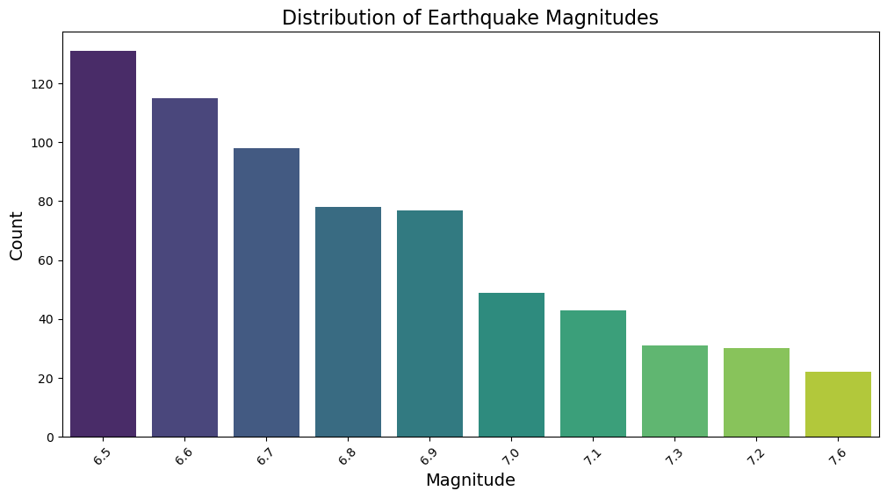
    


```python
c_order = df['country'].value_counts().head(10).index

plt.figure(figsize=(15, 5))

sns.set(style="whitegrid")
sns.countplot(x='country', data=df, order=c_order, palette='Set2')
plt.xticks(rotation=60, fontsize=12)
plt.xlabel('Country', fontsize=14)
plt.ylabel('Count', fontsize=14)
plt.title('Top 10 Earthquake Prone Countries', fontsize=16)
plt.show()


#Indonesia faced the highest number of earthquakes.
```


    
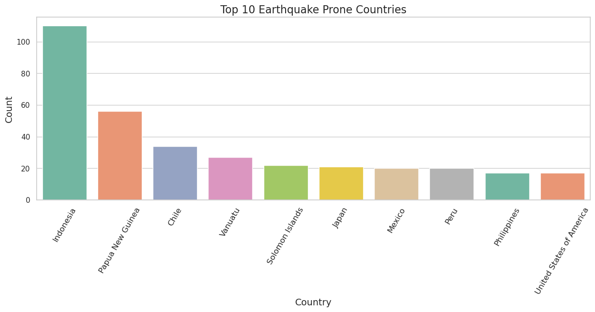
    


```python
c_order = df['country'].value_counts().head(10).index

plt.figure(figsize=(15, 5))

sns.set(style="whitegrid")

sns.countplot(x='country', data=df, order=c_order, hue='tsunami', palette='Set2')

plt.xticks(rotation=60, fontsize=12)
plt.xlabel('Country', fontsize=14)
plt.ylabel('Count', fontsize=14)
plt.title('Tsunami Chance in Top 10 Earthquake Prone Countries', fontsize=16)
plt.legend(title='Tsunami', title_fontsize='13', fontsize='12')
#Indonesia has the highest number of earthquakes worldwide, but Papua New Guinea and Philippines  has a very high risk of tsunamis following an earthquake.
```


    <matplotlib.legend.Legend at 0x78cfa11ffa90>


    
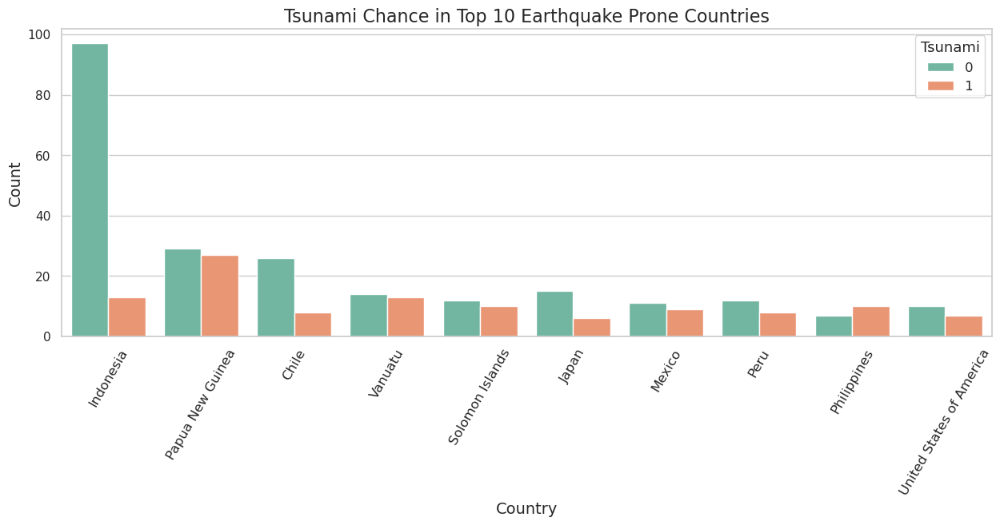
    


```python

```


```python
country_count = df.groupby('country')['tsunami'].value_counts().unstack(fill_value=0)
country_count.columns = ['No Tsunami', 'Tsunami']
country_count['Earthquick']=country_count['No Tsunami']+country_count['Tsunami']
country_count['Tsunami Probability']=round((country_count['Tsunami']/country_count['Earthquick'])*100,2)

# Filter out countries with a minimum number of earthquakes
threshold = 5
filtered_country=country_count[country_count['Earthquick']>threshold]
top_15_tsunami_countries=filtered_country.sort_values(by='Tsunami Probability',ascending=False).head(15)
print(top_15_tsunami_countries[['Tsunami Probability', 'Earthquick']])


```

                              Tsunami Probability  Earthquick
    country                                                  
    Fiji                                    88.89           9
    Ecuador                                 66.67           6
    Philippines                             58.82          17
    New Zealand                             55.56           9
    Taiwan                                  50.00           6
    Papua New Guinea                        48.21          56
    Vanuatu                                 48.15          27
    Solomon Islands                         45.45          22
    Mexico                                  45.00          20
    United States of America                41.18          17
    Peru                                    40.00          20
    Russia                                  33.33          15
    Japan                                   28.57          21
    Chile                                   23.53          34
    Indonesia                               11.82         110


```python
plt.figure(figsize=(15, 5))
ax=sns.barplot(x=top_15_tsunami_countries.index, y=top_15_tsunami_countries['Tsunami Probability'], palette='Set2')
plt.xticks(rotation=60, fontsize=12)
plt.xlabel('Country', fontsize=14)
plt.ylabel('Tsunami Probability (%)', fontsize=14)
plt.title('Top 15 Countries with Highest Tsunami Probability After Earthquakes(atleast 5)', fontsize=16)

for p in ax.patches:
    height = p.get_height()
    ax.annotate(f'{height:.1f}%', (p.get_x() + p.get_width() / 2., p.get_height()+3),
                ha='center', va='center',fontsize=12, color='black')

```


    
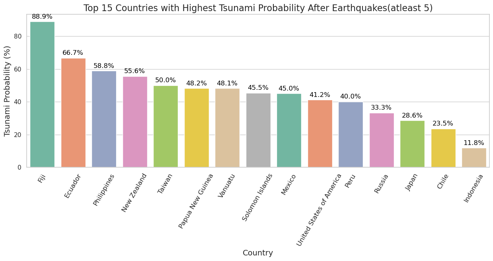
    


```python
sns.countplot(x='net',data=df,palette='Set2')
plt.title('Earthquake Data Contributor', fontsize=16)
plt.xlabel('Data Contributor', fontsize=14)
plt.ylabel('Number of Earthquakes', fontsize=14)
#The US is a major contributor of earthquake data
plt.show()
```


    
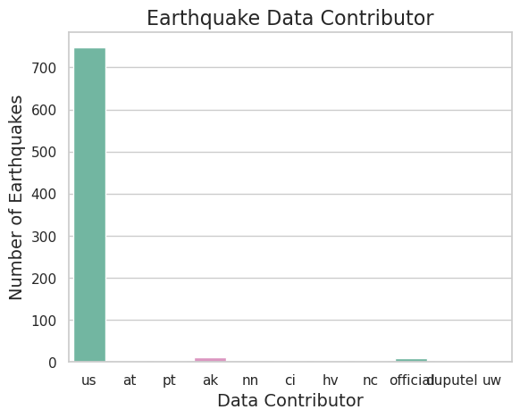
    


```python
sns.countplot(x='tsunami', data=df, palette='Set2')

plt.title('Tsunami Distribution', fontsize=16)
plt.xlabel('Tsunami Occurrence', fontsize=14)
plt.ylabel('Count', fontsize=14)
```


    Text(0, 0.5, 'Count')


    
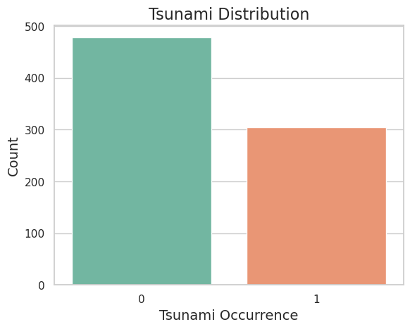
    


```python
plt.figure(figsize=(15, 7))

top_years = df['Year'].value_counts().head(15).index
sns.countplot(x='Year', data=df, order=top_years, palette='Set2')
plt.title('Top 15 Years with the Highest Number of Earthquakes', fontsize=16)
plt.xlabel('Year', fontsize=14)
plt.ylabel('Number of Earthquakes', fontsize=14)

plt.xticks(rotation=45, ha='right')

plt.show()
#In 2015 and 2013, the world experienced the highest number of earthquakes. 
```


    
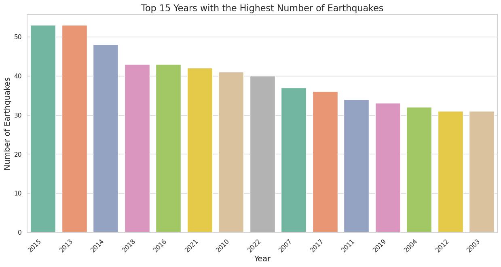
    


```python
Papua=df[df['country']=='Papua New Guinea']

plt.figure(figsize=(20, 5))
sns.countplot(x='Year', data=Papua, hue='tsunami', palette='Set2')

plt.title('Number of Earthquakes Encountered in Papua New Guinea Per Year', fontsize=16)
plt.xlabel('Year', fontsize=14)
plt.ylabel('Number of Earthquakes', fontsize=14)

plt.xticks(rotation=45, ha='right')

plt.legend(title='Tsunami Occurrence')
#Papua New Guinea experiences at least one earthquake per year but before 2013 Papua New Guinea never experienced tsunami after earthquick 
```


    <matplotlib.legend.Legend at 0x78cf9efd0d00>


    
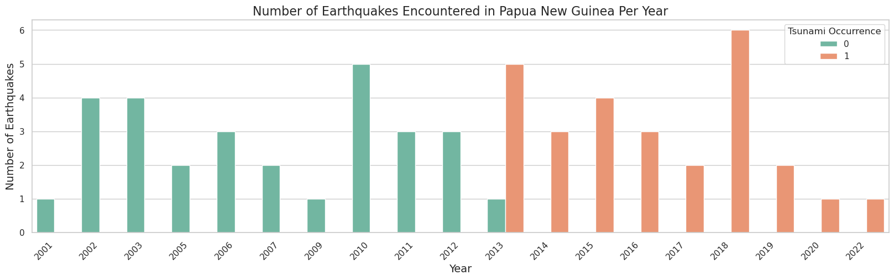
    


```python
Indo = df[df['country'] == 'Indonesia']
plt.figure(figsize=(20, 5))
sns.countplot(x='Year', data=Indo, hue='tsunami', palette='Set2')
plt.title('Number of Earthquakes Encountered in Indonesia Per Year', fontsize=16)
plt.xlabel('Year', fontsize=14)
plt.ylabel('Number of Earthquakes', fontsize=14)
plt.xticks(rotation=45, ha='right')
plt.legend(title='Tsunami Occurrence')
plt.show()
#Indonesia encountered 13 earthquic in the year 2007
```


    
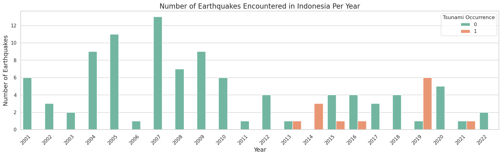
    


```python

Phi = df[df['country'] == 'Philippines']
plt.figure(figsize=(20, 5))
sns.countplot(x='Year', data=Phi, hue='tsunami', palette='Set2')
plt.title('Number of Earthquakes Encountered in the Philippines Per Year', fontsize=16)
plt.xlabel('Year', fontsize=14)
plt.ylabel('Number of Earthquakes', fontsize=14)
plt.xticks(rotation=45, ha='right')
plt.legend(title='Tsunami Occurrence')
plt.show()
# The Philippines has experienced all of tsunamis in recent years(After 2013) following earthquakes.
```


    
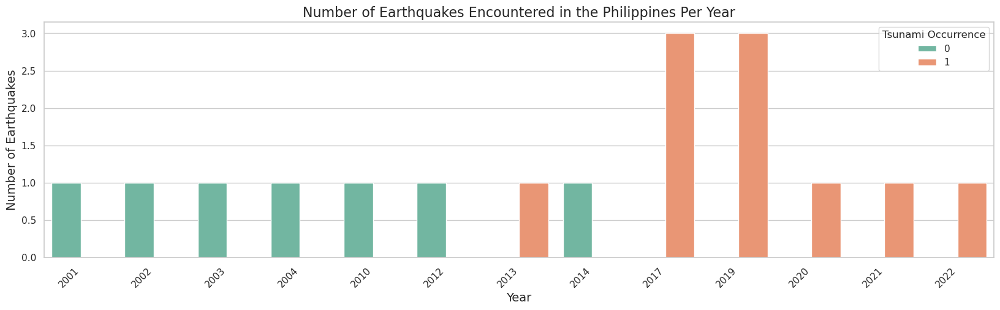
    


```python
Van = df[df['country'] == 'Vanuatu']
plt.figure(figsize=(20, 5))
sns.countplot(x='Year', data=Van, hue='tsunami', palette='Set2')
plt.title('Number of Earthquakes Encountered in Vanuatu Per Year', fontsize=16)
plt.xlabel('Year', fontsize=14)
plt.ylabel('Number of Earthquakes', fontsize=14)
plt.xticks(rotation=45, ha='right')
plt.legend(title='Tsunami Occurrence')
plt.show()
```


    
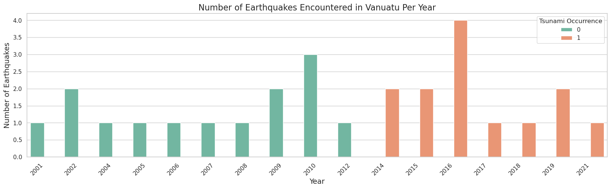
    


### Note:
## After examining the countries most affected by tsunamis, we can conclude that there has been a significant change in climate. Most earthquake-prone countries are facing a greater chance of tsunamis following earthquakes, especially after 2013.

# FEATURE ENGINEERING


```python
df.head()
```


<div>
<style scoped>
    .dataframe tbody tr th:only-of-type {
        vertical-align: middle;
    }

    .dataframe tbody tr th {
        vertical-align: top;
    }

    .dataframe thead th {
        text-align: right;
    }
</style>
<table border="1" class="dataframe">
  <thead>
    <tr style="text-align: right;">
      <th></th>
      <th>magnitude</th>
      <th>cdi</th>
      <th>mmi</th>
      <th>tsunami</th>
      <th>sig</th>
      <th>net</th>
      <th>nst</th>
      <th>dmin</th>
      <th>gap</th>
      <th>magType</th>
      <th>depth</th>
      <th>latitude</th>
      <th>longitude</th>
      <th>country</th>
      <th>Year</th>
      <th>Month</th>
    </tr>
  </thead>
  <tbody>
    <tr>
      <th>0</th>
      <td>7.0</td>
      <td>8</td>
      <td>7</td>
      <td>1</td>
      <td>768</td>
      <td>us</td>
      <td>117</td>
      <td>0.509</td>
      <td>17.0</td>
      <td>mww</td>
      <td>14.000</td>
      <td>-9.7963</td>
      <td>159.596</td>
      <td>Solomon Islands</td>
      <td>2022</td>
      <td>11</td>
    </tr>
    <tr>
      <th>1</th>
      <td>6.9</td>
      <td>4</td>
      <td>4</td>
      <td>0</td>
      <td>735</td>
      <td>us</td>
      <td>99</td>
      <td>2.229</td>
      <td>34.0</td>
      <td>mww</td>
      <td>25.000</td>
      <td>-4.9559</td>
      <td>100.738</td>
      <td>NaN</td>
      <td>2022</td>
      <td>11</td>
    </tr>
    <tr>
      <th>2</th>
      <td>7.0</td>
      <td>3</td>
      <td>3</td>
      <td>1</td>
      <td>755</td>
      <td>us</td>
      <td>147</td>
      <td>3.125</td>
      <td>18.0</td>
      <td>mww</td>
      <td>579.000</td>
      <td>-20.0508</td>
      <td>-178.346</td>
      <td>Fiji</td>
      <td>2022</td>
      <td>12</td>
    </tr>
    <tr>
      <th>3</th>
      <td>7.3</td>
      <td>5</td>
      <td>5</td>
      <td>1</td>
      <td>833</td>
      <td>us</td>
      <td>149</td>
      <td>1.865</td>
      <td>21.0</td>
      <td>mww</td>
      <td>37.000</td>
      <td>-19.2918</td>
      <td>-172.129</td>
      <td>NaN</td>
      <td>2022</td>
      <td>11</td>
    </tr>
    <tr>
      <th>4</th>
      <td>6.6</td>
      <td>0</td>
      <td>2</td>
      <td>1</td>
      <td>670</td>
      <td>us</td>
      <td>131</td>
      <td>4.998</td>
      <td>27.0</td>
      <td>mww</td>
      <td>624.464</td>
      <td>-25.5948</td>
      <td>178.278</td>
      <td>NaN</td>
      <td>2022</td>
      <td>9</td>
    </tr>
  </tbody>
</table>
</div>


```python
df.drop('country',axis=1,inplace=True)#we have latitude and longitude
```


```python
obj=df.select_dtypes(include=['object'])
obj
#we can drop net because 95% of data contributed by US 
```


<div>
<style scoped>
    .dataframe tbody tr th:only-of-type {
        vertical-align: middle;
    }

    .dataframe tbody tr th {
        vertical-align: top;
    }

    .dataframe thead th {
        text-align: right;
    }
</style>
<table border="1" class="dataframe">
  <thead>
    <tr style="text-align: right;">
      <th></th>
      <th>net</th>
      <th>magType</th>
    </tr>
  </thead>
  <tbody>
    <tr>
      <th>0</th>
      <td>us</td>
      <td>mww</td>
    </tr>
    <tr>
      <th>1</th>
      <td>us</td>
      <td>mww</td>
    </tr>
    <tr>
      <th>2</th>
      <td>us</td>
      <td>mww</td>
    </tr>
    <tr>
      <th>3</th>
      <td>us</td>
      <td>mww</td>
    </tr>
    <tr>
      <th>4</th>
      <td>us</td>
      <td>mww</td>
    </tr>
    <tr>
      <th>...</th>
      <td>...</td>
      <td>...</td>
    </tr>
    <tr>
      <th>777</th>
      <td>us</td>
      <td>mwc</td>
    </tr>
    <tr>
      <th>778</th>
      <td>ak</td>
      <td>mw</td>
    </tr>
    <tr>
      <th>779</th>
      <td>us</td>
      <td>mwb</td>
    </tr>
    <tr>
      <th>780</th>
      <td>us</td>
      <td>mwc</td>
    </tr>
    <tr>
      <th>781</th>
      <td>us</td>
      <td>mwc</td>
    </tr>
  </tbody>
</table>
<p>782 rows × 2 columns</p>
</div>


```python
obj.nunique()
```


    net        11
    magType     9
    dtype: int64


```python
obj.drop('net',axis=1,inplace=True)
df.drop(['net','magType'],axis=1,inplace=True)
from sklearn.preprocessing import LabelEncoder
lr=LabelEncoder()
obj_lbl=obj.apply(lr.fit_transform)
df=pd.concat([df,obj_lbl],axis=1)
df.head()
```


<div>
<style scoped>
    .dataframe tbody tr th:only-of-type {
        vertical-align: middle;
    }

    .dataframe tbody tr th {
        vertical-align: top;
    }

    .dataframe thead th {
        text-align: right;
    }
</style>
<table border="1" class="dataframe">
  <thead>
    <tr style="text-align: right;">
      <th></th>
      <th>magnitude</th>
      <th>cdi</th>
      <th>mmi</th>
      <th>tsunami</th>
      <th>sig</th>
      <th>nst</th>
      <th>dmin</th>
      <th>gap</th>
      <th>depth</th>
      <th>latitude</th>
      <th>longitude</th>
      <th>Year</th>
      <th>Month</th>
      <th>magType</th>
    </tr>
  </thead>
  <tbody>
    <tr>
      <th>0</th>
      <td>7.0</td>
      <td>8</td>
      <td>7</td>
      <td>1</td>
      <td>768</td>
      <td>117</td>
      <td>0.509</td>
      <td>17.0</td>
      <td>14.000</td>
      <td>-9.7963</td>
      <td>159.596</td>
      <td>2022</td>
      <td>11</td>
      <td>8</td>
    </tr>
    <tr>
      <th>1</th>
      <td>6.9</td>
      <td>4</td>
      <td>4</td>
      <td>0</td>
      <td>735</td>
      <td>99</td>
      <td>2.229</td>
      <td>34.0</td>
      <td>25.000</td>
      <td>-4.9559</td>
      <td>100.738</td>
      <td>2022</td>
      <td>11</td>
      <td>8</td>
    </tr>
    <tr>
      <th>2</th>
      <td>7.0</td>
      <td>3</td>
      <td>3</td>
      <td>1</td>
      <td>755</td>
      <td>147</td>
      <td>3.125</td>
      <td>18.0</td>
      <td>579.000</td>
      <td>-20.0508</td>
      <td>-178.346</td>
      <td>2022</td>
      <td>12</td>
      <td>8</td>
    </tr>
    <tr>
      <th>3</th>
      <td>7.3</td>
      <td>5</td>
      <td>5</td>
      <td>1</td>
      <td>833</td>
      <td>149</td>
      <td>1.865</td>
      <td>21.0</td>
      <td>37.000</td>
      <td>-19.2918</td>
      <td>-172.129</td>
      <td>2022</td>
      <td>11</td>
      <td>8</td>
    </tr>
    <tr>
      <th>4</th>
      <td>6.6</td>
      <td>0</td>
      <td>2</td>
      <td>1</td>
      <td>670</td>
      <td>131</td>
      <td>4.998</td>
      <td>27.0</td>
      <td>624.464</td>
      <td>-25.5948</td>
      <td>178.278</td>
      <td>2022</td>
      <td>9</td>
      <td>8</td>
    </tr>
  </tbody>
</table>
</div>


```python
d=df.corr()
d=d[(d>0.3) | (d<-0.3)]
plt.figure(figsize=(20,10))
sns.heatmap(d,annot=True)
```


    <Axes: >


    
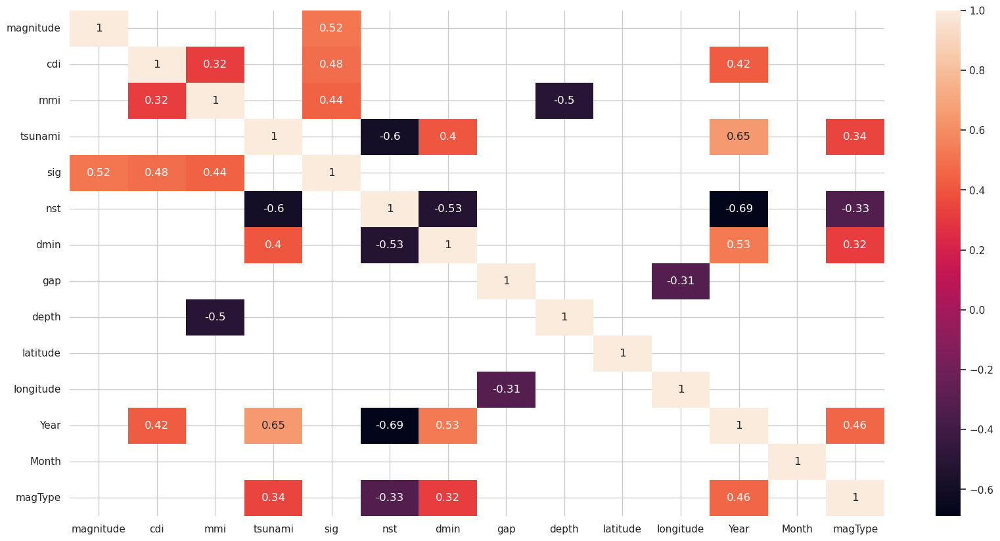
    


# SCALING AND MODEL BUILDING

## Logistic Regression vs Linear Regression


```python
from sklearn.linear_model import LogisticRegression
from sklearn.tree import DecisionTreeClassifier
from sklearn.ensemble import RandomForestClassifier
from sklearn.model_selection import train_test_split,GridSearchCV
from sklearn.metrics import accuracy_score, classification_report, confusion_matrix
from imblearn.over_sampling import RandomOverSampler,SMOTE
from imblearn.under_sampling import RandomUnderSampler
from sklearn.preprocessing import StandardScaler
from sklearn.linear_model import LinearRegression
import xgboost as xgb
```


```python
sc=StandardScaler()
x=df.drop('tsunami',axis=1)
y=df['tsunami']
x_scaled=sc.fit_transform(x)
x=pd.DataFrame(x_scaled,columns=x.columns)
x_train,x_test,y_train,y_test=train_test_split(x,y,test_size=0.2)
```


```python

sc = StandardScaler()

x=df.drop('tsunami',axis=1)
y=df['tsunami']
x_scaled=sc.fit_transform(x)
x=pd.DataFrame(x_scaled,columns=x.columns)
x_train,x_test,y_train,y_test=train_test_split(x,y,test_size=0.2)
```


```python
sns.countplot(x=y,data=df)
```


    <Axes: xlabel='tsunami', ylabel='count'>


    
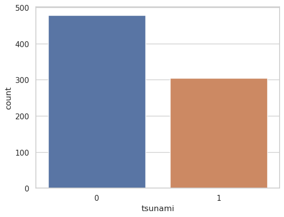
    


# DEALING WITH IMBALANCE DATA


```python
sm=SMOTE()
x_train,y_train=sm.fit_resample(x_train,y_train)
```


```python
x_train.head()
```


<div>
<style scoped>
    .dataframe tbody tr th:only-of-type {
        vertical-align: middle;
    }

    .dataframe tbody tr th {
        vertical-align: top;
    }

    .dataframe thead th {
        text-align: right;
    }
</style>
<table border="1" class="dataframe">
  <thead>
    <tr style="text-align: right;">
      <th></th>
      <th>magnitude</th>
      <th>cdi</th>
      <th>mmi</th>
      <th>sig</th>
      <th>nst</th>
      <th>dmin</th>
      <th>gap</th>
      <th>depth</th>
      <th>latitude</th>
      <th>longitude</th>
      <th>Year</th>
      <th>Month</th>
      <th>magType</th>
    </tr>
  </thead>
  <tbody>
    <tr>
      <th>0</th>
      <td>-0.092369</td>
      <td>0.525974</td>
      <td>-1.343693</td>
      <td>-0.422358</td>
      <td>-0.920899</td>
      <td>3.173666</td>
      <td>0.948427</td>
      <td>-0.431398</td>
      <td>-2.269280</td>
      <td>-0.644532</td>
      <td>1.430546</td>
      <td>0.334697</td>
      <td>0.589322</td>
    </tr>
    <tr>
      <th>1</th>
      <td>-0.990783</td>
      <td>-1.368018</td>
      <td>0.024494</td>
      <td>-0.683018</td>
      <td>0.342959</td>
      <td>-0.597892</td>
      <td>-1.034260</td>
      <td>-0.378187</td>
      <td>0.369710</td>
      <td>-1.216932</td>
      <td>-1.522433</td>
      <td>-1.696490</td>
      <td>-0.378850</td>
    </tr>
    <tr>
      <th>2</th>
      <td>-0.316972</td>
      <td>0.210309</td>
      <td>-0.659599</td>
      <td>-0.487523</td>
      <td>1.282853</td>
      <td>-0.597892</td>
      <td>0.047957</td>
      <td>0.540252</td>
      <td>-0.708646</td>
      <td>0.977562</td>
      <td>-1.030270</td>
      <td>0.044527</td>
      <td>-1.347022</td>
    </tr>
    <tr>
      <th>3</th>
      <td>0.356838</td>
      <td>0.210309</td>
      <td>0.708588</td>
      <td>-0.279616</td>
      <td>0.586931</td>
      <td>-0.597892</td>
      <td>-0.414670</td>
      <td>-0.480236</td>
      <td>-0.451554</td>
      <td>0.888998</td>
      <td>-0.374052</td>
      <td>-1.116151</td>
      <td>-0.378850</td>
    </tr>
    <tr>
      <th>4</th>
      <td>1.704459</td>
      <td>1.157305</td>
      <td>2.076775</td>
      <td>0.579941</td>
      <td>-0.920899</td>
      <td>-0.133832</td>
      <td>0.783203</td>
      <td>-0.389850</td>
      <td>-0.883568</td>
      <td>-1.044803</td>
      <td>0.282165</td>
      <td>-1.116151</td>
      <td>0.589322</td>
    </tr>
  </tbody>
</table>
</div>


```python
models = {
    "Logistic regression":LogisticRegression(),
    "Linear Regression": LinearRegression(),
}
```

# RESULT


```python
for name, model in models.items():
    model.fit(x_train, y_train)
    raw_pred = model.predict(x_test)

    # convert continuous outputs from LinearRegression to binary labels
    if isinstance(model, LinearRegression) or name.lower().startswith('linear'):
        p = (raw_pred >= 0.5).astype(int)
    else:
        p = raw_pred

    print("Model: " , name)
    print("------------------------------")
    print(classification_report(y_test, p))
    print(".........................................................|")
```

    Model:  Logistic regression
    ------------------------------
                  precision    recall  f1-score   support
    
               0       0.93      0.80      0.86        88
               1       0.78      0.93      0.85        69
    
        accuracy                           0.85       157
       macro avg       0.86      0.86      0.85       157
    weighted avg       0.87      0.85      0.85       157
    
    .........................................................|
    Model:  Linear Regression
    ------------------------------
                  precision    recall  f1-score   support
    
               0       0.95      0.78      0.86        88
               1       0.77      0.94      0.85        69
    
        accuracy                           0.85       157
       macro avg       0.86      0.86      0.85       157
    weighted avg       0.87      0.85      0.85       157
    
    .........................................................|


- Interpretation / conclusions
  - Both models perform nearly identically on main metrics (accuracy and f1). LinearRegression forced into classification (thresholding) yields results very similar to LogisticRegression after SMOTE.
  - LogisticRegression is preferable conceptually for classification because it provides calibrated probabilities and is designed for binary classification; LinearRegression was adapted by thresholding.
  - Both models show a trade-off: very high precision for class 0 and very high recall for class 1 — the models are good at detecting tsunami events (high recall for class 1) but produce some false positives (precision ~0.71–0.72).

- Short recommendations / next steps
  - Prefer LogisticRegression for interpretability and calibrated probabilities; use ensemble models (RandomForest / XGBoost) if higher accuracy is the priority (they previously performed better).
  - Further evaluation: compute ROC-AUC, precision–recall curve, and run cross-validation to check metric stability.
  - Consider probability calibration, and tune decision threshold according to the cost of false negatives vs false positives.
  - Inspect feature importances / coefficients and apply feature selection if needed.
